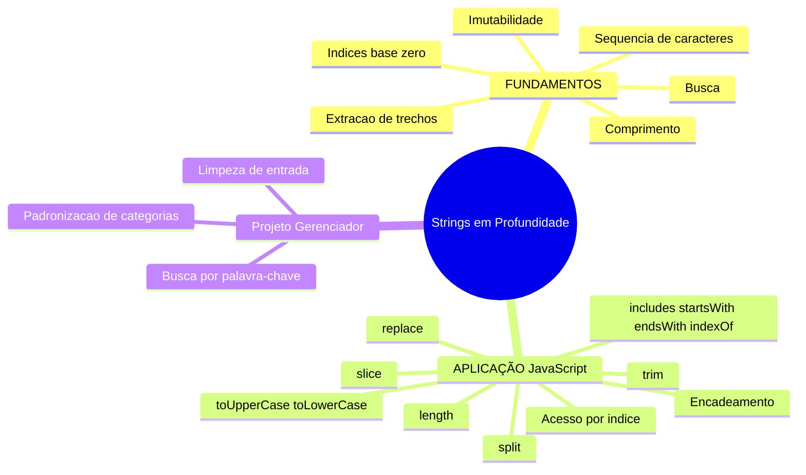
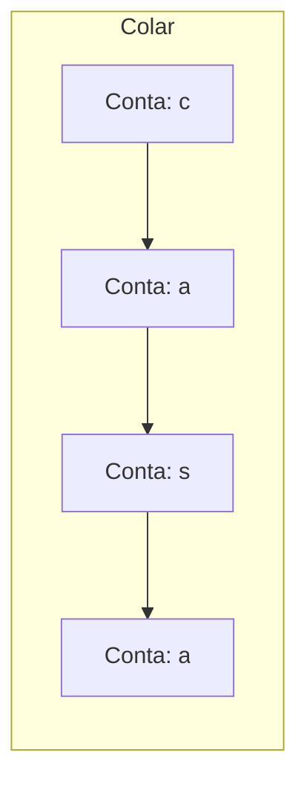
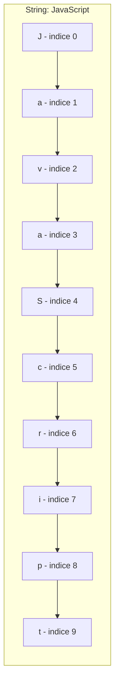
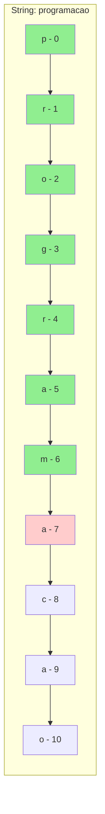
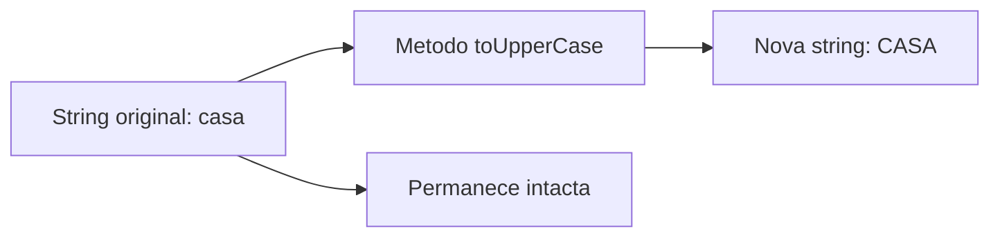

# JavaScript — Do Zero ao Profissional — Aula 06

## Strings em Profundidade — Manipulação e Métodos

**Duração estimada:** 100 minutos (55 de leitura + 45 de prática)
**Nível:** Iniciante
**Pré-requisitos:** Aula 01 (console.log) + Aula 02 (let, const) + Aula 03 (tipo string, typeof) + Aula 04 (operadores, ===) + Aula 05 (prompt, alert, template literals, Number, isNaN)

---

## Objetivos de Aprendizagem

Ao final desta aula, você será capaz de:

- [ ] **Definir** uma string como uma sequência ordenada de caracteres, usando a analogia do colar de contas
- [ ] **Explicar** o conceito de índice — cada caractere ocupa uma posição numerada que começa em 0, não em 1
- [ ] **Usar** `.length` para descobrir o número de caracteres de uma string
- [ ] **Acessar** caracteres individuais de uma string por meio de índices com `string[0]`
- [ ] **Explicar** o princípio de imutabilidade — strings nunca são alteradas no lugar; métodos SEMPRE retornam uma nova string
- [ ] **Aplicar** `.toUpperCase()`, `.toLowerCase()` e `.trim()` para transformar strings
- [ ] **Usar** `.slice()` para extrair trechos específicos de uma string
- [ ] **Aplicar** `.includes()`, `.startsWith()`, `.endsWith()` e `.indexOf()` para buscar conteúdo em uma string
- [ ] **Usar** `.split()` para dividir uma string em partes e `.replace()` para substituir trechos
- [ ] **Encadear** múltiplos métodos em uma única expressão e integrar os novos métodos ao Gerenciador de Tarefas

---

## Como Usar Esta Aula

Esta aula está organizada em duas partes que se complementam.

Na **primeira parte** (seções 1 a 6), você vai entender strings como sequências de caracteres — o que são, como se numeram as posições, como se mede o comprimento. São conceitos universais, valem para QUALQUER linguagem de programação. A analogia principal é o **colar de contas**: cada conta é um caractere, o colar inteiro é a string. Zero JavaScript por enquanto.

Na **segunda parte** (seções 7 a 15), você vai aprender os métodos de string do JavaScript — `.length`, `.toUpperCase()`, `.toLowerCase()`, `.trim()`, `.slice()`, `.includes()`, `.startsWith()`, `.endsWith()`, `.indexOf()`, `.split()`, `.replace()` e como encadeá-los. Cada método tem prática guiada no Console.

Na **seção 16**, você vai aplicar TUDO ao Gerenciador de Tarefas — validar entrada, buscar palavras-chave, padronizar categorias.

Cada seção termina com um **Quick Check**. As respostas estão logo abaixo. Tente responder de cabeça antes de olhar.

> *"Nas aulas anteriores, você aprendeu a conversar com o usuário. Agora vai aprender a TRATAR a mensagem — limpar, buscar, transformar, extrair. Seu programa vai virar um especialista em texto."*

---

## Mapa Mental



---

## Recapitulação das Aulas Anteriores

| Aula | Conceito | Onde aparece nesta aula | Como se conecta |
|---|---|---|---|
| Aula 01 | **console.log()** | Seções 7 a 16 | Continuamos usando console.log para inspecionar o resultado dos métodos |
| Aula 02 | **Variáveis (let/const)** | Seções 7 a 16 | Guardamos strings em variáveis para aplicar métodos nelas |
| Aula 03 | **Tipo string, typeof** | Seções 7, 8, 9 | Strings já são familiares; agora vamos manipulá-las com métodos |
| Aula 04 | **Operadores de comparação (===)** | Seções 12, 16 | Compararemos resultados de .includes() com === e verificaremos .indexOf() contra -1 |
| Aula 05 | **prompt(), alert()** | Seções 10, 11, 12, 16 | Os métodos de string serão aplicados sobre valores recebidos via prompt() |
| Aula 05 | **Template literals (`\${}`)** | Seções 11, 15, 16 | Usaremos template literals para exibir resultados dos métodos |
| Aula 05 | **Number(), isNaN()** | Seção 16 | Já sabemos converter tipos; agora strings ganham métodos próprios |

---

**FUNDAMENTOS: Sequências, Índices e Busca**

> *Os conceitos desta seção são universais — valem para qualquer linguagem de programação, em qualquer computador. Na segunda parte, você verá como o JavaScript implementa cada um deles. Por enquanto, vamos entender o que significa "manipular uma sequência de caracteres". Sem código. Só a ideia pura.*

---

## 1. O que é uma string?

Você já usou strings nas aulas anteriores. Escreveu `"olá"`, `"João"`, `"123"`. Mas o que é uma string **por dentro**?

Uma **string** é uma **sequência ordenada de caracteres**. Vamos desembrulhar cada palavra desta definição.

### Sequência

Sequência significa que os caracteres vêm UM DEPOIS DO OUTRO, em fila. Não é um amontoado bagunçado — há uma ordem definida. O caractere A vem antes do B, que vem antes do C.

### Ordenada

A ordem importa. `"casa"` é diferente de `"saca"` — as mesmas letras em ordem diferente produzem palavras diferentes. A ordem define o significado.

### Caracteres

Caractere é qualquer símbolo que você pode digitar: letras (a, B, ç), números (7, 3), espaços em branco ( ), pontuação (?, !, .), símbolos (@, #, $). TUDO que tem uma tecla no seu teclado é um caractere.

### A analogia do colar de contas

Imagine um colar de contas. Cada conta é um caractere. O colar inteiro — com todas as contas na ordem certa — é a string.

Para a string `"casa"`, imagine 4 contas: a primeira é "c", a segunda é "a", a terceira é "s", a quarta é "a". O colar `"casa"` é diferente do colar `"saca"`, mesmo usando as mesmas contas — porque a ORDEM mudou.



> *Você pode estar pensando: "mas por que isso importa?". Porque quando você for buscar, extrair ou transformar partes de uma string, você vai usar a POSIÇÃO de cada caractere. A string não é um bloco único — é uma fila de itens individuais, cada um no seu lugar.*

### Exemplos do cotidiano

- Seu nome: `"Maria"` é uma string de 5 caracteres
- Um email: `"joao@email.com"` é uma string de 14 caracteres
- Uma placa de carro: `"ABC-1234"` é uma string de 8 caracteres
- Uma frase: `"Bom dia!"` é uma string de 8 caracteres (espaço e exclamação contam!)

### Quick Check 1

**1. O que é uma string? Dê dois exemplos do cotidiano.**
**Resposta:** Uma string é uma sequência ordenada de caracteres. Exemplos: um nome ("Maria"), um endereço de email ("joao@email.com"), o número de um documento ("123.456.789-00").

**2. Um espaço em branco é um caractere? E um número dentro de uma string?**
**Resposta:** Sim. Um espaço em branco é um caractere como qualquer outro — ocupa uma posição na sequência. Números dentro de uma string também são caracteres (o símbolo "5", não o valor matemático 5). Na string "Rua 7", temos 5 caracteres: R, u, a, espaço, 7.

---

## 2. Índices — cada caractere tem uma posição

Se uma string é um colar de contas, cada conta ocupa uma posição específica no colar. Essa posição se chama **índice** (em inglês, *index*).

### O índice começa em 0

Esta é uma das regras MAIS IMPORTANTES da programação e a fonte de MUITOS erros para iniciantes: **o primeiro caractere está no índice 0, não no índice 1.**

Por quê? Porque o índice representa o **deslocamento** desde o início da string. Para chegar ao primeiro caractere, você não precisa se deslocar — você já está lá. Deslocamento 0. Para chegar ao segundo, você se desloca 1 posição. Para chegar ao décimo, deslocamento 9.

Pense num hotel onde o térreo é o andar 0, o primeiro andar é o 1, o segundo é o 2. O térreo não é o andar 1 — é o ponto de partida.

### Como os índices funcionam

Vamos usar o colar da string `"casa"`:

| Caractere | c | a | s | a |
|---|---|---|---|---|
| Índice | 0 | 1 | 2 | 3 |

- A letra "c" está no índice **0**
- A letra "a" está no índice **1**
- A letra "s" está no índice **2**
- A última letra "a" está no índice **3**

### O último índice é SEMPRE comprimento − 1

Se a string tem 4 caracteres (`"casa"`), o último índice é 3. Se tem 10 caracteres (`"JavaScript"`), o último índice é 9. A fórmula é simples: **último índice = comprimento − 1**.



> *"Mas por que 0? Não seria mais natural começar do 1?"* — Você não é a primeira pessoa a perguntar isso. Programadores iniciantes SEMPRE estranham o índice 0. Com o tempo, você se acostuma e passa a achar estranho quando algo começa do 1. É uma convenção da computação que existe desde as primeiras linguagens (C, Assembly). E tem um motivo prático: o índice é o DESLOCAMENTO — "quantos passos dou desde o início".

### Erro comum: achar que o primeiro índice é 1

Muita gente pensa: "casa" → c=1, a=2, s=3, a=4.

Mas na verdade é: "casa" → c=0, a=1, s=2, a=3.

Se você gravar que índices começam em 0, metade dos seus erros com strings vai desaparecer.

### Quick Check 2

**1. Na string "JavaScript", qual caractere está no índice 0? E no índice 4?**
**Resposta:** Índice 0: "J". Índice 4: "S" (J=0, a=1, v=2, a=3, S=4).

**2. Por que os índices começam em 0 e não em 1?**
**Resposta:** Porque o índice representa o deslocamento desde o início da string. Para chegar ao primeiro caractere, você não precisa se deslocar — está a 0 passos do início. Para chegar ao segundo, você se desloca 1 posição. É como medir distância a partir de um ponto de partida.

---

## 3. Comprimento — quantos caracteres tem a sequência

Toda string tem um **comprimento** — o número total de caracteres que a formam. É como o número de contas do colar.

### O que conta como caractere?

TUDO conta como caractere:
- Letras (maiúsculas e minúsculas)
- Números
- Espaços em branco
- Pontuação (., !, ?, :)
- Símbolos (@, #, $, %)
- Acentos e caracteres especiais (á, é, ç, ã)

### Exemplos

| String | Caracteres (contando um por um) | Comprimento |
|---|---|---|
| `"olá"` | o, l, á | 3 |
| `"bom dia"` | b, o, m, espaço, d, i, a | 7 |
| `""` | (nenhum) | 0 (string vazia) |
| `"   "` | espaço, espaço, espaço | 3 |
| `"João Silva"` | J, o, ã, o, espaço, S, i, l, v, a | 10 |

> *Atenção: acentos CONTAM como parte do caractere! "ã" é um caractere único, não dois. O computador trata "ã" como uma unidade.*

### Relação entre comprimento e último índice

Esta relação é matemática e IMPORTANTE:
- Último índice = comprimento − 1
- Comprimento = último índice + 1

Se uma string tem comprimento 5, os índices disponíveis são: 0, 1, 2, 3, 4.

Se você tentar acessar o índice 5 de uma string de comprimento 5, você está FORA do intervalo — o índice 5 não existe. O último caractere está no índice 4.

### Por que o comprimento importa?

O comprimento é a primeira coisa que você consulta sobre uma string. Ele responde perguntas como:
- "O email tem pelo menos 5 caracteres?"
- "A senha tem mais de 8 caracteres?"
- "A string está vazia?" (comprimento = 0)
- "Qual o último índice?" (comprimento − 1)

### Quick Check 3

**1. Qual o comprimento da string "João Silva"? (Conte manualmente.)**
**Resposta:** 10 caracteres: J, o, ã, o, espaço, S, i, l, v, a. O espaço conta como um caractere.

**2. Se uma string tem comprimento 5, qual é o índice do último caractere?**
**Resposta:** 4. O índice do último caractere é sempre (comprimento − 1). Se comprimento = 5, os índices são 0, 1, 2, 3, 4.

---

## 4. Extrair partes de uma sequência

Muitas vezes você não quer a string inteira — você quer apenas um PEDAÇO dela. Extrair um trecho é como **cortar uma fatia de um bolo** ou **selecionar um trecho de texto com o mouse**.

### A regra da fatia

Você escolhe dois pontos no bolo:
1. O **ponto de início** — onde a faca entra (INCLUSO na fatia)
2. O **ponto de fim** — onde a faca para (EXCLUSO da fatia)

Usando índices: você extrai do índice **início** até o índice **fim**, mas o caractere no índice **fim** NÃO é incluído.

### Notação matemática

Em programação, esta regra se escreve: **[início, fim)** — início está incluso, fim está excluso.

O parêntese `)` significa "exclusivo" — o fim não entra.

### Exemplo com "programação"

| p | r | o | g | r | a | m | a | ç | ã | o |
|---|---|---|---|---|---|---|---|---|---|---|
| 0 | 1 | 2 | 3 | 4 | 5 | 6 | 7 | 8 | 9 | 10 |

- Extrair do índice 0 ao 7: pega os caracteres nos índices 0, 1, 2, 3, 4, 5, 6 → `"program"`
- Extrair do índice 3 ao 6: pega os caracteres nos índices 3, 4, 5 → `"gra"`
- Extrair do índice 0 ao 1: pega o caractere no índice 0 → `"p"`

### Visualizando a fatia



> *Trecho [0, 7) → "program". Os índices 0 a 6 estão inclusos (verde). O índice 7 está excluso (vermelho).*

### Por que o fim é excluso?

Pode parecer estranho, mas esta convenção simplifica um cálculo IMPORTANTE:

**Quantos caracteres foram extraídos?** = `fim − início`

Extrair [0, 7) → 7 − 0 = 7 caracteres (índices 0, 1, 2, 3, 4, 5, 6)
Extrair [3, 6) → 6 − 3 = 3 caracteres (índices 3, 4, 5)

Se o fim fosse incluso, você teria que fazer `fim − início + 1` toda vez — mais complicado.

### Erro comum: incluir o índice final

Muita gente pensa: "extrair do índice 0 ao 4 → pega os caracteres 0, 1, 2, 3, 4 (5 caracteres)". Na verdade, extrair [0, 4) pega os caracteres 0, 1, 2, 3 (4 caracteres). O índice 4 NÃO entra.

Pense como "até antes do índice 4" — você para no 4, não inclui o 4.

### Quick Check 4

**1. Na string "JavaScript", quais caracteres estão entre os índices 0 e 4?**
**Resposta:** "Java" (índices 0, 1, 2, 3 — J, a, v, a). O índice 4 ("S") NÃO é incluído.

**2. Se eu quiser extrair os 3 primeiros caracteres de qualquer string, quais índices eu uso?**
**Resposta:** Índices 0 a 3 (início=0, fim=3). Isso extrai os caracteres nos índices 0, 1 e 2 — exatamente os 3 primeiros. A quantidade é 3 − 0 = 3 caracteres.

---

## 5. Buscar dentro de uma sequência

Você tem um texto e quer saber se uma palavra específica está lá dentro. Ou se o texto começa com uma saudação. Ou termina com um ponto final. Ou em qual posição uma palavra aparece.

Buscar dentro de strings é **como procurar uma palavra num livro**. Você folheia até encontrar.

### Quatro tipos de busca

**1. "Contém?"** — A string contém um determinado trecho em QUALQUER posição?
- Frase: "aprendendo a programar"
- Pergunta: contém "programar"? SIM
- Pergunta: contém "Python"? NÃO

**2. "Começa com?"** — A string começa exatamente com um trecho específico?
- Frase: "aprendendo a programar"
- Pergunta: começa com "aprendendo"? SIM
- Pergunta: começa com "programar"? NÃO

**3. "Termina com?"** — A string termina exatamente com um trecho específico?
- Frase: "aprendendo a programar"
- Pergunta: termina com "programar"? SIM
- Pergunta: termina com "aprendendo"? NÃO

**4. "Em qual posição?"** — Em qual índice começa um determinado trecho?
- Frase: "aprendendo a programar"
- Pergunta: onde começa "programar"? Índice 13
- Pergunta: onde começa "Python"? Em lugar nenhum (não existe)

### Exemplo visual

Frase: `"Bom dia, mundo!"`

| B | o | m | espaço | d | i | a | , | espaço | m | u | n | d | o | ! |
|---|---|---|---|---|---|---|---|---|---|---|---|---|---|---|
| 0 | 1 | 2 | 3 | 4 | 5 | 6 | 7 | 8 | 9 | 10 | 11 | 12 | 13 | 14 |

- Contém "dia"? SIM — começa no índice 4
- Começa com "Bom"? SIM (índices 0, 1, 2)
- Termina com "!"? SIM (índice 14)
- Posição de "mundo"? Índice 9

### Por que a busca é importante?

Buscar dentro de strings é uma das operações MAIS COMUNS em programação. Exemplos:

- Validar email: contém "@"?
- Verificar senha: tem pelo menos 8 caracteres?
- Filtrar mensagens: começa com "[SPAM]"?
- Extrair dados de um texto: encontrar a posição do ":" para separar chave de valor
- Buscar produtos: o nome do produto contém o termo pesquisado?

### Quick Check 5

**1. Na string "Bom dia, mundo!", a substring "dia" está presente? Em qual posição ela começa?**
**Resposta:** Sim, "dia" está presente. Ela começa no índice 4 (B=0, o=1, m=2, espaço=3, d=4).

**2. A string "programar" começa com "pro" e termina com "mar"?**
**Resposta:** Sim, começa com "pro" (índices 0-2) e termina com "mar" (índices 6-8, os 3 últimos caracteres). "pro" + "gramar" — o prefixo confere. "progra" + "mar" — o sufixo também confere.

---

## 6. Transformar a sequência e imutabilidade

Strings podem ser TRANSFORMADAS. Você pode:
- Converter para **maiúsculas** (caixa alta)
- Converter para **minúsculas** (caixa baixa)
- **Remover espaços** das bordas
- **Substituir** um trecho por outro
- **Dividir** a string em partes

### Mas com uma regra fundamental: IMUTABILIDADE

**Imutabilidade** significa que a string original NUNCA é alterada. Uma vez criada, ela permanece exatamente como estava para sempre.

Toda transformação CRIA uma NOVA string. A original continua intacta.

### A analogia da foto revelada

Imagine que você tem uma foto impressa. Você quer aplicar um filtro preto e branco. O que você faz? Tira uma cópia da foto e aplica o filtro na cópia. A foto original continua na gaveta, perfeita, intacta.

A string original é a foto na gaveta. O método de transformação é o filtro. O resultado é uma NOVA string.

Se você quiser guardar o resultado transformado, você precisa colocá-lo em algum lugar — numa variável, por exemplo.



### As quatro transformações universais

**1. MAIÚSCULAS** — converter todos os caracteres para caixa alta
- "olá" → "OLÁ"
- Como se você estivesse GRITANDO o texto

**2. minúsculas** — converter todos os caracteres para caixa baixa
- "GRITO" → "grito"
- Como se você estivesse SUSSURRANDO o texto

**3. Limpeza de bordas** — remover espaços em branco do início e do fim
- "  olá  " → "olá"
- Como aparar as beiradas de uma foto — o conteúdo central permanece

**4. Substituição** — trocar um trecho por outro
- "gato" substituir "g" por "p" → "pato"
- Como corrigir uma palavra num rascunho, mas o rascunho original continua lá

**5. Divisão** — quebrar a string em partes usando um separador
- "a,b,c" separado por "," → ["a", "b", "c"] (três partes)
- Como cortar uma pizza em fatias

### Regra de ouro da imutabilidade

> *Toda operação sobre uma string gera uma NOVA string. A original permanece inalterada. SEMPRE.*

Isso significa que se você fizer:

```
string → aplicar maiúsculas → resultado aparece na hora
string → consultar string original → ainda está como antes
```

A string original é como uma certidão de nascimento: você pode fazer mil cópias, carimbar, plastificar — a certidão original continua exatamente igual.

### Quick Check 6

**1. O que significa dizer que strings são imutáveis?**
**Resposta:** Significa que uma vez criada, uma string nunca é alterada. Qualquer operação (transformar em maiúsculas, extrair um trecho, substituir) produz uma NOVA string — a original permanece exatamente como foi criada.

**2. Se eu tenho a string "  olá  " e aplico uma operação que remove os espaços das bordas, a string original "  olá  " continua existindo?**
**Resposta:** Sim. A operação cria uma NOVA string "olá" (sem espaços). A string original "  olá  " continua intacta — ela não foi alterada. Se você quiser usar o valor limpo, precisa guardá-lo em uma variável.

---

**APLICAÇÃO: Manipulação de Strings em JavaScript**

> *Agora que você entende strings como sequências de caracteres com índices, comprimento, extração, busca, transformação e imutabilidade, vamos conectar cada conceito à sua implementação em JavaScript. Cada seção a seguir mapeia um conceito universal da Parte 1 para o método ou propriedade JavaScript correspondente. Abra seu editor e seu navegador — você vai testar cada método no Console.*

---

## 7. Strings em JavaScript e .length

Chegou a hora de CONECTAR os conceitos universais que você aprendeu com o JavaScript.

Em JavaScript, toda string tem uma **propriedade** chamada `.length` que informa o **comprimento** — quantos caracteres ela tem.

### Propriedade vs método

Esta é uma distinção importante:

- **Propriedade**: `.length` — você APENAS consulta. Não leva parênteses. É como a etiqueta de tamanho numa camisa: você olha e pronto.
- **Método**: `.toUpperCase()` — você EXECUTA uma ação. Leva parênteses. É como um botão que você aperta.

### .length na prática

Abra o Console do navegador (F12, aba Console) e digite:

```javascript
console.log("JavaScript".length);
// Resultado: 10
```

A string "JavaScript" tem 10 caracteres. `.length` retorna 10.

```javascript
console.log("".length);
// Resultado: 0 (string vazia)
```

Uma string vazia `""` não tem caracteres. `.length` retorna 0.

```javascript
console.log("olá mundo".length);
// Resultado: 9 (o espaço conta!)
```

"olá mundo" tem 9 caracteres: o, l, á, espaço, m, u, n, d, o. O espaço entre as palavras CONTA como caractere.

### Usando .length com variáveis

```javascript
let nome = "Maria";
console.log(`"${nome}" tem ${nome.length} caracteres.`);
// Resultado: "Maria" tem 5 caracteres.
```

Aqui você usou template literal (crases com `${}`) para montar uma frase que inclui o comprimento da string. O template literal foi aprendido na Aula 05 — lembra? É a forma mais legível de montar mensagens.

### Strings com acentos

```javascript
console.log("coração".length);
// Resultado: 7 (c, o, r, a, ç, ã, o)
```

Acentos NÃO contam como caracteres separados. "ç" é um caractere, "ã" é um caractere. O JavaScript conta cada caractere como uma unidade.

### Mão na Massa — Testando .length

Abra o Console e teste com suas próprias strings:

```javascript
// Teste 1: seu nome
let meuNome = "Maria"; // Troque pelo seu nome
console.log(meuNome.length);

// Teste 2: string com espaços
let frase = "  teste  ";
console.log(frase.length); // 9? Conte: espaço, espaço, t, e, s, t, e, espaço, espaço

// Teste 3: string vazia
console.log("".length); // 0

// Teste 4: números dentro de string
console.log("12345".length); // 5

// Teste 5: relação comprimento-último índice
let palavra = "casa";
console.log(`Comprimento: ${palavra.length}, Último índice: ${palavra.length - 1}`);
```

### Verificação

- [ ] Entendi que `.length` é uma propriedade (sem parênteses)
- [ ] Sei que espaços e acentos contam como caracteres
- [ ] Sei que o último índice é sempre `length − 1`
- [ ] Testei no Console com minhas próprias strings

### Erro comum: usar .length com parênteses

```javascript
// ERRADO:
console.log("JavaScript".length()); // TypeError: "JavaScript".length is not a function

// CERTO:
console.log("JavaScript".length); // 10
```

`.length` NÃO leva parênteses porque é uma propriedade, não um método. Se você colocar `()`, o JavaScript tenta CHAMAR `.length` como se fosse uma função, o que dá erro.

### Quick Check 7

**1. Qual a diferença entre `.length` e um método como os que você verá a seguir?**
**Resposta:** `.length` é uma propriedade (não leva parênteses) — você apenas consulta o valor. Métodos como `.toUpperCase()` levam parênteses e executam uma ação. `.length` responde "quantos caracteres tem?"; métodos transformam ou analisam.

**2. O que `"".length` retorna? E `"   ".length` (três espaços)?**
**Resposta:** `"".length` retorna 0 (string vazia não tem caracteres). `"   ".length` retorna 3 (três espaços — espaços são caracteres).

---

## 8. Acessando caracteres por índice

Lembra dos índices que começam em 0 (Seção 2)? Agora vamos ACESSAR caracteres individuais de uma string usando esses índices.

Em JavaScript, você usa **colchetes** `[índice]` para acessar um caractere em uma posição específica.

### Sintaxe

```javascript
let palavra = "JavaScript";
console.log(palavra[0]);  // "J" — primeiro caractere
console.log(palavra[4]);  // "S" — quinto caractere (índice 4!)
```

A string `"JavaScript"` tem 10 caracteres. Os índices vão de 0 a 9.

| J | a | v | a | S | c | r | i | p | t |
|---|---|---|---|---|---|---|---|---|---|
| 0 | 1 | 2 | 3 | 4 | 5 | 6 | 7 | 8 | 9 |

```javascript
palavra[0]  // "J"
palavra[1]  // "a"
palavra[2]  // "v"
palavra[3]  // "a"
palavra[4]  // "S"
palavra[5]  // "c"
palavra[6]  // "r"
palavra[7]  // "i"
palavra[8]  // "p"
palavra[9]  // "t"
```

### Acessando o último caractere

O último caractere está sempre no índice `length − 1`:

```javascript
let palavra = "JavaScript";
let ultimoIndice = palavra.length - 1; // 9
console.log(palavra[ultimoIndice]);     // "t"
console.log(palavra[palavra.length - 1]); // "t" — feito em uma linha
```

### E se o índice não existir?

```javascript
let palavra = "casa";
console.log(palavra[0]);   // "c" — existe, primeiro caractere
console.log(palavra[3]);   // "a" — existe, último caractere
console.log(palavra[4]);   // undefined — NÃO existe! A string só tem índices 0 a 3
console.log(palavra[99]);  // undefined — muito fora do intervalo
```

Quando você tenta acessar um índice que não existe, o JavaScript retorna `undefined`. É um valor especial que significa "isso não existe". NÃO dá erro — apenas retorna `undefined`.

### Método alternativo: .charAt()

Existe também o método `.charAt(indice)` que faz a mesma coisa:

```javascript
let palavra = "JavaScript";
console.log(palavra.charAt(0)); // "J"
console.log(palavra.charAt(9)); // "t"
```

Diferença: quando o índice não existe, `.charAt()` retorna uma string vazia `""` em vez de `undefined`:

```javascript
console.log(palavra[99]);         // undefined
console.log(palavra.charAt(99));  // "" (string vazia)
```

### Mão na Massa — Acessando por índice

Abra o Console e teste:

```javascript
let cidade = "Brasília";

// Acessar caracteres
console.log(cidade[0]);   // "B"
console.log(cidade[3]);   // "s"
console.log(cidade[7]);   // "i"

// Acessar o último caractere
console.log(cidade[cidade.length - 1]); // "a"

// Acessar o primeiro caractere (sempre índice 0)
console.log(cidade[0]); // "B"

// Testar índice inexistente
console.log(cidade[50]); // undefined
console.log(cidade.charAt(50)); // ""
```

### Verificação

- [ ] Entendi que índices começam em 0
- [ ] Sei acessar o último caractere com `string[string.length - 1]`
- [ ] Sei que índices inválidos retornam `undefined`
- [ ] Testei no Console com várias strings

### Quick Check 8

**1. Se `let nome = "Ana"`, qual o valor de `nome[1]` e por quê?**
**Resposta:** `nome[1]` retorna `"n"`. O índice 0 é "A", o índice 1 é "n", o índice 2 é "a". O primeiro caractere está no índice 0.

**2. Como acessar o último caractere de qualquer string, independentemente do comprimento?**
**Resposta:** `string[string.length - 1]`. Se `length` é 5, o último índice é 4. A fórmula `length - 1` sempre dá o índice do último caractere.

---

## 9. Imutabilidade em JavaScript

Lembra da Seção 6? Strings são IMUTÁVEIS. Uma vez criadas, nunca são alteradas. Em JavaScript, essa regra é ABSOLUTA.

### O que isso significa na prática?

NENHUM método de string modifica a string original. TODOS retornam um valor novo.

Vamos VER isso acontecendo:

```javascript
let original = "casa";
let gritando = original.toUpperCase();

console.log(original);  // "casa" — continua intacta!
console.log(gritando);  // "CASA" — nova string
```

`original.toUpperCase()` retornou uma NOVA string `"CASA"`. A variável `original` continua valendo `"casa"`. Se você quiser usar o valor transformado, precisa guardá-lo em outra variável (ou na mesma, mas aí você perde o original).

### Tentar modificar por índice NÃO FUNCIONA

Você PODE pensar: "e se eu fizer `texto[0] = 'X'` para alterar o primeiro caractere?".

Não funciona. JavaScript permite que você tente, mas ignora silenciosamente:

```javascript
let texto = "ola";
texto[0] = "O";  // Tentando modificar... vai funcionar?
console.log(texto); // "ola" — continua igual!
```

Sem erro. Sem aviso. O JavaScript simplesmente IGNOROU a tentativa. A string permaneceu inalterada.

> *Isso já pegou MUITOS programadores. Você faz uma alteração, o código não dá erro, mas a string continua igual. Você fica 30 minutos procurando o problema. Agora você sabe: strings são imutáveis, você precisa SEMPRE guardar o resultado.*

### A regra dos dois logs

Sempre que usar um método de string, faça dois `console.log`:

```javascript
let teste = "  JavaScript  ";

// 1. Antes de aplicar o método
console.log("ANTES:", teste);

// 2. O resultado do método
console.log("RESULTADO:", teste.trim());

// 3. Depois — a original mudou?
console.log("DEPOIS:", teste); // Continua "  JavaScript  "!
```

Isso comprova a imutabilidade. A string original nunca muda.

### Como guardar o resultado transformado

```javascript
let entrada = "  texto sujo  ";
let limpo = entrada.trim();   // Guarda o resultado em NOVA variável

console.log(entrada);  // "  texto sujo  " (original)
console.log(limpo);    // "texto sujo" (transformado)

// OU: reatribuir à mesma variável (perde o original)
let valor = "  teste  ";
valor = valor.trim();  // Agora valor contém "teste" (original foi sobrescrito)
```

### Mão na Massa — Comprovando imutabilidade

```javascript
let mensagem = "Olá, Mundo!";

// Etapa 1: guarde a string original
console.log("Original:", mensagem);

// Etapa 2: aplique um método e guarde o resultado
let resultado = mensagem.toUpperCase();
console.log("Resultado:", resultado);

// Etapa 3: verifique a original
console.log("Original ainda existe:", mensagem);
console.log("São iguais?", mensagem === resultado); // false! São strings diferentes
```

### Verificação

- [ ] Entendi que strings são imutáveis
- [ ] Sei que métodos SEMPRE retornam uma nova string
- [ ] Sei que `texto[0] = "X"` não funciona
- [ ] Sei guardar o resultado de um método em uma variável

### Quick Check 9

**1. O que acontece com a string original quando você chama `.toUpperCase()` nela?**
**Resposta:** NADA. A string original permanece inalterada. `.toUpperCase()` CRIA e RETORNA uma nova string com todos os caracteres em maiúsculas. Se você quiser usar o valor transformado, precisa guardá-lo em uma variável.

**2. Por que `let t = "abc"; t[0] = "Z"; console.log(t);` ainda mostra "abc"?**
**Resposta:** Porque strings são imutáveis — você não pode alterar um caractere individual por índice. A atribuição `t[0] = "Z"` é silenciosamente ignorada. Para obter uma string modificada, você precisa usar métodos que retornam uma nova string.

---

## 10. Transformação — .toUpperCase(), .toLowerCase(), .trim()

Agora vamos aplicar as transformações universais da Seção 6 em JavaScript. Três métodos essenciais:

### .toUpperCase() — Tudo em maiúsculas

```javascript
console.log("olá".toUpperCase());  // "OLÁ"
console.log("javascript".toUpperCase()); // "JAVASCRIPT"
console.log("123 abc".toUpperCase()); // "123 ABC" — números não mudam
console.log("coração".toUpperCase()); // "CORAÇÃO" — acentos preservados
```

### .toLowerCase() — Tudo em minúsculas

```javascript
console.log("GRITO".toLowerCase());  // "grito"
console.log("JavaScript".toLowerCase()); // "javascript"
console.log("OLÁ MUNDO".toLowerCase()); // "olá mundo"
```

### .trim() — Remove espaços das pontas

```javascript
console.log("  limpo  ".trim());     // "limpo" — espaços do início e fim removidos
console.log("  a b c  ".trim());     // "a b c" — espaços do MEIO permanecem!
console.log("   ".trim());           // "" — string vazia (só tinha espaços)
console.log("JavaScript".trim());    // "JavaScript" — sem espaços, nada muda
```

> *IMPORTANTE: `.trim()` remove apenas espaços do INÍCIO e do FIM. Espaços entre palavras SÃO PRESERVADOS. `"  a  b  ".trim()` retorna `"a  b"`.*

### Uso prático: normalização de entrada

O uso MAIS COMUM desses três métodos combinados é **normalizar a entrada do usuário**:

```javascript
let entrada = prompt("Digite seu nome:");
let normalizado = entrada.trim().toLowerCase();
console.log(`"${entrada}" → "${normalizado}"`);
```

O que acontece aqui?
1. `prompt()` recebe o que o usuário digitou (ex: "  Maria  ")
2. `.trim()` remove espaços das bordas → "Maria"
3. `.toLowerCase()` converte para minúsculas → "maria"

Isso é extremamente útil porque usuários digitam de forma imprevisível. Uns colocam espaços extras, outros escrevem em MAIÚSCULAS, outros em minúsculas. Normalizar a entrada permite COMPARAR de forma consistente.

### Mão na Massa — Testando transformações

Abra o Console e execute:

```javascript
// 1. Teste .toUpperCase()
console.log("aprendendo JavaScript".toUpperCase());

// 2. Teste .toLowerCase()
console.log("APRENDENDO JAVASCRIPT".toLowerCase());

// 3. Teste .trim() em vários casos
console.log(`[${"  texto  ".trim()}]`);        // [texto]
console.log(`[${"  a  b  ".trim()}]`);         // [a  b] — espaços internos mantidos
console.log(`[${"sem_espacos".trim()}]`);       // [sem_espacos]
console.log(`[${"   ".trim()}]`);               // [] — string vazia

// 4. Combine trim com toLowerCase
let resposta = prompt("Digite 'sim' para continuar:");
if (resposta.trim().toLowerCase() === "sim") {
    console.log("Usuário disse sim!");
} else {
    console.log("Usuário disse não.");
}
```

### Erro comum: achar que .trim() remove espaços do meio

```javascript
// ERRADO: esperar que .trim() remova TODOS os espaços
let frase = "  texto com  espaços  ";
console.log(frase.trim());
// "texto com  espaços" — espaços do MEIO permanecem!

// Para remover TODOS os espaços, precisaria de outro método (Seção 14: replace)
```

### Quick Check 10

**1. O que `"  JavaScript  ".trim()` retorna?**
**Resposta:** `"JavaScript"` — os espaços do início e do fim são removidos. Os espaços do meio (se houvesse mais de uma palavra) seriam preservados.

**2. Se `let resposta = prompt("Digite:").trim().toLowerCase()`, o que acontece se o usuário digitar "  SIM  "?**
**Resposta:** `prompt()` retorna `"  SIM  "`, `.trim()` remove os espaços das bordas produzindo `"SIM"`, `.toLowerCase()` converte para `"sim"`. O valor final da variável `resposta` é a string `"sim"`. Os métodos são aplicados em sequência: cada um recebe o resultado do anterior.

---

## 11. Extração — .slice(inicio, fim)

Lembra da Seção 4 sobre fatias? O JavaScript implementa isso com o método `.slice()`.

### Sintaxe

```javascript
string.slice(inicio, fim)
```

- `inicio`: índice do primeiro caractere INCLUSO
- `fim`: índice do primeiro caractere EXCLUÍDO (opcional — se omitido, vai até o final)

### Exemplos práticos

```javascript
let texto = "JavaScript";

console.log(texto.slice(0, 4));   // "Java" (índices 0, 1, 2, 3)
console.log(texto.slice(4, 10));  // "Script" (índices 4, 5, 6, 7, 8, 9)
console.log(texto.slice(4));      // "Script" (do índice 4 até o fim)
console.log(texto.slice(0, 1));   // "J" (só o primeiro caractere)
```

### Regra mnemônica: [início, fim)

Exatamente como na Seção 4: início incluso, fim excluso.

`"JavaScript".slice(0, 4)` extrai os caracteres nos índices 0, 1, 2, 3 — NÃO inclui o índice 4.

### Índices negativos

`.slice()` aceita ÍNDICES NEGATIVOS, que contam a partir do FINAL da string:

```javascript
let texto = "JavaScript";

console.log(texto.slice(-6));      // "Script" — 6 últimos caracteres
console.log(texto.slice(-3));      // "ipt" — 3 últimos caracteres
console.log(texto.slice(-6, -1));  // "Scrip" — do 6º de trás ao 1º de trás (exclusive)
```

Índice negativo -1 é o ÚLTIMO caractere. -2 é o penúltimo. E assim por diante.

### .slice() com variáveis e prompt()

```javascript
let frase = prompt("Digite uma frase:");
let primeiros5 = frase.slice(0, 5);
console.log(`Os 5 primeiros caracteres são: "${primeiros5}"`);
```

### .slice() NUNCA altera a string original

```javascript
let original = "programação";
let pedaco = original.slice(0, 7);

console.log(original);  // "programação" — intacta!
console.log(pedaco);    // "program" — nova string
```

### E se os índices forem inválidos?

```javascript
console.log("olá".slice(0, 100));  // "olá" — fim maior que o comprimento: vai até o final
console.log("olá".slice(10, 20));  // "" — início maior que o comprimento: string vazia
console.log("olá".slice(5, 3));   // "" — início maior que o fim: string vazia
```

JavaScript é "permissivo" com `.slice()` — em vez de dar erro, ele simplesmente retorna uma string vazia ou vai até onde consegue.

### Mão na Massa — Testando .slice()

```javascript
let palavra = "JavaScript";

// Extraia:
console.log(palavra.slice(0, 4));   // "Java"
console.log(palavra.slice(4));      // "Script"
console.log(palavra.slice(-6));     // "Script"
console.log(palavra.slice(0, 1));   // "J"
console.log(palavra.slice(-1));     // "t" — último caractere

// Teste com sua própria string
let nome = prompt("Digite seu nome:");
console.log(`Primeira letra: "${nome.slice(0, 1)}"`);
console.log(`Última letra: "${nome.slice(-1)}"`);
console.log(`Do meio: "${nome.slice(1, -1)}"`); // Tudo menos primeiro e último
```

### Verificação

- [ ] Entendi que `.slice()` extrai um trecho, não modifica a original
- [ ] Sei que `inicio` é incluso e `fim` é excluso
- [ ] Sei usar índices negativos para contar do final
- [ ] Testei no Console com exemplos variados

### Quick Check 11

**1. O que `"programação".slice(0, 7)` retorna?**
**Resposta:** `"program"`. Extrai do índice 0 ao 6 (7 caracteres, porque 7 − 0 = 7). O índice 7 ("a") NÃO é incluído.

**2. Como extrair os 3 primeiros caracteres de uma string? E os 3 últimos?**
**Resposta:** 3 primeiros: `string.slice(0, 3)`. 3 últimos: `string.slice(-3)`. O índice negativo conta do final para o início: -3 significa "o terceiro caractere de trás para frente". `slice(-3)` extrai desse ponto até o final.

---

## 12. Busca e verificação — .includes(), .startsWith(), .endsWith(), .indexOf()

Lembra da Seção 5? As quatro operações de busca — contém, começa com, termina com, posição. Agora em JavaScript.

### .includes() — Contém?

```javascript
let frase = "aprendendo JavaScript";

console.log(frase.includes("Java"));     // true — encontrou!
console.log(frase.includes("Python"));   // false — não encontrou
console.log(frase.includes("aprend"));   // true
console.log(frase.includes(""));         // true — string vazia SEMPRE retorna true
```

`.includes()` retorna `true` ou `false`. É uma resposta de SIM ou NÃO.

> *Atenção: `.includes("")` SEMPRE retorna `true`. Porque toda string contém uma string vazia entre cada caractere. É uma curiosidade da linguagem — saiba disso para não se confundir.*

### .startsWith() — Começa com?

```javascript
let frase = "aprendendo JavaScript";

console.log(frase.startsWith("aprend"));   // true — começa com "aprend"
console.log(frase.startsWith("Java"));     // false — "Java" está no meio, não no início
console.log(frase.startsWith("aprendendo JavaScript")); // true — a string inteira!
```

### .endsWith() — Termina com?

```javascript
let frase = "aprendendo JavaScript";

console.log(frase.endsWith("Script"));  // true — termina com "Script"
console.log(frase.endsWith("Java"));    // false
console.log(frase.endsWith("!"));       // false — não tem exclamação no final
```

### .indexOf() — Em qual posição?

```javascript
let frase = "aprendendo JavaScript";

console.log(frase.indexOf("Java"));       // 11 — "Java" começa no índice 11
console.log(frase.indexOf("Python"));     // -1 — NÃO ENCONTROU!
console.log(frase.indexOf("a"));          // 0 — primeira ocorrência de "a"
console.log(frase.indexOf("e"));          // 5 — primeira ocorrência de "e"
```

`.indexOf()` retorna UM NÚMERO: o índice onde a substring começa, ou **-1** se não encontrar.

### A pegadinha do -1

-1 é um caso MUITO IMPORTANTE e fonte de ERROS CLÁSSICOS.

`indexOf` retorna -1 quando NÃO encontra. Isso é DIFERENTE de 0. 0 significa "encontrou no primeiro caractere" (índice 0). -1 significa "não encontrou em lugar nenhum".

```javascript
// ERRADO — esta verificação NÃO funciona:
if (frase.indexOf("Python")) {
    // Isso NUNCA vai executar para índice 0, porque 0 é "falsy"!
}

// CERTO — compare explicitamente com -1:
if (frase.indexOf("Python") === -1) {
    console.log("Palavra não encontrada");
}

// Para verificar se ENCONTROU:
if (frase.indexOf("Java") !== -1) {
    console.log("Palavra encontrada no índice", frase.indexOf("Java"));
}
```

> *Lembre-se: 0 é um índice VÁLIDO. "Encontrou no primeiro caractere" é DIFERENTE de "não encontrou". Sempre compare com `!== -1` para verificar se encontrou.*

### Comparação: .includes() vs .indexOf()

| Característica | .includes() | .indexOf() |
|---|---|---|
| Pergunta que responde | "Está aqui?" | "Onde está?" |
| Retorna | true ou false | Número (0, 5, -1, etc.) |
| Quando não encontra | false | -1 |
| Quando encontra no índice 0 | true | 0 |

Use `.includes()` quando você só precisa saber SIM/NÃO. Use `.indexOf()` quando precisa SABER A POSIÇÃO.

### Mão na Massa — Testando busca

```javascript
let nome = prompt("Digite seu nome completo:");

console.log(`Seu nome contém "Silva"? ${nome.includes("Silva")}`);
console.log(`Seu nome começa com "A"? ${nome.startsWith("A")}`);
console.log(`Seu nome termina com "o"? ${nome.endsWith("o")}`);
console.log(`Posição da primeira letra "a": ${nome.indexOf("a")}`);
console.log(`Posição da letra "z": ${nome.indexOf("z")}`); // -1 (não tem "z")
```

### Verificação

- [ ] Entendi que `.includes()` retorna true/false
- [ ] Entendi que `.indexOf()` retorna um número (ou -1)
- [ ] Sei que -1 significa "não encontrou"
- [ ] Sei que 0 é diferente de -1
- [ ] Sei usar `.startsWith()` e `.endsWith()`
- [ ] Testei todos os métodos no Console

### Quick Check 12

**1. Qual a diferença entre `.includes()` e `.indexOf()`?**
**Resposta:** `.includes("x")` retorna `true` ou `false` — responde "x está aqui?". `.indexOf("x")` retorna um número — a posição (índice) onde x começa, ou −1 se não encontrar. Use `.includes()` quando só precisa de sim/não. Use `.indexOf()` quando precisa SABER ONDE está.

**2. O que `"JavaScript".indexOf("Python")` retorna? E `"JavaScript".indexOf("J")`?**
**Resposta:** `"JavaScript".indexOf("Python")` retorna −1 (não encontrou). `"JavaScript".indexOf("J")` retorna 0 (encontrou no índice 0). ATENÇÃO: 0 é diferente de −1! 0 significa "encontrou no primeiro caractere"; −1 significa "não encontrou".

---

## 13. Divisão — .split(separador)

Lembra da Seção 6 sobre "dividir a string em partes"? Em JavaScript, isso é feito com `.split()`.

### O que .split() faz

`.split(separador)` divide uma string em PEDAÇOS usando um **delimitador** (o separador) e retorna uma **lista** (tecnicamente chamada de **array**) com os pedaços.

### Visualização: cortar pizza

A string inteira é a pizza. O separador é a faca. Cada fatia é um pedaço da string.

```javascript
console.log("a,b,c".split(","));   // ["a", "b", "c"] — 3 fatias, cortadas nas vírgulas
```

### Exemplos

```javascript
// Dividir por vírgula
console.log("João,Maria,Ana".split(","));  // ["João", "Maria", "Ana"]

// Dividir por espaço
console.log("João Maria Ana".split(" "));  // ["João", "Maria", "Ana"]

// Dividir por caractere (string vazia como separador)
console.log("JavaScript".split(""));       // ["J","a","v","a","S","c","r","i","p","t"]

// Separador não encontrado — retorna array com 1 item
console.log("uma frase".split("X"));       // ["uma frase"]
```

### O que é um array (lista)?

Você verá arrays em profundidade na Aula 09. Por enquanto, entenda que um **array** é uma **coleção ordenada de valores** entre colchetes `[]`.

- `["a", "b", "c"]` é um array com 3 itens
- Cada item pode ser acessado por índice: `["a", "b", "c"][0]` é `"a"`
- `.split()` SEMPRE retorna um array

### Contando as partes

Como `.split()` retorna um array, e arrays também têm `.length`, você pode contar quantas partes foram geradas:

```javascript
let dados = "nome:joao:idade:25".split(":");
console.log(dados);          // ["nome", "joao", "idade", "25"]
console.log(dados.length);   // 4 partes
```

### .split() com prompt() — processando entrada

```javascript
let entrada = prompt("Digite palavras separadas por espaço:");
let palavras = entrada.trim().split(" ");
console.log(`Você digitou ${palavras.length} palavras:`);
console.log(palavras);
```

### Mão na Massa — Testando .split()

```javascript
// 1. Dividir string por vírgula
let lista = "arroz,feijão,carne,salada";
console.log(lista.split(","));

// 2. Dividir string por espaço
let frase = "duas palavras";
console.log(frase.split(" "));

// 3. Dividir por caractere
console.log("abc".split(""));

// 4. Separador que não existe
console.log("teste".split("X"));

// 5. Contar palavras de uma frase
let texto = prompt("Digite uma frase:");
let contagem = texto.trim().split(" ").length;
console.log(`Sua frase tem ${contagem} palavras.`);
```

### Verificação

- [ ] Entendi que `.split()` divide usando um separador
- [ ] Sei que `.split()` retorna um array (lista entre colchetes)
- [ ] Sei usar `.split("")` para dividir em caracteres
- [ ] Sei contar as partes com `.length`
- [ ] Testei no Console com diferentes separadores

### Quick Check 13

**1. O que `"nome:joao:idade:25".split(":")` retorna?**
**Resposta:** Uma lista com 4 itens: `["nome", "joao", "idade", "25"]`. O separador `:` é removido — cada trecho entre dois-pontos vira um item da lista.

**2. Como você dividiria a string "JavaScript" em caracteres individuais?**
**Resposta:** `"JavaScript".split("")` — usar string vazia como separador divide a string caractere por caractere, resultando em `["J", "a", "v", "a", "S", "c", "r", "i", "p", "t"]`.

---

## 14. Substituição — .replace() e .replaceAll()

Lembra da Seção 6 sobre substituição? Em JavaScript, usamos `.replace()`.

### .replace(busca, substituicao) — Substitui a PRIMEIRA ocorrência

```javascript
console.log("JavaScript é legal".replace("legal", "incrível"));
// "JavaScript é incrível"

console.log("a a a".replace("a", "b"));
// "b a a" — só a PRIMEIRA ocorrência foi substituída!
```

### .replaceAll(busca, substituicao) — Substitui TODAS as ocorrências

```javascript
console.log("a a a".replaceAll("a", "b"));
// "b b b" — TODAS foram substituídas!
```

**Diferença fundamental:**
- `.replace()` substitui APENAS a primeira ocorrência
- `.replaceAll()` substitui TODAS as ocorrências

### Se a busca não for encontrada

```javascript
console.log("olá".replace("x", "y"));
// "olá" — a string original é retornada intacta
```

Nenhum erro. A string simplesmente não muda porque a busca não foi encontrada.

### Uso prático com validação

```javascript
let email = prompt("Digite seu email:").trim();
let emailFormatado = email.replace(" ", "");  // Remove o primeiro espaço (se houver)
console.log(`Email: "${emailFormatado}"`);
```

### Substituição e imutabilidade

```javascript
let original = "banana";
let substituida = original.replace("a", "o");

console.log(original);       // "banana" — intacta!
console.log(substituida);    // "bonana" — só a primeira ocorrência
```

### Mão na Massa — Testando .replace()

```javascript
// 1. Substituir palavra
console.log("Bom dia".replace("dia", "tarde"));   // "Bom tarde"

// 2. Só a primeira ocorrência
console.log("laranja".replace("a", "o"));         // "loranja"

// 3. replaceAll
console.log("laranja".replaceAll("a", "o"));      // "loronjo"

// 4. Substituir espaço por traço
let frase = "minha frase legal";
console.log(frase.replace(" ", "-"));              // "minha-frase legal" (só o 1º espaço)
console.log(frase.replaceAll(" ", "-"));           // "minha-frase-legal" (todos os espaços)
```

### Erro comum: achar que .replace() substitui todas

```javascript
// ERRADO:
console.log("banana".replace("a", "o"));  // "bonana" (só a 1ª)

// CERTO:
console.log("banana".replaceAll("a", "o")); // "bonono" (todas)
```

### Quick Check 14

**1. Qual a diferença entre `.replace("a", "b")` e `.replaceAll("a", "b")`?**
**Resposta:** `.replace()` substitui APENAS a primeira ocorrência de "a" por "b". `.replaceAll()` substitui TODAS as ocorrências. Ex: `"banana".replace("a", "o")` → `"bonana"` (só a primeira). `"banana".replaceAll("a", "o")` → `"bonono"` (todas).

**2. O que acontece se a substring que você quer substituir NÃO existe na string?**
**Resposta:** A string original é retornada intacta. Nenhum erro ocorre. Ex: `"olá".replace("x", "y")` retorna `"olá"` (como uma nova string, mas com o mesmo conteúdo).

---

## 15. Encadeamento de métodos (chaining)

Você já viu isso acontecer nas seções anteriores quando escrevemos `"  texto  ".trim().toLowerCase()`. Agora vamos entender formalmente o **encadeamento** de métodos.

### O que é encadeamento?

**Encadeamento** (em inglês, *chaining*) é aplicar vários métodos em SEQUÊNCIA, um após o outro. O resultado de cada método vira a entrada do próximo.

### A linha de montagem

Pense numa fábrica. A matéria-prima passa por várias estações:

1. Estação 1: recebe a peça bruta e **limpa as bordas** (como `.trim()`)
2. Estação 2: recebe a peça limpa e **aplica tinta azul** (como `.toLowerCase()`)
3. Estação 3: recebe a peça pintada e **corta um pedaço** (como `.slice()`)

Cada estação trabalha sobre o resultado da anterior. A peça original (matéria-prima) nunca é consumida — cada estação produz uma CÓPIA modificada.

### Como funciona no JavaScript

```javascript
let entrada = "   JavaScript É INCRÍVEL   ";
let resultado = entrada
    .trim()               // Remove espaços das bordas → "JavaScript É INCRÍVEL"
    .toLowerCase()        // Tudo minúsculo → "javascript é incrível"
    .replace("incrível", "poderoso")  // Substitui → "javascript é poderoso"
    .toUpperCase();       // Tudo maiúsculo → "JAVASCRIPT É PODEROSO"

console.log(resultado);  // "JAVASCRIPT É PODEROSO"
console.log(entrada);    // "   JavaScript É INCRÍVEL   " — intacta!
```

**Passo a passo da execução:**

1. `entrada` vale `"   JavaScript É INCRÍVEL   "`
2. `.trim()` retorna `"JavaScript É INCRÍVEL"` (sem espaços)
3. `.toLowerCase()` retorna `"javascript é incrível"` (sobre o resultado do trim)
4. `.replace("incrível", "poderoso")` retorna `"javascript é poderoso"` (sobre o resultado do anterior)
5. `.toUpperCase()` retorna `"JAVASCRIPT É PODEROSO"` (sobre o resultado do anterior)
6. O resultado final é guardado em `resultado`

### Que métodos podem ser encadeados?

A regra é simples: **métodos que retornam STRING** podem ser encadeados com outros métodos de string.

| Método | Retorna | Pode encadear? |
|---|---|---|
| `.trim()` | String | Sim |
| `.toUpperCase()` | String | Sim |
| `.toLowerCase()` | String | Sim |
| `.slice()` | String | Sim |
| `.replace()` | String | Sim |
| `.split()` | Array | NÃO (não é string) |
| `.includes()` | Boolean | NÃO |
| `.indexOf()` | Number | NÃO |

### Por que a ORDEM importa?

```javascript
// Ordem 1: trim → toLowerCase
let r1 = "  JAVASCRIPT  ".trim().toLowerCase();
console.log(r1); // "javascript"

// Ordem 2: toLowerCase → trim
let r2 = "  JAVASCRIPT  ".toLowerCase().trim();
console.log(r2); // "javascript" (mesmo resultado — a ordem não importa aqui)
```

Às vezes a ordem não muda o resultado. Outras vezes, muda COMPLETAMENTE:

```javascript
let texto = "  JavaScript  ";

// Faz sentido: trim primeiro, depois pegar os 9 primeiros caracteres
console.log(texto.trim().slice(0, 9)); // "JavaScrip"

// NÃO faz sentido: pegar os 9 primeiros (inclui espaços), depois trim
console.log(texto.slice(0, 9).trim()); // "JavaScri" (perdeu o 'p'!)
```

### Aplicação prática: normalizar entrada para comparação

```javascript
let resposta = prompt("Digite 'sim' para continuar:");
if (resposta.trim().toLowerCase() === "sim") {
    alert("Continuando...");
} else {
    alert("Operação cancelada.");
}
```

Este padrão — `.trim().toLowerCase()` — é EXTREMAMENTE comum em programação. Ele normaliza a entrada do usuário: remove espaços acidentais e converte para minúsculas, permitindo uma comparação uniforme.

### O que NÃO funciona

```javascript
// ERRADO: .includes() retorna boolean, não string
let texto = "JavaScript";
texto.includes("Java").toUpperCase();  // ERRO! true.toUpperCase() não existe

// CERTO: use primeiro o método de string, DEPOIS a busca
let resultado = texto.toUpperCase().includes("JAVA"); // true
```

### Mão na Massa — Construindo cadeias

```javascript
let frase = "  APRENDENDO JavaScript é muito legal  ";

// Cadeia 1: limpar, depois extrair
let limpa = frase.trim();
console.log(limpa);                          // "APRENDENDO JavaScript é muito legal"
let extraida = limpa.slice(0, 11).toLowerCase();
console.log(extraida);                       // "aprendendo"

// Cadeia 2: tudo em uma linha
console.log(
    frase
        .trim()
        .toLowerCase()
        .replace("javascript", "JS")
        .slice(0, 20)
);  // "aprendendo JS é mui"

// Cadeia 3: compare  "  JAVA  "  com "java"
let entradaUsuario = prompt("Digite 'java':");
let normalizada = entradaUsuario.trim().toLowerCase();
console.log(normalizada === "java");  // true, independente de maiúsculas/minúsculas/espaços
```

### Verificação

- [ ] Entendi o conceito de encadeamento (chaining)
- [ ] Sei que cada método opera sobre o resultado do anterior
- [ ] Sei que métodos que retornam string podem ser encadeados
- [ ] Sei que métodos que retornam boolean ou número NÃO podem
- [ ] Entendi que a ordem importa
- [ ] Testei cadeias de 3-4 métodos no Console

### Quick Check 15

**1. O que `"  olá  ".trim().toUpperCase()` retorna?**
**Resposta:** `"OLÁ"`. Primeiro `.trim()` remove os espaços → `"olá"`. Depois `.toUpperCase()` converte para maiúsculas → `"OLÁ"`. A ordem importa: se fosse `.toUpperCase().trim()`, o resultado seria o mesmo neste caso, mas a ordem sempre determina o que cada método recebe.

**2. Por que você NÃO pode encadear `.toUpperCase()` depois de `.includes()`?**
**Resposta:** Porque `.includes()` retorna um BOOLEAN (`true` ou `false`), não uma string. `.toUpperCase()` é um método de string e só funciona em strings. Tentar chamar `true.toUpperCase()` causa erro. Só encadeie métodos que retornam string com outros métodos de string.

---

## 16. Aplicação no Gerenciador de Tarefas

Chegou o MOMENTO de integrar TUDO que você aprendeu ao Gerenciador de Tarefas. Você vai atualizar o código da Aula 05 com validação de strings.

### O que vamos adicionar?

Três capacidades novas:

1. **Limpeza de entrada** — `.trim()` em todos os `prompt()` para remover espaços acidentais
2. **Busca por palavra-chave** — `.includes()` para detectar se a tarefa contém "urgente"
3. **Padronização de categoria** — `.toUpperCase()` para normalizar a prioridade

### Código completo do Gerenciador atualizado

Crie um novo arquivo HTML ou atualize seu `index.html` com este código:

```javascript
// === GERENCIADOR DE TAREFAS — COM VALIDAÇÃO DE STRINGS ===

const nomeDoApp = "Gerenciador de Tarefas";
alert(`Bem-vindo ao ${nomeDoApp}!`);

// 1. ENTRADA COM LIMPEZA: .trim() em cada prompt
let tarefa1 = prompt("Qual o nome da primeira tarefa?").trim();
let tarefa2 = prompt("Qual o nome da segunda tarefa?").trim();

// 2. VERIFICAÇÃO: a tarefa foi preenchida?
if (tarefa1 === "" || tarefa2 === "") {
    alert("Erro: você precisa preencher o nome das tarefas!");
    console.log("ERRO: uma ou ambas as tarefas estavam vazias.");
} else {
    // 3. BUSCA POR PALAVRA-CHAVE com .includes()
    // Atenção: convertemos para minúsculas ANTES de buscar
    let urgente1 = tarefa1.toLowerCase().includes("urgente");
    let urgente2 = tarefa2.toLowerCase().includes("urgente");

    // 4. FORMATAÇÃO PADRONIZADA com .toUpperCase()
    let prioridade = prompt("Qual a prioridade? (alta/media/baixa)").trim().toLowerCase();

    // 5. RESUMO com template literals
    // Prepara os marcadores de urgência (você aprenderá if/else em detalhes na Aula 07)
    let marcador1 = "";
    let marcador2 = "";
    if (urgente1) { marcador1 = " (URGENTE!)"; }
    if (urgente2) { marcador2 = " (URGENTE!)"; }

    alert(`Tarefas adicionadas:
    1. ${tarefa1}${marcador1}
    2. ${tarefa2}${marcador2}
    Prioridade: ${prioridade.toUpperCase()}`);

    console.log(`=== ${nomeDoApp} ===`);
    console.log(`Tarefa 1: "${tarefa1}" — ${tarefa1.length} caracteres`);
    console.log(`Tarefa 2: "${tarefa2}" — ${tarefa2.length} caracteres`);
    console.log(`Prioridade: ${prioridade.toUpperCase()}`);
    console.log(`Contém "urgente"? Tarefa 1: ${urgente1} | Tarefa 2: ${urgente2}`);
}
```

### Explicação linha a linha

**Linhas 1-3:** Declaramos uma constante com o nome do app e mostramos uma mensagem de boas-vindas. O `alert()` bloqueia a página até o usuário clicar OK — isso faz o usuário PRESTAR ATENÇÃO.

**Linhas 5-6:** Pedimos duas tarefas. `.trim()` é aplicado IMEDIATAMENTE após cada `prompt()`. Isso remove espaços acidentais que o usuário possa digitar. Se o usuário digitar `"  Estudar  "`, a variável `tarefa1` guarda `"Estudar"` (sem espaços).

**Linhas 8-10:** Verificamos se alguma tarefa está vazia. `tarefa1 === ""` significa que o usuário digitou nada ou só espaços (que foram removidos pelo `.trim()`). Se vazio, mostramos erro e PARAMOS a execução.

> *O `if` é uma estrutura condicional. Você vai aprender ela em detalhes na Aula 07. Por enquanto, entenda: `if (condição) { ... }` executa o bloco apenas quando a condição é verdadeira.*

**Linhas 12-14:** Usamos `.toLowerCase().includes("urgente")` para verificar se o nome da tarefa contém a palavra "urgente". O `.toLowerCase()` ANTES do `.includes()` é CRUCIAL: ele converte a string para minúsculas ANTES de buscar, então funciona com "URGENTE", "Urgente", "urgente" — qualquer combinação.

**Linha 16:** Pedimos a prioridade e aplicamos DOIS métodos em sequência: `.trim()` remove espaços, `.toLowerCase()` padroniza para minúsculas.

**Linhas 18-21:** Exibimos o resumo com template literal. O operador `? :` (ternário) escolhe entre mostrar "(URGENTE!)" ou `""` vazio. É uma forma compacta de `if/else`.

**Linhas 23-27:** Log detalhado no console, mostrando cada tarefa, seu comprimento, a prioridade padronizada e se contém "urgente".

### Testando o Gerenciador

Salve o código em um arquivo `.html` e abra no navegador. Teste estes cenários:

1. **Tarefa normal:** Digite "Estudar JavaScript" e "Ler um livro". Prioridade "alta".
2. **Tarefa com espaços:** Digite `"   Estudar   "` — veja que `.trim()` limpa os espaços.
3. **Tarefa urgente:** Digite "Pagar contas URGENTE" — veja que `.includes()` detecta "urgente" mesmo em maiúsculas.
4. **Tarefa vazia:** Digite algo na primeira e deixe a segunda em branco — veja a mensagem de erro.
5. **Prioridade variada:** Teste com "ALTA", "Alta", "  alta  " — todas viram "ALTA" no resumo.

### O que você aprendeu com esta aplicação?

- `.trim()` evita que espaços acidentais do usuário causem problemas
- `.toLowerCase().includes()` encontra palavras em QUALQUER formato (maiúsculas, minúsculas, misturado)
- `.toUpperCase()` padroniza a exibição de categorias
- O encadeamento `.trim().toLowerCase()` normaliza entrada em UMA linha
- O comprimento `.length` informa detalhes sobre cada string

### Quick Check 16

**1. Por que usamos `.trim()` logo após `prompt()` no código do Gerenciador?**
**Resposta:** Para remover espaços em branco acidentais que o usuário pode digitar no início ou no fim da resposta. Isso evita que `"  Estudar  "` seja tratado como diferente de `"Estudar"`. `.trim()` é aplicado imediatamente na entrada.

**2. Por que usamos `.toLowerCase()` ANTES de `.includes("urgente")`?**
**Resposta:** Para garantir que a busca funcione independentemente de como o usuário escreveu. `"URGENTE".toLowerCase()` vira `"urgente"`, `"Urgente".toLowerCase()` também vira `"urgente"`. Assim, `.includes("urgente")` encontra a palavra em qualquer combinação de maiúsculas/minúsculas.

---

## Autoavaliação: Quiz Rápido

Teste seus conhecimentos com estas 8 perguntas. As respostas estão logo abaixo de cada uma.

**Q1. O que `"JavaScript".length` retorna?**
a) 9
b) 10
c) 11
d) "JavaScript"

**Resposta:** b) 10. A string "JavaScript" tem 10 caracteres: J, a, v, a, S, c, r, i, p, t.

---

**Q2. Qual é o índice do primeiro caractere de uma string?**
a) 1
b) 0
c) Depende da string
d) -1

**Resposta:** b) 0. Índices em programação começam em 0. O primeiro caractere está sempre no índice 0.

---

**Q3. O que `"  olá  ".trim()` retorna?**
a) `"olá"`
b) `"  olá"`
c) `"olá  "`
d) `"olá "`

**Resposta:** a) `"olá"`. `.trim()` remove espaços do INÍCIO e do FIM. Os espaços do meio seriam preservados, mas neste caso não há.

---

**Q4. O que `"programação".slice(0, 7)` retorna?**
a) `"program"`
b) `"programa"`
c) `"programaç"`
d) Erro

**Resposta:** a) `"program"`. Extrai do índice 0 ao 6 (o índice 7 NÃO é incluído). São 7 caracteres: p, r, o, g, r, a, m.

---

**Q5. O que `"JavaScript".includes("Script")` retorna?**
a) 4
b) true
c) "Script"
d) false

**Resposta:** b) `true`. `.includes()` retorna um booleano — `true` se a substring existe na string, `false` se não.

---

**Q6. O que `"banana".indexOf("x")` retorna?**
a) 0
b) false
c) -1
d) NaN

**Resposta:** c) -1. `.indexOf()` retorna -1 quando a substring NÃO é encontrada. Não retorna `false`, não retorna `0` (0 é um índice válido — significa "encontrou no primeiro caractere").

---

**Q7. O que `"a,b,c".split(",")` retorna?**
a) `"abc"`
b) `["a", "b", "c"]`
c) `"a b c"`
d) Erro

**Resposta:** b) `["a", "b", "c"]`. `.split(",")` divide a string em cada vírgula, removendo as vírgulas e retornando uma lista com os pedaços.

---

**Q8. Por que strings são chamadas de "imutáveis" em JavaScript?**
a) Porque não podem ser declaradas com `const`
b) Porque nenhum método altera a string original — eles retornam uma nova
c) Porque não podem conter números
d) Porque não podem ser usadas em operações matemáticas

**Resposta:** b) Métodos de string SEMPRE retornam uma nova string — a original nunca é alterada. `let t = "olá"; t.toUpperCase(); console.log(t);` ainda mostra `"olá"`.

---

## Mão na Massa Final: Exercícios Graduados

### Exercício 1 (Fácil) — Explorando Métodos no Console

Abra o Console do navegador (F12) e execute os seguintes experimentos, um de cada vez:

1. Crie uma variável `let texto = "  Aprendendo JavaScript  ";`
2. Use `.length` para descobrir quantos caracteres a string tem.
3. Use `.trim()` e veja o resultado. A string original `texto` mudou? Verifique com `console.log(texto)`.
4. Use `.toUpperCase()` sobre o resultado do `.trim()`.
5. Use `.slice(0, 10)` sobre o resultado do `.trim()`.
6. Use `.includes("Java")` e `.indexOf("Java")` na string original.

**Gabarito:**

```javascript
let texto = "  Aprendendo JavaScript  ";

console.log(texto.length);                              // 25 (inclui espaços)
console.log(texto.trim());                              // "Aprendendo JavaScript"
console.log(texto);                                     // "  Aprendendo JavaScript  " (original intacta!)
console.log(texto.trim().toUpperCase());                // "APRENDENDO JAVASCRIPT"
console.log(texto.trim().toUpperCase().slice(0, 10));   // "APRENDENDO"
console.log(texto.includes("Java"));                    // true
console.log(texto.indexOf("Java"));                     // 13 (posição onde "Java" começa)
```

> *Explicação: Cada método retorna uma nova string. A original `texto` nunca muda. O encadeamento `.trim().toUpperCase().slice(0, 10)` mostra como aplicar 3 operações em sequência.*

---

### Exercício 2 (Médio) — Validador de Email Simples

Crie um programa em HTML que:

1. Pergunta o email do usuário com `prompt()`.
2. Limpa a entrada com `.trim()`.
3. Verifica se o email:
   - Não está vazio
   - Contém "@" (use `.includes()`)
   - Contém "." depois do "@" (use `.indexOf()` para comparar posições)
   - Tem pelo menos 5 caracteres
4. Mostra um `alert()` dizendo se o email parece válido ou não.
5. Mostra no console um resumo de todas as verificações.

**Gabarito:**

```html
<!DOCTYPE html>
<html>
<head><title>Validador de Email</title></head>
<body>
<h1>Validador de Email</h1>
<script>
let email = prompt("Digite seu email:").trim();

// Verificações
let temArroba = email.includes("@");
let naoVazio = email !== "";
let temTamanhoMinimo = email.length >= 5;

// Posições
let posicaoArroba = email.indexOf("@");
let posicaoPonto = email.indexOf(".");
let pontoDepoisDoArroba = posicaoPonto > posicaoArroba;

// Verificação final
let emailValido = naoVazio && temTamanhoMinimo && temArroba && pontoDepoisDoArroba;

// Resultado
if (emailValido) {
    alert(`"${email}" parece um email válido!`);
} else {
    alert(`"${email}" NÃO parece um email válido.`);
}

console.log(`=== VALIDAÇÃO DE EMAIL ===`);
console.log(`Email: "${email}"`);
console.log(`Comprimento: ${email.length} caracteres`);
console.log(`Contém @: ${temArroba}`);
console.log(`Posição do @: ${posicaoArroba}`);
console.log(`Posição do .: ${posicaoPonto}`);
console.log(`Ponto depois do @: ${pontoDepoisDoArroba}`);
console.log(`Válido: ${emailValido}`);
</script>
</body>
</html>
```

> *Explicação: `.includes("@")` verifica a presença do arroba. `.indexOf("@")` nos dá a posição exata — comparamos com `.indexOf(".")` para garantir que o ponto está DEPOIS do arroba. `.length >= 5` garante um tamanho mínimo.*

---

### Desafio (Difícil) — Gerenciador de Tarefas com Validação Completa

Crie uma nova versão do Gerenciador de Tarefas que:

1. Pergunta o nome de UMA tarefa com `prompt()`.
2. Aplica `.trim()` imediatamente.
3. Se o nome estiver VAZIO após `.trim()`, mostra `alert("Tarefa não pode ser vazia!")`.
4. Se não estiver vazio:
   a. Pergunta a categoria da tarefa (ex: "estudo", "trabalho", "pessoal").
   b. Limpa e padroniza a categoria com `.trim().toLowerCase()`.
   c. Verifica com `.includes()` se o nome da tarefa contém "urgente" (ignorando maiúsculas/minúsculas).
   d. Se for urgente, adiciona o prefixo `[URGENTE]` ao nome.
   e. Se a categoria for "estudo", adiciona `📚` ao nome.
   f. Usa `.slice(0, 30)` para limitar o nome da tarefa a 30 caracteres.
5. Mostra um `alert()` com o resumo formatado usando template literal.
6. Mostra no console TODOS os passos da validação.

**Gabarito:**

```html
<!DOCTYPE html>
<html>
<head><title>Gerenciador de Tarefas — Aula 06</title></head>
<body>
<h1>Gerenciador de Tarefas — Versão com Validação</h1>
<script>
const app = "Gerenciador de Tarefas";
alert(`Bem-vindo ao ${app}!`);

// 1. Entrada com limpeza
let tarefa = prompt("Qual o nome da tarefa?").trim();

// 2. Validação: não pode ser vazia
if (tarefa === "") {
    alert("Tarefa não pode ser vazia! Recarregue a página e tente novamente.");
    console.log("ERRO: tarefa vazia.");
} else {
    // 3. Categoria com padronização
    let categoria = prompt("Qual a categoria? (estudo, trabalho, pessoal)").trim().toLowerCase();

    // 4. Verificar se é urgente (ignorando case)
    let urgente = tarefa.toLowerCase().includes("urgente");

    // 5. Aplicar marcadores
    if (urgente) {
        tarefa = `[URGENTE] ${tarefa}`;
    }
    if (categoria === "estudo") {
        tarefa = `📚 ${tarefa}`;
    }

    // 6. Limitar tamanho
    let tarefaCurta = tarefa.slice(0, 30);
    let foiCortada = tarefa.length > 30;

    // 7. Resumo final
    // Prepara os marcadores
    let sufixoCorte = "";
    let avisoUrgente = "";
    if (foiCortada) { sufixoCorte = "..."; }
    if (urgente) { avisoUrgente = "⚠️ Esta tarefa é URGENTE!"; }

    alert(`=== TAREFA ADICIONADA ===
Nome: ${tarefaCurta}${sufixoCorte}
Categoria: ${categoria.toUpperCase()}
Comprimento: ${tarefaCurta.length} caracteres
${avisoUrgente}`);

    // 8. Log detalhado no console
    console.log(`=== ${app} — RELATÓRIO ===`);
    console.log(`Nome final: "${tarefaCurta}"`);
    console.log(`Comprimento: ${tarefaCurta.length} caracteres`);
    console.log(`Categoria: ${categoria}`);
    console.log(`Contém "urgente": ${urgente}`);
    console.log(`Foi cortada: ${foiCortada}`);
    console.log(`Primeiros 10 caracteres: "${tarefaCurta.slice(0, 10)}"`);
    console.log(`Últimos 5 caracteres: "${tarefaCurta.slice(-5)}"`);
}
</script>
</body>
</html>
```

> *Explicação: Este desafio integra `.trim()`, `.toLowerCase()`, `.includes()`, `.toUpperCase()`, `.slice()`, `.length` e template literals em um fluxo coeso. O encadeamento `.trim().toLowerCase()` na categoria mostra como normalizar entradas em uma linha. `.slice(0, 30)` limita o nome a 30 caracteres para manter a interface limpa.*

---

## Resumo da Aula

### Os Dois Conceitos Fundamentais

**1. Strings como sequências com índices:**
Uma string é uma sequência ordenada de caracteres (como um colar de contas). Cada caractere ocupa uma posição numerada chamada **índice**, que começa em **0**. O comprimento (`.length`) informa quantos caracteres existem. O último índice é sempre `length − 1`. Strings são **IMUTÁVEIS** — uma vez criadas, nunca são alteradas. Qualquer operação retorna uma NOVA string.

**2. Métodos de string:**
Métodos são ferramentas que operam sobre strings:
- **Transformação:** `.toUpperCase()`, `.toLowerCase()`, `.trim()`
- **Extração:** `.slice(inicio, fim)`
- **Busca:** `.includes()`, `.startsWith()`, `.endsWith()`, `.indexOf()`
- **Divisão:** `.split(separador)`
- **Substituição:** `.replace()`, `.replaceAll()`

Todos retornam uma nova string (exceto `.includes()`/`.startsWith()`/`.endsWith()` que retornam boolean, e `.indexOf()` que retorna número). Métodos podem ser **encadeados**.

### O Que Você Construiu Hoje

- [ ] Entendi que strings são sequências de caracteres com posições numeradas (índices)
- [ ] Aprendi que índices começam em 0, não em 1
- [ ] Usei `.length` para descobrir o comprimento de strings
- [ ] Aprendi que strings são IMUTÁVEIS — métodos nunca alteram a original
- [ ] Usei `.toUpperCase()`, `.toLowerCase()`, `.trim()` para transformar strings
- [ ] Usei `.slice()` para extrair trechos de strings
- [ ] Usei `.includes()`, `.startsWith()`, `.endsWith()` para verificações
- [ ] Usei `.indexOf()` para encontrar a posição de substrings (e entendi que -1 significa "não encontrado")
- [ ] Usei `.split()` para dividir strings em partes
- [ ] Usei `.replace()` para substituir trechos de strings
- [ ] Encadeei múltiplos métodos em uma única expressão
- [ ] Apliquei `.trim()`, `.includes()`, `.toUpperCase()` e outros métodos no Gerenciador de Tarefas

---

## Próxima Aula

**Aula 07: Condicionais — if, else if, else e switch**

Agora que você sabe manipular strings — limpar, buscar, transformar, verificar — o próximo passo é fazer seu programa TOMAR DECISÕES. Você usou `if/else` de forma breve no Gerenciador de Tarefas e no Validador de Email desta aula. Na Aula 07, você vai dominar completamente o fluxo condicional: `if`, `else if`, `else`, operadores lógicos em condições, `switch` para múltiplas escolhas, e os conceitos de truthy/falsy.

Seu Gerenciador de Tarefas vai ganhar lógica de decisão real: "se a prioridade for alta, faça X; se for baixa, faça Y".

---

## Referências

### Documentação Oficial

- [MDN: String](https://developer.mozilla.org/en-US/docs/Web/JavaScript/Reference/Global_Objects/String) — referência completa de strings em JavaScript
- [MDN: String.prototype.length](https://developer.mozilla.org/en-US/docs/Web/JavaScript/Reference/Global_Objects/String/length) — propriedade `.length`
- [MDN: String.prototype.toUpperCase()](https://developer.mozilla.org/en-US/docs/Web/JavaScript/Reference/Global_Objects/String/toUpperCase) — método `.toUpperCase()`
- [MDN: String.prototype.toLowerCase()](https://developer.mozilla.org/en-US/docs/Web/JavaScript/Reference/Global_Objects/String/toLowerCase) — método `.toLowerCase()`
- [MDN: String.prototype.trim()](https://developer.mozilla.org/en-US/docs/Web/JavaScript/Reference/Global_Objects/String/trim) — método `.trim()`
- [MDN: String.prototype.slice()](https://developer.mozilla.org/en-US/docs/Web/JavaScript/Reference/Global_Objects/String/slice) — método `.slice()`
- [MDN: String.prototype.includes()](https://developer.mozilla.org/en-US/docs/Web/JavaScript/Reference/Global_Objects/String/includes) — método `.includes()`
- [MDN: String.prototype.indexOf()](https://developer.mozilla.org/en-US/docs/Web/JavaScript/Reference/Global_Objects/String/indexOf) — método `.indexOf()`
- [MDN: String.prototype.split()](https://developer.mozilla.org/en-US/docs/Web/JavaScript/Reference/Global_Objects/String/split) — método `.split()`
- [MDN: String.prototype.replace()](https://developer.mozilla.org/en-US/docs/Web/JavaScript/Reference/Global_Objects/String/replace) — método `.replace()`

### Tutoriais e Guias

- [JavaScript.info: Strings](https://javascript.info/string) — tutorial interativo completo sobre strings
- [W3Schools: JavaScript String Methods](https://www.w3schools.com/js/js_string_methods.asp) — referência prática com exemplos

---

## FAQ

**P: Por que os índices começam em 0 e não em 1?**
R: Porque o índice representa o DESLOCAMENTO desde o início. Para chegar ao primeiro caractere, você se desloca 0 posições. É uma convenção histórica da computação (herdada de linguagens como C) que faz sentido quando você pensa em como os dados são armazenados na memória.

**P: `.trim()` remove espaços no MEIO da string?**
R: NÃO. `.trim()` remove apenas espaços em branco do INÍCIO e do FIM. Os espaços entre palavras são preservados. `"  a  b  ".trim()` retorna `"a  b"`.

**P: `.replace()` substitui TODAS as ocorrências?**
R: `.replace()` substitui APENAS a PRIMEIRA ocorrência. Para substituir TODAS, use `.replaceAll()`. Ex: `"banana".replace("a", "o")` → `"bonana"`. `"banana".replaceAll("a", "o")` → `"bonono"`.

**P: Qual a diferença entre `.slice()` e acessar um caractere por índice (`string[0]`)?**
R: `string[0]` retorna apenas UM caractere. `.slice()` retorna um TRECHO (pode ser 1 ou mais caracteres). Além disso, `.slice()` aceita índices negativos (conta do final) e dois parâmetros (início e fim).

**P: O que acontece se eu usar `.slice()` com índices fora do intervalo?**
R: Nenhum erro! JavaScript é "permissivo" — `.slice()` simplesmente retorna uma string vazia `""` se os índices não fizerem sentido. Isso é diferente de acessar `string[99]`, que retorna `undefined`.

**P: Posso usar `.includes()` para buscar números?**
R: `.includes()` busca SUBSTRINGS — texto dentro de texto. Se você tem a string `"Idade: 25"`, pode usar `.includes("25")` e funcionará, porque `"25"` é uma substring. Mas você está buscando o TEXTO `"25"`, não o número 25.

**P: Como eu sei se um método retorna algo ou modifica a string?**
R: Em JavaScript, NENHUM método de string modifica a string original. TODOS retornam um valor novo. Regra prática: se parece que "alterou", você precisa GUARDAR o resultado em uma variável. `let limpo = texto.trim()` — a variável `limpo` contém a nova string, `texto` continua igual.

**P: Por que `"JavaScript".toUpperCase().toLowerCase()` parece não fazer nada útil?**
R: Porque de fato não faz! `.toUpperCase()` converte para `"JAVASCRIPT"`, e `.toLowerCase()` converte isso de volta para `"javascript"`. O resultado final é a string em minúsculas. Mas o ponto é que você PODE encadear métodos — cada um opera sobre o resultado do anterior.

**P: `.indexOf()` retorna 0 ou -1 quando não encontra?**
R: Retorna -1 quando NÃO encontra. Retorna 0 quando encontra no PRIMEIRO caractere (índice 0). Este é um erro comum: `if (texto.indexOf("algo"))` — isso falha porque 0 é um valor "falsy". Sempre compare explicitamente: `if (texto.indexOf("algo") === -1)` para verificar se NÃO encontrou.

**P: `.split()` sempre retorna uma lista (array)? O que é um array?**
R: Sim, `.split()` sempre retorna um array — uma coleção ordenada de itens entre colchetes. Você aprenderá arrays em profundidade na Aula 09. Por enquanto, entenda que é como uma lista de compras.

---

## Glossário

| Termo | Definição |
|---|---|
| **String** | Sequência ordenada de caracteres. Ex: `"olá"`, `"JavaScript"`. |
| **Caractere** | Cada símbolo individual em uma string — letra, número, espaço, pontuação. |
| **Índice** *(index)* | Posição numerada de um caractere na string. Começa em 0. |
| **Comprimento** *(length)* | Número total de caracteres em uma string. |
| **Imutabilidade** *(immutability)* | Princípio de que strings nunca são alteradas — métodos retornam uma nova string. |
| **Método** *(method)* | Função que opera sobre um valor. Chamada com `.metodo()`. Ex: `"olá".toUpperCase()`. |
| **Propriedade** *(property)* | Característica de um valor acessada sem `()`. Ex: `"olá".length`. |
| **`.toUpperCase()`** | Método que retorna a string com todos os caracteres em maiúsculas. |
| **`.toLowerCase()`** | Método que retorna a string com todos os caracteres em minúsculas. |
| **`.trim()`** | Método que remove espaços em branco do início e do fim da string. |
| **`.slice(inicio, fim)`** | Método que extrai um trecho da string. `inicio` incluso, `fim` excluso. |
| **`.includes(busca)`** | Método que verifica se a string contém `busca`. Retorna `true` ou `false`. |
| **`.startsWith(busca)`** | Método que verifica se a string COMEÇA com `busca`. |
| **`.endsWith(busca)`** | Método que verifica se a string TERMINA com `busca`. |
| **`.indexOf(busca)`** | Método que retorna o índice da primeira ocorrência de `busca`. Retorna −1 se não encontrar. |
| **`.split(separador)`** | Método que divide a string em partes usando um delimitador. Retorna um array. |
| **`.replace(busca, novo)`** | Método que substitui a primeira ocorrência de `busca` por `novo`. |
| **`.replaceAll(busca, novo)`** | Método que substitui TODAS as ocorrências de `busca` por `novo`. |
| **Encadeamento** *(chaining)* | Técnica de aplicar múltiplos métodos em sequência: `"olá".trim().toUpperCase()`. |
| **Array** | Coleção ordenada de valores entre colchetes. Retornado por `.split()`. |
```
