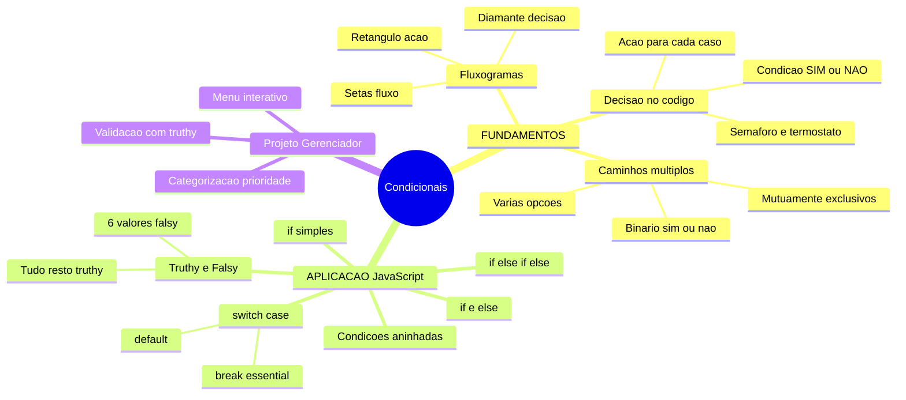
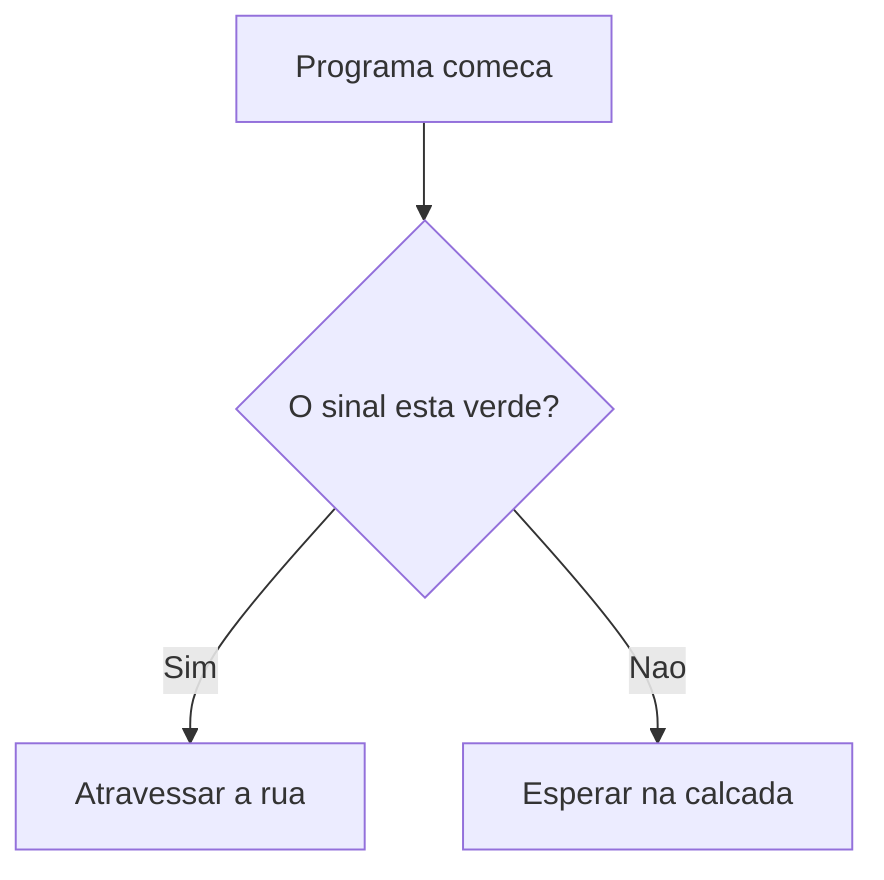
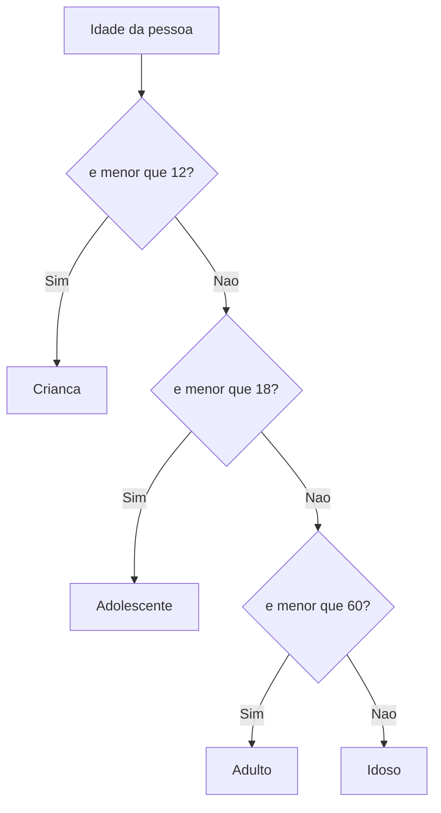
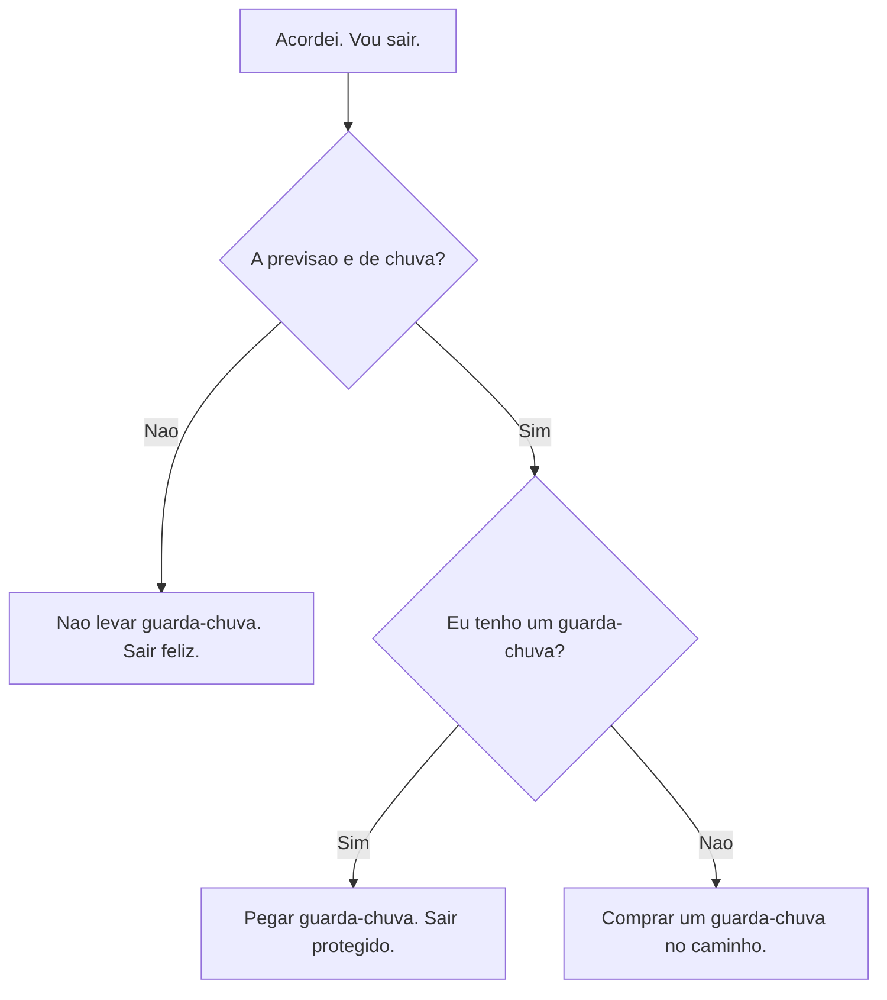
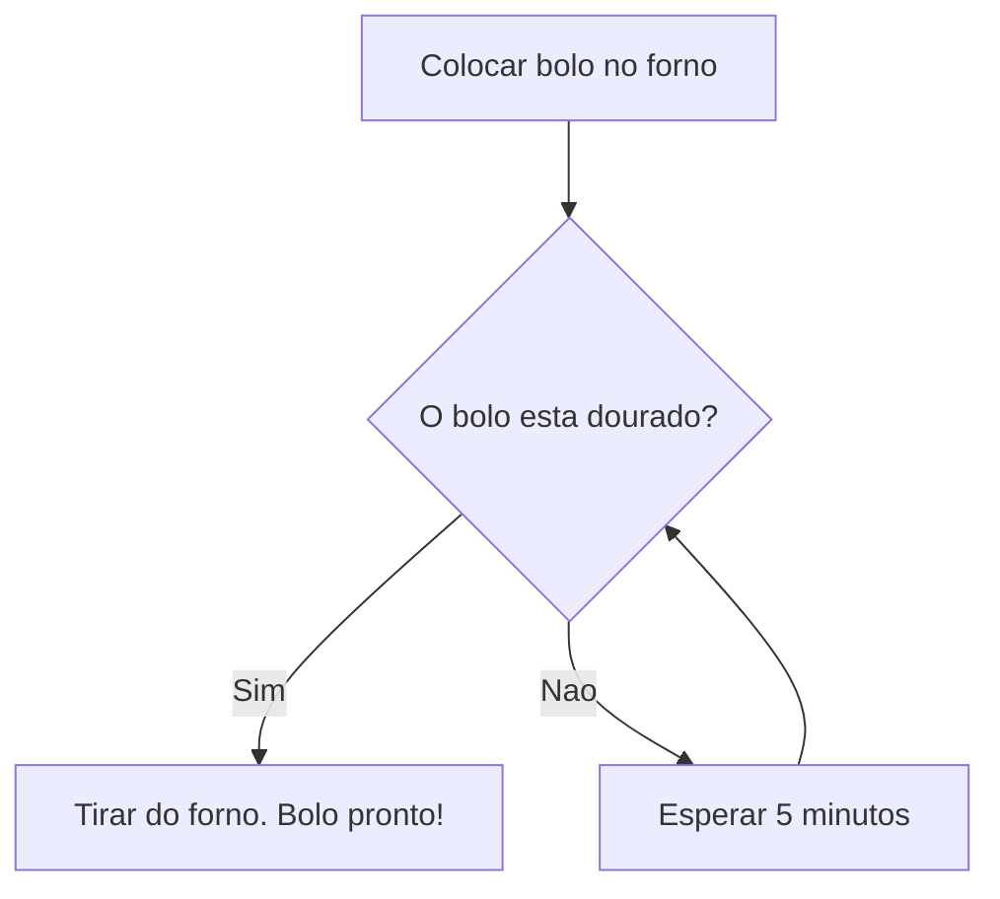
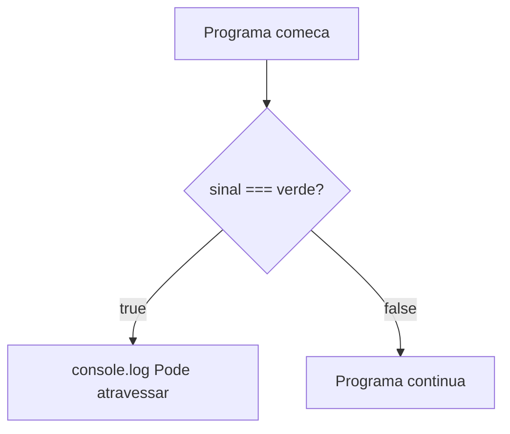
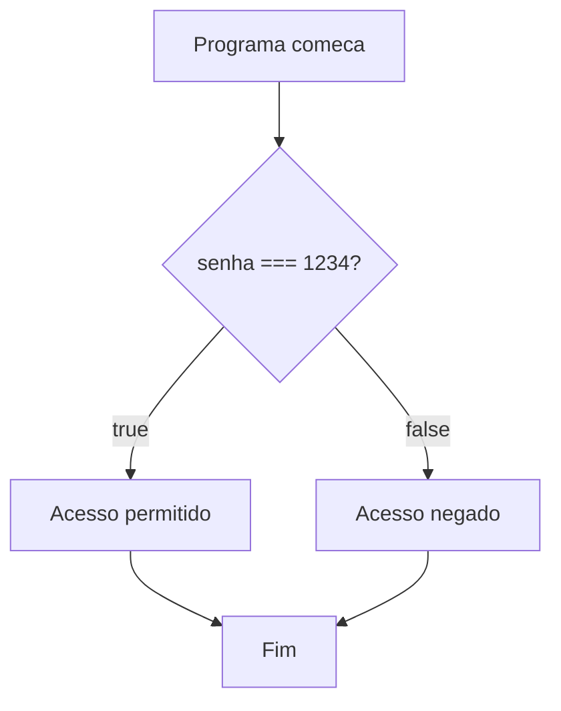
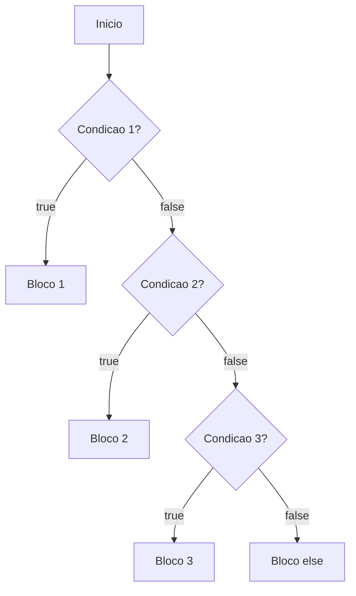
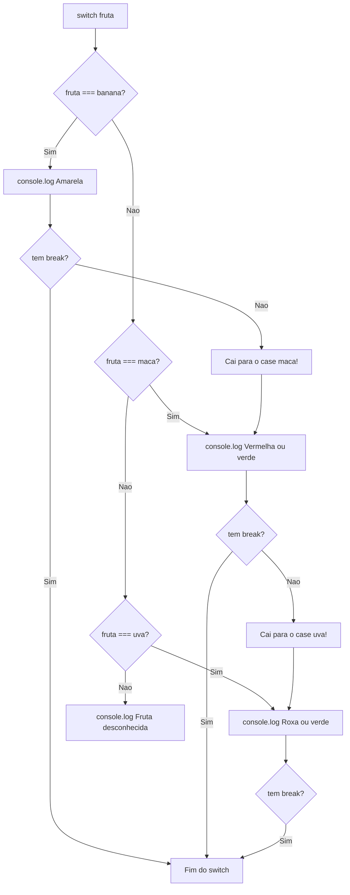
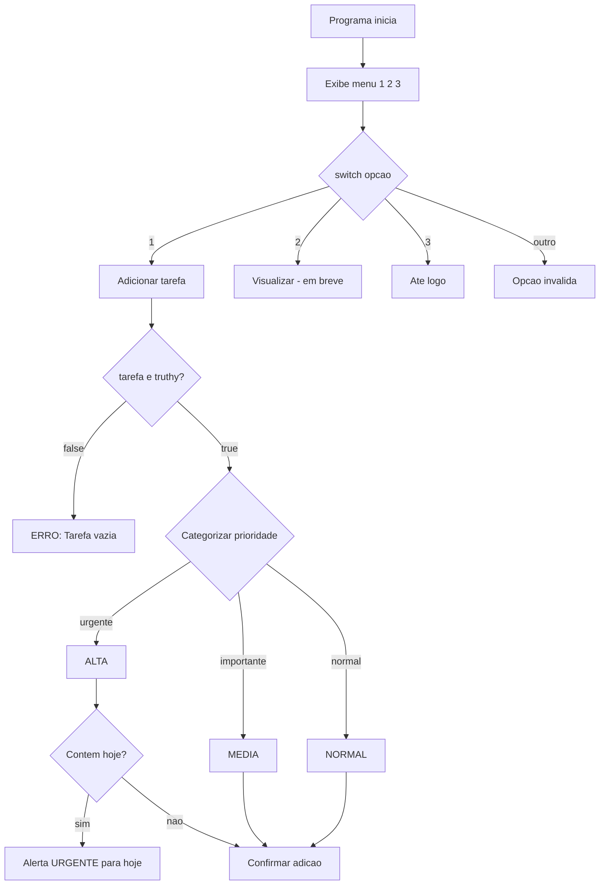

# JavaScript — Do Zero ao Profissional — Aula 07

## Condicionais — if, else if, else e switch

**Duração estimada:** 100 minutos (55 de leitura + 45 de prática)
**Nível:** Iniciante
**Pré-requisitos:** Aula 01 (console.log, console do navegador) + Aula 02 (let, const) + Aula 03 (booleans, typeof) + Aula 04 (operadores de comparação e lógicos) + Aula 05 (prompt, alert, Number, isNaN, template literals) + Aula 06 (trim, toLowerCase, includes, indexOf)

---

## Objetivos de Aprendizagem

Ao final desta aula, você será capaz de:

- [ ] **Explicar** o conceito de decisão condicional em programação usando analogias do cotidiano (semaforo, termostato, bifurcacao na estrada)
- [ ] **Interpretar** fluxogramas de decisão simples com ramificacoes sim/nao e multiplas opcoes, identificando condicoes, acoes e fluxos alternativos
- [ ] **Implementar** decisoes simples com `if` e blocos de codigo `{ }`, conectando a condicao booleana aos operadores de comparacao da Aula 04
- [ ] **Criar** caminhos alternativos com `if/else`, garantindo que exatamente um dos dois blocos seja executado
- [ ] **Construir** cadeias de multiplas condicoes com `if/else if/else`, compreendendo que apenas o primeiro bloco com condicao verdadeira e executado
- [ ] **Aplicar** `switch/case/break/default` para selecionar entre multiplos valores discretos, distinguindo quando usar `switch` vs `if/else if`
- [ ] **Combinar** condicoes com operadores logicos (`&&`, `||`, `!`) dentro de estruturas condicionais para expressar regras complexas
- [ ] **Aninhar** condicionais para decisoes em multiplos niveis, mantendo a legibilidade com indentacao consistente
- [ ] **Distinguir** valores truthy e falsy e prever como JavaScript os avalia em condicoes, substituindo verificacoes explicitas (ex: `if (texto !== "")`) por verificacoes idiomaticas (ex: `if (texto)`)
- [ ] **Integrar** condicionais ao Gerenciador de Tarefas com menu interativo (`switch`) e categorizacao por prioridade (`if/else if`)

---

## Como Usar Esta Aula

Esta aula esta organizada em duas partes que se complementam.

Na **primeira parte** (secoes 1 a 3), voce vai entender o pensamento condicional — o que significa "tomar uma decisao no codigo". Sao conceitos universais, valem para QUALQUER linguagem de programacao. As analogias sao do cotidiano: semaforo, termostato, cardapio, fluxogramas. Zero JavaScript por enquanto. So a ideia pura.

Na **segunda parte** (secoes 4 a 10), voce vai implementar CADA conceito em JavaScript. Vai aprender `if`, `else`, `else if`, `switch/case`, condicoes aninhadas e o conceito de truthy/falsy. Cada secao tem pratica guiada no Console e no seu editor.

Na **secao 10**, voce vai aplicar TUDO ao Gerenciador de Tarefas — seu projeto vai ganhar um menu interativo e categorizacao inteligente de prioridade.

Cada secao termina com um **Quick Check**. As respostas estao logo abaixo. Tente responder de cabeca antes de olhar.
Ao longo do caminho, voce encontrara secoes **"Mao na Massa"** — momentos em que voce vai ABRIR o Console ou o editor para praticar, nao so ler. Ao final da aula, o arquivo separado **Questoes de Aprendizagem** (`aula-07-questoes-de-aprendizagem.md`) traz as tarefas de checkpoint — so avance para a Aula 08 quando conseguir completa-las por conta propria.


> *"Ate agora seu programa executava tudo em linha reta — uma linha depois da outra, sempre. Hoje ele vai aprender a ESCOLHER caminhos. Vai olhar para os dados e decidir: 'se for X, faco uma coisa; se for Y, faco outra'. Seu codigo vai ganhar inteligencia."*

---

## Mapa Mental



---

## Recapitulacao das Aulas Anteriores

| Aula | Conceito | Onde aparece nesta aula | Como se conecta |
|---|---|---|---|
| Aula 01 | **console.log()** | Secoes 4 a 10 | Continuamos inspecionando resultados de condicoes no Console |
| Aula 02 | **Variaveis (let/const)** | Secoes 4 a 10 | Guardamos resultados booleanos e valores das condicoes |
| Aula 03 | **Tipo boolean, typeof** | Secoes 4, 5, 6, 8 | Condicoes sao expressoes booleanas — o aluno ja sabe o que sao |
| Aula 04 | **Operadores de comparacao (===, !==, >, <)** | Secoes 4, 5, 6, 7, 8 | Sao a materia-prima das condicoes dentro dos if |
| Aula 04 | **Operadores logicos (&&, ||, !)** | Secoes 4, 6, 8, 9 | Combinamos multiplas condicoes em um unico if |
| Aula 05 | **prompt(), alert(), template literals** | Secoes 5, 7, 10 | As condicionais decidem o que mostrar baseado na entrada do usuario |
| Aula 05 | **Number(), isNaN()** | Secao 5, 8 | Validacao numerica com condicionais |
| Aula 06 | **trim(), toLowerCase(), includes()** | Secoes 6, 9, 10 | Categorizacao e validacao de entrada textual com condicionais |

---

**FUNDAMENTOS: O Pensamento Condicional**

> *Os conceitos desta secao sao universais — valem para qualquer linguagem de programacao, em qualquer computador. Voce vai entender o que significa "tomar uma decisao no codigo" usando analogias que ja conhece: semaforo, termostato, bifurcacao na estrada, cardapio. Zero JavaScript. So a ideia pura. Na segunda parte, voce conectara cada conceito a sintaxe real.*

---

## 1. O que e uma decisao no codigo?

Pense em um semaforo. Voce esta na esquina, o sinal esta vermelho. O que voce faz? **Para.** Quando fica verde? **Atravessa.**

Agora pense em um termostato inteligente. Ele mede a temperatura do ambiente. Se passar de 25 graus, liga o ar condicionado. Se estiver abaixo de 18, liga o aquecedor.

Estes sao exemplos de **decisoes condicionais**. Uma pergunta e feita. A resposta determina a acao.

### O padrao universal

Toda decisao em programacao segue este padrao:

**SE (pergunta) ENTAO (acao)**

A pergunta precisa ser uma questao com resposta **SIM** ou **NAO** — ou, em termos de programacao, **VERDADEIRO** ou **FALSO**. Nao existe "talvez". Nao existe "mais ou menos". E sim ou nao.

> *Analogia: Pense numa maquina de refrigerantes. Voce aperta o botao do refrigerante X. A maquina pergunta: "tem dinheiro suficiente?" Se sim, ela libera a lata. Se nao, ela nao faz nada — ou mostra "credito insuficiente". Isso e uma decisao condicional.*

### Tres exemplos do cotidiano

**Exemplo 1 — O semaforo:**
Pergunta: "O sinal esta verde?"
- Se SIM: atravessar a rua
- Se NAO: esperar na calcada

**Exemplo 2 — A senha de acesso:**
Pergunta: "A senha digitada esta correta?"
- Se SIM: permitir entrada
- Se NAO: mostrar "Acesso negado"

**Exemplo 3 — O alarme de chuva:**
Pergunta: "A previsao indica chuva?"
- Se SIM: levar guarda-chuva
- Se NAO: nao levar

### Por que isso importa na programacao?

Programas que so executam uma sequencia fixa de comandos sao limitados. Eles fazem sempre a mesma coisa, do mesmo jeito, independentemente do que o usuario digita ou do que acontece ao redor.

Com **decisoes condicionais**, seu programa ganha **inteligencia**. Ele olha para os dados e decide o que fazer. "Se o usuario digitou algo valido, processa. Se nao, mostra erro." "Se a temperatura passou do limite, liga o alarme. Se nao, continua monitorando."

Sem decisoes, seu codigo e uma receita de bolo que nunca pode ser adaptada. Com decisoes, seu codigo vira um chef que ajusta a receita conforme os ingredientes disponiveis.

### Visualizando a decisao

A estrutura de uma decisao simples pode ser desenhada assim:



No diagrama acima:
- O **retangulo** `I` mostra o inicio
- O **diamante** `P` mostra a pergunta (a condicao)
- As **setas** mostram os dois caminhos possiveis
- Os **retangulos** `A` e `B` mostram as acoes

> *Voce pode estar pensando: "mas isso e simples, e obvio". E sim! E simples mesmo. A dificuldade nao esta em entender o conceito — esta em aplicar ele em situacoes cada vez mais complexas. Por enquanto, guarde isto: **condicao + acao = decisao**.*

### Quick Check 1

**1. No seu dia a dia, voce toma decisoes baseadas em condicoes. De dois exemplos que sigam o padrao "SE (condicao) ENTAO (acao)".**

**Resposta:** Exemplos pessoais. Exemplo A: "SE o despertador tocar ENTAO eu levanto. SE nao tocar ENTAO continuo dormindo." Exemplo B: "SE estiver chovendo ENTAO pego o guarda-chuva. SE nao estiver chovendo ENTAO saio sem ele." Qualquer exemplo que siga o padrao pergunta + acao esta correto.

**2. Por que a condicao precisa ser uma pergunta com resposta SIM ou NAO? O que aconteceria se a resposta fosse "talvez"?**

**Resposta:** Porque o computador so entende dois estados: verdadeiro ou falso. Nao existe "talvez" para um processador. Se a resposta fosse "talvez", o computador nao saberia qual caminho seguir — ele entraria em paralisia. E por isso que criamos condicoes que SEMPRE resultam em verdadeiro ou falso, nunca em "depende".

---

## 2. Caminhos — sim, nao e multiplas opcoes

Nem toda decisao tem apenas dois caminhos. No mundo real, voce frequentemente escolhe entre tres, quatro, dez opcoes.

### Decisoes binarias (dois caminhos)

A forma mais simples de decisao tem exatamente dois caminhos: sim ou nao. Um ou outro. NUNCA ambos, NUNCA nenhum.

**Exemplo — Acesso a um predio:**
Pergunta: "Voce tem a chave?"
- Se SIM: entrar
- Se NAO: ficar do lado de fora

Nao existe meio termo. Ou voce tem a chave e entra, ou nao tem e fica fora.

### Decisoes de multiplos caminhos

Agora pense em um cardapio de restaurante. Voce escolhe um prato entre varias opcoes. Se pedir o prato A, vem um sabor. Se pedir o B, vem outro. Se pedir o C, vem um terceiro.

**Exemplo — Classificacao etaria:**
Pergunta: "Qual a sua idade?"
- Se for menor que 12: voce e uma **crianca**
- Se for entre 12 e 17: voce e um **adolescente**
- Se for entre 18 e 59: voce e um **adulto**
- Se for 60 ou mais: voce e um **idoso**

Voce so pode pertencer a UMA dessas categorias. Se voce tem 15 anos, e adolescente — nao e crianca, nao e adulto. As categorias sao **mutuamente exclusivas**.

### Como isso e expressado

Para decisoes binarias, o padrao e:

**SE (condicao) ENTAO (A) SENAO (B)**

O "SENAO" cobre todos os outros casos. E o caminho alternativo quando a condicao nao e verdadeira.

Para multiplos caminhos, o padrao se estende:

**SE (condicao1) ENTAO (A) SENAO SE (condicao2) ENTAO (B) SENAO SE (condicao3) ENTAO (C) SENAO (D)**

O ultimo "SENAO" captura "qualquer coisa que nao se encaixou nas anteriores". E como uma rede de seguranca — pega tudo que sobrou.

### Por que a exclusividade e importante?

Pense em um sistema de descontos de uma loja:
- Cliente estudante: 50% de desconto
- Cliente idoso: 30% de desconto
- Cliente professor: 20% de desconto
- Outros clientes: 0% de desconto

E se uma pessoa for estudante E idosa ao mesmo tempo? O sistema precisa escolher APENAS UM desconto. Nao pode dar 80% (50% + 30%). Ele segue a primeira regra que encontrar.

Esta regra — "apenas o primeiro caminho valido e seguido" — e fundamental. Voce vera na pratica na Segunda Parte.

### Visualizando multiplos caminhos



Veja como as perguntas sao feitas EM SEQUENCIA. Se a primeira resposta for "sim", as perguntas seguintes nem sao feitas. Isso e importante.

> *Imagine que voce esta em um corredor com varias portas. Voce abre a primeira. Se for a sala certa, entra. Se nao for, fecha e tenta a segunda. E assim por diante. So entra em UMA sala.*

### Quick Check 2

**1. Num programa de desconto, as regras sao: estudante = 50%, idoso = 30%, professor = 20%, outros = 0%. Se uma pessoa for estudante E idosa, qual desconto ela recebe? Por que?**

**Resposta:** Ela recebe 50% (o primeiro que se aplicar). Por que os caminhos sao mutuamente exclusivos e o sistema testa as regras em ordem. Se "estudante" for a primeira condicao testada, ela e verdadeira — o sistema para ai e nao testa as outras. Se a ordem fosse diferente, o resultado seria diferente. A ordem das condicoes IMPORTA.

**2. Qual a diferenca entre uma decisao binaria (sim/nao) e uma decisao de multiplos caminhos? De um exemplo de cada.**

**Resposta:** A decisao binaria tem exatamente DOIS caminhos (um para "sim", um para "nao"). Exemplo: "se a senha estiver correta, entra; se nao, bloqueia." A decisao de multiplos caminhos tem TRES OU MAIS opcoes. Exemplo: "se a nota for maior que 90, conceito A; se for maior que 80, conceito B; se for maior que 70, conceito C; senao, conceito D." Na decisao binaria, o "senao" cobre tudo que nao e a condicao. Na multipla, cada "senao se" adiciona uma nova condicao especifica.

---

## 3. Fluxogramas — visualizando decisoes

Ate agora, voce viu decisoes descritas em texto. Mas existe uma ferramenta muito mais poderosa para pensar sobre decisoes: o **fluxograma**.

### O que e um fluxograma?

Um fluxograma e um diagrama que mostra o fluxo de um processo, passo a passo. Ele usa formas geometricas padrao para representar diferentes tipos de acao:

- **Oval**: inicio ou fim do processo
- **Retangulo**: uma acao (fazer alguma coisa)
- **Diamante**: uma decisao (uma pergunta com resposta sim/nao)
- **Seta**: a direcao do fluxo (o que vem depois)

### Exemplo do cotidiano: "Devo levar guarda-chuva?"

Pense no processo de decidir se voce leva ou nao um guarda-chuva ao sair de casa:



Veja como o fluxograma torna o processo **visual**. Voce olha e entende imediatamente:

1. Primeiro pergunta: "Vai chover?" Se nao, fim da historia.
2. Segundo: "Tenho guarda-chuva?" Se sim, pega. Se nao, compra.

O segundo diamante SO e alcancado se a resposta do primeiro for "sim". Isso se chama **aninhamento de decisoes** — uma decisao dentro do fluxo de outra.

### Por que fluxogramas sao uteis para programacao?

**1. Eles revelam erros de logica antes de codificar.**

Se voce desenha o fluxograma e percebe que um caminho leva a lugar nenhum, ou que duas condicoes se contradizem, e muito mais facil corrigir no papel do que depois de escrever 50 linhas de codigo.

**2. Eles mostram todos os caminhos possiveis.**

E facil esquecer um caso. "Ah, mas e se o usuario digitar um numero negativo?" Um fluxograma bem feito te obriga a pensar em CADA possibilidade.

**3. Eles sao universais.**

Um fluxograma em portugues funciona para qualquer pessoa, em qualquer pais, para qualquer linguagem de programacao. E uma ferramenta de comunicacao.

### Exemplo 2: Receita culinaria

Pense em fazer um bolo. A receita diz:

"Se o bolo estiver dourado por cima, tire do forno. Senao, espere mais 5 minutos e verifique de novo."

Em fluxograma:



Perceba a **seta que volta**. Isso e um **loop** — voce repete a verificacao ate que a condicao seja verdadeira. Voce vera loops em detalhes na Aula 08.

### Os tres elementos basicos do fluxograma

| Elemento | Forma | Significado | Exemplo |
|---|---|---|---|
| Inicio/Fim | Oval | Onde o processo comeca ou termina | "Acordei", "Pronto" |
| Acao | Retangulo | Algo que voce FAZ | "Pegar guarda-chuva" |
| Decisao | Diamante | Uma pergunta SIM/NAO | "Vai chover?" |

### Exercicio mental

Tente desenhar mentalmente um fluxograma para esta situacao:

"Se o despertador tocar, eu levanto. Se nao tocar, continuo dormindo."

Qual seria o diamante? Qual seria a pergunta? Quais seriam as acoes?

O diamante e "O despertador tocou?". Se sim, retangulo "Levantar". Se nao, retangulo "Continuar dormindo". Simples e direto.

### Quick Check 3

**1. Desenhe mentalmente um fluxograma para: "Se o despertador tocar, eu levanto. Se nao tocar, eu continuo dormindo." Quais sao os elementos (diamante, retangulo, setas)?**

**Resposta:** O fluxograma comeca com um oval "Inicio". Uma seta vai para o diamante "O despertador tocou?". Duas setas saem: "Sim" vai para o retangulo "Levantar", que vai para o oval "Fim". "Nao" vai para o retangulo "Continuar dormindo", que vai para o oval "Fim". Sao 1 diamante, 2 retangulos, 1 oval de inicio, 1 oval de fim e 5 setas.

**2. Qual a vantagem de desenhar um fluxograma ANTES de escrever o codigo? Em que situacao um fluxograma teria evitado um erro?**

**Resposta:** A vantagem e que voce VE a logica antes de se preocupar com sintaxe. Erros de logica sao mais faceis de detectar visualmente. Exemplo: se voce esta programando um sistema de descontos e desenha o fluxograma, percebe que a ordem das condicoes importa — se colocar "cliente comum" antes de "cliente VIP", o VIP nunca recebe o desconto. Desenhando, o erro aparece antes de digitar uma linha de codigo.

---

**APLICACAO: Condicionais em JavaScript**

> *Agora que voce entende o pensamento condicional, vamos implementa-lo em JavaScript. Voce escrevera `if`, `else`, `else if`, `switch/case`, condicoes aninhadas e aprendera sobre truthy/falsy. Cada secao mapeia um conceito da Primeira Parte para sua implementacao concreta. Ao final, seu Gerenciador de Tarefas ganhara um menu interativo e categorizacao inteligente.*

---

## 4. if — a decisao mais simples

Vamos comecar com a estrutura mais basica. Em JavaScript, o `if` traduz diretamente o padrao "SE (condicao) ENTAO (acao)" que voce aprendeu na Secao 1.

### A sintaxe

```javascript
if (condicao) {
    // codigo executado se a condicao for verdadeira
}
```

Cada parte significa:

- **`if`**: a palavra reservada que significa "SE" em ingles. O JavaScript reconhece esta palavra como "prepare-se para uma decisao".
- **(condicao)**: os parenteses contem a pergunta — uma expressao que resulta em `true` ou `false`. Aqui vao os operadores de comparacao da Aula 04 (`===`, `!==`, `>`, `<`, `>=`, `<=`).
- **`{ }`**: as chaves (tambem chamadas de **bloco de codigo**) agrupam tudo que deve ser executado se a condicao for verdadeira. Tudo dentro das chaves pertence ao `if`.

### A regra de ouro

Se a condicao for **`true`**, o bloco de codigo dentro das chaves e executado. Se for **`false`**, o bloco e PULADO — o JavaScript continua na linha seguinte apos o `if`.

### Exemplo 1: O semaforo em codigo

Lembra do semaforo da Secao 1? Em JavaScript, ele fica assim:

```javascript
let sinal = "verde";

if (sinal === "verde") {
    console.log("Pode atravessar!");
}
```

**Explicacao linha a linha:**

1. Criamos uma variavel `sinal` com o valor `"verde"`.
2. O `if` pergunta: "o valor de `sinal` e exatamente igual a `"verde"`?"
3. Como SIM (`true`), ele executa o `console.log("Pode atravessar!")`.
4. Se `sinal` fosse `"vermelho"`, a condicao `sinal === "verde"` seria `false` — o `console.log` nao seria executado.



### Exemplo 2: Verificacao de maioridade

```javascript
let idade = 18;

if (idade >= 18) {
    console.log("Voce e maior de idade.");
    console.log("Pode tirar a carteira de motorista.");
}
```

**Explicacao:**

1. `idade` vale 18.
2. A condicao `idade >= 18` e `true` (porque 18 e maior ou igual a 18).
3. AMBAS as linhas dentro das chaves sao executadas.

Se `idade` fosse 16, a condicao seria `false`, e nenhuma das duas linhas apareceria.

### Exemplo 3: Combinando com operadores logicos

```javascript
let temperatura = 30;
let estaChovendo = false;

if (temperatura > 25 && !estaChovendo) {
    console.log("Dia perfeito para ir a praia!");
}
```

**Explicacao:**

1. A condicao combina DUAS perguntas com `&&` (E): "temperatura maior que 25?" e "NAO esta chovendo?".
2. `30 > 25` e `true`. `!false` e `true`.
3. `true && true` = `true`. Entao a mensagem aparece.

> *Nota: O `&&` (E logico) e as aspas duplas `""` foram ensinados na Aula 04. Se precisar revisar, volte la. Na duvida: `&&` significa "AS DUAS condicoes precisam ser verdadeiras".*

### O erro classico: `=` em vez de `===`

Este e o erro MAIS COMUM entre iniciantes em JavaScript. E tao frequente que merece atencao especial.

```javascript
let x = 0;

if (x = 5) {   // ERRO! = em vez de ===
    console.log("Entrou no if!");
}
```

**Por que isso acontece?**

- `x = 5` e uma ATRIBUICAO, nao uma comparacao. Ele COLOCA o valor 5 dentro de x.
- A expressao `x = 5` resulta no valor `5`.
- E `5` e um valor "truthy" (voce aprendera mais sobre isso na Secao 9).
- Entao o `if` SEMPRE entra, independentemente do valor original de x!

**O que deveria ser:**

```javascript
if (x === 5) {  // CORRETO: comparacao
    console.log("Entrou no if!");
}
```

A diferenca e sutil no codigo, mas gigante no comportamento. Sempre que quiser COMPARAR, use `===` (tres sinais de igual). Use `=` (um sinal) APENAS para ATRIBUIR um valor a uma variavel.

> *Dica: Alguns programadores escrevem a comparacao ao contrario — `if (5 === x)` — para evitar este erro acidentalmente. Se esquecerem um sinal, `if (5 = x)` da erro na hora, porque nao da para atribuir um valor a um numero. Experimente.*

### Mao na Massa — Testando o if

Abra o Console do navegador (F12, aba Console) e digite:

```javascript
// Teste 1: condicao verdadeira
if (true) {
    console.log("Sempre entra!");
}

// Teste 2: condicao falsa
if (false) {
    console.log("NUNCA entra!");
}

// Teste 3: comparacao verdadeira
if (10 > 5) {
    console.log("10 e maior que 5 — entrou!");
}

// Teste 4: comparacao falsa
if (10 < 5) {
    console.log("10 e menor que 5 — isso nunca aparece!");
}

// Teste 5: com variavel
let clima = "ensolarado";
if (clima === "ensolarado") {
    console.log("Vamos para a praia!");
}
```

Resultado esperado no Console:
- "Sempre entra!"
- "10 e maior que 5 — entrou!"
- "Vamos para a praia!"

As outras mensagens NAO aparecem porque as condicoes sao `false`.

### Quick Check 4

**1. O que este codigo exibe?**
```javascript
let idade = 18;
if (idade >= 18) {
    console.log("Maior de idade");
}
```

**Resposta:** Exibe "Maior de idade". Porque `idade >= 18` com `idade = 18` resulta em `true`, entao o bloco do `if` executa.

**2. Por que `if (x = 5) { console.log("entrou"); }` SEMPRE exibe "entrou", mesmo que x fosse 0 antes?**

**Resposta:** Porque `x = 5` nao e uma comparacao — e uma ATRIBUICAO. O codigo COLOCA o valor 5 dentro de x. O resultado da atribuicao e 5, e 5 e um valor considerado "verdadeiro" em contexto de condicao. Entao o `if` sempre considera a condicao como verdadeira. O correto seria `if (x === 5)`.

## 5. if/else — dois caminhos

A Secao 1 mostrou que decisoes podem ter dois caminhos: um para "sim" e outro para "nao". Em JavaScript, isso se traduz em `if/else`.

### A sintaxe

```javascript
if (condicao) {
    // codigo se a condicao for verdadeira
} else {
    // codigo se a condicao for falsa
}
```

O `else` significa "SENAO" — e o caminho alternativo. E a resposta para "e se a condicao nao for verdadeira?".

### A regra de ouro do if/else

Exatamente UM dos dois blocos executa. Sempre. Nunca ambos. Nunca nenhum.

Se a condicao for `true`, executa o primeiro bloco (`if`). Se for `false`, executa o segundo (`else`). Nao existe terceira opcao.

### Exemplo 1: A senha de acesso

Lembra do exemplo da senha na Secao 1? Vamos implementar:

```javascript
let senha = "1234";

if (senha === "1234") {
    console.log("Acesso permitido!");
} else {
    console.log("Acesso negado!");
}
```

**Explicacao:**

- Se `senha` for exatamente `"1234"`, aparece "Acesso permitido!".
- Se `senha` for qualquer outra coisa (`"0000"`, `"senha"`, `""`), aparece "Acesso negado!".
- Os dois blocos NUNCA executam juntos.



### Exemplo 2: Par ou impar

Um classico da programacao. Como descobrir se um numero e par ou impar?

```javascript
let numero = 7;

if (numero % 2 === 0) {
    console.log(numero + " e par.");
} else {
    console.log(numero + " e impar.");
}
```

**Explicacao:**

- O operador `%` (modulo) retorna o RESTO da divisao. Se `numero % 2` for 0, o numero e divisivel por 2, entao e PAR.
- `7 % 2` = 1 (resto). Como `1 === 0` e `false`, vai para o `else`.
- Resultado: "7 e impar."

> *Analogia: Pense em dividir balas entre duas criancas. Se sobrar uma bala (resto 1), e impar. Se nao sobrar nenhuma (resto 0), e par.*

### Exemplo 3: Validacao de entrada no Gerenciador

```javascript
let tarefa = prompt("Digite o nome da tarefa:").trim();

if (tarefa === "") {
    alert("ERRO: Tarefa nao pode ser vazia!");
} else {
    alert("Tarefa adicionada: " + tarefa);
}
```

**Explicacao:**

1. `prompt()` pergunta ao usuario e guarda o que foi digitado.
2. `.trim()` remove espacos do inicio e do fim.
3. Se a tarefa estiver vazia (usuario digitou nada ou so espacos), mostra erro.
4. Se nao estiver vazia, confirma a adicao.

Este e o primeiro upgrade condicional do Gerenciador! Na Aula 06, a validacao era feita de forma simples. Agora voce entende CADA PECA.

### Erro comum: ponto e virgula depois do if

```javascript
if (condicao); {  // ERRO! Ponto e virgula depois do if
    console.log("Isso SEMPRE executa!");
}
```

O ponto e virgula `;` depois do `if` encerra a decisao ali. O `if` verifica a condicao e nao faz nada (bloco vazio). O `{ ... }` seguinte se torna um bloco comum, SEMPRE executado — perdendo o efeito condicional.

**Correto:**
```javascript
if (condicao) {
    console.log("Isso so executa se condicao for true.");
}
```

### Mao na Massa — Testando if/else

Abra o Console e teste:

```javascript
// Teste 1: numero par
let num = 10;
if (num % 2 === 0) {
    console.log(num + " e par");
} else {
    console.log(num + " e impar");
}

// Teste 2: numero impar
num = 7;
if (num % 2 === 0) {
    console.log(num + " e par");
} else {
    console.log(num + " e impar");
}

// Teste 3: validacao
let nome = prompt("Digite seu nome:").trim();
if (nome === "") {
    alert("Nome nao pode ser vazio!");
} else {
    alert("Ola, " + nome + "!");
}
```

### Quick Check 5

**1. Neste codigo, qual mensagem aparece?**
```javascript
let nota = 7;
if (nota >= 7) {
    console.log("Aprovado");
} else {
    console.log("Reprovado");
}
```

**Resposta:** "Aprovado". `nota >= 7` com `nota = 7` e `true` (7 e maior ou igual a 7). Entao o bloco do `if` executa e exibe "Aprovado". O bloco do `else` e ignorado.

**2. E possivel que NENHUM dos blocos (if nem else) execute? Por que?**

**Resposta:** Nao. Em `if/else`, exatamente UM bloco sempre executa. Se a condicao for `true`, executa o `if`. Se for `false`, executa o `else`. Nao ha terceira opcao. A estrutura garante que SEMPRE ha um caminho. Diferente do `if` sozinho (sem `else`), onde se a condicao for `false`, nada acontece.

---

## 6. if/else if/else — multiplos caminhos

Agora vamos implementar o padrao de multiplos caminhos que voce aprendeu na Secao 2. Em JavaScript, usamos `if/else if/else`.

### A sintaxe

```javascript
if (condicao1) {
    // codigo se condicao1 for true
} else if (condicao2) {
    // codigo se condicao1 for false E condicao2 for true
} else if (condicao3) {
    // codigo se condicoes anteriores forem false E condicao3 for true
} else {
    // codigo se TODAS as condicoes anteriores forem false
}
```

Voce pode ter QUANTOS `else if` precisar. O `else` final e opcional, mas recomendado — ele captura "qualquer outro caso".

### Como o JavaScript executa

O JavaScript testa as condicoes EM ORDEM, de cima para baixo. A PRIMEIRA condicao que for `true` faz seu bloco executar. Todas as demais sao IGNORADAS — mesmo que tambem fossem `true`.



### Exemplo 1: Classificacao etaria

Lembra da classificacao da Secao 2? Vamos implementar exatamente ela:

```javascript
let idade = 15;
let categoria;

if (idade < 12) {
    categoria = "crianca";
} else if (idade < 18) {
    categoria = "adolescente";
} else if (idade < 60) {
    categoria = "adulto";
} else {
    categoria = "idoso";
}

console.log("Voce e: " + categoria);
```

**Por que a ordem funciona?**

- `idade = 15`: A primeira condicao (`idade < 12`) e `false`. Testa a segunda (`idade < 18`). `15 < 18` e `true`. Executa o bloco: `categoria = "adolescente"`. As condicoes seguintes nem sao testadas.
- Se `idade = 8`: A primeira (`idade < 12`) e `true`. `categoria = "crianca"`. Pronto, ignorou o resto.
- Se `idade = 70`: As tres primeiras sao `false` (`70 < 12` = false, `70 < 18` = false, `70 < 60` = false). Cai no `else`: `categoria = "idoso"`.

### A ARMADILHA DA ORDEM

Este e um dos erros mais comuns. Veja o que acontece com a ORDEM ERRADA:

```javascript
// ORDEr ERRADA — nunca funciona!
let nota = 95;

if (nota >= 70) {
    console.log("Conceito C");
} else if (nota >= 90) {
    console.log("Conceito A"); // NUNCA executa!
} else if (nota >= 80) {
    console.log("Conceito B"); // NUNCA executa!
}
```

**Por que "Conceito A" nunca aparece?**

Porque `95 >= 70` e `true` — entao o PRIMEIRO bloco executa e exibe "Conceito C". As condicoes seguintes nem sao verificadas, mesmo que `95 >= 90` tambem seja `true`.

**A ordem correta:**

```javascript
// ORDEM CORRETA: do mais especifico para o mais geral
let nota = 95;

if (nota >= 90) {
    console.log("Conceito A");
} else if (nota >= 80) {
    console.log("Conceito B");
} else if (nota >= 70) {
    console.log("Conceito C");
} else {
    console.log("Conceito D");
}
```

Agora sim: `95 >= 90` e `true` → "Conceito A". Correto!

> *Regra de ouro: Sempre coloque as condicoes mais ESPECIFICAS primeiro. As condicoes mais ABRANGENTes (que pegam mais casos) devem vir depois. O `else` final pega tudo que sobrou.*

### Exemplo 2: Categorizacao de prioridade no Gerenciador

```javascript
let tarefa = prompt("Digite a tarefa:").trim().toLowerCase();
let prioridade;

if (tarefa.includes("urgente")) {
    prioridade = "ALTA";
} else if (tarefa.includes("importante")) {
    prioridade = "MEDIA";
} else {
    prioridade = "NORMAL";
}

console.log("Prioridade: " + prioridade);
```

**Explicacao:**

1. A entrada e limpa (`.trim()`) e padronizada para minusculas (`.toLowerCase()`).
2. A primeira condicao verifica se a tarefa contem "urgente". Se sim, prioridade ALTA.
3. Se nao contiver "urgente", verifica se contem "importante". Se sim, MEDIA.
4. Se nao contiver nem "urgente" nem "importante", e NORMAL.

### Mao na Massa — Testando if/else if

```javascript
// Teste 1: Classificacao etaria
let idade = prompt("Qual sua idade?");
idade = Number(idade);

let classificacao;
if (idade < 12) {
    classificacao = "Crianca";
} else if (idade < 18) {
    classificacao = "Adolescente";
} else if (idade < 60) {
    classificacao = "Adulto";
} else {
    classificacao = "Idoso";
}

console.log("Classificacao: " + classificacao);

// Teste 2: Categorizador de tarefa
let descricao = prompt("Descreva a tarefa:").trim().toLowerCase();
let nivel;

if (descricao.includes("urgente")) {
    nivel = "Alta prioridade";
} else if (descricao.includes("importante")) {
    nivel = "Media prioridade";
} else {
    nivel = "Baixa prioridade";
}

console.log("Nivel: " + nivel);
```

### Quick Check 6

**1. O que este codigo exibe para `hora = 14`?**
```javascript
if (hora < 12) {
    console.log("Bom dia");
} else if (hora < 18) {
    console.log("Boa tarde");
} else {
    console.log("Boa noite");
}
```

**Resposta:** "Boa tarde". `hora = 14`: A primeira condicao (`14 < 12`) e `false`. Testa a segunda (`14 < 18`): `true`. Executa o bloco e exibe "Boa tarde". O `else` final e ignorado.

**2. Por que a ordem das condicoes em `else if` importa? O que acontece se voce colocar a condicao mais abrangente primeiro?**

**Resposta:** A ordem importa porque o JavaScript testa as condicoes EM SEQUENCIA e PARA na PRIMEIRA que for `true`. Se a condicao mais abrangente (ex: `nota >= 70`) vier primeiro, ela "captura" todos os valores acima de 70, impedindo que as condicoes mais especificas (`nota >= 90`, `nota >= 80`) sejam testadas. O resultado e que as categorias mais especificas nunca sao alcancadas. A regra e: coloque as condicoes mais ESPECIFICAS primeiro.

---

## 7. switch/case/break/default — decisao por valor exato

As vezes voce precisa comparar UMA variavel com VARIOS valores fixos. Por exemplo: um menu com opcoes 1, 2, 3, 4, 5. Neste caso, o `switch` e mais adequado que o `if/else if`.

### Quando usar switch vs if/else if

| Situacao | Use |
|---|---|
| Comparar UMA variavel com VALORES FIXOS (1, 2, 3 ou "azul", "verde", "vermelho") | **switch** |
| Condicoes complexas (com `>`, `<`, `.includes()`, `&&`, `||`) | **if/else if** |

O `switch` e como um cardapio: voce tem uma bandeja (a variavel) e coloca ela em cima de cada prato (cada `case`). Quando encaixa, voce come (executa o codigo).

### A sintaxe completa

```javascript
switch (variavel) {
    case valor1:
        // codigo se variavel === valor1
        break;
    case valor2:
        // codigo se variavel === valor2
        break;
    case valor3:
        // codigo se variavel === valor3
        break;
    default:
        // codigo se NENHUM case anterior correspondeu
}
```

### As pecas do switch

- **`switch (variavel)`**: A expressao que sera comparada. Pode ser uma variavel, uma operacao, qualquer expressao.
- **`case valor:`**: Um valor possivel. Se `variavel === valor` (comparacao ESTRITA), executa o codigo deste `case` ate encontrar um `break`.
- **`break;`**: INTERROMPE a execucao. Sem ele, o codigo "cai" para o proximo `case` (fall-through).
- **`default:`**: Opcional. Executa se nenhum `case` correspondeu. Equivalente ao `else` final.

### Exemplo 1: Menu de opcoes

```javascript
let opcao = 2;

switch (opcao) {
    case 1:
        console.log("Voce escolheu a opcao 1: Adicionar tarefa");
        break;
    case 2:
        console.log("Voce escolheu a opcao 2: Visualizar tarefas");
        break;
    case 3:
        console.log("Voce escolheu a opcao 3: Sair");
        break;
    default:
        console.log("Opcao invalida! Escolha 1, 2 ou 3.");
}
```

**Resultado:** "Voce escolheu a opcao 2: Visualizar tarefas".

### O BREAK e ESSENCIAL

Sem o `break`, o comportamento e SURPREENDENTE:

```javascript
let fruta = "maca";

switch (fruta) {
    case "banana":
        console.log("Amarela");
        // SEM BREAK — cai para o proximo case!
    case "maca":
        console.log("Vermelha ou verde");
        // SEM BREAK — cai para o proximo case!
    case "uva":
        console.log("Roxa ou verde");
        break;
    default:
        console.log("Fruta desconhecida");
}
```

**Resultado:**
```
Vermelha ou verde
Roxa ou verde
```

Por que? O `switch` encontrou o `case "maca"`, executou `console.log("Vermelha ou verde")`, e como nao tinha `break`, CONTINUOU para o `case "uva"` e executou `console.log("Roxa ou verde")`. So parou quando encontrou o `break` no `case "uva"`.

Isso se chama **fall-through** (queda). E um comportamento intencional da linguagem, mas raramente desejado. A regra pratica: **sempre coloque `break` no final de cada `case`**.



### Comparacao estrita (===)

O `switch` usa comparacao ESTRITA (`===`), igual ao que voce aprendeu na Aula 04. Isso significa que tipo e valor precisam ser identicos.

```javascript
let numero = "5";  // string

switch (numero) {
    case 5:  // numero
        console.log("Numero 5");
        break;
    case "5":  // string
        console.log("String 5");
        break;
}
```

**Resultado:** "String 5". Porque `"5" === 5` e `false` (tipos diferentes — string vs number). Entao o `case 5` nao corresponde. O `case "5"` corresponde porque `"5" === "5"`.

### O default

O `default` e opcional, mas recomendado. Ele captura QUALQUER valor que nao tenha um `case` especifico.

```javascript
let cor = "roxo";

switch (cor) {
    case "azul":
        console.log("Ceu e mar");
        break;
    case "verde":
        console.log("Natureza");
        break;
    case "vermelho":
        console.log("Fogo");
        break;
    default:
        console.log("Cor nao cadastrada no sistema");
}
```

**Resultado:** "Cor nao cadastrada no sistema". Nenhum `case` correspondeu a "roxo", entao o `default` executou.

### Mao na Massa — Testando switch

```javascript
// Teste 1: Menu simples
let opcao = prompt("Escolha: 1-Cafe 2-Cha 3-Suco 4-Sair");

switch (opcao) {
    case "1":
        alert("Cafe sendo preparado!");
        break;
    case "2":
        alert("Cha sendo preparado!");
        break;
    case "3":
        alert("Suco sendo preparado!");
        break;
    case "4":
        alert("Ate logo!");
        break;
    default:
        alert("Opcao invalida!");
}
```

Note que os `case` usam `"1"`, `"2"` (strings), nao `1`, `2` (numeros). Por que? Porque `prompt()` SEMPRE retorna string. Se voce usasse `case 1:` (numero), nunca corresponderia, pois `"1" === 1` e `false`.

```javascript
// Teste 2: Com break
console.log("Com break:");
let dia = "sexta";
switch (dia) {
    case "segunda":
        console.log("Inicio da semana");
        break;
    case "sexta":
        console.log("Sextou!");
        break;
    case "sabado":
        console.log("Fim de semana");
        break;
    default:
        console.log("Dia util qualquer");
}
// Resultado: "Sextou!" (so uma mensagem)

// Teste 3: Sem break (fall-through intencional)
console.log("Sem break:");
switch (dia) {
    case "segunda":
        console.log("Inicio da semana");
    case "sexta":
        console.log("Sextou!");
    case "sabado":
        console.log("Fim de semana");
    default:
        console.log("Dia util qualquer");
}
// Resultado: "Sextou!", "Fim de semana", "Dia util qualquer"
// TUDO depois do case "sexta" executou!
```

### Quick Check 7

**1. O que este switch exibe para `fruta = "maca"`?**
```javascript
switch (fruta) {
    case "banana":
        console.log("Amarela");
        break;
    case "maca":
        console.log("Vermelha");
        break;
    default:
        console.log("Desconhecida");
}
```

**Resposta:** "Vermelha". O `switch` encontra o `case "maca"`, que corresponde ao valor da variavel, executa `console.log("Vermelha")`, e o `break` interrompe a execucao. O `default` e ignorado.

**2. O que acontece se voce ESQUECER o `break` em um `case`? Como isso pode ser util (intencionalmente)?**

**Resposta:** Se voce esquecer o `break`, o codigo "cai" para o proximo `case` (fall-through) e executa TUDO que vier depois, independentemente de os `case` seguintes corresponderem ou nao. Isso pode ser util intencionalmente para fazer multiplos `case` compartilharem o mesmo codigo. Exemplo:
```javascript
case "segunda":
case "terca":
case "quarta":
case "quinta":
case "sexta":
    console.log("Dia util");
    break;
```
Aqui, qualquer dia de semana util executa o mesmo `console.log`. O fall-through e usado para AGRUPAR casos.

---

## 8. Condicoes aninhadas

Lembra do fluxograma "Devo levar guarda-chuva?" da Secao 3? Ele tinha duas decisoes em sequencia: "Vai chover?" e "Tenho guarda-chuva?". A segunda decisao SO era alcancada se a primeira fosse "sim".

Isso se chama **aninhamento** — um `if` dentro de outro `if`.

### A sintaxe

```javascript
if (condicaoExterna) {
    // codigo executado se a externa for true
    if (condicaoInterna) {
        // codigo executado se AMBAS forem true
    } else {
        // codigo se externa for true mas interna for false
    }
} else {
    // codigo se externa for false — nao chega na interna
}
```

### Exemplo 1: Saque em conta bancaria

```javascript
let saldo = 1000;
let valorSaque = 200;
let limiteDiario = 500;

if (saldo >= valorSaque) {
    console.log("Saldo suficiente.");
    if (valorSaque <= limiteDiario) {
        console.log("Saque de R$" + valorSaque + " autorizado!");
    } else {
        console.log("Valor excede o limite diario.");
    }
} else {
    console.log("Saldo insuficiente.");
}
```

**Explicacao:**

1. Primeiro verifica: "tem saldo suficiente?" Se `false`, ja mostra "Saldo insuficiente" e termina — nem testa o limite.
2. Se tem saldo, entao pergunta: "o valor respeita o limite diario?" Se sim, autoriza. Se nao, nega por limite.

### Aninhamento vs operadores logicos

`if (a && b)` e `if (a) { if (b) { ... } }` produzem o mesmo resultado LOGICO. Entao qual usar?

| Situacao | Recomendado |
|---|---|
| So importa se AMBAS sao verdadeiras | `if (a && b)` — mais curto e legivel |
| Cada falha precisa de tratamento DIFERENTE | `if (a) { if (b) { ... } else { erro B } } else { erro A }` |

### Exemplo 2: Validacao de tarefa com dois niveis

```javascript
let tarefa = prompt("Digite a tarefa:").trim();

if (tarefa !== "") {
    console.log("Tarefa nao esta vazia. Verificando comprimento...");
    
    if (tarefa.length >= 3) {
        console.log("Tarefa valida: " + tarefa);
    } else {
        console.log("Tarefa muito curta (minimo 3 caracteres).");
    }
} else {
    console.log("ERRO: Tarefa vazia!");
}
```

**Explicacao:**

1. Primeira decisao: a tarefa esta vazia? Se sim, erro e termina.
2. Segunda decisao (so se nao estiver vazia): a tarefa tem pelo menos 3 caracteres? Se sim, valida. Se nao, erro de comprimento.

Cada nivel tem uma mensagem de erro DIFERENTE, algo que seria impossivel com `if (tarefa !== "" && tarefa.length >= 3)`.

### Cuidado com o aninhamento excessivo

Muitos niveis de aninhamento deixam o codigo DIFICIL de ler. Regra pratica: mais de 3 niveis de profundidade e sinal de que voce precisa reorganizar a logica.

```javascript
// EVITE: muitos niveis
if (a) {
    if (b) {
        if (c) {
            if (d) {
                // codigo aqui
            }
        }
    }
}
```

Neste curso, voce aprendera com o tempo a evitar isso. Por enquanto, foque em fazer o codigo funcionar com ate 2 ou 3 niveis.

### Mao na Massa — Testando aninhamento

```javascript
// Teste: Sistema de emprestimo
let renda = prompt("Qual sua renda mensal?");
renda = Number(renda);

if (renda > 0) {
    if (renda >= 3000) {
        console.log("Emprestimo aprovado!");
        if (renda >= 10000) {
            console.log("E voce tem direito a taxa especial!");
        }
    } else {
        console.log("Renda minima nao atingida (necessario R$ 3.000).");
    }
} else {
    console.log("Renda invalida.");
}
```

Teste com valores diferentes: 0, 1500, 3500, 15000. Veja como cada nivel adiciona uma mensagem especifica.

### Quick Check 8

**1. Qual a diferenca pratica entre `if (a && b) { ... }` e `if (a) { if (b) { ... } }`? Quando voce usaria um vs o outro?**

**Resposta:** A diferenca esta no TRATAMENTO DE ERRO. `if (a && b)` simplismente executa o bloco se ambos forem `true` — se falhar, nao tem mensagem especifica. `if (a) { if (b) { ... } else { erro B } } else { erro A }` permite dar mensagens DIFERENTES para cada falha. Use `if (a && b)` quando so importa saber se ambos sao verdadeiros. Use aninhamento quando cada nivel precisa de tratamento separado.

**2. Quantos niveis de aninhamento voce acha que sao aceitaveis antes do codigo ficar dificil de ler? O que voce pode fazer para evitar aninhamento excessivo?**

**Resposta:** Geralmente, 2 a 3 niveis e o maximo aceitavel antes do codigo ficar confuso. Acima disso, a indentacao se torna profunda e a logica dificil de acompanhar. Para evitar aninhamento excessivo, voce pode: (1) usar operadores logicos (`&&`, `||`) para combinar condicoes, (2) inverter a condicao e usar `return` (quando aprender funcoes), (3) extrair partes da logica para blocos separados.

---

## 9. Truthy e Falsy — quando valores nao-booleanos viram condicoes

Ate agora, todas as nossas condicoes usavam expressoes que resultavam em `true` ou `false` explicitamente: `sinal === "verde"`, `idade >= 18`, `tarefa.includes("urgente")`.

Mas o JavaScript faz algo muito util (e as vezes surpreendente): ele converte automaticamente QUALQUER valor para booleano quando esse valor aparece numa condicao.

Isso se chama **coercao booleana**.

### Os 6 valores Falsy

Existem exatamente **6 valores** que o JavaScript trata como `false` quando usados em uma condicao:

| Valor | O que e |
|---|---|
| `false` | O proprio booleano falso |
| `0` | O numero zero |
| `""` | String vazia |
| `null` | Ausencia intencional de valor |
| `undefined` | Variavel declarada sem valor |
| `NaN` | "Not a Number" — resultado de calculo invalido |

**Estes 6 — e SOMENTE estes 6 — sao tratados como `false` em condicoes.**

### TUDO o resto e Truthy

Qualquer valor que nao esteja na lista acima e **truthy** — tratado como `true` em condicoes. Inclusive valores que podem soar "falsos" para nos:

| Expressao | Truthy ou Falsy? | Por que? |
|---|---|---|
| `" "` (espaco) | Truthy | E uma string NAO vazia (tem 1 caractere) |
| `"false"` (string) | Truthy | E uma string NAO vazia, mesmo que o conteudo seja a palavra false |
| `-1` | Truthy | Numeros negativos sao truthy (so 0 e falsy) |
| `"0"` (string) | Truthy | E uma string NAO vazia — diferente do numero 0 |
| `Infinity` | Truthy | So 0 e falsy entre os numeros |
| `[]` (array vazio) | Truthy | Objetos sao truthy (voce aprendera arrays depois) |
| `{}` (objeto vazio) | Truthy | Objetos sao truthy |

### Implicacao pratica: validacao de entrada

A validacao mais comum em programacao e: "este campo esta preenchido?"

Sem truthy/falsy, voce escreveria:

```javascript
if (texto !== "" && texto !== null && texto !== undefined) {
    console.log("Campo preenchido: " + texto);
}
```

Com truthy/falsy, voce simplifica para:

```javascript
if (texto) {
    console.log("Campo preenchido: " + texto);
}
```

`if (texto)` e `true` se `texto` for qualquer string nao vazia, e `false` se for `""`, `null` ou `undefined`. Tres verificacoes em uma!

### Mas CUIDADO — as pegadinhas

**Pegadinha 1: O numero 0**

```javascript
let saldo = 0;

if (saldo) {
    console.log("Saldo disponivel");
} else {
    console.log("Sem saldo");
}
```

**Resultado:** "Sem saldo". Por que? `0` e FALSO. Mas a intencao era verificar se a variavel `saldo` tem um valor, nao se o valor e zero especificamente. Neste caso, a verificacao explicita `if (saldo !== undefined && saldo !== null)` seria mais adequada.

**Pegadinha 2: A string "0"**

```javascript
let valor = "0";

if (valor) {
    console.log("Tem valor");  // EXECUTA!
} else {
    console.log("Sem valor");
}
```

**Resultado:** "Tem valor"! Por que? `"0"` (string) e DIFERENTE de `0` (numero). A string `"0"` nao esta na lista dos 6 falsy. Ela tem comprimento 1, entao e truthy.

**Pegadinha 3: String com espaco**

```javascript
let nome = "   ";

if (nome.trim()) {
    console.log("Nome valido");
} else {
    console.log("Nome vazio");
}
```

A string `"   "` e truthy (e uma string nao vazia). Mas depois de `.trim()`, ela vira `""` (falsy). Entao `if (nome.trim())` verifica corretamente se o nome tem conteudo alem de espacos.

### Tabela de referencia rapida

| Valor | Em condicao | Equivale a |
|---|---|---|
| `true` | Truthy | `true` |
| `false` | **Falsy** | `false` |
| `0` | **Falsy** | `false` |
| `1` (qualquer numero != 0) | Truthy | `true` |
| `-1` | Truthy | `true` |
| `""` (vazia) | **Falsy** | `false` |
| `" "` (espaco) | Truthy | `true` |
| `"0"` (string) | Truthy | `true` |
| `null` | **Falsy** | `false` |
| `undefined` | **Falsy** | `false` |
| `NaN` | **Falsy** | `false` |
| `"false"` (string) | Truthy | `true` |

### O operador de negacao `!`

Voce pode NEGAR um valor com `!`. O `!` inverte o valor: se e truthy, vira `false`; se e falsy, vira `true`.

```javascript
let texto = "";

console.log(!texto);     // true (porque texto e falsy)
console.log(!!texto);    // false (dupla negacao — revela o valor booleano)

if (!texto) {
    console.log("Texto esta vazio!");  // EXECUTA
}
```

**Uso pratico no Gerenciador:**

```javascript
let tarefa = prompt("Digite a tarefa:").trim();

if (!tarefa) {
    alert("Tarefa nao pode ser vazia!");
} else {
    alert("Tarefa: " + tarefa);
}
```

`if (!tarefa)` significa "se tarefa NAO for truthy", ou seja, "se tarefa estiver vazia (ou for null/undefined)".

### Mao na Massa — Testando truthy e falsy

```javascript
// Teste 1: Os 6 falsy
console.log("Testando os 6 falsy:");
if (false) { console.log("false e truthy"); } else { console.log("false e FALSY"); }
if (0) { console.log("0 e truthy"); } else { console.log("0 e FALSY"); }
if ("") { console.log("'' e truthy"); } else { console.log("'' e FALSY"); }
if (null) { console.log("null e truthy"); } else { console.log("null e FALSY"); }
if (undefined) { console.log("undefined e truthy"); } else { console.log("undefined e FALSY"); }
if (NaN) { console.log("NaN e truthy"); } else { console.log("NaN e FALSY"); }

// Teste 2: Truthy surpreendentes
console.log("Truthy surpreendentes:");
if (" ") { console.log("' ' (espaco) e truthy"); }
if ("false") { console.log("'false' (string) e truthy"); }
if (-1) { console.log("-1 e truthy"); }
if ("0") { console.log("'0' (string) e truthy"); }

// Teste 3: Na pratica — validacao
let entrada = prompt("Digite algo:");
if (entrada) {
    console.log("Voce digitou: " + entrada);
} else {
    console.log("Voce nao digitou nada!");
}
```

### Quick Check 9

**1. Quais dos seguintes valores sao truthy e quais sao falsy? `0`, `"0"`, `""`, `" "`, `null`, `undefined`, `NaN`, `false`, `"false"`, `-1`**

**Resposta:** Falsy (6): `0`, `""`, `null`, `undefined`, `NaN`, `false`. Truthy (4): `"0"` (string nao vazia), `" "` (string nao vazia), `"false"` (string nao vazia), `-1` (numero diferente de 0).

**2. Qual a diferenca entre `if (!texto)` e `if (texto === "")`? Em qual situacao elas dariam resultados DIFERENTES?**

**Resposta:** `if (!texto)` verifica se `texto` e QUALQUER valor falsy — `""`, `null`, `undefined`, `0`, `false`, `NaN`. `if (texto === "")` verifica APENAS se e exatamente igual a string vazia. Elas dariam resultados diferentes se `texto` fosse `null`: `if (!null)` e `true` (considera vazio), mas `if (null === "")` e `false` (null nao e igual a string vazia).

---

## 10. Gerenciador de Tarefas — integracao completa

Agora vamos aplicar TUDO que voce aprendeu nas secoes 4 a 9 ao seu Gerenciador de Tarefas. Este e o momento de integrar condicionais, switch, aninhamento e truthy/falsy em um programa funcional.

### O que o Gerenciador vai fazer

1. Exibir um **menu interativo** com `switch`: 1-Adicionar, 2-Visualizar, 3-Sair
2. **Validar entrada** com truthy/falsy
3. **Categorizar prioridade** com `if/else if`
4. Usar **condicoes aninhadas** para combinar validacao e categorizacao

### O codigo completo

```html
<!DOCTYPE html>
<html>
<head>
    <title>Gerenciador de Tarefas — Aula 07</title>
</head>
<body>
    <h1>Gerenciador de Tarefas</h1>
    <script>
        const app = "Gerenciador de Tarefas";
        alert("Bem-vindo ao " + app + "!");
        
        // MENU PRINCIPAL com switch
        let opcao = prompt("=== MENU ===\n1 - Adicionar tarefa\n2 - Visualizar tarefas\n3 - Sair\n\nEscolha uma opcao:");
        
        switch (opcao) {
            case "1":
                // OPCAO 1: ADICIONAR TAREFA
                let tarefa = prompt("Digite a tarefa:").trim();
                
                // Validacao com truthy/falsy (Secao 9)
                if (!tarefa) {
                    alert("ERRO: Tarefa nao pode ser vazia!");
                } else {
                    // Categorizacao com if/else if (Secao 6)
                    let prioridade;
                    if (tarefa.toLowerCase().includes("urgente")) {
                        prioridade = "ALTA";
                    } else if (tarefa.toLowerCase().includes("importante")) {
                        prioridade = "MEDIA";
                    } else {
                        prioridade = "NORMAL";
                    }
                    
                    // Condicao aninhada: se for ALTA, verifica se tem prazo (Secao 8)
                    if (prioridade === "ALTA") {
                        if (tarefa.toLowerCase().includes("hoje")) {
                            alert("URGENTE: Tarefa para HOJE! Prioridade " + prioridade);
                        } else {
                            alert("Tarefa adicionada com prioridade " + prioridade);
                        }
                    } else {
                        alert("Tarefa adicionada com prioridade " + prioridade);
                    }
                }
                break;
                
            case "2":
                // OPCAO 2: VISUALIZAR
                alert("Funcionalidade de visualizacao em construcao!\n(Aula 08 — Loops — vai resolver isso)");
                break;
                
            case "3":
                // OPCAO 3: SAIR
                alert("Ate logo!");
                break;
                
            default:
                // OPCAO INVALIDA
                alert("Opcao invalida! Escolha 1, 2 ou 3.");
        }
    </script>
</body>
</html>
```

### Explicacao do codigo

**Linhas 1-10:** Estrutura HTML padrao. O `h1` mostra o titulo na pagina. Todo o JavaScript fica dentro de `<script>`.

**Linha 12:** O menu usa `switch (opcao)`. Note que os `case` usam strings (`"1"`, `"2"`, `"3"`) porque `prompt()` sempre retorna string.

**Case "1" (Adicionar):**
- A tarefa e obtida com `.trim()` imediatamente.
- `if (!tarefa)` usa truthy/falsy: se a tarefa estiver vazia (string vazia apos trim), entra no erro.
- Se nao estiver vazia, categoriza: se contem "urgente", prioridade ALTA; se contem "importante", MEDIA; senao, NORMAL.
- Uma condicao aninhada verifica: se for ALTA e contiver "hoje", mostra alerta especial.

**Case "2" (Visualizar):** Ainda nao implementada totalmente — mostra mensagem sobre a Aula 08.

**Case "3" (Sair):** Mensagem de despedida.

**Default:** Captura qualquer opcao que nao seja 1, 2 ou 3.

### Mapa do fluxo



### Mao na Massa — Testando o Gerenciador completo

1. Crie um arquivo `index.html` com o codigo acima.
2. Salve e abra no navegador.
3. Teste cada cenario:

**Cenario 1: Opcao invalida**
- Digite "4" no menu
- Resultado esperado: "Opcao invalida!"

**Cenario 2: Adicionar tarefa vazia**
- Digite "1" no menu
- Na tarefa, clique em OK sem digitar nada
- Resultado esperado: "ERRO: Tarefa nao pode ser vazia!"

**Cenario 3: Tarefa urgente para hoje**
- Digite "1" no menu
- Na tarefa, digite "Pagar contas URGENTE hoje"
- Resultado esperado: "URGENTE: Tarefa para HOJE! Prioridade ALTA"

**Cenario 4: Tarefa normal**
- Digite "1" no menu
- Na tarefa, digite "Estudar JavaScript"
- Resultado esperado: "Tarefa adicionada com prioridade NORMAL"

**Cenario 5: Sair**
- Digite "3" no menu
- Resultado esperado: "Ate logo!"

### Quick Check 10

**1. Por que os `case` do switch usam `"1"` (string) em vez de `1` (numero)?**

**Resposta:** Porque `prompt()` SEMPRE retorna uma string, independentemente do que o usuario digitar. Se o usuario digitar 1, a variavel `opcao` guarda `"1"` (string), nao `1` (numero). Como o `switch` usa comparacao estrita (`===`), `opcao === 1` seria `false` (string vs numero). Por isso usamos `case "1"`.

**2. O que acontece se o usuario digitar uma opcao que nao e 1, 2 nem 3? Qual parte do codigo lida com isso?**

**Resposta:** O `default` do `switch` captura qualquer opcao que nao corresponda a nenhum `case`. Ele exibe a mensagem "Opcao invalida! Escolha 1, 2 ou 3." Isso inclui valores como "4", "abc", "" (vazio), ou qualquer outra coisa que o usuario digitar.

---

## Autoavaliacao: Quiz Rapido

Teste seus conhecimentos com estas 8 perguntas. As respostas estao logo abaixo de cada uma.

**Q1. No contexto de programacao, o que e uma "condicao"?**
a) Um comando que repete uma acao varias vezes
b) Uma pergunta com resposta SIM ou NAO (verdadeira ou falsa) que determina qual caminho executar
c) Um tipo de variavel que so guarda textos
d) Uma forma de declarar uma funcao

**Resposta:** b) Uma condicao e uma expressao booleana — uma pergunta que so pode ser respondida com verdadeiro ou falso. E como um diamante num fluxograma: dependendo da resposta, o programa segue um caminho diferente.

---

**Q2. Em um fluxograma, qual forma geometrica representa uma DECISAO?**
a) Retangulo
b) Oval
c) Diamante
d) Circulo

**Resposta:** c) O diamante representa uma decisao (pergunta com resposta sim/nao). O retangulo representa uma acao. O oval representa inicio ou fim.

---

**Q3. O que este codigo exibe no console?**
```javascript
let nota = 5;
if (nota >= 7) {
    console.log("Aprovado");
} else {
    console.log("Reprovado");
}
```
a) "Aprovado"
b) "Reprovado"
c) Nada
d) Erro

**Resposta:** b) "Reprovado". `nota = 5` e `5 >= 7` e `false`, entao o bloco do `else` executa.

---

**Q4. O que acontece com este codigo?**
```javascript
let x = 0;
if (x = 10) {
    console.log("dentro do if");
}
```
a) Nada — o `if` nao executa porque x e 0
b) Exibe "dentro do if" porque `x = 10` atribui 10 a x, e 10 e truthy
c) Da erro de sintaxe
d) Exibe 10 no console

**Resposta:** b) `x = 10` e uma ATRIBUICAO, nao uma comparacao. O codigo coloca 10 dentro de x, e o resultado da expressao (10) e truthy. Entao o `if` executa. O correto seria `if (x === 10)` para comparar.

---

**Q5. Qual o valor de `prioridade` apos este codigo se a tarefa for "Estudar"?**
```javascript
let tarefa = "Estudar";
let prioridade;
if (tarefa.toLowerCase().includes("urgente")) {
    prioridade = "ALTA";
} else if (tarefa.toLowerCase().includes("importante")) {
    prioridade = "MEDIA";
} else {
    prioridade = "NORMAL";
}
```
a) "ALTA"
b) "MEDIA"
c) "NORMAL"
d) undefined

**Resposta:** c) "NORMAL". "Estudar" nao contem "urgente" nem "importante" (mesmo em minusculas), entao cai no `else` final.

---

**Q6. No switch abaixo, o que aparece no console?**
```javascript
let cor = "azul";
switch (cor) {
    case "vermelho":
        console.log("Fogo");
    case "azul":
        console.log("Mar");
    case "verde":
        console.log("Natureza");
}
```
a) "Mar"
b) "Mar" e "Natureza"
c) "Fogo", "Mar" e "Natureza"
d) Nada

**Resposta:** b) O `case "azul"` corresponde, executa `console.log("Mar")`, e como nao tem `break`, CONTINUA (fall-through) para o `case "verde"` e executa `console.log("Natureza")` tambem. So para quando acaba o switch.

---

**Q7. Qual dos valores abaixo e FALSY em JavaScript?**
a) `" "` (espaco)
b) `-1`
c) `"false"` (string)
d) `null`

**Resposta:** d) `null` e um dos 6 valores falsy. Os outros sao truthy: `" "` e string nao vazia, `-1` e numero diferente de zero, `"false"` e string nao vazia.

---

**Q8. Qual a diferenca entre `if (a && b)` e `if (a) { if (b) { ... } }`?**
a) Nenhuma — fazem exatamente a mesma coisa
b) `if (a && b)` e mais seguro porque evita erros
c) `if (a) { if (b) { ... } }` permite tratar cada falha com mensagens diferentes
d) `if (a && b)` nao funciona com operadores logicos

**Resposta:** c) Ambos executam o bloco interno se `a` e `b` forem `true`. Mas o aninhamento permite adicionar blocos `else` em cada nivel para tratar cada falha separadamente. `if (a && b)` e mais curto quando so importa saber se ambos sao verdadeiros.

---

## Mao na Massa Final: Exercicios Graduados

### Exercicio 1 (Facil) — Par ou Impar

Escreva um programa em HTML que:
1. Pergunta um numero ao usuario com `prompt()`.
2. Converte para numero com `Number()`.
3. Verifica se o numero e par ou impar usando `if/else` e o operador `%`.
4. Exibe o resultado com `alert()`.

**Gabarito:**

```html
<!DOCTYPE html>
<html>
<head><title>Par ou Impar</title></head>
<body>
<script>
let numero = prompt("Digite um numero:");
numero = Number(numero);

if (numero % 2 === 0) {
    alert(numero + " e PAR!");
} else {
    alert(numero + " e IMPAR!");
}
</script>
</body>
</html>
```

> *Explicacao: O operador `%` (modulo) retorna o resto da divisao. Se o resto for 0, o numero e divisivel por 2, entao e par. Se o resto for 1, e impar.*

---

### Exercicio 2 (Medio) — Classificador de Nota Escolar

Escreva um programa em HTML que:
1. Pergunta a nota do aluno (0 a 100) com `prompt()`.
2. Converte para numero com `Number()`.
3. Classifica com `if/else if` usando esta tabela:
   - 90 a 100: Conceito A
   - 80 a 89: Conceito B
   - 70 a 79: Conceito C
   - 60 a 69: Conceito D
   - Abaixo de 60: Conceito F
4. Exibe o resultado com `alert()`.

**Gabarito:**

```html
<!DOCTYPE html>
<html>
<head><title>Classificador de Nota</title></head>
<body>
<script>
let nota = prompt("Digite a nota (0 a 100):");
nota = Number(nota);
let conceito;

if (nota >= 90) {
    conceito = "A";
} else if (nota >= 80) {
    conceito = "B";
} else if (nota >= 70) {
    conceito = "C";
} else if (nota >= 60) {
    conceito = "D";
} else {
    conceito = "F";
}

alert("Nota: " + nota + " — Conceito: " + conceito);
</script>
</body>
</html>
```

> *Explicacao: A ordem das condicoes e IMPORTANTE. Colocamos a condicao mais especifica primeiro (`nota >= 90`). Se colocassemos `nota >= 60` primeiro, TODAS as notas acima de 60 seriam classificadas como "D", e as categorias A, B, C nunca seriam alcancadas.*

---

### Desafio (Dificil) — Mini Gerenciador com Menu e Categorizacao

Crie um programa completo em HTML que:

1. Exibe um menu com `switch`: 1-Adicionar tarefa, 2-Listar tarefas, 3-Sair
2. Ao adicionar tarefa:
   a. Pede o nome da tarefa com `prompt()`
   b. Valida com truthy/falsy (`if (!tarefa)`)
   c. Categoriza prioridade: se contem "urgente" → ALTA, se contem "importante" → MEDIA, senao → NORMAL
   d. Usa condicao aninhada: se for tarefa ALTA, pergunta "prazo e hoje?" e marca como urgente
   e. Exibe resumo com `alert()` mostrando nome e prioridade
3. Ao listar tarefas, exibe um `alert()` com as tarefas adicionadas (use ate 2 variaveis para guardar as tarefas)
4. Opcao invalida mostra mensagem de erro

**Gabarito:**

```html
<!DOCTYPE html>
<html>
<head><title>Mini Gerenciador — Aula 07</title></head>
<body>
<h1>Mini Gerenciador de Tarefas</h1>
<script>
alert("Bem-vindo ao Mini Gerenciador!");

// Variaveis para guardar as tarefas
let tarefa1 = "";
let tarefa2 = "";
let prioridade1 = "";
let prioridade2 = "";

// Menu principal
let opcao = prompt("=== MENU ===\n1 - Adicionar tarefa\n2 - Listar tarefas\n3 - Sair");

switch (opcao) {
    case "1":
        // Adicionar primeira tarefa
        tarefa1 = prompt("Digite a primeira tarefa:").trim();
        
        if (!tarefa1) {
            alert("ERRO: Tarefa nao pode ser vazia!");
        } else {
            // Categorizar
            if (tarefa1.toLowerCase().includes("urgente")) {
                prioridade1 = "ALTA";
                let prazo = prompt("E para hoje? (sim/nao)").trim().toLowerCase();
                if (prazo === "sim") {
                    alert("URGENTE: Tarefa para HOJE! Prioridade " + prioridade1);
                } else {
                    alert("Tarefa adicionada com prioridade " + prioridade1);
                }
            } else if (tarefa1.toLowerCase().includes("importante")) {
                prioridade1 = "MEDIA";
                alert("Tarefa adicionada com prioridade " + prioridade1);
            } else {
                prioridade1 = "NORMAL";
                alert("Tarefa adicionada com prioridade " + prioridade1);
            }
            
            // Adicionar segunda tarefa
            tarefa2 = prompt("Digite a segunda tarefa (ou deixe vazio para pular):").trim();
            
            if (tarefa2) {
                if (tarefa2.toLowerCase().includes("urgente")) {
                    prioridade2 = "ALTA";
                } else if (tarefa2.toLowerCase().includes("importante")) {
                    prioridade2 = "MEDIA";
                } else {
                    prioridade2 = "NORMAL";
                }
                alert("Segunda tarefa adicionada com prioridade " + prioridade2);
            }
        }
        break;
        
    case "2":
        // Listar tarefas
        let lista = "=== TAREFAS ===\n";
        if (tarefa1) {
            lista += "1. " + tarefa1 + " (Prioridade: " + prioridade1 + ")\n";
        } else {
            lista += "1. (vazia)\n";
        }
        if (tarefa2) {
            lista += "2. " + tarefa2 + " (Prioridade: " + prioridade2 + ")\n";
        } else {
            lista += "2. (vazia)\n";
        }
        alert(lista);
        break;
        
    case "3":
        alert("Ate logo!");
        break;
        
    default:
        alert("Opcao invalida! Escolha 1, 2 ou 3.");
}
</script>
</body>
</html>
```

> *Explicacao: Este desafio integra TODOS os conceitos da aula: `switch` para o menu, truthy/falsy para validacao (`if (!tarefa1)`), `if/else if` para categorizacao, e condicoes aninhadas na verificacao do prazo. As variaveis `tarefa1`, `tarefa2`, `prioridade1`, `prioridade2` guardam o estado temporariamente (na proxima aula, com loops e arrays, isso ficara muito mais elegante).*

---

## Resumo da Aula

### Os Conceitos Fundamentais

**1. O Pensamento Condicional (Parte 1):**
Toda decisao em programacao segue o padrao **SE (condicao) ENTAO (acao)**. A condicao e uma pergunta booleana — SIM ou NAO, nunca "talvez". As decisoes podem ser binarias (dois caminhos) ou multiplas (varias opcoes mutuamente exclusivas). Fluxogramas sao ferramentas visuais para planejar a logica antes de codificar, usando diamantes (decisao), retangulos (acao) e setas (fluxo).

**2. Condicionais em JavaScript (Parte 2):**

| Estrutura | Quando usar | Sintaxe basica |
|---|---|---|
| `if` | Uma condicao, um caminho | `if (cond) { ... }` |
| `if/else` | Dois caminhos (sim/nao) | `if (cond) { ... } else { ... }` |
| `if/else if/else` | Multiplos caminhos | `if (c1) { ... } else if (c2) { ... } else { ... }` |
| `switch/case` | Comparar uma variavel com valores fixos | `switch (v) { case x: ... break; default: ... }` |

**3. Truthy e Falsy:**
JavaScript converte automaticamente qualquer valor para booleano em condicoes. Apenas 6 valores sao falsy: `false`, `0`, `""`, `null`, `undefined`, `NaN`. Tudo o resto e truthy. Use `if (texto)` como forma concisa de verificar se uma string nao esta vazia.

**4. Cuidados Essenciais:**
- `=` (atribuicao) e DIFERENTE de `===` (comparacao) — nunca os confunda
- A ordem das condicoes em `else if` importa: coloque as mais especificas primeiro
- Sempre use `break` no `switch` (a menos que queira fall-through intencional)
- Indentacao e crucial para legibilidade de condicoes aninhadas
- `if (a && b)` e mais curto; `if (a) { if (b) { ... } }` permite tratamento de erro especifico

### O Que Voce Construiu Hoje

- [ ] Entendi o conceito de decisao condicional com analogias do cotidiano
- [ ] Sei interpretar e desenhar fluxogramas de decisao
- [ ] Sei usar `if` para decisoes simples
- [ ] Sei usar `if/else` para dois caminhos alternativos
- [ ] Sei construir cadeias com `if/else if/else` para multiplas condicoes
- [ ] Sei usar `switch/case/break/default` para valores fixos
- [ ] Sei aninhar condicionais e entendo quando usar aninhamento vs operadores logicos
- [ ] Sei identificar e usar valores truthy e falsy em condicoes
- [ ] Sei integrar condicionais no Gerenciador de Tarefas (menu + categorizacao)

---

## Proxima Aula

**Aula 08: Loops — for, while, do...while**

Agora que seu programa sabe TOMAR DECISOES, o proximo passo e fazer ele REPETIR acoes. Na Aula 08, voce vai aprender tres tipos de loops: `for`, `while` e `do...while`.

Com loops, seu Gerenciador de Tarefas vai:
- Perguntar tarefas repetidamente ate o usuario dizer "chega"
- Exibir listas completas sem precisar de variaveis separadas (`tarefa1`, `tarefa2`, etc.)
- Processar cada item de uma colecao automaticamente

Condicionais (Aula 07) + Loops (Aula 08) = Controle de Fluxo completo. Seu codigo vai deixar de ser linear para ser inteligente e repetitivo na medida certa.

---

## Referencias

### Documentacao Oficial

- [MDN: if...else](https://developer.mozilla.org/en-US/docs/Web/JavaScript/Reference/Statements/if...else) — documentacao oficial de if, else if, else
- [MDN: switch](https://developer.mozilla.org/en-US/docs/Web/JavaScript/Reference/Statements/switch) — documentacao oficial do switch
- [MDN: Truthy](https://developer.mozilla.org/en-US/docs/Glossary/Truthy) — definicao de truthy no glossario MDN
- [MDN: Falsy](https://developer.mozilla.org/en-US/docs/Glossary/Falsy) — definicao de falsy no glossario MDN

### Tutoriais e Guias

- [JavaScript.info: Conditional Operators](https://javascript.info/ifelse) — tutorial interativo sobre if/else
- [MDN: Operator Precedence](https://developer.mozilla.org/en-US/docs/Web/JavaScript/Reference/Operators/Operator_precedence) — tabela de precedencia de operadores

---

## FAQ

**P: Qual a diferenca entre `=` e `===`? Por que a confusao e tao comum?**

R: `=` e o operador de ATRIBUICAO — ele COLOCA um valor dentro de uma variavel. `===` e o operador de COMPARACAO — ele VERIFICA se dois valores sao iguais. A confusao e comum porque na matematica usamos "=" para ambos os casos. Na programacao, sao operacoes diferentes. Regra: se quer ATRIBUIR, use `=`. Se quer COMPARAR, use `===`.

**P: O `else if` e uma estrutura separada ou e um `else` seguido de `if`?**

R: Em JavaScript, `else if` e, tecnicamente, um `else` seguido de um `if` na mesma linha. Mas para efeitos praticos, voce pode tratar como uma estrutura unica: "SE condicao1, SENAO SE condicao2, SENAO SE condicao3, SENAO". O JavaScript entende e executa corretamente.

**P: Posso ter um `if` dentro de outro `if`? Quantos niveis?**

R: Sim, isso se chama aninhamento. Voce pode ter quantos niveis quiser, mas mais de 3 niveis torna o codigo dificil de ler. A recomendacao pratica: ate 2 ou 3 niveis e aceitavel. Acima disso, repense a logica.

**P: O que acontece se eu esquecer o `break` no `switch`?**

R: Ocorre **fall-through** — o codigo continua executando os `case` seguintes, mesmo que eles nao correspondam ao valor testado. Exemplo: se o `case 1` nao tem `break`, ele executa o codigo do `case 1` E DEPOIS o codigo do `case 2`, do `case 3`, etc., ate encontrar um `break` ou o fim do `switch`.

**P: `if (x)` verifica se x e `true` ou se x existe?**

R: `if (x)` verifica se x e **truthy** — ou seja, se convertido para booleano, resulta em `true`. Isso inclui: strings nao vazias, numeros diferentes de zero, objetos, arrays, etc. Mas EXCLUI os 6 valores falsy. Entao `if (x)` NAO verifica se x existe — verifica se x tem um valor que nao seja falsy.

**P: Quantas condicoes posso ter em um `else if`?**

R: Quantas voce precisar. Nao ha limite. Mas se voce tiver mais de 5 ou 6 condicoes, considere se um `switch` seria mais adequado (se os valores forem fixos) ou se a logica poderia ser reorganizada.

**P: Por que `switch` usa `===` (comparacao estrita) em vez de `==`?**

R: Para evitar surpresas com conversao automatica de tipos. Se `switch` usasse `==`, `case "5"` corresponderia a `5`, e vice-versa, causando comportamento inesperado. Com `===`, voce tem certeza de que `case 5` so corresponde ao numero 5, e `case "5"` so corresponde a string "5".

**P: Qual a diferenca entre `else if` e varios `if` separados?**

R: Varios `if` separados sao INDEPENDENTES — CADA UM e testado, e CADA UM pode executar seu bloco. Ja `else if` forma uma CADEIA — apenas o PRIMEIRO bloco com condicao verdadeira executa, e os demais sao ignorados. Use `else if` quando as condicoes sao mutuamente exclusivas. Use `if` separados quando cada condicao e independente.

**P: Como faco para testar se uma string NAO esta vazia? `if (str)` ou `if (str !== "")`?**

R: Ambas funcionam, mas com diferencas. `if (str)` e mais curta e tambem rejeita `null` e `undefined`. `if (str !== "")` rejeita APENAS string vazia — aceitaria `null` (que daria erro). A recomendacao: use `if (str)` para validacao de entrada do usuario, e `if (str !== "")` quando voce precisa distinguir string vazia de `null`.

**P: O que significa "truthy" e "falsy"? Sao tipos especiais?**

R: Nao sao tipos. Sao CLASSIFICACOES que o JavaScript faz automaticamente. "Truthy" significa "tratado como verdadeiro quando usado em uma condicao". "Falsy" significa "tratado como falso quando usado em uma condicao". Nao ha um tipo "truthy" — qualquer valor pode ser classificado como truthy ou falsy dependendo do contexto.

---

## Glossario

| Termo | Definicao |
|---|---|
| **Condicao** | Expressao booleana que determina se um bloco de codigo sera executado |
| **Booleano** | Tipo de dado que so tem dois valores: `true` (verdadeiro) e `false` (falso) |
| **`if`** | Estrutura condicional que executa um bloco de codigo se a condicao for verdadeira |
| **`else`** | Palavra reservada que define o bloco alternativo quando a condicao do `if` e falsa |
| **`else if`** | Cadeia de condicoes: testa uma nova condicao se a anterior for falsa |
| **Bloco de codigo** | Conjunto de instrucoes entre chaves `{ }` — o escopo de um `if`, `else`, `switch`, etc. |
| **`switch`** | Estrutura condicional que compara uma expressao com varios valores fixos |
| **`case`** | Cada valor possivel dentro de um `switch` |
| **`break`** | Palavra reservada que interrompe a execucao de um `switch` (ou loop) |
| **`default`** | Caso padrao do `switch` — executado se nenhum `case` corresponder |
| **Fall-through** | Comportamento do `switch` sem `break`: o codigo continua para o proximo `case` |
| **Aninhamento** | Colocar uma estrutura condicional dentro de outra |
| **Indentacao** | Espacamento a esquerda que organiza visualmente o codigo e seus niveis |
| **Truthy** | Valor que e tratado como `true` quando usado em uma condicao |
| **Falsy** | Valor que e tratado como `false` quando usado em uma condicao |
| **`null`** | Valor especial que representa ausencia intencional de valor |
| **`undefined`** | Valor atribuido a variaveis declaradas mas nao inicializadas |
| **`NaN`** | "Not a Number" — resultado de operacoes matematicas invalidas |
| **Coercao booleana** | Conversao automatica de qualquer valor para booleano em contexto de condicao |
| **Operador %** | Modulo — retorna o resto de uma divisao. Usado para testar par/impar |
| **Fluxograma** | Diagrama visual que representa o fluxo de decisoes e acoes de um processo |
