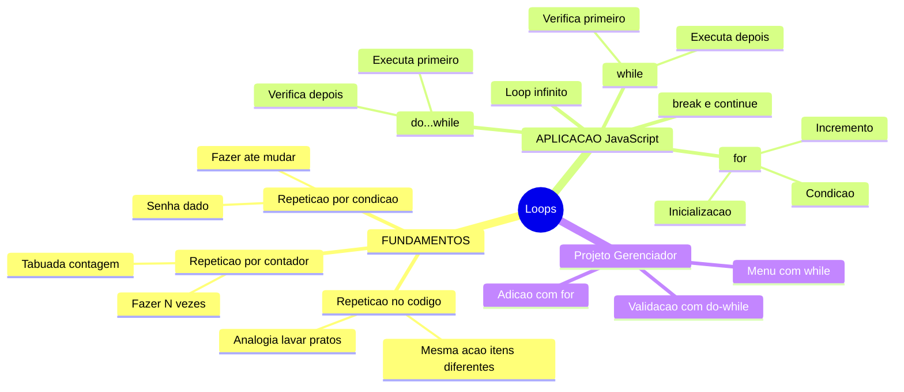
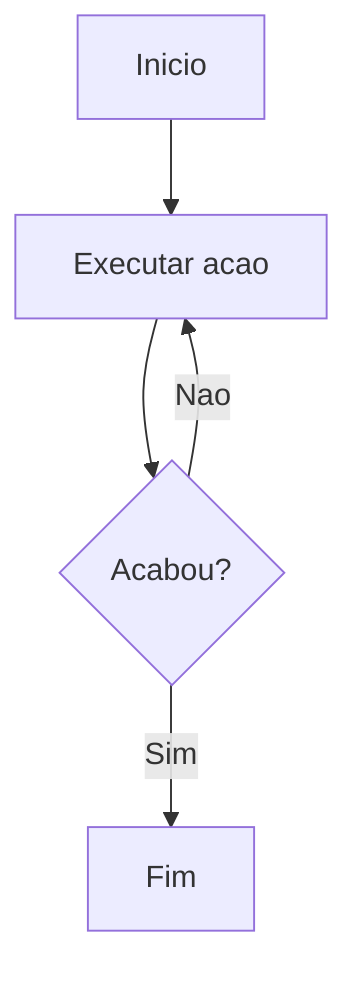
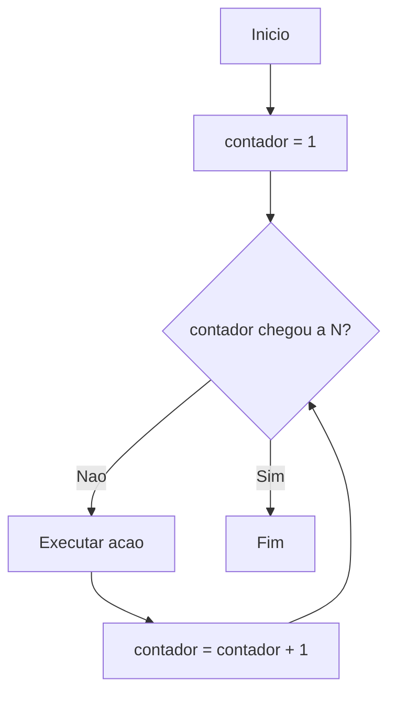
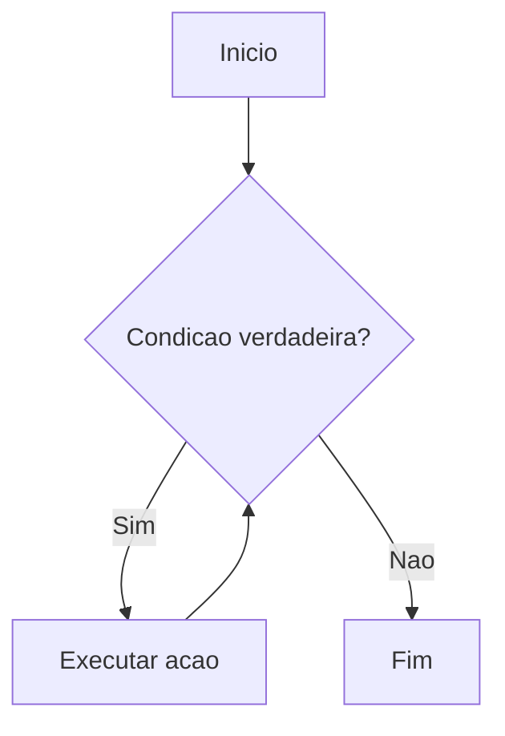
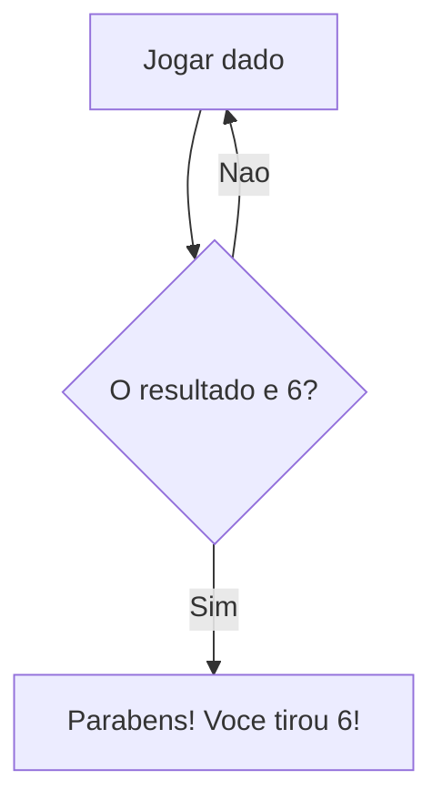
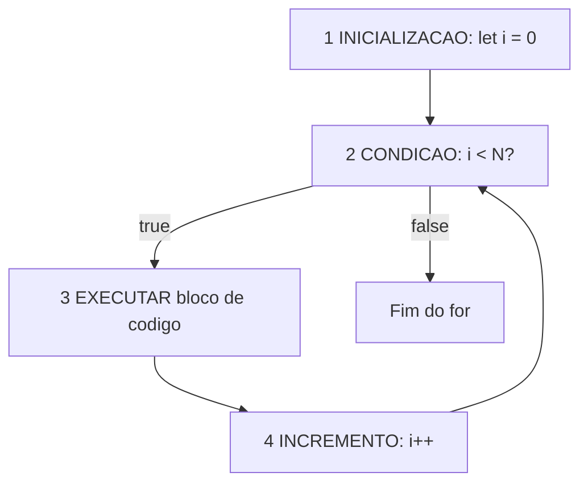
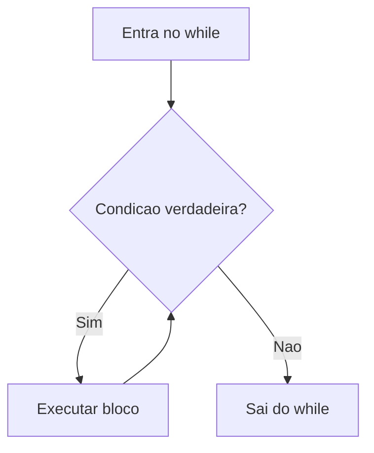
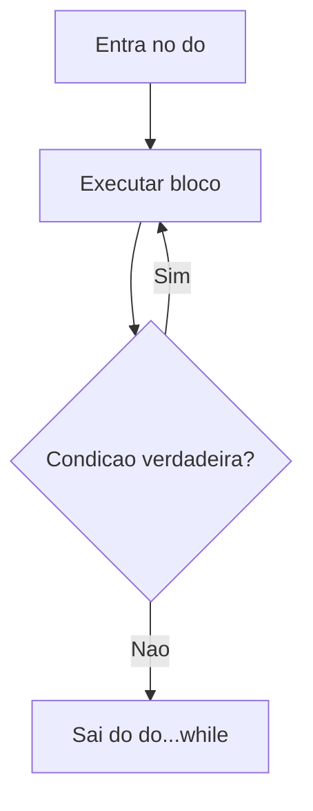
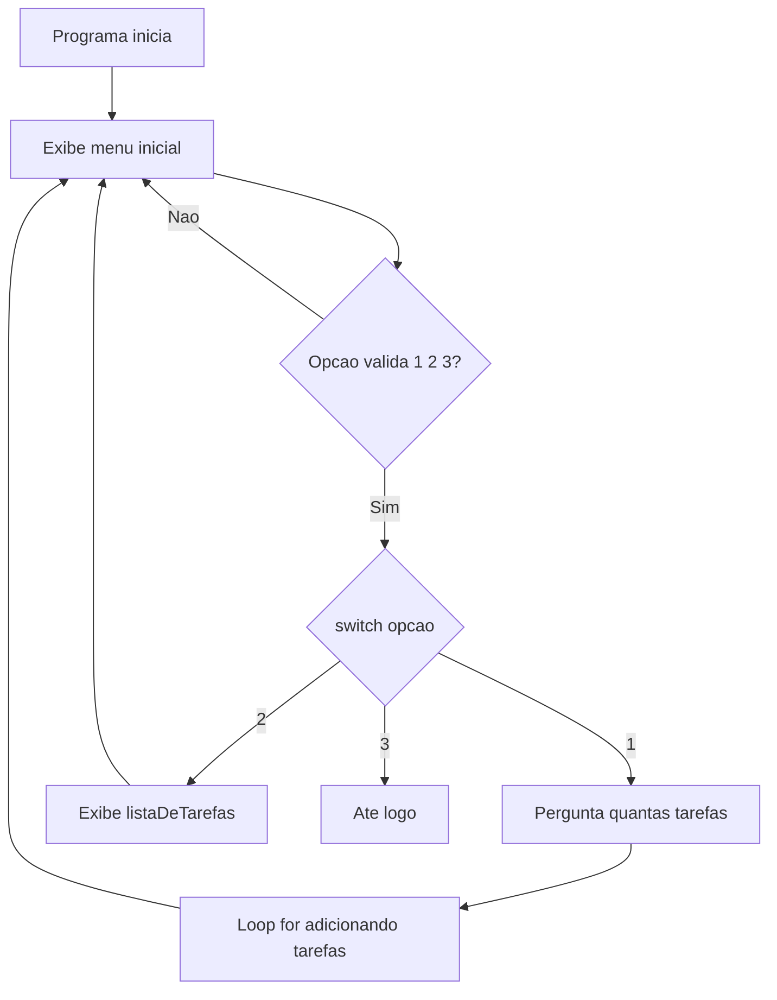

# JavaScript — Do Zero ao Profissional — Aula 08

## Loops — for, while e do...while

**Duração estimada:** 110 minutos (60 de leitura + 50 de prática)
**Nível:** Iniciante
**Pré-requisitos:** Aula 01 (console.log) + Aula 02 (let, const) + Aula 03 (tipos primitivos) + Aula 04 (operadores de comparação e lógicos) + Aula 05 (prompt, alert, Number) + Aula 06 (strings, trim, toLowerCase, includes) + Aula 07 (if, else, switch, truthy/falsy)

---

## Objetivos de Aprendizagem

Ao final desta aula, você será capaz de:

- [ ] **Explicar** o conceito de repetição (loop) em programação usando analogias do cotidiano (lavar pratos, checklist, fazer cópias)
- [ ] **Distinguir** repetição controlada por contador ("fazer N vezes") de repetição controlada por condição ("fazer até que algo mude")
- [ ] **Interpretar** diagramas de fluxo com loops, identificando a seta de retorno e a condição de saída
- [ ] **Implementar** repetição com `for` — let i = 0; i < N; i++
- [ ] **Implementar** repetição com `while` — repete enquanto condição verdadeira
- [ ] **Implementar** `do...while` — executa pelo menos uma vez, depois verifica
- [ ] **Aplicar** `break` para sair do loop e `continue` para pular iteração
- [ ] **Identificar, diagnosticar e corrigir** loops infinitos
- [ ] **Integrar** loops ao Gerenciador de Tarefas — menu repetitivo com while, adição múltipla com for, validação com do...while

---

## Como Usar Esta Aula

Esta aula está organizada em duas partes que se complementam.

Na **primeira parte** (seções 1 a 3), você vai entender o pensamento de repetição — o que significa "fazer a mesma coisa várias vezes no código". São conceitos universais, valem para QUALQUER linguagem de programação. As analogias são do cotidiano: lavar pratos, fazer cópias, digitar senha. Zero JavaScript por enquanto.

Na **segunda parte** (seções 4 a 9), você vai implementar CADA conceito em JavaScript. Vai aprender `for`, `while`, `do...while`, `break`, `continue` e loops infinitos. Cada seção tem prática guiada no Console e no editor.

Na **seção 9**, você vai aplicar TUDO ao Gerenciador de Tarefas — seu projeto vai ganhar um menu que roda SEMPRE, capacidade de adicionar várias tarefas e validação robusta com loops.

Cada seção termina com um **Quick Check**. As respostas estão logo abaixo. Tente responder de cabeça antes de olhar.

Ao longo do caminho, você encontrará seções **"Mão na Massa"** — momentos em que você vai ABRIR o Console ou o editor para praticar, não só ler. Ao final da aula, o arquivo separado **Questões de Aprendizagem** traz as tarefas de checkpoint — só avance para a próxima aula quando conseguir completá-las por conta própria.

> *"Até agora seu programa executava decisões: ele olhava para os dados e escolhia um caminho. Mas ele ainda executava cada caminho UMA VEZ. Hoje você vai ensinar seu código a REPETIR — a fazer a mesma ação dezenas, centenas, milhares de vezes sem se cansar. Seu código vai ganhar superpoderes."*

---

## Mapa Mental



> *O mapa mental acima mostra a estrutura da aula. Cada ramo representa um conceito que você vai explorar.*

---

## Recapitulação das Aulas Anteriores

| Aula | Conceito | Onde aparece nesta aula | Como se conecta |
|---|---|---|---|
| Aula 07 | **switch/case** | Seções 7, 9 | O break do switch é parecido com break de loops; o menu vira loop |
| Aula 07 | **if, else if, else** | Seções 4, 5, 6 | Condições dentro de loops decidem quando parar ou pular |
| Aula 07 | **Truthy/falsy** | Seções 5, 8 | while(condição) usa truthy/falsy para decidir se repete |
| Aula 06 | **trim(), toLowerCase(), includes()** | Seções 5, 6, 9 | Métodos de string continuam sendo usados dentro de loops |
| Aula 05 | **prompt(), alert(), template literals** | Seções 4, 5, 6, 9 | Entrada e saída acontecem dentro dos loops |
| Aula 04 | **Operadores de comparação (===, !==, >, <)** | Seções 4, 5 | As condições dos loops usam comparação |
| Aula 04 | **Operador ++** | Seções 4, 8 | Incremento (i++) é a peça central do for |
| Aula 02 | **let, const, variáveis** | Seções 4, 5, 6, 7, 8, 9 | Variáveis contadoras e acumuladoras são let |

---

**FUNDAMENTOS: A Ideia de Repetição**

> *Os conceitos desta seção são universais — valem para qualquer linguagem de programação, em qualquer computador. Você vai entender o que significa "repetir uma ação no código" usando analogias que já conhece: lavar pratos, fazer cópias, digitar senha, esperar na fila. Zero JavaScript. Só a ideia pura. Na segunda parte, você conectará cada conceito à sintaxe real.*

---

## 1. O que é repetição no código?

Pense em lavar 10 pratos. Você pega o primeiro prato, ensaboa, enxágua, seca. Pega o segundo prato, ensaboa, enxágua, seca. Pega o terceiro... e assim por diante, até o décimo.

Agora pense em fazer 100 cópias de um documento na impressora. Você coloca o original, aperta "100 cópias" e a máquina faz o MESMO trabalho 100 vezes — uma folha atrás da outra.

Estes são exemplos de **repetição** — fazer a mesma ação várias vezes, com itens diferentes ou em momentos diferentes.

### O padrão universal

Toda repetição em programação segue este padrão:

**AÇÃO + CONDIÇÃO DE PARADA = LOOP**

- **AÇÃO**: o que você quer repetir (ensaboar o prato, imprimir uma folha)
- **CONDIÇÃO DE PARADA**: quando você PARA de repetir (acabaram os pratos, cheguei na cópia 100)

Sem a condição de parada, você lava pratos para sempre — e ninguém quer isso.

### Por que isso é importante?

Sem repetição, seu código faria tudo UMA VEZ. Se você precisasse somar 100 números, escreveria 100 linhas de soma. Se precisasse exibir uma lista de 20 tarefas, escreveria 20 linhas de exibicao.

Com repetição, você escreve UMA vez e o computador executa quantas vezes for necessário.

> *E o computador NÃO se cansa. Esse é o superpoder. Você pode pedir para ele repetir uma operação 1 milhão de vezes e ele faz — sem reclamar, sem errar por cansaço, sem pedir aumento de salário.*

### O elemento visual: a seta que volta

No fluxograma da Aula 07, você viu que as setas sempre iam para frente — de uma ação para a próxima, uma decisão para uma ação, e assim por diante.

No loop, aparece uma seta especial: a **seta que volta**.



Perceba a seta que vai de "Acabou?" de volta para "Executar ação". Enquanto a resposta for NÃO, o fluxo continua voltando. Só quando a resposta for SIM é que o fluxo segue para o Fim.

Essa seta que volta É o loop. Sem ela, o código executaria a ação uma única vez e terminaria. Com ela, a ação se repete até a condição ser satisfeita.

### Três analogias do cotidiano

**Analogia 1 — Lavar pratos:**
- Ação: pegar um prato, ensaboar, enxaguar, secar
- Condição de parada: não tem mais pratos na pia
- Número de repetições: depende — 5 pratos = 5 vezes, 15 pratos = 15 vezes

**Analogia 2 — Checklist de viagem:**
- Ação: verificar um item da lista (passaporte, dinheiro, carregador...)
- Condição de parada: todos os itens foram verificados
- Número de repetições: o tamanho da lista

**Analogia 3 — Senha do celular:**
- Ação: digitar a senha
- Condição de parada: a senha está correta
- Número de repetições: imprevisível — pode ser 1 tentativa ou 10

Percebeu algo? As analogias 1 e 2 são diferentes da 3. Nas duas primeiras, você SABE quantas vezes vai repetir (10 pratos, 5 itens da lista). Na terceira, você NÃO SABE — só sabe que vai repetir até acertar.

Essa diferença é FUNDAMENTAL. Vamos explorá-la nas duas próximas seções.

### Quick Check 1

**1. No seu dia a dia, você faz ações repetitivas. Dê dois exemplos que sigam o padrão "AÇÃO + CONDIÇÃO DE PARADA".**
**Resposta:** Exemplos pessoais. Exemplo A: "Escovar os dentes — ação: escovar cada dente; parada: todos os dentes estão limpos." Exemplo B: "Subir escadas — ação: subir um degrau; parada: cheguei no último andar." Exemplo C: "Comer um pacote de biscoitos — ação: comer um biscoito; parada: o pacote acabou." Qualquer exemplo com uma ação repetida e uma condição para parar está correto.

**2. O que acontece em um programa que NÃO tem repetição? Dê um exemplo de tarefa que seria impossível ou impraticável sem loops.**
**Resposta:** Sem repetição, o programa executa cada comando uma única vez. Tarefas que exigem repetir a mesma ação muitas vezes se tornam impraticáveis. Exemplo: processar as notas de 500 alunos de uma escola. Você teria que escrever 500 blocos de código praticamente idênticos — um para cada aluno. Com um loop, você escreve o código UMA VEZ e o computador repete 500 vezes.

---

## 2. Repetição controlada por contador — "fazer N vezes"

Existe um tipo de repetição em que você SABE exatamente quantas vezes vai executar a ação antes mesmo de começar.

### Quando você SABE quantas vezes

Situações do cotidiano:
- A tabuada do 7: você sabe que tem 9 linhas (7x1 até 7x9)
- Contagem regressiva de 10 a 0: você sabe que são 11 números
- Ler 5 notas de um aluno: você sabe que são 5 notas
- Fazer 20 flexões: você sabe que são 20 repetições

Nestes casos, antes de começar, você já tem um número: "vou fazer isso N vezes".

### O padrão do contador

Toda repetição por contador segue 4 passos:

1. **INICIAR o contador**: "contador = 1" (ou "contador = 0" — a programação adora começar do zero)
2. **VERIFICAR se chegou ao fim**: "contador chegou a N?"
3. **EXECUTAR a ação**: fazer o que precisa ser feito
4. **AVANÇAR o contador**: "contador = contador + 1"

E então volta ao passo 2.

### Visualizando



Perceba o ciclo:
1. O retângulo maior no topo define o valor inicial (1)
2. O diamante pergunta "já chegou a N?"
3. O retângulo do meio executa a ação
4. O retângulo abaixo avança o contador
5. A seta de retorno leva de volta ao diamante

Este padrão é tão comum que ganhou sua própria estrutura própria em praticamente toda linguagem de programação. Você vai vê-lo na Seção 4 da segunda parte.

### Exemplo: Tabuada do 7

Vamos aplicar o padrão à tabuada do 7:

1. **INICIAR**: contador = 1
2. **VERIFICAR**: contador chegou a 10? (7x1 até 7x9, mas o padrão para quando contador = 10)
3. **EXECUTAR**: calcular 7 x contador e exibir o resultado
4. **AVANÇAR**: contador = contador + 1
5. Voltar ao passo 2

Simulação:
- contador = 1: 7 x 1 = 7. Avança para 2.
- contador = 2: 7 x 2 = 14. Avança para 3.
- contador = 3: 7 x 3 = 21. Avança para 4.
- ...
- contador = 9: 7 x 9 = 63. Avança para 10.
- contador = 10: "chegou a 10?" SIM → Fim.

### Exemplo: Contagem regressiva de foguete

1. **INICIAR**: contador = 10
2. **VERIFICAR**: contador chegou a 0?
3. **EXECUTAR**: exibir o número ("10... 9... 8...")
4. **AVANÇAR**: contador = contador - 1 (aqui DIMINUIMOS, não aumentamos)
5. Voltar ao passo 2

Perceba que o contador pode crescer OU diminuir. O que importa é que ele muda de forma previsível a cada repetição.

### A variável contadora

O contador é uma VARIÁVEL — um número que muda a cada repetição. Na programação, essa variável tem um nome especial: normalmente chamamos de `i` (de "índice" ou "iteração").

A cada volta do loop, `i` tem um valor diferente. E você pode usar `i` DENTRO da ação para personalizar o que acontece.

> *"Você pode pensar no contador como aquele funcionário do supermercado que carimba a mão de quem entra. Cada pessoa que passa recebe um número. A primeira é 1, a segunda é 2... O carimbo é a ação. O contador é o número que muda."*

### Quick Check 2

**1. Você está organizando uma festa e precisa colocar 30 cadeiras em fila. A ação é "colocar uma cadeira". Qual é o contador, o valor inicial, o valor final e o avanço?**
**Resposta:** Contador = número da cadeira. Inicial = 1. Final = 30 (quando contador chegar a 31, para). Avanço = contador + 1. O loop executa 30 vezes, uma para cada cadeira.

**2. Na contagem regressiva de um foguete (10, 9, 8... 0), qual a diferença no padrão em relação à tabuada?**
**Resposta:** A diferença é a DIREÇÃO do contador. Na tabuada, o contador SOBE (1, 2, 3...) — a ação é "aumentar". Na contagem regressiva, o contador DESCE (10, 9, 8...) — a ação é "diminuir". O padrão é o mesmo (iniciar, verificar, executar, avançar), mas o avanço é uma subtração em vez de uma adição.

---

## 3. Repetição controlada por condição — "fazer até que algo mude"

Agora imagine situações em que você NÃO SABE quantas vezes vai repetir. Você só sabe a CONDIÇÃO que precisa ser satisfeita para parar.

### Quando você NÃO SABE quantas vezes

Situações do cotidiano:
- Digitar a senha do celular até acertar (pode ser 1 tentativa ou 10)
- Jogar um dado até tirar 6 (pode ser na 1a jogada ou na 20a)
- Esperar na fila do banco até ser chamado (pode ser 5 minutos ou 2 horas)
- Procurar uma vaga no estacionário (dar voltas até achar)

Nestes casos, você NÃO TEM UM NÚMERO. Você tem uma CONDIÇÃO: "repete enquanto a senha estiver errada", "repete enquanto não tirar 6".

### O padrão da condição

1. **VERIFICAR a condição**: "a condição é verdadeira?"
2. Se SIM: EXECUTAR a ação
3. Voltar ao passo 1
4. Se NÃO: continuar (sair do loop)

Perceba a diferença crucial: no contador, você testa "já chegou ao fim?" e a resposta eventualmente será sim porque o contador cresce. Na condição, você testa "a condição ainda é verdadeira?" e a resposta depende de fatores externos — a senha que o usuário digita, o número que sai no dado, etc.

### Visualizando



O formato é mais simples que o do contador: não tem a etapa de "iniciar" nem "avançar". Apenas verificar e executar. A ação DENTRO do loop é que deve, em algum momento, fazer a condição se tornar falsa (digitar a senha correta, tirar 6 no dado).

### Comparando os dois tipos

| Característica | Por contador (Seção 2) | Por condição (Seção 3) |
|---|---|---|
| Você sabe quantas vezes? | SIM | NÃO |
| O que controla a parada? | Uma variável que conta | Uma condição que muda |
| Exemplo | Tabuada do 7 (9 vezes) | Senha (até acertar) |
| Padrão | Iniciar → Verificar → Executar → Avançar | Verificar → Executar → Verificar de novo |
| Risco principal | Contador errado (executa vezes demais ou de menos) | Loop infinito (condição nunca muda) |

### Exemplo: Senha do celular

1. **CONDIÇÃO**: "a senha digitada está errada?"
2. Se SIM (está errada): pedir para digitar novamente
3. Voltar ao passo 1
4. Se NÃO (está correta): desbloquear o celular

Veja que a condição é VERIFICADA ANTES de pedir a senha pela primeira vez. Mas isso cria um problema: na primeira vez, o usuário ainda não digitou nada. Então a senha atual é vazia, que está errada, e o loop executa. Isso funciona, mas é um pouco estranho.

Na Seção 6 da segunda parte, você vai ver uma variação que resolve isso.

### Exemplo: Dado até tirar 6



Perceba a seta de retorno: enquanto não tirar 6, você continua jogando. Quando tirar 6, o fluxo segue para a mensagem de parabéns.

> *"A diferença entre os dois tipos é a mesma diferença entre 'fazer 10 flexões' e 'fazer flexões até não aguentar mais'. Na primeira, você sabe exatamente quando vai parar. Na segunda, você só sabe a condição de parada — 'quando não aguentar mais'."*

### Quick Check 3

**1. Classifique cada situação como "repetição por contador" ou "repetição por condição": a) Somar 10 números, b) Pedir nota até o usuário digitar um valor válido, c) Exibir o cardápio 3 vezes, d) Ler arquivos de uma pasta até não ter mais nenhum.**
**Resposta:** a) Contador (são 10 números, você sabe quantas vezes). b) Condição (você não sabe quantas tentativas o usuário vai precisar). c) Contador (são 3 vezes, exatas). d) Condição (você não sabe quantos arquivos existem).

**2. Qual o principal risco de uma repetição por condição? Em que situação o loop nunca pararia?**
**Resposta:** O principal risco é o LOOP INFINITO — a condição nunca se torna falsa. Isso acontece se nada dentro do loop alterar a condição. Exemplo: um loop que verifica "a senha está correta?" mas nunca pede uma nova senha — a senha continua errada para sempre. O computador fica preso verificando a mesma condição infinitamente.

---

**APLICAÇÃO: Loops em JavaScript e o Gerenciador de Tarefas**

> *Agora que você entende os dois tipos de repetição (por contador e por condição), vamos implementá-los em JavaScript. Cada estrutura de loop nesta parte mapeia diretamente um conceito da Primeira Parte. Ao final, seu Gerenciador de Tarefas vai ganhar um menu que roda SEMPRE, adição múltipla de tarefas e validação robusta.*

---

## 4. for — repetição com contador em JavaScript

Vamos começar com o tipo mais comum de loop: o `for`. Ele implementa exatamente o padrão "repetição por contador" que você aprendeu na Seção 2.

### A sintaxe

```javascript
for (inicializacao; condicao; incremento) {
    // codigo executado a cada repeticao
}
```

O `for` tem TRÊS partes dentro dos parênteses, separadas por ponto e vírgula (`;`):

1. **inicializacao**: executada UMA VEZ, antes do loop começar. Normalmente cria a variável contadora: `let i = 0`
2. **condicao**: verificada ANTES de cada repetição. Enquanto for `true`, o loop continua. Quando for `false`, o loop para.
3. **incremento**: executado ao FINAL de cada repetição. Normalmente aumenta o contador: `i++`

### A ordem de execução

O `for` segue EXATAMENTE os 4 passos da Seção 2:



### Exemplo 1: Contando de 0 a 4

O exemplo mais básico de for:

```javascript
for (let i = 0; i < 5; i++) {
    console.log("Iteracao numero: " + i);
}
```

**Simulação passo a passo:**

1. `i = 0` (inicialização). Condição: `0 < 5`? Sim. Executa: exibe "Iteracao numero: 0". Incremento: `i` vira 1.
2. `i = 1`. Condição: `1 < 5`? Sim. Executa: exibe "Iteracao numero: 1". Incremento: `i` vira 2.
3. `i = 2`. Condição: `2 < 5`? Sim. Executa: exibe "Iteracao numero: 2". Incremento: `i` vira 3.
4. `i = 3`. Condição: `3 < 5`? Sim. Executa: exibe "Iteracao numero: 3". Incremento: `i` vira 4.
5. `i = 4`. Condição: `4 < 5`? Sim. Executa: exibe "Iteracao numero: 4". Incremento: `i` vira 5.
6. `i = 5`. Condição: `5 < 5`? NÃO. Loop termina.

**Resultado no console:**
```
Iteracao numero: 0
Iteracao numero: 1
Iteracao numero: 2
Iteracao numero: 3
Iteracao numero: 4
```

> *"Parece mágica? Não é. É um padrão tão previsível que você vai aprender a 'ler' um for como se fosse uma frase: 'para i de 0 até N-1, faça isso'."*

### Exemplo 2: Tabuada do 7 (lembra da Seção 2?)

```javascript
let numero = 7;

for (let i = 1; i <= 9; i++) {
    let resultado = numero * i;
    console.log(numero + " x " + i + " = " + resultado);
}
```

**Resultado:**
```
7 x 1 = 7
7 x 2 = 14
7 x 3 = 21
7 x 4 = 28
7 x 5 = 35
7 x 6 = 42
7 x 7 = 49
7 x 8 = 56
7 x 9 = 63
```

Compare com a Seção 2: o `for` implementa exatamente o padrão "iniciar, verificar, executar, avançar". A variável `i` é o contador. A condição `i <= 9` é "já chegou ao fim?". O `i++` é "avançar o contador".

### Exemplo 3: Contagem regressiva

```javascript
for (let i = 10; i >= 0; i--) {
    console.log(i);
}
console.log("FOGO!");
```

**Resultado:**
```
10
9
8
...
1
0
FOGO!
```

Aqui o incremento é `i--` (diminuir), e a condição verifica enquanto `i >= 0`. O contador DESCE.

### O i é uma variável normal

Dentro do bloco do `for`, `i` é uma variável como qualquer outra. Você pode usá-la para cálculos, condições, concatenação — o que quiser.

```javascript
// Usando i para calcular o dobro
for (let i = 1; i <= 5; i++) {
    let dobro = i * 2;
    console.log("O dobro de " + i + " e " + dobro);
}
```

### Erros comuns do for

**Erro 1: esquecer o incremento → loop infinito**

```javascript
for (let i = 0; i < 5; ) {  // ERRO: sem i++!
    console.log(i);
    // i nunca muda, condicao sempre true
}
```

**Erro 2: ponto e vírgula errado**

```javascript
for (let i = 0; i < 5; i++); {  // ERRO: ; depois do for
    console.log(i);  // Este bloco NAO pertence ao for!
}
```

O `;` depois do `)` encerra o for com bloco vazio. O `{ }` abaixo vira um bloco separado.

**Erro 3: condição que nunca é verdadeira**

```javascript
for (let i = 0; i > 5; i++) {  // i comeca em 0, condicao i > 5 e false
    console.log("Nunca executa");
}
```

O bloco NUNCA executa porque a condição já é `false` na primeira verificação.

**Erro 4: condição que nunca é falsa**

```javascript
for (let i = 0; i >= 0; i++) {  // i sempre sera >= 0
    console.log(i);  // Executa para sempre!
}
```

### Mao na Massa — Tabuada com for

Abra o Console do navegador (F12, aba Console) e digite:

```javascript
// Sua vez: crie uma tabuada interativa
let numero = prompt("Digite um numero para ver a tabuada:");
numero = Number(numero);

for (let i = 1; i <= 9; i++) {
    let resultado = numero * i;
    console.log(numero + " x " + i + " = " + resultado);
}
```

Teste com números diferentes: 3, 7, 12. Veja como o mesmo código funciona para qualquer número.

**Desafio extra:** modifique o loop para ir de 1 a 10 em vez de 1 a 9 (mude a condição para `i <= 10`).

### Quick Check 4

**1. Quantas vezes este loop executa? Qual o valor da última iteração?**
```javascript
for (let i = 0; i < 3; i++) {
    console.log("Volta: " + i);
}
```
**Resposta:** Executa 3 vezes (voltas 0, 1, 2). O último valor de `i` dentro do loop é 2. O loop para quando `i = 3`, porque `3 < 3` é `false`.

**2. Escreva um for que exiba os números pares de 2 a 10 (2, 4, 6, 8, 10). Dica: o incremento pode ser maior que 1.**
**Resposta:** `for (let i = 2; i <= 10; i = i + 2) { console.log(i); }`. A inicialização começa em 2, a condição vai até 10, e o incremento soma 2 a cada volta. Outra opção: `for (let i = 2; i <= 10; i += 2)` — o operador `+=` faz a mesma coisa.

---

## 5. while — repetição condicional em JavaScript

Agora vamos implementar a repetição por condição (Seção 3). Em JavaScript, usamos `while`.

### A sintaxe

```javascript
while (condicao) {
    // codigo executado enquanto condicao for true
}
```

- O `while` verifica a condição PRIMEIRO.
- Se for `true`, executa o bloco.
- Depois de executar, VOLTA a verificar a condição.
- Se for `false`, pula o bloco e continua o programa.

### A regra de ouro do while

Se a condição for `false` na PRIMEIRA verificação, o bloco NUNCA executa. É zero ou mais repetições — pode executar 0 vezes, 1 vez, 100 vezes, nunca.

### Visualizando



### Exemplo 1: Senha (lembra da Seção 3?)

```javascript
let senhaCorreta = "1234";
let tentativa = prompt("Digite a senha:");

while (tentativa !== senhaCorreta) {
    alert("Senha incorreta! Tente novamente.");
    tentativa = prompt("Digite a senha:");
}

alert("Acesso permitido!");
```

**Explicação passo a passo:**

1. Pede a senha uma vez ANTES do while.
2. Verifica: `tentativa !== senhaCorreta` é `true`? Se for, entra no loop.
3. Dentro do loop: avisa que errou, pede nova senha.
4. Volta ao passo 2.
5. Quando acertar, a condição vira `false` e o loop termina.
6. Exibe "Acesso permitido!".

> *"Parece um segurança de porta de balada. 'Qual a senha?' Errou? 'Qual a senha?' Errou de novo? 'Qual a senha?' Acertou? 'Pode entrar.' O segurança pergunta SEMPRE antes de deixar passar."*

### Exemplo 2: Rolar um dado até tirar 6

```javascript
let resultado = 0;

while (resultado !== 6) {
    resultado = Math.floor(Math.random() * 6) + 1;
    console.log("Voce tirou: " + resultado);
}

console.log("Parabens! Tirou 6!");
```

**Explicação:**

- `Math.random()` gera um número decimal entre 0 e 1 (ex: 0.734)
- `Math.random() * 6` vira um número entre 0 e 5.999
- `Math.floor()` arredonda para baixo (0 a 5)
- `+ 1` desloca para 1 a 6
- Enquanto o resultado não for 6, continua jogando

**Exemplo de saída:**
```
Voce tirou: 3
Voce tirou: 1
Voce tirou: 5
Voce tirou: 6
Parabens! Tirou 6!
```

### Exemplo 3: Menu repetitivo

```javascript
let opcao = "";

while (opcao !== "3") {
    opcao = prompt("=== MENU ===\n1 - Ver saldo\n2 - Extrato\n3 - Sair");
    
    if (opcao === "1") {
        alert("Seu saldo e R$ 1000,00");
    } else if (opcao === "2") {
        alert("Extrato: nenhuma movimentacao recente.");
    } else if (opcao === "3") {
        alert("Ate logo!");
    } else {
        alert("Opcao invalida!");
    }
}
```

Este é o padrão que você vai usar no Gerenciador de Tarefas na Seção 9. O menu aparece, o usuário escolhe, faz a ação, e o menu volta a aparecer. Só para quando o usuário escolhe "Sair".

### A conexão com truthy/falsy (Aula 07)

O `while` usa truthy/falsy para avaliar a condição. Você pode usar isso a seu favor:

```javascript
// Em vez de:
while (nome !== "" && nome !== null && nome !== undefined) {

// Use:
while (nome) {  // Enquanto nome for truthy
```

Mas CUIDADO com o valor 0:

```javascript
let tentativas = 3;

while (tentativas) {  // 0 e falsy, entao para quando tentativas chegar a 0
    console.log("Tentativa " + tentativas);
    tentativas--;
}
// Funciona! Quando tentativas vira 0, o loop para.
```

### Mao na Massa — Senha com while

Abra o Console e digite:

```javascript
let senhaSecreta = "opencode";
let entrada = "";

while (entrada !== senhaSecreta) {
    entrada = prompt("Digite a senha secreta:");
    
    if (entrada === null) {
        alert("Cancelou? Tchau!");
        break;  // break sai do while — voce vai aprender na Secao 7
    }
}

if (entrada === senhaSecreta) {
    alert("ACESSO AUTORIZADO! Bem-vindo ao sistema.");
}
```

Teste: digite senhas erradas, veja o loop continuar. Depois digite "opencode" e veja a mensagem de sucesso.

### Quick Check 5

**1. O que este código exibe?**
```javascript
let contador = 0;
while (contador < 3) {
    console.log(contador);
    contador++;
}
```
**Resposta:** Exibe 0, 1, 2 (cada um em uma linha). O loop começa com `contador = 0`, executa enquanto `contador < 3`, e incrementa a cada volta.

**2. Qual a diferença fundamental entre for e while? Quando você usaria um vs o outro?**
**Resposta:** O `for` é feito para repetição POR CONTADOR — você sabe quantas vezes vai repetir. O `while` é para repetição POR CONDIÇÃO — você não sabe quantas vezes, só sabe a condição para parar. Use `for` quando tiver um contador claro (ex: "10 vezes"). Use `while` quando depender de uma condição externa (ex: "até o usuario acertar a senha").

---

## 6. do...while — execute pelo menos uma vez

Agora uma variação importante do `while`. O `do...while` garante que o bloco execute PELO MENOS UMA VEZ, mesmo que a condição seja falsa.

### A sintaxe

```javascript
do {
    // codigo executado pelo menos uma vez
} while (condicao);
```

Perceba a diferença: o `do` vem primeiro, o bloco executa, e SÓ DEPOIS a condição é verificada.

### A regra de ouro do do...while

O bloco sempre executa PELO MENOS UMA VEZ. Depois da primeira execução, a condição é verificada. Se for `true`, repete. Se for `false`, para.

É a resposta para o problema que identifiquei na Seção 3: "como fazer uma ação antes de verificar a condição?"

### Visualizando



Compare com o while da Seção 5. No while, o diamante vem ANTES do retângulo. No do...while, o retângulo vem ANTES do diamante. Essa inversão é a única diferença — mas ela faz toda a diferença quando você PRECISA que algo aconteça ao menos uma vez.

### Comparação visual: while vs do...while

| Característica | while | do...while |
|---|---|---|
| Verificação | Antes de executar | Depois de executar |
| Mínimo de execuções | 0 (pode não executar nunca) | 1 (executa ao menos uma vez) |
| Quando usar | "Só executa se a condição for verdadeira" | "Executa primeiro, depois decide se repete" |

### Exemplo 1: Validação de entrada

O caso de uso MAIS COMUM do `do...while`. Você PRECISA que o usuário digite algo, e só depois verifica se é válido.

```javascript
let numero;

do {
    numero = prompt("Digite um numero positivo:");
    numero = Number(numero);
} while (numero <= 0);

alert("Numero valido: " + numero);
```

**Explicação:**

1. O bloco executa primeiro: pergunta um número e converte.
2. Só DEPOIS verifica: "é menor ou igual a zero?"
3. Se for (ex: -5, 0), VOLTA a perguntar.
4. Se não for (ex: 7), SAI do loop e exibe o número.

Se você tentasse fazer isso com `while`, precisaria de uma gambiarra:

```javascript
// Versao com while — menos elegante
let numero2 = prompt("Digite um numero positivo:");
numero2 = Number(numero2);

while (numero2 <= 0) {
    numero2 = prompt("Numero invalido! Digite um numero positivo:");
    numero2 = Number(numero2);
}
```

O `do...while` elimina a duplicação do prompt — você escreve a pergunta UMA VEZ.

### Exemplo 2: Menu com validação rígida

```javascript
let opcao;

do {
    opcao = prompt("Escolha: 1-Cafe 2-Cha 3-Suco");
} while (opcao !== "1" && opcao !== "2" && opcao !== "3");

alert("Voce escolheu a opcao " + opcao);
```

O loop só para quando o usuário digitar exatamente "1", "2" ou "3". Qualquer outra coisa (vazio, "abc", "4") faz o loop continuar.

### Exemplo 3: Jogo "Adivinhe o número" (versão simplificada)

```javascript
let numeroSecreto = 7;
let palpite;

do {
    palpite = prompt("Adivinhe o numero (1 a 10):");
    palpite = Number(palpite);
    
    if (palpite < numeroSecreto) {
        alert("Muito baixo!");
    } else if (palpite > numeroSecreto) {
        alert("Muito alto!");
    }
} while (palpite !== numeroSecreto);

alert("ACERTOU!");
```

O `do...while` é perfeito aqui porque você SEMPRE precisa pedir um palpite antes de verificar.

### Mao na Massa — Validação com do...while

```javascript
// Validador de nota escolar
let nota;

do {
    nota = prompt("Digite a nota do aluno (0 a 10):");
    nota = Number(nota);
    
    if (isNaN(nota)) {
        alert("Isso nao e um numero! Tente novamente.");
    } else if (nota < 0 || nota > 10) {
        alert("Nota deve estar entre 0 e 10!");
    }
} while (isNaN(nota) || nota < 0 || nota > 10);

// Classifica a nota
if (nota >= 7) {
    alert("Aprovado com nota " + nota);
} else if (nota >= 5) {
    alert("Recuperacao com nota " + nota);
} else {
    alert("Reprovado com nota " + nota);
}
```

Teste: digite valores inválidos (-5, 15, "abc") e veja o loop insistir. Depois digite um valor válido (7) e veja a classificação.

### Quick Check 6

**1. Qual a diferença crítica entre `while` e `do...while`? Dê um exemplo onde `do...while` é a escolha certa.**
**Resposta:** A diferença é QUANDO a condição é verificada. `while` verifica ANTES de executar (pode executar 0 vezes). `do...while` executa PRIMEIRO e verifica DEPOIS (executa pelo menos 1 vez). `do...while` é ideal para validação de entrada — você PRECISA que o usuário digite algo antes de verificar se é válido.

**2. O que este código exibe?**
```javascript
let x = 10;
do {
    console.log("Valor: " + x);
    x++;
} while (x < 5);
```
**Resposta:** Exibe "Valor: 10" uma vez. Mesmo que a condição `x < 5` seja `false` (10 não é menor que 5), o bloco executa UMA VEZ porque o `do...while` executa primeiro e verifica depois. Depois da primeira execução, a condição é testada e o loop termina.

---

## 7. break e continue — controle fino dentro do loop

Às vezes você precisa de mais controle dentro de um loop. Duas palavras especiais do JavaScript ajudam nisso: `break` e `continue`.

### break — sair do loop IMEDIATAMENTE

O `break` já apareceu na Aula 07, dentro do `switch`. No switch, ele serve para sair do case. No loop, ele serve para sair do loop ANTES da condição normal de parada.

```javascript
// Encontrar o numero 7 em uma sequencia
for (let i = 1; i <= 10; i++) {
    console.log("Testando: " + i);
    
    if (i === 7) {
        console.log("ACHEI O 7!");
        break;  // Sai do for imediatamente
    }
}

console.log("Loop encerrado");
```

**Resultado:**
```
Testando: 1
Testando: 2
Testando: 3
Testando: 4
Testando: 5
Testando: 6
Testando: 7
ACHEI O 7!
Loop encerrado
```

Perceba: os números 8, 9, 10 NUNCA são testados. O `break` interrompeu o loop no 7.

> *"O break é como um 'vazamento de emergência' do loop. Você está caminhando pelos corredores (iterações) e de repente encontra a sala que procurava — PUM, sai pela porta mais próxima. Não precisa terminar de percorrer o resto do corredor."*

### continue — pular a iteração atual

O `continue` é diferente: ele NÃO sai do loop. Ele PULA a iteração atual e vai para a PRÓXIMA.

```javascript
// Exibir apenas numeros pares de 1 a 10
for (let i = 1; i <= 10; i++) {
    if (i % 2 !== 0) {
        continue;  // Pula numeros impares
    }
    console.log(i + " e par");
}
```

**Resultado:**
```
2 e par
4 e par
6 e par
8 e par
10 e par
```

O `continue` funciona assim:
1. `i = 1`: 1 é ímpar (`1 % 2 !== 0` é `true`) → `continue` → pula para `i++` → `i = 2`
2. `i = 2`: 2 é par → `console.log("2 e par")` → `i++` → `i = 3`
3. E assim por diante.

### break vs continue

| Comportamento | break | continue |
|---|---|---|
| O que faz | Sai do loop COMPLETAMENTE | Pula APENAS a iteração atual |
| O que acontece com o loop | Termina | Continua na próxima iteração |
| Quando usar | Encontrou o que procurava, deu erro fatal, limite de tentativas | Dado invalido, valor a ignorar, caso especial |

### Exemplo prático: Validação com limite de tentativas

```javascript
let senhaCorreta = "1234";
let tentativas = 0;
let maxTentativas = 3;
let acessoPermitido = false;

while (tentativas < maxTentativas) {
    let tentativa = prompt("Digite a senha (" + (maxTentativas - tentativas) + " tentativas restantes):");
    tentativas++;
    
    if (tentativa === null) {
        console.log("Operacao cancelada.");
        break;  // Usuario cancelou — sai do loop
    }
    
    if (tentativa === "") {
        console.log("Tentativa vazia ignorada.");
        tentativas--;  // Nao conta esta tentativa
        continue;  // Pula para a proxima iteracao
    }
    
    if (tentativa === senhaCorreta) {
        acessoPermitido = true;
        break;  // Acertou — sai do loop
    }
    
    console.log("Senha incorreta!");
}

if (acessoPermitido) {
    alert("Bem-vindo!");
} else {
    alert("Acesso bloqueado.");
}
```

Este exemplo usa AMBOS os comandos:
- `break` quando o usuário cancela ou acerta
- `continue` quando a tentativa está vazia

### Cuidado: break no loop vs break no switch

O `break` dentro de um `for` ou `while` sai do LOOP, não do `switch`. Se você tiver um `switch` dentro de um loop, o `break` do `switch` interrompe apenas o `case`, não o loop:

```javascript
for (let i = 0; i < 5; i++) {
    switch (i) {
        case 0:
            console.log("Zero");
            break;  // Sai do switch, NAO do for
        case 1:
            console.log("Um");
            break;  // Sai do switch, NAO do for
    }
    console.log("Fim da iteracao " + i);
}
```

Para sair do loop dentro de um `switch`, você precisa de uma flag ou do `break` rotulado (mais avançado — veremos depois).

### Mao na Massa — Caça ao número

```javascript
// O programa "pensa" em um número e você tenta adivinhar
let numeroSecreto = Math.floor(Math.random() * 20) + 1;
let tentativasMaximas = 5;

console.log("Pensei em um numero entre 1 e 20.");
console.log("Voce tem " + tentativasMaximas + " tentativas.");

for (let i = 1; i <= tentativasMaximas; i++) {
    let palpite = prompt("Tentativa " + i + ": Qual o numero?");
    palpite = Number(palpite);
    
    // Pula se nao for numero valido
    if (isNaN(palpite) || palpite < 1 || palpite > 20) {
        alert("Palpite invalido! Digite um numero entre 1 e 20.");
        continue;  // Pula para a proxima tentativa
    }
    
    // Acertou!
    if (palpite === numeroSecreto) {
        alert("PARABENS! Voce acertou em " + i + " tentativa(s)!");
        break;  // Sai do for
    }
    
    // Dica
    if (palpite < numeroSecreto) {
        alert("Muito baixo!");
    } else {
        alert("Muito alto!");
    }
}

if (palpite !== numeroSecreto) {
    alert("Acabaram as tentativas! O numero era " + numeroSecreto);
}
```

Teste: execute várias vezes, veja como `continue` pula palpites inválidos e `break` sai quando acerta.

### Quick Check 7

**1. Qual a diferença entre `break` e `continue` dentro de um loop? Dê um exemplo de cada.**
**Resposta:** `break` ENCERRA o loop completamente — o programa continua na linha seguinte ao loop. `continue` pula APENAS a iteração atual — o loop continua com a próxima iteração. Exemplo de `break`: encontrar um número numa lista — quando achar, para de procurar. Exemplo de `continue`: processar números pares — quando encontrar um ímpar, pula e vai para o próximo.

**2. O que este código exibe no console?**
```javascript
for (let i = 1; i <= 5; i++) {
    if (i === 3) {
        continue;
    }
    console.log(i);
}
```
**Resposta:** Exibe 1, 2, 4, 5 (cada um em uma linha). O número 3 é pulado porque quando `i === 3`, o `continue` interrompe aquela iteração e vai para a próxima (`i++`). O console.log do 3 nunca executa.

---

## 8. Loop infinito — como criar e como evitar

Loop infinito é o pesadelo de todo programador iniciante. É quando a condição do loop NUNCA se torna falsa — e o computador fica preso para sempre (ou até travar).

### Como criar um loop infinito (acidentalmente)

**Causa 1: esquecer o incremento no for**

```javascript
for (let i = 0; i < 10; ) {  // ERRO: sem i++!
    console.log("Nunca para!");
}
```

`i` nunca muda. A condição `i < 10` é sempre `true`. Loop infinito.

**Causa 2: condição que sempre é true no while**

```javascript
let continuar = true;
while (continuar) {  // Nunca muda para false!
    console.log("Socorro!");
    // Nada aqui altera continuar
}
```

**Causa 3: usar = em vez de === na condição**

```javascript
let acabou = false;
while (acabou = false) {  // ERRO: = em vez de ===
    console.log("Isso nunca executa...");  // Na verdade nunca executa
}
```

Espera — isso na verdade NUNCA executa? Vamos entender:

`acabou = false` é uma ATRIBUIÇÃO. Ela coloca `false` em `acabou`. O resultado da expressão é `false`. Então a condição é `false` e o loop NUNCA executa.

Mas e se for o contrário?

```javascript
let acabou = true;
while (acabou = false) {  // Atribui false
    // Nao executa
}
```

E:

```javascript
let acabou = false;
while (acabou = true) {  // ATRIBUICAO! Acabou vira true, resultado e true
    console.log("LOOP INFINITO!");
    // acabou sempre vira true de novo a cada verificacao
}
```

Este é o PERIGO! O programador queria escrever `while (acabou === true)` mas escreveu `while (acabou = true)`. A atribuição sempre retorna `true`, e o loop nunca para.

**Causa 4: condição nunca atinge o valor de parada**

```javascript
for (let i = 10; i >= 0; i++) {  // ERRO: i++ em vez de i--!
    console.log(i);  // 10, 11, 12, 13... para nunca!
}
```

A intenção era contar de 10 a 0 (usar `i--`), mas escreveu `i++`. O contador vai para o infinito.

### Como DETECTAR um loop infinito

No navegador, um loop infinito trava a página:
1. A página fica sem resposta
2. O navegador pergunta: "Esta página está travada. Deseja esperar ou fechar?"
3. O console não mostra mais nada (porque o código está preso no loop)

**Como interromper:**
- Feche a aba do navegador
- Ou mate o processo do navegador
- Não adianta clicar em botões — o JavaScript está ocupado demais para responder

### Código com erro vs código corrigido

**Exemplo 1: Contagem regressiva quebrada**
```javascript
// ERRADO: loop infinito
for (let i = 10; i >= 0; i++) {  // i++ faz i crescer
    console.log(i);
}
```

```javascript
// CORRETO: contagem regressiva
for (let i = 10; i >= 0; i--) {  // i-- faz i decrescer
    console.log(i);
}
```

**Exemplo 2: while sem alteração**
```javascript
// ERRADO: loop infinito
let x = 0;
while (x < 5) {
    console.log("Oi");  // x nunca muda!
}
```

```javascript
// CORRETO: x incrementa
let x = 0;
while (x < 5) {
    console.log("Oi");
    x++;  // Agora x muda!
}
```

**Exemplo 3: Atribuição em vez de comparação**
```javascript
// ERRADO: while (condicao = true) e loop infinito
let ativo = true;
while (ativo = true) {  // Atribuicao, nao comparacao!
    console.log("Nunca para");
    ativo = false;  // Esta linha nunca altera a condicao!
}
```

Por que a linha `ativo = false` não funciona? Porque a condição do while é `ativo = true` — uma ATRIBUIÇÃO que coloca `true` de volta em `ativo` a cada verificação. O `ativo = false` dentro do bloco é imediatamente sobrescrito.

```javascript
// CORRETO: comparacao com ===
let ativo = true;
while (ativo === true) {  // Comparacao
    console.log("Para quando ativo for false");
    ativo = false;  // Agora funciona!
}
```

### O while(true) intencional

Às vezes você QUER um loop infinito — mas com controle interno usando `break`:

```javascript
// Loop "infinito" controlado
while (true) {
    let opcao = prompt("Digite 'sair' para terminar:");
    
    if (opcao === null) {
        break;  // Cancelou
    }
    
    if (opcao.toLowerCase() === "sair") {
        break;  // Digitou sair
    }
    
    console.log("Voce digitou: " + opcao);
}

console.log("Loop encerrado.");
```

Este padrão é comum: o loop roda "para sempre" (`while (true)`), mas tem `break`s internos que saem do loop em condições específicas. É como uma porta automática: fica fechada mas abre quando alguém chega perto.

### Mao na Massa — Conserte o loop

Abra o Console e execute cada código. Identifique o erro e corrija.

**Loop quebrado 1:**
```javascript
for (let i = 5; i > 0; i++) {
    console.log(i);
}
```
Este loop é infinito porque usa `i++` (aumenta) em vez de `i--` (diminui). O `i > 0` será sempre `true`.

**Correção:** trocar `i++` por `i--`.

**Loop quebrado 2:**
```javascript
let senha = "";
while (senha !== "1234") {
    console.log("Aguardando senha...");
}
```
Nunca pede uma nova senha. A condição nunca muda.

**Correção:** adicionar `senha = prompt("Digite a senha:");` dentro do loop.

**Loop quebrado 3:**
```javascript
let contador = 10;
let resultado = 0;
while (contador > 0); {
    resultado = resultado + contador;
    contador--;
}
console.log(resultado);
```

O ponto e vírgula `;` depois do `while` cria um loop vazio infinito: `while (contador > 0) ;` — o bloco `{ }` seguinte NÃO pertence ao while.

**Correção:** remover o `;` depois do `while (contador > 0)`.

### Quick Check 8

**1. Identifique o erro: `for (let i = 0; i < 10; i++)` parece ok, mas e se for `for (let i = 0; i < 10; i)` (sem o `++`)? O que acontece?**
**Resposta:** Sem o `i++`, a variável `i` nunca muda de valor. Ela permanece 0 para sempre. A condição `0 < 10` é sempre `true`. O loop nunca termina — é um loop infinito. O computador fica preso executando o bloco repetidamente até travar a página.

**2. Por que `while (ativo = true)` causa loop infinito, mas a intenção do programador era fazer `while (ativo === true)`?**
**Resposta:** `ativo = true` é uma ATRIBUIÇÃO, não uma comparação. Ela COLOCA o valor `true` dentro de `ativo`. O resultado da expressão é `true`. Na próxima verificação, o `=` coloca `true` novamente — sobrescrevendo qualquer alteração que o bloco tenha feito. A condição é SEMPRE `true`. Já `ativo === true` é uma COMPARAÇÃO que apenas verifica o valor — se o bloco mudar `ativo` para `false`, a condição passa a ser `false` e o loop termina.

---

## 9. Gerenciador de Tarefas com loops

Agora vamos aplicar TUDO que você aprendeu. Você vai transformar o Gerenciador de Tarefas da Aula 07 em um programa que roda de VERDADE — com menu repetitivo, adição múltipla de tarefas e validação robusta.

### O que muda da Aula 07 para a Aula 08

Na Aula 07, seu Gerenciador executava UMA VEZ: mostrava o menu, processava a opção e terminava. Para adicionar outra tarefa, o usuário precisava recarregar a página.

Hoje, seu Gerenciador vai executar em LOOP: mostra o menu, processa a opção, e VOLTA a mostrar o menu. O usuário só sai quando escolhe "Sair".

| Característica | Aula 07 (sem loop) | Aula 08 (com loop) |
|---|---|---|
| Menu | Aparece uma vez | Aparece até o usuario sair |
| Adicionar tarefas | Uma por vez | Quantas o usuario quiser |
| Validacao | if/else | while + do...while |
| Listar tarefas | Placeholder | Funcional com concatenacao |
| Variaveis separadas | tarefa1, tarefa2 | String acumulada |

### A limitação honesta (antes de começar)

Nesta aula, ainda não temos arrays (Aula 09). Para acumular tarefas, vamos usar CONCATENAÇÃO DE STRING — uma variável que vai crescendo conforme adicionamos tarefas.

Isso funciona, mas tem limitações: não podemos remover uma tarefa específica, nem reordenar, nem marcar como concluída. A solução definitiva vem na Aula 09, com arrays.

> *"Hoje damos um passo importante: seu programa finalmente RODA EM LOOP. A peça que falta — manipular coleções de verdade — é exatamente o tema da Aula 09."*

### Construindo passo a passo

**Passo 1: Envolver o switch em um while**

Comece com o código da Aula 07 e faça a menor modificação possível:

```javascript
let opcao = "";

while (opcao !== "3") {
    opcao = prompt("=== GERENCIADOR DE TAREFAS ===\n1 - Adicionar tarefa\n2 - Ver tarefas\n3 - Sair\n\nEscolha:");
    
    switch (opcao) {
        case "1":
            // Adicionar tarefa
            break;
        case "2":
            // Ver tarefas
            break;
        case "3":
            alert("Ate logo!");
            break;
        default:
            alert("Opcao invalida!");
    }
}
```

Isso sozinho já transforma o programa: agora o menu aparece toda vez que uma ação termina. O usuário só sai escolhendo "3".

**Passo 2: Validar a opção com do...while**

Garanta que o usuário só pode digitar 1, 2 ou 3:

```javascript
let opcao;

do {
    opcao = prompt("=== GERENCIADOR DE TAREFAS ===\n1 - Adicionar tarefa\n2 - Ver tarefas\n3 - Sair\n\nEscolha:");
} while (opcao !== "1" && opcao !== "2" && opcao !== "3");
```

O `do...while` garante que o menu aparece PELO MENOS UMA VEZ, e só para quando a opção for válida.

**Passo 3: Acumular tarefas com concatenação de string**

Em vez de `tarefa1`, `tarefa2` (variáveis separadas), use uma ÚNICA string que cresce:

```javascript
// Variavel que acumula todas as tarefas
let listaDeTarefas = "";
```

Quando o usuário adicionar uma tarefa:

```javascript
let novaTarefa = prompt("Digite a tarefa:");

if (novaTarefa) {
    listaDeTarefas += "- " + novaTarefa + "\n";
    alert("Tarefa adicionada!");
} else {
    alert("Tarefa nao pode ser vazia!");
}
```

O operador `+=` CONCATENA (junta) a string existente com a nova tarefa. Cada tarefa vira uma linha com `- ` na frente.

Depois de adicionar 3 tarefas, `listaDeTarefas` se parece com:
```
- Estudar JavaScript
- Comprar pao
- Pagar contas
```

**Passo 4: Adicionar múltiplas tarefas com for**

E se o usuário quiser adicionar VÁRIAS tarefas de uma vez?

```javascript
case "1":
    let quantas = prompt("Quantas tarefas deseja adicionar?");
    quantas = Number(quantas);
    
    if (isNaN(quantas) || quantas <= 0) {
        alert("Numero invalido!");
        break;
    }
    
    for (let i = 1; i <= quantas; i++) {
        let novaTarefa = prompt("Tarefa " + i + " de " + quantas + ":");
        
        if (novaTarefa) {
            listaDeTarefas += "- " + novaTarefa + "\n";
            console.log("Tarefa " + i + " adicionada: " + novaTarefa);
        } else {
            alert("Tarefa " + i + " ignorada (vazia).");
        }
    }
    
    alert(quantas + " tarefa(s) processada(s)!");
    break;
```

O `for` é a escolha certa aqui porque o usuário DISSE quantas tarefas quer adicionar. É repetição por contador.

**Passo 5: Exibir a lista de tarefas**

```javascript
case "2":
    if (listaDeTarefas === "") {
        alert("Nenhuma tarefa cadastrada ainda.");
    } else {
        alert("=== SUAS TAREFAS ===\n\n" + listaDeTarefas);
    }
    break;
```

### O código completo

```html
<!DOCTYPE html>
<html>
<head>
    <title>Gerenciador de Tarefas — Aula 08</title>
</head>
<body>
    <h1>Gerenciador de Tarefas</h1>
    <script>
        alert("Bem-vindo ao Gerenciador de Tarefas 2.0!");
        
        // String que acumula todas as tarefas (em vez de arrays)
        let listaDeTarefas = "";
        let opcao;
        
        // Loop PRINCIPAL do menu — roda ate o usuario escolher Sair
        do {
            // Valida a opcao: so aceita 1, 2 ou 3
            do {
                opcao = prompt("=== GERENCIADOR DE TAREFAS ===\n1 - Adicionar tarefa(s)\n2 - Ver tarefas\n3 - Sair\n\nEscolha:");
            } while (opcao !== "1" && opcao !== "2" && opcao !== "3");
            
            switch (opcao) {
                case "1":
                    // ADICIONAR UMA OU MAIS TAREFAS
                    let quantas = prompt("Quantas tarefas deseja adicionar?");
                    quantas = Number(quantas);
                    
                    if (isNaN(quantas) || quantas <= 0) {
                        alert("Numero invalido! Voltando ao menu.");
                        break;
                    }
                    
                    // Loop para adicionar N tarefas
                    for (let i = 1; i <= quantas; i++) {
                        let novaTarefa = prompt("Tarefa " + i + " de " + quantas + ":");
                        
                        if (novaTarefa) {
                            listaDeTarefas += "- " + novaTarefa + "\n";
                            console.log("Tarefa " + i + " adicionada: " + novaTarefa);
                        } else {
                            alert("Tarefa " + i + " ignorada (vazia).");
                        }
                    }
                    
                    alert(quantas + " tarefa(s) processada(s)!");
                    break;
                    
                case "2":
                    // VER TAREFAS CADASTRADAS
                    if (listaDeTarefas === "") {
                        alert("Nenhuma tarefa cadastrada ainda.");
                    } else {
                        alert("=== SUAS TAREFAS ===\n\n" + listaDeTarefas);
                    }
                    break;
                    
                case "3":
                    // SAIR
                    alert("Obrigado por usar o Gerenciador de Tarefas!\nAte a proxima aula!");
                    break;
            }
        } while (opcao !== "3");
    </script>
</body>
</html>
```

### Diagrama de fluxo do menu



### Mao na Massa — Evolua seu Gerenciador

Agora é sua vez de modificar o código. Siga os passos:

**Passo 1:** Crie um arquivo `index.html` com o código completo acima.

**Passo 2:** Teste cada funcionalidade:
- Adicione 3 tarefas de uma vez
- Veja a lista de tarefas
- Tente digitar uma opção inválida (4, "abc", vazio)
- Saia do programa

**Passo 3:** Adicione categorização de prioridade (da Aula 07) dentro do loop de adição:

Localize esta parte no código:
```javascript
for (let i = 1; i <= quantas; i++) {
    let novaTarefa = prompt("Tarefa " + i + " de " + quantas + ":");
    
    if (novaTarefa) {
        listaDeTarefas += "- " + novaTarefa + "\n";
    }
}
```

E modifique para:
```javascript
for (let i = 1; i <= quantas; i++) {
    let novaTarefa = prompt("Tarefa " + i + " de " + quantas + ":");
    
    if (novaTarefa) {
        let prioridade = "NORMAL";
        let descricao = novaTarefa.toLowerCase();
        
        if (descricao.includes("urgente")) {
            prioridade = "ALTA";
        } else if (descricao.includes("importante")) {
            prioridade = "MEDIA";
        }
        
        listaDeTarefas += "- " + novaTarefa + " [" + prioridade + "]\n";
        console.log("Tarefa adicionada: " + novaTarefa + " (" + prioridade + ")");
    } else {
        alert("Tarefa ignorada (vazia).");
    }
}
```

Agora a lista mostra as prioridades:
```
- Pagar contas [ALTA]
- Estudar JavaScript [NORMAL]
- Reuniao com chefe [MEDIA]
```

**Passo 4 (desafio):** Adicione um contador de tarefas no menu. Mostre quantas tarefas existem atualmente.

Dica: você pode contar as linhas da string verificando quantos `\n` existem, ou usar uma variável separada `let totalTarefas = 0` e incrementar a cada adição.

### Quick Check 9

**1. Por que usamos `do...while` para validar a opção do menu em vez de `while`?**
**Resposta:** Porque o menu precisa aparecer PELO MENOS UMA VEZ antes de verificarmos se a opção é válida. Com `do...while`, garantimos a primeira execução. Com `while`, teríamos que exibir o menu uma vez antes do loop e depois repetir dentro — duplicando código.

**2. Por que usamos concatenação de string (`listaDeTarefas += "- " + tarefa + "\n"`) em vez de variáveis separadas (tarefa1, tarefa2)? Qual a limitação dessa abordagem?**
**Resposta:** Concatenação de string permite adicionar QUANTAS tarefas o usuário quiser — sem precisar criar `tarefa1`, `tarefa2`, ..., `tarefa100` manualmente. A limitação é que não podemos REMOVER uma tarefa específica, EDITAR, REORDENAR ou MARCAR como concluída. A string é um bloco único — não dá para mexer em partes individuais. Para isso, precisamos de arrays (Aula 09).

---

## Autoavaliação: Quiz Rápido

Teste seus conhecimentos com estas 8 perguntas. As respostas estão logo abaixo de cada uma.

**Q1. O que é um loop em programação?**
a) Uma estrutura que toma decisoes baseadas em condicoes
b) Uma estrutura que repete um bloco de codigo enquanto uma condicao for verdadeira
c) Um tipo de variavel que guarda multiplos valores
d) Uma funcao que executa uma unica vez

**Resposta:** b) Loop (ou laco) e uma estrutura que repete a execucao de um bloco de codigo. A repeticao continua enquanto uma condicao for verdadeira. Quando a condicao se torna falsa, o loop termina.

---

**Q2. Qual a diferenca entre repeticao por contador e repeticao por condicao?**
a) Nao ha diferenca — sao a mesma coisa
b) Contador: voce sabe quantas vezes vai repetir; Condicao: voce nao sabe
c) Contador: repete ate acertar; Condicao: repete N vezes
d) Contador: usa while; Condicao: usa for

**Resposta:** b) Na repeticao por contador, voce SABE o numero de repeticoes antes de comecar (ex: tabuada do 7, 9 vezes). Na repeticao por condicao, voce NAO SABE — repete ate que algo mude (ex: senha ate acertar).

---

**Q3. Quantas vezes este loop executa?**
```javascript
for (let i = 0; i <= 4; i++) {
    console.log(i);
}
```
a) 4 vezes (0 a 3)
b) 5 vezes (0 a 4)
c) Infinitas vezes
d) 0 vezes

**Resposta:** b) 5 vezes. A condicao e `i <= 4`, e o loop comeca em `i = 0`. Ele executa para i = 0, 1, 2, 3, 4. Quando i vira 5, `5 <= 4` e false e o loop termina.

---

**Q4. O que este codigo exibe?**
```javascript
let x = 10;
while (x < 10) {
    console.log("Dentro do loop");
}
```
a) "Dentro do loop" uma vez
b) "Dentro do loop" infinitamente
c) Nada (a condicao ja e false na primeira verificacao)
d) Erro de sintaxe

**Resposta:** c) Nada. `x = 10`, e a condicao e `x < 10`. `10 < 10` e `false`. O while verifica a condicao PRIMEIRO, e como ja e false, o bloco nunca executa.

---

**Q5. Qual a principal vantagem do `do...while` sobre o `while`?**
a) E mais rapido
b) Executa o bloco pelo menos uma vez, mesmo que a condicao seja falsa
c) So funciona com numeros
d) Nao precisa de condicao

**Resposta:** b) O `do...while` executa o bloco PRIMEIRO e verifica a condicao DEPOIS. Isso garante que o bloco execute pelo menos uma vez, o que e util para validacao de entrada (perguntar, depois verificar).

---

**Q6. O que `break` faz dentro de um loop?**
a) Pula a iteracao atual e continua na proxima
b) Reinicia o loop do comeco
c) Encerra o loop imediatamente
d) Mostra um erro

**Resposta:** c) `break` encerra o loop imediatamente. A execucao continua na linha seguinte ao loop. Use `break` quando quiser sair antes da condicao normal de parada (ex: encontrou o que procurava).

---

**Q7. O que `continue` faz dentro de um loop?**
a) Encerra o loop imediatamente
b) Pula a iteracao atual e vai para a proxima
c) Reinicia o loop do comeco
d) Mostra um erro

**Resposta:** b) `continue` pula a iteracao ATUAL e vai para a proxima. O codigo abaixo do `continue` dentro do bloco nao executa, mas o loop continua com a proxima iteracao.

---

**Q8. Por que isso causa loop infinito? `for (let i = 0; i < 10; i)` (sem o `++`)**
a) Porque a condicao `i < 10` e sempre true
b) Porque o for nao aceita esse formato
c) Porque 0 < 10 e sempre verdadeiro e i nunca muda
d) Porque falta o ponto e virgula

**Resposta:** c) Sem o `i++`, a variavel `i` nunca e incrementada. Ela permanece 0 para sempre. A condicao `0 < 10` e sempre `true`. O loop nunca termina.

---

## Mão na Massa: Exercícios Graduados

### Exercício 1 (Fácil) — Contagem regressiva com for

Escreva um programa em HTML que exiba uma contagem regressiva de 10 a 1 no console, usando `for` e `console.log()`.

**Gabarito:**

```html
<!DOCTYPE html>
<html>
<head>
    <title>Contagem Regressiva</title>
</head>
<body>
    <script>
        console.log("Contagem regressiva:");
        
        for (let i = 10; i >= 1; i--) {
            console.log(i);
        }
        
        console.log("FOGO!");
    </script>
</body>
</html>
```

> *Explicacao: O `for` comeca em 10, a condicao `i >= 1` mantem o loop rodando enquanto i for maior ou igual a 1, e o `i--` diminui o contador a cada volta. Quando i chega a 0, a condicao `0 >= 1` e false e o loop termina.*

---

### Exercício 2 (Médio) — Jogo de adivinhação com while

Escreva um programa em HTML que:
1. Define um número secreto fixo (ex: 7) com `let`
2. Usa `while` para pedir palpites até o usuário acertar
3. Dá dicas "Muito alto!" ou "Muito baixo!"
4. Conta quantas tentativas o usuário fez
5. Exibe o resultado ao final com `alert()`

**Gabarito:**

```html
<!DOCTYPE html>
<html>
<head>
    <title>Jogo de Adivinhacao</title>
</head>
<body>
    <script>
        let numeroSecreto = 7;
        let palpite = 0;
        let tentativas = 0;
        
        console.log("Pensei em um numero entre 1 e 10. Tente adivinhar!");
        
        while (palpite !== numeroSecreto) {
            palpite = prompt("Qual o seu palpite?");
            palpite = Number(palpite);
            tentativas++;
            
            if (isNaN(palpite)) {
                alert("Isso nao e um numero! Tente novamente.");
                tentativas--;  // Nao conta tentativa invalida
                continue;
            }
            
            if (palpite < numeroSecreto) {
                alert("Muito BAIXO! Tente novamente.");
            } else if (palpite > numeroSecreto) {
                alert("Muito ALTO! Tente novamente.");
            }
        }
        
        alert("PARABENS! Voce acertou em " + tentativas + " tentativa(s)!");
        console.log("Fim do jogo. Numero secreto era " + numeroSecreto);
    </script>
</body>
</html>
```

> *Explicacao: O `while` repete enquanto o palpite for diferente do numero secreto. Dentro do loop, usamos `continue` para pular palpites invalidos (isNaN). As dicas usam if/else if para informar se o palpite foi alto ou baixo. O contador `tentativas` conta quantas vezes o usuario tentou.*

---

### Desafio (Difícil) — Gerenciador completo com menu, adição múltipla e categorização

Crie um programa completo em HTML que integre o Gerenciador de Tarefas com:
1. **Menu repetitivo** com `do...while` (roda até escolher Sair)
2. **Validação de opção** com `while` (só aceita 1, 2, 3)
3. **Adição múltipla** com `for` (usuário escolhe quantas tarefas adicionar)
4. **Categorização de prioridade** com `if/else if` (herdada da Aula 07)
5. **Listagem** com `alert()` mostrando string acumulada
6. **Contador de tarefas** visível no menu

**Gabarito:**

```html
<!DOCTYPE html>
<html>
<head>
    <title>Gerenciador de Tarefas — Aula 08</title>
</head>
<body>
    <h1>Gerenciador de Tarefas 2.0</h1>
    <script>
        alert("Bem-vindo ao Gerenciador 2.0!");
        
        let listaDeTarefas = "";
        let totalTarefas = 0;
        let opcao;
        
        do {
            // Valida opcao
            do {
                opcao = prompt("=== GERENCIADOR ===\nTotal: " + totalTarefas + " tarefa(s)\n1 - Adicionar\n2 - Listar\n3 - Sair\n\nEscolha:");
            } while (opcao !== "1" && opcao !== "2" && opcao !== "3");
            
            switch (opcao) {
                case "1":
                    let quantas = prompt("Quantas tarefas?");
                    quantas = Number(quantas);
                    
                    if (isNaN(quantas) || quantas <= 0) {
                        alert("Numero invalido!");
                        break;
                    }
                    
                    for (let i = 1; i <= quantas; i++) {
                        let tarefa = prompt("Tarefa " + i + " de " + quantas + ":");
                        
                        if (tarefa) {
                            let prio = "Normal";
                            let desc = tarefa.toLowerCase();
                            
                            if (desc.includes("urgente")) {
                                prio = "ALTA";
                            } else if (desc.includes("importante")) {
                                prio = "MEDIA";
                            }
                            
                            listaDeTarefas += "- " + tarefa + " [" + prio + "]\n";
                            totalTarefas++;
                        } else {
                            alert("Tarefa " + i + " ignorada (vazia).");
                        }
                    }
                    
                    alert(quantas + " tarefa(s) processada(s)!");
                    break;
                    
                case "2":
                    if (listaDeTarefas === "") {
                        alert("Nenhuma tarefa cadastrada.");
                    } else {
                        alert("=== TAREFAS ===\n\n" + listaDeTarefas);
                    }
                    break;
                    
                case "3":
                    alert("Ate logo! Total de " + totalTarefas + " tarefa(s) cadastrada(s).");
                    break;
            }
        } while (opcao !== "3");
    </script>
</body>
</html>
```

> *Explicacao: Este desafio integra TODOS os conceitos da aula. O `do...while` externo mantem o menu rodando. O `do...while` interno valida a opcao. O `for` adiciona N tarefas. O if/else if categoriza prioridade. A string `listaDeTarefas` acumula as tarefas. O contador `totalTarefas` mostra quantas foram adicionadas. A limitacao (nao poder remover/editar tarefas) sera resolvida na Aula 09 com arrays.*

---

## Resumo da Aula

### Os Conceitos Fundamentais

**1. Repetição por Contador (Seções 2 e 4):**
- Você SABE quantas vezes vai repetir
- Implementado com `for (inicializacao; condicao; incremento)`
- O contador (`i`) muda a cada iteração
- Padrão: iniciar, verificar, executar, avançar

**2. Repetição por Condição (Seções 3, 5 e 6):**
- Você NÃO SABE quantas vezes vai repetir
- Implementado com `while` (verifica antes) e `do...while` (executa antes)
- A condição depende de fatores externos (entrada do usuário, números aleatórios)

**3. Controle Fino (Seção 7):**
- `break`: sai do loop IMEDIATAMENTE
- `continue`: pula a iteração atual

**4. Loop Infinito (Seção 8):**
- Condição nunca se torna falsa
- Causas comuns: esquecer incremento, `=` em vez de `===`, condição sempre true
- Detectável: navegador trava
- Evitável: sempre verificar se a condição pode se tornar falsa

### O Que Você Construiu Hoje

- [ ] Entendi o conceito de repetição com analogias do cotidiano
- [ ] Sei diferenciar repetição por contador de repetição por condição
- [ ] Sei usar `for` para repetições com contador
- [ ] Sei usar `while` para repetições condicionais
- [ ] Sei usar `do...while` para garantir pelo menos uma execução
- [ ] Sei usar `break` para sair de loops e `continue` para pular iterações
- [ ] Sei identificar e corrigir loops infinitos
- [ ] Sei integrar loops no Gerenciador de Tarefas

---

## Próxima Aula

**Aula 09: Arrays — Criando e Manipulando Listas**

Seu Gerenciador de Tarefas já roda em loop e aceita múltiplas tarefas. Mas as tarefas estão presas em uma string — você não pode remover uma específica, nem editar, nem marcar como concluída.

Na Aula 09, você vai aprender **arrays**: listas de verdade que permitem adicionar, remover, acessar e modificar itens individualmente. Seu Gerenciador vai ganhar superpoderes de manipulação de dados.

Com condicionais (Aula 07) + loops (Aula 08) + arrays (Aula 09), você terá o controle de fluxo completo para construir programas verdadeiramente úteis.

---

## Referências

### Documentação Oficial

- [MDN: for](https://developer.mozilla.org/en-US/docs/Web/JavaScript/Reference/Statements/for) — documentação oficial do for
- [MDN: while](https://developer.mozilla.org/en-US/docs/Web/JavaScript/Reference/Statements/while) — documentação oficial do while
- [MDN: do...while](https://developer.mozilla.org/en-US/docs/Web/JavaScript/Reference/Statements/do...while) — documentação oficial do do...while
- [MDN: break](https://developer.mozilla.org/en-US/docs/Web/JavaScript/Reference/Statements/break) — documentação oficial do break
- [MDN: continue](https://developer.mozilla.org/en-US/docs/Web/JavaScript/Reference/Statements/continue) — documentação oficial do continue

### Tutoriais e Guias

- [JavaScript.info: Loops](https://javascript.info/while-for) — tutorial completo sobre for, while, do...while
- [MDN: Loops and Iteration](https://developer.mozilla.org/en-US/docs/Web/JavaScript/Guide/Loops_and_iteration) — guia da MDN sobre loops

---

## FAQ

**P: Qual a diferença entre `for` e `while`? Quando usar cada um?**

R: O `for` é ideal quando você SABE quantas vezes vai repetir (repetição por contador). O `while` é ideal quando você NÃO SABE (repetição por condição). Exemplo: processar 10 itens = `for`; esperar o usuário digitar a senha correta = `while`. Tecnicamente, todo `for` pode ser escrito como `while` e vice-versa, mas cada um tem seu caso de uso mais natural.

**P: Quando usar `do...while` em vez de `while`?**

R: Quando você PRECISA que o bloco execute pelo menos uma vez. O caso mais comum é validação de entrada: você pergunta algo ao usuário, e DEPOIS verifica se a resposta é válida. Com `while`, você precisaria duplicar o prompt (um antes do loop, outro dentro). Com `do...while`, o prompt fica dentro do bloco, escrito uma vez.

**P: O que é loop infinito? Como evitar?**

R: Loop infinito é quando a condição do loop nunca se torna falsa — o computador fica preso repetindo para sempre. Para evitar: (1) sempre verifique se seu contador está sendo incrementado no `for`, (2) sempre verifique se a condição do `while` pode se tornar falsa em algum momento, (3) nunca confunda `=` (atribuição) com `===` (comparação) na condição, (4) ao testar loops no navegador, salve o trabalho antes de executar.

**P: O que acontece se eu usar `break` dentro de um `switch` que está dentro de um `for`?**

R: O `break` do `switch` sai APENAS do `case` do switch, NÃO do `for`. Para sair do `for` em uma situação dessas, você pode usar uma flag (variável de controle) ou `break` rotulado (um recurso mais avançado). É uma fonte comum de bugs — cuidado.

**P: Qual a diferença entre `i++` e `++i`?**

R: Ambos incrementam `i` em 1. A diferença é o VALOR RETORNADO. `i++` retorna o valor ANTES de incrementar. `++i` retorna o valor DEPOIS de incrementar. No `for (let i = 0; i < 10; i++)`, a diferença não importa porque o valor retornado não é usado. Mas em expressões como `let x = i++` vs `let x = ++i`, o resultado é diferente (ex: se `i = 5`, `i++` retorna 5, `++i` retorna 6).

**P: Como faço para o menu do meu programa rodar SEMPRE até o usuário sair?**

R: Use o padrão `do { ... } while (opcao !== "sair")`. O `do...while` garante que o menu aparece pelo menos uma vez. Dentro do bloco, coloque o menu e o switch. A condição `opcao !== "sair"` mantém o loop rodando até o usuário escolher sair.

**P: O que significa "iteração"?**

R: Iteração é cada "volta" do loop. Se um `for` executa 10 vezes, dizemos que ele tem 10 iterações. Na primeira iteração, o contador vale 0. Na segunda, vale 1. E assim por diante. O verbo é "iterar" — "iterar sobre os elementos".

**P: Posso ter um loop dentro de outro loop?**

R: Sim, isso se chama **aninhamento de loops** (ou nested loops). Exemplo: um `for` para os dias da semana e dentro outro `for` para as horas do dia. Mas cuidado: se o loop externo executa 5 vezes e o interno 10 vezes, o bloco interno executa 5 x 10 = 50 vezes. Aninhamento excessivo pode tornar o código lento.

**P: O que é `Math.random()` e como funciona com loops?**

R: `Math.random()` gera um número aleatório entre 0 (inclusivo) e 1 (exclusivo). Combinado com `Math.floor()` e multiplicação, você gera números inteiros aleatórios. Exemplo com loop: `while (resultado !== 6) { resultado = Math.floor(Math.random() * 6) + 1; }` — joga um dado até tirar 6.

**P: Por que o Gerenciador usa concatenação de string em vez de array?**

R: Porque arrays serão ensinados na Aula 09. A concatenação de string com `+=` é uma solução provisória que funciona para acumular texto. A limitação é que não podemos manipular itens individuais (remover, editar, reordenar). Na Aula 09, você substituirá a string por um array e ganhará esses superpoderes.

---

## Glossário

| Termo | Definição |
|---|---|
| **Loop** | Estrutura que repete um bloco de código enquanto uma condição for verdadeira (Seção 1) |
| **Iteração** | Cada execução do bloco dentro de um loop — cada "volta" (Seção 2) |
| **Contador** | Variável que controla o número de repetições em um loop (Seção 2) |
| **Incremento** | Operação que aumenta (ou diminui) o contador a cada iteração (Seção 2) |
| **`for`** | Loop com contador: `for (inicialização; condição; incremento)` (Seção 4) |
| **`while`** | Loop condicional: verifica ANTES de executar (Seção 5) |
| **`do...while`** | Loop condicional: executa ANTES de verificar (Seção 6) |
| **`break`** | Comando que sai do loop imediatamente (Seção 7) |
| **`continue`** | Comando que pula a iteração atual (Seção 7) |
| **Loop infinito** | Loop cuja condição nunca se torna falsa — trava o programa (Seção 8) |
| **Condição de saída** | Expressão booleana que determina quando o loop termina (Seção 1) |
| **Flag** | Variável booleana usada para controlar a execução de um loop (Seção 7) |
