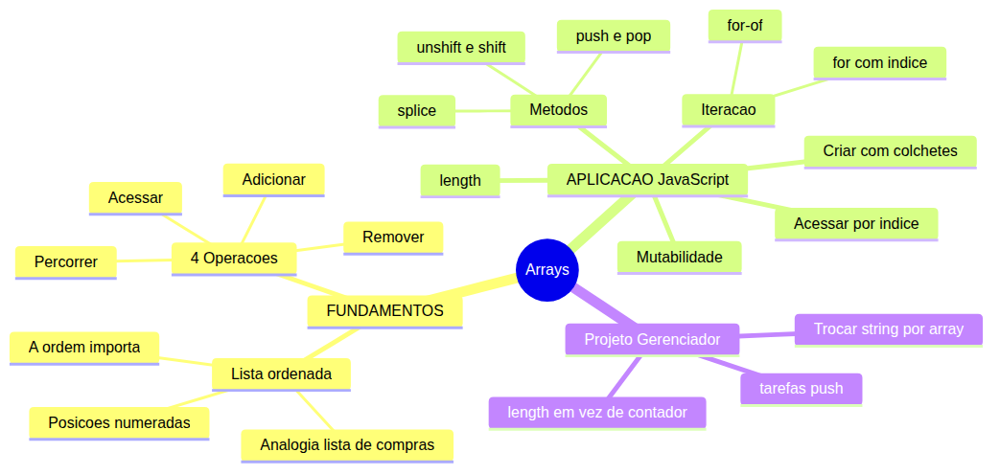
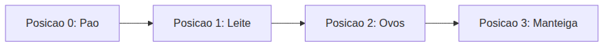
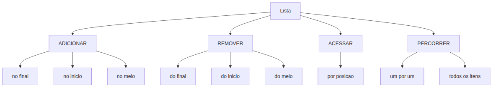
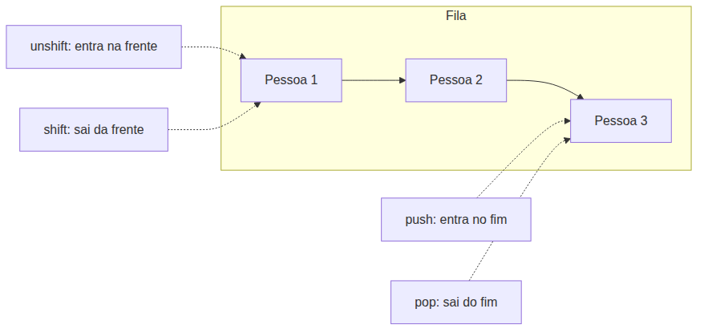

# JavaScript — Do Zero ao Profissional — Aula 09

## Arrays — Criando e Manipulando Listas

**Duração estimada:** 120 minutos (65 de leitura + 55 de prática)
**Nível:** Iniciante
**Pré-requisitos:** Aula 01 (console.log) + Aula 02 (let, const) + Aula 03 (tipos, typeof) + Aula 04 (operadores) + Aula 05 (prompt, alert, template literals) + Aula 06 (strings, indices, .length, imutabilidade) + Aula 07 (if, else, switch) + Aula 08 (for, while, do...while, break, continue)

---

## Objetivos de Aprendizagem

Ao final desta aula, voce sera capaz de:

- [ ] **Explicar** o conceito de lista ordenada usando a analogia da lista de compras
- [ ] **Distinguir** listas de variaveis separadas e por que agrupar dados em arrays
- [ ] **Criar** um array em JavaScript com `[]` e inspeciona-lo com console.log e typeof
- [ ] **Acessar** elementos por indice (baseado em 0) e usar length
- [ ] **Diferenciar** arrays de strings quanto a mutabilidade
- [ ] **Aplicar** push, pop, shift e unshift para adicionar e remover nas pontas
- [ ] **Usar** splice para remover, inserir ou substituir em qualquer posicao
- [ ] **Iterar** arrays com `for` usando indice
- [ ] **Reconhecer** `for...of` como alternativa simplificada de percorrer arrays
- [ ] **Converter** o Gerenciador de Tarefas de string concatenada para array

---

## Como Usar Esta Aula

Esta aula esta organizada em duas partes que se complementam.

Na **primeira parte** (secoes 1 e 2), voce vai entender o conceito de lista ordenada sem escrever uma linha de codigo. Sao ideias universais que valem para QUALQUER linguagem de programacao. A analogia central e a lista de compras. Zero JavaScript.

Na **segunda parte** (secoes 3 a 8), voce vai implementar CADA conceito em JavaScript: criar arrays, acessar elementos, modificar com push/pop/splice, percorrer com `for` e `for...of`. Cada secao tem pratica guiada no Console e no editor.

Na **secão 8**, voce vai aplicar TUDO ao Gerenciador de Tarefas — seu projeto vai trocar a string concatenada por um array de verdade.

Cada secao termina com um **Quick Check**. As respostas estao logo abaixo. Tente responder de cabeca antes de olhar.

Ao longo do caminho, voce encontrara secoes **"Mao na Massa"** — momentos em que voce vai ABRIR o Console ou o editor para praticar, nao so ler. Ao final da aula, o arquivo separado **Questoes de Aprendizagem** traz as tarefas de checkpoint — so avance para a proxima aula quando conseguir completa-las por conta propria.

> *"Ate agora, seu Gerenciador de Tarefas armazena tudo em uma string. Voce consegue ver as tarefas, mas nao pode remover uma especifica, editar, reordenar ou marcar como concluida. Hoje voce vai aprender arrays — listas de verdade — que dao superpoderes de manipulacao ao seu codigo."*

---

## Mapa Mental



> *O mapa mental acima mostra a estrutura da aula. Cada ramo representa um conceito que voce vai explorar.*

---

## Recapitulacao das Aulas Anteriores

| Aula | Conceito | Onde aparece nesta aula | Como se conecta |
|---|---|---|---|
| Aula 06 | **Indices de string** (secao 2) | Secoes 3, 4 | Arrays tambem tem indices comecando em 0 e .length |
| Aula 06 | **Imutabilidade de strings** (secao 5) | Secao 3 | DIFERENCA CRITICA: strings nao mudam; arrays sim |
| Aula 06 | **.split()** (secao 6) | Secao 3, 6 | split transforma string em array — ponte entre mundos |
| Aula 07 | **if, else** (secao 2) | Secao 6 | Condicionais dentro de loops sobre arrays |
| Aula 08 | **for** (secoes 4, 5) | Secoes 6, 7, 8 | O `for` que voce ja domina e a ferramenta natural para percorrer arrays |
| Aula 08 | **do...while** (secao 6) | Secao 8 | O menu do Gerenciador continua igual — so o armazenamento muda |
| Aula 08 | **Gerenciador com string** (secao 9) | Secao 8 | A string `listaDeTarefas` vira o array `tarefas` |

---

**FUNDAMENTOS: Listas — A Ideia Universal**

> *Os conceitos desta secao sao universais — valem para qualquer linguagem de programacao, em qualquer computador. Voce vai entender o que significa uma "lista ordenada de itens" usando algo que ja conhece: a lista de compras. Zero JavaScript. So a ideia pura. Na segunda parte, voce conectara cada conceito a sintaxe real.*

---

## 1. O Que E uma Lista Ordenada?

Imagine que voce esta indo ao supermercado. Antes de sair de casa, voce faz uma lista:

```
1. Pao
2. Leite
3. Ovos
4. Manteiga
```

Esta e uma **lista ordenada**. Cada item tem uma posicao: "Pao" e o primeiro, "Leite" e o segundo, "Ovos" e o terceiro, "Manteiga" e o quarto.

A ordem importa. Se voce escrever "Ovos" antes de "Pao", a lista e diferente — mesmo que os itens sejam os mesmos.

### O que uma lista tem?

Toda lista, seja de compras, de convidados, de tarefas ou de musicas, tem tres caracteristicas basicas:

1. **Itens**: os elementos que estao na lista (pao, leite, ovos, manteiga)
2. **Posicoes**: cada item esta em uma posicao numerada (primeiro, segundo, terceiro, quarto)
3. **Tamanho**: o numero total de itens (4 itens)

### O que voce pode fazer com uma lista?

Voce pode:
- **Pegar um item pela posicao**: "qual e o terceiro item?" → "Ovos"
- **Saber quantos itens tem**: "quantos itens comprei?" → 4
- **Adicionar um item**: "lembrei que preciso de cafe — escrevo no final"
- **Remover um item**: "ja comprei o pao — risco da lista"

Cada uma dessas operacoes tem um nome e um jeito de ser feita. E e exatamente isso que as listas em programacao fazem — so que em vez de papel e caneta, voce usa codigo.

> *Pare um momento e pense: voce ja faz isso mentalmente o tempo todo. Sua playlist de musicas, sua lista de afazeres, o cardapio do dia. Sao todas listas ordenadas. Voce ja entende o conceito. Agora vai aprender como ensinar o computador a fazer o mesmo.*

### Visualizando a lista

Imagine a lista como uma sequencia de caixinhas enfileiradas, cada uma com um numero:



> *Cada caixinha guarda um item. A posicao diz onde o item esta na fila. O numero total de caixinhas e o tamanho da lista.*

Perceba algo importante: a numeracao comeca em **0**, nao em 1. A posicao 0 e o PRIMEIRO item. Isso e uma convencao que os computadores usam, e voce vai ver o motivo nas proximas secoes. Por enquanto, apenas grave: **a primeira posicao e 0**.

### Quick Check 1

**1. Na lista de compras ["Arroz", "Feijao", "Macarrao", "Molho"], qual e o segundo item se a numeracao comeca em 0? E se comeca em 1?**
**Resposta:** Se comeca em 0, o segundo item e "Feijao" (indice 1). Se comeca em 1, o segundo item e "Feijao" (posicao 2). A confusao acontece porque no mundo real comecamos a contar do 1, mas em computacao comecamos do 0. Entao "segundo item" com numeracao 0-based e o indice 1, que e "Feijao".

**2. Voce tem uma lista de convidados da festa. Voce precisa saber quantas pessoas convidou e quem e o quinto convidado. Que "operacoes" voce esta fazendo mentalmente?**
**Resposta:** Voce esta ACESSANDO (pegando o quinto convidado pela posicao) e MEDINDO (contando quantos convidados existem). Em programacao, acesso e medir sao operacoes diferentes: acesso usa a posicao, medir conta quantos itens existem.

---

## 2. As 4 Operacoes Fundamentais com Listas

Toda lista, seja de papel ou digital, suporta 4 operacoes fundamentais. Se voce entender estas 4 operacoes, voce entendeu 90% do que arrays fazem.

### Operacao 1: ADICIONAR

Colocar um item novo na lista. Voce pode adicionar:
- **No final**: "Lembrei que preciso de cafe — escrevo no fim da lista de compras"
- **No inicio**: "Pera, cafe e mais urgente que pao — escrevo no comeco"
- **No meio**: "Bicarbonato vai entre ovo e manteiga, que e onde ele fica no mercado"

### Operacao 2: REMOVER

Tirar um item da lista. Voce pode remover:
- **Do final**: "Ja comprei manteiga — risco do fim da lista"
- **Do inicio**: "Peguei o pao, risco do comeco"
- **Do meio**: "Nao vou comprar leite hoje — removo do meio"

### Operacao 3: ACESSAR

Pegar um item especifico pela posicao:
- "Qual e o quarto item da lista?"
- "Me mostre o primeiro convidado da festa"
- "Quem e o terceiro na fila?"

Acesso nao modifica a lista. Voce so OLHA para um item. A lista continua igual.

### Operacao 4: PERCORRER

Visitar cada item da lista, um por um, em ordem:
- "Vou ler a lista de compras inteira para conferir"
- "Vou passar por todos os convidados para ver quem ja confirmou"
- "Vou tocar cada musica da playlist"

Percorrer e DIFERENTE de acessar. Acessar e pegar UM item especifico. Percorrer e visitar TODOS os itens, um de cada vez.

Voce pode estar pensando: "mas por que percorrer e uma operacao separada?" Porque em programacao, percorrer uma lista e uma das tarefas mais comuns — e tem seu proprio jeito de fazer (que voce vai ver na Parte 2).

### Visualizando as 4 operacoes



> *Cada operacao da lista tem uma implementacao pratica. Voce vai aprender os metodos exatos na Parte 2. Por enquanto, grave apenas as operacoes.*

### Exemplos do cotidiano para cada operacao

**ADICIONAR**: "Voce esta na fila do banco. Chega mais uma pessoa — ela entra no FINAL da fila. Se for idosa, entra no INICIO."

**REMOVER**: "O primeiro da fila e atendido e SAI. O ultimo da fila desiste e SAI."

**ACESSAR**: "Voce olha para a fila e ve: 'a terceira pessoa esta de casaco azul'. Voce so OLHOU, nao mudou nada."

**PERCORRER**: "O segurança passa por cada pessoa da fila verificando se esta com a pulseira de identificacao. Ele visita UMA POR UMA."

### Quick Check 2

**1. Voce tem a lista de filmes para assistir: ["Matrix", "Interestelar", "O Poderoso Chefao"]. Classifique cada acao como ADICIONAR, REMOVER, ACESSAR ou PERCORRER: (a) "Vou ver todos os filmes um por um", (b) "Quero saber qual e o primeiro filme", (c) "Ja assisti Matrix, vou tirar da lista", (d) "Adicionei Inception no final"**
**Resposta:** (a) PERCORRER, (b) ACESSAR, (c) REMOVER, (d) ADICIONAR.

**2. Por que PERCORRER e uma operacao diferente de ACESSAR? Pense em uma situacao real em que voce PERCORRE uma lista sem precisar ACESSAR um item especifico.**
**Resposta:** Acessar e pegar UM item especifico (ex: "qual o terceiro?"). Percorrer e visitar TODOS (ex: "vou passar a lista de compras inteira no caixa"). Uma situacao: voce esta conferindo se esqueceu algo na lista — voce percorre TODOS os itens, nao so um. Outra: o caixa passando cada item da compra um por um.

---

**APLICACAO: Arrays em JavaScript**

> *Agora que voce entende o que e uma lista ordenada e as 4 operacoes fundamentais, vamos conectar CADA conceito a JavaScript. A lista de compras vira um array. As operacoes viram metodos. O papel e caneta viram codigo.*

---

## 3. Criando, Acessando e Medindo Arrays

### O que e um array em JavaScript?

Em JavaScript, listas sao chamadas de **arrays**. Um array e criado com colchetes `[]`, e os itens sao separados por virgula.

```javascript
let frutas = ["maca", "banana", "laranja"];
```

Pronto. Voce acabou de criar sua primeira lista em JavaScript.

Vamos inspecionar:

```javascript
console.log(frutas);
// ["maca", "banana", "laranja"]

console.log(typeof frutas);
// "object"
```

> *"object"? Sim, arrays sao um tipo especial de objeto em JavaScript. Nao se preocupe com isso agora. Apenas lembre: typeof de um array retorna "object". Existe um jeito melhor de verificar (Array.isArray()), mas isso fica para uma aula futura.*

### Acessando por indice

Lembra da seção 1, onde a numeracao comecava em 0? Aqui ela aparece.

```javascript
let frutas = ["maca", "banana", "laranja"];

console.log(frutas[0]);  // "maca" — primeiro elemento (indice 0)
console.log(frutas[1]);  // "banana" — segundo elemento (indice 1)
console.log(frutas[2]);  // "laranja" — terceiro elemento (indice 2)
```

Acessar por indice e a operacao ACESSAR que voce viu na secao 2. Voce diz a posicao, o array devolve o item.

**Exemplo com array de strings:**

```javascript
let compras = ["Pao", "Leite", "Ovos", "Manteiga"];
console.log(compras[0]); // "Pao" — primeiro item
console.log(compras[3]); // "Manteiga" — ultimo item
```

**Exemplo com array de números:**

```javascript
let numeros = [10, 20, 30, 40, 50];
console.log(numeros[0]); // 10
console.log(numeros[4]); // 50
```

**Exemplo com array vazio:**

```javascript
let vazio = [];
console.log(vazio[0]); // undefined — array vazio, nenhum elemento
```

### .length — o tamanho do array

Assim como strings tem `.length` (Aula 06), arrays tambem:

```javascript
let frutas = ["maca", "banana", "laranja"];
console.log(frutas.length); // 3

let compras = ["Pao", "Leite", "Ovos", "Manteiga"];
console.log(compras.length); // 4
```

**Conexao com Aula 06:** Voce aprendeu que `"JavaScript".length` retorna 10. Arrays funcionam igual: `arr.length` retorna quantos elementos o array tem.

**O ultimo elemento**

Para pegar o ultimo elemento de um array, use o truque que voce viu na Aula 06 com strings:

```javascript
let frutas = ["maca", "banana", "laranja", "uva"];
let ultimoIndice = frutas.length - 1;
console.log(frutas[ultimoIndice]); // "uva"
// Ou direto:
console.log(frutas[frutas.length - 1]); // "uva"
```

Por que `length - 1`? Porque os indices comecam em 0. Se o array tem 4 elementos, os indices sao 0, 1, 2, 3. O ultimo indice e 3, que e `4 - 1`.

**Indice inexistente**

```javascript
let frutas = ["maca", "banana"];
console.log(frutas[10]); // undefined — nao existe indice 10
```

Isso nao gera erro. O JavaScript simplesmente retorna `undefined`. Mas fique atento: se voce tentar usar esse `undefined` em uma operacao (ex: somar com numero), pode dar `NaN` ou erro.

### Mutabilidade — A DIFERENCA REVOLUCIONARIA

Aqui esta o momento mais importante da aula. Preste atencao.

**Strings sao IMUTAVEIS:** quando voce usa um metodo de string, a string original nunca muda. O metodo retorna uma NOVA string.

**Arrays sao MUTAVEIS:** voce pode ALTERAR o array original diretamente.

Vamos ver isso com os proprios olhos:

```javascript
// STRING — nao muda
let palavra = "abc";
palavra[0] = "X";
console.log(palavra); // "abc" — nao mudou!

// ARRAY — muda
let letras = ["a", "b", "c"];
letras[0] = "X";
console.log(letras); // ["X", "b", "c"] — mudou!
```

Entendeu o poder disso?

Na Aula 06, voce passou um tempao aprendendo que `str.toUpperCase()` retorna uma nova string — a original fica intacta. Com arrays, e o contrario. Quando voce faz `arr[0] = "X"`, o array ORIGINAL e alterado.

> *Se voce esta pensando "isso vai dar confusao" — sim, confunde no comeco. Mas e um superpoder: voce pode modificar listas diretamente sem ter que criar uma nova versao toda vez.*

### Mao na Massa 1 — Criar e acessar array

**Dificuldade: Facil | Duracao: 5 minutos**

Abra o Console do navegador (F12, guia Console) e digite:

- [ ] Crie um array de compras: `let compras = ["Pao", "Leite", "Ovos", "Manteiga"]`
- [ ] Exiba o primeiro item: `console.log(compras[0])`
- [ ] Exiba o ultimo item: `console.log(compras[compras.length - 1])`
- [ ] Exiba o tamanho: `console.log(compras.length)`
- [ ] Modifique o segundo item: `compras[1] = "Leite Desnatado"`
- [ ] Exiba o array para confirmar: `console.log(compras)` — veja que mudou!
- [ ] Agora teste com string: `let str = "abc"; str[0] = "X"; console.log(str);` — nao mudou!

**Verificacao:** Seu array `compras` agora contem `["Pao", "Leite Desnatado", "Ovos", "Manteiga"]`. A string `str` continua `"abc"`. Voce acabou de ver a diferenca entre mutabilidade (array) e imutabilidade (string) com seus proprios olhos.

### Quick Check 3

**1. `let numeros = [10, 20, 30, 40, 50]`. Qual o valor de `numeros[2]`? Qual o valor de `numeros[numeros.length - 1]`?**
**Resposta:** `numeros[2]` = 30 (terceiro elemento, indice 2). `numeros[numeros.length - 1]` = `numeros[4]` = 50 (ultimo elemento, pois length e 5 e 5-1=4).

**2. `let palavra = "JavaScript";` e `let letras = ["J", "a", "v", "a", "S", "c", "r", "i", "p", "t"]`. O que acontece se voce tentar `palavra[0] = "X"`? E `letras[0] = "X"`? Por que os resultados sao diferentes?**
**Resposta:** `palavra[0] = "X"` nao altera a string — ela continua "JavaScript" porque strings sao IMUTAVEIS. `letras[0] = "X"` ALTERA o array — `letras` se torna `["X", "a", "v", "a", ...]` porque arrays sao MUTAVEIS.

---

## 4. Adicionando e Removendo das Pontas — push, pop, shift, unshift

Lembra das operacoes ADICIONAR e REMOVER da Secao 2? Aqui estao elas em JavaScript.

### .push() — adiciona no FINAL

O metodo `.push()` adiciona um elemento no final do array. E como escrever "cafe" no fim da lista de compras.

```javascript
let frutas = ["maca", "banana"];
frutas.push("laranja");
console.log(frutas); // ["maca", "banana", "laranja"]
```

`.push()` tambem retorna o novo tamanho do array:

```javascript
let frutas = ["maca", "banana"];
let novoTamanho = frutas.push("laranja");
console.log(novoTamanho); // 3
console.log(frutas.length); // 3 — mesma coisa
```

### .pop() — remove do FINAL

`.pop()` remove o ULTIMO elemento e RETORNA o elemento removido.

```javascript
let frutas = ["maca", "banana", "laranja"];
let ultima = frutas.pop();
console.log(ultima); // "laranja" — o elemento removido
console.log(frutas); // ["maca", "banana"] — o array sem o ultimo
```

E se o array estiver vazio?

```javascript
let vazio = [];
let resultado = vazio.pop();
console.log(resultado); // undefined — nao havia o que remover
console.log(vazio); // [] — continua vazio
```

### .unshift() — adiciona no INICIO

`.unshift()` adiciona um elemento no comeco do array. Ele "empurra" todos os outros para a direita.

```javascript
let frutas = ["maca", "banana"];
frutas.unshift("abacaxi");
console.log(frutas); // ["abacaxi", "maca", "banana"]
```

### .shift() — remove do INICIO

`.shift()` remove o PRIMEIRO elemento e RETORNA o elemento removido. Todos os outros "andam" uma posicao para a esquerda.

```javascript
let frutas = ["abacaxi", "maca", "banana"];
let primeira = frutas.shift();
console.log(primeira); // "abacaxi"
console.log(frutas); // ["maca", "banana"]
```

### A fila de pessoas (analogia visual)

Imagine que o array e uma fila de pessoas no banco:

- **push** = chega mais uma pessoa, entra no fim da fila
- **pop** = a ultima pessoa desiste e sai do fim
- **unshift** = uma pessoa fura a fila e entra na frente
- **shift** = o primeiro da fila e atendido e sai



### Tabela comparativa

| Metodo | Onde atua | O que faz | Retorna | Modifica o array? |
|---|---|---|---|---|
| `.push(item)` | Final | Adiciona | Novo `.length` | Sim |
| `.pop()` | Final | Remove | Elemento removido | Sim |
| `.unshift(item)` | Inicio | Adiciona | Novo `.length` | Sim |
| `.shift()` | Inicio | Remove | Elemento removido | Sim |

> *Nota importante: push e pop sao RAPIDOS porque mexem so no final do array. unshift e shift sao MAIS LENTOS porque precisam "empurrar" todos os elementos para abrir/ fechar espaco no inicio. Na pratica, voce usara push e pop com muito mais frequencia.*

### Mao na Massa 2 — Fila de tarefas

**Dificuldade: Facil | Duracao: 5 minutos**

No Console:

- [ ] Crie um array vazio: `let tarefas = []`
- [ ] Adicione tres tarefas: `tarefas.push("Comprar pao"); tarefas.push("Estudar JS"); tarefas.push("Lavar louca")`
- [ ] Exiba o array: `console.log(tarefas)`
- [ ] Remova a ultima tarefa e guarde em variavel: `let concluida = tarefas.pop()`
- [ ] Exiba a tarefa concluida e o array restante: `console.log("Conclui:", concluida); console.log(tarefas)`
- [ ] Adicione uma tarefa urgente no inicio: `tarefas.unshift("URGENTE: Pagar conta")`
- [ ] Exiba o array: `console.log(tarefas)`
- [ ] Remova a primeira: `let urgente = tarefas.shift()`
- [ ] Exiba tudo: `console.log("Urgente:", urgente); console.log(tarefas)`

**Verificacao:** A cada operacao, o array reflete corretamente a mudanca. No final, `tarefas` deve ter apenas os itens que voce nao removeu.

### Quick Check 4

**1. `let fila = ["Ana", "Bruno", "Carla"]`. O que `fila` contem apos: `fila.push("Diego"); fila.shift();`?**
**Resposta:** `fila.push("Diego")` torna a fila `["Ana", "Bruno", "Carla", "Diego"]`. Depois `fila.shift()` remove "Ana" (primeiro). Resultado final: `["Bruno", "Carla", "Diego"]`.

**2. Qual metodo voce usaria para: (a) adicionar um novo aluno no final da lista de chamada? (b) remover o primeiro cliente da fila de espera? (c) guardar o ultimo item removido em uma variavel?**
**Resposta:** (a) `.push("novoAluno")` — adiciona no final. (b) `.shift()` — remove do inicio. (c) `.pop()` — remove do final e retorna o elemento removido, que voce pode guardar em variavel.

---

## 5. Modificando em Qualquer Posicao — splice()

Push, pop, shift e unshift mexem nas PONTAS do array. Mas e se voce quiser modificar o MEIO?

O metodo `.splice()` e o canivete suico dos arrays. Ele faz tres coisas em um so: REMOVE, INSERE e SUBSTITUI elementos em qualquer posicao.

### A sintaxe

```javascript
array.splice(indiceInicio, quantosRemover, item1, item2, ...)
```

- `indiceInicio`: a partir de qual posicao comecar
- `quantosRemover`: quantos elementos remover (0 = nao remove nenhum)
- `item1, item2, ...`: (opcional) elementos para inserir no lugar

### Caso 1: REMOVER

```javascript
let letras = ["A", "B", "C", "D", "E"];
let removidos = letras.splice(2, 1); // remove 1 elemento a partir do indice 2
console.log(letras);    // ["A", "B", "D", "E"] — "C" foi removido
console.log(removidos); // ["C"] — splice retorna um array com os removidos
```

Exemplo com multiplas remocoes:

```javascript
let letras = ["A", "B", "C", "D", "E"];
let removidos = letras.splice(1, 3); // remove 3 elementos a partir do indice 1
console.log(letras);    // ["A", "E"]
console.log(removidos); // ["B", "C", "D"]
```

### Caso 2: INSERIR (sem remover)

```javascript
let letras = ["A", "B", "C", "D", "E"];
letras.splice(2, 0, "X"); // insere "X" no indice 2, remove 0
console.log(letras); // ["A", "B", "X", "C", "D", "E"]
```

Veja: `quantosRemover = 0`. Nada e removido. O novo item e inserido no indice 2, e os elementos existentes sao empurrados para a direita.

Inserir varios itens:

```javascript
let letras = ["A", "B", "C"];
letras.splice(1, 0, "X", "Y", "Z");
console.log(letras); // ["A", "X", "Y", "Z", "B", "C"]
```

### Caso 3: SUBSTITUIR

```javascript
let letras = ["A", "B", "C", "D", "E"];
letras.splice(2, 1, "X"); // remove 1 (indice 2) e insere "X" no lugar
console.log(letras); // ["A", "B", "X", "D", "E"]
```

Substituir varios:

```javascript
let letras = ["A", "B", "C", "D", "E"];
letras.splice(1, 2, "X", "Y"); // remove 2 (indices 1 e 2), insere "X" e "Y"
console.log(letras); // ["A", "X", "Y", "D", "E"]
```

### Voce pode estar pensando...

"Por que tres usos diferentes no mesmo metodo?" E uma pergunta justa. splice e versatil justamente porque combina remocao e insercao em um unico comando. Voce vai usar os tres casos com frequencia:

- **splice(indice, 1)** = "remove este item" (uso mais comum)
- **splice(indice, 0, item)** = "insere aqui sem remover nada"
- **splice(indice, 1, item)** = "troca este item por outro"

### Quando splice retorna o que?

Splice sempre retorna um ARRAY com os elementos removidos. Se voce removeu 0 elementos (caso 2: insercao), retorna `[]` (array vazio).

```javascript
let nums = [1, 2, 3];
let r1 = nums.splice(1, 1);     // removeu 1 elemento
console.log(r1);                 // [2]

let r2 = nums.splice(1, 0, 5);  // removeu 0 elementos
console.log(r2);                 // []
```

### Mao na Massa 3 — Gerenciar lista de convidados

**Dificuldade: Medio | Duracao: 7 minutos**

No Console:

- [ ] Crie um array de convidados: `let convidados = ["Joao", "Maria", "Pedro", "Ana", "Lucas"]`
- [ ] Remova "Pedro" (indice 2): `let removidos = convidados.splice(2, 1); console.log(convidados); console.log("Removido:", removidos)`
- [ ] Insira "Sofia" entre "Maria" e "Ana": `convidados.splice(2, 0, "Sofia"); console.log(convidados)`
- [ ] Substitua "Lucas" por "Carlos": `let substituido = convidados.splice(4, 1, "Carlos"); console.log(convidados); console.log("Substituido:", substituido)`

**Verificacao:** O array `convidados` deve terminar como `["Joao", "Maria", "Sofia", "Ana", "Carlos"]`. O array `removidos` deve conter `["Pedro"]` e `substituido` deve conter `["Lucas"]`.

### Quick Check 5

**1. `let numeros = [10, 20, 30, 40, 50]`. Qual comando remove o 30? Qual comando insere 25 entre 20 e 30?**
**Resposta:** Para remover 30 (indice 2): `numeros.splice(2, 1)`. Para inserir 25 entre 20 e 30: `numeros.splice(2, 0, 25)` (insere no indice 2, entre 20 e 30, sem remover nada).

**2. Qual a diferenca entre `array.splice(1, 1)` e `array.splice(1, 0, "X")`? O que cada um faz e o que retorna?**
**Resposta:** `array.splice(1, 1)` remove 1 elemento do indice 1 e retorna um array com esse elemento. `array.splice(1, 0, "X")` remove 0 elementos (nao remove nada) e insere "X" no indice 1, retornando um array vazio `[]`.

---

## 6. Iterando Arrays com for

Aqui esta a conexao mais importante com a Aula 08. Lembra do `for`?

```javascript
for (let i = 0; i < 10; i++) {
    console.log(i);
}
```

Agora voce vai usar o MESMO padrao, mas em vez de contar ate 10, voce vai PERCORRER (lembra? a quarta operacao!) cada elemento de um array.

### O padrao universal

```javascript
let frutas = ["maca", "banana", "laranja", "uva"];

for (let i = 0; i < frutas.length; i++) {
    console.log(frutas[i]);
}
```

Este e o padrao mais importante que voce vai aprender sobre arrays. Grave ele:

- `let i = 0` — comeca no primeiro indice
- `i < frutas.length` — enquanto nao passar do ultimo elemento
- `i++` — avanca para o proximo indice
- `frutas[i]` — o elemento na posicao atual do loop

O resultado:

```
maca
banana
laranja
uva
```

### Desconstruindo o padrao

Na **primeira iteracao** (i = 0): `frutas[0]` = "maca"
Na **segunda iteracao** (i = 1): `frutas[1]` = "banana"
Na **terceira iteracao** (i = 2): `frutas[2]` = "laranja"
Na **quarta iteracao** (i = 3): `frutas[3]` = "uva"
Na **quinta iteracao** (i = 4): `4 < 4` e FALSO → loop termina

Percebeu? O contador `i` VIRA o indice do elemento. Cada "volta" do loop, `i` avanca uma posicao, e `frutas[i]` entrega o elemento daquela posicao.

### Exemplo com numeracao

```javascript
let compras = ["Pao", "Leite", "Ovos", "Manteiga"];

for (let i = 0; i < compras.length; i++) {
    console.log("Item " + (i + 1) + ": " + compras[i]);
}
```

Resultado:

```
Item 1: Pao
Item 2: Leite
Item 3: Ovos
Item 4: Manteiga
```

Veja que usamos `(i + 1)` para exibir numeracao comecando em 1, mas o indice `i` continua comecando em 0.

### Exemplo com condicional

Lembra da Aula 07? Dentro do loop, voce pode usar `if` para filtrar elementos:

```javascript
let tarefas = ["Comprar pao", "Pagar conta URGENTE", "Estudar JS", "Medico URGENTE"];

for (let i = 0; i < tarefas.length; i++) {
    if (tarefas[i].includes("URGENTE")) {
        console.log("!!! " + tarefas[i]);
    } else {
        console.log("- " + tarefas[i]);
    }
}
```

Resultado:

```
- Comprar pao
!!! Pagar conta URGENTE
- Estudar JS
!!! Medico URGENTE
```

**Conexao com Aula 07:** Dentro do `for`, o `if` toma decisoes sobre CADA elemento do array. O `includes()` que voce aprendeu na Aula 06 verifica se a string contem "URGENTE". Tudo se conecta.

### O erro classico de iniciante

```
for (let i = 0; i <= array.length; i++) { ... }
//                          ^ ERRO! <= em vez de <
```

Se o array tem 5 elementos (indices 0 a 4), `i <= 5` vai tentar acessar o indice 5, que retorna `undefined`. Sempre use `<`, nunca `<=`.

### Iteracao reversa (bonus)

```javascript
let frutas = ["maca", "banana", "laranja"];

for (let i = frutas.length - 1; i >= 0; i--) {
    console.log(frutas[i]);
}
// laranja
// banana
// maca
```

### Quick Check 6

**1. `let notas = [7.5, 8.0, 6.5, 9.0, 5.5]`. Escreva um `for` que exiba cada nota no console. Qual e o valor de `i` na primeira iteracao? E na ultima?**
**Resposta:** `for (let i = 0; i < notas.length; i++) { console.log(notas[i]); }`. Na primeira iteracao, `i = 0`. Na ultima (quinta iteracao), `i = 4`.

**2. Por que `for (let i = 0; i <= array.length; i++)` esta errado? O que acontece na ultima iteracao?**
**Resposta:** Porque quando `i` atinge `array.length`, ele tenta acessar `array[array.length]` que nao existe (indices vao de 0 a `length - 1`). Na ultima iteracao, o JavaScript retorna `undefined` e o loop continua tentando — nao gera erro, mas o resultado e inesperado e potencialmente bugado.

---

## 7. Primeiro Contato com for-of

Ha uma sintaxe ainda mais simples para percorrer arrays. Chama-se `for...of`.

```javascript
let frutas = ["maca", "banana", "laranja"];

for (let fruta of frutas) {
    console.log(fruta);
}
```

Resultado:

```
maca
banana
laranja
```

Veja como e mais limpo que o `for` com indice:

- Nao precisa de `i`
- Nao precisa de `i < array.length`
- Nao precisa de `i++`
- Nao precisa de `frutas[i]` — o elemento ja esta na variavel `fruta`

O `for...of` pega CADA elemento do array e coloca na variavel que voce definiu (`fruta`). Para CADA elemento, executa o bloco uma vez.

### Comparacao lado a lado

```javascript
// for com indice
for (let i = 0; i < frutas.length; i++) {
    console.log(i + ": " + frutas[i]);
}

// for-of
for (let fruta of frutas) {
    console.log(fruta);
}
```

### Quando usar cada um?

Use `for` com indice quando voce PRECISA SABER A POSICAO:

```javascript
let tarefas = ["Comprar pao", "Estudar JS", "Lavar louca"];

for (let i = 0; i < tarefas.length; i++) {
    console.log("Tarefa " + (i + 1) + " de " + tarefas.length + ": " + tarefas[i]);
}
// Tarefa 1 de 3: Comprar pao
// Tarefa 2 de 3: Estudar JS
// Tarefa 3 de 3: Lavar louca
```

Use `for...of` quando voce SO QUER O VALOR de cada elemento:

```javascript
let tarefas = ["Comprar pao", "Estudar JS", "Lavar louca"];

for (let tarefa of tarefas) {
    console.log("- " + tarefa);
}
// - Comprar pao
// - Estudar JS
// - Lavar louca
```

### Voce nao precisa dominar isso agora

Esta secao e um PRIMEIRO CONTATO. Voce nao precisa decorar `for...of` hoje. Apenas SAiba que ele EXISTE e que e uma opcao mais limpa quando o indice nao importa.

> *"Mas como funciona por dentro?" — Excelente pergunta. A resposta envolve o conceito de "iteraveis", que e um topico avancado. Por enquanto, apenas grave: `for (let item of array)` visita cada elemento do array, um por um, sem precisar de indice. A explicacao de COMO isso funciona fica para uma aula futura.*

### Quick Check 7

**1. Reescreva `for (let i = 0; i < nomes.length; i++) { console.log(nomes[i]); }` usando `for...of`.**
**Resposta:** `for (let nome of nomes) { console.log(nome); }`. Cada `nomes[i]` vira `nome` diretamente.

**2. Em qual situacao voce PREFERIRIA `for` com indice em vez de `for...of`? De um exemplo concreto.**
**Resposta:** Quando voce precisa SABER a posicao do elemento. Exemplo: exibir uma lista numerada "Item 1 de 10", onde voce precisa do `i + 1` para mostrar o numero. Outro exemplo: comparar um elemento com o proximo (`array[i]` com `array[i+1]`), o que requer acesso direto por indice.

---

## 8. Arrays no Gerenciador de Tarefas — Convertendo de String para Array

Chegou a hora de aplicar TUDO que voce aprendeu ao seu Gerenciador de Tarefas.

### O problema (relembrando a Aula 08)

No Gerenciador que voce construiu na Aula 08, as tarefas eram armazenadas em uma string:

```javascript
let listaDeTarefas = "";
listaDeTarefas += "- " + tarefa + " [" + prioridade + "]\n";
```

Isso funcionava para ADICIONAR e LISTAR, mas tinha limitacoes serias:

- Nao era possivel remover uma tarefa especifica
- Nao era possivel editar uma tarefa
- Nao era possivel marcar como concluida
- O contador `totalTarefas` precisava ser gerenciado separadamente

### A solucao: array

Agora, em vez de string, armazenamos as tarefas em um ARRAY:

```javascript
let tarefas = [];
tarefas.push(tarefa);
```

Cada tarefa e um elemento independente. O `.length` do array e o TOTAL de tarefas — sem precisar de contador extra.

### Passo a passo da migracao

**Antes (Aula 08):**

```javascript
let listaDeTarefas = "";          // string vazia
let totalTarefas = 0;             // contador separado

// Adicionar tarefa
listaDeTarefas += "- " + tarefa + " [" + prioridade + "]\n";
totalTarefas++;

// Listar tarefas
if (listaDeTarefas === "") {
    alert("Nenhuma tarefa cadastrada.");
} else {
    alert("=== TAREFAS ===\n\n" + listaDeTarefas);
}
```

**Depois (Aula 09):**

```javascript
let tarefas = [];                 // array vazio
// totalTarefas nao precisa mais!

// Adicionar tarefa
tarefas.push(tarefa);

// Listar tarefas
if (tarefas.length === 0) {
    alert("Nenhuma tarefa cadastrada.");
} else {
    let mensagem = "=== TAREFAS ===\n\n";
    for (let i = 0; i < tarefas.length; i++) {
        mensagem += (i + 1) + ". " + tarefas[i] + "\n";
    }
    alert(mensagem);
}
```

> *Nota: se seu Gerenciador da Aula 08 incluia categorizacao de prioridade (urgente/importante com `if/else if`), inclua a prioridade no push: `tarefas.push(tarefa + " [" + prioridade + "]")`. O codigo completo com prioridade esta no Desafio (Exercicio 3) ao final da aula.*

### O que mudou de verdade

| Aspecto | Antes (string) | Depois (array) |
|---|---|---|
| Estrutura | `let listaDeTarefas = ""` | `let tarefas = []` |
| Adicionar | `listaDeTarefas += "- " + tarefa + "\n"` | `tarefas.push(tarefa)` |
| Total | `totalTarefas` (variavel separada) | `tarefas.length` |
| Vazio | `listaDeTarefas === ""` | `tarefas.length === 0` |
| Listar | `alert(listaDeTarefas)` | `for` com `(i + 1) + ". " + tarefas[i]` |

### O que NAO mudou

- O menu com `do...while` + `switch` continua IDENTICO
- O `for` para adicionar multiplas tarefas continua igual
- As opcoes 1 (Adicionar), 2 (Listar), 3 (Sair) permanecem as mesmas
- A categorizacao de prioridade com `if/else if` continua igual

So o ARMAZENAMENTO interno mudou. O usuario nao ve diferenca — mas o codigo agora esta preparado para o futuro.

### Codigo completo (versao array)

```javascript
let tarefas = [];
let opcao;

do {
    do {
        opcao = prompt("=== GERENCIADOR ===\nTotal: " + tarefas.length + " tarefa(s)\n1 - Adicionar\n2 - Listar\n3 - Sair\n\nEscolha:");
    } while (opcao !== "1" && opcao !== "2" && opcao !== "3");

    switch (opcao) {
        case "1":
            let quantas = Number(prompt("Quantas tarefas?"));

            if (isNaN(quantas) || quantas <= 0) {
                alert("Numero invalido!");
                break;
            }

            for (let i = 1; i <= quantas; i++) {
                let tarefa = prompt("Tarefa " + i + " de " + quantas + ":");

                if (tarefa) {
                    tarefas.push(tarefa);
                } else {
                    alert("Tarefa " + i + " ignorada (vazia).");
                }
            }

            alert(quantas + " tarefa(s) adicionada(s)!");
            break;

        case "2":
            if (tarefas.length === 0) {
                alert("Nenhuma tarefa cadastrada.");
            } else {
                let mensagem = "=== TAREFAS ===\n\n";
                for (let i = 0; i < tarefas.length; i++) {
                    mensagem += (i + 1) + ". " + tarefas[i] + "\n";
                }
                alert(mensagem);
            }
            break;

        case "3":
            alert("Ate logo! Total de " + tarefas.length + " tarefa(s) cadastrada(s).");
            break;
    }
} while (opcao !== "3");
```

### O que ja melhorou — e o que ainda vai melhorar

1. **Cada tarefa e independente agora**: voce pode acessar, modificar ou remover uma tarefa especifica pelo indice — impossivel com a string concatenada
2. **Total automatico**: `tarefas.length` dispensa contador manual — menos codigo, menos bugs
3. **Remocao futura**: voce ja tem a ferramenta — `tarefas.splice(indice, 1)` remove qualquer tarefa (voce vai implementar isso em breve)
4. **Preparacao para objetos**: cada tarefa em breve vai se tornar um objeto com texto, prioridade e data — o array ja esta pronto para isso

A string concatenada era uma "muleta" que funcionava. O array e a ferramenta CERTA.

### Mao na Massa 4 — Migrar o Gerenciador

**Dificuldade: Medio | Duracao: 15 minutos**

Abra seu arquivo `index.html` do Gerenciador de Tarefas (o que voce criou na Aula 08) e faca as alteracoes:

- [ ] **Substitua** `let listaDeTarefas = ""` por `let tarefas = []`
- [ ] **Remova** `let totalTarefas = 0` — nao precisamos mais
- [ ] **Substitua** `listaDeTarefas += "- " + tarefa + " [" + prioridade + "]\n"` por `tarefas.push(tarefa)`
- [ ] **Remova** `totalTarefas++` — nao precisamos mais
- [ ] **Substitua** a exibicao (case "2") de `alert("=== TAREFAS ===\n\n" + listaDeTarefas)` pelo loop `for` com numeracao
- [ ] **Substitua** a verificacao de vazio: `if (tarefas.length === 0)` em vez de `if (listaDeTarefas === "")`
- [ ] **Substitua** `totalTarefas` no menu por `tarefas.length`
- [ ] **Substitua** `totalTarefas` na mensagem de saida por `tarefas.length`
- [ ] **Teste**: adicione 3 tarefas, liste, confirme que funciona

**Verificacao:** O Gerenciador funciona EXATAMENTE como antes, mas agora usa array. O menu mostra o total correto. A listagem exibe numeracao. Nada esta quebrado.

> *Importante: salve uma COPIA do seu arquivo ANTES de comecar. Se algo der errado, voce tem o backup.*

### Quick Check 8

**1. No Gerenciador antigo, voce usava `totalTarefas++` para contar. No novo, como voce obtem o total de tarefas? Por que isso e melhor?**
**Resposta:** Usando `tarefas.length`. E melhor porque (1) voce nao precisa de uma variavel extra, (2) o valor e automatico — quando voce adiciona ou remove, `.length` se atualiza sozinho, (3) remove a possibilidade de erro humano (esquecer de incrementar).

**2. O que `tarefas.length === 0` verifica? Como isso substitui `listaDeTarefas === ""`?**
**Resposta:** `tarefas.length === 0` verifica se o array esta vazio (nenhuma tarefa cadastrada). Substitui `listaDeTarefas === ""` que verificava se a string estava vazia. A logica e a mesma: "nao ha tarefas para exibir".

---

---

## 9. Spread Operator — Copiar e Unir Arrays

Até agora você usou `.push()` para adicionar elementos e `.concat()` para unir dois arrays. O **spread operator** (`...`) é a forma moderna de fazer a mesma coisa — e mais legível.

### Copiando um array (sem modificar o original)

```javascript
const original = [1, 2, 3];
const copia = [...original];        // [1, 2, 3]

copia.push(4);
console.log(original);  // [1, 2, 3] — intacto!
console.log(copia);     // [1, 2, 3, 4]
```

> *Atenção: `...` faz uma **cópia rasa** (shallow copy). Se o array contiver objetos, eles serão os mesmos objetos (não cópias). Esse conceito será aprofundado na Aula 12.*

### Unindo arrays

```javascript
const frutas = ['maçã', 'banana'];
const legumes = ['cenoura', 'abóbora'];

const mercado = [...frutas, ...legumes];
// ['maçã', 'banana', 'cenoura', 'abóbora']
```

### Adicionando elementos no início ou no fim

```javascript
const tarefas = ['Limpar quarto'];

// Adiciona no início
const comPrioridade = ['URGENTE: Comprar remédio', ...tarefas];

// Adiciona no fim
const comMaisUma = [...tarefas, 'Organizar estante'];
```

### Quick Check 9

**1. O que `[...original]` faz?**
**Resposta:** Cria um novo array com os mesmos elementos de `original` — uma cópia. O array original não é modificado.

**2. O que `[...a, ...b]` faz?**
**Resposta:** Cria um novo array com todos os elementos de `a` seguidos por todos os elementos de `b`.

---


## Autoavaliacao: Quiz Rapido

Teste seus conhecimentos com estas 6 perguntas. As respostas estao logo abaixo de cada uma.

**Q1. `let nums = [100, 200, 300, 400, 500]`. Qual o valor de `nums[2]`?**
a) 100
b) 200
c) 300
d) 400

**Resposta:** c) 300. O indice 2 e o TERCEIRO elemento (porque comeca em 0). `nums[0]` = 100, `nums[1]` = 200, `nums[2]` = 300.

---

**Q2. `let str = "JS"; str[0] = "X"; console.log(str);` exibe:**
a) "XS"
b) "JS"
c) "X"
d) Erro

**Resposta:** b) "JS". Strings sao IMUTAVEIS. A tentativa de alterar `str[0]` e silenciosamente ignorada. O array com o mesmo codigo teria mudado.

---

**Q3. `let arr = [1, 2, 3]; arr.pop(); arr.push(4); console.log(arr);` exibe:**
a) [1, 2, 3, 4]
b) [1, 2, 4]
c) [2, 3, 4]
d) [1, 2, 3]

**Resposta:** b) [1, 2, 4]. `pop()` remove o ultimo (3), `push(4)` adiciona 4 no final. Resultado: [1, 2, 4].

---

**Q4. `let a = ["A", "B", "C", "D"]; a.splice(1, 2); console.log(a);` exibe:**
a) ["A", "D"]
b) ["A", "B", "D"]
c) ["A", "C", "D"]
d) ["B", "C"]

**Resposta:** a) ["A", "D"]. `splice(1, 2)` remove 2 elementos a partir do indice 1: "B" e "C".

---

**Q5. Quando voce usa `for...of` em vez de `for` com indice?**
a) Quando precisa saber a posicao de cada elemento
b) Quando so precisa do valor de cada elemento, sem o indice
c) Quando quer percorrer o array de tras para frente
d) Quando o array esta vazio

**Resposta:** b) `for...of` e mais limpo quando voce SO precisa do valor. Use `for` com indice quando precisar saber a posicao ou manipular indices.

---

**Q6. No Gerenciador migrado, como voce verifica se existem tarefas cadastradas?**
a) `if (tarefas.length > 0)`
b) `if (tarefas === "")`
c) `if (tarefas.push())`
d) `if (tarefas.vazio)`

**Resposta:** a) `tarefas.length > 0` (ou `tarefas.length === 0` para "nao ha tarefas"). No Gerenciador antigo era `listaDeTarefas === ""`.

---

## Mao na Massa: Exercicios Graduados

### Exercicio 1 (Facil) — Lista de Compras Interativa

Crie um programa HTML que:
1. Cria um array vazio: `let compras = []`
2. Usa `prompt()` para o usuario digitar 3 itens de compra
3. Adiciona cada item no array com `.push()`
4. Exibe no console o array completo
5. Exibe no console o total de itens usando `.length`

Nao use loops — faca manualmente, item por item.

**Gabarito:**

```html
<!DOCTYPE html>
<html>
<head>
    <title>Lista de Compras</title>
</head>
<body>
    <script>
        let compras = [];

        let item1 = prompt("Digite o primeiro item:");
        compras.push(item1);

        let item2 = prompt("Digite o segundo item:");
        compras.push(item2);

        let item3 = prompt("Digite o terceiro item:");
        compras.push(item3);

        console.log("Lista de compras:", compras);
        console.log("Total de itens:", compras.length);
    </script>
</body>
</html>
```

> *Explicacao: Criamos um array vazio com `[]`. Cada `push()` adiciona um item no final. Ao final, `compras.length` nos da a quantidade. Simples e direto.*

---

### Exercicio 2 (Medio) — Playlist de Musicas

Crie um programa HTML que:
1. Cria um array `let playlist = ["Musica A", "Musica B", "Musica C", "Musica D", "Musica E"]`
2. Exibe a playlist original com um `for`
3. Usa `splice()` para:
   a) Remover a terceira musica (indice 2)
   b) Inserir "Musica X" entre a primeira e a segunda
   c) Substituir a ultima musica por "Musica Z"
4. Exibe a playlist final

**Gabarito:**

```html
<!DOCTYPE html>
<html>
<head>
    <title>Playlist</title>
</head>
<body>
    <script>
        let playlist = ["Musica A", "Musica B", "Musica C", "Musica D", "Musica E"];

        console.log("Playlist original:");
        for (let i = 0; i < playlist.length; i++) {
            console.log((i + 1) + ". " + playlist[i]);
        }

        // a) Remover a terceira musica (indice 2)
        let removida = playlist.splice(2, 1);
        console.log("Removida:", removida);

        // b) Inserir "Musica X" entre a primeira e a segunda
        playlist.splice(1, 0, "Musica X");

        // c) Substituir a ultima musica
        let ultimoIndice = playlist.length - 1;
        let substituida = playlist.splice(ultimoIndice, 1, "Musica Z");
        console.log("Substituida:", substituida);

        console.log("Playlist final:");
        for (let i = 0; i < playlist.length; i++) {
            console.log((i + 1) + ". " + playlist[i]);
        }
    </script>
</body>
</html>
```

> *Explicacao: O `splice(2, 1)` remove 1 elemento no indice 2 (terceira musica). O `splice(1, 0, "Musica X")` insere no indice 1 sem remover nada. O `splice(ultimoIndice, 1, "Musica Z")` substitui o ultimo elemento. Cada splice retorna um array com os itens removidos.*

---

### Desafio (Dificil) — Gerenciador de Tarefas com Array + For

Parta do codigo base do Gerenciador da Aula 08 e implemente a migracao completa para array (como visto na Secao 8). O programa deve:
1. Usar array em vez de string concatenada
2. Usar `tarefas.length` em vez de `totalTarefas`
3. Listar tarefas com `for` e numeracao "1. Tarefa [Prioridade]"
4. Manter a categorizacao de prioridade (if/else if com `includes`)
5. Manter o menu com `do...while` + `switch`

O codigo deve estar COMPLETO e FUNCIONAL em HTML.

**Gabarito:**

```html
<!DOCTYPE html>
<html>
<head>
    <title>Gerenciador de Tarefas — Aula 09</title>
</head>
<body>
    <h1>Gerenciador de Tarefas 3.0</h1>
    <script>
        alert("Bem-vindo ao Gerenciador 3.0 com Arrays!");

        let tarefas = [];
        let opcao;

        do {
            // Valida opcao
            do {
                opcao = prompt("=== GERENCIADOR ===\nTotal: " + tarefas.length + " tarefa(s)\n1 - Adicionar\n2 - Listar\n3 - Sair\n\nEscolha:");
            } while (opcao !== "1" && opcao !== "2" && opcao !== "3");

            switch (opcao) {
                case "1":
                    let quantas = prompt("Quantas tarefas?");
                    quantas = Number(quantas);

                    if (isNaN(quantas) || quantas <= 0) {
                        alert("Numero invalido!");
                        break;
                    }

                    for (let i = 1; i <= quantas; i++) {
                        let tarefa = prompt("Tarefa " + i + " de " + quantas + ":");

                        if (tarefa) {
                            // Categorizacao de prioridade
                            let prio = "Normal";
                            let desc = tarefa.toLowerCase();

                            if (desc.includes("urgente")) {
                                prio = "ALTA";
                            } else if (desc.includes("importante")) {
                                prio = "MEDIA";
                            }

                            // Adiciona com prioridade na mensagem
                            tarefas.push(tarefa + " [" + prio + "]");
                        } else {
                            alert("Tarefa " + i + " ignorada (vazia).");
                        }
                    }

                    alert(quantas + " tarefa(s) adicionada(s)!");
                    break;

                case "2":
                    if (tarefas.length === 0) {
                        alert("Nenhuma tarefa cadastrada.");
                    } else {
                        let mensagem = "=== TAREFAS ===\n\n";

                        for (let i = 0; i < tarefas.length; i++) {
                            mensagem += (i + 1) + ". " + tarefas[i] + "\n";
                        }

                        alert(mensagem);
                    }
                    break;

                case "3":
                    alert("Ate logo! Total de " + tarefas.length + " tarefa(s) cadastrada(s).");
                    break;
            }
        } while (opcao !== "3");
    </script>
</body>
</html>
```

> *Explicacao: A migracao substituiu a string `listaDeTarefas` pelo array `tarefas`. O `.push()` adiciona cada tarefa com sua prioridade. O `tarefas.length` substitui o `totalTarefas` em tres lugares: menu, listagem e mensagem de saida. O `for` no case "2" percorre o array montando a mensagem com numeracao. O programa funciona EXATAMENTE como antes, mas agora usa array — preparado para remover, editar e reordenar tarefas nas proximas aulas.*

---

## Resumo da Aula

### Os 5 Conceitos Fundamentais

1. **Lista ordenada** — sequencia de itens com posicoes numeradas. A ordem importa. (Secoes 1-2)
2. **Array = lista em JavaScript** — criado com `[]`, acessado com `[indice]`, medido com `.length`. O primeiro indice e 0. (Secao 3)
3. **Arrays sao MUTAVEIS** — ao contrario de strings, arrays podem ser alterados no lugar. Modificar por indice funciona. (Secao 3)
4. **Metodos de manipulacao** — push/pop (final), unshift/shift (inicio), splice (qualquer posicao). Todos modificam o array original. (Secoes 4-5)
5. **Iteracao** — `for` com indice para quando precisa da posicao; `for...of` para quando so precisa do valor. (Secoes 6-7)

### O Que Voce Construiu Hoje

- [x] Entendeu o conceito de lista ordenada com a analogia da lista de compras
- [x] Criou e acessou arrays com `[]` e indices
- [x] Compreendeu a diferenca entre strings (imutaveis) e arrays (mutaveis)
- [x] Usou push, pop, shift, unshift para manipular as pontas
- [x] Usou splice para modificar qualquer posicao
- [x] Iterou arrays com `for` e teve primeiro contato com `for...of`
- [x] Converteu o Gerenciador de Tarefas de string para array

---

## Proxima Aula

**Aula 10: Funcoes — Declaracao, Parametros e Retorno**

Agora que voce domina arrays e pode armazenar listas de dados, vai aprender a ORGANIZAR seu codigo em blocos reutilizaveis. Funcoes sao como receitas: voce escreve uma vez e usa quantas vezes quiser. Seu Gerenciador de Tarefas vai ganhar funcoes para adicionar, listar e remover tarefas — codigo mais limpo e profissional.

---

## Referencias

### Documentacao Oficial

- [MDN: Array](https://developer.mozilla.org/en-US/docs/Web/JavaScript/Reference/Global_Objects/Array) — documentacao completa do tipo Array
- [MDN: Array.prototype.push()](https://developer.mozilla.org/en-US/docs/Web/JavaScript/Reference/Global_Objects/Array/push) — adicionar ao final
- [MDN: Array.prototype.pop()](https://developer.mozilla.org/en-US/docs/Web/JavaScript/Reference/Global_Objects/Array/pop) — remover do final
- [MDN: Array.prototype.shift()](https://developer.mozilla.org/en-US/docs/Web/JavaScript/Reference/Global_Objects/Array/shift) — remover do inicio
- [MDN: Array.prototype.unshift()](https://developer.mozilla.org/en-US/docs/Web/JavaScript/Reference/Global_Objects/Array/unshift) — adicionar ao inicio
- [MDN: Array.prototype.splice()](https://developer.mozilla.org/en-US/docs/Web/JavaScript/Reference/Global_Objects/Array/splice) — modificar em qualquer posicao
- [MDN: for...of](https://developer.mozilla.org/en-US/docs/Web/JavaScript/Reference/Statements/for...of) — documentacao do for-of

### Tutoriais

- [JavaScript.info: Arrays](https://javascript.info/array) — tutorial completo sobre arrays
- [JavaScript.info: Array Methods](https://javascript.info/array-methods) — metodos de array em detalhes

### Videos Recomendados

- [FreeCodeCamp: JavaScript Arrays (YouTube)](https://www.youtube.com/watch?v=oigfaZ5ApsM) — video de ~15 min explicando arrays

---

## FAQ

**P: Por que os indices de array comecam em 0 e nao em 1?**
R: E uma convencao que vem da forma como computadores acessam memoria. O indice 0 significa "a partir do inicio, avance 0 posicoes" — ou seja, o primeiro elemento. Indice 1 = avance 1 posicao = segundo elemento. Nao se preocupe com o "porque" agora — apenas lembre-se: o primeiro e 0, o ultimo e `.length - 1`.

**P: Qual a diferenca entre `array.length` e `array.length - 1`?**
R: `.length` e o numero TOTAL de elementos (ex: array com 5 elementos → `.length` e 5). `.length - 1` e o INDICE do ultimo elemento (ex: se tem 5 elementos, os indices vao de 0 a 4 → o ultimo e `.length - 1` = 4).

**P: push/pop vs unshift/shift — qual devo usar?**
R: Na pratica, push e pop sao muito mais comuns. A maioria das listas cresce "para a direita" (itens novos no final). Use unshift/shift quando a ORDEM for importante e voce precisar que itens novos aparecam no inicio. Lembre: unshift/shift sao mais lentos porque precisam reordenar todos os elementos.

**P: O que acontece se eu tentar acessar um indice que nao existe?**
R: Retorna `undefined`. Exemplo: `let arr = [1, 2, 3]; console.log(arr[10]);` → `undefined`. Isso NAO gera erro — mas seu programa pode se comportar de forma inesperada se voce tentar usar esse `undefined` em operacoes.

**P: `.splice()` modifica o array original?**
R: SIM! `.splice()` altera o array diretamente (mutabilidade). Ele tambem RETORNA um array com os elementos removidos. Exemplo: `let removidos = frutas.splice(1, 2);` — `frutas` perdeu 2 elementos e `removidos` contem esses 2 elementos.

**P: Posso misturar tipos diferentes em um array?**
R: Tecnicamente sim: `let misturado = [42, "texto", true, null, ["outro", "array"]]`. Mas na pratica, arrays costumam armazenar elementos do MESMO tipo (lista de numeros, lista de strings, lista de objetos). Misturar tipos pode confundir voce mesmo.

**P: Qual a diferenca entre `for` com indice e `for...of`?**
R: `for` com indice (`for (let i = 0; i < arr.length; i++)`) te da ACESSO ao indice — voce sabe se esta no 3 ou 7 elemento. `for...of` (`for (let item of arr)`) e mais LIMPO — voce so recebe cada elemento, sem o indice. Use `for` com indice quando precisar da numeracao ("tarefa 3 de 10"); use `for...of` quando so quiser visitar cada elemento.

**P: Por que meu Gerenciador usava string em vez de array desde o comeco?**
R: Arrays exigem que voce entenda indices, `.length`, iteracao com `for` e mutabilidade. Nas Aulas 01-08, voce estava construindo essas pecas uma a uma. A string concatenada era uma solucao provisoria que funcionava com o que voce sabia ate a Aula 08. Agora, com arrays, voce tem a ferramenta CERTA para o trabalho.

**P: O que acontece se eu fizer `let tarefas = []` fora do `do...while`? As tarefas somem quando o loop reinicia?**
R: NAO! Essa e a beleza: `let tarefas = []` esta FORA do loop, entao o array e criado UMA VEZ e persiste durante toda a execucao do programa. O `do...while` so repete o menu — o array continua existindo e acumulando tarefas.

**P: Como faco para remover um item especifico do array sem saber o indice?**
R: Voce precisa primeiro ENCONTRAR o indice. Use `indexOf()` para achar a posicao de um elemento pelo valor, depois `splice()` para remove-lo. Exemplo: `let indice = tarefas.indexOf("Comprar pao"); tarefas.splice(indice, 1);`. Isso sera aprofundado em aulas futuras.

---

## Glossario

| Termo | Definicao |
|---|---|
| **Array** | Estrutura de dados que armazena uma lista ordenada de elementos, acessados por indice numerico. Criado com `[]`. (Secoes 3-8) |
| **Indice** | Numero que indica a posicao de um elemento no array. Comeca em 0. (Secao 3) |
| **.length** | Propriedade que retorna o numero de elementos do array. (Secao 3) |
| **.push(item)** | Metodo que adiciona um elemento ao FINAL do array. (Secao 4) |
| **.pop()** | Metodo que remove e retorna o ULTIMO elemento do array. (Secao 4) |
| **.unshift(item)** | Metodo que adiciona um elemento ao INICIO do array. (Secao 4) |
| **.shift()** | Metodo que remove e retorna o PRIMEIRO elemento do array. (Secao 4) |
| **.splice(inicio, n, itens...)** | Metodo que remove, insere ou substitui elementos em qualquer posicao. (Secao 5) |
| **for...of** | Estrutura de repeticao que percorre cada elemento de um iteravel sem usar indice. (Secao 7) |
| **Mutabilidade** | Capacidade de ser alterado apos a criacao. Arrays sao mutaveis; strings nao. (Secao 3) |
| **Iterar** | Percorrer cada elemento de uma colecao (array), um por um. (Secoes 6-7) |
| **Elemento** | Cada item individual armazenado em um array. (Secao 1) |
