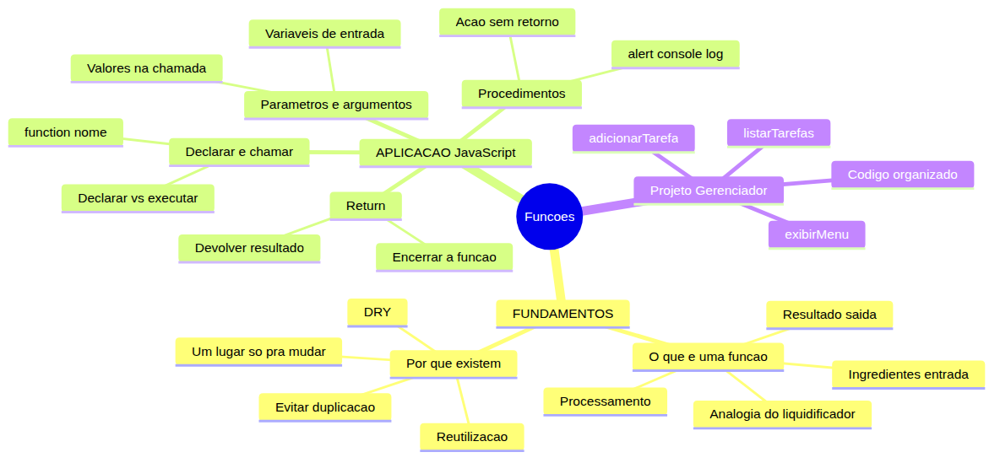
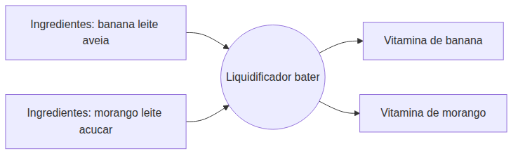
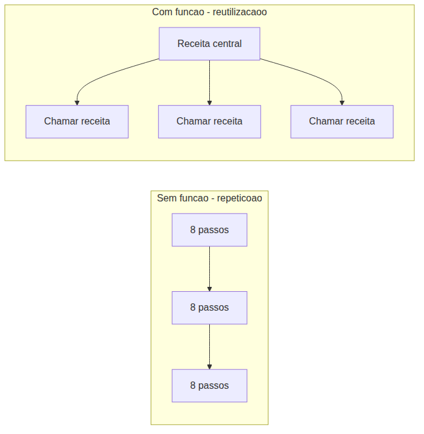

# JavaScript — Do Zero ao Profissional — Aula 10

## Funções — Declaração, Parâmetros e Retorno

**Duração estimada:** 110 minutos (55 de leitura + 55 de prática)
**Nível:** Iniciante
**Pré-requisitos:** Aula 01 (console.log, fluxo Entrada→Processamento→Saída) + Aula 02 (let, const, arquivo HTML+script) + Aula 03 (tipos primitivos, typeof) + Aula 04 (operadores) + Aula 05 (prompt, alert, template literals, conversão Number/String) + Aula 06 (strings, índices, .length, métodos) + Aula 07 (if/else, switch, truthy/falsy) + Aula 08 (for, while, do...while, break, continue) + Aula 09 (arrays, push, length, for...of, Gerenciador com array)

---

## Objetivos de Aprendizagem

Ao final desta aula, você será capaz de:

- [ ] **Explicar** o conceito de função usando a analogia do liquidificador — ingredientes entram, a máquina processa, o resultado sai
- [ ] **Distinguir** código repetitivo de código reutilizável — identificar duplicação e compreender por que "copiar e colar" é frágil (princípio DRY)
- [ ] **Declarar** uma função em JavaScript com a sintaxe `function nome() { }` e identificar suas partes
- [ ] **Chamar** (invocar) uma função com `nome()` e compreender que a declaração apenas DEFINE o bloco, mas a chamada EXECUTA
- [ ] **Definir** parâmetros na declaração da função e passar argumentos na chamada
- [ ] **Usar** `return` para devolver um resultado da função, capturando-o em uma variável na chamada
- [ ] **Criar** funções sem retorno (procedimentos) que executam ações mas não devolvem valor
- [ ] **Reutilizar** a mesma função com argumentos diferentes
- [ ] **Refatorar** o Gerenciador de Tarefas extraindo blocos monolíticos em funções nomeadas
- [ ] **Explicar** como funções tornam o código mais organizado, legível e fácil de manter

---

## Como Usar Esta Aula

Esta aula está organizada em duas partes.

Na **primeira parte** (seções 1 e 2), você vai entender o conceito de função sem escrever uma linha de código. São ideias universais que valem para QUALQUER linguagem de programação. A analogia central é o liquidificador. Zero JavaScript.

Na **segunda parte** (seções 3 a 7), você vai implementar CADA conceito em JavaScript: declarar funções, usar parâmetros, retornar valores com `return`, criar procedimentos e, no final, refatorar o Gerenciador de Tarefas — seu projeto — de código monolítico para código organizado com funções.

Cada seção termina com um **Quick Check**. As respostas estão logo abaixo. Tente responder de cabeça antes de olhar.

Ao longo do caminho, você encontrará seções **"Mão na Massa"** — momentos em que você vai ABRIR o Console ou o editor para praticar, não só ler. Ao final da aula, o arquivo separado **Questões de Aprendizagem** traz as tarefas de checkpoint — só avance para a próxima aula quando conseguir completá-las por conta própria.

---

## Mapa Mental



> *O mapa mental acima mostra a estrutura da aula. Cada ramo representa um conceito que você vai explorar.*

---

## Recapitulação das Aulas Anteriores

| Aula | Conceito | Onde aparece nesta aula | Como se conecta |
|---|---|---|---|
| Aula 01 | **Fluxo Entrada→Processamento→Saída** (seção 4) | Seções 1, 3, 5 | Função é a materialização desse fluxo em um bloco nomeado |
| Aula 05 | **prompt(), alert(), template literals** (seções 2-4) | Seções 3-7 | alert e console.log viram procedimentos dentro de funções |
| Aula 07 | **if/else, switch/case** (seções 2-3) | Seções 4, 6, 7 | Estruturas condicionais dentro do corpo das funções |
| Aula 08 | **for, while, do...while** (seções 3-5) | Seções 3, 6, 7 | Loops dentro das funções — você já domina a lógica |
| Aula 09 | **arrays, push, length, for...of** (seções 4-7) | Seções 6, 7 | O array `tarefas` é manipulado DENTRO das funções do Gerenciador |

---

**FUNDAMENTOS: Receitas e Reutilização — A Ideia Universal**

> *Os conceitos desta seção são universais — valem para QUALQUER linguagem de programação, independentemente da ferramenta específica. Na segunda parte, você verá como JavaScript implementa cada um deles.*

---

## 1. O Que É uma Função? A Analogia do Liquidificador

Você tem um liquidificador na sua cozinha. A máquina é sempre a mesma: um motor com lâminas dentro de um copo. O que muda são os ingredientes que você coloca.

Se você colocar banana, leite e aveia, o liquidificador bate tudo e produz uma vitamina de banana. Se você colocar morango, leite e açúcar, ele produz uma vitamina de morango. A MÁQUINA é a mesma. Os INGREDIENTES mudam. O RESULTADO depende dos ingredientes.

Em programação, uma **função** funciona exatamente assim:

- Os **ingredientes** são os valores de entrada — o que você fornece para a função processar
- O **processamento** é o conjunto de instruções que a função executa — o "motor" que bate os ingredientes
- O **resultado** é o valor de saída — o que a função devolve depois de processar

Pense também em uma receita de bolo. A receita é um CONJUNTO DE INSTRUÇÕES com um nome ("Bolo de Chocolate"). Você pode fazer o mesmo bolo 10 vezes seguindo a mesma receita — a receita não muda. Mas você também pode VARIAR ingredientes: bolo de chocolate, bolo de cenoura, bolo de laranja. A ESTRUTURA da receita é similar, os ingredientes mudam.



> *O diagrama mostra o liquidificador recebendo ingredientes diferentes e produzindo resultados diferentes. A MÁQUINA (o processo de bater) é a mesma. Em programação, a função é essa máquina.*

Toda função tem três características:

1. **Tem um NOME** — para sabermos qual receita usar ("liquidificador", não "aquela coisa que bate")
2. **Recebe ENTRADAS** (opcional) — ingredientes que variam a cada uso
3. **Produz uma SAÍDA** (opcional) — o resultado do processamento

Na Aula 01, você aprendeu que TODO programa segue o fluxo Entrada → Processamento → Saída. Uma função é esse modelo encapsulado em um BLOCO COM NOME. A função é a materialização do fluxo que você já conhece.

### Quick Check 1

**1. Na analogia do liquidificador, o que representam: (a) a máquina em si, (b) as frutas que você coloca, (c) a vitamina que sai? Associe cada um a Entrada, Processamento ou Saída.**
**Resposta:** (a) a máquina representa o Processamento — o motor que executa as instruções. (b) as frutas representam a Entrada — os dados que entram para serem processados. (c) a vitamina representa a Saída — o resultado do processamento.

**2. Você usa a mesma cafeteira para fazer café todo dia. O que MUDA a cada uso? O que PERMANECE IGUAL? Como isso se relaciona com a ideia de "reutilizar" um processo?**
**Resposta:** O que MUDA é o pó de café e a quantidade de água (os ingredientes/entrada). O que PERMANECE IGUAL é a cafeteira e o processo de passar água quente pelo pó (o processamento). Isso se relaciona com funções porque a função é a "cafeteira" — você reutiliza o mesmo processo, apenas variando os dados de entrada.

---

## 2. Por Que Funções Existem? Reutilização e o Princípio DRY

Imagine que você precisa explicar "como fazer um sanduíche" para 5 pessoas diferentes.

**Sem função:** Você explica os 8 passos completos para cada pessoa — 5 vezes, 40 instruções no total. Cansativo, repetitivo e propenso a erro.

**Com função:** Você escreve a "receita de sanduíche" UMA vez, dá o nome "FazerSanduiche", e para cada pessoa você simplesmente diz "Faça um sanduíche". Uma receita central + 5 chamadas simples.

Agora pense no que acontece se você quiser MUDAR a receita (adicionar alface, por exemplo):

- **Sem função:** Você precisa alterar em 5 lugares diferentes — e pode esquecer algum. Um dos sanduíches vai sair sem alface.
- **Com função:** Você altera em 1 lugar só — a receita central. Todas as 5 chamadas automaticamente refletem a mudança.

Isso se chama **DRY** — *Don't Repeat Yourself* (Não se Repita). É um princípio fundamental da programação: se você está escrevendo a mesma coisa mais de uma vez, está na hora de criar uma função.



> *À esquerda: o mesmo bloco de passos repetido várias vezes. À direita: uma receita central com chamadas. Quando algo precisa mudar, a versão com função altera em UM lugar.*

Os sinais de que você PRECISA de uma função:

- Você deu Ctrl+C e Ctrl+V no seu código — repetiu o mesmo bloco
- Você tem um bloco de código que faz uma coisa específica e bem definida
- Você quer dar um nome a um processo para poder falar sobre ele ("vamos listar as tarefas")

Uma analogia final: pense em um **controle remoto**. Você aperta o botão "Ligar" (uma função) em vez de levantar, andar até a TV e apertar o botão manualmente toda vez. O controle remoto REUTILIZA a ação de ligar a TV — você não levanta 3 vezes seguidas, aperta o mesmo botão 3 vezes.

### Quick Check 2

**1. Você tem 3 amigos e precisa ensinar cada um a chegar na sua casa. Qual abordagem é mais eficiente: (a) explicar o caminho completo para cada um individualmente, ou (b) escrever a rota UMA vez, dar um nome ("RotaMinhaCasa") e entregar para cada um? Por quê?**
**Resposta:** A abordagem (b) é mais eficiente. Você escreve a rota uma vez (a "função") e cada amigo apenas "chama" essa rota. Se algo mudar (uma rua interditada), você altera em UM lugar e todos são atualizados automaticamente.

**2. Se você decidir mudar o caminho porque descobriu um atalho, qual abordagem é mais SEGURA (menos chance de erro)? Por quê?**
**Resposta:** A abordagem (b), com a rota centralizada, é mais segura. Na abordagem (a), você precisa lembrar de contar o atalho para cada amigo individualmente — fácil de esquecer alguém. Na abordagem (b), você altera a rota uma vez e pronto. Todos recebem a versão atualizada.

---

**APLICAÇÃO: Funções em JavaScript — Da Analogia ao Código Real**

> *Agora que você entende o conceito de função como receita nomeada, vamos conectá-lo à prática com JavaScript. Cada ideia das Seções 1 e 2 ganha uma tradução direta em código.*

---

## 3. Declarando e Chamando Funções em JavaScript

Na Seção 1, o liquidificador tinha um nome ("liquidificador"), recebia ingredientes (entrada) e produzia vitamina (saída). Em JavaScript, isso se traduz em código com a sintaxe `function`.

### Anatomia de uma Função

```javascript
function nomeDaFuncao() {
    // Corpo da função — as instruções que ela executa
}
```

Desconstruindo cada parte:

- **`function`** — a palavra-chave que diz ao JavaScript: "estou criando uma função"
- **`nomeDaFuncao`** — o identificador da função (segue as mesmas regras de variáveis: camelCase, descritivo, em português)
- **`()`** — os parênteses: local onde os "ingredientes" (parâmetros) serão declarados (Seção 4)
- **`{ }`** — as chaves: delimitam o bloco de código — o "motor" da função

### O DIFERENCIAL CRÍTICO: Declarar ≠ Chamar

Este é o ponto MAIS IMPORTANTE desta seção. Grave bem:

**Declarar** a função = CRIAR a receita. O JavaScript lê e GUARDA o bloco de código. NADA acontece ainda.

**Chamar** a função = EXECUTAR a receita. O JavaScript roda o bloco de código AGORA.

Veja a diferença no Console do navegador:

```javascript
// DECLARAÇÃO — apenas cria a função
function cumprimentar() {
    console.log("Olá! Bem-vindo(a)!");
}

// Nada aparece no console ainda!
```

Até aqui, só declaramos. Agora vamos CHAMAR:

```javascript
cumprimentar(); // CHAMADA — executa a função
// Console mostra: Olá! Bem-vindo(a)!

cumprimentar(); // Pode chamar de novo!
// Console mostra: Olá! Bem-vindo(a)!

cumprimentar(); // E de novo!
// Console mostra: Olá! Bem-vindo(a)!
```

Cada `cumprimentar()` executa o bloco da função novamente. Uma função pode ser chamada QUANTAS VEZES você quiser.

Se você tentar chamar uma função ANTES de declará-la (por enquanto — Aula 11 explica o caso especial do hoisting):

```javascript
tchau(); // ReferenceError: tchau is not defined
```

Por isso, a regra por enquanto é: **declare antes de chamar**, sempre.

### Mão na Massa 1 — Sua Primeira Função

Vamos praticar! Abra o Console do navegador (F12 > Console).

- [ ] Declare sua primeira função:
```javascript
function saudacao() {
    console.log("Bem-vindo(a) ao JavaScript!");
}
```

- [ ] Observe que NADA aparece no Console. Você só DECLAROU.

- [ ] Agora CHAME:
```javascript
saudacao();
// Console mostra: Bem-vindo(a) ao JavaScript!
```

- [ ] Chame mais 3 vezes seguidas — veja a mensagem aparecer 3 vezes.

- [ ] Declare outra função:
```javascript
function despedida() {
    console.log("Até logo!");
}
```

- [ ] Agora chame na sequência:
```javascript
saudacao();
despedida();
saudacao();
```

**Verificação:** Se você viu no Console:
```
Bem-vindo(a) ao JavaScript!
Até logo!
Bem-vindo(a) ao JavaScript!
```

Parabéns! Você declarou e chamou funções. Perceba que `saudacao()` foi chamada duas vezes e funcionou nas duas. A função é uma "receita" que você reutiliza quantas vezes quiser.

### Quick Check 3

**1. `function tchau() { console.log("Até mais!"); }` — Depois de digitar isso no Console, o que aparece? Por quê? O que você precisa fazer para a mensagem "Até mais!" aparecer?**
**Resposta:** NADA aparece. Porque `function tchau() { }` é a DECLARAÇÃO — só cria a função, não executa. Para a mensagem aparecer, você precisa CHAMAR a função com `tchau()`.

**2. Você declarou `function mostrarNumero() { console.log(42); }` e depois escreveu `mostrarNumero;` (sem os parênteses). O que acontece? Por que `mostrarNumero()` (com parênteses) é diferente?**
**Resposta:** `mostrarNumero` (sem parênteses) apenas mostra a definição da função no Console — não executa o código. `mostrarNumero()` (com parênteses) CHAMA a função, executando `console.log(42)`. Os parênteses são o que DIZEM ao JavaScript "execute esta função agora!".

---

## 4. Parâmetros e Argumentos — Os Ingredientes

Na Seção 1, o liquidificador aceitava ingredientes DIFERENTES (banana ou morango). Os parâmetros são os "encaixes" onde esses ingredientes entram. Os argumentos são os ingredientes concretos que você coloca a cada uso.

### Vocabulário (use sempre!)

- **Parâmetro**: a variável na DECLARAÇÃO da função — o "espaço reservado para o ingrediente"
- **Argumento**: o valor concreto na CHAMADA da função — "o ingrediente que você colocou de fato"

### Exemplo 1: De Rígida a Flexível

Sem parâmetros, uma função é rígida — sempre faz a mesma coisa:

```javascript
function saudacao() {
    console.log("Olá, visitante!");
}
saudacao(); // Sempre: "Olá, visitante!"
```

Com parâmetros, a mesma função funciona com dados diferentes:

```javascript
function saudacao(nome) { // "nome" é o PARÂMETRO
    console.log("Olá, " + nome + "!");
}

saudacao("Ana");   // Ana é o ARGUMENTO → "Olá, Ana!"
saudacao("Bruno"); // Bruno é o ARGUMENTO → "Olá, Bruno!"
saudacao("Carla"); // Carla é o ARGUMENTO → "Olá, Carla!"
```

A função é a MESMA. O parâmetro `nome` recebe um valor diferente a cada chamada. É exatamente como o liquidificador — a máquina é a mesma, os ingredientes mudam.

### Exemplo 2: Múltiplos Parâmetros

Uma função pode ter quantos parâmetros precisar:

```javascript
function soma(a, b) { // a e b são PARÂMETROS
    console.log(a + b);
}

soma(10, 5);   // 10 + 5 = 15
soma(3, 7);    // 3 + 7 = 10
soma(100, 200); // 100 + 200 = 300
```

A ordem importa! No exemplo acima, `a` recebe o primeiro argumento e `b` recebe o segundo. `soma(5, 10)` é diferente de `soma(10, 5)`.

Os nomes dos parâmetros (`a`, `b`, `nome`) são LOCAIS à função — eles só existem DENTRO da função. Fora dela, ninguém sabe o que é `a` ou `b`.

### O Que Acontece com Números Errados de Argumentos?

Se você chamar com **menos argumentos** que parâmetros, o parâmetro extra fica `undefined`:

```javascript
function soma(a, b) {
    console.log(a + b);
}

soma(5);     // a = 5, b = undefined → 5 + undefined = NaN
```

Se você chamar com **mais argumentos** que parâmetros, os extras são ignorados:

```javascript
soma(5, 3, 7, 2); // a = 5, b = 3 → mostra 8. 7 e 2 são ignorados
```

### Mão na Massa 2 — Brincando de Liquidificador

Abra o Console e vamos criar nossa função liquidificador!

- [ ] Declare a função com dois parâmetros:
```javascript
function liquidificador(ingrediente1, ingrediente2) {
    console.log("Vitamina de " + ingrediente1 + " com " + ingrediente2 + "!");
}
```

- [ ] Chame com diferentes argumentos:
```javascript
liquidificador("banana", "aveia");
// Console: Vitamina de banana com aveia!

liquidificador("morango", "leite");
// Console: Vitamina de morango com leite!

liquidificador("manga", "iogurte");
// Console: Vitamina de manga com iogurte!
```

- [ ] Agora crie uma função de soma que MOSTRA o cálculo:
```javascript
function soma(a, b) {
    console.log(a + " + " + b + " = " + (a + b));
}

soma(5, 3);
// Console: 5 + 3 = 8

soma(10, 20);
// Console: 10 + 20 = 30

soma(100, 1);
// Console: 100 + 1 = 101
```

- [ ] Teste o que acontece com:
```javascript
soma(5);       // Faltou um argumento — mostra "5 + undefined = NaN"
soma(5, 3, 7); // Argumento extra — 7 é ignorado
```

**Verificação:** Você entendeu que parâmetros tornam a função flexível. A MESMA função `liquidificador` funciona com ingredientes diferentes — exatamente como o liquidificador da vida real.

### Quick Check 4

**1. `function apresentar(nome, idade) { console.log(nome + " tem " + idade + " anos."); }` — O que exibe `apresentar("Maria", 25)`? E `apresentar("João", 30)`? Qual é o parâmetro e qual é o argumento?**
**Resposta:** `apresentar("Maria", 25)` exibe "Maria tem 25 anos." `apresentar("João", 30)` exibe "João tem 30 anos." Os PARÂMETROS são `nome` e `idade` (na declaração). Os ARGUMENTOS são "Maria" e 25 na primeira chamada, "João" e 30 na segunda.

**2. `function multiplicar(a, b) { console.log(a * b); }` — O que exibe `multiplicar(4, 5)`? E se você chamar `multiplicar(4)`? Por que o resultado é o que é?**
**Resposta:** `multiplicar(4, 5)` exibe 20 (4 * 5 = 20). `multiplicar(4)` exibe `NaN` (Not a Number). Porque `b` não recebeu argumento, fica `undefined`, e `4 * undefined` não é um número válido.

---

## 5. Return — O Resultado

Na Seção 1, o liquidificador DEVOLVIA a vitamina pronta. `return` é o ato de entregar o resultado. Se você só usa `console.log`, está só OLHANDO o resultado, não RECEBENDO ele de volta.

### console.log ≠ return

Essa é a diferença MAIS IMPORTANTE entre mostrar e devolver:

- **`console.log()`**: MOSTRA algo no console. A função NÃO DEVOLVE nada para ser usado depois.
- **`return`**: DEVOLVE um valor. Você pode guardar em uma variável e usar em outros cálculos.

Pense assim: `console.log()` é gritar o resultado para a sala. `return` é entregar o resultado na sua mão.

Veja a diferença no código:

```javascript
// Versão 1: SÓ console.log — não devolve nada
function soma(a, b) {
    console.log(a + b);
}

let resultado = soma(5, 3);
// Console mostra: 8
console.log(resultado);
// Console mostra: undefined — a função NÃO DEVOLVEU nada!

// Versão 2: COM return — devolve o resultado
function soma(a, b) {
    return a + b; // ← devolve o valor
}

let resultado = soma(5, 3);
// Console NÃO mostra nada (a função não tem console.log)
console.log(resultado);
// Console mostra: 8 — o VALOR foi devolvido e guardado!

// Agora podemos REUTILIZAR o resultado!
console.log(resultado * 2);
// Console mostra: 16 — usamos o valor guardado!
```

### return Encerra a Função

Quando o JavaScript encontra `return`, ele faz DUAS coisas:

1. DEVOLVE o valor especificado
2. ENCERRA a função imediatamente — nada depois de `return` executa

```javascript
function exemplo() {
    console.log("Antes do return");
    return "Resultado";
    console.log("Depois do return"); // NUNCA executa!
}

let x = exemplo();
// Console mostra: "Antes do return"
// x agora contém "Resultado"
// "Depois do return" NUNCA aparece!
```

### Função sem return = undefined

Toda função que não tem `return` explícito devolve `undefined` automaticamente:

```javascript
function semReturn() {
    let a = 2 + 2;
    // Não tem return — devolve undefined
}

let y = semReturn();
console.log(y); // undefined
```

### Retornando Qualquer Tipo

`return` pode devolver qualquer tipo de dado: number, string, boolean. Até arrays (e futuramente objetos):

```javascript
function mensagemCompleta(nome) {
    return "Olá, " + nome + "! Bem-vindo(a) ao curso!";
}

let msg = mensagemCompleta("Daniel");
console.log(msg); // "Olá, Daniel! Bem-vindo(a) ao curso!"
```

### Mão na Massa 3 — Funções que Devolvem Valores

Abra o Console e pratique!

- [ ] Crie uma função que calcula o quadrado de um número:
```javascript
function quadrado(x) {
    return x * x;
}
```

- [ ] Chame e capture o resultado:
```javascript
let q5 = quadrado(5);
console.log(q5); // 25
```

- [ ] Use o resultado em outra expressão:
```javascript
console.log(quadrado(3) + quadrado(4));
// 3² + 4² = 9 + 16 = 25
```

- [ ] Compare com versão SEM return:
```javascript
function quadradoConsole(x) {
    console.log(x * x);
}

let q = quadradoConsole(5);
// Console mostra: 25
console.log(q);
// Console mostra: undefined — porque a função não devolveu nada!
```

- [ ] Crie uma função com return condicional:
```javascript
function ePar(numero) {
    if (numero % 2 === 0) {
        return true;
    } else {
        return false;
    }
}

console.log(ePar(4)); // true
console.log(ePar(7)); // false
```

**Verificação:** Você entendeu que `return` entrega um valor que pode ser capturado em variáveis e reutilizado. Sem `return`, a função só pode mostrar coisas, não devolver.

### Quick Check 5

**1. `function dobro(x) { return x * 2; }` — Qual o valor de `let resultado = dobro(7) + 1;`? Por que `console.log(dobro(7))` mostra 14, mas `let r = dobro(7)` guarda 14 na variável?**
**Resposta:** `let resultado = dobro(7) + 1` vale 15 (14 + 1). `dobro(7)` retorna o valor 14. Esse valor pode ser mostrado no console (`console.log(dobro(7))` mostra 14) OU guardado em uma variável (`let r = dobro(7)` faz `r = 14`).

**2. `function teste() { console.log("A"); return 1; console.log("B"); }` — O que aparece no console ao chamar `teste()`? A letra "B" aparece? Por quê?**
**Resposta:** Apenas "A" aparece no console. "B" NUNCA aparece porque o `return 1` encerra a execução da função imediatamente. O `console.log("B")` está depois do `return` e nunca é executado.

---

## 6. Funções sem Retorno (Procedimentos)

Nem toda função precisa devolver um valor. Nem toda receita produz algo para guardar. Pense em "Arrumar a cama" — você executa passos (esticar lençol, ajeitar travesseiro), mas não "recebe" nada de volta. Só o resultado visível: a cama arrumada.

Em programação, funções que executam AÇÕES mas não devolvem valor são chamadas de **procedimentos**.

### Exemplos de Procedimentos no Mundo JavaScript

`alert()` mostra uma mensagem — mas não devolve nada útil. `console.log()` exibe no console — mas não devolve nada útil. Modificar um array com `push()` — altera o array, mas não devolve algo que você precise guardar.

```javascript
// Procedimento: exibe um menu
function exibirMenu() {
    console.log("=== MENU ===");
    console.log("1 - Adicionar");
    console.log("2 - Listar");
    console.log("3 - Sair");
}

exibirMenu();
// Exibe o menu no console, mas não devolve nenhum valor
```

Se você tentar capturar o retorno de um procedimento:

```javascript
let x = exibirMenu();
console.log(x); // undefined — a função não retornou nada!
```

### Procedimento que Modifica uma Variável

Um procedimento pode modificar variáveis que existem FORA da função:

```javascript
let contador = 0;

function incrementar() {
    contador++;
    console.log("Contador: " + contador);
}

incrementar(); // Contador: 1
incrementar(); // Contador: 2
incrementar(); // Contador: 3
```

A função não retorna nada — mas MODIFICA o mundo externo (a variável `contador`).

### Usando `return;` Vazio para Sair Mais Cedo

Um `return;` sem valor (ou `return` sozinho) é útil para ENCERRAR um procedimento antes do final, geralmente quando algo deu errado:

```javascript
let tarefas = [];

function adicionarTarefa(texto) {
    if (!texto) {              // Se o texto estiver vazio...
        alert("Tarefa vazia!"); // Mostra alerta
        return;                // SAI da função — não executa o resto
    }
    tarefas.push(texto);       // Adiciona ao array (só chega aqui se texto for válido)
    alert("Tarefa adicionada!");
}

adicionarTarefa("");        // Alerta: "Tarefa vazia!" — função encerrou cedo
adicionarTarefa("Estudar"); // Alerta: "Tarefa adicionada!" — texto válido, push funcionou
```

### Mão na Massa 4 — Procedimento que Modifica Array

Vamos criar um procedimento no Console!

- [ ] Crie um array vazio:
```javascript
let itens = [];
```

- [ ] Declare um procedimento que adiciona itens:
```javascript
function adicionarItem(nome) {
    itens.push(nome);
    console.log("Adicionado: " + nome + ". Total: " + itens.length);
}
```

- [ ] Chame várias vezes:
```javascript
adicionarItem("Caneta");
// Adicionado: Caneta. Total: 1

adicionarItem("Caderno");
// Adicionado: Caderno. Total: 2

adicionarItem("Borracha");
// Adicionado: Borracha. Total: 3
```

- [ ] Verifique o array:
```javascript
console.log(itens);
// ["Caneta", "Caderno", "Borracha"]
```

- [ ] Tente capturar o retorno:
```javascript
let resultado = adicionarItem("Lápis");
console.log(resultado);
// undefined — a função não devolveu nada, só executou ações!
```

**Verificação:** Você entendeu que nem toda função precisa retornar valor. Procedimentos executam ações (modificar arrays, exibir mensagens, disparar alertas) e devolvem `undefined` automaticamente.

### Quick Check 6

**1. `function mostrarMensagem(texto) { alert(texto); }` — Se você fizer `let x = mostrarMensagem("Oi");`, qual o valor de `x`? Por quê?**
**Resposta:** `x` vale `undefined`. Porque `mostrarMensagem` é um procedimento — executa a ação `alert(texto)` mas não usa `return` para devolver valor. Toda função sem `return` retorna `undefined`.

**2. Qual a diferença entre uma função que `return` um valor e uma função que só executa ações? Dê um exemplo de cada usando situações do Gerenciador de Tarefas.**
**Resposta:** Uma função com `return` DEVOLVE um valor que pode ser capturado e reutilizado. Exemplo: `exibirMenu()` precisa retornar a opção escolhida para o programa principal decidir o que fazer. Uma função sem `return` (procedimento) executa ações mas não devolve nada. Exemplo: `adicionarTarefa()` adiciona ao array e exibe alertas, mas ninguém precisa capturar o retorno.

---

## 7. Funções no Gerenciador de Tarefas — Refatoração

Agora vamos aplicar TUDO que você aprendeu ao Gerenciador de Tarefas. Você vai pegar o código da Aula 09 — que funciona, mas é um bloco monolítico de ~50 linhas — e transformá-lo em código organizado com funções.

Esse processo se chama **refatoração**: reorganizar o código para melhorar sua estrutura SEM alterar seu comportamento. O programa continua fazendo a mesma coisa, mas o código fica mais legível, fácil de modificar e pronto para receber novas funcionalidades.

### Análise do Código Atual (Aula 09)

O Gerenciador atual tem 3 blocos naturais que podem virar funções:

1. **Menuzão** — o `do...while` que valida a opção e exibe o total de tarefas
2. **Adicionar** — todo o `case "1"` que pede quantas tarefas, valida, faz o loop de adição
3. **Listar** — todo o `case "2"` que monta a mensagem com todas as tarefas

A estratégia é simples: "O que este bloco faz? Dê um nome descritivo. Crie uma função com esse nome. Mova o código para dentro. Substitua o bloco original pela chamada da função."

### ANTES: Código Monolítico (Aula 09)

```javascript
let tarefas = [];
let opcao;

do {
    do {
        opcao = prompt("=== GERENCIADOR ===\nTotal: " + tarefas.length +
                       " tarefa(s)\n1 - Adicionar\n2 - Listar\n3 - Sair\n\nEscolha:");
    } while (opcao !== "1" && opcao !== "2" && opcao !== "3");

    switch (opcao) {
        case "1":
            let quantas = Number(prompt("Quantas tarefas?"));
            if (isNaN(quantas) || quantas <= 0) {
                alert("Número inválido!");
                break;
            }
            for (let i = 1; i <= quantas; i++) {
                let tarefa = prompt("Tarefa " + i + " de " + quantas + ":");
                if (tarefa) {
                    tarefas.push(tarefa);
                } else {
                    alert("Tarefa " + i + " ignorada (vazia).");
                }
            }
            alert(quantas + " tarefa(s) adicionada(s)!");
            break;
        case "2":
            if (tarefas.length === 0) {
                alert("Nenhuma tarefa cadastrada.");
            } else {
                let mensagem = "=== TAREFAS ===\n\n";
                for (let i = 0; i < tarefas.length; i++) {
                    mensagem += (i + 1) + ". " + tarefas[i] + "\n";
                }
                alert(mensagem);
            }
            break;
        case "3":
            alert("Até logo! Total de " + tarefas.length + " tarefa(s).");
            break;
    }
} while (opcao !== "3");
```

### DEPOIS: Código Refatorado com Funções (Aula 10)

```javascript
let tarefas = [];

// 1. EXIBIR MENU — pergunta a opção, valida e retorna
function exibirMenu() {
    let opcao;
    do {
        opcao = prompt("=== GERENCIADOR ===\nTotal: " + tarefas.length +
                       " tarefa(s)\n1 - Adicionar\n2 - Listar\n3 - Sair\n\nEscolha:");
    } while (opcao !== "1" && opcao !== "2" && opcao !== "3");
    return opcao; // ← devolve a opção para o programa principal
}

// 2. ADICIONAR TAREFA — procedimento (sem return)
function adicionarTarefa() {
    let quantas = Number(prompt("Quantas tarefas?"));
    if (isNaN(quantas) || quantas <= 0) {
        alert("Número inválido!");
        return; // ← return vazio: encerra a função se o número for inválido
    }
    for (let i = 1; i <= quantas; i++) {
        let tarefa = prompt("Tarefa " + i + " de " + quantas + ":");
        if (tarefa) {
            tarefas.push(tarefa);
        } else {
            alert("Tarefa " + i + " ignorada (vazia).");
        }
    }
    alert(quantas + " tarefa(s) adicionada(s)!");
}

// 3. LISTAR TAREFAS — procedimento (sem return)
function listarTarefas() {
    if (tarefas.length === 0) {
        alert("Nenhuma tarefa cadastrada.");
        return; // ← return vazio: encerra se não houver tarefas
    }
    let mensagem = "=== TAREFAS ===\n\n";
    for (let i = 0; i < tarefas.length; i++) {
        mensagem += (i + 1) + ". " + tarefas[i] + "\n";
    }
    alert(mensagem);
}

// PROGRAMA PRINCIPAL — orquestração
let opcao;
do {
    opcao = exibirMenu(); // ← CHAMA a função e guarda o retorno
    switch (opcao) {
        case "1": adicionarTarefa(); break;
        case "2": listarTarefas(); break;
        case "3": alert("Até logo! Total de " + tarefas.length + " tarefa(s)."); break;
    }
} while (opcao !== "3");
```

### O que Mudou?

1. **Legibilidade**: o programa principal agora tem ~10 linhas e conta uma HISTÓRIA clara: "exiba o menu, pegue a opção, execute a ação correspondente". Você lê o código como se fosse uma frase.

2. **Responsabilidade única**: cada função faz UMA coisa. `exibirMenu()` só lida com o menu. `adicionarTarefa()` só adiciona. `listarTarefas()` só lista.

3. **Reutilização**: se quiser mostrar o menu em outro lugar do programa, é só chamar `exibirMenu()` de novo.

4. **Manutenção**: se a listagem precisar ser alterada (ex: mostrar em ordem alfabética), você mexe SÓ em `listarTarefas()`. O resto do código não precisa mudar.

### PONTO CRÍTICO: Por que `exibirMenu()` tem `return`?

Das três funções, `exibirMenu()` é a ÚNICA que precisa de `return`. Por quê?

- `exibirMenu()` pergunta ao usuário qual opção ele quer. O programa principal PRECISA SABER dessa resposta para decidir o que fazer (`switch`). Então a função DEVOLVE o valor com `return opcao`.
- `adicionarTarefa()` só executa ações: adiciona ao array, exibe alertas. Ninguém precisa "receber" nada de volta.
- `listarTarefas()` só monta e exibe a lista. Ninguém precisa do retorno.

Se você esquecer `opcao = exibirMenu()` e chamar só `exibirMenu()`, a opção do usuário se perde — `opcao` continua com o valor anterior (ou `undefined`) e o programa quebra silenciosamente.

Veja o que acontece:

```javascript
// ❌ ERRADO — esqueceu de capturar o retorno:
exibirMenu();            // usuário digita "1", mas...
console.log(opcao);      // undefined! O switch não funciona!
```

```javascript
// ✅ CORRETO — capturou o retorno na variável:
let opcao = exibirMenu(); // usuário digita "1"
console.log(opcao);       // "1" — o switch funciona!
```

### Passo a Passo da Refatoração

**1. Salve uma cópia do Gerenciador atual** — sempre tenha um backup!

**2. Extraia `exibirMenu()`**: pegue o `do...while` que valida a opção, coloque dentro de `function exibirMenu() { }`, e faça `return opcao`.

**3. Extraia `adicionarTarefa()`**: pegue TODO o conteúdo do `case "1"` (incluindo o `break`), coloque dentro de `function adicionarTarefa() { }`. O `case "1"` vira apenas `adicionarTarefa(); break;`.

**4. Extraia `listarTarefas()`**: pegue TODO o conteúdo do `case "2"`, coloque dentro de `function listarTarefas() { }`. O `case "2"` vira apenas `listarTarefas(); break;`.

**5. Teste cada função isoladamente**: antes de integrar tudo, teste cada função separadamente no Console pra garantir que funciona.

**6. Teste o programa completo**: adicione 3 tarefas, liste, saia. TUDO deve funcionar exatamente como antes.

### Mão na Massa 5 — Refatorar o Gerenciador

Hora de aplicar no seu `index.html`!

- [ ] Abra o `index.html` do Gerenciador (versão da Aula 09)
- [ ] Salve uma cópia de segurança (`index-copia.html`)
- [ ] Substitua TODO o código dentro de `<script>` pelo código DEPOIS mostrado acima (ou siga o passo a passo)
- [ ] Salve o arquivo e atualize a página no navegador
- [ ] Teste: adicione 3 tarefas, liste, saia

**Verificação:** O Gerenciador funciona IDENTICAMENTE ao da Aula 09. A diferença é que o código agora está organizado em funções — cada bloco tem um nome e uma responsabilidade clara.

Se algo QUEBRAR, não se desespere! Volte para a cópia de segurança e recomece o passo a passo com calma.

### Quick Check 7

**1. Por que `exibirMenu()` precisa usar `return opcao` enquanto `adicionarTarefa()` não precisa de `return`? O que aconteceria se `exibirMenu()` não retornasse nada?**
**Resposta:** `exibirMenu()` precisa retornar a opção do usuário para o programa principal saber qual `case` executar. Se não retornasse nada, `opcao` ficaria `undefined` e o `switch` não executaria nenhum case corretamente. `adicionarTarefa()` é um procedimento — executa ações e não precisa devolver valor.

**2. Se você quisesse adicionar uma nova opção "4 - Remover Tarefa" ao Gerenciador refatorado com funções, quais partes do código você precisaria alterar? Compare com o que seria necessário no código monolítico da Aula 09.**
**Resposta:** No código refatorado: (1) adicionar `case "4":` no `switch`, (2) criar `function removerTarefa() { }` com a lógica. Só isso. No código monolítico da Aula 09: (1) adicionar o `case`, (2) escrever toda a lógica DENTRO do switch no meio do código existente — navegando por ~50 linhas para encontrar o lugar certo, correndo risco de quebrar algo. Funções tornam a EXTENSÃO do código muito mais segura.

---

---

## 8. Rest Parameters — Função Que Aceita N Argumentos

Você já sabe que funções aceitam parâmetros fixos: `function(a, b)`. Mas e se você não souber QUANTOS argumentos vão chegar?

O **rest parameter** (`...`) resolve isso — ele agrupa todos os argumentos em um array:

```javascript
function somarTudo(...numeros) {
    console.log(numeros);  // [1, 2, 3, 4] — um array!
    let total = 0;
    for (const n of numeros) {
        total += n;
    }
    return total;
}

console.log(somarTudo(1, 2));          // 3
console.log(somarTudo(1, 2, 3, 4, 5)); // 15
console.log(somarTudo(10));            // 10
```

### Combinando parâmetros fixos com rest

```javascript
function exibir(mensagem, ...valores) {
    console.log(mensagem + ':', valores.join(', '));
}

exibir('Preços', 10, 20, 30);  // Preços: 10, 20, 30
```

O primeiro argumento vai para `mensagem` — o resto vai para `...valores`.

### Diferença: rest é na declaração, spread é na chamada

- **Rest** `function f(...args)` — na declaração de função, agrupa argumentos em array
- **Spread** `f(...array)` — na chamada de função, espalha array em argumentos

### Quick Check 8

**1. O que `function(...itens) {}` faz?**
**Resposta:** A função aceita qualquer número de argumentos. Todos eles são agrupados em um array chamado `itens` — você pode usar `for` ou `.length` normalmente.

**2. `function(a, ...resto)` — quantos argumentos `resto` recebe?**
**Resposta:** Todos os argumentos a partir do SEGUNDO. O primeiro (`a`) recebe o primeiro argumento; todos os demais vão para `resto` como array.

---


## Autoavaliação: Quiz Rápido

**1. Qual das opções é a sintaxe CORRETA para declarar uma função?**

a) `function = saudacao() { console.log("Oi"); }`
b) `function: saudacao() { console.log("Oi"); }`
c) `function saudacao() { console.log("Oi"); }`
d) `saudacao() function { console.log("Oi"); }`

**Resposta:**
c) `function saudacao() { console.log("Oi"); }` — a palavra-chave `function` vem primeiro, seguida do nome da função, parênteses e bloco `{}`.

---

**2. O que acontece quando você APENAS declara `function teste() { console.log("Executou!"); }` no Console — sem chamar a função?**

a) "Executou!" aparece no Console imediatamente
b) Nada — a função foi definida mas não executada
c) Um erro de sintaxe
d) O Console pergunta se você quer executar

**Resposta:**
b) Nada — a função foi definida mas não executada. Você precisa chamar `teste()` para que o código dentro dela execute.

---

**3. Na função `function soma(a, b) { return a + b; }`, quando você chama `soma(10, 5)`, o que são `a` e `b`?**

a) `a` e `b` são os ARGUMENTOS (na declaração). `10` e `5` são os PARÂMETROS (na chamada)
b) `a` e `b` são os PARÂMETROS (na declaração). `10` e `5` são os ARGUMENTOS (na chamada)
c) `a` e `b` e `10` e `5` são tudo parâmetros — é a mesma coisa
d) `a` e `b` são variáveis globais

**Resposta:**
b) `a` e `b` são os PARÂMETROS (na declaração). `10` e `5` são os ARGUMENTOS (na chamada). Parâmetros são os "encaixes" na receita; argumentos são os valores que você coloca neles.

---

**4. Qual o valor de `let x = exemplo()` se `function exemplo() { return 7; }`?**

a) `x = exemplo`
b) `x = function`
c) `x = 7`
d) `x = undefined`

**Resposta:**
c) `x = 7`. A função retorna 7 com `return`, e esse valor é capturado na variável `x` na hora da chamada.

---

**5. `function procedimento() { console.log("Fiz algo"); }` — qual o valor de `let y = procedimento();`?**

a) `y = "Fiz algo"`
b) `y = undefined`
c) `y = null`
d) Dá erro — função sem `return` não pode ser atribuída

**Resposta:**
b) `y = undefined`. A função é um procedimento — não tem `return`, então retorna `undefined` por padrão. O `console.log("Fiz algo")` executa, mas não é um retorno.

---

**6. No Gerenciador refatorado, qual função PRECISA de `return` para que o programa funcione corretamente?**

a) `adicionarTarefa()` — precisa retornar a tarefa adicionada
b) `listarTarefas()` — precisa retornar a lista montada
c) `exibirMenu()` — precisa retornar a opção escolhida
d) Nenhuma — funções não precisam de `return`

**Resposta:**
c) `exibirMenu()` — precisa retornar a opção escolhida para o `switch` no programa principal. Se esquecer `opcao = exibirMenu()` e chamar só `exibirMenu()`, a opção se perde.

---


---

## Mão na Massa 6: Exercícios Graduados

**Exercício 1 (Fácil) — Calculadora de Funções**

Crie três funções: `somar(a, b)`, `subtrair(a, b)` e `multiplicar(a, b)`. Cada uma recebe dois números e retorna o resultado. Teste cada uma com `console.log`.

**Gabarito:**

```javascript
function somar(a, b) {
    return a + b;
}

function subtrair(a, b) {
    return a - b;
}

function multiplicar(a, b) {
    return a * b;
}

// Testes
console.log(somar(10, 5));       // 15
console.log(subtrair(10, 5));    // 5
console.log(multiplicar(10, 5)); // 50

// Você pode usar os resultados em expressões!
console.log(somar(3, 4) * 2);    // 14 (7 * 2)
```

---

**Exercício 2 (Médio) — Validador de Senha com Funções**

Crie um programa com três funções: `solicitarSenha()` (usa `prompt` e retorna a senha digitada), `validarSenha(senha)` (verifica se tem pelo menos 6 caracteres e contém números — retorna `true` ou `false`), e `exibirResultado(valida)` (recebe `true`/`false` e exibe `alert` apropriado). O programa principal chama as três em sequência.

**Gabarito:**

```javascript
function solicitarSenha() {
    return prompt("Digite sua senha:");
}

function validarSenha(senha) {
    // Verifica se tem pelo menos 6 caracteres
    if (senha.length < 6) {
        return false;
    }
    // Verifica se contém pelo menos um número
    for (let i = 0; i < senha.length; i++) {
        if (!isNaN(senha[i])) {
            return true; // Encontrou um número
        }
    }
    return false; // Não encontrou nenhum número
}

function exibirResultado(valida) {
    if (valida) {
        alert("Senha válida!");
    } else {
        alert("Senha inválida! A senha deve ter pelo menos 6 caracteres e conter números.");
    }
}

// Programa principal
let senhaDigitada = solicitarSenha();
let senhaValida = validarSenha(senhaDigitada);
exibirResultado(senhaValida);
```

---

**Desafio (Difícil) — Gerenciador de Tarefas Refatorado com Nova Função**

Partindo do Gerenciador refatorado desta aula (com `exibirMenu()`, `adicionarTarefa()`, `listarTarefas()`), ADICIONE uma quarta opção: "4 - Remover Tarefa". Crie a função `removerTarefa()` que:
1. Lista as tarefas numeradas com `alert()`
2. Pergunta QUAL tarefa remover com `prompt()`
3. Converte a resposta para número (lembre-se: o usuário vê numeração começando em 1)
4. Usa `.splice()` para remover o elemento do array (índice é número - 1)

> *Lembrete: `.splice(posicao, quantidade)` remove `quantidade` elementos a partir da `posicao`. Exemplo: `array.splice(2, 1)` remove 1 elemento da posição 2. Para remover a tarefa que o usuário escolheu (ex: tarefa 3), use `.splice(2, 1)` — o índice é sempre `numeroEscolhido - 1`.*

5. Exibe um alerta confirmando a remoção

**Gabarito:**

```javascript
let tarefas = [];

function exibirMenu() {
    let opcao;
    do {
        opcao = prompt("=== GERENCIADOR ===\nTotal: " + tarefas.length +
                       " tarefa(s)\n1 - Adicionar\n2 - Listar\n3 - Remover\n4 - Sair\n\nEscolha:");
    } while (opcao !== "1" && opcao !== "2" && opcao !== "3" && opcao !== "4");
    return opcao;
}

function adicionarTarefa() {
    let quantas = Number(prompt("Quantas tarefas?"));
    if (isNaN(quantas) || quantas <= 0) {
        alert("Número inválido!");
        return;
    }
    for (let i = 1; i <= quantas; i++) {
        let tarefa = prompt("Tarefa " + i + " de " + quantas + ":");
        if (tarefa) {
            tarefas.push(tarefa);
        } else {
            alert("Tarefa " + i + " ignorada (vazia).");
        }
    }
    alert(quantas + " tarefa(s) adicionada(s)!");
}

function listarTarefas() {
    if (tarefas.length === 0) {
        alert("Nenhuma tarefa cadastrada.");
        return;
    }
    let mensagem = "=== TAREFAS ===\n\n";
    for (let i = 0; i < tarefas.length; i++) {
        mensagem += (i + 1) + ". " + tarefas[i] + "\n";
    }
    alert(mensagem);
}

// NOVA FUNÇÃO: Remover Tarefa
function removerTarefa() {
    if (tarefas.length === 0) {
        alert("Nenhuma tarefa para remover.");
        return; // Sai cedo se não houver tarefas
    }
    // Monta a lista para exibir
    let mensagem = "=== REMOVER TAREFA ===\n\n";
    for (let i = 0; i < tarefas.length; i++) {
        mensagem += (i + 1) + ". " + tarefas[i] + "\n";
    }
    let indice = Number(prompt(mensagem + "\nQual número remover?"));
    // Valida o índice
    if (isNaN(indice) || indice < 1 || indice > tarefas.length) {
        alert("Número inválido!");
        return;
    }
    // Remove com splice (índice - 1 porque o array começa em 0)
    let removida = tarefas.splice(indice - 1, 1);
    alert("Removida: " + removida);
}

// Programa principal
let opcao;
do {
    opcao = exibirMenu();
    switch (opcao) {
        case "1": adicionarTarefa(); break;
        case "2": listarTarefas(); break;
        case "3": removerTarefa(); break; // ← NOVO CASE
        case "4": alert("Até logo! Total de " + tarefas.length + " tarefa(s)."); break;
    }
} while (opcao !== "4");
```

---

## Resumo da Aula

### Os 6 Conceitos Fundamentais

1. **Função = receita nomeada** — um bloco de código com um nome que pode ser chamado quantas vezes quiser. Analogia: liquidificador / receita de bolo.

2. **Declarar ≠ Chamar** — `function nome() { }` CRIA a receita; `nome()` EXECUTA a receita. Até você chamar, nada acontece.

3. **Parâmetros e argumentos** — parâmetros são as "variáveis de entrada" na DECLARAÇÃO; argumentos são os "valores concretos" na CHAMADA. A mesma função funciona com dados diferentes.

4. **Return** — devolve um valor para quem chamou a função E encerra a execução. Permite capturar o resultado e reutilizá-lo. Sem `return`, a função devolve `undefined`.

5. **Procedimentos** — funções que executam ações (exibir mensagem, modificar array) sem devolver valor. Não precisam de `return`.

6. **DRY (Don't Repeat Yourself)** — se você está copiando e colando código, está na hora de criar uma função. Um lugar para definir, um lugar para alterar.

### O Que Você Construiu Hoje

- [x] Entendeu a analogia do liquidificador — ingredientes (entrada) → processa → resultado (saída)
- [x] Compreendeu por que funções existem — reutilização, organização, manutenção (DRY)
- [x] Declarou funções com `function nome() { }` e as chamou com `nome()`
- [x] Usou parâmetros para tornar funções flexíveis e argumentos para passar valores concretos
- [x] Usou `return` para devolver resultados e capturou-os em variáveis
- [x] Criou procedimentos — funções que executam ações sem retornar valor
- [x] Refatorou o Gerenciador de Tarefas extraindo blocos monolíticos em funções nomeadas
- [x] Viu como funções tornam o código mais legível e fácil de modificar

---

## Próxima Aula

**Aula 11: Escopo e Hoisting — Onde as Variáveis Existem**

Agora que você domina funções e está confortável declarando e chamando blocos nomeados, surge uma pergunta natural: "se eu declarar uma variável DENTRO de uma função, ela existe FORA? E o contrário — uma variável de fora pode ser acessada de dentro?" A Aula 11 responde exatamente isso. Você vai entender escopo de bloco (`let`/`const`), variáveis globais vs locais, e o misterioso "hoisting" (içamento) que faz o JavaScript se comportar de forma surpreendente às vezes. É a aula que conecta funções com a memória do programa — e explica COMO o array `tarefas` do seu Gerenciador é visível para todas as funções que você criou hoje.

---

## Referências

### Documentação Oficial

- [MDN: Functions](https://developer.mozilla.org/en-US/docs/Web/JavaScript/Guide/Functions) — guia oficial sobre funções
- [MDN: function](https://developer.mozilla.org/en-US/docs/Web/JavaScript/Reference/Statements/function) — referência da declaração `function`
- [MDN: return](https://developer.mozilla.org/en-US/docs/Web/JavaScript/Reference/Statements/return) — referência do `return`

### Tutoriais

- [JavaScript.info: Functions](https://javascript.info/function-basics) — fundamentos de funções

### Vídeos Recomendados

- [FreeCodeCamp: JavaScript Functions (YouTube)](https://www.youtube.com/watch?v=xUI5Tsl2JpY) — ~12 min
- [Curso em Vídeo: Funções JavaScript](https://www.youtube.com/watch?v=mc3TKp2XzhI) — ~20 min (em português)

---

## FAQ

**P: Qual a diferença entre `function nome() { }` e `let nome = function() { }`?**
R: A primeira forma (`function nome() { }`) é uma declaração de função — a forma mais simples e a que você deve usar nesta aula. A segunda é uma expressão de função — será abordada na Aula 14. Por enquanto, use sempre `function nome() { }`.

**P: Preciso SEMPRE usar `return` em uma função?**
R: Não. Só use `return` quando a função precisar DEVOLVER um valor para ser usado depois. Se a função só executa ações (exibir algo, modificar um array), não precisa de `return`. Uma função sem `return` devolve `undefined` automaticamente.

**P: Posso ter `return` no meio da função, antes do final?**
R: Sim! `return` pode aparecer em qualquer lugar da função — e quando executado, a função PARA imediatamente. Isso é muito útil para "sair mais cedo" se algo der errado (`if (erro) { return; }`).

**P: O que acontece se eu chamar uma função com menos argumentos do que parâmetros?**
R: Os parâmetros que não receberam argumento ficam com o valor `undefined`. Exemplo: `function soma(a, b) { return a + b; }` chamada como `soma(5)` → `a = 5`, `b = undefined` → `5 + undefined` = `NaN`.

**P: Posso ter uma função DENTRO de outra função?**
R: Sim, tecnicamente pode. Mas nesta aula mantemos as funções separadas e no mesmo nível, para facilitar o entendimento. O comportamento de funções dentro de funções envolve o conceito de escopo — você vai explorar isso na Aula 11.

**P: No Gerenciador refatorado, por que `tarefas` funciona em todas as funções sem ser declarado dentro delas?**
R: Porque `let tarefas = []` foi declarado FORA de todas as funções. Isso o torna acessível em qualquer lugar do `<script>`. Na Aula 11 (Escopo), você vai entender exatamente COMO e POR QUE isso funciona.

**P: Posso dar qualquer nome para uma função?**
R: Quase qualquer nome, seguindo as mesmas regras de variáveis (camelCase, sem espaços, sem começar com número, sem caracteres especiais). O mais importante é que o nome DESCREVA o que a função faz: `adicionarTarefa()` é um bom nome; `funcao1()` é um péssimo nome.

**P: Por que `exibirMenu()` no Gerenciador precisa de `return` e `adicionarTarefa()` não?**
R: Porque quem chama `exibirMenu()` PRECISA saber qual opção o usuário escolheu — esse valor será usado no `switch`. Já `adicionarTarefa()` só modifica o array — ninguém precisa "receber" nada de volta dela. É a diferença entre "me diga o que você descobriu" e "vá fazer algo".

**P: O que significa "refatoração"?**
R: Refatoração é o processo de reorganizar o código para melhorar sua estrutura sem alterar seu comportamento externo. O programa continua fazendo a mesma coisa, mas o código fica mais limpo, mais legível e mais fácil de modificar. Como reorganizar seu quarto — os móveis são os mesmos, mas agora tudo está no lugar certo.

---

## Glossário

| Termo | Definição |
|---|---|
| **Função** | Bloco de código nomeado que executa uma tarefa específica. Pode receber entradas (parâmetros) e devolver uma saída (return). Declarada com `function`. (Seções 1-7) |
| **Declaração de função** | Ato de CRIAR uma função usando `function nome() { }`. Não executa o código — apenas o define. (Seção 3) |
| **Chamada / Invocação** | Ato de EXECUTAR uma função usando `nome()`. Os parênteses são obrigatórios. (Seção 3) |
| **Parâmetro** | Variável declarada nos parênteses da função que recebe um valor de entrada. Ex: `function soma(a, b)` — `a` e `b` são parâmetros. (Seção 4) |
| **Argumento** | Valor concreto passado na chamada da função. Ex: `soma(5, 3)` — `5` e `3` são argumentos. (Seção 4) |
| **`return`** | Palavra-chave que DEVOLVE um valor da função para quem a chamou e ENCERRA a execução. (Seção 5) |
| **Procedimento** | Função que executa ações mas não devolve valor (sem `return`). Ex: `alert()`, `console.log()`, modificar array. (Seção 6) |
| **DRY (Don't Repeat Yourself)** | Princípio de programação: não repita código. Se um mesmo bloco aparece mais de uma vez, extraia para uma função. (Seção 2) |
| **Refatoração** | Processo de REORGANIZAR o código para melhorar sua estrutura sem alterar seu comportamento. (Seção 7) |
| **Orquestração** | Programa principal que coordena a chamada de múltiplas funções especializadas. (Seção 7) |
| **Bloco de código** | Conjunto de instruções entre `{ }`. No caso de funções, é o "corpo" da função — onde a lógica vive. (Seção 3) |
