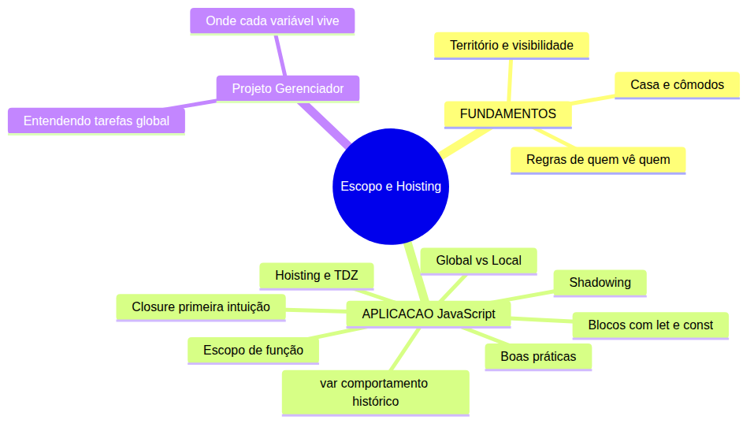
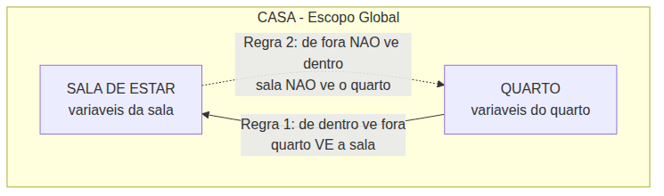

# JavaScript — Do Zero ao Profissional — Aula 11

## Escopo e Hoisting — Onde as Variáveis Existem

**Duração estimada:** 110 minutos (55 de leitura + 55 de prática)

**Nível:** Iniciante

**Pré-requisitos:** Aula 01 (console.log, fluxo Entrada→Processamento→Saída) + Aula 02 (let, const, arquivo HTML+script) + Aula 03 (tipos primitivos, typeof) + Aula 04 (operadores) + Aula 05 (prompt, alert, template literals) + Aula 06 (strings, índices, .length, métodos) + Aula 07 (if/else, switch, blocos {}) + Aula 08 (for, while, do...while, break, continue) + Aula 09 (arrays, push, length, for...of, Gerenciador com array) + Aula 10 (function, parâmetros, return, Gerenciador refatorado)

---

## Objetivos de Aprendizagem

Ao final desta aula, você será capaz de:

- [ ] **Explicar** o conceito de escopo usando a analogia da casa e dos cômodos — território determina visibilidade
- [ ] **Identificar** o escopo de uma variável observando onde foi declarada: bloco `{}`, função ou topo do script (global)
- [ ] **Distinguir** escopo de bloco (`let`/`const`) de escopo de função (`var`)
- [ ] **Reconhecer** variáveis globais vs locais no Gerenciador de Tarefas — e explicar por que `tarefas` funciona em todas as funções
- [ ] **Prever** o comportamento de shadowing — variável local "esconde" a global mas não a modifica
- [ ] **Explicar** por que `var` permite acesso antes da declaração (undefined) e `let`/`const` lançam ReferenceError na TDZ
- [ ] **Demonstrar** hoisting na prática: `var` sobe com undefined, `let`/`const` na TDZ, `function` sobe completa
- [ ] **Descrever** closure como "função que lembra do escopo onde nasceu" — mesmo após a função externa terminar
- [ ] **Aplicar** boas práticas de escopo: evitar globais, preferir `const`, declarar no escopo mais restrito

---

## Como Usar Esta Aula

Esta aula está organizada em duas partes.

Na **primeira parte** (seção 1), você vai construir o modelo mental de escopo sem escrever uma linha de código. A analogia central é a casa com cômodos — um conceito universal que vale para QUALQUER linguagem de programação. Zero JavaScript.

Na **segunda parte** (seções 2 a 9), você vai aplicar cada conceito ao JavaScript: blocos `{}`, escopo de função, a diferença entre `let`/`const` e `var`, shadowing, hoisting, e uma primeira intuição sobre closure — funções que "lembram" do escopo onde nasceram. Cada seção termina com um Quick Check para verificar seu entendimento.

Ao longo da leitura, você encontrará seções **"Mão na Massa"** — momentos para ABRIR o Console e praticar. Ao final, o arquivo separado **Questões de Aprendizagem** traz as tarefas de checkpoint — só avance para a próxima aula quando conseguir completá-las por conta própria.

---

## Mapa Mental



> *O mapa mental acima mostra a estrutura da aula. Cada ramo representa um conceito que você vai explorar.*

---

## Recapitulação das Aulas Anteriores

| Aula | Conceito | Onde aparece nesta aula | Como se conecta |
|---|---|---|---|
| Aula 07 | **Blocos `{}` em if/else/switch** (seções 2-3) | Seções 2, 4, 7 | Os blocos que você já usa vão ganhar um novo significado: eles criam "paredes" para variáveis |
| Aula 08 | **Blocos `{}` em for/while** (seções 3-5) | Seções 2, 4, 7 | O `for` cria seu próprio escopo — entender isso explica por que `i` some depois do loop |
| Aula 09 | **Array `tarefas`** (seções 4-7) | Seção 5 | O array do Gerenciador é o exemplo PERFEITO de escopo global |
| Aula 10 | **Funções com `function`** (seções 3-7) | Seções 3, 4, 5, 8 | Cada função cria seu "quarto" — variáveis declaradas dentro só existem ali |
| Aula 10 | **Gerenciador refatorado** (seção 7) | Seção 5 | Você vai finalmente entender por que `tarefas` funciona em todas as funções |

---

**FUNDAMENTOS: Território e Visibilidade — Onde as Coisas Existem**

> *Os conceitos desta seção são universais — valem para qualquer linguagem de programação. Você vai construir o modelo mental de "escopo" usando a analogia de uma casa com cômodos. Não escreva código ainda. Apenas leia, visualize e absorva. Na segunda parte, você verá como essas regras são implementadas na prática.*

---

## 1. Território e Visibilidade — O Conceito Universal de Escopo

Imagine uma casa. Não uma casa qualquer — a sua casa, ou a casa dos seus sonhos. Ela tem uma sala de estar, um quarto, uma cozinha. Agora pense no seguinte: o que você consegue ver de cada cômodo?

Se você está na **sala de estar**, você vê o sofá, a TV, a mesa de centro. Tudo que está na sala é visível para quem está ali dentro. Agora, se você está no **quarto** com a porta aberta, você também vê a sala — o sofá, a TV, a mesa. Mas e o contrário? Se você está na sala e o quarto está com a porta fechada, você NÃO vê o que está dentro do quarto.

Essa é a essência do **escopo** em programação.

**Escopo** é o território onde uma variável existe. É o "cômodo" onde ela foi declarada. E assim como numa casa, existem regras claras sobre quem vê quem.

Vamos destrinchar essas regras uma por uma.

### Regra 1 — De Dentro Você Vê pra Fora

Se você está em um quarto e a porta está aberta, você consegue ver a sala de estar. O que está na sala (sofá, TV, mesa) está visível para você, mesmo você estando dentro do quarto.

Traduzindo para programação: **tudo que está no escopo externo (na sala) é visível de dentro de um bloco ou função (quarto).**

Exemplo concreto: você tem uma planta na sala. Alguém no quarto consegue ver a planta. A planta não precisa ser duplicada dentro do quarto — ela já existe na sala, e o quarto a enxerga.

### Regra 2 — De Fora Você NÃO Vê pra Dentro

Agora o contrário: se você está na sala, você NÃO consegue ver o que está dentro de um quarto com a porta fechada. O conteúdo do quarto — a cama, o guarda-roupa, o abajur — só é visível para quem está DENTRO do quarto.

Traduzindo: **tudo que é declarado dentro de um bloco ou função (quarto) NÃO é visível de fora (sala).**

Essa é a regra mais importante e a que mais gera confusão em iniciantes. Se você declarar uma variável dentro de um bloco `{}`, ela só existe DENTRO daquelas chaves. Fora delas, é como se ela nunca tivesse existido.

### Regra 3 — A Coisa Mais Próxima Esconde

Você tem um relógio pendurado na parede da sala. No quarto, você tem um despertador na mesa de cabeceira. Agora, você está no quarto e alguém pergunta: "Que horas são?". Você olha para o despertador — o relógio mais próximo — e responde.

Você não está negando que o relógio da sala existe. Ele continua lá. Mas, no quarto, o que vale é o despertador, porque está MAIS PERTO.

Traduzindo: **se uma variável com o mesmo nome existe no escopo externo e no escopo interno, a mais próxima (interna) tem prioridade. A externa continua existindo, mas está "sombreada".**

Este comportamento se chama **shadowing** (sombreamento) — e vamos explorá-lo em detalhes na seção 6.

### A Regra das Caixinhas Aninhadas

Pense agora em caixas, uma dentro da outra. Você tem uma caixa grande (a sala). Dentro dela, uma caixa média (um quarto). Dentro da caixa média, uma caixa pequena (um armário).

A caixa pequena consegue ver o que está na caixa média (está dentro dela). A caixa média consegue ver o que está na caixa grande (está dentro dela). Mas a caixa grande NÃO consegue ver o que está dentro da média, e a média NÃO consegue ver o que está dentro da pequena.

Essa imagem mental das caixas aninhadas é a essência do escopo em programação. Blocos dentro de blocos. Funções dentro de funções. Cada nível vê para fora, mas não vê para dentro.

### Diagrama de Visibilidade

Veja como as regras se aplicam nesta casa simples:



As setas contínuas mostram o que é visível. A seta tracejada mostra o que NÃO é visível.

**Pausa para reflexão:** Pense na sua casa agora. Quantos "cômodos" existem? Quantos níveis de aninhamento? O banheiro fica dentro do quarto? A cozinha é separada? Cada um desses cômodos poderia ser um escopo no seu código. Visualizar essa estrutura mentalmente é o primeiro passo para dominar escopo.

### Quick Check 1

**1. Você está na sala de estar (escopo global) e seu amigo está no quarto com a porta fechada. O que você vê do que está dentro do quarto?**

**Resposta:** Nada. O conteúdo do quarto não é visível da sala. Em programação, variáveis declaradas dentro de um bloco ou função não são acessíveis de fora. Esta é a Regra 2.

**2. Você está no quarto (escopo interno) e seu primo está na sala (escopo global). Você consegue ver a planta que está na sala? Por quê?**

**Resposta:** Sim. De dentro do quarto, você vê tudo que está na sala. Em programação, o escopo interno tem acesso a tudo que está nos escopos mais externos. Esta é a Regra 1.

---

**APLICAÇÃO: Escopo, Hoisting e Closure em JavaScript**

> *Agora que você domina o modelo mental de território e visibilidade, vamos aplicá-lo ao JavaScript. Você vai descobrir que `{}` criam paredes invisíveis para `let`/`const`, que funções têm seu próprio território, que `var` é um invasor de blocos, e que o hoisting explica por que algumas declarações "sobem" e outras não. No final, você vai revisitar seu Gerenciador de Tarefas e entender de verdade por que `tarefas` funciona em todas as funções.*

---

## 2. Blocos `{}` — As Paredes Invisíveis com `let` e `const`

Lembra da Regra 2 da casa? "De fora você não vê pra dentro." Em JavaScript, as chaves `{}` são exatamente como as paredes de um cômodo. Toda variável que você declara com `let` ou `const` DENTRO das chaves só existe ali dentro.

Vamos ver isso funcionando na prática.

**Exemplo 1 — O mais básico possível:**

```javascript
if (true) {
  let mensagem = "Olá";
}

console.log(mensagem); // ❌ ReferenceError: mensagem is not defined
```

**Tradução em linguagem coloquial:** "A variável `mensagem` foi criada dentro do quarto (`{}`). Da sala (fora do bloco), você não consegue vê-la. O JavaScript confirma com um erro: ReferenceError."

Seu cérebro pode estar pensando: "Mas o `if` é verdadeiro, a variável foi criada, por que não funciona fora?". É exatamente a Regra 2: a criação aconteceu dentro do quarto. A porta está fechada. Fora do quarto, a variável simplesmente não existe.

**Exemplo 2 — Mesma ideia, valores diferentes:**

```javascript
if (true) {
  let cor = "azul";
  console.log(cor); // ✔ "azul" — dentro do quarto, você vê
}

console.log(cor); // ❌ ReferenceError — fora do quarto, não vê
```

Note a diferença: quando você acessa `cor` DENTRO do bloco (linha 3), funciona perfeitamente, porque você está no mesmo escopo. Quando acessa FORA (linha 6), quebra. Exatamente como as regras da casa previram.

**Exemplo 3 — Preparando o terreno para shadowing:**

```javascript
let cor = "vermelho"; // declarado na sala (global)

if (true) {
  let cor = "azul";   // declarado no quarto (bloco)
  console.log(cor);   // "azul" — o mais próximo vence (Regra 3!)
}

console.log(cor);     // "vermelho" — a global continua intacta
```

Percebeu a mágica? Dentro do `if`, `cor` vale "azul" porque a variável LOCAL é a mais próxima. Mas fora do `if`, a variável GLOBAL `cor` continua valendo "vermelho". Ela não foi modificada — foi apenas "sombreada" temporariamente.

### Quais Blocos Criam Escopo?

Nem toda chave `{}` em JavaScript cria escopo — mas a maioria sim. Estes blocos criam escopo para `let` e `const`:

- `if (condição) { }`
- `else { }`
- `for ( ) { }`
- `while (condição) { }`
- `do { } while (condição)`
- `switch (expressão) { }`
- Blocos soltos `{ }` (sim, você pode criar um bloco isolado!)

```javascript
{
  let x = 10;
  console.log(x); // 10 — dentro do bloco, funciona
}

console.log(x); // ❌ ReferenceError — fora do bloco, não existe
```

### Mão na Massa — Blocos no Console

Hora de praticar.

- [ ] Abra o Console do seu navegador (F12, aba Console)
- [ ] Digite o Exemplo 1 (`if (true) { let mensagem = "Olá"; } console.log(mensagem);`) e veja o erro
- [ ] Agora coloque o `console.log` DENTRO do bloco: `if (true) { let mensagem = "Olá"; console.log(mensagem); }`. Funciona!
- [ ] Crie seu próprio bloco com uma variável `const` dentro de um `if` e veja o erro ao acessar fora

**Verificação:** Se você viu um ReferenceError no primeiro teste e conseguiu ver o valor da variável no segundo, você entendeu a Regra 2 aplicada ao JavaScript.

### Quick Check 2

**1. O que aparece no console quando você executa este código?**

```javascript
let animal = "cachorro";

if (true) {
  let animal = "gato";
}

console.log(animal);
```

**Resposta:** "cachorro". A variável `animal` declarada dentro do bloco `if` é uma variável NOVA, separada. Ela só existe dentro do bloco. O `console.log` fora do bloco acessa a variável global, que continua valendo "cachorro".

**2. E se o `console.log` estivesse DENTRO do bloco `if`, o que mostraria?**

**Resposta:** Mostraria "gato". Dentro do bloco, a variável local `animal` (a mais próxima) é usada. A global continua existindo, mas está sombreada (Regra 3).

---

## 3. Escopo de Função — Cada Função Tem Seu Próprio Território

Agora vamos aplicar as Regras 1 e 2 ao tipo mais importante de escopo em JavaScript: o escopo de função.

Uma função se comporta como um quarto. Ela tem uma porta que funciona nos dois sentidos: a função (quarto) pode ver o escopo externo (sala), mas o escopo externo não pode ver dentro da função.

```javascript
let fora = "sala"; // variável GLOBAL — está na sala

function quarto() {
  let dentro = "quarto"; // variável LOCAL — está no quarto
  
  console.log(fora);   // ✔ "sala" — Regra 1: função vê escopo externo
  console.log(dentro); // ✔ "quarto" — vê suas próprias variáveis
}

quarto();

console.log(dentro); // ❌ ReferenceError — Regra 2: fora não vê dentro
```

Percebeu como cada linha confirma as regras da casa?

- `fora` é global → declarada na "sala", todo mundo vê
- `dentro` é local à função → declarada no "quarto", só o quarto vê
- Dentro de `quarto()`, conseguimos acessar TANTO `fora` quanto `dentro` — porque de dentro do quarto, vemos a sala E o quarto
- Fora de `quarto()`, só `fora` existe — `dentro` desapareceu

### Parâmetros São Locais

Quando você cria uma função com parâmetros, esses parâmetros se comportam EXATAMENTE como variáveis declaradas com `let` dentro da função:

```javascript
function soma(a, b) {
  // a e b SÓ existem aqui dentro
  let resultado = a + b;
  return resultado;
}

soma(5, 3);
console.log(a); // ❌ ReferenceError — a não existe fora da função
```

**Tradução:** `a` e `b` são como `let a = 5; let b = 3;` na primeira linha da função. Eles são locais à função e somem quando a função termina.

### Função Dentro de Função — Caixinha Aninhada

Lembra das caixinhas aninhadas? Vamos ver como fica em JavaScript:

```javascript
let global = "topo";

function externa() {
  let externaVar = "externa";

  function interna() {
    let internaVar = "interna";
    
    console.log(global);     // ✔ "topo" — da interna vejo tudo
    console.log(externaVar); // ✔ "externa" — da interna vejo a externa
    console.log(internaVar); // ✔ "interna" — minha própria variável
  }

  interna();
  
  console.log(global);     // ✔ "topo"
  console.log(externaVar); // ✔ "externa"
  console.log(internaVar); // ❌ ReferenceError — da externa NÃO vejo a interna
}

externa();
```

**A hierarquia de visibilidade é SEMPRE de dentro para fora, nunca de fora para dentro.** A função `interna` enxerga tudo: variáveis dela, da `externa` e globais. A função `externa` enxerga as próprias variáveis e as globais, mas NÃO as da `interna`. E o escopo global só enxerga as próprias variáveis.

### Mão na Massa — Funções e Escopo

- [ ] No Console, crie uma função `mostrarPrefixo()` que declara `let prefixo = "Sr."` dentro dela
- [ ] Dentro da função, exiba `prefixo` com `console.log` — funciona
- [ ] Fora da função, tente exibir `prefixo` — erro!
- [ ] Agora crie uma variável global `let nome = "João"`. Dentro da função, exiba `nome` — funciona! A função vê o escopo externo

**Verificação:** Se você conseguiu acessar `prefixo` dentro da função mas não fora, e conseguiu acessar a global `nome` dentro da função, você entendeu escopo de função.

### Quick Check 3

**1. O que este código exibe no console?**

```javascript
let linguagem = "JavaScript";

function estudar() {
  let topico = "escopo";
  console.log(linguagem + " - " + topico);
}

estudar();
console.log(topico);
```

**Resposta:** A primeira linha (`console.log` dentro de `estudar()`) exibe "JavaScript - escopo". A segunda linha (`console.log(topico)` fora da função) lança ReferenceError, porque `topico` é local à função e não existe fora.

**2. É possível uma função acessar uma variável declarada dentro de OUTRA função (não aninhada)?**

**Resposta:** Não. Duas funções irmãs (declaradas no mesmo nível) não compartilham escopo. Cada uma tem seu próprio escopo local. Apenas o escopo externo comum (geralmente o global) é compartilhado.

---

## 4. `var` — O Comportamento Histórico Que Você Precisa Conhecer

Lembra das paredes que `{}` criam para `let` e `const`? Pois bem: `var` as IGNORA COMPLETAMENTE.

`var` é como um fantasma que atravessa paredes. Ele só para diante de um obstáculo mais sério: o escopo de FUNÇÃO.

```javascript
if (true) {
  var x = 10;
  let y = 20;
}

console.log(x); // 10 — var escapou do bloco!
console.log(y); // ❌ ReferenceError — let ficou preso
```

Veja o que aconteceu: `x` foi declarado com `var` dentro do `if`, mas conseguimos acessá-lo FORA. `y` foi declarado com `let` dentro do mesmo `if` — e não conseguimos acessar fora. A diferença é DRAMÁTICA.

**Mas por que `var` existe?** É uma pergunta justa. `var` era a ÚNICA maneira de declarar variáveis em JavaScript desde sua criação em 1995 até 2015, quando o ES6 (ECMAScript 2015) introduziu `let` e `const`. Código mais antigo — e você vai encontrar muito dele — usa `var`. Mas em código NOVO, você NUNCA deve usar `var`. `let` e `const` são superiores em todos os aspectos.

### O Problema Clássico do `var` em Loops

Este é um dos bugs mais famosos em JavaScript:

```javascript
for (var i = 0; i < 3; i++) {
  console.log(i); // 0, 1, 2
}

console.log("Fora do for:", i); // 3 — var escapou!

// Compare com let:
for (let j = 0; j < 3; j++) {
  console.log(j); // 0, 1, 2
}

console.log("Fora do for:", j); // ❌ ReferenceError — let respeitou o bloco
```

Com `var`, a variável `i` vaza para fora do `for`. Ela continua existindo DEPOIS do loop, valendo 3. Isso é uma fonte clássica de bugs. Com `let`, `j` é confinada ao bloco do `for` — exatamente como deveria ser.

### O Único Muro Que `var` Respeita: Função

Se `var` ignora blocos `{}`, será que ele respeita ALGUMA coisa? Sim: funções.

```javascript
function exemplo() {
  var interna = "só aqui dentro";
  console.log(interna); // ✔ funciona
}

exemplo();
console.log(interna); // ❌ ReferenceError — var respeita função
```

Dentro de uma função, `var` fica preso. Fora de uma função, `var` vaza de QUALQUER bloco.

### Resumo Visual: var vs let vs const em Blocos

```javascript
// --- BLOCO if ---
if (true) {
  var a = 1;   // Vaza para fora
  let b = 2;   // Fica preso
  const c = 3; // Fica preso
}
console.log(a); // 1 — acessível
console.log(b); // ❌ erro
console.log(c); // ❌ erro

// --- BLOCO for ---
for (var d = 0; d < 3; d++) {} // Vaza
for (let e = 0; e < 3; e++) {} // Não vaza
console.log(d); // 3
console.log(e); // ❌ erro

// --- FUNÇÃO ---
function teste() {
  var f = "ok"; // Preso na função
  let g = "ok"; // Preso na função
}
teste();
console.log(f); // ❌ erro
console.log(g); // ❌ erro
```

### Mão na Massa — var vs let

- [ ] No Console, declare uma variável `var` dentro de um `if`: `if (true) { var nomeVar = "escapei"; }`
- [ ] Tente acessar `nomeVar` fora do bloco. Funciona? SIM.
- [ ] Agora declare `let nomeLet = "preso";` dentro do mesmo `if`
- [ ] Tente acessar `nomeLet` fora. Funciona? NÃO.
- [ ] Agora faça o teste com loop: `for (var k = 0; k < 5; k++) {}` e depois `console.log(k)`. O que mostra?

**Verificação:** Se `var` escapou e `let` ficou preso, seu teste confirmou exatamente o que esperávamos.

### Quick Check 4

**1. Qual a diferença fundamental entre `var` e `let` em relação a blocos `{}`?**

**Resposta:** `let` respeita o escopo de bloco — a variável só existe dentro das chaves onde foi declarada. `var` ignora o escopo de bloco — a variável "vaza" para fora do bloco e fica acessível no escopo da função ou global. `var` só respeita escopo de função.

**2. Por que você deveria preferir `let`/`const` a `var` em código novo?**

**Resposta:** Porque `let` e `const` têm comportamento mais previsível e seguro: respeitam blocos `{}`, não permitem redeclaração e não vazam de loops. `var` é uma relíquia histórica que causa bugs difíceis de rastrear, especialmente em loops e condicionais.

---

## 5. Global vs Local — Entendendo Seu Gerenciador de Tarefas

Chegou o momento que conecta TUDO que você aprendeu.

Abra mentalmente o Gerenciador de Tarefas que você refatorou na Aula 10. Vamos analisar CADA variável que existe no código e classificar seu escopo. Você vai finalmente entender POR QUE algumas variáveis funcionam em todos os lugares e outras não.

Aqui está a estrutura principal do seu Gerenciador:

```javascript
// --- ESCOPO GLOBAL (a sala) ---
let tarefas = []; // 🌍 GLOBAL — declarado no topo do script, FORA de qualquer função

// --- ESCOPO GLOBAL (a sala) ---
function exibirMenu() {
  // --- ESCOPO LOCAL de exibirMenu (quarto 1) ---
  let opcao = prompt("Escolha:\n1. Adicionar\n2. Listar\n3. Sair");
  return opcao;
}

function adicionarTarefa() {
  // --- ESCOPO LOCAL de adicionarTarefa (quarto 2) ---
  let novaTarefa = prompt("Digite a tarefa:");
  tarefas.push(novaTarefa); // ✔ tarefas é GLOBAL — o quarto vê a sala
}

function listarTarefas() {
  // --- ESCOPO LOCAL de listarTarefas (quarto 3) ---
  for (let i = 0; i < tarefas.length; i++) {
    // i é LOCAL ao bloco do for (um armário dentro do quarto)
    console.log((i + 1) + ". " + tarefas[i]);
  }
  // i não existe mais aqui — o armário fechou
  console.log(i); // ❌ ReferenceError — i só existe dentro do for!
}
```

### Análise Completa

**`tarefas` — escopo GLOBAL**

Está na "sala". Toda função, todo bloco, todo lugar consegue acessá-la. É por isso que `adicionarTarefa()` consegue dar `push`, `listarTarefas()` consegue percorrer, `exibirMenu()` consegue... bem, `exibirMenu()` não usa `tarefas` diretamente, mas se precisasse, conseguiria.

Lembra da sua dúvida na Aula 10? "Por que `tarefas` funciona em todas as funções mesmo sendo declarada UMA vez?" Agora você sabe: porque ela está no escopo GLOBAL, e toda função (quarto) vê a sala.

**`opcao` — escopo LOCAL de `exibirMenu`**

Está no "quarto" de `exibirMenu`. Só existe dentro dessa função. Nenhuma outra função consegue acessá-la. Se `adicionarTarefa()` tentar ler `opcao`, vai dar ReferenceError.

**`novaTarefa` — escopo LOCAL de `adicionarTarefa`**

No "quarto" de `adicionarTarefa`. Só existe lá. Quando a função termina, `novaTarefa` desaparece da memória.

**`i` — escopo LOCAL do bloco `for` dentro de `listarTarefas`**

Está no "armário dentro do quarto". Só existe durante a execução do `for`. Antes de o `for` começar, `i` não existe. Depois que o `for` termina, `i` também não existe. É por isso que `console.log(i)` depois do `for` dá erro.

### Por Que Isso é Importante?

Entender o escopo de CADA variável do seu Gerenciador transforma você de "aluno que copia código" para "programador que entende o código".

- Quando uma variável não funciona onde você esperava, a primeira pergunta é: "qual o escopo dela?"
- Quando um valor "some" depois de uma função, você sabe que era uma variável local
- Quando você vê um erro de `ReferenceError: X is not defined`, você sabe: ou X não foi declarada, ou você está tentando acessá-la de fora do escopo dela

### Mão na Massa — Investigando o Gerenciador

Pegue seu arquivo do Gerenciador de Tarefas (o que você refatorou na Aula 10) e faça estes experimentos:

- [ ] No final do script (FORA de qualquer função), adicione `console.log(opcao);`. Salve e execute no navegador. O que aparece? ReferenceError — `opcao` é local a `exibirMenu`, não existe no escopo global
- [ ] No final do script, adicione `console.log(tarefas);`. Salve e execute. Funciona! Mostra o array — `tarefas` é global
- [ ] Dentro de `listarTarefas`, DEPOIS do loop `for`, adicione `console.log(i);`. O que aparece? ReferenceError — `i` era local ao bloco do `for`

**Verificação:** Se você viu ReferenceError nos itens 1 e 3, e viu o array no item 2, você entendeu a diferença entre escopo global e local.

### Quick Check 5

**1. No Gerenciador de Tarefas, por que `tarefas` é acessível dentro de `adicionarTarefa()` se foi declarada fora dela?**

**Resposta:** Porque `tarefas` foi declarada no escopo GLOBAL (topo do script, fora de qualquer função). Pela Regra 1 (de dentro vê fora), toda função consegue acessar variáveis do escopo externo. O "quarto" vê a "sala".

**2. Se você declarar `let contador = 0;` dentro de `exibirMenu()`, essa variável será acessível em `listarTarefas()`?**

**Resposta:** Não. `contador` seria LOCAL a `exibirMenu()`. Cada função tem seu próprio escopo. `listarTarefas()` não tem acesso a variáveis de outras funções — a não ser que estejam aninhadas ou sejam globais.

---

## 6. Shadowing — Quando o Local "Esconde" o Global

Lembra da Regra 3 da casa? "Se duas coisas têm o mesmo nome, a mais próxima esconde a mais distante." Em JavaScript, isso se chama SHADOWING (sombreamento).

O shadowing acontece quando você declara uma variável em um escopo interno com o MESMO nome de uma variável em um escopo externo. A variável interna "faz sombra" sobre a externa — temporariamente.

```javascript
let nome = "Global"; // 🌍 variável no escopo global

function teste() {
  let nome = "Local"; // 🏠 variável LOCAL com o MESMO nome
  console.log(nome);  // "Local" — a local escondeu a global (Regra 3!)
}

teste();
console.log(nome); // "Global" — a global continua intacta fora
```

Veja o que acontece passo a passo:

1. `let nome = "Global"` cria uma variável no escopo global — `nome` vale "Global"
2. `teste()` é chamada. Dentro dela, `let nome = "Local"` cria uma NOVA variável, também chamada `nome`, mas no escopo LOCAL
3. `console.log(nome)` dentro de `teste()` — qual `nome` usar? A mais próxima! A local vence. Exibe "Local"
4. Depois que `teste()` termina, `console.log(nome)` fora da função — a variável local já morreu. Só resta a global. Exibe "Global"

### A Armadilha Clássica

Shadowing gera um dos bugs mais comuns em JavaScript: o programador acha que está MODIFICANDO a variável global, mas na verdade está CRIANDO uma nova variável local com o mesmo nome.

```javascript
let contador = 10; // global

function incrementarErrado() {
  let contador = 0; // CRIOU uma nova variável local (shadowing!)
  contador = contador + 1; // incrementa a local, não a global
  console.log(contador); // 1
}

incrementarErrado();
console.log(contador); // 10 — a global NÃO foi modificada!
```

O programador que escreveu isso provavelmente queria modificar o `contador` global para 11. Mas sem querer, criou um `contador` local dentro da função. O `contador` global ficou intacto em 10.

**Pegadinha visual:** O código parece certo. `contador` está sendo incrementado. Mas está incrementando a CÓPIA local, não a original.

### Como Evitar a Armadilha

A regra de ouro: **use nomes DIFERENTES para variáveis em escopos diferentes**. Se você precisa modificar uma variável global, NÃO redeclare com `let` ou `const`:

```javascript
let contador = 10; // global

function incrementarCerto() {
  // SEM let — estou modificando a global existente
  contador = contador + 1;
  console.log(contador); // 11
}

incrementarCerto();
console.log(contador); // 11 — agora sim, a global foi modificada!
```

A diferença sutil: na primeira versão (`incrementarErrado`), usamos `let` na frente, o que CRIA uma nova variável. Na segunda (`incrementarCerto`), NÃO usamos `let` — apenas `contador = ...` — o que MODIFICA a variável existente no escopo externo.

### Quando o Shadowing é Útil

Shadowing não é intrinsecamente ruim — às vezes é intencional e útil:

```javascript
function formatarNome(nome) {
  // O parâmetro 'nome' faz sombra sobre qualquer 'nome' global
  let formatado = nome.trim().toUpperCase();
  return formatado;
}

let nome = "joão";
console.log(formatarNome(nome)); // "JOÃO" — shadowing do parâmetro sobre a global
console.log(nome);               // "joão" — a global intacta
```

Aqui o shadowing é esperado: o parâmetro `nome` da função TEM que ter o mesmo nome para receber o valor passado. Não há bug.

### Mão na Massa — Shadowing

- [ ] No Console, crie `let total = 100;`
- [ ] Crie a função: `function somar() { let total = 50; console.log("Dentro:", total); }`
- [ ] Chame `somar()` — exibe "Dentro: 50"
- [ ] Exiba `total` no console — exibe 100
- [ ] Agora tente: crie `let valor = 200;` e depois a função: `function modificar() { valor = 300; }` (SEM let). Chame `modificar()` e exiba `valor` no console

**Verificação:** No primeiro teste, a variável global ficou intacta (shadowing). No segundo teste, a global foi modificada porque você não usou `let`.

### Quick Check 6

**1. O que este código exibe?**

```javascript
let mensagem = "Olá";

function dizer() {
  let mensagem = "Tchau";
  console.log(mensagem);
}

dizer();
console.log(mensagem);
```

**Resposta:** Exibe "Tchau" (dentro da função) e "Olá" (fora da função). A função criou uma variável local `mensagem` que sombreou a global temporariamente.

**2. Como você MODIFICARIA a variável global `mensagem` de dentro da função, em vez de criar uma nova?**

**Resposta:** Removendo `let` na frente. Em vez de `let mensagem = "Tchau"`, use apenas `mensagem = "Tchau"`. Isso diz ao JavaScript: "não crie uma nova variável, use a que já existe no escopo externo".

---

## 7. Hoisting e Temporal Dead Zone (TDZ) — O Efeito "Içar"

Agora vamos explorar um dos comportamentos mais peculiares do JavaScript: o **hoisting** (içamento, em português).

Antes de executar seu código linha por linha, o JavaScript dá uma "passada" por ele, identificando todas as declarações de variáveis e funções. Ele então "iça" (hoists) essas declarações para o topo do escopo.

Mas — e isso é crucial — cada tipo de declaração é içada de uma forma DIFERENTE.

### `var` — Sobe com `undefined`

```javascript
console.log(x); // undefined — NÃO quebra!
var x = 5;
```

Você deve estar pensando: "Como assim? `x` foi usado antes de ser declarado!"

O JavaScript reescreve mentalmente o código assim:

```javascript
// O que o JavaScript ENXERGA:
var x;          // declaração foi içada para o topo
console.log(x); // undefined — a atribuição AINDA NÃO aconteceu
x = 5;         // atribuição ficou no lugar original
```

A declaração `var x` foi içada. Mas a ATRIBUIÇÃO `x = 5` ficou onde estava. Por isso `console.log(x)` mostra `undefined` — a variável existe (foi içada), mas ainda não recebeu o valor 5.

**Você pode estar pensando:** "Puxa, que confuso. Que utilidade tem isso?" Exatamente: NENHUMA. É um comportamento histórico confuso que `let` e `const` corrigem.

### `let` e `const` — Sobem mas Ficam na Zona Proibida

```javascript
console.log(y); // ❌ ReferenceError: Cannot access 'y' before initialization
let y = 5;
```

Diferente do que muitos pensam, `let` e `const` TAMBÉM sofrem hoisting. A declaração é içada para o topo do escoco. Mas você NÃO PODE acessá-las antes da linha de declaração.

O período entre o topo do escopo e a linha de declaração se chama **Temporal Dead Zone** (TDZ) — Zona Morta Temporal.

```javascript
// -- INÍCIO DA TDZ de y --
console.log(y); // ❌ Erro! y está na TDZ
let y = 5;
// -- FIM DA TDZ de y --
console.log(y); // ✔ 5 — y saiu da TDZ
```

**Analogia da Sala Trancada:** "A variável `y` existe desde o começo do bloco, mas está numa sala trancada. A porta só abre na linha `let y = 5`. Antes disso, você não pode tocá-la."

### `function` — Sobe COMPLETA

```javascript
saudacao(); // ✔ "Olá!" — funciona mesmo ANTES da declaração!

function saudacao() {
  console.log("Olá!");
}
```

Aqui a mágica é diferente. A declaração INTEIRA da função — incluindo seu corpo — é içada para o topo. É por isso que você pode chamar `saudacao()` antes da linha onde ela foi declarada.

```javascript
// O que o JavaScript ENXERGA:
function saudacao() {
  console.log("Olá!");
}
saudacao(); // ✔
```

**Isso significa que a ordem das funções não importa.** Você pode organizar seu código do jeito que fizer mais sentido para a leitura humana, e o JavaScript vai "mover" todas as declarações de função para cima antes de executar.

### Tabela Comparativa

| Tipo de declaração | Hoisting? | Valor antes da declaração | Pode acessar antes? |
|---|---|---|---|
| `var` | Sim | `undefined` | Sim (mas dá undefined) |
| `let` | Sim (TDZ) | ReferenceError | Não |
| `const` | Sim (TDZ) | ReferenceError | Não |
| `function` | Sim (completa) | A função inteira | Sim |

### Exemplo que Compara Todos

```javascript
console.log(a); // undefined — var içado, sem valor ainda
console.log(b); // ❌ ReferenceError — let na TDZ
console.log(c); // ❌ ReferenceError — const na TDZ
console.log(d()); // ✔ "fn!" — function içada completa

var a = 1;
let b = 2;
const c = 3;

function d() {
  return "fn!";
}
```

### A TDZ Também Vale em Blocos

A TDZ não acontece só no escopo global — acontece em QUALQUER bloco:

```javascript
let x = "fora"; // global

if (true) {
  console.log(x); // ❌ ReferenceError — x está na TDZ (o x LOCAL)
  let x = "dentro"; // declaração LOCAL
}
```

Isso pega MUITA gente! O `console.log(x)` parece que deveria acessar o `x` global ("fora"), mas não acessa. Por quê? Porque o `let x = "dentro"` no bloco sofre hoisting ATÉ O TOPO DO BLOCO. O `x` global é "sombreado" pelo `x` local que ainda está na TDZ.

### Mão na Massa — Hoisting na Prática

- [ ] No Console, teste `console.log(x); var x = 10;` — mostra `undefined`
- [ ] Teste `console.log(y); let y = 20;` — ReferenceError
- [ ] Teste `console.log(z); const z = 30;` — ReferenceError
- [ ] Teste chamar uma função ANTES da declaração: `ola(); function ola() { console.log("Oi!"); }` — mostra "Oi!"
- [ ] Teste a armadilha do bloco: `let a = "global"; if (true) { console.log(a); let a = "local"; }` — ReferenceError!

**Verificação:** Se você viu `undefined` para `var`, ReferenceError para `let`/`const`, e funcionou para `function`, seu teste confirmou exatamente o comportamento do hoisting.

### Quick Check 7

**1. Qual a diferença entre o hoisting de `var` e o de `let`/`const`?**

**Resposta:** Ambos sofrem hoisting (a declaração é içada ao topo do escoco). Mas `var` permite acesso antes da declaração — o valor é `undefined`. `let` e `const` ficam numa "Zona Morta Temporal" (TDZ) entre o topo do escopo e a declaração — qualquer acesso antes da linha de declaração lança ReferenceError.

**2. Por que você consegue chamar uma função declarada com `function` ANTES da linha onde ela foi escrita?**

**Resposta:** Porque `function` sofre hoisting completo — a função INTEIRA (declaração + corpo) é içada ao topo do escopo. Diferente de `var` (que sobe com undefined) e `let`/`const` (que sobem mas ficam na TDZ), `function` sobe pronta para uso.

---

## 8. Closure — A Função Que Lembra (Primeira Intuição)

Até agora, aprendemos que uma função pode acessar variáveis do escopo externo — desde que a função esteja DENTRO daquele escopo. Mas e se a função externa JÁ TERMINOU de executar? A função interna ainda "lembra" das variáveis do escopo onde nasceu?

A resposta é SIM — e esse fenômeno se chama **closure**.

Closure é a capacidade de uma função "lembrar" do escopo onde foi criada, mesmo depois que aquele escopo já terminou de executar. É como se a função carregasse uma "mochila invisível" com as variáveis do ambiente onde nasceu.

### O Exemplo Clássico — Contador com Memória

```javascript
function criaContador() {
  let count = 0; // variável LOCAL a criaContador

  return function() {
    count++;     // incrementa count da função externa
    return count;
  };
}

let contador = criaContador(); // criaContador() JÁ TERMINOU de executar...

console.log(contador()); // 1 — mas count ainda está vivo!
console.log(contador()); // 2
console.log(contador()); // 3
```

**O que acontece aqui é quase mágico.** Veja o fluxo:

1. `criaContador()` é executada. Ela declara `let count = 0` e retorna uma função anônima que incrementa `count`
2. `criaContador()` TERMINA sua execução. Normalmente, a variável local `count` deveria ser destruída — ninguém mais precisa dela, certo?
3. ERRADO. A função anônima que foi retornada AINDA PRECISA de `count`. Ela "levou `count` na mochila"
4. Cada vez que `contador()` é chamada, ela acessa o `count` que está na mochila — e o incrementa

O resultado: `contador()` vira uma função que TEM ESTADO. Ela lembra onde parou.

### Cada Contador é Independente

O mais interessante: cada chamada a `criaContador()` cria um NOVO closure com seu PRÓPRIO `count`:

```javascript
let contador1 = criaContador();
let contador2 = criaContador();

console.log(contador1()); // 1
console.log(contador1()); // 2
console.log(contador2()); // 1 — contador2 tem seu PRÓPRIO count!
console.log(contador1()); // 3
console.log(contador2()); // 2
```

`contador1` e `contador2` são independentes. Cada um tem sua própria "mochila" com seu próprio `count`. Eles não interferem um no outro.

### Por Que Isso Importa?

Closure é a base de conceitos avançados em JavaScript:

- **Privacidade de dados**: o `count` é PRIVADO — ninguém de fora consegue acessá-lo diretamente. Só a função retornada pode modificá-lo
- **Estado persistente**: a função "lembra" de valores entre chamadas, sem usar variáveis globais
- **Factory de funções**: você pode criar múltiplas funções com comportamentos similares, cada uma com seu próprio estado

**IMPORTANTE:** Esta é uma INTRODUÇÃO por intuição. Vamos aprofundar closure mais adiante no curso. O objetivo aqui é plantar a semente: "funções podem lembrar de onde nasceram."

### Mão na Massa — Criando Seu Primeiro Closure

- [ ] No Console, digite exatamente o código do `criaContador`
- [ ] Crie `let meuContador = criaContador();`
- [ ] Chame `meuContador()` três vezes — veja os números 1, 2, 3
- [ ] Crie `let outroContador = criaContador();`
- [ ] Chame `meuContador()` mais uma vez (deve ser 4) e `outroContador()` (deve ser 1)
- [ ] Tente acessar `count` diretamente: `console.log(count)` — ReferenceError! O `count` é privado

**Verificação:** Se cada contador manteve sua própria contagem independente, você criou e testou closures com sucesso.

### Quick Check 8

**1. O que é closure, em uma frase?**

**Resposta:** Closure é a capacidade de uma função "lembrar" das variáveis do escopo onde foi criada, mesmo depois que aquele escopo já terminou de executar. A função carrega uma "mochila" com as variáveis que precisa.

**2. No exemplo `criaContador`, quantas variáveis `count` existem na memória se você chamar `criaContador()` duas vezes?**

**Resposta:** Duas variáveis `count` independentes. Cada chamada a `criaContador()` cria um novo escopo com seu próprio `count`. Cada closure retornado mantém seu `count` na "mochila" de forma isolada.

---

## 9. Boas Práticas de Escopo — Organizando Seus Territórios

Agora que você entende profundamente COMO o escopo funciona, vamos falar de COMO USAR esse conhecimento para escrever código melhor, mais seguro e mais fácil de dar manutenção.

### Regra 1 — Evite Variáveis Globais

Variáveis globais são a "sala de estar" da casa. Todo mundo vê, todo mundo pode modificar. Isso parece prático, mas é uma faca de dois gumes.

```javascript
// ❌ EVITE: variável global que qualquer função pode modificar
let resultado = 0;

function soma(a, b) {
  resultado = a + b; // modifica a global
}

function multiplica(a, b) {
  resultado = a * b; // modifica a global — conflito!
}

soma(5, 3);
console.log(resultado); // 8

multiplica(4, 2);
console.log(resultado); // 8? Não! 8 * 4? Não! resultado agora é 8 da multiplicação... espera, é 8 também
```

O problema: se `soma` e `multiplica` fossem chamadas em ordens diferentes, ou por engano, o `resultado` global seria sobrescrito. Em programas grandes, rastrear qual função modificou uma global é um pesadelo.

```javascript
// ✔ MELHOR: cada função retorna seu próprio resultado
function soma(a, b) {
  return a + b; // retorna, não modifica global
}

function multiplica(a, b) {
  return a * b;
}

let resultadoSoma = soma(5, 3);
let resultadoMult = multiplica(4, 2);
```

**Quando USAR globais:** Dados que realmente precisam ser compartilhados por todo o programa — como o array `tarefas` do Gerenciador. Mas mesmo nesse caso, minimize o número delas.

### Regra 2 — Escopo Mais Restrito Possível

Se uma variável só é usada dentro de um `if`, declare-a DENTRO do `if`. Se só é usada em uma função, declare-a na função. Quanto mais restrito o escopo, menor a chance de conflitos.

```javascript
// ❌ EVITE: variável declarada fora, usada só dentro
let mensagem;
if (usuarioLogado) {
  mensagem = "Bem-vindo!";
  console.log(mensagem);
}

// ✔ MELHOR: variável declarada DENTRO do bloco onde é usada
if (usuarioLogado) {
  let mensagem = "Bem-vindo!";
  console.log(mensagem);
}
// mensagem nem existe fora — mais seguro!
```

### Regra 3 — Prefira `const` SEMPRE

Use `const` como padrão absoluto. Só use `let` quando o valor PRECISAR ser reatribuído. `var`? NUNCA em código novo.

```javascript
// ✔ const é o padrão
const nome = "João";
const diasSemana = 7;
const tarefas = [];

// Só use let quando precisar reatribuir
let contador = 0;
contador = contador + 1;

// ❌ NUNCA var em código novo
// var idade = 25; // NÃO!
```

### Regra 4 — Declare no Topo do Escopo

Dentro de cada escopo, declare as variáveis no topo, antes de usá-las. Isso evita surpresas com a TDZ e torna o código mais legível — você sabe de cara quais variáveis existem naquele escopo.

```javascript
function processar() {
  // Declare tudo no topo
  const nome = "Maria";
  let contador = 0;
  const limite = 10;

  // Depois use
  for (let i = 0; i < limite; i++) {
    contador++;
  }
  console.log(nome + " processou " + contador + " itens");
}
```

### Tabela Resumo: var vs let vs const

| Característica | var | let | const |
|---|---|---|---|
| Escopo | Função | Bloco | Bloco |
| Hoisting | Sim (undefined) | Sim (TDZ) | Sim (TDZ) |
| Reatribuição | Sim | Sim | Não |
| Pode redeclarar | Sim | Não | Não |
| Quando usar | NUNCA | Quando precisar reatribuir | PADRÃO — sempre que possível |

### Mão na Massa — Refatorando para Boas Práticas

Pegue um código seu antigo (qualquer um) e faça este exercício:

- [ ] Identifique TODAS as variáveis declaradas com `var` — substitua por `let` ou `const`
- [ ] Identifique variáveis que nunca são reatribuídas — troque `let` por `const`
- [ ] Identifique variáveis globais que poderiam ser locais — mova para dentro do escopo mais restrito
- [ ] Verifique se alguma variável poderia ser declarada DENTRO de um bloco `if` ou `for` em vez de fora

### Quick Check 9

**1. Qual das três (`var`, `let`, `const`) você deve usar como padrão e por quê?**

**Resposta:** `const`. Porque ela é a mais restritiva: não permite reatribuição nem redeclaração, respeita escopo de bloco, e sinaliza claramente que o valor não vai mudar. Se mais tarde você precisar reatribuir, troca para `let`. `var` nunca deve ser usado em código novo.

**2. Por que evitar variáveis globais é uma boa prática?**

**Resposta:** Variáveis globais podem ser modificadas de QUALQUER lugar do código, tornando difícil rastrear quem as alterou. Em programas com muitas funções, duas funções podem modificar a mesma global sem saber uma da outra, causando bugs silenciosos. Sempre prefira passar valores como parâmetros ou retornar valores de funções.

---

## Autoavaliação: Quiz Rápido

**1. Cite as três regras da analogia da casa aplicadas ao escopo.**

**Resposta:** (1) De dentro você vê pra fora — o escopo interno enxerga o externo. (2) De fora você NÃO vê pra dentro — o escopo externo não enxerga variáveis declaradas dentro de blocos ou funções. (3) A coisa mais próxima esconde — uma variável local com o mesmo nome de uma global "sombra" a global temporariamente (shadowing).

**2. Qual a diferença de escopo entre `let` e `var`?**

**Resposta:** `let` respeita escopo de bloco (`{}`) — a variável só existe dentro das chaves. `var` ignora escopo de bloco — só respeita escopo de função. `var` "vaza" de blocos como `if` e `for`.

**3. No Gerenciador de Tarefas, por que `tarefas` é acessível em todas as funções mas `opcao` não?**

**Resposta:** `tarefas` é declarada no escopo GLOBAL (fora de qualquer função). Pela Regra 1, qualquer função (quarto) vê a sala. `opcao` é declarada DENTRO de `exibirMenu()` — é local àquela função. Pela Regra 2, nenhuma outra função vê variáveis locais de funções vizinhas.

**4. O que é shadowing e por que causa bugs?**

**Resposta:** Shadowing é quando uma variável local tem o MESMO nome de uma variável externa, "escondendo" a externa. Causa bugs quando o programador ACHA que está modificando a variável global, mas na verdade está criando uma nova variável local — a global fica intacta.

**5. O que é hoisting e como ele age em `var`, `let` e `function`?**

**Resposta:** Hoisting é o comportamento do JavaScript de "içar" declarações ao topo do escopo antes de executar. `var` sobe com valor `undefined`. `let` e `const` sobem mas ficam na TDZ — acessar antes da declaração dá ReferenceError. `function` sobe COMPLETA — pode ser chamada antes da linha de declaração.

**6. O que é Temporal Dead Zone (TDZ)?**

**Resposta:** É o período entre o topo do escopo e a linha de declaração de um `let` ou `const`. Nesse intervalo, a variável existe (foi içada) mas NÃO PODE ser acessada. Qualquer tentativa de acesso durante a TDZ lança ReferenceError.

**7. O que é closure?**

**Resposta:** É a capacidade de uma função "lembrar" do escopo onde foi criada, mesmo após aquele escopo já ter terminado de executar. A função mantém uma referência às variáveis do escopo pai — como se carregasse uma "mochila" com elas.

**8. Qual a primeira coisa a verificar quando você recebe um erro `ReferenceError: X is not defined`?**

**Resposta:** Verificar se a variável X foi declarada e em qual escopo. O erro pode significar: (1) X nunca foi declarada, (2) X foi declarada mas em outro escopo (não acessível de onde você está tentando usá-la), ou (3) X foi declarada com `let`/`const` mas você está tentando acessá-la antes da declaração (TDZ).

---

## Mão na Massa: Exercícios Graduados

**Exercício 1 (Fácil) — Classificando Escopos**

Analise o código abaixo e classifique cada variável marcada como **GLOBAL** ou **LOCAL** (indicando a qual função/bloco ela pertence):

```javascript
let a = 10;

function calcular(x) {
  let b = 20;
  
  if (x > 0) {
    let c = 30;
    var d = 40;
    console.log(a + b + c + d);
  }

  console.log(d);
  console.log(c);
}

calcular(5);
console.log(a);
console.log(b);
```

Complete a tabela:

| Variável | Escopo |
|---|---|
| `a` | |
| `x` | |
| `b` | |
| `c` | |
| `d` | |

**Gabarito:**

| Variável | Escopo |
|---|---|
| `a` | GLOBAL — declarada no topo do script |
| `x` | LOCAL — parâmetro da função `calcular` |
| `b` | LOCAL — declarada dentro de `calcular` |
| `c` | LOCAL — declarada dentro do bloco `if` (escopo de bloco com `let`) |
| `d` | LOCAL a `calcular` — `var` ignora blocos, então `d` "vaza" do `if` e fica acessível em toda a função `calcular`. Fora de `calcular`, `d` NÃO existe |

Observação importante: `d` com `var` dentro do `if` fica acessível em toda a função `calcular`, mas NÃO fora dela. `console.log(c)` dentro de `calcular` (fora do `if`) daria ReferenceError — `c` morreu com o bloco.

**Exercício 2 (Médio) — Corrigindo Código com `var`**

O código abaixo funciona, mas usa `var` de forma problemática. Substitua `var` por `let` ou `const` conforme apropriado e explique CADA troca:

```javascript
var nome = "Gerenciador de Tarefas";
var versao = "1.0";

function mostrarInfo() {
  console.log(nome + " - v" + versao);
}

function processar() {
  for (var i = 0; i < 5; i++) {
    console.log("Processando item " + i);
  }
  console.log("Valor final de i:", i); // Isso funciona por causa do var
}
```

**Gabarito:**

```javascript
const nome = "Gerenciador de Tarefas"; // const: valor nunca reatribuído
const versao = "1.0";                   // const: valor nunca reatribuído

function mostrarInfo() {
  console.log(nome + " - v" + versao);
}

function processar() {
  for (let i = 0; i < 5; i++) { // let: escopo de bloco, i some após o for
    console.log("Processando item " + i);
  }
  // console.log(i); ❌ Agora daria erro — i não vaza do for!
}
```

**Explicação de cada troca:**

1. `nome` e `versao`: de `var` para `const`. Ambas são declaradas no escopo global e JAMAIS são reatribuídas. `const` é a escolha correta — comunica que o valor não vai mudar e previne reatribuição acidental.

2. `i` dentro do `for`: de `var` para `let`. Com `var`, o `i` "vazava" do bloco do `for` e continuava existindo depois — um comportamento indesejado. Com `let`, `i` fica confinado ao bloco do `for` e some após o loop. Se precisássemos de `i` depois do loop, deveríamos declarar uma variável separada fora.

**Desafio (Difícil) — Calculadora Encapsulada com Closure**

Crie uma função `criarCalculadora()` que retorna um objeto com quatro métodos. O estado interno (`total`) deve ser PRIVADO — ninguém de fora pode acessá-lo ou modificá-lo diretamente. Apenas os métodos podem alterar o `total`.

A calculadora deve ter:

- `somar(valor)` — adiciona `valor` ao `total` e retorna o novo total
- `subtrair(valor)` — subtrai `valor` do `total` e retorna o novo total
- `zerar()` — reseta o `total` para 0 e retorna 0
- `verTotal()` — retorna o valor atual do `total` sem modificá-lo

**Comportamento esperado:**

```javascript
let calc = criarCalculadora();

console.log(calc.verTotal()); // 0
console.log(calc.somar(10));  // 10
console.log(calc.somar(5));   // 15
console.log(calc.subtrair(3)); // 12
console.log(calc.verTotal()); // 12
console.log(calc.zerar());    // 0
console.log(calc.verTotal()); // 0

console.log(calc.total); // undefined — total é privado!
```

**Gabarito:**

```javascript
function criarCalculadora() {
  let total = 0; // PRIVADO — só existe dentro do closure

  return {
    somar: function(valor) {
      total = total + valor;
      return total;
    },
    subtrair: function(valor) {
      total = total - valor;
      return total;
    },
    zerar: function() {
      total = 0;
      return total;
    },
    verTotal: function() {
      return total;
    }
  };
}
```

**Explicação:** `criarCalculadora()` declara `let total = 0` no seu escopo local. Em seguida, retorna um objeto com quatro métodos. Cada método é uma função que forma um closure — cada uma "leva `total` na mochila". Por isso, mesmo depois que `criarCalculadora()` termina de executar, `total` continua vivo, acessível apenas por esses quatro métodos.

Nenhum código externo consegue acessar `total` diretamente. Se você tentar `calc.total`, o resultado é `undefined` — `total` não é uma propriedade do objeto, é uma variável encapsulada no closure.

**Para testar:**
- Crie duas calculadoras independentes: `let calc1 = criarCalculadora();` e `let calc2 = criarCalculadora();`. Cada uma tem seu PRÓPRIO `total`. `calc1.somar(10)` não afeta `calc2`.

---

## Resumo da Aula

### Os 9 Conceitos Fundamentais

1. **Escopo**: território onde uma variável existe e quem pode enxergá-la — a analogia da casa com cômodos. Regras: de dentro vê fora, de fora não vê dentro, o mais próximo esconde.

2. **Blocos `{}`**: paredes invisíveis para `let`/`const`. Toda variável declarada com `let` ou `const` dentro de chaves só existe ali dentro. Blocos de `if`, `else`, `for`, `while`, `switch` criam escopo.

3. **Escopo de função**: cada função tem seu próprio território. Parâmetros são variáveis locais. Função dentro de função segue a regra das caixinhas aninhadas.

4. **`var`**: ignora blocos `{}`, só respeita funções. Foi a única opção até 2015 (ES6). Em código novo, use `let` ou `const`. `var` causa bugs especialmente em loops.

5. **Global vs Local**: fora vs dentro de funções/blocos. No Gerenciador de Tarefas: `tarefas` é global (todo mundo vê), `opcao` é local (só em `exibirMenu`), `i` do `for` é local ao bloco.

6. **Shadowing**: variável local "esconde" a global de mesmo nome. A global não é modificada — fica intacta. Bug comum: usar `let` na frente quando a intenção era modificar a global.

7. **Hoisting**: declarações são içadas ao topo do escopo. `var` sobe com `undefined`, `let`/`const` sobem mas ficam na TDZ (acessar antes = ReferenceError), `function` sobe completa (pode chamar antes de declarar).

8. **Closure**: função "lembra" do escopo onde nasceu — carrega uma "mochila" de variáveis. Permite dados privados e estado persistente sem variáveis globais.

9. **Boas práticas**: evite globais, declare no escopo mais restrito, prefira `const` como padrão, `let` só quando precisar reatribuir, `var` nunca.

### O Que Você Construiu Hoje

- [x] Entendeu o modelo mental de escopo pela analogia da casa com cômodos
- [x] Testou blocos `{}` com `let`/`const` no Console e viu que variáveis não vazam
- [x] Criou funções com variáveis locais e verificou que o escopo externo não as enxerga
- [x] Comparou `var` vs `let` em blocos — descobriu que `var` escapa e `let` não
- [x] Analisou seu Gerenciador de Tarefas, classificando cada variável como global ou local
- [x] Criou shadowing intencional e entendeu por que é uma armadilha comum
- [x] Testou hoisting com `var`, `let`, `const` e `function`
- [x] Criou seu primeiro closure (criaContador) — uma função que "lembra" do escopo onde nasceu
- [x] Construiu uma Calculadora Encapsulada usando closure e dados privados
- [x] Aprendeu boas práticas para declarar variáveis no escopo correto

---

## Próxima Aula

**Aula 12: Objetos Literais**

Agora que você entende onde as variáveis EXISTEM (escopo), está pronto para aprender a organizar múltiplos valores relacionados em uma única estrutura — os objetos literais. Se arrays são listas ordenadas, objetos são "fichas de cadastro": cada valor tem uma etiqueta (propriedade) que o identifica. Você vai aprender a criar objetos, acessar e modificar propriedades, e aplicar objetos ao seu Gerenciador de Tarefas — porque uma tarefa não é só um texto, é um objeto com texto, data e status.

---

## Referências

### Documentação Oficial

- [MDN: Escopo (Scope)](https://developer.mozilla.org/en-US/docs/Glossary/Scope) — definição oficial e exemplos
- [MDN: let](https://developer.mozilla.org/en-US/docs/Web/JavaScript/Reference/Statements/let) — documentação completa do `let`
- [MDN: const](https://developer.mozilla.org/en-US/docs/Web/JavaScript/Reference/Statements/const) — documentação completa do `const`
- [MDN: var](https://developer.mozilla.org/en-US/docs/Web/JavaScript/Reference/Statements/var) — documentação completa do `var`
- [MDN: Blocos](https://developer.mozilla.org/en-US/docs/Web/JavaScript/Reference/Statements/block) — blocos `{}` em JavaScript
- [MDN: Hoisting](https://developer.mozilla.org/en-US/docs/Glossary/Hoisting) — definição oficial de hoisting
- [MDN: Closures](https://developer.mozilla.org/en-US/docs/Web/JavaScript/Closures) — guia completo sobre closures

### Tutoriais Recomendados

- [JavaScript.info: Escopo de variável](https://javascript.info/closure) — explicação visual com exemplos interativos
- [W3Schools: JavaScript Scope](https://www.w3schools.com/js/js_scope.asp) — guia rápido e direto

---

## FAQ

**P: O que acontece se eu esquecer de declarar uma variável (`let`, `const`, `var`) e simplesmente usar `x = 5`?**

R: Em modo não-estrito (o padrão em scripts HTML simples), o JavaScript CRIA uma variável global automaticamente. Isso é considerado uma má prática — a variável global não intencional pode conflitar com outras partes do código. Sempre declare variáveis explicitamente.

**P: Por que o `console.log` de uma variável `let` dentro de um bloco `if` falso dá erro se ela nem foi criada?**

R: Porque o hoisting de `let` iça a declaração para o topo do bloco, mesmo que o bloco não execute. A variável entra na TDZ desde o início do bloco. Se você tentar acessá-la antes da linha de declaração (mesmo que essa linha nunca execute), o erro acontece.

**P: Posso usar `const` para declarar um array ou objeto e ainda assim modificá-lo?**

R: Sim! `const` impede a REATRIBUIÇÃO da variável, mas não impede a MUTAÇÃO do valor. Você pode fazer `const arr = []; arr.push(1);` — isso funciona. O que NÃO funciona é `const arr = []; arr = [2];` (reatribuição). O mesmo vale para objetos.

**P: Por que o `var` foi criado se `let` e `const` são melhores?**

R: `var` é a declaração original do JavaScript (1995). Na época, o conceito de escopo de bloco não existia na linguagem. Quando o ES6 foi criado em 2015, `let` e `const` foram introduzidos para corrigir os problemas de `var` — mas `var` foi mantido para compatibilidade com código existente.

**P: Closure consome mais memória?**

R: Sim, porque a função mantém uma referência ao escopo pai mesmo após ele terminar. O garbage collector não pode liberar aquela memória enquanto o closure existir. É um custo aceitável para os benefícios que closures trazem, mas é bom ter consciência disso em programas com muitos closures simultâneos.

**P: Como faço para inspecionar o escopo de uma variável no navegador?**

R: Abra o DevTools (F12), vá na aba Sources, abra seu arquivo .js, coloque um breakpoint (clicando no número da linha) e execute o código. Quando a execução pausar, olhe o painel "Scope" à direita — ele mostra os escopos ativos (local, block, closure, global) com suas variáveis.

**P: Qual a diferença entre escopo LÉXICO e escopo DINÂMICO?**

R: JavaScript usa escopo LÉXICO (estático): o escopo é determinado pela POSIÇÃO do código, não por como/onde a função é chamada. Escopo dinâmico (usado por poucas linguagens, como Bash) determina o escopo pela PILHA DE CHAMADAS. O escopo léxico é o motivo pelo qual closures funcionam — a função "lembra" onde foi escrita, não onde foi executada.

**P: Toda função cria um closure?**

R: Sim. Toda função em JavaScript é um closure — toda função tem acesso ao escopo onde foi criada. Mas a característica se torna RELEVANTE quando a função sobrevive ao escopo onde foi criada (ex: retornada de outra função). Antes disso, o closure é "invisível" porque o escopo pai ainda está ativo.

---

## Glossário

| Termo | Definição |
|---|---|
| **Escopo** | Território onde uma variável existe e é visível. Determina quem pode acessar o quê. (Ver seções 1-3) |
| **Escopo global** | O escopo mais externo, fora de qualquer função ou bloco. Variáveis globais são visíveis em todo o programa. (Ver seção 5) |
| **Escopo local** | Escopo dentro de uma função (`function`) ou bloco (`{}`). Variáveis locais só existem dentro do escopo onde foram declaradas. (Ver seções 2-3) |
| **Escopo de bloco** | Escopo delimitado por `{}`. Criado por `if`, `for`, `while`, `switch`, blocos soltos. Respeitado por `let` e `const`, ignorado por `var`. (Ver seção 2) |
| **Escopo de função** | Escopo delimitado pelo corpo de uma função. É o único escopo que `var` respeita. (Ver seção 3) |
| **Bloco** | Conjunto de instruções delimitado por chaves `{}`. Cria uma "parede" para variáveis `let` e `const`. (Ver seção 2) |
| **Hoisting** | Comportamento do JavaScript de "içar" declarações ao topo do escopo antes da execução. (Ver seção 7) |
| **TDZ (Temporal Dead Zone)** | Período entre o topo do escopo e a linha de declaração de `let`/`const`. Acesso na TDZ lança ReferenceError. (Ver seção 7) |
| **Shadowing** | Quando uma variável de escopo interno tem o mesmo nome de uma do escopo externo, "escondendo" a externa. (Ver seção 6) |
| **Closure** | Função que "lembra" do escopo onde foi criada, mantendo referência a variáveis do escopo pai mesmo após ele terminar. (Ver seção 8) |
| **Escopo léxico** | Modelo de escopo do JavaScript: o escopo de uma função é determinado por onde ela foi ESCRITA (posição no código), não de onde foi chamada. (Ver seção 3) |
| **Variável global** | Variável declarada fora de qualquer função ou bloco, no escopo mais externo. (Ver seção 5) |
| **Variável local** | Variável declarada dentro de uma função ou bloco, existe apenas naquele escopo. (Ver seções 2-3) |
| `let` | Palavra-chave para declarar variáveis com escopo de bloco. Permite reatribuição. Preferir sobre `var`. (Ver seções 2, 4, 9) |
| `const` | Palavra-chave para declarar constantes com escopo de bloco. Não permite reatribuição. Usar como padrão. (Ver seções 2, 4, 9) |
| `var` | Palavra-chave LEGADO para declarar variáveis. Escopo de função (ignora blocos). Não usar em código novo. (Ver seção 4) |
| **ReferenceError** | Erro lançado quando o JavaScript não encontra uma variável no escopo atual. (Ver seções 2, 7) |
