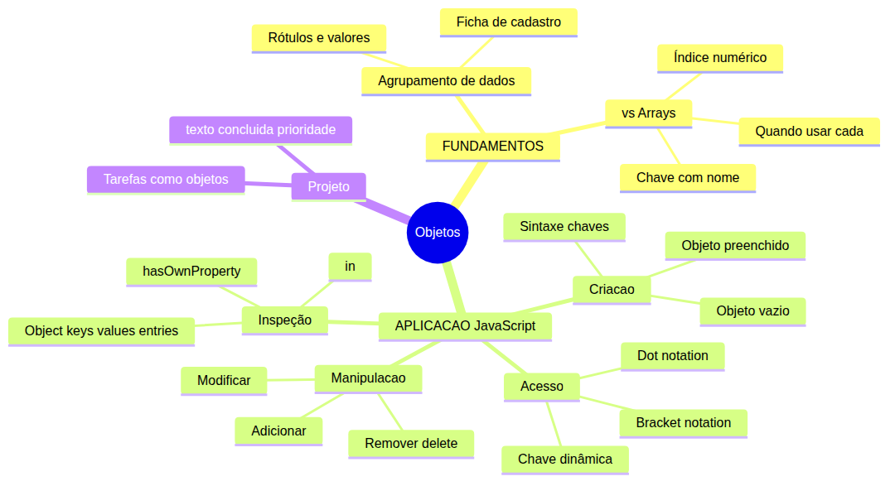
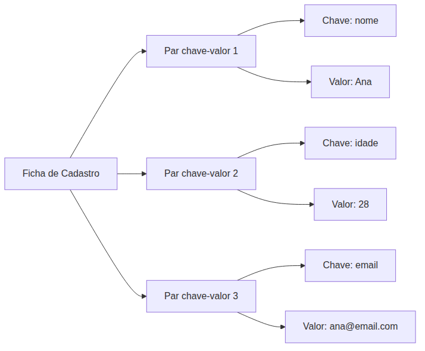
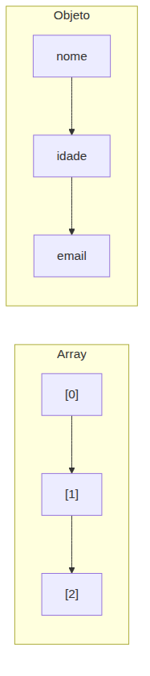
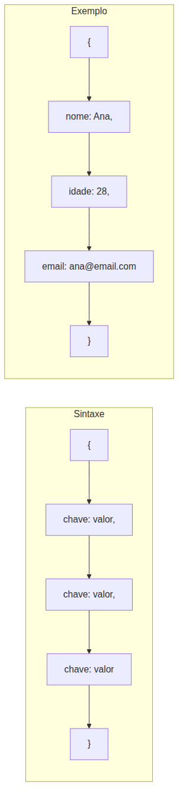
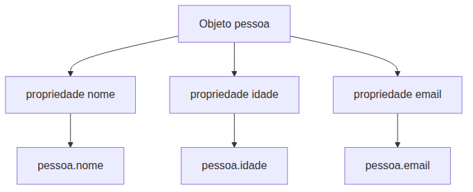
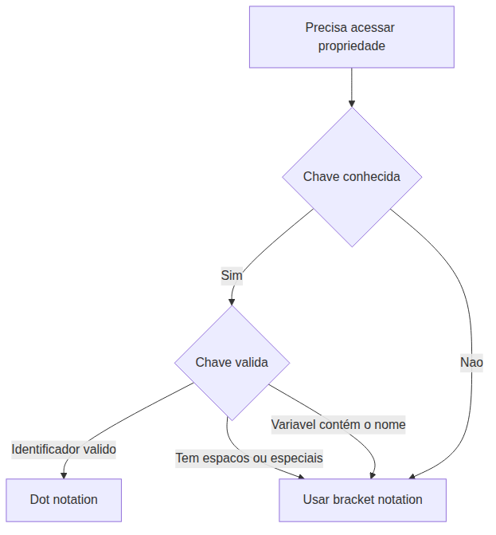
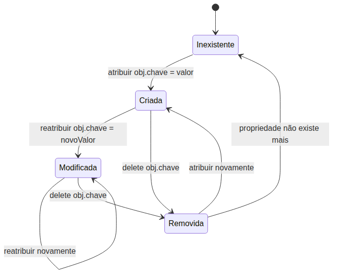
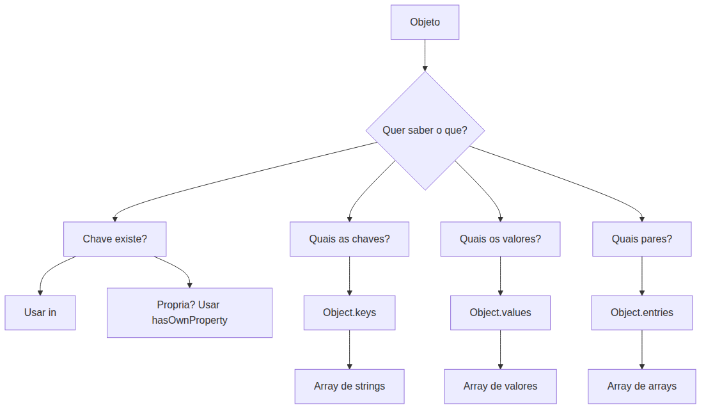
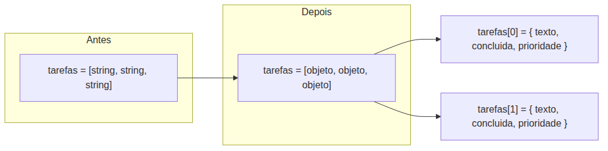

# JavaScript — Do Zero ao Profissional — Aula 12

## Objetos Literáis — Pares Chave-Valor e Inspeção

**Duração estimada:** 75 minutos (40 de leitura + 35 de prática)
**Nível:** Iniciante
**Pre-requisitos:** Aulas 01-11 concluídas — especialmente arrays (Aula 09), funções (Aula 10) e escopo (Aula 11)

---

## Objetivos de Aprendizagem

Ao final desta aula, você será capaz de:

- [ ] **Definir** objeto como coleção de pares chave-valor — um agrupamento de dados relacionados acessados por nome
- [ ] **Comparar** arrays (acesso por índice) com objetos (acesso por chave nomeada), identificando quando usar cada um
- [ ] **Criar** objetos literais com a sintaxe `{}`
- [ ] **Acessar** propriedades usando dot notation (`.`) e bracket notation (`[]`)
- [ ] **Adicionar**, **modificar** e **remover** propriedades dinâmicamente
- [ ] **Verificar** a existência de propriedades com o operador `in` e o método `.hasOwnProperty()`
- [ ] **Extrair** chaves, valores e pares com `Object.keys()`, `Object.values()` e `Object.entries()`
- [ ] **Aplicar** objetos na evolução do Gerenciador de Tarefas — cada tarefa virá um objeto com `{ texto, concluida, prioridade }`

---

## Como Usar Esta Aula

Esta aula está organizada em duas partes. A **primeira parte** constrói o conceito universal de agrupamento de dados com rótulos — fichas, registros, chave-valor — sem JavaScript. A **segunda parte** aplica esses conceitos na prática com a sintaxe de objetos literais do JavaScript.

Ao longo do caminho, você encontrará seções **"Mão na Massa"** (para fazer, não só ler) e **"Quick Check"** (para verificar se entendeu antes de avançar). Ao final, o arquivo separado **Questões de Aprendizagem** traz as tarefas de checkpoint — só avance para a próxima aula quando conseguir completá-las por conta própria.

---

## Mapa Mental

Este diagrama mostra todos os conceitos que você vai dominar nesta aula:



> *O mapa mental acima mostra a estrutura da aula. Cada ramo representa um conceito que você vai explorar. Repare como os fundamentos universais se conectam com a aplicação prática em JavaScript e com o projeto do Gerenciador de Tarefas.*

---

## Recapitulação das Aulas Anteriores

| Aula | Conceito | Onde aparece nesta aula | Como se conecta |
|---|---|---|---|
| Aula 09 | **Arrays**: `[]`, índices, `.push()`, `for...of` | Seções 2, 3, 7 | Arrays e objetos são as duas formas de agrupar dados; arrays usam índice numérico, objetos usam chave nomeada |
| Aula 10 | **Funções**: parâmetros, `return` | Seções 6, 7 | `Object.keys()` etc. são funções que recebem objeto como argumento |
| Aula 11 | **Escopo**: global, local, `const` | Seções 3, 5 | Objetos declarados com `const` não podem ser reatribuídos, mas suas propriedades podem mudar |
| Aula 09-11 | **Gerenciador de Tarefas** (array de strings) | Seção 7 | O projeto existente será evoluído para array de objetos |

---

**FUNDAMENTOS: Agrupamento de Dados por Rótulos e Valores**

> *Os conceitos desta seção são universais — valem para qualquer linguagem de programação, independentemente da ferramenta específica. Você vai entender por que agrupar dados com nomes é melhor que espalha-los em variáveis soltas. Na segunda parte, verá como a linguagem implementa essa ideia com objetos literais.*

---

## 1. Por que Agrupar Dados? — Fichas e Registros

Imagine que você precisa guardar as informações de uma pessoa: nome, idade e email.

Um jeito de fazer isso é criar três "caixinhas" separadas, cada uma com um valor guardado: uma com nome "Ana", outra com idade 28, outra com email "ana@email.com".

Agora pense no problema de **passar esses dados para uma função que exibe um cadastro**. Você precisaria passar três informações separadas — nome, idade, email — e torcer para não errar a ordem. Se a pessoa tivesse telefone, endereço e data de nascimento, seriam seis. Começa a ficar confuso, não?


Agora pense em uma **ficha de cadastro** de papel. Ela tem campos com **rótulos** — "Nome", "Idade", "Email" — e ao lado de cada rótulo, um **valor** preenchido. A ficha é um **pacote único** que contém todos os dados da pessoa. Você entrega a ficha inteira para alguém, não três pedaços soltos.

### O que é um par chave-valor?

Cada campo da ficha tem duas partes:

- **Chave (ou rótulo)**: o nome do campo — `"nome"`, `"idade"`, `"email"`
- **Valor**: o dado preenchido — `"Ana"`, `28`, `"ana@email.com"`

Juntos, eles formam um **par chave-valor**. A chave identifica **o que** é aquele dado. O valor é **o dado em si**.



### Por que isso importa?

Agrupar dados em um único pacote com rótulos traz vantagens:

1. **Organização**: tudo que pertence a uma mesma entidade fica junto — o pacote inteiro se chama "cadastro da Ana"
2. **Clareza**: ao acessar `"nome"`, você sabe exatamente o que está pegando. Não precisa lembrar se `nome` estava na posição 0, 1 ou 2
3. **Flexibilidade**: você pode adicionar novos campos sem quebrar nada. Quer adicionar `telefone`? Basta criar um novo par chave-valor
4. **Passagem única**: para passar todos os dados de uma pessoa para uma função, você passa um único pacote, não vários argumentos soltos

> *Até aqui, você já entendeu o conceito central: dados relacionados devem andar juntos, cada pedaço identificado por um rótulo. Isso é a essência do que um objeto faz em programação. Respire. Se algo ficou confuso, releia está seção — ela é a base de tudo que vem a seguir.*

### Quick Check 1

**1. Por que ter três variáveis separadas (`nome`, `idade`, `email`) é pior que ter um único pacote com os três?**
**Resposta:** Variáveis soltas precisam ser passadas individualmente para funções (argumentos separados), são fáceis de confundir a ordem e não deixam explícito que pertencem a mesma entidade (a mesma pessoa). Um pacote único resolve tudo isso.

**2. Em uma ficha de cadastro, o que seria a "chave" e o que seria o "valor"?**
**Resposta:** A chave é o nome do campo (ex: "Nome", "Idade"). O valor é o conteúdo preenchido (ex: "Ana", 28). Juntos formam um par chave-valor.

---

## 2. Chaves com Nome vs Índices Numericos

Na Aula 09, você aprendeu sobre **arrays** — listas ordenadas de itens acessados por **posição** (índice numérico).



### Como arrays funcionam (recapitulação)

Um array é como uma lista numerada:

```
listaDeCompras:
  [0] "pao"
  [1] "leite"
  [2] "ovos"
```

Para acessar um item, você usa o número da posição: `listaDeCompras[1]` retorna `"leite"`.

Arrays são excelentes para:

- Listas de compras
- Filas de espera
- Colecoes de itens do mesmo tipo
- Qualquer coisa onde a **ordem** importa

### O que arrays não resolvem bem

Agora imagine que você quer descrever **uma única pessoa** com nome, idade e email. Você poderia tentar usar um array:

```
aluno:
  [0] "Maria"
  [1] 20
  [2] "maria@email.com"
```

Funciona? Tecnicamente, sim. Mas o problema é que `aluno[0]` não diz **o que** é aquele dado. E o nome? E o email? Você precisa lembrar que a posição 0 é o nome, a posição 1 é a idade, a posição 2 é o email. E se você pular uma posição? E se mudar a ordem?

### A solução: acesso por nome

Em vez de acessar por número (índice), você acessa por **nome** (chave):

```
aluno:
  "nome"  → "Maria"
  "idade" → 20
  "email" → "maria@email.com"
```

Agora `aluno["nome"]` é muito mais claro que `aluno[0]`. O nome do campo já diz o que e.

### Quando usar cada um

| Situação | Array | Objeto (chave-valor) |
|---|---|---|
| Lista de compras | ✅ A ordem importa, todos são itens do mesmo tipo | ❌ Cada item teria um nome diferente |
| Ficha de cadastro de uma pessoa | ❌ Precisa decorar qual índice é cada campo | ✅ Cada campo tem um rótulo claro |
| Fila de tarefas | ✅ A ordem de chegada importa | ❌ A ordem não é o foco |
| Configurações de um programa | ❌ Cada config tem um nome específico | ✅ Cada config é acessada pelo seu nome |
| Notas de uma turma | ✅ Varias notas, mesma estrutura | ✅ Cada aluno é um objeto dentro de um array |

> *Você pode estar pensando: "mas e se eu precisar de uma lista de pessoas? Cadastro de vários alunos?" Excelente pergunta. A resposta é que arrays e objetos **trabalham juntos**: você tem um array de objetos. Cada aluno é um objeto, e a turma toda é um array de alunos. Isso é exatamente o que faremos no projeto do Gerenciador de Tarefas na Seção 7.*

### A ideia central

- **Array**: acesso por POSICAO (`[0]`, `[1]`, `[2]`) — bom para listas ordenadas de itens similares
- **Objeto**: acesso por NOME (`["nome"]`, `["idade"]`) — bom para descrever uma entidade com características diversas

E o mais importante: **eles não são rivais**. Na prática, você vai usar arrays DE objetos o tempo todo. Um é complemento do outro.

> *Até aqui, você já entendeu a diferença fundamental entre listas numeradas (arrays) e fichas com rótulos (objetos). Isso já é MUITO. Respire. Na segunda parte, você vai ver como a linguagem implementa esses objetos com uma sintaxe clara e direta.*

### Quick Check 2

**1. Se uma lista de dados de um aluno é organizada como `[0] "Maria"`, `[1] 20`, `[2] "maria@email.com"`, qual é o problema de acessar o email como `aluno[2]`?**
**Resposta:** O índice `2` não diz o que é o dado — você precisa decorar que posição 2 é o email. Se alguém adicionar um campo no meio, a posição do email muda e seu código quebra.

**2. Em qual situacao um array é melhor que um objeto? E o contrario?**
**Resposta:** Array é melhor para listas ordenadas de itens do mesmo tipo (fila de tarefas, lista de compras). Objeto é melhor para descrever uma entidade com atributos diferentes (ficha de cadastro, configurações de programa).

---

**APLICACAO: Objetos Literáis em JavaScript**

> *Agora que você entendeu o conceito universal de agrupar dados com rótulos (fichas, chave-valor), vamos implementa-lo em JavaScript. Cada ideia da primeira parte vai ganhar sintaxe e código executável. A ficha de cadastro virá um objeto literal. O acesso por nome virá dot notation e bracket notation.*

---

## 3. Criando Objetos — Sintaxe `{}`

Na primeira parte, você viu a ideia de uma "ficha de cadastro": um pacote com campos rotulados. Agora, vamos criar essa ficha em JavaScript.

### Objeto vazio

O jeito mais simples de criar um objeto é com chaves vazias:

```javascript
let pessoa = {};
```

Isso cria um objeto sem nenhuma propriedade — uma ficha em branco, pronta para receber dados. O `typeof` confirmam que é um objeto:

```javascript
console.log(typeof pessoa); // "object"
```

Lembra da Aula 03? `typeof` retorna o tipo de um valor. Para objetos, retorna `"object"`. Isso inclui arrays também (mas isso é detalhe para outra aula).

### Objeto pre-preenchido

O mais comum é criar o objeto já com suas propriedades. Dentro das chaves `{}`, você escreve cada par no formato `chave: valor`, separando os pares por virgula:

```javascript
let pessoa = {
  nome: "Ana",
  idade: 28,
  email: "ana@email.com"
};
```

Repare como isso mapeia exatamente para a ficha de cadastro da Seção 1:

| Ficha de papel | Objeto JavaScript |
|---|---|
| Campo "Nome" com valor "Ana" | `nome: "Ana"` |
| Campo "Idade" com valor 28 | `idade: 28` |
| Campo "Email" com valor "ana@email.com" | `email: "ana@email.com"` |

Cada par `chave: valor` é chamado de **propriedade** do objeto.



### Chaves sem aspas (o padrao)

No exemplo acima, as chaves `nome`, `idade`, `email` foram escritas **sem aspas**. Isso funciona quando o nome da chave:

- Não tem espacos
- Não tem caracteres especiais (exceto `_` e `$`)
- Não começa com número
- Segue as mesmas regras de nomes de variáveis (camelCase)

```javascript
let carro = {
  modelo: "Fusca",
  ano: 1978,
  cor: "azul"
};
```

### Chaves com aspas (quando necessario)

Se o nome da chave tiver espacos, hifen ou comecar com número, você PRECISA usar aspas:

```javascript
let pessoa = {
  "nome completo": "Ana Silva",
  "data-nascimento": "1995-03-15",
  "1o telefone": "9999-9999"
};
```

> *Você pode estar pensando: "mas por que eu criaria uma chave com espaco? Não é mais fácil usar camelCase?" Sim, é mais fácil! Por isso o padrao é usar chaves sem aspas com camelCase. As aspas são para casos específicos, como dados vindos de um formulario ou de uma API externa.*

### Valores de qualquer tipo

Uma propriedade pode guardar QUALQUER tipo de valor: string, number, boolean, array, e até outro objeto:

```javascript
let aluno = {
  nome: "Maria",
  idade: 20,
  ativo: true,
  notas: [8.5, 9.0, 7.5],
  endereço: {
    rua: "Rua das Flores",
    número: 100
  }
};
```

Aqui, `notas` é um array dentro do objeto, e `endereço` é outro objeto dentro do objeto. Isso é completamente normal em JavaScript.

### Cuidado com `const` e objetos

Lembra da Aula 11 sobre escopo? Quando você declara um objeto com `const`, a **variável** não pode ser reatribuida, mas o **conteúdo** do objeto pode mudar:

```javascript
const pessoa = { nome: "Ana" };
pessoa.nome = "Bia";  // Funciona — alterando o conteúdo, não a variável
pessoa = { nome: "Joao" }; // Erro! Não posso reatribuir uma constante
```

Isso confunde muitos iniciantes. A regra e simples: `const` impede que você troque o objeto inteiro (reatribuição), mas não impede que você mexa **dentro** do objeto (mutação).

**Mão na Massa — Criando seu primeiro objeto:**

- [ ] Abra o Console do navegador (F12 → Console)
- [ ] Digite e execute:

```javascript
let aluno = {
  nome: "SeuNome",
  idade: 25,
  curso: "JavaScript"
};
```

- [ ] Digite `aluno` e veja o objeto completo
- [ ] Digite `typeof aluno` — deve retornar `"object"`
- [ ] Agora crie um objeto vazio e verifique o tipo:

```javascript
let vazio = {};
console.log(typeof vazio); // "object"
```

### Quick Check 3

**1. Qual a diferença entre `let x = {}` e `let x = []`?**
**Resposta:** `let x = {}` cria um objeto vazio (coleção chave-valor). `let x = []` cria um array vazio (lista ordenada por índice). O `typeof` retorna `"object"` para ambos, mas a estrutura interna e o uso são diferentes.

**2. Por que `const pessoa = { nome: "Ana" }` seguido de `pessoa.nome = "Bia"` funciona?**
**Resposta:** `const` impede a reatribuição da variável (`pessoa = {...}` daria erro), mas não impede a mutação das propriedades do objeto. Alterár `pessoa.nome` e modificar o conteúdo interno, não trocar o objeto inteiro.

---

## 4. Acessando Propriedades — `.` e `[]`

Você criou seu objeto. Agora, como acessar os dados que estão dentro dele? Existem duas formas: **dot notation** e **bracket notation**.

### Dot notation — a forma mais comum

Com dot notation, você escreve o nome do objeto, um ponto e o nome da propriedade:

```javascript
let pessoa = {
  nome: "Ana",
  idade: 28,
  email: "ana@email.com"
};

console.log(pessoa.nome);  // "Ana"
console.log(pessoa.idade); // 28
console.log(pessoa.email); // "ana@email.com"
```

O ponto `.` significa "acesse a propriedade que tem este nome dentro do objeto". E como dizer: "pegue o objeto `pessoa` e me dê o valor da chave `nome`".

Dot notation e:

- **Simples** e **legível**
- O padrao usado no dia a dia
- Rápido de digitar



### Bracket notation — quando você precisa

Bracket notation usa colchetes com uma **string** dentro:

```javascript
console.log(pessoa["nome"]);  // "Ana"
console.log(pessoa["idade"]); // 28
```

Parece array? Parece. Mas a diferença crucial é que dentro dos colchetes vai uma **string com o nome da chave**, não um número de índice.

### Quando você E OBRIGADO a usar bracket notation

**Caso 1: Chaves com espacos ou caracteres especiais**

```javascript
let pessoa = {
  "nome completo": "Ana Silva"
};

// Dot notation NAO funciona:
// console.log(pessoa.nome completo); // Erro de sintaxe!

// Bracket notation funciona:
console.log(pessoa["nome completo"]); // "Ana Silva"
```

**Caso 2: Chave armazenada em uma variável**

Este é o caso mais importante. Imagine que você não sabe de antemao qual propriedade vai acessar — o nome da chave está em uma variável:

```javascript
let pessoa = {
  nome: "Ana",
  idade: 28,
  email: "ana@email.com"
};

let campo = "email";
console.log(pessoa[campo]); // "ana@email.com" — acessa pessoa["email"]

campo = "nome";
console.log(pessoa[campo]); // "Ana" — acessa pessoa["nome"]
```

Isso é **extremamente poderoso**. Você pode escrever funções que recebem o nome do campo como parâmetro e acessam o objeto dinâmicamente:

```javascript
function exibirPropriedade(objeto, chave) {
  console.log(objeto[chave]);
}

exibirPropriedade(pessoa, "nome");  // "Ana"
exibirPropriedade(pessoa, "idade"); // 28
```

Com dot notation, isso não seria possível: `pessoa.chave` procuraria uma propriedade literalmente chamada `"chave"`, não a propriedade cujo nome está na variável `chave`.

### Propriedade inexistente retorna `undefined`

Se você tentar acessar uma propriedade que não existe, o JavaScript não da erro — retorna `undefined`:

```javascript
console.log(pessoa.telefone); // undefined
console.log(pessoa["peso"]);  // undefined
```

Isso é diferente de um array, onde acessar um índice inexistente também retorna `undefined`. A diferença é que em objetos você está acessando por NOME, e a não-existência significa "essa chave não foi definida".

### Expressoes dentro dos colchetes

Como os colchetes aceitam qualquer expressão que resulte em uma string, você pode fazer combinacoes:

```javascript
let pessoa = {
  nomeCompleto: "Ana Silva"
};

// Concaténacao dentro dos colchetes
console.log(pessoa["nome" + "Completo"]); // "Ana Silva"
```



> *Talvez você esteja pensando: "qual usar no dia a dia?" Use dot notation SEMPRE que puder. Ela é mais legível e mais rápida de digitar. Bracket notation é para quando você PRECISA — chave em variável, chave com espaco, ou chave que você só descobre em tempo de execução.*

**Mão na Massa — Acessando propriedades:**

- [ ] Crie um objeto `carro`:

```javascript
let carro = {
  marca: "Volkswagen",
  modelo: "Fusca",
  ano: 1978,
  "cor-do-carro": "azul"
};
```

- [ ] Acesse com dot notation:

```javascript
console.log(carro.marca);  // "Volkswagen"
console.log(carro.modelo); // "Fusca"
```

- [ ] Acesse com bracket notation (chave com hifen):

```javascript
console.log(carro["cor-do-carro"]); // "azul"
```

- [ ] Use uma variável como chave:

```javascript
let propriedade = "ano";
console.log(carro[propriedade]); // 1978
```

- [ ] Tente acessar uma propriedade que não existe:

```javascript
console.log(carro.preco); // undefined
```

### Quick Check 4

**1. Quando você E OBRIGADO a usar bracket notation em vez de dot notation?**
**Resposta:** Em dois casos principais: (1) quando a chave tem espacos, hifens ou caracteres especiais — `pessoa["nome completo"]`; (2) quando o nome da chave está armazenado em uma variável — `pessoa[variável]`. Dot notation não funciona nesses cenarios.

**2. Qual o valor de `pessoa.telefone` se `telefone` nunca foi definido? Por que?**
**Resposta:** Retorna `undefined`. Em JavaScript, acessar uma propriedade que não existe em um objeto não lanca erro — simplesmente retorna o valor especial `undefined`, que significa "nada aqui".

---

## 5. Manipulando Propriedades — Adicionar, Modificar, Remover

Objetos JavaScript são **dinamicos**. Você não está preso as propriedades que definiu na criação — pode adicionar novas, modificar existentes e remover quando quiser.

### Adicionar propriedade nova

Basta **atribuir um valor a uma chave que ainda não existe**:

```javascript
let pessoa = {
  nome: "Ana",
  idade: 28
};

pessoa.email = "ana@email.com"; // Adiciona a propriedade "email"
pessoa["telefone"] = "9999-9999"; // Também funciona com bracket

console.log(pessoa);
// { nome: "Ana", idade: 28, email: "ana@email.com", telefone: "9999-9999" }
```

O JavaScript simplesmente **cria** a nova propriedade na hora. E como pegar a ficha de cadastro e escrever um novo campo nela.

### Modificar propriedade existente

Atribua um novo valor a uma chave que já existe:

```javascript
pessoa.idade = 29; // Modifica o valor existente

console.log(pessoa.idade); // 29
```

O valor antigo é **substituido** pelo novo. Simples assim.



### Remover propriedade com `delete`

Use o operador `delete` para remover uma propriedade:

```javascript
delete pessoa.email;

console.log(pessoa.email); // undefined — a propriedade não existe mais
console.log(pessoa);
// { nome: "Ana", idade: 29, telefone: "9999-9999" }
```

O `delete` remove a chave e seu valor do objeto. Depois de remover, acessar aquela chave retorna `undefined`, como se ela nunca tivesse existido.

Detalhes importantes sobre `delete`:

- `delete` retorna `true` na maioria dos casos — mesmo se a propriedade não existia
- `delete` não da erro se a propriedade não existe
- `delete` só remove propriedades **próprias** do objeto (propriedades herdadas não são afetadas por `delete`)

### Objeto vazio preenchido incrementalmente

Uma estratégia comum é criar um objeto vazio e ir preenchendo aos poucos:

```javascript
let livro = {};        // Começa vazio
livro.título = "JavaScript Eloquente";  // Adiciona título
livro.autor = "Marijn Haverbeke";       // Adiciona autor
livro.ano = 2018;      // Adiciona ano

console.log(livro);
// { titulo: "JavaScript Eloquente", autor: "Marijn Haverbeke", ano: 2018 }
```

Isso é útil quando você não tem todos os dados no momento da criação — por exemplo, dados preenchidos em um formulario campo a campo.

```javascript
let config = {}; // Configurações vazias
config.tema = "escuro";
config.idioma = "pt-BR";
config.notificações = true;
```

### Cuidado com `const`

Relembrando o que vimos na Seção 3: você pode modificar, adicionar e remover propriedades de objetos declarados com `const`. Apenas não pode reatribuir a variável:

```javascript
const livro = { titulo: "Livro A" };
livro.autor = "Autor X"; // Funciona — adicionando propriedade
delete livro.título;     // Funciona — removendo propriedade
// livro = {};           // Erro — reatribuição não permitida
```

> *Se você está se sentindo confuso com a ideia de que `const` permite mudanças no objeto, pense assim: o `const` protege a caixa (a variável), não o conteúdo dentro dela. Você não pode trocar a caixa, mas pode trocar o que tem dentro.*

**Mão na Massa — Manipulando propriedades:**

- [ ] Crie um objeto `livro` vazio:

```javascript
let livro = {};
```

- [ ] Adicione propriedades:

```javascript
livro.título = "O Senhor dos Aneis";
livro.autor = "J.R.R. Tolkien";
livro.ano = 1954;
```

- [ ] Exiba o objeto:

```javascript
console.log(livro);
```

- [ ] Modifique o ano:

```javascript
livro.ano = 1955; // O volume 3 foi lancado em 1955
console.log(livro.ano); // 1955
```

- [ ] Remova o autor:

```javascript
delete livro.autor;
console.log(livro.autor); // undefined
console.log(livro);
// { titulo: "O Senhor dos Aneis", ano: 1955 }
```

### Quick Check 5

**1. O que acontece se eu fizer `delete pessoa.nome` e depois `console.log(pessoa.nome)`?**
**Resposta:** `delete pessoa.nome` remove a propriedade `nome` do objeto. Em seguida, `pessoa.nome` retorna `undefined`, porque a chave não existe mais no objeto.

**2. Posso adicionar uma propriedade a um objeto declarado com `const`? Por que?**
**Resposta:** Sim. `const` impede a reatribuição da variável (trocar o objeto inteiro), mas não impede a mutação do conteúdo do objeto — adicionar, modificar e remover propriedades são operacoes de mutação, permitidas em objetos `const`.

---

## 6. Inspecionando Objetos — `in`, `hasOwnProperty`, `Object.keys/values/entries`

Quando você trabalha com objetos, especialmente objetos que recebe de outras funções ou que mudam ao longo do tempo, você precisa de ferramentas para inspecionar o que tem dentro.

### Verificando se uma propriedade existe: operador `in`

O operador `in` pergunta: "essa chave existe no objeto?" Retorna `true` ou `false`.

```javascript
let pessoa = {
  nome: "Ana",
  idade: 28
};

console.log("nome" in pessoa); // true
console.log("email" in pessoa); // false
```

Repare que a chave é escrita como **string** (`"nome"`, `"email"`), não como variável. O `in` verifica se aquela string é uma chave do objeto.

### Verificando propriedades próprias: `.hasOwnProperty()`

O método `.hasOwnProperty()` pergunta: "essa chave é uma propriedade **direta** do objeto, não herdada?"

```javascript
console.log(pessoa.hasOwnProperty("nome"));  // true
console.log(pessoa.hasOwnProperty("toString")); // false (herdado)
```

Todo objeto em JavaScript tem algumas propriedades herdadas (como `toString`), que vêm de uma cadeia chamada prototype chain. O `in` encontra essas também:

```javascript
console.log("toString" in pessoa); // true — existe, mas é herdada
console.log(pessoa.hasOwnProperty("toString")); // false — não é própria
```

A diferença prática:

| Operador/Método | O que verifica | Inclui herdadas? |
|---|---|---|
| `"chave" in objeto` | Existencia da chave | Sim |
| `objeto.hasOwnProperty("chave")` | Propriedade própria (não herdada) | Não |

> *Você pode estar pensando: "mas o que é essa historia de propriedade herdada?" Calma, é um tópico avancado que você verá mais adiante no curso. Por enquanto, saiba que `hasOwnProperty` é mais rigorosa — ela só retorna `true` para propriedades que você MESMO definiu no objeto.*

### Listando chaves: `Object.keys()`

`Object.keys()` recebe um objeto e retorna um **array** com todas as chaves (strings):

```javascript
let pessoa = {
  nome: "Ana",
  idade: 28,
  email: "ana@email.com"
};

let chaves = Object.keys(pessoa);
console.log(chaves); // ["nome", "idade", "email"]
```

O resultado é um array! Isso significa que você pode usar tudo que aprendeu sobre arrays na Aula 09:

```javascript
console.log(chaves.length); // 3 — quantas propriedades o objeto tem
console.log(chaves[0]);      // "nome" — primeira chave
```

### Listando valores: `Object.values()`

`Object.values()` retorna um array com os valores de todas as propriedades:

```javascript
let valores = Object.values(pessoa);
console.log(valores); // ["Ana", 28, "ana@email.com"]
```

### Listando pares chave-valor: `Object.entries()`

`Object.entries()` retorna um array de arrays — cada sub-array é `[chave, valor]`:

```javascript
let entradas = Object.entries(pessoa);
console.log(entradas);
// [ ["nome", "Ana"], ["idade", 28], ["email", "ana@email.com"] ]
```

Cada elemento do array é um array com dois itens: primeiro a chave, depois o valor.

### Combinando com `for...of`

Lembra do `for...of` da Aula 09? Você pode usa-lo para iterár sobre os resultados de `Object.keys()`, `Object.values()` e `Object.entries()`:

```javascript
// Iterár sobre as chaves
for (let chave of Object.keys(pessoa)) {
  console.log(chave);
}
// "nome"
// "idade"
// "email"

// Iterár sobre os valores
for (let valor of Object.values(pessoa)) {
  console.log(valor);
}
// "Ana"
// 28
// "ana@email.com"

// Iterár sobre pares [chave, valor]
for (let entrada of Object.entries(pessoa)) {
  console.log(entrada[0] + ": " + entrada[1]);
}
// "nome: Ana"
// "idade: 28"
// "email: ana@email.com"
```



### Quantas propriedades um objeto tem?

Combine `Object.keys()` com `.length`:

```javascript
console.log(Object.keys(pessoa).length); // 3 — três propriedades
```

Isso é o equivalente ao `array.length` para objetos.

**Mão na Massa — Inspecionando objetos:**

- [ ] Crie um objeto `config`:

```javascript
let config = {
  tema: "escuro",
  idioma: "pt-BR",
  notificações: true,
  versão: "2.0"
};
```

- [ ] Verifique existencia:

```javascript
console.log("tema" in config);        // true
console.log("audio" in config);       // false
console.log(config.hasOwnProperty("tema")); // true
```

- [ ] Extraia chaves, valores e pares:

```javascript
console.log(Object.keys(config));    // ["tema", "idioma", "notificações", "versão"]
console.log(Object.values(config));  // ["escuro", "pt-BR", true, "2.0"]
console.log(Object.entries(config));
// [ ["tema", "escuro"], ["idioma", "pt-BR"], ["notificações", true], ["versão", "2.0"] ]
```

- [ ] Conte as propriedades:

```javascript
console.log(Object.keys(config).length); // 4
```

- [ ] Itere com `for...of`:

```javascript
for (let chave of Object.keys(config)) {
  console.log(chave + " = " + config[chave]);
}
```

### Quick Check 6

**1. Qual a diferença entre `"nome" in obj` e `obj.hasOwnProperty("nome")`?**
**Resposta:** `in` verifica se a chave existe no objeto, incluindo propriedades herdadas da prototype chain. `hasOwnProperty()` verifica apenas se a chave é uma propriedade PROPRIA do objeto (definida diretamente nele, não herdada).

**2. O que `Object.keys(objeto).length` retorna? O que isso tem em comum com `array.length`?**
**Resposta:** Retorna o número de propriedades próprias do objeto. E analogo a `array.length`, que retorna o número de elementos do array. Ambos indicam "quantos itens" a estrutura de dados contém.

---

## 7. Projeto — Tarefas como Objetos

Esta é a seção que conecta TUDO que você aprendeu com o seu **Gerenciador de Tarefas**. Até agora, cada tarefa era uma **string**:

```javascript
let tarefas = ["Comprar pao", "Estudar JavaScript", "Pagar contas"];
```

Mas uma tarefa no mundo real tem mais informações do que apenas o texto:

- Ela já foi concluida? (verdadeiro/falso)
- Qual a prioridade? (alta, normal, baixa)
- Quando foi criada? (data)
- Pertence a qual catégoria? (trabalho, pessoal, estudos)

Com objetos, você pode representar tudo isso:

```javascript
let tarefas = [
  { texto: "Comprar pao", concluida: false, prioridade: "normal" },
  { texto: "Estudar JavaScript", concluida: false, prioridade: "alta" },
  { texto: "Pagar contas", concluida: true, prioridade: "alta" }
];
```

Cada tarefa agora é um **objeto** com três propriedades:

- `texto`: o texto da tarefa (string)
- `concluida`: se está concluida ou não (boolean)
- `prioridade`: a prioridade (string: "alta", "normal", "baixa")



### Antes: adicionar tarefa como string

```javascript
function adicionarTarefa() {
  let texto = prompt("Digite a tarefa:");
  tarefas.push(texto);
}
```

### Depois: adicionar tarefa como objeto

```javascript
function adicionarTarefa() {
  let texto = prompt("Digite a tarefa:");
  tarefas.push({
    texto: texto,
    concluida: false,
    prioridade: "normal"
  });
}
```

### Antes: listar tarefas

```javascript
function listarTarefas() {
  for (let i = 0; i < tarefas.length; i++) {
    console.log(i + ": " + tarefas[i]);
  }
}
```

### Depois: listar tarefas

```javascript
function listarTarefas() {
  for (let i = 0; i < tarefas.length; i++) {
    let tarefa = tarefas[i];
    let status;
    if (tarefa.concluida) {
        status = "[x]";
    } else {
        status = "[ ]";
    }
    console.log(i + ": " + status + " " + tarefa.texto + " (" + tarefa.prioridade + ")");
  }
}
```

Agora `tarefas[i]` não é mais uma string — é um objeto. Você acessa `tarefas[i].texto` para pegar o texto, `tarefas[i].concluida` para saber se foi concluida.

### Antes: remover tarefa

```javascript
function removerTarefa() {
  let texto = prompt("Digite o texto da tarefa a remover:");
  let novasTarefas = [];
  for (let tarefa of tarefas) {
    if (tarefa !== texto) {
      novasTarefas.push(tarefa);
    }
  }
  tarefas = novasTarefas;
}
```

### Depois: remover tarefa

```javascript
function removerTarefa() {
  let texto = prompt("Digite o texto da tarefa a remover:");
  let novasTarefas = [];
  for (let tarefa of tarefas) {
    if (tarefa.texto !== texto) {
      novasTarefas.push(tarefa);
    }
  }
  tarefas = novasTarefas;
}
```

Veja a diferença sútil mas crucial: antes, `tarefa !== texto` comparava a string da tarefa com o texto digitado. Agora, `tarefa.texto !== texto` compara a propriedade `.texto` do objeto com o texto digitado. A variável `tarefa` agora é um objeto inteiro.

### Marcando tarefa como concluida

Uma das maiores vantagens de usar objetos é poder modificar **partes** da tarefa sem substitui-lá inteira:

```javascript
function marcarConcluida() {
  let índice = prompt("Digite o índice da tarefa concluida:");
  tarefas[índice].concluida = true;
}
```

Isso funciona porque `tarefas[índice]` retorna o objeto da tarefa, e `.concluida = true` modifica apenas a propriedade `concluida` desse objeto. O `texto` e a `prioridade` continuam intactos.

Com strings, você precisaria substituir a tarefa inteira — ou pior, não teria como representar "concluida" sem modificar a string (ex: adicionar "[x]" na frente, o que é frágil).

### Visualizacao no console: `console.table()`

Para exibir arrays de objetos de forma mais clara, use `console.table()`:

```javascript
console.table(tarefas);
```

Isso mostra os objetos em formato de tabela no console, com cada propriedade em uma coluna.

> *Você pode estar pensando: "preciso reescrever todo o meu Gerenciador?" Calma. As mudanças são localizadas. A estrutura do programa continua a mesma — o que muda é que cada tarefa deixa de ser um texto simples e passa a ser um objeto com mais informações. As funções `adicionarTarefa()`, `listarTarefas()` e `removerTarefa()` continuam existindo — você só vai adapta-las.*

**Mão na Massa — Projeto: Atualizando o Gerenciador de Tarefas:**

- [ ] Abra seu arquivo `index.html` no editor
- [ ] No array `tarefas`, substitua as strings por objetos:

```javascript
let tarefas = [
  { texto: "Comprar pao", concluida: false, prioridade: "normal" },
  { texto: "Estudar JavaScript", concluida: false, prioridade: "alta" }
];
```

- [ ] Atualize `adicionarTarefa()` para empurrar um objeto:

```javascript
function adicionarTarefa() {
  let texto = prompt("Digite a tarefa:");
  tarefas.push({
    texto: texto,
    concluida: false,
    prioridade: "normal"
  });
  listarTarefas();
}
```

- [ ] Atualize `listarTarefas()` para exibir texto e status:

```javascript
function listarTarefas() {
  console.log("=== Lista de Tarefas ===");
  for (let i = 0; i < tarefas.length; i++) {
    let t = tarefas[i];
    let status;
    if (t.concluida) {
        status = "[x]";
    } else {
        status = "[ ]";
    }
    console.log(i + ": " + status + " " + t.texto + " (" + t.prioridade + ")");
  }
}
```

- [ ] Atualize `removerTarefa()` para comparar com `tarefa.texto`:

```javascript
function removerTarefa() {
  let texto = prompt("Digite o texto da tarefa a remover:");
  let novasTarefas = [];
  for (let tarefa of tarefas) {
    if (tarefa.texto !== texto) {
      novasTarefas.push(tarefa);
    }
  }
  tarefas = novasTarefas;
  listarTarefas();
}
```

- [ ] Adicione a função `marcarConcluida()`:

```javascript
function marcarConcluida() {
  let índice = prompt("Digite o índice da tarefa concluida:");
  if (índice >= 0 && índice < tarefas.length) {
    tarefas[índice].concluida = true;
    listarTarefas();
  } else {
    console.log("Índice inválido!");
  }
}
```

- [ ] Teste no navegador: abra o `index.html`, chame `adicionarTarefa()`, digite uma nova tarefa, veja a lista, marque uma como concluida

**Verificacao:** Após adicionar uma tarefa, `listarTarefas()` deve exibir algo como:

```
=== Lista de Tarefas ===
0: [ ] Comprar pao (normal)
1: [ ] Estudar JavaScript (alta)
```

Após marcar a tarefa 0 como concluida:

```
0: [x] Comprar pao (normal)
```

### Quick Check 7

**1. Por que `tarefas[0].concluida = true` funciona para marcar uma tarefa, mas antes (com strings) você precisaria substituir a string inteira?**
**Resposta:** Com objetos, você modifica apenas a propriedade específica (`concluida`) sem afetar as outras (`texto`, `prioridade`). Com strings, não havia propriedades separadas — a string inteira era um bloco único, então qualquer alterácao exigia substituir a string por completo.

**2. O que acontece se você tentar acessar `tarefas[0].prioridade` em uma tarefa criada sem o campo `prioridade`?**
**Resposta:** Retorna `undefined`, assim como qualquer propriedade inexistente. Por isso é importante garantir que todas as tarefas sigam a mesma estrutura (o mesmo "modelo") — por exemplo, sempre definindo `prioridade` ao criar a tarefa.

---

## Autoavaliação: Quiz Rapido

Teste seu entendimento antes de passar para os exercícios.

**1. O que é um par chave-valor em um objeto?**
**Resposta:**

Um par composto por um rótulo (a chave, que nomeia o dado) e o valor (o dado em si). Exemplo: em `nome: "Ana"`, a chave é `"nome"` e o valor é `"Ana"`.

**2. Qual a diferença fundamental entre arrays e objetos no modo de acesso aos dados?**
**Resposta:**

Arrays acessam dados por índice numérico (posição: `[0]`, `[1]`). Objetos acessam dados por chave com nome (`["nome"]`, `["idade"]` ou `.nome`, `.idade`).

**3. Em qual situacao você PRECISA usar bracket notation em vez de dot notation? De dois exemplos.**
**Resposta:**

(1) Quando a chave contém espacos ou caracteres especiais: `obj["nome completo"]`. (2) Quando o nome da chave está em uma variável: `obj[variável]`.

**4. O que o operador `delete` faz em objetos?**
**Resposta:**

Remove a propriedade do objeto. Após `delete obj.chave`, acessar `obj.chave` retorna `undefined`. O operador retorna `true` mesmo se a propriedade não existia.

**5. Qual a diferença entre `"chave" in obj` e `obj.hasOwnProperty("chave")`?**
**Resposta:**

`in` verifica se a chave existe no objeto, incluindo propriedades herdadas. `hasOwnProperty` verifica apenas propriedades **próprias** (definidas diretamente no objeto, não herdadas).

**6. O que `Object.entries(objeto)` retorna? De um exemplo.**
**Resposta:**

Retorna um array de arrays, onde cada sub-array é `[chave, valor]`. Exemplo: para `{ nome: "Ana", idade: 28 }`, retorna `[ ["nome", "Ana"], ["idade", 28] ]`.

---

## Mão na Massa: Exercicios Graduados

### Exercício 1 (Facil) — Criar e acessar um objeto

Crie um objeto chamado `produto` com as seguintes propriedades:
- `nome`: "Camiseta"
- `preco`: 49.90
- `disponivel`: true

Em seguida, exiba cada propriedade no console usando dot notation.

Depois, use bracket notation com uma variável para exibir o `preco`.

**Gabarito:**

```javascript
let produto = {
  nome: "Camiseta",
  preco: 49.90,
  disponivel: true
};

// Acessando com dot notation
console.log(produto.nome);       // "Camiseta"
console.log(produto.preco);      // 49.90
console.log(produto.disponivel); // true

// Acessando com bracket + variável
let campo = "preco";
console.log(produto[campo]); // 49.90
```

### Exercício 2 (Medio) — Manipular dinâmicamente

Parta de um objeto `usuario` vazio. Em seguida:
1. Adicione a propriedade `nome` com seu nome
2. Adicione a propriedade `email` com um email ficticio
3. Adicione a propriedade `admin` com o valor `false`
4. Modifique `admin` para `true`
5. Remova a propriedade `email`
6. Exiba o objeto final no console

**Gabarito:**

```javascript
let usuario = {};

// 1. Adicionar
usuario.nome = "Seu Nome";
console.log(usuario); // { nome: "Seu Nome" }

// 2. Adicionar
usuario.email = "seu@email.com";
console.log(usuario); // { nome: "Seu Nome", email: "seu@email.com" }

// 3. Adicionar
usuario.admin = false;
console.log(usuario); // { nome: "Seu Nome", email: "seu@email.com", admin: false }

// 4. Modificar
usuario.admin = true;
console.log(usuario); // { nome: "Seu Nome", email: "seu@email.com", admin: true }

// 5. Remover
delete usuario.email;
console.log(usuario); // { nome: "Seu Nome", admin: true }

// 6. Exibir
console.log("Usuario final:", usuario);
```

### Desafio (Dificil) — Função que processa objetos

Crie uma função chamada `filtrarPropriedades(objeto, valorMinimo)` que:

1. Recebe um objeto onde os valores são números (ex: `{ a: 10, b: 5, c: 20, d: 3 }`)
2. Retorna um **novo objeto** contendo apenas as propriedades cujo valor é **maior ou igual** a `valorMinimo`
3. Use `Object.entries()` e `for...of` para iterár

Exemplo:
```javascript
let notas = { matémática: 8, português: 5, historia: 7, geografia: 4 };

let aprovadas = filtrarPropriedades(notas, 6);
console.log(aprovadas); // { matémática: 8, historia: 7 }
```

**Gabarito:**

```javascript
function filtrarPropriedades(objeto, valorMinimo) {
  let resultado = {};
  
  for (let entrada of Object.entries(objeto)) {
    let chave = entrada[0];
    let valor = entrada[1];
    
    if (valor >= valorMinimo) {
      resultado[chave] = valor;
    }
  }
  
  return resultado;
}

let notas = { matémática: 8, português: 5, historia: 7, geografia: 4 };

let aprovadas = filtrarPropriedades(notas, 6);
console.log(aprovadas); // { matémática: 8, historia: 7 }

// Teste com valor mínimo diferente
let acimaDaMedia = filtrarPropriedades(notas, 5);
console.log(acimaDaMedia); // { matémática: 8, português: 5, historia: 7 }
```

---

## Resumo da Aula

### Os 7 Conceitos Fundamentais

1. **Agrupamento de dados**: Objetos agrupam dados relacionados em um único pacote, onde cada dado é identificado por uma chave (nome) em vez de uma posição
2. **Arrays vs Objetos**: Arrays acessam por índice numérico (posição); objetos acessam por chave nomeada — cada um tem seu uso, e na prática eles se complementam (array de objetos)
3. **Criacao com `{}`**: Objetos literais são criados com chaves `{}`, contendo pares `chave: valor` separados por virgula
4. **Dot notation e Bracket notation**: `.` é a forma mais comum e legível; `[]` é obrigatoria para chaves com espacos ou quando o nome está em uma variável
5. **Manipulacao dinâmica**: E possível adicionar (atribuir a chave nova), modificar (reatribuir) e remover (`delete`) propriedades após a criação do objeto
6. **Inspeção**: `in` verifica existencia (incluindo herdadas); `hasOwnProperty` verifica propriedades próprias; `Object.keys/values/entries` extraem dados como arrays
7. **Projeto**: O Gerenciador de Tarefas foi atualizado — cada tarefa deixou de ser uma string e passou a ser um objeto com `{ texto, concluida, prioridade }`

### O Que Você Construiu Hoje

- [x] Criou objetos literais com `{}` — vazios e pré-preenchidos
- [x] Acessou propriedades com dot notation e bracket notation
- [x] Usou variável como chave dinâmica com bracket notation
- [x] Adicionou, modificou e removeu propriedades de objetos
- [x] Verificou existencia de propriedades com `in` e `hasOwnProperty`
- [x] Extraiu chaves, valores e pares com `Object.keys/values/entries`
- [x] Atualizou o Gerenciador de Tarefas: tarefas agora são objetos com texto, status e prioridade

---

## Proxima Aula

**Aula 13: A palavra-chave `this` em JavaScript**

Agora que você domina propriedades de objetos, vai aprender como objetos podem ter **comportamento** — funções que pertencem a eles. A palavra-chave `this` permite que uma função dentro de um objeto saiba **qual objeto** a chamou. Você vai entender por que `pessoa.apresentar()` pode dizer "Meu nome é Ana" sem você precisar passar o nome como parametro.

---

## Referencias

### Documentacao Oficial

- [MDN: Trabalhando com Objetos](https://developer.mozilla.org/en-US/docs/Web/JavaScript/Guide/Working_with_objects)
- [MDN: Object.keys()](https://developer.mozilla.org/en-US/docs/Web/JavaScript/Reference/Global_Objects/Object/keys)
- [MDN: Object.values()](https://developer.mozilla.org/en-US/docs/Web/JavaScript/Reference/Global_Objects/Object/values)
- [MDN: Object.entries()](https://developer.mozilla.org/en-US/docs/Web/JavaScript/Reference/Global_Objects/Object/entries)
- [MDN: Operador `delete`](https://developer.mozilla.org/en-US/docs/Web/JavaScript/Reference/Operators/delete)
- [MDN: Operador `in`](https://developer.mozilla.org/en-US/docs/Web/JavaScript/Reference/Operators/in)
- [MDN: hasOwnProperty](https://developer.mozilla.org/en-US/docs/Web/JavaScript/Reference/Global_Objects/Object/hasOwnProperty)

### Leituras Complementares

- [JavaScript.info: Objects](https://javascript.info/object) — recurso excelente em português e inglês

---

## FAQ

**P: Posso usar número como chave em um objeto?**
R: Sim, números são convertidos automáticamente para string. `obj[1]` e `obj["1"]` referênciam a mesma propriedade. Mas é uma prática mais comum usar strings descritivas como chave.

**P: Qual a ordem das propriedades em um objeto?**
R: Em JavaScript, as propriedades tem uma ordem específica: chaves numericas vem primeiro (em ordem crescente), depois as strings na ordem em que foram adicionadas. Mas **não dependa dessa ordem** — use arrays quando a ordem importar.

**P: Dot notation vs Bracket notation — qual devo usar no dia a dia?**
R: Use dot notation sempre que possível — é mais legível, mais rápido de digitar e é o padrao da comunidade. Bracket notation quando a chave tiver espacos ou estiver em uma variável.

**P: Qual a diferença entre objeto vazio `{}` e `null`?**
R: `{}` é um objeto valido, sem propriedades. `null` é a ausência intencional de qualquer valor. `typeof null` retorna `"object"` (um erro histórico do JavaScript), mas `null` não é um objeto e não tem propriedades.

**P: Como faco para copiar um objeto?**
R: Simplesmente `let copia = objeto` não copia — ambas as variáveis apontam para o **mesmo** objeto. Para criar uma copia real, você pode usar `Object.assign({}, objeto)` ou o spread operator `{...objeto}`.

**P: `delete obj.prop` vs `obj.prop = undefined` — qual a diferença?**
R: `delete` remove a chave do objeto. `obj.prop = undefined` mantem a chave, mas com valor `undefined`. Com `delete`, `"prop" in obj` retorna `false`. Com `undefined`, `"prop" in obj` retorna `true`.

**P: Objeto declarado com `const` me impede de modificar propriedades?**
R: Nao. `const` impede reatribuição da variável (`pessoa = {...}`), mas não impede mutação do conteúdo (`pessoa.nome = "outro"`). O objeto continua sendo o mesmo, só o conteúdo interno muda.

**P: Posso ter um objeto dentro de outro objeto?**
R: Sim, completamente normal. Chamamos isso de objetos **aninhados** (nested). Exemplo: `{ nome: "Ana", endereço: { rua: "X", número: 100 } }`. O acesso é `pessoa.endereço.rua`.

---

## Glossário

| Termo | Definição |
|---|---|
| **Objeto** | Coleção de pares chave-valor que agrupa dados relacionados sob um único nome. (Ver seções 1-7) |
| **Chave** (*key*) | Nome ou rótulo de uma propriedade, usado para acessar o valor correspondente. (Ver seção 1) |
| **Valor** (*value*) | Dado armazenado em uma propriedade, pode ser de qualquer tipo. (Ver seção 1) |
| **Par chave-valor** | Unidade básica de um objeto: uma chave e seu valor associado. (Ver seção 1) |
| **Propriedade** | Cada par chave-valor dentro de um objeto. (Ver seção 3) |
| **Objeto literal** | Objeto criado diretamente com a sintaxe `{}`, sem usar `new` ou construtores. (Ver seção 3) |
| **Dot notation** | Acesso a propriedades usando `.`: `objeto.chave`. (Ver seção 4) |
| **Bracket notation** | Acesso a propriedades usando `[]`: `objeto["chave"]`. (Ver seção 4) |
| **`in`** | Operador que verifica se uma chave existe no objeto (incluindo herdadas). (Ver seção 6) |
| **`hasOwnProperty`** | Método que verifica se uma chave é propriedade própria do objeto (não herdada). (Ver seção 6) |
| **`Object.keys()`** | Função que retorna um array com as chaves de um objeto. (Ver seção 6) |
| **`Object.entries()`** | Função que retorna um array de pares `[chave, valor]`. (Ver seção 6) |
