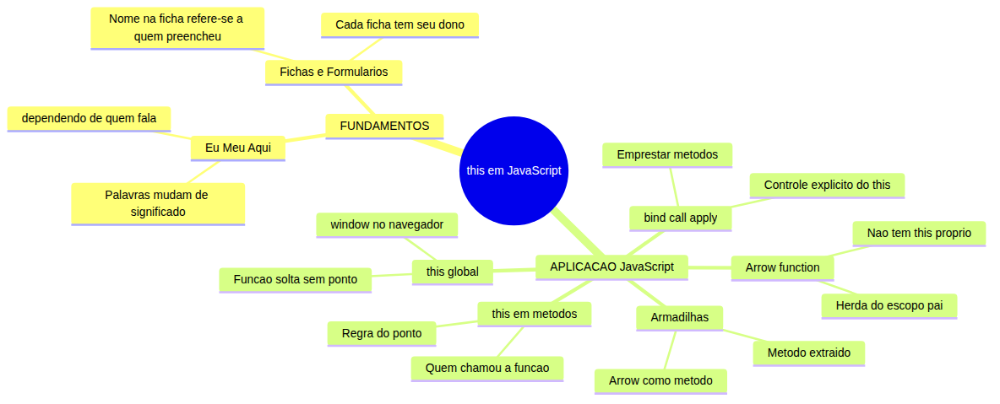
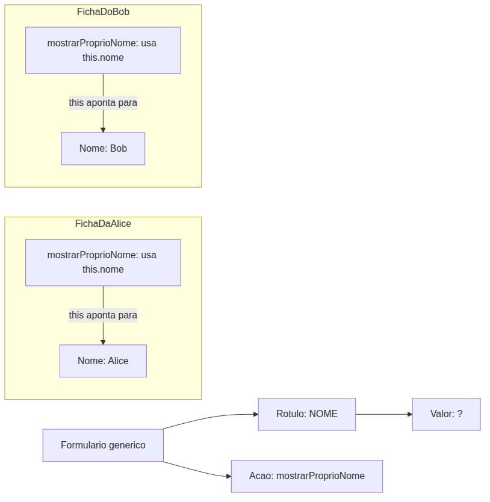
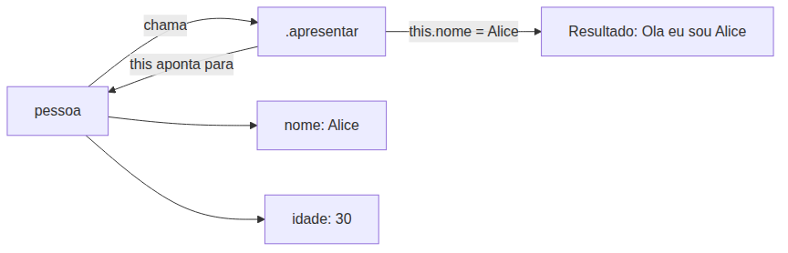
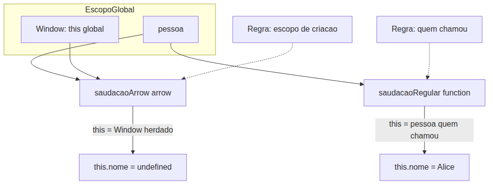
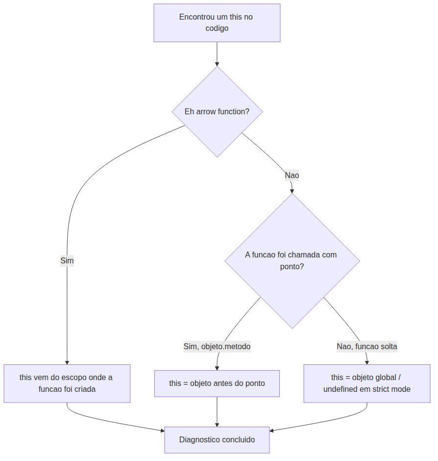

# JavaScript — Do Zero ao Profissional — Aula 13

## `this` em JavaScript — Contexto de Execução

**Duração estimada:** 100 minutos (50 de leitura + 50 de prática)
**Nível:** Iniciante
**Pré-requisitos:** Aulas 01-12 concluídas — especialmente objetos (Aula 12), funções (Aula 10) e escopo (Aula 11)

---

## Objetivos de Aprendizagem

Ao final desta aula, você será capaz de:

- [ ] **Explicar** o conceito de `this` como "quem chamou a função" usando a analogia "eu" muda conforme quem fala
- [ ] **Identificar** o valor de `this` no escopo global (`window` no navegador)
- [ ] **Distinguir** o valor de `this` em funções soltas vs. métodos de objetos (a regra do "ponto")
- [ ] **Criar** objetos com métodos que usam `this` para acessar propriedades do próprio objeto
- [ ] **Explicar** por que arrow functions não têm `this` próprio — herdam lexicalmente do escopo pai
- [ ] **Usar** `.bind()` para fixar permanentemente o valor de `this` em uma função
- [ ] **Usar** `.call()` e `.apply()` para invocar uma função com um `this` específico
- [ ] **Diagnosticar** armadilhas comuns com `this` (extrair método perde `this`; arrow function como método perde `this`)
- [ ] **Aplicar** `this` no projeto — criar um objeto `configuracao` com método `exibir()` que referencia as próprias propriedades

---

## Como Usar Esta Aula

Esta aula está organizada em duas partes. A **primeira parte** constrói o conceito universal de auto-referência — palavras como "eu", "meu", "aqui" que mudam de significado dependendo de quem fala. A **segunda parte** aplica esses conceitos na prática com a palavra-chave `this` do JavaScript.

Ao longo do caminho, você encontrará seções **"Mão na Massa"** (para fazer, não só ler) e **"Quick Check"** (para verificar se entendeu antes de avançar). Ao final, o arquivo separado **Questões de Aprendizagem** traz as tarefas de checkpoint — só avance para a próxima aula quando conseguir completá-las por conta própria.

**Tempo estimado:** 50 minutos de leitura + 50 minutos de prática.

---

## Mapa Mental

Este diagrama mostra todos os conceitos que você vai dominar nesta aula:



> *O mapa mental acima mostra a estrutura da aula. Cada ramo representa um conceito que você vai explorar. Repare como os fundamentos universais de auto-referência se conectam com as diferentes variações de `this` em JavaScript.*

---

## Recapitulação da Aula 12

| Aula | Conceito | Onde aparece nesta aula | Como se conecta |
|---|---|---|---|
| Aula 12 | **Objetos literais** `{}` (seção 3) | Seções 4, 7 | Métodos de objeto usam a sintaxe de objeto literal que você aprendeu |
| Aula 12 | **Dot notation** `.` (seção 4) | Seção 4 | `this.propriedade` usa dot notation para acessar propriedades |
| Aula 12 | **Inserir/modificar propriedades** (seção 5) | Seção 4 | Métodos usam `this` para modificar propriedades do próprio objeto |
| Aula 10 | **Declaração de função** `function` (seção 3) | Seções 3, 4, 5 | `this` em funções regulares vs arrow é a grande diferença desta aula |
| Aula 11 | **Escopo léxico / Closure** (seção 6) | Seção 5 | Arrow function herda `this` do escopo onde foi criada — mesmo princípio de closure |

---

**FUNDAMENTOS: Quem Está Falando? A Auto-Referência Depende do Contexto**

> *Os conceitos desta seção são universais — valem para qualquer linguagem de programação. Na segunda parte, você verá como JavaScript implementa cada um deles com a palavra-chave `this`. Por enquanto, apenas observe como as palavras que apontam para "quem fala" mudam de significado.*

---

## 1. "Eu", "Meu", "Aqui" — Palavras que Mudam de Significado

Imagine duas pessoas conversando. Alice diz: "**Eu** estou com fome. **Meu** sanduíche está na mesa." Bob responde: "**Eu** também estou com fome. Cadê **meu** lanche?"

A palavra "eu" aparece duas vezes, mas significa coisas diferentes. Quando Alice diz "eu", a palavra aponta para **Alice**. Quando Bob diz "eu", aponta para **Bob**. A mesma palavra, dois significados completamente diferentes.

Isso não é um erro da língua. É um recurso: palavras de auto-referência economizam a repetição do nome próprio. Em vez de dizer "Alice está com fome. O sanduíche da Alice está na mesa", Alice pode simplesmente dizer "Eu estou com fome. Meu sanduíche está na mesa."

### O "Aqui" Também Muda

A palavra "aqui" funciona da mesma forma. Se você está em São Paulo e diz "aqui está quente", "aqui" = São Paulo. Se você está em Porto Alegre e diz a mesma frase, "aqui" = Porto Alegre. A palavra não tem um significado fixo — ela depende de **onde** é dita.

### O "Agora" Também Muda

"Vou almoçar agora." Se você diz isso ao meio-dia, "agora" = meio-dia. Se diz às 19h, "agora" = 19h. O significado muda conforme o **momento** em que a palavra é pronunciada.

### A Ponte para a Programação

Todas essas palavras — eu, meu, aqui, agora — são o que chamamos de **auto-referências contextuais**. Elas só fazem sentido quando você sabe **quem** ou **onde** ou **quando** as está usando.

Em programação, objetos têm o mesmo problema. Quando você escreve um método dentro de um objeto, você precisa de uma palavra que signifique "esse objeto aqui — o que está sendo usado neste exato momento". Uma palavra que se adapte automaticamente a qualquer objeto que a use.

Essa palavra é `this`. Em JavaScript, `this` significa "o objeto que chamou esta função". Assim como "eu" muda conforme quem fala, `this` muda conforme **quem chamou a função**.

> *Pause por um momento. Você acabou de entender a essência de `this`: é uma palavra de auto-referência que aponta para "quem chamou". Se isso pareceu simples, é porque é. A dificuldade não está no conceito — está nos diferentes cenários onde `this` aparece. E é exatamente isso que vamos explorar a seguir.*

### Quick Check 1

**1. Se Maria diz "Meu carro quebrou", qual é o significado de "meu"?**
**Resposta:** "Meu" = Maria. A palavra "meu" é uma auto-referência que aponta para a pessoa que está falando (Maria).

**2. Se João está no Rio de Janeiro e diz "Aqui é muito bonito", e Pedro está em Manaus e diz a mesma frase, "aqui" tem o mesmo significado para os dois?**
**Resposta:** Não. Para João, "aqui" = Rio de Janeiro. Para Pedro, "aqui" = Manaus. A mesma palavra aponta para lugares diferentes dependendo de **quem** a diz.

---

## 2. Auto-Referência em Fichas, Formulários e Objetos

Você já preencheu uma ficha de cadastro? Ela tem campos como "Nome", "Idade", "Email". Agora imagine que você tem três fichas: uma para Alice, uma para Bob, uma para Carlos.

```
┌─────────────────────┐     ┌─────────────────────┐     ┌─────────────────────┐
│ Ficha de Cadastro   │     │ Ficha de Cadastro   │     │ Ficha de Cadastro   │
├─────────────────────┤     ├─────────────────────┤     ├─────────────────────┤
│ Nome: Alice         │     │ Nome: Bob           │     │ Nome: Carlos        │
│ Idade: 30           │     │ Idade: 25           │     │ Idade: 35           │
│ Email: alice@email  │     │ Email: bob@email    │     │ Email: carlos@email │
└─────────────────────┘     └─────────────────────┘     └─────────────────────┘
```

O campo "Nome" existe em todas as três fichas. Mas em cada ficha, "Nome" significa uma pessoa diferente. O campo não tem um valor fixo — ele se refere à pessoa **dona daquela ficha**.

Agora, suponha que cada ficha pudesse executar uma ação. Uma ação que diz: "Imprima meu próprio nome." Como você escreveria essa ação dentro da ficha, sem saber qual ficha vai executá-la?

Você não escreveria "Imprima o nome da Alice" porque isso só funcionaria na ficha da Alice. Você precisa de uma palavra genérica que signifique "o nome **desta ficha aqui**".



Em programação, a palavra que faz isso é `this`. Dentro de um objeto, `this` significa "**este** objeto aqui — o que está sendo usado agora". É como apontar o dedo e dizer "**este** aqui".

### No Contexto de Métodos

Quando um objeto tem uma função como propriedade (chamamos isso de **método**), essa função frequentemente precisa se referir ao próprio objeto. É para isso que `this` serve.

Veja como isso se parece em código — mas lembre-se: estamos apenas ilustrando o conceito. Na PARTE 2 você vai escrever isso no console.

Se um objeto `alice` tem um método `apresentar()`, dentro desse método você usa `this` para acessar `this.nome`, `this.idade`. Quando você chama `alice.apresentar()`, o `this` dentro do método aponta para `alice`.

Se você criar outro objeto `bob` com a mesma estrutura e chamar `bob.apresentar()`, o `this` dentro do método aponta para `bob`. Mesmo código, resultado diferente. Exatamente como "eu" muda conforme quem fala.

> *Isso é a essência de `this`. Agora respire. Você já entendeu o conceito central. A PARTE 2 vai mostrar como isso funciona em JavaScript, com código que você pode testar no console.*

### Quick Check 2

**1. Em uma ficha de cadastro, se o campo "Nome" está na ficha de Maria e um método diz "imprima meu nome", qual nome será impresso?**
**Resposta:** O nome de Maria. O método está dentro da ficha de Maria, então "meu" se refere a Maria.

**2. Por que não podemos simplesmente usar o nome do objeto dentro do método, como `pessoa.nome` em vez de `this.nome`?**
**Resposta:** Porque o nome da variável pode mudar. O objeto pode ser atribuído a outra variável, passado como argumento para uma função com outro nome, ou estar em um array sem um nome fixo. `this` funciona independentemente de como o objeto é chamado.

---

**APLICAÇÃO: `this` no JavaScript — Do Conceito ao Código**

> *Agora que você entende que o significado de uma auto-referência depende de QUEM fala, vamos conectar isso ao JavaScript. A palavra-chave `this` é exatamente esse mecanismo: ela aponta para "quem chamou a função" no momento da execução. Abra o Console do navegador (F12) e acompanhe os exemplos.*

---

## 3. `this` no Escopo Global e em Funções Soltas

Vamos começar pelo cenário mais simples: `this` fora de qualquer função ou objeto.

### `this` Global

Abra o Console do seu navegador (F12, aba Console) e digite:

```javascript
this
```

O resultado vai ser algo como:

```
Window {...}
```

Esse `Window` é o **objeto global** do navegador. É o objeto que representa a janela do navegador e contém tudo que está disponível globalmente: `alert`, `prompt`, `console`, `document`, etc.

Quando você usa `this` fora de qualquer função, no contexto global, ele aponta para o objeto global (`window`).

### `this` Dentro de uma Função Solta

Agora crie uma função **solta** — uma função que não é método de nenhum objeto:

```javascript
function mostrarThis() {
  console.log(this);
}

mostrarThis();
```

O resultado? Novamente `Window` (o objeto global).

Por quê? Porque quando você chama `mostrarThis()`, não tem nada antes do ponto. A função não é chamada como método de um objeto — é chamada "solta". Nesse caso, o JavaScript entende que "quem chamou" é o contexto global.

### A Regra que Você Precisa Gravar

> **Quando uma função é chamada sem um ponto antes, sem ser método de um objeto, `this` é o objeto global.**

No navegador, o objeto global é `window`. Em outros ambientes (Node.js, por exemplo), o objeto global tem outro nome, mas a regra é a mesma.

### Uma Nota Rápida Sobre Strict Mode

Se você adicionar `"use strict";` no topo do seu script, essa regra muda: dentro de uma função solta, `this` vira `undefined` em vez do objeto global. Não vamos usar strict mode agora, mas é bom saber que existe.

### Mão na Massa — Testando `this` Global

**Passo 1:** Abra o Console do navegador (F12).

**Passo 2:** Digite `this` e veja o `Window`.

**Passo 3:** Crie uma função solta e chame-a:

```javascript
function teste() {
  console.log(this);
}
teste();
```

**Verificação:** Você viu `Window` nas duas vezes? Perfeito. É exatamente o que esperávamos.

**Passo 4 (curiosidade):** Confirme que `this === window`:

```javascript
console.log(this === window);
```

Deve retornar `true`.

### Quick Check 3

**1. No navegador, quando você digita `this` no Console, o que é exibido?**
**Resposta:** O objeto `Window` (objeto global do navegador).

**2. Se você cria `function oi() { console.log(this); }` e chama `oi()`, para onde `this` aponta?**
**Resposta:** Para `Window` (objeto global), porque `oi()` é uma função solta, chamada sem um objeto antes do ponto.

---

## 4. `this` em Métodos de Objetos — "Quem Chamou a Função?"

Agora vem a regra mais importante desta aula. A regra de ouro do `this`:

> **Quando uma função é chamada como método de um objeto (`objeto.metodo()`), `this` dentro do método referencia o objeto que está ANTES do ponto.**

### Demonstração 1: Método Simples

Vamos criar um objeto pessoa com um método que usa `this`:

```javascript
const pessoa = {
  nome: "Alice",
  idade: 30,
  apresentar: function() {
    console.log("Olá, eu sou " + this.nome + " e tenho " + this.idade + " anos.");
  }
};

pessoa.apresentar();
```

O que acontece quando chamamos `pessoa.apresentar()`?

1. JavaScript olha para a chamada: `pessoa.apresentar()`
2. Identifica que tem um ponto antes do `apresentar`
3. Descobre que quem está antes do ponto é `pessoa`
4. Define `this` dentro de `apresentar` como `pessoa`
5. Executa: `this.nome` = `pessoa.nome` = "Alice", `this.idade` = `pessoa.idade` = 30

Resultado no console:

```
Olá, eu sou Alice e tenho 30 anos.
```

O diagrama abaixo mostra visualmente o que está acontecendo:



### Demonstração 2: Mesmo Método, Dois Objetos

A mágica de `this` fica clara quando você cria um método que funciona em objetos diferentes:

```javascript
const pessoa1 = {
  nome: "Alice",
  idade: 30,
  apresentar: function() {
    console.log("Olá, eu sou " + this.nome + " e tenho " + this.idade + " anos.");
  }
};

const pessoa2 = {
  nome: "Bob",
  idade: 25,
  apresentar: pessoa1.apresentar  // Mesma função!
};

pessoa1.apresentar();
pessoa2.apresentar();
```

Repare: `pessoa2.apresentar` é a **mesma função** que `pessoa1.apresentar`. Não é uma cópia — é exatamente a mesma função.

O resultado no console:

```
Olá, eu sou Alice e tenho 30 anos.
Olá, eu sou Bob e tenho 25 anos.
```

Mesma função, dois resultados diferentes. Por quê? Porque `this` não depende de onde a função foi **definida**. Depende de **como ela foi chamada**. Quando chamamos `pessoa1.apresentar()`, `this` = `pessoa1`. Quando chamamos `pessoa2.apresentar()`, `this` = `pessoa2`.

### Demonstração 3: Modificando Propriedades com `this`

`this` não serve só para **ler** propriedades — serve também para **modificar**:

```javascript
const pessoa = {
  nome: "Alice",
  idade: 30,
  aniversario: function() {
    this.idade = this.idade + 1;
    console.log("Feliz aniversário! Agora tenho " + this.idade + " anos.");
  }
};

pessoa.aniversario();
console.log(pessoa.idade); // 31
```

Quando chamamos `pessoa.aniversario()`:
1. `this` = `pessoa`
2. `this.idade` = `pessoa.idade` = 30
3. `this.idade = this.idade + 1` = `pessoa.idade = 30 + 1` = 31
4. A propriedade `idade` da `pessoa` foi permanentemente alterada para 31

### Mão na Massa — Criando um Carro com Método

Crie este código no Console:

```javascript
const carro = {
  marca: "Fiat",
  modelo: "Uno",
  ano: 2022,
  descrever: function() {
    return this.marca + " " + this.modelo + " (" + this.ano + ")";
  }
};

console.log(carro.descrever());
```

**Verificação:** O console exibe `Fiat Uno (2022)`.

Agora mude a propriedade `marca` do seu carro e chame `descrever()` novamente:

```javascript
carro.marca = "Volkswagen";
carro.modelo = "Fusca";
console.log(carro.descrever());
```

**Verificação:** O console exibe `Volkswagen Fusca (2022)`. O método `descrever()` usou `this` para acessar as propriedades **atuais** do objeto. Quando a marca mudou, o método acompanhou automaticamente.

### A Sintaxe de Método Conciso

JavaScript oferece uma forma mais curta de declarar métodos dentro de objetos. Em vez de:

```javascript
const obj = {
  metodo: function() { /* ... */ }
};
```

Você pode escrever:

```javascript
const obj = {
  metodo() { /* ... */ }
};
```

As duas formas são equivalentes para o `this`. O comportamento é idêntico.

Vamos refatorar nosso exemplo do carro:

```javascript
const carro = {
  marca: "Fiat",
  modelo: "Uno",
  ano: 2022,
  descrever() {
    return this.marca + " " + this.modelo + " (" + this.ano + ")";
  }
};

console.log(carro.descrever()); // Fiat Uno (2022)
```

Mesmo resultado, menos digitação. Vamos usar essa sintaxe concisa daqui para frente.

### Quick Check 4

**1. Se temos `const gato = { nome: "Mimi", som() { console.log(this.nome); } }` e chamamos `gato.som()`, o que será exibido?**
**Resposta:** `Mimi`. Porque `this` dentro de `som()` aponta para `gato`, e `gato.nome` é "Mimi".

**2. E se atribuirmos `const f = gato.som; f();` o que será exibido?**
**Resposta:** Nada (undefined) ou vazio. `f()` é uma chamada de função solta (sem ponto), então `this` vira `Window`, e `Window.nome` provavelmente é `undefined`. Esta é uma armadilha importante que veremos na Seção 7.

---

## 5. Arrow Functions e `this` — Uma Nova Sintaxe, Um Comportamento Diferente

Arrow functions são uma sintaxe mais curta para escrever funções, mas com uma diferença crucial em relação ao `this`. Aqui vamos focar apenas nessa diferença. É um comportamento **diferente** — e surpreendente.

### O que é uma Arrow Function?

Arrow functions são uma sintaxe mais curta para escrever funções:

```javascript
// Função regular
const soma = function(a, b) {
  return a + b;
};

// Arrow function equivalente
const soma2 = (a, b) => {
  return a + b;
};

// Arrow function ainda mais curta (return implícito)
const soma3 = (a, b) => a + b;
```

A sintaxe é: `(parâmetros) => { corpo }`. A flecha `=>` substitui a palavra `function`.

Mas a diferença não é só sintática. Arrow functions **não têm `this` próprio**.

### Arrow Functions Não Têm `this` Próprio

Esta é a regra mais importante desta seção:

> **Arrow functions não criam seu próprio `this`. O `this` dentro de uma arrow function é herdado do escopo onde a função foi criada (escopo pai).**

Em outras palavras, o `this` em uma arrow function não depende de **quem chamou** — depende de **onde a função foi definida**. É o que chamamos de **`this` léxico**.

### Demonstração 1: Arrow Function como Método

Vamos testar o que acontece quando usamos uma arrow function como método de objeto:

```javascript
const pessoa = {
  nome: "Alice",
  saudacaoRegular: function() {
    console.log("Regular: " + this.nome);
  },
  saudacaoArrow: () => {
    console.log("Arrow: " + this.nome);
  }
};

pessoa.saudacaoRegular(); // Regular: Alice
pessoa.saudacaoArrow();   // Arrow: undefined
```

Por que `undefined`? Quando criamos o objeto `pessoa`, a arrow function `saudacaoArrow` foi definida no escopo global (estamos digitando no Console). Ela **herda** o `this` desse escopo, que é `Window`. E `Window.nome` é `undefined`.

Compare com a função regular: `saudacaoRegular` segue a regra do ponto. Como foi chamada como `pessoa.saudacaoRegular()`, `this` = `pessoa`. Funciona perfeitamente.



### Demonstração 2: Arrow Function Dentro de um Método

Aqui está o cenário onde arrow functions são ÚTEIS. Quando você tem uma arrow function DENTRO de um método regular:

```javascript
const contador = {
  valor: 42,
  calcularDobro() {
    // Arrow function DENTRO de um método
    // herda o 'this' do método
    const dobrar = () => {
      return this.valor * 2;
    };
    return dobrar();
  }
};

console.log(contador.calcularDobro()); // 84
```

A arrow function `dobrar` foi criada dentro do método `calcularDobro`. Ela não tem `this` próprio — herda o `this` do escopo onde foi criada, que é o corpo do método. No método, `this` = `contador`. Então `this.valor` dentro da arrow function é `contador.valor` = 42.

Se tivéssemos usado uma função regular no lugar da arrow:

```javascript
calcularDobro() {
  function dobrar() {
    return this.valor * 2; // this = Window!
  }
  return dobrar();
}
```

`this.valor` seria `undefined` (porque `Window.valor` não existe). A arrow function **capturou** o `this` do método e preservou a referência ao objeto.

### Regra Prática

| Tipo de função | Onde usar `this` | O `this` vem de |
|---|---|---|
| Função regular (`function`) ou método conciso (`metodo() {}`) | Em métodos de objeto | Quem chamou (regra do ponto) |
| Arrow function (`() => {}`) | Quando você quer herdar `this` de onde a função foi criada | Escopo onde foi definida (léxico) |

### Mão na Massa — Comparando Métodos Regular vs Arrow

Digite este código no Console:

```javascript
const teste = {
  nome: "Teste",
  regular: function() {
    console.log("Regular:", this.nome);
  },
  arrow: () => {
    console.log("Arrow:", this.nome);
  }
};

teste.regular();
teste.arrow();
```

**Verificação:** Você viu "Regular: Teste" e "Arrow: undefined"? Perfeito. A função regular seguiu a regra do ponto (`this` = `teste`). A arrow function herdou o `this` do escopo global (`Window`), onde `this.nome` não existe.

Agora crie um segundo objeto que chama `teste.arrow()`:

```javascript
const outroTeste = {
  nome: "Outro",
  arrow: teste.arrow
};

outroTeste.arrow();
```

Ainda dá `undefined`. Mesmo sendo chamada como método, a arrow function ignora o "quem chamou" e usa o `this` do escopo onde foi criada. O `this` está **fixado** pelo escopo de criação.

### Quick Check 5

**1. O que acontece dentro de uma arrow function quando você usa `this`?**
**Resposta:** A arrow function não tem `this` próprio. Ela herda o `this` do escopo onde foi criada (escopo pai/léxico).

**2. Se você quiser um método de objeto que acessa as propriedades do objeto com `this`, deve usar função regular (`function` / método conciso) ou arrow function?**
**Resposta:** Deve usar função regular ou método conciso. Arrow function como método de objeto perde a referência ao objeto — `this` apontaria para o escopo pai, não para o objeto.

---

## 6. Controlando `this` Explicitamente — `.bind()`, `.call()` e `.apply()`

Até agora, o valor de `this` foi determinado automaticamente por duas regras:
- **Função solta**: `this` = objeto global
- **Método de objeto**: `this` = quem chamou (regra do ponto)
- **Arrow function**: `this` = escopo onde foi criada

Mas JavaScript oferece três métodos que permitem **dizer explicitamente** qual deve ser o valor de `this`, ignorando completamente as regras automáticas.

### `.bind()` — Fixando `this` Permanentemente

O método `.bind()` cria uma **nova função** com o `this` permanentemente fixado ao valor que você especificar.

```javascript
function apresentar() {
  console.log("Olá, eu sou " + this.nome);
}

const pessoa = { nome: "Alice" };
const pessoa2 = { nome: "Bob" };

// Cria uma nova função com this fixado em pessoa
const apresentarAlice = apresentar.bind(pessoa);
apresentarAlice(); // Olá, eu sou Alice

// Cria outra com this fixado em pessoa2
const apresentarBob = apresentar.bind(pessoa2);
apresentarBob(); // Olá, eu sou Bob

// A função original não foi modificada
apresentar(); // Olá, eu sou undefined
```

**Pontos-chave:**
- `.bind()` não executa a função — ela **cria uma nova** com `this` fixado
- A função original permanece inalterada
- O `this` fixado por `.bind()` não pode ser sobrescrito depois

> *Pause: .bind() cria uma nova função com this fixo, mas NÃO executa. O próximo método, .call(), executa IMEDIATAMENTE. Respire.*

### `.call()` — Invocando com `this` Específico

O método `.call()` faz duas coisas ao mesmo tempo:
1. Define o `this` para a função
2. Invoca a função IMEDIATAMENTE

```javascript
function apresentar(cidade, pais) {
  console.log("Olá, eu sou " + this.nome + ", de " + cidade + ", " + pais);
}

const pessoa = { nome: "Alice" };

// Invoca a função com this = pessoa e argumentos individuais
apresentar.call(pessoa, "São Paulo", "Brasil");
// Olá, eu sou Alice, de São Paulo, Brasil
```

**Sintaxe:** `funcao.call(thisArg, arg1, arg2, ...)`

O primeiro argumento de `.call()` é o valor de `this`. Os argumentos seguintes são os parâmetros da função.

### `.apply()` — Como `.call()`, Com Argumentos em Array

O método `.apply()` é idêntico ao `.call()`, exceto que os argumentos da função são passados como um **array**.

```javascript
function apresentar(cidade, pais) {
  console.log("Olá, eu sou " + this.nome + ", de " + cidade + ", " + pais);
}

const pessoa = { nome: "Alice" };

// Invoca a função com this = pessoa, argumentos em array
apresentar.apply(pessoa, ["Rio de Janeiro", "Brasil"]);
// Olá, eu sou Alice, de Rio de Janeiro, Brasil
```

**Sintaxe:** `funcao.apply(thisArg, [arg1, arg2, ...])`

A diferença é apenas o formato: `.call()` recebe argumentos individuais, `.apply()` recebe um array.

### Caso de Uso Prático: Emprestar Métodos

Este é um dos usos mais elegantes de `.call()` e `.apply()`: pegar um método de um objeto e usá-lo em outro.

```javascript
const pessoa1 = {
  nome: "Alice",
  idade: 30,
  apresentar() {
    console.log(this.nome + ", " + this.idade + " anos");
  }
};

const pessoa2 = {
  nome: "Bob",
  idade: 25
};

// "Empresta" o método de pessoa1 para usar em pessoa2
pessoa1.apresentar.call(pessoa2);
// Bob, 25 anos
```

`pessoa1.apresentar` é uma função. Quando usamos `.call(pessoa2)`, estamos dizendo: "execute esta função como se ela fosse método de `pessoa2`". O `this` dentro dela aponta para `pessoa2`, e o resultado é "Bob, 25 anos".

### Tabela Comparativa

| Método | O que faz | Invoca imediatamente? | Formato dos argumentos | Retorno |
|---|---|---|---|---|
| `.bind(thisArg)` | Cria nova função com `this` fixo | Não | N/A | Nova função |
| `.call(thisArg, args...)` | Executa com `this` especificado | Sim | Individuais (separados por vírgula) | Resultado da função |
| `.apply(thisArg, [args])` | Executa com `this` especificado | Sim | Array | Resultado da função |

### Mão na Massa — Praticando `.bind()` e `.call()`

**Passo 1: `.bind()`**

```javascript
function saudacao() {
  return "Oi, " + this.nome + "!";
}

const amigo = { nome: "Carlos" };
const amigo2 = { nome: "Ana" };

const saudarCarlos = saudacao.bind(amigo);
const saudarAna = saudacao.bind(amigo2);

console.log(saudarCarlos()); // Oi, Carlos!
console.log(saudarAna());    // Oi, Ana!
```

**Verificação:** As duas funções têm `this` fixos diferentes, mesmo sendo derivadas da mesma função original.

**Passo 2: `.call()` para emprestar método**

```javascript
const calculadora = {
  operando1: 10,
  operando2: 5,
  somar() {
    return this.operando1 + this.operando2;
  }
};

const outrosNumeros = {
  operando1: 100,
  operando2: 200
};

console.log(calculadora.somar());                 // 15
console.log(calculadora.somar.call(outrosNumeros)); // 300
```

**Verificação:** O método `somar` de `calculadora` foi executado com `this` apontando para `outrosNumeros`, resultando em 100 + 200 = 300.

### Quick Check 6

**1. Qual a diferença entre `.bind()` e `.call()`?**
**Resposta:** `.bind()` cria uma nova função com `this` fixado sem executá-la. `.call()` executa a função imediatamente com o `this` especificado.

**2. Como "emprestar" o método `obj1.metodo()` para usar em `obj2`?**
**Resposta:** Use `obj1.metodo.call(obj2)` para executar imediatamente, ou `obj1.metodo.bind(obj2)` para criar uma nova função com `this` fixado em `obj2`.

---

## 7. Armadilhas Comuns com `this` e Como Evitá-las

`this` é uma das maiores fontes de bugs em JavaScript, especialmente para quem está começando. As regras são consistentes, mas fáceis de ignorar em cenários específicos. Vamos ver as três armadilhas mais comuns e como se proteger delas.

### Armadilha 1: Método Extraído Perde o `this`

Esta é a armadilha MAIS comum. Você pega um método de um objeto e guarda em uma variável. Quando chama pela variável, o `this` se perde.

```javascript
const pessoa = {
  nome: "Alice",
  apresentar() {
    console.log("Eu sou " + this.nome);
  }
};

// Funciona: this = pessoa
pessoa.apresentar(); // Eu sou Alice

// Armadilha: extrai o método para uma variável
const metodoExtraido = pessoa.apresentar;

// NÃO funciona como esperado
metodoExtraido(); // Eu sou undefined
```

Por que `undefined`? Lembre-se da regra: uma função chamada sem ponto antes (sem `objeto.metodo()`) tem `this` = objeto global. `metodoExtraido()` é uma função solta. `this` = `Window`, e `Window.nome` é `undefined`.

**Solução 1 — `.bind()`:**

```javascript
const metodoFixado = pessoa.apresentar.bind(pessoa);
metodoFixado(); // Eu sou Alice
```

**Solução 2 — Arrow function wrapper:**

```javascript
const metodoWrapper = () => pessoa.apresentar();
metodoWrapper(); // Eu sou Alice
```

### Armadilha 2: Arrow Function Como Método do Objeto

Você já viu isso na Seção 5, mas vale reforçar. É tentador usar arrow functions como métodos por causa da sintaxe curta. Não faça isso.

```javascript
const pessoa = {
  nome: "Alice",
  saudar: () => {
    console.log("Oi, " + this.nome);
  }
};

pessoa.saudar(); // Oi, undefined
```

A arrow function herda `this` do escopo onde o objeto foi criado (global), não do objeto que a chama. O método conciso é a forma correta:

```javascript
const pessoa = {
  nome: "Alice",
  saudar() {  // método conciso — NÃO arrow function
    console.log("Oi, " + this.nome);
  }
};

pessoa.saudar(); // Oi, Alice
```

### Armadilha 3: `this` Dentro de Função Aninhada

Quando você tem uma função dentro de outra função (função aninhada) dentro de um método, o `this` interno aponta para o objeto global, não para o objeto externo.

```javascript
const relogio = {
  marca: "Casio",
  exibirMarca() {
    console.log("Marca: " + this.marca); // this = relogio

    function funcaoInterna() {
      console.log("Interna: " + this.marca); // this = Window!
    }

    funcaoInterna();
  }
};

relogio.exibirMarca();
```

Resultado:

```
Marca: Casio
Interna: undefined
```

`funcaoInterna()` é uma função solta. Mesmo estando dentro de um método, ela é chamada sem ponto, então `this` = `Window`.

**Solução 1 — Arrow function (herda `this`):**

```javascript
const relogio = {
  marca: "Casio",
  exibirMarca() {
    console.log("Marca: " + this.marca);

    const funcaoInterna = () => {
      console.log("Interna: " + this.marca);
    };

    funcaoInterna();
  }
};

relogio.exibirMarca();
// Marca: Casio
// Interna: Casio
```

A arrow function herda `this` do escopo do método `exibirMarca`, que é `relogio`.

**Solução 2 — Capturar em variável (`self`):**

```javascript
const relogio = {
  marca: "Casio",
  exibirMarca() {
    const self = this; // Captura o this do método

    function funcaoInterna() {
      console.log("Interna: " + self.marca);
    }

    funcaoInterna();
  }
};

relogio.exibirMarca();
// Marca: Casio
// Interna: Casio
```

Essa técnica salva `this` em uma variável (`self` é o nome tradicional) para usar dentro das funções aninhadas.

### Fluxo de Diagnóstico de `this`



### Mão na Massa — Diagnosticando e Corrigindo Armadilhas

**Passo 1:** Crie este código no Console:

```javascript
const pessoa = {
  nome: "Diana",
  dizerOi() {
    console.log("Oi, " + this.nome);
  }
};

const f = pessoa.dizerOi;
f();
```

**Verificação:** Você viu `Oi, undefined`? Isso é a Armadilha 1. O método foi extraído e perdeu o `this`.

**Passo 2:** Corrija com `.bind()`:

```javascript
const fCorrigida = pessoa.dizerOi.bind(pessoa);
fCorrigida();
```

**Verificação:** Agora vê `Oi, Diana`? Perfeito. `.bind()` fixou o `this` para sempre apontar para `pessoa`.

**Passo 3:** Crie a Armadilha 3 e corrija com arrow function:

```javascript
const carrinho = {
  nome: "Carrinho Principal",
  itens: ["Arroz", "Feijão", "Carne"],
  exibir() {
    console.log("Listando itens do " + this.nome + ":");

    // Usando for com uma arrow function como helper
    // A arrow herda this do método exibir
    const formatarItem = (item, indice) => {
      return (indice + 1) + ". " + item + " (" + this.nome + ")";
    };

    for (let i = 0; i < this.itens.length; i++) {
      console.log(formatarItem(this.itens[i], i));
    }
  }
};

carrinho.exibir();
```

**Verificação:** Cada item aparece com o nome do carrinho entre parênteses? A arrow function `formatarItem` usou `this.nome` corretamente porque herdou `this` do método `exibir`.

### Quick Check 7

**1. Você extrai um método com `const f = obj.metodo` e chama `f()`. Por que `this` não é `obj`?**
**Resposta:** Porque `f()` é uma chamada de função solta, sem ponto. `this` segue a regra de "quem chamou", e ninguém chamou `f` como método de `obj`. A referência ao objeto original foi perdida.

**2. Qual das seguintes opções mantém `this` apontando para o objeto em um método: `metodo() {}` (conciso), `metodo: () => {}` (arrow), ou `metodo: function() {}` (regular)?**
**Resposta:** `metodo() {}` (conciso) e `metodo: function() {}` (regular) mantêm `this` apontando para o objeto quando chamados como `objeto.metodo()`. `metodo: () => {}` (arrow) NÃO — arrow function herda `this` do escopo pai.

---

## Autoavaliação: Quiz Rápido

Teste seu conhecimento antes de prosseguir para a próxima aula.

**1. No navegador, qual o valor de `this` no escopo global?**
**Resposta:**

O objeto global `Window`.

**2. Se você tem `const obj = { nome: "Teste", mostrar() { console.log(this.nome); } }` e chama `obj.mostrar()`, qual o valor de `this`?**
**Resposta:**

`this` = `obj` (regra do ponto: quem chamou está antes do ponto).

**3. Complete: Arrow functions não têm `this` _____. Elas _____ o `this` do escopo onde foram criadas.**
**Resposta:**

Próprio; herdam (ou "herdam lexicalmente").

**4. Qual a diferença entre `.bind()` e `.call()`?**
**Resposta:**

`.bind()` cria uma NOVA função com `this` fixado (não executa). `.call()` EXECUTA a função imediatamente com o `this` especificado.

**5. Você extrai um método: `const f = obj.metodo`. Depois chama `f()`. O `this` ainda aponta para `obj`?**
**Resposta:**

Não. `f()` é função solta, então `this` = objeto global (`Window`). O método perdeu a referência ao objeto original.

**6. Por que arrow functions geralmente NÃO devem ser usadas como métodos de objeto?**
**Resposta:**

Porque arrow functions não têm `this` próprio — herdam do escopo onde foram criadas. Como método de objeto, o `this` dentro delas apontaria para o escopo pai (global), não para o objeto.

---

## Mão na Massa: Exercícios Graduados

**Exercício 1 (Fácil) — Identificando o Valor de `this`**

Para cada snippet abaixo, diga qual será o valor de `this` no momento da execução:

```javascript
// Snippet A
console.log(this);

// Snippet B
const aluno = {
  nome: "João",
  exibir() {
    console.log(this.nome);
  }
};
aluno.exibir();

// Snippet C
function teste() {
  console.log(this);
}
teste();
```

**Gabarito:**

**Snippet A:** `this` = `Window` (objeto global). Está no escopo global, sem função ou objeto ao redor.

**Snippet B:** `this` = `aluno`. `aluno.exibir()` é chamada com ponto, então `this` dentro de `exibir` aponta para o objeto antes do ponto.

**Snippet C:** `this` = `Window`. `teste()` é chamada como função solta, sem ponto antes. Então `this` = objeto global.

---

**Exercício 2 (Médio) — Criando um Objeto Calculadora**

Crie um objeto `calculadora` com três propriedades (`a`, `b`) e três métodos:

- `somar()` — retorna `a + b` usando `this`
- `subtrair()` — retorna `a - b` usando `this`
- `multiplicar()` — retorna `a * b` usando `this`
- `dividir()` — retorna `a / b` usando `this`

Depois, teste com os valores `a = 20` e `b = 4`.

**Gabarito:**

```javascript
const calculadora = {
  a: 20,
  b: 4,
  somar() {
    return this.a + this.b;
  },
  subtrair() {
    return this.a - this.b;
  },
  multiplicar() {
    return this.a * this.b;
  },
  dividir() {
    return this.a / this.b;
  }
};

console.log(calculadora.somar());      // 24
console.log(calculadora.subtrair());   // 16
console.log(calculadora.multiplicar()); // 80
console.log(calculadora.dividir());    // 5
```

Repare que todos os métodos usam `this.a` e `this.b` — nunca `calculadora.a` e `calculadora.b`. Assim, se você mudar os valores de `a` e `b`, os métodos se adaptam automaticamente.

---

**Desafio (Difícil) — Emprestando Métodos com `.call()` e `.bind()`**

Você tem o objeto `calculadora` do exercício anterior com `a = 20`, `b = 4`. Crie um segundo objeto `novaCalculadora` com `a = 100`, `b = 200`. Sem copiar os métodos, faça o seguinte:

1. Use `.call()` para executar o método `somar` da `calculadora` com os valores de `novaCalculadora`
2. Use `.bind()` para criar uma função `subtrairNova` que subtrai os valores de `novaCalculadora` e chame-a
3. Crie um método "emprestado" `multiplicarEmprestado` que funciona permanentemente sobre `novaCalculadora`

**Gabarito:**

```javascript
const calculadora = {
  a: 20,
  b: 4,
  somar() { return this.a + this.b; },
  subtrair() { return this.a - this.b; },
  multiplicar() { return this.a * this.b; }
};

const novaCalculadora = {
  a: 100,
  b: 200
};

// 1. .call() — executa imediatamente com this = novaCalculadora
console.log(calculadora.somar.call(novaCalculadora));
// 100 + 200 = 300

// 2. .bind() — cria nova função com this fixado
const subtrairNova = calculadora.subtrair.bind(novaCalculadora);
console.log(subtrairNova());
// 100 - 200 = -100

// 3. Método emprestado permanentemente
const multiplicarEmprestado = calculadora.multiplicar.bind(novaCalculadora);
console.log(multiplicarEmprestado());
// 100 * 200 = 20000
```

No passo 1, `calculadora.somar.call(novaCalculadora)` executa o método `somar` com `this` apontando para `novaCalculadora`. No passo 2, `bind` cria uma função que sempre terá `this` = `novaCalculadora`. No passo 3, o método fica permanentemente vinculado.

---

## Resumo da Aula

### Os 5 Conceitos Fundamentais

1. **`this` é uma auto-referência contextual**: assim como "eu" muda de significado conforme quem fala, `this` muda conforme quem chamou a função.

2. **Regra do ponto**: quando uma função é chamada como método (`objeto.metodo()`), `this` aponta para o objeto antes do ponto. Função solta sem ponto = `this` aponta para o objeto global.

3. **Arrow functions não têm `this` próprio**: o `this` dentro de uma arrow function é herdado do escopo onde ela foi criada (escopo léxico/pai), não de quem a chamou.

4. **Controle explícito com `.bind()`, `.call()` e `.apply()`**: estes métodos permitem ignorar as regras automáticas e definir o `this` manualmente. `.bind()` cria nova função fixa; `.call()` executa imediatamente com argumentos individuais; `.apply()` executa imediatamente com argumentos em array.

5. **Armadilhas comuns**: método extraído perde `this` (solução: `.bind()`), arrow function como método não funciona (solução: método conciso), função aninhada perde `this` (solução: arrow function ou `const self = this`).

### O Que Você Construiu Hoje

- [x] Explorou `this` no escopo global e em funções soltas
- [x] Criou objetos com métodos que usam `this` para acessar e modificar propriedades
- [x] Comparou função regular vs arrow function no comportamento de `this`
- [x] Praticou `.bind()`, `.call()` e `.apply()` para controle explícito de `this`
- [x] Diagnosticou e corrigiu armadilhas comuns com `this`
- [x] Criou um artefato paralelo (`configuracao` com método `exibir()`) — isso será aprofundado nas Questões de Aprendizagem

---

## Próxima Aula

**Aula 14: Funções Avançadas — Arrow Functions, Callbacks e HOFs**

Na Aula 14 você vai mergulhar nas arrow functions com profundidade: todas as variações de sintaxe, quando usar parênteses e quando omitir, retorno implícito. Depois vai aprender o conceito de **callbacks** (funções passadas como argumento) e **Higher-Order Functions** (funções que operam sobre funções). E então vai aplicar tudo isso nos métodos de array: `.forEach()`, `.map()`, `.filter()` e `.reduce()`.

---

## Referências

### Documentação Oficial

- [MDN: `this`](https://developer.mozilla.org/pt-BR/docs/Web/JavaScript/Reference/Operators/this) — referência completa sobre a palavra-chave `this`
- [MDN: Arrow functions](https://developer.mozilla.org/pt-BR/docs/Web/JavaScript/Reference/Functions/Arrow_functions) — documentação oficial com exemplos
- [MDN: `Function.prototype.bind()`](https://developer.mozilla.org/pt-BR/docs/Web/JavaScript/Reference/Global_Objects/Function/bind) — referência do `.bind()`
- [MDN: `Function.prototype.call()`](https://developer.mozilla.org/pt-BR/docs/Web/JavaScript/Reference/Global_Objects/Function/call) — referência do `.call()`
- [MDN: `Function.prototype.apply()`](https://developer.mozilla.org/pt-BR/docs/Web/JavaScript/Reference/Global_Objects/Function/apply) — referência do `.apply()`

### Tutoriais Recomendados

- [JavaScript.info: Object methods, "this"](https://javascript.info/object-methods) — explicação clara com exemplos interativos
- [JavaScript.info: Arrow functions revisited](https://javascript.info/arrow-functions) — seção sobre arrow functions e `this`

### Artigos para Aprofundamento

- [You Don't Know JS: `this` & Object Prototypes](https://github.com/getify/You-Dont-Know-JS/blob/1st-ed/this%20%26%20object%20prototypes/README.md) — livro clássico sobre o funcionamento interno de `this`

---

## FAQ

**P: `this` sempre se refere a um objeto?**
R: Sim. `this` sempre referencia um objeto — seja o objeto global (`window`), um objeto literal, ou `undefined` em strict mode. Nunca é um número, string ou boolean.

**P: Por que `this` em uma função solta aponta para `window`? Isso parece um bug.**
R: Por definição da linguagem. Uma função solta não tem "dono", então o JavaScript usa o objeto global como padrão. Por isso muitos desenvolvedores usam `"use strict"` — nesse modo, `this` em função solta vira `undefined`, o que é mais seguro.

**P: Qual é a diferença entre método conciso e função regular?**
R: Nenhuma no comportamento de `this`. `metodo() {}` (conciso) é equivalente a `metodo: function() {}` (regular). Ambos seguem a regra do ponto. A sintaxe concisa é apenas mais enxuta.

**P: Arrow functions sempre herdam `this` do escopo pai?**
R: Sim. Arrow functions não têm seu próprio `this`. O `this` dentro delas é o `this` do escopo onde foram **criadas** — não onde foram **chamadas**. Isso é chamado de `this` léxico.

**P: `.bind()` modifica a função original?**
R: Não. `.bind()` cria uma **nova função** com `this` fixado. A função original permanece inalterada. Você pode criar quantas funções vinculadas quiser, cada uma com um `this` diferente.

**P: Qual a diferença de performance entre `.bind()`, `.call()` e `.apply()`?**
R: A diferença é mínima e irrelevante para 99% dos casos. Use o que fizer mais sentido no contexto: `.bind()` quando quiser reutilizar, `.call()` com argumentos conhecidos, `.apply()` quando os argumentos estiverem em array.

**P: Como escolher entre function regular e arrow function?**
R: Regra prática: use função regular (ou método conciso) para **métodos de objeto** que precisam de `this`. Use arrow function quando quiser **herdar o `this` do escopo externo** (ex: dentro de um método, em uma função aninhada).

**P: O que acontece com `this` em classes?**
R: Quando você aprender classes (em aulas futuras), verá que métodos de classe funcionam como métodos concisos — seguem a regra do ponto. Mas há armadilhas ao passar métodos de classe como argumentos — você aprenderá a resolver isso com `.bind()`.

---

## Glossário

| Termo | Definição |
|---|---|
| **`this`** | Palavra-chave que referencia o objeto "dono" da função no momento da execução. O valor depende de como a função é chamada. (Ver seções 3-7) |
| **Auto-referência contextual** | Palavra ou expressão cujo significado depende de quem a usa ou do contexto. Ex: "eu", "aqui", "agora". (Ver seção 1) |
| **Método** | Função que é propriedade de um objeto. Ex: `obj.metodo()`. (Ver seção 4) |
| **Regra do ponto** | Quando uma função é chamada com `objeto.metodo()`, `this` = objeto antes do ponto. (Ver seção 4) |
| **Método conciso** | Sintaxe encurtada para métodos: `metodo() {}` em vez de `metodo: function() {}`. (Ver seção 4) |
| **Arrow function** | Sintaxe `() => {}` que não tem `this` próprio — herda do escopo pai. (Ver seção 5) |
| **`this` léxico** | `this` herdado do escopo de criação, típico de arrow functions. (Ver seção 5) |
| **`.bind()`** | Método que cria nova função com `this` permanentemente fixado. (Ver seção 6) |
| **`.call()`** | Método que invoca a função imediatamente com `this` e argumentos individuais. (Ver seção 6) |
| **`.apply()`** | Método que invoca a função imediatamente com `this` e argumentos em array. (Ver seção 6) |
| **Emprestar método** | Técnica de usar `.call()`/`.apply()` para executar método de um objeto em outro. (Ver seção 6) |
| **Objeto global** | Objeto que contém todas as variáveis e funções globais. No navegador é `window`. (Ver seção 3) |
