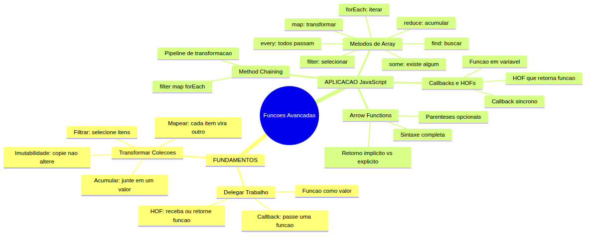
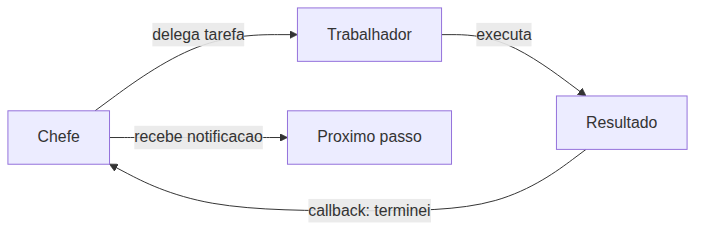
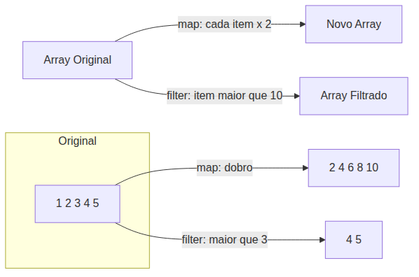
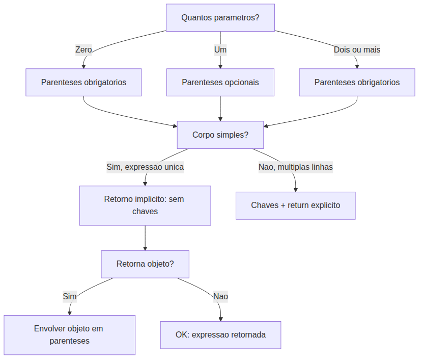
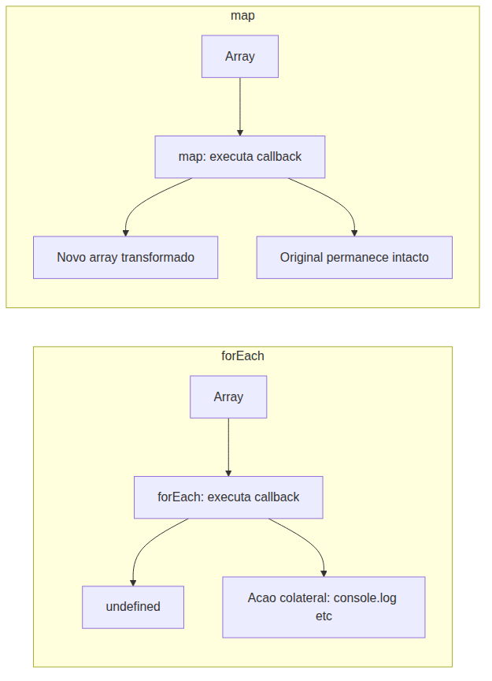
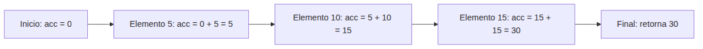
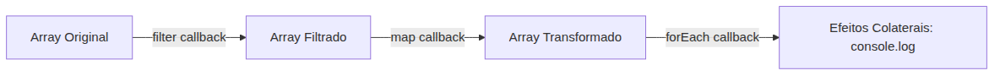

# JavaScript — Do Zero ao Profissional — Aula 14

## Funções Avançadas — Arrow Functions, Callbacks e HOFs

**Duração estimada:** 110 minutos (55 de leitura + 55 de prática)
**Nível:** Intermediário
**Pré-requisitos:** Aulas 01-13 concluídas — especialmente funções (Aula 10), escopo/closure (Aula 11), objetos (Aula 12), `this` e arrow functions básicas (Aula 13), arrays (Aula 09)

---

## Objetivos de Aprendizagem

Ao final desta aula, você será capaz de:

- [ ] **Explicar** o conceito de função como valor (first-class citizen) e Higher-Order Functions (HOFs) — funções que podem ser guardadas, passadas como argumento e retornadas
- [ ] **Escrever** arrow functions em todas as variantes de sintaxe: `(a, b) => a + b`, `x => x * 2`, corpo com `{}` e `return` explícito, retorno implícito sem `{}`
- [ ] **Criar e usar** callbacks — funções passadas como argumento para outras funções
- [ ] **Usar** `.forEach()` e `.map()` para iteração e transformação declarativa de arrays
- [ ] **Usar** `.filter()` e `.reduce()` para selecionar elementos e acumular valores de um array
- [ ] **Usar** `.find()`, `.some()` e `.every()` para buscar e testar elementos de um array
- [ ] **Aplicar** method chaining — encadear múltiplas HOFs de array em um pipeline (ex: `.filter().map().forEach()`)
- [ ] **Explicar** o princípio de imutabilidade — `.map()` e `.filter()` criam NOVOS arrays, sem modificar o original
- [ ] **Refatorar** o Gerenciador de Tarefas — substituir o loop `for` por `.forEach()`, adicionar `.filter()` para filtrar pendentes e `.map()` para exibição formatada

---

## Como Usar Esta Aula

Esta aula está organizada em duas partes. A **primeira parte** constrói dois conceitos universais: delegar trabalho (callbacks e HOFs) e transformar coleções sem destruir o original (imutabilidade). A **segunda parte** aplica esses conceitos em JavaScript — você vai dominar a sintaxe completa das arrow functions, criar callbacks e HOFs próprios, e usar os 7 métodos de array que vão transformar seu código para sempre.

Ao longo do caminho, você encontrará seções **"Mão na Massa"** (para fazer, não só ler) e **"Quick Check"** (para verificar se entendeu antes de avançar). Ao final, o arquivo separado **Questões de Aprendizagem** traz as tarefas de checkpoint — só avance para a próxima aula quando conseguir completá-las por conta própria.

**Tempo estimado:** 55 minutos de leitura + 55 minutos de prática.

---

## Mapa Mental

Este diagrama mostra todos os conceitos que você vai dominar nesta aula:



> *O mapa mental acima mostra a estrutura da aula. Cada ramo representa um conceito que você vai explorar. Repare como os fundamentos de delegar trabalho e transformar coleções se conectam com as implementações em JavaScript.*

---

## Recapitulação da Aula 13

| Aula | Conceito | Onde aparece nesta aula | Como se conecta |
|---|---|---|---|
| Aula 13 | **Arrow functions: sintaxe básica e `this`** (seção 5) | Seção 3 | Você já viu `(params) => { corpo }` e que arrow não tem `this` próprio — agora vai dominar TODAS as variantes de sintaxe |
| Aula 13 | **Método conciso em objetos** (seção 4) | Seções 5-7 | O Gerenciador de Tarefas usa métodos — você vai refatorar os loops internos com HOFs |
| Aula 13 | **Objeto `configuracao` com método `exibir()`** (seção 7) | Q8 (Questões) | A refatoração desta aula moderniza o Gerenciador sem quebrar a estrutura existente |
| Aula 10 | **Funções: `function`, parâmetros, `return`** (seções 3-5) | Seções 3-4 | Arrow functions são uma nova forma de escrever funções — os conceitos de parâmetro e retorno continuam os mesmos |
| Aula 11 | **Closure — função "lembra" do escopo** (seção 6) | Seção 4 | HOFs que retornam funções usam closure — a função retornada "lembra" das variáveis do escopo onde foi criada |
| Aula 06 | **Encadeamento de métodos em strings** (seção 5) | Seção 7 | `.toUpperCase().trim()` é o mesmo princípio de `.filter().map().forEach()` — cada método retorna um valor do mesmo tipo |
| Aula 09 | **Arrays, iteração com `for`, `.push()`** (seções 3-5) | Seções 5-7 | `.forEach()`, `.map()`, `.filter()` substituem o `for` manual — você vai refatorar o Gerenciador |

---

**FUNDAMENTOS: Delegar, Passar Adiante e Transformar Coleções**

> *Os conceitos desta seção são universais — valem para qualquer linguagem de programação, independentemente da ferramenta específica. Na segunda parte, você verá como JavaScript implementa cada um deles com arrow functions, callbacks, HOFs e métodos de array. Por enquanto, apenas entenda as ideias.*

---

## 1. "Faça Isso Quando Terminar" — Delegar Trabalho

Imagine que você está em uma cozinha industrial. O chef está preparando um prato complexo e precisa de ajuda. Ele não pode parar o que está fazendo para descascar batatas. Então ele faz o seguinte: chama um auxiliar, entrega as batatas e diz: **"Quando você terminar de descascar, me avise."**

O auxiliar descasca as batatas e, ao terminar, avisa o chef. O chef não precisou supervisionar cada corte — ele **delegou** o trabalho e foi **notificado** quando terminou.

Essa é a essência de um conceito universal em programação: o **callback**.

### O que é um callback?

Um **callback** é uma instrução que você "deixa de recado" para ser executada quando algo acontecer. É como programar o alarme do celular: você define "toque às 7h" e vai dormir. O alarme (callback) vai tocar na hora certa, sem você precisar ficar olhando para o relógio a cada minuto.

Em programação, um callback é simplesmente uma **função que você passa como argumento para outra função**, dizendo: "execute esta função quando chegar a hora (ou quando terminar o processamento)".

### Função como valor — a chave de tudo

Para que callbacks funcionem, a linguagem precisa tratar funções como **valores** — assim como números, strings ou objetos. Isso significa que você pode:

- **Guardar** uma função em uma variável
- **Passar** uma função como argumento para outra função
- **Receber** uma função como resultado de outra função

Essa capacidade é chamada de **first-class citizen** (cidadão de primeira classe). Em linguagens que tratam funções como first-class — JavaScript, Python, Ruby, entre outras — funções são valores que você manipula como qualquer outro dado.

Você pode estar pensando: "mas eu sempre escrevi `function saudar() {}` e chamei `saudar()`. O que mudou?" O que mudou é que agora você vai ENXERGAR a função como um valor que pode ser passado adiante — não apenas como algo que você declara e chama.

### Higher-Order Functions (HOFs)

Uma **Higher-Order Function (HOF)** é uma função que:

1. **Recebe** uma ou mais funções como argumento, OU
2. **Retorna** uma função como resultado, OU
3. Ambas as coisas

Voltando à cozinha: o chef é uma HOF — ele recebe tarefas (funções) e as delega. Uma "fábrica de ferramentas" também é uma HOF — você entra com especificações e ela devolve uma ferramenta customizada pronta para uso.

HOFs são poderosas porque permitem **abstrair padrões**. Em vez de escrever um loop `for` toda vez que precisar percorrer uma lista, você pode usar uma HOF que já sabe percorrer — você só passa o que fazer com cada item.

### Diagrama — Ciclo de Delegação

Imagine o fluxo: um gerente delega uma tarefa para um funcionário. O funcionário executa e, ao terminar, executa um callback para avisar o gerente.



Este padrão — delegar, executar, notificar — aparece em toda parte na programação, desde callbacks síncronos (que você vai aprender hoje) até requisições de rede e eventos do navegador (em aulas futuras).

### Quick Check 1

**1. O que é um callback em programação?**
**Resposta:** É uma função passada como argumento para outra função, para ser executada "quando algo acontecer" ou "quando terminar um processamento".

**2. O que faz uma função ser considerada uma Higher-Order Function (HOF)?**
**Resposta:** Uma HOF é uma função que recebe uma ou mais funções como argumento, retorna uma função como resultado, ou ambos.

---

## 2. Transformar Coleções sem Destruir o Original

Agora que você entendeu que funções podem ser passadas como valores, vamos olhar para um problema prático: **trabalhar com coleções de dados sem estragar o original.**

Imagine que você tem uma folha de papel com uma lista de compras. Você quer:
- Uma versão da lista com os itens em maiúsculas
- Outra versão só com os itens da seção de hortifrúti
- Uma terceira versão que mostra o total de itens

Se você escrevesse em cima da lista original, perderia a informação original para sempre. O que você faz? **Tira cópias.**

### Imutabilidade — a "copiadora"

O princípio da **imutabilidade** diz: você não modifica o dado original. Em vez disso, você cria uma **nova versão** derivada do original. O original permanece intacto, disponível para outras operações.

Isso é importante por dois motivos:
1. **Segurança**: outras partes do seu programa podem estar usando o dado original. Se você modificá-lo, pode quebrar algo longe dali.
2. **Previsibilidade**: quando você sabe que um dado nunca muda, fica mais fácil raciocinar sobre o código.

Pense em um carimbo: quando você carimba um documento, o carimbo original não é alterado — você apenas cria uma marca no papel. O carimbo continua intacto para o próximo uso, sem precisar ser refeito. Essa é a essência da imutabilidade: o original permanece, e você recebe uma cópia transformada.

### Três operações universais em coleções

Existem três operações básicas que você faz o tempo todo com listas:

**1. Mapear (map)** — transformar cada item em algo novo
- Analogia: uma fábrica. Cada matéria-prima entra em uma máquina e sai transformada em um produto. A matéria-prima original continua existindo.
- Exemplo: você tem uma lista de números `[1, 2, 3]` e quer o dobro de cada um → `[2, 4, 6]`
- Resultado: um NOVO array do MESMO tamanho

**2. Filtrar (filter)** — selecionar itens que passam em um teste
- Analogia: uma peneira. Você passa areia pela peneira; os grãos finos passam (selecionados), os grossos ficam. A areia original não é destruída.
- Exemplo: você tem uma lista de números `[1, 2, 3, 4, 5]` e quer apenas os maiores que 3 → `[4, 5]`
- Resultado: um NOVO array de tamanho MENOR ou IGUAL

**3. Acumular (reduce)** — combinar todos os itens em um único valor
- Analogia: um contador de caixa. Você pega uma pilha de moedas e vai somando uma a uma em um total acumulado. No final, você tem um número só.
- Exemplo: você tem uma lista `[1, 2, 3, 4]` e quer a soma → `10`
- Resultado: um ÚNICO valor (número, string, objeto)

### Diagrama — Pipeline de Transformação



> *Até aqui, você já entendeu os dois conceitos fundamentais: (1) funções podem ser passadas como valores — callbacks e HOFs permitem delegar trabalho; (2) operações sobre coleções podem ser feitas sem modificar o original — map, filter e reduce criam NOVOS dados. Isso já é MUITO. Respire. Se algo não ficou claro, releia a seção anterior — não tem problema nenhum voltar. Programação se aprende por camadas, não de uma vez.*

### Quick Check 2

**1. O que significa "imutabilidade" no contexto de manipulação de arrays?**
**Resposta:** Significa que as operações criam um NOVO array derivado do original, sem modificar o array original. O dado original permanece intacto.

**2. Qual a diferença entre as operações "mapear" e "filtrar" em uma coleção?**
**Resposta:** Mapear transforma cada item em algo novo — o novo array tem o mesmo tamanho que o original. Filtrar seleciona apenas os itens que passam em um teste — o novo array pode ser menor que o original.

---

**APLICAÇÃO: JavaScript — Funções como Valores na Prática**

> *Agora que você entende os conceitos universais de delegar trabalho e transformar coleções, vamos implementá-los em JavaScript. Você vai dominar a sintaxe completa das arrow functions, criar seus próprios callbacks e HOFs, e usar os 7 métodos de array que transformarão seu código para sempre.*

---

## 3. Arrow Functions — Sintaxe Completa

Você já viu arrow functions na Aula 13, no contexto de `this`: `(params) => { corpo }` e `(params) => expressão`. Naquela aula, o foco era mostrar que arrow functions **não têm `this` próprio** — herdam do escopo pai. Agora você vai dominar a sintaxe completa em todas as variantes.

### Recapitulação rápida

Na Aula 13 você aprendeu que arrow functions podem ser escritas de duas formas básicas:

```javascript
// Forma 1: corpo com chaves — PRECISA de return
const somar = (a, b) => {
  return a + b;
};

// Forma 2: corpo sem chaves — retorno implícito
const somar = (a, b) => a + b;
```

A flecha `=>` substitui a palavra `function`. O que vem antes da flecha são os parâmetros; o que vem depois é o corpo. E você já sabe que arrow functions **não têm `this` próprio** — se precisar relembrar, consulte a Seção 5 da Aula 13.

Agora vamos aprofundar.

### Regra 1 — Parênteses opcionais com 1 parâmetro

Se a função tem **exatamente um parâmetro**, os parênteses em volta dele são **opcionais**:

```javascript
// Com parênteses
const dobrar = (x) => x * 2;

// Sem parênteses — mais conciso
const dobrar = x => x * 2;
```

Ambas as linhas fazem EXATAMENTE a mesma coisa. A segunda é mais enxuta. Muitos desenvolvedores preferem omitir os parênteses quando há um único parâmetro — é o estilo mais comum em callbacks.

**Regra prática:** se tem um parâmetro, você PODE omitir os parênteses. Se tem zero parênteses, os parênteses são **obrigatórios**:

```javascript
// Zero parâmetros — parênteses OBRIGATÓRIOS
const saudar = () => 'Olá!';

// Erro! Isso não funciona:
// const saudar = => 'Olá!';
```

Se tem **dois ou mais** parâmetros, os parênteses também são obrigatórios:

```javascript
// Dois parâmetros — parênteses OBRIGATÓRIOS
const somar = (a, b) => a + b;
```

### Regra 2 — Retorno implícito vs explícito

Esta é a regra que mais confunde iniciantes. Preste atenção:

- **Sem `{}`** no corpo → a expressão é **retornada automaticamente** (retorno implícito)
- **Com `{}`** no corpo → você PRECISA usar `return` (retorno explícito)

```javascript
// Retorno implícito — sem chaves, sem return
const quadrado = n => n * n;
console.log(quadrado(5)); // 25

// Retorno explícito — com chaves, PRECISA de return
const quadrado = n => {
  return n * n;
};
console.log(quadrado(5)); // 25
```

Talvez você tenha tentado fazer isso e deu errado:

```javascript
// Isso NÃO funciona — chaves sem return retorna undefined
const quadrado = n => { n * n };
console.log(quadrado(5)); // undefined!
```

Você vai pensar "quebrei tudo". Não quebrou. O que acontece é que `{ n * n }` é interpretado como um bloco de código, não como um objeto. O bloco executa `n * n`, mas não retorna nada — então o retorno é `undefined`. Sempre que você usar `{}` no corpo, lembre-se do `return`.

### Regra 3 — Retornando objeto literal

Esta é outra pegadinha clássica. Se você quer retornar um **objeto literal** com retorno implícito, envolva o objeto em parênteses:

```javascript
// Isso NÃO funciona — {} é interpretado como corpo da função
const criarPessoa = (nome, idade) => { nome: nome, idade: idade };
console.log(criarPessoa('Ana', 25)); // undefined!

// Isso FUNCIONA — () em volta do objeto avisa que é um objeto, não corpo
const criarPessoa = (nome, idade) => ({ nome, idade });
console.log(criarPessoa('Ana', 25)); // { nome: 'Ana', idade: 25 }
```

Sem os parênteses, `{ nome: nome, idade: idade }` é interpretado como um bloco com labels (sim, JavaScript tem labels, mas isso é outro assunto). Os parênteses `()` forçam o interpretador a tratar `{}` como uma expressão de objeto.

### Regra 4 — Corpo com múltiplas linhas

Se o corpo da função tem mais de uma linha ou mais de uma instrução, use `{}` e `return` explícito:

```javascript
const processar = (a, b) => {
  const resultado = a * b;
  const mensagem = `O resultado é ${resultado}`;
  return mensagem;
};
```

Não há como fazer retorno implícito com múltiplas linhas — o retorno implícito funciona apenas com uma expressão única.

### Tabela de decisão — qual forma usar?

| Situação | Exemplo | Sintaxe |
|---|---|---|
| Zero parâmetros | `() => 42` | `()` obrigatório, retorno implícito |
| Um parâmetro, expressão simples | `x => x * 2` | `()` opcional, retorno implícito |
| Múltiplos parâmetros, expressão simples | `(a, b) => a + b` | `()` obrigatório, retorno implícito |
| Corpo com múltiplas linhas | `x => { const y = x * 2; return y; }` | `{}` + `return` explícito |
| Retornando objeto | `() => ({ nome: 'Ana' })` | `()` em volta do objeto |
| Sem retorno (procedimento) | `() => { console.log('oi'); }` | `{}` sem `return` (retorna `undefined`) |

### Mão na Massa — Converter funções para arrow

Abra o Console do navegador (F12) e converta cada uma das funções abaixo para arrow function, usando a variante mais concisa possível:

```javascript
// Função original 1
function somar(a, b) {
  return a + b;
}
// Sua arrow:

// Função original 2
function ehPar(numero) {
  return numero % 2 === 0;
}
// Sua arrow:

// Função original 3
function cumprimentar(nome) {
  return 'Olá, ' + nome;
}
// Sua arrow:

// Função original 4
function criarConfiguracao(tema, fonte) {
  return { tema: tema, fonte: fonte };
}
// Sua arrow:

// Função original 5
function exibirMensagem() {
  console.log('Bem-vindo!');
  console.log('Esta é a Aula 14');
}
// Sua arrow:
```

**Gabarito:**

```javascript
// 1: múltiplos parâmetros, expressão simples
const somar = (a, b) => a + b;

// 2: um parâmetro, expressão simples
const ehPar = numero => numero % 2 === 0;

// 3: um parâmetro, expressão simples
const cumprimentar = nome => 'Olá, ' + nome;

// 4: retornando objeto — PRECISA dos parênteses
const criarConfiguracao = (tema, fonte) => ({ tema, fonte });

// 5: múltiplas linhas — PRECISA de {} e return (ou só {})
const exibirMensagem = () => {
  console.log('Bem-vindo!');
  console.log('Esta é a Aula 14');
};
```

Percebeu como cada caso exigiu uma sintaxe diferente? A escolha não é "certa" ou "errada" — é sobre qual forma comunica melhor a intenção.

### Diagrama — Decisão de Sintaxe Arrow



### Quick Check 3

**1. Qual a diferença entre `const f = x => { x * 2 }` e `const f = x => x * 2`?**
**Resposta:** A primeira usa chaves `{}`, então PRECISA de `return` explícito. Como não tem `return`, retorna `undefined`. A segunda tem retorno implícito — `x * 2` é retornado automaticamente.

**2. Como você retorna o objeto `{ nome: 'Ana', idade: 30 }` usando uma arrow function com retorno implícito?**
**Resposta:** Envolvendo o objeto em parênteses: `const criar = () => ({ nome: 'Ana', idade: 30 })`. Sem os parênteses, `{}` seria interpretado como corpo da função.

---

## 4. Funções como Valores e Callbacks em JavaScript

Agora vamos colocar em prática o conceito de "função como valor" que você aprendeu na PARTE 1. Em JavaScript, funções são **first-class citizens** — você pode fazer com elas tudo o que faz com os outros valores.

### Função guardada em variável

Você já viu isso com arrow functions: `const somar = (a, b) => a + b`. Mas também funciona com `function` tradicional:

```javascript
const saudar = function(nome) {
  return 'Olá, ' + nome;
};

// Agora saudar é uma variável que contém uma função
console.log(saudar('Ana')); // 'Olá, Ana'
```

Isso é exatamente equivalente a declarar `function saudar(nome) {}`. A diferença é que agora a função é um **valor anônimo** (sem nome próprio) que você atribuiu a uma variável. Tanto faz como você escreve — o comportamento é idêntico.

### Função passada como argumento (callback)

Aqui está o pulo do gato. Se funções são valores, você pode passá-las como argumento:

```javascript
// Esta função recebe um número e uma função callback
function processar(numero, callback) {
  const resultado = numero * 2;
  callback(resultado);
}

// Vamos usar: passamos um número e uma função que exibe o resultado
processar(5, function(r) {
  console.log('Resultado:', r);
});
// Resultado: 10
```

Repare no fluxo:
1. `processar(5, callback)` é chamada
2. Dentro de `processar`, `numero` vale `5` e `callback` vale a função que recebemos
3. O resultado `10` é calculado
4. `callback(resultado)` executa a função que passamos, com `r = 10`

Agora com arrow function — muito mais conciso:

```javascript
processar(5, r => console.log('Resultado:', r));
```

Arrow functions são PERFEITAS para callbacks porque você escreve exatamente o que precisa, na hora, sem cerimônia.

Outro exemplo — um processador de nomes:

```javascript
function processarNome(nome, callback) {
  const nomeFormatado = nome.trim().toUpperCase();
  callback(nomeFormatado);
}

// Callback com arrow function
processarNome('  ana  ', nome => {
  console.log('Nome processado:', nome);
});
// Nome processado: ANA
```

### Função retornada por função (HOF)

Uma função que **retorna** outra função é uma Higher-Order Function. Lembra do conceito de closure da Aula 11? A função retornada "lembra" das variáveis do escopo onde foi criada:

```javascript
function criarMultiplicador(fator) {
  // Retorna uma função que multiplica qualquer número pelo fator
  return function(numero) {
    return numero * fator;
  };
}

// criarMultiplicador é uma HOF: ela RECEBE fator e RETORNA uma função
const dobrar = criarMultiplicador(2);
const triplicar = criarMultiplicador(3);

console.log(dobrar(10));   // 20
console.log(triplicar(10)); // 30
```

A função retornada "lembra" do `fator` (closure). Quando você chama `criarMultiplicador(2)`, a função interna guarda `fator = 2` e devolve uma função pronta para uso. `dobrar` agora é uma função que sempre multiplica por 2.

Versão com arrow function (mais elegante):

```javascript
const criarMultiplicador = fator => numero => numero * fator;

const dobrar = criarMultiplicador(2);
console.log(dobrar(10)); // 20
```

O que aconteceu aqui? `fator => numero => numero * fator` é uma arrow function que retorna outra arrow function. É o mesmo que:

```javascript
const criarMultiplicador = fator => {
  return numero => numero * fator;
};
```

### Conexão: métodos de array são HOFs

Os métodos que você vai aprender a seguir — `.forEach()`, `.map()`, `.filter()`, `.reduce()`, `.find()`, `.some()`, `.every()` — são TODOS Higher-Order Functions nativas do JavaScript. Elas RECEBEM uma função callback como argumento e aplicam essa função aos elementos do array.

Isso significa que você já entendeu o mecanismo central. O que muda é o que cada método faz com o callback.

### Mão na Massa — Criando suas próprias HOFs

Abra o Console e crie:

**A) Uma HOF `executarOperacao(a, b, operacao)` que recebe dois números e uma função, chama a função com os números e retorna o resultado:**

```javascript
function executarOperacao(a, b, operacao) {
  return operacao(a, b);
}

// Teste:
const somar = (x, y) => x + y;
const multiplicar = (x, y) => x * y;

console.log(executarOperacao(10, 5, somar));       // 15
console.log(executarOperacao(10, 5, multiplicar));  // 50
console.log(executarOperacao(10, 5, (x, y) => x - y)); // 5
```

**B) Uma HOF `criarSaudacao(saudacao)` que recebe uma string de saudação e retorna uma função que recebe um nome e exibe a saudação completa:**

```javascript
function criarSaudacao(saudacao) {
  return function(nome) {
    console.log(`${saudacao}, ${nome}!`);
  };
}

const cumprimentarFormal = criarSaudacao('Bom dia');
const cumprimentarInformal = criarSaudacao('E aí');

cumprimentarFormal('Ana');   // Bom dia, Ana!
cumprimentarInformal('João'); // E aí, João!
```

### Quick Check 4

**1. O que significa dizer que "funções são first-class citizens" em JavaScript?**
**Resposta:** Significa que funções podem ser tratadas como qualquer outro valor: guardadas em variáveis, passadas como argumento para outras funções e retornadas por outras funções.

**2. Por que os métodos de array (`.forEach()`, `.map()`, etc.) são considerados Higher-Order Functions?**
**Resposta:** Porque todos eles RECEBEM uma função callback como argumento — e aplicam essa função aos elementos do array. São HOFs porque operam sobre funções.

---

## 5. Iteração e Transformação Declarativa — `.forEach()` e `.map()`

Chegou a hora de aplicar o que você aprendeu. Os métodos de array que você vai ver agora são HOFs nativas — você passa um callback e elas fazem o trabalho pesado.

### `.forEach()` — Iteração declarativa

O `.forEach()` substitui o loop `for` para percorrer arrays. A diferença é que você **declara o que fazer** (função callback), em vez de **controlar manualmente** o índice e a condição de parada.

```javascript
const frutas = ['Maçã', 'Banana', 'Laranja'];

// Com for (jeito antigo)
for (let i = 0; i < frutas.length; i++) {
  console.log(frutas[i]);
}

// Com forEach (jeito moderno)
frutas.forEach(fruta => console.log(fruta));
```

O callback de `.forEach()` recebe até 3 argumentos, mas você geralmente usa só o primeiro:

```javascript
array.forEach((elemento, indice, arrayCompleto) => {
  // elemento: o item atual
  // indice: a posição do item (opcional)
  // arrayCompleto: o array inteiro (opcional, raramente usado)
});
```

Exemplo com índice:

```javascript
const tarefas = ['Estudar JS', 'Fazer exercícios', 'Revisar aula'];

tarefas.forEach((tarefa, i) => {
  console.log(`${i + 1}. ${tarefa}`);
});
// 1. Estudar JS
// 2. Fazer exercícios
// 3. Revisar aula
```

**Importante:** `.forEach()` sempre retorna `undefined`. Ele serve para EXECUTAR algo com cada elemento — não para produzir um novo array. Se você precisa de um novo array transformado, use `.map()`.

### `.map()` — Transformação

O `.map()` cria um **NOVO array** com os resultados da função callback aplicada a cada elemento. O array original NÃO é modificado.

```javascript
const numeros = [1, 2, 3, 4, 5];

const dobrados = numeros.map(n => n * 2);

console.log(dobrados); // [2, 4, 6, 8, 10]
console.log(numeros);  // [1, 2, 3, 4, 5] — original intacto!
```

A diferença crucial entre `.forEach()` e `.map()`:

```javascript
const numeros = [1, 2, 3];

// forEach: executa, mas não produz novo array
const resultadoForEach = numeros.forEach(n => n * 2);
console.log(resultadoForEach); // undefined

// map: executa e PRODUZ novo array
const resultadoMap = numeros.map(n => n * 2);
console.log(resultadoMap); // [2, 4, 6]
```

`.map()` é perfeito para formatar dados:

```javascript
const tarefas = [
  { texto: 'Estudar JS', concluida: true },
  { texto: 'Ler livro', concluida: false },
  { texto: 'Fazer compras', concluida: true }
];

// Criar array de strings formatadas
const resumos = tarefas.map(t => `${t.concluida ? '✅' : '⬜'} ${t.texto}`);
console.log(resumos);
// ['✅ Estudar JS', '⬜ Ler livro', '✅ Fazer compras']
```

### Diagrama — `.forEach()` vs `.map()`



**Regra prática:**
- Use `.forEach()` quando quiser **fazer algo** com cada item (exibir, salvar, modificar variável externa)
- Use `.map()` quando quiser **transformar** cada item e obter um novo array

### Mão na Massa — Iterar e transformar tarefas

Abra o Console e execute:

```javascript
const tarefas = [
  { texto: 'Estudar JS', concluida: true, prioridade: 'alta' },
  { texto: 'Ler livro', concluida: false, prioridade: 'media' },
  { texto: 'Fazer compras', concluida: true, prioridade: 'baixa' },
  { texto: 'Revisar aula', concluida: false, prioridade: 'alta' }
];

// 1. Use forEach para exibir cada tarefa
tarefas.forEach(t => {
  console.log(`[${t.concluida ? 'x' : ' '}] ${t.texto} (${t.prioridade})`);
});

// 2. Use map para criar array de strings formatadas
const linhas = tarefas.map(t => `${t.texto} - ${t.prioridade}`);
console.log(linhas);
// ['Estudar JS - alta', 'Ler livro - media', ...]

// 3. Use map para extrair apenas os textos em maiúsculo
const textosMaiusculos = tarefas.map(t => t.texto.toUpperCase());
console.log(textosMaiusculos);
// ['ESTUDAR JS', 'LER LIVRO', 'FAZER COMPRAS', 'REVISAR AULA']
```

### Quick Check 5

**1. Qual a diferença entre `.forEach()` e `.map()` em relação ao retorno?**
**Resposta:** `.forEach()` retorna `undefined` — ele executa uma ação para cada elemento mas não produz um novo array. `.map()` retorna um NOVO array com os resultados do callback aplicado a cada elemento.

**2. O array original é modificado depois de chamar `.map()`?**
**Resposta:** Não. `.map()` cria um NOVO array. O array original permanece exatamente como estava (imutabilidade).

---

## 6. Seleção e Acumulação — `.filter()` e `.reduce()`

Agora dois métodos que vão elevar seu nível: `.filter()` para selecionar o que interessa e `.reduce()` para juntar tudo em um valor só.

### `.filter()` — Seleção

O `.filter()` cria um **NOVO array** apenas com os elementos que passam em um teste. O teste é uma função callback que retorna `true` (mantém o elemento) ou `false` (descarta).

```javascript
const numeros = [5, 12, 8, 130, 44];

// Queremos apenas números maiores que 10
const maiores = numeros.filter(n => n > 10);
console.log(maiores); // [12, 130, 44]
console.log(numeros); // [5, 12, 8, 130, 44] — original intacto!
```

Com array de objetos:

```javascript
const tarefas = [
  { texto: 'Estudar JS', concluida: true, prioridade: 'alta' },
  { texto: 'Ler livro', concluida: false, prioridade: 'media' },
  { texto: 'Fazer compras', concluida: true, prioridade: 'baixa' },
  { texto: 'Revisar aula', concluida: false, prioridade: 'alta' }
];

// Tarefas pendentes (não concluídas)
const pendentes = tarefas.filter(t => !t.concluida);
console.log(pendentes);
// [{ texto: 'Ler livro', concluida: false, ... },
//  { texto: 'Revisar aula', concluida: false, ... }]

// Tarefas de prioridade alta
const altaPrioridade = tarefas.filter(t => t.prioridade === 'alta');
console.log(altaPrioridade);
```

### `.reduce()` — Acumulação

O `.reduce()` é o mais versátil — e o mais complexo. Ele percorre o array e **acumula** um valor, passo a passo. No final, retorna um ÚNICO valor (pode ser número, string, objeto, array...).

```javascript
const numeros = [5, 10, 15];

const soma = numeros.reduce((acumulador, elemento) => {
  return acumulador + elemento;
}, 0); // 0 é o valor inicial

console.log(soma); // 30
```

**Anatomia do `.reduce()`:**

```
reduce(callback, valorInicial)

Callback recebe: (acumulador, elemento, indice, array)
- acumulador: o valor que está sendo construído (começa como valorInicial)
- elemento: o item atual do array
- indice: posição do item (opcional)
- array: o array completo (opcional)
```

Passo a passo da soma `[5, 10, 15]` com valor inicial `0`:



Tabela visual:

| Passo | acumulador | elemento | retorno (novo acumulador) |
|---|---|---|---|
| 1 | 0 (inicial) | 5 | 5 |
| 2 | 5 | 10 | 15 |
| 3 | 15 | 15 | 30 |
| **Final** | **30** | — | **30** |

Exemplos práticos com tarefas:

```javascript
const tarefas = [
  { texto: 'Estudar JS', concluida: true, prioridade: 'alta' },
  { texto: 'Ler livro', concluida: false, prioridade: 'media' },
  { texto: 'Fazer compras', concluida: true, prioridade: 'baixa' },
  { texto: 'Revisar aula', concluida: false, prioridade: 'alta' }
];

// Contar tarefas concluídas
const totalConcluidas = tarefas.reduce((acc, t) => {
  return t.concluida ? acc + 1 : acc;
}, 0);
console.log(totalConcluidas); // 2

// Contar por prioridade (retornando um objeto)
const contagem = tarefas.reduce((acc, t) => {
  acc[t.prioridade] = (acc[t.prioridade] || 0) + 1;
  return acc;
}, {});
console.log(contagem); // { alta: 2, media: 1, baixa: 1 }
```

### Comparação: `for` vs `.reduce()`

```javascript
const numeros = [5, 10, 15];

// Com for
let soma = 0;
for (let i = 0; i < numeros.length; i++) {
  soma += numeros[i];
}
console.log(soma); // 30

// Com reduce — mais expressivo, sem variável externa
const soma = numeros.reduce((acc, n) => acc + n, 0);
console.log(soma); // 30
```

### Mão na Massa — Filtrar e acumular tarefas

```javascript
const tarefas = [
  { texto: 'Estudar JS', concluida: true, prioridade: 'alta' },
  { texto: 'Ler livro', concluida: false, prioridade: 'media' },
  { texto: 'Fazer compras', concluida: true, prioridade: 'baixa' },
  { texto: 'Revisar aula', concluida: false, prioridade: 'alta' },
  { texto: 'Correr', concluida: true, prioridade: 'media' }
];

// 1. Filtrar apenas tarefas de prioridade alta
const altaPrioridade = tarefas.filter(t => t.prioridade === 'alta');
console.log('Alta prioridade:', altaPrioridade);

// 2. Contar total de tarefas com reduce
const total = tarefas.reduce(acc => acc + 1, 0);
console.log('Total:', total); // 5

// 3. Contar quantas estão concluídas
const concluidas = tarefas.reduce((acc, t) => t.concluida ? acc + 1 : acc, 0);
console.log('Concluídas:', concluidas); // 3
```

> *Até aqui, você já entendeu os 4 principais métodos de array: `.forEach()` para iterar, `.map()` para transformar, `.filter()` para selecionar e `.reduce()` para acumular. Isso já é MUITO. Respire. Se algo não ficou claro, releia a seção anterior — não tem problema nenhum voltar.*

### Quick Check 6

**1. O que `.filter()` retorna?**
**Resposta:** Um NOVO array contendo apenas os elementos para os quais o callback retornou `true`. O array original não é modificado.

**2. Explique com suas palavras o que faz o `.reduce()` e cite um caso de uso.**
**Resposta:** `.reduce()` percorre o array acumulando um valor progressivamente (passo a passo) e retorna um único valor final. Casos de uso: somar todos os números de um array, contar itens por categoria, agrupar objetos por propriedade.

---

## 7. Busca, Teste e Encadeamento — `.find()`, `.some()`, `.every()` e Method Chaining

Três métodos para buscar e verificar condições, e a cereja do bolo: **encadear** tudo em um pipeline.

### `.find()` — Buscar o primeiro elemento

`.find()` retorna o **primeiro** elemento do array que satisfaz a condição. Se nenhum elemento passar, retorna `undefined`.

```javascript
const tarefas = [
  { id: 1, texto: 'Estudar JS', concluida: true },
  { id: 2, texto: 'Ler livro', concluida: false },
  { id: 3, texto: 'Fazer compras', concluida: false }
];

// Encontrar tarefa com id = 2
const tarefa = tarefas.find(t => t.id === 2);
console.log(tarefa); // { id: 2, texto: 'Ler livro', concluida: false }

// Encontrar a primeira tarefa não concluída
const primeiraPendente = tarefas.find(t => !t.concluida);
console.log(primeiraPendente); // { id: 2, texto: 'Ler livro', ... }
```

### `.some()` — Algum elemento satisfaz?

`.some()` retorna `true` se **pelo menos um** elemento do array passar no teste. Assim que encontra um `true`, para de verificar (short-circuit).

```javascript
const numeros = [1, 3, 5, 7, 8, 9];

// Existe algum número par?
const temPar = numeros.some(n => n % 2 === 0);
console.log(temPar); // true (o 8 é par)

const tarefas = [
  { texto: 'Estudar', concluida: true },
  { texto: 'Ler', concluida: false },
  { texto: 'Compras', concluida: false }
];

// Existe alguma tarefa prioritária? (vamos considerar prioridade 'alta')
// Precisamos primeiro adicionar prioridade
const tarefasComPrioridade = [
  { texto: 'Estudar', concluida: true, prioridade: 'media' },
  { texto: 'Ler', concluida: false, prioridade: 'alta' },
  { texto: 'Compras', concluida: false, prioridade: 'baixa' }
];

const temAltaPrioridade = tarefasComPrioridade.some(t => t.prioridade === 'alta');
console.log(temAltaPrioridade); // true
```

### `.every()` — Todos satisfazem?

`.every()` retorna `true` se **todos** os elementos passarem no teste. Assim que encontra um `false`, para de verificar.

```javascript
const numeros = [2, 4, 6, 8];

// Todos são pares?
const todosPares = numeros.every(n => n % 2 === 0);
console.log(todosPares); // true

const tarefas = [
  { texto: 'Estudar', concluida: true },
  { texto: 'Ler', concluida: true },
  { texto: 'Compras', concluida: false }
];

// Todas as tarefas estão concluídas?
const todasConcluidas = tarefas.every(t => t.concluida);
console.log(todasConcluidas); // false (a última não está)
```

### Method Chaining — Encadeamento

Aqui está o verdadeiro poder. Como `.map()`, `.filter()` e os outros retornam arrays, você pode **encadear** chamadas — cada método recebe o array produzido pelo anterior.

Você já viu esse princípio na Aula 06 com strings: `nome.toUpperCase().trim().slice(0, 5)`. Cada método retorna uma string, permitindo o encadeamento. Com arrays é a mesma ideia — cada HOF retorna um array (exceto `.reduce()`, `.find()`, `.some()`, `.every()`).

```javascript
const tarefas = [
  { texto: 'Estudar JS', concluida: false, prioridade: 'alta' },
  { texto: 'Ler livro', concluida: true, prioridade: 'media' },
  { texto: 'Fazer compras', concluida: false, prioridade: 'baixa' },
  { texto: 'Revisar aula', concluida: false, prioridade: 'alta' }
];

// Pipeline: filtrar pendentes → transformar em strings → exibir
tarefas
  .filter(t => !t.concluida)                    // só pendentes
  .map(t => `🔴 ${t.texto} (${t.prioridade})`)  // formatar
  .forEach(linha => console.log(linha));         // exibir

// Resultado:
// 🔴 Estudar JS (alta)
// 🔴 Fazer compras (baixa)
// 🔴 Revisar aula (alta)
```

Percebeu o que aconteceu?:
1. `.filter(t => !t.concluida)` → retorna novo array SÓ com pendentes
2. `.map(...)` → pega esse array filtrado e transforma cada tarefa em string
3. `.forEach(...)` → pega o array de strings e exibe cada uma

Cada método recebe o resultado do anterior. É um **pipeline de transformação de dados**.

**Ordem importa!** `.filter().map()` é diferente de `.map().filter()`:

```javascript
const numeros = [1, 2, 3, 4, 5, 6];

// filter primeiro, map depois: filtra pares, depois dobra
const resultado1 = numeros
  .filter(n => n % 2 === 0)  // [2, 4, 6]
  .map(n => n * 2);          // [4, 8, 12]

// map primeiro, filter depois: dobra tudo, depois filtra pares
const resultado2 = numeros
  .map(n => n * 2)           // [2, 4, 6, 8, 10, 12]
  .filter(n => n % 2 === 0); // [2, 4, 6, 8, 10, 12]

console.log(resultado1); // [4, 8, 12]
console.log(resultado2); // [2, 4, 6, 8, 10, 12]
```

No segundo caso, `.map()` transforma TODOS os números primeiro (incluindo ímpares que viram pares), e depois `.filter()` seleciona todos — resultado diferente!

### ⚠️ Atenção: `.sort()` não é imutável

Nem todo método de array é imutável. O `.sort()`, por exemplo, **modifica o array original**. Se você precisar ordenar sem modificar, crie uma cópia primeiro:

```javascript
const numeros = [3, 1, 4, 1, 5];

// .sort() modifica o original!
// const ordenados = numeros.sort(); // isso altera 'numeros'!

// Solução: crie uma cópia antes de ordenar
const ordenados = [...numeros].sort((a, b) => a - b);
console.log(ordenados); // [1, 1, 3, 4, 5]
console.log(numeros);   // [3, 1, 4, 1, 5] — original intacto!
```

### Diagrama — Pipeline de Encadeamento



### Mão na Massa — Pipeline encadeado

```javascript
const tarefas = [
  { texto: 'Estudar JS', concluida: false, prioridade: 'alta' },
  { texto: 'Ler livro', concluida: true, prioridade: 'media' },
  { texto: 'Fazer compras', concluida: false, prioridade: 'baixa' },
  { texto: 'Revisar aula', concluida: false, prioridade: 'alta' },
  { texto: 'Correr', concluida: true, prioridade: 'media' }
];

// Pipeline 1: pendentes de prioridade alta, formatadas como urgência
console.log('=== Pendentes Urgentes ===');
tarefas
  .filter(t => !t.concluida && t.prioridade === 'alta')
  .map(t => `🚨 ${t.texto}`)
  .forEach(t => console.log(t));

// Pipeline 2: textos de todas em maiúsculo, ordenadas
const textos = tarefas.map(t => t.texto.toUpperCase());
console.log('Textos:', textos);

// Pipeline 3: Verificar status geral
const todasConcluidas = tarefas.every(t => t.concluida);
const algumaPendente = tarefas.some(t => !t.concluida);
const primeiraAlta = tarefas.find(t => t.prioridade === 'alta');

console.log('Todas concluídas?', todasConcluidas);
console.log('Alguma pendente?', algumaPendente);
console.log('Primeira de alta prioridade:', primeiraAlta.texto);
```

### Quick Check 7

**1. Qual a diferença entre `.find()` e `.filter()`?**
**Resposta:** `.find()` retorna o PRIMEIRO elemento que satisfaz a condição (ou `undefined` se não encontrar). `.filter()` retorna um NOVO ARRAY com TODOS os elementos que satisfazem a condição.

**2. O que é method chaining e por que ele funciona com `.filter().map().forEach()`?**
**Resposta:** Method chaining é encadear chamadas de métodos onde cada método retorna um valor do mesmo tipo (no caso, array), permitindo chamar o próximo método diretamente no resultado. `.filter()` retorna um array, então `.map()` pode ser chamado no resultado, que retorna outro array, e `.forEach()` no resultado seguinte.

---

---

## 8. Desestruturação — Extraindo Valores de Objetos e Arrays

Desestruturação (*destructuring*) é a forma elegante de tirar valores de objetos e arrays sem ficar acessando propriedade por propriedade.

### Desestruturação de objetos

```javascript
const pessoa = { nome: 'Ana', idade: 30, cidade: 'São Paulo' };

// SEM desestruturação:
const nome1 = pessoa.nome;
const idade1 = pessoa.idade;

// COM desestruturação:
const { nome, idade } = pessoa;
console.log(nome);  // 'Ana'
console.log(idade); // 30
```

### Renomeando variáveis

```javascript
const { nome: nomeCompleto, idade: anos } = pessoa;
console.log(nomeCompleto); // 'Ana'
console.log(anos);         // 30
```

### Valores padrão

```javascript
const { nome, profissao = 'Não informada' } = pessoa;
console.log(profissao); // 'Não informada'
```

### Desestruturação de arrays

```javascript
const cores = ['vermelho', 'verde', 'azul'];

const [primeira, segunda] = cores;
console.log(primeira); // 'vermelho'
console.log(segunda);  // 'verde'
```

### Pulando itens e coletando o resto

```javascript
const [primeira, , terceira] = cores;  // pula 'verde'
console.log(terceira); // 'azul'

const [primeira, ...resto] = cores;
console.log(resto); // ['verde', 'azul'] — array com os demais!
```

### Uso prático: desestruturação com array methods

```javascript
const tarefas = [
    { texto: 'Comprar pão', concluida: false },
    { texto: 'Limpar quarto', concluida: true }
];

// .filter() + desestruturação
const pendentes = tarefas
    .filter(({ concluida }) => !concluida)
    .map(({ texto }) => texto);

console.log(pendentes); // ['Comprar pão']
```

> *Conexão: O `...resto` na desestruturação de arrays é o mesmo operador rest que você viu na Aula 10. A diferença é o contexto — aqui ele extrai o resto do array, não de argumentos.*

### Quick Check 8

**1. O que `const { a, b } = obj` faz?**
**Resposta:** Cria duas variáveis `a` e `b` extraindo as propriedades de mesmo nome do objeto `obj`. Equivale a `const a = obj.a; const b = obj.b;`.

**2. O que `const [primeiro, ...outros] = lista` faz?**
**Resposta:** A variável `primeiro` recebe o primeiro elemento da lista. A variável `outros` recebe um array com todos os elementos RESTANTES.

---


## Autoavaliação: Quiz Rápido

**1. O que é uma Higher-Order Function (HOF)?**
**Resposta:**

Uma HOF é uma função que recebe uma função como argumento, retorna uma função como resultado, ou ambos. Em JavaScript, `.map()`, `.filter()` e `.forEach()` são exemplos de HOFs nativas.

**2. Qual a sintaxe correta para uma arrow function que retorna o objeto `{ nome: 'Ana' }`?**
**Resposta:**

`const criar = () => ({ nome: 'Ana' })`. Os parênteses em volta do objeto são obrigatórios para evitar que `{}` seja interpretado como corpo da função.

**3. Qual método de array você usaria para transformar um array de números em um array de strings formatadas?**
**Resposta:**

`.map()`. Ele percorre o array e retorna um NOVO array com os resultados do callback aplicado a cada elemento. Ex: `numeros.map(n => 'R$ ' + n.toFixed(2))`.

**4. Como você faria para obter um array apenas com as tarefas concluídas?**
**Resposta:**

Usando `.filter()`: `tarefas.filter(t => t.concluida)`. O callback retorna `true` para elementos que devem ser mantidos.

**5. O que `.reduce((acc, n) => acc + n, 0)` faz?**
**Resposta:**

Soma todos os números do array. O `0` é o valor inicial do acumulador. A cada iteração, o elemento é somado ao acumulador. No final, retorna a soma total.

**6. Qual a diferença entre `.some()` e `.every()`?**
**Resposta:**

`.some()` retorna `true` se PELO MENOS UM elemento passar no teste. `.every()` retorna `true` se TODOS os elementos passarem no teste. Ambos param de verificar assim que encontram um resultado definitivo (short-circuit).

---

## Mão na Massa: Exercícios Graduados

**Exercício 1 (Fácil) — Arrow Functions e Métodos Básicos**

Dado o seguinte array de números:

```javascript
const numeros = [10, 20, 30, 40, 50];
```

Complete o código abaixo usando arrow functions e os métodos de array apropriados:

1. Crie `dobrados` usando `.map()` — cada número multiplicado por 2
2. Crie `maioresQue25` usando `.filter()` — números maiores que 25
3. Exiba cada número de `dobrados` no console usando `.forEach()`

**Gabarito:**

```javascript
const numeros = [10, 20, 30, 40, 50];

const dobrados = numeros.map(n => n * 2);
console.log('Dobrados:', dobrados);
// Dobrados: [20, 40, 60, 80, 100]

const maioresQue25 = numeros.filter(n => n > 25);
console.log('Maiores que 25:', maioresQue25);
// Maiores que 25: [30, 40, 50]

dobrados.forEach(n => console.log('Número:', n));
// Número: 20
// Número: 40
// Número: 60
// Número: 80
// Número: 100
```

**Exercício 2 (Médio) — Carrinho de Compras**

Você tem um array de produtos no carrinho:

```javascript
const carrinho = [
  { produto: 'Camiseta', preco: 39.90, quantidade: 2 },
  { produto: 'Calça', preco: 89.90, quantidade: 1 },
  { produto: 'Tênis', preco: 199.90, quantidade: 1 },
  { produto: 'Boné', preco: 29.90, quantidade: 3 }
];
```

1. Use `.map()` para criar um array de strings: `"Camiseta: R$79.80 (2 unidades)"` (preço = preco * quantidade)
2. Use `.filter()` para obter apenas os produtos com valor total superior a R$50 (preco * quantidade > 50)
3. Use `.reduce()` para calcular o valor total do carrinho (soma de preco * quantidade)

**Gabarito:**

```javascript
const carrinho = [
  { produto: 'Camiseta', preco: 39.90, quantidade: 2 },
  { produto: 'Calça', preco: 89.90, quantidade: 1 },
  { produto: 'Tênis', preco: 199.90, quantidade: 1 },
  { produto: 'Boné', preco: 29.90, quantidade: 3 }
];

// 1. Strings formatadas
const resumo = carrinho.map(item => {
  const total = item.preco * item.quantidade;
  return `${item.produto}: R$${total.toFixed(2)} (${item.quantidade} unidades)`;
});
console.log('Resumo:', resumo);
// Resumo: [
//   'Camiseta: R$79.80 (2 unidades)',
//   'Calça: R$89.90 (1 unidades)',
//   'Tênis: R$199.90 (1 unidades)',
//   'Boné: R$89.70 (3 unidades)'
// ]

// 2. Produtos com valor total > R$50
const caros = carrinho.filter(item => item.preco * item.quantidade > 50);
console.log('Caros:', caros);
// Caros: [
//   { produto: 'Camiseta', preco: 39.90, quantidade: 2 },
//   { produto: 'Calça', preco: 89.90, quantidade: 1 },
//   { produto: 'Tênis', preco: 199.90, quantidade: 1 },
//   { produto: 'Boné', preco: 29.90, quantidade: 3 }
// ]

// 3. Valor total do carrinho
const total = carrinho.reduce((acc, item) => {
  return acc + item.preco * item.quantidade;
}, 0);
console.log('Total: R$' + total.toFixed(2));
// Total: R$459.40
```

**Desafio (Difícil) — Pipeline de Pedidos**

Dado o array de pedidos de uma lanchonete:

```javascript
const pedidos = [
  { id: 1, cliente: 'Ana', itens: ['Hambúrguer', 'Batata'], total: 32.50, status: 'entregue' },
  { id: 2, cliente: 'João', itens: ['Pizza', 'Refrigerante'], total: 45.00, status: 'preparando' },
  { id: 3, cliente: 'Maria', itens: ['Salada', 'Suco'], total: 22.00, status: 'entregue' },
  { id: 4, cliente: 'Ana', itens: ['Sobremesa'], total: 12.00, status: 'preparando' },
  { id: 5, cliente: 'Pedro', itens: ['Hambúrguer', 'Milk-shake'], total: 28.00, status: 'fila' }
];
```

Construa um pipeline encadeado que:

1. Filtre pedidos com status `'entregue'`
2. Mapeie para um resumo: `"Cliente: Ana — R$32.50"`
3. Use `.forEach()` para exibir cada resumo

Depois, use `.reduce()` para criar um objeto que agrupe os pedidos por cliente:

```javascript
// Resultado esperado:
// {
//   Ana: [pedido1, pedido4],
//   João: [pedido2],
//   Maria: [pedido3],
//   Pedro: [pedido5]
// }
```

**Gabarito:**

```javascript
const pedidos = [
  { id: 1, cliente: 'Ana', itens: ['Hambúrguer', 'Batata'], total: 32.50, status: 'entregue' },
  { id: 2, cliente: 'João', itens: ['Pizza', 'Refrigerante'], total: 45.00, status: 'preparando' },
  { id: 3, cliente: 'Maria', itens: ['Salada', 'Suco'], total: 22.00, status: 'entregue' },
  { id: 4, cliente: 'Ana', itens: ['Sobremesa'], total: 12.00, status: 'preparando' },
  { id: 5, cliente: 'Pedro', itens: ['Hambúrguer', 'Milk-shake'], total: 28.00, status: 'fila' }
];

// Pipeline: filtrar entregues → formatar resumo → exibir
console.log('=== Pedidos Entregues ===');
pedidos
  .filter(p => p.status === 'entregue')
  .map(p => `Cliente: ${p.cliente} — R$${p.total.toFixed(2)}`)
  .forEach(resumo => console.log(resumo));
// Cliente: Ana — R$32.50
// Cliente: Maria — R$22.00

// Reduce: agrupar pedidos por cliente
const porCliente = pedidos.reduce((acc, pedido) => {
  // Se o cliente ainda não existe no acumulador, cria array vazio
  if (!acc[pedido.cliente]) {
    acc[pedido.cliente] = [];
  }
  // Adiciona o pedido ao array do cliente
  acc[pedido.cliente].push(pedido);
  return acc;
}, {});

console.log('Pedidos por cliente:', porCliente);
// {
//   Ana: [{ id: 1, ... }, { id: 4, ... }],
//   João: [{ id: 2, ... }],
//   Maria: [{ id: 3, ... }],
//   Pedro: [{ id: 5, ... }]
// }

// Extra: total gasto por cliente
const totalPorCliente = pedidos.reduce((acc, p) => {
  acc[p.cliente] = (acc[p.cliente] || 0) + p.total;
  return acc;
}, {});

console.log('Total por cliente:', totalPorCliente);
// { Ana: 44.50, João: 45, Maria: 22, Pedro: 28 }
```

---

## Resumo da Aula

### Os 7 Conceitos Fundamentais

1. **Função como valor (first-class citizen)**: em JavaScript, funções podem ser guardadas em variáveis, passadas como argumento e retornadas por outras funções — exatamente como números, strings ou objetos.

2. **Callback**: função passada como argumento para outra função, para ser executada "quando algo acontecer" ou "quando terminar um processamento".

3. **Higher-Order Function (HOF)**: função que recebe ou retorna outra função. Os métodos de array são HOFs nativas do JavaScript.

4. **Arrow functions**: múltiplas variantes de sintaxe — parênteses opcionais com 1 parâmetro, retorno implícito sem `{}`, retorno explícito com `{}`, e objeto com `({})`.

5. **Imutabilidade**: `.map()` e `.filter()` criam NOVOS arrays sem modificar o original. O dado original permanece intacto.

6. **7 métodos de array**: `.forEach()` (iterar), `.map()` (transformar), `.filter()` (selecionar), `.reduce()` (acumular), `.find()` (buscar), `.some()` (testar se existe), `.every()` (testar se todos).

7. **Method chaining**: encadeamento de HOFs em um pipeline de transformação — `.filter().map().forEach()`.

### O Que Você Construiu Hoje

- [x] Praticou arrow functions em todas as 5 variantes de sintaxe
- [x] Criou callbacks síncronos e HOFs que recebem e retornam funções
- [x] Usou `.forEach()` para iterar arrays de forma declarativa
- [x] Usou `.map()` para transformar arrays criando novos arrays
- [x] Usou `.filter()` para selecionar elementos por condição
- [x] Usou `.reduce()` para acumular valores de um array
- [x] Usou `.find()`, `.some()` e `.every()` para buscar e testar
- [x] Aplicou method chaining para criar pipelines de dados
- [x] Refatorou o Gerenciador de Tarefas (nas Questões de Aprendizagem)

---

## Próxima Aula

**Aula 15: Prototypes e Herança Prototipal**

Na Aula 15 você vai descobrir como JavaScript implementa herança através de protótipos. Você vai entender por que `.map()` e `.filter()` existem em todo array (mesmo sem você ter definido esses métodos), como criar sua própria cadeia de protótipos e como isso se conecta com o que você aprendeu sobre objetos e funções. E vai ver como o conceito de "delegação" — que você usou hoje com HOFs — também se aplica à herança entre objetos.

---

## Referências

### Documentação Oficial

- [MDN: Arrow functions](https://developer.mozilla.org/pt-BR/docs/Web/JavaScript/Reference/Functions/Arrow_functions) — sintaxe completa
- [MDN: Array.prototype.forEach()](https://developer.mozilla.org/pt-BR/docs/Web/JavaScript/Reference/Global_Objects/Array/forEach)
- [MDN: Array.prototype.map()](https://developer.mozilla.org/pt-BR/docs/Web/JavaScript/Reference/Global_Objects/Array/map)
- [MDN: Array.prototype.filter()](https://developer.mozilla.org/pt-BR/docs/Web/JavaScript/Reference/Global_Objects/Array/filter)
- [MDN: Array.prototype.reduce()](https://developer.mozilla.org/pt-BR/docs/Web/JavaScript/Reference/Global_Objects/Array/reduce)
- [MDN: Array.prototype.find()](https://developer.mozilla.org/pt-BR/docs/Web/JavaScript/Reference/Global_Objects/Array/find)
- [MDN: Array.prototype.some()](https://developer.mozilla.org/pt-BR/docs/Web/JavaScript/Reference/Global_Objects/Array/some)
- [MDN: Array.prototype.every()](https://developer.mozilla.org/pt-BR/docs/Web/JavaScript/Reference/Global_Objects/Array/every)

### Tutoriais Recomendados

- [JavaScript.info: Arrow functions basics](https://javascript.info/arrow-functions-basics) — sintaxe de arrow functions
- [JavaScript.info: Array methods](https://javascript.info/array-methods) — guia completo com exemplos interativos

### Artigos para Aprofundamento

- [MDN: First-class Function](https://developer.mozilla.org/en-US/docs/Glossary/First-class_Function) — o que significa "função como valor"
- [You Don't Know JS: Callbacks](https://github.com/getify/You-Dont-Know-JS/blob/1st-ed/async%20%26%20performance/ch2.md) — capítulo clássico sobre callbacks

---

## FAQ

**P: Arrow functions substituem completamente `function`?**
R: Não. Arrow functions são ótimas para callbacks, HOFs e funções curtas. Mas funções `function` tradicionais ainda são necessárias quando você precisa de `this` dinâmico (métodos de objeto), de hoisting, ou de um `arguments` object próprio.

**P: Posso usar `.forEach()` em vez de `for` em TODAS as situações?**
R: Quase sempre. `.forEach()` é mais legível e elimina erros de índice. Mas em arrays com milhões de elementos, `for` pode ser ligeiramente mais rápido. Para o seu dia a dia, `.forEach()` é a melhor escolha.

**P: `map()` e `filter()` realmente NÃO modificam o array original?**
R: Sim, eles criam novos arrays. O original permanece intacto. Isso é parte do princípio de imutabilidade que torna o código mais previsível.

**P: O que acontece se eu chamar `.reduce()` sem valor inicial?**
R: Se você omitir o valor inicial, o `.reduce()` usa o primeiro elemento do array como valor inicial e começa a iteração a partir do segundo elemento. Funciona para soma, mas pode causar erros inesperados com arrays vazios (lança TypeError). **Sempre** declare o valor inicial.

**P: `.find()` retorna o elemento ou o índice?**
R: `.find()` retorna o **elemento** em si, não o índice. Se você precisa do índice, use `.findIndex()`.

**P: Como escolher entre `.some()` e `.includes()`?**
R: `.includes()` verifica se UM VALOR existe no array (`numeros.includes(5)`). `.some()` permite um TESTE personalizado (`numeros.some(n => n > 10)`). Use `.includes()` para valor exato, `.some()` para condições.

**P: Method chaining prejudica a performance?**
R: Muito pouco. Cada método cria um novo array, mas para a maioria dos casos (arrays de até milhares de elementos) a diferença é insignificante. A legibilidade ganha compensa qualquer perda mínima de performance.

**P: Posso encadear `.reduce()` com outros métodos?**
R: Sim! `.reduce()` retorna qualquer valor (não necessariamente array), então você pode encadear antes do `.reduce()` mas não depois (exceto se o retorno for um array). Ex: `array.filter().map().reduce()` funciona.

---

## Glossário

| Termo | Definição |
|---|---|
| **Arrow function** | Sintaxe concisa de função usando `=>`. Não tem `this` próprio nem `arguments` object. (Ver seção 3) |
| **Callback** | Função passada como argumento para outra função, executada quando algo acontece ou ao final de um processamento. (Ver seção 4) |
| **First-class citizen** | Propriedade de uma linguagem onde funções podem ser tratadas como qualquer outro valor: atribuídas, passadas e retornadas. (Ver seção 4) |
| **Higher-Order Function (HOF)** | Função que recebe uma função como argumento, retorna uma função, ou ambos. (Ver seção 4) |
| **Imutabilidade** | Princípio de não modificar dados originais, criando novas versões derivadas. `.map()` e `.filter()` seguem este princípio. (Ver seção 5) |
| **Method chaining** | Técnica de encadear chamadas de métodos onde cada método retorna um objeto do mesmo tipo. (Ver seção 7) |
| **Retorno implícito** | Quando o corpo de uma arrow function não usa `{}`, a expressão é retornada automaticamente. (Ver seção 3) |
| **Pipeline** | Sequência de operações aplicadas a dados, passando o resultado de uma operação como entrada da próxima. (Ver seção 7) |
| **Closure** | Capacidade de uma função "lembrar" do escopo onde foi criada, mesmo quando executada fora dele. (Ver seção 4) |
