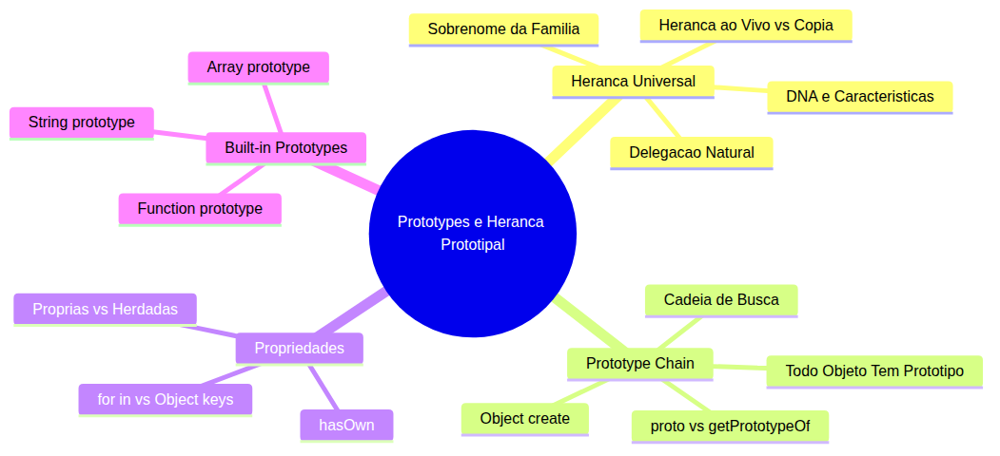
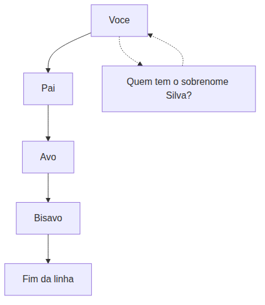
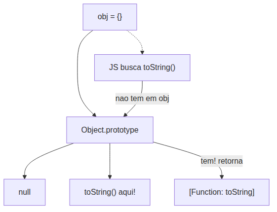
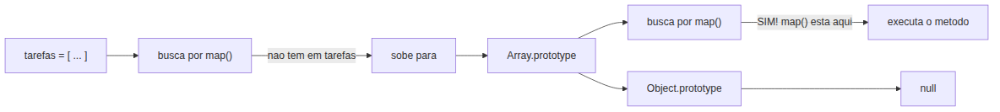
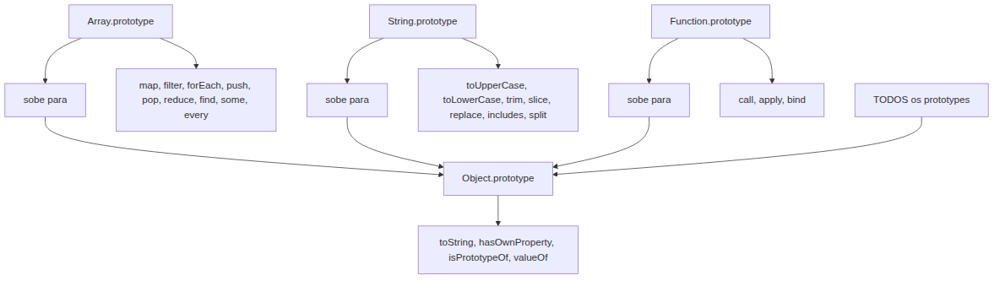

# JavaScript — Do Zero ao Profissional — Aula 15

## Prototypes e Herança Prototipal — O Sistema de Delegação do JavaScript

**Duração estimada:** 95 minutos (50 de leitura + 45 de prática)
**Nível:** Intermediário
**Pré-requisitos:** Aulas 01-14 concluídas — especialmente objetos literais (Aula 12), `this` e métodos (Aula 13), funções avançadas e HOFs (Aula 14), arrays e iteração (Aulas 08-09)

---

## Objetivos de Aprendizagem

Ao final desta aula, você será capaz de:

- [ ] **Explicar** o conceito universal de herança de características — objetos "herdam" propriedades e comportamentos de um ancestral, como filhos herdam o sobrenome dos pais
- [ ] **Definir** protótipo como o "objeto ancestral" do qual um objeto herda propriedades e métodos automaticamente, sem precisar copiá-los
- [ ] **Criar** objetos com protótipo específico usando `Object.create()`, demonstrando que propriedades definidas no protótipo estão acessíveis no objeto criado
- [ ] **Distinguir** entre `__proto__` (acesso legado) e `Object.getPrototypeOf()` (método moderno) para acessar o protótipo de um objeto
- [ ] **Descrever** a cadeia de protótipos (prototype chain) e como o JavaScript "sobe" a cadeia — objeto → protótipo → protótipo do protótipo → … → `Object.prototype` → `null` — ao buscar uma propriedade
- [ ] **Identificar** propriedades próprias vs. propriedades herdadas usando `Object.hasOwn()`
- [ ] **Comparar** `for...in` (que percorre propriedades próprias E herdadas enumeráveis) com `Object.keys()` (apenas propriedades próprias enumeráveis)
- [ ] **Explicar** por que `[1,2,3].map(x => x * 2)` funciona — porque `Array.prototype` contém `.map()`, e todo array delega para `Array.prototype`
- [ ] **Descrever** o mecanismo de delegação de comportamento — quando um objeto não possui uma propriedade ou método, o JavaScript automaticamente busca no protótipo
- [ ] **Aplicar** o conhecimento de prototype chain para explicar built-in prototypes: `Array.prototype`, `String.prototype`, `Function.prototype`, `Object.prototype`

---

## Como Usar Esta Aula

Esta aula está organizada em duas partes. A **primeira parte** constrói a intuição sobre herança e delegação com exemplos do cotidiano — sem JavaScript. A **segunda parte** aplica esses conceitos na linguagem, mostrando como o sistema de prototypes implementa exatamente o mesmo mecanismo.

Ao longo do caminho, você encontrará seções **"Mão na Massa"** (para abrir o console e praticar) e **"Quick Check"** (para verificar se entendeu antes de avançar). Ao final, o arquivo separado **Questões de Aprendizagem** traz as tarefas de checkpoint — só avance para a Aula 16 quando conseguir completá-las por conta própria.

**Tempo estimado:** 50 minutos de leitura + 45 minutos de prática.

---

## Mapa Mental

Este diagrama mostra todos os conceitos que você vai dominar nesta aula:



> *O mapa mental acima mostra a estrutura da aula. Cada ramo representa um conceito que você vai explorar. Começamos com herança universal (Parte 1), depois aplicamos ao JavaScript (Parte 2).*

---

## Recapitulação da Aula 14

| Aula | Conceito | Onde aparece nesta aula | Como se conecta |
|---|---|---|---|
| Aula 14 | **Arrow functions e HOFs** (Seções 1-5) | Seção 9 | Os métodos que você aprendeu (`.map()`, `.filter()`, `.forEach()`) vivem em `Array.prototype` — agora você vai entender POR QUE eles existem em todo array |
| Aula 14 | **`.map()` e `.filter()`** (Seção 4) | Seções 7, 9 | Você já usa `tarefas.map(t => t.texto)` no Gerenciador. Esta aula revela o mecanismo: prototype chain |
| Aula 14 | **Method chaining** (Seção 8) | Seção 7 | O encadeamento `.filter().map().forEach()` só é possível porque cada método retorna um novo array, que HERDA os mesmos métodos de `Array.prototype` |
| Aula 12 | **Objetos literais** (Seções 1-3) | Seções 4, 5, 8 | Objetos também têm protótipos — e é por isso que `{}.toString()` funciona mesmo sem você ter definido `toString` |

---

**FUNDAMENTOS: Herança de Características — DNA, Família e Delegação**

> *Os conceitos desta seção são universais — valem para qualquer situação onde algo "herda" características de algo que veio antes. Na segunda parte, você verá como JavaScript implementa esse sistema com prototypes.*

---

## 1. "De Quem Você Herdou Isso?" — O Conceito Universal de Herança

O que significa "herdar" alguma coisa? No dia a dia, usamos essa palavra o tempo todo: "herdei o cabelo da minha mãe", "ela herdou o talento musical do avô", "a empresa herda as dívidas do antigo dono". Em todos esses casos, o significado é o mesmo: **algo que você tem sem ter criado — veio de alguém antes de você**.

Herança é um mecanismo de compartilhamento. Um ente "descendente" herda automaticamente características de um ente "ancestral", sem precisar copiá-las uma a uma. Se uma característica não está no descendente, "sobe-se" ao ancestral para buscá-la.

### Três Analogias para Fixar

**DNA e características físicas.** Você tem cor dos olhos, tipo sanguíneo e uma série de características que não "programou" — simplesmente herdou dos seus pais. Se alguém perguntar "qual seu tipo sanguíneo?" e você não souber, a resposta está nos seus pais. Você não carrega uma cópia do genoma dos seus pais dentro de você — você É uma expressão dele.

**Sobrenome de família.** Este é o exemplo mais direto. Imagine que seu sobrenome é "Silva". Você não definiu "Silva" como seu sobrenome — você o herdou. Seu pai também herdou do seu avô. O avô herdou do bisavô. E assim por diante. Agora pense: se alguém perguntar "qual seu sobrenome?", você responde "Silva" sem precisar ter criado esse sobrenome. A busca "sobe" na árvore genealógica até encontrar um ancestral que tenha definido o sobrenome.

**Carteira Nacional de Habilitação (CNH).** Todo motorista habilitado pode dirigir em vias públicas — essa é a permissão BASE. As categorias (A, B, C, D, E) HERDAM essa permissão base e ADICIONAM permissões específicas (moto, caminhão, ônibus). Um motorista categoria B não precisa "redefinir" que pode dirigir em via pública — isso já veio da permissão base herdada. Ela só adiciona o que é específico: carros de passeio.

O que essas três histórias têm em comum? **Uma característica definida em um ancestral está automaticamente disponível no descendente, sem duplicação.**

Veja o diagrama abaixo. Imagine uma árvore genealógica simples:



Quando alguém pergunta "qual seu sobrenome?", a busca funciona assim: você verifica se tem um sobrenome próprio (não tem). Então pergunta ao seu pai. Ele também não definiu um — herdou do avô. O avô também herdou. A busca sobe até o bisavô, que foi quem definiu "Silva". Pronto — encontrou. Você pode responder "Silva" mesmo sem ter criado esse sobrenome.

Se um ancestral tivesse mudado de sobrenome (digamos, o avô mudou para "Pereira"), todos os descendentes REFLETIRIAM essa mudança automaticamente. Porque herança não é cópia — é uma ligação viva.

### Quick Check 1

**1. Você acabou de criar um objeto `filho` que não tem a propriedade `sobrenome`. No entanto, `filho.sobrenome` retorna "Silva". Como isso é possível, considerando o conceito de herança?**
**Resposta:** Isso só é possível se `filho` tiver um "ancestral" (protótipo) que define `sobrenome`. Quando JavaScript não encontra a propriedade no próprio objeto, ele automaticamente busca no ancestral — e encontra "Silva" lá. O objeto "herdou" o valor sem precisar copiá-lo.

**2. Na analogia da CNH, por que um motorista categoria C (caminhão) não precisa redefinir que "pode dirigir em vias públicas"?**
**Resposta:** Porque a permissão de dirigir em vias públicas é a característica BASE, definida no ancestral "CNH". A categoria C HERDA essa permissão automaticamente e só adiciona o que é específico (caminhões). Se a permissão base mudasse (ex: velocidade máxima), todas as categorias seriam afetadas.

---

## 2. Delegação — "Se Eu Não Tenho, Pergunto a Quem Está Acima"

Você já entendeu o conceito de herança: características passam de ancestral para descendente. Agora vamos entender o mecanismo que torna isso prático: **delegação**.

Delegação é o processo de "perguntar para cima". Quando um ente não possui uma característica ou habilidade, ele automaticamente delega a pergunta para seu ancestral. Isso evita duplicação e mantém consistência — se o ancestral muda, todos os descendentes "veem" a mudança.

### Três Analogias de Delegação

**Formulário de cadastro com valores padrão.** Imagine um site de compras. Você preenche seu nome e CPF (informações suas, específicas). Mas o campo "moeda" já vem preenchido com "BRL". Você não digitou "BRL" — ele veio do sistema, do contexto-pai. Se a empresa mudar a moeda padrão para "USD", amanhã todos os formulários novos já virão com "USD". Isso é delegação: você usou um valor que não definiu, mas que está disponível porque o sistema-pai definiu.

**Manual do funcionário.** Um funcionário novo não carrega uma cópia impressa do manual de conduta da empresa. Quando tem dúvida sobre uma regra (ex: "qual o horário de almoço?"), ele não precisa ter a regra gravada na cabeça — ele delega a pergunta ao manual. Se a empresa atualizar o manual (ex: "agora o almoço é 1h em vez de 30min"), todos os funcionários são afetados automaticamente.

**Configurações de um aplicativo.** As configurações "padrão de fábrica" do seu celular são herdadas por todos os apps. Um app pode SOBRESCREVER uma configuração específica (ex: "modo escuro ligado"), mas se não sobrescrever, usa o padrão do sistema. Se a Apple mudar a fonte padrão do iOS, todos os apps que não definiram fonte própria vão refletir a mudança.

Percebe o padrão? **O descendente não possui a característica, mas TEM ACESSO a ela através do ancestral.** Isso é fundamentalmente diferente de "copiar" a característica.

### O Poder da Consistência

Delegação resolve um problema enorme: **manter tudo sincronizado**. Se cada funcionário tivesse uma cópia impressa do manual, quando a empresa atualizasse as regras, precisaria:

1. Reimprimir milhares de cópias
2. Distribuir para todo mundo
3. Garantir que cada funcionário substituísse a cópia antiga pela nova
4. Achar os que perderam a cópia

Com delegação, a empresa atualiza UMA VEZ o manual central, e todos os funcionários automaticamente "veem" a nova regra. Sem cópias, sem distribuição, sem erros de versão.

### Quick Check 2

**1. Qual a diferença fundamental entre um objeto "herdar" uma propriedade e ele ter uma "cópia" dessa propriedade?**
**Resposta:** Se o objeto herda, ele não possui a propriedade — ele apenas TEM ACESSO a ela através do ancestral. Se o ancestral mudar a propriedade, o objeto vê a mudança. Se o objeto tivesse uma cópia, mudanças no ancestral não afetariam a cópia — ela estaria "congelada" no momento da cópia.

**2. Na analogia do formulário de cadastro, o que acontece se a empresa mudar a moeda padrão de "BRL" para "USD"?**
**Resposta:** Todos os formulários novos automaticamente exibirão "USD". Nenhum formulário individual precisa ser atualizado — a mudança acontece no ancestral (a configuração do sistema), e todos os descendentes (formulários) veem a mudança por delegação.

---

## 3. Herança é "Ao Vivo" — Diferente de Cópia

Este é o ponto mais sutil e importante da Parte 1: **herança é uma ligação ativa, não uma fotografia**. Quando você herda algo, você não está segurando uma cópia estática — você está conectado a uma fonte viva que pode mudar.

### Fotocópia vs. Link

Pense numa fotocópia de um documento. Se o documento original for atualizado (ex: correção de um endereço), a fotocópia continua mostrando o endereço antigo. A fotocópia é uma FOTO — independente do original depois de criada.

Agora pense num LINK para um arquivo no Google Drive. Se você abre o link, vê a versão MAIS RECENTE do arquivo. Se o dono editar o arquivo, da próxima vez que você abrir o link, verá a versão atualizada. O link é uma CONEXÃO VIVA.

**Herança funciona como um link, não como uma fotocópia.** Quando um objeto herda de outro, ele está ligado ao ancestral. Se o ancestral mudar, a mudança é refletida no descendente.

### Aplicação na Vida Real

**Sobrenome e casamento.** Imagine uma família onde o pai muda de sobrenome ao casar (em algumas culturas, o marido adota o sobrenome da esposa). Os filhos, que já existiam antes do casamento, automaticamente "herdam" o novo sobrenome do pai — a mudança no ancestral se propaga para os descendentes.

> *Isso só é possível porque a herança é uma conexão viva, não uma cópia tirada no nascimento. Se cada filho tivesse uma "fotocópia" do sobrenome do pai, cada um precisaria atualizar manualmente.*

### Por Que Isso Importa

Esta distinção vai ser crucial na Parte 2, quando você aprender que em JavaScript, modificar o prototype de um objeto afeta TODOS os objetos que herdam dele. É o que torna prototypes uma ferramenta de compartilhamento poderosa: você adiciona um método no prototype UMA VEZ, e todos os objetos ganham acesso a ele automaticamente.

---

*Até aqui, você já entendeu três ideias fundamentais: (1) herança é passar características de ancestral para descendente, (2) delegação é "perguntar para cima" quando algo não está disponível, e (3) herança é uma conexão viva, não uma cópia. Isso já é MUITO. Respire. Se algo não ficou claro, releia a seção anterior — não tem problema nenhum voltar. Agora vamos ver como JavaScript implementa exatamente esse sistema com prototypes.*

---

**APLICAÇÃO: Prototype Chain no JavaScript — Herança com Código**

> *Agora que você entende herança, delegação e a diferença entre herdar e copiar, vamos conectar esses conceitos à prática com JavaScript. Tudo o que você aprendeu na Parte 1 se materializa no sistema de prototypes do JS.*

---

## 4. Todo Objeto Tem um Protótipo — A Ligação Invisível

Você já escreveu `{}.toString()` no console, certo? Talvez até sem pensar muito. Mas já parou para se perguntar: **de onde veio esse `toString`?**

Você não o definiu. O objeto está vazio — `{}`. E ainda assim, `toString` funciona. Como?

**Em JavaScript, TODO objeto tem uma ligação interna para outro objeto, chamada `[[Prototype]]`. Essa ligação é o que permite a herança.** Quando você acessa uma propriedade em um objeto e ela não existe nele, o JavaScript automaticamente busca no `[[Prototype]]`. E se não encontrar lá, busca no protótipo do protótipo, e assim por diante.

### A Primeira Demonstração

Abra o console do navegador (F12) e digite:

```javascript
const obj = {};
console.log(obj.toString);
```

O que aparece? `[Function: toString]`. Uma função! Mas de onde? Você não colocou `toString` no `obj`. O que aconteceu foi:

1. JavaScript tentou encontrar `toString` em `obj`
2. Não encontrou
3. Automaticamente subiu para o protótipo de `obj`
4. Encontrou `toString` lá
5. Retornou a função

Vamos confirmar que `toString` NÃO é uma propriedade do próprio `obj`:

```javascript
console.log(obj.hasOwnProperty('toString')); // false
```

Retorna `false`. `toString` não pertence a `obj`. É uma propriedade HERDADA.

> *Nota: `hasOwnProperty` é o método herdado de `Object.prototype`. Na Seção 8, você aprenderá `Object.hasOwn()`, a versão moderna recomendada para código novo.*

### Mas Quem é Esse Protótipo?

Para objetos literais (criados com `{}`), o protótipo é **`Object.prototype`**. Pense nele como o "ancestral comum" de todos os objetos em JavaScript. É nele que vivem métodos como `toString()`, `hasOwnProperty()`, `valueOf()` e `isPrototypeOf()`.



O diagrama mostra o caminho: `obj` → `Object.prototype` → `null`. Quando você acessa uma propriedade em `obj`, JavaScript sobe essa cadeia até encontrar a propriedade ou chegar em `null`.

> *Se você reparou, `Object.prototype` aponta para `null`. Isso é o fim da linha — o último ancestral que não tem protótipo próprio. Toda prototype chain termina em `null`.*

### Quick Check 3

**1. Por que `{}.toString()` funciona, mesmo sem você ter definido `toString` no objeto?**
**Resposta:** Porque todo objeto literal tem `Object.prototype` como seu protótipo. O método `toString()` vive em `Object.prototype`. Quando JavaScript não encontra `toString` no objeto, sobe para o protótipo e encontra lá.

**2. O que acontece quando JavaScript chega ao final da prototype chain (`null`) e ainda não encontrou a propriedade?**
**Resposta:** JavaScript retorna `undefined`. A propriedade simplesmente não existe em nenhum nível da cadeia.

---

## 5. `Object.create()` — Criando Objetos com Protótipo Específico

Agora que você sabe que todo objeto tem um protótipo, a pergunta natural é: **como criar um objeto com um protótipo específico?** A resposta é `Object.create(proto)`.

`Object.create(proto)` cria um objeto novo cujo `[[Prototype]]` é exatamente o objeto `proto` que você passou como argumento. É a forma mais pura e explícita de criar herança prototipal em JavaScript — você define, manualmente, qual será o "pai" do novo objeto.

### Mão na Massa 1 — Criando Herança com Object.create()

Abra o console do navegador e acompanhe cada passo:

```javascript
// Passo 1: criar um objeto "pessoa" com propriedades e um método
const pessoa = {
  especie: 'humana',
  saudacao() {
    return 'Ola!';
  }
};

// Passo 2: criar "aluno" que herda de "pessoa"
const aluno = Object.create(pessoa);

// Passo 3: adicionar propriedade própria "nome" ao aluno
aluno.nome = 'Ana';

// Passo 4: verificar
console.log(aluno.nome);         // 'Ana' — propriedade PRÓPRIA
console.log(aluno.especie);      // 'humana' — propriedade HERDADA de pessoa!
console.log(aluno.saudacao());   // 'Ola!' — método HERDADO de pessoa!
```

**O que acabou de acontecer?**

- `aluno` é um objeto NOVO, vazio, com uma exceção: sua ligação interna `[[Prototype]]` aponta para `pessoa`
- Quando você acessa `aluno.nome`, JavaScript encontra a propriedade no próprio `aluno` — retorna 'Ana'
- Quando você acessa `aluno.especie`, JavaScript NÃO encontra em `aluno`. Então sobe para o protótipo (`pessoa`), encontra lá, retorna 'humana'
- Quando você chama `aluno.saudacao()`, mesma coisa: não está em `aluno`, sobe para `pessoa`, encontra o método, executa

```javascript
// Passo 5: modificar o pai e ver o reflexo
pessoa.especie = 'humana atualizada';
console.log(aluno.especie);      // 'humana atualizada' — herança ao vivo!
```

Percebeu? Mudou em `pessoa`, refletiu em `aluno`. **Isso é herança ao vivo**, exatamente como discutimos na Parte 1.

Para verificar a ligação:

```javascript
console.log(Object.getPrototypeOf(aluno) === pessoa); // true
```

### Cuidado: Arrays Compartilhados no Protótipo

```javascript
const usuario = {
  tipo: 'visitante',
  permissoes: ['ler']
};

const admin = Object.create(usuario);
admin.nome = 'Carlos';
admin.permissoes.push('escrever', 'deletar');

console.log(admin.nome);               // 'Carlos' — própria
console.log(admin.tipo);               // 'visitante' — herdada
console.log(admin.permissoes);         // ['ler', 'escrever', 'deletar']
```

> *Atenção: `permissoes` foi modificada no próprio `admin`? Não exatamente. `admin.permissoes` encontrou o array no protótipo (`usuario`), e `.push()` modificou o array do protótipo. Isso é uma PEGADINHA comum: objetos mutáveis no protótipo são compartilhados entre todos os descendentes. Se um descendente modificar, TODOS veem a mudança.*

---

## 6. Acessando o Protótipo — `__proto__` vs `Object.getPrototypeOf()`

Existem duas formas de acessar o `[[Prototype]]` de um objeto. Uma é legada e não recomendada; a outra é moderna e preferida.

### `__proto__` — O Caminho Legado

```javascript
const obj = {};
console.log(obj.__proto__); // objeto prototype
```

`__proto__` é um getter/setter que foi implementado por navegadores por razões históricas. Quase todo objeto tem essa propriedade de acesso. **Mas ela não é recomendada para código novo.** Por quê?

1. **Não funciona em objetos sem protótipo.** Se você criar um objeto com `Object.create(null)`, ele não tem `__proto__` — retorna `undefined`
2. **A performance pode ser pior.** O engine precisa fazer verificações extras
3. **A especificação oficial desencoraja seu uso.** É considerado "legado"

### `Object.getPrototypeOf()` — O Caminho Moderno

```javascript
const obj = {};
console.log(Object.getPrototypeOf(obj)); // Object.prototype
```

`Object.getPrototypeOf(obj)` é o método estático moderno, padronizado e recomendado para acessar o protótipo de um objeto. Funciona SEMPRE, independentemente de como o objeto foi criado.

### Tabela Comparativa

| Característica | `__proto__` | `Object.getPrototypeOf()` |
|---|---|---|
| Tipo | Propriedade de acesso (getter/setter) | Método estático |
| Recomendado? | Nao, legado, evitar em codigo novo | Sim, moderno, use este |
| Funciona em `Object.create(null)`? | Nao (objeto sem prototipo nao tem `__proto__`) | Sim |
| Leitura | `obj.__proto__` | `Object.getPrototypeOf(obj)` |
| Escrita | `obj.__proto__ = proto` (evitar!) | `Object.setPrototypeOf(obj, proto)` (cuidado!) |

### Mão na Massa 2 — Explorando Protótipos

Abra o console e execute:

```javascript
// Passo 1: arrays herdam de Array.prototype
const arr = [1, 2, 3];
console.log(Object.getPrototypeOf(arr) === Array.prototype); // true

// Passo 2: Array.prototype herda de Object.prototype
console.log(Object.getPrototypeOf(Array.prototype) === Object.prototype); // true

// Passo 3: Object.prototype é o fim da cadeia
console.log(Object.getPrototypeOf(Object.prototype)); // null

// Passo 4: objetos sem protótipo
const vazio = Object.create(null);
console.log(Object.getPrototypeOf(vazio)); // null

// Passo 5: __proto__ não funciona em vazio
console.log(vazio.__proto__); // undefined
```

**O que você acabou de descobrir:**

- `arr` tem `Array.prototype` como protótipo
- `Array.prototype` tem `Object.prototype` como protótipo
- `Object.prototype` tem `null` como protótipo — **fim da cadeia!**
- A cadeia completa: `arr` → `Array.prototype` → `Object.prototype` → `null`

Isso significa que um array herda métodos de `Array.prototype` (como `.map()`, `.filter()`, `.push()`) E também herda métodos de `Object.prototype` (como `.toString()`, `.hasOwnProperty()`).

---

## 7. A Cadeia de Protótipos (Prototype Chain)

Agora você tem todos os ingredientes para entender o mecanismo central desta aula: **a prototype chain**.

A prototype chain é o caminho que o JavaScript percorre ao buscar uma propriedade. Começa no próprio objeto, sobe para o protótipo, depois para o protótipo do protótipo, e assim por diante, até encontrar a propriedade ou chegar a `null` (retorna `undefined`).

### A Busca Visualizada

Vamos pegar o exemplo que você mais usa no Gerenciador de Tarefas:

```javascript
const tarefas = [
  { texto: 'Estudar JS', concluida: false },
  { texto: 'Fazer exercicios', concluida: true }
];

tarefas.map(t => t.texto); // ['Estudar JS', 'Fazer exercicios']
```

Você escreve `tarefas.map()`. Como JavaScript encontra `.map()`?



O caminho é:

1. JavaScript procura `.map()` no próprio array `tarefas` → **não encontra**
2. Sobe para `Array.prototype` (protótipo de todo array) → **encontra `.map()` lá!**
3. Executa o método

Vamos confirmar isso no console:

```javascript
const arr = [1, 2, 3];
console.log(arr.map);                               // [Function: map] — veio de onde?
console.log(arr.hasOwnProperty('map'));             // false — não é propriedade própria
console.log(Array.prototype.hasOwnProperty('map')); // true — é de Array.prototype!
```

A prova está aí: `arr.map` existe, mas não é uma propriedade própria de `arr`. É uma propriedade de `Array.prototype`. O JavaScript a encontrou subindo a cadeia.

### A Analogia da Empresa

Imagine uma empresa com três níveis hierárquicos:

- **Você (funcionário)** — `[1, 2, 3]`
- **Seu chefe imediato** — `Array.prototype`
- **Gerente geral** — `Object.prototype`

Você precisa de uma chave para abrir o armário de servidores. Pergunta a si mesmo: "tenho a chave?" (não tem). Pergunta ao seu chefe imediato: "tem a chave?" (sim, `.map()` está aqui!). Pronto — encontrou. Você nem precisou perguntar ao gerente geral.

Se o chefe imediato também não tivesse a chave, a pergunta subiria para o gerente geral (`Object.prototype`). Se ele também não tivesse, subiria para `null` — e a resposta seria `undefined` (ninguém tem essa chave).

### Por Que Isso Muda Tudo

Agora você entende por que `.map()`, `.filter()`, `.forEach()` funcionam em QUALQUER array:

- **Não é mágica.** É prototype chain.
- **Não é sorte.** É herança prototipal.
- **Não é coincidência.** É delegação.

Todo array herda de `Array.prototype`, e `Array.prototype` contém todos os métodos de array. Você não precisa recriar `.map()` para cada array — ele está lá, herdado, disponível por delegação.

### Quick Check 4

**1. O JavaScript sobe a prototype chain quando NÃO encontra uma propriedade. Em que ponto ele PARA de subir?**
**Resposta:** Ele para em UM de dois pontos: (a) quando encontra a propriedade em algum nível da cadeia, retornando seu valor; ou (b) quando chega a `null` (fim da cadeia), retornando `undefined`.

**2. Quando você chama `[1, 2, 3].map(fn)`, JavaScript encontra `.map()` no próprio array. Verdadeiro ou falso?**
**Resposta:** Falso. JavaScript NÃO encontra `.map()` no próprio array — o array em si não tem a propriedade `map`. JavaScript sobe para `Array.prototype`, onde `.map()` está definido, e o executa no contexto do array.

---

## 8. Propriedades Próprias vs. Herdadas — `Object.hasOwn()`, `for...in` e `Object.keys()`

Nem toda propriedade acessível em um objeto PERTENCE a ele. Algumas são **próprias** (definidas diretamente no objeto) e outras são **herdadas** (vêm do protótipo). Saber distinguir entre as duas é essencial.

### O Problema

```javascript
const pessoa = { especie: 'humana' };
const aluno = Object.create(pessoa);
aluno.nome = 'Ana';

console.log(aluno.nome);     // 'Ana' — propriedade própria de aluno
console.log(aluno.especie);  // 'humana' — PROPRIEDADE HERDADA de pessoa
```

Para o JavaScript, `aluno.nome` e `aluno.especie` são ambas acessíveis. Mas apenas uma DELAS realmente pertence a `aluno`. Como saber qual é qual?

### `Object.hasOwn()` — A Verdade Sobre a Propriedade

`Object.hasOwn(obj, prop)` retorna `true` apenas se a propriedade for PRÓPRIA do objeto (definida diretamente nele). Não sobe a cadeia.

```javascript
console.log(Object.hasOwn(aluno, 'nome'));    // true — própria
console.log(Object.hasOwn(aluno, 'especie')); // false — herdada!
```

### Ferramentas de Inspeção — Tabela Comparativa

| Ferramenta | Proprias? | Herdadas? | Enumeraveis? |
|---|---|---|---|
| `Object.hasOwn(obj, "prop")` | Sim | Nao | Nao importa (verifica existencia) |
| `Object.keys(obj)` | Sim | Nao | Sim |
| `Object.getOwnPropertyNames(obj)` | Sim | Nao | Sim (inclui nao enumeraveis) |
| `for...in` | Sim | Sim | Sim |
| `"prop" in obj` | Sim | Sim | Nao importa |

### Demonstração Interativa

Execute no console:

```javascript
const pessoa = { especie: 'humana' };
const aluno = Object.create(pessoa);
aluno.nome = 'Ana';

console.log(Object.hasOwn(aluno, 'nome'));     // true — propria
console.log(Object.hasOwn(aluno, 'especie'));   // false — herdada
console.log(Object.keys(aluno));                // ['nome'] — so proprias

// for...in inclui herdadas!
for (let chave in aluno) {
  console.log(chave);  // 'nome', 'especie' — TODAS as propriedades
}
```

Percebeu a diferença? `Object.keys()` retorna só `['nome']`. `for...in` retorna `'nome'` E `'especie'`.

> *Você pode estar pensando: "mas isso é um problema! E se eu quiser só as propriedades próprias num `for...in`?"* Sim, é uma pegadinha famosa. A solução: use `Object.hasOwn()` dentro do loop:

```javascript
for (let chave in aluno) {
  if (Object.hasOwn(aluno, chave)) {
    console.log('Propria:', chave);   // 'nome'
  } else {
    console.log('Herdada:', chave);   // 'especie'
  }
}
```

### E o Operador `in`?

O operador `in` verifica SE a propriedade existe (própria ou herdada), retornando `true` ou `false`:

```javascript
console.log('nome' in aluno);    // true — propria
console.log('especie' in aluno); // true — herdada
console.log('toString' in aluno); // true — herdada de Object.prototype!
```

### Quick Check 5

**1. Qual a diferença entre `Object.keys(meuObj)` e `for (let chave in meuObj)`?**
**Resposta:** `Object.keys()` retorna apenas as propriedades PRÓPRIAS enumeráveis do objeto. `for...in` percorre TODAS as propriedades enumeráveis — próprias E herdadas.

**2. `Object.hasOwn(aluno, 'especie')` retorna `false`, mas `'especie' in aluno` retorna `true`. Por que o resultado é diferente?**
**Resposta:** Porque `Object.hasOwn()` verifica APENAS propriedades PRÓPRIAS (não sobe a cadeia), enquanto `in` verifica a EXISTÊNCIA da propriedade subindo toda a prototype chain. `especie` não é própria de `aluno` (então `hasOwn` dá `false`), mas existe no protótipo `pessoa` (então `in` dá `true`).

---

## 9. Built-in Prototypes — O Segredo dos Métodos que Você Já Usa

Chegou a hora da revelação. Você já usa métodos como `.map()`, `.filter()`, `.toUpperCase()`, `.toString()` desde o começo do curso. Mas talvez tratasse isso como "mágica" ou "só funciona". Agora você sabe que não é mágica — é **prototype chain**.

### O Depósito Central de Métodos

Cada tipo built-in do JavaScript (Array, String, Function, Object) tem seus métodos definidos em um prototype específico:

- **`Array.prototype`** — contém `.map()`, `.filter()`, `.forEach()`, `.push()`, `.pop()`, `.reduce()`, `.find()`, `.some()`, `.every()`
- **`String.prototype`** — contém `.toUpperCase()`, `.toLowerCase()`, `.trim()`, `.slice()`, `.replace()`, `.includes()`, `.split()`
- **`Function.prototype`** — contém `.call()`, `.apply()`, `.bind()`
- **`Object.prototype`** — contém `.toString()`, `.hasOwnProperty()`, `.isPrototypeOf()`, `.valueOf()`



Este diagrama mostra a hierarquia completa. Todo prototype, independentemente do tipo, eventualmente aponta para `Object.prototype`. É por isso que até um array tem `.toString()` — herdado de `Object.prototype`.

### Conexão com o Gerenciador de Tarefas

Lembra do Gerenciador que você constrói desde a Aula 12? Você escreve código como este:

```javascript
const tarefas = [
  { texto: 'Estudar JS', concluida: false, prioridade: 'alta' },
  { texto: 'Fazer exercicios', concluida: true, prioridade: 'media' }
];

// Voce USOU isso na Aula 14:
const textos = tarefas.map(t => t.texto);
const pendentes = tarefas.filter(t => !t.concluida);
```

Agora você entende o mecanismo completo:

| Codigo | O que acontece |
|---|---|
| `tarefas.map(...)` | Nao encontra `map` em `tarefas`. Sobe para `Array.prototype`. Encontra. Executa. |
| `tarefas.filter(...)` | Nao encontra `filter` em `tarefas`. Sobe para `Array.prototype`. Encontra. Executa. |
| `tarefas.forEach(...)` | Mesmo caminho: `tarefas` → `Array.prototype` → executa. |

**Isso NÃO é mágica. É prototype chain.** E agora você SABE como funciona.

### Conexão com a Aula 14

Na Aula 14, você aprendeu COMO usar `.map()`, `.filter()`, `.forEach()`, `.reduce()`, `.find()`, `.some()`, `.every()`. Aprendeu a sintaxe, os parâmetros, o valor de retorno. Agora você sabe ONDE eles vivem: todos em `Array.prototype`.

- Aula 14 ensinou o "o que" e o "como"
- Aula 15 revela o "por que" e o "onde"

### Uma Palavra Sobre Protótipos e Strings

Strings em JavaScript são um caso especial. Quando você faz `"texto".toUpperCase()`, o JavaScript temporariamente envolve a string primitiva em um objeto `String`, executa o método (que está em `String.prototype`), e descarta o objeto. Isso chama-se **auto-boxing**:

```javascript
console.log(Object.getPrototypeOf(Object("texto")) === String.prototype); // true
```

> *Na prática, você nunca precisa se preocupar com isso. `"texto".toUpperCase()` simplesmente funciona — o JavaScript cuida do auto-boxing automaticamente.*

### Mão na Massa 3 — Verificando Built-in Prototypes

Execute no console, passo a passo:

```javascript
// Passo 1: arrays herdam de Array.prototype
console.log(Object.getPrototypeOf([1, 2, 3]) === Array.prototype); // true

// Passo 2: strings (quando convertidas para objeto) herdam de String.prototype
console.log(Object.getPrototypeOf(Object("texto")) === String.prototype); // true

// Passo 3: Array.prototype.map existe e é uma função
console.log(typeof Array.prototype.map); // 'function'

// Passo 4: ADICIONAR UM MÉTODO ao Array.prototype
Array.prototype.ultimo = function() {
  return this[this.length - 1];
};

const nums = [10, 20, 30];
console.log(nums.ultimo()); // 30 — o método foi HERDADO!
```

> *ATENÇÃO: Modificar prototypes nativos (Array.prototype, String.prototype, etc.) é considerado MÁ PRÁTICA em produção. Pode causar conflitos com bibliotecas e versões futuras do JavaScript. O exemplo acima é apenas para fins didáticos — NÃO faça isso em código real.*

### Menção Sobre a Aula 16

Você deve estar se perguntando: "e as funções construtoras com `new`?" Elas existem e são uma forma de criar objetos que automaticamente apontam para um prototype específico. Mas a forma mais moderna e legível de fazer isso é com **classes** (`class`), que você vai aprender na **Aula 16**.

Por ora, entenda que quando você usa `new Array()`, o objeto criado automaticamente tem `Array.prototype` como protótipo. O mecanismo de prototype chain é o mesmo — você já domina a base.

### Quick Check 6

**1. Onde exatamente vive o método `.map()` que você usa em arrays?**
**Resposta:** Em `Array.prototype`. Quando você chama `[1,2,3].map(fn)`, JavaScript não encontra `.map()` no próprio array e sobe para `Array.prototype`, onde o método está definido.

**2. Se você adicionar um método novo a `Array.prototype`, qual é o efeito?**
**Resposta:** Todos os arrays existentes e futuros "herdarão" esse método automaticamente, porque a adição foi feita no protótipo (herança ao vivo). Mas isso é má prática em produção.

---

## Autoavaliação: Quiz Rápido

**1. Todo objeto em JavaScript tem um `[[Prototype]]`. Verdadeiro ou falso?**
**Resposta:**

Verdadeiro — com uma exceção: objetos criados com `Object.create(null)` não têm protótipo (seu `[[Prototype]]` é `null`).

**2. O que `Object.getPrototypeOf(obj)` retorna? E o que retorna se `obj` foi criado com `Object.create(null)`?**
**Resposta:**

Retorna o protótipo de `obj` (o valor de `[[Prototype]]`). Para `Object.create(null)`, retorna `null` — o objeto não tem protótipo.

**3. Qual a diferença entre `__proto__` e `Object.getPrototypeOf()`?**
**Resposta:**

`__proto__` é uma propriedade de acesso legada (getter/setter), não recomendada para código novo. `Object.getPrototypeOf()` é o método estático moderno, que funciona em todos os objetos, inclusive os criados com `Object.create(null)`.

**4. O que `Object.hasOwn(obj, 'prop')` retorna se `prop` é herdada do protótipo?**
**Resposta:**

Retorna `false`. `Object.hasOwn()` verifica APENAS propriedades PRÓPRIAS — não sobe a cadeia de protótipos.

**5. `for...in` percorre apenas propriedades próprias de um objeto. Verdadeiro ou falso?**
**Resposta:**

Falso. `for...in` percorre TODAS as propriedades enumeráveis — próprias E herdadas.

**6. Por que `[1, 2, 3].toString()` funciona, mesmo que `toString` não esteja definido no array?**
**Resposta:**

Porque `toString` está definido em `Object.prototype`. JavaScript sobe a cadeia: `[1,2,3]` → `Array.prototype` → `Object.prototype` → encontra `toString` lá.

**7. Se você criar `const a = {}`, qual é a prototype chain completa de `a`?**
**Resposta:**

`a` → `Object.prototype` → `null`. Objetos literais têm `Object.prototype` como protótipo, e `Object.prototype` não tem protótipo (aponta para `null`).

---

## Mão na Massa 4: Exercícios Graduados

### Exercício 1 (Fácil) — Criando e Verificando Herança

Crie dois objetos: `animal` com propriedade `tipo: 'mamifero'` e método `emitirSom()` que retorna `'Som generico'`. Depois crie `cachorro` que herda de `animal` usando `Object.create()`, adicione a propriedade `nome: 'Rex'`, e sobrescreva o método `emitirSom()` para retornar `'Au au!'`.

Verifique:
1. `cachorro.nome` retorna `'Rex'`
2. `cachorro.tipo` retorna `'mamifero'` (herdado)
3. `cachorro.emitirSom()` retorna `'Au au!'` (sobrescrito)
4. `Object.hasOwn(cachorro, 'tipo')` retorna `false`
5. `'tipo' in cachorro` retorna `true`

**Gabarito:**

```javascript
const animal = {
  tipo: 'mamifero',
  emitirSom() {
    return 'Som generico';
  }
};

const cachorro = Object.create(animal);
cachorro.nome = 'Rex';
cachorro.emitirSom = function() {
  return 'Au au!';
};

// Verificacoes
console.log(cachorro.nome);         // 'Rex' — propria
console.log(cachorro.tipo);         // 'mamifero' — herdada
console.log(cachorro.emitirSom());  // 'Au au!' — sobrescrita no proprio objeto
console.log(Object.hasOwn(cachorro, 'tipo'));  // false — tipo nao e propria
console.log('tipo' in cachorro);               // true — mas existe no prototype
```

> *Explicação:* Quando adicionamos `emitirSom` diretamente ao `cachorro`, essa propriedade "sombreia" (ou "sobrescreve") a do protótipo. JavaScript encontra a versão própria primeiro e nem sobe na cadeia. `tipo` nunca foi definida em `cachorro` — só existe no protótipo `animal`.

### Exercício 2 (Médio) — Diagnosticando a Cadeia

Dado o código abaixo, responda: qual é a saída de cada `console.log`?

```javascript
const veiculo = { rodas: 4, tipo: 'generico' };
const moto = Object.create(veiculo);
moto.rodas = 2;
moto.tipo = 'esportiva';

const minhamoto = Object.create(moto);
minhamoto.marca = 'Honda';

console.log(minhamoto.rodas);
console.log(minhamoto.tipo);
console.log(minhamoto.marca);
console.log(Object.hasOwn(minhamoto, 'rodas'));
console.log(Object.hasOwn(moto, 'tipo'));
console.log('rodas' in minhamoto);
```

**Gabarito:**

```javascript
// 1. minhamoto.rodas → 2
// Busca em minhamoto: nao tem 'rodas'. Sobe pra moto: tem 'rodas = 2'. Retorna 2.

// 2. minhamoto.tipo → 'esportiva'
// Busca em minhamoto: nao tem 'tipo'. Sobe pra moto: tem 'tipo = esportiva'. Retorna.

// 3. minhamoto.marca → 'Honda'
// Propria de minhamoto. Retorna direto.

// 4. Object.hasOwn(minhamoto, 'rodas') → false
// 'rodas' nao e PRORIA de minhamoto — esta em moto.

// 5. Object.hasOwn(moto, 'tipo') → true
// 'tipo' foi definida DIRETAMENTE em moto (moto.tipo = 'esportiva').

// 6. 'rodas' in minhamoto → true
// O operador 'in' sobe a cadeia. Nao encontra em minhamoto, encontra em moto.
```

> *Explicação:* Este exercício mostra como a sombra (shadowing) funciona na cadeia. `moto.rodas = 2` criou uma propriedade PRÓPRIA em `moto`, que "esconde" o valor `4` herdado de `veiculo`. `minhamoto` não tem `rodas` própria — então busca no protótipo (`moto`) e encontra `2`.

### Desafio (Difícil) — Simulando um Sistema de Permissões com Prototype Chain

Crie um sistema de três níveis de herança para representar permissões em um sistema:

1. **`usuarioBase`** — tem `permissoes: ['login']` e método `temPermissao(p)` que verifica se a permissão está no array
2. **`moderador`** — herda de `usuarioBase`, adiciona as permissões `['editar', 'excluir']` ao array herdado (cuidado com a pegadinha!)
3. **`admin`** — herda de `moderador`, adiciona `['gerenciarUsuarios', 'configurarSistema']`

Regras:
- `admin.temPermissao('login')` deve retornar `true` (herdada da base)
- `admin.temPermissao('excluir')` deve retornar `true` (herdada do moderador)
- `admin.temPermissao('configurarSistema')` deve retornar `true` (própria do admin)
- Modificar `admin.permissoes` NÃO deve afetar o array de `usuarioBase`

**Gabarito:**

```javascript
// Solucao correta — criando UM NOVO array em cada nivel
const usuarioBase = {
  permissoes: ['login'],
  temPermissao(p) {
    return this.permissoes.includes(p);
  }
};

const moderador = Object.create(usuarioBase);
// MUDEI DE IDEA: criar NOVO array em vez de modificar o herdado
moderador.permissoes = [...usuarioBase.permissoes, 'editar', 'excluir'];

const admin = Object.create(moderador);
admin.permissoes = [...moderador.permissoes, 'gerenciarUsuarios', 'configurarSistema'];

// Testes
console.log(admin.temPermissao('login'));                // true — herdada via moderador -> usuarioBase
console.log(admin.temPermissao('excluir'));               // true — herdada via moderador
console.log(admin.temPermissao('configurarSistema'));     // true — propria
console.log(admin.temPermissao('voar'));                  // false — nao existe

// Verificar que usuarioBase nao foi modificado
console.log(usuarioBase.permissoes);                      // ['login'] — intacto!
console.log(moderador.permissoes);                        // ['login', 'editar', 'excluir']
```

> *Explicacao:* A pegadinha está no array compartilhado. Se tivéssemos feito `moderador.permissoes.push('editar')`, estaríamos modificando o array de `usuarioBase` — porque `moderador.permissoes` encontra o array no protótipo (`usuarioBase.permissoes`) e o modifica. A solução é criar UM NOVO ARRAY em cada nível com o spread operator (`[...array]`), o que quebra a ligação com o protótipo para essa propriedade específica.

---

## Resumo da Aula

### Os 7 Conceitos Fundamentais

1. **Herança universal**: características passam de ancestral para descendente automaticamente. Se o descendente não tem, "sobe" para o ancestral. (Seção 1)

2. **Delegação**: quando um objeto não possui uma propriedade, ele automaticamente "delega" a busca para seu protótipo. Isso evita duplicação e mantém consistência. (Seção 2)

3. **Herança é "ao vivo"**: diferente de cópia. Mudanças no protótipo refletem em todos os descendentes imediatamente. (Seção 3)

4. **Todo objeto tem protótipo**: a ligação interna `[[Prototype]]` conecta cada objeto ao seu ancestral. Objetos literais têm `Object.prototype`. (Seção 4)

5. **`Object.create(proto)`**: cria um novo objeto cujo protótipo é o objeto passado como argumento — a forma mais explícita de herança prototipal. (Seção 5)

6. **Prototype chain**: cadeia de protótipos que JavaScript percorre na busca por propriedades: objeto → protótipo → protótipo do protótipo → ... → `Object.prototype` → `null`. (Seções 6-7)

7. **Propriedades próprias vs herdadas**: `Object.hasOwn()` distingue as duas. `for...in` percorre ambas. `Object.keys()` percorre só próprias. (Seção 8)

### O Que Você Aprendeu Hoje

- [x] Entender herança e delegação como conceitos universais
- [x] Usar `Object.create()` para criar objetos com protótipo específico
- [x] Acessar o protótipo com `Object.getPrototypeOf()` (moderno) e entender por que `__proto__` não é recomendado
- [x] Descrever a prototype chain completa de um array: array → `Array.prototype` → `Object.prototype` → `null`
- [x] Distinguir propriedades próprias de herdadas com `Object.hasOwn()`
- [x] Explicar por que `tarefas.map()` funciona (delegação para `Array.prototype`)
- [x] Identificar os built-in prototypes: `Array.prototype`, `String.prototype`, `Function.prototype`, `Object.prototype`

---

## Próxima Aula

**Aula 16: Classes — Sintaxe Moderna (ES6+)**

Você domina o sistema de prototypes — o mecanismo fundamental de herança do JavaScript. Agora vai aprender a sintaxe moderna de **classes** (`class`, `constructor`, `extends`, `super`). As classes são "açúcar sintático" sobre prototypes: usam o mesmo mecanismo por baixo, mas com uma sintaxe mais limpa e familiar para quem vem de outras linguagens. Você vai refatorar o modelo de tarefas do Gerenciador para usar classes.

---

## Referências

### Documentação Oficial

- [MDN: Object prototypes](https://developer.mozilla.org/en-US/docs/Learn_web_development/Extensions/Advanced_JavaScript_objects/Object_prototypes) — guia oficial da Mozilla
- [MDN: Inheritance and the prototype chain](https://developer.mozilla.org/en-US/docs/Web/JavaScript/Inheritance_and_the_prototype_chain) — referência completa
- [MDN: Object.create()](https://developer.mozilla.org/en-US/docs/Web/JavaScript/Reference/Global_Objects/Object/create) — documentação do método
- [MDN: Object.getPrototypeOf()](https://developer.mozilla.org/en-US/docs/Web/JavaScript/Reference/Global_Objects/Object/getPrototypeOf) — documentação do método
- [MDN: Object.hasOwn()](https://developer.mozilla.org/en-US/docs/Web/JavaScript/Reference/Global_Objects/Object/hasOwn) — documentação do método
- [MDN: for...in](https://developer.mozilla.org/en-US/docs/Web/JavaScript/Reference/Statements/for...in) — documentação da declaração

### Artigos para Aprofundamento

- [JavaScript.info: Prototypal inheritance](https://javascript.info/prototype-inheritance) — tutorial completo e moderno
- [JavaScript.info: Native prototypes](https://javascript.info/native-prototypes) — prototypes nativos do JS

---

## FAQ

**P: `Object.create()` é a única forma de definir um protótipo específico?**
R: Não. Você também pode usar funções construtoras com `new` (Aula 16) e `Object.setPrototypeOf()`. Mas `Object.create()` é a mais explícita e controlada.

**P: Qual a diferença entre `[[Prototype]]` e `.prototype`?**
R: `[[Prototype]]` é a ligação interna de UM OBJETO para seu ancestral. `.prototype` é uma propriedade de FUNÇÕES (usada com `new`). São conceitos relacionados, mas diferentes. Você verá `.prototype` (com `new`) na Aula 16.

**P: Posso usar `__proto__` em produção?**
R: Tecnicamente, sim — é suportado por todos os navegadores. Mas a recomendação oficial é usar `Object.getPrototypeOf()` e `Object.setPrototypeOf()` em código novo.

**P: O que acontece se eu criar uma cadeia muito longa?**
R: Cada "salto" na prototype chain tem custo de performance. Cadeias muito longas (mais de 3-4 níveis) podem tornar a busca por propriedades mais lenta. Na prática, use no máximo 2-3 níveis.

**P: Por que modificar `Array.prototype` é má prática?**
R: (1) Pode causar conflito com bibliotecas que dependem do comportamento padrão. (2) Futuras versões do JS podem adicionar um método com o mesmo nome, quebrando seu código. (3) Todos os arrays ganham o método, incluindo arrays que você não controla.

**P: `for...in` em arrays é perigoso?**
R: Sim! `for...in` percorre propriedades enumeráveis, incluindo as herdadas. Se alguém adicionar um método a `Array.prototype`, seu `for...in` vai iterar sobre ele. Use `for...of` ou `forEach` para arrays.

**P: `Object.create(null)` cria um objeto sem protótipo. Para que serve?**
R: Para criar objetos "limpos" que não herdam NADA de `Object.prototype`. Útil para dicionários ou mapas, onde você não quer que `toString` ou `hasOwnProperty` apareçam como propriedades.

**P: Strings em JavaScript são objetos ou primitivos?**
R: Strings são primitivos, mas quando você chama um método (`.toUpperCase()`), o JavaScript temporariamente as envolve em um objeto String (auto-boxing), executa o método que está em `String.prototype`, e descarta o objeto.

**P: O que é "shadowing" (sombreamento) na prototype chain?**
R: Quando você define uma propriedade no objeto descendente com o MESMO NOME de uma propriedade no protótipo. A propriedade do descendente "sombreia" a do ancestral — JavaScript encontra a própria primeiro e sobe na cadeia.

**P: Herança prototipal em JS é a mesma coisa que herança de classes em Java/Python?**
R: Conceitualmente, sim — ambas permitem que um objeto herde comportamento de outro. Mecanicamente, são diferentes: JS usa delegação (prototype chain), Java/Python usam herança de classes (cadeia de classes). A Aula 16 vai mostrar como as `class` do JS aproximam as duas visões.

---

## Glossário

| Termo | Definicao |
|---|---|
| **Prototipo** | Objeto ancestral do qual outro objeto herda propriedades e metodos. (Ver Secao 4) |
| **Prototype chain** | Cadeia de prototipos percorrida pelo JS ao buscar uma propriedade: objeto → prototype → ... → null. (Ver Secao 7) |
| **`[[Prototype]]`** | Ligacao interna de todo objeto para seu prototipo. Nao acessivel diretamente — use `Object.getPrototypeOf()`. (Ver Secao 4) |
| **`Object.create(proto)`** | Metodo que cria um novo objeto com `proto` como seu `[[Prototype]]`. (Ver Secao 5) |
| **`Object.getPrototypeOf(obj)`** | Metodo moderno para acessar o prototipo de `obj`. (Ver Secao 6) |
| **`__proto__`** | Propriedade de acesso legada para ler/escrever o prototipo. Evitar em codigo novo. (Ver Secao 6) |
| **Propriedade propria** | Propriedade definida DIRETAMENTE no objeto, nao herdada do prototype. (Ver Secao 8) |
| **Propriedade herdada** | Propriedade que existe no prototype mas nao no proprio objeto. (Ver Secao 8) |
| **`Object.hasOwn(obj, prop)`** | Metodo que retorna `true` apenas se `prop` for propriedade propria de `obj`. (Ver Secao 8) |
| **Delegacao** | Mecanismo de "perguntar para cima" — quando um objeto nao tem uma propriedade, delega a busca ao prototype. (Ver Secao 2) |
| **Built-in prototype** | Prototype nativo de tipos como `Array`, `String`, `Function`, `Object`. (Ver Secao 9) |
| **Auto-boxing** | Envelopamento temporario de primitivos (string, number, boolean) em objetos para acessar metodos. (Ver Secao 9) |
| **Shadowing** | Quando uma propriedade propria "esconde" (sombreia) uma propriedade com mesmo nome no prototype. (Ver Secao 5, Exercicio 2) |
