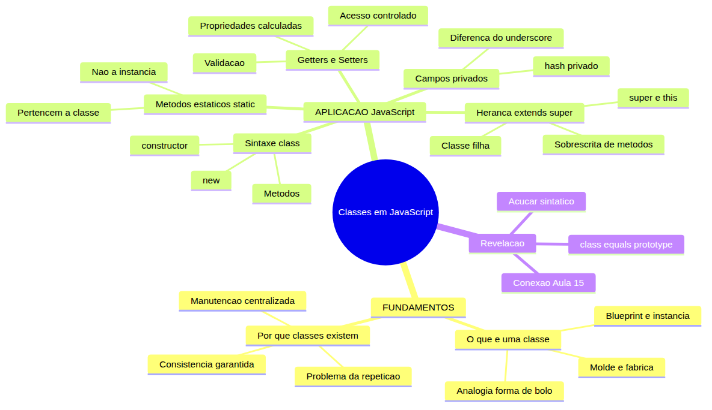
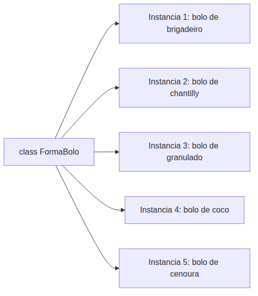
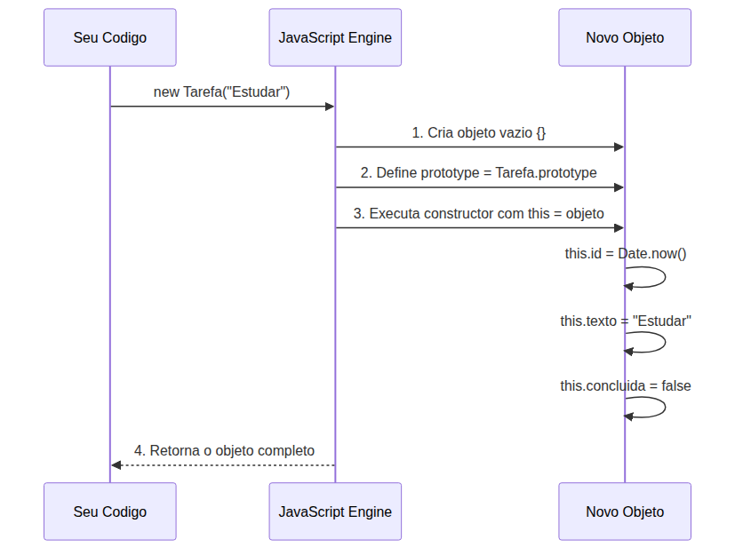
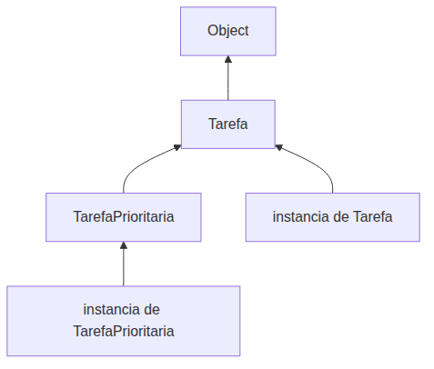
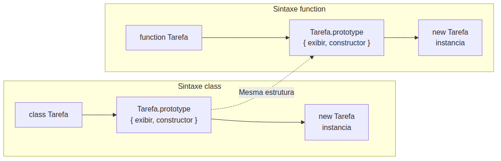

# JavaScript — Do Zero ao Profissional — Aula 16

## Classes — Sintaxe Moderna (ES6+)

**Duração estimada:** 110 minutos (55 de leitura + 55 de prática)
**Nível:** Intermediário
**Pré-requisitos:** Aulas 01-15 concluídas — especialmente objetos literais (Aula 12), `this` e contexto (Aula 13), arrow functions e HOFs (Aula 14), **prototypes e herança prototipal (Aula 15)** — a âncora principal desta aula

---

## Objetivos de Aprendizagem

Ao final desta aula, você será capaz de:

- [ ] **Explicar** o conceito universal de classe como "fábrica/molde de objetos" — uma receita que define o contrato (propriedades + comportamentos) que toda instância deve cumprir
- [ ] **Definir** classe como um template/blueprint que especifica estrutura e comportamento, distinguindo-a da instância (objeto concreto criado a partir do molde)
- [ ] **Declarar** uma classe em JavaScript com `class`, `constructor()` e métodos — explicando que o constructor é o "checklist de inicialização" executado automaticamente no `new`
- [ ] **Aplicar** `extends` e `super()` para criar herança entre classes — uma classe filha que herda estrutura/comportamento da classe pai e a especializa
- [ ] **Declarar** campos privados com `#` para encapsulamento real — propriedades que só podem ser acessadas dentro do corpo da classe
- [ ] **Utilizar** métodos estáticos (`static`) para funcionalidades utilitárias que pertencem à própria classe, não às instâncias
- [ ] **Implementar** getters e setters (`get`/`set`) para controlar o acesso a propriedades com validação ou cálculo automático
- [ ] **Comparar** a sintaxe de classe com a abordagem prototipal equivalente — mostrando que `class` é açúcar sintático sobre prototypes
- [ ] **Explicar** que classes em JavaScript produzem o mesmo mecanismo de prototype chain da Aula 15 (`typeof MinhaClasse === "function"`)
- [ ] **Refatorar** o Gerenciador de Tarefas de funções soltas para uma `class GerenciadorTarefas` com `constructor`, métodos, encapsulamento com `#tarefas` e método estático utilitário

---

## Como Usar Esta Aula

Esta aula está organizada em duas partes. A **primeira parte** constrói o conceito universal de classe — molde, fábrica, blueprint — sem JavaScript. É a base conceitual que vale para qualquer linguagem com classes. A **segunda parte** aplica esses conceitos em JavaScript: você vai declarar classes, usar herança, encapsular dados, criar métodos estáticos e implementar getters e setters.

No final, a **grande revelação**: você vai conectar tudo o que aprendeu com a Aula 15 — classes SÃO prototypes por baixo dos panos.

Cada seção termina com um **Quick Check** para verificar seu entendimento. Ao longo do caminho, você encontrará seções **"Mão na Massa"** para praticar. Ao final, o arquivo separado **Questões de Aprendizagem** traz as tarefas de checkpoint — só avance para a Aula 17 quando conseguir completá-las por conta própria.

---

## Mapa Mental

Este diagrama mostra todos os conceitos que você vai dominar nesta aula:



> *O mapa mental acima mostra a estrutura da aula. Cada ramo representa um conceito que você vai explorar, começando pelos fundamentos universais e terminando com a revelação de que classes = prototypes.*

---

## Recapitulação das Aulas 12-15

| Aula | Conceito | Onde aparece nesta aula | Como se conecta |
|---|---|---|---|
| Aula 15 | **Prototype chain** (Seções 4-7) | Seção 8 | A `class` produz EXATAMENTE a mesma prototype chain que você aprendeu — é o mesmo mecanismo com sintaxe diferente |
| Aula 15 | **`Object.create()`** (Seção 5) | Seção 8 | A `class` faz internamente o que `Object.create()` faz — define o protótipo automaticamente |
| Aula 15 | **`.prototype`** (Seção 6) | Seção 3, 8 | Métodos de classe vão parar em `Classe.prototype` — o mesmo lugar onde funções construtoras colocam métodos |
| Aula 15 | **`typeof Array === "function"`** (Seção 9) | Seção 3, 8 | `typeof MinhaClasse === "function"` — classes SÃO funções construtoras por baixo |
| Aula 14 | **Métodos de array** (Seções 4-5) | Seção 5, 6, 7 | Usamos `.push()`, `.filter()`, `.map()` dentro dos métodos da classe |
| Aula 13 | **`this`** (Seções 2-4) | Seção 3, 4 | `this` no constructor referencia a instância sendo criada — você já sabe isso da Aula 13 |
| Aula 12 | **Objetos literais** (Seções 1-3) | Seção 2, 3 | Objetos literais são criados manualmente; classes os criam com consistência garantida |

---

**FUNDAMENTOS: Moldes, Fábricas e Blueprints — O Conceito Universal de Classe**

> *Os conceitos desta seção são universais — valem para qualquer linguagem com classes (Java, Python, C#, etc.). Na segunda parte, você verá como JavaScript implementa cada um deles.*

---

## 1. O Que É uma Classe? — Molde, Fábrica, Blueprint

Imagine que você quer fazer 5 bolos de chocolate para uma festa. Você pega uma forma de bolo — aquela redonda com furo no meio — e faz a massa. Assa. Desenforma. Repete 5 vezes.

A **forma** é sempre a mesma. Os **bolos** que saem dela são diferentes: um pode ter cobertura de brigadeiro, outro de chantilly, outro pode ter granulado. Mas todos compartilham o MESMO FORMATO. Todos têm o mesmo tamanho, o mesmo furo no meio, a mesma altura.

Em programação, funciona exatamente assim:

- A **classe** é a **forma de bolo** — ela define a ESTRUTURA que todo objeto criado a partir dela vai ter
- A **instância** é cada **bolo assado** — um objeto concreto, com valores específicos, criado a partir daquele molde



> *A classe (forma) é uma só. As instâncias (bolos) são muitas, cada uma com suas características específicas, mas todas seguem o mesmo formato.*

Outra analogia: uma **planta de casa** (blueprint). A planta especifica: 3 quartos, 2 banheiros, cozinha, sala, área de serviço. Cada casa CONSTRUÍDA a partir dessa planta é uma instância. Uma pode ter parede azul, outra rosa. Uma pode ter piso de madeira, outra de cerâmica. A PLANTA é a mesma — as CASAS são diferentes.

Também como as máquinas de refrigerante em estações de metrô. Cada máquina é idêntica em termos de funcionamento: você insere dinheiro, escolhe o número da bebida, ela cai na bandeja. O que muda é a LOCALIZAÇÃO (cada máquina está em uma estação diferente) e o ESTOQUE (cada máquina pode ter refrigerantes diferentes disponíveis). A CLASSE define o comportamento — cada INSTÂNCIA (máquina concreta) tem seu próprio estado.

### O Contrato da Classe

Uma classe define duas coisas:

1. **O que toda instância TEM** — as propriedades/estado (ex: id, texto, concluida)
2. **O que toda instância FAZ** — os métodos/comportamento (ex: marcarComoConcluida, exibir)

Toda tarefa no seu Gerenciador TEM id, texto e concluida. Toda tarefa FAZ exibirDetalhes, marcarComoConcluida. A classe Tarefa é o contrato que GARANTE que toda instância nasça com essas propriedades e métodos — sem você precisar criar manualmente cada uma.

### Vocabulário Essencial

- **Classe**: o molde / blueprint / receita — define a estrutura (com letra maiúscula: `Tarefa`)
- **Instância**: o objeto concreto criado a partir da classe — cada um tem seus próprios valores (`tarefa1`, `tarefa2`)
- **Instanciar**: o ato de criar uma instância a partir de uma classe (usando `new`)
- **Propriedade**: os dados que cada instância carrega (ex: `texto`, `concluida`)
- **Método**: as ações que cada instância sabe executar (ex: `marcarComoConcluida()`)

### Quick Check 1

**1. Na analogia da forma de bolo, o que representa a CLASSE e o que representa a INSTÂNCIA? Explique com suas palavras.**
**Resposta:** A CLASSE é a FORMA DE BOLO — o molde que define o formato, a estrutura. A INSTÂNCIA é cada BOLO ASSADO — um produto concreto com valores específicos (cobertura, recheio). A forma é a mesma; os bolos são diferentes, mas todos seguem o mesmo formato definido pela forma.

**2. Se você tem uma planta de casa (blueprint) e constrói 3 casas a partir dela, qual delas é a "classe" e quais são as "instâncias"?**
**Resposta:** A PLANTA é a CLASSE — o blueprint que define a estrutura (quartos, banheiros, cômodos). As 3 CASAS CONSTRUÍDAS são as INSTÂNCIAS — objetos concretos que seguem a planta, cada um com suas particularidades (cor da parede, tipo de piso, móveis). A planta não é uma casa — é a definição de como a casa deve ser.

---

**APLICAÇÃO: Classes em JavaScript — Da Analogia ao Código Real**

> *Agora que você entende o conceito universal de classe como molde/fábrica/blueprint, vamos conectá-lo à prática com JavaScript. Cada mecanismo que você vai aprender (constructor, extends, super, #privado, static, get/set) implementa exatamente os conceitos da Parte 1.*

---


## 2. Por Que Classes Existem? — O Problema da Repetição

Você já trabalhou com objetos literais. Na Aula 12, você criou objetos assim:

```javascript
let tarefa1 = { id: 1, texto: "Estudar JavaScript", concluida: false };
let tarefa2 = { id: 2, texto: "Fazer exercícios", concluida: true };
let tarefa3 = { id: 3, texto: "Revisar aula", concluida: false };
```

Isso funciona. Mas tem problemas:

**Problema 1: Repetição manual.** Você escreveu `{ id: ..., texto: ..., concluida: ... }` três vezes. Se forem 50 tarefas, você escreve 50 vezes. Cansativo e propenso a erro.

**Problema 2: Inconsistência.** Nada garante que toda tarefa tenha os mesmos campos. Alguém pode esquecer o `id` ou escrever `concluido` (sem "a") em uma delas:

```javascript
let tarefa4 = { id: 4, texto: "Ler livro" }; // ⚠️ esqueceu concluida!
let tarefa5 = { texto: "Correr", concluido: false }; // ⚠️ id ausente, concluido com "o"
```

O programa lida com essas tarefas e quebra — `tarefa4.concluida` é `undefined`, `tarefa5.id` é `undefined`.

**Problema 3: Comportamento separado dos dados.** Métodos como `marcarComoConcluida` ou `exibir` ficam em funções separadas (Aula 10), não "grudados" no objeto. Se você tem 500 tarefas, cada uma carrega os dados, mas o comportamento está solto no código.

### Como a Classe Resolve

```javascript
class Tarefa {
    constructor(id, texto) {
        this.id = id;
        this.texto = texto;
        this.concluida = false; // ← toda tarefa começa como não concluída
    }
    
    marcarComoConcluida() {
        this.concluida = true;
    }
    
    exibir() {
        return `${this.id}. ${this.texto} [${this.concluida ? "X" : " "}]`;
    }
}
```

Toda instância criada com `new Tarefa(id, texto)` GARANTIDAMENTE tem `id`, `texto`, `concluida`, `marcarComoConcluida()` e `exibir()`. A classe define o contrato UMA VEZ. Cada `new` respeita esse contrato.

### Benefícios Concretos

| Problema | Sem classe | Com classe |
|---|---|---|
| Consistência | Manual — depende da atenção do programador | Automática — toda instância nasce com as mesmas propriedades |
| Manutenção | Mudar estrutura = alterar em N lugares | Mudar constructor = alterar em 1 lugar |
| Comportamento | Funções separadas dos dados | Métodos dentro da classe — dados e comportamento juntos |
| Custo de criar novo objeto | Copiar e colar, preenchendo manualmente | Uma linha: `new Tarefa(5, "Texto")` |

Pense no **controle remoto da TV**. Você aperta "Ligar" (um método do controle) em vez de abrir a TV, procurar o botão físico, apertar manualmente. O controle REMOTO (classe) define os métodos (`ligar`, `desligar`, `aumentarVolume`). Cada controle CONCRETO (instância) tem as mesmas funções. Você não fabrica um controle novo toda vez que quer ligar a TV.

### Quick Check 2

**1. Quais são os 3 problemas de criar objetos manualmente com literais, que as classes resolvem?**
**Resposta:** (1) Repetição manual — você escreve a mesma estrutura toda vez que cria um objeto. (2) Inconsistência — nada garante que todos os objetos tenham os mesmos campos e tipos. (3) Comportamento separado dos dados — métodos ficam em funções soltas, não acopladas ao objeto.

**2. Suponha que você queira adicionar um campo `prioridade` a todas as tarefas do seu sistema. O que acontece se você estiver usando objetos literais? E se estiver usando classes?**
**Resposta:** Com objetos literais, você precisa encontrar CADA criação de objeto e adicionar `prioridade` manualmente — fácil de esquecer algum. Com classes, você adiciona o campo no `constructor` da `class Tarefa` UMA VEZ, e TODAS as instâncias criadas a partir daí terão automaticamente o campo `prioridade`. A manutenção é centralizada.

---

## 3. Sintaxe `class` — Declarando Sua Primeira Classe

Na Seção 1, a forma de bolo (classe) definia o formato. Cada bolo (instância) seguia esse formato. Em JavaScript, isso se traduz na sintaxe `class`.

### Anatomia de uma Classe

```javascript
class NomeDaClasse {
    constructor(parametros) {
        // Inicialização das propriedades
    }
    
    metodo1() {
        // Comportamento
    }
    
    metodo2() {
        // Comportamento
    }
}
```

Regras de sintaxe:
- A palavra-chave `class` seguida do nome (maiúsculo por convenção)
- O corpo da classe fica entre `{ }`
- **Métodos são declarados SEM a palavra `function`** — apenas o nome e os parênteses
- **Não há vírgulas entre os métodos** — diferente de objetos literais
- Ponto-e-vírgula é opcional após os métodos

### O Constructor: O Checklist de Inicialização

O `constructor` é um método ESPECIAL. Ele é executado automaticamente quando você cria uma nova instância com `new`. É o "checklist de inicialização" — lá dentro você prepara as propriedades que toda instância deve ter.

```javascript
class Tarefa {
    constructor(texto) {
        this.id = Date.now();     // gera um número único baseado no timestamp
        this.texto = texto;       // o texto que veio como argumento
        this.concluida = false;   // toda tarefa nova começa como não concluída
    }
    
    exibir() {
        return `${this.id} - ${this.texto} [${this.concluida ? "X" : " "}]`;
    }
}
```

Veja como isso funciona no Console:

```javascript
// Criando instâncias
let t1 = new Tarefa("Estudar JavaScript");
let t2 = new Tarefa("Fazer exercícios");

// Cada instância tem suas próprias propriedades
console.log(t1.texto);     // "Estudar JavaScript"
console.log(t2.texto);     // "Fazer exercícios"

// Métodos funcionam em cada instância
console.log(t1.exibir());  // "1723456789012 - Estudar JavaScript [ ]"
console.log(t2.exibir());  // "1723456789013 - Fazer exercícios [ ]"

// Podemos modificar as propriedades diretamente
t1.concluida = true;
console.log(t1.exibir());  // "1723456789012 - Estudar JavaScript [X]"
```

O fluxo quando você chama `new Tarefa("Estudar")`:

1. JavaScript cria um novo objeto vazio `{}`
2. Define o protótipo desse objeto como `Tarefa.prototype`
3. Executa o `constructor` com `this` apontando para o novo objeto
4. O constructor preenche as propriedades em `this`
5. O objeto é retornado automaticamente



> *O diagrama mostra o fluxo do `new`: criação do objeto, definição do protótipo, execução do constructor e retorno. Você não precisa fazer nada disso manualmente — a `class` cuida de tudo.*

### Mão na Massa 1 — Sua Primeira Classe

Vamos praticar! Abra o Console do navegador (F12 > Console).

- [ ] Declare a classe `Tarefa`:
```javascript
class Tarefa {
    constructor(texto) {
        this.id = Date.now();
        this.texto = texto;
        this.concluida = false;
    }
    
    exibir() {
        return `${this.id} - ${this.texto} [${this.concluida ? "X" : " "}]`;
    }
}
```

- [ ] Crie algumas instâncias:
```javascript
let t1 = new Tarefa("Estudar classes");
let t2 = new Tarefa("Fazer mão na massa");
```

- [ ] Chame os métodos:
```javascript
console.log(t1.exibir());
console.log(t2.exibir());
t1.concluida = true;
console.log(t1.exibir()); // Agora com [X]
```

- [ ] Verifique o tipo:
```javascript
console.log(typeof Tarefa);  // "function" ← surpresa! classes são funções!
```

**Verificação:** Você criou uma classe, instanciou objetos e chamou métodos. O código está mais organizado que objetos literais soltos — a classe `Tarefa` define o contrato UMA VEZ, e toda instância segue esse contrato automaticamente.

### Quick Check 3

**1. O que o `constructor` faz em uma classe? Quando ele é executado?**
**Resposta:** O `constructor` é um método especial que inicializa as propriedades da instância (como `this.texto`, `this.concluida`). Ele é executado AUTOMATICAMENTE quando você chama `new NomeDaClasse()`. Se o constructor recebe parâmetros, você os passa no `new`.

**2. Por que `typeof Tarefa` retorna `"function"` se `Tarefa` é uma classe?**
**Resposta:** Porque em JavaScript, classes SÃO funções construtoras por baixo dos panos. A sintaxe `class` é uma "casca" mais bonita sobre o sistema de prototypes/funções construtoras — o mecanismo interno é o mesmo que `function Tarefa() {}`. Você verá isso em detalhes na Seção 8.

---

## 4. `extends` e `super()` — Herança entre Classes

Na Aula 15, você aprendeu que objetos podem "herdar" características de outros objetos através da prototype chain. Com classes, a herança fica explícita e intuitiva.

### O Problema

Imagine que você tem a classe `Tarefa` e quer criar um tipo especial: `TarefaPrioritaria`. Ela tem TUDO que uma tarefa normal tem (id, texto, concluida), MAS também tem um campo extra `prioridade` (alta, media, baixa) e um comportamento diferente no método `exibir()`.

Sem herança, você teria que copiar toda a estrutura da `Tarefa` para dentro de `TarefaPrioritaria` — repetindo código, criando dois pontos de manutenção.

### A Solução: `extends`

```javascript
class TarefaPrioritaria extends Tarefa {
    constructor(texto, prioridade) {
        super(texto);             // chama o constructor da classe pai (Tarefa)
        this.prioridade = prioridade;
    }
    
    exibir() {                    // sobrescrita de método (override)
        return `[${this.prioridade}] ${super.exibir()}`;
    }
}
```

Desconstruindo:

- **`extends Tarefa`**: diz que `TarefaPrioritaria` HERDA tudo de `Tarefa` — propriedades e métodos
- **`super(texto)`**: chama o `constructor` da CLASSE PAI (`Tarefa`). É OBRIGATÓRIO chamar `super()` antes de usar `this` na classe filha. O `super` passa os parâmetros que o pai precisa
- **`this.prioridade = prioridade`**: a classe filha PODE adicionar propriedades próprias
- **`exibir()`**: a classe filha PODE redefinir (sobrescrever) métodos do pai
- **`super.exibir()`**: mesmo depois de sobrescrever, a filha PODE chamar o método original do pai usando `super.` antes do nome do método

### Regra Fundamental: `super()` Primeiro

```javascript
class TarefaPrioritaria extends Tarefa {
    constructor(texto, prioridade) {
        // ❌ ERRADO: this não existe antes de super()
        // this.prioridade = prioridade;
        // ReferenceError: Must call super constructor in derived class
        
        super(texto);             // ✅ CORRETO: super() primeiro
        this.prioridade = prioridade; // agora this existe
    }
}
```

Sem `super()`, o JavaScript não cria o objeto base. É como construir uma casa sem alicerce — o `super()` é o alicerce que a classe pai constrói para você.

### Exemplo Completo

```javascript
class Tarefa {
    constructor(texto) {
        this.id = Date.now();
        this.texto = texto;
        this.concluida = false;
    }
    
    exibir() {
        return `${this.id} - ${this.texto} [${this.concluida ? "X" : " "}]`;
    }
}

class TarefaPrioritaria extends Tarefa {
    constructor(texto, prioridade = "normal") {
        super(texto);
        this.prioridade = prioridade;
    }
    
    exibir() {
        return `[${this.prioridade}] ${super.exibir()}`;
    }
}

// Testando
let t1 = new Tarefa("Estudar JavaScript");
let t2 = new TarefaPrioritaria("Fazer exercícios", "alta");

console.log(t1.exibir()); // "1723456789 - Estudar JavaScript [ ]"
console.log(t2.exibir()); // "[alta] 1723456790 - Fazer exercícios [ ]"

// Métodos da classe pai funcionam na filha!
t2.concluida = true;
console.log(t2.exibir()); // "[alta] 1723456790 - Fazer exercícios [X]"
```

Perceba que `t2` (que é `TarefaPrioritaria`) tem acesso a `this.id`, `this.texto` e `this.concluida` — tudo herdado da classe pai `Tarefa`. E o método `exibir()` foi personalizado para incluir a prioridade.



> *O diagrama mostra a hierarquia de herança: `TarefaPrioritaria extends Tarefa`, e `Tarefa extends Object` (implicitamente — toda classe em JS herda de Object). Instâncias seguem a cadeia correspondente.*

### Mão na Massa 2 — Herança na Prática

- [ ] No Console, recrie as classes `Tarefa` e `TarefaPrioritaria` acima
- [ ] Teste a regra do `super()` — remova `super(texto)` e veja o erro:
```javascript
// Tente criar isso (vai dar erro):
class TarefaErrada extends Tarefa {
    constructor(texto, prioridade) {
        // esqueceu super()!
        this.prioridade = prioridade;
    }
}
let te = new TarefaErrada("teste", "alta"); // ReferenceError!
```

- [ ] Crie uma classe `TarefaUrgente extends TarefaPrioritaria` — dois níveis de herança:
```javascript
class TarefaUrgente extends TarefaPrioritaria {
    constructor(texto) {
        super(texto, "urgente");
        this.prazo = "24h";
    }
    
    exibir() {
        return `🚨 ${super.exibir()} (prazo: ${this.prazo})`;
    }
}

let tu = new TarefaUrgente("Entregar relatório");
console.log(tu.exibir()); // "🚨 [urgente] 1723456792 - Entregar relatório [ ] (prazo: 24h)"
```

**Verificação:** Você criou uma hierarquia de 3 níveis — `Tarefa` → `TarefaPrioritaria` → `TarefaUrgente`. Cada nível adiciona ou modifica comportamento sem duplicar código. A herança com `extends` e `super()` é o mecanismo que permite isso.

### Quick Check 4

**1. Por que `super()` precisa ser chamado ANTES de usar `this` no constructor de uma classe filha (`extends`)?**
**Resposta:** Porque o JavaScript precisa criar o objeto base (executar o constructor da classe pai) primeiro. O `super()` faz isso — ele chama o constructor do pai. Sem ele, o objeto "base" não existe e `this` não aponta para lugar nenhum. É como construir uma casa sem alicerce.

**2. `super.metodo()` dentro de uma classe filha — o que isso faz? Dê um exemplo.**
**Resposta:** `super.metodo()` chama a VERSÃO DO PAI de um método que foi sobrescrito na classe filha. Exemplo: na classe `TarefaPrioritaria`, o método `exibir()` sobrescreve o de `Tarefa`, mas usa `super.exibir()` para incluir o resultado do método original no meio da string personalizada: `return \`[${this.prioridade}] ${super.exibir()}\``.

---

## 5. Encapsulamento com `#` — Campos Privados

Volte ao Gerenciador de Tarefas da Aula 10. O array `tarefas` estava solto no escopo global — qualquer função podia acessá-lo e modificá-lo diretamente. Em sistemas maiores, isso é perigoso: alguém pode sobrescrever o array, remover itens indevidamente ou acessar dados internos que não deveriam ser expostos.

### O Problema do `_` (Convenção)

Tradicionalmente, programadores JavaScript usam um underscore `_` no início do nome para indicar "propriedade interna, não mexa":

```javascript
class Gerenciador {
    constructor() {
        this._tarefas = []; // ← o _ é só uma convenção
    }
}

let g = new Gerenciador();
console.log(g._tarefas); // [] → funciona! O _ não impede nada
```

O `_` é um **acordo entre programadores** — "isso é interno, por favor não acesse". Mas é só um acordo. O JavaScript não impede o acesso. É como uma placa "proibido estacionar" sem guarda — a maioria respeita, mas ninguém é obrigado.

### A Solução: `#` (Campos Privados de Verdade)

O `#` (hash) no início do nome torna a propriedade VERDADEIRAMENTE privada:

```javascript
class Gerenciador {
    #tarefas = [];  // ← campo privado: não é acessível fora da classe
    
    constructor() {
        // #tarefas já foi inicializado como []
    }
    
    adicionar(texto) {
        this.#tarefas.push({ id: Date.now(), texto, concluida: false });
    }
    
    listar() {
        return this.#tarefas;
    }
}

let g = new Gerenciador();
g.adicionar("Estudar classes");
console.log(g.listar());    // [ { id: 17234..., texto: "Estudar classes", concluida: false } ]
console.log(g.#tarefas);    // ❌ SyntaxError: Private field '#tarefas' must be declared in an enclosing class
```

**O que muda com `#`:**

| Característica | `_tarefas` (convenção) | `#tarefas` (privado real) |
|---|---|---|
| Acessível fora da classe | Sim — `g._tarefas` funciona | Não — `g.#tarefas` dá erro de sintaxe |
| Aparece em `Object.keys()` | Sim | Não |
| Aparece no `console.log()` | Sim | Não (só dentro da classe) |
| Quem impede o acesso | Ninguém (autorregulagem) | O próprio JavaScript (engine) |
| Proteção contra modificação externa | Nenhuma | Total |

### Onde Declarar Campos Privados

Campos privados são declarados no CORPO da classe, fora do constructor, sem `let`, `const` ou `var`:

```javascript
class Exemplo {
    // Declarações de campos (públicos ou privados) vão aqui
    #privado = "só dentro da classe";
    publico = "acessível de qualquer lugar";
    
    constructor() {
        // Ambos já estão disponíveis aqui
        console.log(this.#privado); // "só dentro da classe"
    }
    
    getPrivado() {
        return this.#privado;
    }
}
```

### Exemplo com Validação

Campos privados são ideais para dados que precisam ser protegidos:

```javascript
class ContaBancaria {
    #saldo = 0;
    
    constructor(titular, saldoInicial = 0) {
        this.titular = titular;
        if (saldoInicial >= 0) {
            this.#saldo = saldoInicial;
        }
    }
    
    depositar(valor) {
        if (valor > 0) {
            this.#saldo += valor;
            return true;
        }
        return false;
    }
    
    sacar(valor) {
        if (valor > 0 && valor <= this.#saldo) {
            this.#saldo -= valor;
            return true;
        }
        return false;
    }
    
    verSaldo() {
        return this.#saldo;
    }
}

let conta = new ContaBancaria("João", 1000);
console.log(conta.verSaldo()); // 1000
conta.depositar(500);
console.log(conta.verSaldo()); // 1500
console.log(conta.#saldo);     // ❌ SyntaxError! Privado!
conta.#saldo = 999999;         // ❌ SyntaxError! Não pode modificar externamente!
```

Percebeu a potência? O `#saldo` só pode ser alterado através dos métodos `depositar()` e `sacar()`, que têm validação. Ninguém pode "invadir" a conta e colocar saldo arbitrário.

### Quick Check 5

**1. Qual a diferença entre `_nome` (underscore) e `#nome` (hash) em uma classe JavaScript?**
**Resposta:** `_nome` é uma CONVENÇÃO entre programadores — indica "não mexa" mas o JavaScript não impede o acesso. `#nome` é um campo VERDADEIRAMENTE privado — o JavaScript IMPEDE o acesso de fora da classe, gerando erro de sintaxe.

**2. Você declarou um campo `#senha` em uma classe `Usuario`. O que acontece se alguém tentar `usuario.#senha` fora da classe?**
**Resposta:** Dá um `SyntaxError` (erro de sintaxe). O JavaScript não permite acessar campos privados fora do corpo da classe. O erro é detectado em tempo de compilação (antes mesmo de executar), protegendo o campo de qualquer acesso externo.

---

## 6. Métodos Estáticos (`static`) — Pertencem à Classe, Não à Instância

Todos os métodos que você viu até agora são métodos de **instância** — você precisa criar um objeto (`new`) para chamá-los. Mas algumas funcionalidades não fazem sentido em uma instância específica.

### O Conceito

Pense em uma **calculadora**. O método `somar(a, b)` não precisa de uma "instância de calculadora" — ele é uma operação matemática pura. Você chama `Calculadora.somar(2, 3)` diretamente.

Métodos **estáticos** são definidos com a palavra-chave `static` e pertencem à PRÓPRIA CLASSE, não às instâncias. Você os chama como `Classe.metodo()` — sem criar instância.

```javascript
class Tarefa {
    constructor(texto) {
        this.id = Date.now();
        this.texto = texto;
        this.concluida = false;
    }
    
    // Método de instância — precisa de um objeto
    exibir() {
        return `${this.texto} [${this.concluida ? "X" : " "}]`;
    }
    
    // Método estático — pertence à classe
    static compararPorData(t1, t2) {
        return t1.id - t2.id;
    }
    
    static criarVarias(...textos) {
        return textos.map(t => new Tarefa(t));
    }
}

// Chamando métodos estáticos — sem instância!
let t1 = new Tarefa("Estudar");
let t2 = new Tarefa("Praticar");
console.log(Tarefa.compararPorData(t1, t2)); // negativo se t1 foi criada antes

let tarefas = Tarefa.criarVarias("A", "B", "C");
console.log(tarefas.length); // 3

// ❌ Métodos estáticos NÃO funcionam em instâncias:
// t1.compararPorData(t1, t2); // TypeError: t1.compararPorData is not a function
```

### Quando Usar Métodos Estáticos

Métodos estáticos são ideais para:

1. **Funções utilitárias** relacionadas à classe mas que não dependem de uma instância específica
2. **Fábricas** — métodos que criam instâncias de forma especial (padrão Factory)
3. **Constantes ou configurações** da classe
4. **Operações sobre coleções** de instâncias

### `this` em Métodos Estáticos

Em um método estático, `this` referencia a PRÓPRIA CLASSE, não uma instância:

```javascript
class Utilitarios {
    static versao() {
        return "1.0.0";
    }
    
    static info() {
        // this aqui é a classe Utilitarios
        return `Utilitarios versão ${this.versao()}`;
    }
}

console.log(Utilitarios.info()); // "Utilitarios versão 1.0.0"
```

### Exemplo Prático: Utilitário de Filtro

```javascript
class GerenciadorTarefas {
    #tarefas = [];
    
    constructor() {
        // #tarefas já inicializado como []
    }
    
    adicionar(texto) {
        this.#tarefas.push({ id: Date.now(), texto, concluida: false });
    }
    
    get tarefas() {
        return this.#tarefas;
    }
    
    // Método estático: opera sobre um array de tarefas, não sobre a instância
    static contarConcluidas(listaTarefas) {
        return listaTarefas.filter(t => t.concluida).length;
    }
    
    static contarPendentes(listaTarefas) {
        return listaTarefas.filter(t => !t.concluida).length;
    }
}

let g = new GerenciadorTarefas();
g.adicionar("Estudar");
g.adicionar("Praticar");
g.tarefas[0].concluida = true;

// Usando métodos estáticos — passamos o array como argumento
console.log(GerenciadorTarefas.contarConcluidas(g.tarefas)); // 1
console.log(GerenciadorTarefas.contarPendentes(g.tarefas));  // 1
```

Perceba: `contarConcluidas` recebe o array como parâmetro. Ela NÃO acessa `this.#tarefas` — porque é estática e não tem acesso aos dados da instância. Ela é uma função utilitária que opera sobre QUALQUER array de tarefas.

### Mão na Massa 3 — Métodos Estáticos

- [ ] Adicione métodos estáticos à classe `Tarefa`:
```javascript
class Tarefa {
    constructor(texto) {
        this.id = Date.now();
        this.texto = texto;
        this.concluida = false;
    }
    
    exibir() {
        return `${this.id} - ${this.texto} [${this.concluida ? "X" : " "}]`;
    }
    
    // Estático: validação
    static validar(texto) {
        return typeof texto === "string" && texto.trim().length > 0;
    }
    
    // Estático: fábrica condicional
    static criarSeValido(texto) {
        if (this.validar(texto)) {
            return new Tarefa(texto);
        }
        return null;
    }
}
```

- [ ] Teste os métodos estáticos:
```javascript
console.log(Tarefa.validar(""));         // false
console.log(Tarefa.validar("Estudar"));  // true

let t = Tarefa.criarSeValido("Teste");
console.log(t.exibir());                 // funciona

let t2 = Tarefa.criarSeValido("");
console.log(t2);                         // null
```

**Verificação:** Métodos estáticos não precisam de instância. Você os chama como `Classe.metodo()`, não `instancia.metodo()`. Use-os para utilitários, validações e fábricas que pertencem ao CONCEITO da classe, não a um objeto específico.

### Quick Check 6

**1. Qual a diferença entre um método de instância e um método estático?**
**Resposta:** Um método de instância é chamado na instância (`tarefa.exibir()`) e pode acessar `this` (os dados da instância). Um método estático é chamado na própria classe (`Tarefa.validar("texto")`), não precisa de instância, e `this` dentro dele referencia a classe, não uma instância.

**2. Você quer criar um método que conta quantas tarefas estão concluídas em uma lista. Esse método deve ser estático ou de instância? Por quê?**
**Resposta:** Deve ser estático (`static contarConcluidas(lista)`), porque ele opera sobre uma LISTA de tarefas (recebida como parâmetro), não sobre uma instância específica. Ele não precisa acessar o `#tarefas` privado de um gerenciador — recebe os dados por parâmetro.

---

## 7. Getters e Setters — Controlando o Acesso com `get` e `set`

Até agora, você acessou propriedades diretamente: `tarefa.texto`, `tarefa.concluida`. Mas e se você quiser VALIDAR o valor antes de armazenar? Ou CALCULAR algo automaticamente ao ler? É aí que entram os **getters** e **setters**.

### O Problema: Acesso Direto sem Controle

```javascript
let tarefa = new Tarefa("");
tarefa.texto = "";  // Permite texto vazio — problema!
```

Nada impede que alguém atribua um valor inválido a `texto`. Com um setter, você intercepta a atribuição e aplica validação.

### Getter: Ler com Lógica

Um **getter** é um método que se parece com uma propriedade. Você o declara com `get` e o chama SEM PARÊNTESES:

```javascript
class Tarefa {
    constructor(texto) {
        this.texto = texto;
        this.concluida = false;
    }
    
    // Getter — parece propriedade, mas executa lógica
    get resumo() {
        return `${this.texto} — ${this.concluida ? "✓ Concluída" : "○ Pendente"}`;
    }
    
    get textoMaiusculo() {
        return this.texto.toUpperCase();
    }
}

let t = new Tarefa("Estudar JavaScript");
console.log(t.resumo);          // "Estudar JavaScript — ○ Pendente"
console.log(t.textoMaiusculo);  // "ESTUDAR JAVASCRIPT"

// Perceba: SEM parênteses! Não é t.resumo(), é t.resumo
```

### Setter: Escrever com Validação

Um **setter** intercepta uma ATRIBUIÇÃO (`=`). Você valida ou transforma o valor antes de armazenar:

```javascript
class Tarefa {
    constructor(texto) {
        this._texto = "";        // campo interno (convenção _)
        this.concluida = false;
        this.texto = texto;      // usa o setter para validar
    }
    
    get texto() {
        return this._texto;
    }
    
    set texto(novoTexto) {
        if (typeof novoTexto !== "string" || novoTexto.trim() === "") {
            throw new Error("Texto da tarefa não pode ser vazio!");
        }
        this._texto = novoTexto.trim();
    }
    
    get resumo() {
        return `${this.texto} — ${this.concluida ? "✓" : "○"}`;
    }
}

// Testando
let t1 = new Tarefa("Estudar JavaScript");
console.log(t1.texto);       // "Estudar JavaScript" (via getter)

t1.texto = "Praticar mais";  // (via setter — valida e armazena)
console.log(t1.texto);       // "Praticar mais"

// t1.texto = "";            // ❌ Error: Texto da tarefa não pode ser vazio!
// new Tarefa("");           // ❌ Error: Texto da tarefa não pode ser vazio!
```

Padrão comum: o campo real é armazenado com `_nome` (convenção interna), e o getter/setter público usa o nome limpo (`nome`). Isso cria uma interface pública elegante enquanto permite validação interna.

### Getter Calculado com Base em Múltiplos Campos

```javascript
class Tarefa {
    constructor(texto, prioridade = "normal") {
        this._texto = texto;
        this._prioridade = prioridade;
        this.concluida = false;
    }
    
    get texto() { return this._texto; }
    set texto(novo) { if (novo.trim()) this._texto = novo.trim(); }
    
    get prioridade() { return this._prioridade; }
    set prioridade(p) {
        const validas = ["baixa", "normal", "alta", "urgente"];
        if (validas.includes(p)) {
            this._prioridade = p;
        }
    }
    
    // Getter que combina múltiplos campos
    get marcador() {
        const status = this.concluida ? "✅" : "⬜";
        const prioridadeMap = { baixa: "↓", normal: "→", alta: "↑", urgente: "🔥" };
        return `${status} [${prioridadeMap[this._prioridade]}] ${this._texto}`;
    }
}

let t = new Tarefa("Estudar", "alta");
console.log(t.marcador); // "⬜ [↑] Estudar"
t.concluida = true;
console.log(t.marcador); // "✅ [↑] Estudar"
```

### Tabela de Contraste

| Abordagem | Leitura | Escrita | Validação | Código do usuário |
|---|---|---|---|---|
| Campo direto | `t.texto` | `t.texto = "x"` | Nenhuma | Simples e direto |
| Getter/Setter | `t.texto` (sem `()`) | `t.texto = "x"` | No setter | Igual campo direto! |

A mágica: **quem USA a classe não sabe se está lidando com um campo real ou um getter/setter**. A interface é a mesma — `t.texto`. Isso permite começar com campo direto e migrar para getter/setter depois sem quebrar código existente.

### Quick Check 7

**1. Qual a diferença entre `get texto()` e `texto()` em uma classe? Como você chama cada um?**
**Resposta:** `get texto()` é um getter — você o chama como PROPRIEDADE, sem parênteses: `tarefa.texto`. `texto()` é um método comum — você o chama com parênteses: `tarefa.texto()`. O getter permite adicionar lógica sem mudar a interface de acesso.

**2. O que acontece se você atribuir um valor a uma propriedade que tem setter? Exemplo: `tarefa.texto = ""` onde o setter valida que o texto não pode ser vazio.**
**Resposta:** O setter é executado. Se o valor for inválido, o setter lança um erro (`throw new Error(...)`) que interrompe a execução. A atribuição não acontece — a propriedade mantém o valor anterior. Isso protege a integridade dos dados da classe.

---

## 8. Classes São Açúcar Sintático sobre Prototypes — A Grande Revelação 🔗

Lembra da Aula 15? Você aprendeu sobre prototype chain, `Object.create()`, `Array.prototype` — todo o sistema de herança do JavaScript baseado em protótipos. Agora vem a revelação:

**`class` em JavaScript NÃO introduz um novo sistema de herança. Ela é apenas uma sintaxe mais bonita sobre o mesmo sistema de prototypes que você já conhece.**

A analogia: você estava dirigindo um carro com câmbio manual (funções construtoras e prototype). Agora ganhou um carro com câmbio automático (`class`). O MOTOR é o mesmo. O que mudou foi a experiência de dirigir.

### Evidência 1: `typeof` Retorna "function"

```javascript
class Tarefa {
    constructor(texto) {
        this.texto = texto;
    }
    
    exibir() { return this.texto; }
}

console.log(typeof Tarefa); // "function" ← classe é uma função!
```

Por baixo dos panos, `class Tarefa { }` cria uma **função construtora** chamada `Tarefa`. A sintaxe `class` é uma casca.

### Evidência 2: O Prototype Existe e Está Povoado

```javascript
let t1 = new Tarefa("Estudar");

console.log(Object.getPrototypeOf(t1) === Tarefa.prototype); // true
console.log(Tarefa.prototype.constructor === Tarefa);        // true
console.log(Tarefa.prototype); // { constructor: Tarefa, exibir: ƒ }
```

O método `exibir()` foi parar em `Tarefa.prototype`. É exatamente o que aconteceria se você escrevesse:

```javascript
function Tarefa(texto) {
    this.texto = texto;
}
Tarefa.prototype.exibir = function() {
    return this.texto;
};
```

### Comparação Lado a Lado



> *O diagrama mostra que ambas as sintaxes produzem EXATAMENTE a mesma estrutura: uma função construtora com um `prototype` contendo os métodos, e instâncias que delegam para esse `prototype`.*

### Tabela de Equivalência

| Sintaxe `class` | Equivalente com Prototype (Aula 15) |
|---|---|
| `class Tarefa { }` | `function Tarefa() { }` |
| `constructor(texto) { this.texto = texto }` | `function Tarefa(texto) { this.texto = texto }` |
| `exibir() { ... }` (dentro da classe) | `Tarefa.prototype.exibir = function() { ... }` |
| `new Tarefa("Estudar")` | `new Tarefa("Estudar")` (idêntico!) |
| `class Urgente extends Tarefa { }` | `Object.create(Tarefa.prototype)` + `function Urgente() { Tarefa.call(this) }` |
| `super(texto)` | `Tarefa.call(this, texto)` |

### Evidência 3: O Constructor da Classe Vai para o Prototype

```javascript
class Tarefa {
    constructor(texto) {
        this.texto = texto;
    }
}

console.log(Tarefa.prototype.constructor === Tarefa); // true
```

`Tarefa.prototype.constructor` aponta para a própria `Tarefa`. Isso é IDÊNTICO ao que uma função construtora faz.

### Por Que Isso Importa?

Você pode estar pensando: "Se é a mesma coisa, por que não continuar com funções construtoras?"

Duas razões:

1. **Legibilidade**: `class` é mais LIMPA e INTUITIVA. Métodos ficam dentro das chaves da classe, sem precisar digitar `.prototype` manualmente. O código se AUTODOCUMENTA.

2. **Familiaridade**: Se você aprender Java, Python, C# ou qualquer outra linguagem com classes, a sintaxe `class` será reconhecível. A sintaxe de prototype manual é exclusiva do JavaScript.

```javascript
// Com class — limpa, legível, auto-documentada
class Tarefa {
    constructor(texto) {
        this.texto = texto;
        this.concluida = false;
    }
    marcarConcluida() { this.concluida = true; }
    exibir() { return `${this.texto} [${this.concluida ? "X" : " "}]`; }
}

// Equivalente com function + prototype (Aula 15)
function Tarefa(texto) {
    this.texto = texto;
    this.concluida = false;
}
Tarefa.prototype.marcarConcluida = function() {
    this.concluida = true;
};
Tarefa.prototype.exibir = function() {
    return `${this.texto} [${this.concluida ? "X" : " "}]`;
};
```

Ambos produzem instâncias IDÊNTICAS. A diferença é que o primeiro é mais fácil de escrever, ler e manter.

### Conexão Explícita com a Aula 15

Na Aula 15 você aprendeu que `[1,2,3].map(x => x * 2)` funciona porque `Array.prototype` tem o método `.map()`. Cada array que você cria (`[]` ou `new Array()`) HERDA automaticamente os métodos de `Array.prototype`.

Com `class`, você está fazendo EXATAMENTE a mesma coisa — criando seu próprio prototype personalizado:

```javascript
// Array.prototype tem .map(), .filter(), .forEach()
// Tarefa.prototype tem .exibir(), .marcarConcluida()

let arr = [1, 2, 3];
console.log(Object.getPrototypeOf(arr) === Array.prototype);   // true

let t = new Tarefa("Estudar");
console.log(Object.getPrototypeOf(t) === Tarefa.prototype);     // true

// Ambos funcionam pelo MESMO mecanismo: prototype chain!
```

A diferença? `Array.prototype` foi criado pelo próprio JavaScript. `Tarefa.prototype` foi criado por você — com a `class`.

### Quick Check 8

**1. `typeof MinhaClasse` retorna qual valor? O que isso revela sobre o que `class` realmente é?**
**Resposta:** Retorna `"function"`. Isso revela que `class` cria uma FUNÇÃO construtora por baixo dos panos. A sintaxe `class` é uma casca sobre o mesmo sistema de funções construtoras e prototypes.

**2. Para onde vão os métodos declarados dentro de uma `class`? Como isso se compara com a Aula 15?**
**Resposta:** Os métodos vão para `Classe.prototype` — o mesmo lugar onde métodos de funções construtoras vão quando atribuídos manualmente (`Construtor.prototype.metodo = function() { }`). É exatamente o mecanismo de prototype chain da Aula 15: instância → prototype → prototype chain.

---

## Autoavaliação: Quiz Rápido

**1. Qual das opções declara uma classe corretamente em JavaScript?**

a) `class = Tarefa { }`
b) `function class Tarefa() { }`
c) `class Tarefa { constructor() { } }`
d) `new class Tarefa() { }`

**Resposta:**

c) `class Tarefa { constructor() { } }` — a sintaxe correta é a palavra-chave `class`, seguida do nome e do corpo entre `{ }`. O `constructor` é opcional.

---

**2. O que o `constructor` faz em uma classe?**

a) Define o nome da classe
b) É executado automaticamente quando a classe é declarada
c) É executado automaticamente quando uma instância é criada com `new`
d) É o único método que uma classe pode ter

**Resposta:**

c) O `constructor` é executado automaticamente quando você chama `new NomeDaClasse()`. Ele inicializa as propriedades da nova instância.

---

**3. `class Filha extends Pai { constructor() { super(); } }` — o que `super()` faz?**

a) Retorna a instância da classe pai
b) Chama o constructor da classe pai, permitindo que a classe filha herde as propriedades do pai
c) Cria uma nova instância da classe pai
d) Impede que a classe filha acesse métodos do pai

**Resposta:**

b) `super()` chama o constructor da classe pai. É obrigatório na classe filha antes de usar `this`, porque sem `super()` o objeto base não existe.

---

**4. Qual a diferença entre `_texto` e `#texto` em uma classe?**

a) `_texto` é privado de verdade, `#texto` é só uma convenção
b) `#texto` é privado de verdade (acesso proibido fora da classe), `_texto` é uma convenção (acesso ainda funciona)
c) Não há diferença — ambos são igualmente privados
d) `_texto` é mais moderno que `#texto`

**Resposta:**

b) `#texto` é VERDADEIRAMENTE privado — o JavaScript impede o acesso fora da classe com erro de sintaxe. `_texto` é uma CONVENÇÃO que indica "não mexa", mas o JavaScript não impede o acesso.

---

**5. Como você chama um método estático `static validar(x) { }` da classe `Tarefa`?**

a) `Tarefa.validar(x)`
b) `tarefa.validar(x)` (onde `tarefa` é uma instância)
c) `Tarefa.prototype.validar(x)`
d) `validar(x)` diretamente

**Resposta:**

a) `Tarefa.validar(x)` — métodos estáticos são chamados na CLASSE, não em instâncias. `tarefa.validar(x)` não funciona.

---

**6. Qual a sintaxe correta para acessar o valor de um getter `get resumo() { }`?**

a) `tarefa.resumo()`
b) `tarefa.resumo`
c) `Tarefa.resumo`
d) `get tarefa.resumo`

**Resposta:**

b) `tarefa.resumo` — getters são acessados como PROPRIEDADES, sem parênteses. Se você usar `tarefa.resumo()`, vai receber um erro dizendo que `tarefa.resumo` não é uma função.

---

**7. `typeof class Tarefa { }` retorna qual valor? O que isso prova?**

a) `"class"` — prova que classes são um tipo novo em JavaScript
b) `"object"` — prova que classes são objetos
c) `"function"` — prova que classes são funções construtoras por baixo dos panos
d) `"undefined"` — prova que classes não existem

**Resposta:**

c) `"function"` — toda classe em JavaScript é uma FUNÇÃO por baixo. Isso prova que `class` é açúcar sintático sobre o sistema de funções construtoras e prototypes.

---

## Mão na Massa 4: Exercícios Graduados

**Exercício 1 (Fácil) — Classe Contador**

Crie uma classe `Contador` com:
- Um campo privado `#valor` inicializado em 0
- Um método `incrementar()` que aumenta `#valor` em 1
- Um método `resetar()` que volta `#valor` para 0
- Um getter `valor` que retorna `#valor`
- Um setter `valor` que só permite atribuir números >= 0 (caso contrário, lança erro)

Teste: crie um contador, incremente 3 vezes, leia o valor, resete, confirme que vale 0.

**Gabarito:**

```javascript
class Contador {
    #valor = 0;
    
    incrementar() {
        this.#valor++;
    }
    
    resetar() {
        this.#valor = 0;
    }
    
    get valor() {
        return this.#valor;
    }
    
    set valor(novo) {
        if (typeof novo !== "number" || novo < 0) {
            throw new Error("Valor deve ser número maior ou igual a 0");
        }
        this.#valor = novo;
    }
}

// Teste
let c = new Contador();
c.incrementar();
c.incrementar();
c.incrementar();
console.log(c.valor); // 3
c.resetar();
console.log(c.valor); // 0
c.valor = 10;
console.log(c.valor); // 10
// c.valor = -5; // Error!
```

---

**Exercício 2 (Médio) — Hierarquia de Funcionários**

Crie uma hierarquia de classes:

1. `class Funcionario` com: `constructor(nome, salarioBase)`, campo privado `#salario`, getter/setter `salario` (valida: >= 0), método `calcularBonus()` que retorna salario * 0.1, método `exibir()` que retorna `"Nome: R$ salario"`

2. `class Gerente extends Funcionario` com: `constructor(nome, salarioBase, departamento)`, método `calcularBonus()` sobrescrito que retorna salario * 0.2, getter `departamento`, método `exibir()` que usa `super.exibir()` e adiciona o departamento

3. `static` método `compararSalario(f1, f2)` na classe `Funcionario` que retorna a diferença de salários

**Gabarito:**

```javascript
class Funcionario {
    #salario = 0;
    
    constructor(nome, salarioBase) {
        this.nome = nome;
        this.salario = salarioBase; // usa o setter para validar
    }
    
    get salario() {
        return this.#salario;
    }
    
    set salario(valor) {
        if (typeof valor !== "number" || valor < 0) {
            throw new Error("Salário deve ser número >= 0");
        }
        this.#salario = valor;
    }
    
    calcularBonus() {
        return this.salario * 0.1;
    }
    
    exibir() {
        return `${this.nome}: R$ ${this.salario.toFixed(2)}`;
    }
    
    static compararSalario(f1, f2) {
        return f1.salario - f2.salario;
    }
}

class Gerente extends Funcionario {
    constructor(nome, salarioBase, departamento) {
        super(nome, salarioBase);
        this._departamento = departamento;
    }
    
    calcularBonus() {
        return this.salario * 0.2; // gerente tem bônus maior
    }
    
    get departamento() {
        return this._departamento;
    }
    
    exibir() {
        return `${super.exibir()} — ${this.departamento}`;
    }
}

// Teste
let f = new Funcionario("João", 3000);
let g = new Gerente("Maria", 6000, "TI");

console.log(f.exibir());               // "João: R$ 3000.00"
console.log(g.exibir());               // "Maria: R$ 6000.00 — TI"
console.log(f.calcularBonus());        // 300
console.log(g.calcularBonus());        // 1200
console.log(Funcionario.compararSalario(g, f)); // 3000 (Maria ganha 3000 a mais)
```

---

**Desafio (Difícil) — Gerenciador de Tarefas como Classe**

Refatore o Gerenciador de Tarefas que você construiu da Aula 10 até a Aula 15 para uma `class GerenciadorTarefas`. Requisitos:

1. Campo privado `#tarefas = []`
2. Método `adicionar(texto, prioridade = "normal")` — cria tarefa como objeto literal com `{ id, texto, prioridade, concluida }`
3. Método `listar()` — retorna uma cópia do array `#tarefas` (para não expor o array original)
4. Método `filtrar(concluida)` — retorna tarefas filtradas por status (true = concluídas, false = pendentes)
5. Método `marcarConcluida(id)` — encontra tarefa por id e marca como concluída
6. Método `remover(id)` — remove tarefa por id
7. Getter `total` — retorna total de tarefas
8. Getter `resumo` — retorna string: "X tarefas, Y pendentes"
9. Método estático `contarPendentes(lista)` — recebe array e retorna quantas estão pendentes

**Gabarito:**

```javascript
class GerenciadorTarefas {
    #tarefas = [];
    
    adicionar(texto, prioridade = "normal") {
        if (!texto || typeof texto !== "string") {
            throw new Error("Texto da tarefa é obrigatório");
        }
        this.#tarefas.push({
            id: Date.now(),
            texto: texto.trim(),
            prioridade,
            concluida: false
        });
    }
    
    listar() {
        // Retorna uma CÓPIA do array para proteger o original
        return [...this.#tarefas];
    }
    
    filtrar(concluida) {
        return this.#tarefas.filter(t => t.concluida === concluida);
    }
    
    marcarConcluida(id) {
        const tarefa = this.#tarefas.find(t => t.id === id);
        if (tarefa) {
            tarefa.concluida = true;
            return true;
        }
        return false;
    }
    
    remover(id) {
        const indice = this.#tarefas.findIndex(t => t.id === id);
        if (indice !== -1) {
            this.#tarefas.splice(indice, 1);
            return true;
        }
        return false;
    }
    
    get total() {
        return this.#tarefas.length;
    }
    
    get resumo() {
        const pendentes = this.#tarefas.filter(t => !t.concluida).length;
        return `${this.total} tarefas, ${pendentes} pendentes`;
    }
    
    static contarPendentes(lista) {
        return lista.filter(t => !t.concluida).length;
    }
}

// Teste completo
let gerenciador = new GerenciadorTarefas();
gerenciador.adicionar("Estudar JavaScript", "alta");
gerenciador.adicionar("Fazer exercícios", "normal");
gerenciador.adicionar("Revisar Aula 15", "baixa");

console.log(gerenciador.total);  // 3
console.log(gerenciador.resumo); // "3 tarefas, 3 pendentes"

let tarefas = gerenciador.listar();
console.log(tarefas.length);                    // 3
console.log(tarefas[0].texto);                  // "Estudar JavaScript"

gerenciador.marcarConcluida(tarefas[0].id);
console.log(gerenciador.resumo);                // "3 tarefas, 2 pendentes"
console.log(gerenciador.filtrar(true).length);  // 1 (concluídas)
console.log(gerenciador.filtrar(false).length); // 2 (pendentes)

gerenciador.remover(tarefas[2].id);
console.log(gerenciador.total);                 // 2

// Método estático
let todas = gerenciador.listar();
console.log(GerenciadorTarefas.contarPendentes(todas)); // 1 (só 1 pendente, a outra foi concluída)

// Tentativas de violar encapsulamento:
// console.log(gerenciador.#tarefas); // SyntaxError!
// console.log(Object.keys(gerenciador)); // não mostra #tarefas
```

---

## Resumo da Aula

### Os 8 Conceitos Fundamentais

1. **Classe = molde/fábrica/blueprint** — define o contrato (propriedades + métodos) que toda instância cumpre. Analogia: forma de bolo.
2. **`class` e `constructor`** — `class Nome { constructor() { } }` declara uma classe; o constructor é executado automaticamente no `new`.
3. **`extends` e `super()`** — `class Filha extends Pai { constructor() { super() } }` cria herança. `super()` chama o constructor do pai (obrigatório antes de `this`).
4. **Campos privados `#`** — `#campo` é verdadeiramente privado: inacessível fora da classe, diferente de `_campo` (convenção).
5. **Métodos estáticos `static`** — pertencem à classe (`Classe.metodo()`), não à instância. Para utilitários e fábricas.
6. **Getters e setters `get`/`set`** — controlam acesso a propriedades com lógica. Chamados como propriedades (sem parênteses).
7. **Açúcar sintático sobre prototypes** — `class` produz a mesma estrutura que função construtora + prototype. `typeof Classe === "function"`.
8. **Herança = prototype chain** — o mecanismo de herança com `extends` é o mesmo que você aprendeu na Aula 15, só que com sintaxe mais limpa.

### O Que Você Construiu Hoje

- [x] Entendeu o conceito universal de classe como molde e instância
- [x] Declarou sua primeira classe com `class`, `constructor` e métodos
- [x] Criou herança com `extends` e `super()`, incluindo sobrescrita de métodos
- [x] Encapsulou dados com campos privados `#` — proteção real contra acesso externo
- [x] Criou métodos estáticos utilitários com `static`
- [x] Controlou acesso a propriedades com getters e setters
- [x] Conectou tudo à Aula 15 — entendeu que `class` é açúcar sintático sobre prototypes
- [x] Refatorou o Gerenciador de Tarefas para uma classe completa com `#tarefas`, CRUD e `static`

---

## Próxima Aula

**Aula 17: O DOM — A Ponte Entre JS e HTML**

O Gerenciador de Tarefas está completo como classe — funcional, encapsulado e testável no console. Mas ele ainda roda no escuro: sem interface visual, sem interação gráfica. A Aula 17 apresenta o **DOM (Document Object Model)** — a árvore de nós que conecta JavaScript ao HTML da página. Você vai aprender a selecionar elementos, modificar conteúdo e preparar seu Gerenciador para ganhar vida no navegador.

---

## Referências

### Documentação Oficial

- [MDN: Classes](https://developer.mozilla.org/en-US/docs/Web/JavaScript/Reference/Classes) — referência completa da sintaxe
- [MDN: extends](https://developer.mozilla.org/en-US/docs/Web/JavaScript/Reference/Classes/extends) — herança entre classes
- [MDN: Private class features](https://developer.mozilla.org/en-US/docs/Web/JavaScript/Reference/Classes/Private_properties) — campos privados `#`
- [MDN: static](https://developer.mozilla.org/en-US/docs/Web/JavaScript/Reference/Classes/static) — métodos estáticos
- [MDN: getter](https://developer.mozilla.org/en-US/docs/Web/JavaScript/Reference/Functions/get) — documentação de getters
- [MDN: setter](https://developer.mozilla.org/en-US/docs/Web/JavaScript/Reference/Functions/set) — documentação de setters

### Tutoriais

- [JavaScript.info: Class basic syntax](https://javascript.info/class) — tutorial com exemplos práticos
- [JavaScript.info: Class inheritance](https://javascript.info/class-inheritance) — extends e super em detalhes
- [JavaScript.info: Private and protected properties](https://javascript.info/private-protected-properties-methods) — encapsulamento
- [JavaScript.info: Static properties and methods](https://javascript.info/static-properties-methods) — métodos estáticos

### Vídeos Recomendados

- [Roger Melo: Classes no JavaScript](https://www.youtube.com/watch?v=K8dCzdBq9IQ) — ~20 min (em português)
- [FreeCodeCamp: JavaScript Classes Explained](https://www.youtube.com/watch?v=2ZphE5HUrQ8) — ~15 min

---

## FAQ

**P: `class` em JavaScript é igual a `class` em Java ou Python?**
R: Conceitualmente, sim — ambas definem um molde para criar objetos. Mecanicamente, NÃO — classes JS são açúcar sintático sobre prototypes (herança por delegação), enquanto Java/Python usam herança de classes tradicional (cadeia de classes). Os efeitos práticos são similares, mas o motor interno é diferente.

**P: Preciso sempre declarar um `constructor`?**
R: Não. Se você não declarar, o JavaScript cria um `constructor` vazio automaticamente. Mas sem ele você não pode inicializar propriedades com valores recebidos por parâmetro.

**P: Posso ter mais de um `constructor` em uma classe?**
R: Não. JavaScript não suporta sobrecarga de construtores (diferentes assinaturas). Você tem UM constructor. Use parâmetros com valores padrão para simular variações.

**P: Qual a diferença entre métodos de instância e métodos estáticos?**
R: Métodos de instância são chamados em objetos (`tarefa.exibir()`) e podem acessar `this` (os dados da instância). Métodos estáticos são chamados na classe (`Tarefa.validar(x)`) e não têm acesso a dados de instância. Estáticos são para utilitários que pertencem ao conceito da classe.

**P: Campos privados `#` são suportados em todos os navegadores?**
R: Sim — desde 2021 (ES2021/ES12), todos os navegadores modernos suportam campos privados. Node.js suporta desde a versão 12. Se você precisar suportar navegadores muito antigos (Internet Explorer), não pode usar `#`.

**P: Getters e setters deixam o código mais lento?**
R: A diferença de performance é insignificante para 99,9% dos casos. O benefício de ter validação e encapsulamento supera em muito qualquer custo mínimo. Só se preocupe se estiver chamando getters milhões de vezes em loops críticos.

**P: Posso usar arrow functions como métodos de classe?**
R: Você pode declarar métodos como `nome = () => { }`, mas isso cria uma propriedade por instância (não vai para o prototype), consumindo mais memória. Use a sintaxe tradicional `nome() { }` para métodos e reserve arrow functions para callbacks internos.

**P: `super()` precisa ser sempre a primeira linha do constructor?**
R: Sim, na classe filha (`extends`), `super()` DEVE ser a primeira linha do constructor. Isso é uma exigência do JavaScript — o objeto base precisa ser criado antes de você adicionar propriedades com `this`.

**P: Como decido entre usar classe ou função construtora?**
R: Use `class`. É mais legível, mais familiar para outros programadores, e tem recursos que funções construtoras não têm: campos privados `#`, getters/setters com sintaxe limpa, e melhor integração com ferramentas de análise de código.

**P: O Gerenciador de Tarefas ficou pronto como classe. O que muda na prática?**
R: O código ficou mais organizado (dados e comportamento juntos), mais seguro (`#tarefas` não pode ser violado externamente), e mais fácil de estender (basta criar uma classe que `extends GerenciadorTarefas`). Na Aula 17, você vai conectar esta classe ao DOM para criar a interface visual.

---

## Glossário

| Termo | Definição |
|---|---|
| **Classe** | Molde/blueprint que define a estrutura (propriedades) e comportamento (métodos) que toda instância deve ter. (Ver Seção 1) |
| **Instância** | Objeto concreto criado a partir de uma classe com `new`. Cada instância tem seus próprios valores de propriedade. (Ver Seção 1) |
| **Constructor** | Método especial executado automaticamente no `new`. Inicializa as propriedades da instância. (Ver Seção 3) |
| **`extends`** | Palavra-chave para criar herança: `class Filha extends Pai { }`. (Ver Seção 4) |
| **`super()`** | Chama o constructor da classe pai. Obrigatório na primeira linha do constructor da filha. (Ver Seção 4) |
| **Sobrescrita (override)** | Quando a classe filha redefine um método com o mesmo nome do pai. (Ver Seção 4) |
| **Campo privado (`#`)** | Propriedade verdadeiramente privada — acessível apenas dentro do corpo da classe. (Ver Seção 5) |
| **Método estático (`static`)** | Método que pertence à classe, não à instância. Chamado como `Classe.metodo()`. (Ver Seção 6) |
| **Getter (`get`)** | Método que parece uma propriedade (sem parênteses). Executa lógica ao LER o valor. (Ver Seção 7) |
| **Setter (`set`)** | Método que intercepta uma ATRIBUIÇÃO (`=`). Permite validar/transformar o valor. (Ver Seção 7) |
| **Açúcar sintático** | Sintaxe que torna o código mais fácil de ler/escrever sem alterar o comportamento subjacente. Class é açúcar sobre prototypes. (Ver Seção 8) |
| **Herança** | Mecanismo onde uma classe filha herda propriedades e métodos da classe pai. (Ver Seção 4) |
