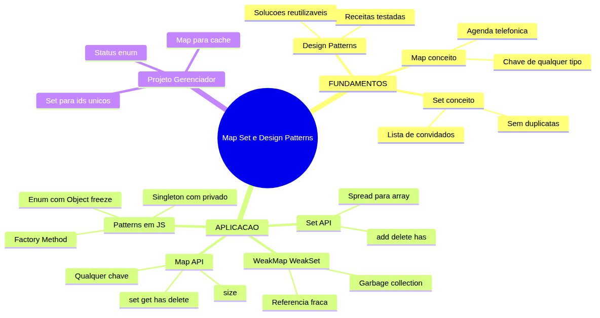

# JavaScript — Do Zero ao Profissional — Aula 17

## Map, Set e Design Patterns — Estruturas de Dados

**Duração estimada:** 100 minutos (50 de leitura + 50 de prática)
**Nível:** Intermediário
**Pré-requisitos:** Aulas 01 a 16 concluídas. Você precisa dominar objetos literais (Aula 12), `this` (Aula 13), arrow functions e HOFs (Aula 14), prototypes (Aula 15) e especialmente **classes** com `constructor`, `static`, `extends` e campos privados `#` (Aula 16) — a base dos Design Patterns.

---

## Objetivos de Aprendizagem

Ao final desta aula, você será capaz de:

- [ ] **Explicar** a limitação de objetos literais (chaves são sempre strings) e por que Map resolve esse problema
- [ ] **Criar** e **manipular** um Map com `.set()`, `.get()`, `.has()`, `.delete()` e `.size`
- [ ] **Usar** qualquer tipo de dado como chave em um Map (objetos, funções, números)
- [ ] **Iterar** um Map com `.entries()`, `.keys()`, `.values()` e `for...of`
- [ ] **Criar** e **manipular** um Set com `.add()`, `.has()`, `.delete()` e `.size`
- [ ] **Remover** duplicatas de um array usando `[...new Set(array)]`
- [ ] **Explicar** a diferença entre Map/Set e WeakMap/WeakSet (referência fraca vs forte, iterabilidade)
- [ ] **Implementar** um Enum em JavaScript com `Object.freeze()` e objeto literal
- [ ] **Criar** uma Factory Method com `static` em uma classe
- [ ] **Construir** um Singleton com campo privado `#instancia` e getter estático

---

## Como Usar Esta Aula

Esta aula está organizada em duas partes. A **primeira parte** constrói os conceitos universais de Map, Set e Design Patterns — sem JavaScript, sem código. É a base conceitual que vale para qualquer linguagem de programação. A **segunda parte** aplica esses conceitos em JavaScript puro: você vai usar Map e Set com a API completa, entender WeakMap e WeakSet, e implementar três Design Patterns clássicos diretamente no seu código.

Cada seção termina com um **Quick Check** para verificar seu entendimento. Ao longo do caminho, você encontrará seções **"Mão na Massa"** para praticar. Ao final, o arquivo separado **Questões de Aprendizagem** traz as tarefas de checkpoint — só avance para a Aula 18 quando conseguir completá-las por conta própria.

**Tempo estimado:** 50 minutos de leitura + 50 minutos de prática.

---

## Mapa Mental

Este diagrama mostra todos os conceitos que você vai dominar nesta aula:



---

## Recapitulação da Aula 16

| Aula | Conceito | Onde aparece nesta aula | Como se conecta |
|---|---|---|---|
| Aula 16 | **Classes** (`class`, `constructor`, métodos) | Seções 8, 9 | Factory Method usa `static`; Singleton usa campos privados `#` |
| Aula 16 | **Campos privados `#`** | Seção 8 | `#instancia` no Singleton é um campo privado estático |
| Aula 16 | **Métodos estáticos `static`** | Seção 8 | `TarefaFactory.criar()` é método estático |
| Aula 13 | **Objetos e `this`** | Seções 5, 6 | Objetos como chaves em Map; objetos em Set |
| Aula 14 | **Arrow functions e HOFs** | Seções 5, 9 | Iteração de Map com arrow functions; cache com Map |

---

**FUNDAMENTOS: O Poder das Estruturas de Dados Especializadas e Padrões de Projeto**

> *Os conceitos desta seção são universais — valem para qualquer linguagem de programação, independentemente da sintaxe de uma linguagem específica. Aqui você vai entender por que Map, Set e Design Patterns existem. Na segunda parte, você verá como implementá-los em código.*

---

## 1. O Problema das Estruturas Tradicionais

Imagine que você está organizando uma agenda de contatos. Cada contato tem um nome e um telefone. Você naturalmente pensa em usar um objeto literal.

Pense em um objeto como uma ficha de papel: cada ficha tem um nome (a chave) e um telefone (o valor). Você escreve "João" na etiqueta e "9999-0001" no conteúdo. Enquanto as etiquetas forem textos simples, tudo funciona bem.

Isso funciona bem enquanto as chaves forem textos simples. Mas e se você quiser usar um **objeto** como chave? Ou um **número**? Ou uma **função**? Em dicionários que só aceitam string como chave, o sistema converte automaticamente a chave para string.

Agora imagine que você quer usar um carimbo (um objeto) como etiqueta. Você pega o carimbo, tenta colocá-lo como identificador na ficha — mas em vez de usar o carimbo em si, o sistema automaticamente escreve "object Object" na etiqueta. Perdeu-se a identidade do carimbo. Qualquer outro carimbo viraria a mesma etiqueta genérica.

Percebeu o problema? A chave se tornou uma representação genérica inválida — não o objeto original. Qualquer outro objeto usado como chave sobrescreveria a mesma entrada.

Agora pense em listas que não podem ter repetições. Você cria uma lista de convidados para um evento. Com arrays, você pode acidentalmente adicionar a mesma pessoa duas vezes.

Um array é como uma lista de papel onde você escreve nomes um abaixo do outro. Nada impede você de escrever "Ana" duas vezes, "Bruno" três vezes. O papel não reclama — ele simplesmente acumula. Se você tem 5 nomes escritos mas só 3 pessoas diferentes, o tamanho da lista é 5, mesmo que o número real de convidados únicos seja 3.

O array não reclama. Ele simplesmente aceita. Para garantir unicidade, você precisaria de um mecanismo extra de verificação — uma estrutura que, por definição, **não aceita duplicatas**.

Esses dois problemas — **chaves flexíveis** (não só string) e **unicidade garantida** — são o ponto de partida desta aula. Vamos ver como a ciência da computação resolve ambos com Map e Set.

Há também um terceiro problema: **repetição de soluções**. Você já deve ter escrito código que cria objetos de forma parecida em vários lugares — ajustando manualmente cada propriedade, verificando se o objeto já existe, gerenciando configurações globais. Esses problemas são tão comuns que têm **receitas testadas** — os Design Patterns.

### Quick Check 1

**1. O que acontece quando você usa um objeto como chave em um objeto literal (`{}`)?**
**Resposta:** O sistema converte automaticamente o objeto para uma representação textual genérica, resultando na string `"[object Object]"`. Isso significa que qualquer objeto usado como chave aponta para a mesma propriedade, perdendo a distinção entre chaves diferentes.

**2. Por que um array comum não é adequado para garantir que não existam elementos repetidos?**
**Resposta:** Porque arrays são estruturas ordenadas que permitem qualquer valor em qualquer posição, sem validação de unicidade. Para detectar duplicatas manualmente, você precisaria verificar todo o array a cada inserção com `.includes()`, o que é ineficiente e trabalhoso. Set resolve isso ao não permitir duplicatas por definição.

---

## 2. Map — O Dicionário Universal

Você já conhece objetos literais: coleções de pares chave-valor. Mas objetos têm uma limitação fundamental: **a chave sempre é convertida para string**.

O Map surge para resolver exatamente isso. Um Map é uma coleção de pares chave-valor onde a **chave pode ser qualquer tipo**: objetos, funções, números, arrays, outros Maps. Nada é convertido automaticamente.

**A analogia da agenda telefônica flexível:**

Imagine uma agenda telefônica onde cada contato não precisa ter um nome. Você pode ter:
- Um contato associado a um **objeto** (a foto da pessoa)
- Um contato associado a um **número** (o código do apartamento)
- Um contato associado a uma **função** (o horário de funcionamento)

Essa agenda não se limita a textos como identificadores. Cada "chave" mantém sua identidade original. É exatamente isso que um Map faz.

**O que torna o Map especial:**

1. **Chaves de qualquer tipo**: objeto, função, número, string, até `undefined` — cada um mantém sua identidade
2. **Preservação de ordem**: os elementos são iterados na ordem em que foram inseridos (objetos literais não garantem ordem para chaves não-inteiras)
3. **Tamanho nativo**: `.size` diz quantos pares existem (objetos exigem `Object.keys().length`)
4. **Rico em métodos**: `set`, `get`, `has`, `delete`, `clear`, `entries`, `keys`, `values`
5. **Performance**: operações de busca são otimizadas para grandes coleções

### Quick Check 2

**1. Qual a diferença fundamental entre um Map e um objeto literal no que diz respeito ao tipo da chave?**
**Resposta:** No objeto literal, a chave é sempre convertida para string (via `.toString()`). No Map, a chave mantém seu tipo original — objetos, funções, números e outros Maps podem ser usados diretamente como chaves, cada um mantendo sua identidade.

**2. Além da flexibilidade de chaves, cite duas vantagens do Map sobre objetos literais.**
**Resposta:** (1) Preservação da ordem de inserção — o Map garante que a iteração siga a ordem em que os pares foram adicionados. (2) Propriedade `.size` nativa que informa quantos pares existem, sem precisar contar manualmente as chaves da coleção. (3) Métodos específicos como `.has()`, `.delete()` e `.clear()`.

---

## 3. Set — A Coleção sem Duplicatas

Se Map é sobre "chaves flexíveis", Set é sobre "valores únicos". Um Set é uma coleção de valores onde **cada valor só pode aparecer uma vez**.

**A analogia da lista de convidados de casamento:**

Você está organizando um casamento e precisa da lista de convidados. A regra número 1: **ninguém pode aparecer duas vezes**. Se a sua tia Maria já está na lista, adicionar "Maria" de novo não faz sentido — ela continua sendo a mesma pessoa.

Um Set funciona exatamente assim:
- Você adiciona um valor
- Se o valor já existe, nada acontece — o Set simplesmente ignora
- Você nunca precisa verificar "esse valor já está aqui?" antes de adicionar

**Casos de uso reais:**

- **IDs únicos**: garantir que um conjunto de IDs de tarefas não tenha repetições
- **Tags/categorias**: coleção de tags sem duplicatas
- **Itens visitados**: rastrear quais itens o usuário já viu
- **Operações de conjunto**: união, interseção e diferença entre coleções (simuladas com Set)

### Quick Check 3

**1. O que acontece quando você tenta adicionar ao Set um valor que já existe?**
**Resposta:** O Set simplesmente ignora a operação. O valor não é adicionado novamente, e o Set permanece inalterado. Não há erro nem exceção — o comportamento silencioso de "não duplicar" é proposital e desejado.

**2. Dê dois exemplos de situações reais onde um Set seria mais adequado que um array.**
**Resposta:** (1) Lista de tags de um artigo — cada tag deve aparecer apenas uma vez. (2) IDs de tarefas concluídas — um mesmo ID não pode ser marcado como concluído duas vezes.

---

## 4. Design Patterns — Receitas Testadas

Você já deve ter escrito código e pensado: "Isso parece um problema que alguém já resolveu antes". É exatamente esse o insight dos Design Patterns.

**Design Patterns** (Padrões de Projeto) são soluções testadas e documentadas para problemas recorrentes no desenvolvimento de software. Eles não são código pronto — são **receitas** que você adapta ao seu contexto.

**A analogia da cozinha profissional:**

Um chef não inventa uma nova técnica toda vez que precisa fazer um molho. Ele tem **receitas testadas**: molho bechamel, molho holandês, molho de tomate. Cada receita resolve um problema específico (engrossar, emulsionar, acidificar) e pode ser adaptada com ingredientes locais.

Os Design Patterns são as "receitas" da programação:
- **Factory Method**: "Preciso criar objetos de forma consistente, mas o tipo exato pode variar" → use a receita Factory
- **Singleton**: "Preciso garantir que só exista UMA instância desta classe no sistema inteiro" → use a receita Singleton
- **Enum**: "Preciso de um conjunto fixo de valores possíveis, sem chance de digitar errado" → use a receita Enum

Você conhecerá três patterns nesta aula — todos implementáveis com JavaScript puro, sem bibliotecas externas. E todos aparecerão no seu Gerenciador de Tarefas.

### Quick Check 4

**1. O que é um Design Pattern em suas próprias palavras?**
**Resposta:** Um Design Pattern é uma solução reutilizável e documentada para um problema comum de design de software. Não é código pronto, mas um modelo/ receita que você adapta ao seu contexto específico.

**2. Qual dos três patterns desta aula você usaria para garantir que uma classe tenha apenas uma instância em todo o sistema?**
**Resposta:** Singleton. Ele usa um campo interno controlado pela própria classe para armazenar a única instância e retorna sempre a mesma no `constructor` ou via getter estático.

---

**APLICAÇÃO: Map, Set e Design Patterns em JavaScript Puro**

> *Agora que você entende os conceitos de Map, Set e Design Patterns, vamos conectá-los à prática com JavaScript. Você vai usar a API completa de Map e Set, explorar WeakMap e WeakSet, e implementar três patterns clássicos — tudo isso enquanto refatora o Gerenciador de Tarefas.*

---

## 5. Map na Prática — API e Cache

Vamos começar com a criação e manipulação básica de um Map.

### Criando e Adicionando

```javascript
const cache = new Map();

// Adicionar pares chave-valor
cache.set("usuario:1", { nome: "João" });
cache.set("usuario:2", { nome: "Maria" });

// O retorno do .set() é o próprio Map — permite encadeamento!
cache.set("usuario:3", { nome: "Carlos" })
     .set("usuario:4", { nome: "Ana" });
```

### Lendo e Verificando

```javascript
// Ler valor pela chave
const usuario = cache.get("usuario:1");
console.log(usuario); // { nome: "João" }

// Chave inexistente retorna undefined
console.log(cache.get("usuario:99")); // undefined

// Verificar se chave existe
console.log(cache.has("usuario:1")); // true
console.log(cache.has("usuario:99")); // false
```

### Removendo

```javascript
// Remover um par
cache.delete("usuario:2"); // true (removeu)
cache.delete("usuario:99"); // false (não existia)

// Tamanho atual
console.log(cache.size); // 3

// Limpar tudo
cache.clear();
console.log(cache.size); // 0
```

### A Grande Virada: Chaves de Qualquer Tipo

Aqui está a diferença que muda tudo:

```javascript
const mapaAvancado = new Map();

// Objeto como chave
const chaveObjeto = { id: 1 };
mapaAvancado.set(chaveObjeto, "Metadados do objeto");

// Função como chave
function minhafuncao() {}
mapaAvancado.set(minhafuncao, "Essa função foi registrada");

// Número como chave
mapaAvancado.set(42, "A resposta para tudo");

// Array como chave
mapaAvancado.set([1, 2, 3], "Coordenadas");
```

> *Cuidado: cada `[1, 2, 3]` é um array diferente na memória. Se você tentar recuperar com `mapaAvancado.get([1, 2, 3])`, receberá `undefined` — porque o array literal cria um NOVO objeto. Para recuperar a chave, guarde a referência do array em uma variável.*

```javascript
// Outro Map como chave
const chaveMap = new Map();
chaveMap.set("chave", "valor");
mapaAvancado.set(chaveMap, "Map aninhado");

// Cada chave mantém sua identidade
console.log(mapaAvancado.get(chaveObjeto)); // "Metadados do objeto"
// Mas outro objeto com o mesmo conteúdo NÃO é a mesma chave!
console.log(mapaAvancado.get({ id: 1 })); // undefined
```

> *Percebeu a sutileza? `{ id: 1 }` e `chaveObjeto` são objetos diferentes na memória, mesmo tendo o mesmo conteúdo. O Map compara por **referência** (identidade do objeto), não por valor.*

### Iteração

```javascript
const tarefas = new Map();
tarefas.set(1, { texto: "Comprar pão", status: "pendente" });
tarefas.set(2, { texto: "Estudar JS", status: "concluida" });

// for...of entries() — padrão
for (const [id, tarefa] of tarefas.entries()) {
    console.log(`${id}: ${tarefa.texto} (${tarefa.status})`);
}

// Equivalente: for...of direto no Map (também itera entries)
for (const [id, tarefa] of tarefas) {
    // Mesmo resultado
}

// Só as chaves
for (const id of tarefas.keys()) {
    console.log(id); // 1, 2
}

// Só os valores
for (const tarefa of tarefas.values()) {
    console.log(tarefa.texto); // "Comprar pão", "Estudar JS"
}

// Converter para array de pares
const arrayPares = [...tarefas.entries()];
console.log(arrayPares);
// [[1, { texto: "Comprar pão", status: "pendente" }], [2, { texto: "Estudar JS", status: "concluida" }]]
```

### Map como Cache

Uma das aplicações mais úteis do Map é como **cache** — armazenar resultados de operações caras para reutilizá-los depois.

```javascript
const resultados = new Map();

function calcularAlgo(fator) {
    if (resultados.has(fator)) {
        console.log(`Usando cache para fator ${fator}`);
        return resultados.get(fator);
    }
    
    // Operação "cara" (simulada)
    const resultado = fator * 2 + Math.random();
    
    resultados.set(fator, resultado);
    return resultado;
}

console.log(calcularAlgo(5)); // Calcula e armazena
console.log(calcularAlgo(5)); // Retorna do cache — mais rápido!
console.log(calcularAlgo(10)); // Calcula e armazena
```

**Mão na Massa — Seu Primeiro Map:**

Crie um arquivo `map-pratica.js` e escreva:

```javascript
// 1. Crie um Map de produtos em um carrinho de compras
const carrinho = new Map();

// 2. Adicione 3 produtos (id numérico como chave, objeto como valor)
carrinho.set(101, { nome: "Teclado", preco: 150, qtd: 1 });
carrinho.set(102, { nome: "Mouse", preco: 80, qtd: 2 });
carrinho.set(103, { nome: "Monitor", preco: 1200, qtd: 1 });

// 3. Calcule o total
let total = 0;
for (const [id, produto] of carrinho) {
    total += produto.preco * produto.qtd;
    console.log(`${produto.nome} x${produto.qtd} = R$${produto.preco * produto.qtd}`);
}
console.log(`Total: R$${total}`);

// 4. Verifique se um produto existe
console.log(carrinho.has(101)); // true
console.log(carrinho.has(999)); // false

// 5. Remova um produto
carrinho.delete(102);
console.log(`Itens no carrinho: ${carrinho.size}`); // 2
```

**Verificação:** O script deve exibir os produtos, o total e ao final 2 itens no carrinho.

### Quick Check 5

**1. O que o método `.set()` retorna, e como isso pode ser útil?**
**Resposta:** O `.set()` retorna o próprio Map. Isso permite encadeamento de chamadas: `map.set(1, "a").set(2, "b").set(3, "c")`. É um padrão comum para inicialização concisa.

**2. Por que dois objetos com o mesmo conteúdo (`{id: 1}` e `{id: 1}`) são considerados chaves DIFERENTES em um Map?**
**Resposta:** Porque Map compara chaves por **referência** (identidade na memória), não por valor. Cada objeto literal cria um novo espaço na memória, então mesmo com o mesmo conteúdo, são objetos diferentes. Para usar a mesma chave, é preciso guardar a referência do objeto original em uma variável.

---

## 6. Set na Prática — Unicidade Garantida

Vamos ver o Set em ação.

### Criando e Adicionando

```javascript
const ids = new Set();

ids.add(1);
ids.add(2);
ids.add(1); // ignorado — 1 já existe!
ids.add(3);

console.log(ids.size); // 3 (não 4!)
```

### Verificando e Removendo

```javascript
console.log(ids.has(1)); // true
console.log(ids.has(99)); // false

ids.delete(2);
console.log(ids.has(2)); // false
console.log(ids.size); // 2
```

### O Truque Mais Útil: Remover Duplicatas de Array

Esta é uma aplicação tão comum que merece destaque:

```javascript
const tarefas = ["comprar", "comprar", "limpar", "estudar", "limpar", "comprar"];

const tarefasUnicas = [...new Set(tarefas)];
console.log(tarefasUnicas); // ["comprar", "limpar", "estudar"]
```

Veja como funciona:
1. `new Set(tarefas)` — cria um Set a partir do array, eliminando duplicatas automaticamente
2. `[... ]` — espalha os elementos do Set de volta para um array (spread operator)
3. Pronto! Array limpo, sem duplicatas, em uma única linha

### Iteração

```javascript
const tags = new Set(["js", "html", "css", "js"]);

// for...of
for (const tag of tags) {
    console.log(tag); // "js", "html", "css"
}

// Converter para array
const arrayTags = [...tags];
console.log(arrayTags); // ["js", "html", "css"]

// forEach
tags.forEach(tag => console.log(tag.toUpperCase())); // "JS", "HTML", "CSS"
```

### Operações com Sets

Historicamente, Set não tinha métodos nativos de união. A partir do ES2025, você pode usar `.union()`, `.intersection()` e `.difference()` em ambientes modernos — mas os padrões manuais com spread ainda são úteis para compatibilidade ampla:

```javascript
const setA = new Set([1, 2, 3, 4]);
const setB = new Set([3, 4, 5, 6]);

// União: tudo que está em A ou B
const uniao = new Set([...setA, ...setB]);
console.log([...uniao]); // [1, 2, 3, 4, 5, 6]

// Interseção: só o que está em A e B
const intersecao = new Set([...setA].filter(x => setB.has(x)));
console.log([...intersecao]); // [3, 4]

// Diferença: o que está em A mas não em B
const diferenca = new Set([...setA].filter(x => !setB.has(x)));
console.log([...diferenca]); // [1, 2]
```

**Mão na Massa — Set em Ação:**

Crie um arquivo `set-pratica.js`:

```javascript
// 1. Simule um sistema de inscrição em evento
const inscritos = new Set();

function inscrever(nome) {
    if (inscritos.has(nome)) {
        console.log(`${nome} já está inscrito!`);
        return false;
    }
    inscritos.add(nome);
    console.log(`${nome} inscrito com sucesso!`);
    return true;
}

inscrever("Ana"); // inscrito
inscrever("Bruno"); // inscrito
inscrever("Ana"); // já está inscrito!

console.log(`Total de inscritos: ${inscritos.size}`);

// 2. Processe uma lista com duplicatas
const listaBruta = ["joao@email.com", "maria@email.com", "joao@email.com", "ana@email.com"];
const emailsUnicos = [...new Set(listaBruta)];
console.log(emailsUnicos);
```

**Verificação:** "Ana" só aparece uma vez na contagem, e `emailsUnicos` tem 3 itens.

### Quick Check 6

**1. Escreva uma linha de código que converte um array `nums` com possíveis duplicatas em um array sem repetições.**
**Resposta:** `const unicos = [...new Set(nums)];` — o Set elimina as duplicatas, e o spread operator converte de volta para array.

**2. O método `.add()` de um Set também retorna o próprio Set. Isso permite encadeamento?**
**Resposta:** Sim! Assim como Map, `.add()` retorna o próprio Set, permitindo encadeamento: `set.add(1).add(2).add(3)`.

---

## 7. WeakMap e WeakSet — Referências Fracas

Agora vamos falar de dois primos "especiais" de Map e Set. Eles resolvem um problema sutil: **vazamento de memória**.

### O Problema da Referência Forte

Quando você adiciona um objeto como chave em um Map comum, o Map **segura uma referência forte** para aquele objeto. Mesmo que você elimine todas as outras referências ao objeto, o Map continua segurando ele — impedindo que o garbage collector (coletor de lixo) o remova da memória.

```javascript
let objeto = { dados: "importante" };
const mapa = new Map();
mapa.set(objeto, "metadado");

objeto = null; // Eliminamos nossa referência
// Mas o MAP ainda tem uma referência forte ao objeto!
// O objeto NÃO será coletado — vazamento de memória
```

### WeakMap: Referência Fraca

```javascript
let objetoWeak = { dados: "importante" };
const weak = new WeakMap();
weak.set(objetoWeak, "metadado");

objetoWeak = null; // Eliminamos nossa referência
// O WeakMap tem referência FRACA — não impede a coleta
// O objeto pode ser coletado pelo garbage collector!
```

**Características do WeakMap:**

1. **Chaves precisam ser objetos** — não aceita strings, números, símbolos
2. **Referência fraca** — se ninguém mais referencia o objeto, ele é coletado
3. **Sem `.size`** — o tamanho pode mudar a qualquer momento (GC pode limpar)
4. **Sem iteração** — não tem `.entries()`, `.keys()`, `.values()`, `for...of`
5. **Sem `.clear()`** — não pode ser esvaziado (os itens somem sozinhos)

### Caso de Uso Real: Metadados de Elementos DOM

Suponha que você está associando dados extras a elementos HTML. Com WeakMap, quando o elemento for removido do DOM, os metadados associados são automaticamente limpos:

```javascript
// Exemplo conceitual (executável no navegador)
const metadadosElementos = new WeakMap();

function associarDados(elemento, dados) {
    metadadosElementos.set(elemento, dados);
}

function obterDados(elemento) {
    return metadadosElementos.get(elemento);
}

// Quando o elemento for removido do DOM e não houver mais
// referências a ele, os metadados serão automaticamente
// coletados pelo garbage collector.
```

### WeakSet

WeakSet segue o mesmo princípio: aceita apenas objetos, tem referência fraca e não é iterável.

```javascript
const elementosAtivos = new WeakSet();

function ativarElemento(elemento) {
    elementosAtivos.add(elemento);
}

function estaAtivo(elemento) {
    return elementosAtivos.has(elemento);
}

function desativarElemento(elemento) {
    elementosAtivos.delete(elemento);
}
```

### Quick Check 7

**1. Qual a principal diferença entre Map e WeakMap?**
**Resposta:** WeakMap usa referência fraca para as chaves (que devem ser objetos). Se não houver outras referências ao objeto-chave, ele pode ser coletado pelo garbage collector, removendo automaticamente a entrada do WeakMap. Map usa referência forte, mantendo o objeto vivo mesmo sem outras referências.

**2. Por que WeakMap não tem `.size` nem métodos de iteração?**
**Resposta:** Porque o conteúdo do WeakMap pode mudar a qualquer momento, sem aviso, quando o garbage collector decide limpar objetos sem referências externas. Um `.size` momentâneo poderia se tornar obsoleto em milissegundos, tornando qualquer iteração ou medição não confiável.

---

## 8. Design Patterns em JavaScript

Agora vamos implementar os três patterns que discutimos na primeira parte — Enum, Factory e Singleton — usando JavaScript puro.

### Enum via Object Literal

Enum é um conjunto fixo de valores nomeados. JavaScript não tem enum nativo, mas podemos simular com `Object.freeze()`:

```javascript
const Status = Object.freeze({
    PENDENTE: "pendente",
    CONCLUIDA: "concluida",
    CANCELADA: "cancelada",
    ARQUIVADA: "arquivada"
});

// Uso
console.log(Status.PENDENTE); // "pendente"

// Tentar modificar falha silenciosamente (modo estrito: lança erro)
Status.NOVO = "novo"; // ignorado — Object.freeze impede
delete Status.PENDENTE; // ignorado
Status.PENDENTE = "novo_valor"; // ignorado

// Vantagens:
// - Evita strings soltas ("pendente" vs "Pendente" vs "PENDENTE")
// - Autocomplete no editor (Status.CONCLUIDA aparece ao digitar Status.)
// - Garantia de imutabilidade
```

**Por que `Object.freeze()`?**

`Object.freeze()` torna o objeto imutável:
- Não permite adicionar novas propriedades
- Não permite remover propriedades existentes
- Não permite alterar valores de propriedades existentes

```javascript
const StatusSemFreeze = {
    PENDENTE: "pendente"
};
StatusSemFreeze.PENDENTE = "outro"; // Funciona! Perdeu o sentido...

const StatusComFreeze = Object.freeze({
    PENDENTE: "pendente"
});
StatusComFreeze.PENDENTE = "outro"; // Ignorado (ou erro em strict mode)
```

### Factory Method

Factory é um pattern que **centraliza a criação de objetos** em um método dedicado, normalmente estático:

```javascript
class TarefaFactory {
    static criar(texto, status = Status.PENDENTE) {
        return {
            id: Date.now(),
            texto,
            status,
            criadaEm: new Date().toISOString()
        };
    }
    
    static criarConcluida(texto) {
        return TarefaFactory.criar(texto, Status.CONCLUIDA);
    }
}

// Uso
const tarefa1 = TarefaFactory.criar("Estudar Map e Set");
console.log(tarefa1);
// { id: 1719000000000, texto: "Estudar Map e Set", status: "pendente", criadaEm: "..." }

const tarefa2 = TarefaFactory.criar("Revisar Aula 16", Status.CONCLUIDA);
// { id: ..., texto: "Revisar Aula 16", status: "concluida", criadaEm: "..." }

const tarefa3 = TarefaFactory.criarConcluida("Ler documentação");
// { id: ..., texto: "Ler documentação", status: "concluida", criadaEm: "..." }
```

**Por que usar Factory?**

1. **Consistência**: toda tarefa criada tem a mesma estrutura
2. **Validação**: você pode adicionar regras na criação (ex: texto não vazio)
3. **Intenção clara**: `TarefaFactory.criarConcluida()` é mais expressivo que criar o objeto manualmente
4. **Manutenção**: se a estrutura da tarefa mudar, você altera em UM lugar

### Singleton via Campo Privado

Singleton garante que uma classe tenha **apenas uma instância** em todo o sistema:

```javascript
class Config {
    static #instancia; // campo privado estático
    #tema;
    #idioma;
    
    constructor() {
        if (Config.#instancia) {
            return Config.#instancia; // retorna a instância existente
        }
        this.#tema = "escuro";
        this.#idioma = "pt-BR";
        Config.#instancia = this; // armazena a primeira instância
    }
    
    static get instancia() {
        if (!Config.#instancia) {
            new Config(); // dispara o construtor que armazena a instância
        }
        return Config.#instancia;
    }
    
    get tema() { return this.#tema; }
    get idioma() { return this.#idioma; }
    
    set tema(valor) { this.#tema = valor; }
    set idioma(valor) { this.#idioma = valor; }
}

// Uso
const config1 = new Config();
const config2 = new Config();
console.log(config1 === config2); // true — mesma instância!

// Via getter estático (mais seguro)
const config3 = Config.instancia;
console.log(config1 === config3); // true

// Mudar em um lugar reflete em todos
config1.tema = "claro";
console.log(config2.tema); // "claro"
console.log(config3.tema); // "claro"
```

**Como o Singleton funciona:**

1. O campo `#instancia` é estático e privado — só a classe pode acessá-lo
2. No `constructor`, verificamos se `#instancia` já existe. Se sim, retornamos ela
3. Na primeira chamada, armazenamos `this` em `#instancia`
4. O getter estático `instancia` é uma forma segura de obter a instância sem depender de `new`

**Mão na Massa — Implemente os Três Patterns:**

Crie um arquivo `patterns-pratica.js`:

```javascript
// --- Enum ---
const Prioridade = Object.freeze({
    BAIXA: "baixa",
    MEDIA: "media",
    ALTA: "alta",
    URGENTE: "urgente"
});

// Teste a imutabilidade
Prioridade.NOVA = "nova";
console.log(Prioridade.NOVA); // undefined

// --- Factory ---
class TarefaFactory {
    static criar(texto, prioridade = Prioridade.MEDIA) {
        if (!texto || texto.trim() === "") {
            throw new Error("Texto da tarefa é obrigatório");
        }
        return {
            id: Date.now(),
            texto: texto.trim(),
            prioridade,
            criadaEm: new Date().toISOString()
        };
    }
}

// --- Singleton ---
class Logger {
    static #instancia;
    #logs = [];
    
    constructor() {
        if (Logger.#instancia) return Logger.#instancia;
        Logger.#instancia = this;
    }
    
    static get instancia() {
        if (!Logger.#instancia) new Logger();
        return Logger.#instancia;
    }
    
    log(mensagem) {
        const entrada = `[${new Date().toISOString()}] ${mensagem}`;
        this.#logs.push(entrada);
        console.log(entrada);
    }
    
    get logs() { return [...this.#logs]; }
}

// Teste
const tarefa = TarefaFactory.criar("Estudar Factory", Prioridade.ALTA);
Logger.instancia.log(`Tarefa criada: ${tarefa.texto}`);
Logger.instancia.log(`Prioridade: ${tarefa.prioridade}`);
console.log(Logger.instancia.logs);
```

**Verificação:** O Prioridade.NOVA retorna undefined, a Factory cria tarefas com estrutura consistente, e o Logger tem apenas uma instância (verifique com `===`).

### Quick Check 8

**1. Por que usar `Object.freeze()` em um Enum?**
**Resposta:** Para impedir que o objeto seja modificado acidentalmente. Sem `Object.freeze()`, qualquer parte do código poderia alterar o valor de `Status.PENDENTE` ou adicionar novos valores, quebrando a consistência do sistema.

**2. Qual a diferença entre acessar o Singleton via `new Config()` e via `Config.instancia`?**
**Resposta:** Ambos retornam a mesma instância. `new Config()` funciona porque o `constructor` verifica se `#instancia` já existe e a retorna. `Config.instancia` é um getter estático que faz a mesma verificação, mas é semanticamente mais claro — "estou pegando a instância, não criando uma nova".

---

## 9. Projeto Progressivo — Gerenciador de Tarefas com Map e Set

Vamos aplicar tudo que aprendemos no seu Gerenciador de Tarefas. Você vai refatorar três aspectos:

### 1. Status como Enum

Substitua strings soltas por um Enum:

```javascript
// EM VEZ DE:
const tarefa = { texto: "Estudar", status: "pendente" }; // pode digitar "Pendente" ou "pendent"

// USE:
const StatusTarefa = Object.freeze({
    PENDENTE: "pendente",
    CONCLUIDA: "concluida",
    CANCELADA: "cancelada"
});

const tarefa = { texto: "Estudar", status: StatusTarefa.PENDENTE }; // sem chance de erro
```

### 2. Set para Evitar Tarefas Duplicadas

No seu Gerenciador de Tarefas, você pode ter um Set de textos/IDs para garantir que a mesma tarefa não seja adicionada duas vezes:

```javascript
class GerenciadorTarefas {
    #tarefas = [];
    #textosExistentes = new Set();
    
    adicionar(texto, status = StatusTarefa.PENDENTE) {
        if (this.#textosExistentes.has(texto)) {
            console.log(`Tarefa "${texto}" já existe!`);
            return false;
        }
        
        const tarefa = TarefaFactory.criar(texto, status);
        this.#tarefas.push(tarefa);
        this.#textosExistentes.add(texto);
        return true;
    }
    
    listar() {
        return [...this.#tarefas];
    }
    
    get total() {
        return this.#tarefas.length;
    }
}
```

### 3. Map para Cache de Tarefas por Status

Em vez de filtrar o array toda vez, use um Map como cache para ter acesso instantâneo:

```javascript
class GerenciadorTarefas {
    #tarefas = [];
    #textosExistentes = new Set();
    #cacheStatus = new Map(); // status -> array de tarefas
    
    adicionar(texto, status = StatusTarefa.PENDENTE) {
        if (this.#textosExistentes.has(texto)) return false;
        
        const tarefa = TarefaFactory.criar(texto, status);
        this.#tarefas.push(tarefa);
        this.#textosExistentes.add(texto);
        
        // Atualiza o cache
        this.#atualizarCache(tarefa);
        return true;
    }
    
    #atualizarCache(tarefa) {
        const status = tarefa.status;
        if (!this.#cacheStatus.has(status)) {
            this.#cacheStatus.set(status, []);
        }
        this.#cacheStatus.get(status).push(tarefa);
    }
    
    buscarPorStatus(status) {
        if (!StatusTarefa[status.toUpperCase()]) {
            console.log("Status inválido!");
            return [];
        }
        return this.#cacheStatus.get(status) || [];
    }
    
    get tarefasPendentes() {
        return this.buscarPorStatus(StatusTarefa.PENDENTE);
    }
    
    get tarefasConcluidas() {
        return this.buscarPorStatus(StatusTarefa.CONCLUIDA);
    }
    
    get total() {
        return this.#tarefas.length;
    }
}
```

**Mão na Massa — Gerenciador Refatorado:**

Crie um arquivo `gerenciador-v2.js` com o código completo acima e teste:

```javascript
const gerenciador = new GerenciadorTarefas();

gerenciador.adicionar("Estudar Map", StatusTarefa.PENDENTE);
gerenciador.adicionar("Praticar Set", StatusTarefa.PENDENTE);
gerenciador.adicionar("Revisar Factory", StatusTarefa.CONCLUIDA);
gerenciador.adicionar("Estudar Map"); // ignorado — texto já existe!

console.log(`Total de tarefas: ${gerenciador.total}`);
console.log("Pendentes:", gerenciador.tarefasPendentes);
console.log("Concluídas:", gerenciador.tarefasConcluidas);
```

**Verificação:** "Estudar Map" é rejeitado na segunda tentativa, o cache de status retorna arrays separados por status, e o total reflete apenas tarefas únicas.

### Quick Check 9

**1. Por que usar Set para evitar tarefas duplicadas em vez de verificar o array com .find()?**
**Resposta:** O Set garante unicidade automaticamente — `.add()` simplesmente ignora valores duplicados. Com `.find()`, você teria que varrer o array inteiro a cada inserção (O(n)). Com `Set`, a verificação de duplicata é instantânea (O(1)).

**2. Qual a vantagem do Map para cache de tarefas por status?**
**Resposta:** O Map permite busca direta pela chave (status) sem precisar filtrar o array. Em vez de `tarefas.filter(t => t.status === Status.CONCLUIDA)` a cada consulta (O(n)), você faz uma busca O(1) com `cachePorStatus.get(Status.CONCLUIDA)`.

---

## Autoavaliação: Quiz Rápido

**1. Qual a única restrição para uma chave de WeakMap?**
**Resposta:** A chave precisa ser um objeto. WeakMap não aceita primitivos (string, number, boolean, symbol) como chave.

**2. Como você cria um Set a partir de um array e depois o converte de volta para array sem duplicatas?**
**Resposta:** `const unicos = [...new Set(array)]`. O Set elimina duplicatas automaticamente, e o spread operator espalha os valores únicos de volta em um array.

**3. O método `.set()` de um Map retorna o Map. Que vantagem isso traz?**
**Resposta:** Permite encadeamento de chamadas: `map.set(1, "a").set(2, "b").set(3, "c")` — código mais conciso e legível.

**4. O que `Object.freeze()` faz em um objeto literal usado como Enum?**
**Resposta:** Torna o objeto imutável: impede adição, remoção e alteração de propriedades. Qualquer tentativa de modificar é ignorada (silenciosamente em modo normal, com erro em strict mode).

**5. Qual a principal motivação para usar Factory Method em vez de criar objetos manualmente com `{}`?**
**Resposta:** Consistência, validação e manutenção centralizada. O Factory garante que todo objeto criado tenha a mesma estrutura, aplica regras de validação (ex: texto obrigatório) e, se a estrutura mudar, você altera em um único lugar.

**6. Como o Singleton garante que só exista uma instância da classe?**
**Resposta:** Usando um campo privado estático (`#instancia`). O `constructor` verifica se `#instancia` já existe; se sim, retorna a instância existente em vez de criar uma nova. A primeira chamada armazena `this` em `#instancia`.

**7. Dê um exemplo de quando usar WeakMap em vez de Map.**
**Resposta:** Quando você precisa associar metadados a objetos temporários (como elementos DOM). Com WeakMap, quando o objeto é removido e não há mais referências a ele, os metadados são automaticamente coletados pelo garbage collector, evitando vazamento de memória.

---

## Mão na Massa: Exercícios Graduados

**Exercício 1 (Fácil) — Filtro de Emails Únicos**

Você recebeu uma lista de emails com duplicatas. Crie uma função `emailsUnicos(lista)` que retorna um array sem emails repetidos.

```javascript
// Entrada
const emails = [
    "joao@email.com",
    "maria@email.com",
    "joao@email.com",
    "ana@email.com",
    "bruno@email.com",
    "maria@email.com"
];

// Sua função aqui
function emailsUnicos(lista) {
    // Use Set para resolver
}

console.log(emailsUnicos(emails));
// Deve retornar: ["joao@email.com", "maria@email.com", "ana@email.com", "bruno@email.com"]
```

**Gabarito:**

```javascript
function emailsUnicos(lista) {
    return [...new Set(lista)];
}
// O Set elimina automaticamente as duplicatas.
// O spread operator converte o Set de volta para array.
// Simples assim — uma linha resolve!
```

---

**Exercício 2 (Médio) — Cache de Operações Matemáticas**

Crie uma função `calculadoraComCache()` que retorna um objeto com três métodos:
- `adicionar(op, a, b)` — executa a operação (+ , -, *, /) e armazena em um cache
- `historico()` — retorna todas as operações do cache
- `limparCache()` — esvazia o cache

A chave do cache deve ser uma string no formato `"op:a:b"`.

```javascript
function calculadoraComCache() {
    const cache = new Map();
    
    return {
        adicionar(op, a, b) {
            const chave = `${op}:${a}:${b}`;
            
            if (cache.has(chave)) {
                console.log(`Usando cache para ${chave}`);
                return cache.get(chave);
            }
            
            let resultado;
            switch (op) {
                case "+": resultado = a + b; break;
                case "-": resultado = a - b; break;
                case "*": resultado = a * b; break;
                case "/": resultado = b !== 0 ? a / b : "Erro: divisão por zero"; break;
                default: return "Operação inválida";
            }
            
            cache.set(chave, resultado);
            return resultado;
        },
        historico() {
            return [...cache.entries()].map(([chave, valor]) => ({ operacao: chave, resultado: valor }));
        },
        limparCache() {
            cache.clear();
            console.log("Cache limpo");
        }
    };
}

// Teste
const calc = calculadoraComCache();
console.log(calc.adicionar("+", 5, 3)); // 8 (calcula)
console.log(calc.adicionar("+", 5, 3)); // 8 (cache!)
console.log(calc.adicionar("*", 4, 2)); // 8 (calcula)
console.log(calc.historico());
// [{ operacao: "+:5:3", resultado: 8 }, { operacao: "*:4:2", resultado: 8 }]
calc.limparCache();
console.log(calc.historico()); // []
```

**Gabarito:** O código acima é o gabarito completo. A chave do cache usa template literal para criar uma string única que identifica a operação e seus operandos. O cache é verificado antes de calcular, evitando trabalho repetido.

---

**Desafio (Difícil) — Sistema de Inscrição com Singleton e Set**

Crie um sistema completo que integre Singleton + Set + Factory:

1. Um **Enum** `Categoria` com valores: `"iniciante"`, `"intermediario"`, `"avancado"`
2. Um **Singleton** `ConfiguracaoEvento` que armazena o `nome` e `vagas` do evento
3. Um **Factory** `ParticipanteFactory` que cria objetos `{ id, nome, email, categoria }` com `id` único (use `Date.now() + Math.random()`)
4. Uma classe **`SistemaInscricao`** que usa:
   - `Set` para emails únicos (evitar dupla inscrição)
   - `Map` agrupando participantes por categoria (chave: categoria, valor: array de participantes)
   - Verificação de vagas (limite do ConfiguracaoEvento)

```javascript
// --- Enum ---
const Categoria = Object.freeze({
    INICIANTE: "iniciante",
    INTERMEDIARIO: "intermediario",
    AVANCADO: "avancado"
});

// --- Singleton ---
class ConfiguracaoEvento {
    static #instancia;
    #nome;
    #vagas;
    #totalInscritos = 0;
    
    constructor() {
        if (ConfiguracaoEvento.#instancia) return ConfiguracaoEvento.#instancia;
        this.#nome = "Workshop JS";
        this.#vagas = 10;
        ConfiguracaoEvento.#instancia = this;
    }
    
    static get instancia() {
        if (!ConfiguracaoEvento.#instancia) new ConfiguracaoEvento();
        return ConfiguracaoEvento.#instancia;
    }
    
    get nome() { return this.#nome; }
    get vagas() { return this.#vagas; }
    get vagasRestantes() { return this.#vagas - this.#totalInscritos; }
    get temVaga() { return this.#totalInscritos < this.#vagas; }
    
    inscrever() {
        if (!this.temVaga) return false;
        this.#totalInscritos++;
        return true;
    }
}

// --- Factory ---
class ParticipanteFactory {
    static criar(nome, email, categoria) {
        return {
            id: Date.now() + Math.random(),
            nome,
            email,
            categoria
        };
    }
}

// --- Sistema ---
class SistemaInscricao {
    #emailsInscritos = new Set();
    #participantesPorCategoria = new Map();
    #config = ConfiguracaoEvento.instancia;
    
    inscrever(nome, email, categoria) {
        // Validações
        if (this.#emailsInscritos.has(email)) {
            return { sucesso: false, mensagem: "Email já inscrito" };
        }
        
        if (!this.#config.temVaga) {
            return { sucesso: false, mensagem: "Evento lotado" };
        }
        
        if (!Object.values(Categoria).includes(categoria)) {
            return { sucesso: false, mensagem: "Categoria inválida" };
        }
        
        // Cria participante via Factory
        const participante = ParticipanteFactory.criar(nome, email, categoria);
        
        // Registra
        this.#emailsInscritos.add(email);
        this.#config.inscrever();
        
        // Agrupa por categoria
        if (!this.#participantesPorCategoria.has(categoria)) {
            this.#participantesPorCategoria.set(categoria, []);
        }
        this.#participantesPorCategoria.get(categoria).push(participante);
        
        return { sucesso: true, participante };
    }
    
    listarPorCategoria(categoria) {
        return this.#participantesPorCategoria.get(categoria) || [];
    }
    
    get totalInscritos() {
        return this.#emailsInscritos.size;
    }
    
    get vagasRestantes() {
        return this.#config.vagasRestantes;
    }
    
    relatorio() {
        console.log(`=== ${this.#config.nome} ===`);
        console.log(`Total de inscritos: ${this.totalInscritos}`);
        console.log(`Vagas restantes: ${this.vagasRestantes}`);
        for (const cat of Object.values(Categoria)) {
            const lista = this.listarPorCategoria(cat);
            console.log(`${cat}: ${lista.length} participantes`);
        }
    }
}

// --- Teste ---
const sistema = new SistemaInscricao();

console.log(sistema.inscrever("João", "joao@email.com", Categoria.INICIANTE).sucesso); // true
console.log(sistema.inscrever("Maria", "maria@email.com", Categoria.INTERMEDIARIO).sucesso); // true
console.log(sistema.inscrever("João", "joao@email.com", Categoria.AVANCADO).sucesso); // false — email duplicado

sistema.relatorio();
```

**Gabarito:** O código acima é o gabarito completo. Observe como os três patterns trabalham juntos: o Singleton gerencia a configuração global, o Factory cria participantes de forma consistente, e o Set/Map garantem unicidade e agrupamento eficiente.

---

## Resumo da Aula

### Os 4 Conceitos Fundamentais

1. **Map**: coleção chave-valor onde a chave pode ser **qualquer tipo** (objeto, função, número). Ideal para caches e dicionários com chaves complexas. API: `.set()`, `.get()`, `.has()`, `.delete()`, `.size`, `.entries()`, `.keys()`, `.values()`.

2. **Set**: coleção de valores **únicos**. Ideal para listas sem duplicatas. Truque essencial: `[...new Set(array)]` para remover duplicatas de arrays.

3. **WeakMap / WeakSet**: versões com **referência fraca** — não impedem o garbage collector de limpar chaves/valores sem outras referências. Sem `.size`, sem iteração. Ideais para metadados temporários.

4. **Design Patterns**: Enum (`Object.freeze()` para valores fixos), Factory (`static criar()` para criação consistente), Singleton (`#instancia` privado para instância única).

### O Que Você Construiu Hoje

- [x] Map com cache de operações e valores
- [x] Set para remover duplicatas de arrays
- [x] Enum de status com `Object.freeze()`
- [x] Factory Method para criar tarefas consistentes
- [x] Singleton para configuração global do sistema
- [x] Gerenciador de Tarefas refatorado com Map, Set e Design Patterns

---

## Próxima Aula

**Aula 18: O DOM e Custom Elements — A Ponte Entre JS e HTML**

Você dominou estruturas de dados especializadas e padrões de projeto. Agora seu código vai ganhar vida na página web. Na Aula 18, você vai aprender sobre o DOM (Document Object Model) — a árvore de elementos HTML que o JavaScript pode manipular. Você vai criar componentes personalizados com Custom Elements, selecionar elementos com `querySelector`, manipular conteúdo e estilos, e dar o primeiro passo para construir interfaces web dinâmicas.

---

## Referências

### Documentação Oficial

- [MDN Map](https://developer.mozilla.org/pt-BR/docs/Web/JavaScript/Reference/Global_Objects/Map) — documentação completa do Map
- [MDN Set](https://developer.mozilla.org/pt-BR/docs/Web/JavaScript/Reference/Global_Objects/Set) — documentação completa do Set
- [MDN WeakMap](https://developer.mozilla.org/pt-BR/docs/Web/JavaScript/Reference/Global_Objects/WeakMap) — referência fraca com objetos
- [MDN WeakSet](https://developer.mozilla.org/pt-BR/docs/Web/JavaScript/Reference/Global_Objects/WeakSet) — coleção de objetos com referência fraca
- [MDN Object.freeze](https://developer.mozilla.org/pt-BR/docs/Web/JavaScript/Reference/Global_Objects/Object/freeze) — imutabilidade de objetos

### Design Patterns

- [Refactoring Guru — Factory Method](https://refactoring.guru/pt-br/design-patterns/factory-method) — explicação e exemplos
- [Refactoring Guru — Singleton](https://refactoring.guru/pt-br/design-patterns/singleton) — padrão de instância única
- [Refactoring Guru — Catalog](https://refactoring.guru/pt-br/design-patterns) — catálogo completo de patterns

### Artigos para Aprofundamento

- [JavaScript.info — Map and Set](https://javascript.info/map-set) — tutorial interativo
- [JavaScript.info — WeakMap and WeakSet](https://javascript.info/weakmap-weakset) — garbage collection e referências fracas
- [MDN — Garbage Collection](https://developer.mozilla.org/pt-BR/docs/Web/JavaScript/Memory_Management) — gerenciamento de memória em JS

---

## FAQ

**P: Qual a diferença entre Map e Object?**
R: Object só aceita string ou symbol como chave (qualquer outro tipo é convertido para string). Map aceita **qualquer tipo** (objeto, função, número, etc.) sem conversão. Map também preserva ordem de inserção, tem `.size` nativo e métodos específicos como `.has()` e `.delete()`.

**P: Quando devo usar Set em vez de array?**
R: Quando a **unicidade** é um requisito — tags, IDs, emails, qualquer coleção onde valores repetidos não fazem sentido. Para listas que podem ter repetições (ordenadas por posição, como itens de uma lista de compras), continue usando array.

**P: Por que WeakMap não permite iteração?**
R: Porque o conteúdo do WeakMap pode mudar a qualquer momento, sem aviso, quando o garbage collector decide limpar objetos sem referências externas. Qualquer iteração seria potencialmente incorreta instantaneamente.

**P: `Object.freeze()` vale a pena para Enums?**
R: Sim, especialmente em projetos maiores ou em equipe. Ele previne erros comuns como digitar `Status.PENDENTE = "finalizado"` acidentalmente. Em código individual para estudo pode parecer excesso, mas é uma boa prática que se paga quando o projeto cresce.

**P: Factory vs `new` — qual usar?**
R: Use Factory quando a criação do objeto envolver lógica extra (validação, cálculo de defaults, formatação). Use `new` + `constructor` quando a criação for simples. Factory é especialmente útil quando você quer esconder a complexidade de criação de quem chama.

**P: Singleton é considerado anti-pattern?**
R: Singleton é controverso. Em excesso, cria acoplamento global e dificulta testes. Mas para casos legítimos (configurações globais, logger, conexão com banco), é uma solução pragmática e amplamente usada. Use com moderação.

**P: O que significa "garbage collection"?**
R: É o processo automático do JavaScript que libera memória de objetos que não são mais referenciados por ninguém. Você não precisa (e não deve) chamá-lo manualmente. WeakMap e WeakSet tiram proveito desse processo ao não segurar referências fortes.

**P: Posso usar Map e Set no Node.js?**
R: Sim! Map e Set são parte do padrão ECMAScript 6 (ES6), suportados por Node.js desde a versão 6.x (2016). Qualquer Node.js moderno (16+, 18+, 20+) tem suporte completo.

---

## Glossário

| Termo | Definição |
|---|---|
| **Map** | Coleção de pares chave-valor onde a chave pode ser qualquer tipo (objeto, função, número). Preserva ordem de inserção. |
| **Set** | Coleção de valores únicos. Cada valor só pode aparecer uma vez. Não tem pares chave-valor, apenas valores. |
| **WeakMap** | Map onde as chaves são objetos com referência fraca — não impedem o garbage collector. Sem `.size` ou iteração. |
| **WeakSet** | Set onde os valores são objetos com referência fraca. Sem `.size` ou iteração. |
| **Garbage Collection** | Processo automático de gerenciamento de memória que libera objetos sem referências. |
| **Enum** | Conjunto fixo de valores nomeados. Simulado em JS com `Object.freeze()`. |
| **Factory Method** | Pattern que centraliza a criação de objetos em um método dedicado (geralmente `static`). |
| **Singleton** | Pattern que garante que uma classe tenha apenas uma instância em todo o sistema. |
| **`Object.freeze()`** | Método que torna um objeto imutável — impede adição, remoção e alteração de propriedades. |
| **Referência Fraca** | Referência que não impede o garbage collector de coletar o objeto apontado. |
