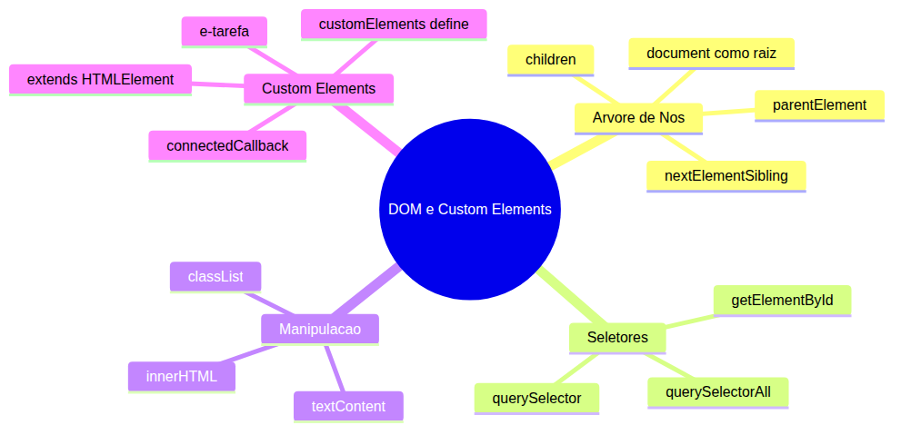
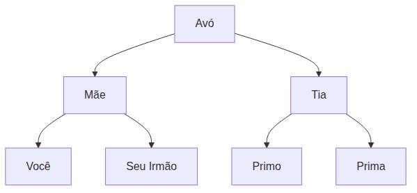
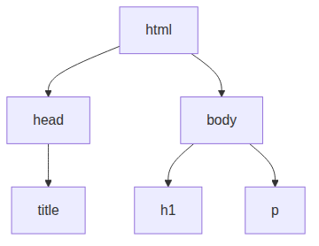
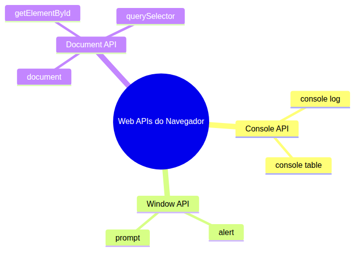
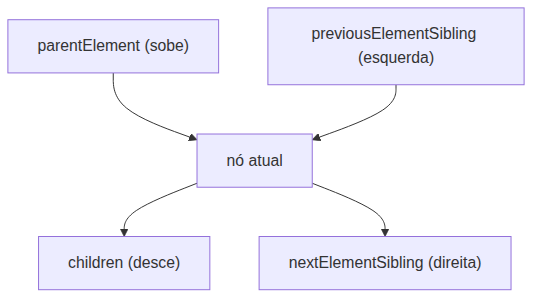
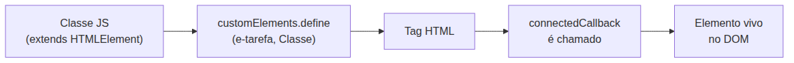

# JavaScript — Do Zero ao Profissional — Aula 18

## O DOM e Custom Elements — A Ponte Entre JS e HTML

**Duração estimada:** 130 minutos (65 de leitura + 65 de prática)
**Nível:** Intermediário
**Pré-requisitos:** Aulas 01 a 16 concluídas. Você precisa dominar `console.log` (Aula 01), HTML com `<script>` (Aula 02), `alert`/`prompt` (Aula 05), funções (Aula 10), objetos (Aula 12), `this` (Aula 13), callbacks e arrow functions (Aula 14), prototypes (Aula 15) e especialmente **classes** com `extends` (Aula 16) — a base dos Custom Elements.

---

## Objetivos de Aprendizagem

Ao final desta aula, você será capaz de:

- [ ] **Explicar** o DOM como uma árvore hierárquica de nós, usando a analogia da árvore genealógica (raiz, pais, filhos, irmãos)
- [ ] **Identificar** `document` como a raiz da árvore DOM e **explicar** que `console`, `document`, `alert` e `prompt` são Web APIs padronizadas que o navegador expõe ao JavaScript
- [ ] **Selecionar** elementos do DOM com `getElementById`, `querySelector` e `querySelectorAll`
- [ ] **Distinguir** NodeList (estática, com `forEach`) de HTMLCollection (viva, sem `forEach`)
- [ ] **Manipular** conteúdo de elementos com `.textContent`, `.innerHTML` e `.value`
- [ ] **Manipular** atributos com `.setAttribute`, `.getAttribute` e `.classList` (add/remove/toggle/contains)
- [ ] **Navegar** na árvore DOM usando `.parentElement`, `.children`, `.nextElementSibling` e `.previousElementSibling`
- [ ] **Definir** um Custom Element com `customElements.define()`, criando uma classe que `extends HTMLElement` e implementa `connectedCallback()`
- [ ] **Construir** o componente `<e-tarefa>` que renderiza uma tarefa (texto + status) no DOM, recebendo dados via atributos HTML
- [ ] **Comparar** `textContent` com `innerHTML`, sabendo quando usar cada um e entendendo o risco de segurança do `innerHTML`

---

## Como Usar Esta Aula

Esta aula está organizada em duas partes. A **primeira parte** constrói o conceito de árvore como modelo universal de hierarquia — sem JavaScript, sem navegador. A **segunda parte** aplica esses conceitos na prática com a DOM API do navegador e os Custom Elements.

Ao longo do caminho, você encontrará seções **"Mão na Massa"** (para fazer, não só ler) e **"Quick Check"** (para verificar se entendeu antes de avançar). Ao final, o arquivo separado **Questões de Aprendizagem** traz as tarefas de checkpoint — só avance para a Aula 19 quando conseguir completá-las por conta própria.

**Tempo estimado:** 60 minutos de leitura + 60 minutos de prática.

---

## Mapa Mental

Este diagrama mostra todos os conceitos que você vai dominar nesta aula:



> *O mapa mental acima mostra a estrutura da aula. Cada ramo representa um conceito que você vai explorar: a árvore de nós, as formas de selecionar elementos, as ferramentas para manipular conteúdo e atributos, e os Custom Elements que permitem criar seus próprios tipos de nó.*

---

## Recapitulação das Aulas Anteriores

| Aula | Conceito | Onde aparece nesta aula | Como se conecta |
|---|---|---|---|
| Aula 01 | `console.log()` | Seção 3 | Revelado como Console API — uma Web API do navegador |
| Aula 05 | `alert()`, `prompt()` | Seção 3 | Revelados como Window API — também Web APIs |
| Aula 10 | Funções e `return` | Seções 4-7 | Callbacks em seletores, corpo do `connectedCallback` |
| Aula 12 | Dot notation em objetos | Seções 4-6 | `element.textContent`, `element.classList.add()` |
| Aula 13 | `this` | Seção 7 | `this` dentro de `connectedCallback` é o próprio elemento |
| Aula 14 | Arrow functions, callbacks | Seção 4 | `querySelectorAll().forEach(el => ...)` |
| Aula 16 | Classes, `extends`, `constructor` | Seção 7 | **Âncora principal**: Custom Element É uma classe que estende `HTMLElement` |
| Aula 16 | GerenciadorTarefas (classe) | Seção 7 + Desafio | Fornece os dados que o `<e-tarefa>` renderiza |

---

**FUNDAMENTOS: A Árvore como Modelo Universal de Hierarquia**

> *Os conceitos desta seção são universais — valem para qualquer estrutura hierárquica, de árvores genealógicas a organogramas de empresas. Na segunda parte, você verá como o navegador implementa exatamente este modelo com a DOM API.*

---

## 1. O Que É uma Árvore? — Raiz, Pais, Filhos e Irmãos

### A ideia central

Imagine uma árvore genealógica. Você tem um avô, que teve dois filhos: seu pai e seu tio. Cada um deles teve filhos. Seu pai teve você e seu irmão. Seu tio teve seus primos.

Essa estrutura — onde cada elemento tem uma relação de **parentesco** com os outros — é chamada de **árvore** na computação. Não é uma árvore de verdade, com folhas e frutos. É uma **estrutura hierárquica** onde cada elemento é um **nó** ligado a outros nós por relações específicas.



### Os papéis em uma árvore

Cada nó em uma árvore pode desempenhar papéis diferentes dependendo de como você olha para ele:

- **Raiz**: o nó no topo da árvore, que não tem pai. No diagrama acima, a Avó é a raiz.
- **Pai**: o nó que está um nível acima e conectado diretamente. Mãe é pai de Você.
- **Filho**: o nó que está um nível abaixo e conectado diretamente. Você é filho de Mãe.
- **Irmãos**: nós que compartilham o mesmo pai. Você e Seu Irmão são irmãos.
- **Folha**: um nó que não tem filhos. Primo é uma folha (não tem filhos no diagrama).

### O que é um nó?

Um **nó** é qualquer elemento da árvore. Ele pode conter dados e referências para outros nós. A palavra "nó" vem da ideia de um ponto de conexão — como um nó em uma rede ou em uma corda.

> *Pense em um nó como uma "pessoa" na sua árvore genealógica. Cada pessoa tem informação (nome, data de nascimento) e conexões (quem é o pai, quem são os filhos).*

### Relações que você pode perguntar

Em qualquer árvore, você pode fazer perguntas como:

- "Quem é o **pai** deste nó?" — sobe um nível.
- "Quem são os **filhos** deste nó?" — desce um nível.
- "Quem é o **irmão** seguinte?" — anda pro lado no mesmo nível.

Essas três operações — subir, descer, andar pro lado — são a base de toda navegação em árvores. Você vai ver exatamente isso na prática na Parte 2.

### Quick Check 1

**1. Em uma árvore genealógica com Avô, Pai e Filho, qual é a relação entre Pai e Filho?**
**Resposta:** Pai é o pai (genitor) do Filho. O Filho é descendente direto do Pai, um nível abaixo na hierarquia.

**2. Se um nó tem um pai e também tem filhos, ele pode ser chamado de folha?**
**Resposta:** Não. Uma folha é um nó que NÃO tem filhos. Um nó que tem filhos é chamado de nó interno ou ramo. No diagrama, a Avó tem filhos (Mãe e Tia) — ela não é folha. Primo não tem filhos — ele é folha.

---

## 2. Por Que HTML Forma Naturalmente uma Árvore

### Tags dentro de tags

Agora vamos aplicar o modelo de árvore a algo que você conhece desde a Aula 02: HTML. Quando você escreve HTML, está criando uma árvore sem perceber.

Veja este HTML simples:

```html
<html>
  <head>
    <title>Minha Página</title>
  </head>
  <body>
    <h1>Título</h1>
    <p>Um parágrafo</p>
  </body>
</html>
```

Cada tag HTML pode conter outras tags dentro dela. Esse "dentro de" é exatamente a relação **pai-filho** da árvore.

O diagrama abaixo mostra a mesma estrutura como árvore:



### Quem é quem na árvore HTML

- `<html>` é a **raiz** da árvore. Tudo está dentro dele.
- `<html>` é **pai** de `<head>` e `<body>`.
- `<head>` e `<body>` são **irmãos** — mesmo pai (`<html>`).
- `<head>` é **pai** de `<title>`.
- `<body>` é **pai** de `<h1>` e `<p>`.
- `<h1>` e `<p>` são **irmãos** — mesmo pai (`<body>`).
- `<title>`, `<h1>` e `<p>` são **folhas** — não têm filhos.

> *A analogia da boneca russa (matrioska) também funciona aqui: uma tag dentro da outra, como bonecas que se encaixam. `<html>` é a boneca maior, que contém `<head>` e `<body>`, que por sua vez contêm outras tags.*

### Tudo é nó na árvore

Não são apenas as tags HTML que viram nós na árvore. Texto entre tags, comentários e até espaços em branco também são nós. O navegador constrói uma árvore completa com tudo que está na página.

Por exemplo, em `<p>Olá, mundo!</p>`, temos:
- Um nó **elemento** (`<p>`)
- Um nó **texto** filho ("Olá, mundo!")

O navegador faz esse trabalho automaticamente. Quando você abre uma página, ele lê o HTML, constrói a árvore mentalmente e usa essa árvore para decidir o que desenhar na tela. Essa árvore tem um nome: **DOM** — Document Object Model.

Você não precisa construí-la. Ela já existe. Você só precisa aprender a **enxergá-la** e **navegar por ela**.

### Abrindo os olhos para a ávore

Abra qualquer página no seu navegador e pressione **F12** (ou clique com botão direito → "Inspecionar"). Vá para a aba **Elements** (ou "Elementos"). O que você vê é a árvore DOM daquela página.

Cada linha indentada é um nó. As setas indicam relações pai-filho. Você pode expandir e recolher nós — exatamente como faria com pastas em um explorador de arquivos.

### Quick Check 2

**1. Dado o HTML `<div><ul><li>Item 1</li><li>Item 2</li></ul></div>`, identifique quem é pai de quem.**
**Resposta:** `<ul>` é pai de `<li>Item 1` e `<li>Item 2`. `<div>` é pai de `<ul>`. `<li>Item 1` e `<li>Item 2` são irmãos.

**2. O elemento `<html>` pode ter um "pai" na árvore DOM?**
**Resposta:** Em um documento HTML padrão, `<html>` é a raiz — ele não tem pai. É o ancestral de todos os outros elementos, como a Avó no diagrama da Seção 1.

---

**APLICAÇÃO: DOM API e Custom Elements no Navegador**

> *Agora que você entende o modelo universal de árvore, vamos conhecer a implementação concreta que o navegador oferece: a DOM API. E você vai descobrir que ferramentas que já usa desde a Aula 01 — como `console.log` — são Web APIs do mesmo ecossistema.*

---

## 3. document — A Raiz da Árvore no Navegador (E o Que São Web APIs)

### A grande revelação

Você se lembra da Aula 01? Seu primeiro código em JavaScript foi:

```javascript
console.log("Olá, mundo!");
```

Na época, você aprendeu que `console.log` é uma ferramenta para mostrar mensagens. O que talvez você não soubesse é que **`console` não é parte do JavaScript**. É uma **Web API** — uma interface que o navegador fornece para o JavaScript usar.

O mesmo vale para:

```javascript
alert("Olá!")      // Window API
prompt("Digite:")   // Window API
```

E agora você vai conhecer a maior e mais importante Web API do navegador:

```javascript
document  // Document API — a raiz da árvore DOM
```

### O que são Web APIs?

**API** significa *Application Programming Interface* — uma interface que permite que um programa se comunique com outro. **Web APIs** são interfaces padronizadas que o navegador expõe para o JavaScript usar.

Pense assim: o JavaScript é uma linguagem de programação. Sozinho, ele sabe fazer contas, manipular texto, criar estruturas de dados. Mas ele NÃO sabe mexer na página do navegador. Para isso, ele precisa de **pontes** — as Web APIs.



> *Cada Web API é uma "ponte" que o navegador oferece. O JavaScript chama a API, e a API faz o trabalho braçal de mexer na página, mostrar alertas ou escrever no console.*

### Tabela: O que você já usa × Qual Web API fornece

| O que você escreve | É uma Web API de... | Desde a aula |
|---|---|---|
| `console.log("...")` | Console API | Aula 01 |
| `alert("...")` | Window API | Aula 05 |
| `prompt("...")` | Window API | Aula 05 |
| `document.getElementById(...)` | Document API | **Esta aula!** |
| `document.querySelector(...)` | Document API | **Esta aula!** |

### document é a raiz

**`document`** é um objeto especial que o navegador cria automaticamente quando carrega uma página HTML. Ele representa a árvore DOM inteira — todos os elementos, textos, atributos, comentários.

> *Se a árvore DOM é uma árvore genealógica, `document` é o "avô ancestral" de todos os nós. É o ponto de entrada. Tudo começa com `document`.*

Você pode ver isso no console do navegador:

```javascript
console.log(document)   // Mostra a página inteira como objeto
console.log(document.head)   // Apenas a tag <head>
console.log(document.body)   // Apenas a tag <body>
```

Experimente! Abra o console em qualquer página (F12), digite `document` e pressione Enter. Você vai ver todo o HTML da página representado como um objeto que você pode expandir.

Na seção seguinte, você vai aprender a usar `document` para encontrar nós específicos dentro dessa árvore enorme.

### Quick Check 3

**1. `console.log` faz parte do JavaScript puro ou é uma Web API?**
**Resposta:** `console.log` é uma Web API (Console API). O JavaScript puro não tem a capacidade de escrever no console do navegador — essa capacidade é fornecida pelo navegador através da Console API.

**2. O que o objeto `document` representa?**
**Resposta:** `document` representa a árvore DOM completa da página HTML carregada. É a raiz que contém todos os elementos, textos e atributos da página.

---

## 4. Seletores — Como Encontrar Nós na Árvore

### O problema

Você tem uma árvore enorme (a página HTML) e quer encontrar um nó específico — um título, um botão, uma lista. Como fazer?

Os **seletores** são o "mapa" da árvore. Eles permitem localizar elementos específicos usando critérios como ID, classe, nome da tag ou qualquer seletor CSS.

### document.getElementById — O mais rápido

Quando um elemento tem um **ID** (atributo `id` no HTML), você pode encontrá-lo diretamente:

```javascript
const titulo = document.getElementById("titulo-principal");
// Retorna o elemento com id="titulo-principal", ou null se não existir
```

**Características:**
- Retorna UM elemento (ou `null` se não existir)
- É o método mais rápido — IDs são únicos por página
- O ID é uma string, sem o `#`

### document.querySelector — O mais flexível

Usando qualquer **seletor CSS** (classe, tag, ID, atributo, combinadores):

```javascript
const primeiroLink = document.querySelector("a");           // Primeiro link da página
const botaoSalvar = document.querySelector(".btn-salvar");  // Primeiro elemento com classe "btn-salvar"
const cabecalho = document.querySelector("#header");        // Elemento com id "header"
const itemAtivo = document.querySelector("li.ativo");       // Primeiro <li> com classe "ativo"
```

**Características:**
- Aceita QUALQUER seletor CSS válido
- Retorna o PRIMEIRO elemento que casa com o seletor
- Retorna `null` se não encontrar nada

### document.querySelectorAll — Todos os matches

Quando você quer **todos** os elementos que casam com um seletor:

```javascript
const todosLinks = document.querySelectorAll("a");          // Todos os links da página
const itensLista = document.querySelectorAll("li");         // Todos os itens de lista
const botoes = document.querySelectorAll(".btn");           // Todos os elementos com classe "btn"
```

**Características:**
- Aceita qualquer seletor CSS
- Retorna uma **NodeList** (não um array, mas parecido)
- Você pode usar `.forEach()` para iterar
- Retorna uma lista **vazia** se não encontrar nada (não `null`)

### NodeList vs HTMLCollection — Qual a diferença?

Este é um ponto que confunde muita gente. Vamos simplificar.

**NodeList** (retornada por `querySelectorAll`):
- É **estática**: se o DOM mudar depois que você fez a consulta, a NodeList NÃO muda
- Tem `.forEach()` nativo
- Parece muito com um array (mas não tem `.map()`, `.filter()`, etc.)

**HTMLCollection** (retornada por propriedades como `.children`, `.forms`):
- É **viva**: se o DOM mudar, a HTMLCollection se atualiza automaticamente
- NÃO tem `.forEach()` nativo
- Você precisa converter para array ou usar `for` para iterar

Exemplo prático:

```javascript
// NodeList - estática
const nodeList = document.querySelectorAll("li");
// Se você adicionar um novo <li> depois, a nodeList NÃO vai incluí-lo

// HTMLCollection - viva
const collection = document.body.children;
// Se você adicionar um novo filho ao body, a collection vai incluí-lo automaticamente
```

### Mão na Massa 1 — Selecionando Elementos

**Faça isso agora no navegador.**

- [ ] Abra qualquer página (por exemplo, google.com)
- [ ] Pressione F12 e vá para o Console
- [ ] Digite `document.querySelector("h1")` — veja o título principal
- [ ] Digite `document.querySelectorAll("a")` — veja todos os links
- [ ] Digite `document.querySelectorAll("a").length` — veja quantos links existem
- [ ] Digite `document.body.children` — veja a HTMLCollection dos filhos diretos do body
- [ ] Digite `document.querySelectorAll("body > *")` — compare com a linha anterior (NodeList vs HTMLCollection)

**Verificação:** Você deve ver elementos sendo retornados. Se `querySelector("h1")` retornar `null`, experimente outra tag como `"p"` ou `"img"`.

### Quick Check 4

**1. Qual seletor você usa para encontrar o ÚNICO elemento com `id="menu"`?**
**Resposta:** `document.getElementById("menu")` — é o mais rápido e direto para IDs. Você também pode usar `document.querySelector("#menu")`, mas `getElementById` é mais performático.

**2. Qual a diferença entre o retorno de `querySelectorAll` e `children`?**
**Resposta:** `querySelectorAll` retorna uma NodeList (estática, com `.forEach()`). `children` retorna uma HTMLCollection (viva, sem `.forEach()`). Na prática: se você vai iterar e o DOM não muda durante a iteração, ambos funcionam. Se o DOM pode mudar e você quer que a lista reflita isso, use HTMLCollection.

---

## 5. Manipular Conteúdo e Atributos — Dar Vida aos Nós

### Uma vez encontrado, você pode mudar

Encontrar elementos é só metade do trabalho. A outra metade é **mexer neles** — mudar o texto, alterar a classe, atualizar um atributo.

### Conteúdo de texto: .textContent

`.textContent` retorna ou altera o **texto puro** de um elemento, ignorando qualquer HTML interno.

```javascript
const paragrafo = document.querySelector("p");
console.log(paragrafo.textContent);   // Lê o texto
paragrafo.textContent = "Novo texto"; // Altera o texto
```

**Segurança:** `.textContent` é **seguro**. Se o texto contiver caracteres como `<`, `>`, eles são tratados como texto literal, não como HTML. Nunca causa problemas de segurança.

### Conteúdo HTML: .innerHTML

`.innerHTML` retorna ou altera o **HTML interno** de um elemento. Diferente de `.textContent`, ele interpreta tags HTML.

```javascript
const div = document.querySelector(".mensagem");
console.log(div.innerHTML);              // Lê o HTML interno
div.innerHTML = "<strong>Importante!</strong>"; // Interpreta como HTML
```

**Cuidado — risco de segurança (XSS):** Se você usar `.innerHTML` com dados que vêm do usuário (um comentário, um campo de formulário), um usuário malicioso pode injetar código JavaScript. Prefira `.textContent` sempre que possível.

```javascript
// PERIGOSO — se "dadosDoUsuario" vier de uma fonte externa:
div.innerHTML = dadosDoUsuario;

// SEGURO:
div.textContent = dadosDoUsuario;
```

> *Regra prática: use `.textContent` para textos. Use `.innerHTML` APENAS quando você CONTROLAR o conteúdo HTML (como no nosso componente `<e-tarefa>` mais adiante).*

### Campos de formulário: .value

Para `<input>`, `<textarea>` e `<select>`, você usa `.value` para ler ou definir o valor:

```javascript
const campoNome = document.querySelector("#nome");
console.log(campoNome.value);   // Lê o que o usuário digitou
campoNome.value = "João";       // Define o valor programaticamente
```

### Atributos: setAttribute e getAttribute

Elementos HTML têm atributos como `src`, `href`, `class`, `id`. Você pode ler e alterar qualquer atributo:

```javascript
const imagem = document.querySelector("img");

// Ler atributo
console.log(imagem.getAttribute("src"));

// Alterar atributo
imagem.setAttribute("src", "nova-imagem.jpg");

// Remover atributo
imagem.removeAttribute("alt");
```

### Classes CSS: classList

Manipular classes CSS é uma das tarefas mais comuns no DOM. `classList` é uma ferramenta completa para isso:

```javascript
const elemento = document.querySelector(".meu-elemento");

// Adicionar uma classe
elemento.classList.add("destaque");

// Remover uma classe
elemento.classList.remove("inativo");

// Alternar (se tem, remove; se não tem, adiciona)
elemento.classList.toggle("visivel");

// Verificar se tem uma classe
elemento.classList.contains("destaque");  // true ou false
```

**Por que `classList` é melhor que `setAttribute("class", ...)`?**

Com `setAttribute("class", "nova-classe")`, você SOBRESCREVE todas as classes existentes. Com `classList.add()`, você ADICIONA sem perder as classes que já estavam lá.

```javascript
// RUIM — perde as classes existentes:
elemento.setAttribute("class", "destaque");

// BOM — mantém as classes existentes e adiciona "destaque":
elemento.classList.add("destaque");
```

### Mão na Massa 2 — Manipulando o DOM

**Faça isso no navegador agora.**

- [ ] Abra qualquer página e selecione um elemento: `const el = document.querySelector("h1")`
- [ ] Mude o texto: `el.textContent = "Novo título maneiro!"`
- [ ] Adicione uma classe: `el.classList.add("destaque")`
- [ ] Verifique no Elements (F12) se a classe foi adicionada
- [ ] Remova a classe: `el.classList.remove("destaque")`
- [ ] Alterne a classe: `el.classList.toggle("ativo")` — execute várias vezes e veja a classe aparecer e sumir
- [ ] Use `setAttribute`: `el.setAttribute("data-nota", "10")`
- [ ] Leia o atributo: `el.getAttribute("data-nota")`

**Verificação:** O texto do título mudou na página. A classe aparece e some no Elements. O atributo `data-nota` aparece no HTML do elemento.

### Quick Check 5

**1. Qual a diferença entre `textContent` e `innerHTML`?**
**Resposta:** `textContent` trata o valor como texto puro (seguro, não interpreta HTML). `innerHTML` interpreta o valor como HTML (perigoso com dados não confiáveis, pois pode executar scripts). Use `textContent` para textos, `innerHTML` apenas quando você controla o conteúdo.

**2. Por que `classList.add()` é melhor que `setAttribute("class", ...)`?**
**Resposta:** `classList.add()` ADICIONA uma classe às classes existentes. `setAttribute("class", ...)` SOBRESCREVE todas as classes, removendo as que já estavam. Com `classList`, você nunca perde classes acidentalmente.

---

## 6. Navegar na Árvore — Percorrendo Relações Entre Nós

### Andando pela árvore

Além de encontrar elementos por ID ou seletor, você pode **caminhar** pela árvore usando as relações de parentesco que aprendeu na Seção 1.



### Subir: .parentElement

Partindo de qualquer elemento, você pode acessar o **pai** dele:

```javascript
const item = document.querySelector("li");
const lista = item.parentElement;  // A <ul> ou <ol> que contém o <li>
const container = lista.parentElement; // A div que contém a lista
```

Você pode "subir" quantos níveis quiser, até chegar ao `<body>` e depois ao `<html>`.

### Descer: .children

De um elemento pai, você pode acessar todos os **filhos elementos**:

```javascript
const lista = document.querySelector("ul");
const itens = lista.children;  // HTMLCollection com todos os <li> filhos
console.log(itens.length);      // Quantos filhos
console.log(itens[0]);          // Primeiro filho
console.log(itens[1]);          // Segundo filho
```

### Irmãos: .nextElementSibling e .previousElementSibling

Entre elementos no mesmo nível (mesmo pai), você navega horizontalmente:

```javascript
const primeiroItem = document.querySelector("li");
const segundoItem = primeiroItem.nextElementSibling;     // Próximo irmão
const itemAnterior = segundoItem.previousElementSibling; // Irmão anterior
```

### Diferença entre children e childNodes

`children` retorna APENAS elementos HTML (tags). `childNodes` retorna TUDO — elementos, texto, comentários.

```javascript
const div = document.querySelector("div");

div.children    // Só as tags filhas: <p>, <span>, etc.
div.childNodes  // Tudo: tags, espaços em branco (texto), comentários
```

Na prática, você vai usar `children` 90% do tempo. `childNodes` serve para casos específicos onde você precisa também dos nós de texto.

### Caso de uso real

Imagine uma lista de tarefas. Você clica em uma tarefa (Aula 19) e quer destacar a tarefa seguinte:

```javascript
const tarefaClicada = document.querySelector(".tarefa-ativa");
const proximaTarefa = tarefaClicada.nextElementSibling;
if (proximaTarefa) {
    proximaTarefa.classList.add("destaque");
}
```

### Mão na Massa 3 — Navegando na Árvore

**Faça isso no navegador agora.**

- [ ] Abra qualquer página com uma lista (ul/ol)
- [ ] Selecione o primeiro item: `const primeiro = document.querySelector("li")`
- [ ] Encontre o irmão seguinte: `const segundo = primeiro.nextElementSibling` — confira no console
- [ ] Suba até a lista: `const lista = primeiro.parentElement` — veja que é a `<ul>`
- [ ] Liste os filhos: `lista.children` — veja a HTMLCollection
- [ ] Suba até o body usando um loop:

```javascript
let elemento = document.querySelector("h1");
while (elemento.parentElement) {
    console.log(elemento.tagName);
    elemento = elemento.parentElement;
}
```

**Verificação:** O loop mostra a hierarquia completa do h1 até o html. Cada tag name aparece no console.

### Quick Check 6

**1. Para subir um nível na árvore DOM (do filho para o pai), qual propriedade você usa?**
**Resposta:** `.parentElement`. Exemplo: `const pai = filho.parentElement`.

**2. Para acessar o elemento imediatamente após um elemento no mesmo nível, qual propriedade você usa?**
**Resposta:** `.nextElementSibling`. Exemplo: `const proximo = atual.nextElementSibling`. Se não houver próximo irmão, retorna `null`.

---

## 7. Custom Elements — Seus Próprios Nós na Árvore

### Você pode criar novos tipos de nó

Até agora você aprendeu a encontrar, manipular e navegar pelos nós que já existem na árvore DOM. Mas e se você pudesse **criar seus próprios tipos de nó**? Com **Custom Elements**, você pode.

Um Custom Element é um elemento HTML que você mesmo define. Ele se comporta como qualquer tag nativa (`<div>`, `<p>`, `<span>`), mas com comportamento e aparência que você programa.

### A conexão com a Aula 16

Lembra da Aula 16, quando você aprendeu que uma **classe** é um molde para criar objetos? Um Custom Element É exatamente isso — uma classe que serve de molde para criar elementos HTML.

```javascript
// Aula 16: classe normal
class GerenciadorTarefas {
    constructor() { /* ... */ }
}

// Aula 18: classe que vira elemento HTML
class ETarefa extends HTMLElement {
    connectedCallback() { /* ... */ }
}
```

A diferença fundamental:
- Na Aula 16, você criava objetos com `new GerenciadorTarefas()`
- Agora, você cria elementos HTML com `<e-tarefa>` no HTML ou com `document.createElement("e-tarefa")`

A classe `ETarefa` **estende** `HTMLElement` — ela herda todo o comportamento de um elemento HTML nativo.

### A receita do Custom Element

São três passos simples:

**Passo 1:** Criar a classe que estende `HTMLElement`

```javascript
class ETarefa extends HTMLElement {
    connectedCallback() {
        // O que fazer quando o elemento for colocado na página
    }
}
```

**Passo 2:** Registrar a classe como uma tag HTML

```javascript
customElements.define("e-tarefa", ETarefa);
```

**Passo 3:** Usar a tag no HTML

```html
<e-tarefa data-texto="Comprar pão"></e-tarefa>
```

### A regra do hífen

O nome da tag DEVE conter um hífen. `e-tarefa`, `meu-componente`, `calendario-app`. Isso não é opcional — é uma exigência da especificação para garantir que Custom Elements nunca entrem em conflito com tags HTML nativas (que nunca têm hífen).

### connectedCallback — O momento "nasceu"

`connectedCallback()` é um método especial que o navegador chama **automaticamente** toda vez que o elemento é inserido no DOM. É dentro dele que você coloca a lógica de renderização.

```javascript
class ETarefa extends HTMLElement {
    connectedCallback() {
        // O navegador acabou de colocar este elemento na página
        // Agora podemos configurar sua aparência e conteúdo
        this.textContent = "Nova tarefa";
    }
}
```

**Importante:** `this` dentro de `connectedCallback` é o próprio elemento. `this.textContent` modifica o conteúdo do `<e-tarefa>`. `this.classList` manipula as classes dele.

### Lendo atributos com getAttribute

O componente pode receber dados através de **atributos HTML**:

Atributos com prefixo `data-` são atributos customizados padronizados pelo HTML5. Você pode inventar qualquer nome após `data-` e acessá-lo com `getAttribute()` ou pela propriedade `dataset`. Embora atributos sem `data-` também funcionem, a convenção `data-*` é a prática recomendada para evitar conflitos com atributos HTML nativos.

```html
<e-tarefa data-texto="Comprar pão" concluida="true"></e-tarefa>
```

E ler esses atributos dentro da classe:

```javascript
class ETarefa extends HTMLElement {
    connectedCallback() {
        const texto = this.getAttribute("data-texto") || "Tarefa sem nome";
        const concluida = this.hasAttribute("data-concluida");
        // Usar os valores para renderizar
    }
}
```

### Renderizando com innerHTML

Dentro do `connectedCallback`, podemos montar a estrutura visual do componente. Aqui usamos `innerHTML` de forma segura porque CONTROLAMOS o conteúdo — os dados vêm de atributos HTML que nós mesmos escrevemos.

```javascript
class ETarefa extends HTMLElement {
    connectedCallback() {
        const texto = this.getAttribute("data-texto") || "Tarefa sem nome";
        const concluida = this.hasAttribute("data-concluida");

        this.innerHTML = `
            <div class="tarefa ${concluida ? "concluida" : "pendente"}">
                <input type="checkbox" ${concluida ? "checked" : ""}>
                <span>${texto}</span>
            </div>`;
    }
}

customElements.define("e-tarefa", ETarefa);
```

### Regra do constructor em Custom Elements

Se você precisar de um `constructor`, lembre-se:
1. Chame `super()` obrigatoriamente (primeira linha)
2. NÃO manipule o DOM no constructor — use `connectedCallback`
3. O constructor serve para inicializar estado interno (propriedades, event listeners futuros)

```javascript
class ETarefa extends HTMLElement {
    constructor() {
        super();
        // OK: inicializar propriedades
        this._contador = 0;
        // NÃO OK: this.innerHTML = "..."; // O elemento ainda não está no DOM!
    }

    connectedCallback() {
        // OK: renderizar, manipular DOM
    }
}
```

### Fluxo completo



### Mão na Massa 4 — Primeiro Componente e-tarefa

**Crie seu primeiro Custom Element!**

- [ ] Crie um arquivo `index.html` (ou use o que você já tem das aulas anteriores)
- [ ] Adicione este HTML dentro de `<body>`:

```html
<div id="app"></div>

<e-tarefa data-texto="Estudar DOM"></e-tarefa>
<e-tarefa data-texto="Praticar JavaScript"></e-tarefa>
<e-tarefa data-texto="Revisar Aula 16" concluida></e-tarefa>
```

- [ ] Adicione este script antes do fechamento de `</body>`:

```html
<script>
class ETarefa extends HTMLElement {
    connectedCallback() {
        const texto = this.getAttribute("data-texto") || "Tarefa sem nome";
        const concluida = this.hasAttribute("data-concluida");

        this.innerHTML = `
            <div class="tarefa ${concluida ? "concluida" : "pendente"}">
                <input type="checkbox" ${concluida ? "checked" : ""}>
                <span>${texto}</span>
            </div>`;
    }
}

customElements.define("e-tarefa", ETarefa);
</script>
```

- [ ] Adicione um estilo básico no `<head>`:

```html
<style>
    .tarefa {
        padding: 10px;
        margin: 5px 0;
        border: 1px solid #ccc;
        border-radius: 4px;
        font-family: Arial, sans-serif;
    }
    .tarefa.concluida {
        background: #d4edda;
        border-color: #c3e6cb;
    }
    .tarefa.pendente {
        background: #fff3cd;
        border-color: #ffeeba;
    }
    .tarefa span {
        margin-left: 8px;
    }
</style>
```

**Verificação:** Abra o HTML no navegador. Você deve ver três cards de tarefa. A terceira (Revisar Aula 16) aparece com fundo verde e checkbox marcado. As outras duas aparecem com fundo amarelo e checkbox desmarcado.

### Quick Check 7

**1. Por que o nome de um Custom Element DEVE conter hífen?**
**Resposta:** A especificação HTML exige o hífen para garantir que Custom Elements nunca entrem em conflito com tags HTML nativas (que nunca têm hífen). Isso também permite que o navegador identifique rapidamente quais tags são customizadas.

**2. O que o método `connectedCallback()` faz e quando ele é chamado?**
**Resposta:** `connectedCallback()` é chamado automaticamente pelo navegador toda vez que o Custom Element é inserido no DOM. É o local correto para colocar a lógica de renderização — configurar conteúdo HTML, adicionar classes, ler atributos.

---

## Autoavaliação: Quiz Rápido

**1. Qual a principal Web API que fornece acesso à árvore DOM de uma página HTML?**
**Resposta:**

A **Document API**, acessada através do objeto global `document`. É ela que permite selecionar elementos, manipular conteúdo e navegar pela árvore.

**2. Qual a diferença entre uma NodeList e uma HTMLCollection?**
**Resposta:**

NodeList (retornada por `querySelectorAll`) é **estática** — se o DOM mudar depois da consulta, a lista não reflete a mudança. HTMLCollection (retornada por `children`) é **viva** — reflete mudanças no DOM automaticamente. NodeList tem `.forEach()` nativo; HTMLCollection não.

**3. Quando você deve usar `textContent` em vez de `innerHTML`?**
**Resposta:**

Use `textContent` para inserir texto puro — é seguro, não interpreta HTML, não oferece risco de XSS. Use `innerHTML` APENAS quando você controla o conteúdo HTML (como no componente `<e-tarefa>`, onde os dados vêm de atributos que você mesmo escreve).

**4. Por que `classList.add()` é preferível a `setAttribute("class", ...)`?**
**Resposta:**

`classList.add()` adiciona uma classe sem remover as classes existentes. `setAttribute("class", ...)` sobrescreve todas as classes, removendo acidentalmente o que já estava configurado.

**5. Qual propriedade você usa para navegar de um elemento para o IRMÃO seguinte?**
**Resposta:**

`.nextElementSibling`. Se o elemento atual for o último irmão, retorna `null`. Para o irmão anterior, use `.previousElementSibling`.

**6. Quais são os 3 passos para criar um Custom Element?**
**Resposta:**

(1) Criar uma classe que `extends HTMLElement` com o método `connectedCallback()`. (2) Registrar com `customElements.define("nome-tag", Classe)`. (3) Usar a tag no HTML: `<nome-tag></nome-tag>`.

**7. Dentro de `connectedCallback()`, o que a palavra-chave `this` representa?**
**Resposta:**

`this` representa o próprio elemento Custom Element. Então `this.textContent` modifica o conteúdo do elemento, `this.classList` manipula suas classes, `this.getAttribute()` lê seus atributos.

---

## Mão na Massa 5: Exercícios Graduados

**Exercício 1 (Fácil) — Selecionar e Modificar Elementos**

Dado o seguinte HTML:

```html
<h1 id="titulo">Bem-vindo!</h1>
<p class="descricao">Este é um parágrafo de exemplo.</p>
<ul>
    <li>Item 1</li>
    <li>Item 2</li>
    <li>Item 3</li>
</ul>
```

Escreva código JavaScript que:
1. Selecione o `<h1>` pelo ID e mude o texto para "DOM é demais!"
2. Selecione o primeiro `<li>` e adicione a classe "destaque"
3. Selecione todos os `<li>` e, usando `forEach`, adicione " - ok" no final do texto de cada um

**Gabarito:**

```javascript
// 1. Selecionar pelo ID e alterar texto
const titulo = document.getElementById("titulo");
titulo.textContent = "DOM é demais!";

// 2. Selecionar primeiro <li> e adicionar classe
const primeiroItem = document.querySelector("li");
primeiroItem.classList.add("destaque");

// 3. Selecionar TODOS os <li> e modificar com forEach
const todosItens = document.querySelectorAll("li");
todosItens.forEach(item => {
    item.textContent = item.textContent + " - ok";
});
```

**Exercício 2 (Médio) — Custom Element e-contador**

Crie um Custom Element `<e-contador>` que:
- Aceita um atributo `valor-inicial` (número, padrão 0)
- Na `connectedCallback`, renderiza: `<div>Contador: <span class="valor">0</span></div>`
- Tem um método público `incrementar()` que aumenta o valor em 1 e atualiza o texto do `<span>`

**Gabarito:**

```javascript
class EContador extends HTMLElement {
    connectedCallback() {
        this._valor = Number(this.getAttribute("valor-inicial")) || 0;
        this.innerHTML = `
            <div>
                Contador: <span class="valor">${this._valor}</span>
            </div>`;
    }

    incrementar() {
        this._valor++;
        const span = this.querySelector(".valor");
        if (span) span.textContent = this._valor;
    }
}

customElements.define("e-contador", EContador);
```

Uso no HTML:

```html
<e-contador valor-inicial="10"></e-contador>
<script>
    const contador = document.querySelector("e-contador");
    contador.incrementar(); // Agora mostra 11
    contador.incrementar(); // Agora mostra 12
</script>
```

**Desafio (Difícil) — Conectar GerenciadorTarefas com e-tarefa**

Este desafio integra o que você construiu na Aula 16 com o que aprendeu hoje.

Dado que você tem a classe `GerenciadorTarefas` da Aula 16 (com métodos `adicionar()`, `listar()`, `remover()`), escreva código JavaScript que:

1. Instancia um `GerenciadorTarefas`
2. Adiciona 3 tarefas usando `gerenciador.adicionar("texto")`
3. Seleciona `<div id="app">` no DOM
4. Para cada tarefa retornada por `gerenciador.listar()`, cria um `<e-tarefa>` — você pode usar `document.createElement("e-tarefa")` para criar o elemento, `setAttribute` para definir os atributos e `appendChild` para adicionar ao container
5. O `<e-tarefa>` é o mesmo componente que você construiu na Mão na Massa 4 (renderiza texto + checkbox)

**Gabarito:**

```javascript
// Supondo que a classe GerenciadorTarefas já existe (Aula 16)
// e o Custom Element <e-tarefa> já foi definido

// 1. Instanciar o gerenciador
const gerenciador = new GerenciadorTarefas();

// 2. Adicionar tarefas
gerenciador.adicionar("Estudar DOM");
gerenciador.adicionar("Praticar JavaScript");
gerenciador.adicionar("Revisar Aula 16");

// 3. Selecionar o container
const app = document.querySelector("#app");

// 4. Para cada tarefa, criar um <e-tarefa> e adicionar ao DOM
const tarefas = gerenciador.listar();
tarefas.forEach(tarefa => {
    // Cria uma nova instância do Custom Element
    const elemento = document.createElement("e-tarefa");
    // Define os atributos
    elemento.setAttribute("texto", tarefa.texto);
    if (tarefa.concluida) {
        elemento.setAttribute("concluida", "");
    }
    // Adiciona ao container
    app.appendChild(elemento);
});
```

**Como funciona `createElement`?** É como `new GerenciadorTarefas()` — cria uma instância. `document.createElement("e-tarefa")` cria uma instância do seu Custom Element. Depois você configura atributos com `setAttribute` e insere no DOM com `appendChild`. (Vamos aprofundar criação de elementos na Aula 20.)

---

## Resumo da Aula

### Os 7 Conceitos Fundamentais

1. **Árvore DOM**: o navegador organiza o HTML em uma árvore hierárquica de nós, com `document` como raiz e relações de pai, filho e irmão entre os elementos
2. **Web APIs**: `console`, `document`, `alert` e `prompt` são interfaces padronizadas que o navegador expõe ao JavaScript — não fazem parte da linguagem em si
3. **Seletores**: `getElementById` (mais rápido para IDs), `querySelector` (primeiro match) e `querySelectorAll` (todos os matches) permitem encontrar elementos na árvore
4. **NodeList vs HTMLCollection**: NodeList é estática com `forEach` nativo; HTMLCollection é viva sem `forEach` — cada uma serve a cenários diferentes
5. **Manipulação**: `.textContent` (texto puro, seguro), `.innerHTML` (HTML interpretado, com cuidado XSS), `.classList` (manipulação de classes sem sobrescrever), `.setAttribute` (qualquer atributo)
6. **Navegação**: `.parentElement` (sobe), `.children` (desce), `.nextElementSibling` / `.previousElementSibling` (irmãos)
7. **Custom Elements**: crie seus próprios elementos HTML com classe que `extends HTMLElement`, registre com `customElements.define()` e use a tag com hífen. O `connectedCallback()` é o momento de renderizar

### O Que Você Construiu Hoje

- [x] O componente `<e-tarefa>` que renderiza tarefas com texto e status visual
- [x] Scripts de seleção e manipulação de elementos no navegador
- [x] Integração conceitual: `GerenciadorTarefas` (Aula 16) + `<e-tarefa>` (Aula 18)
- [x] Compreensão de que `console.log` é uma Web API, não JavaScript puro

---

## Próxima Aula

**Aula 19: Eventos + Ciclo de Vida do Componente**

Agora que você sabe criar elementos customizados, vai aprender a torná-los interativos. Na Aula 19, você vai adicionar eventos de clique, teclado e formulário, além de dominar o ciclo de vida completo do Custom Element — quando o elemento é criado, inserido, removido e quando seus atributos mudam. Seu `<e-tarefa>` vai ganhar a capacidade de ser clicado para marcar como concluído.

---

## Referências

### Documentação Oficial (MDN)

- [Document Object Model (DOM)](https://developer.mozilla.org/pt-BR/docs/Web/API/Document_Object_Model) — visão geral da DOM API
- [document](https://developer.mozilla.org/pt-BR/docs/Web/API/Document) — referência completa do objeto document
- [document.querySelector](https://developer.mozilla.org/pt-BR/docs/Web/API/Document/querySelector) — seletor de elemento único
- [document.querySelectorAll](https://developer.mozilla.org/pt-BR/docs/Web/API/Document/querySelectorAll) — seletor de todos os elementos
- [NodeList](https://developer.mozilla.org/pt-BR/docs/Web/API/NodeList) — documentação da interface NodeList
- [HTMLCollection](https://developer.mozilla.org/pt-BR/docs/Web/API/HTMLCollection) — documentação da interface HTMLCollection
- [Node.textContent](https://developer.mozilla.org/pt-BR/docs/Web/API/Node/textContent) — conteúdo de texto de um nó
- [Element.classList](https://developer.mozilla.org/pt-BR/docs/Web/API/Element/classList) — manipulação de classes CSS
- [Usando Custom Elements](https://developer.mozilla.org/pt-BR/docs/Web/API/Web_components/Using_custom_elements) — guia completo de Custom Elements
- [customElements.define()](https://developer.mozilla.org/pt-BR/docs/Web/API/CustomElementRegistry/define) — registro de Custom Elements
- [HTMLElement](https://developer.mozilla.org/pt-BR/docs/Web/API/HTMLElement) — interface base de elementos HTML
- [Console API](https://developer.mozilla.org/pt-BR/docs/Web/API/Console_API) — documentação da Console API

### Ferramentas

- [Chrome DevTools](https://developer.chrome.com/docs/devtools/) — ferramentas de desenvolvedor do Chrome

### Artigos para Aprofundamento

- [JavaScript.info: DOM Nodes](https://javascript.info/dom-nodes) — tutorial detalhado sobre nós do DOM
- [JavaScript.info: Searching DOM](https://javascript.info/searching-elements-dom) — busca de elementos no DOM
- [JavaScript.info: Custom Elements](https://javascript.info/custom-elements) — tutorial completo de Custom Elements

---

## FAQ

**P: O que é DOM?**
R: DOM significa Document Object Model — é a representação em árvore que o navegador cria a partir do HTML. Cada tag, texto e atributo vira um nó nessa árvore, acessível via JavaScript através do objeto `document`.

**P: Posso usar `console.log` fora do navegador (ex: Node.js)?**
R: Sim! A Console API foi implementada também em outros ambientes como Node.js. Mas originalmente ela é uma Web API do navegador. Em Node.js, ela é fornecida pelo próprio runtime.

**P: Qual a diferença entre `querySelector` e `getElementById`?**
R: `getElementById` é mais rápido, mas só funciona com IDs (sem o `#`). `querySelector` aceita qualquer seletor CSS, o que o torna muito mais flexível — você pode selecionar por classe, tag, atributo, combinadores, etc.

**P: Por que `querySelectorAll` retorna uma NodeList e não um array?**
R: NodeList é uma interface específica do DOM. Ela se comporta como array em muitos aspectos (tem índice, `.length`, `.forEach()`) mas não tem métodos como `.map()`, `.filter()`, `.reduce()`. Para usar esses métodos, converta com `Array.from()` ou spread operator: `[...document.querySelectorAll("...")]`.

**P: `children` e `childNodes` são a mesma coisa?**
R: Não. `children` retorna apenas elementos HTML (tags). `childNodes` retorna todos os nós: elementos, texto (incluindo espaços em branco), comentários. Na prática, você usará `children` na maioria das vezes.

**P: Um Custom Element pode ter mais de uma palavra no nome?**
R: Sim, desde que tenha pelo menos um hífen. Exemplos válidos: `e-tarefa`, `meu-componente`, `calendario-app`, `botao-acoes`. Exemplos inválidos: `etarefa` (sem hífen), `E_TAREFA` (hífen ausente).

**P: Posso usar `innerHTML` com dados de formulário digitados pelo usuário?**
R: CUIDADO! NÃO use `innerHTML` com dados não confiáveis. Um usuário malicioso pode digitar `<script>alert("hackeado")</script>` e seu código executaria isso. Sempre use `textContent` para texto que vem do usuário.

**P: Preciso chamar `connectedCallback()` manualmente?**
R: Não. O navegador chama `connectedCallback()` automaticamente toda vez que o elemento é inserido no DOM. Você só define o que ele faz — quem chama é o navegador.

---

## Glossário

| Termo | Definição |
|---|---|
| **DOM** | *Document Object Model* — representação em árvore da página HTML, acessível via JavaScript. (Ver seções 1-2) |
| **Nó** | Qualquer elemento da árvore DOM (tag, texto, comentário, atributo). (Ver seção 1) |
| **Raiz** | O nó no topo da árvore, sem pai. No DOM, `<html>` é a raiz do documento. (Ver seção 1) |
| **Pai** | Nó que contém outro nó diretamente (um nível acima). (Ver seções 1, 6) |
| **Filho** | Nó contido diretamente dentro de outro (um nível abaixo). (Ver seções 1, 6) |
| **Irmão** | Nó que compartilha o mesmo pai. (Ver seções 1, 6) |
| **Web API** | Interface padronizada que o navegador expõe para o JavaScript consumir (`console`, `document`, `alert`). (Ver seção 3) |
| **Seletor** | Expressão (como CSS selector) usada para encontrar elementos no DOM. (Ver seção 4) |
| **NodeList** | Coleção estática de nós, retornada por `querySelectorAll`. Tem `.forEach()`. (Ver seção 4) |
| **HTMLCollection** | Coleção viva de elementos, retornada por `.children`. Não tem `.forEach()`. (Ver seção 4) |
| **Custom Element** | Elemento HTML definido pelo desenvolvedor, criado com classe JavaScript que estende `HTMLElement`. (Ver seção 7) |
| **connectedCallback** | Método do ciclo de vida do Custom Element, chamado automaticamente quando o elemento entra no DOM. (Ver seção 7) |
| **XSS** | *Cross-Site Scripting* — vulnerabilidade de segurança onde código malicioso é injetado através de dados não confiáveis. (Ver seção 5) |
