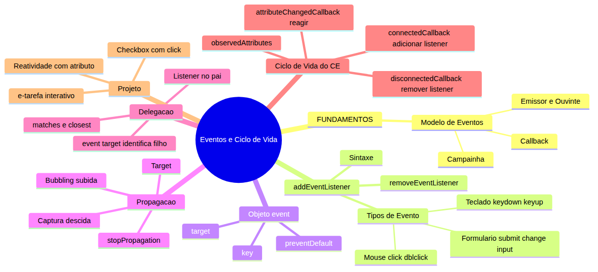
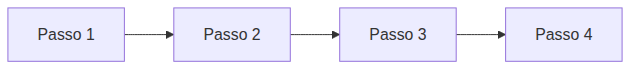
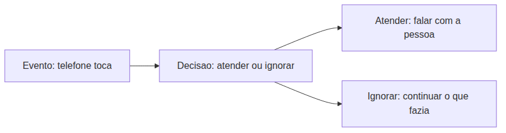
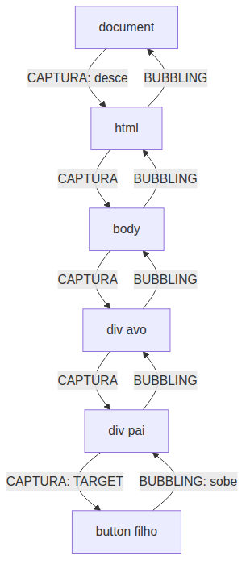
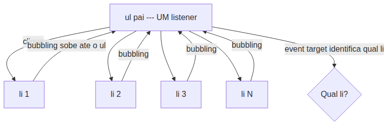
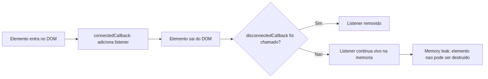
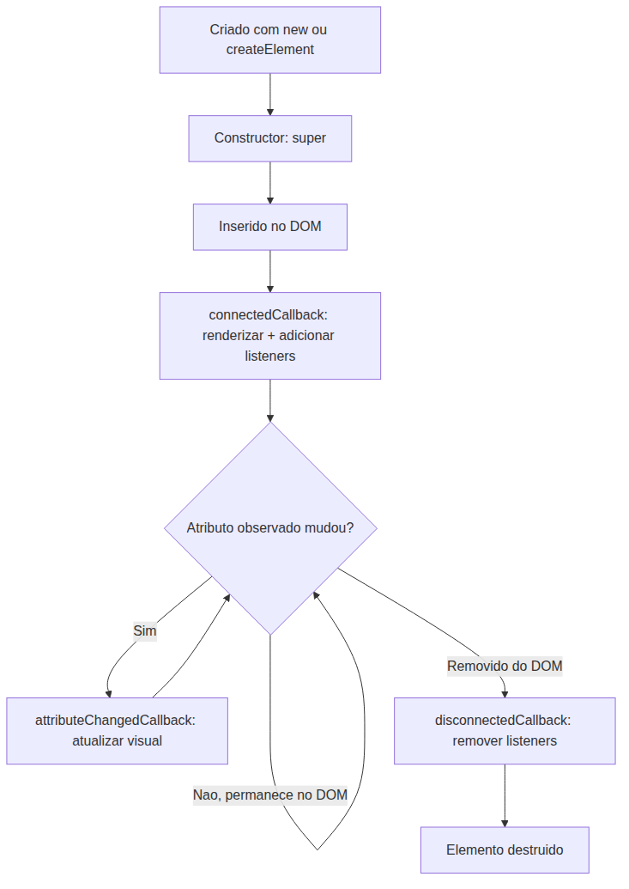

# JavaScript — Do Zero ao Profissional — Aula 19

## Eventos e Ciclo de Vida do Componente — Interatividade no DOM

**Duração estimada:** 150 minutos (75 de leitura + 75 de prática)
**Nível:** Intermediário
**Pré-requisitos:** Aulas 01 a 17 concluídas. Você precisa dominar `console.log` (Aula 01), HTML com `<script>` (Aula 02), funções (Aula 10), arrow functions e callbacks (Aula 14), classes com `extends` (Aula 16) e especialmente **DOM + Custom Elements** (Aula 18) — o componente `<e-tarefa>` que renderiza texto e checkbox.

---

## Objetivos de Aprendizagem

Ao final desta aula, você será capaz de:

- [ ] **Explicar** o que é um evento no modelo de programação orientada a eventos, usando a analogia da campainha (emissor, ouvinte, callback)
- [ ] **Aplicar** `addEventListener` para associar callbacks a elementos do DOM
- [ ] **Identificar** e **usar** pelo menos 6 tipos de evento: `click`, `dblclick`, `keydown`, `keyup`, `submit`, `change`, `input`, `mouseover`, `mouseout`
- [ ] **Acessar** propriedades do objeto `event` — `.target`, `.key` — e **aplicar** `.preventDefault()` para bloquear comportamento padrão
- [ ] **Descrever** o mecanismo de propagação de eventos: captura, target e bubbling
- [ ] **Aplicar** delegação de eventos com listener no pai e `event.target` para identificar filhos
- [ ] **Implementar** `connectedCallback` para adicionar event listeners no Custom Element
- [ ] **Implementar** `disconnectedCallback` para remover listeners e evitar vazamento de memória
- [ ] **Configurar** `observedAttributes` + `attributeChangedCallback` para reagir a mudanças de atributos
- [ ] **Integrar** eventos e ciclo de vida ao componente `<e-tarefa>` — checkbox funcional e reatividade

---

## Como Usar Esta Aula

Esta aula está organizada em duas partes. A **primeira parte** constrói o conceito universal de programação orientada a eventos — sem JavaScript, sem navegador. A **segunda parte** aplica esses conceitos na prática com a Event API do DOM e o ciclo de vida dos Custom Elements.

Ao longo do caminho, você encontrará seções **"Mão na Massa"** (para fazer, não só ler) e **"Quick Check"** (para verificar se entendeu antes de avançar). Ao final, o arquivo separado **Questões de Aprendizagem** traz as tarefas de checkpoint — só avance para a próxima aula quando conseguir completá-las por conta própria.

**Tempo estimado:** 75 minutos de leitura + 75 minutos de prática.

---

## Mapa Mental

Este diagrama mostra todos os conceitos que você vai dominar nesta aula:



> *O mapa mental acima mostra a estrutura da aula. Cada ramo representa um conceito que você vai explorar: o modelo de eventos, a sintaxe de addEventListener, o objeto event, a propagação, a delegação, o ciclo de vida dos Custom Elements e a integração no projeto.*

---

## Recapitulação das Aulas Anteriores

| Aula | Conceito | Onde aparece nesta aula | Como se conecta |
|---|---|---|---|
| Aula 10 | Funções, parâmetros, `return` | Seções 2-6 | Callbacks são funções; o objeto `event` é recebido como parâmetro |
| Aula 13 | `this`, `.bind()` | Seção 6 + Desafio | `.bind(this)` para garantir referência correta no `removeEventListener` |
| Aula 14 | Arrow functions, callbacks, HOFs | Seções 2-3 | `addEventListener` recebe callback; arrow functions como listeners concisos |
| Aula 16 | Classes, `extends`, `super` | Seção 6 | Custom Elements são classes; `super()` no constructor |
| Aula 18 | **DOM**: seletores, `classList`, `setAttribute`, `textContent`. **Custom Elements**: `customElements.define()`, `extends HTMLElement`, `connectedCallback`. **Componente** `<e-tarefa>` | Seções 2-6 | O `<e-tarefa>` da Aula 18 é a base; a Aula 19 adiciona eventos e reatividade |

---

**FUNDAMENTOS: O Modelo de Eventos — Campainhas, Emissores e Ouvintes**

> *Os conceitos desta seção são universais — valem para qualquer sistema que precise reagir a acontecimentos, de campainhas a semáforos. Na segunda parte, você verá como o navegador implementa exatamente este modelo com a Event API.*

---

## 1. O Que É um Evento? — Programação Reativa

### Programação sequencial vs programação orientada a eventos

Até agora, todo código que você escreveu segue um fluxo **sequencial**: o programa executa uma linha após a outra, do começo ao fim. É como uma receita de bolo: primeiro misture os ingredientes secos, depois adicione os líquidos, depois leve ao forno. A ordem é fixa e previsível.



Mas o mundo real não funciona assim. Você não decide com antecedência exatamente quando cada coisa vai acontecer. Às vezes você está no meio de uma tarefa e algo **acontece** — o telefone toca, alguém bate na porta, o timer da cozinha dispara. Você **reage** ao que aconteceu.

Isso é **programação orientada a eventos**: o fluxo do programa não é uma linha reta, mas um conjunto de **reações** a **acontecimentos**. O programa fica "escutando" e, quando algo acontece, ele responde.



### A analogia da campainha

Imagine que você está em casa, lendo um livro. De repente, alguém **toca a campainha**.

- O **toque da campainha** é o **evento** — "algo aconteceu"
- **Você** é o **ouvinte** (listener) — você estava "escutando" campainhas
- **Atender a porta** é a **resposta** (callback) — a ação que você executa quando o evento ocorre

Mas você não é obrigado a atender. Você pode:
- **Atender**: abrir a porta e conversar (um callback)
- **Olhar pelo olho mágico**: ver quem é antes de decidir (outro callback)
- **Ignorar**: continuar lendo o livro (não fazer nada)
- **Fingir que não está**: ficar quieto e esperar a pessoa ir embora (mais um callback)

O ponto central é: **você não sabe quando a campainha vai tocar**. Você só sabe que, QUANDO tocar, você vai reagir de alguma forma. O fluxo do seu "programa" (sua tarde em casa) não é uma sequência fixa — é um conjunto de reações possíveis a eventos que podem ou não acontecer.

### Os 3 atores do modelo de eventos

Todo sistema orientado a eventos tem três papéis:

1. **Emissor**: quem dispara o evento (quem toca a campainha)
2. **Ouvinte** (ou listener): quem se registra para escutar o evento (você, prestando atenção na campainha)
3. **Callback**: a função que executa quando o evento acontece (a ação de atender a porta)

A relação entre eles segue sempre o mesmo padrão:

```
emissor.quando("evento", callback)
```

Em português: "emissor, quando acontecer 'evento', execute callback".

> *Você pode pensar no emissor como um "radinho de pilha" que fica transmitindo. O ouvinte é quem sintoniza na frequência certa. O callback é o que você faz quando ouve a música.*

### Exemplos do mundo real

**Botão de elevador:**
- **Evento**: você pressiona o botão do andar
- **Ouvinte**: o sistema de controle do elevador
- **Callback**: o motor aciona e o elevador sobe/desce até o andar

**Despertador:**
- **Evento**: o relógio marca 7:00
- **Ouvinte**: o alarme
- **Callback**: tocar a música (ou aquele barulho irritante)

**Sensor de porta de mercado:**
- **Evento**: uma pessoa passa pelo sensor
- **Ouvinte**: o sistema da porta automática
- **Callback**: abrir a porta

**Caixa eletrônico:**
- **Evento**: você insere o cartão
- **Ouvinte**: o sistema do banco
- **Callback**: pedir a senha, mostrar o menu de opções

Perceba que o caixa eletrônico é um exemplo **misto**: ele tem momentos de sequência linear (dentro de cada operação) mas o fluxo global é orientado a eventos — ele espera você inserir o cartão, depois espera você digitar a senha, depois espera você escolher uma opção. Cada "espera" é um evento.

### O padrão universal "listener"

O modelo de eventos não é invenção de uma linguagem ou ferramenta específica. Ele existe em toda linguagem e framework moderno, sempre seguindo o mesmo padrão:

```
emissor.quando("evento", callback)
```

Em português: "emissor, quando acontecer 'evento', execute a função callback".

O formato muda de linguagem para linguagem, mas a ideia é sempre esta. Na segunda parte você vai ver exatamente como esse padrão se aplica aos elementos HTML.

Você já conhece esse padrão, inclusive. Na Aula 14, você aprendeu que **callbacks** são funções passadas como argumento para outras funções. A diferença é que funções como `forEach` executam o callback imediatamente para cada item, enquanto um registro de evento GUARDA o callback para executar QUANDO o evento acontecer.

### Para que tudo isso serve?

Sem eventos, seu programa só faz o que você escreveu na ordem que escreveu. Com eventos, seu programa **reage ao mundo** — a cliques, teclas, carregamentos, timers, respostas de servidor. É o que transforma um monte de instruções sequenciais em um **programa interativo**.

### Quick Check 1

**1. Na analogia da campainha, quem é o emissor, quem é o ouvinte e o que é o callback?**
**Resposta:** O emissor é a pessoa que toca a campainha (dispara o evento). O ouvinte é você, que está "escutando" campainhas (registrado para receber o evento). O callback é a ação de atender a porta (o que você faz quando o evento ocorre).

**2. Um caixa eletrônico usa eventos ou sequência linear? Justifique com um exemplo.**
**Resposta:** Usa AMBOS. O fluxo global é orientado a eventos — o sistema espera você inserir o cartão (evento), digitar a senha (evento), escolher opção (evento). Mas DENTRO de cada operação (ex: calcular saldo após saque) a execução é sequencial. É uma combinação dos dois modelos.

---

**APLICAÇÃO: Eventos no Navegador e Ciclo de Vida do Componente**

> *Agora que você entendeu o modelo universal de eventos — emissores, ouvintes e callbacks — vamos trazê-lo para o navegador. Cada clique, cada tecla pressionada e cada movimento do mouse é um evento que o DOM dispara. E você vai aprender a escutá-los.*

---

## 2. addEventListener e os Tipos de Evento

### A Web API EventTarget

Você aprendeu na Aula 18 que `console` e `document` são **Web APIs** — interfaces padronizadas que o navegador expõe para o JavaScript consumir. O `console` é a Console API. O `document` é a Document API.

Agora você vai conhecer mais uma: a **EventTarget API**.

Todo elemento HTML, o próprio `document` e até o `window` são **alvos de eventos** (EventTargets). Isso significa que qualquer um deles pode:
1. **Disparar** eventos (quando algo acontece)
2. **Escutar** eventos (quando você quer reagir)

A Web API que permite isso é o `EventTarget`, e seu método mais importante é `addEventListener`.

### Sintaxe básica

```javascript
const botao = document.querySelector('button');

botao.addEventListener('click', () => {
    console.log('Clicou!');
});
```

Traduzindo: "botao, quando acontecer 'click', execute esta função".

O primeiro argumento é o **tipo do evento** — uma string com o nome do evento que você quer escutar. O segundo argumento é o **callback** — a função que será executada quando o evento ocorrer.

> *Lembra da Seção 1? `emissor.quando("evento", callback)`. Aqui o emissor é o elemento HTML, o evento é 'click', e o callback é a arrow function. Exatamente o mesmo padrão.*

### Eventos de mouse

Os eventos mais comuns envolvem o mouse:

```javascript
const botao = document.querySelector('button');

// Clique simples (mais usado)
botao.addEventListener('click', () => {
    console.log('Botão clicado!');
});

// Duplo clique
botao.addEventListener('dblclick', () => {
    console.log('Duplo clique!');
});

// Mouse entrou no elemento
botao.addEventListener('mouseover', () => {
    console.log('Mouse em cima do botão');
});

// Mouse saiu do elemento
botao.addEventListener('mouseout', () => {
    console.log('Mouse saiu do botão');
});
```

### Eventos de teclado

Eventos de teclado geralmente são escutados no `document` ou em campos de input:

```javascript
document.addEventListener('keydown', (event) => {
    console.log('Tecla pressionada:', event.key);
});

document.addEventListener('keyup', (event) => {
    console.log('Tecla solta:', event.key);
});
```

A diferença prática: `keydown` dispara assim que você pressiona a tecla (e continua disparando se você segurar a tecla pressionada). `keyup` dispara uma ÚNICA vez, quando você solta a tecla.

### Eventos de formulário

Formulários têm eventos específicos muito úteis:

```javascript
const formulario = document.querySelector('form');
const campoTexto = document.querySelector('input[type="text"]');

// submit: formulário foi enviado
formulario.addEventListener('submit', () => {
    console.log('Formulário enviado!');
});

// change: valor mudou E o elemento perdeu foco
campoTexto.addEventListener('change', () => {
    console.log('Valor final:', campoTexto.value);
});

// input: dispara a CADA caractere digitado
campoTexto.addEventListener('input', () => {
    console.log('Digitando:', campoTexto.value);
});
```

**Qual a diferença entre `change` e `input`?**

- `input` dispara **toda vez que o valor muda** — a cada tecla, a cada colagem, a cada remoção. É útil para feedback em tempo real (validação conforme o usuário digita, contador de caracteres, busca instantânea).
- `change` dispara **apenas quando o valor é confirmado** — o usuário digita e depois sai do campo (perde o foco). É útil para saber o valor FINAL depois que o usuário terminou de editar.

### Múltiplos listeners no mesmo elemento

Diferente do que você pode imaginar, chamar `addEventListener` duas vezes no mesmo elemento NÃO sobrescreve o listener anterior. Cada chamada adiciona **mais um** callback:

```javascript
const botao = document.querySelector('button');

botao.addEventListener('click', () => {
    console.log('Primeira função');
});

botao.addEventListener('click', () => {
    console.log('Segunda função');
});

// Quando clicar, ambos executam: "Primeira função" e "Segunda função"
```

### Removendo listeners com removeEventListener

Assim como você pode adicionar, pode remover. Mas tem um detalhe importante: o `removeEventListener` precisa receber a **mesma referência de função** que foi passada no `addEventListener`.

```javascript
// Funciona: função nomeada
function meuCallback() {
    console.log('Clicou!');
}

botao.addEventListener('click', meuCallback);
botao.removeEventListener('click', meuCallback); // Remove com sucesso

// NÃO funciona: arrow function inline
botao.addEventListener('click', () => {
    console.log('Clicou!');
});
botao.removeEventListener('click', () => {
    console.log('Clicou!');
}); // NÃO remove! É uma função diferente!
```

Quando você escreve `() => { ... }`, está criando uma **nova função** a cada chamada. Mesmo que o código seja idêntico, são funções diferentes em memória. O `removeEventListener` procura pela função exata que foi registrada — e não encontra, porque é outra referência.

**Solução:** guarde a referência da função em uma variável:

```javascript
const meuCallback = () => {
    console.log('Clicou!');
};

botao.addEventListener('click', meuCallback);
botao.removeEventListener('click', meuCallback); // Funciona!
```

### Callbacks como funções nomeadas vs arrow functions

Qual usar? Depende:

- **Arrow function inline**: quando você NUNCA vai precisar remover o listener (a maioria dos casos). Mais concisa.
- **Função nomeada**: quando você PRECISA usar `removeEventListener` (ex: ciclo de vida do Custom Element, Seção 6).

### Mão na Massa 1 — Botão Contador

**Faça isso agora no navegador.**

Crie uma página HTML com este conteúdo:

```html
<!DOCTYPE html>
<html>
<head>
    <title>Mão na Massa 1 — Botão Contador</title>
</head>
<body>
    <button id="btn">Clique aqui</button>
    <span id="contador">0</span>

    <script>
        // Seu código aqui
    </script>
</body>
</html>
```

- [ ] Dentro do `<script>`, selecione o botão com `querySelector`
- [ ] Crie uma variável `let contador = 0`
- [ ] Adicione um listener de `click` ao botão que incrementa o contador e atualiza o `textContent` do span
- [ ] Adicione um listener de `mouseover` que muda a cor de fundo do botão para `'lightblue'`
- [ ] Adicione um listener de `mouseout` que restaura a cor de fundo para `''` (vazio)

**Gabarito:**

```javascript
const botao = document.querySelector('#btn');
const span = document.querySelector('#contador');
let contador = 0;

botao.addEventListener('click', () => {
    contador++;
    span.textContent = contador;
});

botao.addEventListener('mouseover', () => {
    botao.style.backgroundColor = 'lightblue';
});

botao.addEventListener('mouseout', () => {
    botao.style.backgroundColor = '';
});
```

**Verificação:** Clique no botão algumas vezes. O número no span deve aumentar. Passe o mouse sobre o botão — ele deve ficar azul. Tire o mouse — a cor deve voltar ao normal.

### Quick Check 2

**1. Qual a diferença entre `change` e `input`? Dê um exemplo de quando usar cada um.**
**Resposta:** `input` dispara a CADA caractere digitado (em tempo real). `change` dispara APENAS quando o elemento perde o foco, com o valor final. Use `input` para contador de caracteres ou validação instantânea; use `change` para saber o valor depois que o usuário terminou de editar (ex: recalcular total após editar quantidade).

**2. Por que `removeEventListener` não funciona se você passou uma arrow function inline? Como resolver?**
**Resposta:** Porque cada arrow function inline cria uma NOVA referência de função em memória, mesmo que o código seja idêntico. O `removeEventListener` procura pela referência exata que foi registrada, e não encontra. Para resolver, guarde a função em uma variável e passe a referência da variável tanto no `addEventListener` quanto no `removeEventListener`.

---

## 3. O Objeto event

### Toda callback de evento recebe um parâmetro

Quando você registra um callback com `addEventListener`, o navegador automaticamente passa um parâmetro para ele: o **objeto `event`**.

```javascript
botao.addEventListener('click', (event) => {
    console.log(event); // Objeto com informações sobre o clique
});
```

O nome do parâmetro pode ser qualquer um. Você pode chamar de `e`, `evt`, `evento` — mas por convenção, usa-se `event` ou simplesmente `e`.

### O que o objeto event contém?

O objeto `event` é como um "relatório" do que aconteceu. Ele contém:

| Propriedade/Método | O que é | Quando usar |
|---|---|---|
| `event.target` | O elemento que DISPAROU o evento | Identificar quem foi clicado (essencial para delegação) |
| `event.type` | O tipo do evento (`'click'`, `'keydown'`, etc.) | Quando o mesmo callback trata múltiplos tipos |
| `event.key` | A tecla pressionada (em eventos de teclado) | Saber qual tecla o usuário pressionou |
| `event.clientX` | Posição X do mouse na tela | Saber onde o mouse estava no momento do clique |
| `event.clientY` | Posição Y do mouse na tela | Saber onde o mouse estava no momento do clique |
| `event.preventDefault()` | Método que CANCELA o comportamento padrão | Impedir link de navegar, formulário de recarregar, etc. |
| `event.stopPropagation()` | Método que interrompe a propagação | Impedir que o evento suba para elementos pai (usar com cautela) |

### event.target — Quem disparou o evento

Esta é a propriedade MAIS IMPORTANTE do objeto `event`. Ela sempre aponta para o elemento que **disparou** o evento, não necessariamente o elemento que TEM o listener.

```javascript
document.addEventListener('click', (event) => {
    console.log('Você clicou em:', event.target);
    console.log('Tag name:', event.target.tagName);
});
```

Experimente colocar este código no console de qualquer página e clicar em diferentes lugares. O `event.target` vai mostrar exatamente qual elemento recebeu o clique — um botão, um link, um parágrafo, o body.

> *Isso é a base da **delegação de eventos** que você vai aprender na Seção 5. Guarde bem este conceito.*

### event.key — Qual tecla foi pressionada

Em eventos de teclado (`keydown`, `keyup`), a propriedade `key` diz qual tecla o usuário pressionou:

```javascript
document.addEventListener('keydown', (event) => {
    console.log('Tecla:', event.key);
});
```

Valores comuns de `event.key`:
- Letras: `'a'`, `'b'`, `'c'`, …
- Números: `'1'`, `'2'`, `'3'`, …
- Especiais: `'Enter'`, `'Escape'`, `'Tab'`, `'Backspace'`, `'Delete'`
- Setas: `'ArrowUp'`, `'ArrowDown'`, `'ArrowLeft'`, `'ArrowRight'`
- Modificadores: `'Shift'`, `'Control'`, `'Alt'`

```javascript
document.addEventListener('keydown', (event) => {
    if (event.key === 'Enter') {
        console.log('Enter pressionado!');
    }
    if (event.key === 'Escape') {
        console.log('Escape pressionado!');
    }
});
```

### event.preventDefault() — Cancelando o comportamento padrão

Alguns eventos têm **comportamento padrão** que o navegador executa automaticamente:

- Clicar em um link (`<a href="...">`) → navega para a URL
- Enviar um formulário (`<form>`) → recarrega a página
- Pressionar uma tecla em um input → insere o caractere
- Clicar com botão direito → abre o menu de contexto

O método `.preventDefault()` **cancela** esse comportamento padrão:

```javascript
const link = document.querySelector('a');

link.addEventListener('click', (event) => {
    event.preventDefault(); // O link NÃO vai navegar
    console.log('Link clicado, mas sem navegação');
});
```

Este é o exemplo mais clássico: impedir que um link recarregue a página ou navegue para outra URL. Muito usado em aplicações JavaScript que gerenciam a navegação por conta própria (SPAs — Single Page Applications).

### Casos práticos de preventDefault

**1. Formulário sem recarga:**

```javascript
const form = document.querySelector('form');

form.addEventListener('submit', (event) => {
    event.preventDefault(); // Impede o recarregamento da página
    console.log('Formulário enviado sem recarregar!');
    // Aqui você pode processar os dados com JavaScript
});
```

Sem o `preventDefault()`, o formulário recarregaria a página assim que você clicasse em "Enviar" — perdendo todo o estado do JavaScript.

**2. Atalho de teclado (Ctrl+S):**

```javascript
document.addEventListener('keydown', (event) => {
    if (event.key === 's' && event.ctrlKey) {
        event.preventDefault(); // Impede o diálogo "Salvar página" do navegador
        console.log('Ctrl+S interceptado!');
        // Aqui você pode salvar o documento com seu próprio código
    }
});
```

**3. Menu de contexto customizado:**

```javascript
document.addEventListener('contextmenu', (event) => {
    event.preventDefault(); // Impede o menu de contexto padrão
    console.log('Menu de contexto bloqueado');
    // Aqui você pode mostrar seu próprio menu customizado
});
```

> *Importante: `preventDefault()` NÃO interrompe a propagação do evento (o bubbling continua). Ele apenas cancela a ação padrão do navegador para aquele evento.*

### Mão na Massa 2 — Formulário Sem Recarga

**Faça isso agora no navegador.**

Crie uma página HTML:

```html
<!DOCTYPE html>
<html>
<head>
    <title>Mão na Massa 2 — Formulário Sem Recarga</title>
</head>
<body>
    <form id="meu-form">
        <input type="text" id="nome" placeholder="Digite seu nome">
        <button type="submit">Enviar</button>
    </form>
    <p id="resultado"></p>

    <script>
        // Seu código aqui
    </script>
</body>
</html>
```

- [ ] Selecione o formulário com `querySelector`
- [ ] Adicione um listener de `submit` ao formulário
- [ ] Dentro do callback, chame `event.preventDefault()`
- [ ] Pegue o valor do input usando `document.querySelector('#nome').value`
- [ ] Exiba o valor no parágrafo `#resultado` usando `textContent`
- [ ] Teste sem `preventDefault()` — veja a página recarregar

**Gabarito:**

```javascript
const form = document.querySelector('#meu-form');
const resultado = document.querySelector('#resultado');

form.addEventListener('submit', (event) => {
    event.preventDefault();
    const nome = document.querySelector('#nome').value;
    resultado.textContent = `Olá, ${nome}!`;
});
```

**Verificação:** Digite um nome, clique em "Enviar". O parágrafo deve mostrar "Olá, [nome]!" sem recarregar a página. Agora comente a linha `event.preventDefault()` e teste novamente — veja a página recarregar e o parágrafo desaparecer.

### Quick Check 3

**1. Se você tem 3 botões e UM listener no `document`, como saber QUAL botão foi clicado?**
**Resposta:** Use `event.target` dentro do callback. O `event.target` sempre aponta para o elemento que disparou o evento (neste caso, o botão clicado). Você pode verificar com `event.target.tagName === 'BUTTON'` ou com `event.target.matches('.minha-classe')`.

**2. Em que situações você usaria `event.preventDefault()`? Dê dois exemplos além do formulário.**
**Resposta:** (1) Impedir que um link `<a>` navegue para outra página (usando `click` + `preventDefault`). (2) Impedir que Ctrl+S abra o diálogo "Salvar página" do navegador, substituindo por sua própria função de salvar. (3) Impedir o menu de contexto do botão direito com `contextmenu` + `preventDefault`.

---

## 4. Propagação — Bubbling e Captura

### O que acontece quando você clica em um elemento dentro de outro?

Imagine este HTML:

```html
<div id="avo">
    <div id="pai">
        <button id="filho">Clique em mim</button>
    </div>
</div>
```

O `<button>` está DENTRO do `<div id="pai">`, que está DENTRO do `<div id="avo">`. Quando você clica no botão, você também está clicando dentro do pai e dentro do avô (geograficamente falando).

A pergunta é: se cada um deles tiver um listener de `click`, qual executa primeiro? E qual executa depois?

### A analogia da bolha na água

Pense em uma bolha de ar no fundo de uma piscina. A bolha "nasce" no fundo e vai subindo até estourar na superfície. No caminho, ela passa por diferentes profundidades.

No DOM, o evento se comporta de forma parecida. Quando um evento ocorre em um elemento, ele não fica restrito àquele elemento. Ele **viaja** pela árvore DOM em duas fases:

1. **Fase de captura**: o evento "desce" da raiz (`document`) até o elemento alvo
2. **Fase de bubbling**: o evento "sobe" do elemento alvo de volta até a raiz



### As 3 fases

**1. Capture phase (captura):** o evento começa no `document` e vai DESCENDO pela árvore até o elemento alvo. Nesta fase, os listeners que foram registrados com `useCapture = true` são executados.

**2. Target phase (alvo):** o evento chega ao elemento que foi clicado/disparado. Aqui, os listeners do próprio elemento são executados.

**3. Bubble phase (bubbling):** o evento SOBE de volta pela árvore, passando pelos ancestrais até chegar ao `document`. Nesta fase, os listeners REGISTRADOS SEM o `useCapture` (o padrão) são executados.

### O terceiro parâmetro do addEventListener

Você viu que `addEventListener` recebe dois argumentos: o tipo do evento e o callback. Mas ele tem um TERCEIRO argumento opcional:

```javascript
elemento.addEventListener('click', callback, useCapture);
```

- `useCapture = false` (padrão): o callback é executado na fase de **bubbling** (subida)
- `useCapture = true`: o callback é executado na fase de **captura** (descida)

### Demonstração prática

Crie três divs aninhados no seu HTML e adicione listeners em cada um:

```javascript
const avo = document.querySelector('#avo');
const pai = document.querySelector('#pai');
const filho = document.querySelector('#filho');

// Listeners no bubbling (padrão)
avo.addEventListener('click', () => console.log('Avo (bubbling)'));
pai.addEventListener('click', () => console.log('Pai (bubbling)'));
filho.addEventListener('click', () => console.log('Filho (bubbling)'));

// Listeners na captura
avo.addEventListener('click', () => console.log('Avo (captura)'), true);
pai.addEventListener('click', () => console.log('Pai (captura)'), true);
filho.addEventListener('click', () => console.log('Filho (captura)'), true);
```

Clique no botão (filho). A ordem no console será:

```
Avo (captura)      ← captura: descendo do document
Pai (captura)       ← captura: descendo
Filho (captura)     ← captura: chegou no target
Filho (bubbling)    ← target: o elemento alvo
Pai (bubbling)      ← bubbling: subindo
Avo (bubbling)      ← bubbling: subindo
```

Perceba a ordem: primeiro TODOS os listeners de captura (do mais externo ao mais interno), depois a fase de target, depois TODOS os listeners de bubbling (do mais interno ao mais externo).

### stopPropagation — Interrompendo a propagação

Às vezes você quer que o evento PARE de subir (ou descer) e não atinja os elementos ancestrais. Para isso, existe `event.stopPropagation()`:

```javascript
pai.addEventListener('click', (event) => {
    event.stopPropagation(); // O evento não vai chegar no avo
    console.log('Pai clicado — propagação interrompida!');
});

avo.addEventListener('click', () => {
    console.log('Avo — este NUNCA será executado se o pai chamar stopPropagation');
});
```

**CUIDADO:** `stopPropagation()` é uma ferramenta poderosa, mas use com moderação. Interromper a propagação pode:
- Quebrar sistemas de analytics que escutam eventos no document
- Impedir que outros componentes (modais, dropdowns) funcionem
- Tornar o código mais difícil de depurar

Regra prática: só use `stopPropagation()` quando você ABSOLUTAMENTE precisa impedir que um elemento ancestral receba o evento. Na maioria dos casos, deixe a propagação seguir seu curso natural.

### Nem todo evento faz bubbling

Uma pegadinha importante: alguns eventos NÃO borbulham. Os mais comuns são:

- `focus` (elemento ganhou foco) — não borbulha
- `blur` (elemento perdeu foco) — não borbulha
- `mouseenter` (mouse entrou no elemento) — não borbulha
- `mouseleave` (mouse saiu do elemento) — não borbulha

Para escutar eventos de foco em um formulário inteiro (aproveitando o bubbling), use as variantes que borbulham:

- `focusin` — versão do `focus` que borbulha
- `focusout` — versão do `blur` que borbulha

### Mão na Massa 3 — Observando a Propagação

**Faça isso agora no navegador.**

Crie uma página HTML:

```html
<!DOCTYPE html>
<html>
<head>
    <title>Mão na Massa 3 — Propagação</title>
    <style>
        div { padding: 20px; border: 2px solid black; }
        #avo { background-color: #ffcccc; }
        #pai { background-color: #ccffcc; }
        #filho { background-color: #ccccff; }
    </style>
</head>
<body>
    <div id="avo">
        AVÔ
        <div id="pai">
            PAI
            <div id="filho">FILHO</div>
        </div>
    </div>

    <script>
        // Seu código aqui
    </script>
</body>
</html>
```

- [ ] Selecione as três divs com `querySelector`
- [ ] Adicione listeners de `click` em cada div (no bubbling) — cada um faz `console.log('NOME (bubbling)')`
- [ ] Adicione listeners de `click` em cada div (na captura, com `true`) — cada um faz `console.log('NOME (captura)')`
- [ ] Clique no div mais interno (FILHO) e observe a ordem no console
- [ ] Agora adicione `event.stopPropagation()` no listener de bubbling do PAI e veja o que muda

**Gabarito:**

```javascript
const avo = document.querySelector('#avo');
const pai = document.querySelector('#pai');
const filho = document.querySelector('#filho');

// Bubbling (padrão)
avo.addEventListener('click', () => console.log('Avo (bubbling)'));
pai.addEventListener('click', () => console.log('Pai (bubbling)'));
filho.addEventListener('click', () => console.log('Filho (bubbling)'));

// Captura
avo.addEventListener('click', () => console.log('Avo (captura)'), true);
pai.addEventListener('click', () => console.log('Pai (captura)'), true);
filho.addEventListener('click', () => console.log('Filho (captura)'), true);
```

**Ordem esperada sem stopPropagation:** Avo captura → Pai captura → Filho captura → Filho bubbling → Pai bubbling → Avo bubbling.

Com `stopPropagation()` no bubbling do Pai, a última linha "Avo (bubbling)" não aparece — o evento parou no Pai.

### Quick Check 4

**1. Se um `<button>` está dentro de um `<div>` e ambos têm listener de `click`, qual executa primeiro? E se o `<div>` usar captura?**
**Resposta:** Por padrão (bubbling), o `<button>` executa primeiro (target), depois o `<div>` (bubbling). Se o `<div>` usar captura (`true`), ele executa ANTES do `<button>` — primeiro o div na descida (captura), depois o button no target.

**2. Por que `focus` e `blur` não borbulham? Como você escutaria eventos de foco em um formulário inteiro?**
**Resposta:** `focus` e `blur` não borbulham por razões históricas e de usabilidade (foco é considerado um estado do elemento, não um evento que "atravessa" a árvore). Para escutar foco em um formulário inteiro, use `focusin` (borbulha) e `focusout` (borbulha) em vez de `focus`/`blur`.

---

## 5. Delegação de Eventos

### O problema: muitos elementos, muitos listeners

Imagine que você tem uma lista com 100 itens, e cada item deve responder a cliques:

```html
<ul id="lista">
    <li class="item">Item 1</li>
    <li class="item">Item 2</li>
    <!-- ... mais 98 itens ... -->
    <li class="item">Item 100</li>
</ul>
```

A abordagem ingênua seria adicionar um listener em cada `<li>`:

```javascript
const itens = document.querySelectorAll('.item');
itens.forEach(item => {
    item.addEventListener('click', () => {
        console.log('Clicou em:', item.textContent);
    });
});
```

Isso funciona, mas tem DOIS problemas graves:

1. **Consumo de memória**: são 100 listeners, cada um ocupando memória. Em listas maiores (1000 itens), o impacto é real.
2. **Itens dinâmicos**: se você adicionar um novo `<li>` depois, ele NÃO terá o listener — porque o `querySelectorAll` foi executado antes do novo item existir. Você precisaria lembrar de adicionar o listener manualmente.

### A solução: UM listener no pai

A **delegação de eventos** resolve os dois problemas com uma única ideia: em vez de colocar um listener em CADA filho, coloque UM listener no **pai** e use `event.target` para descobrir qual filho foi clicado.



Isso funciona graças ao **bubbling** que você aprendeu na Seção 4: quando o usuário clica em um `<li>`, o evento "sobe" até o `<ul>` (pai), que captura o clique e identifica o filho através do `event.target`.

```javascript
const lista = document.querySelector('#lista');

lista.addEventListener('click', (event) => {
    // event.target é o elemento que foi clicado
    console.log('Clicou em:', event.target.textContent);
});
```

Agora temos UM listener (não 100), e funciona para QUALQUER `<li>`, mesmo aqueles adicionados depois.

### Como identificar qual filho foi clicado

O `event.target` aponta para o elemento exato que recebeu o clique. Mas nem sempre esse elemento é o `<li>` — pode ser um elemento DENTRO do `<li>` (como um `<span>`, `<strong>`, ou um botão). Por isso você precisa de métodos para verificar se o clique foi em um filho específico:

**1. event.target.matches(seletor):**

```javascript
lista.addEventListener('click', (event) => {
    if (event.target.matches('li')) {
        console.log('Clicou em um LI:', event.target.textContent);
    }
});
```

`matches()` verifica se o PRÓPRIO elemento casa com o seletor. Se o clique foi em um `<span>` dentro do `<li>`, `event.target.matches('li')` retorna `false`.

**2. event.target.closest(seletor):**

```javascript
lista.addEventListener('click', (event) => {
    const item = event.target.closest('li');
    if (item) {
        console.log('Clicou em um LI (ou dentro de um):', item.textContent);
    }
});
```

`closest()` SOBE na árvore a partir do `event.target` procurando o primeiro ancestral que casa com o seletor. Se o clique foi em um `<span>` dentro de um `<li>`, `closest('li')` encontra o `<li>` pai.

**Qual usar?**
- Use `matches()` quando você tem certeza que o clique será diretamente no elemento
- Use `closest()` quando o elemento alvo pode ter elementos aninhados dentro dele (caso mais comum)

### Comparação: com e sem delegação

**Sem delegação (abordagem ingênua):**

```javascript
const itens = document.querySelectorAll('.item');
itens.forEach(item => {
    item.addEventListener('click', () => {
        item.classList.toggle('destaque');
    });
});
// Problema: novos itens não têm listener
```

**Com delegação:**

```javascript
const lista = document.querySelector('#lista');
lista.addEventListener('click', (event) => {
    const item = event.target.closest('.item');
    if (item) {
        item.classList.toggle('destaque');
    }
});
// Vantagem: novos itens funcionam automaticamente!
```

### Delegação com data-* attributes

Uma técnica avançada: use atributos `data-*` no HTML para indicar qual ação tomar:

```html
<ul id="acoes">
    <li data-acao="editar">Editar usuário</li>
    <li data-acao="excluir">Excluir usuário</li>
    <li data-acao="duplicar">Duplicar usuário</li>
</ul>
```

```javascript
const lista = document.querySelector('#acoes');

lista.addEventListener('click', (event) => {
    const item = event.target.closest('[data-acao]');
    if (!item) return;

    const acao = item.dataset.acao;

    if (acao === 'editar') {
        console.log('Editando...');
    } else if (acao === 'excluir') {
        console.log('Excluindo...');
    } else if (acao === 'duplicar') {
        console.log('Duplicando...');
    }
});
```

### Conexão com o projeto

Na Aula 18 você construiu o componente `<e-tarefa>`. Na Seção 6 desta aula, você vai adicionar eventos a ele. A **delegação** será útil para escutar cliques em uma lista de tarefas:

```javascript
const container = document.querySelector('#app');

container.addEventListener('click', (event) => {
    const tarefa = event.target.closest('e-tarefa');
    if (tarefa) {
        console.log('Tarefa clicada:', tarefa.dataset.texto);
    }
});
```

Um listener no container da lista escuta cliques em QUALQUER `<e-tarefa>` presente ou futuro.

### Mão na Massa 4 — Lista Interativa com Delegação

**Faça isso agora no navegador.**

Crie uma página HTML:

```html
<!DOCTYPE html>
<html>
<head>
    <title>Mão na Massa 4 — Delegação</title>
    <style>
        .destaque { background-color: yellow; }
    </style>
</head>
<body>
    <ul id="lista">
        <li>Item 1</li>
        <li>Item 2</li>
        <li>Item 3</li>
        <li>Item 4</li>
        <li>Item 5</li>
    </ul>
    <button id="adicionar">Adicionar Item</button>

    <script>
        // Seu código aqui
    </script>
</body>
</html>
```

- [ ] Selecione o `<ul>` com `querySelector`
- [ ] Adicione UM listener de `click` no `<ul>`
- [ ] No callback, use `event.target.closest('li')` para identificar o item clicado
- [ ] Adicione ou remova a classe `destaque` no item (use `classList.toggle`)
- [ ] Selecione o botão "Adicionar Item" e adicione um listener de `click` que insere um novo `<li>` com `innerHTML` ou criando o elemento
- [ ] Clique no novo item — ele também deve destacar, mesmo sem listener próprio

**Gabarito:**

```javascript
const lista = document.querySelector('#lista');
const botao = document.querySelector('#adicionar');

// UM listener para TODOS os itens (presentes e futuros)
lista.addEventListener('click', (event) => {
    const item = event.target.closest('li');
    if (item) {
        item.classList.toggle('destaque');
    }
});

// Botão adiciona novo item
botao.addEventListener('click', () => {
    lista.innerHTML += `<li>Item ${lista.children.length + 1}</li>`;
});
```

**Verificação:** Clique em qualquer item — ele deve ficar amarelo (destaque). Clique novamente — volta ao normal. Adicione novos itens com o botão. Clique nos novos itens — eles também destacam, comprovando a delegação.

### Quick Check 5

**1. Por que a delegação de eventos funciona? Qual mecanismo do DOM a torna possível?**
**Resposta:** A delegação funciona graças ao **bubbling** (Seção 4). Quando um evento ocorre em um elemento filho, ele "sobe" pela árvore DOM até a raiz. O listener no pai captura esse evento durante a fase de bubbling. O `event.target` revela qual filho disparou o evento originalmente.

**2. Quando usar `event.target.matches()` e quando usar `event.target.closest()`?**
**Resposta:** Use `matches()` quando você tem certeza que o clique será DIRETAMENTE no elemento alvo (ex: clique direto no `<li>`). Use `closest()` quando o elemento alvo pode conter elementos aninhados (ex: um `<li>` que contém `<span>`, `<strong>`, ou `<button>`) — `closest()` sobe na árvore até encontrar o ancestral que casa com o seletor.

---

## 6. Ciclo de Vida do Custom Element + Eventos

### Revisão: connectedCallback (Aula 18)

Na Aula 18 você aprendeu que o navegador chama `connectedCallback()` automaticamente quando o Custom Element é inserido no DOM:

```javascript
class ETarefa extends HTMLElement {
    connectedCallback() {
        // Chamado quando o elemento entra no DOM
        // Aqui você renderiza o HTML interno
        this.innerHTML = `
            <label>
                <input type="checkbox">
                <span>${this.dataset.texto}</span>
            </label>
        `;
    }
}

customElements.define('e-tarefa', ETarefa);
```

O problema: o checkbox aparece, mas clicar nele não faz nada. Vamos resolver isso.

### connectedCallback — Adicionando listeners

O `connectedCallback` é o lugar ideal para **adicionar** event listeners no Custom Element. Quando o elemento entra no DOM, você registra os listeners que ele precisa:

```javascript
class ETarefa extends HTMLElement {
    connectedCallback() {
        this.render();
        // Adiciona listener no checkbox interno
        const checkbox = this.querySelector('input[type="checkbox"]');
        checkbox.addEventListener('change', this._onToggle);
    }

    _onToggle = (event) => {
        if (event.target.checked) {
            this.dataset.concluida = 'true';
        } else {
            this.dataset.concluida = 'false';
        }
    }

    render() {
        this.innerHTML = `
            <label>
                <input type="checkbox" ${this.dataset.concluida === 'true' ? 'checked' : ''}>
                <span>${this.dataset.texto}</span>
            </label>
        `;
    }
}
```

Perceba algumas novidades:

- `this.querySelector(...)` — o `this` dentro do método se refere ao próprio elemento. Você usa `querySelector` no `this` para encontrar elementos DENTRO do componente.
- `this._onToggle` — é uma **arrow function como propriedade de classe**. Isso faz com que `this` dentro dela seja sempre a instância do componente, não o checkbox (evita o problema de `this` que vimos na Aula 13). Além disso, como está em uma propriedade, podemos referenciá-la depois para remover o listener.
- `this.dataset.concluida` — você já conhece da Aula 18. Lê ou escreve atributos `data-*`.

### O padrão de propriedade de classe para listeners

```javascript
class MeuComponente extends HTMLElement {
    // Propriedade de classe (arrow function) — mantém o this correto
    _handleClick = (event) => {
        console.log('Clicou!', this.dataset.id);
        // this aqui é a instância do componente, sempre!
    }

    connectedCallback() {
        this.querySelector('button')
            .addEventListener('click', this._handleClick);
    }
}
```

Isso é importante porque:
1. `this` dentro do callback aponta para o componente (não para o botão)
2. A referência `this._handleClick` pode ser usada no `removeEventListener`

### disconnectedCallback — Removendo listeners (e evitando vazamento de memória)

**O que é:** `disconnectedCallback` é um método do ciclo de vida chamado automaticamente quando o elemento é **removido** do DOM (via `.remove()`, `removeChild()`, etc.).

**Por que você precisa disso:** Quando você adiciona um event listener, o navegador mantém uma referência para a função callback. Mesmo que o elemento seja removido do DOM, se você NÃO remover o listener, o callback continua existindo na memória — e o elemento (que deveria ser destruído) também continua vivo porque o listener tem uma referência indireta a ele.

Isso se chama **memory leak** (vazamento de memória). O elemento sumiu da tela, mas o JavaScript continua segurando ele na memória porque o listener ainda está registrado.



**O código correto:**

```javascript
class ETarefa extends HTMLElement {
    _handleToggle = (event) => {
        this.dataset.concluida = event.target.checked ? 'true' : 'false';
    }

    connectedCallback() {
        this.render();
        this.querySelector('input[type="checkbox"]')
            .addEventListener('change', this._handleToggle);
    }

    disconnectedCallback() {
        // Remove o listener para evitar memory leak
        this.querySelector('input[type="checkbox"]')
            ?.removeEventListener('change', this._handleToggle);
    }

    render() {
        this.innerHTML = `
            <label>
                <input type="checkbox" ${this.dataset.concluida === 'true' ? 'checked' : ''}>
                <span>${this.dataset.texto}</span>
            </label>
        `;
    }
}
```

O `?.` (optional chaining) antes de `removeEventListener` é uma proteção: se o checkbox já foi destruído (por exemplo, se o componente foi removido antes de `render()` terminar), ele não tenta remover o listener de algo que não existe mais.

> *Regra de ouro: **todo `addEventListener` no `connectedCallback` deve ter um `removeEventListener` correspondente no `disconnectedCallback`.***

### observedAttributes + attributeChangedCallback — Reagindo a mudanças

**O problema:** Na Aula 18, você configurou `data-concluida` no `<e-tarefa>`, mas mudar esse atributo DEPOIS que o elemento já está no DOM não tinha efeito. O visual não atualizava.

**A solução:** Dois mecanismos trabalham juntos:

1. **`static observedAttributes`**: um array ESTÁTICO que declara quais atributos o componente "observa" (monitora)
2. **`attributeChangedCallback(name, oldValue, newValue)`**: um método chamado automaticamente quando um atributo observado MUDA de valor

```javascript
class ETarefa extends HTMLElement {
    // 1. Declara quais atributos observar
    static observedAttributes = ['data-concluida'];

    // 2. Reage quando o atributo muda
    attributeChangedCallback(name, oldValue, newValue) {
        if (name === 'data-concluida') {
            this.atualizarVisual();
        }
    }

    atualizarVisual() {
        // Atualiza o estilo conforme o estado
        const span = this.querySelector('span');
        if (this.dataset.concluida === 'true') {
            span.style.textDecoration = 'line-through';
            span.style.color = '#999';
        } else {
            span.style.textDecoration = 'none';
            span.style.color = 'inherit';
        }
    }

    // ... outros métodos
}
```

**Como funciona na prática:**

1. Você define `static observedAttributes = ['data-concluida']`
2. O navegador monitora o atributo `data-concluida` em tempo real
3. Quando alguém faz `elemento.setAttribute('data-concluida', 'true')`, o navegador chama `attributeChangedCallback('data-concluida', 'false', 'true')`
4. Dentro do callback, você atualiza a interface

> *Você pode observar múltiplos atributos: `static observedAttributes = ['data-concluida', 'data-texto']`. Cada vez que qualquer um deles mudar, `attributeChangedCallback` é chamado com o nome do atributo que mudou.*

### ATENÇÃO: attributeChangedCallback NÃO é chamado na criação inicial

Um detalhe CRUCIAL: o `attributeChangedCallback` só é chamado quando o atributo **MUDA** — não quando o elemento é criado com o atributo já presente.

```html
<!-- attributeChangedCallback NÃO é chamado para este atributo inicial -->
<e-tarefa data-concluida="true" data-texto="Estudar"></e-tarefa>
```

A renderização inicial fica no `connectedCallback`. O `attributeChangedCallback` serve APENAS para mudanças POSTERIORES.

```javascript
connectedCallback() {
    this.render();  // Renderização inicial (lê dataset atual)
    // Agora attributeChangedCallback vai ser chamado para mudanças futuras
}

attributeChangedCallback(name, oldValue, newValue) {
    if (name === 'data-concluida') {
        this.atualizarVisual();  // Atualiza após mudança
    }
}
```

### O padrão completo do ciclo de vida

O diagrama abaixo mostra o ciclo de vida completo de um Custom Element, desde a criação até a remoção:



### Mão na Massa 5 — e-tarefa Interativo

**Esta é a prática MAIS IMPORTANTE da aula. Faça com atenção.**

Partindo do `<e-tarefa>` que você criou na Aula 18, vamos adicionar interatividade. Se você não tem o código, use este template:

```html
<!DOCTYPE html>
<html>
<head>
    <title>e-tarefa Interativo</title>
    <style>
        .concluida span {
            text-decoration: line-through;
            color: #999;
        }
    </style>
</head>
<body>
    <div id="app">
        <e-tarefa data-texto="Estudar eventos" data-concluida="false"></e-tarefa>
        <e-tarefa data-texto="Praticar delegação" data-concluida="false"></e-tarefa>
        <e-tarefa data-texto="Revisar Aula 18" data-concluida="true"></e-tarefa>
    </div>

    <script>
        class ETarefa extends HTMLElement {
            // PASSO 1: declare os atributos observados
            static observedAttributes = ['data-concluida', 'data-texto'];

            // PASSO 2: crie o listener como propriedade de classe
            _handleToggle = (event) => {
                this.dataset.concluida = event.target.checked ? 'true' : 'false';
            }

            // PASSO 3: connectedCallback — renderiza + adiciona listeners
            connectedCallback() {
                this.render();
                this.querySelector('input[type="checkbox"]')
                    .addEventListener('change', this._handleToggle);
            }

            // PASSO 4: attributeChangedCallback — reage a mudanças
            attributeChangedCallback(name, oldValue, newValue) {
                if (name === 'data-concluida') {
                    this.atualizarVisual();
                }
                if (name === 'data-texto') {
                    const span = this.querySelector('span');
                    if (span) span.textContent = newValue;
                }
            }

            // PASSO 5: disconnectedCallback — remove listeners
            disconnectedCallback() {
                this.querySelector('input[type="checkbox"]')
                    ?.removeEventListener('change', this._handleToggle);
            }

            atualizarVisual() {
                if (this.dataset.concluida === 'true') {
                    this.classList.add('concluida');
                } else {
                    this.classList.remove('concluida');
                }
            }

            render() {
                const checked = this.dataset.concluida === 'true' ? 'checked' : '';
                this.innerHTML = `
                    <label>
                        <input type="checkbox" ${checked}>
                        <span>${this.dataset.texto}</span>
                    </label>
                `;
                this.atualizarVisual();
            }
        }

        customElements.define('e-tarefa', ETarefa);
    </script>
</body>
</html>
```

**Passos para você fazer:**

- [ ] Copie o template acima para um arquivo HTML
- [ ] Abra no navegador — as tarefas devem aparecer com checkbox
- [ ] Clique no checkbox da primeira tarefa — ela deve ficar "riscada" (concluída)
- [ ] Clique novamente — deve voltar ao normal
- [ ] Abra o DevTools (F12), vá no Console e execute:

```javascript
const tarefa = document.querySelector('e-tarefa');
tarefa.setAttribute('data-concluida', 'true');
```

- [ ] Observe que a tarefa atualizou automaticamente!
- [ ] Agora mude o texto:

```javascript
tarefa.setAttribute('data-texto', 'Nova tarefa');
```

- [ ] O texto deve atualizar sozinho.

**Verificação completa:**
- [ ] Checkbox funcional (clique marca/desmarca)
- [ ] Atualização visual via `attributeChangedCallback` (mudar atributo externamente reflete na tela)
- [ ] Sem erros no console (prova de que os listeners foram removidos corretamente se o elemento for removido)

### Quick Check 6

**1. Por que é importante remover event listeners no `disconnectedCallback`? O que acontece se você não fizer isso?**
**Resposta:** Se você não remover os listeners, eles continuam na memória mesmo depois que o elemento é removido do DOM. O navegador mantém uma referência para o callback, que por sua vez mantém uma referência indireta para o elemento. Isso é um **memory leak** — o elemento nunca é destruído completamente, e a memória nunca é liberada. Em aplicações com muitos componentes sendo criados e destruídos (listas dinâmicas, abas, modais), isso pode causar degradação de performance e eventualmente travamento.

**2. O `attributeChangedCallback` é chamado quando o elemento é criado com `data-concluida="true"` no HTML? Explique.**
**Resposta:** NÃO. O `attributeChangedCallback` só é chamado para MUDANÇAS de valor, não para valores iniciais. Quando o elemento é criado com `data-concluida="true"` no HTML, o atributo já existe desde o início — não há uma mudança a detectar. A renderização inicial fica no `connectedCallback`. O `attributeChangedCallback` serve exclusivamente para reação a alterações posteriores (via `setAttribute` ou interação do usuário).

---

## Autoavaliação: Quiz Rápido

**1. O que significa "programação orientada a eventos"?**
**Resposta:** É um modelo de programação onde o fluxo do programa não é linear e predefinido, mas REATIVO: o programa fica "escutando" eventos e executa callbacks quando eles ocorrem. É como uma campainha: você não sabe quando vai tocar, mas sabe o que fazer quando tocar.

**2. Qual a sintaxe para adicionar um listener de clique a um botão?**
**Resposta:** `botao.addEventListener('click', () => { console.log('Clicou!'); });` — o primeiro argumento é o tipo do evento, o segundo é o callback.

**3. Qual a diferença entre `event.target` e o elemento que TEM o listener?**
**Resposta:** `event.target` é o elemento que DISPAROU o evento (o mais interno, onde o clique aconteceu). O elemento que tem o listener pode ser um ancestral (pai, avô). Essa diferença é a base da delegação de eventos.

**4. Por que `event.preventDefault()` é importante em formulários?**
**Resposta:** Por padrão, quando um formulário é enviado (`submit`), o navegador recarrega a página. `preventDefault()` cancela esse comportamento, permitindo que você processe os dados com JavaScript sem perder o estado da aplicação.

**5. O que é bubbling?**
**Resposta:** É a fase da propagação onde o evento "sobe" do elemento alvo (onde o clique aconteceu) até a raiz do documento (`document`), passando por todos os ancestrais. É o comportamento padrão dos listeners.

**6. Como a delegação de eventos resolve o problema de itens adicionados dinamicamente?**
**Resposta:** Em vez de adicionar um listener em cada filho, você coloca UM listener no pai e usa `event.target` para identificar qual filho foi clicado. Como o listener está no pai (que já existe), qualquer filho adicionado depois também é capturado pelo bubbling.

---

## Mão na Massa: Exercícios Graduados

### Exercício 1 (Fácil) — Atalho de Teclado

Crie uma página HTML e adicione um listener de `keydown` no `document` que:

1. Se `event.key === 'Escape'`, exiba um `alert('ESC pressionado!')`
2. Se `event.key === 'Enter'`, mude a cor de fundo do body para uma cor aleatória

**Dica para cor aleatória:** gere três números aleatórios entre 0 e 255 e monte um string RGB: `rgb(${r}, ${g}, ${b})`.

**Gabarito:**

```javascript
document.addEventListener('keydown', (event) => {
    if (event.key === 'Escape') {
        alert('ESC pressionado!');
    }

    if (event.key === 'Enter') {
        const r = Math.floor(Math.random() * 256);
        const g = Math.floor(Math.random() * 256);
        const b = Math.floor(Math.random() * 256);
        document.body.style.backgroundColor = `rgb(${r}, ${g}, ${b})`;
    }
});
```

**Como funciona:** `Math.random()` gera um número entre 0 (inclusive) e 1 (exclusivo). Multiplicando por 256 e usando `Math.floor()`, obtemos um inteiro entre 0 e 255. A cada Enter, uma nova cor aleatória é aplicada ao fundo da página.

### Exercício 2 (Médio) — Delegação em Lista com Botões

Crie uma página HTML com:

1. Uma `<ul>` com 5 `<li>`. Cada `<li>` contém um texto e um `<button data-acao="excluir">X</button>`
2. Usando UM listener no `<ul>`, implemente:
   - Clique no `<li>` (mas não no botão) → destaca o item (alterna classe `.destaque`)
   - Clique no `<button data-acao="excluir">` → remove o `<li>` do DOM
3. Um botão "Adicionar" que insere um novo `<li>` — o novo item também deve responder à delegação

**Gabarito:**

```javascript
const lista = document.querySelector('#lista');
const botaoAdicionar = document.querySelector('#adicionar');

// UM listener para TUDO
lista.addEventListener('click', (event) => {
    const item = event.target.closest('li');
    if (!item) return;

    // Verifica se clicou em um botão de excluir
    const botaoExcluir = event.target.closest('[data-acao="excluir"]');
    if (botaoExcluir) {
        item.remove(); // Remove o <li> inteiro
        return;
    }

    // Se não foi no botão de excluir, destaca o item
    item.classList.toggle('destaque');
});

// Botão adicionar
botaoAdicionar.addEventListener('click', () => {
    lista.innerHTML += `<li>Item ${lista.children.length + 1} <button data-acao="excluir">X</button></li>`;
});
```

**Como funciona:** O listener único no `<ul>` captura todos os cliques via bubbling. `event.target.closest('[data-acao="excluir"]')` verifica se o clique foi em um botão de excluir — se sim, remove o `<li>` pai. Caso contrário, destaca o item. Novos itens funcionam automaticamente porque o listener está no pai.

### Desafio (Difícil) — e-tarefa Completo com Eventos

Implemente o componente `<e-tarefa>` completo com:

1. `static observedAttributes = ['data-concluida', 'data-texto']`
2. `connectedCallback()` — renderiza checkbox + texto, adiciona listener de `change` no checkbox que inverte `data-concluida`
3. `attributeChangedCallback()` — quando `data-concluida` muda, atualiza classe CSS (`.concluida`); quando `data-texto` muda, atualiza `textContent` do span
4. `disconnectedCallback()` — remove o listener de `change`
5. Teste no DevTools: `document.querySelector('e-tarefa').setAttribute('data-concluida', 'true')` deve atualizar a aparência

**Atenção para o `removeEventListener`:** Você PRECISA usar um listener como propriedade de classe (arrow function) para que o `removeEventListener` funcione. O padrão é:

```javascript
class ETarefa extends HTMLElement {
    // Propriedade de classe — isso cria a função UMA VEZ
    // e a armazena em this._handleToggle
    _handleToggle = (event) => {
        this.dataset.concluida = event.target.checked ? 'true' : 'false';
    }

    connectedCallback() {
        this.render();
        // Adiciona: usa a referência _handleToggle
        this.querySelector('input[type="checkbox"]')
            .addEventListener('change', this._handleToggle);
    }

    disconnectedCallback() {
        // Remove: usa a MESMA referência _handleToggle
        this.querySelector('input[type="checkbox"]')
            ?.removeEventListener('change', this._handleToggle);
    }
}
```

A arrow function como propriedade de classe (`_handleToggle = (event) => { ... }`) é convertida pelo JavaScript em:

```javascript
constructor() {
    this._handleToggle = (event) => { ... };
}
```

Isso garante duas coisas importantes:
1. `this` dentro da arrow function é sempre a instância do componente
2. `this._handleToggle` é a MESMA função (mesma referência) que pode ser usada tanto no `addEventListener` quanto no `removeEventListener`

**Gabarito completo:**

```javascript
class ETarefa extends HTMLElement {
    static observedAttributes = ['data-concluida', 'data-texto'];

    // Propriedade de classe: this._handleToggle é a MESMA função sempre
    _handleToggle = (event) => {
        this.dataset.concluida = event.target.checked ? 'true' : 'false';
    }

    connectedCallback() {
        this.render();
        this.querySelector('input[type="checkbox"]')
            .addEventListener('change', this._handleToggle);
    }

    attributeChangedCallback(name, oldValue, newValue) {
        if (name === 'data-concluida') {
            if (newValue === 'true') {
                this.classList.add('concluida');
            } else {
                this.classList.remove('concluida');
            }
        }
        if (name === 'data-texto') {
            const span = this.querySelector('span');
            if (span) span.textContent = newValue;
        }
    }

    disconnectedCallback() {
        this.querySelector('input[type="checkbox"]')
            ?.removeEventListener('change', this._handleToggle);
    }

    render() {
        const checked = this.dataset.concluida === 'true' ? 'checked' : '';
        this.innerHTML = `
            <label>
                <input type="checkbox" ${checked}>
                <span>${this.dataset.texto}</span>
            </label>
        `;
        if (this.dataset.concluida === 'true') {
            this.classList.add('concluida');
        }
    }
}

customElements.define('e-tarefa', ETarefa);
```

---

## Resumo da Aula

### Os 6 Conceitos Fundamentais

1. **Modelo de Eventos**: programação orientada a eventos segue o padrão emissor → ouvinte → callback. O programa reage a acontecimentos em vez de seguir uma sequência linear predeterminada.

2. **addEventListener**: método que registra um callback para ser executado quando um evento ocorre. O primeiro argumento é o tipo do evento, o segundo é a função callback. `removeEventListener` remove o registro — mas precisa da mesma referência de função.

3. **Objeto event**: parâmetro automático recebido pelo callback. Contém informações sobre o evento: `.target` (quem disparou), `.key` (tecla pressionada), `.type` (tipo do evento). Métodos importantes: `.preventDefault()` (cancela comportamento padrão), `.stopPropagation()` (interrompe propagação).

4. **Bubbling e Captura**: quando um evento ocorre, ele viaja pela árvore DOM em duas fases — captura (descida da raiz ao alvo) e bubbling (subida do alvo à raiz). Listeners escutam no bubbling por padrão.

5. **Delegação de Eventos**: técnica de colocar UM listener no elemento pai e usar `event.target` para identificar qual filho disparou o evento. Resolve os problemas de performance (muitos listeners) e dinamicidade (novos elementos).

6. **Ciclo de Vida do Custom Element**: `connectedCallback` (adiciona listeners quando entra no DOM), `disconnectedCallback` (remove listeners quando sai), `attributeChangedCallback` + `observedAttributes` (reage a mudanças de atributo).

### O Que Você Construiu Hoje

- [x] Um botão contador com 3 tipos de evento (click, mouseover, mouseout)
- [x] Um formulário que envia dados sem recarregar a página (preventDefault)
- [x] Três divs aninhados para observar a propagação (captura vs bubbling)
- [x] Uma lista interativa com delegação de eventos (itens dinâmicos funcionam)
- [x] O componente `<e-tarefa>` com checkbox funcional e reatividade via ciclo de vida
- [x] Compreensão de como evitar memory leaks com `disconnectedCallback`

---

## Próxima Aula

**Aula 20: Shadow DOM + Templates — Encapsulamento Total**

Seu `<e-tarefa>` está interativo, mas seu HTML e CSS internos ficam expostos — qualquer script externo pode acessar ou modificar o interior do componente. Na Aula 20, você vai aprender a usar **Shadow DOM** para encapsular a estrutura interna, **`<template>`** para criar conteúdo inerte reutilizável, e **`document.createElement`** com `appendChild` para construir elementos dinamicamente.

---

## Referências

### Documentação Oficial (MDN)

- [Event](https://developer.mozilla.org/pt-BR/docs/Web/API/Event) — objeto event, propriedades e métodos
- [EventTarget.addEventListener()](https://developer.mozilla.org/pt-BR/docs/Web/API/EventTarget/addEventListener) — sintaxe completa, opções
- [MouseEvent](https://developer.mozilla.org/pt-BR/docs/Web/API/MouseEvent) — clientX/Y, button, etc.
- [KeyboardEvent](https://developer.mozilla.org/pt-BR/docs/Web/API/KeyboardEvent) — key, code, ctrlKey, etc.
- [Event bubbling](https://developer.mozilla.org/en-US/docs/Learn_web_development/Core/Scripting/Event_bubbling) — explicação didática da propagação
- [Custom Elements Lifecycle](https://developer.mozilla.org/en-US/docs/Web/API/Web_components/Using_custom_elements) — connectedCallback, disconnectedCallback, attributeChangedCallback

### Ferramentas

- [Chrome DevTools](https://developer.chrome.com/docs/devtools/) — Event Listeners tab, inspeção de eventos

### Artigos para Aprofundamento

- [JavaScript.info: Introduction to Events](https://javascript.info/introduction-browser-events) — tutorial completo sobre eventos no navegador
- [JavaScript.info: Bubbling and Capturing](https://javascript.info/bubbling-and-capturing) — propagação de eventos em detalhes
- [JavaScript.info: Event Delegation](https://javascript.info/event-delegation) — delegação de eventos com exemplos
- [JavaScript.info: Custom Elements](https://javascript.info/custom-elements) — ciclo de vida completo dos Custom Elements

---

## FAQ

**P: Qual a diferença entre `click` e `dblclick`?**
R: `click` dispara com um clique simples (geralmente ~200ms). `dblclick` dispara com dois cliques rápidos. Importante: um `dblclick` também dispara DOIS `click` antes — então se você tiver listeners para ambos, o `click` executa duas vezes antes do `dblclick`.

**P: Preciso sempre usar `event.preventDefault()` em formulários?**
R: Não. Só use se você quiser processar o formulário com JavaScript (SPA, validação customizada, envio via fetch). Se o formulário for um formulário HTML tradicional que envia dados para um servidor, deixe o comportamento padrão.

**P: `mouseover` é a mesma coisa que `mouseenter`?**
R: Não exatamente. `mouseover` borbulha (dispara quando o mouse ENTRA no elemento, mesmo vindo de um filho). `mouseenter` NÃO borbulha (dispara apenas quando o mouse entra no elemento vindo de fora). Na prática, `mouseenter` é mais intuitivo para efeitos de hover.

**P: Posso usar `stopPropagation()` sem medo?**
R: Com cuidado. Interromper a propagação pode quebrar analytics (que escutam eventos no `document`), fechar modais (que escutam cliques fora), e impedir outros componentes de funcionar. Use apenas quando necessário e documente o porquê.

**P: O que acontece se eu não implementar `disconnectedCallback`?**
R: Se você adicionou event listeners no `connectedCallback`, eles ficam na memória mesmo depois do elemento ser removido do DOM. Isso é um **memory leak**. Em aplicações simples (poucos componentes estáticos), não faz diferença. Em aplicações com listas dinâmicas, abas, modais (muitos componentes criados/destruídos), o vazamento acumula e degrada a performance.

**P: `attributeChangedCallback` é chamado para TODOS os atributos ou só para os observados?**
R: Só para os listados em `static observedAttributes`. Se você observar `['data-concluida']` e alguém mudar `data-texto`, o `attributeChangedCallback` NÃO é chamado. Adicione todos os atributos que você quer monitorar no array.

**P: Posso remover um listener dentro do próprio callback?**
R: Sim! É um padrão útil para listeners que devem executar apenas UMA vez. Use `removeEventListener` dentro do callback, passando a referência da função.

**P: Como debugo eventos no DevTools?**
R: No Chrome, vá na aba Elements, selecione um elemento, e veja a aba "Event Listeners" (ao lado de Styles, Computed). Lá aparecem todos os listeners registrados no elemento e em seus ancestrais.

---

## Glossário

| Termo | Definição |
|---|---|
| **Evento** | Algo que acontece no sistema — um clique, uma tecla, um formulário enviado. (Ver seção 1) |
| **Emissor** | Quem dispara o evento (ex: o elemento HTML que foi clicado). (Ver seção 1) |
| **Ouvinte (Listener)** | Função ou código que se registra para ser notificado quando um evento ocorre. (Ver seção 1) |
| **Callback** | Função executada em resposta a um evento. (Ver seções 1-2) |
| **addEventListener** | Método da Web API EventTarget para registrar um callback para um tipo de evento. (Ver seção 2) |
| **removeEventListener** | Método para remover um callback previamente registrado. (Ver seção 2) |
| **Propagação** | Mecanismo pelo qual um evento viaja pela árvore DOM (captura → target → bubbling). (Ver seção 4) |
| **Bubbling** | Fase da propagação onde o evento "sobe" do elemento alvo até a raiz. (Ver seção 4) |
| **Captura** | Fase da propagação onde o evento "desce" da raiz até o elemento alvo. (Ver seção 4) |
| **Delegação** | Técnica de colocar um listener no pai e usar `event.target` para identificar o filho. (Ver seção 5) |
| **connectedCallback** | Callback do ciclo de vida do Custom Element, chamado quando o elemento entra no DOM. (Ver seção 6) |
| **disconnectedCallback** | Callback do ciclo de vida, chamado quando o elemento sai do DOM. Use para limpar listeners. (Ver seção 6) |
| **attributeChangedCallback** | Callback do ciclo de vida, chamado quando um atributo observado muda de valor. (Ver seção 6) |
| **observedAttributes** | Array estático que declara quais atributos o Custom Element monitora. (Ver seção 6) |
| **Memory leak** | Vazamento de memória: quando referências não são liberadas, impedindo o garbage collector de limpar. (Ver seção 6) |
