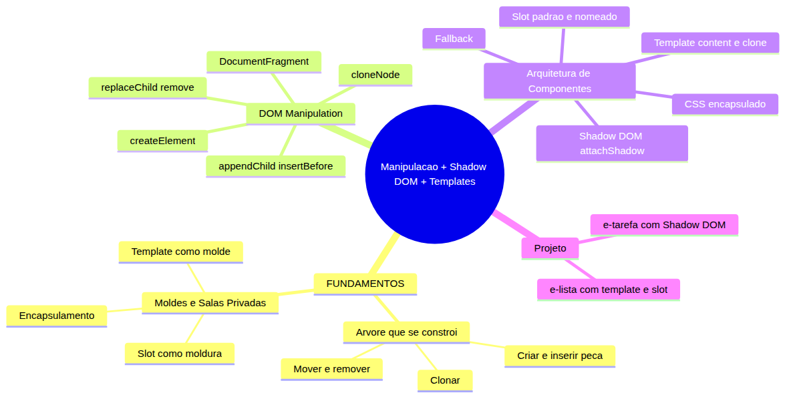
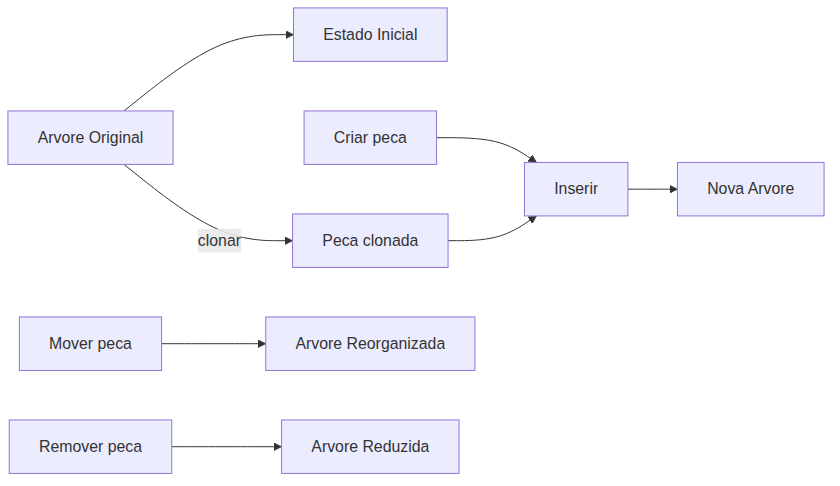
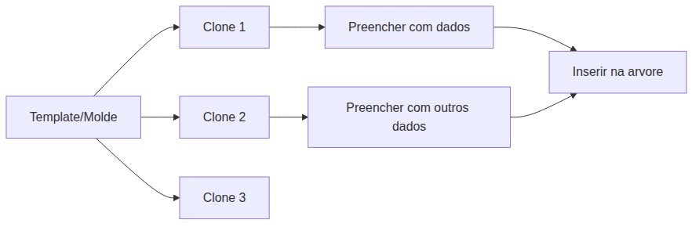
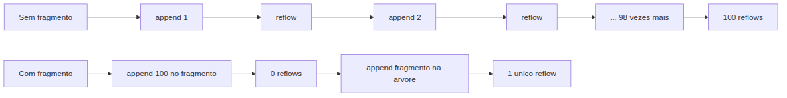
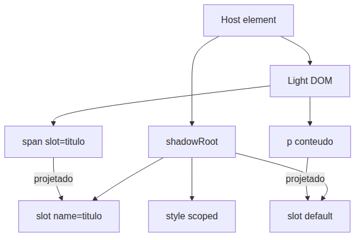

# JavaScript — Do Zero ao Profissional — Aula 20

## Manipulação + Shadow DOM + Templates — Construção Dinâmica e Encapsulamento

**Duração:** 105 minutos
**Nível:** Intermediário
**Pré-requisitos:** Aula 18 (DOM) e Aula 19 (Eventos)

---

## Objetivos de Aprendizagem

- [ ] **Diferenciar** criação, inserção, movimento e remoção de nós na árvore DOM
- [ ] **Aplicar** `createElement`, `appendChild`, `insertBefore`, `replaceChild`, `remove` e `cloneNode`
- [ ] **Explicar** o problema de reflow e como `DocumentFragment` o resolve
- [ ] **Construir** fragmentos eficientes com `document.createDocumentFragment()`
- [ ] **Usar** `<template>` como molde reutilizável para estruturas HTML
- [ ] **Criar** Shadow DOM com `attachShadow` para encapsular estilo e marcação
- [ ] **Implementar** slots padrão e nomeados com fallback
- [ ] **Compor** componentes customizados combinando template, Shadow DOM e slot
- [ ] **Integrar** os componentes em uma página funcional de gerenciamento de tarefas
- [ ] **Analisar** o impacto de performance das diferentes estratégias de manipulação

---

## Como Usar Esta Aula

Esta aula é dividida em duas grandes partes seguidas de um projeto integrador. A Parte 1 trabalha conceitos universais (sem JavaScript); a Parte 2 mergulha nas APIs do navegador. Faça os boxes **Mão na Massa** em sequência — eles formam uma trilha que culmina no projeto final. Reserve os primeiros 20 minutos para a Parte 1, 50 minutos para a Parte 2 e 35 minutos para o projeto e a autoavaliação.

| Etapa | Atividade | Tempo |
|---|---|---|
| Parte 1 | Fundamentos (Seções 1–2) | 20 min |
| Parte 2A | DOM Manipulation (Seções 3–4) | 25 min |
| Parte 2B | Arquitetura de Componentes (Seções 5–6) | 25 min |
| Projeto | Gerenciador de Tarefas (Seção 7) | 25 min |
| Final | Quiz + Exercícios + Revisão | 10 min |

---

## Mapa Mental



---

## Recapitulação da Aula 19

Antes de avançar, veja como os conceitos de eventos se conectam com o que aprenderemos:

| Aula 19 — Eventos | Conexão com Aula 20 |
|---|---|
| `addEventListener` | Componentes com Shadow DOM precisam reattacher eventos após clonagem de template |
| Propagação (captura e bolha) | Eventos disparados dentro de Shadow DOM são retargeted para parecerem vindos do host |
| `event.target` | Em Shadow DOM, `event.target` é ajustado (retargeting) para respeitar o encapsulamento |
| Delegação de eventos | Com componentes dinâmicos, delegar no container evita reattacher cada instância |
| `removeEventListener` | Ao remover um nó da árvore, listeners associados são perdidos — importante ao trocar templates |

---

## FUNDAMENTOS: Construindo e Encapsulando a Árvore Visual

> **Nota:** Esta parte usa apenas conceitos universais. Nenhum código JavaScript, nenhuma API de navegador, nenhum nome de produto é mencionado. O objetivo é construir a base conceitual antes de mergulhar nas ferramentas.

---

### Seção 1: A Árvore que se Constrói

Imagine uma estante modular de prateleiras. Você recebe peças soltas — pranchas de madeira, parafusos, encaixes — e vai montando a estrutura peça por peça. Depois de pronta, você pode trocar uma prateleira de lugar, remover uma que não serve mais, ou adicionar uma nova no meio sem desmontar tudo. Essa é a essência do trabalho com árvores de elementos.

**Recapitulação — O que é uma árvore DOM?**

Você viu na Aula 18 que todo documento HTML forma uma árvore: cada tag é um nó, cada nó tem um nó-pai (exceto a raiz) e zero ou mais nós-filhos. A essa altura você sabe navegar pela árvore (pai, filhos, irmãos). Agora você vai **modificar** essa árvore — criar novos nós, inseri-los em posições específicas, movê-los de um lugar a outro e removê-los quando não forem mais necessários.

Toda operação de manipulação segue um ciclo simples:

1. **Criar** a peça (um novo nó vazio ou com conteúdo)
2. **Posicionar** a peça em relação a um nó existente (antes, depois, dentro)
3. **Inserir** a peça na árvore
4. Eventualmente **mover** ou **remover** a peça

**Criar uma peça**

Criar um nó é como cortar uma prancha de madeira no tamanho certo: você define o tipo de elemento que quer (um parágrafo, uma lista, um botão) mas ele ainda não está em lugar nenhum. O nó existe em memória, fora da árvore visível. Ele só ganha vida quando você o insere.

Cada nó criado é independente. Você pode criá-lo, configurá-lo (adicionar texto, classes, atributos) e só depois decidir onde colocá-lo. Isso é poderoso porque permite preparar a peça inteira antes de encaixá-la na estrutura.

**Inserir na árvore**

Inserir é o ato de encaixar a peça na estante. Existem duas formas principais:

- **Dentro de outro nó, ao final:** a peça vira o último filho do nó-pai.
- **Dentro de outro nó, em posição específica:** a peça é encaixada antes de um nó-filho existente.

Uma vez inserida, a peça passa a fazer parte da árvore visível. O navegador a renderiza na tela. Se você insere o mesmo nó duas vezes, ele não é duplicado — ele é **movido** da posição anterior para a nova.

**Mover entre posições**

Mover um nó é surpreendentemente simples: você simplesmente o insere em uma nova posição. Se o nó já existe na árvore, a inserção o realoca. Não há uma operação separada de "mover". Você pega a peça de onde ela está e a encaixa em outro lugar — a estante se reorganiza automaticamente.

**Remover da árvore**

Remover é o oposto de inserir: a peça sai da árvore visível. O nó ainda existe em memória (a menos que você o destrua explicitamente), mas não é mais renderizado. É como desencaixar uma prateleira e guardá-la no depósito — ela ainda existe, só não está na estante.

Remover um nó também remove todos os seus filhos, netos etc. A subárvore inteira é destacada.

**Clonar**

Clonar é copiar uma peça existente para criar uma nova independente. Você pode fazer uma cópia superficial (só a peça, sem os filhos) ou uma cópia profunda (a peça e toda a subárvore abaixo dela). O clone é um nó novo, sem relação com o original. Mudanças no clone não afetam o original e vice-versa.

A clonagem é útil quando você tem um modelo de peça que quer replicar várias vezes — como produzir várias prateleiras idênticas a partir de um único protótipo.



**Quick Check 1**

**1. Quando você insere um nó que já existe na árvore em uma nova posição, o que acontece com o nó na posição original?**

**Resposta:** O nó é movido — ele não é duplicado. A inserção de um nó já existente o realoca automaticamente para a nova posição.

**2. Qual a diferença entre clonar superficialmente e clonar profundamente?**

**Resposta:** A clonagem superficial copia apenas o nó em si, sem seus filhos. A clonagem profunda copia o nó e toda a sua subárvore (filhos, netos etc.).

---

### Seção 2: Moldes e Salas Privadas

Os três conceitos que você vai conhecer agora — template, encapsulamento e slot — são a base da arquitetura de componentes modernos. Eles existem em diversos contextos além da web; aqui os apresentamos em sua forma mais geral.

**Template como molde**

Um molde é uma forma que você usa para produzir várias peças idênticas. Pense em uma forma de bolo: você despeja a massa, assa, desenforma e tem um bolo no formato desejado. Pode reusar a mesma forma dezenas de vezes. Cada bolo é uma instância independente criada a partir do mesmo molde.

No contexto de construção de interfaces, um **template** é exatamente isso: uma estrutura pré-definida que você usa como modelo para gerar múltiplas cópias. O template em si não é visível — é a "forma" — mas cada cópia produzida a partir dele é um elemento real na árvore.

A grande vantagem do template é que ele separa o **modelo** (a estrutura) da **instância** (a cópia em uso). Você define a estrutura uma vez e a reutiliza quantas vezes precisar.

**Encapsulamento como sala privada**

Imagine uma sala com paredes à prova de som. Dentro dela, você pode ouvir sua própria música sem perturbar as salas vizinhas. E o barulho das outras salas não entra na sua. Cada sala é isolada acusticamente.

O **encapsulamento** em componentes funciona de forma análoga. Um pedaço da árvore pode ser isolado do resto: os estilos definidos dentro desse pedaço não vazam para fora, e os estilos de fora não penetram para dentro. É como se cada componente tivesse sua própria "sala" estilística.

Isso resolve um dos problemas mais antigos da construção de interfaces: a colisão de estilos. Sem encapsulamento, um estilo definido em uma parte pode acidentalmente afetar outra parte distante. Com encapsulamento, cada componente é dono do seu próprio universo de estilo.

**Slot como moldura**

Uma moldura de quadro tem um espaço vazio no meio onde você coloca a foto. A moldura define a borda, o acabamento, a decoração — mas o conteúdo (a foto) é fornecido por você, externamente. Você pode trocar a foto sem trocar a moldura.

O **slot** é exatamente esse espaço reservado. Um componente pode declarar: "aqui vai um conteúdo fornecido por quem me usar". O slot é um ponto de extensão, um buraco na estrutura do componente onde o usuário do componente pode injetar seu próprio conteúdo.

Existem slots fixos (apenas um) e slots com identificação (vários, cada um com um nome). Isso permite que o usuário preencha diferentes regiões do componente — como um layout que tem slots para cabeçalho, corpo e rodapé.



**Quick Check 2**

**1. Um template é visível na tela? Explique.**

**Resposta:** Não. O template é como uma forma de bolo — ele não é consumido, ele serve de molde. O template em si não é renderizado; apenas os clones produzidos a partir dele são inseridos na árvore e se tornam visíveis.

**2. Qual problema o encapsulamento resolve?**

**Resposta:** O encapsulamento resolve o problema de colisão de estilos. Sem encapsulamento, estilos definidos em uma parte podem afetar outras partes. Com encapsulamento, cada componente tem seu próprio universo de estilo isolado.

---

## APLICAÇÃO: APIs do Navegador para Construção Dinâmica e Componentes

> Agora que você entende os conceitos universais, vamos ver como eles se materializam nas APIs do navegador. Prepare o console e o editor — você vai escrever cada linha.

---

## Família A — DOM Manipulation

---

### Seção 3: DOM Manipulation APIs

A primeira família de APIs permite criar, inserir, mover, remover e clonar nós. São operações que você usará em praticamente toda página dinâmica.

**`document.createElement('div')`**

O método `createElement` recebe uma string com o nome da tag e retorna um novo nó de elemento, ainda não conectado à árvore DOM.

```javascript
const meuParagrafo = document.createElement('p');
const minhaLista = document.createElement('ul');
const meuItem = document.createElement('li');
```

O nó criado existe apenas em memória. Você pode configurá-lo antes de inseri-lo:

```javascript
meuParagrafo.textContent = 'Este é um parágrafo dinâmico';
meuParagrafo.className = 'destaque';
meuParagrafo.setAttribute('data-info', 'exemplo');
```

Neste momento o elemento está "solto" — não aparece na tela. Para torná-lo visível, você precisa inseri-lo na árvore com um dos métodos de inserção.

**`.appendChild()`**

`appendChild` adiciona um nó como o **último filho** do nó-pai. É a forma mais comum de inserção.

```javascript
const lista = document.getElementById('minha-lista');
const novoItem = document.createElement('li');
novoItem.textContent = 'Item adicionado';
lista.appendChild(novoItem);
```

O elemento `li` agora é o último filho de `#minha-lista`. Se você chamar `appendChild` com um nó que já existe na árvore, o nó é **movido** — não duplicado:

```javascript
// Move o primeiro item para o final da lista
const primeiroItem = lista.firstElementChild;
lista.appendChild(primeiroItem); // movimento, não cópia
```

Este comportamento de movimento é fundamental: `appendChild`, `insertBefore` e `replaceChild` sempre movem o nó se ele já estiver na árvore.

**Edge cases de appendChild**

`appendChild` aceita qualquer tipo de nó: elementos, text nodes, comentários, document fragments. Se você passar `null` ou `undefined`, o método lança um erro. Se você passar um `DocumentFragment`, todos os filhos do fragmento são inseridos (e o fragmento é esvaziado), não o fragmento em si.

```javascript
const fragmento = document.createDocumentFragment();
fragmento.appendChild(document.createTextNode("Texto "));
fragmento.appendChild(document.createElement("strong"));
fragmento.appendChild(document.createTextNode(" concatenado"));
document.body.appendChild(fragmento); // tres nos inseridos de uma vez
```

Outro edge case: se o nó pai for um `DocumentFragment` que ainda não está no DOM, `appendChild` funciona normalmente — os filhos ficam no fragmento até que ele próprio seja inserido.


**`.insertBefore()`**

`insertBefore` insere um nó **antes** de um nó-filho de referência. Recebe dois argumentos: o nó a inserir e o nó de referência.

```javascript
const lista = document.getElementById('minha-lista');
const novoItem = document.createElement('li');
novoItem.textContent = 'Item no inicio';
const refItem = lista.firstElementChild;
lista.insertBefore(novoItem, refItem);
```

Se o nó de referência for `null`, `insertBefore` se comporta como `appendChild` — insere ao final.

**`.replaceChild()`**

`replaceChild` troca um nó-filho existente por um novo. Recebe dois argumentos: o nó novo e o nó a ser substituído.

```javascript
const lista = document.getElementById('minha-lista');
const itemSubstituto = document.createElement('li');
itemSubstituto.textContent = 'Item substituto';
const itemAntigo = lista.children[1];
lista.replaceChild(itemSubstituto, itemAntigo);
```

O nó antigo é removido da árvore. O nó novo ocupa a posição do antigo.

**`.remove()` e `.removeChild()`**

Existem duas formas de remover um nó:

- `removeChild` é chamado no **pai** e recebe o nó a remover como argumento.
- `remove` é chamado no **próprio nó** e não recebe argumentos.

```javascript
const lista = document.getElementById('minha-lista');

// Forma 1: removeChild no pai
const item = lista.children[0];
lista.removeChild(item);

// Forma 2: remove no proprio no
lista.children[0].remove();
```

`remove` é mais concisa e legível. `removeChild` retorna o nó removido, o que é útil se você quiser guardar referência para reinserir depois.

O nó removido ainda existe em memória. Se você tiver uma referência a ele, pode reinseri-lo em qualquer lugar:

```javascript
const itemRemovido = lista.removeChild(lista.children[0]);
outraLista.appendChild(itemRemovido); // move para outra lista
```

**cloneNode com text nodes**

Text nodes também podem ser clonados:

```javascript
const original = document.createTextNode("Hello");
const copia = original.cloneNode(); // true ou false faz diferença?
```

Para text nodes, o argumento `deep` não tem efeito — text nodes não têm filhos, então ambos os modos produzem o mesmo resultado. O clone é um novo text node independente com o mesmo `textContent`.

**cloneNode com DocumentFragment**

Fragmentos também podem ser clonados. Isso é útil para templates avançados onde você quer preservar uma estrutura base e derivar variações sem recriar o fragmento do zero:

```javascript
const base = document.createDocumentFragment();
base.appendChild(document.createElement("header"));
base.appendChild(document.createElement("main"));

const cloneRaso = base.cloneNode(false);  // fragmento vazio
const cloneFundo = base.cloneNode(true);  // fragmento com header + main
```


**`.cloneNode(true/false)`**

`cloneNode` cria uma cópia do nó. O argumento booleano controla a profundidade:

- `false` ou omitido: clona apenas o nó, sem os filhos (cópia superficial).
- `true`: clona o nó e toda a subárvore (cópia profunda).

```javascript
const listaOriginal = document.getElementById('minha-lista');
const copiaSuperficial = listaOriginal.cloneNode(false);  // só o <ul>, sem os <li>
const copiaProfunda = listaOriginal.cloneNode(true);       // <ul> + todos os <li>
```

Importante: `cloneNode` não copia event listeners atribuídos via `addEventListener`. Também não copia propriedades customizadas do nó. A cópia inclui atributos HTML e conteúdo textual.

**Mão na Massa — Inline 1**

Abra o console do navegador e siga os passos:

```javascript
// 1. Crie uma lista nao ordenada
const ul = document.createElement('ul');
ul.id = 'lista-exemplo';

// 2. Adicione tres itens
const temas = ['Criar', 'Inserir', 'Remover'];
temas.forEach(texto => {
  const li = document.createElement('li');
  li.textContent = texto;
  ul.appendChild(li);
});

// 3. Insira a lista no body
document.body.appendChild(ul);

// 4. Clone a lista profundamente e insira ao lado
const clone = ul.cloneNode(true);
clone.id = 'lista-clone';
document.body.appendChild(clone);

// 5. Remova o segundo item da lista original
ul.children[1].remove();

// 6. Verifique no Elements do DevTools
console.log('Lista original:', ul.children.length, 'itens');
console.log('Lista clone:', clone.children.length, 'itens');
```

Observe como a remoção do item na lista original não afetou o clone. São árvores independentes.

**Quick Check 3**

**1. O que acontece se você chamar `appendChild` com um nó que já está na árvore DOM?**

**Resposta:** O nó é movido da posição original para a nova posição (como último filho do pai). Ele não é duplicado.

**2. Qual a diferença entre `removeChild` e `remove`?**

**Resposta:** `removeChild` é chamado no nó-pai e recebe o nó a remover como argumento. `remove` é chamado diretamente no nó a ser removido e não recebe argumentos. `removeChild` retorna o nó removido; `remove` retorna `undefined`.

---

### Seção 4: DocumentFragment

Toda vez que você insere um nó na árvore DOM, o navegador precisa recalcular a posição e o estilo dos elementos na tela — um processo chamado **reflow**. Inserir vários nós um por um causa múltiplos reflows, o que é caro em performance.

**O problema do reflow**

Imagine que você está montando uma estante e, a cada prancha que encaixa, precisa recalcular o equilíbrio de todas as peças. Se você encaixar 100 pranchas uma a uma, fará 100 recalibragens. Agora imagine que você monta a estante inteira em uma bancada separada e só depois a transporta para o lugar — uma única recalibragem.

O `DocumentFragment` é essa bancada separada.

**Criando um DocumentFragment**

```javascript
const fragmento = document.createDocumentFragment();
```

O fragmento é um nó especial que vive em memória. Ele não faz parte da árvore DOM visível. Você pode inserir nele quantos nós quiser — nenhum reflow é disparado.

```javascript
const fragmento = document.createDocumentFragment();

for (let i = 0; i < 100; i++) {
  const li = document.createElement('li');
  li.textContent = `Item ${i + 1}`;
  fragmento.appendChild(li); // sem reflow!
}

// Um unico reflow ao final
lista.appendChild(fragmento);
```

Quando você insere o fragmento no DOM, todos os seus filhos são transferidos para o pai em uma única operação. O fragmento em si não é inserido — ele fica vazio após a transferência, como um caminhão de mudança após descarregar a carga.

**Performance: com e sem fragmento**



**Reuso de DocumentFragment**

Após inserir um fragmento no DOM, ele fica vazio. Mas isso não significa que você precisa criar um novo fragmento a cada operação. Você pode reutilizar a mesma variável de fragmento — basta adicionar novos nós a ele:

```javascript
const fragmento = document.createDocumentFragment();

// Primeiro lote
for (let i = 0; i < 5; i++) {
  fragmento.appendChild(document.createElement("li"));
}
lista1.appendChild(fragmento); // fragmento agora esta vazio

// Segundo lote — reutiliza a mesma variavel
for (let i = 0; i < 5; i++) {
  fragmento.appendChild(document.createElement("li"));
}
lista2.appendChild(fragmento);
```

Isso é útil em laços que processam lotes de dados assíncronos: você acumula itens no fragmento até um certo limite, descarrega no DOM e continua.


A diferença é dramática. Para 100 itens, você passa de 100 reflows para 1. Em listas grandes (centenas ou milhares de itens), o `DocumentFragment` é essencial para manter a interface responsiva.

**Conexão com conceitos anteriores**

O `DocumentFragment` tem uma relação direta com o template que você verá na Seção 5: o conteúdo de um `<template>` é um `DocumentFragment`. Isso significa que você já está usando fragmentos indiretamente quando trabalha com templates. A mesma eficiência se aplica.

**Mão na Massa — Inline 2**

Refatore o código da Mão na Massa 1 para usar `DocumentFragment`:

```javascript
function criarListaComFragmento(itens) {
  const ul = document.createElement('ul');
  const fragmento = document.createDocumentFragment();

  itens.forEach(texto => {
    const li = document.createElement('li');
    li.textContent = texto;
    fragmento.appendChild(li);
  });

  ul.appendChild(fragmento);
  return ul;
}

// Uso
const lista = criarListaComFragmento(['UM', 'DOIS', 'TRES', 'QUATRO']);
document.body.appendChild(lista);
```

Compare mentalmente com a versão sem fragmento. Se você estivesse criando 10 000 itens, a diferença seria facilmente perceptível — a versão com fragmento renderizaria em milissegundos, enquanto a sem fragmento congelaria a tela por vários segundos.

**Quick Check 4**

**1. Por que o `DocumentFragment` melhora a performance?**

**Resposta:** Porque ele evita múltiplos reflows. Os nós são adicionados ao fragmento em memória (sem reflow), e um único reflow ocorre quando o fragmento é inserido na árvore DOM.

**2. O que acontece com o conteúdo do fragmento depois que ele é inserido no DOM?**

**Resposta:** Todos os filhos do fragmento são transferidos para o nó-pai de destino. O fragmento fica vazio — ele serve apenas como contêiner temporário.

---

## Família B — Arquitetura de Componentes

---

### Seção 5: `<template>`

Agora você vai unir o molde conceitual da Parte 1 com a API real do HTML: a tag `<template>`.

**A tag `<template>`**

```html
<template id="card-produto">
  <div class="card">
    <h3 class="card-titulo"></h3>
    <p class="card-descricao"></p>
    <span class="card-preco"></span>
    <button class="card-comprar">Comprar</button>
  </div>
</template>
```

O conteúdo dentro de `<template>` é **inerte**. O navegador faz o parsing do HTML (então a estrutura está válida), mas:

- Nenhum elemento é renderizado na tela
- Nenhuma imagem é carregada
- Nenhum script é executado
- Nenhum estilo é aplicado
- O template não aparece no DevTools como parte da árvore visível

O template é puro molde, exatamente como discutimos na Parte 1.

**`template.content`**

Todo elemento `<template>` tem uma propriedade `content` que retorna um `DocumentFragment` contendo a estrutura do template. Aqui está a conexão direta com a Seção 4: o conteúdo do template **é** um `DocumentFragment`.

```javascript
const template = document.getElementById('card-produto');
const fragmento = template.content; // DocumentFragment
```

Mas atenção: este fragmento é o **conteúdo vivo** do template. Se você o inserir diretamente no DOM, o template perde seu conteúdo — não pode ser reutilizado. Por isso você nunca insere `template.content` diretamente.

**`.content.cloneNode(true)` para ativar**

Para criar uma cópia reutilizável do conteúdo do template, você clona o fragmento:

```javascript
const template = document.getElementById('card-produto');
const clone = template.content.cloneNode(true); // DocumentFragment clonado
```

A clonagem profunda copia todo o conteúdo do template para um novo `DocumentFragment`. O template original permanece intacto, pronto para ser clonado novamente.

**Preencher e inserir**

Com o clone em mãos, você o preenche com dados e o insere no DOM:

```javascript
function criarCard(produto) {
  const template = document.getElementById('card-produto');
  const clone = template.content.cloneNode(true);

  // Preenche os elementos
  clone.querySelector('.card-titulo').textContent = produto.nome;
  clone.querySelector('.card-descricao').textContent = produto.descricao;
  clone.querySelector('.card-preco').textContent = `R$ ${produto.preco}`;

  return clone; // DocumentFragment pronto
}

const lista = document.getElementById('produtos');
const card = criarCard({ nome: 'Teclado', descricao: 'Mecanico RGB', preco: 199 });
lista.appendChild(card);
```

O ciclo completo: template → clonar → preencher → inserir. O template nunca se esgota — você pode chamar `cloneNode(true)` milhares de vezes.

**Template nunca se esgota**

```javascript
// 1000 cards a partir de UM template
const template = document.getElementById('card-produto');
const container = document.getElementById('produtos');

for (let i = 0; i < 1000; i++) {
  const clone = template.content.cloneNode(true);
  clone.querySelector('.card-titulo').textContent = `Produto ${i}`;
  container.appendChild(clone);
}

// O template ainda esta intacto
console.log(template.content.children.length); // 1 (a div.card original)
```

**Mão na Massa — Inline 3**

Crie uma página HTML com um template de card de produto e use JavaScript para gerar 5 cards:

```html
<!DOCTYPE html>
<html>
<body>
  <template id="card-produto">
    <div class="card" style="border:1px solid #ccc;margin:8px;padding:12px;display:inline-block">
      <h3 class="nome"></h3>
      <p class="descricao"></p>
      <strong class="preco"></strong>
    </div>
  </template>

  <div id="vitrine"></div>

  <script>
    const produtos = [
      { nome: 'Mouse', descricao: 'Sem fio', preco: 'R$ 89' },
      { nome: 'Teclado', descricao: 'Mecanico', preco: 'R$ 199' },
      { nome: 'Monitor', descricao: '27 4K', preco: 'R$ 1.299' },
      { nome: 'Webcam', descricao: 'Full HD', preco: 'R$ 249' },
      { nome: 'Headset', descricao: '7.1 surround', preco: 'R$ 179' },
    ];

    const template = document.getElementById('card-produto');
    const vitrine = document.getElementById('vitrine');
    const fragmento = document.createDocumentFragment();

    produtos.forEach(p => {
      const card = template.content.cloneNode(true);
      card.querySelector('.nome').textContent = p.nome;
      card.querySelector('.descricao').textContent = p.descricao;
      card.querySelector('.preco').textContent = p.preco;
      fragmento.appendChild(card);
    });

    vitrine.appendChild(fragmento);
  </script>
</body>
</html>
```

Observe a combinação: template + `DocumentFragment` + clonagem. Você está usando os três conceitos em harmonia.

**Quick Check 5**

**1. Por que você não pode inserir `template.content` diretamente no DOM?**

**Resposta:** Porque `template.content` é o DocumentFragment vivo do template. Inseri-lo no DOM esvazia o template, impedindo seu reuso. Você deve cloná-lo com `cloneNode(true)` para criar cópias independentes.

**2. O template é reutilizável? Quantas cópias podem ser feitas a partir dele?**

**Resposta:** Sim, o template é reutilizável indefinidamente. Não há limite para o número de clones — você pode fazer centenas ou milhares de cópias a partir do mesmo template.

---


**Estrategias de estilo com template**

O template pode conter qualquer HTML válido, incluindo tags `<style>` e `<link rel="stylesheet">`. Quando você clona o template, os estilos são clonados junto com a estrutura, garantindo que cada instância tenha seus estilos desde o nascimento.

```html
<template id="card-estilizado">
  <style>
    .card { border-radius: 8px; padding: 16px; box-shadow: 0 2px 8px rgba(0,0,0,0.1); }
    .card h3 { color: #2c3e50; margin-top: 0; }
  </style>
  <div class="card">
    <h3 class="titulo"></h3>
    <p class="descricao"></p>
  </div>
</template>
```

Ao clonar e inserir múltiplos cards, cada um carrega sua própria tag `<style>`. Isso é intencional e desejado: cada instância é autocontida. Navegadores modernos otimizam estilos idênticos para não duplicar o parsing.

**Template vs innerHTML**

Antes dos templates, a abordagem comum era concatenar strings HTML:

```javascript
const html = `<div class="card"><h3>${nome}</h3><p>${desc}</p></div>`;
container.innerHTML += html;
```

Isso funciona, mas tem desvantagens: (a) quebra event listeners existentes se usar `innerHTML` no container, (b) é inseguro com dados não sanitizados (XSS), (c) não separa estrutura de dados. O template resolve todos esses problemas.


### Seção 6: Shadow DOM + `<slot>`

O Shadow DOM é o mecanismo que implementa o encapsulamento que discutimos na Parte 1. Com ele, você cria árvores DOM isoladas que não vazam estilos para fora nem sofrem interferência de estilos externos.

**`attachShadow({ mode: 'open' })`**

```javascript
const host = document.getElementById('meu-componente');
const shadowRoot = host.attachShadow({ mode: 'open' });
```

O método `attachShadow` é chamado em um elemento existente (o **host**) e retorna um `shadowRoot` — a raiz da árvore Shadow DOM. O parâmetro `mode` pode ser:

- `'open'`: o shadowRoot é acessível via `element.shadowRoot` de fora.
- `'closed'`: o shadowRoot não é acessível externamente (mas raramente usado, pois quebra ferramentas de debug).

Nem todo elemento pode receber Shadow DOM. Elementos que já têm seu próprio comportamento interno (como ``, `<input>`, `<select>`, `<video>`) não podem ser hosts. Use sempre elementos genéricos como `<div>`, `<span>`, `<section>` ou um elemento customizado.

**shadowRoot como mini-documento**

O `shadowRoot` se comporta como um `document` em miniatura. Você pode usar `innerHTML`, `appendChild`, `querySelector` e todos os métodos DOM dentro dele:

```javascript
const host = document.createElement('div');
document.body.appendChild(host);

const shadow = host.attachShadow({ mode: 'open' });
shadow.innerHTML = `
  <style>
    p { color: blue; font-weight: bold; }
  </style>
  <p>Texto dentro do Shadow DOM</p>
`;
```

O parágrafo dentro do shadow é renderizado em azul e negrito. Qualquer `<p>` fora do shadow permanece com o estilo padrão ou o estilo definido globalmente — **o estilo não vaza**.

**CSS encapsulado — demonstração**

```html
<style>
  p { color: red !important; }
</style>

<div id="host1"></div>
<p>Fora do shadow — vermelho</p>

<script>
  const host = document.getElementById('host1');
  const shadow = host.attachShadow({ mode: 'open' });
  shadow.innerHTML = `
    <style>p { color: blue; }</style>
    <p>Dentro do shadow — azul</p>
  `;

  // Estilos globais NAO afetam o shadow
  // Estilos do shadow NAO afetam o exterior
</script>
```

O parágrafo fora do shadow é vermelho (estilo global). O parágrafo dentro do shadow é azul. `!important` global não penetra o Shadow DOM. O encapsulamento é completo.

**`<slot>` — default e nomeado**

O elemento `<slot>` é a moldura que discutimos na Parte 1. Ele marca pontos no Shadow DOM onde o conteúdo do host (light DOM) é projetado.

```html
<!-- Componente com slot -->
<meu-card>
  <span slot="titulo">Meu Titulo</span>
  <p>Este e o conteudo principal do card.</p>
</meu-card>

<script>
  class MeuCard extends HTMLElement {
    constructor() {
      super();
      const shadow = this.attachShadow({ mode: 'open' });
      shadow.innerHTML = `
        <style>
          .card { border: 1px solid #ddd; padding: 16px; border-radius: 8px; }
          .titulo { font-size: 1.2em; font-weight: bold; }
        </style>
        <div class="card">
          <div class="titulo"><slot name="titulo">Titulo Padrao</slot></div>
          <div class="conteudo"><slot>Conteudo padrao</slot></div>
        </div>
      `;
    }
  }
  customElements.define('meu-card', MeuCard);
</script>
```

- **Slot nomeado**: `<slot name="titulo">` só recebe elementos com `slot="titulo"`.
- **Slot default**: `<slot>` (sem nome) recebe todos os outros filhos do host.
- **Fallback**: Se nenhum conteúdo for fornecido para o slot, o conteúdo interno do `<slot>` é exibido.

**Event retargeting**

Eventos disparados dentro do Shadow DOM têm `event.target` ajustado para o host quando o evento atravessa a fronteira do shadow. Isso é chamado de **retargeting** e faz parte do encapsulamento — o mundo externo não precisa saber detalhes internos do componente.

**Diagrama em corte**



**`:host-context()` — estilizar por contexto**

O seletor `:host-context(selector)` permite que o componente reaja ao contexto externo. Por exemplo, se o componente estiver dentro de um elemento com classe `.dark-theme`, você pode alterar seu estilo:

```css
:host-context(.dark-theme) {
  background: #333;
  color: #eee;
}
```

Isso é útil para temas globais: o componente detecta o tema do ancestral sem precisar de atributos ou classes próprios.

**Partes expostas com `::part()`**

Às vezes você quer permitir que o usuário estilize partes específicas do Shadow DOM sem quebrar o encapsulamento. O pseudo-elemento `::part()` expõe elementos marcados com o atributo `part`:

```javascript
shadow.innerHTML = `<div part="container">
  <h2 part="titulo"><slot name="titulo"></slot></h2>
  <div part="conteudo"><slot></slot></div>
</div>`;
```

O usuário do componente pode estilizar essas partes de fora:

```css
e-card::part(titulo) { color: purple; }
e-card::part(container) { border-color: purple; }
```

`::part()` é uma forma controlada de expor estilo sem abrir mão do encapsulamento completo.

**Considerações de performance**

Criar um Shadow DOM por componente tem custo de inicialização, mas é amortizado pelo número de instâncias. Uma página com 50 componentes Shadow DOM performa igual a uma com 50 componentes sem Shadow DOM — a diferença está no parsing inicial, não na renderização contínua.

O encapsulamento CSS do Shadow DOM torna o cálculo de estilo mais rápido em alguns cenários, porque o navegador sabe exatamente quais estilos podem afetar quais elementos. Em páginas com muitos estilos globais, o Shadow DOM pode até melhorar a performance de layout.


**Mão na Massa — Inline 4**

Crie um componente `<e-card>` com Shadow DOM, slot nomeado e default:

```html
<!DOCTYPE html>
<html>
<body>
  <e-card>
    <span slot="titulo">JavaScript</span>
    <p>Linguagem de programacao dinamica e versatil.</p>
    <p>Usada em front-end, back-end e mobile.</p>
  </e-card>

  <e-card>
    <span slot="titulo">HTML</span>
    <p>Linguagem de marcacao para estrutura de paginas web.</p>
  </e-card>

  <e-card>
    <!-- Sem slot="titulo" — usa fallback -->
    <p>Card sem titulo definido, apenas conteudo.</p>
  </e-card>

  <script>
    class ECard extends HTMLElement {
      constructor() {
        super();
        const shadow = this.attachShadow({ mode: 'open' });
        shadow.innerHTML = `
          <style>
            :host {
              display: block;
              border: 2px solid #4a90d9;
              border-radius: 10px;
              padding: 16px;
              margin: 12px 0;
              font-family: sans-serif;
            }
            .titulo {
              font-size: 1.4em;
              color: #2c5f8a;
              border-bottom: 1px solid #4a90d9;
              margin-bottom: 8px;
            }
            .conteudo {
              color: #333;
            }
          </style>
          <div class="titulo"><slot name="titulo">Titulo Padrao</slot></div>
          <div class="conteudo"><slot></slot></div>
        `;
      }
    }
    customElements.define('e-card', ECard);
  </script>
</body>
</html>
```

Observe: o terceiro `<e-card>` não tem `slot="titulo"`, então o fallback "Titulo Padrao" aparece. Os parágrafos sem slot nomeado caem no slot default.

**Quick Check 6**

**1. Quais elementos NÃO podem receber Shadow DOM? Por que?**

**Resposta:** Elementos que já têm comportamento interno próprio, como ``, `<input>`, `<select>`, `<audio>`, `<video>`. Eles não podem ser hosts porque o navegador já gerencia uma árvore interna para eles.

**2. O que é retargeting de eventos no Shadow DOM?**

**Resposta:** É o ajuste automático de `event.target` quando um evento cruza a fronteira do Shadow DOM. O target é reescrito para o host, impedindo que o mundo externo acesse detalhes internos do componente.

---

## Integração

---

### Seção 7: Projeto — Gerenciador de Tarefas

Você vai migrar e expandir o gerenciador de tarefas das aulas anteriores. Primeiro, vai converter o componente `<e-tarefa>` de `innerHTML` para Shadow DOM com slot. Depois, vai criar um novo componente `<e-lista>` que usa template, DocumentFragment e slot.

**7.1 Migrar `<e-tarefa>` para Shadow DOM + slot**

**Antes** (Aula 19 — innerHTML):

```javascript
class ETarefa extends HTMLElement {
  constructor() {
    super();
    this.dataset.concluida = 'false';
  }

  connectedCallback() {
    this.innerHTML = `
      <style>
        .tarefa { padding: 8px; margin: 4px; border-radius: 4px; }
        .concluida { background: #d4edda; text-decoration: line-through; }
        .pendente { background: #fff3cd; }
      </style>
      <div class="tarefa pendente">
        <input type="checkbox">
        <span></span>
        <button class="remover">x</button>
      </div>
    `;
    this.render();
    this.querySelector('.remover').addEventListener('click', () => this.remove());
    this.querySelector('input[type="checkbox"]').addEventListener('change', this.toggle.bind(this));
  }

  static get observedAttributes() { return ['texto', 'concluida']; }

  attributeChangedCallback(attr, oldVal, newVal) {
    if (attr === 'texto' || attr === 'concluida') this.render();
  }

  render() {
    const div = this.querySelector('.tarefa');
    if (!div) return;
    div.querySelector('span').textContent = this.getAttribute('texto') || '';
    const concluida = this.getAttribute('concluida') === 'true';
    div.className = `tarefa ${concluida ? 'concluida' : 'pendente'}`;
    div.querySelector('input[type="checkbox"]').checked = concluida;
  }

  toggle() {
    const novo = this.getAttribute('concluida') === 'true' ? 'false' : 'true';
    this.setAttribute('concluida', novo);
  }
}
customElements.define('e-tarefa', ETarefa);
```

Observe os problemas da versão com `innerHTML`:

- Os estilos `<style>` são injetados no light DOM e podem vazar ou conflitar.
- O checkbox, o texto e o botão ficam expostos a seletores externos.
- A estrutura interna é acessível via `querySelector` de fora.

**Depois** — com Shadow DOM e slot:

```javascript
class ETarefa extends HTMLElement {
  constructor() {
    super();
    const shadow = this.attachShadow({ mode: 'open' });
    shadow.innerHTML = `
      <style>
        :host {
          display: block;
          padding: 8px;
          margin: 4px;
          border-radius: 4px;
          background: #fff3cd;
        }
        :host([concluida="true"]) {
          background: #d4edda;
        }
        :host([concluida="true"]) .texto {
          text-decoration: line-through;
        }
        .container {
          display: flex;
          align-items: center;
          gap: 8px;
        }
        .texto {
          flex: 1;
        }
        button {
          background: #dc3545;
          color: white;
          border: none;
          border-radius: 4px;
          cursor: pointer;
        }
      </style>
      <div class="container">
        <input type="checkbox">
        <span class="texto"><slot>tarefa</slot></span>
        <button>x</button>
      </div>
    `;
    shadow.querySelector('button').addEventListener('click', () => this.remove());
    shadow.querySelector('input[type="checkbox"]').addEventListener('change', () => this.toggle());
  }

  static get observedAttributes() { return ['concluida']; }

  attributeChangedCallback(attr, oldVal, newVal) {
    if (attr === 'concluida') this.atualizarEstado();
  }

  atualizarEstado() {
    const shadow = this.shadowRoot;
    const checkbox = shadow.querySelector('input[type="checkbox"]');
    checkbox.checked = this.getAttribute('concluida') === 'true';
  }

  toggle() {
    const novo = this.getAttribute('concluida') === 'true' ? 'false' : 'true';
    this.setAttribute('concluida', novo);
  }
}
customElements.define('e-tarefa', ETarefa);
```

Mudanças principais:

1. **Shadow DOM**: a estrutura está encapsulada, estilos não vazam.
2. **`:host` selector**: estilos condicionais com `:host([concluida="true"])`.
3. **`<slot>`**: o texto da tarefa é agora um slot. O texto pode vir do conteúdo do elemento.
4. **`observedAttributes`**: agora observa apenas `concluida` — o texto vem do slot.
5. **Listeners**: ainda no shadowRoot, mas agora em elementos encapsulados.

Uso no HTML:

```html
<e-tarefa concluida="false">Estudar JavaScript</e-tarefa>
<e-tarefa concluida="true">Revisar Aula 19</e-tarefa>
```

**7.2 Criar `<e-lista>` com template e slot**

O componente `<e-lista>`:

- Recebe um atributo `titulo` para exibir como cabeçalho.
- Usa Shadow DOM para encapsulamento.
- Usa um `<template>` interno para gerar o HTML.
- Usa `DocumentFragment` para inserção eficiente.
- Tem um slot para inserir tarefas.
- Exibe fallback quando não há tarefas.

```javascript
class ELista extends HTMLElement {
  constructor() {
    super();
    const shadow = this.attachShadow({ mode: 'open' });

    // Template interno
    const template = document.createElement('template');
    template.innerHTML = `
      <style>
        :host {
          display: block;
          border: 2px solid #6c757d;
          border-radius: 8px;
          padding: 16px;
          margin: 16px 0;
          font-family: sans-serif;
        }
        h2 {
          margin: 0 0 12px 0;
          color: #495057;
          border-bottom: 1px solid #dee2e6;
          padding-bottom: 8px;
        }
        .vazia {
          color: #999;
          font-style: italic;
          text-align: center;
          padding: 20px;
        }
      </style>
      <h2></h2>
      <slot>
        <p class="vazia">Nenhuma tarefa cadastrada ainda.</p>
      </slot>
    `;

    shadow.appendChild(template.content.cloneNode(true));
  }

  static get observedAttributes() { return ['titulo']; }

  attributeChangedCallback(attr, oldVal, newVal) {
    if (attr === 'titulo') {
      const h2 = this.shadowRoot.querySelector('h2');
      h2.textContent = newVal || 'Lista';
    }
  }

  connectedCallback() {
    if (!this.hasAttribute('titulo')) {
      this.setAttribute('titulo', 'Lista');
    }
  }
}
customElements.define('e-lista', ELista);
```

**7.3 Integração na página**

**Event handling com Shadow DOM no projeto**

Quando o `<e-tarefa>` usa Shadow DOM, o evento de clique no botão de remover e o evento de change no checkbox são configurados dentro do construtor, no shadowRoot. Como o shadowRoot persiste enquanto o elemento existir, os listeners não precisam ser reattacher.

No entanto, se você estivesse usando `<template>` para gerar instâncias de `<e-tarefa>`, seria necessário garantir que os listeners fossem adicionados após a inserção no DOM. A abordagem recomendada é usar o `connectedCallback`:

```javascript
class ETarefa extends HTMLElement {
  constructor() {
    super();
    this.#listenersAttached = false;
    this.attachShadow({ mode: "open" });
    // configura o template, mas NAO adiciona listeners
  }

  connectedCallback() {
    if (this.#listenersAttached) return;
    this.#listenersAttached = true;

    this.shadowRoot.querySelector("button")
      .addEventListener("click", () => this.remove());

    this.shadowRoot.querySelector('input[type="checkbox"]')
      .addEventListener("change", (e) => {
        if (e.target.checked) {
          this.setAttribute("data-concluida", "");
        } else {
          this.removeAttribute("data-concluida");
        }
      });
  }
}
```

Isso é especialmente importante se você estiver removendo e reinserindo elementos dinamicamente: cada vez que o elemento é reconectado ao DOM, o `connectedCallback` dispara novamente.

**Delegação entre componentes**

No projeto, `<e-lista>` é pai de `<e-tarefa>`. Como cada `<e-tarefa>` gerencia seus próprios eventos internamente (botao remover, checkbox), o `<e-lista>` não precisa interceptar esses eventos. A delegação acontece naturalmente: cada componente é responsável pelo seu próprio comportamento.


```html
<!DOCTYPE html>
<html lang="pt-BR">
<head>
  <meta charset="UTF-8">
  <title>Gerenciador de Tarefas</title>
</head>
<body>
  <e-lista titulo="Minhas Tarefas">
    <e-tarefa concluida="false">Estudar JavaScript</e-tarefa>
    <e-tarefa concluida="true">Revisar Aula 19</e-tarefa>
    <e-tarefa concluida="false">Praticar Shadow DOM</e-tarefa>
    <e-tarefa concluida="false">Ler sobre slots</e-tarefa>
  </e-lista>

  <e-lista titulo="Compras">
    <e-tarefa concluida="false">Teclado mecanico</e-tarefa>
    <e-tarefa concluida="true">Monitor 4K</e-tarefa>
  </e-lista>

  <e-lista titulo="Ideias">
    <!-- Lista vazia — fallback aparece -->
  </e-lista>

  <script>
    // <e-tarefa> e <e-lista> definidos acima
  </script>
</body>
</html>
```

Observe: a terceira lista "Ideias" não tem filhos `<e-tarefa>`. O slot exibe o fallback "Nenhuma tarefa cadastrada ainda."

**Mão na Massa — Inline 5**

Migre manualmente o componente `<e-tarefa>` do projeto que você criou na Aula 19. Siga os passos:

1. Substitua `this.innerHTML` por `this.attachShadow({ mode: 'open' })`.
2. Envolva o texto da tarefa em `<slot>`.
3. Troque seletores com `this.querySelector` para `this.shadowRoot.querySelector`.
4. Use `:host` e `:host([concluida="true"])` em vez de classes CSS.
5. Remova `texto` de `observedAttributes` (o texto agora vem do slot).
6. Teste no navegador — a aparência deve ser idêntica, mas o encapsulamento agora existe.

**Mão na Massa — Inline 6**

Crie um componente `<e-lista>` do zero. Siga os passos:

1. Defina a classe `ELista` estendendo `HTMLElement`.
2. No `constructor`, crie Shadow DOM com `attachShadow({ mode: 'open' })`.
3. Crie um `<template>` interno com: `<style>`, `<h2>`, `<slot>` com fallback.
4. Clone o template com `content.cloneNode(true)` e insira no shadow.
5. Implemente `observedAttributes` para `titulo` e `attributeChangedCallback`.
6. Defina o elemento com `customElements.define('e-lista', ELista)`.
7. Teste com tarefas e sem tarefas para ver o fallback.

**Quick Check 7**

**1. Por que o atributo `texto` foi removido de `observedAttributes` na versão com Shadow DOM?**

**Resposta:** Porque o texto da tarefa agora é fornecido via slot (conteúdo do elemento), não via atributo. O slot é preenchido pelo light DOM, e o Shadow DOM não precisa observar mudanças de atributo para o texto.

**2. Qual a vantagem de usar `:host([concluida="true"])` em vez de uma classe CSS?**

**Resposta:** `:host` seleciona o próprio elemento host. Usar `:host([atributo="valor"])` elimina a necessidade de sincronizar uma classe com o atributo — o estilo reage automaticamente ao valor do atributo através do `attributeChangedCallback`.

---

## Autoavaliação: Quiz Rápido

**1. Qual método cria um novo elemento na memória, sem inseri-lo no DOM?**

**Resposta:** `document.createElement('tag')` cria um novo nó de elemento em memória, fora da árvore DOM.

**2. Verdadeiro ou falso: `appendChild` com um nó já existente no DOM cria uma cópia do nó.**

**Resposta:** Falso. `appendChild` move o nó existente para a nova posição. Para criar uma cópia, use `cloneNode(true)`.

**3. Qual a principal vantagem de performance do `DocumentFragment`?**

**Resposta:** Ele evita múltiplos reflows. Todos os nós são adicionados ao fragmento em memória, e apenas um reflow ocorre quando o fragmento é inserido no DOM.

**4. O que acontece com o conteúdo de um `<template>` após cloná-lo com `content.cloneNode(true)`?**

**Resposta:** O conteúdo original do template permanece intacto. O clone é um `DocumentFragment` independente. O template pode ser clonado quantas vezes for necessário.

**5. Qual método ativa o Shadow DOM em um elemento?**

**Resposta:** `element.attachShadow({ mode: 'open' })` retorna o shadowRoot e ativa o encapsulamento.

**6. Para que serve o atributo `name` em um `<slot>`?**

**Resposta:** Para criar slots nomeados. Um slot nomeado (`<slot name="titulo">`) só recebe elementos do light DOM que tenham o atributo `slot="titulo"`.

**7. O que exibe um `<slot>` quando nenhum conteúdo é fornecido para ele?**

**Resposta:** O fallback — o conteúdo interno da tag `<slot>` que foi definido no template do componente.

---

## Mão na Massa N: Exercícios Graduados

### Nível Fácil — Card de Perfil com Template

**Enunciado:**

Crie uma página que use um `<template>` para gerar cards de perfil de usuário. Cada card deve conter nome (em `<h3>`), cargo (em `<p>`) e email (em `<a>`). Use `DocumentFragment` para inserir todos os cards de uma vez.

Dados:

```javascript
const usuarios = [
  { nome: 'Ana Silva', cargo: 'Desenvolvedora', email: 'ana@email.com' },
  { nome: 'Carlos Lima', cargo: 'Designer', email: 'carlos@email.com' },
  { nome: 'Julia Costa', cargo: 'Gerente', email: 'julia@email.com' },
];
```

**Gabarito:**

```html
<template id="card-usuario">
  <div class="card" style="border:1px solid #ccc;padding:12px;margin:8px;border-radius:6px">
    <h3 class="nome"></h3>
    <p class="cargo"></p>
    <a class="email" href=""></a>
  </div>
</template>
<div id="lista-usuarios"></div>
<script>
  const usuarios = [
    { nome: 'Ana Silva', cargo: 'Desenvolvedora', email: 'ana@email.com' },
    { nome: 'Carlos Lima', cargo: 'Designer', email: 'carlos@email.com' },
    { nome: 'Julia Costa', cargo: 'Gerente', email: 'julia@email.com' },
  ];
  const template = document.getElementById('card-usuario');
  const fragmento = document.createDocumentFragment();
  usuarios.forEach(u => {
    const card = template.content.cloneNode(true);
    card.querySelector('.nome').textContent = u.nome;
    card.querySelector('.cargo').textContent = u.cargo;
    const link = card.querySelector('.email');
    link.textContent = u.email;
    link.href = `mailto:${u.email}`;
    fragmento.appendChild(card);
  });
  document.getElementById('lista-usuarios').appendChild(fragmento);
</script>
```

### Nível Médio — Componente `<e-badge>` com Shadow DOM

**Enunciado:**

Crie um componente `<e-badge>` que exibe um texto com fundo colorido. O componente deve:

- Usar Shadow DOM (`mode: 'open'`).
- Aceitar um atributo `cor` para definir a cor de fundo (padrão: `#007bff`).
- Aceitar um atributo `tamanho` com valores `pequeno`, `medio`, `grande` (padrão: `medio`).
- Usar `:host` para estilizar o elemento.
- O texto do badge deve vir de um slot.
- Testar com: `<e-badge cor="#28a745" tamanho="grande">Sucesso</e-badge>`.

**Gabarito:**

```javascript
class EBadge extends HTMLElement {
  constructor() {
    super();
    const shadow = this.attachShadow({ mode: 'open' });
    shadow.innerHTML = `
      <style>
        :host {
          display: inline-block;
          padding: 4px 12px;
          border-radius: 12px;
          background: var(--badge-cor, #007bff);
          color: white;
          font-family: sans-serif;
          font-weight: bold;
        }
        :host([tamanho="pequeno"]) { font-size: 0.7em; padding: 2px 8px; }
        :host([tamanho="medio"]) { font-size: 0.9em; }
        :host([tamanho="grande"]) { font-size: 1.2em; padding: 6px 16px; }
      </style>
      <slot></slot>
    `;
  }

  static get observedAttributes() { return ['cor']; }

  attributeChangedCallback(attr, oldVal, newVal) {
    if (attr === 'cor' && newVal) {
      this.style.setProperty('--badge-cor', newVal);
    }
  }
}
customElements.define('e-badge', EBadge);
```

```html
<e-badge cor="#28a745" tamanho="grande">Sucesso</e-badge>
<e-badge cor="#dc3545" tamanho="pequeno">Erro</e-badge>
<e-badge cor="#ffc107" tamanho="medio">Atencao</e-badge>
```

### Nível Difícil — Timer com Shadow DOM e slots nomeados

**Enunciado:**

Crie um componente `<e-timer>` que:

- Use Shadow DOM com `mode: 'open'`.
- Exiba um tempo em segundos que decrementa automaticamente.
- Tenha três slots nomeados: `titulo` (cabeçalho), `controles` (botões acima do timer), `rodape` (texto abaixo do timer).
- Quando o timer chegar a zero, mostre uma mensagem de conclusão no slot `rodape` (fallback).
- Use template interno e `DocumentFragment` para construir o shadow.
- Botões de iniciar, pausar e resetar devem estar no slot `controles`.
- O tempo inicial deve vir do atributo `segundos`.

**Gabarito:**

```javascript
class ETimer extends HTMLElement {
  constructor() {
    super();
    const shadow = this.attachShadow({ mode: 'open' });
    const template = document.createElement('template');
    template.innerHTML = `
      <style>
        :host {
          display: block;
          border: 2px solid #333;
          border-radius: 10px;
          padding: 20px;
          font-family: sans-serif;
          text-align: center;
          max-width: 300px;
        }
        .titulo {
          font-size: 1.2em;
          font-weight: bold;
          margin-bottom: 12px;
          color: #555;
        }
        .display {
          font-size: 3em;
          font-weight: bold;
          color: #333;
          margin: 16px 0;
        }
        .controles {
          display: flex;
          justify-content: center;
          gap: 8px;
        }
        .rodape {
          margin-top: 12px;
          font-style: italic;
          color: #999;
        }
      </style>
      <div class="titulo"><slot name="titulo">Timer</slot></div>
      <div class="display">0</div>
      <div class="controles"><slot name="controles"></slot></div>
      <div class="rodape"><slot name="rodape"></slot></div>
    `;
    shadow.appendChild(template.content.cloneNode(true));
  }

  connectedCallback() {
    this.display = this.shadowRoot.querySelector('.display');
    this.segundos = parseInt(this.getAttribute('segundos')) || 10;
    this.segundosRestantes = this.segundos;
    this.atualizarDisplay();
    this.rodando = false;
  }

  atualizarDisplay() {
    this.display.textContent = this.segundosRestantes;
    if (this.segundosRestantes <= 0) {
      this.display.textContent = 'FIM!';
      this.rodando = false;
    }
  }

  iniciar() {
    if (this.rodando) return;
    if (this.segundosRestantes <= 0) return;
    this.rodando = true;
    this.interval = setInterval(() => {
      this.segundosRestantes--;
      this.atualizarDisplay();
      if (this.segundosRestantes <= 0) clearInterval(this.interval);
    }, 1000);
  }

  pausar() {
    this.rodando = false;
    clearInterval(this.interval);
  }

  resetar() {
    this.pausar();
    this.segundosRestantes = this.segundos;
    this.atualizarDisplay();
  }
}
customElements.define('e-timer', ETimer);
```

```html
<e-timer segundos="15">
  <span slot="titulo">Cronometro de Estudo</span>
  <div slot="controles">
    <button onclick="this.getRootNode().host.iniciar()">Iniciar</button>
    <button onclick="this.getRootNode().host.pausar()">Pausar</button>
    <button onclick="this.getRootNode().host.resetar()">Resetar</button>
  </div>
  <span slot="rodape">Foco total!</span>
</e-timer>
```

**Gabarito:** O componente funciona com Shadow DOM, slots nomeados para título, controles e rodapé. O timer usa `setInterval` para decrementar e atualiza o display via shadowRoot.

---

## Resumo da Aula

Nesta aula você percorreu o caminho completo da manipulação dinâmica da árvore DOM: começou com os conceitos universais de criar, inserir, mover, remover e clonar; conheceu as APIs que implementam essas operações no navegador; aprendeu a otimizar inserções em massa com `DocumentFragment`; descobriu o `<template>` como molde reutilizável; e mergulhou no encapsulamento com Shadow DOM e slots.

O `DocumentFragment` se conecta diretamente ao template (`template.content` é um fragmento), e o template alimenta o Shadow DOM com estrutura reutilizável. Os slots são o ponto de conexão entre o mundo encapsulado (Shadow DOM) e o mundo externo (light DOM).

No projeto final, você migrou um componente real de `innerHTML` para Shadow DOM com slot e criou um segundo componente que combina template, fragmento e slot. Estes padrões são a base da arquitetura de componentes da web moderna.

---

### Conexão Web APIs

Esta aula apresentou as seguintes APIs do navegador:

- **`Node`**: Interface base para todos os nós DOM. Métodos como `appendChild`, `insertBefore`, `replaceChild`, `removeChild`, `cloneNode` são herdados de `Node`.
- **`ShadowRoot`**: Raiz da árvore Shadow DOM. Retornado por `attachShadow`. Herda de `DocumentFragment`.
- **`HTMLTemplateElement`**: Elemento `<template>`. Propriedade `content` que retorna o `DocumentFragment` com o conteúdo do template.
- **`HTMLSlotElement`**: Elemento `<slot>`. Controla a projeção de conteúdo do light DOM no Shadow DOM. Métodos como `assignedNodes()` e `assignedElements()`.
- **`DocumentFragment`**: Contêiner leve de nós em memória. Não faz parte da árvore DOM principal. Usado para inserções em lote e como base para `template.content`.

---


## Próxima Aula

Na **Aula 21 — Formulários + Componentes de Formulário**, você vai aprender a criar formulários HTML complexos, validar dados com a API de validação do navegador, e construir componentes de formulário customizados com Shadow DOM. Você combinará tudo que aprendeu até aqui — DOM, eventos, manipulação, templates e Shadow DOM — para construir um sistema de formulário completo e reutilizável.

---


## Referências

- MDN — `document.createElement`: https://developer.mozilla.org/en-US/docs/Web/API/Document/createElement
- MDN — `Node.appendChild`: https://developer.mozilla.org/en-US/docs/Web/API/Node/appendChild
- MDN — `Node.insertBefore`: https://developer.mozilla.org/en-US/docs/Web/API/Node/insertBefore
- MDN — `Node.replaceChild`: https://developer.mozilla.org/en-US/docs/Web/API/Node/replaceChild
- MDN — `ChildNode.remove`: https://developer.mozilla.org/en-US/docs/Web/API/ChildNode/remove
- MDN — `Node.cloneNode`: https://developer.mozilla.org/en-US/docs/Web/API/Node/cloneNode
- MDN — `Document.createDocumentFragment`: https://developer.mozilla.org/en-US/docs/Web/API/Document/createDocumentFragment
- MDN — `<template>`: https://developer.mozilla.org/en-US/docs/Web/HTML/Element/template
- MDN — `Element.attachShadow`: https://developer.mozilla.org/en-US/docs/Web/API/Element/attachShadow
- MDN — `<slot>`: https://developer.mozilla.org/en-US/docs/Web/HTML/Element/slot
- MDN — Web Components: https://developer.mozilla.org/en-US/docs/Web/API/Web_components

---

## FAQ

**1. Posso usar `appendChild` em qualquer nó?**

Sim, `appendChild` é um método da interface `Node`, disponível em todos os tipos de nó (elementos, document, documentFragment, shadowRoot etc.).

**2. Qual a diferença entre `innerHTML` e `DocumentFragment`?**

`innerHTML` recebe uma string HTML, faz o parsing e cria os nós. `DocumentFragment` é um contêiner onde você insere nós programaticamente. `innerHTML` dispara reflow uma vez; `DocumentFragment` também, mas é mais eficiente para construção programática com muitos nós.

**3. `createElement` e `cloneNode` consomem a mesma memória?**

`createElement` cria um nó do zero. `cloneNode` copia um nó existente, incluindo atributos e conteúdo textual. Ambos consomem memória similar, mas `cloneNode` de um template é mais rápido que recriar a estrutura manualmente.

**4. Shadow DOM afeta a performance?**

O Shadow DOM adiciona uma camada de encapsulamento que tem custo mínimo de performance. O ganho em organização e isolamento de estilos supera largamente o custo.

**5. Por que meu slot não está exibindo o conteúdo?**

Verifique: (a) o conteúdo está no light DOM (dentro da tag do componente)? (b) o nome do slot no Shadow DOM corresponde ao atributo `slot` no light DOM? (c) o slot default aceita qualquer conteúdo sem `slot` explícito?

**6. `mode: 'closed'` é recomendado?**

Não. `mode: 'closed'` impede acesso externo ao shadowRoot, o que dificulta debugging e testes. A maioria dos componentes usa `mode: 'open'`.

**7. Posso ter Shadow DOM aninhado?**

Sim. Um componente com Shadow DOM pode conter outros componentes que também têm Shadow DOM. Cada um mantém seu encapsulamento independente.

**8. Templates funcionam em todos os navegadores?**

Sim. `<template>` é suportado em todos os navegadores modernos (Chrome, Firefox, Safari, Edge) desde 2016-2017.

**9. Slots funcionam sem Shadow DOM?**

Não. `<slot>` é um elemento do Shadow DOM. Sem `attachShadow`, a tag `<slot>` é ignorada e renderizada como elemento vazio.

**10. `appendChild` e `insertBefore` funcionam com text nodes?**

Sim. Text nodes são nós como qualquer outro. Você pode criar um text node com `document.createTextNode("texto")` e inseri-lo com `appendChild`, `insertBefore`, etc.

**11. Como depurar Shadow DOM no DevTools?**

No Chrome DevTools, vá na aba Elements e procure por elementos com o ícone `#shadow-root`. Clique para expandir e veja a árvore Shadow DOM interna. Você pode inspecionar, editar e depurar estilos encapsulados normalmente.

**12. Qual a diferença entre `<slot>` e uma `<div>` comum?**

Uma `<div>` comum é renderizada como elemento na árvore DOM. Um `<slot>` não é renderizado — ele é um ponto de projeção. O conteúdo do slot é o conteúdo do light DOM projetado, não o próprio elemento `<slot>`.


---

## Glossário

- **Árvore DOM**: Estrutura hierárquica de nós que representa o documento HTML.
- **Clone**: Cópia independente de um nó ou fragmento, criada com `cloneNode`.
- **DocumentFragment**: Contêiner leve de nós em memória, usado para inserções eficientes.
- **Encapsulamento**: Isolamento de estilo e marcação dentro de um Shadow DOM.
- **Fallback**: Conteúdo padrão exibido por um slot quando nenhum conteúdo é fornecido.
- **Host**: Elemento que hospeda um Shadow DOM. Referenciado pelo seletor `:host`.
- **Inserção**: Ato de adicionar um nó à árvore DOM (como filho de um nó existente).
- **Light DOM**: Conteúdo filho do host que é projetado nos slots.
- **Molde**: Estrutura pré-definida reutilizável (template) para gerar instâncias.
- **Reflow**: Recalculo de posição e estilo dos elementos na tela pelo navegador.
- **Retargeting**: Ajuste de `event.target` ao cruzar a fronteira do Shadow DOM.
- **Shadow DOM**: Árvore DOM encapsulada anexada a um elemento host.
- **ShadowRoot**: Raiz da árvore Shadow DOM, retornada por `attachShadow`.
- **Slot**: Elemento que marca um ponto de projeção do light DOM no Shadow DOM.
- **Template**: Elemento `<template>` que contém HTML inerte, usado como molde.
