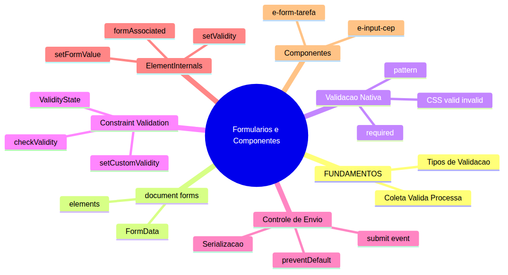
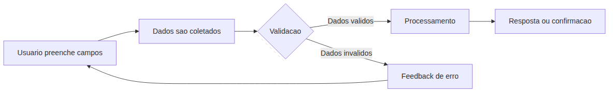
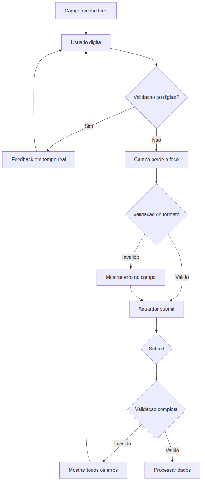
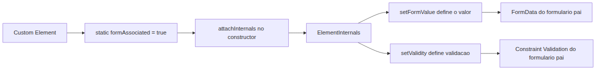

# JavaScript — Do Zero ao Profissional — Aula 21

## Formularios + Componentes de Formulario — Validacao, ElementInternals e Projeto

**Duracao estimada:** 110 minutos (55 de leitura + 55 de pratica)
**Nivel:** Intermediario
**Pre-requisitos:** Aulas 01 a 19 concluidas. Voce precisa dominar DOM e Custom Elements (Aula 18), eventos e ciclo de vida (Aula 19), e especialmente manipulacao com Shadow DOM, templates e slots (Aula 20) — os componentes `<e-tarefa>` e `<e-lista>` sao a base do projeto desta aula.

---

## Objetivos de Aprendizagem

Ao final desta aula, voce sera capaz de:

- [ ] **Explicar** o fluxo de um formulario web — coleta de dados, validacao e processamento — como instancia do padrao universal Entrada Processamento Saida
- [ ] **Acessar** formularios e seus campos com `document.forms`, `.elements` e extrair dados com `new FormData()`
- [ ] **Aplicar** validacao nativa com atributos HTML: `required`, `minlength`, `pattern` e o tipo `type`
- [ ] **Implementar** validacao customizada usando a Constraint Validation API: `checkValidity()`, `reportValidity()` e `setCustomValidity()`
- [ ] **Criar** feedback visual dinamico com classes CSS e mensagens de erro inline
- [ ] **Distinguir** o evento `submit` (disparado pelo `<form>`) do `click` em `<button>` e controlar a submissao com `event.preventDefault()`
- [ ] **Serializar** dados de formulario manualmente — convertendo `FormData` para objeto JavaScript e para JSON
- [ ] **Construir** Custom Elements associados a formularios (`static formAssociated = true`) usando `ElementInternals` com `.setFormValue()` e `.setValidity()`
- [ ] **Criar** o componente `<e-input-cep>` — input com Shadow DOM que valida formato de CEP automaticamente
- [ ] **Integrar** `<e-form-tarefa>` ao Gerenciador de Tarefas — formulario com validacao que emite evento customizado para adicionar tarefas ao array e a lista renderizada

---

## Como Usar Esta Aula

Esta aula esta organizada em duas partes. A **primeira parte** constroi o conceito universal de formularios como mecanismo de coleta estruturada de dados — sem JavaScript, sem navegador. A **segunda parte** aplica esses conceitos na pratica com as APIs de formulario do navegador, validacao nativa e customizada, feedback visual, e finalmente a API `ElementInternals` para criar componentes de formulario customizados.

Ao longo do caminho, voce encontrara secoes **"Mao na Massa"** (para fazer, nao so ler) e **"Quick Check"** (para verificar se entendeu antes de avancar). Ao final, o arquivo separado **Questoes de Aprendizagem** traz as tarefas de checkpoint — so avance para a proxima aula quando conseguir completa-las por conta propria.

**Tempo estimado:** 55 minutos de leitura + 55 minutos de pratica.

> *Esta e a aula mais densa da Fase 4. Se precisar, faca uma pausa entre a Secao 6 e a Secao 7 — sao blocos independentes.*

---

## Mapa Mental

Este diagrama mostra todos os conceitos que voce vai dominar nesta aula:



> *O mapa mental acima mostra a estrutura da aula. Cada ramo representa um conceito que voce vai explorar: o fluxo de formularios, as APIs de acesso e validacao, e os componentes de formulario customizados.*

---

## Recapitulacao da Aula 20

Antes de avancar, veja como os conceitos da aula anterior se conectam com o que aprenderemos:

| Aula 20 — Manipulacao e Shadow DOM | Conexao com Aula 21 |
|---|---|
| `<template>` como molde reutilizavel | Componentes de formulario usarao template interno no Shadow DOM |
| Shadow DOM com `attachShadow` | `<e-input-cep>` e `<e-form-tarefa>` usarao Shadow DOM |
| Slots padrao e nomeados | Conteudo dos componentes podera usar slots para flexibilidade |
| `DocumentFragment` para insercao eficiente | Otimizacao na renderizacao de listas de tarefas |
| `<e-tarefa>` com Shadow DOM | Componente existente que sera populado pelo formulario |
| `<e-lista>` com slot e fallback | Lista que recebera novas tarefas via array dinamico |

---

**FUNDAMENTOS: Formularios como Mecanismo Universal de Coleta de Dados**

> *Os conceitos desta secao sao universais — valem para qualquer sistema que precise coletar, validar e processar dados, de fichas de papel a formularios digitais. Na segunda parte, voce vera como o navegador implementa cada um destes conceitos com HTML e JavaScript.*

---

## 1. Por Que Formularios? — O Padrao Coleta Valida Processa

### O problema que formularios resolvem

Toda aplicacao que interage com usuarios precisa receber dados de entrada. Pode ser um nome, um email, uma data, uma preferencia, uma senha. Esses dados precisam chegar ao sistema de forma **estruturada** (cada informacao no lugar certo), **valida** (dentro do formato esperado) e **processavel** (pronta para ser usada pelo sistema).

Sem um mecanismo padrao de coleta, cada entrada seria um caso isolado — um `prompt()` aqui, um campo solto ali, dados perdidos acola. O **formulario** e a solucao universal para este problema.

### A analogia da ficha de cadastro

Imagine uma ficha de inscricao em papel. Ela tem campos pre-definidos:

```
Nome: _____________
Idade: _____________
Email: _____________
Assinatura: _____________
```

Voce preenche, confere se nao esqueceu nada, e entrega no balcao. O atendente confere se os dados estao legiveis e completos antes de arquivar.

Este fluxo tem tres etapas que existem em QUALQUER formulario, digital ou fisico:

1. **Coleta**: o usuario preenche os campos com seus dados
2. **Validacao**: o sistema (ou o atendente) confere se os dados estao no formato esperado e se todos os campos obrigatorios foram preenchidos
3. **Processamento**: os dados sao enviados para algum destino — um banco de dados, uma API, um arquivo, uma lista na tela



Perceba o **loop** na seta de erro: quando a validacao falha, o sistema nao ignora — ele retorna ao usuario com feedback para que ele corrija. Isso e essencial: formular.io sem feedback de validacao e como uma ficha que o atendente joga no lixo sem dizer por que.

### Por que isso importa para voce?

Formularios sao a principal interface de entrada de dados em aplicacoes web. Um cadastro de usuario, uma busca, um filtro, uma configuracao, um pedido — tudo passa por formularios. Saber construir, validar e processar formularios e uma habilidade central no desenvolvimento web.

Nesta aula, voce vai comecar com o HTML puro (validacao nativa), depois adicionar JavaScript para controle fino (Constraint Validation API), e finalmente criar componentes de formulario customizados com `ElementInternals` — a API que permite que qualquer componente web se comporte como um campo de formulario nativo.

### Quick Check 1

**1. Quais sao as tres etapas do fluxo universal de formularios?**

**Resposta:** Coleta (preenchimento dos campos), Validacao (conferencia de formato e presenca) e Processamento (envio dos dados para o destino).

**2. Por que o fluxo inclui um loop de volta quando a validacao falha?**

**Resposta:** Para que o usuario receba feedback sobre o erro e possa corrigi-lo. Sem o loop, dados invalidos seriam simplesmente descartados sem explicacao, gerando frustracao e perda de dados.

---

## 2. Tipos de Validacao — Formato, Presenca e Regra de Negocio

### As tres camadas de validacao

Nem toda validacao e igual. Existem tres categorias distintas, e cada uma responde a uma pergunta diferente sobre o dado:

**1. Validacao de Presenca — "O dado foi fornecido?"**

O campo obrigatorio esta preenchido? O usuario nao pulou nenhum campo essencial?

Exemplos:
- Nome completo em um cadastro: obrigatorio
- Termos de uso: precisa ser aceito
- Email em contato: obrigatorio

Se o campo esta vazio mas deveria estar preenchido, a validacao de presenca falha.

**2. Validacao de Formato — "O dado esta no formato correto?"**

O valor fornecido segue a estrutura esperada? Um email tem `@` e um dominio? Um CEP tem 8 digitos? Uma data tem dia, mes e ano?

Exemplos:
- Email: `usuario@dominio.com` — precisa conter `@`
- CEP: `12345-678` — formato de 5 digitos, hifen, 3 digitos
- Telefone: `(11) 98765-4321` — formato com DDD e hifen

Se o formato esta errado, a validacao de formato falha.

**3. Validacao de Regra de Negocio — "O dado faz sentido no contexto?"**

Mesmo que o campo esteja preenchido e no formato correto, o valor pode ser invalido por regras especificas da aplicacao.

Exemplos:
- Data de nascimento nao pode ser futura
- Senha nao pode conter o nome do usuario
- Valor do pedido nao pode ser negativo
- Data de termino deve ser posterior a data de inicio

Se a regra de negocio e violada, a validacao de regra de negocio falha.

### Quando validar?

Existem tres momentos principais para disparar a validacao:

| Momento | Gatilho | Uso tipico |
|---|---|---|
| Ao perder o foco | Evento `blur` | Validacao de formato individual |
| Ao digitar | Evento `input` | Feedback em tempo real (ex: forca de senha) |
| Ao submeter | Evento `submit` | Validacao completa de todos os campos |

Cada momento tem seu proposito. Validar ao digitar da feedback imediato mas pode ser intrusivo. Validar ao submeter e o momento final, mas se for o unico, o usuario so descobre o erro depois de preencher tudo. A combinacao dos tres e a abordagem ideal.



### Quick Check 2

**1. Classifique cada validacao abaixo em Presenca, Formato ou Regra de Negocio: (a) campo "CPF" obrigatorio, (b) campo "email" deve conter @, (c) campo "data de devolucao" nao pode ser anterior a data de emprestimo.**

**Resposta:** (a) Presenca — verifica se o campo foi preenchido. (b) Formato — verifica a estrutura do valor. (c) Regra de Negocio — verifica se o valor faz sentido no contexto da aplicacao.

**2. Qual a vantagem de validar AO DIGITAR em vez de apenas AO SUBMETER?**

**Resposta:** A validacao ao digitar da feedback imediato ao usuario, permitindo que ele corrija o erro antes mesmo de terminar de preencher o campo. Se a validacao so acontece ao submeter, o usuario descobre todos os erros de uma vez depois de preencher tudo, o que e frustrante.

---

**APLICACAO: Formularios no Navegador — Acesso, Validacao e Componentes**

> *Agora que voce entende o fluxo universal de formularios (coletar validar processar) e os tipos de validacao, vamos conectar esses conceitos a pratica com HTML, JavaScript e as APIs do navegador.*

---

## 3. Acessando e Lendo Formularios com JavaScript

### document.forms — A colecao de formularios da pagina

Todo formulario `<form>` na pagina e automaticamente registrado em `document.forms`. Esta e uma colecao viva (HTMLCollection) que voce pode acessar por indice ou por nome.

```html
<form name="cadastro">
  <input name="nome" type="text">
  <input name="email" type="email">
  <button type="submit">Enviar</button>
</form>

<form name="busca">
  <input name="termo" type="text">
  <button type="submit">Buscar</button>
</form>
```

```javascript
// Acessar por nome (recomendado)
const formCadastro = document.forms['cadastro'];
const formBusca = document.forms['busca'];

// Acessar por indice
const primeiroForm = document.forms[0];

console.log(formCadastro); // <form name="cadastro">...
```

O acesso por nome e mais seguro porque nao depende da posicao dos formularios na pagina.

### .elements — Os campos dentro do formulario

Cada formulario tem uma propriedade `.elements` que e uma colecao de todos os campos (input, select, textarea, button, fieldset).

```javascript
const form = document.forms['cadastro'];

// Acessar por nome
const campoNome = form.elements['nome'];
const campoEmail = form.elements['email'];

console.log(campoNome); // <input name="nome" type="text">
```

### FormData — Extraindo todos os dados de uma vez

`FormData` e um construtor que recebe um elemento `<form>` e retorna todos os pares nome-valor dos campos.

```javascript
const form = document.forms['cadastro'];
const dados = new FormData(form);

// Iterar com for...of
for (const [nome, valor] of dados) {
  console.log(`${nome}: ${valor}`);
}
```

O `FormData` e iteravel, o que significa que voce pode usar `for...of` diretamente. Cada item e um array de dois elementos: `[nomeDoCampo, valorDoCampo]`.

### Metodos do FormData

```javascript
const dados = new FormData(form);

// Obter valor de um campo
const nome = dados.get('nome');       // primeiro campo "nome"
const nomes = dados.getAll('nome');    // todos os campos "nome" (array)

// Verificar se um campo existe
const temEmail = dados.has('email');   // true ou false

// Adicionar ou modificar valores
dados.set('nome', 'Novo Nome');        // substitui o valor existente
dados.append('interesse', 'JavaScript'); // adiciona mais um valor ao mesmo campo
dados.delete('campo_extra');           // remove um campo
```

> *`dados.get('nome')` retorna apenas o PRIMEIRO campo com aquele nome. Se houver multiplos campos com o mesmo nome (como checkboxes), use `dados.getAll('nome')` para obter todos.*

### Mao na Massa — Inline 1

Crie um arquivo HTML com um formulario de cadastro simples (nome, email, idade) e um script que:

1. Acessa o formulario por `document.forms`
2. No evento `submit`, extrai os dados com `new FormData(form)`
3. Exibe cada par nome-valor no console com `for...of`

```html
<!DOCTYPE html>
<html lang="pt-BR">
<head>
  <meta charset="UTF-8">
  <title>Mao na Massa — FormData</title>
</head>
<body>
  <form name="cadastro">
    <label>Nome: <input name="nome" type="text"></label><br>
    <label>Email: <input name="email" type="email"></label><br>
    <label>Idade: <input name="idade" type="number"></label><br>
    <button type="submit">Enviar</button>
  </form>

  <script>
    const form = document.forms['cadastro'];

    form.addEventListener('submit', (event) => {
      event.preventDefault(); // impede recarregar a pagina

      const dados = new FormData(form);

      console.log('=== Dados do formulario ===');
      for (const [nome, valor] of dados) {
        console.log(`${nome}: ${valor}`);
      }
    });
  </script>
</body>
</html>
```

Abra no navegador, preencha os campos e clique em Enviar. O console deve exibir os pares nome-valor corretamente.

**Verificacao:** O console mostra `nome: [valor]`, `email: [valor]`, `idade: [valor]`. A pagina NAO recarrega.

### Quick Check 3

**1. Como acessar um formulario pelo nome "contato" sem usar querySelector?**

**Resposta:** `document.forms['contato']` — a propriedade `document.forms` e uma colecao que aceita acesso por nome ou por indice.

**2. Qual metodo do FormData retorna TODOS os valores de um campo com o mesmo nome?**

**Resposta:** `dados.getAll('nome')` retorna um array com todos os valores associados ao nome do campo. `dados.get('nome')` retorna apenas o primeiro.

---

## 4. Validacao Nativa com Atributos HTML

### O navegador ja valida, sem JavaScript

Antes de escrever uma linha de JavaScript, o navegador ja oferece validacao embutida atraves de atributos HTML. Quando um campo tem esses atributos, o navegador bloqueia a submissao do formulario se a validacao falhar e exibe mensagens padrao (em ingles, por padrao).

### Atributos de validacao

**`required` — campo obrigatorio**

Impede a submissao se o campo estiver vazio.

```html
<input name="nome" required>
<input name="email" type="email" required>
```

**`minlength` e `maxlength` — comprimento do texto**

Define o numero minimo e maximo de caracteres.

```html
<input name="senha" type="password" minlength="6" maxlength="20">
<!-- senha deve ter entre 6 e 20 caracteres -->
```

**`min` e `max` — faixa numerica**

Define valor minimo e maximo para campos numericos.

```html
<input name="idade" type="number" min="0" max="150">
<input name="data" type="date" min="2024-01-01" max="2026-12-31">
```

**`pattern` — expressao regular para formato**

Define um padrao que o valor deve seguir, usando expressao regular (regex).

```html
<input name="cep" pattern="[0-9]{5}-[0-9]{3}" placeholder="12345-678">
```

**Microexplicacao de regex para `pattern` (rapida):**

Voce nao precisa ser expert em regex para usar `pattern`. Apenas alguns metacaracteres resolvem a maioria dos casos:

- `\d` — qualquer digito de 0 a 9 (equivalente a `[0-9]`)
- `{n}` — quantidade exata de repeticoes. Ex: `\d{5}` = exatamente 5 digitos
- `^` — inicio da string (o valor deve comecar aqui)
- `$` — fim da string (o valor deve terminar aqui)

O padrao `/^\d{5}-\d{3}$/` significa: inicio, 5 digitos, hifen, 3 digitos, fim. Exatamente o formato de um CEP.

Na pratica, no atributo `pattern` voce NAO usa as barras `/` — apenas o conteudo:

```html
<!-- Valido: 12345-678. Invalido: 12345678, 1234-567, abcde-fgh -->
<input name="cep" pattern="\d{5}-\d{3}">
```

**`type` — validacao semantica**

Tipos de input especificos ja tem validacao de formato embutida:

```html
<input type="email">   <!-- deve conter @ e dominio -->
<input type="url">     <!-- deve ser uma URL valida -->
<input type="number">  <!-- deve ser numerico -->
<input type="tel">     <!-- telefone (sem validacao universal, mas util) -->
```

### Pseudo-classes CSS :valid e :invalid

O navegador adiciona automaticamente pseudo-classes CSS aos campos baseado no estado de validacao:

```css
/* Campo valido — borda verde */
input:valid {
  border: 2px solid #28a745;
}

/* Campo invalido — borda vermelha */
input:invalid {
  border: 2px solid #dc3545;
}

/* Estilo adicional para campos obrigatorios */
input:required {
  background: #fffbf0;
}
```

Isso funciona SEM JavaScript. Apenas CSS e atributos HTML.

### Propriedades JS de validacao

Cada campo de formulario tem propriedades JavaScript que refletem seu estado de validacao:

```javascript
const campo = document.querySelector('input[name="cep"]');

// O campo sera validado?
console.log(campo.willValidate); // true (se tiver required, pattern, etc.)

// Mensagem de erro padrao do navegador
console.log(campo.validationMessage); // "Please match the requested format."
```

### Mao na Massa — Inline 2

Crie um formulario HTML que use apenas atributos nativos:

```html
<form name="teste">
  <label>Nome: <input name="nome" required minlength="3"></label><br>
  <label>Email: <input name="email" type="email" required></label><br>
  <label>CEP: <input name="cep" pattern="\d{5}-\d{3}" placeholder="12345-678"></label><br>
  <label>Idade: <input name="idade" type="number" min="0" max="150"></label><br>
  <button type="submit">Enviar</button>
</form>
```

Adicione o CSS:

```css
input:valid { border: 2px solid #28a745; }
input:invalid { border: 2px solid #dc3545; }
```

Teste no navegador:
1. Clique em Enviar com campos vazios — veja as mensagens do navegador
2. Digite um CEP invalido como `12345` — veja a borda vermelha
3. Digite um CEP valido como `12345-678` — veja a borda verde

**Verificacao:** O navegador bloqueia a submissao e exibe mensagens padrao. As pseudo-classes CSS mudam as bordas automaticamente.

### Quick Check 4

**1. Qual atributo HTML impede a submissao se o campo estiver vazio?**

**Resposta:** `required`. Quando presente, o navegador exige que o campo tenha um valor antes de permitir a submissao.

**2. As pseudo-classes `:valid` e `:invalid` funcionam sem JavaScript?**

**Resposta:** Sim. O navegador adiciona estas pseudo-classes automaticamente com base nos atributos de validacao do campo. Apenas CSS e necessario para estilizar.

---

## 5. Validacao Customizada com JavaScript — Constraint Validation API

### Quando a validacao nativa nao basta

A validacao nativa com atributos HTML cobre muitos casos, mas nao todos. Situacoes que exigem logica customizada:

- Validar se dois campos sao iguais (confirmacao de senha)
- Validar se uma data e posterior a outra
- Validar se um valor nao repete outro ja existente
- Validar regras de negocio especificas

Para estes casos, a **Constraint Validation API** entra em cena.

### checkValidity() — Testar sem exibir mensagem

```javascript
const campo = document.querySelector('input[name="email"]');

if (campo.checkValidity()) {
  console.log('Campo valido');
} else {
  console.log('Campo invalido');
}
```

`checkValidity()` retorna `true` se o campo passa em todas as validacoes (nativas + customizadas) e `false` caso contrario. Quando retorna `false`, ele tambem dispara o evento `invalid` no campo.

### reportValidity() — Testar e exibir mensagem

```javascript
if (campo.reportValidity()) {
  console.log('Campo valido');
} else {
  // A mensagem de erro padrao do navegador ja foi exibida
  console.log('Campo invalido — mensagem exibida');
}
```

A diferenca: `reportValidity()` faz tudo que `checkValidity()` faz, MAS tambem exibe a mensagem de erro padrao do navegador (o balao de tooltip). Use `reportValidity()` quando quiser que o navegador mostre o erro.

### setCustomValidity() — Mensagem personalizada

```javascript
const campoSenha = document.querySelector('input[name="senha"]');
const campoUsuario = document.querySelector('input[name="usuario"]');

campoSenha.addEventListener('input', () => {
  const senha = campoSenha.value;
  const usuario = campoUsuario.value;

  if (senha.toLowerCase().includes(usuario.toLowerCase())) {
    // String nao vazia = invalido com mensagem personalizada
    campoSenha.setCustomValidity('A senha nao pode conter o nome do usuario');
  } else {
    // String vazia = valido
    campoSenha.setCustomValidity('');
  }
});
```

O funcionamento e simples:
- `setCustomValidity('mensagem')` — marca o campo como invalido e define a mensagem
- `setCustomValidity('')` — string vazia = campo valido (nenhum erro customizado)

> *Importante: voce PRECISA chamar `setCustomValidity('')` para limpar o erro. Se nao limpar, o campo permanece invalido mesmo depois de corrigido.*

### O evento `invalid`

Quando `checkValidity()` ou `reportValidity()` encontram um campo invalido, eles disparam o evento `invalid` no campo. Voce pode interceptar este evento para comportamento customizado:

```javascript
campo.addEventListener('invalid', (event) => {
  // Impede a mensagem padrao do navegador
  event.preventDefault();
  // Sua propria logica de feedback
  mostrarErroPersonalizado(campo, campo.validationMessage);
});
```

### Validando o formulario inteiro

Voce pode validar todos os campos de um formulario de uma vez:

```javascript
const form = document.forms['cadastro'];

// Verifica todos os campos
if (form.checkValidity()) {
  console.log('Formulario valido');
} else {
  console.log('Formulario invalido');
}

// Verifica E exibe mensagens de todos os campos invalidos
form.reportValidity();
```

### ValidityState — Diagnosticando o erro

Cada campo tem uma propriedade `.validity` que e um objeto `ValidityState` com flags booleanas:

```javascript
const campo = document.querySelector('input[name="cep"]');
const estado = campo.validity;

console.log(estado.valueMissing);    // campo required esta vazio?
console.log(estado.tooShort);        // tem menos que minlength?
console.log(estado.tooLong);         // tem mais que maxlength?
console.log(estado.patternMismatch); // nao corresponde ao pattern?
console.log(estado.typeMismatch);    // nao corresponde ao type (email, url)?
console.log(estado.rangeUnderflow);  // menor que min?
console.log(estado.rangeOverflow);   // maior que max?
console.log(estado.customError);     // setCustomValidity foi chamado com string nao vazia?
console.log(estado.valid);           // true se nenhuma flag de erro esta ativa
```

Isso permite diagnosticar EXATAMENTE qual validacao falhou e mostrar mensagens especificas para cada caso.

### Mao na Massa — Inline 3

Adicione validacao customizada ao formulario da secao anterior. Validacao: a senha nao pode ser igual ao nome do usuario.

```html
<form name="cadastro">
  <label>Usuario: <input name="usuario" required minlength="3"></label><br>
  <label>Senha: <input name="senha" type="password" required minlength="6"></label><br>
  <button type="submit">Cadastrar</button>
</form>

<script>
  const form = document.forms['cadastro'];
  const usuario = form.elements['usuario'];
  const senha = form.elements['senha'];

  senha.addEventListener('input', () => {
    if (senha.value.toLowerCase().includes(usuario.value.toLowerCase())) {
      senha.setCustomValidity('A senha nao pode conter o nome do usuario');
    } else {
      senha.setCustomValidity('');
    }
  });

  form.addEventListener('submit', (event) => {
    if (!form.checkValidity()) {
      event.preventDefault();
      form.reportValidity();
    }
  });
</script>
```

**Verificacao:** Se voce digitar usuario "admin" e senha "admin123", o navegador mostra a mensagem personalizada "A senha nao pode conter o nome do usuario".

### Quick Check 5

**1. Qual a diferenca entre `checkValidity()` e `reportValidity()`?**

**Resposta:** `checkValidity()` retorna true/false e dispara o evento `invalid`. `reportValidity()` faz o mesmo MAS tambem exibe a mensagem de erro padrao do navegador na interface.

**2. O que acontece se voce chama `setCustomValidity('erro')` e depois nao limpa com `setCustomValidity('')`?**

**Resposta:** O campo permanece invalido permanentemente, mesmo que o valor tenha sido corrigido. A flag `customError` no `ValidityState` continua true. E necessario chamar `setCustomValidity('')` para reverter.

---

## 6. Feedback Visual e Controle de Submissao

### Mostrar os erros na interface

Validar e importante, mas de nada adianta se o usuario nao SABE o que esta errado. O feedback visual e a ponte entre a validacao e a acao corretiva do usuario.

### Classes CSS dinamicas com classList

Em vez de depender apenas de `:valid`/`:invalid` (que sao automaticas), voce pode adicionar classes proprias para controle mais fino:

```css
input.valido {
  border: 2px solid #28a745;
  background: #f0fff4;
}

input.invalido {
  border: 2px solid #dc3545;
  background: #fff5f5;
}

span.erro {
  color: #dc3545;
  font-size: 0.85em;
  display: none;
}

span.erro.visivel {
  display: inline;
}
```

```javascript
const campo = document.querySelector('input[name="email"]');

campo.addEventListener('input', () => {
  if (campo.checkValidity()) {
    campo.classList.remove('invalido');
    campo.classList.add('valido');
  } else {
    campo.classList.remove('valido');
    campo.classList.add('invalido');
  }
});
```

### Mensagens de erro inline

Crie um `<span>` de erro para cada campo e mostre-o quando a validacao falhar:

```html
<div>
  <label>Email: <input name="email" type="email" required></label>
  <span class="erro" id="erro-email"></span>
</div>
```

```javascript
const campoEmail = document.querySelector('input[name="email"]');
const erroEmail = document.getElementById('erro-email');

campoEmail.addEventListener('input', () => {
  if (campoEmail.checkValidity()) {
    campoEmail.classList.remove('invalido');
    campoEmail.classList.add('valido');
    erroEmail.textContent = '';
    erroEmail.classList.remove('visivel');
  } else {
    campoEmail.classList.remove('valido');
    campoEmail.classList.add('invalido');
    erroEmail.textContent = campoEmail.validationMessage;
    erroEmail.classList.add('visivel');
  }
});
```

### Controle de submissao: submit vs click

**`<button type="submit">` dentro de `<form>`:**

Quando um botao `type="submit"` dentro de um formulario e clicado, o navegador dispara o evento `submit` no `<form>`. O comportamento padrao do `submit` e recarregar a pagina — util para formularios que enviam dados para um servidor.

```html
<form>
  <input name="nome" required>
  <button type="submit">Enviar</button>
</form>
<script>
  document.querySelector('form').addEventListener('submit', (event) => {
    event.preventDefault(); // Impede o recarregamento
    console.log('Formulario submetido sem recarregar!');
  });
</script>
```

**`<button type="button">` com clique manual:**

Um botao com `type="button"` nao dispara o evento `submit`. Ele so executa o que voce programar no `click`. Isso da controle total.

```javascript
document.querySelector('button[type="button"]').addEventListener('click', () => {
  const form = document.querySelector('form');
  if (form.checkValidity()) {
    processarDados(new FormData(form));
  } else {
    form.reportValidity();
  }
});
```

**Quando usar cada:**

| Situacao | Abordagem |
|---|---|
| Formulario que envia para servidor | `type="submit"` + `preventDefault` se quiser AJAX |
| Formulario em SPA ou componente | `type="button"` com `click` | 
| Formulario em Custom Element | `type="submit"` com handler interno + `preventDefault` |

### Serializacao manual — Convertendo FormData para objeto

Muitas vezes voce precisa dos dados do formulario como um objeto JavaScript, nao como `FormData`. A conversao e simples:

```javascript
function formDataParaObjeto(formData) {
  const objeto = {};
  for (const [nome, valor] of formData) {
    objeto[nome] = valor;
  }
  return objeto;
}

// Uso:
const form = document.forms['cadastro'];
const dados = new FormData(form);
const tarefa = formDataParaObjeto(dados);
console.log(tarefa); // { nome: 'Joao', email: 'joao@email.com' }

// JSON:
const json = JSON.stringify(tarefa);
console.log(json); // '{"nome":"Joao","email":"joao@email.com"}'
```

### Mao na Massa — Inline 4

Crie um formulario completo com feedback visual:

1. Campos com `required` e `pattern`
2. Validacao ao digitar (evento `input`) com classes CSS
3. Mensagens de erro inline vindas de `validationMessage`
4. Controle de submissao com `preventDefault`
5. Serializacao dos dados para objeto e exibicao no console

Use o exemplo da secao anterior como base e adicione:
- Um campo de confirmacao de email (dois campos email + confirmar-email)
- Validacao customizada: os dois emails devem ser iguais

```javascript
const confirmar = form.elements['confirmar-email'];
const email = form.elements['email'];

confirmar.addEventListener('input', () => {
  if (confirmar.value !== email.value) {
    confirmar.setCustomValidity('Os emails nao conferem');
  } else {
    confirmar.setCustomValidity('');
  }
});
```

**Verificacao:** Campos invalidos mostram borda vermelha + mensagem de erro inline. Emails divergentes disparam validacao customizada. Ao submeter com dados validos, o objeto serializado aparece no console.

### Quick Check 6

**1. Qual a diferenca de comportamento entre `<button type="submit">` e `<button type="button">` dentro de um `<form>`?**

**Resposta:** `type="submit"` dispara o evento `submit` no formulario, que por padrao recarrega a pagina. `type="button"` nao dispara `submit` — apenas o evento `click` programado manualmente.

**2. Como converter um `FormData` em objeto JavaScript para enviar como JSON?**

**Resposta:** Iterando com `for...of` e montando um objeto manualmente: `const obj = {}; for (const [k, v] of formData) { obj[k] = v; }`. Depois use `JSON.stringify(obj)`.

---

## 7. Custom Elements que Participam de Formularios — ElementInternals

### O problema: Custom Elements sao invisiveis para formularios

Ate agora, todo Custom Element que voce criou nas aulas anteriores e **invisivel** para `<form>`. Se voce colocar um `<e-input-cep>` dentro de um formulario:

- `new FormData(form)` nao inclui o valor do componente
- A validacao nativa do formulario nao alcanca o componente
- O componente nao participa do fluxo de submissao

Isso acontece porque o navegador so reconhece elementos HTML nativos como campos de formulario (`<input>`, `<select>`, `<textarea>`, `<button>`).

### A solucao: ElementInternals

A API `ElementInternals` (disponivel desde 2021) permite que qualquer Custom Element se comporte como um campo de formulario nativo. Com ela, seu componente:

- Aparece no `FormData` do formulario pai
- Participa da validacao nativa
- Exibe mensagens de erro como um campo comum



### Os 4 passos para criar um form-associated Custom Element

**Passo 1: Declarar `static formAssociated = true`**

```javascript
class MeuComponente extends HTMLElement {
  static formAssociated = true;
  // ...
}
```

Esta propriedade estatica e obrigatoria. Sem ela, o componente nao pode se associar a formularios.

**Passo 2: Chamar `this.attachInternals()` no constructor**

```javascript
class MeuComponente extends HTMLElement {
  static formAssociated = true;

  constructor() {
    super();
    this.internals = this.attachInternals();
    // Continua configuracao normal
  }
}
```

`attachInternals()` retorna um objeto `ElementInternals` que da acesso a todas as capacidades de formulario.

**Passo 3: Definir o valor com `setFormValue()`**

```javascript
this.internals.setFormValue('valor do componente');
```

O valor definido aqui e o que aparece no `FormData` quando o formulario pai e submetido.

**Passo 4: Definir validade com `setValidity()`**

```javascript
// Marcar como valido
this.internals.setValidity({});

// Marcar como invalido com mensagem
this.internals.setValidity(
  { customError: true },
  'Mensagem de erro personalizada',
  elementoAnchor // elemento que recebe foco ao exibir o erro (opcional)
);
```

O primeiro parametro e um objeto com flags do `ValidityState`. O mais comum e `{ customError: true }`. Para marcar como valido, passe objeto vazio `{}`.

### Construindo `<e-input-cep>` — Input de CEP com validacao via ElementInternals

Vamos construir um componente que:
- Usa Shadow DOM para encapsulamento
- Tem um `<input>` interno para o CEP
- Valida o formato com regex no evento `input`
- Participa do formulario pai via `ElementInternals`

```javascript
class EInputCep extends HTMLElement {
  // Passo 1: declarar associacao com formulario
  static formAssociated = true;

  constructor() {
    super();
    // Passo 2: obter ElementInternals
    this.internals = this.attachInternals();

    // Configurar Shadow DOM
    const shadow = this.attachShadow({ mode: 'open' });
    shadow.innerHTML = `
      <style>
        :host {
          display: inline-block;
        }
        input {
          padding: 6px 10px;
          border: 2px solid #ccc;
          border-radius: 4px;
          font-size: 1em;
          width: 150px;
        }
        /* Estilizacao condicional via :host com pseudo-classes */
        :host(:valid) input {
          border-color: #28a745;
        }
        :host(:invalid) input {
          border-color: #dc3545;
        }
        span.erro {
          color: #dc3545;
          font-size: 0.85em;
          display: block;
          margin-top: 4px;
          display: none;
        }
        span.erro.visivel {
          display: block;
        }
      </style>
      <input type="text" placeholder="12345-678" maxlength="9">
      <span class="erro"></span>
    `;

    this.input = shadow.querySelector('input');
    this.erro = shadow.querySelector('.erro');

    // Validar a cada digitacao
    this.input.addEventListener('input', () => this.validar());
  }

  validar() {
    const valor = this.input.value;
    const regexCep = /^\d{5}-?\d{3}$/;

    // Passo 4: definir validade
    if (valor.length > 0 && !regexCep.test(valor)) {
      // CEP invalido
      this.internals.setValidity(
        { customError: true },
        'CEP invalido. Use o formato 12345-678',
        this.input
      );
      this.erro.textContent = 'CEP invalido. Use o formato 12345-678';
      this.erro.classList.add('visivel');
    } else if (valor.length > 0 && regexCep.test(valor)) {
      // CEP valido
      this.internals.setValidity({});
      this.erro.textContent = '';
      this.erro.classList.remove('visivel');
    } else if (this.hasAttribute('required') && !this.value) {
      // Campo vazio com required — marca como invalido
      this.internals.setValidity(
        { valueMissing: true },
        'Preencha este campo',
        this.input
      );
      this.erro.textContent = 'Preencha este campo';
      this.erro.classList.add('visivel');
    } else {
      // Campo vazio sem required — ok
      this.internals.setValidity({});
      this.erro.textContent = '';
      this.erro.classList.remove('visivel');
    }

    // Passo 3: definir o valor que vai para o FormData
    // Remove o hifen opcional e envia so os digitos
    const apenasDigitos = valor.replace(/\D/g, '');
    this.internals.setFormValue(apenasDigitos);
  }
}

customElements.define('e-input-cep', EInputCep);
```

**Detalhes importantes:**

- `:host(:valid)` e `:host(:invalid)` funcionam no Shadow DOM porque o `ElementInternals` propaga o estado de validade para o host
- `setFormValue()` e chamado a cada `input` para manter o valor sincronizado
- `setValidity({})` com objeto vazio = valido. `setValidity({ customError: true }, msg)` = invalido
- O terceiro parametro de `setValidity` e o elemento que recebe foco ao exibir o erro (ancora)

**Testando `<e-input-cep>`:**

```html
<form name="teste-cep">
  <label>CEP:
    <e-input-cep name="cep" required></e-input-cep>
  </label>
  <button type="submit">Enviar</button>
</form>

<script>
  document.forms['teste-cep'].addEventListener('submit', (event) => {
    event.preventDefault();
    const dados = new FormData(event.target);
    console.log('CEP enviado:', dados.get('cep'));
  });
</script>
```

Abra no navegador, digite um CEP valido (12345-678) e veja o console exibir `CEP enviado: 12345678`. O valor aparece no `FormData` porque o componente e `formAssociated`.

### Construindo `<e-form-tarefa>` — A peca do projeto progressivo

Agora, o momento que voce esperava: vamos fechar o ciclo do Gerenciador de Tarefas. Nas aulas anteriores, voce criou:

- Aula 18: `<e-tarefa>` com DOM e `innerHTML`
- Aula 19: Eventos e ciclo de vida no `<e-tarefa>`
- Aula 20: `<e-tarefa>` com Shadow DOM + `<e-lista>` com template e slot

O que faltava? **Um formulario para adicionar tarefas.** O array `tarefas` era populado manualmente ou com `prompt()`. Agora voce vai construir `<e-form-tarefa>`, um form-associated Custom Element que valida, coleta e dispara o evento para adicionar a tarefa na lista.

> *Conexao com a Aula 20: O `<e-lista>` que voce construiu ja renderiza tarefas via slots. Vamos adicionar um metodo `renderizar()` para que ele possa ser populado DINAMICAMENTE a partir de um array, sem precisar recarregar a pagina.*

Primeiro, vamos estender o `<e-lista>` com um metodo `renderizar()`:

```javascript
// Extensao do <e-lista> da Aula 20 — adicionar metodo renderizar
class ELista extends HTMLElement {
  constructor() {
    super();
    const shadow = this.attachShadow({ mode: 'open' });
    const template = document.createElement('template');
    template.innerHTML = `
      <style>
        :host {
          display: block;
          border: 2px solid #6c757d;
          border-radius: 8px;
          padding: 16px;
          margin: 16px 0;
          font-family: sans-serif;
        }
        h2 {
          margin: 0 0 12px 0;
          color: #495057;
          border-bottom: 1px solid #dee2e6;
          padding-bottom: 8px;
        }
        .vazia {
          color: #999;
          font-style: italic;
          text-align: center;
          padding: 20px;
        }
        .container {
          display: flex;
          flex-direction: column;
          gap: 4px;
        }
      </style>
      <h2></h2>
      <div class="container"></div>
    `;
    shadow.appendChild(template.content.cloneNode(true));
  }

  static get observedAttributes() { return ['titulo']; }

  attributeChangedCallback(attr, oldVal, newVal) {
    if (attr === 'titulo') {
      this.shadowRoot.querySelector('h2').textContent = newVal || 'Lista';
    }
  }

  connectedCallback() {
    if (!this.hasAttribute('titulo')) {
      this.setAttribute('titulo', 'Lista');
    }
  }

  // NOVO METODO: renderizar a partir de um array de tarefas
  renderizar(tarefas) {
    const container = this.shadowRoot.querySelector('.container');
    container.innerHTML = ''; // limpa

    if (!tarefas || tarefas.length === 0) {
      container.innerHTML = '<p class="vazia">Nenhuma tarefa cadastrada.</p>';
      return;
    }

    for (const tarefa of tarefas) {
      const el = document.createElement('e-tarefa');
      el.setAttribute('concluida', tarefa.concluida ? 'true' : 'false');
      el.textContent = tarefa.texto;
      if (tarefa.prioridade) {
        el.setAttribute('prioridade', tarefa.prioridade);
      }
      container.appendChild(el);
    }
  }
}

customElements.define('e-lista', ELista);
```

Agora o componente `<e-form-tarefa>`:

```javascript
class EFormTarefa extends HTMLElement {
  static formAssociated = true;

  constructor() {
    super();
    this.internals = this.attachInternals();

    const shadow = this.attachShadow({ mode: 'open' });
    shadow.innerHTML = `
      <style>
        :host {
          display: block;
          font-family: sans-serif;
        }
        form {
          display: flex;
          flex-direction: column;
          gap: 12px;
          padding: 16px;
          border: 2px solid #007bff;
          border-radius: 8px;
          background: #f8f9fa;
        }
        .campo {
          display: flex;
          flex-direction: column;
          gap: 4px;
        }
        label {
          font-weight: bold;
          font-size: 0.9em;
        }
        input, select {
          padding: 8px 12px;
          border: 2px solid #ccc;
          border-radius: 4px;
          font-size: 1em;
        }
        input:valid, select:valid {
          border-color: #28a745;
        }
        input:invalid, select:invalid {
          border-color: #dc3545;
        }
        span.erro {
          color: #dc3545;
          font-size: 0.85em;
          display: none;
        }
        span.erro.visivel {
          display: block;
        }
        button {
          padding: 10px 20px;
          background: #007bff;
          color: white;
          border: none;
          border-radius: 4px;
          font-size: 1em;
          cursor: pointer;
        }
        button:hover {
          background: #0056b3;
        }
      </style>

      <form>
        <div class="campo">
          <label for="input-texto">Nova Tarefa</label>
          <input
            id="input-texto"
            name="texto"
            type="text"
            required
            minlength="3"
            placeholder="Digite a tarefa..."
          >
          <span class="erro" id="erro-texto"></span>
        </div>

        <div class="campo">
          <label for="select-prioridade">Prioridade</label>
          <select id="select-prioridade" name="prioridade" required>
            <option value="">Selecione...</option>
            <option value="baixa">Baixa</option>
            <option value="media">Media</option>
            <option value="alta">Alta</option>
          </select>
          <span class="erro" id="erro-prioridade"></span>
        </div>

        <button type="submit">Adicionar Tarefa</button>
      </form>
    `;

    this.form = shadow.querySelector('form');
    this.inputTexto = shadow.getElementById('input-texto');
    this.selectPrioridade = shadow.getElementById('select-prioridade');
    this.erroTexto = shadow.getElementById('erro-texto');
    this.erroPrioridade = shadow.getElementById('erro-prioridade');

    // Handler de submissao
    this.form.addEventListener('submit', (event) => this.handleSubmit(event));
  }

  handleSubmit(event) {
    event.preventDefault(); // Impede recarregar a pagina

    // Resetar mensagens de erro
    this.erroTexto.textContent = '';
    this.erroTexto.classList.remove('visivel');
    this.erroPrioridade.textContent = '';
    this.erroPrioridade.classList.remove('visivel');

    // Validar usando a API nativa
    let valido = true;

    if (!this.inputTexto.checkValidity()) {
      this.erroTexto.textContent = this.inputTexto.validationMessage;
      this.erroTexto.classList.add('visivel');
      valido = false;
    }

    if (!this.selectPrioridade.checkValidity()) {
      this.erroPrioridade.textContent = 'Selecione uma prioridade';
      this.erroPrioridade.classList.add('visivel');
      valido = false;
    }

    if (!valido) return;

    // Construir objeto tarefa
    const tarefa = {
      texto: this.inputTexto.value.trim(),
      prioridade: this.selectPrioridade.value,
      concluida: false
    };

    // Atualizar o ElementInternals com o valor
    this.internals.setFormValue(JSON.stringify(tarefa));

    // Disparar evento customizado com a tarefa
    this.dispatchEvent(new CustomEvent('tarefa-adicionada', {
      detail: tarefa,
      bubbles: true,     // O evento sobe na arvore DOM
      composed: true     // Atravessa fronteiras de Shadow DOM
    }));

    // Limpar o formulario
    this.form.reset();
    this.inputTexto.focus();
  }
}

customElements.define('e-form-tarefa', EFormTarefa);
```

**Analise do `handleSubmit`:**

1. `event.preventDefault()` — essencial para nao recarregar a pagina
2. Reseta mensagens de erro anteriores
3. Valida cada campo manualmente com `checkValidity()` e exibe erros inline
4. Se valido, constroi o objeto `{ texto, prioridade, concluida: false }`
5. Atualiza o `ElementInternals` com `setFormValue()`
6. Dispara `CustomEvent('tarefa-adicionada')` com o objeto no `detail`
7. `bubbles: true` + `composed: true` — o evento atravessa o Shadow DOM e sobe ate o documento
8. Reseta o formulario para o estado inicial

### Integracao com o Gerenciador de Tarefas

Agora, a pagina principal que conecta tudo:

```html
<!DOCTYPE html>
<html lang="pt-BR">
<head>
  <meta charset="UTF-8">
  <title>Gerenciador de Tarefas</title>
</head>
<body>
  <h1>Gerenciador de Tarefas</h1>

  <e-form-tarefa></e-form-tarefa>
  <e-lista titulo="Minhas Tarefas"></e-lista>

  <script>
    // Array de tarefas
    const tarefas = [
      { texto: 'Estudar JavaScript', prioridade: 'alta', concluida: false },
      { texto: 'Revisar Aula 20', prioridade: 'media', concluida: true },
      { texto: 'Praticar Shadow DOM', prioridade: 'baixa', concluida: false }
    ];

    // Renderizar lista inicial
    const lista = document.querySelector('e-lista');
    lista.renderizar(tarefas);

    // Escutar o evento do formulario
    const form = document.querySelector('e-form-tarefa');
    form.addEventListener('tarefa-adicionada', (event) => {
      // Adicionar ao array
      tarefas.push(event.detail);

      // Re-renderizar a lista
      lista.renderizar(tarefas);

      console.log('Tarefa adicionada:', event.detail);
    });
  </script>
</body>
</html>
```

O fluxo completo:

1. Usuario preenche o formulario e clica em "Adicionar Tarefa"
2. `<e-form-tarefa>` valida os campos (texto obrigatorio + prioridade)
3. Se invalido: mostra mensagens de erro inline
4. Se valido: cria objeto `{ texto, prioridade, concluida }`
5. Dispara `CustomEvent('tarefa-adicionada')` com o objeto
6. O script principal recebe o evento, adiciona ao array `tarefas`
7. Chama `lista.renderizar(tarefas)` que recria os `<e-tarefa>` na tela
8. A nova tarefa aparece imediatamente na lista, sem recarregar a pagina

### Mao na Massa — Inline 5 (dupla)

Parte A — Construa o componente `<e-input-cep>`:

1. Crie a classe `EInputCep` com `static formAssociated = true`
2. No constructor, chame `this.attachInternals()` e `this.attachShadow()`
3. Adicione um `<input>` e um `<span>` de erro no Shadow DOM
4. Implemente `validar()` com regex `/^\d{5}-?\d{3}$/`
5. Use `setFormValue()` para enviar apenas os digitos do CEP
6. Use `setValidity({})` para valido e `setValidity({ customError: true }, msg)` para invalido
7. Teste dentro de um `<form>` com `FormData`
8. Verifique que `e-input-cep` aparece no `FormData` do formulario pai

Parte B — Integre o `<e-form-tarefa>` ao seu Gerenciador de Tarefas:

1. Copie a classe `EFormTarefa` completa para seu projeto
2. Copie a classe `ELista` estendida com `renderizar()`
3. No HTML, adicione `<e-form-tarefa>` antes de `<e-lista>`
4. No script principal, crie o array `tarefas` com dados iniciais
5. Chame `lista.renderizar(tarefas)` para exibir a lista inicial
6. Adicione o event listener para `'tarefa-adicionada'` que da push no array e re-renderiza
7. Teste: adicione uma nova tarefa e veja-a aparecer na lista

**Verificacao:** A lista exibe as tarefas iniciais. Ao preencher o formulario e clicar em Adicionar, a nova tarefa aparece IMEDIATAMENTE na lista, a pagina nao recarrega, e campos invalidos mostram mensagens de erro.

### Quick Check 7

**1. Qual propriedade estatica deve ser declarada em um Custom Element para que ele possa participar de formularios?**

**Resposta:** `static formAssociated = true`. Sem esta declaracao, o componente nao pode usar `ElementInternals` e e invisivel para formularios.

**2. Qual a funcao de `setValidity({})` com objeto vazio? E de `setValidity({ customError: true }, 'msg')`?**

**Resposta:** `setValidity({})` com objeto vazio marca o campo como valido. `setValidity({ customError: true }, 'msg')` marca como invalido com a mensagem 'msg'. O primeiro parametro e um objeto com as flags do `ValidityState`.

**3. Por que o evento `'tarefa-adicionada'` precisa de `bubbles: true` e `composed: true`?**

**Resposta:** `bubbles: true` faz o evento subir na arvore DOM. `composed: true` permite que o evento atravesse a fronteira do Shadow DOM. Sem `composed`, o evento ficaria preso dentro do Shadow Root e o script principal nao o receberia.

---

## Autoavaliacao: Quiz Rapido

**1. Qual propriedade de `document` da acesso a todos os formularios da pagina?**

**Resposta:** `document.forms` — uma HTMLCollection com todos os elementos `<form>`.

**2. Como extrair todos os pares nome-valor de um formulario de uma vez?**

**Resposta:** `new FormData(formElement)` — o objeto retornado pode ser iterado com `for...of`.

**3. Qual atributo HTML de validacao usa expressao regular para definir o formato esperado?**

**Resposta:** `pattern`. Ex: `<input pattern="\d{5}-\d{3}">` para CEP.

**4. `checkValidity()` e `reportValidity()` fazem a mesma coisa. Verdadeiro ou falso?**

**Resposta:** Falso. Ambos retornam true/false e disparam `invalid`, mas `reportValidity()` TAMBEM exibe a mensagem de erro na interface.

**5. O que `setCustomValidity('')` significa para o estado de validade do campo?**

**Resposta:** Significa que o campo esta valido — nenhum erro customizado. String vazia = valido; qualquer string nao vazia = invalido.

**6. Qual a diferenca entre `<button type="submit">` e `<button type="button">` dentro de um `<form>`?**

**Resposta:** `type="submit"` dispara o evento `submit` no formulario; `type="button"` nao dispara `submit`, apenas o evento `click`.

**7. Qual propriedade estatica um Custom Element precisa declarar para ser associado a formularios?**

**Resposta:** `static formAssociated = true`. Permite usar `this.attachInternals()` no constructor.

**8. Qual metodo do `ElementInternals` define o valor que aparece no `FormData`?**

**Resposta:** `setFormValue(valor)`. O valor passado e o que o formulario pai coleta.

---

## Mao na Massa N: Exercicios Graduados

### Exercicio 1 (Facil) — Formulario de Contato com Validacao Nativa

**Enunciado:**

Crie uma pagina HTML com um formulario de contato que tenha:

- Campo `nome` (obrigatorio, minimo 3 caracteres)
- Campo `email` (obrigatorio, tipo email)
- Campo `mensagem` (obrigatorio, minimo 10 caracteres)
- Campo `telefone` com pattern `\d{4,5}-?\d{4}` (4-5 digitos, hifen opcional, 4 digitos)
- Botao `type="submit"` que exibe os dados no console com `FormData` e `preventDefault`
- Estilizacao com `:valid` (borda verde) e `:invalid` (borda vermelha)

**Gabarito:**

```html
<!DOCTYPE html>
<html lang="pt-BR">
<head>
  <meta charset="UTF-8">
  <title>Contato</title>
  <style>
    form { max-width: 400px; font-family: sans-serif; }
    div { margin-bottom: 12px; }
    label { display: block; font-weight: bold; margin-bottom: 4px; }
    input, textarea {
      width: 100%; padding: 8px;
      border: 2px solid #ccc; border-radius: 4px;
    }
    input:valid, textarea:valid { border-color: #28a745; }
    input:invalid, textarea:invalid { border-color: #dc3545; }
    button { padding: 10px 20px; background: #007bff; color: white;
             border: none; border-radius: 4px; cursor: pointer; }
  </style>
</head>
<body>
  <form name="contato">
    <div>
      <label>Nome: <input name="nome" required minlength="3"></label>
    </div>
    <div>
      <label>Email: <input name="email" type="email" required></label>
    </div>
    <div>
      <label>Telefone: <input name="telefone" pattern="\d{4,5}-?\d{4}" placeholder="12345-6789"></label>
    </div>
    <div>
      <label>Mensagem: <textarea name="mensagem" required minlength="10"></textarea></label>
    </div>
    <button type="submit">Enviar</button>
  </form>
  <script>
    document.forms['contato'].addEventListener('submit', (e) => {
      e.preventDefault();
      const dados = new FormData(e.target);
      console.log('=== Contato ===');
      for (const [k, v] of dados) console.log(`${k}: ${v}`);
    });
  </script>
</body>
</html>
```

### Exercicio 2 (Medio) — Validacao Customizada com Feedback Visual

**Enunciado:**

Crie um formulario de cadastro com:

- Campo `usuario` (obrigatorio, minimo 4, somente letras e numeros — use `pattern="[a-zA-Z0-9]+"`)
- Campo `senha` (obrigatorio, minimo 8)
- Campo `confirmar-senha` (deve ser igual a senha — validacao customizada com `setCustomValidity`)
- Validacao ao digitar (evento `input`) com classes `.valido`/`.invalido`
- Mensagens de erro inline usando `<span class="erro">`
- Serializacao para objeto e exibicao como JSON no console ao submeter

**Gabarito:**

```html
<!DOCTYPE html>
<html lang="pt-BR">
<head>
  <meta charset="UTF-8">
  <title>Cadastro</title>
  <style>
    form { max-width: 400px; font-family: sans-serif; }
    .campo { margin-bottom: 16px; }
    label { display: block; font-weight: bold; margin-bottom: 4px; }
    input { width: 100%; padding: 8px; border: 2px solid #ccc; border-radius: 4px; }
    input.valido { border-color: #28a745; background: #f0fff4; }
    input.invalido { border-color: #dc3545; background: #fff5f5; }
    .erro { color: #dc3545; font-size: 0.85em; display: none; }
    .erro.visivel { display: block; }
    button { padding: 10px 20px; background: #007bff; color: white;
             border: none; border-radius: 4px; cursor: pointer; }
  </style>
</head>
<body>
  <form name="cadastro">
    <div class="campo">
      <label>Usuario: <input name="usuario" required minlength="4" pattern="[a-zA-Z0-9]+"></label>
      <span class="erro" id="erro-usuario"></span>
    </div>
    <div class="campo">
      <label>Senha: <input name="senha" type="password" required minlength="8"></label>
      <span class="erro" id="erro-senha"></span>
    </div>
    <div class="campo">
      <label>Confirmar Senha: <input name="confirmar" type="password" required></label>
      <span class="erro" id="erro-confirmar"></span>
    </div>
    <button type="submit">Cadastrar</button>
  </form>
  <script>
    const form = document.forms['cadastro'];
    const usuario = form.elements['usuario'];
    const senha = form.elements['senha'];
    const confirmar = form.elements['confirmar'];
    const errUsuario = document.getElementById('erro-usuario');
    const errSenha = document.getElementById('erro-senha');
    const errConfirmar = document.getElementById('erro-confirmar');

    function validarCampo(campo, erroEl) {
      if (campo.checkValidity()) {
        campo.classList.remove('invalido');
        campo.classList.add('valido');
        erroEl.textContent = '';
        erroEl.classList.remove('visivel');
      } else {
        campo.classList.remove('valido');
        campo.classList.add('invalido');
        erroEl.textContent = campo.validationMessage;
        erroEl.classList.add('visivel');
      }
    }

    usuario.addEventListener('input', () => validarCampo(usuario, errUsuario));
    senha.addEventListener('input', () => validarCampo(senha, errSenha));

    confirmar.addEventListener('input', () => {
      if (confirmar.value !== senha.value) {
        confirmar.setCustomValidity('As senhas nao conferem');
      } else {
        confirmar.setCustomValidity('');
      }
      validarCampo(confirmar, errConfirmar);
    });

    form.addEventListener('submit', (e) => {
      e.preventDefault();
      [usuario, senha, confirmar].forEach(c => c.reportValidity());
      if (form.checkValidity()) {
        const dados = new FormData(form);
        const obj = {};
        for (const [k, v] of dados) obj[k] = v;
        console.log('Cadastro (JSON):', JSON.stringify(obj, null, 2));
      }
    });
  </script>
</body>
</html>
```

### Desafio (Dificil) — Componente `<e-input-telefone>` com Mascara e Validacao

**Enunciado:**

Crie um componente `<e-input-telefone>` que:

- Seja `formAssociated` (use `ElementInternals`)
- Use Shadow DOM com um `<input>` interno
- Aplique mascara automatica: `(XX) XXXXX-XXXX` enquanto o usuario digita (apenas numeros)
- Valide o formato: exatamente 11 digitos (DDD + 9 digitos)
- Use `setFormValue()` para enviar apenas os 11 digitos (sem mascara)
- Use `setValidity()` para reportar validade ao formulario pai
- Exiba mensagem de erro inline no Shadow DOM
- Teste dentro de um `<form>` com `FormData`

**Gabarito:**

```javascript
class EInputTelefone extends HTMLElement {
  static formAssociated = true;

  constructor() {
    super();
    this.internals = this.attachInternals();
    const shadow = this.attachShadow({ mode: 'open' });

    shadow.innerHTML = `
      <style>
        :host { display: inline-block; font-family: sans-serif; }
        input {
          padding: 8px 12px;
          border: 2px solid #ccc;
          border-radius: 4px;
          font-size: 1em;
          width: 200px;
        }
        :host(:valid) input { border-color: #28a745; }
        :host(:invalid) input { border-color: #dc3545; }
        .erro { color: #dc3545; font-size: 0.85em; display: none; }
        .erro.visivel { display: block; }
      </style>
      <input type="tel" placeholder="(11) 99999-8888" maxlength="15">
      <span class="erro"></span>
    `;

    this.input = shadow.querySelector('input');
    this.erro = shadow.querySelector('.erro');
    this.input.addEventListener('input', () => this.aplicarMascara());
  }

  aplicarMascara() {
    let digitos = this.input.value.replace(/\D/g, ''); // Remove nao-numericos

    // Limita a 11 digitos
    digitos = digitos.slice(0, 11);

    // Aplica mascara: (XX) XXXXX-XXXX
    let mascarado = '';
    if (digitos.length > 0) {
      mascarado = `(${digitos.slice(0, 2)}`;
    }
    if (digitos.length > 2) {
      mascarado += `) ${digitos.slice(2, 7)}`;
    }
    if (digitos.length > 7) {
      mascarado += `-${digitos.slice(7, 11)}`;
    }
    this.input.value = mascarado;

    // Valida: exatamente 11 digitos
    if (digitos.length === 11) {
      this.internals.setValidity({});
      this.erro.textContent = '';
      this.erro.classList.remove('visivel');
    } else if (digitos.length === 0) {
      this.internals.setValidity({});
      this.erro.textContent = '';
      this.erro.classList.remove('visivel');
    } else {
      this.internals.setValidity(
        { customError: true },
        'Telefone deve ter 11 digitos (DDD + 9 digitos)',
        this.input
      );
      this.erro.textContent = 'Telefone deve ter 11 digitos (DDD + 9 digitos)';
      this.erro.classList.add('visivel');
    }

    this.internals.setFormValue(digitos);
  }
}

customElements.define('e-input-telefone', EInputTelefone);
```

```html
<form name="teste-telefone">
  <label>Telefone: <e-input-telefone name="telefone" required></e-input-telefone></label>
  <button type="submit">Enviar</button>
</form>
<script>
  document.forms['teste-telefone'].addEventListener('submit', (e) => {
    e.preventDefault();
    const dados = new FormData(e.target);
    console.log('Telefone:', dados.get('telefone')); // 11999888877
  });
</script>
```

---

## Resumo da Aula

### Os 7 Conceitos Fundamentais

1. **Fluxo universal de formularios**: Coletar dados, Validar, Processar. O loop de erro garante feedback ao usuario.
2. **document.forms e FormData**: `document.forms['nome']` acessa formularios. `new FormData(form)` extrai todos os dados como pares nome-valor.
3. **Validacao nativa HTML**: `required`, `minlength`, `maxlength`, `pattern`, `type` bloqueiam submissao invalida sem JavaScript. `:valid`/`:invalid` estilizam automaticamente.
4. **Constraint Validation API**: `checkValidity()`, `reportValidity()`, `setCustomValidity()` e `ValidityState` permitem validacao customizada com mensagens proprias.
5. **Feedback visual e controle**: Classes CSS dinamicas (`classList`), mensagens de erro inline, `preventDefault()` no evento `submit`, e serializacao com `JSON.stringify()`.
6. **ElementInternals**: `static formAssociated = true` + `attachInternals()` + `setFormValue()` + `setValidity()` transformam qualquer Custom Element em campo de formulario.
7. **Componentes de formulario**: `<e-input-cep>` com validacao de formato via regex e `<e-form-tarefa>` com validacao completa e disparo de `CustomEvent` integram-se ao ecossistema de formularios.

### O Que Voce Construiu Hoje

- [x] Formulario com acesso via `document.forms`, `.elements` e `FormData`
- [x] Formulario com validacao nativa (required, pattern, minlength)
- [x] Formulario com validacao customizada (Constraint Validation API)
- [x] Formulario com feedback visual (classes CSS + mensagens inline)
- [x] Componente `<e-input-cep>` com ElementInternals e validacao de CEP
- [x] Componente `<e-form-tarefa>` como peca do Gerenciador de Tarefas
- [x] Integracao completa: formulario -> evento -> array -> lista renderizada

---

## Proxima Aula

**Aula 22: File API e Drag & Drop — Upload e Interacao Avancada**

Na proxima aula, voce vai explorar como ler arquivos do computador do usuario diretamente no navegador com a File API, alem de implementar interfaces de arrastar e soltar (Drag & Drop). Voce podera criar uploaders de imagem, leitores de CSV no lado do cliente e interfaces interativas de organizacao de conteudo — tudo sem precisar de um servidor.

---

## Referencias

### Documentacao Oficial

- MDN — `HTMLFormElement`: https://developer.mozilla.org/en-US/docs/Web/API/HTMLFormElement
- MDN — `FormData`: https://developer.mozilla.org/en-US/docs/Web/API/FormData
- MDN — Constraint Validation API: https://developer.mozilla.org/en-US/docs/Web/API/Constraint_validation
- MDN — `ValidityState`: https://developer.mozilla.org/en-US/docs/Web/API/ValidityState
- MDN — `ElementInternals`: https://developer.mozilla.org/en-US/docs/Web/API/ElementInternals
- MDN — Form-associated Custom Elements: https://developer.mozilla.org/en-US/docs/Web/API/Web_components/Using_form-associated_web_components
- MDN — `CustomEvent`: https://developer.mozilla.org/en-US/docs/Web/API/CustomEvent

### Ferramentas

- Regex101 (testar expressoes regulares): https://regex101.com/

### Videos Recomendados

- Web Dev Simplified — Learn HTML Forms in 10 Minutes (~10 min)
- Chrome Developers — Form-associated Custom Elements (~15 min)

---

## FAQ

**P: Posso usar `document.forms` com formularios que nao tem atributo `name`?**
R: Sim, mas o acesso fica menos pratico. Sem `name`, voce precisa usar o indice numerico (`document.forms[0]`) ou `querySelector`. Sempre que possivel, de um `name` aos seus formularios.

**P: O que acontece se eu esquecer de chamar `setCustomValidity('')` depois de corrigir um erro?**
R: O campo permanece invalido permanentemente, mesmo com valor correto. A flag `customError` no `ValidityState` continua `true`. Sempre limpe o erro chamando `setCustomValidity('')` apos a correcao.

**P: `reportValidity()` funciona em todos os navegadores?**
R: Sim, `reportValidity()` e suportado em todos os navegadores modernos (Chrome, Firefox, Safari, Edge) desde 2016. A exibicao da mensagem de erro (tooltip) varia entre navegadores.

**P: `ElementInternals` funciona no Safari?**
R: Sim, desde o Safari 16.4 (2023). Para suporte amplo, verifique a baseline (2021 para Chrome/Firefox/Edge, 2023 para Safari). A API e estavel e recomendada para producao.

**P: Preciso sempre usar Shadow DOM com `ElementInternals`?**
R: Nao. `ElementInternals` funciona com ou sem Shadow DOM. O Shadow DOM e util para encapsulamento, mas a associacao com formularios vem do `static formAssociated = true` e `attachInternals()`, nao do Shadow DOM.

**P: Qual a diferenca entre `event.preventDefault()` e `return false` no handler de submit?**
R: `event.preventDefault()` e a maneira correta. `return false` em handlers tradicionais tambem funciona mas tem comportamento diferente em addeventListener. Use sempre `preventDefault()`.

**P: Como lidar com checkboxes no `FormData`?**
R: Checkboxes so aparecem no `FormData` se estiverem marcados. Use `dados.get('nome')` para obter o valor (que e `'on'` por padrao). Para campos com multiplos valores, use `dados.getAll('nome')`.

**P: O formato `FormData` e igual ao formato de envio de um formulario HTML tradicional?**
R: Sim, `FormData` usa exatamente a mesma codificacao que o navegador usaria ao enviar o formulario via HTTP (`multipart/form-data` ou `application/x-www-form-urlencoded`). E uma representacao fiel dos dados.

**P: `setFormValue()` aceita apenas strings?**
R: Sim, `setFormValue()` aceita strings (que vao para o `FormData`). Se precisar enviar dados complexos, serialize com `JSON.stringify()` e deserialize no destino.

**P: Meu `<e-form-tarefa>` nao dispara o evento. O que pode ser?**
R: Verifique: (1) o evento se chama exatamente `'tarefa-adicionada'` (sem espaco, sem erro de digito). (2) O `CustomEvent` tem `bubbles: true` e `composed: true`. (3) O listener esta no elemento `<e-form-tarefa>`, nao no formulario interno. (4) O handler `handleSubmit` esta sendo chamado (verifique com `console.log`).

---

## Glossario

| Termo | Definicao |
|---|---|
| **Constraint Validation API** | Conjunto de metodos e propriedades para validacao de formularios no navegador: `checkValidity`, `reportValidity`, `setCustomValidity`, `ValidityState` |
| **Custom Event** | Evento definido pelo desenvolvedor com `new CustomEvent(tipo, { detail, bubbles, composed })` para comunicacao entre componentes |
| **ElementInternals** | Objeto que permite que Custom Elements participem de formularios, obtido via `attachInternals()` |
| **Form Associated Custom Element** | Custom Element que se comporta como campo de formulario nativo, declarado com `static formAssociated = true` |
| **FormData** | API do navegador que extrai pares nome-valor de um formulario, iteravel com `for...of` |
| **Regex** | Expressao regular — padrao de busca em strings. No HTML, usado no atributo `pattern` |
| **Serializacao** | Conversao de dados estruturados (objeto) para formato linear (JSON) |
| **ValidityState** | Objeto com flags booleanas que diagnosticam exatamente qual validacao falhou (`valueMissing`, `patternMismatch`, `customError`, etc.) |
| **Shadow DOM** | Arvore DOM encapsulada que isola estilo e marcacao do documento principal |
