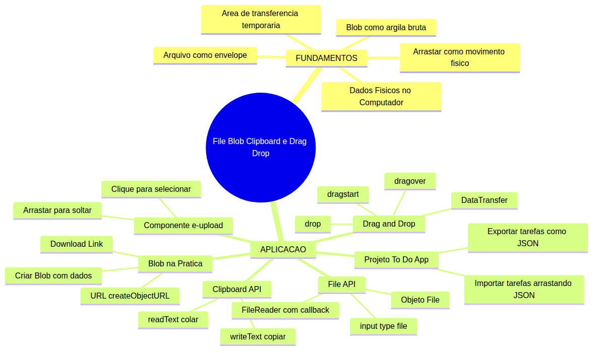

# JavaScript — Do Zero ao Profissional — Aula 22

## File API, Blob, Clipboard e Drag & Drop — Dados Físicos no Navegador

**Duração estimada:** 100 minutos (50 de leitura + 50 de prática)
**Nível:** Intermediário
**Pré-requisitos:** Aulas 01-19 concluídas. Você precisa dominar DOM e Custom Elements (Aula 18), eventos e ciclo de vida (Aula 19), Shadow DOM e templates (Aula 20), callbacks (Aula 14), classes (Aula 16) e manipulação de JSON com `JSON.stringify` e `JSON.parse`.

---

## Objetivos de Aprendizagem

Ao final desta aula, você será capaz de:

- [ ] **Explicar** o conceito de arquivo como contêiner de dados e identificar as 4 APIs que o navegador oferece para interagir com dados físicos
- [ ] **Usar** `<input type="file">` para selecionar arquivos do computador e acessar o objeto `File`
- [ ] **Ler** o conteúdo de arquivos com `FileReader` usando callbacks — `readAsText()` e `readAsDataURL()`
- [ ] **Criar** um `Blob` a partir de dados em memória e gerar URLs para download com `URL.createObjectURL()`
- [ ] **Copiar** texto para a área de transferência e **ler** texto de volta com `navigator.clipboard`
- [ ] **Implementar** arrastar e soltar com os eventos `dragstart`, `dragover` e `drop`
- [ ] **Construir** o componente `<e-upload>` que aceita clique e arrasto para selecionar arquivos
- [ ] **Integrar** exportação de tarefas como arquivo `.json` (Blob + download) e importação via drag-and-drop no To-Do App

---

## Como Usar Esta Aula

Esta aula está organizada em duas partes. A **primeira parte** constrói o conceito universal de dados físicos entrando no computador — arquivos, envelopes, argila bruta, movimento físico. A **segunda parte** aplica esses conceitos na prática com 4 Web APIs do navegador: File API, Blob, Clipboard API e Drag & Drop.

Ao longo do caminho, você encontrará seções **"Mão na Massa"** (para fazer, não só ler) e **"Quick Check"** (para verificar se entendeu antes de avançar). Ao final, o arquivo separado **Questões de Aprendizagem** traz as tarefas de checkpoint — só avance para a Aula 23 quando conseguir completá-las por conta própria.

**Tempo estimado:** 50 minutos de leitura + 50 minutos de prática.

---

## Mapa Mental

Este diagrama mostra todos os conceitos que você vai dominar nesta aula:



> *O mapa mental acima mostra a estrutura da aula. Cada ramo representa um conceito que você vai explorar: os fundamentos universais de dados físicos e as 4 APIs que materializam esses conceitos no navegador.*

---

## Recapitulação das Aulas Anteriores

| Aula | Conceito | Onde aparece nesta aula | Como se conecta |
|---|---|---|---|
| Aula 18 | **Custom Elements** (`customElements.define`, `connectedCallback`) | Seções 3, 8 | O componente `<e-upload>` é um Custom Element que estende `HTMLElement` |
| Aula 19 | **Eventos** (`addEventListener`, objeto `event`, `preventDefault`) | Seções 6, 7, 8 | Drag & Drop usa eventos; Clipboard usa eventos de teclado; `<e-upload>` precisa de `preventDefault` no `dragover` |
| Aula 20 | **Shadow DOM + Templates** (`attachShadow`, `<slot>`) | Seção 8 | `<e-upload>` usa Shadow DOM para encapsular estilo e marcação |
| Aula 14 | **Callbacks** (função passada como argumento) | Seções 4, 5 | `FileReader` usa callbacks (`onload`, `onerror`) — você já conhece este padrão da Aula 14 |
| Aula 12 | **Objetos** e **JSON** (`JSON.stringify`, `JSON.parse`) | Seção 8 | Exportar tarefas requer serializar array de objetos para JSON |

> *Nota: A Aula 21 (Formulários + Componentes de Formulário) pode ou não ter sido concluída. As 4 APIs desta aula são independentes do conteúdo de formulários — você pode cursá-las sem a Aula 21.*

---

**FUNDAMENTOS: Dados Físicos no Computador**

> *Os conceitos desta seção são universais — valem para qualquer sistema que lida com dados brutos, independentemente da linguagem ou plataforma. Na segunda parte, você verá como o navegador implementa cada um deles com 4 Web APIs específicas.*

---

## 1. O Mundo Físico Encontra o Digital — Arquivos, Pastas e Movimento

Você já sabe o que é um arquivo. Desde que aprendeu a usar um computador, você cria, abre, move e exclui arquivos todos os dias. Mas quando foi a última vez que você parou para pensar no que um arquivo realmente **é**?

### O Arquivo como Envelope

Um arquivo é um **contêiner**. Assim como um envelope de papel pode conter uma carta, uma foto ou um documento, um arquivo no computador pode conter texto, uma imagem, um vídeo ou qualquer outro tipo de dado.

O envelope tem informações escritas do lado de fora: remetente, destinatário. O arquivo tem **metadados** escritos no sistema operacional: nome, tamanho, tipo, data de criação. O conteúdo dentro do envelope é a carta. O conteúdo dentro do arquivo são os **bytes**.

Imagine que você tem uma gaveta cheia de envelopes. Cada envelope é um arquivo. Você pode:

- **Abrir** um envelope e ler o que está dentro (ler arquivo)
- **Escrever** uma nova carta e colocar em um envelope novo (criar arquivo)
- **Mover** um envelope de uma gaveta para outra (mover arquivo)
- **Copiar** o conteúdo de um envelope para outro (copiar arquivo)

Essas operações são tão naturais que você faz sem pensar. Agora imagine fazer tudo isso **com código** — sem usar o mouse, sem abrir janelas, apenas com instruções. É exatamente isso que as APIs de arquivo no navegador permitem.

### Dados entrando no computador

Quando você clica em "Selecionar arquivo" em um site, está abrindo uma porta para um arquivo físico do seu computador entrar no mundo digital da página web. É como entregar um envelope para alguém — o envelope passa do seu espaço físico para o espaço digital daquela aplicação.

Você pode estar pensando: "mas por que eu preciso de código para fazer isso? Já não faço arrastando arquivos?" Boa pergunta. A questão é que com código você pode **automatizar** e **personalizar** essa interação. Você pode, por exemplo, criar um componente que aceita arrastar 20 arquivos de uma vez, processa cada um, e mostra o resultado sem nunca abrir uma janela do Explorer.

### A Área de Transferência como Holding Area

A área de transferência (clipboard) é um espaço **temporário** que funciona como uma mesa entre duas cadeiras. Você tira algo de um lugar, coloca na mesa, e depois pega da mesa para colocar em outro lugar.

No mundo físico, você faria isso com um recorte de papel: corta de uma revista (copiar), segura na mão (holding area), e cola em um álbum (colar). A mão é a área de transferência — ela segura o dado temporariamente até você decidir onde colocar.

### Arrastar como Movimento Físico

Arrastar é a ação mais natural do mundo físico: você pega um objeto com a mão, move para outro lugar, e solta. Seu cérebro processa isso sem esforço consciente.

No computador, o "arrastar e soltar" emula exatamente este movimento. Você **seleciona** um arquivo (pega), **move** o cursor (transporta), e **solta** no destino (larga). A mágica é que durante o arrasto, o sistema operacional mantém uma **referência** ao que está sendo arrastado — o `DataTransfer` — como se fosse sua mão segurando o objeto.

### Quick Check 1

**1. Qual analogia melhor descreve um arquivo no computador?**
**Resposta:** Um envelope. Assim como um envelope contém uma carta e tem metadados na parte externa (remetente, destinatário), um arquivo contém bytes e tem metadados (nome, tamanho, tipo).

**2. O que é a área de transferência no mundo físico?**
**Resposta:** Uma mesa temporária entre duas cadeiras. Você coloca algo lá (copia), e depois pega de lá (cola). É um espaço de passagem, não de armazenamento permanente.

---

## 2. Blob — O Contêiner Universal de Dados Brutos

Agora que você entende arquivo como envelope, vamos falar sobre o que está **dentro** do envelope: os dados brutos.

### Argila antes da forma

Imagine um pedaço de argila. Argila é matéria-prima — ela pode virar um vaso, um prato, uma escultura, um tijolo. Enquanto está na forma de argila bruta, ela ainda não é nada específico, mas pode se tornar qualquer coisa.

**Blob** (Binary Large Object) é exatamente isso: um pedaço de **dados brutos** que ainda não foi moldado em nada específico. Assim como a argila pode virar vaso ou prato, um Blob pode virar texto, imagem, vídeo, áudio ou qualquer outro formato.

A diferença entre um arquivo e um Blob é sutil:

- Um **arquivo** (no mundo físico) está dentro de um envelope com metadados — você sabe o nome, o tipo, a data
- Um **Blob** é o conteúdo bruto sem o envelope — é só a argila, sem a etiqueta

No computador, um arquivo no seu disco rígido tem nome, extensão, permissões, data de modificação. Um Blob, por outro lado, é só os bytes soltos, sem esses metadados. Ele existe **na memória**, não no disco.

Para que serve um Blob então? Você pode criar um Blob com qualquer conteúdo que quiser: um texto, uma imagem gerada por código, dados de um formulário. Depois você pode:

- Transformar em um arquivo para download
- Enviar para um servidor
- Mostrar na tela como imagem ou texto
- Passar para outra API que espera dados brutos

Pense no Blob como a **argila digital** — você molda no formato que precisar.

### Por que "Grande Objeto Binário"?

O nome Blob vem de Binary Large Object — Grande Objeto Binário. Históricamente, o termo era usado em bancos de dados para guardar dados grandes como imagens e vídeos dentro de uma única coluna. Na computação, o nome ficou para descrever qualquer pedaço de dados brutos, independentemente do tamanho.

Você pode estar pensando: "mas eu não trabalho com dados binários enormes". E a resposta é: você trabalha sim! Todo texto que você digita vira dados binários quando é salvo em disco. Toda imagem que você carrega é um Blob. Todo arquivo JSON que você exporta é um Blob.

### Quick Check 2

**1. Qual é a principal diferença entre um arquivo e um Blob?**
**Resposta:** Um arquivo tem metadados (nome, tipo, data) e está no disco. Um Blob são apenas os dados brutos em memória, sem metadados. O arquivo é o envelope com a carta dentro; o Blob é só a carta.

**2. O que significa a sigla Blob?**
**Resposta:** Binary Large Object — Grande Objeto Binário. Um contêiner para dados brutos de qualquer tamanho e tipo.

---

**APLICAÇÃO: File, Blob, Clipboard e Drag & Drop no Navegador**

> *Agora que você entende os conceitos de arquivo como envelope, Blob como argila bruta, área de transferência como holding area e arrasto como movimento físico, vamos conectá-los à prática com 4 Web APIs do navegador: File API, Blob API, Clipboard API e Drag & Drop API.*

---

## 3. File API — Abrindo Arquivos do Computador

Vamos começar com a API mais direta: a **File API**. Ela permite que o navegador acesse arquivos do computador do usuário e leia seu conteúdo.

### input type file

A forma mais simples de abrir um arquivo é com um elemento HTML que você provavelmente já viu em formulários:

```html
<input type="file" id="selecionarArquivo">
```

Quando o usuário clica neste input, o navegador abre a janela padrão do sistema operacional para selecionar arquivos. Mas como acessamos o arquivo selecionado com JavaScript?

```html
<input type="file" id="selecionarArquivo">
<script>
  const input = document.getElementById('selecionarArquivo');

  input.addEventListener('change', function(evento) {
    const arquivo = evento.target.files[0];
    console.log('Nome:', arquivo.name);
    console.log('Tamanho:', arquivo.size, 'bytes');
    console.log('Tipo:', arquivo.type);
  });
</script>
```

O objeto `File` que recebemos tem três propriedades principais:

- `.name` — nome do arquivo (ex: `"foto.jpg"`)
- `.size` — tamanho em bytes (ex: `102400`)
- `.type` — tipo MIME (ex: `"image/jpeg"`)

> *Você pode estar pensando: "por que `files[0]`?" Boa pergunta. O atributo `multiple` no input permite selecionar vários arquivos de uma vez — `files` é uma lista. Sem `multiple`, usamos `[0]` para o primeiro (e único) arquivo.*

### Aceitando tipos específicos

Você pode filtrar quais tipos de arquivo o usuário pode selecionar:

```html
<!-- Apenas imagens -->
<input type="file" accept="image/*">

<!-- Apenas JSON -->
<input type="file" accept=".json">

<!-- Múltiplos tipos -->
<input type="file" accept="image/png, image/jpeg, .pdf">
```

O atributo `accept` não impede o usuário de selecionar outros tipos, mas o seletor de arquivo mostra primeiro os que correspondem ao filtro.

### Múltiplos arquivos

```html
<input type="file" id="multiplos" multiple>
<script>
  document.getElementById('multiplos').addEventListener('change', function(e) {
    const arquivos = e.target.files;
    for (let i = 0; i < arquivos.length; i++) {
      console.log(arquivos[i].name);
    }
  });
</script>
```

### Quick Check 3

**1. Qual propriedade do objeto File contém o nome do arquivo?**
**Resposta:** `.name`. O objeto File tem três propriedades padrão: `.name`, `.size` e `.type`.

**2. Como filtrar para mostrar apenas imagens no seletor de arquivos?**
**Resposta:** Usando o atributo `accept="image/*"` no `<input type="file">`.

---

## 4. FileReader — Lendo o Conteúdo do Arquivo

Selecionar o arquivo é só o primeiro passo. Agora você precisa ler o que está **dentro** do envelope. É aqui que entra o **FileReader**.

O FileReader é uma API que lê o conteúdo de um arquivo (ou Blob) de forma assíncrona. "Assíncrona" significa que ela não trava o navegador enquanto lê — você pede para ler, e quando terminar, ela te avisa.

Lembra dos **callbacks** que você aprendeu na Aula 14? O FileReader usa exatamente este padrão: você configura callbacks que são chamados quando a leitura termina.

### readAsText — Lendo como texto

O método mais comum é `readAsText()`, que lê o arquivo como uma string de texto:

```html
<input type="file" id="leitorTexto" accept=".txt">
<pre id="saida"></pre>
<script>
  const inputArquivo = document.getElementById('leitorTexto');
  const saida = document.getElementById('saida');

  inputArquivo.addEventListener('change', function(evento) {
    const arquivo = evento.target.files[0];
    const leitor = new FileReader();

    leitor.onload = function(eventoDeLeitura) {
      saida.textContent = eventoDeLeitura.target.result;
    };

    leitor.onerror = function() {
      saida.textContent = 'Erro ao ler o arquivo!';
    };

    leitor.readAsText(arquivo);
  });
</script>
```

Veja o fluxo:

1. Usuário seleciona um arquivo `.txt`
2. Criamos um novo `FileReader` com `new FileReader()`
3. Configuramos o callback `onload` — "quando terminar de ler, faça isso"
4. Configuramos o callback `onerror` — "se der erro, faça aquilo"
5. Chamamos `readAsText(arquivo)` — "comece a ler agora"

O callback `onload` recebe um evento cujo `evento.target.result` contém o conteúdo lido.

### readAsDataURL — Lendo como URL de dados

Para arquivos que não são texto (imagens, áudio, vídeo), usamos `readAsDataURL()`. Ele produz uma URL especial que começa com `data:` e contém o arquivo codificado:

```html
<input type="file" id="leitorImagem" accept="image/*">

<script>
  const inputImagem = document.getElementById('leitorImagem');
  const preview = document.getElementById('preview');

  inputImagem.addEventListener('change', function(evento) {
    const arquivo = evento.target.files[0];
    const leitor = new FileReader();

    leitor.onload = function(eventoDeLeitura) {
      preview.src = eventoDeLeitura.target.result;
    };

    leitor.readAsDataURL(arquivo);
  });
</script>
```

Agora, quando o usuário seleciona uma imagem, ela aparece no elemento `` — sem precisar enviar para nenhum servidor.

### Erro comum #1: Chamar readAsText antes de configurar os callbacks

```js
// ERRADO — o leitor pode terminar antes do onload ser configurado
const leitor = new FileReader();
leitor.readAsText(arquivo);
leitor.onload = function() { /* ... */ };
```

```js
// CERTO — configure os callbacks ANTES de iniciar a leitura
const leitor = new FileReader();
leitor.onload = function() { /* ... */ };
leitor.onerror = function() { /* ... */ };
leitor.readAsText(arquivo);
```

### Erro comum #2: Tentar ler arquivo que não é texto com readAsText

Se você tentar `readAsText` em uma imagem, vai receber uma string cheia de caracteres estranhos — são os bytes binários interpretados como texto. Use `readAsDataURL` para imagens.

### Mão na Massa — Leitor de Arquivos

Crie um arquivo HTML com um input que aceita `.txt` e exibe o conteúdo em um `<pre>`. Depois adicione um segundo input que aceita imagens e mostra o preview.

```html
<!DOCTYPE html>
<html lang="pt-br">
<head>
  <meta charset="UTF-8">
  <title>Leitor de Arquivos</title>
</head>
<body>
  <h2>Leitor de Texto</h2>
  <input type="file" id="inputTexto" accept=".txt">
  <pre id="conteudoTexto"></pre>

  <h2>Preview de Imagem</h2>
  <input type="file" id="inputImagem" accept="image/*">
  

  <script>
    const inputTexto = document.getElementById('inputTexto');
    const conteudoTexto = document.getElementById('conteudoTexto');
    const inputImagem = document.getElementById('inputImagem');
    const previewImagem = document.getElementById('previewImagem');

    inputTexto.addEventListener('change', function(e) {
      const arquivo = e.target.files[0];
      if (!arquivo) return;
      const leitor = new FileReader();
      leitor.onload = function(ev) {
        conteudoTexto.textContent = ev.target.result;
      };
      leitor.readAsText(arquivo);
    });

    inputImagem.addEventListener('change', function(e) {
      const arquivo = e.target.files[0];
      if (!arquivo) return;
      const leitor = new FileReader();
      leitor.onload = function(ev) {
        previewImagem.src = ev.target.result;
      };
      leitor.readAsDataURL(arquivo);
    });
  </script>
</body>
</html>
```

### Quick Check 4

**1. Qual a diferença entre `readAsText` e `readAsDataURL`?**
**Resposta:** `readAsText` lê o conteúdo como string de texto (para `.txt`, `.json`, `.csv`). `readAsDataURL` gera uma URL `data:` que codifica o arquivo em base64 (para imagens, áudios, vídeos).

**2. Por que os callbacks `onload` e `onerror` devem ser configurados ANTES de chamar `readAsText`?**
**Resposta:** Porque a leitura é assíncrona — se o arquivo for muito pequeno, pode terminar antes de você configurar o callback, e você perderia o resultado.

---

## 5. Blob na Prática — Criar, Modificar e Baixar Dados

Agora vamos para o lado oposto: em vez de ler um arquivo, vamos **criar** dados do zero e transformá-los em um Blob.

### Criando um Blob

```js
const blob = new Blob(['Olá, mundo!'], { type: 'text/plain' });
console.log(blob.size);  // 12 bytes
console.log(blob.type);  // "text/plain"
```

O construtor `Blob` recebe dois argumentos:

1. Um **array** de partes que formam o conteúdo. Cada parte pode ser string, ArrayBuffer, ou outro Blob
2. Um objeto de opções com `type` (tipo MIME)

Veja como criar um Blob com múltiplas partes:

```js
const parte1 = 'Primeira linha. ';
const parte2 = 'Segunda linha. ';
const blob = new Blob([parte1, parte2], { type: 'text/plain' });
// O blob contém: "Primeira linha. Segunda linha. "
```

### Gerando download com URL.createObjectURL

Aqui está o truque: você pode criar uma URL que aponta para um Blob na memória. Essa URL pode ser usada como `href` de um link de download:

```html
<button id="btnDownload">Baixar Arquivo</button>
<script>
  document.getElementById('btnDownload').addEventListener('click', function() {
    const dados = 'Este é o conteúdo do meu arquivo!';
    const blob = new Blob([dados], { type: 'text/plain' });
    const url = URL.createObjectURL(blob);

    const link = document.createElement('a');
    link.href = url;
    link.download = 'meu-arquivo.txt';
    link.click();

    URL.revokeObjectURL(url);  // Limpa a memória
  });
</script>
```

O que acontece aqui:

1. Criamos um Blob com o texto que queremos
2. Criamos uma URL temporária com `URL.createObjectURL(blob)`
3. Criamos um link `<a>` programaticamente, configuramos `href` e `download`
4. Disparamos o clique no link com `.click()`
5. Chamamos `URL.revokeObjectURL(url)` para liberar a memória

> *Você pode estar pensando: "preciso sempre limpar a URL?" Sim! Cada `createObjectURL` reserva memória no navegador. Se você criar muitas sem limpar, pode esgotar a memória. O `revokeObjectURL` libera esse recurso.*

### Criando download de JSON

Este é o caso que vamos usar no projeto: exportar dados como JSON:

```js
function exportarComoJSON(dados, nomeArquivo) {
  const jsonString = JSON.stringify(dados, null, 2);
  const blob = new Blob([jsonString], { type: 'application/json' });
  const url = URL.createObjectURL(blob);

  const link = document.createElement('a');
  link.href = url;
  link.download = nomeArquivo + '.json';
  link.click();

  URL.revokeObjectURL(url);
}

// Uso
const tarefas = [
  { id: 1, texto: 'Estudar JavaScript', concluida: false },
  { id: 2, texto: 'Fazer exercícios', concluida: true }
];
exportarComoJSON(tarefas, 'minhas-tarefas');
```

O parâmetro `null, 2` no `JSON.stringify` formata o JSON com indentação de 2 espaços — fica legível para humanos.

### Quick Check 5

**1. Qual método cria uma URL temporária para um Blob?**
**Resposta:** `URL.createObjectURL(blob)`. Ela retorna uma string como `blob:http://...` que pode ser usada como `href`, `src`, etc.

**2. Por que devemos chamar `URL.revokeObjectURL()` depois de usar a URL?**
**Resposta:** Para liberar a memória. Cada URL criada reserva memória no navegador. Se não for liberada, pode causar vazamento de memória.

---

## 6. Clipboard API — Copiar e Colar com Código

A **Clipboard API** permite que seu código copie texto para a área de transferência e leia o texto de volta. Lembra da analogia da mesa temporária? Aqui você controla essa mesa com código.

### Copiando texto para o clipboard

```js
navigator.clipboard.writeText('Texto para copiar')
  .then(function() {
    console.log('Copiado!');
  })
  .catch(function(erro) {
    console.error('Falha ao copiar:', erro);
  });
```

O método `writeText` recebe uma string e tenta colocá-la na área de transferência. Ele retorna uma **Promise** (que você aprenderá em detalhes na Aula 27), mas por enquanto você pode usar `.then()` como um callback de sucesso e `.catch()` como callback de erro.

Na prática, você vai usar isso em um botão "Copiar":

```html
<p id="textoParaCopiar">Este texto será copiado.</p>
<button id="btnCopiar">Copiar Texto</button>
<script>
  document.getElementById('btnCopiar').addEventListener('click', function() {
    const texto = document.getElementById('textoParaCopiar').textContent;
    navigator.clipboard.writeText(texto)
      .then(function() {
        alert('Texto copiado para a área de transferência!');
      })
      .catch(function(erro) {
        alert('Erro ao copiar: ' + erro.message);
      });
  });
</script>
```

### Colando texto do clipboard

```js
navigator.clipboard.readText()
  .then(function(texto) {
    console.log('Texto colado:', texto);
  })
  .catch(function(erro) {
    console.error('Erro ao colar:', erro);
  });
```

Um exemplo prático: um campo que recebe texto colado automaticamente:

```html
<button id="btnColar">Colar da Área de Transferência</button>
<p id="areaColar">O texto colado aparecerá aqui.</p>
<script>
  document.getElementById('btnColar').addEventListener('click', function() {
    navigator.clipboard.readText()
      .then(function(texto) {
        document.getElementById('areaColar').textContent = texto;
      })
      .catch(function() {
        alert('Não foi possível colar. Verifique as permissões.');
      });
  });
</script>
```

### Permissões e segurança

A Clipboard API exige **permissão do usuário** para funcionar. O navegador só permite:

- `writeText()` em resposta a uma ação do usuário (clique, tecla)
- `readText()` requer permissão explícita (alguns navegadores mostram um prompt)

Se você tentar chamar `writeText` fora de um evento do usuário (ex: no carregamento da página), o navegador vai rejeitar a operação.

### Erro comum: Clipboard bloqueado

Se você testar localmente (protocolo `file://`), a Clipboard API pode não funcionar. Use um servidor local (`npx serve` ou Live Server do VS Code) ou teste em uma página HTTPS.

### Quick Check 6

**1. Qual método copia texto para a área de transferência?**
**Resposta:** `navigator.clipboard.writeText(texto)`. O método `readText()` faz o oposto — lê o texto da área de transferência.

**2. Por que a Clipboard API pode falhar se chamada fora de um evento do usuário?**
**Resposta:** Por segurança. O navegador só permite acessar a área de transferência em resposta a uma ação do usuário (clique, tecla), para evitar que sites maliciosos leiam ou modifiquem dados sem permissão.

---

## 7. Drag & Drop — Arrastar para Interagir

A **Drag & Drop API** permite que o usuário arraste elementos (ou arquivos) e os solte em áreas específicas da página. Vamos implementar os três eventos fundamentais.

### Eventos chave do Drag & Drop

O ciclo de um arrasto tem três eventos principais:

| Evento | Dispara em | Quando |
|---|---|---|
| `dragstart` | Elemento arrastado | Quando o usuário começa a arrastar |
| `dragover` | Alvo do drop | Enquanto o item está sobre o alvo |
| `drop` | Alvo do drop | Quando o usuário solta o item |

### Passo 1: Elemento arrastável

Para um elemento poder ser arrastado, ele precisa do atributo `draggable="true"`:

```html
<div id="item" draggable="true">Arraste-me!</div>
```

### Passo 2: Configurar dragstart

No elemento arrastável, configuramos o que será transferido:

```js
const item = document.getElementById('item');

item.addEventListener('dragstart', function(evento) {
  evento.dataTransfer.setData('text/plain', 'Dados do item arrastado');
  evento.dataTransfer.effectAllowed = 'move';
});
```

O `evento.dataTransfer` é o objeto que carrega os dados durante o arrasto — é a "mão" que segura o objeto enquanto ele está sendo transportado.

### Passo 3: Configurar a zona de drop

No elemento que vai receber o drop, precisamos de dois eventos:

```js
const zonaDrop = document.getElementById('zona-drop');

zonaDrop.addEventListener('dragover', function(evento) {
  evento.preventDefault();  // ESSENCIAL! Sem isso, o drop não funciona
  evento.dataTransfer.dropEffect = 'move';
});

zonaDrop.addEventListener('drop', function(evento) {
  evento.preventDefault();
  const dados = evento.dataTransfer.getData('text/plain');
  console.log('Recebido:', dados);
});
```

> **Atenção:** Você PRECISA chamar `evento.preventDefault()` no `dragover`. Sem isso, o navegador bloqueia o drop por padrão. Esse é o erro mais comum de quem está aprendendo Drag & Drop.

### Drag & Drop de arquivos

Para receber arquivos arrastados do computador, usamos `evento.dataTransfer.files`:

```html
<div id="areaDrop" style="border: 2px dashed #ccc; padding: 40px; text-align: center;">
  Arraste arquivos para cá
</div>
<ul id="listaArquivos"></ul>

<script>
  const areaDrop = document.getElementById('areaDrop');
  const listaArquivos = document.getElementById('listaArquivos');

  areaDrop.addEventListener('dragover', function(evento) {
    evento.preventDefault();
    areaDrop.style.borderColor = '#4CAF50';
  });

  areaDrop.addEventListener('dragleave', function() {
    areaDrop.style.borderColor = '#ccc';
  });

  areaDrop.addEventListener('drop', function(evento) {
    evento.preventDefault();
    areaDrop.style.borderColor = '#ccc';

    const arquivos = evento.dataTransfer.files;
    listaArquivos.innerHTML = '';

    for (let i = 0; i < arquivos.length; i++) {
      const li = document.createElement('li');
      li.textContent = arquivos[i].name + ' (' + arquivos[i].size + ' bytes)';
      listaArquivos.appendChild(li);
    }
  });
</script>
```

Repare que usamos `evento.dataTransfer.files` — a mesma estrutura `File[]` que o `<input type="file">` fornece. Você pode combinar `FileReader` com drag-and-drop para ler arquivos arrastados.

### Quick Check 7

**1. Qual o erro mais comum ao implementar Drag & Drop e como corrigi-lo?**
**Resposta:** Esquecer de chamar `evento.preventDefault()` no evento `dragover`. Sem isso, o navegador bloqueia o `drop`. A correção é adicionar `evento.preventDefault()` no callback do `dragover`.

**2. Qual propriedade do `dataTransfer` contém os arquivos arrastados?**
**Resposta:** `evento.dataTransfer.files` — retorna um `FileList` com os arquivos arrastados do sistema operacional.

---

## 8. Projeto Final — Componente e-upload + Exportar/Importar Tarefas

Agora vamos combinar TUDO o que você aprendeu em um componente funcional e depois integrá-lo ao To-Do App.

### Componente e-upload

Vamos criar um Custom Element `<e-upload>` que:

- Aceita clique para selecionar arquivos
- Aceita arrastar arquivos sobre ele
- Mostra os arquivos selecionados
- Dispara um evento customizado `arquivos-selecionados` com os dados

```html
<e-upload accept=".json" multiple></e-upload>

<script>
  class EUpload extends HTMLElement {
    constructor() {
      super();
      this._arquivos = [];
      this.attachShadow({ mode: 'open' });
    }

    connectedCallback() {
      this.renderizar();
      this.configurarEventos();
    }

    renderizar() {
      this.shadowRoot.innerHTML = `
        <style>
          :host {
            display: block;
            font-family: sans-serif;
          }
          .area {
            border: 2px dashed #aaa;
            border-radius: 8px;
            padding: 30px;
            text-align: center;
            cursor: pointer;
            transition: border-color 0.3s, background 0.3s;
          }
          .area.destaque {
            border-color: #4CAF50;
            background: #f0f8f0;
          }
          .icone {
            font-size: 40px;
            margin-bottom: 10px;
          }
          input {
            display: none;
          }
          ul {
            list-style: none;
            padding: 0;
            margin-top: 10px;
          }
          li {
            padding: 5px 10px;
            background: #f5f5f5;
            margin: 4px 0;
            border-radius: 4px;
            font-size: 14px;
          }
        </style>
        <div class="area" id="area">
          <div class="icone">📁</div>
          <p>Clique para selecionar ou arraste arquivos aqui</p>
        </div>
        <input type="file" id="input" accept="${this.getAttribute('accept') || '*'}" ${this.hasAttribute('multiple') ? 'multiple' : ''}>
        <ul id="lista"></ul>
      `;
    }

    configurarEventos() {
      const area = this.shadowRoot.getElementById('area');
      const input = this.shadowRoot.getElementById('input');

      area.addEventListener('click', function() {
        input.click();
      });

      input.addEventListener('change', (evento) => {
        this.processarArquivos(evento.target.files);
      });

      area.addEventListener('dragover', (evento) => {
        evento.preventDefault();
        area.classList.add('destaque');
      });

      area.addEventListener('dragleave', () => {
        area.classList.remove('destaque');
      });

      area.addEventListener('drop', (evento) => {
        evento.preventDefault();
        area.classList.remove('destaque');
        this.processarArquivos(evento.dataTransfer.files);
      });
    }

    processarArquivos(arquivos) {
      this._arquivos = [];
      const lista = this.shadowRoot.getElementById('lista');
      lista.innerHTML = '';

      for (let i = 0; i < arquivos.length; i++) {
        const arquivo = arquivos[i];
        this._arquivos.push(arquivo);

        const li = document.createElement('li');
        li.textContent = arquivo.name + ' (' + (arquivo.size / 1024).toFixed(1) + ' KB)';
        lista.appendChild(li);
      }

      this.dispararEvento('arquivos-selecionados', { arquivos: this._arquivos });
    }

    dispararEvento(nome, detalhes) {
      const evento = new CustomEvent(nome, {
        bubbles: true,
        composed: true,
        detail: detalhes
      });
      this.dispatchEvent(evento);
    }

    get arquivos() {
      return this._arquivos;
    }
  }

  customElements.define('e-upload', EUpload);
</script>
```

Veja os destaques deste componente:

- Usa **Shadow DOM** para isolar estilos
- Tem um `<input type="file">` oculto que é acionado pelo clique na área
- Escuta `dragover`, `dragleave` e `drop` para arrasto
- Processa os arquivos selecionados (por clique ou arrasto) e os exibe
- Dispara um **evento customizado** `arquivos-selecionados` para comunicação com o mundo externo

### Integração com o To-Do App: Exportar Tarefas

Agora vamos adicionar a funcionalidade de exportar as tarefas como arquivo `.json`:

```html
<button id="btnExportar">Exportar Tarefas</button>

<script>
  function exportarTarefas(tarefas) {
    const jsonString = JSON.stringify(tarefas, null, 2);
    const blob = new Blob([jsonString], { type: 'application/json' });
    const url = URL.createObjectURL(blob);

    const link = document.createElement('a');
    link.href = url;
    link.download = 'tarefas-exportadas.json';
    link.click();

    URL.revokeObjectURL(url);
  }

  document.getElementById('btnExportar').addEventListener('click', function() {
    const tarefas = [
      { id: 1, texto: 'Estudar JavaScript', concluida: false },
      { id: 2, texto: 'Revisar Aula 21', concluida: true },
      { id: 3, texto: 'Fazer exercícios práticos', concluida: false }
    ];
    exportarTarefas(tarefas);
  });
</script>
```

### Integração com o To-Do App: Importar Tarefas

Usando o `<e-upload>`, o usuário arrasta um arquivo `.json` e as tarefas são carregadas:

```html
<e-upload id="importador" accept=".json"></e-upload>

<script>
  document.getElementById('importador').addEventListener('arquivos-selecionados', function(evento) {
    const arquivo = evento.detail.arquivos[0];

    if (!arquivo) return;

    const leitor = new FileReader();

    leitor.onload = function(ev) {
      try {
        const tarefasImportadas = JSON.parse(ev.target.result);
        console.log('Tarefas importadas:', tarefasImportadas);
        // Aqui você integraria com a lista de tarefas existente
        alert(tarefasImportadas.length + ' tarefas importadas com sucesso!');
      } catch (erro) {
        alert('Erro: O arquivo não é um JSON válido.');
      }
    };

    leitor.onerror = function() {
      alert('Erro ao ler o arquivo.');
    };

    leitor.readAsText(arquivo);
  });
</script>
```

### Mão na Massa — To-Do App Completo

Integre tudo em uma página única:

1. Renderize o `<e-upload>` na página
2. Adicione um botão "Exportar Tarefas" que baixa um `.json` com as tarefas atuais
3. Use o `<e-upload>` para importar tarefas de um arquivo `.json`
4. As tarefas importadas devem ser exibidas na lista

```html
<!DOCTYPE html>
<html lang="pt-br">
<head>
  <meta charset="UTF-8">
  <title>To-Do App — Exportar e Importar</title>
</head>
<body>
  <h1>Gerenciador de Tarefas</h1>

  <button id="btnExportar">Exportar Tarefas</button>

  <h2>Importar Tarefas</h2>
  <e-upload id="importador" accept=".json"></e-upload>

  <ul id="listaTarefas"></ul>

  <script>
    // Tarefas atuais (simulando o estado do app)
    let tarefas = [
      { id: 1, texto: 'Estudar File API', concluida: false },
      { id: 2, texto: 'Praticar Drag and Drop', concluida: false },
      { id: 3, texto: 'Exportar tarefas como JSON', concluida: true }
    ];

    const listaTarefas = document.getElementById('listaTarefas');

    function renderizarTarefas() {
      listaTarefas.innerHTML = '';
      for (let i = 0; i < tarefas.length; i++) {
        const li = document.createElement('li');
        li.textContent = (tarefas[i].concluida ? '✅ ' : '⬜ ') + tarefas[i].texto;
        listaTarefas.appendChild(li);
      }
    }

    function exportarTarefas() {
      const jsonString = JSON.stringify(tarefas, null, 2);
      const blob = new Blob([jsonString], { type: 'application/json' });
      const url = URL.createObjectURL(blob);
      const link = document.createElement('a');
      link.href = url;
      link.download = 'tarefas-exportadas.json';
      link.click();
      URL.revokeObjectURL(url);
    }

    document.getElementById('btnExportar').addEventListener('click', exportarTarefas);

    class EUpload extends HTMLElement {
      constructor() {
        super();
        this._arquivos = [];
        this.attachShadow({ mode: 'open' });
      }

      connectedCallback() {
        this.renderizar();
        this.configurarEventos();
      }

      renderizar() {
        this.shadowRoot.innerHTML = `
          <style>
            .area {
              border: 2px dashed #aaa;
              border-radius: 8px;
              padding: 20px;
              text-align: center;
              cursor: pointer;
            }
            .area.destaque { border-color: #4CAF50; background: #f0f8f0; }
            input { display: none; }
            ul { list-style: none; padding: 0; margin-top: 10px; }
            li { padding: 5px; background: #f5f5f5; margin: 4px 0; border-radius: 4px; }
          </style>
          <div class="area" id="area">
            <p>Clique ou arraste arquivos aqui</p>
          </div>
          <input type="file" id="input" accept="${this.getAttribute('accept') || '*'}" ${this.hasAttribute('multiple') ? 'multiple' : ''}>
          <ul id="lista"></ul>
        `;
      }

      configurarEventos() {
        const area = this.shadowRoot.getElementById('area');
        const input = this.shadowRoot.getElementById('input');

        area.addEventListener('click', () => input.click());

        input.addEventListener('change', (e) => this.processarArquivos(e.target.files));

        area.addEventListener('dragover', (e) => { e.preventDefault(); area.classList.add('destaque'); });
        area.addEventListener('dragleave', () => area.classList.remove('destaque'));
        area.addEventListener('drop', (e) => {
          e.preventDefault();
          area.classList.remove('destaque');
          this.processarArquivos(e.dataTransfer.files);
        });
      }

      processarArquivos(arquivos) {
        this._arquivos = [];
        const lista = this.shadowRoot.getElementById('lista');
        lista.innerHTML = '';
        for (let i = 0; i < arquivos.length; i++) {
          this._arquivos.push(arquivos[i]);
          const li = document.createElement('li');
          li.textContent = arquivos[i].name;
          lista.appendChild(li);
        }
        this.dispatchEvent(new CustomEvent('arquivos-selecionados', {
          bubbles: true, composed: true,
          detail: { arquivos: this._arquivos }
        }));
      }

      get arquivos() { return this._arquivos; }
    }

    customElements.define('e-upload', EUpload);

    // Importar tarefas
    document.getElementById('importador').addEventListener('arquivos-selecionados', function(evento) {
      const arquivo = evento.detail.arquivos[0];
      if (!arquivo) return;

      const leitor = new FileReader();
      leitor.onload = function(ev) {
        try {
          const tarefasImportadas = JSON.parse(ev.target.result);
          tarefas = tarefas.concat(tarefasImportadas);
          renderizarTarefas();
          alert(tarefasImportadas.length + ' tarefas importadas!');
        } catch (erro) {
          alert('Arquivo JSON inválido.');
        }
      };
      leitor.readAsText(arquivo);
    });

    renderizarTarefas();
  </script>
</body>
</html>
```

### Quick Check 8

**1. Por que o `<e-upload>` usa `attachShadow({ mode: 'open' })`?**
**Resposta:** Para criar um Shadow DOM que isola os estilos do componente. O modo `'open'` permite acesso externo ao shadowRoot, se necessário.

**2. Como o `<e-upload>` comunica os arquivos selecionados para o mundo externo?**
**Resposta:** Disparando um evento customizado `arquivos-selecionados` com `new CustomEvent()`. O componente pai escuta este evento e acessa `evento.detail.arquivos`.

---

**Autoavaliação: Quiz Rápido**

**1. Qual objeto representa um arquivo selecionado pelo usuário?**
**Resposta:**

O objeto `File`. Ele contém as propriedades `.name`, `.size` e `.type`.

**2. O que é necessário fazer no evento `dragover` para que o `drop` funcione?**
**Resposta:**

Chamar `evento.preventDefault()`. Sem isso, o navegador bloqueia o drop por padrão.

**3. Qual método do FileReader deve ser usado para ler uma imagem?**
**Resposta:**

`readAsDataURL(arquivo)`, que gera uma URL `data:` que pode ser usada como `src` de um ``.

**4. Como criar uma URL temporária para download de um Blob?**
**Resposta:**

`URL.createObjectURL(blob)`. Retorna uma string que pode ser usada como `href` de um link de download.

**5. Qual método copia texto para a área de transferência?**
**Resposta:**

`navigator.clipboard.writeText(texto)`. O método `readText()` lê o texto da área de transferência.

**6. O que acontece se você não chamar `URL.revokeObjectURL()` após o download?**
**Resposta:**

A memória reservada para o Blob não é liberada. Se muitas URLs forem criadas sem revogação, pode ocorrer vazamento de memória.

**7. Por que o `<input type="file">` dentro do `<e-upload>` está oculto?**
**Resposta:**

Porque o componente captura o clique na área visual e dispara `input.click()` programaticamente. O input fica oculto (`display: none`), mas ainda funcional.

**8. Qual a diferença entre `evento.dataTransfer.files` e `evento.target.files`?**
**Resposta:**

`evento.dataTransfer.files` contém arquivos arrastados (Drag & Drop). `evento.target.files` contém arquivos selecionados via `<input type="file">`. Ambos retornam um `FileList`.

---

## Mão na Massa: Exercícios Graduados

**Exercício 1 (Fácil) — Leitor de Texto**

Crie uma página HTML que tenha um `<input type="file" accept=".txt">`. Quando o usuário selecionar um arquivo, o conteúdo deve ser exibido em um `<pre>` na página. Trate o caso de o arquivo não ser selecionado.

**Gabarito:**

```html
<input type="file" id="inputTxt" accept=".txt">
<pre id="conteudo"></pre>

<script>
  document.getElementById('inputTxt').addEventListener('change', function(e) {
    const arquivo = e.target.files[0];
    if (!arquivo) return;

    const leitor = new FileReader();
    leitor.onload = function(ev) {
      document.getElementById('conteudo').textContent = ev.target.result;
    };
    leitor.readAsText(arquivo);
  });
</script>
```

---

**Exercício 2 (Médio) — Botão Copiar com Feedback**

Crie uma página com um paragrafo de texto e um botão "Copiar". Ao clicar no botão, o texto do paragrafo é copiado para a área de transferência. O botão deve mudar visualmente (texto "Copiado!" ou cor verde) quando a cópia for bem-sucedida.

**Gabarito:**

```html
<p id="texto">Este é o texto que será copiado para a área de transferência.</p>
<button id="btnCopiar">Copiar Texto</button>

<script>
  const btn = document.getElementById('btnCopiar');

  btn.addEventListener('click', function() {
    const texto = document.getElementById('texto').textContent;

    navigator.clipboard.writeText(texto)
      .then(function() {
        const textoOriginal = btn.textContent;
        btn.textContent = 'Copiado!';
        btn.style.background = '#4CAF50';
        btn.style.color = 'white';

        setTimeout(function() {
          btn.textContent = textoOriginal;
          btn.style.background = '';
          btn.style.color = '';
        }, 2000);
      })
      .catch(function(erro) {
        alert('Erro ao copiar: ' + erro.message);
      });
  });
</script>
```

---

**Exercício 3 (Difícil) — Galeria de Imagens com Drag & Drop**

Crie uma página que funciona como uma galeria de imagens. O usuário arrasta imagens do computador para uma área demarcada. Cada imagem arrastada deve aparecer como thumbnail na galeria. A galeria deve usar um `<template>` e Shadow DOM para renderizar cada thumbnail. Inclua um botão "Limpar Tudo" que remove todas as imagens. Dica: use `readAsDataURL()` para gerar o `src` de cada ``.

**Gabarito:**

```html
<!DOCTYPE html>
<html lang="pt-br">
<head>
  <meta charset="UTF-8">
  <title>Galeria com Drag & Drop</title>
  <style>
    #area-drop {
      border: 3px dashed #aaa;
      border-radius: 12px;
      padding: 60px;
      text-align: center;
      font-size: 18px;
      color: #666;
      cursor: pointer;
      transition: all 0.3s;
      margin-bottom: 20px;
    }
    #area-drop.destaque {
      border-color: #2196F3;
      background: #e3f2fd;
    }
    #galeria {
      display: flex;
      flex-wrap: wrap;
      gap: 12px;
    }
    .thumb {
      width: 150px;
      height: 150px;
      object-fit: cover;
      border-radius: 8px;
      border: 2px solid #ddd;
    }
    #btnLimpar {
      margin-top: 16px;
      padding: 8px 20px;
      background: #f44336;
      color: white;
      border: none;
      border-radius: 4px;
      cursor: pointer;
    }
  </style>
</head>
<body>
  <h1>Galeria de Imagens</h1>

  <div id="area-drop">
    Arraste imagens para cá ou clique para selecionar
  </div>
  <input type="file" id="inputArquivos" accept="image/*" multiple style="display:none;">

  <div id="galeria"></div>
  <button id="btnLimpar" style="display:none;">Limpar Tudo</button>

  <script>
    const areaDrop = document.getElementById('area-drop');
    const inputArquivos = document.getElementById('inputArquivos');
    const galeria = document.getElementById('galeria');
    const btnLimpar = document.getElementById('btnLimpar');

    // Clique para selecionar
    areaDrop.addEventListener('click', function() {
      inputArquivos.click();
    });

    inputArquivos.addEventListener('change', function(e) {
      processarArquivos(e.target.files);
      e.target.value = '';
    });

    // Drag & Drop
    areaDrop.addEventListener('dragover', function(e) {
      e.preventDefault();
      areaDrop.classList.add('destaque');
    });

    areaDrop.addEventListener('dragleave', function() {
      areaDrop.classList.remove('destaque');
    });

    areaDrop.addEventListener('drop', function(e) {
      e.preventDefault();
      areaDrop.classList.remove('destaque');
      processarArquivos(e.dataTransfer.files);
    });

    function processarArquivos(arquivos) {
      for (let i = 0; i < arquivos.length; i++) {
        const arquivo = arquivos[i];

        if (!arquivo.type.startsWith('image/')) {
          alert(arquivo.name + ' não é uma imagem.');
          continue;
        }

        const leitor = new FileReader();
        leitor.onload = function(ev) {
          const img = document.createElement('img');
          img.src = ev.target.result;
          img.className = 'thumb';
          img.title = arquivo.name;
          galeria.appendChild(img);
          btnLimpar.style.display = 'block';
        };
        leitor.readAsDataURL(arquivo);
      }
    }

    btnLimpar.addEventListener('click', function() {
      galeria.innerHTML = '';
      btnLimpar.style.display = 'none';
    });
  </script>
</body>
</html>
```

---

## Resumo da Aula

### Os 5 Conceitos Fundamentais

1. **File API**: Use `<input type="file">` para selecionar arquivos. O objeto `File` contém `.name`, `.size`, `.type`.

2. **FileReader**: Leia o conteúdo com `readAsText()` (texto) ou `readAsDataURL()` (imagens). Configure os callbacks `onload` e `onerror` ANTES de chamar o método de leitura.

3. **Blob**: Crie dados brutos em memória com `new Blob([dados], { type })`. Gere URLs temporárias com `URL.createObjectURL()` e não esqueça de `revokeObjectURL()` para liberar memória.

4. **Clipboard API**: Copie com `navigator.clipboard.writeText()` e cole com `navigator.clipboard.readText()`. Exige ação do usuário por segurança.

5. **Drag & Drop**: Configure `dragstart` (origem), `dragover` (com `preventDefault()`) e `drop` (destino). O `dataTransfer` carrega os dados durante o arrasto.

### O Que Você Construiu Hoje

- [x] Leitor de arquivos com FileReader (texto e imagens)
- [x] Botão de download de Blob com `URL.createObjectURL`
- [x] Botão de copiar para a área de transferência
- [x] Zona de drop com Drag & Drop
- [x] Componente `<e-upload>` para seleção por clique e arrasto
- [x] Exportação de tarefas como `.json` no To-Do App
- [x] Importação de tarefas via `readAsText` + `JSON.parse`

---

## Próxima Aula

**Aula 23: Web Storage + IndexedDB**

Você aprendeu a importar e exportar dados como arquivos. Na próxima aula, vai aprender a **persistir** esses dados diretamente no navegador. O `localStorage` para dados simples e o **IndexedDB** — um banco de dados NoSQL completo no navegador — para dados estruturados e consultas complexas. Seu To-Do App vai ganhar memória permanente.

---

## Referências

### Documentação Oficial

- [File API (MDN)](https://developer.mozilla.org/pt-BR/docs/Web/API/File) — documentação completa da File API
- [FileReader (MDN)](https://developer.mozilla.org/pt-BR/docs/Web/API/FileReader) — leitura de arquivos no navegador
- [Blob (MDN)](https://developer.mozilla.org/pt-BR/docs/Web/API/Blob) — Binary Large Object
- [Clipboard API (MDN)](https://developer.mozilla.org/pt-BR/docs/Web/API/Clipboard) — API de área de transferência
- [Drag & Drop (MDN)](https://developer.mozilla.org/pt-BR/docs/Web/API/HTML_Drag_and_Drop_API) — API de arrastar e soltar
- [URL.createObjectURL (MDN)](https://developer.mozilla.org/pt-BR/docs/Web/API/URL/createObjectURL) — URLs temporárias para Blobs

### Ferramentas

- [Live Server (VS Code)](https://marketplace.visualstudio.com/items?itemName=ritwickdey.LiveServer) — servidor local para testar Clipboard API

### Artigos para Aprofundamento

- [FileReader.readAsDataURL vs createObjectURL](https://stackoverflow.com/questions/31742072/filereader-readasdataurl-vs-url-createobjecturl) — quando usar cada um
- [Usando a API Drag and Drop (MDN)](https://developer.mozilla.org/pt-BR/docs/Web/API/HTML_Drag_and_Drop_API/Drag_operations) — guia completo de operações de arrasto

---

## FAQ

**P: Posso usar `FileReader` com Promises em vez de callbacks?**
R: Sim! A Aula 27 vai te ensinar Promises e async/await. Por enquanto, os callbacks da Aula 14 são o suficiente — e são o padrão original do FileReader.

**P: Por que minha Clipboard API não funciona quando testo localmente?**
R: A Clipboard API exige HTTPS ou `localhost` por segurança. Use um servidor local (Live Server, `npx serve`) em vez de abrir o arquivo diretamente (`file://`).

**P: Meu `drop` não funciona. O que pode ser?**
R: 99% das vezes é porque você esqueceu `evento.preventDefault()` no `dragover`. O navegador bloqueia o drop por padrão. Apenas com `preventDefault` você permite a ação de soltar.

**P: Qual a diferença entre `readAsDataURL` e `URL.createObjectURL`?**
R: `readAsDataURL` gera uma URL longa com dados em base64. `URL.createObjectURL` gera uma URL curta que referencia um Blob na memória. `createObjectURL` é mais rápido e eficiente, mas precisa ser limpo com `revokeObjectURL`.

**P: Posso arrastar arquivos entre abas do navegador?**
R: Sim! Drag & Drop funciona entre abas do mesmo navegador e entre o sistema operacional e o navegador. O `dataTransfer` carrega os dados de uma aba para outra.

**P: O `navigator.clipboard` funciona em todos os navegadores?**
R: Sim, em navegadores modernos (Chrome 66+, Firefox 63+, Edge 79+, Safari 13.1+). Para navegadores antigos, existem fallbacks usando `document.execCommand('copy')`.

**P: Como ler múltiplos arquivos de uma vez?**
R: Use `multiple` no `<input type="file" multiple>` e acesse `evento.target.files` como um array. Com Drag & Drop, `evento.dataTransfer.files` já contém todos os arquivos arrastados.

**P: O que é tipo MIME?**
R: É um identificador padronizado do tipo de conteúdo. Ex: `text/plain` para texto, `application/json` para JSON, `image/jpeg` para JPEG. O objeto `File.type` retorna o tipo MIME.

**P: `createObjectURL` gera URLs infinitas?**
R: Não, cada URL criada ocupa memória até ser revogada com `revokeObjectURL()`. O navegador também limpa automaticamente quando o documento é descarregado, mas a boa prática é revogar manualmente.

**P: Posso usar o `<e-upload>` em qualquer projeto?**
R: Sim! Custom Elements são nativos do HTML e funcionam em qualquer navegador moderno sem dependências externas. Basta incluir a definição do componente.

---

## Glossário

| Termo | Definição |
|---|---|
| **Blob** (Binary Large Object) | Contêiner para dados brutos em memória. Pode ser criado, modificado e convertido em URL para download. (Ver Seções 2 e 5) |
| **Clipboard API** | Web API que permite ler e escrever na área de transferência do sistema operacional. (Ver Seção 6) |
| **Custom Element** | Componente HTML personalizado criado com JavaScript, estendendo `HTMLElement`. (Ver Seção 8) |
| **DataTransfer** | Objeto que carrega dados durante uma operação de arrastar e soltar. (Ver Seção 7) |
| **Drag & Drop API** | Web API que permite arrastar elementos e arquivos entre áreas da página ou do sistema. (Ver Seção 7) |
| **File** | Objeto que representa um arquivo selecionado, com propriedades `name`, `size`, `type`. (Ver Seção 3) |
| **File API** | Conjunto de interfaces para selecionar e ler arquivos no navegador. (Ver Seção 3) |
| **FileReader** | API assíncrona para ler o conteúdo de arquivos como texto, data URL ou ArrayBuffer. (Ver Seção 4) |
| **readAsDataURL** | Método do FileReader que codifica o arquivo em base64 e retorna uma URL `data:`. (Ver Seção 4) |
| **readAsText** | Método do FileReader que lê o arquivo como string de texto. (Ver Seção 4) |
| **Shadow DOM** | Mecanismo de encapsulamento que isola estilo e marcação de um componente. (Ver Seção 8) |
| **Tipo MIME** (*Media Type*) | Identificador padronizado do formato de conteúdo (ex: `text/plain`, `application/json`). (Ver Seção 3) |
| **URL.createObjectURL** | Método que cria uma URL temporária apontando para um Blob na memória. (Ver Seção 5) |
| **URL.revokeObjectURL** | Método que libera a memória associada a uma URL criada por `createObjectURL`. (Ver Seção 5) |
