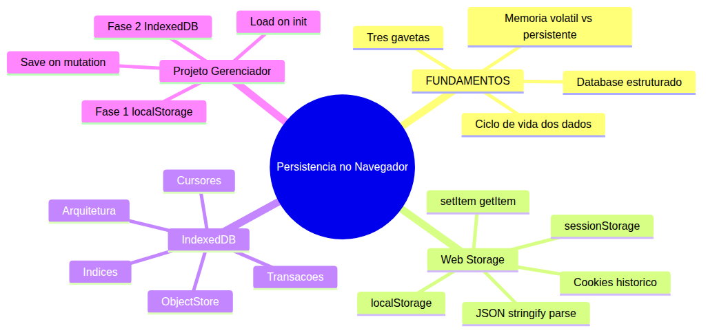
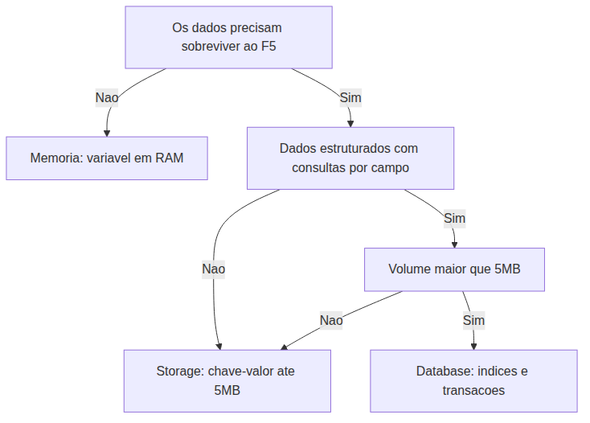
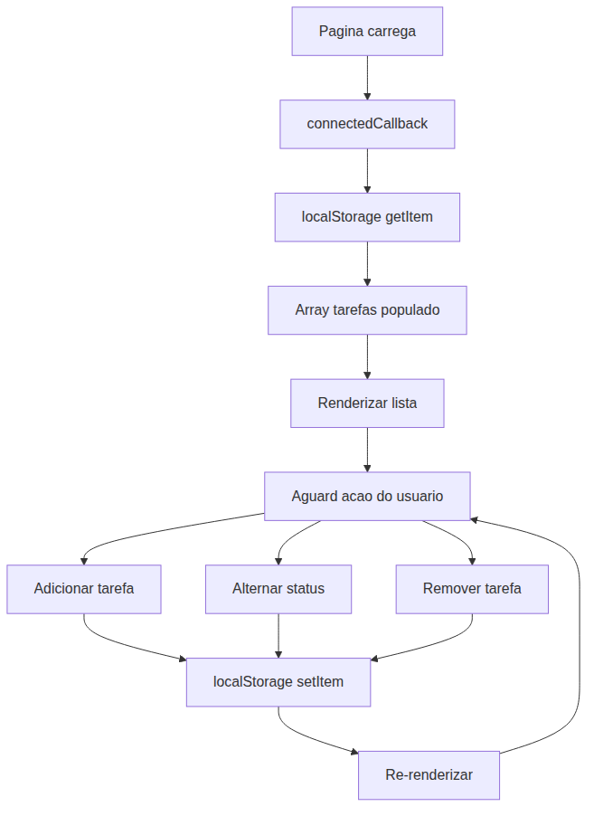
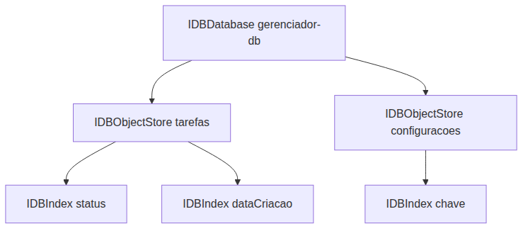
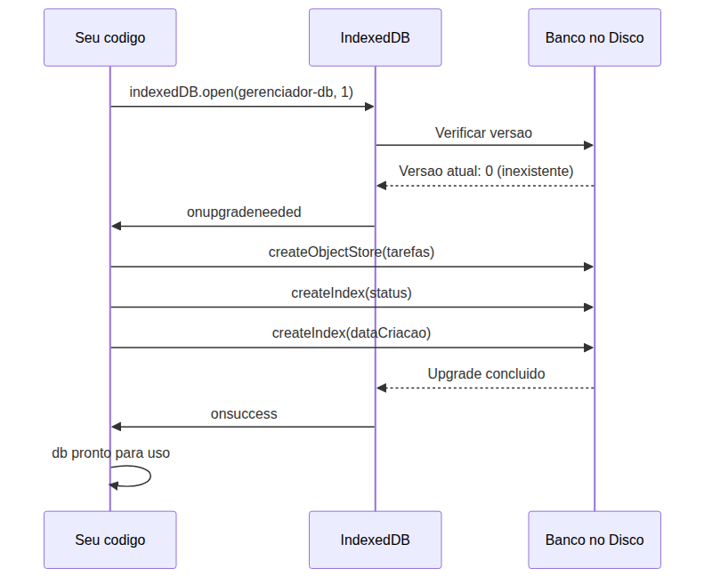
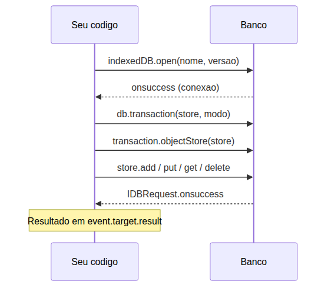
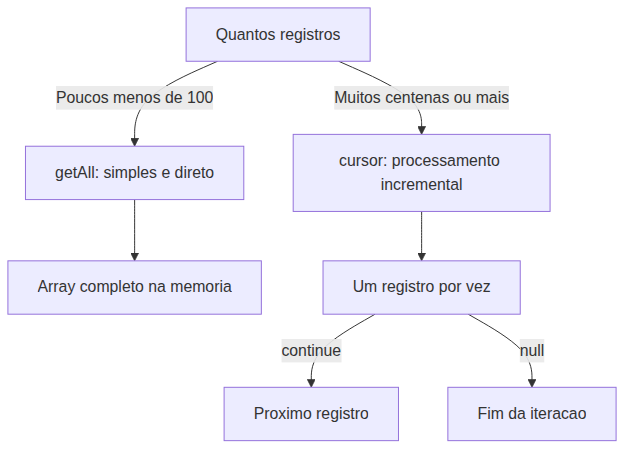

# JavaScript — Do Zero ao Profissional — Aula 23

## Web Storage + IndexedDB — Persistência de Dados no Navegador

**Duração estimada:** 100 minutos (50 de leitura + 50 de prática)

**Nível:** Intermediário

**Pré-requisitos:** Aula 18 (DOM), Aula 19 (Eventos), Aula 20 (Shadow DOM), Aula 21 (Formulários), Aula 22 (File API)

---

## Objetivos de Aprendizagem

Ao final desta aula, você será capaz de:

- [ ] **Explicar** por que dados em memória se perdem ao recarregar a página
- [ ] **Distinguir** os três níveis de persistência: memória, storage e database
- [ ] **Utilizar** localStorage com `setItem`, `getItem`, `removeItem`, `clear` e o padrão JSON
- [ ] **Comparar** localStorage e sessionStorage quanto ao ciclo de vida
- [ ] **Abrir** um banco IndexedDB com `indexedDB.open()`, criar ObjectStore e índices em `onupgradeneeded`
- [ ] **Executar** operações CRUD no IndexedDB com transações e callbacks
- [ ] **Consultar** dados com `IDBIndex` e `IDBCursor`
- [ ] **Decidir** entre localStorage e IndexedDB com base em critérios práticos
- [ ] **Migrar** o Gerenciador de Tarefas de localStorage para IndexedDB

---

## Como Usar Esta Aula

Esta aula está dividida em duas partes. A **primeira parte** (conceitual) explica por que dados precisam de persistência e quais camadas existem. A **segunda parte** aplica esses conceitos com as APIs do navegador: primeiro localStorage (solução imediata), depois IndexedDB (solução robusta).

Você encontrará seções **Mão na Massa** ao longo do caminho — pare e faça cada uma antes de continuar. Os **Quick Checks** verificam se você entendeu antes de avançar. Ao final, o arquivo separado **Questões de Aprendizagem** traz as tarefas de checkpoint.

| Etapa | Atividade | Tempo |
|---|---|---|
| Parte 1 | Ciclo de vida dos dados | 15 min |
| Parte 2A | localStorage + sessionStorage | 25 min |
| Parte 2B | IndexedDB: arquitetura e abertura | 25 min |
| Parte 2C | CRUD com IndexedDB + migração | 25 min |
| Final | Quiz + Exercícios + Revisão | 10 min |

---

## Mapa Mental





> *Cada ramo do mapa representa um conceito que você vai dominar. O fio condutor é a evolução natural: dados em memória são frágeis, storage resolve a fragilidade, database resolve a estruturação.*

---

## Recapitulação das Aulas 17 a 21

Antes de mergulhar em persistência, veja onde seu Gerenciador de Tarefas está hoje:

| Aula | Conceito | Onde aparece nesta aula |
|---|---|---|
| Aula 18 | DOM e Custom Elements | O Gerenciador usa `<e-tarefa>`, `<e-form-tarefa>`, `<e-lista>` com Custom Elements |
| Aula 19 | Eventos e ciclo de vida | `connectedCallback` é o ponto de inicialização — carregar dados do storage quando o componente monta |
| Aula 20 | Shadow DOM e templates | A UI do Gerenciador renderiza tarefas com Shadow DOM |
| Aula 21 | Formulários e validação | O formulário de nova tarefa dispara `adicionarTarefa()` |
| Aula 22 | File API, JSON.stringify/parse | Export/Import de tarefas com `JSON.stringify` e `JSON.parse` — mesmas funções usadas para persistência |

**Estado do Gerenciador pós-Aula 22:** o app tem um array `tarefas` em memória, CRUD completo, Export/Import funcional. Mas ao recarregar a página (F5), **todos os dados se perdem**. Esta aula resolve exatamente isso.

---

**FUNDAMENTOS: O Ciclo de Vida dos Dados — Por Que e Onde Persistir**

> *Os conceitos desta seção são universais — valem para qualquer aplicação, em qualquer plataforma, independentemente da linguagem. Nenhuma API de navegador é mencionada aqui. O foco é entender por que a persistência existe antes de aprender como implementá-la.*

---

## 1. O Ciclo de Vida dos Dados no Navegador

Você já passou por isto: passa 20 minutos organizando suas tarefas no Gerenciador, adiciona descrições, marca prioridades, e então — sem querer — aperta F5. A página recarrega e **tudo desaparece**.

Se você está começando a programar, esse momento pode ser frustrante. "O que eu fiz de errado?" — a resposta é: nada. Você não fez nada errado. O problema é que seus dados estavam no lugar errado.

### 1.1. O Choque do F5: Memória Volátil

Quando você declara `let tarefas = [...]`, esse array mora na **memória RAM** do computador, alocada especialmente para a sua página. Enquanto a página está aberta, o motor JavaScript mantém tudo organizado — variáveis, objetos, o estado do seu app.

O que acontece quando você aperta F5?

1. O navegador descarrega a página atual
2. Toda a memória alocada para ela é liberada
3. O motor JavaScript é reiniciado do zero
4. Um novo `let tarefas = [];` é executado — array vazio

É como desligar um computador: a RAM é apagada. Tudo que estava nela desaparece. Se você não salvou em disco, perdeu.

> *Você pode estar pensando: "mas por que o navegador não mantém minhas variáveis entre recarregamentos?" Boa pergunta. Imagine se um site deixasse variáveis de outro site na memória — seria um desastre de segurança. Cada página começa limpa por design.*

### 1.2. As Três Gavetas: Analogia dos Níveis de Persistência

Pense em três tipos de "guarda" no mundo físico:

**Gaveta 1 — Rascunho (Memória):** é o bloco de notas na sua mesa. Você escreve rápido, consulta na hora, mas se o vento bater (F5), o papel voa. O array `tarefas` em memória é seu rascunho.

**Gaveta 2 — Quadro de Avisos (Storage):** você fixa recados na parede usando etiquetas. Cada recado tem um título (a chave) e uma mensagem (o valor). O vento não leva embora — eles ficam. Mas o espaço é limitado: cabem no máximo uns 50 post-its (~5MB). É útil para preferências do usuário, rascunhos de formulário, configurações simples.

**Gaveta 3 — Fichário (Database):** um armário com pastas organizadas, fichas numeradas e um índice alfabético. Você pode buscar qualquer ficha por qualquer critério — "todas as tarefas pendentes", "tarefas criadas em janeiro". Cabe muito mais que o quadro de avisos e é infinitamente mais organizado. Mas precisa de mais cuidado para montar.

Aqui está o segredo: **você vai usar as três gavetas no seu Gerenciador**. A Gaveta 1 (memória) é o array que já existe. A Gaveta 2 (storage) é onde você vai salvar hoje. A Gaveta 3 (database) é onde vai migrar em seguida.

### 1.3. As Três Perguntas para Decidir

Antes de escolher onde guardar seus dados, faça três perguntas:

**Pergunta 1: Os dados precisam sobreviver ao F5?**
- Não → memória (variável) é suficiente
- Sim → você precisa de storage ou database

**Pergunta 2: Os dados são estruturados e preciso consultar por campo específico?**
- Não → storage (chave-valor) resolve
- Sim → database (com índices) é melhor

**Pergunta 3: Qual o volume de dados?**
- Até ~5MB → storage pode bastar
- Mais que isso → database é necessário





> *Percorra o fluxograma com seu Gerenciador: o array de tarefas precisa sobreviver ao F5? Sim. Os dados são estruturados (id, texto, concluida, dataCriacao) e você pode querer consultar por status? Sim. O volume é maior que 5MB? Provavelmente não. O fluxograma mostra que storage é um bom começo, mas database é o destino ideal.*

### 1.4. Para Refletir

Até aqui, você já entendeu que variáveis em memória são voláteis, que existem três níveis de persistência (memória, storage, database), e que a escolha depende de três perguntas. Isso já é MUITO. Respire.

Se algo não ficou claro, releia a seção anterior — não tem problema nenhum voltar. Persistência de dados é um conceito que você vai usar pelo resto da sua carreira. Entender o "por que" agora economiza horas de debugging depois.

### Quick Check 1

**1. O Gerenciador de Tarefas usa um array `tarefas` em memória. O que acontece com esse array quando o usuário aperta F5? Por que?**
**Resposta:** O array desaparece. Quando a página recarrega, o motor JavaScript é reiniciado, toda a memória alocada para a página anterior é liberada, e o código executa `let tarefas = []` novamente. É como desligar um computador — a RAM é apagada.

**2. Você está construindo um app de notas com 3 campos (título, texto, data). Precisa buscar notas por data. Qual camada de persistência é mais adequada? Justifique.**
**Resposta:** Database (IndexedDB). Os dados são estruturados (múltiplos campos), você precisa consultar por um campo específico (data), e provavelmente terá muitas notas. Storage seria limitante porque não permite consultas por campo — você teria que carregar tudo e filtrar em memória, o que é ineficiente.

---

**APLICAÇÃO: Web Storage e IndexedDB no Gerenciador de Tarefas**

> *Agora que você entendeu as três camadas de persistência, vamos implementar cada uma no seu Gerenciador usando as APIs que o navegador oferece. Primeiro, a camada mais simples e imediata: localStorage. Depois, quando as limitações aparecerem, migramos para IndexedDB.*

---

## 2. Web Storage API — localStorage e sessionStorage

A Web Storage API é a Gaveta 2 do mundo digital: um quadro de avisos onde você fixa recados com etiquetas. Cada recado tem uma **chave** (o título da etiqueta) e um **valor** (a mensagem). Tudo fica salvo no disco rígido do computador do usuário, não no servidor.

### 2.1. localStorage — A API Básica

O `localStorage` é um objeto global que o navegador disponibiliza para qualquer página no mesmo domínio (mesmo site). Ele tem quatro métodos principais:

```javascript
// Salvar um valor
localStorage.setItem('nome', 'João');

// Recuperar um valor
const nome = localStorage.getItem('nome'); // "João"

// Remover um valor
localStorage.removeItem('nome');

// Limpar TUDO (use com cuidado!)
localStorage.clear();
```

Veja um exemplo:

```javascript
localStorage.setItem('tema', 'escuro');
localStorage.setItem('idioma', 'pt-BR');

console.log(localStorage.getItem('tema'));   // "escuro"
console.log(localStorage.getItem('idioma')); // "pt-BR"

localStorage.removeItem('idioma');
console.log(localStorage.getItem('idioma')); // null — não existe mais
```

> *Você pode inspecionar o localStorage a qualquer momento: abra o DevTools (F12), vá em Application > Local Storage. Lá você vê, edita e deleta itens manualmente. É uma ferramenta de debugging poderosa.*

### 2.2. A Limitação das Strings e o Padrão JSON

Aqui vem uma pegadinha crucial: **localStorage só armazena strings**.

Se você tentar:

```javascript
const tarefas = [
  { id: 1, texto: 'Estudar JavaScript', concluida: false }
];
localStorage.setItem('tarefas', tarefas);
```

O que será salvo? A string `"[object Object]"` — porque o JavaScript converte o array para string automaticamente, e o resultado não é o que você espera.

Para salvar objetos e arrays, você precisa **serializar** com `JSON.stringify()` e **desserializar** com `JSON.parse()`:

```javascript
// Salvar: array → string JSON
const tarefas = [
  { id: 1, texto: 'Estudar JavaScript', concluida: false },
  { id: 2, texto: 'Praticar exercícios', concluida: true }
];
localStorage.setItem('tarefas', JSON.stringify(tarefas));

// Carregar: string JSON → array
const dados = localStorage.getItem('tarefas');
const tarefasCarregadas = JSON.parse(dados);
console.log(tarefasCarregadas); // Array de objetos
```

E se não houver nada salvo ainda (primeira visita)? `getItem` retorna `null`, e `JSON.parse(null)` retorna `null`, não um array vazio. O padrão seguro é:

```javascript
const dados = localStorage.getItem('tarefas');
const tarefas = dados ? JSON.parse(dados) : [];
```

Ou, de forma mais concisa:

```javascript
const tarefas = JSON.parse(localStorage.getItem('tarefas') || '[]');
```

> *Você se lembra do `JSON.stringify` e `JSON.parse` da Aula 22? Lá você usou para exportar e importar tarefas como arquivo JSON. Aqui o princípio é o mesmo, mas o destino é o disco do navegador, não um arquivo baixado.*

### 2.3. O Padrão Load-on-Init + Save-on-Mutation

Para seu Gerenciador de Tarefas, o padrão é simples:

1. **Ao iniciar** (`connectedCallback`): carregar tarefas do localStorage e popular o array
2. **A cada mutação** (adicionar, alternar, remover): salvar o array atualizado no localStorage

```javascript
class GerenciadorTarefas extends HTMLElement {
  #tarefas = [];

  connectedCallback() {
    // Load-on-init: carregar do localStorage
    const dados = localStorage.getItem('tarefas');
    if (dados) {
      this.#tarefas = JSON.parse(dados);
    }
    this.#renderizar();
  }

  #salvar() {
    localStorage.setItem('tarefas', JSON.stringify(this.#tarefas));
  }

  adicionarTarefa(texto) {
    const nova = {
      id: Date.now(),
      texto,
      concluida: false,
      dataCriacao: new Date().toISOString()
    };
    this.#tarefas.push(nova);
    this.#salvar(); // Save-on-mutation
    this.#renderizar();
  }

  alternarTarefa(id) {
    const tarefa = this.#tarefas.find(t => t.id === id);
    if (tarefa) {
      tarefa.concluida = !tarefa.concluida;
      this.#salvar(); // Save-on-mutation
      this.#renderizar();
    }
  }

  removerTarefa(id) {
    this.#tarefas = this.#tarefas.filter(t => t.id !== id);
    this.#salvar(); // Save-on-mutation
    this.#renderizar();
  }
}
```





> *O ciclo load-on-init + save-on-mutation garante que seus dados nunca fiquem dessincronizados. Cada alteração no array é imediatamente persistida. Se o navegador fechar no meio, a última versão salva está no disco.*

**Mão na Massa 1 — Salvar o Gerenciador em localStorage:**

- [ ] Abra seu `index.html` do Gerenciador
- [ ] No `connectedCallback`, adicione o carregamento: leia `localStorage.getItem('tarefas')`, faça `JSON.parse` e popule `#tarefas`
- [ ] Crie um método privado `#salvarTarefas()` que faz `localStorage.setItem('tarefas', JSON.stringify(this.#tarefas))`
- [ ] Chame `#salvarTarefas()` ao final de `adicionarTarefa()`, `alternarTarefa()` e `removerTarefa()`
- [ ] Teste: adicione 3 tarefas, aperte F5 — as tarefas continuam lá
- [ ] Abra DevTools (F12) > Application > Local Storage e veja o array salvo como string JSON

**Verificação:** Se ao recarregar a página suas tarefas ainda estão lá, o localStorage está funcionando.

### 2.4. sessionStorage — Mesma API, Ciclo de Vida Diferente

O `sessionStorage` é idêntico ao `localStorage` na API, mas com uma diferença crucial no ciclo de vida:

```javascript
// Exatamente os mesmos métodos
sessionStorage.setItem('rascunho', 'texto parcial');
sessionStorage.getItem('rascunho');
sessionStorage.removeItem('rascunho');
sessionStorage.clear();
```

A diferença:

| Característica | localStorage | sessionStorage |
|---|---|---|
| Sobrevive ao F5 | Sim | Sim |
| Sobrevive ao fechar a aba | Sim | **Não** |
| Sobrevive ao fechar o navegador | Sim | **Não** |
| Escopo | Todas as abas do mesmo domínio | Apenas a aba atual |
| Capacidade | ~5-10MB por domínio | ~5-10MB por aba |

Casos de uso para sessionStorage:
- Formulários multi-etapa (wizard): se o usuário fechar a aba no meio, o rascunho some (comportamento desejado)
- Dados temporários de navegação entre páginas da mesma aba
- Cache de dados sensíveis que não devem persistir após o usuário sair

```javascript
// Exemplo: formulário de cadastro com 3 etapas
// Etapa 1: dados pessoais
sessionStorage.setItem('cadastro-etapa1', JSON.stringify({ nome: 'João', email: 'joao@email.com' }));

// Etapa 2: endereço (recupera etapa 1 e adiciona etapa 2)
const etapa1 = JSON.parse(sessionStorage.getItem('cadastro-etapa1'));
sessionStorage.setItem('cadastro-etapa2', JSON.stringify({ rua: 'Av. Brasil', numero: 123 }));

// Ao concluir: limpar rascunho
sessionStorage.removeItem('cadastro-etapa1');
sessionStorage.removeItem('cadastro-etapa2');
```

> *Talvez você tenha tentado usar sessionStorage e se perguntou "por que meus dados sumiram?". Isso é completamente normal. O sessionStorage foi feito exatamente para isso — dados que devem sumir quando o usuário fecha a aba. Se você precisa que os dados fiquem, use localStorage.*

### 2.5. Cookies: Menção Histórica

Você pode encontrar `document.cookie` em código legado. Cookies são uma tecnologia anterior ao Web Storage, criada nos anos 90 para que servidores web pudessem "lembrar" de usuários entre requisições.

```javascript
// API arcaica e desconfortável
document.cookie = "nome=João; path=/";
const cookies = document.cookie; // "nome=João; outro=valor"
```

Problemas dos cookies:
- **Limite de ~4KB** por cookie (muito pouco)
- **Enviados em toda requisição HTTP** — mesmo para imagens, CSS, JS — causando overhead de rede
- **API primitiva** — você precisa fazer parsing manual da string

> *Para dados de aplicação no navegador, use Storage ou IndexedDB. Cookies hoje são usados apenas para tokens de autenticação gerenciados pelo servidor. Se você encontrar `document.cookie` em código legado, entenda que é uma tecnologia anterior ao Web Storage — não é o que você deve usar para dados de app.*

### 2.6. Inspecionando pelo DevTools

Uma das melhores ferramentas de debugging é o próprio DevTools:

1. Abra o DevTools (F12)
2. Vá para a aba **Application**
3. No menu esquerdo, expanda **Storage** > **Local Storage**
4. Clique no domínio do seu site (ex: `file://` ou `127.0.0.1`)
5. Você vê a tabela: **Key** | **Value**
6. Pode editar valores clicando duas vezes, ou deletar com botão direito

É extremamente útil para verificar se seus dados estão sendo salvos corretamente, especialmente durante o desenvolvimento.

### Quick Check 2

**1. Por que `localStorage.setItem('tarefas', tarefas)` (sem `JSON.stringify`) não funcionaria como esperado?**
**Resposta:** localStorage só armazena strings. Quando você passa um array/objeto sem `JSON.stringify`, o JavaScript chama `.toString()` automaticamente, resultando em `"[object Object]"` — uma string inútil. Você precisa usar `JSON.stringify` para serializar e `JSON.parse` para desserializar.

**2. Em um formulário de cadastro com 3 etapas (dados pessoais → endereço → confirmação), qual storage você usaria para manter os dados entre as etapas? Por quê?**
**Resposta:** sessionStorage. Os dados são temporários (só importam durante a sessão de cadastro), e se o usuário fechar a aba no meio, é desejável que o rascunho desapareça. Além disso, sessionStorage isola os dados por aba — se o usuário abrir duas abas com cadastros diferentes, eles não se misturam.

---

## 3. IndexedDB — O Banco de Dados do Navegador

O localStorage resolveu o problema imediato: seus dados não somem mais com F5. Mas conforme seu Gerenciador cresce, você percebe limitações:

- **Só strings**: você precisa de `JSON.stringify/parse` toda vez
- **Sem consultas**: quer listar só tarefas pendentes? Precisa carregar TUDO e filtrar em memória
- **Limite de ~5MB**: pode ser suficiente hoje, mas e quando seu app crescer?

IndexedDB é a Gaveta 3 — o fichário organizado. É um banco de dados NoSQL completo, embutido no navegador, que armazena objetos JavaScript estruturados, permite criar índices para consultas rápidas e suporta transações atômicas.

### 3.1. Arquitetura do IndexedDB

Antes de escrever código, entenda os conceitos:





| Componente | Análogo a | Descrição |
|---|---|---|
| `IDBDatabase` | Um banco de dados (arquivo) | Contém uma ou mais ObjectStores |
| `IDBObjectStore` | Uma tabela SQL / coleção NoSQL | Armazena objetos JavaScript |
| `IDBIndex` | Um índice de livro | Permite buscar objetos por um campo específico sem varrer tudo |
| `IDBTransaction` | Uma transação de banco | Toda operação de leitura/escrita acontece dentro de uma |
| `IDBRequest` | Uma "promessa" à moda antiga | Representa uma operação assíncrona; você escuta `onsuccess`/`onerror` |
| `IDBCursor` | Um marcador de página | Itera sobre múltiplos resultados, um por um |

> *Você aprenderá Promises na Aula 27 — uma sintaxe mais moderna para código assíncrono. Mas o padrão de eventos que usaremos aqui (`onsuccess`, `onerror`) é a base do IndexedDB e funciona em qualquer navegador. Callbacks são suficientes para tudo que precisamos.*

### 3.2. Abrindo e Versionando o Banco

Para começar, você abre uma conexão com o banco:

```javascript
const request = indexedDB.open('gerenciador-db', 1);
```

O primeiro parâmetro é o **nome do banco**. O segundo é a **versão** (número inteiro).

O método `indexedDB.open()` retorna um **IDBRequest** — um objeto que representa uma operação assíncrona. Você escuta três eventos:

```javascript
const request = indexedDB.open('gerenciador-db', 1);

request.onupgradeneeded = (event) => {
  // Disparado quando a versão muda (primeira vez ou upgrade)
  // ÚNICO lugar onde se cria/modifica ObjectStores e índices
  const db = event.target.result;
  console.log('Criando/atualizando banco...');
};

request.onsuccess = (event) => {
  // Conexão aberta com sucesso
  const db = event.target.result;
  console.log('Banco aberto com sucesso');
};

request.onerror = (event) => {
  console.error('Erro ao abrir banco:', event.target.error);
};
```

Aqui está uma pegadinha comum: **a conexão `db` só está disponível dentro do `onsuccess`**. Fora dele, `db` não existe. IndexedDB é assíncrono — você não pode usar o banco antes de ser notificado que ele foi aberto.

**onupgradeneeded — o momento da criação**

O evento `onupgradeneeded` é disparado na primeira abertura do banco ou quando você incrementa a versão. Dentro dele, você cria as ObjectStores e índices:

```javascript
request.onupgradeneeded = (event) => {
  const db = event.target.result;

  // Criar ObjectStore 'tarefas' com chave primária 'id'
  const store = db.createObjectStore('tarefas', { keyPath: 'id' });

  // Criar índices para consultas rápidas
  store.createIndex('status', 'concluida', { unique: false });
  store.createIndex('dataCriacao', 'dataCriacao', { unique: false });
};
```





### 3.3. Versionamento e Migração de Esquema

A versão do banco controla a estrutura das suas stores. Se você precisar adicionar um novo índice ou store:

```javascript
// Aumente a versão: 1 → 2
const request = indexedDB.open('gerenciador-db', 2);

request.onupgradeneeded = (event) => {
  const db = event.target.result;

  // Verificar se a store já existe (pode ser um upgrade, não primeira vez)
  if (!db.objectStoreNames.contains('tarefas')) {
    const store = db.createObjectStore('tarefas', { keyPath: 'id' });
    store.createIndex('status', 'concluida', { unique: false });
    store.createIndex('dataCriacao', 'dataCriacao', { unique: false });
  } else {
    // Store já existe — só adicionar novos índices
    const transaction = event.target.transaction;
    const store = transaction.objectStore('tarefas');
    if (!store.indexNames.contains('prioridade')) {
      store.createIndex('prioridade', 'prioridade', { unique: false });
    }
  }
};
```

> *Lembre-se: `onupgradeneeded` é o ÚNICO lugar onde você pode criar ou modificar ObjectStores. Se você tentar `db.createObjectStore()` fora desse evento, receberá um erro. Isso é uma proteção do IndexedDB para garantir que a estrutura do banco seja sempre consistente.*

**Mão na Massa 2 — Abrir banco e criar estrutura:**

- [ ] Escreva a função `abrirBanco()` que chama `indexedDB.open('gerenciador-db', 1)`
- [ ] No `onupgradeneeded`: crie ObjectStore `tarefas` com `keyPath: 'id'`
- [ ] Crie índice `status` sobre o campo `concluida`
- [ ] Crie índice `dataCriacao` sobre o campo `dataCriacao`
- [ ] No `onsuccess`: armazene a conexão `db` em uma variável e exiba "Banco aberto com sucesso" no console
- [ ] No `onerror`: exiba o erro no console
- [ ] Teste: abra DevTools > Application > IndexedDB — veja o banco `gerenciador-db` com a store `tarefas` e os índices

**Verificação:** Você deve ver no DevTools: `gerenciador-db` > `tarefas` (keyPath: id) > índices: `status`, `dataCriacao`

### Quick Check 3

**1. Por que a criação de ObjectStores e índices só pode acontecer dentro do `onupgradeneeded`?**
**Resposta:** Porque IndexedDB precisa garantir a integridade estrutural do banco. Se qualquer código pudesse criar/modificar stores a qualquer momento, duas abas abertas simultaneamente poderiam conflitar. O `onupgradeneeded` é um momento sincronizado — ocorre uma vez, antes da conexão ser estabelecida, e garante que todos os clientes vejam a mesma estrutura.

**2. Se você esquecer de incrementar a versão ao adicionar um novo índice, o que acontece?**
**Resposta:** O novo índice nunca será criado. O navegador compara a versão solicitada com a versão atual do banco. Se forem iguais, `onupgradeneeded` não dispara, e a estrutura permanece a mesma. Aumentar a versão é o gatilho para migrações de esquema.

---

## 4. CRUD com IndexedDB — Transações, Cursores e Consultas

Agora que você tem um banco com uma ObjectStore e índices, vamos fazer operações de verdade. O padrão é sempre o mesmo:





### 4.1. O Padrão de Transação

Toda operação no IndexedDB acontece dentro de uma transação. Pense em transação como uma "caixa" que agrupa operações: ou todas acontecem, ou nenhuma.

```javascript
// 1. Abrir conexão com o banco
// (assumindo que db já está disponível do onsuccess)

// 2. Criar transação
const transaction = db.transaction(['tarefas'], 'readwrite');
//                                   ^stores       ^modo

// 3. Acessar a ObjectStore
const store = transaction.objectStore('tarefas');

// 4. Executar operação
const request = store.add({ id: 1, texto: 'Estudar', concluida: false });

// 5. Escutar resultado
request.onsuccess = () => {
  console.log('Tarefa adicionada com sucesso');
};

request.onerror = (event) => {
  console.error('Erro ao adicionar:', event.target.error);
};

// 6. (Opcional) escutar conclusão da transação
transaction.oncomplete = () => {
  console.log('Transação concluída');
};
```

Dois modos de transação:
- **`'readonly'`**: apenas leitura. Pode ter várias simultâneas
- **`'readwrite'`**: leitura e escrita. Apenas uma por store por vez

> **Atenção:** transações têm **autocommit** — elas fecham automaticamente quando o event loop fica vazio. Isso significa que você não pode usar a store depois de um `setTimeout` ou dentro de um loop assíncrono separado. A transação já terá fechado. Planeje suas operações dentro de uma única transação.

### 4.2. Operações de Escrita (readwrite)

**Adicionar (`add`)**: insere um novo registro. Falha se a chave já existir.

```javascript
function adicionarTarefa(db, tarefa) {
  const transaction = db.transaction(['tarefas'], 'readwrite');
  const store = transaction.objectStore('tarefas');

  const request = store.add(tarefa);

  request.onsuccess = () => {
    console.log('Tarefa adicionada:', tarefa.id);
  };

  request.onerror = (event) => {
    console.error('Erro ao adicionar (chave duplicada?):', event.target.error);
  };
}
```

**Atualizar/Inserir (`put`)**: se a chave existir, atualiza; se não existir, insere (upsert).

```javascript
function alternarTarefa(db, id) {
  const transaction = db.transaction(['tarefas'], 'readwrite');
  const store = transaction.objectStore('tarefas');

  // Primeiro, buscar a tarefa atual
  const getRequest = store.get(id);

  getRequest.onsuccess = (event) => {
    const tarefa = event.target.result;
    tarefa.concluida = !tarefa.concluida;

    // Depois, salvar a versão alterada com put
    const putRequest = store.put(tarefa);

    putRequest.onsuccess = () => {
      console.log('Tarefa atualizada:', id);
    };
  };
}
```

**Remover (`delete`)**: remove por chave primária.

```javascript
function removerTarefa(db, id) {
  const transaction = db.transaction(['tarefas'], 'readwrite');
  const store = transaction.objectStore('tarefas');

  const request = store.delete(id);

  request.onsuccess = () => {
    console.log('Tarefa removida:', id);
  };
}
```

**Limpar tudo (`clear`)**: remove TODOS os registros da store.

```javascript
function limparTarefas(db) {
  const transaction = db.transaction(['tarefas'], 'readwrite');
  const store = transaction.objectStore('tarefas');

  const request = store.clear();

  request.onsuccess = () => {
    console.log('Todas as tarefas foram removidas');
  };
}
```

### 4.3. Operações de Leitura (readonly)

**Buscar por chave (`get`)**: retorna UM registro.

```javascript
function buscarTarefa(db, id) {
  const transaction = db.transaction(['tarefas'], 'readonly');
  const store = transaction.objectStore('tarefas');

  const request = store.get(id);

  request.onsuccess = (event) => {
    const tarefa = event.target.result;
    if (tarefa) {
      console.log('Tarefa encontrada:', tarefa);
    } else {
      console.log('Tarefa não encontrada');
    }
  };
}
```

**Buscar todos (`getAll`)**: retorna TODOS os registros em um array.

```javascript
function carregarTodasTarefas(db) {
  const transaction = db.transaction(['tarefas'], 'readonly');
  const store = transaction.objectStore('tarefas');

  const request = store.getAll();

  request.onsuccess = (event) => {
    const tarefas = event.target.result;
    console.log(`${tarefas.length} tarefas carregadas`);
  };
}
```

**Contar registros (`count`)**:

```javascript
function contarTarefas(db) {
  const transaction = db.transaction(['tarefas'], 'readonly');
  const store = transaction.objectStore('tarefas');

  const request = store.count();

  request.onsuccess = (event) => {
    console.log('Total de tarefas:', event.target.result);
  };
}
```

### 4.4. Consultas com Índices (IDBIndex)

Esta é a principal vantagem do IndexedDB sobre o localStorage: consultar por campo sem precisar carregar tudo.

```javascript
// Buscar todas as tarefas concluídas
function buscarConcluidas(db) {
  const transaction = db.transaction(['tarefas'], 'readonly');
  const store = transaction.objectStore('tarefas');
  const index = store.index('status'); // índice criado no onupgradeneeded

  const request = index.getAll(true); // true = concluida

  request.onsuccess = (event) => {
    const concluidas = event.target.result;
    console.log(`${concluidas.length} tarefas concluídas`);
  };
}

// Buscar todas as pendentes
function buscarPendentes(db) {
  const transaction = db.transaction(['tarefas'], 'readonly');
  const store = transaction.objectStore('tarefas');
  const index = store.index('status');

  const request = index.getAll(false); // false = pendente (não concluída)

  request.onsuccess = (event) => {
    const pendentes = event.target.result;
    console.log(`${pendentes.length} tarefas pendentes`);
  };
}
```

Compare com localStorage:

```javascript
// localStorage: carregar TUDO e filtrar em memória
const todas = JSON.parse(localStorage.getItem('tarefas') || '[]');
const pendentes = todas.filter(t => !t.concluida);

// IndexedDB: consultar direto no banco
// const pendentes = index.getAll(false) — mais rápido, carrega só o que precisa
```

> *Para 5 tarefas, a diferença é imperceptível. Para 5.000 tarefas, o IndexedDB é drasticamente mais rápido porque não precisa carregar todos os objetos da memória para depois filtrar. O índice faz a filtragem no "banco", antes de transferir os dados.*

### 4.5. Cursores (IDBCursor)

O `getAll()` é simples e direto, mas para volumes muito grandes ou processamento incremental, use `IDBCursor`:

```javascript
function processarTarefasEmLote(db) {
  const transaction = db.transaction(['tarefas'], 'readonly');
  const store = transaction.objectStore('tarefas');

  // Abrir um cursor que percorre todos os registros
  const request = store.openCursor();

  request.onsuccess = (event) => {
    const cursor = event.target.result;

    if (cursor) {
      // cursor.value é o objeto atual
      console.log('Processando tarefa:', cursor.value.texto);

      // Avançar para o próximo registro
      cursor.continue();
    } else {
      // cursor é null quando não há mais registros
      console.log('Todas as tarefas processadas');
    }
  };
}
```

**Cursor com range**: buscar apenas registros em um intervalo.

```javascript
// Tarefas criadas entre duas datas
const inicio = new Date('2026-01-01');
const fim = new Date('2026-06-30');
const range = IDBKeyRange.bound(inicio, fim);

const transaction = db.transaction(['tarefas'], 'readonly');
const store = transaction.objectStore('tarefas');
const index = store.index('dataCriacao');

const request = index.openCursor(range);

request.onsuccess = (event) => {
  const cursor = event.target.result;
  if (cursor) {
    console.log('Tarefa do período:', cursor.value);
    cursor.continue();
  }
};
```





> *Use `getAll()` para consultas simples com poucos resultados. Use `openCursor()` quando precisar processar muitos registros um de cada vez (ex: exportar em lote, transformar dados, paginar).*

### 4.6. Migrando o Gerenciador de localStorage para IndexedDB

Agora, o grande momento: migrar seu Gerenciador do localStorage para IndexedDB. Você vai substituir o padrão `setItem/getItem` por transações IndexedDB.

**Passo 1: Abrir o banco e preparar a conexão**

```javascript
class GerenciadorTarefas extends HTMLElement {
  #tarefas = [];
  #db = null; // Referência ao banco

  connectedCallback() {
    this.#abrirBanco();
  }

  #abrirBanco() {
    const request = indexedDB.open('gerenciador-db', 1);

    request.onupgradeneeded = (event) => {
      const db = event.target.result;

      if (!db.objectStoreNames.contains('tarefas')) {
        const store = db.createObjectStore('tarefas', { keyPath: 'id' });
        store.createIndex('status', 'concluida', { unique: false });
        store.createIndex('dataCriacao', 'dataCriacao', { unique: false });
      }
    };

    request.onsuccess = (event) => {
      this.#db = event.target.result;
      this.#carregarTarefas();
    };

    request.onerror = (event) => {
      console.error('Erro fatal ao abrir banco:', event.target.error);
    };
  }
}
```

**Passo 2: Carregar tarefas (load-on-init)**

```javascript
#carregarTarefas() {
  const transaction = this.#db.transaction(['tarefas'], 'readonly');
  const store = transaction.objectStore('tarefas');
  const request = store.getAll();

  request.onsuccess = (event) => {
    this.#tarefas = event.target.result || [];
    this.#renderizar();
    console.log(`${this.#tarefas.length} tarefas carregadas`);
  };

  request.onerror = (event) => {
    console.error('Erro ao carregar tarefas:', event.target.error);
  };
}
```

**Passo 3: Salvar a cada mutação**

```javascript
adicionarTarefa(texto) {
  const nova = {
    id: Date.now(),
    texto,
    concluida: false,
    dataCriacao: new Date().toISOString()
  };

  const transaction = this.#db.transaction(['tarefas'], 'readwrite');
  const store = transaction.objectStore('tarefas');
  const request = store.add(nova);

  request.onsuccess = () => {
    this.#tarefas.push(nova);
    this.#renderizar();
  };

  request.onerror = (event) => {
    console.error('Erro ao adicionar tarefa:', event.target.error);
  };
}

alternarTarefa(id) {
  const transaction = this.#db.transaction(['tarefas'], 'readwrite');
  const store = transaction.objectStore('tarefas');

  // Buscar primeiro
  const getRequest = store.get(id);

  getRequest.onsuccess = (event) => {
    const tarefa = event.target.result;
    if (!tarefa) return;

    tarefa.concluida = !tarefa.concluida;

    // Atualizar com put
    const putRequest = store.put(tarefa);

    putRequest.onsuccess = () => {
      const index = this.#tarefas.findIndex(t => t.id === id);
      if (index !== -1) {
        this.#tarefas[index].concluida = tarefa.concluida;
      }
      this.#renderizar();
    };
  };
}

removerTarefa(id) {
  const transaction = this.#db.transaction(['tarefas'], 'readwrite');
  const store = transaction.objectStore('tarefas');
  const request = store.delete(id);

  request.onsuccess = () => {
    this.#tarefas = this.#tarefas.filter(t => t.id !== id);
    this.#renderizar();
  };
}
```

**Passo 4: Consultar por status usando índice**

```javascript
filtrarPorStatus(concluida) {
  const transaction = this.#db.transaction(['tarefas'], 'readonly');
  const store = transaction.objectStore('tarefas');
  const index = store.index('status');
  const request = index.getAll(concluida); // true ou false

  request.onsuccess = (event) => {
    const filtradas = event.target.result;
    this.#renderizarLista(filtradas); // renderizar apenas as filtradas
  };
}
```

**Passo 5: Remover o código de localStorage**

Após confirmar que o IndexedDB funciona corretamente, remova:
- As chamadas `localStorage.setItem`
- O `localStorage.getItem` do `connectedCallback`
- O método `#salvarTarefas()` (se não for mais usado)

> *Manter ambos os sistemas de persistência simultaneamente causa duplicação de dados e comportamento imprevisível. Faça a migração completa de uma vez.*

**Mão na Massa 3 — Migrar Gerenciador para IndexedDB:**

- [ ] Substitua `#salvarTarefas()` por operações IndexedDB: cada método (adicionar, alternar, remover) faz sua própria transação
- [ ] No `connectedCallback`: chame `#abrirBanco()`, que no `onsuccess` chama `#carregarTarefas()` que usa `getAll()` e renderiza
- [ ] Implemente um seletor/botão "Pendentes" que chama `filtrarPorStatus(false)` usando o índice `status`
- [ ] Teste: adicione 5 tarefas, alterne 2 como concluídas, aperte F5 — os 5 itens voltam com os status corretos
- [ ] Inspecione: DevTools > Application > IndexedDB > gerenciador-db > tarefas — veja os registros
- [ ] Remova o código de localStorage antigo

**Verificação final:** Seu Gerenciador agora sobrevive a F5, lembra o status de cada tarefa, e consegue filtrar por concluídas/pendentes consultando direto no banco.

### Quick Check 4

**1. Qual a diferença prática entre `store.add()` e `store.put()`? Em qual situação cada um é mais adequado?**
**Resposta:** `add()` insere um novo registro e lança erro se a chave já existir. `put()` insere ou atualiza (upsert) — se a chave existir, sobrescreve. Use `add()` para criar novos registros onde você quer garantir que não há duplicatas. Use `put()` para atualizar registros existentes ou quando não importa se o registro já existe (ex: salvar configurações sempre com a mesma chave).

**2. Por que `store.index('status').getAll('concluida')` é mais eficiente que `store.getAll()` seguido de `.filter()` em memória?**
**Resposta:** Porque o índice faz a filtragem no próprio banco de dados, antes de transferir os resultados para a memória. Com `getAll()` + `filter()`, você carrega TODOS os registros (centenas, milhares) na memória para depois filtrar — desperdiçando memória e tempo de processamento. O índice retorna apenas os registros que correspondem ao critério, economizando transferência e memória.

---

## Autoavaliação: Quiz Rápido

**1. Qual dos seguintes NÃO é um método do localStorage?**
a) `setItem()` b) `getItem()` c) `removeItem()` d) `deleteItem()`
**Resposta:** d) `deleteItem()`. O método correto é `removeItem()`.

**2. O que `JSON.parse(localStorage.getItem('chave') || '[]')` faz?**
**Resposta:** Tenta recuperar o valor salvo em 'chave'. Se não existir (null), usa '[]' como fallback. Converte a string JSON para array JavaScript.

**3. Qual a diferença entre `sessionStorage` e `localStorage`?**
**Resposta:** O sessionStorage persiste apenas durante a sessão da aba — os dados somem quando o usuário FECHA a ABA. O localStorage persiste indefinidamente, mesmo após fechar o navegador.

**4. Qual evento do IndexedDB é usado para criar ObjectStores e índices?**
a) `onsuccess` b) `onerror` c) `onupgradeneeded` d) `onversionchange`
**Resposta:** c) `onupgradeneeded`. É o único momento em que a estrutura do banco pode ser alterada.

**5. O que retorna `store.get(chave).onsuccess`?**
**Resposta:** O objeto armazenado com aquela chave, acessível via `event.target.result`. Retorna `undefined` se a chave não existir.

**6. Quando você deve escolher IndexedDB em vez de localStorage?**
**Resposta:** Quando precisa de dados estruturados com consultas por campo (mais que chave-valor), quando o volume excede ~5MB, ou quando precisa de transações atômicas.

---

## Mão na Massa 4: Exercícios Graduados

**Exercício 1 (Fácil) — Preferências do usuário**

Crie uma função `salvarPreferencias(chave, valor)` que salva uma preferência no localStorage, e `carregarPreferencias(chave)` que recupera. As preferências podem ser strings, números, booleanos ou objetos. Use o padrão JSON.

```javascript
function salvarPreferencias(chave, valor) {
  // Seu código aqui
}

function carregarPreferencias(chave) {
  // Seu código aqui
}
```

**Gabarito:**

```javascript
function salvarPreferencias(chave, valor) {
  localStorage.setItem(chave, JSON.stringify(valor));
}

function carregarPreferencias(chave) {
  const dados = localStorage.getItem(chave);
  return dados ? JSON.parse(dados) : null;
}

// Teste
salvarPreferencias('tema', 'escuro');
salvarPreferencias('notificacoes', { ativo: true, horario: '08:00' });

console.log(carregarPreferencias('tema')); // "escuro"
console.log(carregarPreferencias('notificacoes')); // { ativo: true, horario: '08:00' }
```

**Exercício 2 (Médio) — CRUD IndexedDB para Catálogo**

Implemente funções para gerenciar um catálogo de livros no IndexedDB. Crie um banco `biblioteca-db` com ObjectStore `livros` (keyPath: 'isbn') e índices 'autor' e 'ano'. Implemente:

- `adicionarLivro(db, livro)` — adiciona novo livro
- `buscarLivro(db, isbn)` — busca por ISBN
- `listarLivrosDoAutor(db, autor)` — usa o índice 'autor' com `getAll()`
- `removerLivro(db, isbn)` — remove por ISBN

```javascript
// Estrutura esperada do livro
const livro = {
  isbn: '978-3-16-148410-0',
  titulo: 'JavaScript Avançado',
  autor: 'Maria Silva',
  ano: 2024
};
```

**Gabarito:**

```javascript
const request = indexedDB.open('biblioteca-db', 1);

request.onupgradeneeded = (event) => {
  const db = event.target.result;
  const store = db.createObjectStore('livros', { keyPath: 'isbn' });
  store.createIndex('autor', 'autor', { unique: false });
  store.createIndex('ano', 'ano', { unique: false });
};

request.onsuccess = (event) => {
  const db = event.target.result;
  console.log('Banco biblioteca aberto');
  // Agora você pode usar as funções abaixo
};

function adicionarLivro(db, livro) {
  const transaction = db.transaction(['livros'], 'readwrite');
  const store = transaction.objectStore('livros');
  const request = store.add(livro);

  request.onsuccess = () => console.log('Livro adicionado:', livro.titulo);
  request.onerror = (event) => console.error('Erro:', event.target.error);
}

function buscarLivro(db, isbn) {
  const transaction = db.transaction(['livros'], 'readonly');
  const store = transaction.objectStore('livros');
  const request = store.get(isbn);

  request.onsuccess = (event) => {
    const livro = event.target.result;
    console.log('Livro encontrado:', livro ? livro.titulo : 'não encontrado');
  };
}

function listarLivrosDoAutor(db, autor) {
  const transaction = db.transaction(['livros'], 'readonly');
  const store = transaction.objectStore('livros');
  const index = store.index('autor');
  const request = index.getAll(autor);

  request.onsuccess = (event) => {
    const livros = event.target.result;
    console.log(`Livros de ${autor}:`, livros.length);
    livros.forEach(l => console.log(` - ${l.titulo} (${l.ano})`));
  };
}

function removerLivro(db, isbn) {
  const transaction = db.transaction(['livros'], 'readwrite');
  const store = transaction.objectStore('livros');
  const request = store.delete(isbn);

  request.onsuccess = () => console.log('Livro removido:', isbn);
}
```

**Desafio (Difícil) — Filtro por período com cursor**

Usando o banco `biblioteca-db` do exercício anterior, implemente uma função `listarLivrosPorPeriodo(db, anoInicio, anoFim)` que usa `IDBKeyRange.bound()` e `IDBCursor` para listar livros publicados entre dois anos. A saída deve ser exibida no console, ordenada por ano.

**Gabarito:**

```javascript
function listarLivrosPorPeriodo(db, anoInicio, anoFim) {
  const transaction = db.transaction(['livros'], 'readonly');
  const store = transaction.objectStore('livros');
  const index = store.index('ano');

  console.log(`Livros entre ${anoInicio} e ${anoFim}:`);

  const range = IDBKeyRange.bound(anoInicio, anoFim);
  const request = index.openCursor(range);

  request.onsuccess = (event) => {
    const cursor = event.target.result;

    if (cursor) {
      const livro = cursor.value;
      console.log(`  ${livro.ano} - ${livro.titulo} (${livro.autor})`);
      cursor.continue();
    } else {
      console.log('--- Fim da listagem ---');
    }
  };
}

// Teste
// (assumindo que db já foi aberto via indexedDB.open)
// adicionarLivro(db, { isbn: '001', titulo: 'Livro A', autor: 'João', ano: 2020 });
// adicionarLivro(db, { isbn: '002', titulo: 'Livro B', autor: 'Maria', ano: 2021 });
// adicionarLivro(db, { isbn: '003', titulo: 'Livro C', autor: 'João', ano: 2023 });
// listarLivrosPorPeriodo(db, 2020, 2022);
// Saída esperada:
//   Livros entre 2020 e 2022:
//   2020 - Livro A (João)
//   2021 - Livro B (Maria)
//   --- Fim da listagem ---
```

---

## Resumo da Aula

### Os Conceitos Fundamentais

1. **Dados em memória são voláteis**: variáveis JavaScript existem apenas enquanto a página está carregada. F5 = tudo perdido.
2. **Três níveis de persistência**: memória (volátil), storage (chave-valor persistente), database (estruturado com índices).
3. **localStorage**: API simples de chave-valor, apenas strings, limite ~5MB. Use `JSON.stringify/parse` para objetos.
4. **sessionStorage**: mesma API, mas os dados somem ao fechar a aba.
5. **IndexedDB**: banco NoSQL embutido no navegador. Armazena objetos, suporta índices e transações.
6. **Padrão event-based**: IndexedDB usa `onsuccess`/`onerror` (não Promises). Callbacks são suficientes.
7. **Transações**: toda operação IndexedDB acontece dentro de uma transação (`readonly` ou `readwrite`).
8. **Índices**: permitem consultar por campo específico sem carregar todos os registros.
9. **Load-on-init + Save-on-mutation**: padrão para manter dados sincronizados entre memória e storage/database.

### O Que Você Construiu Hoje

- [x] Seu Gerenciador salva tarefas no localStorage
- [x] Seu Gerenciador carrega tarefas ao iniciar e persiste a cada mutação
- [x] Você abriu um banco IndexedDB com ObjectStore e índices
- [x] Você migrou o Gerenciador de localStorage para IndexedDB
- [x] Seu Gerenciador consulta tarefas por status usando índice IndexedDB
- [x] Seu Gerenciador sobrevive a F5 com todos os dados intactos

---

## Próxima Aula

**Aula 24: Intersection Observer + Resize Observer + Mutation Observer**

Você aprendeu a armazenar dados localmente. Agora, e se você pudesse reagir a mudanças na página sem ficar checando manualmente? Os Observers do navegador permitem detectar quando um elemento aparece na tela, quando um elemento muda de tamanho, ou quando o DOM é modificado — tudo de forma eficiente, sem loops de verificação. Seu Gerenciador vai ganhar lazy loading, scroll infinito e resposta a mudanças na interface.

---

## Referências

### Documentação Oficial (MDN)

- [Web Storage API](https://developer.mozilla.org/en-US/docs/Web/API/Web_Storage_API)
- [localStorage](https://developer.mozilla.org/en-US/docs/Web/API/Window/localStorage)
- [sessionStorage](https://developer.mozilla.org/en-US/docs/Web/API/Window/sessionStorage)
- [IndexedDB API](https://developer.mozilla.org/en-US/docs/Web/API/IndexedDB_API)
- [Using IndexedDB](https://developer.mozilla.org/en-US/docs/Web/API/IndexedDB_API/Using_IndexedDB)
- [IDBFactory (indexedDB.open)](https://developer.mozilla.org/en-US/docs/Web/API/IDBFactory)
- [IDBDatabase](https://developer.mozilla.org/en-US/docs/Web/API/IDBDatabase)
- [IDBObjectStore](https://developer.mozilla.org/en-US/docs/Web/API/IDBObjectStore)
- [IDBIndex](https://developer.mozilla.org/en-US/docs/Web/API/IDBIndex)
- [IDBRequest](https://developer.mozilla.org/en-US/docs/Web/API/IDBRequest)
- [IDBTransaction](https://developer.mozilla.org/en-US/docs/Web/API/IDBTransaction)
- [IDBCursor](https://developer.mozilla.org/en-US/docs/Web/API/IDBCursor)
- [JSON.stringify](https://developer.mozilla.org/en-US/docs/Web/JavaScript/Reference/Global_Objects/JSON/stringify)
- [JSON.parse](https://developer.mozilla.org/en-US/docs/Web/JavaScript/Reference/Global_Objects/JSON/parse)

### Artigos para Aprofundamento

- [IndexedDB: o banco de dados do navegador (dev.to)](https://dev.to/) — busca por "IndexedDB browser database"
- [localStorage vs IndexedDB: quando usar cada um](https://javascript.info/indexeddb) — capítulo em português no javascript.info

---

## FAQ

**P: Meus dados do localStorage sumiram do nada. O que pode ter acontecido?**
R: O usuário pode ter limpado os dados do navegador (Configurações > Privacidade > Limpar dados). localStorage é por domínio — se o usuário limpar, os dados vão embora. IndexedDB também está sujeito a isso, mas é menos comum o usuário limpar "Dados de sites".

**P: localStorage tem limite de segurança?**
R: Sim, ~5-10MB por domínio, dependendo do navegador. Se você tentar exceder, o navegador lança uma exceção `QuotaExceededError`. IndexedDB tem limites maiores (~50MB+), mas varia por navegador.

**P: Posso usar localStorage em modo anônimo/privado?**
R: Depende do navegador. Alguns permitem, outros criam um storage temporário que é limpo ao fechar a janela. Nunca confie em dados críticos no modo anônimo.

**P: Por que não consigo criar uma ObjectStore fora do `onupgradeneeded`?**
R: O IndexedDB exige que toda modificação estrutural (criar/alterar stores e índices) aconteça dentro de `onupgradeneeded` por segurança e consistência. Se você tentar `db.createObjectStore()` em qualquer outro lugar, receberá `InvalidStateError`. Planeje toda a estrutura do banco antes de abrir a conexão.

**P: Transação IndexedDB fecha sozinha? Preciso chamar algum método?**
R: Sim, transações têm autocommit. Elas fecham automaticamente quando todas as operações pendentes terminam e o event loop fica vazio. Não há `commit()` explícito. Se você tentar usar a store depois que a transação fechou (ex: dentro de um `setTimeout`), receberá `TransactionInactiveError`.

**P: O que acontece se duas abas tentarem escrever no IndexedDB ao mesmo tempo?**
R: IndexedDB lida com concorrência entre abas automaticamente. Se uma transação `readwrite` estiver em andamento, outra transação na mesma store aguarda. É seguro. Para cenários mais complexos, existem padrões de locking que você pode explorar.

**P: Vale a pena migrar de localStorage para IndexedDB se meu app é pequeno?**
R: Depende. Se você tem poucos dados e não precisa de consultas por campo, localStorage é suficiente e mais simples. Migre para IndexedDB quando: (1) precisar consultar por campos específicos, (2) seus dados crescerem além de ~5MB, ou (3) quiser transações atômicas para garantir consistência.

**P: Cookies são mais seguros que localStorage?**
R: Não para dados de aplicação. Cookies podem ter flags `HttpOnly` (inacessíveis via JS) e `Secure` (só HTTPS), o que os torna mais seguros para tokens de autenticação. Mas para dados de aplicação que o JavaScript precisa ler, localStorage e IndexedDB são equivalentes em segurança (ambos acessíveis via JS, ambos sujeitos a XSS).

**P: Como debuggo operações IndexedDB?**
R: DevTools > Application > IndexedDB. Lá você vê o banco, as stores, os índices e os registros. Você pode deletar registros manualmente ou limpar o banco inteiro. Também pode usar `console.log` nos callbacks `onsuccess` e `onerror`.

**P: IndexedDB funciona em todos os navegadores?**
R: Sim, todos os navegadores modernos (Chrome, Firefox, Safari, Edge) suportam IndexedDB. A API é padronizada pelo W3C e faz parte da plataforma web desde 2015.

---

## Glossário

| Termo | Definição |
|---|---|
| **Persistência** | Capacidade de dados sobreviverem ao ciclo de vida da aplicação (fechar/reabrir). (Ver seção 1) |
| **Memória volátil** | Dados armazenados em RAM que se perdem quando o processo termina. (Ver seção 1) |
| **localStorage** | API de armazenamento chave-valor que persiste indefinidamente no navegador. (Ver seção 2) |
| **sessionStorage** | API de armazenamento chave-valor que persiste apenas durante a sessão da aba. (Ver seção 2) |
| **Cookie** | Pequeno dado textural armazenado pelo navegador, enviado em toda requisição HTTP. (Ver seção 2) |
| **Serialização** | Processo de converter um objeto/array em string (`JSON.stringify`). (Ver seção 2) |
| **Desserialização** | Processo de converter uma string JSON de volta em objeto/array (`JSON.parse`). (Ver seção 2) |
| **IndexedDB** | Banco de dados NoSQL transacional embutido no navegador. (Ver seção 3) |
| **IDBDatabase** | Representa uma conexão com um banco IndexedDB. (Ver seção 3) |
| **IDBObjectStore** | Análogo a uma tabela ou coleção, armazena objetos JavaScript. (Ver seção 3) |
| **IDBIndex** | Estrutura que permite consultas rápidas por um campo específico. (Ver seção 4) |
| **IDBTransaction** | Escopo que agrupa operações de leitura/escrita, com atomicidade. (Ver seção 4) |
| **IDBRequest** | Objeto que representa uma operação assíncrona, com callbacks `onsuccess`/`onerror`. (Ver seção 4) |
| **IDBCursor** | Iterador para percorrer múltiplos registros um de cada vez. (Ver seção 4) |
| **keyPath** | Campo de um objeto usado como chave primária no IndexedDB. (Ver seção 3) |
| **Autocommit** | Comportamento de transações que fecham automaticamente sem commit explícito. (Ver seção 4) |
| **Upsert** | Operação que insere ou atualiza (put), dependendo se a chave já existe. (Ver seção 4) |
| **Load-on-init** | Padrão de carregar dados do storage/database ao iniciar a aplicação. (Ver seção 2) |
| **Save-on-mutation** | Padrão de salvar dados no storage/database a cada alteração. (Ver seção 2) |
