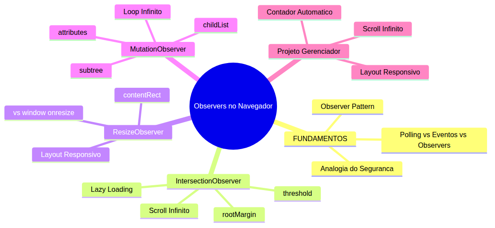
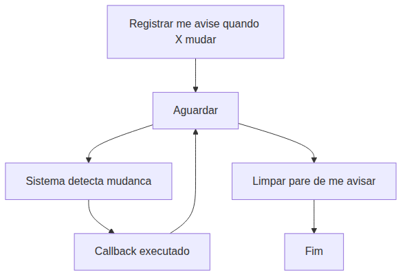
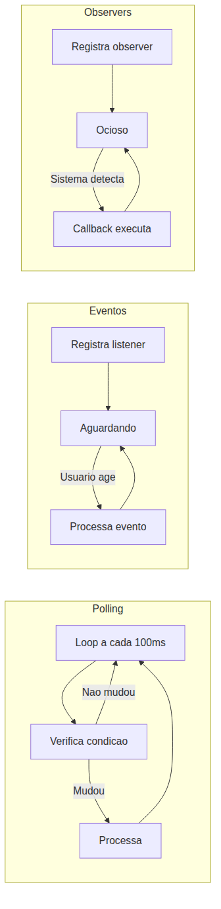
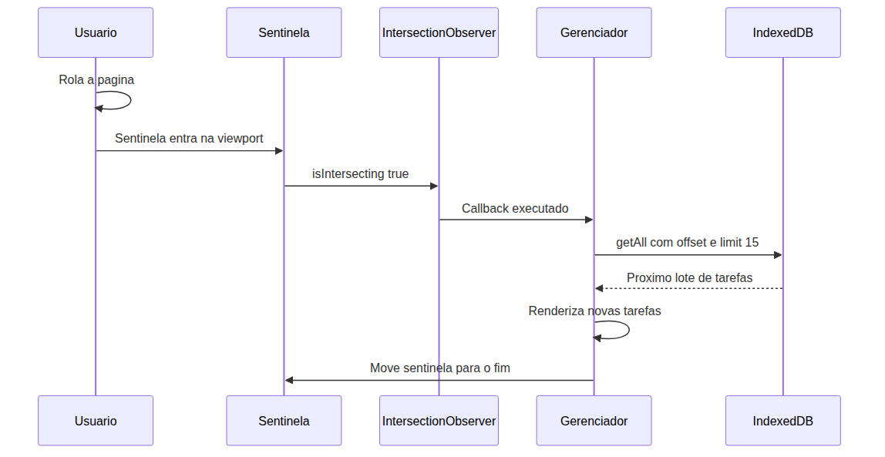
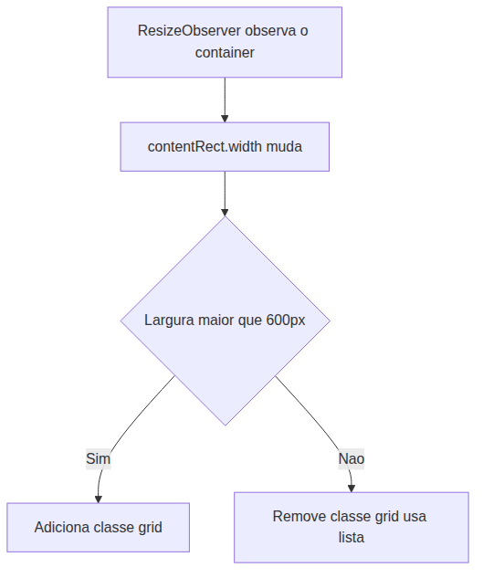
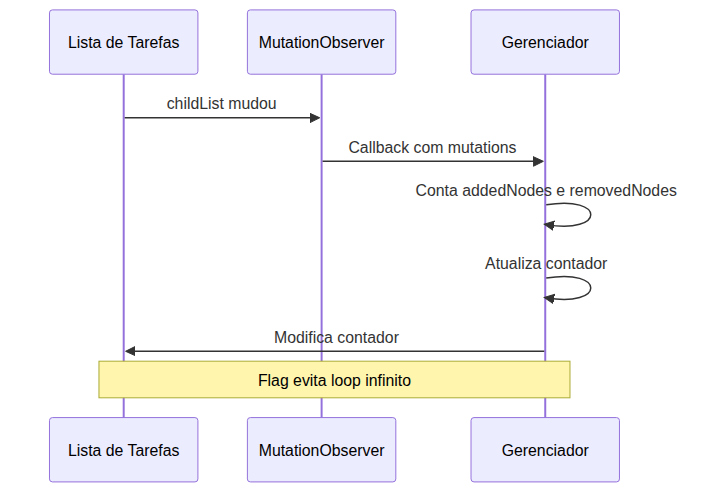

# JavaScript — Do Zero ao Profissional — Aula 24

## Intersection, Resize e Mutation Observers — Observando Mudanças na Pagina

**Duracao estimada:** 90 minutos (45 de leitura + 45 de pratica)

**Nivel:** Intermediario

**Pre-requisitos:** Aula 18 (DOM), Aula 19 (Eventos), Aula 20 (Shadow DOM), Aula 23 (IndexedDB)

---

## Objetivos de Aprendizagem

Ao final desta aula, voce sera capaz de:

- [ ] **Explicar** por que polling (verificar repetidamente) e ineficiente e como o padrao Observer resolve esse problema
- [ ] **Comparar** as tres estrategias de deteccao de mudancas — polling, eventos e observers — identificando quando cada uma e a escolha correta
- [ ] **Utilizar** IntersectionObserver com observe(), unobserve(), threshold e rootMargin para detectar quando elementos entram ou saem da viewport
- [ ] **Implementar** lazy loading de itens no Gerenciador de Tarefas — renderizar apenas as tarefas visiveis e carregar mais conforme o usuario rola a pagina
- [ ] **Utilizar** ResizeObserver para detectar mudancas de tamanho de um elemento e adaptar o layout dinamicamente
- [ ] **Utilizar** MutationObserver para observar mudancas no DOM — adicao/remocao de filhos, alteracao de atributos e conteudo de texto
- [ ] **Configurar** as opcoes de MutationObserver (childList, attributes, subtree, characterData) para observar exatamente o que interessa, sem desperdicio
- [ ] **Aplicar** os tres Observers no Gerenciador de Tarefas: scroll infinito com IntersectionObserver, layout responsivo com ResizeObserver e indicador de alteracoes com MutationObserver

---

## Como Usar Esta Aula

Esta aula esta organizada em duas partes. A **primeira parte** explica por que o modelo tradicional de "ficar verificando" e ineficiente e como o padrao Observer resolve isso — usando apenas analogias do mundo real. A **segunda parte** aplica esses conceitos com tres APIs do navegador: IntersectionObserver, ResizeObserver e MutationObserver.

Voce encontrara secoes **Mao na Massa** ao longo do caminho — pare e faca cada uma antes de continuar. Os **Quick Checks** verificam se voce entendeu antes de avancar. Ao final, o arquivo separado **Questoes de Aprendizagem** traz as tarefas de checkpoint.

| Etapa | Atividade | Tempo |
|---|---|---|
| Parte 1 | Fundamentos: por que observar em vez de verificar | 15 min |
| Parte 2A | IntersectionObserver + Scroll Infinito | 25 min |
| Parte 2B | ResizeObserver + Layout Responsivo | 15 min |
| Parte 2C | MutationObserver + Indicador de Alteracoes | 25 min |
| Final | Quiz + Exercicios + Revisao | 10 min |

---

## Mapa Mental





> *Cada ramo do mapa representa um conceito que voce vai dominar. O fio condutor e a evolucao do "verificar manualmente" para o "ser notificado automaticamente".*

---

## Recapitulacao da Aula 23

| Aula | Conceito | Onde aparece nesta aula | Como se conecta |
|---|---|---|---|
| Aula 23 | **IndexedDB** (persistencia) | Secoes 2-4 (scroll infinito) | Scroll infinito carrega lotes do IndexedDB sob demanda |

**Estado do Gerenciador pos-Aula 23:** o app tem Custom Elements com Shadow DOM, CRUD completo com IndexedDB, filtro por status (concluida/pendente), export/import de tarefas. A limitacao atual e que **todas as tarefas sao renderizadas de uma vez** na lista, independentemente de quantas sao ou se estao visiveis. Esta aula resolve isso com carregamento sob demanda.

---

**FUNDAMENTOS: Por Que Observar em Vez de Verificar**

> *Os conceitos desta secao sao universais — valem para qualquer sistema que precise detectar mudancas, seja no mundo fisico ou no digital. Nenhuma API de navegador e mencionada aqui. O foco e entender o padrao antes de ver a implementacao.*

---

## 1. O Problema de "Saber Quando Algo Mudou"

### 1.1 A Analogia do Seguranca Noturno

Imagine um grande predio comercial com dezenas de salas. Voce contratou um seguranca para proteger o predio durante a noite. O seguranca precisa saber se algo mudou — se alguem entrou, se uma janela foi aberta, se um alarme disparou.

Tres formas de fazer isso:

**Estrategia 1 — A Ronda (Polling):** o seguranca faz uma ronda a cada 10 minutos. Anda por todos os corredores, verifica cada porta, cada janela. Se tudo esta normal, ele volta a base e espera 10 minutos para fazer tudo de novo.

Problemas:
- Se alguem invade 1 minuto depois da ronda e sai 5 minutos depois, o seguranca nunca percebe — o evento aconteceu inteiro entre duas rondas
- O seguranca gasta energia e tempo percorrendo salas que nao mudaram
- Quanto mais frequente a ronda, mais energia gasta; quanto menos frequente, maior a chance de perder algo

**Estrategia 2 — A Campainha (Evento):** cada sala tem uma campainha na porta. Se alguem entra pela porta, a campainha toca e o seguranca sabe imediatamente.

Problemas:
- E se alguem entra pela janela? Nao tem campainha na janela
- A campainha so detecta um tipo especifico de evento: alguem abriu a porta. Nao detecta outras mudancas
- O seguranca precisa estar presente para ouvir a campainha

**Estrategia 3 — O Sensor de Movimento (Observer):** cada sala tem um sensor de movimento que se comunica diretamente com o central do seguranca. O seguranca configura o sistema: "me avise se algo se mover em qualquer sala". Depois disso, o seguranca dorme (ou faz outras tarefas) — o sensor cuida da vigilancia. Quando algo acontece, o sensor envia um sinal. O seguranca acorda, processa o evento e volta a dormir.

Vantagens:
- Zero desperdicio: o sensor so gasta energia quando detecta movimento
- Zero latencia: a notificacao e imediata
- Cobertura total: o sensor detecta qualquer movimento, nao so abertura de portas

### 1.2 As Tres Estrategias no Mundo Digital

No mundo dos programas de computador, as tres estrategias seguem a mesma logica:

**Polling:** e como perguntar "o bolo ja esta pronto?" a cada 30 segundos — voce gasta processamento e ainda pode perder o momento exato. O programa faz a mesma pergunta repetidamente, consome recursos mesmo sem mudancas, e pode deixar passar o evento se ele ocorrer e desaparecer entre duas verificacoes. E a ronda do seguranca, mas em forma de software.

**Eventos:** sao acoes especificas que disparam respostas imediatas — como a campainha da sala. Funcionam bem quando voce sabe exatamente o que esperar, mas nao cobrem tudo. Nem toda mudanca no estado de um programa gera um evento automaticamente.

**Observers:** o programa diz ao sistema "me avise quando X mudar" e depois faz outras tarefas. O sistema e o responsavel por detectar a mudanca internamente — ele tem acesso a informacoes que o programa chamador nao tem. Quando a mudanca acontece, o sistema executa o codigo registrado.

### 1.3 Por Que Polling e Ineficiente

A verificacao repetitiva (polling) tem tres problemas fundamentais:

- **Desperdicio de processamento:** cada ciclo de verificacao consome tempo de CPU, mesmo que nada tenha mudado. Cada "ronda" gasta recursos sem trazer informacao nova.
- **Possibilidade de falha:** nada garante que a mudanca sera detectada. Um evento pode ocorrer e se desfazer entre duas verificacoes, e o programa nunca sabera que aconteceu.
- **Consumo energetico:** em sistemas com bateria, cada ciclo de verificacao acorda o processador, acelerando o consumo significativamente.

Os Observers foram criados exatamente para eliminar esses problemas.

### 1.4 O Padrao Observer: Tres Passos Universais

Todo Observer segue tres passos:

**Passo 1 — Registrar:** "Sistema, eu quero ser avisado quando X acontecer."
**Passo 2 — Notificar:** O sistema detecta X e chama sua funcao de callback.
**Passo 3 — Limpar:** "Sistema, nao quero mais ser avisado."





A beleza desse padrao: o programa nao precisa fazer nada entre o registro e a notificacao. O sistema faz todo o trabalho pesado de deteccao. O programa so acorda quando realmente precisa.

### 1.5 Diagrama Comparativo





> *Polling = voce pergunta; Eventos = o usuario avisa; Observer = o sistema avisa. Cada um tem seu lugar, mas para detectar mudancas que ninguem provocou intencionalmente (visibilidade, tamanho, estrutura), o Observer e a ferramenta certa.*

### Quick Check 1

**1. Um seguranca faz rondas a cada 10 minutos. Um intruso entra 1 minuto depois da ultima ronda e sai 5 minutos depois. O seguranca detecta o intruso? Qual estrategia teria detectado?**
**Resposta:** Nao. O intruso entrou 1 minuto apos a ronda e saiu 5 minutos depois — tudo ocorreu entre duas rondas. Uma campainha (evento) na porta teria detectado a entrada. Um sensor de movimento (observer) tambem teria detectado o movimento no intervalo.

**2. Qual o problema de verificar repetidamente a cada 50ms se um elemento esta visivel em uma pagina web? Cite pelo menos duas consequencias negativas.**
**Resposta:** (1) A thread principal fica sobrecarregada — a verificacao compete com renderizacao, scroll e animacoes, causando engasgos na interface. (2) Em dispositivos moveis, drena a bateria mais rapido porque acorda o processador 20 vezes por segundo. (3) Mesmo com verificacao frequente, ainda e possivel perder o evento se o elemento aparecer e desaparecer entre duas verificacoes.
---

**APLICACAO: Os Tres Observers do Navegador no Gerenciador de Tarefas**

> *Agora que voce entende por que observar e melhor que verificar, vamos conhecer as tres APIs de Observer que o navegador oferece. Cada uma detecta um tipo diferente de mudanca: visibilidade (IntersectionObserver), tamanho (ResizeObserver) e estrutura do DOM (MutationObserver). Voce vai aplicar cada uma no seu Gerenciador de Tarefas.*

---

## 2. IntersectionObserver — Detectando Visibilidade

O IntersectionObserver e a resposta do navegador para uma pergunta que atormenta desenvolvedores web: "este elemento esta visivel na tela do usuario?"

Antes dessa API existir, as unicas formas de detectar visibilidade eram:
1. Polling com `getBoundingClientRect()` — calcular manualmente se o elemento esta dentro da viewport, repetidamente
2. Evento `scroll` com debounce — ouvir cada movimento de rolagem e recalcular posicao

Ambas sao ineficientes porque verificam centenas de vezes enquanto o usuario rola. O IntersectionObserver resolve isso de forma limpa.

### 2.1 A API do IntersectionObserver

A API e composta por um construtor, um callback e algumas opcoes:

```javascript
// 1. Criar o observer
const observer = new IntersectionObserver((entries) => {
  // entries e um array de IntersectionObserverEntry
  entries.forEach((entry) => {
    if (entry.isIntersecting) {
      console.log('Elemento esta visivel:', entry.target);
    } else {
      console.log('Elemento saiu da viewport');
    }
  });
}, {
  threshold: 0.5,     // 50% do elemento visivel
  rootMargin: '0px'   // margem extra ao redor da viewport
});

// 2. Comecar a observar um elemento
observer.observe(document.querySelector('.sentinela'));

// 3. Parar de observar
// observer.unobserve(elemento);

// 4. Parar TUDO de uma vez
// observer.disconnect();
```

**Construtor:**
```javascript
new IntersectionObserver(callback, opcoes)
```

**Callback:**
A funcao que voce passa recebe um array de `IntersectionObserverEntry`. Cada entrada representa um elemento que teve seu estado de visibilidade alterado.

**Propriedades de cada entry:**
- `entry.isIntersecting` — booleano: true se o elemento esta intersectando a viewport
- `entry.intersectionRatio` — numero de 0 a 1: fracao visivel do elemento
- `entry.target` — o elemento observado (referencia)
- `entry.boundingClientRect` — retangulo do elemento (igual ao `getBoundingClientRect()`)
- `entry.rootBounds` — retangulo da viewport

**Opcoes:**
- `threshold` (array ou numero): define em quais porcentagens de visibilidade o callback dispara. `threshold: 0` dispara quando 0% do elemento aparece (um pixel). `threshold: 1` dispara apenas quando 100% esta visivel. `threshold: [0, 0.5, 1]` dispara em 0%, 50% e 100%
- `rootMargin` (string): expande (ou contrai) a area de deteccao. `'100px'` faz o observer disparar 100px antes do elemento entrar na viewport. Funciona como margem CSS

```javascript
// Exemplo: diferentes thresholds
const observer = new IntersectionObserver((entries) => {
  entries.forEach(entry => {
    console.log(
      entry.target.id + ': ' + Math.round(entry.intersectionRatio * 100) + '% visivel'
    );
  });
}, {
  threshold: [0, 0.25, 0.5, 0.75, 1]
});
// Dispara em cinco momentos: 0%, 25%, 50%, 75%, 100% de visibilidade
```

> **Importante:** se `threshold: 1` e o elemento for maior que a viewport, o callback **nunca vai disparar com isIntersecting true** — porque o elemento nunca esta 100% visivel dentro da viewport. O elemento pode estar 100% ocupando a tela, mas se for mais alto que a viewport, o maximo que atinge e parcial. Use `threshold: 0` ou valores menores para elementos maiores que a tela.

### 2.2 Padrao de Uso em Custom Elements

Nos seus Custom Elements, o ciclo de vida se encaixa perfeitamente com os Observers:

```javascript
class EListaTarefas extends HTMLElement {
  #observer = null;

  connectedCallback() {
    this.#observer = new IntersectionObserver((entries) => {
      // Processar visibilidade
    }, { threshold: 0 });

    const sentinela = this.querySelector('.sentinela');
    if (sentinela) {
      this.#observer.observe(sentinela);
    }
  }

  disconnectedCallback() {
    // LIMPEZA: parar de observar quando o elemento for removido
    if (this.#observer) {
      this.#observer.disconnect();
    }
  }
}
```

> **Sempre** faca `disconnect()` no `disconnectedCallback`. Se voce nao limpar o observer, ele continua existindo na memoria mesmo depois que o elemento foi removido da pagina — e um **memory leak**. O observer ainda esta de olho em um elemento que nao existe mais.

### 2.3 Aplicacao 1 — Lazy Loading de Imagens

O uso mais classico do IntersectionObserver e carregar imagens apenas quando elas estao prestes a entrar na tela:

```javascript
// 1. No HTML, use data-src em vez de src
// 

// 2. Observer que substitui data-src por src quando visivel
const lazyObserver = new IntersectionObserver((entries) => {
  entries.forEach((entry) => {
    if (entry.isIntersecting) {
      const img = entry.target;
      img.src = img.dataset.src;       // Troca data-src por src real
      img.onload = () => img.classList.add('carregada'); // Feedback visual
      lazyObserver.unobserve(img);     // Para de observar (ja carregou)
    }
  });
}, {
  rootMargin: '200px' // Comeca a carregar 200px antes de entrar na tela
});

// 3. Observar todas as imagens lazy
document.querySelectorAll('img.lazy').forEach((img) => {
  lazyObserver.observe(img);
});
```

O padrao e simples: o elemento comeca com `data-src` (um atributo personalizado que nao dispara carregamento). Quando o observer detecta que ele esta prestes a ficar visivel, troca `data-src` por `src` — isso aciona o download da imagem. Depois de carregada, nao precisa mais observar.

### 2.4 Aplicacao 2 — Scroll Infinito no Gerenciador

No Gerenciador de Tarefas, voce vai implementar scroll infinito com IntersectionObserver e IndexedDB.

O conceito e:
1. Em vez de carregar TODAS as tarefas de uma vez, carregue apenas as primeiras 15
2. Coloque um **elemento sentinela** no final da lista — um elemento invisivel que serve como marcador
3. Quando a sentinela entrar na viewport (usuario rolou ate o fim), carregue mais 15 tarefas do IndexedDB e adicione a lista
4. A sentinela se move para o novo final da lista
5. Quando nao houver mais tarefas, remova a sentinela permanentemente





### Mao na Massa 1 — Scroll Infinito no Gerenciador

Voce vai modificar o Gerenciador para carregar tarefas sob demanda.

- [ ] No arquivo do seu Gerenciador, crie um elemento sentinela no final da lista de tarefas: um elemento de altura minima (ex: 1px, transparente) que serve como marcador de fim de lista

```javascript
// Dentro do metodo que renderiza a lista
this.#sentinela = document.createElement('div');
this.#sentinela.className = 'sentinela';
this.#sentinela.style.height = '1px';
this.#lista.appendChild(this.#sentinela);
```

- [ ] Adicione variaveis de controle: `#offset` (quantas tarefas ja foram carregadas) e `#limite` (quantas carregar por vez)

```javascript
class GerenciadorTarefas extends HTMLElement {
  #tarefas = [];
  #db = null;
  #offset = 0;
  #limite = 15;
  #temMais = true;
  #observer = null;
  #sentinela = null;
```

- [ ] Crie o IntersectionObserver no `connectedCallback` para observar a sentinela

```javascript
connectedCallback() {
  this.#abrirBanco();
  this.#observer = new IntersectionObserver((entries) => {
    entries.forEach((entry) => {
      if (entry.isIntersecting && this.#temMais) {
        this.#carregarMaisTarefas();
      }
    });
  }, { threshold: 0 });
}
```

- [ ] Implemente `#carregarMaisTarefas()` que busca do IndexedDB com offset e limit

```javascript
#carregarMaisTarefas() {
  if (!this.#db || !this.#temMais) return;

  const transaction = this.#db.transaction(['tarefas'], 'readonly');
  const store = transaction.objectStore('tarefas');

  let contador = 0;
  const tarefasCarregadas = [];

  const request = store.openCursor();
  request.onsuccess = (event) => {
    const cursor = event.target.result;

    if (cursor) {
      if (contador >= this.#offset && contador < this.#offset + this.#limite) {
        tarefasCarregadas.push(cursor.value);
      }
      contador++;
      cursor.continue();
    } else {
      this.#offset += tarefasCarregadas.length;
      this.#temMais = tarefasCarregadas.length === this.#limite;
      this.#renderizarTarefas(tarefasCarregadas);

      if (!this.#temMais && this.#sentinela) {
        this.#sentinela.remove();
        this.#sentinela = null;
      }
    }
  };
}

#renderizarTarefas(tarefas) {
  tarefas.forEach((tarefa) => {
    const elemento = document.createElement('e-tarefa');
    elemento.dataset.id = tarefa.id;
    elemento.dataset.texto = tarefa.texto;
    elemento.dataset.concluida = tarefa.concluida;
    this.#lista.insertBefore(elemento, this.#sentinela);
  });
}
```

- [ ] No `disconnectedCallback`, desconecte o observer

```javascript
disconnectedCallback() {
  if (this.#observer) {
    this.#observer.disconnect();
    this.#observer = null;
  }
}
```

- [ ] Teste: adicione 30+ tarefas no Gerenciador. Role a pagina. Voce deve ver as primeiras 15 imediatamente e as proximas 15 carregarem quando a sentinela entrar na viewport

**Verificacao:** Abra o DevTools, va na aba Network e veja que nao ha requisicoes desnecessarias. Role para o fim e observe o lote seguinte sendo carregado. O console nao deve mostrar erros.

### Quick Check 2

**1. Por que `threshold: 1` em um elemento mais alto que a viewport faz com que o callback nunca dispare com `isIntersecting: true`?**
**Resposta:** threshold: 1 significa "dispare quando 100% do elemento estiver visivel". Se o elemento e mais alto que a viewport, ele nunca esta 100% visivel de uma vez — mesmo quando ocupa toda a tela, parte dele esta fora. O elemento so atinge interseccao parcial, nunca total. A solucao e usar `threshold: 0` (um pixel aparece) ou valores intermediarios.

**2. Por que e importante chamar `observer.disconnect()` no `disconnectedCallback`?**
**Resposta:** Para evitar memory leaks. Se voce nao desconectar o observer, ele continua referenciando o elemento observado e mantendo a callback na memoria — mesmo depois que o elemento foi removido do DOM. O navegador nao consegue liberar essa memoria, e o acumulo de observers orfaos pode tornar a pagina lenta com o tempo.

---

## 3. ResizeObserver — Detectando Mudancas de Tamanho

O ResizeObserver detecta quando um elemento especifico muda de tamanho — seja por redimensionamento da janela, por adicao de conteudo dinâmico, por carregamento de fontes ou por CSS que altera dimensoes.

Antes dessa API, voce so tinha o evento `window.onresize`, que informa que a janela mudou — mas nao diz qual elemento foi afetado.

### 3.1 A API do ResizeObserver

A estrutura e semelhante ao IntersectionObserver:

```javascript
// 1. Criar o observer
const resizeObserver = new ResizeObserver((entries) => {
  entries.forEach((entry) => {
    console.log('Elemento:', entry.target);
    console.log('Tamanho:', entry.contentRect.width, 'x', entry.contentRect.height);
  });
});

// 2. Observar um elemento
resizeObserver.observe(document.querySelector('.container'));

// 3. Parar de observar
// resizeObserver.unobserve(elemento);

// 4. Parar tudo
// resizeObserver.disconnect();
```

**Propriedades de cada entry (ResizeObserverEntry):**
- `entry.target` — o elemento observado
- `entry.contentRect` — um objeto com `width`, `height`, `top`, `left` (caixa de conteudo, sem bordas)
- `entry.borderBoxSize` — tamanho incluindo bordas (mais preciso em alguns casos)

```javascript
const observer = new ResizeObserver((entries) => {
  for (const entry of entries) {
    const { width, height } = entry.contentRect;
    console.log('Largura: ' + width + 'px, Altura: ' + height + 'px');
  }
});

observer.observe(document.querySelector('.painel'));
```

### 3.2 ResizeObserver vs window.onresize

| Caracteristica | window.onresize | ResizeObserver |
|---|---|---|
| O que detecta | Redimensionamento da janela | Mudanca de tamanho em elemento especifico |
| Precisao | Generico (toda a janela) | Especifico (um elemento) |
| Falso positivo | Dispara mesmo que seu elemento nao tenha mudado | So dispara quando o observado muda |
| Mudancas nao-janela | Nao detecta (ex: conteudo dinâmico) | Detecta qualquer fonte de mudanca |
| Performance | Executa callback mesmo sem necessidade | Economiza CPU ao focar no elemento |

```javascript
// window.onresize: voce precisa recalcular manualmente cada elemento
window.addEventListener('resize', () => {
  const largura = document.querySelector('.container').offsetWidth;
  if (largura > 600) {
    console.log('Container ficou largo');
  }
});

// ResizeObserver: ele ja sabe qual elemento mudou
const observer = new ResizeObserver((entries) => {
  entries.forEach((entry) => {
    if (entry.contentRect.width > 600) {
      console.log('Container ficou largo');
    }
  });
});

observer.observe(document.querySelector('.container'));
```

### 3.3 Aplicacao — Layout Responsivo no Gerenciador

O Gerenciador tem uma lista de tarefas que pode estar em layout coluna (lista vertical) ou grade (cards lado a lado). Usando ResizeObserver, voce adapta o layout automaticamente baseado no tamanho disponivel do container — sem depender de media queries CSS que so enxergam a viewport inteira.





### Mao na Massa 2 — Layout Responsivo com ResizeObserver

- [ ] No Gerenciador, identifique o container da lista de tarefas (onde voce adiciona os elementos `e-tarefa`). De a ele um `id` ou referencia no componente

- [ ] Crie um ResizeObserver que le `contentRect.width` do container

```javascript
class GerenciadorTarefas extends HTMLElement {
  #resizeObserver = null;

  connectedCallback() {
    // ... codigo existente ...

    this.#resizeObserver = new ResizeObserver((entries) => {
      for (const entry of entries) {
        const { width } = entry.contentRect;

        if (width > 600) {
          this.#lista.classList.add('layout-grid');
          this.#lista.classList.remove('layout-lista');
        } else {
          this.#lista.classList.add('layout-lista');
          this.#lista.classList.remove('layout-grid');
        }
      }
    });

    this.#resizeObserver.observe(this.#lista);
  }

  disconnectedCallback() {
    // ... codigo existente ...
    if (this.#resizeObserver) {
      this.#resizeObserver.disconnect();
      this.#resizeObserver = null;
    }
  }
}
```

- [ ] Adicione as classes CSS correspondentes

```css
.layout-lista e-tarefa {
  display: block;
  width: 100%;
  margin-bottom: 8px;
}

.layout-grid {
  display: grid;
  grid-template-columns: repeat(auto-fill, minmax(250px, 1fr));
  gap: 16px;
}
```

- [ ] Teste: abra a pagina, redimensione a janela do navegador para larguras abaixo e acima de 600px. Observe a transicao entre lista vertical e grade

**Verificacao:** O layout deve alternar automaticamente conforme voce redimensiona a janela. No DevTools, inspecione o container e veja as classes `layout-grid` e `layout-lista` sendo aplicadas e removidas.

### Quick Check 3

**1. Por que o ResizeObserver e mais eficiente que `window.onresize` para detectar mudancas de tamanho em um elemento especifico?**
**Resposta:** `window.onresize` dispara para QUALQUER redimensionamento da janela, mesmo que o elemento monitorado nao tenha mudado de tamanho. Voce precisaria calcular manualmente as dimensoes do elemento e comparar. ResizeObserver dispara APENAS quando o elemento observado realmente muda de tamanho — seja por redimensionamento da janela, conteudo dinâmico ou qualquer outra causa.

**2. Em que situacao `window.onresize` NAO detectaria uma mudanca de tamanho que o ResizeObserver detectaria?**
**Resposta:** Quando a mudanca de tamanho nao e causada por redimensionamento da janela. Exemplos: conteudo carregado dinamicamente que expande o elemento, uma fonte carregando que altera o layout do texto, uma imagem que aparece e empurra o container, ou JavaScript que modifica o CSS do elemento.

---

## 4. MutationObserver — Detectando Mudancas no DOM

O MutationObserver observa mudancas na arvore do DOM — elementos sendo adicionados, removidos, atributos alterados, texto modificado. E a ferramenta para "escutar" o DOM sem precisar de polling.

Antes do MutationObserver, existia o `MutationEvent` (DOMSubtreeModified, DOMNodeInserted, etc.), mas era terrivelmente ineficiente — cada mudanca no DOM disparava eventos síncronos que podiam travar a pagina. O MutationObserver e seu substituto moderno, muito mais eficiente e controlavel.

### 4.1 A API do MutationObserver

```javascript
// 1. Criar o observer
const observer = new MutationObserver((mutations) => {
  // mutations e um array de MutationRecord
  mutations.forEach((mutation) => {
    console.log('Tipo da mudanca:', mutation.type);
    console.log('Alvo:', mutation.target);
  });
});

// 2. Configurar e comecar a observar
observer.observe(document.querySelector('#lista'), {
  childList: true,    // Observar adicao/remocao de filhos
  attributes: true,   // Observar mudancas de atributos
  subtree: false,     // Observar tambem descendentes?
  characterData: false // Observar mudancas de texto?
});

// 3. Parar
// observer.disconnect();
```

**MutationRecord — cada mudanca individual:**
- `mutation.type` — string: `'childList'`, `'attributes'` ou `'characterData'`
- `mutation.target` — o no onde a mudanca ocorreu
- `mutation.addedNodes` — NodeList com os nos adicionados (se type = 'childList')
- `mutation.removedNodes` — NodeList com os nos removidos (se type = 'childList')
- `mutation.attributeName` — nome do atributo alterado (se type = 'attributes')
- `mutation.oldValue` — valor anterior (se `attributeOldValue: true` ou `characterDataOldValue: true`)

### 4.2 As Opcoes de Observacao

Voce configura EXATAMENTE o que quer observar. Cada opcao ativada desnecessariamente custa performance.

| Opcao | O que detecta | Quando usar |
|---|---|---|
| `childList: true` | Adicao ou remocao de nos filhos | Listas dinâmicas, CRUD de elementos |
| `attributes: true` | Mudanca em qualquer atributo | Monitorar classes, estilos inline |
| `subtree: true` | Propaga para todos os descendentes | Preciso observar a arvore inteira (CUIDADO) |
| `characterData: true` | Mudanca no texto de um no | Monitorar conteudo textual |
| `attributeFilter: ['class']` | Apenas atributos especificos | Foco: 'class' em vez de todos atributos |
| `attributeOldValue: true` | Inclui valor anterior no registro | Preciso saber o valor antes da mudanca |
| `characterDataOldValue: true` | Inclui texto anterior no registro | Comparar texto antes e depois |

```javascript
// Exemplo: observar apenas mudancas no atributo 'class'
const observer = new MutationObserver((mutations) => {
  mutations.forEach((m) => {
    console.log('Classe de ' + m.target.id + ' mudou para:', m.target.className);
  });
});

observer.observe(document.querySelector('#meuElemento'), {
  attributes: true,
  attributeFilter: ['class'], // So 'class', ignora 'style', 'id', etc.
  attributeOldValue: true     // Quero saber qual era a classe antes
});
```

> **Aviso de performance:** `subtree: true` em um container grande (como o `body` ou uma lista com centenas de itens) gera MUITOS registros de mutacao para cada mudanca. Se voce so precisa saber sobre mudancas nos filhos DIRETOS, NAO use `subtree: true`. Cada opcao extra multiplica o trabalho que o navegador precisa fazer para rastrear mudancas.

### 4.3 A Armadilha do Loop Infinito

MutationObserver tem uma pegadinha classica: **se o callback modificar o DOM que esta sendo observado, ele dispara novamente**. E o novo disparo tambem modifica, que dispara de novo... loop infinito.

```javascript
// PERIGO: loop infinito!
const observer = new MutationObserver(() => {
  // Esta modificacao vai disparar o observer NOVAMENTE
  document.querySelector('#contador').textContent = 'Alterado!';
});

observer.observe(document.querySelector('#contador'), {
  characterData: true,
  subtree: true
});
```

Duas formas de evitar:

**Solucao 1 — Desconectar antes de modificar:**
```javascript
const observer = new MutationObserver((mutations) => {
  observer.disconnect(); // Para de observar temporariamente

  document.querySelector('#contador').textContent = 'Alterado!';

  observer.observe(document.querySelector('#contador'), {
    characterData: true,
    subtree: true
  }); // Volta a observar
});
```

**Solucao 2 — Usar uma flag de controle:**
```javascript
let atualizando = false;

const observer = new MutationObserver((mutations) => {
  if (atualizando) return; // Ignora se fui EU que modifiquei
  atualizando = true;

  document.querySelector('#contador').textContent = 'Alterado!';

  atualizando = false;
});
```

> **Importante:** a solucao da flag e mais leve computacionalmente, mas a solucao do `disconnect` e mais segura — elimina qualquer chance de loop, inclusive se a modificacao acidentalmente chamar codigo que dispara outras mutacoes.

### 4.4 Aplicacao — Indicador de Alteracoes no Gerenciador

Voce vai adicionar um contador automatico que mostra quantas tarefas estao na lista. O MutationObserver detecta quando tarefas sao adicionadas ou removidas e atualiza o contador.





### 4.5 Tabela de Decisao — Quando Usar Cada Estrategia

| Estrategia | Mecanismo | Custo | Latencia | Casos de Uso | Quando EVITAR |
|---|---|---|---|---|---|
| **Polling** | Verificacao periodica com `setInterval` ou `requestAnimationFrame` | Alto — CPU ocupada mesmo sem mudancas | Depende do intervalo (100ms = ate 100ms de atraso) | Animacoes em loop, verificacao de estado que nao tem observer | Visibilidade de elemento, tamanho, DOM — existe observer melhor |
| **Eventos** | Listener registrado via `addEventListener` | Baixo — so executa quando o evento ocorre | Imediata | Cliques, teclas, formularios, scroll | Mudancas sem evento nativo (visibilidade, tamanho, DOM generico) |
| **Observers** | Callback disparado pelo navegador quando detecta a mudanca | Minimo — navegador otimiza internamente | Imediata | Visibilidade (IntersectionObserver), tamanho (ResizeObserver), DOM (MutationObserver) | Interacao direta do usuario (eventos sao mais naturais) |

> *A regra geral: use eventos para acoes do usuario, observers para mudancas de estado do sistema, e polling apenas quando nao houver alternativa melhor.*

### Mao na Massa 3 — Indicador de Alteracoes com MutationObserver

- [ ] No Gerenciador, identifique a lista de tarefas e o elemento que mostra o contador (ex: um elemento qualquer com texto como "0 tarefa(s)")

- [ ] Crie um MutationObserver no `connectedCallback` para observar a lista

```javascript
class GerenciadorTarefas extends HTMLElement {
  #mutationObserver = null;
  #atualizandoContador = false;

  connectedCallback() {
    // ... codigo existente (banco, IntersectionObserver, ResizeObserver) ...

    this.#mutationObserver = new MutationObserver((mutations) => {
      if (this.#atualizandoContador) return; // Evita loop

      mutations.forEach((mutation) => {
        if (mutation.type === 'childList') {
          console.log(
            'Adicionados: ' + mutation.addedNodes.length +
            ', Removidos: ' + mutation.removedNodes.length
          );
        }
      });

      this.#atualizarContador();
    });

    this.#mutationObserver.observe(this.#lista, {
      childList: true
      // NAO usar subtree: true — so nos interessa os filhos diretos
    });
  }

  #atualizarContador() {
    this.#atualizandoContador = true;

    const total = this.querySelectorAll('e-tarefa').length;
    const contador = this.querySelector('#contador-tarefas');
    if (contador) {
      contador.textContent = total + ' tarefa(s)';
    }

    this.#atualizandoContador = false;
  }

  disconnectedCallback() {
    // Desconectar TODOS os observers
    if (this.#mutationObserver) {
      this.#mutationObserver.disconnect();
      this.#mutationObserver = null;
    }
    if (this.#observer) {
      this.#observer.disconnect();
      this.#observer = null;
    }
    if (this.#resizeObserver) {
      this.#resizeObserver.disconnect();
      this.#resizeObserver = null;
    }
  }
}
```

- [ ] Coloque o elemento contador no HTML do Gerenciador (dentro do template ou innerHTML do componente)

```javascript
// Dentro do metodo que monta o componente
this.innerHTML = '' +
  '<header>' +
    '<h1>Gerenciador de Tarefas</h1>' +
    '<span id="contador-tarefas">0 tarefa(s)</span>' +
  '</header>' +
  '<div id="lista" class="layout-lista"></div>';
```

- [ ] Teste: adicione e remova tarefas. O contador deve atualizar automaticamente sem loop infinito

**Verificacao:** Adicione 3 tarefas — o contador mostra "3 tarefa(s)". Remova 1 — mostra "2 tarefa(s)". O navegador nao trava (sem loop infinito). Abra o console e veja os logs de adicao/remocao de cada mutacao.

### Quick Check 4

**1. Qual o perigo de usar `subtree: true` no elemento `body` da pagina?**
**Resposta:** Cada mudanca em QUALQUER lugar da pagina (adicao de um filho, alteracao de atributo, mudanca de texto) geraria um MutationRecord e dispararia o callback — centenas ou milhares de vezes por segundo. Isso degrada severamente a performance da pagina. Use `subtree: true` apenas em containers pequenos e controlados.

**2. Por que `attributeFilter: ['class']` e mais eficiente que `attributes: true`?**
**Resposta:** `attributes: true` observa TODOS os atributos do elemento — `class`, `style`, `id`, `data-*`, `src` e qualquer outro. Cada alteracao em qualquer atributo gera um MutationRecord. `attributeFilter` restringe a observacao a apenas um ou poucos atributos, reduzindo o numero de notificacoes e o processamento no callback.

---

## Autoavaliacao: Quiz Rapido

**1. O que significa "polling" no contexto de deteccao de mudancas?**
**Resposta:** E a estrategia de verificar repetidamente (em loop) se uma condicao mudou, em vez de ser notificado quando a mudanca ocorre. Exemplo: usar `setInterval` para verificar a cada 100ms se um elemento esta visivel.

**2. Qual dos tres observers do navegador voce usaria para implementar scroll infinito?**
**Resposta:** IntersectionObserver. Ele detecta quando um elemento sentinela entra na viewport, sinalizando que o usuario chegou ao fim da lista atual e mais itens devem ser carregados.

**3. Qual a diferenca entre IntersectionObserver e ResizeObserver?**
**Resposta:** IntersectionObserver detecta quando um elemento entra ou sai da viewport (visibilidade). ResizeObserver detecta quando um elemento muda de tamanho (dimensoes).

**4. O que acontece se o callback de um MutationObserver modificar o mesmo DOM que esta sendo observado?**
**Resposta:** O MutationObserver dispara novamente porque o DOM mudou, criando um loop infinito. A solucao e usar uma flag de controle (`if (atualizando) return`) ou desconectar o observer antes de modificar e reconectar depois.

**5. Qual opcao do IntersectionObserver voce usaria para disparar o callback quando um elemento estiver exatamente na metade da viewport?**
**Resposta:** `threshold: 0.5`. O threshold define a fracao de visibilidade que dispara o callback. `0.5` significa "quando 50% do elemento estiver visivel".

**6. Por que voce deve SEMPRE chamar `disconnect()` nos observers no `disconnectedCallback`?**
**Resposta:** Para evitar memory leaks. Se os observers nao forem desconectados, eles continuam referenciando os elementos e callbacks mesmo apos o componente ser removido do DOM, impedindo o garbage collector de liberar essa memoria.

**7. Entre `window.onresize` e ResizeObserver, qual e mais eficiente para detectar mudancas de tamanho em um elemento especifico?**
**Resposta:** ResizeObserver, porque ele dispara apenas quando o elemento observado muda de tamanho, enquanto `window.onresize` dispara para qualquer redimensionamento da janela, independentemente do elemento.

**8. Em que situacao voce escolheria Eventos em vez de Observers?**
**Resposta:** Quando a mudanca e uma acao direta do usuario — clique, tecla pressionada, envio de formulario. Eventos sao mais naturais e eficientes para interacao humana. Observers sao para mudancas de estado do sistema (visibilidade, tamanho, DOM) que nao tem eventos nativos.

---

## Mao na Massa 4: Exercicios Graduados

**Exercicio 1 (Facil) — IntersectionObserver Basico**

Crie um script que observa um elemento com id `alvo` e exibe no console "Elemento visivel!" quando ele entra na viewport e "Elemento oculto!" quando sai. Use threshold 0.

```javascript
// Seu codigo aqui
```

**Gabarito:**

```javascript
const alvo = document.querySelector('#alvo');
if (!alvo) {
  console.error('Elemento #alvo nao encontrado');
} else {
  const observer = new IntersectionObserver((entries) => {
    entries.forEach((entry) => {
      if (entry.isIntersecting) {
        console.log('Elemento visivel!');
      } else {
        console.log('Elemento oculto!');
      }
    });
  }, { threshold: 0 });

  observer.observe(alvo);
}
```

Teste no console do navegador: o observer dispara automaticamente para o estado atual e a cada mudanca de visibilidade ao rolar a pagina.

**Exercicio 2 (Medio) — ResizeObserver com Adaptacao de Layout**

Crie um script que observa um elemento com id `painel` e aplica a classe `painel-estreito` se a largura for menor que 400px, `painel-medio` entre 400 e 700px, e `painel-largo` acima de 700px.

```javascript
// Seu codigo aqui
```

**Gabarito:**

```javascript
const painel = document.querySelector('#painel');
if (!painel) {
  console.error('Elemento #painel nao encontrado');
} else {
  const observer = new ResizeObserver((entries) => {
    for (const entry of entries) {
      const { width } = entry.contentRect;

      painel.classList.remove('painel-estreito', 'painel-medio', 'painel-largo');

      if (width < 400) {
        painel.classList.add('painel-estreito');
      } else if (width < 700) {
        painel.classList.add('painel-medio');
      } else {
        painel.classList.add('painel-largo');
      }
    }
  });

  observer.observe(painel);
}
```

Teste: redimensione a janela e observe as classes mudando no DevTools.

**Desafio (Dificil) — MutationObserver com childList e Prevencao de Loop**

Crie um script que observa uma lista (`<ul id="lista">`) e exibe no console o total de itens (`<li>`) sempre que um item for adicionado ou removido. O script deve: (a) usar `childList: true` sem subtree; (b) evitar loop infinito ao atualizar o contador; (c) exibir no console qual item foi adicionado ou removido.

```javascript
// Seu codigo aqui (pode usar um contador como referencia)
```

**Gabarito:**

```javascript
const lista = document.querySelector('#lista');
const contador = document.querySelector('#total-itens');
let atualizando = false;

if (!lista) {
  console.error('Elemento #lista nao encontrado');
} else {
  const observer = new MutationObserver((mutations) => {
    if (atualizando) return;

    mutations.forEach((mutation) => {
      if (mutation.type === 'childList') {
        mutation.addedNodes.forEach((node) => {
          if (node.tagName === 'LI') {
            console.log('Item adicionado:', node.textContent);
          }
        });
        mutation.removedNodes.forEach((node) => {
          if (node.tagName === 'LI') {
            console.log('Item removido:', node.textContent);
          }
        });
      }
    });

    atualizando = true;
    const total = lista.querySelectorAll('li').length;
    if (contador) {
      contador.textContent = total + ' item(ns)';
    }
    atualizando = false;
  });

  observer.observe(lista, { childList: true });
}
```

Teste: adicione e remova itens da lista programaticamente ou via interface. O console deve mostrar cada operacao e o contador deve atualizar sem loop.

---

## Resumo da Aula

### Os Conceitos Fundamentais

1. **Polling** e ineficiente: verificar repetidamente gasta CPU, drena bateria e nao garante deteccao. Observers eliminam esses problemas
2. **Tres estrategias** para detectar mudancas: polling (pergunta), eventos (usuario avisa), observers (sistema avisa)
3. **Padrao Observer**: tres passos universais — Registrar, Notificar, Limpar
4. **IntersectionObserver**: detecta visibilidade de elementos na viewport. Ideal para lazy loading e scroll infinito
5. **ResizeObserver**: detecta mudancas de tamanho em elementos especificos. Mais preciso que `window.onresize`
6. **MutationObserver**: detecta mudancas na arvore do DOM — adicao/remocao de nos, atributos, texto
7. **Opcoes de MutationObserver**: configure apenas o que precisa (`childList`, `attributes`, `subtree`, `characterData`, `attributeFilter`)
8. **Loop infinito**: se o callback do MutationObserver modificar o DOM observado, dispara a si mesmo. Use flag ou `disconnect`
9. **Limpeza obrigatoria**: sempre chame `disconnect()` no `disconnectedCallback` para evitar memory leaks

### O Que Voce Construiu Hoje

- [x] Scroll infinito no Gerenciador com IntersectionObserver e IndexedDB (carrega 15 tarefas por vez)
- [x] Layout responsivo com ResizeObserver (alterna entre lista e grid conforme largura)
- [x] Indicador automatico de tarefas com MutationObserver (contador atualizado sem loop)
- [x] Limpeza correta de todos os observers no disconnectedCallback

---

## Proxima Aula

**Aula 25: Geolocation + Notifications + Speech**

Voce aprendeu a observar mudancas na pagina. Agora seu Gerenciador vai interagir com o mundo real: descobrir onde o usuario esta, enviar alertas quando um prazo se aproxima e ler tarefas em voz alta. Seu app sai da tela e comeca a se comunicar com o usuario de novas formas.

---

## Referencias

### Documentacao Oficial (MDN)

- [IntersectionObserver API](https://developer.mozilla.org/en-US/docs/Web/API/IntersectionObserver)
- [IntersectionObserverEntry](https://developer.mozilla.org/en-US/docs/Web/API/IntersectionObserverEntry)
- [ResizeObserver API](https://developer.mozilla.org/en-US/docs/Web/API/ResizeObserver)
- [ResizeObserverEntry](https://developer.mozilla.org/en-US/docs/Web/API/ResizeObserverEntry)
- [MutationObserver API](https://developer.mozilla.org/en-US/docs/Web/API/MutationObserver)
- [MutationRecord](https://developer.mozilla.org/en-US/docs/Web/API/MutationRecord)

### Artigos e Tutoriais

- [IntersectionObserver — web.dev](https://web.dev/articles/intersectionobserver)
- [Lazy Loading de Imagens — web.dev](https://web.dev/articles/lazy-loading-images)
- [ResizeObserver — web.dev](https://web.dev/articles/resize-observer)
- [MutationObserver — web.dev](https://web.dev/articles/mutationobserver)

### Leituras Complementares

- [Design Pattern: Observer (Refactoring Guru)](https://refactoring.guru/design-patterns/observer)
- [MDN: Three strategies for detecting changes](https://developer.mozilla.org/en-US/docs/Web/API/IntersectionObserver#when_to_use_it)

---

## FAQ

**P: IntersectionObserver funciona em todos os navegadores?**
R: Sim, todos os navegadores modernos suportam IntersectionObserver desde 2019. Navegadores muito antigos (IE11) nao suportam, mas voce pode usar um polyfill.

**P: Posso usar IntersectionObserver para animar elementos quando eles entram na tela?**
R: Sim, e um caso de uso comum. Adicione uma classe CSS de animacao quando `entry.isIntersecting` for true.

**P: Quantos elementos posso observar com um unico IntersectionObserver?**
R: Quantos quiser. Um unico observer pode observar centenas de elementos eficientemente. O navegador otimiza internamente.

**P: ResizeObserver detecta mudancas de tamanho causadas por animacoes CSS?**
R: Sim. Se uma animacao CSS altera as dimensoes do elemento, o ResizeObserver detecta a cada frame.

**P: MutationObserver com subtree: true e tao ruim assim?**
R: Depende do tamanho da arvore. Em uma lista pequena (dezenas de elementos), e aceitavel. No body da pagina, pode degradar a performance visivelmente. Use com moderacao.

**P: O que acontece se eu esquecer de chamar disconnect() no MutationObserver?**
R: O observer continua vivo na memoria, referenciando os elementos observados. Isso impede o garbage collector de liberar a memoria do componente (memory leak). O acumulo pode tornar a pagina lenta.

**P: Posso usar os tres observers ao mesmo tempo no mesmo elemento?**
R: Sim. Cada observer monitora um aspecto diferente (visibilidade, tamanho, DOM). Eles sao independentes e nao conflitam.

**P: MutationObserver percebe mudancas feitas pelo proprio JavaScript, nao so pelo usuario?**
R: Sim. MutationObserver detecta QUALQUER mudanca no DOM, independentemente da origem — JavaScript, innerHTML, usuario, extensoes do navegador.

---

## Glossario

| Termo | Definicao |
|---|---|
| **Callback** | Funcao passada como argumento que e executada quando um evento ocorre. (Ver Aula 14) |
| **contentRect** | Objeto com width, height, top, left do ResizeObserverEntry, representando a caixa de conteudo. (Ver secao 3) |
| **Custom Element** | Componente HTML personalizado criado com a API `customElements.define()`. (Ver Aula 18) |
| **DOM** | Document Object Model — representacao em arvore da estrutura HTML da pagina. (Ver Aula 18) |
| **Flag** | Variavel booleana usada para controlar estado, como `atualizando = true/false`. |
| **Garbage Collector** | Mecanismo automatico que libera memoria de objetos nao mais referenciados. |
| **IndexedDB** | Banco de dados NoSQL embutido no navegador. (Ver Aula 23) |
| **IntersectionObserver** | API que detecta quando um elemento intersecta (entra/sai) a viewport. (Ver secao 2) |
| **isIntersecting** | Propriedade booleana de IntersectionObserverEntry que indica se o elemento esta visivel. (Ver secao 2) |
| **Lazy Loading** | Tecnica de carregar recursos (imagens, dados) apenas quando necessario, nao antecipadamente. (Ver secao 2) |
| **Memory Leak** | Vazamento de memoria — objetos que o garbage collector nao consegue liberar, acumulando consumo. |
| **MutationObserver** | API que observa mudancas na arvore DOM (nos, atributos, texto). (Ver secao 4) |
| **MutationRecord** | Objeto que descreve uma mudanca individual detectada pelo MutationObserver. (Ver secao 4) |
| **Offset** | Numero que indica quantos registros ja foram processados, usado em paginacao. (Ver secao 2) |
| **Observer Pattern** | Padrao de design onde objetos registram interesse em eventos e sao notificados quando eles ocorrem. (Ver secao 1) |
| **Polling** | Estrategia de verificar repetidamente uma condicao em vez de ser notificado sobre a mudanca. (Ver secao 1) |
| **ResizeObserver** | API que detecta mudancas de tamanho em elementos especificos. (Ver secao 3) |
| **Sentinela** | Elemento marcador colocado no fim de uma lista para detectar quando o usuario chegou ao final. (Ver secao 2) |
| **Threshold** | Valor ou array de valores (0 a 1) que define em quais porcentagens de visibilidade o IntersectionObserver dispara. (Ver secao 2) |
| **Viewport** | Area visivel da pagina no navegador, sem contar barras de ferramentas. (Ver secao 2) |
