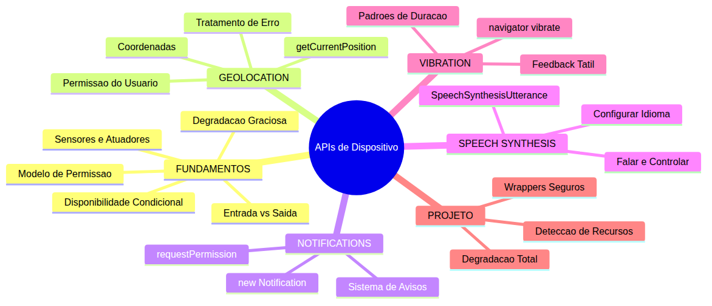
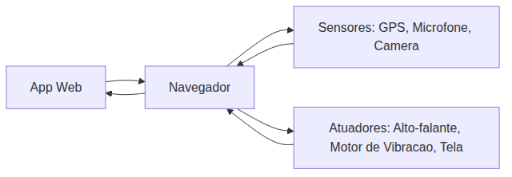
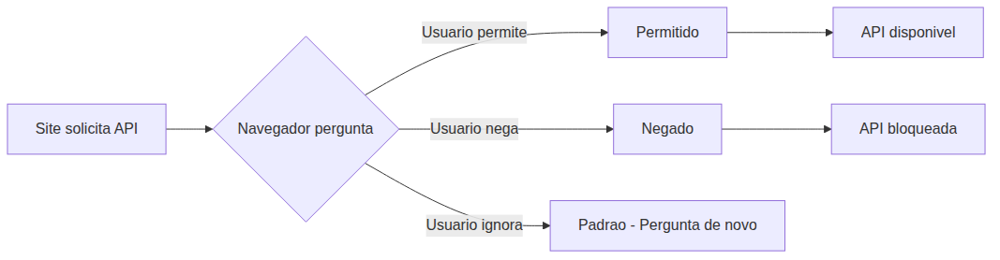
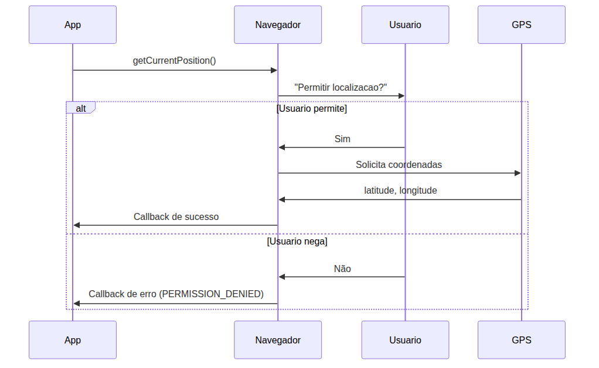
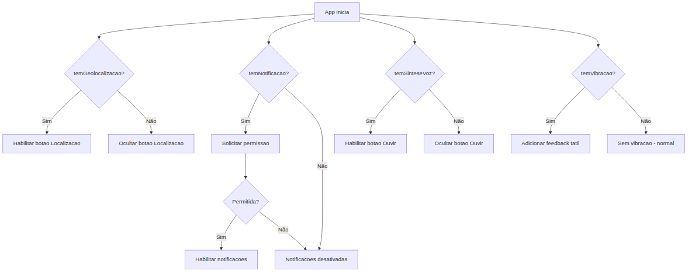

# JavaScript — Do Zero ao Profissional — Aula 25

## Geolocalização + Notificações + Speech + Vibração — APIs de Dispositivo no Navegador

**Duração total:** 100 minutos (45 de leitura + 55 de prática)
**Nível:** Intermediário
**Pré-requisitos:** Aula 18 (DOM), Aula 19 (Eventos), Aula 20 (Shadow DOM), Aula 23 (IndexedDB), Aula 24 (Observers)

***

## Objetivos de Aprendizagem

Ao final desta aula você será capaz de:

1. **Explicar** o que são APIs de dispositivo — sensores (entrada) e atuadores (saída) — e por que o navegador atua como mediador entre o app web e o hardware
2. **Descrever** o modelo de permissão do navegador, distinguindo APIs que exigem consentimento explícito (localização, notificações) das que não exigem (vibração)
3. **Identificar** se uma API de dispositivo está disponível com feature detection (`'geolocation' in navigator`, `'Notification' in window`)
4. **Utilizar** `navigator.geolocation.getCurrentPosition()` com callbacks de sucesso e erro
5. **Implementar** rastreamento contínuo com `watchPosition()` e tratar os 3 erros: `PERMISSION_DENIED`, `POSITION_UNAVAILABLE`, `TIMEOUT`
6. **Verificar** `Notification.permission` e solicitar permissão com `Notification.requestPermission()` antes de criar notificações
7. **Utilizar** `speechSynthesis.speak()` com `SpeechSynthesisUtterance` configurando idioma, velocidade e tom
8. **Aplicar** `navigator.vibrate()` com padrões de duração para feedback tátil
9. **Projetar** wrappers de degradação graciosa que verificam disponibilidade antes de usar cada API

***

## Como Usar Esta Aula

Esta aula esta organizada em duas partes. A **primeira parte** explica os fundamentos conceituais de sensores e atuadores, modelo de permissao e degradacao graciosa. A **segunda parte** aplica esses conceitos com quatro APIs do navegador: Geolocation, Notifications, Speech Synthesis e Vibration.

Você encontrará seções **Mão na Massa** ao longo do caminho — pare e faça cada uma antes de continuar. Os **Quick Checks** verificam se você entendeu antes de avançar. Ao final, o arquivo separado **Questões de Aprendizagem** traz as tarefas de checkpoint.

| Etapa | Atividade | Tempo |
|---|---|---|
| Parte 1 | Conceitos de APIs de dispositivo | 15 min |
| Parte 2A | Feature Detection + Geolocation | 25 min |
| Parte 2B | Notifications + Speech + Vibration | 35 min |
| Parte 2C | Integração com degradação graciosa | 15 min |
| Final | Quiz + Exercícios + Revisão | 10 min |

***

## Mapa Mental



***

## Recapitulação das Aulas Anteriores

Antes de mergulhar nas APIs de dispositivo, veja como cada aula anterior constrói a base para o que vem a seguir:

| Aula | Tema | Conexão com Aula 25 |
|---|---|---|
| 18 | DOM | As APIs de dispositivo manipulam a DOM para exibir coordenadas e notificações |
| 19 | Eventos | `click`, `load`, `voiceschanged` disparam as interações com o hardware |
| 20 | Shadow DOM | Componentes encapsulados podem consumir APIs sem poluir o escopo global |
| 21 | Formulários | Componentes de formulário salvam dados da tarefa, incluindo novos campos de localização |
| 22 | File API | Exportar/importar tarefas com localização como JSON anexado |
| 23 | IndexedDB | Localizações salvas e histórico de notificações em banco NoSQL |
| 24 | Observers | Observers ensinaram callbacks assíncronos — mesma mentalidade das APIs de dispositivo |

***

***

**FUNDAMENTOS: Sensores, Permissão e Disponibilidade**

> *Os conceitos desta seção são universais — valem para qualquer sistema que precise acessar sensores do dispositivo ou gerenciar permissões, independentemente da tecnologia específica. Na segunda parte, você verá como o navegador implementa cada um deles com Web APIs.*

***

## 1. APIs de Dispositivo: Sensores e Atuadores

Imagine o corpo humano. Seus olhos e ouvidos captam informações do mundo ao redor — são **sensores**. Sua boca e mãos produzem efeitos no mundo — são **atuadores**. O cérebro processa tudo e decide o que fazer.

No mundo dos dispositivos, o navegador faz o papel de cérebro. Ele recebe dados dos sensores do hardware (GPS, microfone, acelerômetro) e envia comandos para os atuadores (alto-falante, motor de vibração, tela). O navegador é o intermediário que traduz os pedidos do seu código em instruções que o hardware entende.

A Web API reúne dezenas de interfaces que expõem esse hardware. Algumas são tão comuns que você já usou sem perceber: quando um site pede sua localização para mostrar o clima, ele está usando o sensor de GPS. Quando o navegador exibe uma notificação fora da aba, ele está usando o atuador do sistema de notificações do sistema operacional.



Veja mais exemplos do dia a dia:

- Um mapa interativo consulta o GPS (sensor) do celular para mostrar sua posição em tempo real.
- O Google Tradutor captura áudio pelo microfone (sensor) e reproduz a tradução pelo alto-falante (atuador).
- Um jogo web usa o acelerômetro (sensor) para detectar movimento e vibra (atuador) quando o personagem colide.
- Um app de reuniões liga a câmera (sensor) e exibe vídeo na tela (atuador).
- Um leitor de telas usa síntese de voz (atuador) para ler o conteúdo em voz alta.
- Um aplicativo de fitness monitora passos pelo acelerômetro (sensor) e emite alertas sonoros (atuador).

**Quick Check 1**

Classifique cada item como **sensor** (entrada) ou **atuador** (saída):

1. GPS do celular
2. Alto-falante do notebook
3. Motor de vibração do controle de videogame
4. Microfone do fone de ouvido
5. Câmera frontal do tablet

**Resposta:** 1. Sensor, 2. Atuador, 3. Atuador, 4. Sensor, 5. Sensor

***

Respire fundo. Esse conceito de entrada e saída é a espinha dorsal de tudo que vem a seguir. Se você entendeu a diferença entre sensor e atuador, já domina 50% do conteúdo.

***

## 2. O Modelo de Permissão

Você não deixaria um estranho entrar na sua casa sem bater na porta. O navegador funciona da mesma forma: antes de acessar o hardware, ele pede permissão — e é o **usuário** quem decide.

Algumas APIs são consideradas **sensíveis** porque expõem dados pessoais ou podem incomodar. Localização revela onde você mora. Notificações aparecem na tela mesmo com o site fechado. Microfone e câmera capturam áudio e vídeo. Para todas elas, o navegador exige um consentimento explícito — aquela janelinha que pergunta "Permitir?" ou "Bloquear?".

Outras APIs são consideradas **não-sensíveis** porque não representam risco à privacidade nem causam incômodo significativo. Vibração, por exemplo, funciona sem pedir nada. Síntese de voz também não exige permissão — o navegador entende que falar um texto é inofensivo.

O fluxo de permissão segue três estados possíveis:



Mas há nuances importantes:

- O usuário pode permitir **uma vez** (a permissão expira quando a aba fecha) ou **sempre** (fica salva nas configurações do navegador).
- O usuário pode **negar permanentemente** — a partir daí, a API nunca mais vai pedir, a menos que ele limpe as configurações do site.
- Em alguns navegadores, se o usuário negar duas vezes seguidas, a permissão é bloqueada automaticamente.
- A permissão fica associada à **origem** do site (protocolo + domínio + porta), não à página individual.

**Quick Check 2**

Quais das APIs abaixo exigem permissão explícita do usuário?

1. Localização GPS
2. Notificações 
3. Vibração
4. Síntese de voz
5. Microfone

**Resposta:** 1, 2 e 5. Vibração e síntese de voz são consideradas não-sensíveis e funcionam sem permissão.

***

Respire fundo. Permissão é um dos tópicos que mais geram bugs em produção. Se gravar os três estados (permitido, negado, padrão), você vai economizar horas de debug.

***

## 3. Disponibilidade Condicional

Nem todo carro tem teto solar. Nem todo dispositivo tem GPS. Essa é a realidade da web: o mesmo código pode rodar em um notebook sem bateria, um celular antigo, um tablet corporativo ou um smartwatch.

Cada dispositivo oferece um conjunto diferente de hardware:

- **Desktop sem GPS**: notebooks e computadores raramente têm chip de GPS. A geolocalização pode funcionar pelo IP (precisão de quilômetros) ou falhar completamente.
- **Dispositivos móveis e vibração**: alguns dispositivos móveis não expõem a API de vibração para sites web. A função simplesmente não faz nada — e isso é normal.
- **Navegadores diferentes e vozes pt-BR**: navegadores diferentes incluem vozes diferentes para síntese de fala. Alguns podem não ter uma voz brasileira instalada.
- **Navegadores e notificações**: em um dispositivo móvel, notificações web são exibidas como notificações do sistema. Em um desktop, aparecem no centro de ações. Em alguns ambientes gráficos, o suporte é limitado.
- **Navegadores antigos**: alguns navegadores legados não têm a API de geolocalização. Um app que não verifica disponibilidade simplesmente quebra.

A boa notícia é que o JavaScript oferece uma ferramenta simples para detectar: o **feature detection**. Você pergunta ao navegador "você tem isso?" antes de tentar usar. Se a resposta for sim, usa. Se for não, oferece uma alternativa ou simplesmente não faz nada.

**Exemplos do cotidiano:**

- Um app de delivery tenta obter a localização. Se o GPS não estiver disponível, ele pede para o usuário digitar o endereço manualmente.
- Um leitor de artigos oferece o botão "Ouvir". Se a síntese de voz não estiver disponível, o botão simplesmente não aparece.
- Um sistema de checklist vibra ao marcar uma tarefa. No desktop, ninguém percebe a falta da vibração — o app continua funcionando.

**Quick Check 3**

Por que um mesmo site pode funcionar de forma diferente em dispositivos diferentes?

a) Porque o navegador é mais rápido em alguns dispositivos
b) Porque cada dispositivo tem hardware diferente e o navegador expõe apenas o que está disponível
c) Porque JavaScript é interpretado de forma diferente
d) Porque o desenvolvedor escolhe quais recursos ativar por dispositivo

**Resposta:** b. A web é heterogênea — o hardware disponível varia e o código precisa se adaptar.

***

## 4. Degradação Graciosa

Um restaurante sem ar-condicionado ainda serve comida. A comida é a funcionalidade principal. O ar-condicionado é um incremento.

Esse é o princípio da **degradação graciosa**: a funcionalidade central do seu app **sempre funciona**. Os recursos de dispositivo são extras que enriquecem a experiência, mas nunca são requisitos para o app rodar.

Na prática, isso significa:

- O Gerenciador de Tarefas que você vem construindo nas aulas anteriores **não precisa** de geolocalização para funcionar. O usuário pode criar, editar e concluir tarefas sem nunca dar permissão de localização.
- A notificação é um **plus**: se o usuário permite, ele recebe avisos de prazos. Se não permite, ele continua vendo as tarefas na tela.
- A vibração é um **feedback sutil**: agradável quando funciona, invisível quando não.
- A síntese de voz é uma **acessibilidade**: útil para ler tarefas em voz alta, mas não essencial.

**Como pensar em degradação graciosa:**

1. Identifique a funcionalidade principal — ela nunca depende de APIs de dispositivo.
2. Identifique os incrementos — cada API de dispositivo é um incremento opcional.
3. Para cada incremento, verifique disponibilidade antes de usar.
4. Se a API não estiver disponível, simplesmente não ofereça aquela funcionalidade — sem erro, sem crash, sem mensagens estranhas.

**Exemplos do mundo real:**

- Um player de vídeo carrega o vídeo mesmo se a WebGL não estiver disponível — ele usa um fallback para renderização 2D.
- Um mapa interativo mostra o mapa mesmo sem permissão de localização — você pode navegar manualmente.
- Um app de música funciona sem notificações — você só perde os alertas de música nova.

**Quick Check 4**

Qual frase melhor descreve degradação graciosa?

a) O app funciona perfeitamente em todos os dispositivos
b) O app quebra se uma API de dispositivo não estiver disponível
c) A funcionalidade principal nunca depende de APIs opcionais — extras são incrementos seguros
d) O desenvolvedor testa apenas em um dispositivo e ignora os demais

**Resposta:** c. Degradação graciosa significa que o core funciona sempre; os recursos de dispositivo são extras opcionais.

***

Hora de pausar. Você acabou de aprender os quatro pilares conceituais: sensores/atuadores, permissão, disponibilidade condicional e degradação graciosa. Com essa base, a parte prática vai fazer muito mais sentido. Respire, tome uma água, e quando estiver pronto, vamos escrever JavaScript.

***

***

**APLICAÇÃO: Geolocalização, Notificações, Voz e Vibração com JavaScript**

> *Agora que você entende os fundamentos de sensores, permissões e degradação graciosa, vamos conectá-los à prática com as Web APIs do navegador. Você vai implementar geolocalização, notificações, síntese de voz e vibração — cada uma com detecção de disponibilidade e fallback elegante.*

***

## 5. Feature Detection em JavaScript

Antes de usar qualquer API de dispositivo, você precisa perguntar ao navegador se ela existe. A ferramenta para isso é o operador `in`, que verifica se uma propriedade existe em um objeto.

O padrão é simples:

```javascript
if ('geolocation' in navigator) {
  // Geolocalização disponível
}
```

Esse padrão se repete para todas as APIs:

```javascript
if ('Notification' in window) {
  // Notificações disponíveis
}

if ('speechSynthesis' in window) {
  // Síntese de voz disponível
}

if ('vibrate' in navigator) {
  // Vibração disponível
}
```

Observe que algumas propriedades estão em `navigator` (objeto que representa o navegador) e outras em `window` (objeto global da janela). Isso varia de API para API — a documentação do MDN sempre informa onde cada uma está.

### Mão na Massa 1 — Detector de Recursos

Crie o arquivo `recursos-dispositivo.js` dentro da pasta `js/` do seu Gerenciador de Tarefas. Ele vai conter um objeto utilitário que centraliza toda a verificação de disponibilidade.

```javascript
// js/recursos-dispositivo.js

const Recursos = {
  temGeolocalizacao() {
    return 'geolocation' in navigator;
  },

  temNotificacao() {
    return 'Notification' in window;
  },

  temSinteseVoz() {
    return 'speechSynthesis' in window;
  },

  temVibracao() {
    return 'vibrate' in navigator;
  },

  statusGeral() {
    return {
      geolocalizacao: this.temGeolocalizacao(),
      notificacao: this.temNotificacao(),
      sinteseVoz: this.temSinteseVoz(),
      vibracao: this.temVibracao()
    };
  }
};
```

Teste no console do navegador:

```javascript
console.log(Recursos.statusGeral());
```

Cada propriedade vai retornar `true` ou `false` dependendo do seu dispositivo e navegador. Não se preocupe se algumas vierem `false` — isso é esperado e é exatamente o que queremos detectar.

**Quick Check 5**

Qual operador JavaScript é usado para verificar se uma propriedade existe em um objeto?

a) `typeof`
b) `instanceof`
c) `in`
d) `has`

**Resposta:** c. O operador `in` retorna `true` se a propriedade especificada existe no objeto.

***

## 6. Geolocation API

A API de Geolocalização permite que seu app descubra a posição geográfica do dispositivo. Ela está disponível no objeto `navigator.geolocation`.

### Obtendo a posição uma vez

O método principal é `getCurrentPosition()`. Ele recebe dois callbacks: um de sucesso (obrigatório) e um de erro (opcional), além de um objeto de opções (opcional).

```javascript
navigator.geolocation.getCurrentPosition(
  (posicao) => {
    console.log('Latitude:', posicao.coords.latitude);
    console.log('Longitude:', posicao.coords.longitude);
    console.log('Precisão:', posicao.coords.accuracy, 'metros');
  },
  (erro) => {
    console.error('Erro:', erro.message);
  },
  {
    enableHighAccuracy: true,
    timeout: 10000,
    maximumAge: 0
  }
);
```

O objeto `posicao` (do tipo `Position`) contém:
- `coords.latitude` — latitude em graus decimais
- `coords.longitude` — longitude em graus decimais
- `coords.accuracy` — precisão em metros (quanto menor, melhor)
- `coords.altitude` — altitude em metros (se disponível)
- `coords.speed` — velocidade em m/s (se disponível)

### Tratamento de erros

O callback de erro recebe um objeto `PositionError` com a propriedade `code`:

```javascript
const MAPA_ERROS = {
  1: 'PERMISSION_DENIED — Usuário negou a permissão',
  2: 'POSITION_UNAVAILABLE — Não foi possível determinar a posição',
  3: 'TIMEOUT — A operação excedeu o tempo limite'
};

navigator.geolocation.getCurrentPosition(
  (posicao) => { /* sucesso */ },
  (erro) => {
    switch (erro.code) {
      case erro.PERMISSION_DENIED:
        alert('Permissão de localização negada.');
        break;
      case erro.POSITION_UNAVAILABLE:
        alert('Sinal de GPS indisponível.');
        break;
      case erro.TIMEOUT:
        alert('A busca pela localização excedeu o tempo limite.');
        break;
    }
  }
);
```

### Rastreamento contínuo

Se você precisa acompanhar a posição do usuário em tempo real (como em um mapa de navegação), use `watchPosition()`:

```javascript
const idWatch = navigator.geolocation.watchPosition(
  (posicao) => {
    atualizarMapa(posicao.coords.latitude, posicao.coords.longitude);
  },
  (erro) => {
    console.error('Erro no rastreamento:', erro.message);
  }
);

// Para parar o rastreamento:
// navigator.geolocation.clearWatch(idWatch);
```

### O fluxo completo



> **Importante:** A API de geolocalização **só funciona em contexto seguro** (HTTPS). A exceção é `localhost`, que é considerado seguro para desenvolvimento. Em produção, seu site precisa estar servido via HTTPS.

### Mão na Massa 2 — Anexar Localização

Adicione um botão "📍 Anexar Localização" no formulário do Gerenciador de Tarefas. Ao clicar, ele obtém a posição atual e anexa as coordenadas à tarefa como um campo opcional.

Primeiro, verifique o HTML. Adicione o botão ao lado do campo de texto da tarefa:

```javascript
// No arquivo do Gerenciador
function initBotaoLocalizacao() {
  if (!Recursos.temGeolocalizacao()) {
    console.log('Geolocalização não disponível.');
    return;
  }

  const btnLocalizacao = document.getElementById('btn-localizacao');
  if (!btnLocalizacao) return;

  btnLocalizacao.addEventListener('click', () => {
    btnLocalizacao.disabled = true;
    btnLocalizacao.textContent = '📍 Obtendo posição...';

    navigator.geolocation.getCurrentPosition(
      (posicao) => {
        const { latitude, longitude } = posicao.coords;
        tarefaAtual.localizacao = { latitude, longitude };
        btnLocalizacao.textContent = `📍 ${latitude.toFixed(4)}, ${longitude.toFixed(4)}`;
        btnLocalizacao.disabled = false;
      },
      (erro) => {
        alert('Não foi possível obter localização: ' + erro.message);
        btnLocalizacao.textContent = '📍 Anexar Localização';
        btnLocalizacao.disabled = false;
      },
      { timeout: 10000 }
    );
  });
}
```

**Quick Check 6**

Qual é o código de erro quando o usuário clica em "Bloquear" no diálogo de permissão de localização?

a) `POSITION_UNAVAILABLE` (código 2)
b) `PERMISSION_DENIED` (código 1)
c) `TIMEOUT` (código 3)
d) `ERROR_UNKNOWN` (código 0)

**Resposta:** b. O código `PERMISSION_DENIED` (valor 1) indica que o usuário negou explicitamente a permissão.

***

Bom trabalho até aqui! Você já consegue detectar recursos do navegador e obter a localização do usuário. Vamos agora para as APIs que interagem com o usuário de forma mais direta: notificações, voz e vibração.

***

## 7. Notifications API

A API de Notificações permite que seu app exiba mensagens fora do contexto da página — na área de notificações do sistema operacional. É o que permite, por exemplo, que o Gmail alerte sobre novos e-mails mesmo com a aba minimizada.

### Verificando a permissão

Antes de criar uma notificação, você precisa verificar o estado atual da permissão:

```javascript
if (Notification.permission === 'granted') {
  // Pode criar notificação
} else if (Notification.permission === 'denied') {
  // Usuário bloqueou — não adianta pedir
} else {
  // 'default' — ainda não perguntou
}
```

### Solicitando permissão

Para pedir permissão, use `Notification.requestPermission()`. **Importante:** este método deve ser chamado em resposta a uma ação do usuário (clique em um botão), não automaticamente ao carregar a página.

```javascript
function solicitarPermissaoNotificacao() {
  if (!Recursos.temNotificacao()) return;

  if (Notification.permission === 'granted') return;

  if (Notification.permission === 'denied') {
    alert('Notificações estão bloqueadas. Ative nas configurações do navegador.');
    return;
  }

  // Notification.requestPermission() retorna uma Promise
  Notification.requestPermission().then((permissao) => {
    if (permissao === 'granted') {
      console.log('Notificações permitidas!');
    }
  });
}
```

> **Nota sobre `.then()`:** O método `requestPermission()` retorna um objeto especial que permite encadear ações com `.then()` — ele simplesmente executa a função quando a permissão for definida.

### Criando uma notificação

Com a permissão concedida, criar uma notificação é simples:

```javascript
function criarNotificacao(titulo, corpo) {
  if (!Recursos.temNotificacao()) return;
  if (Notification.permission !== 'granted') return;

  const notificacao = new Notification(titulo, {
    body: corpo,
    icon: '/icone.png',
    tag: 'gerenciador-tarefas'
  });
}
```

O parâmetro `tag` é especialmente útil: se você criar duas notificações com a mesma tag, o navegador substitui a anterior pela nova, evitando poluir a bandeja de notificações.

### Eventos da notificação

Uma notificação dispara eventos que você pode escutar:

```javascript
const notificacao = new Notification('Título', { body: 'Corpo' });

notificacao.addEventListener('click', () => {
  console.log('Usuário clicou na notificação');
  window.focus();
});

notificacao.addEventListener('close', () => {
  console.log('Notificação fechada');
});
```

### Mão na Massa 3 — Notificar Prazos Próximos

No Gerenciador de Tarefas, implemente uma função que verifica tarefas com deadline próximo (menos de 1 hora) e envia uma notificação para cada uma:

```javascript
function notificarPrazosProximos(tarefas) {
  if (!Recursos.temNotificacao()) return;
  if (Notification.permission !== 'granted') return;

  const agora = Date.now();
  const umaHora = 60 * 60 * 1000;

  tarefas.forEach((tarefa) => {
    if (!tarefa.deadline) return;
    if (tarefa.concluida) return;

    const diff = tarefa.deadline - agora;

    if (diff > 0 && diff <= umaHora) {
      const minutos = Math.ceil(diff / 60000);
      new Notification('⏰ Prazo Próximo!', {
        body: `"${tarefa.titulo}" vence em ${minutos} minutos.`,
        tag: 'prazo-' + tarefa.id
      });
    }
  });
}
```

**Quick Check 7**

Qual propriedade de `Notification` indica que o usuário nunca respondeu ao pedido de permissão?

a) `Notification.state === 'undecided'`
b) `Notification.permission === 'default'`
c) `Notification.status === 'pending'`
d) `Notification.permission === 'unknown'`

**Resposta:** b. O estado `'default'` significa que o usuário ainda não tomou uma decisão — o navegador vai perguntar novamente se `requestPermission()` for chamado.

***

## 8. Web Speech API — Síntese de Voz

A Web Speech API tem duas partes: reconhecimento de fala (fala → texto) e síntese de voz (texto → fala). Nesta aula vamos focar na **síntese**, que é a mais madura e tem bom suporte nos navegadores modernos.

### Criando e configurando a fala

Tudo começa com um objeto `SpeechSynthesisUtterance`, que representa um pedido de fala:

```javascript
const utterance = new SpeechSynthesisUtterance('Olá, mundo!');
utterance.lang = 'pt-BR';    // Idioma
utterance.rate = 1.0;         // Velocidade (0.1 a 10, 1.0 é normal)
utterance.pitch = 1.0;        // Tom (0 a 2, 1.0 é normal)
utterance.volume = 1.0;       // Volume (0 a 1)
```

### Falando

Para falar, basta passar o utterance para `speechSynthesis.speak()`:

```javascript
function falar(texto) {
  if (!Recursos.temSinteseVoz()) return;

  const utterance = new SpeechSynthesisUtterance(texto);
  utterance.lang = 'pt-BR';
  utterance.rate = 1.2; // Um pouco mais rápido que o normal

  speechSynthesis.speak(utterance);
}
```

### Obtendo vozes disponíveis

Diferentes sistemas têm vozes diferentes. Você pode listar as vozes disponíveis:

```javascript
function listarVozes() {
  if (!Recursos.temSinteseVoz()) return [];

  const vozes = speechSynthesis.getVoices();

  if (vozes.length === 0) {
    // Alguns navegadores carregam vozes de forma assíncrona
    speechSynthesis.addEventListener('voiceschanged', () => {
      console.log('Vozes carregadas:', speechSynthesis.getVoices().length);
    }, { once: true });
  }

  return vozes;
}
```

### Controlando a reprodução

Você pode pausar, retomar e cancelar a qualquer momento:

```javascript
function pausarFala() {
  if (speechSynthesis.speaking) {
    speechSynthesis.pause();
  }
}

function retomarFala() {
  if (speechSynthesis.paused) {
    speechSynthesis.resume();
  }
}

function pararFala() {
  if (speechSynthesis.speaking || speechSynthesis.pending) {
    speechSynthesis.cancel();
  }
}
```

### Mão na Massa 4 — Ouvir Tarefas

Adicione um botão "🔊 Ouvir Tarefas" no Gerenciador. Ao clicar, ele lê em voz alta a lista de tarefas pendentes:

```javascript
function initBotaoOuvir() {
  if (!Recursos.temSinteseVoz()) return;

  const btnOuvir = document.getElementById('btn-ouvir');
  if (!btnOuvir) return;

  btnOuvir.addEventListener('click', () => {
    const tarefasPendentes = tarefas.filter((t) => !t.concluida);

    if (tarefasPendentes.length === 0) {
      falar('Você não tem tarefas pendentes.');
      return;
    }

    const texto = tarefasPendentes
      .map((t, i) => `${i + 1}: ${t.titulo}`)
      .join('. ');

    falar(`Você tem ${tarefasPendentes.length} tarefas pendentes: ${texto}`);
  });
}
```

**Quick Check 8**

Qual propriedade de `SpeechSynthesisUtterance` controla a velocidade da fala?

a) `utterance.speed`
b) `utterance.rate`
c) `utterance.pace`
d) `utterance.velocity`

**Resposta:** b. A propriedade `rate` controla a velocidade, com valores entre 0.1 e 10, sendo 1.0 a velocidade normal.

***

## 9. Vibration API

A Vibration API é a mais simples de todas — um único método que faz o dispositivo vibrar. Silenciosamente ignorada em dispositivos que não suportam vibração (como a maioria dos desktops e iPhones).

### Vibração simples

```javascript
navigator.vibrate(200); // Vibra por 200ms
```

### Padrões de vibração

Você pode criar padrões com um array: o primeiro número é a vibração, o segundo a pausa, o terceiro a vibração, e assim por diante.

```javascript
// Vibração curta
navigator.vibrate(100);

// Padrão: vibra 200ms, pausa 100ms, vibra 200ms
navigator.vibrate([200, 100, 200]);

// Padrão longo: vibra 500ms, pausa 200ms, vibra 300ms, pausa 200ms, vibra 100ms
navigator.vibrate([500, 200, 300, 200, 100]);
```

### Parando a vibração

Para parar qualquer vibração em andamento:

```javascript
navigator.vibrate(0); // Zera = para
```

### Detecção

Como a API é silenciosa em dispositivos sem suporte, você pode usar feature detection para evitar chamadas desnecessárias:

```javascript
if (Recursos.temVibracao()) {
  navigator.vibrate(100);
}
```

### Mão na Massa 5 — Feedback Tátil

Adicione vibrações ao Gerenciador de Tarefas para melhorar a experiência do usuário em dispositivos móveis:

```javascript
function vibrarConfirmacao() {
  if (!Recursos.temVibracao()) return;
  navigator.vibrate(50); // Vibração curta — quase imperceptível
}

function vibrarErro() {
  if (!Recursos.temVibracao()) return;
  navigator.vibrate([100, 50, 100, 50, 200]); // Padrão de erro
}

function vibrarSucesso() {
  if (!Recursos.temVibracao()) return;
  navigator.vibrate([100, 50, 100]); // Duas vibrações curtas
}
```

Agora integre a vibração aos eventos do Gerenciador:

```javascript
// Ao concluir uma tarefa
function concluirTarefa(id) {
  const tarefa = tarefas.find((t) => t.id === id);
  if (!tarefa) return;

  tarefa.concluida = !tarefa.concluida;
  salvarTarefas();
  renderizarTarefas();

  if (tarefa.concluida) {
    vibrarSucesso();
  }
}

// Ao deletar uma tarefa
function deletarTarefa(id) {
  tarefas = tarefas.filter((t) => t.id !== id);
  salvarTarefas();
  renderizarTarefas();
  vibrarConfirmacao();
}

// Ao ocorrer um erro
function exibirErro(mensagem) {
  vibrarErro();
  alert(mensagem);
}
```

**Quick Check 9**

Como parar uma vibração que está em andamento?

a) `navigator.vibrate.stop()`
b) `navigator.vibrate(0)`
c) `navigator.vibrate(false)`
d) `navigator.vibrate.clear()`

**Resposta:** b. Chamar `navigator.vibrate(0)` interrompe qualquer vibração em andamento.

***

Você chegou à metade da parte prática! Já implementou quatro APIs de dispositivo. Respire fundo. Na próxima seção, vamos integrar tudo em um sistema coeso com degradação graciosa.

***

## 10. Integrando Tudo com Degradação Graciosa

Até aqui você implementou cada API individualmente. Agora vamos unificar tudo em um módulo coeso que inicializa cada recurso de forma segura, sempre verificando disponibilidade.

### Wrapper final

Crie o arquivo `js/recursos-dispositivo.js` completo com todos os wrappers:

```javascript
// js/recursos-dispositivo.js

const Recursos = {
  // === DETECÇÃO ===

  temGeolocalizacao() {
    return 'geolocation' in navigator;
  },

  temNotificacao() {
    return 'Notification' in window;
  },

  temSinteseVoz() {
    return 'speechSynthesis' in window;
  },

  temVibracao() {
    return 'vibrate' in navigator;
  },

  statusGeral() {
    return {
      geolocalizacao: this.temGeolocalizacao(),
      notificacao: this.temNotificacao(),
      sinteseVoz: this.temSinteseVoz(),
      vibracao: this.temVibracao()
    };
  },

  // === GEOLOCALIZAÇÃO ===

  obterPosicao(sucesso, erro, opcoes) {
    if (!this.temGeolocalizacao()) {
      console.warn('Geolocalização não disponível');
      return;
    }

    const padrao = { enableHighAccuracy: false, timeout: 10000, maximumAge: 60000 };
    const config = Object.assign(padrao, opcoes);

    navigator.geolocation.getCurrentPosition(sucesso, erro, config);
  },

  // === NOTIFICAÇÕES ===

  solicitarPermissaoNotificacao() {
    if (!this.temNotificacao()) return Promise.resolve('not-available');
    if (Notification.permission === 'granted') return Promise.resolve('granted');
    if (Notification.permission === 'denied') {
      console.warn('Notificações bloqueadas pelo usuário');
      return Promise.resolve('denied');
    }

    return Notification.requestPermission();
  },

  notificar(titulo, corpo, icone) {
    if (!this.temNotificacao()) return;
    if (Notification.permission !== 'granted') return;

    new Notification(titulo, {
      body: corpo,
      icon: icone || '/favicon.ico',
      tag: 'gerenciador-tarefas'
    });
  },

  // === SÍNTESE DE VOZ ===

  falar(texto, taxa = 1.2, idioma = 'pt-BR') {
    if (!this.temSinteseVoz()) return;

    const utterance = new SpeechSynthesisUtterance(texto);
    utterance.lang = idioma;
    utterance.rate = taxa;

    speechSynthesis.speak(utterance);
  },

  pararFala() {
    if (!this.temSinteseVoz()) return;
    speechSynthesis.cancel();
  },

  // === VIBRAÇÃO ===

  vibrar(padrao) {
    if (!this.temVibracao()) return;
    navigator.vibrate(padrao);
  },

  vibrarSucesso() {
    this.vibrar([100, 50, 100]);
  },

  vibrarErro() {
    this.vibrar([100, 50, 100, 50, 200]);
  },

  vibrarConfirmacao() {
    this.vibrar(50);
  }
};
```

### Inicialização segura

No arquivo principal do Gerenciador, inicialize os recursos que precisam de configuração:

```javascript
// No início do app
console.log('Recursos disponíveis:', Recursos.statusGeral());

// Inicializa notificações após interação do usuário
document.getElementById('btn-permitir-notificacoes')
  .addEventListener('click', () => {
    Recursos.solicitarPermissaoNotificacao().then((status) => {
      console.log('Status das notificações:', status);
    });
  });

// Botão de localização
initBotaoLocalizacao();

// Botão de ouvir tarefas
initBotaoOuvir();
```

### Mão na Massa 6 — Testar com e sem cada API

Abra o Gerenciador em diferentes dispositivos e navegadores, e verifique o `statusGeral()` no console. Tente:

1. **No celular**: geolocalização e vibração provavelmente disponíveis
2. **No desktop**: vibração provavelmente indisponível
3. **No Firefox**: verifique se há vozes pt-BR
4. **No Safari**: verifique suporte a notificações
5. **No navegador anônimo/privado**: algumas APIs podem estar bloqueadas

Anote os resultados. O objetivo é ver na prática que a web é um ambiente heterogêneo — e que a degradação graciosa é essencial.



***

## Autoavaliação: Quiz Rápido

Teste seu conhecimento com estas 6 questões:

**Questão 1**

Qual objeto contém a API de geolocalização?

a) `window.geolocation`
b) `document.geolocation`
c) `navigator.geolocation`
d) `browser.geolocation`

**Gabarito:** c. A geolocalização está em `navigator.geolocation`.

***

**Questão 2**

Qual método verifica se a síntese de voz está disponível?

a) `'SpeechSynthesis' in window`
b) `'speechSynthesis' in window`
c) `'speech' in navigator`
d) `'speak' in window`

**Gabarito:** b. A propriedade `speechSynthesis` no objeto `window` indica disponibilidade.

***

**Questão 3**

Para criar uma notificação, qual é a sequência correta?

a) Criar `new Notification()`, depois verificar `Notification.permission`
b) Verificar `Notification.permission`, chamar `requestPermission()`, depois criar `new Notification()`
c) Apenas criar `new Notification()` — o navegador pede permissão automaticamente
d) Chamar `Notification.ask()` e depois `Notification.show()`

**Gabarito:** b. Primeiro verifique a permissão, solicite se necessário, e só crie a notificação se a permissão estiver concedida.

***

**Questão 4**

O que acontece se você chamar `navigator.vibrate(200)` em um desktop sem motor de vibração?

a) O navegador exibe um erro no console
b) O navegador lança uma exceção
c) O navegador ignora silenciosamente
d) O navegador exibe um alerta

**Gabarito:** c. A Vibration API é silenciosa em dispositivos sem suporte — a chamada simplesmente não produz efeito.

***

**Questão 5**

Qual propriedade de `SpeechSynthesisUtterance` define o idioma da fala?

a) `utterance.language`
b) `utterance.locale`
c) `utterance.lang`
d) `utterance.dialect`

**Gabarito:** c. A propriedade `lang` usa códigos como `'pt-BR'` para português brasileiro.

***

**Questão 6**

Qual é o principal objetivo da degradação graciosa com APIs de dispositivo?

a) Fazer o app rodar mais rápido em todos os dispositivos
b) Garantir que o app funcione mesmo que uma API não esteja disponível
c) Economizar bateria do dispositivo
d) Reduzir o tamanho do arquivo JavaScript

**Gabarito:** b. Degradação graciosa significa que o app nunca quebra se uma API de dispositivo falha ou não está disponível.

***

## Mão na Massa 7: Exercícios Graduados

### Exercício 1 — Fácil: Detector de Recursos

Crie uma página HTML simples que exibe uma tabela com o resultado de `Recursos.statusGeral()`. Cada linha deve conter o nome do recurso e se está disponível (✅) ou não (❌). Use `Object.entries()` para iterar sobre o objeto.

Requisitos:
- Apenas HTML + JavaScript (sem CSS obrigatório)
- Deve funcionar offline
- Exiba a data e hora da última verificação

***

### Exercício 2 — Médio: App de Clima com Geolocalização

Construa um mini-app que obtém a localização do usuário e exibe as coordenadas juntamente com cartões informativos:

- Um cartão mostrando latitude, longitude e precisão
- Um cartão mostrando altitude (se disponível) ou "Não informada"
- Um botão "Atualizar Localização" que chama `getCurrentPosition` novamente
- Um indicador visual enquanto a localização está sendo obtida (ex: "Buscando sinal de GPS...")

Requisitos:
- Trate `PERMISSION_DENIED` com uma mensagem amigável
- Trate `TIMEOUT` com opção de tentar novamente
- Trate `POSITION_UNAVAILABLE` com fallback para localização aproximada baseada em IP (use um comentário indicando onde a API de IP entraria)

***

### Exercício 3 — Difícil: Sistema de Lembretes com Todas as APIs

Integre todas as quatro APIs em um sistema de lembretes:

1. O usuário cria um lembrete com título, descrição e data/hora
2. Quando o horário chega, o sistema dispara **todas as APIs disponíveis**:
   - Notificação: "🔔 Lembrete: [título]"
   - Síntese de voz: "Atenção! [título]: [descrição]"
   - Vibração: padrão de alerta (ex: `[500, 200, 500, 200, 500]`)
   - Se a geolocalização estiver disponível, registre a localização no momento do disparo
3. Exiba um log na tela mostrando quais APIs foram disparadas e quais foram ignoradas

Requisitos:
- Use um botão `<button id="verificar-lembretes">🔍 Verificar Lembretes</button>` e o evento `click` para verificar lembretes pendentes:

```javascript
document.getElementById('verificar-lembretes').addEventListener('click', verificarLembretes);
```
- Cada lembrete só deve disparar uma vez (use uma flag `disparado`)
- A localização deve ser registrada apenas se disponível
- Exiba no log: "📍 Geolocalização:  [lat, long]" ou "📍 Geolocalização: indisponível"
- Exiba no log: "🔊 Voz: reproduzida" ou "🔊 Voz: indisponível"
- Exiba no log: "📳 Vibração: [padrão]" ou "📳 Vibração: indisponível"
- Exiba no log: "🔔 Notificação: exibida" ou "🔔 Notificação: não permitida"

***
**Gabarito — Exercício 1 (Fácil):**

```html
<!DOCTYPE html>
<html><body>
<h1>Status de Recursos</h1>
<div id="status"></div>
<pre id="log">Última verificação: ---</pre>
<script>
const status = Recursos.statusGeral();
const div = document.getElementById('status');
div.innerHTML = '<table border=1>' +
  Object.entries(status).map(([chave, valor]) =>
    `<tr><td>${chave}</td><td>${valor ? '✅' : '❌'}</td></tr>`
  ).join('') + '</table>';
document.getElementById('log').textContent =
  'Última verificação: ' + new Date().toLocaleString();
</script>
</body></html>
```

**Gabarito — Exercício 2 (Médio):**

```javascript
function obterLocalizacao() {
  const statusEl = document.getElementById('status');
  statusEl.textContent = 'Buscando sinal de GPS...';
  
  navigator.geolocation.getCurrentPosition(
    (posicao) => {
      const { latitude, longitude, accuracy, altitude } = posicao.coords;
      statusEl.innerHTML = `
        <div>📍 Lat: ${latitude.toFixed(4)}, Lng: ${longitude.toFixed(4)}</div>
        <div>🎯 Precisão: ${accuracy}m</div>
        <div>⛰️ Altitude: ${altitude != null ? altitude + 'm' : 'Não informada'}</div>
      `;
    },
    (erro) => {
      if (erro.code === erro.PERMISSION_DENIED) {
        statusEl.textContent = '⚠️ Localização bloqueada. Libere nas configurações do navegador.';
      } else if (erro.code === erro.TIMEOUT) {
        statusEl.textContent = '⏰ Tempo esgotado. Tente novamente.';
      } else {
        statusEl.textContent = '📍 Localização aproximada (IP seria usado aqui)';
      }
    },
    { timeout: 10000 }
  );
}

document.getElementById('atualizar').addEventListener('click', obterLocalizacao);
```

**Gabarito — Exercício 3 (Desafio):**

```javascript
const lembretes = [
  { titulo: 'Reunião diária', descricao: 'Sala 3 às 10h', hora: '10:00', disparado: false },
  { titulo: 'Pausa café', descricao: '15 minutos', hora: '15:30', disparado: false }
];

function verificarLembretes() {
  const agora = new Date();
  const horaAtual = agora.getHours().toString().padStart(2, '0') + ':' +
                    agora.getMinutes().toString().padStart(2, '0');
  
  lembretes.forEach(lembrete => {
    if (lembrete.disparado || lembrete.hora !== horaAtual) return;
    lembrete.disparado = true;
    
    const log = [];
    
    if (Notification.permission === 'granted') {
      new Notification(`🔔 Lembrete: ${lembrete.titulo}`);
      log.push('🔔 Notificação: exibida');
    } else {
      log.push('🔔 Notificação: não permitida');
    }
    
    if ('speechSynthesis' in window) {
      const utter = new SpeechSynthesisUtterance(`Atenção! ${lembrete.titulo}: ${lembrete.descricao}`);
      speechSynthesis.speak(utter);
      log.push('🔊 Voz: reproduzida');
    } else {
      log.push('🔊 Voz: indisponível');
    }
    
    if (navigator.vibrate) {
      navigator.vibrate([500, 200, 500, 200, 500]);
      log.push('📳 Vibração: [500, 200, 500, 200, 500]');
    } else {
      log.push('📳 Vibração: indisponível');
    }
    
    if ('geolocation' in navigator) {
      navigator.geolocation.getCurrentPosition(pos => {
        log.push(`📍 Geolocalização: [${pos.coords.latitude}, ${pos.coords.longitude}]`);
        document.getElementById('log').innerHTML = log.join('<br>');
      });
    } else {
      log.push('📍 Geolocalização: indisponível');
    }
    
    document.getElementById('log').innerHTML = log.join('<br>');
  });
}

document.getElementById('verificar-lembretes')
  .addEventListener('click', verificarLembretes);
```


## Resumo da Aula

Nesta aula você aprendeu que o navegador é um intermediário entre seu código JavaScript e o hardware do dispositivo. As APIs de dispositivo se dividem em sensores (entrada) e atuadores (saída), e cada uma tem seu próprio modelo de permissão e disponibilidade.

Você implementou quatro APIs:

| API | O que faz | Onde está | Requer permissão |
|---|---|---|---|
| Geolocation | Obtém coordenadas GPS | `navigator.geolocation` | Sim |
| Notifications | Exibe alertas fora da aba | `Notification` | Sim |
| Speech Synthesis | Lê texto em voz alta | `speechSynthesis` | Não |
| Vibration | Vibra o dispositivo | `navigator.vibrate()` | Não |

O princípio mais importante desta aula é a **degradação graciosa**: a funcionalidade principal do seu app nunca depende de APIs de dispositivo. Elas são incrementos opcionais que enriquecem a experiência, mas o app funciona sem elas.

***

## Próxima Aula

Na **Aula 26 — Event Loop e Promises**, você vai entender como o JavaScript lida com operações assíncronas. Por que `setTimeout` não bloqueia a execução? Como o Event Loop funciona? E o que são Promises — o mecanismo moderno para lidar com código assíncrono, que você já viu de relance com `Notification.requestPermission().then()`?

Prepare-se: o Event Loop é o coração do JavaScript, e Promises vão mudar a forma como você escreve código.

***

## Referências

- MDN — Geolocation API: https://developer.mozilla.org/pt-BR/docs/Web/API/Geolocation_API
- MDN — Notifications API: https://developer.mozilla.org/pt-BR/docs/Web/API/Notifications_API
- MDN — Web Speech API: https://developer.mozilla.org/pt-BR/docs/Web/API/Web_Speech_API
- MDN — Vibration API: https://developer.mozilla.org/pt-BR/docs/Web/API/Vibration_API
- MDN — Feature Detection: https://developer.mozilla.org/pt-BR/docs/Learn/Tools_and_testing/Cross_browser_testing/Feature_detection
- Can I Use — Geolocation: https://caniuse.com/geolocation
- Can I Use — Notifications: https://caniuse.com/notifications
- Can I Use — Speech Synthesis: https://caniuse.com/speech-synthesis
- Can I Use — Vibration API: https://caniuse.com/vibration

***

## FAQ

### 1. Por que minha geolocalização não funciona no meu site?

Verifique se o site está servido via HTTPS (ou localhost). A API de geolocalização exige contexto seguro. Em produção, sem HTTPS, a chamada falha silenciosamente.

### 2. Como saber se o usuário permitiu notificações?

Verifique `Notification.permission`. Se for `'granted'` está permitido; `'denied'` está bloqueado; `'default'` ainda não foi perguntado.

### 3. A vibração funciona no iPhone?

Não. A API de vibração não é suportada no Safari iOS. A chamada `navigator.vibrate()` é ignorada silenciosamente.

### 4. Posso mudar a voz da síntese de fala?

Sim. Use `speechSynthesis.getVoices()` para listar as vozes disponíveis no sistema. Atribua uma voz ao `utterance.voice` antes de chamar `speak()`.

### 5. Quantas notificações posso criar?

Não há limite definido pela especificação, mas o sistema operacional pode agrupar ou ocultar notificações em excesso. Use o parâmetro `tag` para substituir notificações antigas.

### 6. A geolocalização funciona em notebooks sem GPS?

Pode funcionar de forma aproximada usando triangulação de Wi-Fi ou pelo endereço IP. A precisão será baixa (centenas de metros a quilômetros).

### 7. Preciso pedir permissão toda vez que a página carrega?

Não. A permissão fica salva por origem. Uma vez concedida ou negada, o navegador lembra da decisão até que o usuário limpe as configurações do site.

### 8. Como parar a síntese de voz no meio da fala?

Use `speechSynthesis.cancel()`. Isso interrompe imediatamente qualquer fala em andamento.

### 9. `Notification.requestPermission()` retorna o quê?

Retorna um objeto que resolve para `'granted'`, `'denied'` ou `'default'`. Quando a permissão é definida, o resultado é entregue para a função dentro de `.then()`.

### 10. Posso usar a câmera e o microfone?

Sim, através da MediaDevices API (`navigator.mediaDevices.getUserMedia()`), que exige permissão explícita. Essas APIs são mais avançadas e fogem ao escopo desta aula introdutória.

***

## Glossário

| Termo | Definição |
|---|---|
| **API de Dispositivo** | Interface que expõe funcionalidades do hardware do dispositivo para código JavaScript no navegador |
| **Sensor** | Componente de hardware que capta informação do ambiente (GPS, microfone, câmera) |
| **Atuador** | Componente de hardware que produz efeito no ambiente (alto-falante, motor de vibração, tela) |
| **Feature Detection** | Técnica que verifica se uma API está disponível antes de usá-la, usando o operador `in` |
| **Degradação Graciosa** | Princípio onde a funcionalidade principal não depende de APIs opcionais; extras são incrementos seguros |
| **Permissão** | Consentimento do usuário para que o site acesse uma API sensível |
| **Geolocalização** | API que fornece a posição geográfica do dispositivo (latitude, longitude, altitude) |
| **Notificação** | Mensagem exibida fora do contexto da página, na área de notificações do sistema |
| **Síntese de Voz** | Conversão de texto em áudio falado, também conhecida como Text-to-Speech (TTS) |
| **SpeechSynthesisUtterance** | Objeto que representa um pedido de fala, contendo texto, idioma, velocidade e tom |
| **Vibração** | API que controla o motor de vibração do dispositivo para feedback tátil |
| **Contexto Seguro** | Página servida via HTTPS ou localhost, requisito para APIs sensíveis |
| **Callback de Sucesso** | Função executada quando uma operação assíncrona é bem-sucedida |
| **Callback de Erro** | Função executada quando uma operação assíncrona falha |
| **Rastreamento Contínuo** | Monitoramento contínuo da posição com `watchPosition()`, que chama o callback a cada mudança |
| **Padrão de Vibração** | Array que alterna durações de vibração e pausa para criar sequências táteis |
| **Voz** | Conjunto de parâmetros de áudio (timbre, sotaque, gênero) que o sintetizador usa para falar |
| **Tag da Notificação** | Identificador que permite substituir uma notificação existente por uma nova |
| **Graceful Fallback** | Alternativa oferecida quando uma API não está disponível |
| **Heterogeneidade da Web** | Característica de que diferentes dispositivos e navegadores oferecem conjuntos diferentes de APIs |
