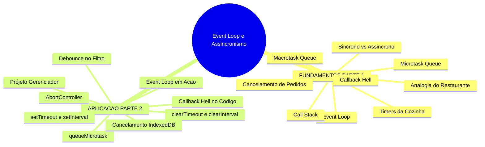
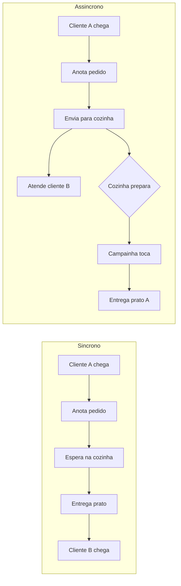
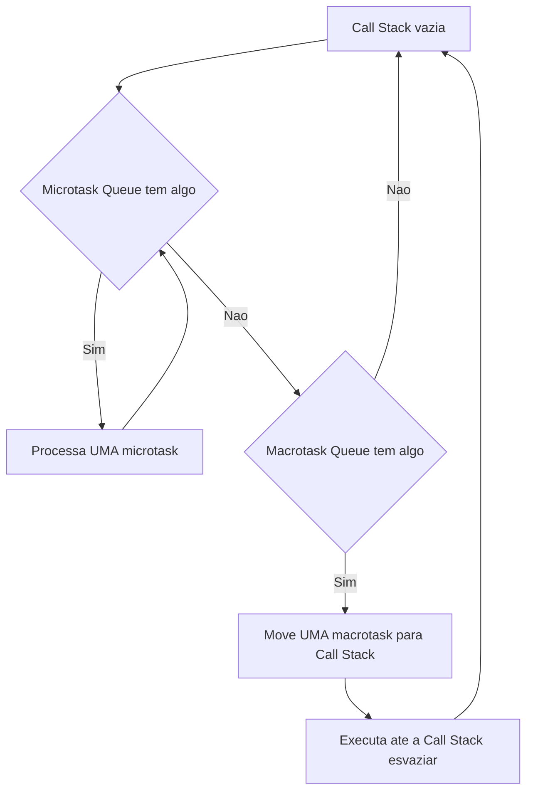
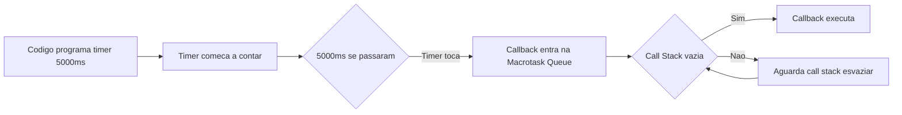
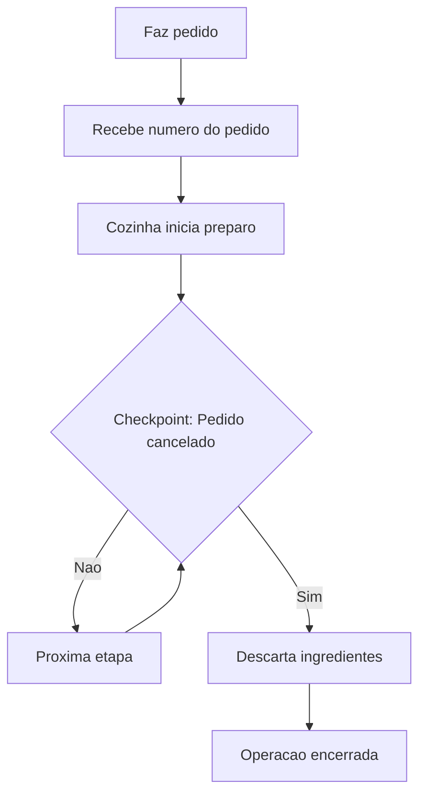
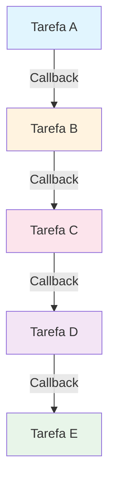
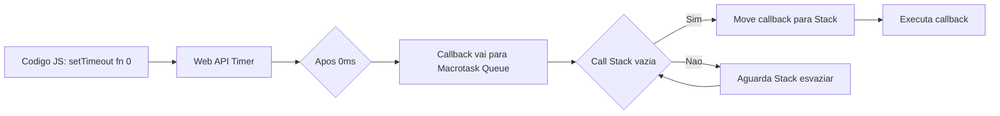
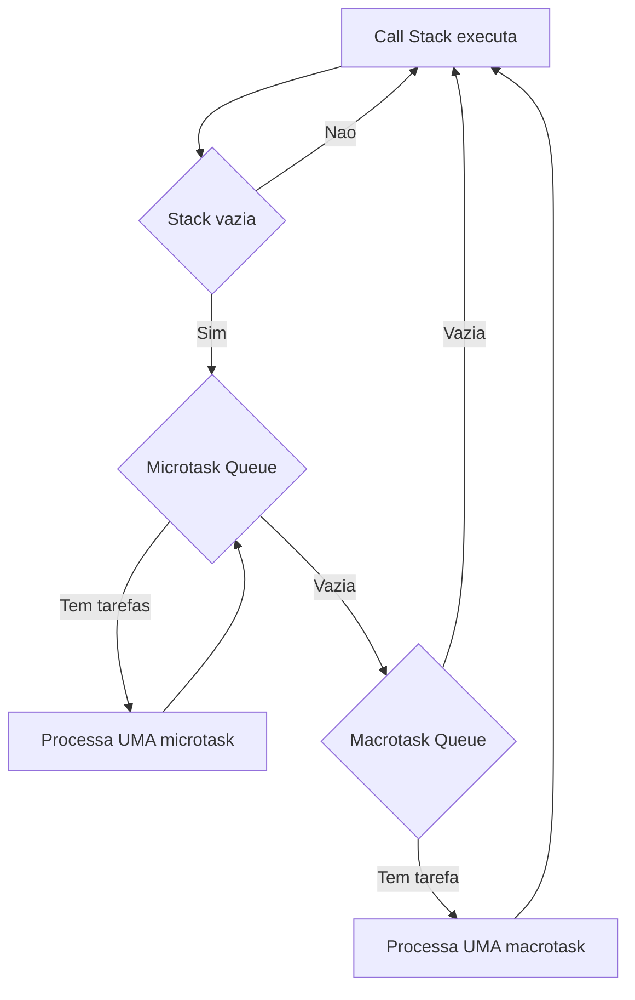
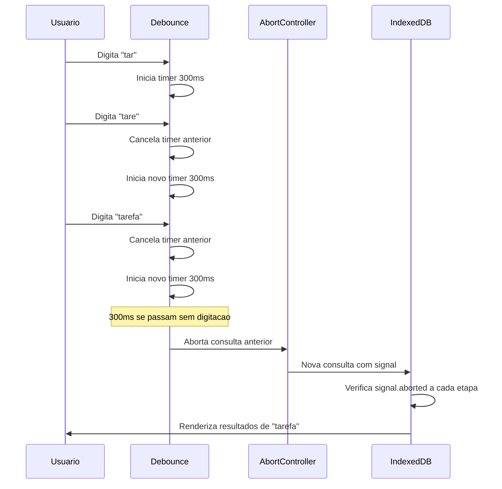

# JavaScript — Do Zero ao Profissional — Aula 26

## Event Loop — setTimeout, Callbacks e Microtasks

**Duração total:** 100 minutos (50 de leitura + 50 de prática)
**Nível:** Intermediário
**Pré-requisitos:** Aula 10 (Funções), Aula 11 (Escopo/Closure), Aula 14 (Callbacks), Aula 16 (Classes), Aula 18 (DOM), Aula 19 (Eventos), Aula 23 (IndexedDB), Aula 24 (Observers), Aula 25 (Feature Detection)

---

## Objetivos de Aprendizagem

Ao final desta aula você será capaz de:

1. **Explicar** a diferença entre execução síncrona e assíncrona usando a analogia do restaurante — por que código assíncrono não trava enquanto espera
2. **Descrever** o funcionamento do Event Loop: call stack, fila de macrotarefas, fila de microtarefas e o ciclo contínuo de verificação
3. **Distinguir** macrotarefas de microtarefas e prever qual executa primeiro em um cenário misto
4. **Utilizar** `setTimeout` e `clearTimeout` para agendar e cancelar execução de callbacks
5. **Utilizar** `setInterval` e `clearInterval` para executar callbacks repetidamente
6. **Aplicar** `queueMicrotask` para agendar uma microtarefa que executa imediatamente após a call stack esvaziar
7. **Implementar** `AbortController` para cancelar operações assíncronas pendentes
8. **Identificar** o anti-padrão Callback Hell — aninhamento profundo de callbacks
9. **Construir** um debounce funcional no filtro do Gerenciador de Tarefas usando setTimeout/clearTimeout
10. **Integrar** AbortController ao pipeline de filtro do Gerenciador cancelando operações IndexedDB obsoletas

---

## Como Usar Esta Aula

Esta aula está organizada em duas partes. A **primeira parte** (Seções 1-5) constrói os fundamentos conceituais do modelo de execução assíncrona usando exclusivamente a analogia de um restaurante — zero JavaScript. A **segunda parte** (Seções 6-12) aplica esses conceitos na prática com JavaScript, Web APIs e o Gerenciador de Tarefas.

Ao longo do caminho, você encontrará seções **Mão na Massa** (para fazer, não só ler) e **Quick Check** (para verificar se entendeu antes de avançar). Ao final, o arquivo separado **Questões de Aprendizagem** traz as tarefas de checkpoint — só avance para a próxima aula quando conseguir completá-las por conta própria.

| Etapa | Atividade | Tempo |
|---|---|---|
| Parte 1 | Fundamentos — Restaurante, Event Loop, Timers, Cancelamento, Callback Hell | 20 min |
| Parte 2A | setTimeout/setInterval + Event Loop em ação | 20 min |
| Parte 2B | Microtasks + AbortController + Callback Hell no código | 20 min |
| Parte 2C | Projeto: Debounce + AbortController no Gerenciador | 30 min |
| Final | Quiz + Exercícios + Revisão | 10 min |

---

## Mapa Mental



> *O mapa mental acima mostra a estrutura da aula. Cada ramo representa um conceito que você vai explorar.*

---

## Recapitulação das Aulas Anteriores

Você já construiu um **Gerenciador de Tarefas** completo ao longo das últimas 25 aulas. Ele tem:

| Aula | Conceito | Onde aparece nesta aula |
|---|---|---|
| Aula 10 | Funções, parâmetros, return | Callbacks passados para setTimeout, setInterval, queueMicrotask |
| Aula 11 | Escopo e closure | O timer do debounce "lembra" a variável timer entre chamadas |
| Aula 14 | Arrow functions, callbacks como valor | Callbacks são o mecanismo central desta aula |
| Aula 16 | Classes, constructor | O Gerenciador usa classes; debounce e AbortController serão integrados |
| Aula 18 | DOM, Custom Elements | O campo de busca do Gerenciador |
| Aula 19 | Eventos, addEventListener | O debounce escuta eventos de digitação |
| Aula 23 | IndexedDB, transações, cursores | O filtro consulta o IndexedDB; AbortController cancela consultas |
| Aula 24 | Observers (Intersection, Resize, Mutation) | MutationObserver usa microtarefas — conexão direta com microtask queue |
| Aula 25 | Feature detection | AbortController é uma API moderna — verificar antes de usar |

**Estado do Gerenciador pós-Aula 25:** componentes Custom Elements, persistência com IndexedDB, File API para exportar/importar, observers, geolocalização, notificações, síntese de voz e vibração. O que ele NÃO tem ainda: debounce no campo de busca e cancelamento de operações assíncronas pendentes.

---

**FUNDAMENTOS: O Modelo de Execução Assíncrona**

> *Os conceitos desta seção são universais — valem para qualquer linguagem de programação. Usamos a analogia de um restaurante para explicar tudo. Na segunda parte, você verá como esses mecanismos são implementados em código.*

---

## 1. Síncrono vs Assíncrono — A Analogia do Restaurante

Imagine um restaurante com um único garçom. Ele atende os clientes um de cada vez.

### O Garçom Síncrono

No modo síncrono, o garçom funciona assim:

1. O cliente A chega. O garçom anota o pedido.
2. O garçom vai até a cozinha e **fica parado em frente ao fogão** esperando o prato ficar pronto.
3. Enquanto espera, ele não faz mais nada — não atende novos clientes, não limpa mesas, não pega bebidas.
4. O prato fica pronto. O garçom entrega para o cliente A.
5. Só então ele atende o cliente B, que estava esperando.

Percebe o desperdício? O garçom passou 15 minutos parado olhando para a comida cozinhar. Nesse período, 10 clientes poderiam ter feito seus pedidos.

Na programação, isso é um **programa síncrono**: uma linha de código executa, depois a próxima, e nenhuma linha nova começa enquanto a anterior não terminar. Se uma linha demora 5 segundos (como ler um arquivo grande), o programa inteiro **congela** — o usuário não pode clicar em nada, a interface não responde.

### O Garçom Assíncrono

Agora imagine o mesmo garçom, mas trabalhando de forma assíncrona:

1. O cliente A chega. O garçom anota o pedido.
2. O garçom leva o pedido para a cozinha. A cozinha começa a preparar.
3. O garçom **imediatamente volta para o salão** e atende o cliente B.
4. Quando a cozinha termina o prato, a campainha toca. O garçom então entrega o prato para o cliente A.
5. O garçom nunca ficou parado esperando — ele fez outras coisas enquanto o prato era preparado.

Este é o **programa assíncrono**: operações demoradas são INICIADAS e, em vez de esperar, o programa continua executando outras coisas. Quando a operação termina, UM AVISO é disparado e o resultado é processado.



**Por que isso importa para você:** Na programação, o restaurante funciona como um programa de computador. A interface do usuário (botões, menus, animações) é o garçom. Se o garçom fica parado esperando, a interface trava. Operações assíncronas permitem que o programa continue respondendo a cliques, toques e teclas enquanto arquivos são baixados, bancos de dados são consultados ou timers contam no fundo.

Veja exemplos do dia a dia:

- Quando você envia uma mensagem no WhatsApp, o app não trava até a mensagem chegar ao servidor — ela é enviada em segundo plano e você pode continuar conversando.
- Quando uma página carrega imagens grandes, o texto aparece primeiro e as imagens vão aparecendo conforme baixam — a página não fica completamente em branco até tudo carregar.
- Quando você digita em um campo de busca, as sugestões não aparecem a cada letra individual — há um atraso estratégico (exatamente o que você vai implementar no debounce!).

**Quick Check 1**

**1. Qual destas situações descreve comportamento assíncrono?**
**Resposta:** Você coloca uma pizza no forno e vai assistir TV; o timer da cozinha te avisa quando está pronta. É assíncrono porque você não fica parado esperando — faz outra coisa enquanto o forno trabalha.

**2. O que aconteceria com a interface de um app de música se o download de cada faixa fosse síncrono?**
**Resposta:** O app congelaria a cada download. Você não conseguiria navegar pela biblioteca ou clicar em botões enquanto a música baixa. A tela inteira pararia de responder até o download terminar.

---

## 2. O Event Loop — O Maestro da Cozinha

O restaurante não funciona apenas com um garçom — ele precisa de um **sistema de gerenciamento** que coordene tudo. Na programação, esse sistema é o **Event Loop** (loop de eventos).

O Event Loop tem três componentes principais, cada um com um papel na nossa analogia:

### A Call Stack — A Bandeja do Garçom

A **call stack** (pilha de chamadas) é a bandeja que o garçom carrega. Ela só pode segurar UMA tarefa por vez. Enquanto o garçom está entregando um prato (executando uma função), ele não pode anotar um pedido (iniciar outra função).

Quando você chama uma função, ela é colocada no topo da pilha. Quando a função termina, ela é removida. Se uma função chama outra, a nova vai para o topo — e só quando ela termina é que a primeira continua.

### A Macrotask Queue — A Fila de Clientes

A **macrotask queue** (fila de macrotarefas, ou fila de tarefas) é a fila de clientes esperando para fazer pedido. A ordem é simples: primeiro que chega, primeiro que é atendido (FIFO — first in, first out).

Quando um timer toca (um prato fica pronto), o aviso não interrompe o garçom imediatamente — ele entra na fila. O garçom termina o que está fazendo e só então atende o próximo da fila.

### A Microtask Queue — Os Bilhetes Urgentes do Chef

A **microtask queue** (fila de microtarefas) são os bilhetes urgentes que o chef enfia na mão do garçom: "Cliente da mesa 3 pediu sem cebola!", "A mesa 7 quer outra bebida!". Esses bilhetes precisam ser resolvidos IMEDIATAMENTE, antes de atender qualquer novo cliente.

A regra de ouro: **microtarefas sempre executam antes da próxima macrotarefa**, mesmo que a macrotarefa tenha entrado na fila primeiro.

### O Ciclo do Event Loop

O maître do restaurante (o Event Loop) repete este ciclo eternamente:

1. O garçom está livre? (A call stack está vazia?)
2. PRIMEIRO: verifique todos os bilhetes urgentes do chef (microtask queue). Se houver, resolva TODOS — um por um, sem parar.
3. SÓ DEPOIS: pegue o PRÓXIMO cliente da fila (macrotask queue) e atenda.
4. Volte ao passo 1.



Perceba o detalhe crítico: o Event Loop processa **TODAS** as microtarefas antes de tocar na próxima macrotarefa, mas processa **APENAS UMA** macrotarefa por ciclo. É por isso que microtarefas podem travar a página se uma gerar outra infinitamente — o Event Loop nunca chega às macrotarefas.

### Classificando as Tarefas

Na programação, diferentes operações se encaixam em cada categoria:

| Categoria | Exemplos |
|---|---|
| **Código síncrono** | Expressões, chamadas de função, operadores — vai direto para a call stack |
| **Macrotarefas** | Timers programados, eventos de clique/teclado, carregamento de recursos, operações de banco de dados |
| **Microtarefas** | Tarefas urgentes agendadas para execução imediata, observadores de mudanças |

**Quick Check 2**

**1. Em um restaurante, o garçom está entregando um prato (call stack ocupada). Neste momento, 2 bilhetes urgentes do chef chegam (microtasks) e 1 novo cliente entra (macrotask). Em que ordem eles serão processados?**
**Resposta:** Primeiro, o garçom termina de entregar o prato (call stack esvazia). Depois, processa os 2 bilhetes urgentes (microtasks). Por último, atende o novo cliente (macrotask).

**2. Classifique cada ação como síncrona, macrotarefa ou microtarefa: (a) somar dois números, (b) agendar um timer para daqui a 5 segundos, (c) reagir a uma mudança na interface observada por um observador de mudanças.**
**Resposta:** (a) síncrona — executa direto na call stack, (b) macrotarefa — um timer programado entra na macrotask queue, (c) microtarefa — um observador de mudanças usa microtasks.

---

## 3. Timers — O Timer da Cozinha

A cozinha do restaurante usa um sistema de timers para gerenciar o preparo dos pratos.

### O Timer de Aviso Único

O timer de aviso único é como programar um timer de cozinha: "me avise daqui a 45 minutos que o assado está pronto". Você programa UM aviso para disparar UMA vez após um tempo mínimo.

O garçom configura o timer com um número de identificação (o número do pedido). Quando o timer toca, o aviso entra na fila de clientes (macrotask queue). O garçom termina o que está fazendo e então processa o aviso.

### O Timer de Aviso Repetido

O timer de aviso repetido é como programar um alarme recorrente: "a cada 30 minutos, passe um café fresco na mesa do cliente 5". A cada 30 minutos, um novo aviso entra na fila.

### Cancelar o Timer — Remover o Aviso

Cancelar um timer é como desligar o timer antes que ele toque: "cancelei o café, o cliente mudou de ideia". Você usa o número de identificação do timer para cancelá-lo.

Se você cancelar um timer que já tocou? Nada acontece — o cancelamento é ignorado silenciosamente. É como tentar cancelar um pedido que já foi entregue.

### O Detalhe Crucial: Tempo Mínimo, Não Exato

O timer nunca é exato. Se você programa "me avise em 5 minutos" mas o garçom está ocupado entregando 10 pratos quando o timer toca, o aviso entra na fila e espera. Pode levar 5 minutos. Ou 7. Ou 12, se a fila estiver enorme.

**O timer marca o TEMPO MÍNIMO, não o tempo exato de execução.** Ele garante que a tarefa não executará ANTES de N milissegundos, mas NÃO garante que executará EXATAMENTE em N milissegundos.



**Quick Check 3**

**1. O garçom programa 3 timers ao mesmo tempo: A (5 min), B (3 min), C (7 min). O garçom está ocupado por 4 minutos seguidos. Quando ele terminar, em que ordem os avisos serão entregues?**
**Resposta:** B (tocou em 3min), A (tocou em 5min), C (tocou em 7min). A fila de macrotarefas é FIFO — os timers que tocam primeiro entram na fila primeiro. Como todos tocaram enquanto o garçom estava ocupado, a ordem é pela ordem de disparo: B, A, C.

**2. Se você programa um timer para daqui a 10 minutos e 1 minuto depois o cancela, o que acontece?**
**Resposta:** O timer é removido antes de disparar. O callback nunca executa. É como cancelar um pedido antes de começar a preparar.

---

## 4. Cancelamento de Operações — Cancelar um Pedido

Às vezes, um cliente muda de ideia depois de fazer o pedido. O restaurante precisa de um sistema para cancelar.

### O Sistema de Número do Pedido

No restaurante, quando você faz um pedido, recebe um número de identificação (ex: pedido #42). Esse número é seu **token de cancelamento**. Se você mudar de ideia, chama o garçom e diz: "cancelem o pedido #42".

A cozinha, antes de começar a preparar cada etapa, verifica: "o pedido #42 foi cancelado?". Se foi, o pedido é ignorado — não adianta preparar um prato que ninguém vai comer.

### O Padrão de Verificação em Etapas

Uma operação longa tem múltiplas etapas: pegar os ingredientes, lavar, cortar, cozinhar, montar, empratar. Cada etapa é um **checkpoint** onde a cozinha verifica se o pedido ainda é válido.

Se o pedido for cancelado na etapa de corte, o cozinheiro para imediatamente — não termina de cozinhar algo que será jogado fora.

### Por Que Isso Importa na Programação

No seu Gerenciador de Tarefas, quando o usuário digita no campo de busca, uma consulta ao banco de dados é iniciada. Se o usuário digitar mais 3 letras antes da consulta terminar, a consulta antiga vai retornar um resultado **obsoleto** — que vai sobrescrever o resultado correto que está prestes a chegar.

Cancelar a operação antiga evita esse problema: você avisa "pedido #42, pare! O cliente mudou de ideia!" e a consulta antiga verifica e se encerra silenciosamente.



**Quick Check 4**

**1. Em que momento do preparo de um prato a verificação de cancelamento faz mais diferença?**
**Resposta:** Antes de começar cada etapa (lavar, cortar, cozinhar, montar). Se a verificação for feita apenas no final, o trabalho de todas as etapas já foi desperdiçado.

**2. Por que não basta apenas verificar o cancelamento no início da operação?**
**Resposta:** Porque o cancelamento pode acontecer DURANTE a operação. Se o cliente cancela enquanto o prato está sendo cozido, e a verificação foi apenas no começo, o cozinheiro vai terminar de cozinhar um prato que ninguém quer. Operações longas precisam de checkpoints periódicos.

---

## 5. O Problema do Aninhamento Profundo — O Garçom Sobrecarregado

Imagine o gerente do restaurante dando instruções ao garçom assim:

"Quando a mesa 1 liberar, sente o cliente A. Quando o cliente A fizer o pedido, anote e leve para a cozinha. Quando o prato de A ficar pronto, entregue para A. Quando A terminar de comer, traga a conta. Quando A pagar, limpe a mesa. Quando a mesa estiver limpa, sente o cliente B..."

Cada instrução está DENTRO da anterior. O garçom não consegue ver o plano completo — só a próxima etapa. Se algo mudar no meio (o cliente A quer trocar o prato), reajustar é um pesadelo porque cada etapa depende do resultado da anterior.

### A Pirâmide da Desgraça

Na programação, isso se chama **Callback Hell** (inferno de callbacks) ou **pirâmide da desgraça**. O código forma uma figura geométrica: cada nível de aninhamento empurra o conteúdo para a direita.

```
Nível 1: Fazer A
    Nível 2: Quando A terminar, fazer B
        Nível 3: Quando B terminar, fazer C
            Nível 4: Quando C terminar, fazer D
```

Visualmente, parece uma pirâmide. Com 3 ou 4 níveis, ainda dá para ler. Com 8 ou 10 níveis, é impossível de dar manutenção.

Por que isso acontece? Porque ações assíncronas dependem umas das outras — o resultado de uma vira entrada da próxima. Sem uma ferramenta melhor, a única forma de encadear é aninhar callbacks.



Cada tarefa na cadeia precisa ser iniciada DENTRO do callback da tarefa anterior. O código quebra em linhas que são cada vez mais indentadas.

### O Que NÃO Fazer

Esta seção tem um propósito único: **identificar o problema**. Callback Hell NÃO é a solução — é o anti-padrão que queremos evitar.

Na Aula 27, você aprenderá Promises — uma ferramenta que transforma essa pirâmide em uma linha reta, facilitando leitura, manutenção e tratamento de erros. Por enquanto, o objetivo é que você SAIBA reconhecer Callback Hell quando o vir e entenda POR QUE ele é problemático.

**Quick Check 5**

**1. Imagine 3 camadas de instruções aninhadas: "Quando carregar o arquivo, leia os dados. Quando ler os dados, processe. Quando processar, salve." Quantos callbacks existem nessa cadeia se cada etapa depender da anterior?**
**Resposta:** 3 callbacks aninhados — um para cada dependência. Cada etapa adiciona um nível de indentação.

**2. O que torna código com muitos callbacks aninhados difícil de modificar?**
**Resposta:** Três problemas: (1) adicionar uma etapa no meio exige reindentar tudo que vem depois; (2) o tratamento de erro precisa ser replicado em cada nível; (3) é difícil ver o fluxo completo porque cada parte está escondida dentro de um callback diferente.

---

**APLICAÇÃO: setTimeout, Event Loop e AbortController em JavaScript**

> *Agora que você entende os mecanismos universais — o restaurante, o maestro, os timers e os cancelamentos — vamos implementar cada conceito em JavaScript. Tudo o que você aprendeu na PARTE 1 tem uma contraparte exata no código que você vai escrever.*

---

## 6. setTimeout e setInterval em JavaScript

Lembra do timer da cozinha da Seção 3? `setTimeout` é exatamente isso em JavaScript: você programa um callback para executar após um tempo mínimo.

### Sintaxe Básica

```javascript
setTimeout(callback, delay)
```

- `callback`: a função a ser executada quando o timer disparar
- `delay`: o tempo MÍNIMO de espera em milissegundos (1000 ms = 1 segundo)
- **Retorna**: um `timerID` (um número inteiro que identifica o timer)

```javascript
const timerID = setTimeout(() => {
  console.log('Passaram-se 2 segundos!');
}, 2000);

console.log('Timer agendado. Faça outras coisas enquanto isso.');
```

Saída no console:
```
Timer agendado. Faça outras coisas enquanto isso.
Passaram-se 2 segundos!
```

O `console.log('Passaram-se 2 segundos!')` só aparece 2 segundos depois. O código NÃO travou — ele continuou executando e imprimiu "Timer agendado" imediatamente.

### O Delay é Mínimo, Não Exato

Repetindo o conceito da Seção 3: se você programa `setTimeout(fn, 100)` e a call stack está ocupada por 500ms, `fn` executa após ~500ms — não em 100ms. O timer marca o tempo MÍNIMO.

```javascript
console.log('Início');
setTimeout(() => console.log('Timer de 0ms'), 0);
console.log('Meio');

// Simulando trabalho pesado que bloqueia por 3 segundos
const inicio = Date.now();
while (Date.now() - inicio < 3000) {
  // Loop bloqueante — NÃO faça isso em código real!
}

console.log('Fim');
```

Saída:
```
Início
Meio
Fim
Timer de 0ms   ← SÓ aparece depois de 3 segundos!
```

Mesmo com delay `0`, o callback esperou 3 segundos porque a call stack estava ocupada com o loop.

### clearTimeout — Cancelando um Timer

`setTimeout` retorna um `timerID`. Você passa esse ID para `clearTimeout` para cancelar o timer ANTES de ele disparar.

```javascript
const timerID = setTimeout(() => {
  console.log('Isso nunca vai executar');
}, 5000);

// Algo aconteceu e você muda de ideia
clearTimeout(timerID);
console.log('Timer cancelado!');
```

Se o timer já disparou, `clearTimeout` não faz nada — é seguro chamar mesmo assim.

### setInterval e clearInterval

`setInterval(callback, interval)` executa o callback repetidamente a cada `interval` milissegundos.

```javascript
// Imprime "ping" a cada 1 segundo
const intervalID = setInterval(() => {
  console.log('ping');
}, 1000);

// Depois de 5 segundos, para a repetição
setTimeout(() => {
  clearInterval(intervalID);
  console.log('Intervalo parado');
}, 5000);
```

Saída:
```
ping    (após 1s)
ping    (após 2s)
ping    (após 3s)
ping    (após 4s)
ping    (após 5s)
Intervalo parado
```

**Cuidado com setInterval:** se o callback demorar mais que o intervalo para executar, os callbacks podem se acumular na fila. Uma alternativa mais segura é usar `setTimeout` recursivo:

```javascript
function pinger() {
  console.log('ping');
  setTimeout(pinger, 1000); // agenda o próximo após terminar
}
pinger(); // inicia a cadeia
```

### Mão na Massa 1 — Primeiro Timer

Abra o console do seu navegador (F12 → Console) e digite:

- [ ] **Timer simples:** `setTimeout(() => console.log('Olá após 2s!'), 2000);` — observe o console após 2 segundos.

- [ ] **Timer com delay 0:**
  ```javascript
  console.log('A');
  setTimeout(() => console.log('B'), 0);
  console.log('C');
  ```
  Qual a ordem impressa? A, C, B. O `setTimeout(fn, 0)` NÃO executa imediatamente — ele agenda o callback para a próxima macrotarefa disponível.

- [ ] **Intervalo com parada:**
  ```javascript
  const id = setInterval(() => console.log('ping'), 1000);
  setTimeout(() => clearInterval(id), 5000);
  ```
  Deixe rodar por 5 segundos. Você verá 5 "ping" e depois o intervalo para.

- [ ] **Cancelar um timer:**
  ```javascript
  const id = setTimeout(() => console.log('Nunca vou aparecer'), 5000);
  clearTimeout(id);
  console.log('Timer cancelado — verificando se o callback foi executado...');
  ```
  O callback nunca executa.

**Verificação:** Você conseguiu ver o "ping" 5 vezes e depois parou? Conseguiu cancelar um timer com `clearTimeout`? Ótimo — você acabou de controlar o tempo no JavaScript.

**Quick Check 6**

**1. O que imprime primeiro: `console.log('A')`, `setTimeout(() => console.log('B'), 0)`, `console.log('C')`?**
**Resposta:** A ordem é A, C, B. Código síncrono (A e C) executa primeiro. `setTimeout(fn, 0)` agenda para a próxima macrotarefa, que só executa após a call stack esvaziar.

**2. Se você cria um `setInterval(fn, 100)` e `fn` leva 500ms para executar, o que acontece com as execuções seguintes?**
**Resposta:** Os callbacks de `setInterval` se acumulam na fila. Quando o primeiro callback finalmente termina (500ms), os próximos já estão esperando — e executam praticamente um atrás do outro, sem intervalo real entre eles. Por isso `setTimeout` recursivo é mais seguro para callbacks lentos.

---

## 7. O Event Loop em Ação

Agora vamos ver o Event Loop funcionando em JavaScript real.

### O Caminho do setTimeout

Quando você chama `setTimeout(fn, delay)`, este é o caminho percorrido pelo callback:

1. `setTimeout` é uma função da **Web API** do navegador (não do JavaScript puro).
2. O navegador inicia um timer interno.
3. Após `delay` milissegundos, o callback `fn` é colocado na **macrotask queue**.
4. O Event Loop verifica: a call stack está vazia?
5. Se SIM: move `fn` da fila para a call stack e executa.
6. Se NÃO: espera a call stack esvaziar, processa microtarefas, e SÓ ENTÃO move `fn`.



### Por Que setTimeout(fn, 0) Não Executa Imediatamente

Muitas pessoas pensam que `setTimeout(fn, 0)` executa "agora". Não é verdade. O `0` significa "adicione à fila com delay mínimo". O callback ainda precisa:

1. Ser colocado na macrotask queue
2. Esperar a call stack esvaziar
3. Esperar todas as microtarefas serem processadas
4. Só então ser movido para a call stack e executado

### Prevendo a Ordem de Execução

Vamos prever a ordem de 5 instruções:

```javascript
console.log('1 - síncrono');
setTimeout(() => console.log('2 - setTimeout 0'), 0);
setTimeout(() => console.log('3 - setTimeout 10'), 10);
console.log('4 - síncrono');
```

Ordem de execução: **1, 4, 2, 3**.

Explicação passo a passo:

1. `console.log('1')` — executa síncrono → call stack imprime 1
2. `setTimeout(fn, 0)` — agenda fn para a fila (delay mínimo)
3. `setTimeout(fn, 10)` — agenda fn para a fila (delay 10ms)
4. `console.log('4')` — executa síncrono → call stack imprime 4
5. Call stack esvazia → Event Loop verifica microtasks (nenhuma)
6. Pega a próxima macrotask: callback do setTimeout 0 → executa → imprime 2
7. Pega a próxima macrotask: callback do setTimeout 10 → executa → imprime 3

### Bloqueando a Call Stack

Se a call stack nunca esvazia, os callbacks nunca executam. É por isso que loops infinitos congelam a página — o Event Loop fica preso e não consegue processar nem timers, nem cliques, nem animações.

```javascript
console.log('Início');
setTimeout(() => console.log('Timer disparou'), 1000);

// Loop infinito — NÃO execute, trava o navegador!
while (true) {
  // Nunca vai sair daqui
}
console.log('Fim'); // Também nunca executa
// O timer nunca dispara
```

### Mão na Massa 2 — Prever Ordem de Execução

Abra o console do navegador e execute:

- [ ] **Previsão de ordem:**
  ```javascript
  console.log('1 - síncrono');
  setTimeout(() => console.log('2 - setTimeout 0'), 0);
  setTimeout(() => console.log('3 - setTimeout 10'), 10);
  console.log('4 - síncrono');
  ```
  Antes de executar, anote a ordem que você espera. Depois execute e veja se acertou. Resposta: 1, 4, 2, 3.

- [ ] **Com loop bloqueante:**
  ```javascript
  console.log('Início');
  setTimeout(() => console.log('Timer de 100ms disparou'), 100);
  const inicio = Date.now();
  while (Date.now() - inicio < 2000) {
    // Bloqueia por 2 segundos
  }
  console.log('Loop terminou');
  ```
  Observe que o timer só dispara DEPOIS do loop de 2 segundos, mesmo tendo sido programado para 100ms. Isso prova que o delay é mínimo e a call stack precisa esvaziar primeiro.

**Verificação:** Você previu corretamente a ordem dos `setTimeout`? Agora você entende que `setTimeout(fn, 0)` significa "agende para a PRÓXIMA macrotarefa", não "execute imediatamente".

**Quick Check 7**

**1. Eu programo `setTimeout(fn, 100)` e imediatamente depois executo um loop que leva 500ms. Quando `fn` executa?**
**Resposta:** Aproximadamente 500ms depois. O timer expira em 100ms e coloca `fn` na macrotask queue, mas a call stack só libera após ~500ms (quando o loop termina). Só então o Event Loop move `fn` para a call stack.

**2. O que acontece com os cliques do usuário se a call stack estiver bloqueada por 10 segundos?**
**Resposta:** Os cliques não são perdidos — eles entram na macrotask queue (como eventos). Quando a call stack finalmente esvaziar, os cliques são processados em ordem FIFO. É como clientes que continuam entrando no restaurante — o garçom atende quando fica livre.

---

## 8. Microtasks — queueMicrotask

Lembra dos bilhetes urgentes do chef da Seção 2? Em JavaScript, eles são as **microtarefas** (microtasks).

### queueMicrotask

`queueMicrotask(callback)` agenda o callback para a fila de microtarefas. O callback executará quando a call stack esvaziar, ANTES de qualquer macrotarefa.

```javascript
console.log('A - síncrono');
queueMicrotask(() => console.log('B - microtask'));
console.log('C - síncrono');
```

Ordem: **A, C, B**. Explicação: A e C executam na call stack. A call stack esvazia. O Event Loop verifica a microtask queue, encontra B, executa. Depois verifica a macrotask queue (vazia) e espera.

### A Grande Diferença: Microtask vs Macrotask

O Event Loop segue esta ordem SEMPRE:

1. Call stack — executa código síncrono até esvaziar
2. Microtask queue — processa TODAS as microtarefas pendentes
3. Macrotask queue — processa UMA macrotarefa
4. Volta ao passo 2



Perceba: depois de cada macrotarefa, o Event Loop VOLTA a processar microtarefas. É por isso que microtarefas são processadas em lote e têm prioridade sobre novas macrotarefas.

### Comparação Direta

```javascript
console.log('1');
setTimeout(() => console.log('2 - setTimeout'), 0);
queueMicrotask(() => console.log('3 - queueMicrotask'));
console.log('4');
```

Ordem prevista: **1, 4, 3, 2**.

Vamos simular mentalmente:

1. Call stack: `console.log('1')` → imprime 1
2. `setTimeout(fn, 0)` → agenda fn para a macrotask queue
3. `queueMicrotask(fn)` → agenda fn para a microtask queue
4. `console.log('4')` → imprime 4
5. Call stack vazia!
6. Microtask queue tem uma tarefa → executa `console.log('3')` → imprime 3
7. Macrotask queue tem uma tarefa → executa `console.log('2')` → imprime 2

### Microtarefas que Criam Microtarefas

Se uma microtarefa adicionar outra microtarefa à fila, esta também executa no mesmo ciclo — antes de qualquer macrotarefa:

```javascript
queueMicrotask(() => {
  console.log('Micro 1');
  queueMicrotask(() => {
    console.log('Micro 2 — criada pela Micro 1');
  });
});

setTimeout(() => console.log('Macro 1'), 0);
```

Ordem: **Micro 1, Micro 2, Macro 1**. A Micro 2 foi adicionada DENTRO da Micro 1, mas ainda executou antes da macrotarefa.

### ⚠️ Perigo: Microtarefas Infinitas

Se uma microtarefa criar outra microtarefa que cria outra... o Event Loop nunca chega às macrotarefas. A página trava — não responde a cliques, não atualiza a UI, não processa timers.

```javascript
function loopInfinito() {
  queueMicrotask(loopInfinito); // NUNCA execute isso!
}
queueMicrotask(loopInfinito);
// O navegador congela — microtasks infinitas!
```

Use `queueMicrotask` com moderação. Nunca crie microtarefas recursivas sem um limite.

### Conexão com a Aula 24

Lembra do `MutationObserver` que você usou na Aula 24 para observar mudanças no DOM? Os callbacks dele são agendados como **microtarefas**. Agora você entende por que as mutações são processadas em lote, antes de qualquer macrotarefa — é o mesmo mecanismo do `queueMicrotask`.

### Mão na Massa 3 — Micro vs Macro

Abra o console do navegador e execute os códigos abaixo, prevendo a ordem antes de executar:

- [ ] **Micro vs Macro básico:**
  ```javascript
  console.log('A');
  setTimeout(() => console.log('B - macro'), 0);
  queueMicrotask(() => console.log('C - micro'));
  console.log('D');
  ```
  Previsão: A, D, C, B. Execute e verifique.

- [ ] **Microtask que cria microtask:**
  ```javascript
  setTimeout(() => console.log('1 - macro'), 0);
  queueMicrotask(() => {
    console.log('2 - micro A');
    queueMicrotask(() => console.log('3 - micro B criada por A'));
  });
  queueMicrotask(() => console.log('4 - micro C'));
  console.log('5 - sincrono');
  ```
  Previsão: 5, 2, 4, 3, 1. Por quê? 5 é síncrono. Depois microtasks A e C executam (2 e 4). Dentro de A, uma nova microtask B é criada (3) — executa antes da macrotask. Por último, a macrotask (1).

**Verificação:** Você acertou as ordens? Se sim, você domina a prioridade de execução do Event Loop. Se errou, releia a explicação da seção — a ordem "síncrono → todas microtasks → uma macrotask" é a regra de ouro.

**Quick Check 8**

**1. Dado `setTimeout(fn, 0)`, `queueMicrotask(fn)`, e um `console.log`, qual a ordem de execução?**
**Resposta:** Primeiro o `console.log` (síncrono), depois o `queueMicrotask` (microtask), depois o `setTimeout` (macrotask). Microtarefas SEMPRE executam antes da próxima macrotarefa.

**2. O que acontece se uma microtask adiciona outra microtask infinitamente?**
**Resposta:** As microtarefas nunca terminam. O Event Loop nunca chega às macrotarefas. A página trava — não processa cliques, não atualiza a UI, não executa timers. É um bug grave que deve ser evitado com um limite de profundidade.

---

## 9. AbortController — Cancelando Operações Assíncronas

Lembra do sistema de número do pedido da Seção 4? `AbortController` é exatamente isso em JavaScript: um objeto que cria um token de cancelamento e permite abortar operações assíncronas.

### Sintaxe Básica

```javascript
const controller = new AbortController();
const signal = controller.signal;

console.log(signal.aborted); // false — ainda não cancelado

controller.abort(); // CANCELA!

console.log(signal.aborted); // true — foi cancelado
```

- `new AbortController()` — cria um novo controller
- `controller.signal` — o token de cancelamento (um objeto `AbortSignal`)
- `controller.abort()` — dispara o cancelamento
- `signal.aborted` — `true` se já foi cancelado, `false` caso contrário

### O Padrão de Verificação

Ao receber um `signal`, a operação deve verificar `signal.aborted` ANTES de cada etapa:

```javascript
function operacaoLonga(signal) {
  if (signal.aborted) return; // Já foi cancelado? Sai!

  console.log('Etapa 1: buscando dados...');
  // ... faz alguma coisa ...

  if (signal.aborted) return; // Verifica de novo
  console.log('Etapa 2: processando...');

  if (signal.aborted) return; // Verifica de novo
  console.log('Etapa 3: exibindo resultado...');
}
```

### O Evento abort

Além de verificar `signal.aborted`, você pode reagir ao cancelamento COM ANTECEDÊNCIA:

```javascript
const controller = new AbortController();
const signal = controller.signal;

signal.addEventListener('abort', () => {
  console.log('Operação cancelada! Motivo:', signal.reason);
});

// Em algum lugar...
controller.abort('Usuário clicou em cancelar');
// O listener 'abort' dispara imediatamente
```

O `signal.reason` contém o motivo do cancelamento (qualquer valor passado para `abort()`).

### Um Controller Por Operação

Um controller abortado NÃO pode ser reutilizado. Depois que você chama `abort()`, aquele controller está queimado. Para cada nova operação cancelável, CRIE UM NOVO controller.

```javascript
let controllerAtual = null;

function iniciarOperacao() {
  // Cancela a operação anterior, se existir
  if (controllerAtual) controllerAtual.abort();

  // Cria um NOVO controller para esta operação
  controllerAtual = new AbortController();
  const signal = controllerAtual.signal;

  operacaoLonga(signal);
}
```

### Feature Detection

`AbortController` é uma API moderna. Verifique se está disponível antes de usar:

```javascript
if (typeof AbortController !== 'undefined') {
  // Pode usar AbortController com segurança
} else {
  // Fallback: opera sem cancelamento
}
```

### Mão na Massa 4 — Cancelar um Timer Longo

Abra o console do navegador e execute:

- [ ] **Criar e cancelar:**
  ```javascript
  const controller = new AbortController();
  const signal = controller.signal;

  // Operação longa simulada com setTimeout
  const timerID = setTimeout(() => {
    if (signal.aborted) {
      console.log('Operação foi cancelada — ignorando');
      return;
    }
    console.log('Operação concluída!');
  }, 5000);

  // Cancelar após 1 segundo
  setTimeout(() => {
    controller.abort('Tempo limite excedido');
    console.log('Cancelamento solicitado');
  }, 1000);
  ```
  Observe que a mensagem "Operação concluída!" NÃO aparece. O callback verifica `signal.aborted` (que agora é `true`) e retorna antes de imprimir.

- [ ] **Com listener abort:**
  ```javascript
  const controller = new AbortController();
  const signal = controller.signal;

  signal.addEventListener('abort', () => {
    console.log('Operação cancelada pelo usuário. Motivo:', signal.reason);
  });

  // Simula operação demorada
  setTimeout(() => {
    if (signal.aborted) {
      console.log('Ignorando — operação já foi cancelada');
      return;
    }
    console.log('Resultado processado');
  }, 5000);

  // Cancela
  setTimeout(() => controller.abort('Usuário mudou de ideia'), 1500);
  ```

**Verificação:** Você conseguiu cancelar a operação antes dos 5 segundos? A mensagem "Operação concluída!" não apareceu? Perfeito — você acabou de implementar cancelamento de operação assíncrona com AbortController.

**Quick Check 9**

**1. Se eu crio um `AbortController`, chamo `abort()` e DEPOIS tento verificar `signal.aborted` em um callback de `setTimeout(fn, 100)`, o que `signal.aborted` retorna?**
**Resposta:** `true`. O `abort()` é imediato e persistente — uma vez que você chama `abort()`, o `signal.aborted` fica `true` para sempre, independentemente de quando você verificar.

**2. Por que não podemos reutilizar o mesmo `AbortController` para duas operações diferentes?**
**Resposta:** Porque depois de `abort()`, o controller está permanentemente abortado. Uma segunda operação que receber o mesmo `signal` veria `signal.aborted === true` e nunca executaria. Cada operação precisa de seu próprio controller.

---

## 10. Callback Hell — Reconhecendo o Padrão

Lembra do garçom sobrecarregado da Seção 5? Em JavaScript, o Callback Hell se parece com isso:

```javascript
setTimeout(() => {
  console.log('1 - Buscar dados do usuário');

  setTimeout(() => {
    console.log('2 - Processar dados do usuário');

    setTimeout(() => {
      console.log('3 - Exibir resultado na tela');

      setTimeout(() => {
        console.log('4 - Salvar log da operação');
      }, 1000);
    }, 1000);
  }, 1000);
}, 1000);
```

Cada setTimeout está DENTRO do anterior. Visualmente, o código forma uma pirâmide — cada nível adiciona indentação. O final está cheio de `});` que é difícil de saber a qual `setTimeout` pertence.

### Por Que Isso é Problemático?

1. **Dificuldade de leitura**: com 3 níveis, já dá para sentir o aperto. Imagine com 10 níveis.
2. **Dificuldade de manutenção**: adicionar um passo no meio exige reindentar TUDO que vem depois.
3. **Tratamento de erro**: cada callback precisaria do seu próprio `try/catch` — o que dobra o tamanho do código.
4. **Reuso impossível**: você não pode reutilizar um callback aninhado porque ele depende do escopo do callback pai.
5. **Sem visão do todo**: é impossível ver o fluxo completo de uma só vez — cada parte está enterrada dentro de um callback diferente.

### Funciona, Mas Não é Ideal

Importante: Callback Hell FUNCIONA. O código executa corretamente. O problema NÃO é técnico — é de **leitura, manutenção e escalabilidade**. Código aninhado profundamente é frágil: qualquer mudança pode quebrar acidentalmente a cadeia de dependências.

> **Na Aula 27, você aprenderá Promises — uma ferramenta que transforma essa pirâmide em código linear. O mesmo exemplo com Promises fica achatado, legível e com tratamento de erro centralizado. Por enquanto, o objetivo é que você RECONHEÇA o problema. A solução vem a seguir.**

### Mão na Massa — (Apenas Leitura)

Observe o código de 3 níveis acima. Mentalmente, responda:

- Quantos níveis de aninhamento existem? (4 níveis: buscar, processar, exibir, salvar)
- Se você quisesse adicionar um passo "5 - Enviar email" após salvar o log, quantas linhas você precisaria mover/reindentar?
- O que acontece com a legibilidade se você adicionar esse passo?

**Quick Check 10**

**1. Quantos níveis de aninhamento existem no exemplo de 4 setTimeout?**
**Resposta:** 4 níveis. Cada setTimeout está dentro do anterior, formando uma cadeia de 4 dependências sequenciais.

**2. Por que o tratamento de erro é especialmente difícil em Callback Hell?**
**Resposta:** Porque cada callback precisaria de seu próprio `try/catch` (ou callback de erro). Em vez de um único ponto de tratamento de erro, você espalha `try/catch` por todos os níveis. Se esquecer um, erros naquele nível simplesmente somem sem ser tratados.

---

## 11. Projeto — Debounce no Filtro do Gerenciador

Agora você vai aplicar o que aprendeu no seu **Gerenciador de Tarefas**. O objetivo: evitar consultas excessivas ao IndexedDB quando o usuário digitar no campo de busca.

### O Problema

Sem nenhuma proteção, cada tecla digitada no campo de busca do Gerenciador dispara uma consulta ao IndexedDB. Se o usuário digitar "tarefa urgente" (15 caracteres), são 15 consultas ao banco de dados. A maioria dessas consultas é desperdiçada — só a última realmente importa.

Pior: consultas podem chegar fora de ordem. A consulta por "ta" pode demorar mais que a consulta por "tar" (dependendo da carga do banco), e o resultado atrasado de "ta" pode SOBRESCREVER o resultado correto de "tar".

### A Solução: Debounce

Debounce é um padrão que atrasa a execução de uma função até que um período de inatividade tenha passado. Em outras palavras: "espere o usuário parar de digitar, e SÓ ENTÃO faça a consulta".

O padrão usa `setTimeout` e `clearTimeout`:

```javascript
function debounce(fn, delay) {
  let timer;
  return function(...args) {
    clearTimeout(timer);           // Cancela o timer anterior
    timer = setTimeout(() => {     // Agenda um novo timer
      fn.apply(this, args);
    }, delay);
  };
}
```

Como funciona:

1. A primeira chamada inicia um timer de `delay` ms.
2. Se outra chamada chegar antes do timer disparar, o timer anterior é CANCELADO (`clearTimeout`) e um novo timer é iniciado.
3. Isso se repete enquanto as chamadas continuarem chegando.
4. Quando as chamadas param por `delay` ms, o timer dispara e a função `fn` executa.

### Integrando no Gerenciador

Abra seu `index.html` do Gerenciador de Tarefas. Localize (ou adicione) o campo de busca:

```html
<input type="search" id="filtro" placeholder="Buscar tarefas..." />
```

Agora adicione o JavaScript:

```javascript
// Função debounce
function debounce(fn, delay) {
  let timer;
  return function(...args) {
    clearTimeout(timer);
    timer = setTimeout(() => fn.apply(this, args), delay);
  };
}

// Função que consulta o IndexedDB
function filtrarTarefas(termo) {
  if (!termo) return; // Campo vazio, não busca

  const transaction = db.transaction('tarefas', 'readonly');
  const store = transaction.objectStore('tarefas');
  const request = store.openCursor();
  const resultados = [];

  request.onsuccess = (event) => {
    const cursor = event.target.result;
    if (cursor) {
      if (cursor.value.texto.toLowerCase().includes(termo.toLowerCase())) {
        resultados.push(cursor.value);
      }
      cursor.continue();
    } else {
      renderizarResultados(resultados);
    }
  };
}

// Conectar o debounce ao evento input
const filtroInput = document.querySelector('#filtro');
if (filtroInput) {
  filtroInput.addEventListener(
    'input',
    debounce((e) => filtrarTarefas(e.target.value), 300)
  );
}
```

### Mão na Massa 5 — Implementar Debounce no Gerenciador

No arquivo `index.html` do seu Gerenciador:

- [ ] Verifique se existe um campo `<input type="search" id="filtro">`. Se não existir, ADICIONE-O ao HTML (pode colocar acima da lista de tarefas).

- [ ] Adicione a função `debounce(fn, delay)` em um bloco `<script>` (pode ser no final do `<body>` ou em um arquivo `.js` separado).

- [ ] Crie a função `filtrarTarefas(termo)` que faz a consulta ao IndexedDB e renderiza os resultados.

- [ ] Conecte tudo:
  ```javascript
  const filtroInput = document.querySelector('#filtro');
  if (filtroInput) {
    filtroInput.addEventListener('input',
      debounce((e) => filtrarTarefas(e.target.value), 300)
    );
  }
  ```

- [ ] Teste digitando "tarefa importante" rapidamente. Abra o DevTools → Console e coloque um `console.log('consultando...')` dentro de `filtrarTarefas`. Você deve ver APENAS UM log — não 15 logs (um por letra).

**Verificação:** Se você digitou rápido e viu apenas UMA consulta no console, o debounce está funcionando. O Gerenciador agora só consulta o IndexedDB quando o usuário para de digitar por 300ms.

**Quick Check 11**

**1. O que acontece se o delay do debounce for 0?**
**Resposta:** Com delay 0, o timer dispara na PRÓXIMA macrotarefa. Se o usuário digitar uma letra a cada 50ms, cada letra cancela o timer anterior e agenda um novo. O timer nunca dispara porque as letras chegam mais rápido que o delay. Na prática, com delay 0 e digitação rápida, nenhuma consulta é feita — o que é errado.

**2. E se o delay for 10000 (10 segundos)? Em que cenário isso faria sentido?**
**Resposta:** Com 10 segundos, o usuário precisa parar de digitar por 10 segundos para a consulta disparar. Isso faz sentido em cenários onde a consulta é muito cara e o usuário não precisa de resultados instantâneos (ex: busca em um arquivo muito grande). Para um campo de busca normal, é tempo demais — o usuário vai achar que a busca está quebrada.

---

## 12. Projeto — AbortController no Pipeline IndexedDB

O debounce resolve o problema de consultas excessivas. Mas não resolve o problema de **resultados obsoletos**.

### O Problema Residual

Imagine o cenário:

1. O usuário digita "tar" e para. 300ms passam. O debounce dispara a consulta ao IndexedDB.
2. A consulta por "tar" começa a varrer os registros.
3. Antes da consulta terminar, o usuário digita mais "efa" — agora o termo é "tarefa".
4. O debounce reinicia o timer de 300ms.
5. A consulta antiga por "tar" termina e SOBRESCREVE os resultados — mostrando dados errados.
6. 300ms depois, a consulta correta por "tarefa" termina e corrige a tela.

O resultado errado apareceu por um momento. Em uma lista pequena, é rápido. Em uma lista com 10.000 tarefas, o piscar do resultado errado é visível e confuso.

### A Solução: AbortController

A cada nova chamada de `filtrarTarefas`, cancelamos a consulta anterior. Assim, resultados obsoletos nunca chegam à tela.

### Padrão controllerAtual

```javascript
let controllerAtual = null;

function filtrarTarefas(termo) {
  // Cancela a operação anterior
  if (controllerAtual) controllerAtual.abort('Nova busca iniciada');

  // Cria novo controller para esta operação
  controllerAtual = new AbortController();
  const signal = controllerAtual.signal;

  // Passa o signal para a função de busca
  buscarNoIndexedDB(termo, signal);
}
```

### O Padrão de Verificação em 3 Checkpoints

A função `buscarNoIndexedDB` verifica `signal.aborted` em 3 momentos críticos:

```javascript
function buscarNoIndexedDB(termo, signal) {
  // CHECKPOINT 1: Antes de abrir a transação
  if (signal.aborted) {
    console.log('Cancelado antes da transação');
    return;
  }

  const transaction = db.transaction('tarefas', 'readonly');
  const store = transaction.objectStore('tarefas');

  // CHECKPOINT 2: Antes de abrir o cursor
  if (signal.aborted) {
    console.log('Cancelado antes do cursor');
    transaction.abort(); // Fecha a transação
    return;
  }

  const request = store.openCursor();
  const resultados = [];

  request.onsuccess = (event) => {
    // CHECKPOINT 3: Dentro do cursor, ANTES de processar cada registro
    if (signal.aborted) {
      console.log('Cancelado durante a varredura');
      return; // Simplesmente para de processar
    }

    const cursor = event.target.result;
    if (cursor) {
      if (cursor.value.texto.toLowerCase().includes(termo.toLowerCase())) {
        resultados.push(cursor.value);
      }
      cursor.continue();
    } else {
      renderizarResultados(resultados);
    }
  };
}
```

Cada checkpoint é uma guarda: "antes de prosseguir, meu pedido ainda é válido?". Se foi cancelado, a função retorna silenciosamente.

### Diagrama do Fluxo Completo



### Mão na Massa 6 — Integrar AbortController ao Filtro

Modifique o código do Gerenciador para incluir AbortController:

- [ ] Crie a variável `controllerAtual` no escopo do módulo (fora das funções).

- [ ] Modifique `filtrarTarefas` para abortar o controller anterior e criar um novo:

```javascript
let controllerAtual = null;

function filtrarTarefas(termo) {
  if (controllerAtual) {
    controllerAtual.abort('Nova busca');
  }
  controllerAtual = new AbortController();
  const signal = controllerAtual.signal;
  buscarNoIndexedDB(termo, signal);
}
```

- [ ] Crie `buscarNoIndexedDB(termo, signal)` com os 3 checkpoints de `signal.aborted`.

- [ ] Adicione `console.log` dentro de cada checkpoint para visualizar o cancelamento.

- [ ] Teste: digite "tar" e espere o debounce disparar. Rapidamente digite "efa". Verifique no console que a primeira consulta foi cancelada (você vê "Cancelado antes/na transação/cursor") e apenas a segunda consulta chegou ao fim.

**Verificação:** Se você viu no console que a primeira consulta foi cancelada e apenas os resultados de "tarefa" apareceram na tela, a integração debounce + AbortController está completa. O filtro do Gerenciador agora é eficiente (só consulta quando o usuário para de digitar) e correto (resultados obsoletos não sobrescrevem resultados atuais).

**Quick Check 12**

**1. O debounce e o AbortController resolvem o mesmo problema?**
**Resposta:** Não. Eles são complementares. O debounce resolve EFICIÊNCIA (reduz N consultas para 1). O AbortController resolve CORRETUDE (impede que resultados obsoletos sobrescrevam resultados atuais). Ambos são necessários para um filtro robusto.

**2. Por que o IndexedDB precisa de verificação MANUAL de `signal.aborted` em vez de aceitar o signal automaticamente?**
**Resposta:** Porque IndexedDB NÃO tem suporte nativo a `AbortSignal`. Diferente de `fetch()` (que aceita `signal` automaticamente), as transações do IndexedDB precisam que você verifique manualmente `signal.aborted` entre cada etapa. É um padrão comum de cancelamento manual.

---

## Autoavaliação: Quiz Rápido

**1. Qual a principal diferença entre execução síncrona e assíncrona?**
**Resposta:** Na execução síncrona, cada operação bloqueia a execução até terminar. Na assíncrona, as operações demoradas são iniciadas e o programa continua executando; quando a operação termina, um callback é acionado.

**2. Em que ordem o Event Loop processa síncrono, microtasks e macrotasks?**
**Resposta:** Primeiro, todo o código síncrono na call stack. Quando a call stack esvazia, TODAS as microtarefas são processadas (em lote). Depois, UMA macrotarefa é processada. O ciclo então recomeça.

**3. O que significa `setTimeout(fn, 0)`?**
**Resposta:** Significa "agende `fn` para executar na PRÓXIMA macrotarefa disponível, assim que a call stack esvaziar e todas as microtarefas forem processadas". Não significa "execute imediatamente".

**4. `queueMicrotask(fn)` vs `setTimeout(fn, 0)`: qual executa primeiro?**
**Resposta:** `queueMicrotask` executa primeiro — é uma microtarefa e tem prioridade sobre macrotarefas (que incluem setTimeout).

**5. Qual o propósito do `signal.aborted` no AbortController?**
**Resposta:** É uma propriedade booleana que indica se o cancelamento foi solicitado. Operações verificam `signal.aborted` para saber se devem continuar ou parar.

**6. O que é Callback Hell?**
**Resposta:** É o aninhamento profundo de callbacks, onde cada callback está dentro do anterior. Forma uma "pirâmide" visual e torna o código difícil de ler, modificar e manter.

**7. O que o padrão debounce faz?**
**Resposta:** Atrasa a execução de uma função até que um período de inatividade tenha passado. Útil para evitar execuções desnecessárias durante digitação rápida, cliques repetidos ou redimensionamento de janela.

---

## Mão na Massa: Exercícios Graduados

**Exercício 1 (Fácil) — Timer com ClearTimeout**

Crie um `setTimeout` de 3 segundos que imprime "Executou!" no console. Antes dos 3 segundos, cancele o timer com `clearTimeout`. Verifique que a mensagem NÃO aparece.

**Gabarito:**

```javascript
const id = setTimeout(() => console.log('Executou!'), 3000);
clearTimeout(id);
// A mensagem "Executou!" NUNCA aparece no console
```

**Exercício 2 (Médio) — Prever e Explicar Ordem de Execução**

Dado o código abaixo, escreva a ordem de execução E justifique cada passo:

```javascript
console.log('Início');
setTimeout(() => console.log('Timer'), 0);
queueMicrotask(() => console.log('Micro'));
console.log('Meio');
setTimeout(() => console.log('Timer2'), 10);
queueMicrotask(() => console.log('Micro2'));
console.log('Fim');
```

**Gabarito:**

Ordem: Início, Meio, Fim, Micro, Micro2, Timer, Timer2.

Justificativa:
1. Call stack executa código síncrono na ordem: Início, Meio, Fim.
2. Call stack esvazia.
3. Event Loop processa TODAS as microtasks pendentes: Micro, Micro2.
4. Event Loop processa UMA macrotask: Timer (setTimeout com delay 0 chegou primeiro na fila).
5. Event Loop processa a próxima macrotask: Timer2 (delay 10ms).

**Desafio (Difícil) — Mini Debounce com AbortController**

Crie a função `debounceComAbort(fn, delay)` que retorna uma função com debounce E AbortController integrados. A cada chamada, ela cancela o timer anterior E aborta a operação anterior. Use `fn.apply(this, args)` com `signal` como segundo parâmetro.

**Gabarito:**

```javascript
function debounceComAbort(fn, delay) {
  let timer = null;
  let controller = null;

  return function(...args) {
    // Cancela timer anterior
    if (timer) clearTimeout(timer);

    // Aborta operação anterior
    if (controller) controller.abort('Nova chamada');

    // Cria novo controller para esta chamada
    controller = new AbortController();
    const signal = controller.signal;

    // Agenda nova execução
    timer = setTimeout(() => {
      fn.apply(this, [args[0], signal]); // Passa signal para fn
    }, delay);
  };
}

// Uso:
const buscarComDebounce = debounceComAbort(
  (termo, signal) => {
    if (signal.aborted) return;
    console.log(`Buscando: ${termo}`);
    // ... consulta ao IndexedDB com checkpoints ...
  },
  300
);
```

---

## Resumo da Aula

### Os 10 Conceitos Fundamentais

1. **Síncrono vs Assíncrono**: síncrono bloqueia; assíncrono inicia e continua.
2. **Event Loop**: o ciclo que coordena call stack, microtasks e macrotasks.
3. **Call Stack**: executa código síncrono, uma função por vez ("bandeja do garçom").
4. **Macrotask Queue**: fila de callbacks de setTimeout, eventos, etc. — FIFO.
5. **Microtask Queue**: fila de alta prioridade — processada em lote antes de macrotasks.
6. **setTimeout/setInterval**: agendam callbacks para execução futura (tempo MÍNIMO).
7. **clearTimeout/clearInterval**: cancelam timers antes de disparar.
8. **queueMicrotask**: agenda callback para execução imediata após call stack esvaziar.
9. **AbortController**: token de cancelamento para operações assíncronas.
10. **Callback Hell**: o anti-padrão de callbacks aninhados profundamente.

### O Que Você Construiu Hoje

- [x] Primeiro timer com `setTimeout` e `clearTimeout`
- [x] Previsão de ordem de execução no Event Loop
- [x] Comparação microtask vs macrotask com `queueMicrotask`
- [x] Cancelamento de operação com `AbortController`
- [x] Reconhecimento de Callback Hell no código
- [x] Padrão debounce no campo de busca do Gerenciador
- [x] Integração de AbortController no pipeline IndexedDB

---

## Próxima Aula

**Aula 27: Promises e Fetch API**

Você identificou o Callback Hell e sabe que ele é um problema. Na próxima aula, você vai conhecer **Promises** — a ferramenta que transforma código aninhado em código linear. Você aprenderá a criar, encadear e manipular Promises, e vai usá-las para fazer requisições HTTP com a **Fetch API**, tornando seu Gerenciador de Tarefas capaz de se comunicar com servidores.

---

## Referências

### Documentação Oficial

- [MDN — setTimeout](https://developer.mozilla.org/pt-BR/docs/Web/API/setTimeout)
- [MDN — setInterval](https://developer.mozilla.org/pt-BR/docs/Web/API/setInterval)
- [MDN — Event Loop (Concurrency model)](https://developer.mozilla.org/pt-BR/docs/Web/JavaScript/Event_loop)
- [MDN — queueMicrotask](https://developer.mozilla.org/pt-BR/docs/Web/API/queueMicrotask)
- [MDN — AbortController](https://developer.mozilla.org/pt-BR/docs/Web/API/AbortController)
- [MDN — AbortSignal](https://developer.mozilla.org/pt-BR/docs/Web/API/AbortSignal)
- [MDN — In depth: Microtasks and the JavaScript runtime environment](https://developer.mozilla.org/pt-BR/docs/Web/API/HTML_DOM_API/Microtask_guide)

### Ferramentas

- [Loupe — Event Loop Visualizer (Philip Roberts)](http://latentflip.com/loupe/)

### Vídeos Recomendados

- [Philip Roberts — What the heck is the event loop anyway? (JSConf EU 2014)](https://www.youtube.com/watch?v=8aGhZQkoFbQ) — ~26 min, a referência clássica sobre Event Loop

### Artigos para Aprofundamento

- [Jake Archibald — Tasks, microtasks, queues and schedules](https://jakearchibald.com/2015/tasks-microtasks-queues-and-schedules/) — o artigo definitivo sobre microtasks vs macrotasks

---

## FAQ

**P: Qual a diferença entre `setTimeout(fn, 0)` e `queueMicrotask(fn)`?**
R: `setTimeout(fn, 0)` agenda o callback como macrotarefa — executa APÓS as microtarefas. `queueMicrotask(fn)` agenda como microtarefa — executa ANTES da próxima macrotarefa. Ambos executam depois do código síncrono, mas microtasks têm prioridade.

**P: O que acontece se eu chamar `clearTimeout` com um ID inválido?**
R: Nada. `clearTimeout` é idempotente — se o ID não existir ou o timer já tiver disparado, a chamada é ignorada sem erro.

**P: Por que meu `setTimeout` de 1000ms às vezes leva 1050ms para executar?**
R: Porque o delay é o TEMPO MÍNIMO, não exato. O timer toca após 1000ms e coloca o callback na fila. Se a call stack estiver ocupada (outros códigos executando), o callback espera. O tempo real é 1000ms + tempo de espera na fila.

**P: `setInterval` é seguro para callbacks demorados?**
R: Não. Se o callback demorar mais que o intervalo, os callbacks podem se acumular na fila e executar praticamente um atrás do outro. A alternativa segura é usar `setTimeout` recursivo: no final do callback, agende o próximo `setTimeout`.

**P: Posso reutilizar o mesmo `AbortController`?**
R: Não. Depois que você chama `abort()`, o controller está permanentemente no estado "abortado". Para uma nova operação, crie um novo `AbortController`.

**P: O IndexedDB aceita `AbortSignal` automaticamente?**
R: Não. IndexedDB não tem suporte nativo a `AbortSignal`. Você precisa verificar manualmente `signal.aborted` antes de cada etapa da transação.

**P: O debounce é uma função nativa do JavaScript?**
R: Não. Debounce é um PADRÃO (design pattern) que você implementa usando `setTimeout` e `clearTimeout`. Não existe `debounce()` nativo no JavaScript — ao contrário de outras linguagens que têm isso em bibliotecas padrão.

**P: Qual a utilidade prática de `setTimeout(fn, 0)`?**
R: É útil para "adiar para o próximo ciclo do Event Loop". Por exemplo: para permitir que o navegador renderize atualizações de UI antes de executar um código pesado, ou para quebrar operações longas em pedaços e não travar a interface.

---

## Glossário

| Termo | Definição |
|---|---|
| **Event Loop** | Ciclo contínuo que coordena a execução: call stack → microtasks → macrotasks → (repete) (Ver seção 2) |
| **Call Stack** | Pilha de execução que contém as funções sendo executadas no momento (Ver seção 2) |
| **Macrotask** | Tarefa na fila de eventos: setTimeout, eventos DOM, callbacks IndexedDB (Ver seção 2) |
| **Microtask** | Tarefa de alta prioridade: queueMicrotask, MutationObserver (Ver seções 2, 8) |
| **setTimeout** | Função que agenda um callback para executar após um tempo mínimo (Ver seções 3, 6) |
| **setInterval** | Função que agenda um callback para executar repetidamente em intervalos (Ver seções 3, 6) |
| **clearTimeout** | Função que cancela um setTimeout antes de disparar (Ver seções 3, 6) |
| **clearInterval** | Função que cancela um setInterval (Ver seções 3, 6) |
| **queueMicrotask** | Função que agenda um callback como microtarefa (Ver seção 8) |
| **AbortController** | API para criar tokens de cancelamento de operações assíncronas (Ver seções 4, 9) |
| **AbortSignal** | Objeto que representa o token de cancelamento, com propriedade `aborted` (Ver seções 4, 9) |
| **Callback Hell** | Anti-padrão de callbacks aninhados profundamente formando pirâmide (Ver seções 5, 10) |
| **Debounce** | Padrão que atrasa execução de função até período de inatividade (Ver seção 11) |
| **FIFO** | First In, First Out — o primeiro a chegar é o primeiro a ser processado (Ver seção 2) |
| **Timer ID** | Identificador numérico retornado por setTimeout/setInterval para cancelamento (Ver seção 6) |
| **Task Queue** | Outro nome para a fila de macrotarefas (macrotask queue) (Ver seção 2) |
| **Delay Mínimo** | Característica de timers JavaScript: o tempo especificado é o mínimo, não o exato (Ver seções 3, 6) |
| **Feature Detection** | Técnica de verificar se uma API existe antes de usá-la (Ver seção 9, Aula 25) |

---

Se você leu até aqui, você construiu uma base sólida sobre Event Loop, timers e cancelamento de operações. Lembre-se: Callback Hell é o problema — Promises (Aula 27) são a solução. O que você aprendeu hoje é o alicerce para tudo que vem a seguir.
