# JavaScript — Do Zero ao Profissional — Aula 27

## Promises, Fetch e Async/Await — Comunicação Assíncrona com APIs

**Duração total:** 110 minutos (55 de leitura + 55 de prática)
**Nível:** Avançado
**Pré-requisitos:** Aula 10 (Funções), Aula 14 (Arrow functions e Callbacks), Aula 16 (Classes), Aula 18 (Custom Elements), Aula 19 (Eventos), Aula 23 (IndexedDB), Aula 26 (Event Loop, setTimeout, AbortController, Callback Hell)

***

## Objetivos de Aprendizagem

Ao final desta aula, você será capaz de:

- [ ] **Explicar** o conceito de promessa como contrato de valor futuro usando analogias universais (vale-presente, carta registrada, encomenda) sem mencionar JavaScript
- [ ] **Identificar** os três estados de uma Promise (pending, fulfilled, rejected) e as transições entre eles, distinguindo o que dispara cada transição
- [ ] **Criar** Promises com o construtor `new Promise((resolve, reject) => {})` e consumi-las com `.then()`, `.catch()` e `.finally()`, encadeando múltiplas operações
- [ ] **Comparar** `Promise.all()`, `Promise.race()` e `Promise.allSettled()`, escolhendo a estratégia correta para cada cenário de composição assíncrona
- [ ] **Realizar** requisições HTTP GET com `fetch()`, verificando `response.ok` e `response.status`, extraindo dados com `response.json()` e tratando erros de rede
- [ ] **Enviar** dados com `fetch()` usando método POST, configurando cabeçalhos (`Content-Type`) e corpo JSON com `JSON.stringify()`
- [ ] **Cancelar** requisições fetch em andamento com `AbortController` e `signal`, distinguindo `AbortError` de erros reais
- [ ] **Converter** código baseado em `.then()/.catch()` para a sintaxe `async/await`, explicando por que `await` só funciona dentro de funções `async`
- [ ] **Tratar** erros em funções assíncronas com `try/catch`, escolhendo a granularidade adequada para múltiplos `await`
- [ ] **Construir** uma funcionalidade de "Frases Motivacionais" no Gerenciador de Tarefas que busca frases de API pública com fetch GET, exibe com estados de carregamento/sucesso/erro, e salva frases favoritas usando async/await + try/catch

***

## Como Usar Esta Aula

Esta aula está organizada em duas partes. A **primeira parte** (Seções 1 a 5) constrói os fundamentos conceituais de promessas usando APENAS analogias do mundo real — vale-presente, correios, encomendas, pizza — sem mencionar JavaScript. A **segunda parte** (Seções 6 a 12) aplica esses conceitos na prática com JavaScript, a Fetch API, async/await e o Gerenciador de Tarefas.

Ao longo do caminho, você encontrará seções **Mão na Massa** (para fazer, não só ler), **Quick Check** (para verificar se entendeu antes de avançar) e **Diagramas** que ilustram visualmente cada conceito. Ao final, o arquivo separado **Questões de Aprendizagem** traz as tarefas de checkpoint — só avance para a Aula 28 quando conseguir completá-las por conta própria.

| Etapa | Atividade | Tempo |
|---|---|---|
| Parte 1 | Fundamentos — Promessas, Estados, Encadeamento, Composição (analogias) | 15 min |
| Parte 2A | Promise em JS — criar, consumir, compor | 20 min |
| Parte 2B | Fetch API — GET, POST, AbortController | 20 min |
| Parte 2C | Async/Await + try/catch — sintaxe moderna | 20 min |
| Projeto | Frases Motivacionais no Gerenciador de Tarefas | 30 min |
| Final | Quiz, Exercícios, Revisão | 5 min |

***

## Mapa Mental


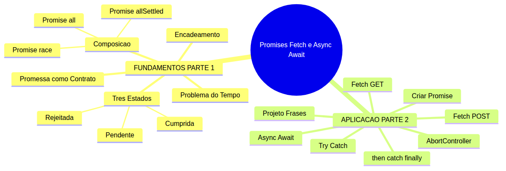


> *O mapa mental acima mostra a estrutura da aula. Cada ramo representa um conceito que você vai explorar.*

***

## Recapitulação da Aula 26

A Aula 26 foi seu mergulho no modelo assíncrono do JavaScript. Você aprendeu:

| Aula | Conceito | Onde aparece nesta aula | Revisado |
|---|---|---|---|
| Aula 26 | **Síncrono vs Assíncrono** (Event Loop, call stack, microtask/macrotask) | Promises usam a microtask queue; `.then()` entra como microtarefa | [ ] |
| Aula 26 | **setTimeout e setInterval** (timers, agendamento) | `new Promise((resolve) => setTimeout(resolve, ms))` — criar Promise com timer | [ ] |
| Aula 26 | **AbortController** (signal, abort, AbortError) | Conectar AbortController ao fetch via `signal` para cancelar requisições | [ ] |
| Aula 26 | **Callback Hell** (aninhamento profundo de callbacks) | Promise é a SOLUÇÃO para Callback Hell; `.then()` substitui callbacks aninhados | [ ] |
| Aula 26 | **queueMicrotask** (microtarefas) | `.then()` e `.catch()` entram na microtask queue — mesmo mecanismo | [ ] |

**Estado do Gerenciador pós-Aula 26:** componentes Custom Elements, persistência com IndexedDB, File API, observers, geolocalização, notificações, speech, debounce com setTimeout, AbortController para cancelar operações IndexedDB. O que ele NÃO tem ainda: comunicação HTTP, Promises, fetch, async/await.

**O problema que a Aula 26 deixou aberto:** no final dela, você viu o Callback Hell — callbacks aninhados que tornam o código quase ilegível. Promise é a ferramenta que resolve esse problema de raiz. Vamos entender como.

***

**FUNDAMENTOS: Promessas, Valor Futuro e Controle de Fluxo Assíncrono**

> *Os conceitos desta seção são universais — valem para qualquer linguagem ou sistema que lide com operações que demoram. Usamos exclusivamente analogias do cotidiano: vale-presente, correios, encomendas, pizza e jantar. Na segunda parte, você verá como JavaScript implementa cada um deles.*

***

## 1. O Problema do Tempo — Quando o Resultado Não Chega na Hora

Você está em um restaurante. Faz o pedido ao garçom: um prato que leva 20 minutos para ficar pronto.

O que você faz nesses 20 minutos? Fica parado olhando para a porta da cozinha esperando? Claro que não. Você continua conversando, bebe água, olha o celular. Você simplesmente **segue vivendo** enquanto o prato não chega.

Este é o problema central do código assíncrono: **você precisa de um valor que ainda não existe**. O prato não está pronto. O arquivo não terminou de baixar. A resposta do servidor ainda não chegou. Você não pode simplesmente parar o programa e esperar — o usuário não pode ficar olhando para uma tela congelada.

### O Mundo É Cheio de Esperas

Veja situações do dia a dia onde o resultado demora:

- **Download de arquivo**: você clica em "baixar" e continua usando o computador. A barra de progresso mostra o andamento. Você não fica parado olhando para o ícone de download.
- **Carta registrada**: você posta uma carta e recebe um comprovante com número de rastreio. A resposta do destinatário chega dias depois — você não fica na porta de casa esperando o carteiro.
- **Encomenda online**: você compra um produto e recebe um código de rastreio. O produto está "a caminho". Você pode consultar o status quando quiser. Um dia ele chega.

Em todos esses casos, o padrão é o mesmo:

1. **Você inicia a operação** (faz o pedido, posta a carta, clica em baixar)
2. **Você recebe um comprovante** (número do pedido, código de rastreio)
3. **O comprovante é sua conexão com o resultado futuro**
4. **Você continua sua vida** enquanto o resultado não chega
5. **Quando o resultado chega, você é notificado** (a campainha toca, o status muda)

> *Até aqui, você já entendeu o problema que as promessas resolvem: operações que demoram e a necessidade de continuar fazendo outras coisas enquanto esperamos. Isso já é MUITO. Respire. Se algo não ficou claro, releia o parágrafo acima — não tem problema nenhum voltar.*

### Quick Check 1

**1. Você pede uma pizza delivery. Entre fazer o pedido e a pizza chegar, o que você faz? Isso é síncrono ou assíncrono?**
**Resposta:** Você faz outras coisas — vê TV, trabalha, toma banho. É assíncrono: você iniciou a operação (pediu a pizza) e continua vivendo enquanto ela não chega. Você só é notificado quando a campainha toca.

**2. Qual destas situações descreve comportamento síncrono (bloqueante)? (a) Enviar uma mensagem e o app não responder até a mensagem ser entregue. (b) Baixar um arquivo e continuar navegando. (c) Fazer um pedido online e receber email de confirmação horas depois.**
**Resposta:** (a) é síncrono — o app trava até a mensagem ser entregue. (b) e (c) são assíncronos — você continua usando o programa enquanto a operação rola em segundo plano.

***

## 2. Promessa como Contrato de Valor Futuro

No mundo real, quando você não pode ter algo imediatamente, você recebe uma **promessa** de que aquilo vai chegar. Uma promessa não é o valor em si — é um **contrato** que garante que você terá o valor no futuro, ou saberá se algo deu errado.

### Três Analogias para Entender

**Analogia 1 — O Vale-Presente**

Você ganha um vale-presente de R$100 de aniversário. O vale não é o dinheiro — é uma **promessa** de que você pode trocá-lo por R$100 em produtos na loja.

- Enquanto você não troca, o vale está **pendente** — ele representa um valor que ainda não foi usado.
- Quando você vai à loja e troca o vale por um livro, a promessa foi **cumprida** — você recebeu o valor.
- Se a loja falir antes de você trocar, a promessa foi **rejeitada** — você perdeu o valor e há um motivo (a loja fechou).

**Analogia 2 — O Bilhete de Loteria**

Você compra um bilhete de loteria por R$5. Enquanto o sorteio não sai, o bilhete é uma **promessa** de que você *pode* ganhar.

- Antes do sorteio: **pendente** — você não sabe se ganhou.
- Depois do sorteio, se você acertou: **cumprida** — você recebe o prêmio.
- Depois do sorteio, se você errou: **rejeitada** — você não ganhou, mas sabe o motivo (não acertou os números).

**Analogia 3 — O Rastreio dos Correios**

Você posta uma encomenda e recebe um código de rastreio. Esse código é a **promessa** de que a encomenda será entregue.

- Enquanto está "em trânsito": **pendente** — o pacote está a caminho.
- Quando chega ao destino: **cumprida** — a encomenda foi entregue.
- Se extravia: **rejeitada** — a encomenda não chegou e há um motivo.

Em todas as analogias, note algo importante: **a promessa não é o resultado final**. O vale-presente não é o livro. O bilhete não é o prêmio. O código de rastreio não é a encomenda. A promessa é um **objeto intermediário** que representa o valor futuro.


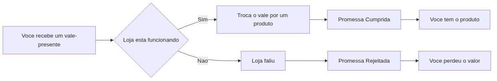


**Por que isso importa para você:** Em programação, você não pode "esperar" um resultado que demora — o programa congelaria. Em vez disso, você recebe uma **Promise**, que é exatamente isso: um objeto que representa um valor futuro. Você guarda esse objeto, continua executando outras coisas, e quando a Promise se resolve, você processa o resultado.

**Quick Check 2**

**1. Na analogia do vale-presente, o que é a "promessa" e o que é o "valor futuro"?**
**Resposta:** A promessa é o vale-presente em si (o objeto intermediário). O valor futuro é o produto que você vai comprar com ele (o resultado da operação).

**2. Identifique a promessa e o valor futuro em uma compra online: você compra um livro e recebe um "pedido confirmado" com previsão de entrega de 5 dias.**
**Resposta:** A promessa é o número do pedido / confirmação (o comprovante). O valor futuro é o livro físico que chegará em 5 dias (ou a mensagem de "produto indisponível" se cancelar).

***

## 3. Os Três Estados de uma Promessa

Toda promessa — no mundo real ou na programação — passa por exatamente **três estados possíveis**, em uma sequência que nunca volta atrás.

### A Analogia Central: Encomenda nos Correios

Você postou um pacote. Vamos acompanhar a jornada dele:

**Estado 1 — Pendente (Pending)**

O pacote saiu da sua cidade. Ele está em trânsito. Você não sabe se vai chegar. Você não sabe quando vai chegar. Tudo que você sabe é que ele **está a caminho**.

Características do estado pendente:
- É o estado INICIAL de toda promessa
- Você não tem o resultado ainda
- Você não sabe se vai dar certo ou errado
- Você pode registrar o que fazer "quando chegar" e "se não chegar"

**Estado 2 — Cumprida (Fulfilled)**

O pacote chegou ao destino. O destinatário recebeu. A promessa foi cumprida com **sucesso**.

Características do estado cumprida:
- Há um **valor disponível** (o pacote entregue)
- A transição é irreversível — uma vez cumprida, nunca volta a ser pendente
- Qualquer código que dependia desse valor pode agora executar

**Estado 3 — Rejeitada (Rejected)**

O pacote extraviou. Ou foi roubado. Ou o endereço não existe. A promessa **falhou**.

Características do estado rejeitada:
- Há um **motivo do erro** (o pacote foi perdido, o endereço está errado)
- A transição é irreversível — uma vez rejeitada, nunca volta a ser pendente
- Você sabe por que falhou, e pode tratar o erro adequadamente


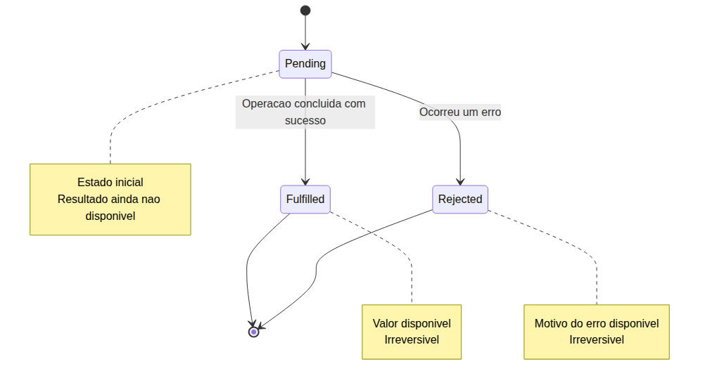


### As Regras de Ouro

1. **Toda promessa começa PENDENTE.** Não existe promessa que já nasce cumprida ou rejeitada (embora existam atalhos, como veremos na Parte 2).
2. **De pendente, ela vai para cumprida OU rejeitada — nunca para as duas.** É como uma moeda: ou dá cara ou dá coroa, nunca os dois ao mesmo tempo.
3. **Uma vez que saiu de pendente, nunca mais volta.** É irreversível. Uma promessa cumprida não pode "descumprir". Uma promessa rejeitada não pode ser "aceita depois". O que passou, passou.
4. **Você pode registrar ações para qualquer estado a qualquer momento.** Pode registrar o que fazer "quando cumprir" antes mesmo de a promessa sair de pendente. Pode registrar depois que já foi cumprida (você recebe o valor imediatamente).

> *Você pode estar pensando: "mas no mundo real, uma encomenda pode voltar para a central e ser reenviada". Isso não é a promessa voltando a ser pendente — é uma NOVA promessa. A original foi rejeitada (extraviou), e uma nova foi criada (o reenvio). Na programação, é exatamente assim: se uma operação falha, você cria uma nova promessa, não revive a antiga.*

### Quick Check 3

**1. Classifique cada cenário no estado correspondente: (a) Você pediu um Uber e o motorista está a caminho. (b) O Uber chegou e você entrou no carro. (c) O Uber cancelou a corrida porque estava muito longe.**
**Resposta:** (a) Pendente — o motorista está a caminho, você não sabe se vai dar certo ainda. (b) Cumprida — a promessa se realizou, o carro chegou. (c) Rejeitada — a corrida foi cancelada, há um motivo (distância).

**2. Uma promessa que foi cumprida pode voltar a ser pendente? Por que?**
**Resposta:** Não. A transição é irreversível. Uma vez que a promessa sai de pendente, nunca mais volta. É como um ovo que já foi frito — não tem como voltar a ser ovo cru. Se você precisa de uma nova operação, cria uma nova promessa.

***

## 4. Encadeamento — Uma Promessa que Depende de Outra

Muitas vezes, você precisa do resultado de UMA operação para iniciar a PRÓXIMA. É como uma linha de montagem: cada etapa só começa quando a anterior termina.

### A Linha de Produção de Pizza

Imagine fazer uma pizza do zero. São várias etapas, e cada uma depende da anterior:

1. **Promessa 1**: o fornecedor entrega a farinha
2. **Promessa 2**: com a farinha, você faz a massa
3. **Promessa 3**: com a massa pronta, você monta a pizza
4. **Promessa 4**: com a pizza montada, você assa
5. **Promessa 5**: com a pizza assada, você entrega ao cliente

Cada passo é uma promessa que depende do resultado do passo anterior. Se a farinha não chegar (Promessa 1 rejeitada), a pizza inteira falha — não há massa para os passos seguintes.

O erro se PROPAGA pela corrente. Se a farinha não chega, não adianta tentar montar a pizza — o erro da primeira promessa faz todas as seguintes falharem também.

### Outra Analogia: Processo Seletivo

- Enviar currículo → se aceito:
  - Fazer entrevista → se aprovado:
    - Fazer exame médico → se apto:
      - Assinar contrato

Cada etapa depende da anterior. Se você for reprovado na entrevista, as etapas seguintes (exame médico, assinatura) nem acontecem. O erro parou a corrente.


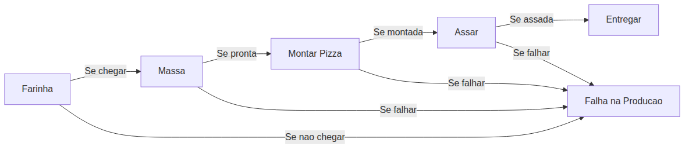


**O padrão é sempre o mesmo:** uma corrente de operações onde cada elo depende do anterior. O resultado de uma vira entrada da próxima. Se qualquer elo quebrar, a corrente inteira para.

A beleza das promessas (como você verá na Parte 2) é que esse encadeamento é **linear e legível** — diferente dos callbacks aninhados que você viu na Aula 26.

### Quick Check 4

**1. Na linha de produção da pizza, o que acontece se a massa ficar queimada (Promessa 2 rejeitada)?**
**Resposta:** A corrente para. A pizza não é montada, assada nem entregue. O erro se propaga — as promessas seguintes (montar, assar, entregar) nem chegam a começar.

**2. Por que você não pode começar a assar a pizza antes de montá-la?**
**Resposta:** Porque o resultado de montar (a pizza montada) é a ENTRADA necessária para assar. Você não pode assar algo que ainda não foi montado. Na programação, o mesmo vale: o resultado de uma Promise vira argumento da próxima.

***

## 5. Composição — Esperando Várias Promessas ao Mesmo Tempo

Nem toda situação é uma corrente onde um passo depende do anterior. Às vezes, você precisa de VÁRIAS promessas que podem ser resolvidas em paralelo — e o que você faz com elas depende do seu objetivo.

### O Cenário Base: Preparando um Jantar Completo

Você vai preparar um jantar: arroz, feijão, carne grelhada e salada. Você pode:

- Preparar tudo em sequência (primeiro o arroz, depois o feijão, etc.) — demora o DOBRO do tempo
- OU preparar em paralelo (arroz no fogo, feijão no outro fogo, carne na grelha, salada sendo cortada)

Quando você prepara em paralelo, precisa de uma estratégia para **compor** os resultados.

### Estratégia 1: Esperar TODAS (Promise.all)

Você precisa do arroz, feijão, carne e salada PRONTOS para servir o prato. Se QUALQUER um queimar, o jantar está arruinado.

**Quando usar:** quando todas as partes são necessárias e uma falha invalida o todo. Exemplo: você precisa de dados de 3 APIs diferentes para montar uma página. Se qualquer API falhar, a página não pode ser montada.

### Estratégia 2: Primeira que Chegar (Promise.race)

Dois aplicativos de entrega — você pede o mesmo produto nos dois. O primeiro que entregar, você aceita. O outro você cancela.

**Quando usar:** quando você precisa do resultado mais rápido, independente de qual fonte venha. Exemplo: você consulta 2 servidores diferentes pelo mesmo dado, e quer o que responder primeiro (para reduzir latência).

### Estratégia 3: Saber o que deu Certo e o que deu Errado (Promise.allSettled)

Você encomendou 5 itens de lojas diferentes. Quer saber QUAIS chegaram e QUAIS não chegaram — mesmo que alguns falhem, você ainda quer os que chegaram.

**Quando usar:** quando cada promessa é independente e você quer processar resultados parciais. Exemplo: você envia 10 notificações push. Algumas podem falhar (usuário offline), mas você quer saber quais foram enviadas com sucesso e quais não.


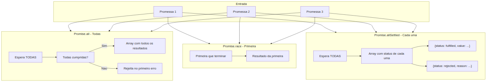


### Tabela Comparativa

| Estratégia | Analogia | Resultado se uma falhar | Uso típico |
|---|---|---|---|
| **TODAS** (all) | Jantar completo | Tudo falha | Dados essenciais para montar página |
| **PRIMEIRA** (race) | Dois entregadores | Ignora as outras | Quem responder primeiro vence |
| **TODAS + status** (allSettled) | 5 encomendas | Cada uma com seu status | Operações independentes |

> *Até aqui, você já entendeu os CINCO conceitos fundamentais sobre promessas: (1) o problema do tempo, (2) promessa como contrato, (3) os três estados, (4) encadeamento e (5) composição. Isso já é MUITO. Respire. Na Parte 2, vamos implementar TUDO isso em JavaScript.*

### Quick Check 5

**1. Você precisa buscar dados do usuário, seus pedidos e suas notificações — 3 chamadas de API independentes. Se qualquer uma falhar, a página não pode ser carregada. Qual estratégia usar?**
**Resposta:** Promise.all (TODAS). Você precisa de todas as três para montar a página. Se uma falha, a página não faz sentido sem ela.

**2. Você envia um email de confirmação e um SMS de aviso para 100 usuários. Quer saber quantos emails foram enviados com sucesso e quantos SMS falharam, mas não quer que uma falha individual pare o processo. Qual estratégia usar?**
**Resposta:** Promise.allSettled (TODAS + status). Cada envio é independente — a falha de um não impede o sucesso dos outros. Você quer processar os resultados parciais.

***

**APLICAÇÃO: Promises, Fetch e Async/Await no JavaScript**

> *Agora que você entende o que são promessas, seus estados, encadeamento e composição como conceitos universais, vamos implementar tudo isso em JavaScript. Você verá como cada analogia da Parte 1 se materializa em código real.*

***

## 6. Promise em JavaScript — Criando e Consumindo

Na Parte 1, você aprendeu que uma promessa é um objeto que representa um valor futuro. Em JavaScript, esse objeto existe de verdade: é a classe **`Promise`**.

### O Construtor: new Promise()

Para criar uma promessa, você usa `new Promise(executor)`. O **executor** é uma função que recebe dois parâmetros: `resolve` e `reject`.

```javascript
const minhaPromise = new Promise((resolve, reject) => {
  // Dentro daqui, você faz a operação demorada
  // Se der certo: chama resolve(valor)
  // Se der errado: chama reject(motivo)
})
```

- `resolve(valor)` → transita a promessa para **fulfilled** (cumprida). O valor passado é o resultado da operação.
- `reject(motivo)` → transita a promessa para **rejected** (rejeitada). O motivo é o erro que ocorreu.

Veja um exemplo real — uma promessa que simula um timer:

```javascript
const promessaTimer = new Promise((resolve, reject) => {
  console.log('Timer iniciado. Esperando 2 segundos...')
  
  setTimeout(() => {
    resolve('Timer concluido!');
  }, 2000)
})
```

Lembre-se da Aula 26: `setTimeout` é uma função assíncrona. O callback dela executa depois de 2 segundos na macrotask queue. Dentro desse callback, chamamos `resolve()`, que transita a promessa para fulfilled.

### Consumindo: .then(), .catch(), .finally()

Uma promessa não serve para nada se você não puder **reagir** quando ela for resolvida ou rejeitada. É para isso que servem os métodos `.then()`, `.catch()` e `.finally()`.

```javascript
promessaTimer
  .then((resultado) => {
    console.log(resultado) // "Timer concluido!"
  })
  .catch((erro) => {
    console.error('Erro:', erro)
  })
  .finally(() => {
    console.log('Operacao finalizada (sucesso ou erro)')
  })
```

**O que cada um faz:**

- **`.then(callback)`**: o callback executa QUANDO a promessa for cumprida (fulfilled). Recebe o valor resolvido como argumento.
- **`.catch(callback)`**: o callback executa QUANDO a promessa for rejeitada (rejected). Recebe o motivo do erro.
- **`.finally(callback)`**: o callback executa SEMPRE, independente de sucesso ou erro. Ideal para limpeza (esconder spinner, fechar conexão).

### Como o JavaScript "Sabe" Quando Executar?

Conexão com a Aula 26: quando você chama `.then(callback)`, o callback NÃO executa na hora. Ele é armazenado internamente pela Promise. Quando `resolve(valor)` é chamado (mesmo que 10 minutos depois), o callback do `.then()` é colocado na **microtask queue**.

Lembra do Event Loop? Microtarefas executam ANTES da próxima macrotarefa. É por isso que `.then()` responde mais rápido que `setTimeout` — mesmo que ambos estejam aguardando a call stack esvaziar, o `.then()` pula na frente.

### Criando uma Promise que Rejeita

Vamos modificar o exemplo do timer para que ele REJEITE em vez de resolver:

```javascript
const promessaFalha = new Promise((resolve, reject) => {
  setTimeout(() => {
    reject(new Error('Algo deu errado!'));
  }, 2000)
})

promessaFalha
  .then((resultado) => {
    console.log('Isso nunca executa')
  })
  .catch((erro) => {
    console.error('Erro capturado:', erro.message) // "Algo deu errado!"
  })
```

Note que o `.then()` nunca executa — a promessa foi rejeitada, não cumprida. O `.catch()` captura o erro.

### Encadeamento — A Solução para o Callback Hell

Lembra do Callback Hell da Aula 26? Callbacks aninhados que criavam uma "pirâmide da desgraça"? Promise resolve isso com encadeamento limpo:

```javascript
// ANTES — Callback Hell (Aula 26)
setTimeout(() => {
  console.log('Passo 1')
  setTimeout(() => {
    console.log('Passo 2')
    setTimeout(() => {
      console.log('Passo 3')
      setTimeout(() => {
        console.log('Passo 4')
      }, 1000)
    }, 1000)
  }, 1000)
}, 1000)

// DEPOIS — Promise Chain
function delay(ms) {
  return new Promise((resolve) => setTimeout(resolve, ms))
}

delay(1000)
  .then(() => { console.log('Passo 1'); return delay(1000) })
  .then(() => { console.log('Passo 2'); return delay(1000) })
  .then(() => { console.log('Passo 3'); return delay(1000) })
  .then(() => { console.log('Passo 4'); return delay(1000) })
  .catch((erro) => console.error('Erro na corrente:', erro))
```

**A mágica aqui:** cada `.then()` retorna uma NOVA Promise. Se você retorna um valor, a nova Promise é resolvida com ele. Se você retorna outra Promise (como `delay(1000)`), a nova Promise espera essa Promise resolver.

O `.catch()` no final captura erro de QUALQUER ponto da corrente. Se o Passo 2 falhar, o Passo 3 e 4 nem executam — o erro "pula" direto para o `.catch()`. Isso é o **encadeamento com propagação de erro** que vimos na analogia da pizza.


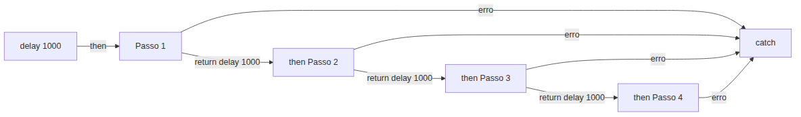


**Mão na Massa 1 — Criando sua primeira Promise:**

- [ ] Abra o console do navegador (F12 > Console)
- [ ] Crie uma função `esperar(ms)` que retorna uma Promise que resolve após `ms` milissegundos usando `setTimeout` e `resolve`
- [ ] Teste: `esperar(2000).then(() => console.log('2 segundos depois'))`
- [ ] Adicione `.catch()`: se a Promise rejeitar, exiba o erro
- [ ] Adicione `.finally()`: exiba "Operacao finalizada" independente do resultado

**Verificação:** Após 2 segundos, você vê "2 segundos depois" no console. O `.finally()` sempre executa.

### Quick Check 6

**1. O que acontece se você chamar `resolve(42)` e depois `reject('erro')` na mesma Promise?**
**Resposta:** A primeira chamada vence. Uma vez que `resolve(42)` é chamado, a promessa transita para fulfilled e nunca mais muda. `reject('erro')` é ignorado silenciosamente. Lembre-se: a transição é irreversível.

**2. No encadeamento `.then().then().then()`, onde um único `.catch()` captura erros?**
**Resposta:** Um único `.catch()` no final captura erros de QUALQUER `.then()` anterior. Se o primeiro `.then()` lançar um erro, os `.then()` seguintes são pulados e o erro vai direto para o `.catch()`. É como a pizza: se a farinha não chega, as etapas seguintes nem começam.

***

## 7. Compondo Promises — all, race, allSettled na Prática

Você aprendeu as três estratégias de composição na Parte 1 (jantar, entregadores, encomendas). Agora vamos implementá-las em JavaScript.

### Preparando o Cenário

Vamos criar três promessas com timers diferentes para testar:

```javascript
const p1 = new Promise((resolve) => setTimeout(() => resolve('P1: 1 segundo'), 1000))
const p2 = new Promise((resolve) => setTimeout(() => resolve('P2: 2 segundos'), 2000))
const p3 = new Promise((resolve) => setTimeout(() => resolve('P3: 3 segundos'), 3000))
```

### Promise.all() — Todas

```javascript
Promise.all([p1, p2, p3])
  .then((resultados) => {
    console.log(resultados)
    // ['P1: 1 segundo', 'P2: 2 segundos', 'P3: 3 segundos']
    // Aparece APOS 3 segundos (a mais lenta)
  })
  .catch((erro) => {
    console.error('Uma das promessas falhou:', erro)
  })
```

`Promise.all` recebe um ARRAY de promessas e retorna uma nova Promise que:
- **Resolve** com um array contendo TODOS os resultados, na mesma ordem das promessas originais
- **Rejeita** no PRIMEIRO erro — se qualquer promessa rejeitar, a Promise.all inteira rejeita

O tempo total é o tempo da promessa MAIS LENTA (3 segundos, no caso).

### Promise.race() — Primeira

```javascript
Promise.race([p1, p2, p3])
  .then((resultado) => {
    console.log(resultado)
    // 'P1: 1 segundo' — a primeira que resolveu
  })
```

`Promise.race` retorna uma Promise que resolve ou rejeita com o resultado da PRIMEIRA promessa que terminar. As outras continuam executando, mas seus resultados são ignorados.

### Promise.allSettled() — Cada uma com seu Status

```javascript
const pErro = new Promise((_, reject) => setTimeout(() => reject('Falhou!'), 500))

Promise.allSettled([p1, p2, p3, pErro])
  .then((resultados) => {
    console.log(resultados)
    // [
    //   { status: 'fulfilled', value: 'P1: 1 segundo' },
    //   { status: 'fulfilled', value: 'P2: 2 segundos' },
    //   { status: 'fulfilled', value: 'P3: 3 segundos' },
    //   { status: 'rejected', reason: 'Falhou!' }
    // ]
  })
```

`Promise.allSettled` NUNCA rejeita. Ela espera TODAS as promessas terminarem (seja cumpridas ou rejeitadas) e retorna um array com o status de cada uma. Perfeito para operações independentes.

### Atalhos: Promise.resolve() e Promise.reject()

Para criar promessas já resolvidas sem usar o construtor:

```javascript
const jaCumprida = Promise.resolve(42)
jaCumprida.then((v) => console.log(v)) // 42 (imediatamente)

const jaRejeitada = Promise.reject(new Error('Deu ruim'))
jaRejeitada.catch((e) => console.error(e.message)) // "Deu ruim" (imediatamente)
```

### Tabela de Decisão

| Método | Retorna quando | Se uma falha | Resultado |
|---|---|---|---|
| `Promise.all` | TODAS terminarem | Rejeita imediatamente | Array de valores |
| `Promise.race` | PRIMEIRA terminar | Rejeita na primeira | Valor único |
| `Promise.allSettled` | TODAS terminarem | Nunca rejeita | Array de objetos `{ status, value/reason }` |

**Mão na Massa 2 — Testando composição:**

- [ ] Crie 3 promessas com timers diferentes (1s, 2s, 3s)
- [ ] Teste `Promise.all([p1, p2, p3]).then(console.log)` — veja que espera 3s
- [ ] Teste `Promise.race([p1, p2, p3]).then(console.log)` — veja que resolve em 1s
- [ ] Crie uma promessa que rejeita. Teste `Promise.allSettled()` — veja que todas aparecem

**Verificação:** No console, você vê os arrays de resultados. `all` mostra todos os 3 valores. `race` mostra apenas o mais rápido. `allSettled` mostra o status de cada uma, incluindo a que falhou.

### Quick Check 7

**1. Você tem 3 promessas: p1 (resolve em 2s), p2 (resolve em 1s), p3 (rejeita em 0.5s). Quanto tempo leva para `Promise.all([p1, p2, p3])` resolver ou rejeitar?**
**Resposta:** 0.5 segundos. `Promise.all` rejeita no PRIMEIRO erro. p3 rejeita em 0.5s, então a Promise.all inteira rejeita nesse momento, mesmo que p1 e p2 ainda não tenham terminado.

**2. Qual método usar para enviar 5 notificações push independentes e saber quais foram enviadas com sucesso?**
**Resposta:** `Promise.allSettled`. Cada notificação é independente — a falha de uma não deve impedir as outras. Você quer o status de cada uma (fulfilled/rejected) para processar os resultados parciais.

***

## 8. Fetch API — Comunicação HTTP com Promises (GET)

Até agora, trabalhamos com promessas que nós mesmos criamos com `new Promise()`. Mas o principal uso de Promises no navegador é a comunicação com servidores via HTTP. É para isso que existe a **Fetch API**.

### O que é fetch?

`fetch()` é uma função nativa do navegador que faz requisições HTTP e retorna uma **Promise de Response**.

```javascript
const promiseResposta = fetch('https://api.exemplo.com/dados')
```

O que essa linha faz:
1. O navegador inicia uma requisição HTTP para a URL
2. `fetch()` retorna IMEDIATAMENTE uma Promise (pending)
3. Quando o servidor RESPONDER (mesmo que com erro 404), a Promise resolve
4. O valor resolvido é um objeto `Response`

### Entendendo a Resposta

O objeto `Response` tem várias propriedades importantes:

```javascript
fetch('https://api.exemplo.com/dados')
  .then((resposta) => {
    console.log('Status:', resposta.status)     // 200, 404, 500...
    console.log('OK?', resposta.ok)             // true se status 200-299
    console.log('Status text:', resposta.statusText) // "OK", "Not Found"
    console.log('Headers:', resposta.headers)   // Metadados da resposta
  })
```

- **`resposta.status`**: o código HTTP numérico (200 = sucesso, 404 = não encontrado, 500 = erro do servidor)
- **`resposta.ok`**: booleano — `true` se status estiver entre 200 e 299. É a forma mais comum de verificar sucesso.
- **`resposta.statusText`**: o texto associado ao status ("OK", "Not Found", "Internal Server Error")

### Extraindo o Corpo da Resposta

A resposta HTTP tem um **corpo** (body) que contém os dados. Como o corpo pode ser grande e chegar em partes, `response.json()` retorna OUTRA Promise:

```javascript
fetch('https://api.quotable.io/random')
  .then((resposta) => {
    if (!resposta.ok) {
      throw new Error(`HTTP error! status: ${resposta.status}`)
    }
    return resposta.json() // Retorna OUTRA Promise!
  })
  .then((dados) => {
    console.log('Frase:', dados.content)
    console.log('Autor:', dados.author)
  })
  .catch((erro) => {
    console.error('Erro na requisicao:', erro.message)
  })
```

**Por que `.json()` retorna outra Promise?** Porque o corpo da resposta pode ser muito grande. O navegador precisa ler os dados que estão chegando pela rede — e isso é assíncrono. Enquanto o corpo não chega completamente, você não pode usá-lo.

Alternativas a `.json()`:
- `resposta.text()` → retorna Promise<string> (útil para HTML, XML, CSV)
- `resposta.blob()` → retorna Promise<Blob> (útil para imagens, arquivos)
- `resposta.formData()` → retorna Promise<FormData> (útil para formulários)

### O Erro Comum que PEGA Todo Mundo

**`fetch` só rejeita em erro de REDE.** Se o servidor responder com status 404 ou 500, o `fetch` resolve NORMALMENTE (a Promise é cumprida). O `response.ok` será `false`, mas a Promise não rejeita.

```javascript
// ISTO NÃO FUNCIONA como esperado:
fetch('https://api.quotable.io/nao-existe')
  .then((res) => {
    // Este .then EXECUTA mesmo para 404!
    // A Promise do fetch foi cumprida (o servidor respondeu)
    return res.json()
  })
  .then((dados) => {
    console.log('Dados:', dados) // Pode ser uma pagina 404 em HTML
  })
  .catch((erro) => {
    // Este catch SÓ captura erro de REDE (sem internet, DNS falhou)
    console.log('Nunca executa para 404')
  })
```

A correção é SEMPRE verificar `response.ok`:

```javascript
fetch('https://api.quotable.io/random')
  .then((res) => {
    if (!res.ok) {
      throw new Error(`HTTP ${res.status}: ${res.statusText}`)
    }
    return res.json()
  })
  .then((dados) => {
    console.log(dados.content, '-', dados.author)
  })
  .catch((erro) => {
    // Aqui CAEM tanto erros de rede QUANTO erros HTTP (via throw)
    console.error('Erro:', erro.message)
  })
```

### Caso Real: Buscando Frases Motivacionais

A API `quotable.io` retorna uma frase aleatória no formato:
```json
{
  "_id": "abc123",
  "content": "A persistência é o caminho do êxito.",
  "author": "Charles Chaplin"
}
```

```javascript
const url = 'https://api.quotable.io/random'

fetch(url)
  .then((res) => {
    if (!res.ok) throw new Error('Falha ao buscar frase')
    return res.json()
  })
  .then((frase) => {
    console.log(`"${frase.content}"`)
    console.log(`-- ${frase.author}`)
  })
  .catch((erro) => {
    console.error('Nao foi possivel buscar frase:', erro.message)
  })
```


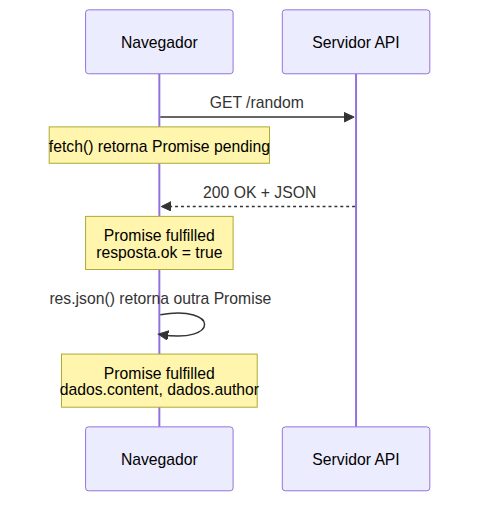


**Mão na Massa 3 — Primeira requisição real:**

- [ ] Abra o console do navegador (F12). Certifique-se de estar em uma página servida por HTTP (Live Server ou similar), pois `fetch` não funciona com `file://`
- [ ] Digite: `fetch('https://api.quotable.io/random').then(r => console.log(r))` — veja o objeto Response
- [ ] Agora faça o fluxo completo com verificação de `response.ok`:
```javascript
fetch('https://api.quotable.io/random')
  .then(res => { if (!res.ok) throw new Error('HTTP ' + res.status); return res.json() })
  .then(dados => console.log(`"${dados.content}" -- ${dados.author}`))
  .catch(erro => console.error('Erro:', erro))
```
- [ ] Teste com uma URL inválida: `fetch('https://api.quotable.io/invalida')` — veja que a Promise resolve (status 404), mas `res.ok` é `false`

**Verificação:** Uma frase aleatória aparece no console com autor. Se testar URL inválida, você vê a mensagem de erro "HTTP 404" (porque você verificou `response.ok` e lançou o erro manualmente).

### Quick Check 8

**1. `fetch` rejeita a Promise para status HTTP 404? Por que?**
**Resposta:** Não. `fetch` só rejeita para erros de REDE (sem internet, DNS falhou, timeout de conexão). Status HTTP 404, 500, 301 etc. são RESPOSTAS do servidor — a comunicação aconteceu, então a Promise cumpre. Você precisa verificar `response.ok` para detectar esses erros.

**2. Por que `response.json()` retorna uma Promise, e não o JSON diretamente?**
**Resposta:** Porque o corpo da resposta pode ser grande e chegar em partes pela rede. O navegador precisa ler o fluxo de dados de forma assíncrona. Enquanto os dados não chegam completamente, o JSON não pode ser extraído. A Promise de `.json()` só resolve quando o corpo inteiro foi recebido e parseado.

***

## 9. Enviando Dados com Fetch (POST)

Até agora, usamos `fetch()` apenas para buscar dados (GET). Mas a Fetch API também permite **enviar** dados para um servidor usando o método HTTP **POST** — e também PUT, DELETE e PATCH.

### A Estrutura do POST

O `fetch()` aceita um segundo argumento: um objeto de opções onde você configura o método, os cabeçalhos e o corpo da requisição.

```javascript
fetch(url, {
  method: 'POST',          // Método HTTP
  headers: {                // Cabeçalhos da requisição
    'Content-Type': 'application/json'
  },
  body: JSON.stringify(dados)  // Corpo da requisição (string)
})
```

**Cada campo explicado:**

- **`method`**: o verbo HTTP. `'POST'` para criar, `'PUT'` para atualizar, `'DELETE'` para remover, `'PATCH'` para atualização parcial.
- **`headers`**: um objeto com metadados da requisição. O mais importante é `Content-Type`, que informa ao servidor o formato dos dados que você está enviando. `'application/json'` significa "estou enviando JSON".
- **`body`**: o corpo da requisição. Precisa ser uma STRING — por isso usamos `JSON.stringify(dados)` para converter um objeto JavaScript em string JSON.

### Exemplo Prático: JSONPlaceholder

Vamos usar a API JSONPlaceholder, que aceita POST e retorna os dados que enviamos:

```javascript
const dados = {
  title: 'Aprender Promises',
  completed: false
}

fetch('https://jsonplaceholder.typicode.com/posts', {
  method: 'POST',
  headers: {
    'Content-Type': 'application/json'
  },
  body: JSON.stringify(dados)
})
  .then((res) => {
    if (!res.ok) throw new Error(`HTTP ${res.status}`)
    return res.json()
  })
  .then((resultado) => {
    console.log('Criado com ID:', resultado.id) // 101 (simulado)
    console.log('Resposta:', resultado)
  })
  .catch((erro) => {
    console.error('Erro ao criar:', erro.message)
  })
```

### O Fluxo Completo


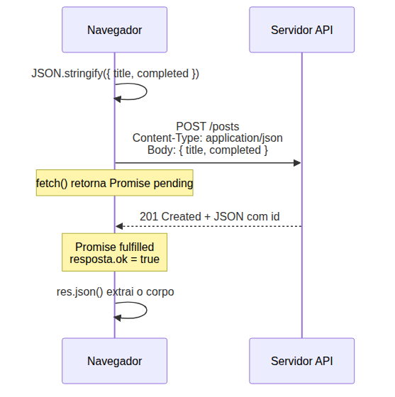


### Content-Type: O Que é e Por Que Importa?

O cabeçalho `Content-Type` diz ao servidor **como interpretar** o corpo da requisição. Os valores mais comuns:

| Content-Type | Para que serve |
|---|---|
| `application/json` | Enviar objetos JavaScript como JSON |
| `application/x-www-form-urlencoded` | Dados de formulário tradicional |
| `multipart/form-data` | Upload de arquivos |
| `text/plain` | Texto puro |

Se você esquecer de definir `Content-Type: application/json`, muitos servidores não vão conseguir interpretar seu corpo e podem rejeitar a requisição com status 400 (Bad Request).

### E no Nosso Projeto? Salvando no IndexedDB

A API pública de frases (quotable.io) não aceita POST — ela é somente leitura. Para o nosso projeto, vamos **simular** um POST salvando a frase no IndexedDB, que é onde o Gerenciador de Tarefas persiste os dados.

Lembra da Aula 23? As operações do IndexedDB são assíncronas — você abre uma transação, faz a operação e lida com callbacks de sucesso/erro. Vamos criar um **wrapper** que transforma a transação do IndexedDB em uma Promise:

```javascript
function salvarFrase(frase) {
  return new Promise((resolve, reject) => {
    const request = db.transaction(['frases'], 'readwrite')
      .objectStore('frases')
      .add(frase)

    request.onsuccess = () => resolve(request.result) // O ID gerado
    request.onerror = () => reject(request.error)
  })
}
```

**O padrão é sempre o mesmo:** uma função que inicia uma operação assíncrona, retorna uma Promise, e dentro do executor conecta `resolve` aos callbacks de sucesso e `reject` aos callbacks de erro.

> *Talvez você esteja pensando: "mas isso não é um POST de verdade". Exato. O POST real faz a mesma coisa — envia dados para um servidor remoto que processa e responde. A diferença é que aqui o "servidor" é o próprio navegador (IndexedDB). A estrutura conceitual é idêntica: você envia dados, espera a operação assíncrona completar, e recebe um resultado (o ID gerado).*

**Mão na Massa 4 — Enviando dados (simulado):**

- [ ] Abra seu Gerenciador de Tarefas (`index.html`) com Live Server
- [ ] Vá até o código de abertura do banco IndexedDB e INCREMENTE a versão (ex: de 3 para 4) para que o `onupgradeneeded` dispare
- [ ] No `onupgradeneeded`, adicione a nova object store `frases` com `keyPath: 'id'` e `autoIncrement: true`
- [ ] Crie a função `salvarFrase(frase)` que retorna uma Promise:
```javascript
function salvarFrase(frase) {
  return new Promise((resolve, reject) => {
    const tx = db.transaction(['frases'], 'readwrite')
    const store = tx.objectStore('frases')
    const request = store.add({ ...frase, dataSalva: new Date().toISOString() })

    request.onsuccess = () => resolve(request.result)
    request.onerror = () => reject(request.error)
  })
}
```
- [ ] Teste no console: `salvarFrase({ content: 'Teste', author: 'Eu' }).then(id => console.log('Salvo com ID:', id))`

**Verificação:** No console, você vê "Salvo com ID: 1" (ou similar). No DevTools > Application > IndexedDB > TarefasDB > frases, você vê a frase salva.

### Quick Check 9

**1. Por que usamos `JSON.stringify(dados)` no `body` do fetch POST?**
**Resposta:** Porque o corpo da requisição HTTP precisa ser uma STRING, não um objeto JavaScript. `JSON.stringify()` converte o objeto em uma string JSON que pode ser transmitida pela rede. O servidor do outro lado faz o parsing inverso com `JSON.parse()`.

**2. Se você esquecer de definir `Content-Type: application/json` no POST, o que pode acontecer?**
**Resposta:** O servidor pode rejeitar a requisição (status 400) ou não conseguir interpretar o corpo corretamente. O `Content-Type` informa ao servidor em que formato os dados estão — sem ele, o servidor não sabe se está recebendo JSON, XML, formulário ou texto puro.

***

## 10. Cancelando Requisições — AbortController + Fetch

Lembra do `AbortController` da Aula 26? Você aprendeu a cancelar operações assíncronas no IndexedDB usando `controller.abort()`. Agora vamos conectar esse mesmo mecanismo ao `fetch()`.

### Recapitulação Rápida (Aula 26)

```javascript
const controller = new AbortController()
const signal = controller.signal

// Em algum lugar: controller.abort() cancela a operação
// O signal emite o evento 'abort'
```

### Conectando o AbortController ao Fetch

O `fetch()` aceita a propriedade `signal` no objeto de opções:

```javascript
const controller = new AbortController()

fetch('https://api.quotable.io/random', {
  signal: controller.signal
})
  .then((res) => res.json())
  .then((dados) => console.log(dados))
  .catch((erro) => {
    if (erro.name === 'AbortError') {
      console.log('Requisicao cancelada pelo usuario')
    } else {
      console.error('Erro real:', erro.message)
    }
  })

// Em algum outro lugar, para cancelar:
// controller.abort()
```

Quando `controller.abort()` é chamado:
1. O `signal` emite um evento de aborto
2. O `fetch` detecta o aborto e REJEITA a Promise com um `AbortError`
3. O `.catch()` captura o erro — mas você precisa DISTINGUIR se é `AbortError` (cancelamento intencional) ou erro real (rede, servidor)

### Por Que isso Importa?

No projeto Frases Motivacionais, o usuário pode clicar em "Buscar Frase" várias vezes rapidamente. Sem cancelamento, múltiplas requisições seriam disparadas — e a resposta mais LENTA poderia sobrescrever a resposta mais RÁPIDA, mostrando uma frase errada para o usuário. Isso se chama **condição de corrida** (race condition).

O padrão correto é:

1. Se existe uma requisição em andamento, cancele-a
2. Crie um NOVO AbortController
3. Inicie a nova requisição com o novo signal

```javascript
let abortController = null

function buscarFrase() {
  // Cancela requisição anterior, se houver
  if (abortController) {
    abortController.abort()
  }

  // Cria novo controller para a nova requisição
  abortController = new AbortController()

  fetch('https://api.quotable.io/random', {
    signal: abortController.signal
  })
    .then((res) => {
      if (!res.ok) throw new Error(`HTTP ${res.status}`)
      return res.json()
    })
    .then((frase) => {
      exibirFrase(frase)
    })
    .catch((erro) => {
      if (erro.name === 'AbortError') {
        // Ignorar silenciosamente — foi cancelamento intencional
        return
      }
      exibirErro(erro.message)
    })
}
```


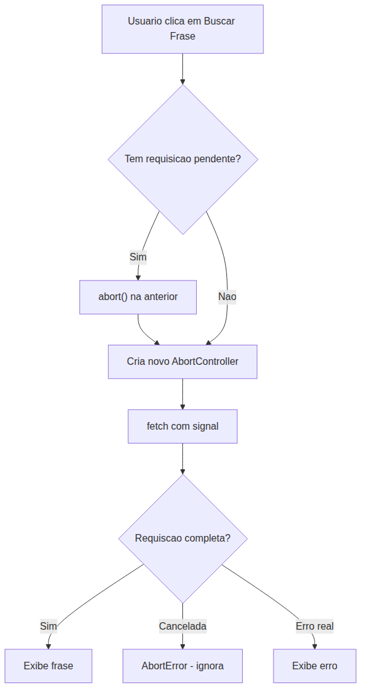


**Mão na Massa 5 — Cancelando fetch:**

- [ ] Crie uma variável `let abortController = null` no escopo global do seu Gerenciador
- [ ] Crie uma função `buscarFrase()` que:
  1. Cancela o controller anterior se existir
  2. Cria um novo `AbortController`
  3. Faz `fetch` com `signal`
  4. No `.catch()`, verifica `erro.name === 'AbortError'`
- [ ] Teste: chame `buscarFrase()` 5 vezes rapidamente no console
- [ ] Verifique no Network tab do DevTools que apenas a ÚLTIMA requisição completa (as anteriores foram canceladas — status "canceled" na coluna)

**Verificação:** No DevTools > Network, você vê várias requisições com status "canceled" e apenas uma com status 200. No console, apenas uma frase aparece.

### Quick Check 10

**1. O que acontece com a Promise do fetch quando chamamos `controller.abort()`?**
**Resposta:** A Promise é REJEITADA com um erro do tipo `AbortError`. O `.catch()` é executado com `erro.name === 'AbortError'`. O fetch não completa nem cumpre a Promise — ele é cancelado no meio do caminho.

**2. Por que precisamos distinguir `AbortError` de outros erros no `.catch()`?**
**Resposta:** Porque tanto cancelamento intencional quanto erro de rede caem no `.catch()`. Se tratássemos `AbortError` como erro, mostraríamos "Erro ao buscar frase" para o usuário quando ele mesmo pediu o cancelamento (ao clicar de novo). O `AbortError` deve ser silencioso — o usuário cancelou intencionalmente.

***

## 11. Async/Await — Sintaxe Síncrona para Código Assíncrono

Você já deve ter achado estranho escrever `.then().then().catch()`. Funciona, mas não parece código JavaScript "normal". Existe uma forma mais elegante: **async/await**.

### O Que é async/await?

`async/await` é **açúcar sintático** sobre Promises. Não é uma tecnologia nova — por baixo dos panos, continua sendo tudo Promise. A diferença é que o código *parece* síncrono (linear, passo a passo), mas continua sendo assíncrono (não bloqueia a call stack).

### async function

O `async` antes de uma função faz duas coisas:
1. Declara que a função contém código assíncrono
2. FAZ a função SEMPRE retornar uma Promise (mesmo que você retorne um valor simples)

```javascript
async function dizerOla() {
  return 'Ola!'
}

dizerOla().then((msg) => console.log(msg)) // "Ola!"
```

Note: mesmo retornando uma string, o resultado é uma Promise. `async` empacota o retorno em `Promise.resolve()`.

### await

O `await` faz o JavaScript **esperar** a Promise resolver, mas sem travar o programa:

```javascript
async function exemplo() {
  const resultado = await promessa
  console.log(resultado) // Só executa quando a promessa resolver
}
```

**O que `await` faz por baixo dos panos:**

1. Pausa a execução da função `async`
2. Libera a call stack (o Event Loop continua processando outras coisas)
3. Quando a Promise resolve, o código após `await` é colocado na microtask queue
4. A execução da função continua de onde parou

Lembra da Aula 26? `await` é como um `.then()` disfarçado. O código após `await` equivale ao callback do `.then()`, e ambos entram na microtask queue.

### Convertendo .then() para async/await

Vamos pegar o exemplo de fetch da Seção 8 e convertê-lo:

```javascript
// ANTES — com .then()/.catch()
function buscarFraseThen() {
  fetch('https://api.quotable.io/random')
    .then((res) => {
      if (!res.ok) throw new Error(`HTTP ${res.status}`)
      return res.json()
    })
    .then((dados) => {
      console.log(`"${dados.content}" -- ${dados.author}`)
    })
    .catch((erro) => {
      console.error('Erro:', erro.message)
    })
}

// DEPOIS — com async/await
async function buscarFraseAsync() {
  try {
    const res = await fetch('https://api.quotable.io/random')
    if (!res.ok) throw new Error(`HTTP ${res.status}`)
    const dados = await res.json()
    console.log(`"${dados.content}" -- ${dados.author}`)
  } catch (erro) {
    console.error('Erro:', erro.message)
  }
}
```

**Compare a legibilidade:**

- `.then()`: cada etapa é um callback separado. O fluxo "vai para a direita" a cada `.then()`.
- `async/await`: cada etapa é uma linha linear. O fluxo "vai para baixo". Você lê como leria código síncrono.


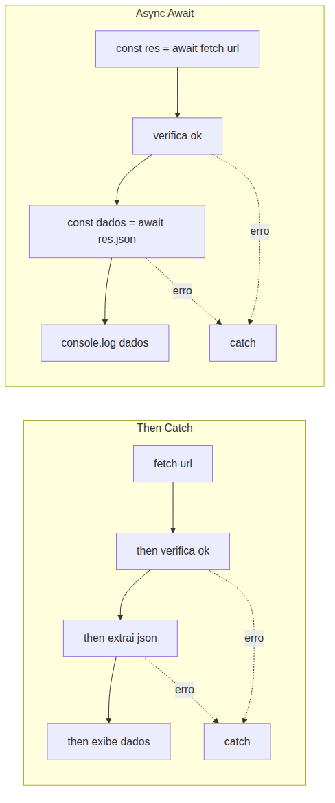


### Erros Comuns com async/await

**Erro 1: Esquecer o `await`**

```javascript
async function buscarFrase() {
  const res = fetch('https://api.quotable.io/random') // SEM await!
  console.log(res) // Promise { <pending> } — não é a resposta!
}
```

Sem `await`, `res` é uma Promise, não a resposta. Você precisa do `await` para "desembrulhar" o valor da Promise.

**Erro 2: Usar `await` fora de função async**

```javascript
const res = await fetch('https://api.quotable.io/random')
// SyntaxError: await is only valid in async functions
```

`await` só funciona DENTRO de funções declaradas com `async` (ou no top-level de módulos ES, um tópico que abordaremos em detalhes posteriormente).

**Erro 3: `await` em Promise rejeitada sem try/catch**

```javascript
async function buscaFalha() {
  const res = await fetch('https://api.quotable.io/invalida')
  // Se fetch rejeitar (erro de rede), o erro "vaza" — vira una
  // Promise rejeitada que o navegador reporta como
  // "Unhandled Promise Rejection"
}
```

Sempre envolva `await` em `try/catch` ou encadeie um `.catch()` no retorno da função.

### Top-Level Await (Menção Breve)

Em módulos ES (`<script type="module">`), você pode usar `await` fora de funções async:

```javascript
// Só funciona em <script type="module">
const resposta = await fetch('https://api.quotable.io/random')
const dados = await resposta.json()
console.log(dados)
```

Por enquanto, sempre use funções `async` com `await` dentro — você verá módulos ES (e o top-level await que eles permitem) na Aula 30.

**Mão na Massa 6 — Convertendo para async/await:**

- [ ] Pegue o código de fetch da Mão na Massa 3 (GET) e reescreva-o como uma função `async` com `await`
- [ ] Pegue a função `salvarFrase()` da Mão na Massa 4 e crie uma versão `async function salvarFraseAsync(frase)` que usa `await` com a Promise
- [ ] Teste ambas — o comportamento é IDÊNTICO ao anterior, mas o código é mais linear
- [ ] Compare os dois estilos lado a lado: qual você acha mais fácil de entender?

**Verificação:** As mesmas frases aparecem no console. O mesmo ID é gerado no IndexedDB. A diferença é apenas na legibilidade do código.

### Quick Check 11

**1. O que `async` faz com o valor de retorno de uma função?**
**Resposta:** `async` empacota o valor de retorno em uma Promise. Mesmo que a função retorne uma string simples, quem chama recebe uma Promise e precisa usar `.then()` ou `await` para acessar o valor.

**2. O que acontece se você chama `await fetch(url)` sem `await` no `fetch`?**
**Resposta:** Você recebe uma Promise (objeto `Promise { <pending> }`), não a resposta HTTP. O `await` é necessário para "desembrulhar" o valor da Promise. Sem ele, você está lidando com a Promise em si, não com o resultado dela.

***

## 12. Tratamento de Erros com try/catch + Async/Await

Um dos maiores benefícios de `async/await` é que erros de Promises rejeitadas podem ser capturados com o mesmo `try/catch` que você usa para erros síncronos.

### A Sintaxe

```javascript
async function minhaFuncao() {
  try {
    // Código que pode lançar erro (síncrono ou Promise rejeitada)
    const resultado = await operacaoQuePodeFalhar()
    console.log(resultado)
  } catch (erro) {
    // Erro capturado — tanto de throw sincrono quanto de await em Promise rejeitada
    console.error('Erro capturado:', erro.message)
  } finally {
    // Executa SEMPRE, independente de sucesso ou erro
    console.log('Operacao finalizada')
  }
}
```

- **`try`**: bloco onde você coloca operações que podem falhar
- **`catch(erro)`**: captura QUALQUER erro lançado no `try` — seja um `throw` síncrono ou uma Promise rejeitada com `await`
- **`finally`**: executa SEMPRE, ideal para limpeza (esconder spinner, fechar conexão, remover loader)

### Equivalência com Promises

```javascript
// Promise .then/.catch/.finally
buscarDados()
  .then(processar)
  .catch(tratarErro)
  .finally(limpar)

// Async/await com try/catch/finally
async function executar() {
  try {
    const dados = await buscarDados()
    processar(dados)
  } catch (erro) {
    tratarErro(erro)
  } finally {
    limpar()
  }
}
```

### O Padrão finally — Escondendo o Spinner

O `finally` é perfeito para operações de UI que precisam ser revertidas:

```javascript
async function buscarFrase() {
  mostrarSpinner() // Antes da operação

  try {
    const res = await fetch('https://api.quotable.io/random')
    if (!res.ok) throw new Error(`HTTP ${res.status}`)
    const dados = await res.json()
    exibirFrase(dados)
  } catch (erro) {
    if (erro.name === 'AbortError') return // Ignora cancelamento
    exibirErro(erro.message)
  } finally {
    esconderSpinner() // Sempre executa!
  }
}
```

O `finally` garante que o spinner seja escondido TANTO em caso de sucesso QUANTO de erro — sem precisar duplicar a chamada `esconderSpinner()` em dois lugares.

### Granularidade: Onde Colocar o try/catch?

Quando você tem múltiplas operações assíncronas, precisa decidir onde colocar o `try/catch`. Há três abordagens:

**Abordagem A: Um try/catch gigante envolvendo tudo**

```javascript
async function fluxoCompleto() {
  try {
    const frases = await buscarFrases()
    const processadas = await processarFrases(frases)
    await salvarFrases(processadas)
    console.log('Tudo ok')
  } catch (erro) {
    // Captura erro de QUALQUER das 3 operacoes
    // Mas nao sabe qual delas falhou
    console.error('Algo deu errado:', erro)
  }
}
```

**Quando usar:** operações que dependem umas das outras — se uma falha, o resto não faz sentido. A desvantagem é que você não sabe qual operação falhou.

**Abordagem B: Um try/catch por operação**

```javascript
async function fluxoCompleto() {
  let frases
  try {
    frases = await buscarFrases()
  } catch (erro) {
    console.error('Falha ao buscar frases:', erro)
    return // Para por aqui
  }

  let processadas
  try {
    processadas = await processarFrases(frases)
  } catch (erro) {
    console.error('Falha ao processar:', erro)
    return
  }

  try {
    await salvarFrases(processadas)
  } catch (erro) {
    console.error('Falha ao salvar:', erro)
  }
}
```

**Quando usar:** quando cada operação é independente e você quer tratamento específico para cada falha.

**Abordagem C: try/catch por grupo lógico (RECOMENDADO)**

```javascript
async function fluxoCompleto() {
  try {
    const frases = await buscarFrases()
    const processadas = await processarFrases(frases)
    await salvarFrases(processadas)
  } catch (erro) {
    console.error('Falha no pipeline de frases:', erro)
  } finally {
    esconderSpinner()
  }
}
```

**Quando usar:** combina o melhor dos dois mundos — operações que fazem parte do mesmo fluxo lógico compartilham o mesmo tratamento de erro, e o `finally` cuida da limpeza.


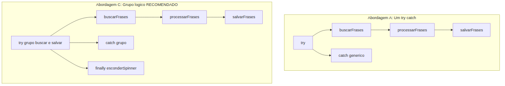


### Erro Comum: Unhandled Promise Rejection

Se você chama uma função `async` e não trata o erro, a Promise rejeitada "vaza":

```javascript
async function falha() {
  throw new Error('Deu ruim')
}

falha() // Unhandled Promise Rejection!
// O navegador exibe um warning no console
```

Sempre trate o erro de funções `async`:
- Com `try/catch` dentro da função, OU
- Com `.catch()` na chamada: `falha().catch(console.error)`

**Mão na Massa 7 — Tratamento robusto com try/catch:**

- [ ] Crie uma função `buscarESalvarFrase()` usando `async/await`
- [ ] Dentro do `try`, faça:
  1. `await fetch()` com verificação de `response.ok`
  2. `await res.json()` para extrair os dados
  3. `await salvarFrase()` para persistir no IndexedDB
- [ ] No `catch`, distinga três tipos de erro:
  - `erro.name === 'AbortError'` → ignorar (cancelamento)
  - `erro.message.includes('HTTP')` → "API retornou erro: [status]"
  - outros → "Erro de conexao. Verifique sua rede."
- [ ] No `finally`, exiba "Operacao concluida" no console
- [ ] Teste os cenários: sucesso, URL inválida (404), rede offline (desative o Wi-Fi)

**Verificação:** Cada cenário produz a mensagem correta. Em caso de sucesso, a frase aparece no console e é salva no IndexedDB. Em caso de erro, a mensagem específica aparece.

### Quick Check 12

**1. Qual a diferença entre um único `try/catch` para 3 `await`s vs três `try/catch` individuais?**
**Resposta:** Um único `try/catch` captura o primeiro erro que ocorrer, mas você não sabe qual operação falhou. Três `try/catch` individuais permitem tratamento específico para cada operação, mas são mais verbosos. A abordagem recomendada é `try/catch` por grupo lógico.

**2. O que é "Unhandled Promise Rejection" e como evitá-lo?**
**Resposta:** É um erro que ocorre quando uma Promise rejeita e ninguém trata o erro (sem `.catch()` ou `try/catch`). O navegador exibe um warning no console. Para evitar: sempre trate erros de funções `async` com `try/catch` interno ou encadeie `.catch()` na chamada.

***

## Autoavaliação: Quiz Rápido

**1. Qual analogia melhor descreve uma Promise em JavaScript? (a) Uma variável com valor já definido. (b) Um vale-presente que pode ser trocado por um produto no futuro. (c) Uma função que executa imediatamente.**
**Resposta:** (b) Um vale-presente. A Promise é um objeto que REPRESENTA um valor futuro, não o valor em si. Você guarda a Promise e, quando o valor estiver disponível, você o acessa.

**2. Quais são os três estados de uma Promise? Eles podem voltar atrás?**
**Resposta:** Pending (pendente), Fulfilled (cumprida), Rejected (rejeitada). Não — a transição é irreversível. Uma vez que a Promise sai de pending, nunca mais volta.

**3. O que `Promise.all([p1, p2, p3])` retorna se UMA das promessas rejeitar?**
**Resposta:** A Promise.all inteira rejeita no momento do primeiro erro, com o motivo da promessa que falhou. As outras promessas continuam executando (não são canceladas), mas seus resultados são ignorados.

**4. `fetch` rejeita a Promise para status HTTP 404? Explique.**
**Resposta:** Não. `fetch` só rejeita para erros de REDE (sem internet, DNS falhou). Status HTTP 404, 500, 301 são respostas do servidor — a comunicação aconteceu, então a Promise cumpre. Você precisa verificar `response.ok` no `.then()`.

**5. O que acontece quando você chama `controller.abort()` em um fetch com `signal`?**
**Resposta:** A Promise do fetch é rejeitada com um erro `AbortError`. O `.catch()` captura o erro, e você pode distinguir pelo `erro.name === 'AbortError'` que foi um cancelamento intencional.

**6. `async` antes de uma função faz com que ela sempre retorne o que?**
**Resposta:** Uma Promise. Mesmo que a função retorne um valor simples, `async` empacota em `Promise.resolve()`. Quem chama a função precisa usar `.then()` ou `await` para acessar o valor.

**7. O `await` libera a call stack enquanto espera a Promise resolver?**
**Resposta:** Sim. O `await` pausa a execução da função `async`, libera a call stack para o Event Loop processar outras tarefas, e quando a Promise resolve, o código continua na microtask queue.

**8. Qual bloco é executado TANTO em caso de sucesso QUANTO de erro no try/catch?**
**Resposta:** O bloco `finally`. Ele executa sempre, independente de `try` completar com sucesso ou `catch` capturar um erro. Ideal para limpeza (esconder spinner, fechar conexão).

***

## Mão na Massa Final — Projeto: Frases Motivacionais

**Dificuldade: Difícil | Duração: 30 minutos**

Esta seção integra TUDO que você aprendeu na aula em uma funcionalidade completa que se acopla ao Gerenciador de Tarefas existente.

### Passo 1 — Criar o Componente `<e-frases>`

Adicione ao seu `index.html` (ou em um arquivo separado `e-frases.js`) o novo Custom Element:

```javascript
class EFrases extends HTMLElement {
  constructor() {
    super()
    this.abortController = null
    this.attachShadow({ mode: 'open' })
  }

  connectedCallback() {
    this.shadowRoot.innerHTML = `
      <style>
        :host {
          display: block;
          padding: 1rem;
          border: 1px solid #ddd;
          border-radius: 8px;
          margin: 1rem 0;
          font-family: Arial, sans-serif;
        }
        .frase-container { min-height: 100px; }
        .frase-texto {
          font-size: 1.2rem;
          font-style: italic;
          margin-bottom: 0.5rem;
        }
        .frase-autor {
          text-align: right;
          color: #666;
        }
        .loading { color: #999; }
        .erro { color: #c00; }
        button {
          padding: 0.5rem 1rem;
          margin: 0.5rem 0;
          cursor: pointer;
          border: 1px solid #ccc;
          border-radius: 4px;
          background: #f0f0f0;
        }
        button:hover { background: #e0e0e0; }
        .favoritas { margin-top: 1rem; }
        .favorita-item {
          padding: 0.3rem 0;
          border-bottom: 1px solid #eee;
        }
      </style>
      <h3>✨ Frases Motivacionais</h3>
      <button id="buscarBtn">Buscar Frase</button>
      <div class="frase-container" id="fraseContainer">
        <p class="loading">Clique em "Buscar Frase" para começar</p>
      </div>
      <button id="salvarBtn" disabled>❤️ Salvar Favorita</button>
      <div class="favoritas" id="favoritas">
        <h4>Favoritas</h4>
        <div id="listaFavoritas"></div>
      </div>
    `

    this.shadowRoot.getElementById('buscarBtn')
      .addEventListener('click', () => this.buscarFrase())
    this.shadowRoot.getElementById('salvarBtn')
      .addEventListener('click', () => this.salvarFavorita())
  }

  async buscarFrase() { /* Implementaremos no Passo 2 */ }
  async salvarFavorita() { /* Implementaremos no Passo 3 */ }
}

customElements.define('e-frases', EFrases)
```

### Passo 2 — Implementar a Busca com fetch GET + AbortController

Implemente o método `buscarFrase()` dentro da classe:

```javascript
async buscarFrase() {
  // Cancela requisição anterior
  if (this.abortController) {
    this.abortController.abort()
  }

  this.abortController = new AbortController()
  const container = this.shadowRoot.getElementById('fraseContainer')
  const salvarBtn = this.shadowRoot.getElementById('salvarBtn')

  container.innerHTML = '<p class="loading">Buscando frase...</p>'
  salvarBtn.disabled = true

  try {
    const res = await fetch('https://api.quotable.io/random', {
      signal: this.abortController.signal
    })

    if (!res.ok) {
      throw new Error(`API indisponivel (status: ${res.status})`)
    }

    const dados = await res.json()

    this.fraseAtual = dados
    container.innerHTML = `
      <p class="frase-texto">"${dados.content}"</p>
      <p class="frase-autor">— ${dados.author}</p>
    `
    salvarBtn.disabled = false
  } catch (erro) {
    if (erro.name === 'AbortError') return // Ignora cancelamento

    if (erro.message.includes('API indisponivel')) {
      container.innerHTML = `<p class="erro">${erro.message}</p>`
    } else {
      container.innerHTML = `<p class="erro">Sem conexao com a internet. Verifique sua rede.</p>`
    }
    salvarBtn.disabled = true
  }
}
```

### Passo 3 — Salvar Favoritas no IndexedDB

Adicione a função de salvamento e o método `salvarFavorita()`:

Primeiro, certifique-se de que o banco IndexedDB tem a object store `frases`. No código de abertura do banco, INCREMENTE a versão atual:

```javascript
// Se a versão atual era 3, mude para 4
const request = indexedDB.open('TarefasDB', 4)

request.onupgradeneeded = (event) => {
  const db = event.target.result

  // Object stores existentes
  if (!db.objectStoreNames.contains('tarefas')) {
    db.createObjectStore('tarefas', { keyPath: 'id', autoIncrement: true })
  }

  // NOVA: object store para frases
  if (!db.objectStoreNames.contains('frases')) {
    const store = db.createObjectStore('frases', { keyPath: 'id', autoIncrement: true })
    store.createIndex('dataSalva', 'dataSalva', { unique: false })
  }
}
```

Função auxiliar para salvar (pode ficar fora da classe):

```javascript
function salvarFraseNoDB(frase) {
  return new Promise((resolve, reject) => {
    const transaction = db.transaction(['frases'], 'readwrite')
    const store = transaction.objectStore('frases')
    const request = store.add({
      content: frase.content,
      author: frase.author,
      dataSalva: new Date().toISOString()
    })

    request.onsuccess = () => resolve(request.result)
    request.onerror = () => reject(request.error)
  })
}
```

Agora implemente `salvarFavorita()`:

```javascript
async salvarFavorita() {
  if (!this.fraseAtual) return

  const salvarBtn = this.shadowRoot.getElementById('salvarBtn')
  salvarBtn.disabled = true

  try {
    const id = await salvarFraseNoDB(this.fraseAtual)
    console.log('Frase salva com ID:', id)
    await this.carregarFavoritas() // Recarrega a lista
  } catch (erro) {
    console.error('Erro ao salvar frase:', erro)
    alert('Nao foi possivel salvar a frase. Tente novamente.')
  } finally {
    salvarBtn.disabled = false
  }
}
```

E o método para carregar as favoritas:

```javascript
async carregarFavoritas() {
  return new Promise((resolve, reject) => {
    const transaction = db.transaction(['frases'], 'readonly')
    const store = transaction.objectStore('frases')
    const request = store.getAll()

    request.onsuccess = () => {
      const frases = request.result
      const lista = this.shadowRoot.getElementById('listaFavoritas')
      lista.innerHTML = frases
        .sort((a, b) => b.dataSalva.localeCompare(a.dataSalva))
        .map((f) =>
          `<div class="favorita-item">"${f.content}" — ${f.author}</div>`
        )
        .join('')
      resolve()
    }

    request.onerror = () => reject(request.error)
  })
}
```

Chame `this.carregarFavoritas()` no final do `connectedCallback()` para carregar as favoritas salvas quando a página abrir.

### Passo 4 — Adicionar o Componente ao HTML

No `index.html`, adicione o componente onde desejar:

```html
<e-frases></e-frases>
```

E importe o script do componente (se estiver em arquivo separado):

```html
<script src="e-frases.js"></script>
```

### Gabarito — O que Verificar

- [ ] O componente `<e-frases>` renderiza corretamente dentro do `index.html`
- [ ] Clicar em "Buscar Frase" exibe uma frase da API (verificar no console e na UI)
- [ ] Clicar 5 vezes rápido mostra apenas a ÚLTIMA frase (requisições anteriores canceladas)
- [ ] Ficar offline e clicar em "Buscar Frase" → mensagem de erro amigável
- [ ] Clicar em "❤️ Salvar" persiste a frase no IndexedDB (verificar no DevTools > Application > IndexedDB > TarefasDB > frases)
- [ ] Recarregar a página → frases salvas continuam lá
- [ ] Todo o código usa `async/await` com `try/catch`

***

## Mão na Massa N: Exercícios Graduados

**Exercício 1 (Fácil) — Função esperar(ms)**

Crie uma função `esperar(ms)` que retorna uma Promise que resolve após `ms` milissegundos. Depois, use-a com `async/await` para exibir "Passo 1", esperar 2 segundos, exibir "Passo 2", esperar 1 segundo, exibir "Passo 3".

**Gabarito:**

```javascript
function esperar(ms) {
  return new Promise((resolve) => {
    setTimeout(resolve, ms)
  })
}

async function executarPassos() {
  console.log('Passo 1')
  await esperar(2000)
  console.log('Passo 2')
  await esperar(1000)
  console.log('Passo 3')
}

executarPassos()
// Output (com intervalos):
// Passo 1
// (2 segundos depois) Passo 2
// (1 segundo depois) Passo 3
```

A função `esperar(ms)` é uma Promise que resolve depois do timeout. O `await` pausa a execução até a Promise resolver, depois continua.

**Exercício 2 (Médio) — Fetch com Promise.all**

Escreva uma função `buscarMultiplasFrases(quantidade)` que faz `quantidade` requisições simultâneas para a API de frases usando `Promise.all()` e retorna um array com as frases recebidas. Trate erros: se UMA requisição falhar, toda a operação deve falhar.

**Gabarito:**

```javascript
async function buscarMultiplasFrases(quantidade) {
  const urls = Array(quantidade).fill('https://api.quotable.io/random')

  try {
    const promises = urls.map((url) =>
      fetch(url).then((res) => {
        if (!res.ok) throw new Error(`HTTP ${res.status}`)
        return res.json()
      })
    )

    const frases = await Promise.all(promises)
    return frases.map((f) => `"${f.content}" -- ${f.author}`)
  } catch (erro) {
    console.error('Erro ao buscar frases:', erro.message)
    throw erro // Re-lança para quem chamou tratar
  }
}

// Teste:
buscarMultiplasFrases(3)
  .then((frases) => console.log('Frases:', frases))
  .catch((erro) => console.error('Falhou:', erro.message))
```

Explicação: `Array(quantidade).fill(url)` cria um array com N cópias da mesma URL. `.map()` transforma cada URL em uma Promise de fetch. `Promise.all()` espera todas resolverem. Se uma falha, `Promise.all` rejeita e o `catch` captura.

**Desafio (Difícil) — Componente `<e-frases>` com Cache Local**

Modifique o componente `<e-frases>` para adicionar as seguintes funcionalidades:

1. **Cache local**: ao buscar uma frase, primeiro verifique se já existe alguma frase armazenada no IndexedDB. Se sim, exiba uma frase aleatória do cache imediatamente (enquanto a requisição à API não chega).
2. **Controle de frequência**: não permita que o usuário clique em "Buscar Frase" mais de uma vez a cada 5 segundos (use debounce, como visto na Aula 26).
3. **Exportar favoritas**: adicione um botão "Exportar Favoritas" que gera um arquivo JSON com todas as frases salvas (use a Blob API e download, como visto na Aula 25).

**Gabarito:**

```javascript
class EFrasesComCache extends EFrases {
  constructor() {
    super()
    this.ultimaBusca = 0
  }

  async buscarFrase() {
    // Controle de frequencia (debounce)
    const agora = Date.now()
    if (agora - this.ultimaBusca < 5000) {
      console.log('Aguarde 5 segundos entre buscas')
      return
    }
    this.ultimaBusca = agora

    // Cache: exibe frase aleatoria do IndexedDB imediatamente
    try {
      const frasesCache = await this.carregarFrasesCache()
      if (frasesCache.length > 0) {
        const aleatoria = frasesCache[Math.floor(Math.random() * frasesCache.length)]
        const container = this.shadowRoot.getElementById('fraseContainer')
        container.innerHTML = `
          <p class="frase-texto" style="color:#999">"${aleatoria.content}"</p>
          <p class="frase-autor" style="color:#999">— ${aleatoria.author} (cache)</p>
        `
      }
    } catch (e) { /* Ignora se cache falhar */ }

    // Depois faz a requisicao real (codigo existente)
    await super.buscarFrase()
  }

  carregarFrasesCache() {
    return new Promise((resolve, reject) => {
      const transaction = db.transaction(['frases'], 'readonly')
      const store = transaction.objectStore('frases')
      const request = store.getAll()
      request.onsuccess = () => resolve(request.result)
      request.onerror = () => reject(request.error)
    })
  }

  exportarFavoritas() {
    this.carregarFrasesCache().then((frases) => {
      const blob = new Blob([JSON.stringify(frases, null, 2)], { type: 'application/json' })
      const url = URL.createObjectURL(blob)
      const a = document.createElement('a')
      a.href = url
      a.download = `frases-favoritas-${new Date().toISOString().slice(0, 10)}.json`
      a.click()
      URL.revokeObjectURL(url)
    })
  }
}

customElements.define('e-frases-cache', EFrasesComCache)
```

**Premissas do desafio:**
- Cache usa o IndexedDB como fonte local (já temos a store `frases`)
- Debounce de 5 segundos evita spam de requisições
- Exportação gera download com data no nome do arquivo

***

## Resumo da Aula

### Os 5 Conceitos Fundamentais

1. **Promessa como contrato**: uma Promise é um objeto que representa um valor futuro. Não é o valor em si — é um comprovante de que o valor chegará (ou uma explicação de por que não chegou).

2. **Três estados irreversíveis**: Pending (pendente) → Fulfilled (cumprida) ou Rejected (rejeitada). Uma vez que saiu de pending, nunca mais volta.

3. **Encadeamento com `.then()`**: cada `.then()` retorna uma nova Promise. Erros se propagam pela corrente até o `.catch()`. Solução para o Callback Hell.

4. **Composição**: `Promise.all()` (todas, falha se uma falhar), `Promise.race()` (primeira que vencer), `Promise.allSettled()` (todas com status individual).

5. **Async/Await**: açúcar sintático sobre Promises. `async` faz a função retornar Promise. `await` pausa a função sem travar o programa. Erros capturados com `try/catch`.

### O Que Você Construiu Hoje

- [x] Criou e consumiu Promises com `new Promise()`, `.then()`, `.catch()`, `.finally()`
- [x] Compôs múltiplas Promises com `all`, `race`, `allSettled`
- [x] Fez requisições HTTP GET com `fetch()`, verificou `response.ok`, extraiu JSON
- [x] Enviou dados com fetch POST (simulado com IndexedDB)
- [x] Cancelou requisições com `AbortController`
- [x] Converteu código `.then()` para `async/await`
- [x] Tratou erros assíncronos com `try/catch/finally`
- [x] Construiu o componente `<e-frases>` completo com busca, exibição e salvamento de frases motivacionais

***

## Próxima Aula

**Aula 28: Web Workers + Service Workers**

Seu navegador e o JavaScript são single-threaded (uma coisa de cada vez). Mas e se você tiver um cálculo pesado que precisa rodar sem congelar a interface? A resposta são os **Web Workers**: threads separadas que rodam em paralelo com sua aplicação principal.

Você aprenderá a criar Workers, comunicar-se com eles via mensagens (postMessage), processar dados pesados em segundo plano e entender a diferença entre Workers e Promises (Promises não são paralelismo — são apenas coordenação de tarefas assíncronas).

***

## Referências

### Documentação Oficial

- [MDN: Promise](https://developer.mozilla.org/en-US/docs/Web/JavaScript/Reference/Global_Objects/Promise) — Referência completa da API de Promises
- [MDN: Fetch API](https://developer.mozilla.org/en-US/docs/Web/API/Fetch_API) — Documentação oficial da Fetch API
- [MDN: async function](https://developer.mozilla.org/en-US/docs/Web/JavaScript/Reference/Statements/async_function) — Documentação de funções assíncronas
- [MDN: AbortController](https://developer.mozilla.org/en-US/docs/Web/API/AbortController) — Cancelamento de requisições

### APIs Utilizadas

- [Quotable API](https://github.com/lukePeavey/quotable) — API pública de frases motivacionais (sem autenticação)
- [JSONPlaceholder](https://jsonplaceholder.typicode.com/) — API fake para testes de POST

### Vídeos Recomendados

- [JavaScript Promises In 10 Minutes (Web Dev Simplified)](https://www.youtube.com/watch?v=DHvZLI7Db8E) — Explicação visual e prática (~10 min)
- [Async/Await em JavaScript (Filipe Deschamps)](https://www.youtube.com/watch?v=OjWUe4WqT7c) — Em português, direto ao ponto (~15 min)
- [The Async Await Episode (Fireship)](https://www.youtube.com/watch?v=vn3tm0quoqE) — Visão geral rápida e divertida (~7 min)

### Artigos para Aprofundamento

- [JavaScript Visualized: Promises & Async/Await (Lydia Hallie)](https://dev.to/lydiahallie/javascript-visualized-promises-async-await-5gke) — Explicação visual dos conceitos
- [Como o Event Loop funciona (Node.js docs)](https://nodejs.org/en/learn/asynchronous-work/event-loop-timers-and-nexttick) — Aprofundamento no assincronismo

***

## FAQ

**P: Promise substitui completamente callbacks?**
R: Não. Callbacks ainda são usados em várias APIs (addEventListener, setTimeout, Array.map). Promise resolve o problema de callbacks ANINHADOS para operações assíncronas. Cada ferramenta tem seu lugar.

**P: Qual a diferença entre `Promise.all` e `Promise.allSettled`?**
R: `Promise.all` rejeita no PRIMEIRO erro — se qualquer promessa falhar, tudo falha. `Promise.allSettled` espera TODAS terminarem (sucesso ou erro) e retorna o status individual de cada uma. Use `all` quando as operações dependem umas das outras; use `allSettled` quando são independentes.

**P: `fetch` com `await` pode travar a interface?**
R: Não. `await` só pausa a função `async` — a call stack é liberada e o Event Loop continua processando eventos, renderizando a página, etc. A interface não trava porque o `await` não bloqueia a thread principal.

**P: Posso usar `await` fora de uma função `async`?**
R: Em scripts tradicionais (`<script>` sem `type="module"`), não — `await` só funciona dentro de `async function`. Em módulos ES (`<script type="module">`), você pode usar `await` no top-level.

**P: O que é "Unhandled Promise Rejection"?**
R: É um warning que o navegador exibe no console quando uma Promise rejeita e ninguém tratou o erro (sem `.catch()` ou `try/catch`). Em versões futuras do Node.js, isso pode derrubar o processo. Sempre trate erros de Promises.

**P: Quantas requisições fetch posso fazer ao mesmo tempo?**
R: O navegador impõe limites por domínio (tipicamente 6 conexões simultâneas). Requisições além desse limite entram em fila. `Promise.all` com 20 URLs pode ter algumas esperando na fila do navegador.

**P: `response.json()` lança erro se o JSON for inválido?**
R: Sim. Se o servidor retornar HTML ou texto em vez de JSON, `response.json()` rejeita a Promise com um erro de parsing. Por isso é importante verificar `response.ok` ANTES de chamar `.json()`.

**P: `AbortController` pode ser usado com outras APIs além de fetch?**
R: Sim. `AbortController` é uma API genérica para cancelar operações assíncronas. Funciona com fetch, IndexedDB (Aula 26), leitura de arquivos (File API), e APIs que aceitam `signal`.

**P: Existe `Promise.any`?**
R: Sim. `Promise.any()` resolve com a PRIMEIRA promessa que cumprir (ignora rejeições). É como `race`, mas ignora erros e espera pelo menos uma cumprir. Se todas rejeitarem, rejeita com `AggregateError`.

**P: Devo sempre usar `async/await` ou `.then()` é suficiente?**
R: `async/await` é mais legível para fluxos lineares. `.then()` ainda é útil para transformações curtas (ex: `fetch(url).then(r => r.json())`). Use `async/await` para lógica complexa com múltiplas operações, e `.then()` para transformações simples.

***

## Glossário

| Termo | Definição |
|---|---|
| **Promise** | Objeto que representa a conclusão (ou falha) de uma operação assíncrona. (Ver Seções 2, 6) |
| **Pending** | Estado inicial de uma Promise — o resultado ainda não está disponível. (Ver Seção 3) |
| **Fulfilled** | Estado de uma Promise quando a operação foi concluída com sucesso — o valor está disponível. (Ver Seção 3) |
| **Rejected** | Estado de uma Promise quando a operação falhou — o motivo do erro está disponível. (Ver Seção 3) |
| **`.then()`** | Método que registra um callback para quando a Promise for cumprida. Retorna uma nova Promise. (Ver Seção 6) |
| **`.catch()`** | Método que registra um callback para quando a Promise for rejeitada. Captura erros da corrente. (Ver Seção 6) |
| **`.finally()`** | Método que registra um callback que executa sempre, independente de sucesso ou erro. (Ver Seção 6) |
| **`Promise.all()`** | Método que espera TODAS as Promises resolverem. Rejeita no primeiro erro. (Ver Seções 5, 7) |
| **`Promise.race()`** | Método que resolve/rejeita com o resultado da primeira Promise que terminar. (Ver Seções 5, 7) |
| **`Promise.allSettled()`** | Método que espera TODAS as Promises terminarem e retorna o status individual de cada uma. (Ver Seções 5, 7) |
| **Fetch API** | API do navegador para fazer requisições HTTP. Retorna uma Promise de Response. (Ver Seções 8, 9) |
| **`response.ok`** | Propriedade booleana do objeto Response — `true` se status HTTP entre 200 e 299. (Ver Seção 8) |
| **`response.json()`** | Método que extrai o corpo da resposta como JSON. Retorna uma Promise. (Ver Seção 8) |
| **`async function`** | Função que sempre retorna uma Promise. Permite usar `await` dentro dela. (Ver Seção 11) |
| **`await`** | Operador que pausa a execução de uma função async até a Promise resolver. Libera a call stack. (Ver Seção 11) |
| **`AbortController`** | API para cancelar operações assíncronas (fetch, IndexedDB). Usa `signal` para conectar à operação. (Ver Seção 10) |
| **`AbortError`** | Erro específico lançado quando uma operação é cancelada via AbortController. (Ver Seção 10) |
| **`try/catch/finally`** | Estrutura de tratamento de erros. Com async/await, captura tanto erros síncronos quanto Promises rejeitadas. (Ver Seção 12) |
