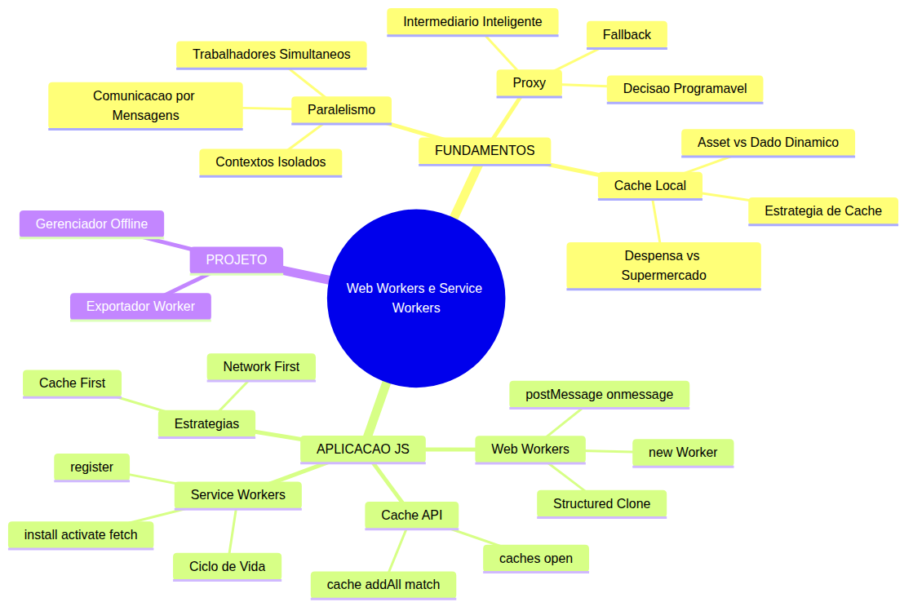
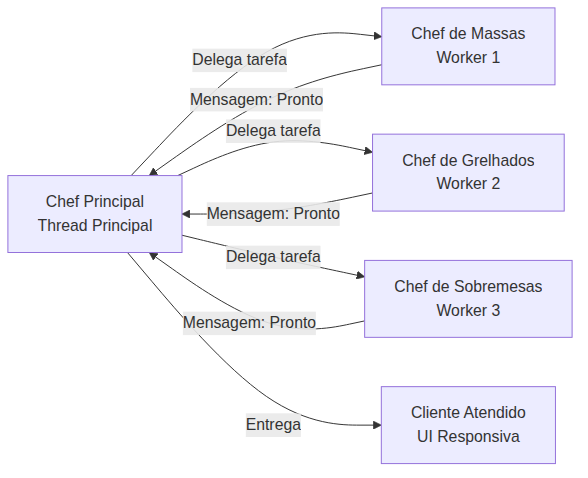
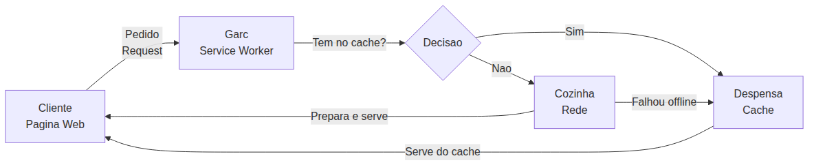
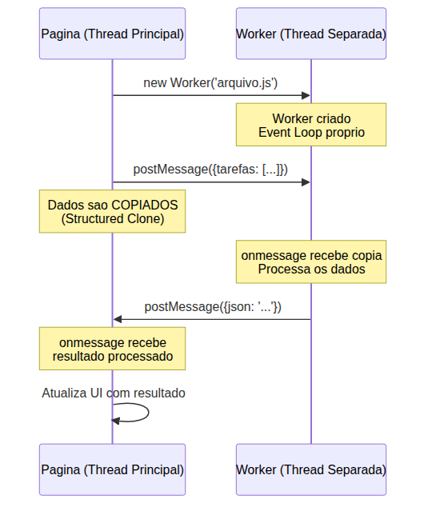
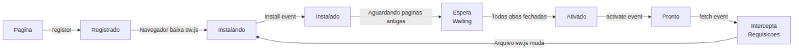
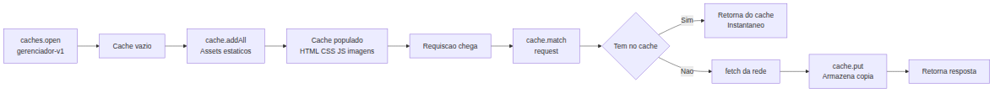
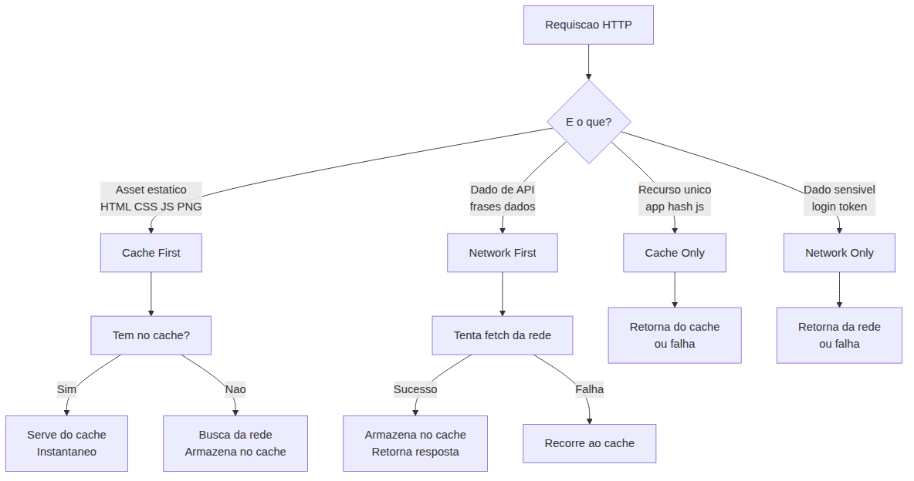
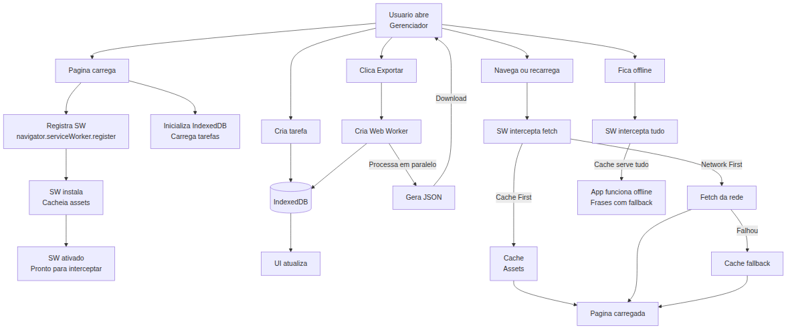

# JavaScript — Do Zero ao Profissional — Aula 28

## Web Workers + Service Workers — Threads, Cache e Offline-First

**Duração total:** 110 minutos (55 de leitura + 55 de prática)
**Nível:** Avançado
**Pré-requisitos:** Aula 10 (Funções), Aula 14 (Arrow functions e Callbacks), Aula 16 (Classes), Aula 18 (Custom Elements), Aula 19 (Eventos), Aula 23 (IndexedDB), Aula 26 (Event Loop, setTimeout, AbortController), Aula 27 (Promises, Fetch, async/await)

***

## Objetivos de Aprendizagem

Ao final desta aula, você será capaz de:

- [ ] **Explicar** por que JavaScript no navegador precisa de threads separadas para tarefas pesadas — o que acontece com a UI quando um cálculo longo roda na thread principal
- [ ] **Descrever** o modelo de comunicação por mensagens (postMessage/onmessage), explicitando que workers não compartilham variáveis nem acessam o DOM — a comunicação é sempre por cópia (Structured Clone Algorithm)
- [ ] **Diferenciar** Web Workers (threads de computação que executam código em segundo plano) de Service Workers (proxy de rede que intercepta requisições e gerencia cache)
- [ ] **Criar** um Web Worker em arquivo `.js` separado e comunicar-se com ele via `postMessage()` e `onmessage`, processando dados sem travar a interface
- [ ] **Descrever** o ciclo de vida de um Service Worker — register, install, activate, fetch — e o que cada evento possibilita
- [ ] **Registrar** um Service Worker com `navigator.serviceWorker.register()` e implementar os listeners dos eventos `install`, `activate` e `fetch`
- [ ] **Utilizar** a Cache API (`caches.open()`, `cache.put()`, `cache.match()`, `cache.addAll()`) para armazenar e recuperar recursos do navegador
- [ ] **Implementar** as estratégias Cache First (assets estáticos) e Network First (dados dinâmicos de API) no evento `fetch` do Service Worker
- [ ] **Construir** um Service Worker que torna o Gerenciador de Tarefas funcional offline, servindo HTML/CSS/JS do cache e tratando falhas de rede com fallback
- [ ] **Criar** um Web Worker que exporta tarefas do IndexedDB para JSON sem travar a interface — o processamento pesado roda em thread separada

***

## Como Usar Esta Aula

Esta aula está organizada em duas partes. A **primeira parte** (Seções 1 a 3) constrói os fundamentos conceituais de paralelismo, intermediação e cache usando APENAS analogias do mundo real — cozinha profissional, garçom e despensa — sem mencionar JavaScript. A **segunda parte** (Seções 4 a 10) aplica esses conceitos na prática com Web Workers, Service Workers, Cache API e o Gerenciador de Tarefas.

Ao longo do caminho, você encontrará seções **Mão na Massa** (para fazer, não só ler), **Quick Check** (para verificar se entendeu antes de avançar) e **Diagramas** que ilustram visualmente cada conceito. Ao final, o arquivo separado **Questões de Aprendizagem** traz as tarefas de checkpoint — só avance para a Aula 29 quando conseguir completá-las por conta própria.

| Etapa | Atividade | Tempo |
|---|---|---|
| Parte 1 | Fundamentos — Paralelismo, Proxy, Cache (analogias) | 15 min |
| Parte 2A | Web Workers — postMessage, onmessage, Worker de Exportação | 20 min |
| Parte 2B | Service Workers — Registro, Ciclo de Vida, Cache API | 20 min |
| Parte 2C | Estratégias de Cache — Cache First, Network First | 15 min |
| Projeto | Gerenciador Offline + Worker de Exportação | 30 min |
| Final | Quiz, Exercícios, Revisão | 10 min |

***

## Mapa Mental



> *O mapa mental acima mostra a estrutura da aula. Cada ramo representa um conceito que você vai explorar.*

***

## Recapitulação da Aula 27

A Aula 27 foi seu mergulho no mundo assíncrono do JavaScript com Promises, Fetch e async/await. Você aprendeu:

| Aula | Conceito | Onde aparece nesta aula |
|---|---|---|
| Aula 27 | **Promises** — pending, fulfilled, rejected, `.then()/.catch()/.finally()` | `caches.open()`, `cache.match()`, `fetch()` e `register()` retornam Promises — tudo que você aprendeu sobre consumo de Promises se aplica |
| Aula 27 | **async/await** — sintaxe moderna para Promises | Todo código de Service Worker e Cache API usa `async/await` — é o padrão desta aula |
| Aula 27 | **Fetch API** — GET, POST, response.json(), response.ok | `fetch()` dentro do Service Worker para buscar recursos da rede |
| Aula 27 | **try/catch** com async/await | `try/catch` nos listeners do Service Worker para tratar falhas de rede |
| Aula 26 | **Event Loop** — call stack, task queue, microtask | Cada Web Worker tem seu próprio Event Loop independente |
| Aula 26 | **AbortController** — intermediário entre código e operação | Service Worker é um intermediário ainda mais poderoso — proxy de rede programável |
| Aula 23 | **IndexedDB** — getAll(), transações, IDBDatabase | O Worker de exportação processa tarefas do IndexedDB |

**Estado do Gerenciador pós-Aula 27:** componentes Custom Elements, persistência com IndexedDB, File API, Drag & Drop, observers, geolocalização, notificações, speech, frases motivacionais com fetch + async/await. O que ele NÃO tem ainda: threads separadas (Web Workers), suporte offline (Service Worker), Cache API.

**O problema que a Aula 27 deixou aberto:** o fetch que busca frases motivacionais depende da internet. Se o usuário ficar offline, o app quebra. E a exportação de tarefas processa tudo na thread principal — com muitas tarefas, a UI congela. Esta aula resolve AMBOS os problemas.

***

**FUNDAMENTOS: Trabalhadores Paralelos, Intermediários e Cache no Mundo Real**

> *Os conceitos desta seção são universais — valem para qualquer cenário onde tarefas precisam ser divididas entre múltiplos trabalhadores, um intermediário otimiza o fluxo entre cliente e fornecedor, e recursos são armazenados localmente para acesso rápido. Na segunda parte, você verá como JavaScript implementa cada um deles com Web Workers, Service Workers e Cache API.*

***

## 1. Paralelismo — Múltiplos Trabalhadores Simultâneos

### O problema de uma pessoa só

Imagine um restaurante movimentado em uma noite de sábado. A cozinha está cheia de pedidos. Se houver UM único chef para fazer tudo — preparar massas, grelhar carnes, montar sobremesas, lavar louça — o que acontece?

Enquanto ele prepara um prato complexo (um risoto que leva 25 minutos), todos os outros pedidos ficam esperando. As carnes queimam. As sobremesas derretem. Os clientes reclamam. O restaurante não consegue atender ninguém direito.

Esse é o mundo **single-threaded** (linha única): uma tareita de cada vez, em sequência, sem interrupção. Quando uma tarefa é longa, tudo para.

### A solução: chefs especialistas em paralelo

Um restaurante profissional não funciona assim. Ele tem **múltiplos chefs** trabalhando ao mesmo tempo:

- O **chef de massas** prepara risotos, massas e molhos
- O **chef de grelhados** cuida de carnes, peixes e vegetais na brasa
- O **chef de sobremesas** monta tortas, mousses e sorvetes
- Cada um trabalha na sua **própria bancada**, com suas **próprias ferramentas**
- Cada um é **especialista** no que faz

Eles trabalham em **paralelo** — enquanto o chef de massas cozinha o risoto, o chef de grelhados grelha o salmão e o chef de sobremesas prepara a torta. Três pratos sendo preparados ao mesmo tempo. O restaurante atende mais clientes em menos tempo.

### Como eles se comunicam

A parte mais importante: os chefs **não invadem a bancada uns dos outros**. O chef de massas não pega o salmão grelhado diretamente da estação do chef de grelhados. Ele **PEDE**: "Chef, me passa o salmão quando estiver pronto."

Essa comunicação por **mensagens** (pedidos verbais) mantém a organização. Cada chef controla seu próprio espaço. Ninguém atrapalha o trabalho alheio. Se um chef precisar de algo, ele pede — não pega.

### O que isso tem a ver com programação?

No navegador, a **thread principal** é como o chef principal. Ela é responsável por:

- Renderizar a página (HTML, CSS)
- Responder a cliques, scrolls, digitação
- Executar seu código JavaScript
- Atualizar a tela

Se um cálculo pesado rodar na thread principal — como exportar 10 mil tarefas para JSON — a interface CONGELA. Nada responde. O usuário tenta clicar e nada acontece. É como o chef principal ter que preparar um risoto de 25 minutos enquanto todos os outros pedidos esperam.

**Threads de trabalho separadas** são como chefs especialistas — na segunda parte você verá como JavaScript implementa isso com Web Workers: cada thread roda em paralelo, em sua própria "bancada" (contexto isolado), comunicando-se apenas por mensagens. A thread principal (chef principal) delega o trabalho pesado para elas e continua atendendo os clientes (a interface) sem travar.



> *A thread principal (chef principal) coordena o trabalho e mantém a interface responsiva enquanto os workers (chefs especialistas) processam tarefas em paralelo. A comunicação é sempre por mensagens.*

### Conceitos universais extraídos

1. **Trabalhadores independentes**: cada worker tem seu próprio contexto isolado — não compartilha variáveis nem memória com a thread principal
2. **Comunicação por mensagens**: a troca de dados é explícita — um lado envia, o outro recebe
3. **Especialização**: cada worker pode ser criado para uma tarefa específica
4. **Paralelismo real**: múltiplas tarefas rodam ao mesmo tempo, não uma após a outra
5. **Interface não trava**: a thread principal continua atendendo eventos do usuário enquanto os workers processam

Até aqui, você já entendeu o problema que Web Workers resolvem: **tarefas pesadas não devem rodar na thread principal**. Isso já é MUITO. Respire. Se algo não ficou claro, releia esta seção — não tem problema nenhum voltar. Programação se aprende por camadas, não de uma vez.

### Quick Check 1

**1. Por que o chef principal não pode simplesmente pegar ingredientes da bancada do chef de sobremesas?**
**Resposta:** Cada bancada é um contexto isolado — cada chef tem seu próprio espaço e ferramentas. A comunicação deve ser por mensagens (pedidos verbais), não por acesso direto.

**2. O que aconteceria se o chef principal tivesse que preparar TODOS os pratos sozinho?**
**Resposta:** A cozinha travaria — enquanto um prato complexo estivesse em preparo, nada mais seria feito. Os clientes esperariam muito e o restaurante não atenderia bem ninguém. É exatamente o que acontece quando um cálculo pesado roda na thread principal.

***

## 2. O Intermediário Inteligente — Proxy e Otimização

### O problema de ir direto à fonte

Voltemos ao restaurante. Imagine que você, como cliente, tivesse que ir até a cozinha para fazer seu pedido a cada item. Você pede o prato principal e volta para a mesa. Depois, se quiser uma bebida, levanta e vai à cozinha de novo. Depois, quer a sobremesa — cozinha outra vez.

Isso seria exaustivo para você e caótico para a cozinha — os chefs teriam que parar de cozinhar para atender clientes toda hora.

### A solução: o garçom

O restaurante tem um **garçom**. Você não entra na cozinha. Você fala com o garçom, que leva seu pedido e decide a melhor forma de atendê-lo:

- "Isso já temos pronto na despensa? Então eu sirvo AGORA, sem incomodar a cozinha."
- "Isso precisa ser preparado na cozinha? Então vou lá, peço ao chef e volto com o prato."
- "A cozinha está fechada? Sem problemas — vejo o que temos na despensa que pode atender."

O garçom é um **INTERMEDIÁRIO INTELIGENTE**. Ele fica entre você (o cliente) e a cozinha (o fornecedor). Ele toma decisões para otimizar sua experiência. Você nem precisa saber dos detalhes — só recebe o que pediu.

### Decisão programável

O que torna o garçom inteligente é que ele pode **decidir** como agir em cada situação:

| Situação | Ação do Garçom |
|---|---|
| Item pronto na despensa | Serve imediatamente do estoque |
| Item precisa ser preparado | Vai à cozinha, pede ao chef, espera e serve |
| Cozinha lotada | Prioriza itens da despensa para aliviar a cozinha |
| Cozinha fechada (fora do horário) | Serve APENAS itens da despensa |
| Cliente pede algo que não tem | Informa o cliente e sugere alternativa |

Cada pedido é avaliado individualmente. O garçom não trata todos os pedidos da mesma forma — ele aplica a **estratégia** mais adequada para cada caso.

### Conexão com a Aula 26: AbortController

Na Aula 26, você conheceu o `AbortController` — um intermediário que fica entre seu código e uma requisição, permitindo cancelá-la. O `AbortController` é um tipo de proxy: você cria um sinal, passa para a requisição, e depois pode abortar.

O conceito de **intermediário programável** é o mesmo. O AbortController é um intermediário que sabe **cancelar**. Na segunda parte, você verá um intermediário digital que sabe **decidir de onde servir os dados** — cache ou rede. Ambos são "garçons" que otimizam o fluxo entre duas partes.



> *O garçom (Service Worker) fica entre o cliente (página) e a cozinha (rede). Ele decide se serve do cache (despensa) ou busca da rede (cozinha), otimizando a experiência.*

### Conceitos universais extraídos

1. **Intermediação**: um proxy fica entre duas partes, abstraindo a complexidade
2. **Decisão programável**: o intermediário pode decidir o que fazer com cada pedido
3. **Otimização**: evita trabalho redundante — se já tem pronto, serve direto
4. **Fallback**: se o fornecedor externo falhar, ainda há resposta do cache
5. **Invisibilidade**: o cliente nem percebe que há um intermediário — a experiência é fluida

### Quick Check 2

**1. Qual a vantagem de ter um garçom em vez de ir direto à cozinha?**
**Resposta:** O garçom pode servir itens que já estão prontos na despensa sem incomodar a cozinha. Ele otimiza o tempo, reduz o trabalho da cozinha e, se a cozinha estiver fechada, ainda pode servir o que está na despensa.

**2. O AbortController (Aula 26) e o garçom do restaurante têm algo em comum? O quê?**
**Resposta:** Ambos são intermediários programáveis. O AbortController fica entre o código e a requisição e pode cancelá-la. O garçom fica entre o cliente e a cozinha e pode decidir como atender o pedido. Ambos controlam o fluxo entre duas partes.

***

## 3. Armazenamento Local — Despensa vs Supermercado

### O dilema do restaurante: o que estocar?

Todo restaurante precisa decidir o que manter na despensa e o que comprar fresco toda manhã. Essa decisão é **estratégica** — acertar significa eficiência e economia; errar significa desperdício ou clientes insatisfeitos.

**Itens da despensa** (estoque fixo):
- Arroz, feijão, macarrão, farinha
- Molhos base, temperos secos, óleos
- Bebidas não perecíveis
- Guardanapos, embalagens

Esses itens são usados em QUASE TODO prato. Eles não estragam rápido. Tê-los à mão acelera o preparo. O restaurante compra em quantidade e repõe quando acaba.

**Itens frescos** (compra diária):
- Peixe, carne, frango
- Legumes, verduras, frutas
- Pães, queijos frescos
- Ervas frescas

Esses itens estragam rápido. O cardápio muda conforme a estação. Não adianta estocar — o cliente quer o peixe fresco do dia, não o congelado da semana passada.

### A decisão estratégica

Um bom restaurante sabe EXATAMENTE o que manter na despensa e o que buscar fresco:

- **Cardápio fixo** (arroz, feijão, massa) = despensa = sempre disponível
- **Prato do dia** (peixe fresco, legumes da estação) = feira = compra diária
- **Bebidas** (água, refrigerante, vinho) = despensa = estoque rotativo

Essa decisão não é binária. É uma **estratégia**: cada item tem sua política de abastecimento baseada em frequência de uso, perecibilidade e custo.

### O que isso tem a ver com programação?

No mundo digital, seus arquivos seguem a mesma lógica:

- **Assets estáticos** (HTML, CSS, JS, imagens, fontes) são como itens da despensa — mudam pouco, são usados sempre, armazená-los localmente (cache) faz o app carregar instantaneamente
- **Dados dinâmicos** (frases motivacionais de API, previsão do tempo, resultados de busca) são como peixe fresco — mudam a cada acesso, precisam ser buscados da rede toda vez
- **Dados do usuário** (tarefas no IndexedDB) são como ingredientes preparados pelo próprio restaurante — ficam na cozinha (navegador) e não precisam ser buscados externamente

A **Cache API** que você vai aprender na segunda parte é a "despensa digital": um local para armazenar respostas HTTP completas (headers, status, corpo) para acesso instantâneo, mesmo offline.

> *Você pode estar pensando: "mas por que não guardar TUDO na despensa e nunca buscar da rede?" Porque espaço é limitado, dados mudam, e servir informação desatualizada pode ser pior do que servir nada. Imagine seu app de previsão do tempo mostrando a temperatura de ontem porque cacheou.*

### Conceitos universais extraídos

1. **Cache armazena itens de uso frequente e baixa volatilidade**: HTML, CSS, JS, imagens
2. **Rede é para dados dinâmicos e atualizados**: respostas de API, dados do servidor
3. **Decisão estratégica**: o que cachear depende do tipo de recurso, não de uma regra única
4. **Organização**: a despensa precisa de organização — saber o que tem, onde está e quando renovar
5. **Versionamento**: quando os assets mudam, o cache precisa ser atualizado — como repor a despensa

### Quick Check 3

**1. Por que o restaurante não guarda peixe fresco na despensa por um mês?**
**Resposta:** Peixe fresco é perecível — os dados mudam rápido e armazenar versão antiga não serve. É melhor buscar fresco toda vez, assim como dados de API que mudam com frequência.

**2. O que acontece se a feira estiver fechada (sem internet) e o restaurante não tiver despensa?**
**Resposta:** O restaurante não consegue servir nada — o app fica inacessível. Ter despensa (cache) garante funcionamento mínimo mesmo offline. É exatamente o princípio que a despensa garante: quando a rede falha, o cache salva.

***

**APLICAÇÃO: Web Workers, Service Workers e Cache API no Gerenciador de Tarefas**

> *Agora que você entende paralelismo (cozinha com chefs especialistas), intermediação (garçom inteligente) e armazenamento local (despensa vs feira), vamos implementar cada um desses conceitos com JavaScript. Você criará um Web Worker para processamento paralelo e um Service Worker com Cache API para funcionamento offline. Lembra da cozinha? O `new Worker()` é como contratar um chef especialista. O Service Worker é o garçom que decide se serve da despensa ou da cozinha.*

***

## 4. Web Workers — Threads Separadas com postMessage

### O que é um Web Worker

Um **Web Worker** é um arquivo JavaScript que roda em uma **thread separada** — uma "bancada de trabalho" independente, com seu próprio motor JavaScript, seu próprio Event Loop, suas próprias variáveis. Ele não compartilha NADA com a página principal.

Você cria um Worker com `new Worker('arquivo.js')` — o navegador baixa o arquivo, cria a thread separada e começa a executar o código.

### Comunicação por mensagens

A página (thread principal) e o Worker NÃO compartilham variáveis, não acessam o DOM um do outro, não enxergam funções um do outro. Toda comunicação é feita por **mensagens**:

| Ação | Código na Página | Código no Worker |
|---|---|---|
| **Enviar dados** | `worker.postMessage(dados)` | `self.postMessage(dados)` |
| **Receber dados** | `worker.onmessage = (event) => { event.data }` | `self.onmessage = (event) => { event.data }` |

O `self` dentro do Worker refere-se ao próprio Worker — é o equivalente global do Worker (como `window` na página, mas sem o DOM).

### Structured Clone Algorithm

Quando você envia dados via `postMessage`, o navegador usa o **Structured Clone Algorithm** para criar uma **cópia profunda** dos dados. O Worker recebe uma cópia independente — alterações no Worker não afetam a página e vice-versa.

Isso é diferente de passar uma referência (como um objeto em JavaScript normal). É mais seguro, mas tem custo: objetos muito grandes demoram mais para ser copiados.



### Limitações importantes

Workers são poderosos, mas têm restrições:

| Pode fazer | NÃO pode fazer |
|---|---|
| `console.log()` | Acessar o DOM (`document`, `window`) |
| `fetch()` | Usar `alert()`, `prompt()`, `confirm()` |
| `setTimeout()`, `setInterval()` | Acessar variáveis da página |
| `Math`, `JSON`, `Array`, `String` | Acessar `localStorage` diretamente |
| `IndexedDB` (!) | Modificar a UI |
| Importar scripts com `importScripts()` | Acessar `parent` ou a página que o criou |

**Ponto importante**: Workers PODEM acessar IndexedDB. Isso significa que o Worker de exportação pode ler tarefas diretamente do banco — você só precisa enviar a instrução "exporte tudo", e o Worker busca os dados sozinho.

### Tratamento de erros

Se o Worker lançar um erro, a página é notificada:

```javascript
worker.onerror = (event) => {
  console.error('Erro no Worker:', event.message, 'na linha', event.lineno);
};
```

### Encerrando um Worker

- Da página: `worker.terminate()` — mata o Worker imediatamente
- De dentro do Worker: `self.close()` — o próprio Worker se encerra

Um bom padrão é encerrar o Worker após receber o resultado, liberando recursos.

### Casos de uso reais

- Exportar/importar dados (JSON, CSV) sem travar a UI
- Filtrar ou ordenar listas enormes (milhares de itens)
- Processamento de imagens (filtros, redimensionamento)
- Criptografia e hash
- Compressão/decompressão
- Validação de dados em segundo plano

Lembra do chef especialista? `new Worker()` é como contratar um chef de massas — ele tem sua própria bancada, suas ferramentas, e você se comunica por mensagens. Enquanto ele prepara o risoto, você continua atendendo outros clientes.

### Conexão com a Aula 26

Cada Worker tem seu **próprio Event Loop** — sua própria call stack, task queue e microtask queue. Quando você chama `worker.postMessage()`, a mensagem entra na task queue do Worker, não na da página. Isso significa que o processamento do Worker nunca bloqueia a UI, e vice-versa.

### Quick Check 4

**1. Um Web Worker pode usar `document.querySelector()`? Por quê?**
**Resposta:** Não. Workers rodam em contexto isolado, sem acesso ao DOM, a `window`, a `document` ou a qualquer variável da página. Eles não podem manipular a interface.

**2. Se a página modificar os dados DEPOIS de enviá-los ao Worker, o Worker verá a modificação?**
**Resposta:** Não. Os dados são copiados via Structured Clone Algorithm — o Worker recebeu uma cópia independente. Alterações posteriores na página não afetam a cópia do Worker.

***

## 5. Mão na Massa 1 — Worker de Exportação JSON

### O que vamos construir

Você vai criar um Web Worker que recebe as tarefas do Gerenciador e gera o JSON de exportação **sem travar a interface**. Atualmente, o botão "Exportar JSON" do Gerenciador (criado na Aula 22) processa tudo na thread principal. Com muitas tarefas, a UI congela durante a exportação. Vamos resolver isso.

### Passo 1: Criar exportador-worker.js

Crie um novo arquivo na raiz do projeto (mesmo nível que `index.html`) chamado `exportador-worker.js`. Este é o código do Worker — ele roda na thread separada:

```javascript
// exportador-worker.js — Roda em thread separada
// Escuta mensagens da página principal
self.onmessage = function (event) {
  const { tarefas } = event.data;

  try {
    // Processamento pesado: serializar, formatar, adicionar metadados
    const resultadoExportacao = {
      versao: '1.0',
      dataExportacao: new Date().toISOString(),
      totalTarefas: tarefas.length,
      tarefasConcluidas: tarefas.filter(t => t.concluida).length,
      tarefasPendentes: tarefas.filter(t => !t.concluida).length,
      tarefas: tarefas.map(t => ({
        id: t.id,
        texto: t.texto,
        concluida: t.concluida,
        dataCriacao: t.dataCriacao || null
      }))
    };

    // Converte para JSON com indentação (processamento pesado)
    const json = JSON.stringify(resultadoExportacao, null, 2);

    // Envia o resultado de volta para a página
    self.postMessage({ sucesso: true, json, estatisticas: {
      total: resultadoExportacao.totalTarefas,
      concluidas: resultadoExportacao.tarefasConcluidas,
      pendentes: resultadoExportacao.tarefasPendentes
    }});
  } catch (erro) {
    // Se algo der errado, avisa a página
    self.postMessage({ sucesso: false, erro: erro.message });
  }
};
```

**O que este código faz:**

1. **`self.onmessage`**: escuta mensagens da página. Quando a página chamar `worker.postMessage()`, esta função dispara.
2. **`event.data`**: recebe os dados copiados da página (neste caso, um objeto com `{ tarefas }`).
3. **Processamento**: cria um objeto de resultado com metadados (versão, data, contagem) e mapeia as tarefas para o formato de exportação.
4. **`JSON.stringify(..., null, 2)`**: converte para JSON formatado — esta é a operação pesada que, em uma lista grande, trava a UI se rodar na thread principal.
5. **`self.postMessage()`**: envia o resultado de volta para a página.

### Passo 2: Modificar o botão de exportação no index.html

No arquivo `index.html` (ou `app.js`, dependendo de onde está seu código principal), localize o código do botão "Exportar JSON" e modifique para usar o Worker:

```javascript
// No código principal do Gerenciador

const botaoExportar = document.querySelector('#exportar-json');

botaoExportar.addEventListener('click', async () => {
  // 1. Mostrar indicador de processamento
  mostrarStatus('Exportando tarefas...', 'processando');

  try {
    // 2. Buscar tarefas do IndexedDB
    const tarefas = await db.getAll(); // método que retorna array de tarefas
    // Em produção, o Worker poderia abrir sua própria conexão IndexedDB para evitar cópia de listas grandes via postMessage

    // 3. Criar o Worker
    const exportador = new Worker('exportador-worker.js');

    // 4. Configurar o recebimento do resultado
    exportador.onmessage = function (event) {
      const resultado = event.data;

      if (resultado.sucesso) {
        // 5. Criar o Blob e disparar o download
        const blob = new Blob([resultado.json], { type: 'application/json' });
        const url = URL.createObjectURL(blob);
        const a = document.createElement('a');
        a.href = url;
        a.download = `tarefas-${new Date().toISOString().slice(0, 10)}.json`;
        a.click();
        URL.revokeObjectURL(url);

        mostrarStatus(`Exportado! ${resultado.estatisticas.total} tarefas (${resultado.estatisticas.concluidas} concluídas)`, 'sucesso');
      } else {
        mostrarStatus(`Erro na exportação: ${resultado.erro}`, 'erro');
      }

      // 6. Encerrar o Worker — não precisamos mais dele
      exportador.terminate();
    };

    // 7. Capturar erros do Worker (exceções não tratadas)
    exportador.onerror = function (event) {
      mostrarStatus(`Erro no Worker: ${event.message}`, 'erro');
      exportador.terminate();
    };

    // 8. Enviar as tarefas para o Worker processar
    exportador.postMessage({ tarefas });

  } catch (erro) {
    mostrarStatus(`Erro ao buscar tarefas: ${erro.message}`, 'erro');
  }
});

function mostrarStatus(mensagem, tipo) {
  const el = document.querySelector('#status-exportacao');
  if (!el) return;
  el.textContent = mensagem;
  el.className = `status-${tipo}`;
}
```

**O que cada passo faz:**

1. **`new Worker('exportador-worker.js')`**: cria o Worker e inicia a thread separada. O arquivo é baixado do servidor.
2. **`exportador.postMessage({ tarefas })`**: envia uma CÓPIA das tarefas para o Worker processar. A página continua responsiva.
3. **`exportador.onmessage`**: escuta o resultado. Enquanto o Worker processa, a UI NÃO trava — o usuário pode clicar, scrollar, adicionar tarefas.
4. **`exportador.terminate()`**: após receber o resultado, encerra o Worker para liberar memória.
5. **`exportador.onerror`**: captura erros não tratados no Worker (como erros de sintaxe no arquivo do Worker).

### Passo 3: Testar que a UI não trava

1. Abra o Gerenciador no navegador (via `localhost` — Workers não funcionam com `file://`)
2. Adicione várias tarefas (20+)
3. Clique em "Exportar JSON"
4. **Durante o processamento**, tente scrollar a página, clicar em outros botões, adicionar uma tarefa
5. Verifique que a interface CONTINUA RESPONSIVA
6. O download do arquivo JSON deve ser disparado automaticamente

> ⚠️ **Workers exigem servidor HTTP.** Abrir o arquivo HTML diretamente (`file://`) bloqueia Workers por segurança. Use seu servidor local de sempre (`npx serve`, Live Server, `python -m http.server`).

### Verificação

- [ ] O botão de exportação funciona e dispara o download de um arquivo `.json`
- [ ] Durante o processamento, a UI não trava — scroll, cliques e digitação funcionam
- [ ] O arquivo exportado contém as tarefas com metadados (data, contagens)
- [ ] O Worker é encerrado após o uso (verificar no DevTools → Sources → Workers)

### Quick Check 5

**1. Qual método envia dados da página para o Worker? E qual recebe a resposta?**
**Resposta:** `worker.postMessage(dados)` envia dados da página para o Worker. `worker.onmessage = (event) => { event.data }` recebe a resposta do Worker.

**2. Como a página sabe que o Worker terminou o processamento?**
**Resposta:** O Worker chama `self.postMessage(resultado)` com o resultado processado. A página escuta com `worker.onmessage` e, ao receber a mensagem, sabe que o processamento terminou.

***

## 6. Service Workers — Registro e Ciclo de Vida

### O que é um Service Worker

Um **Service Worker** (SW) é um tipo especial de worker que age como **proxy de rede programável**. Diferente do Web Worker, que é uma thread de computação que você cria e usa sob demanda, o Service Worker:

- É **registrado** pela página e **instalado** pelo navegador
- Vive em um **ciclo de vida gerenciado**: register → install → activate → fetch
- **Intercepta todas as requisições** da página que o registrou
- Pode **armazenar respostas em cache** e **servi-las offline**
- **Sobrevive a navegações** — o SW não morre quando você fecha a página

Lembra do garçom da Seção 2? O Service Worker é o garçom digital. Ele fica entre a página (cliente) e a rede (cozinha), decidindo o que servir do cache (despensa) e o que buscar da rede (cozinha).

### Conexão com Aula 26: O SW como intermediário

Na Aula 26, você aprendeu o `AbortController` — um intermediário que permite cancelar uma requisição em andamento. O Service Worker é um intermediário muito mais poderoso: ele não só controla a requisição, como decide DE ONDE os dados vêm e se devem ser armazenados para uso futuro.

Ambos seguem o mesmo princípio: um intermediário programável entre duas partes.

### O ciclo de vida



> *O ciclo de vida do Service Worker é gerenciado pelo navegador. Cada transição dispara um evento que o SW pode interceptar.*

**Fases do ciclo de vida:**

1. **Registro**: a página chama `navigator.serviceWorker.register('/sw.js')`. O navegador baixa o arquivo `sw.js`.
2. **Instalação** (evento `install`): disparado na primeira vez que o SW é baixado ou quando há uma nova versão. É AQUI que você faz o pré-cache dos assets (HTML, CSS, JS).
3. **Espera** (waiting): se já houver um SW ativo, o novo SW entra em estado "waiting" até todas as páginas antigas serem fechadas.
4. **Ativação** (evento `activate`): disparado quando o SW assume o controle. É AQUI que você limpa caches antigos.
5. **Interceptação** (evento `fetch`): disparado para CADA requisição HTTP feita pela página. O SW decide o que fazer com cada requisição.

### Registro do SW

O registro é feito no JavaScript da página principal (no `index.html` ou `app.js`):

```javascript
// Verificar se o navegador suporta Service Workers
if ('serviceWorker' in navigator) {
  navigator.serviceWorker.register('/sw.js', { scope: '/' })
    .then((registro) => {
      console.log('SW registrado com sucesso! Escopo:', registro.scope);

      // Detectar mudanças no SW
      registro.addEventListener('updatefound', () => {
        const novoServico = registro.installing;
        console.log('Novo SW sendo instalado...');
      });
    })
    .catch((erro) => {
      console.error('Falha ao registrar SW:', erro);
    });
}
```

O `scope` define quais URLs o SW controla. Com `scope: '/'`, ele intercepta todas as requisições do site.

### Evento install — Pré-cache de assets

No arquivo `sw.js`, o evento `install` é onde você prepara o cache:

```javascript
const CACHE_NAME = 'gerenciador-v1';
const ASSETS_PARA_CACHEAR = [
  '/',
  '/index.html',
  '/estilo.css',
  '/app.js',
  '/exportador-worker.js'
];

self.addEventListener('install', (event) => {
  console.log('SW: Instalando...');

  // waitUntil estende a vida do evento até a Promise resolver
  event.waitUntil(
    caches.open(CACHE_NAME)
      .then((cache) => {
        console.log('SW: Cacheando assets...');
        return cache.addAll(ASSETS_PARA_CACHEAR);
      })
      .then(() => {
        console.log('SW: Instalação completa!');
      })
  );
});
```

**`event.waitUntil()`**: este método é CRUCIAL. Ele diz ao navegador: "espere até que esta Promise seja resolvida antes de considerar o SW instalado." Se a Promise for rejeitada (por exemplo, um asset retornar 404), a instalação falha e o SW não ativa.

**`caches.open(CACHE_NAME)`**: abre (ou cria) um cache com o nome especificado. Retorna uma Promise.

**`cache.addAll(ASSETS_PARA_CACHEAR)`**: para cada URL do array, faz uma requisição fetch e armazena a resposta no cache. Retorna uma Promise que resolve quando TODOS os assets forem cacheados.

### Evento activate — Limpeza de caches antigos

Quando o SW ativa (primeira instalação ou atualização), você deve limpar caches de versões anteriores:

```javascript
self.addEventListener('activate', (event) => {
  console.log('SW: Ativando...');

  event.waitUntil(
    caches.keys().then((nomesDosCaches) => {
      return Promise.all(
        nomesDosCaches
          .filter((nome) => nome !== CACHE_NAME)
          .map((nome) => caches.delete(nome))
      );
    }).then(() => {
      console.log('SW: Caches antigos limpos. Pronto!');
      // Garante que o SW assuma o controle imediatamente
      return self.clients.claim();
    })
  );
});
```

**`caches.keys()`**: retorna uma Promise com todos os nomes de cache existentes.
**`caches.delete(nome)`**: remove um cache específico. Retorna Promise.

### Evento fetch — Interceptação de requisições

O coração do Service Worker. Toda requisição que a página fizer passa por aqui:

```javascript
self.addEventListener('fetch', (event) => {
  console.log('SW: Interceptando:', event.request.url);

  // event.respondWith() diz ao navegador "vou responder eu mesmo"
  event.respondWith(
    caches.match(event.request)
      .then((respostaDoCache) => {
        // Se encontrou no cache, serve do cache
        if (respostaDoCache) {
          console.log('SW: Servindo do cache:', event.request.url);
          return respostaDoCache;
        }

        // Se não encontrou, busca da rede
        console.log('SW: Buscando da rede:', event.request.url);
        return fetch(event.request);
      })
  );
});
```

**`event.respondWith()`**: substitui a resposta padrão do navegador pela resposta que você fornecer. Você passa uma Promise que resolve para um objeto `Response`.

### ⚠️ HTTPS é obrigatório

Service Workers só funcionam em **HTTPS**. Por quê? Porque um SW tem poder de interceptar TODAS as requisições — se um site HTTP pudesse registrar um SW, um atacante na mesma rede poderia interceptar tudo.

**Exceção**: `localhost` e `127.0.0.1` são permitidos para desenvolvimento. É por isso que você usa servidor local.

### Atualização do SW

Quando você modifica o arquivo `sw.js`, o navegador detecta a mudança (comparando byte a byte) e:

1. Instala o novo SW (evento `install` disparado)
2. O novo SW entra em estado **waiting** — não assume o controle imediatamente
3. O novo SW só **ativa** (evento `activate`) quando TODAS as abas da versão antiga forem fechadas
4. No `activate`, você limpa caches antigos com `caches.delete()`

### Quick Check 6

**1. Qual a diferença fundamental entre um Web Worker e um Service Worker?**
**Resposta:** Web Worker é uma thread de computação que executa código em segundo plano, criada sob demanda para processamento. Service Worker é um proxy de rede que intercepta requisições HTTP e gerencia cache, com ciclo de vida gerenciado pelo navegador (install → activate → fetch).

**2. O que acontece no evento `install` de um Service Worker? E por que usar `event.waitUntil()`?**
**Resposta:** No evento `install`, faz-se o pré-cache de assets com `cache.addAll()`. `event.waitUntil()` estende a vida do evento até que a Promise de cacheamento seja resolvida — se falhar, a instalação do SW é cancelada.

***

## 7. Cache API — Armazenando Recursos para Uso Offline

### O que é a Cache API

A **Cache API** é um sistema de armazenamento de pares `Request → Response` no navegador. Diferente do `localStorage` (que guarda strings) e do `IndexedDB` (que guarda objetos), a Cache API guarda **requisições e respostas HTTP completas** — incluindo headers, status code e corpo.

| O que armazena | localStorage | IndexedDB | Cache API |
|---|---|---|---|
| Strings | ✅ | ✅ | ❌ |
| Objetos JS | ❌ (precisa JSON) | ✅ | ❌ |
| Respostas HTTP | ❌ | ❌ | ✅ |
| Headers | ❌ | ❌ | ✅ |
| Funciona offline | ✅ | ✅ | ✅ |

### Métodos principais

A Cache API é usada dentro do Service Worker (mas também pode ser usada na página principal). A raiz é o objeto `caches` (instância de `CacheStorage`):

**`caches.open(nome)`**: abre ou cria um cache com o nome especificado. Retorna uma Promise que resolve para um objeto `Cache`.

```javascript
const cache = await caches.open('gerenciador-v1');
```

**`cache.addAll(urls)`**: para cada URL do array, faz fetch + armazena a resposta em um passo só.

```javascript
await cache.addAll([
  '/index.html',
  '/estilo.css',
  '/app.js'
]);
```

**`cache.put(request, response)`**: armazena manualmente uma requisição e resposta no cache.

```javascript
const resposta = await fetch('/dados.json');
await cache.put('/dados.json', resposta.clone());
```

**`cache.match(request)`**: busca no cache uma resposta para a requisição. Retorna `undefined` se não encontrar.

```javascript
const resposta = await cache.match('/index.html');
if (resposta) {
  // Serve do cache
}
```

**`caches.delete(nome)`**: remove um cache inteiro.

```javascript
await caches.delete('gerenciador-v0');
```

**`caches.keys()`**: lista todos os caches existentes.

```javascript
const nomes = await caches.keys();
// ['gerenciador-v1', 'gerenciador-v0', ...]
```

### O problema do `response.clone()`

Aqui tem uma pegadinha IMPORTANTE. O corpo de uma `Response` (os dados que ela carrega) só pode ser **lido uma vez**. Depois de lido, o stream é consumido e não pode ser lido novamente.

Quando você quer armazenar uma resposta no cache E retorná-la para a página ao mesmo tempo, precisa **clonar**:

```javascript
// Busca da rede
const respostaDaRede = await fetch(event.request);

// CLONE antes de armazenar (consumo 1)
const clone = respostaDaRede.clone();
cache.put(event.request, clone);

// Retorna a ORIGINAL para a página (consumo 2)
return respostaDaRede;
```

Sem o `.clone()`, você receberia o erro: **"Body has already been consumed"** (o corpo já foi consumido). Esse erro é tão comum entre iniciantes em Service Workers que você certamente vai encontrá-lo — pelo menos uma vez.

> *Se você está pensando "isso parece complicado", calma. Todo mundo que escreve Service Workers já quebrou a cabeça com `clone()`. A regra é simples: se você for usar a mesma resposta em dois lugares (cache + página), clone primeiro.*

### Conexão com a Aula 27

TODOS os métodos da Cache API retornam **Promises**:

| Método | Retorna |
|---|---|
| `caches.open()` | `Promise<Cache>` |
| `cache.addAll()` | `Promise<void>` |
| `cache.put()` | `Promise<void>` |
| `cache.match()` | `Promise<Response | undefined>` |
| `caches.delete()` | `Promise<boolean>` |
| `caches.keys()` | `Promise<string[]>` |

Graças à Aula 27, você já sabe consumir Promises com `async/await`. Vamos usar `async/await` extensivamente daqui para frente — é mais limpo e legível.



> *Fluxo da Cache API: abre o cache, popula com assets, e para cada requisição verifica se já tem no cache. A conexão com Aula 27: cada caixa neste diagrama representa uma Promise que você consome com `await`.*

### Quick Check 7

**1. Por que usar `response.clone()` ao armazenar uma resposta no cache?**
**Resposta:** O corpo da Response só pode ser lido uma vez. O SW precisa retornar a resposta para a página E armazenar uma cópia no cache — `clone()` duplica a resposta para que ambos os usos sejam possíveis sem o erro "Body has already been consumed".

**2. Qual a diferença entre `cache.addAll()` e `cache.put()`?**
**Resposta:** `addAll()` faz fetch automático de URLs e armazena as respostas — ideal para pré-cache no evento `install`. `put()` armazena uma Response que você já obteve (via `fetch()`, por exemplo) — útil para cache dinâmico de respostas.

***

## 8. Estratégias de Cache — Decidindo de Onde Servir

### Nem toda requisição é igual

O garçom do restaurante não trata todos os pedidos da mesma forma. Para itens do cardápio fixo (arroz, feijão), ele serve direto da despensa. Para o peixe fresco do dia, ele vai à cozinha. Para sobremesas congeladas, ele busca no freezer.

No mundo digital, cada requisição HTTP merece uma estratégia diferente:

| Tipo de recurso | Exemplos | Estratégia recomendada |
|---|---|---|
| Assets estáticos | HTML, CSS, JS, fontes, logos | **Cache First** |
| Dados de API | Frases motivacionais, previsão do tempo | **Network First** |
| Recursos imutáveis | Versões com hash no nome (app.abc123.js) | **Cache Only** |
| Dados sensíveis | Senhas, tokens, dados bancários | **Network Only** |

### Estratégia 1: Cache First (para assets)

Serve do cache SE existir. Busca da rede SOMENTE se não estiver no cache. Quando busca da rede, armazena para uso futuro.

**Quando usar:** assets estáticos que quase não mudam — HTML, CSS, JS, imagens, fontes.

```javascript
async function cacheFirst(request) {
  // 1. Tenta encontrar no cache
  const respostaDoCache = await caches.match(request);

  if (respostaDoCache) {
    // 2. Achou no cache → serve imediatamente
    console.log('Cache First: SERVINDO DO CACHE', request.url);
    return respostaDoCache;
  }

  try {
    // 3. Não achou no cache → busca da rede
    console.log('Cache First: BUSCANDO DA REDE', request.url);
    const respostaDaRede = await fetch(request);

    // 4. Armazena no cache para a PRÓXIMA vez
    const cache = await caches.open(CACHE_NAME);
    cache.put(request, respostaDaRede.clone());

    return respostaDaRede;
  } catch (erro) {
    // 5. Falhou a rede e não tem cache → erro
    console.error('Cache First: FALHOU TUDO', request.url, erro);
    throw erro;
  }
}
```

**Vantagem:** o app carrega INSTANTANEAMENTE após a primeira visita — não precisa esperar a rede.
**Desvantagem:** se o asset mudar no servidor, o usuário continua vendo a versão antiga (até limpar o cache).

### Estratégia 2: Network First (para dados dinâmicos)

Tenta buscar da rede PRIMEIRO. Se falhar (offline), recorre ao cache como fallback.

**Quando usar:** dados que mudam com frequência — respostas de API, dados do usuário, feeds.

```javascript
async function networkFirst(request) {
  try {
    // 1. Tenta buscar da rede primeiro
    console.log('Network First: BUSCANDO DA REDE', request.url);
    const respostaDaRede = await fetch(request);

    // 2. Se funcionou, armazena no cache e retorna
    const cache = await caches.open(CACHE_NAME);
    cache.put(request, respostaDaRede.clone());

    return respostaDaRede;
  } catch (erro) {
    // 3. Se a rede FALHOU, tenta o cache como fallback
    console.log('Network First: REDE FALHOU, tentando cache', request.url);
    const respostaDoCache = await caches.match(request);

    if (respostaDoCache) {
      return respostaDoCache;
    }

    // 4. Não tem nem cache → erro
    console.error('Network First: FALHOU TUDO', request.url, erro);
    throw erro;
  }
}
```

**Vantagem:** o usuário sempre vê dados frescos quando está online.
**Desvantagem:** se a rede estiver lenta, demora mais que Cache First (tem que esperar a rede falhar para ir ao cache).

### Tabela de decisão



> *A árvore de decisão mostra como o Service Worker escolhe a estratégia baseada no tipo de requisição.*

### Árvore de decisão no código

No evento `fetch`, você combina as estratégias:

```javascript
self.addEventListener('fetch', (event) => {
  const url = new URL(event.request.url);
  const isAsset = url.origin === self.location.origin
    && !url.pathname.includes('/api/');

  if (isAsset) {
    // Assets estáticos: Cache First
    event.respondWith(cacheFirst(event.request));
  } else {
    // Dados de API: Network First
    event.respondWith(networkFirst(event.request));
  }
});
```

### Conexão com a Aula 27

Note que as funções `cacheFirst` e `networkFirst` são funções `async` que usam `await` e `try/catch` — exatamente o padrão que você aprendeu na Aula 27. A sintaxe é a mesma, apenas aplicada a um contexto novo.

### Quick Check 8

**1. Por que usar Cache First para o `index.html` e Network First para frases motivacionais?**
**Resposta:** `index.html` quase não muda e é essencial para o app funcionar — Cache First garante carregamento instantâneo mesmo offline. Frases motivacionais mudam a cada requisição — Network First garante que o usuário veja conteúdo fresco sempre que possível.

**2. O que acontece com uma requisição Network First quando o usuário está offline?**
**Resposta:** `fetch()` falha, o `catch` é executado, e a estratégia tenta servir do cache como fallback. Se não houver resposta no cache também, a requisição falha (e o SW pode retornar uma página de fallback ou mensagem amigável).

***

## 9. Mão na Massa 2 — Gerenciador Offline com Service Worker

### O que vamos construir

Você vai criar um Service Worker (`sw.js`) que torna o Gerenciador de Tarefas funcional OFFLINE. Depois de instalar e cachear os assets, você poderá desligar o servidor, marcar "Offline" no DevTools e o app continuará funcionando.

### Passo 1: Criar sw.js na raiz do projeto

Crie o arquivo `sw.js` no mesmo nível que `index.html`. Este é o Service Worker que será registrado pelo navegador:

```javascript
// sw.js — Service Worker do Gerenciador de Tarefas
// Estratégias: Cache First (assets) + Network First (frases)

const CACHE_NAME = 'gerenciador-v1';
const ASSETS_PARA_CACHEAR = [
  '/',
  '/index.html',
  '/estilo.css',
  '/app.js',
  '/exportador-worker.js'
];

// EVENTO: install — faz pré-cache de todos os assets
self.addEventListener('install', (event) => {
  console.log('SW: Evento install disparado');

  event.waitUntil(
    (async () => {
      try {
        const cache = await caches.open(CACHE_NAME);
        console.log('SW: Cacheando assets...');
        await cache.addAll(ASSETS_PARA_CACHEAR);
        console.log('SW: Cache completo!');
      } catch (erro) {
        console.error('SW: Falha no cacheamento:', erro);
        throw erro; // Falha a instalação se algo der errado
      }
    })()
  );
});

// EVENTO: activate — limpa caches de versões anteriores
self.addEventListener('activate', (event) => {
  console.log('SW: Evento activate disparado');

  event.waitUntil(
    (async () => {
      // Lista todos os caches existentes
      const nomesDosCaches = await caches.keys();
      console.log('SW: Caches encontrados:', nomesDosCaches);

      // Remove caches que não são da versão atual
      await Promise.all(
        nomesDosCaches
          .filter((nome) => nome !== CACHE_NAME)
          .map((nome) => {
            console.log('SW: Removendo cache antigo:', nome);
            return caches.delete(nome);
          })
      );

      console.log('SW: Ativação completa!');
      // Assume o controle imediatamente (sem esperar navegação)
      await self.clients.claim();
    })()
  );
});

// EVENTO: fetch — intercepta requisições e aplica estratégias
self.addEventListener('fetch', (event) => {
  const url = new URL(event.request.url);

  // Só intercepta requisições do próprio domínio
  if (url.origin !== self.location.origin) {
    return; // Deixa passar requisições de CDN, APIs externas, etc.
  }

  // Estratégia baseada no tipo de requisição
  if (url.pathname.includes('/api/')) {
    // Dados de API: Network First
    event.respondWith(networkFirst(event.request));
  } else {
    // Assets estáticos: Cache First
    event.respondWith(cacheFirst(event.request));
  }
});

// --- ESTRATÉGIAS DE CACHE ---

async function cacheFirst(request) {
  const respostaDoCache = await caches.match(request);
  if (respostaDoCache) {
    return respostaDoCache;
  }

  try {
    const respostaDaRede = await fetch(request);
    const cache = await caches.open(CACHE_NAME);
    cache.put(request, respostaDaRede.clone());
    return respostaDaRede;
  } catch (erro) {
    // Se falhou rede e não tem cache, retorna resposta de fallback
    if (request.destination === 'document') {
      return new Response(
        '<h1>Você está offline</h1><p>Conecte-se à internet para ver esta página.</p>',
        { headers: { 'Content-Type': 'text/html; charset=utf-8' } }
      );
    }
    throw erro;
  }
}

async function networkFirst(request) {
  try {
    const respostaDaRede = await fetch(request);
    const cache = await caches.open(CACHE_NAME);
    cache.put(request, respostaDaRede.clone());
    return respostaDaRede;
  } catch (erro) {
    const respostaDoCache = await caches.match(request);
    if (respostaDoCache) {
      return respostaDoCache;
    }
    // Fallback para requisições de API que falharam
    return new Response(
      JSON.stringify({ erro: 'Sem conexão com a internet', dados: [] }),
      { headers: { 'Content-Type': 'application/json' } }
    );
  }
}
```

**O que cada parte faz:**

1. **`ASSETS_PARA_CACHEAR`**: lista de arquivos que serão cacheados na instalação. Estes são os arquivos essenciais para o app funcionar offline.
2. **Evento `install`**: usa `async/await` dentro de `event.waitUntil()` para cachear todos os assets. Se qualquer asset falhar (404, timeout), a instalação é cancelada.
3. **Evento `activate`**: percorre todos os caches existentes e remove os que não são da versão atual. Importante para quando você atualizar o SW.
4. **Evento `fetch`**: decide a estratégia baseada na URL. Assets do próprio domínio → Cache First. URLs com `/api/` → Network First.
5. **`cacheFirst()`**: função async que implementa a estratégia Cache First completa.
6. **`networkFirst()`**: função async que implementa a estratégia Network First completa.

### Passo 2: Registrar o SW no index.html

No arquivo `index.html` (ou `app.js`), adicione o código de registro do SW. Coloque no início do script principal, assim que a página carregar:

```javascript
// Registrar o Service Worker
if ('serviceWorker' in navigator) {
  window.addEventListener('load', async () => {
    try {
      const registro = await navigator.serviceWorker.register('/sw.js', {
        scope: '/'
      });
      console.log('SW registrado! Escopo:', registro.scope);

      // Escutar atualizações do SW
      registro.addEventListener('updatefound', () => {
        console.log('Nova versão do SW detectada');
      });
    } catch (erro) {
      console.error('Falha ao registrar SW:', erro);
    }
  });
} else {
  console.log('Service Workers não são suportados neste navegador.');
}
```

> ℹ️ Registre o SW APÓS a página carregar (`window.addEventListener('load', ...)`) para não competir com outros recursos na primeira renderização. O registro é assíncrono e não bloqueia a página.

### Passo 3: Testar offline

**Teste 1 — Verificar que o SW foi instalado:**

1. Abra o Gerenciador no navegador (localhost)
2. Abra o DevTools → Application → Service Workers
3. Você deve ver o SW listado como "activated and is running"
4. Clique em "Inspect" para abrir o console do SW

**Teste 2 — Verificar o Cache Storage:**

1. DevTools → Application → Cache Storage
2. Você deve ver `gerenciador-v1` com os assets cacheados
3. Expanda e confira: index.html, estilo.css, app.js, exportador-worker.js

**Teste 3 — Testar funcionamento offline:**

1. Com o Gerenciador aberto e funcionando, abra o DevTools → Network
2. Marque a opção **"Offline"**
3. Recarregue a página (F5)
4. ✅ O Gerenciador deve carregar NORMALMENTE
5. ✅ As tarefas salvas aparecem (do IndexedDB)
6. ✅ Você pode adicionar, concluir e remover tarefas
7. ✅ A seção de Frases Motivacionais deve mostrar status offline (ou fallback)
8. ❌ Apenas as frases novas não carregam — mas o resto do app funciona

**Teste 4 — Testar exportação offline:**

1. Ainda offline (DevTools → Network → Offline)
2. Clique em "Exportar JSON"
3. ✅ O Worker deve funcionar (não depende de rede)
4. ✅ O download do JSON deve ser disparado
5. ✅ As tarefas exportadas contêm os dados corretos

### Passo 4: Testar atualização do SW

1. No `sw.js`, mude `CACHE_NAME` para `'gerenciador-v2'`
2. Modifique a lista de assets (adicione ou remova um arquivo)
3. Recarregue a página
4. DevTools → Application → Service Workers: veja o novo SW em "waiting"
5. Feche TODAS as abas do Gerenciador
6. Abra o Gerenciador novamente
7. O novo SW agora está ativo e o cache `gerenciador-v1` foi removido

> ⚠️ **Dica de debugging:** No DevTools → Application → Service Workers, marque **"Update on reload"**. Isso faz com que o SW seja atualizado a cada recarregamento (útil durante o desenvolvimento, mas NÃO USE EM PRODUÇÃO).
> 
> **Troubleshooting:** Se o SW novo permanecer em "waiting" mesmo após recarregar: feche TODAS as abas do Gerenciador, abra uma nova, e verifique que agora está "activated". No DevTools, a opção "Update on reload" elimina essa espera durante o desenvolvimento.

### Verificação final

- [ ] O app carrega e funciona com a rede desligada
- [ ] Todas as funcionalidades locais (CRUD de tarefas) operam offline
- [ ] Assets (HTML, CSS, JS) são servidos do cache
- [ ] Frases motivacionais mostram fallback offline
- [ ] O botão de exportação funciona offline (Worker + cache)
- [ ] Ao voltar online, o app continua funcionando normalmente

### Quick Check 9

**1. Onde o Service Worker deve ser registrado — no `index.html` ou no `sw.js`?**
**Resposta:** No `index.html` (thread principal), com `navigator.serviceWorker.register('/sw.js')`. O `sw.js` é o código do Service Worker propriamente dito, onde ficam os listeners dos eventos install, activate e fetch.

**2. Como testar se o Gerenciador está realmente funcionando offline?**
**Resposta:** Abrir DevTools → Network → marcar "Offline" → recarregar a página → verificar se a UI carrega, tarefas aparecem e interações locais (adicionar/concluir tarefas) funcionam. A seção de frases deve mostrar fallback.

***

## 10. Integrando Tudo — Workers + Service Workers no Gerenciador

### Dois trabalhadores, propósitos diferentes

O Gerenciador de Tarefas agora tem DOIS tipos de worker trabalhando juntos, cada um com seu papel específico. Eles NÃO se comunicam diretamente — cada um serve a um propósito distinto na arquitetura:

| | Web Worker | Service Worker |
|---|---|---|
| **Arquivo** | `exportador-worker.js` | `sw.js` |
| **Função** | Processamento pesado em thread separada | Proxy de rede com cache offline |
| **Criado por** | `new Worker()` (página) | `navigator.serviceWorker.register()` (navegador) |
| **Ciclo de vida** | Nasce, processa, morre | Install → Activate → Fetch (gerenciado) |
| **Comunicação** | `postMessage` / `onmessage` | Eventos do navegador (install, activate, fetch) |
| **Persistência** | Efêmero — termina após uso | Persiste entre navegações |
| **Acesso à rede** | Pode usar `fetch()` | Intercepta TODAS as requisições |

### Fluxo completo do Gerenciador



> *Fluxo completo do Gerenciador: Service Worker cuida do cache offline, Web Worker cuida da exportação. IndexedDB fornece os dados. Tudo funciona junto.*

### O que o Gerenciador ganhou nesta aula

- ✅ **Funciona offline**: Service Worker + Cache API servem assets mesmo sem internet
- ✅ **Exportação não trava a UI**: Web Worker processa em thread separada
- ✅ **Estratégias de cache inteligentes**: assets rápidos (Cache First), frases frescas (Network First)
- ✅ **Atualização gerenciada**: versionamento de cache, limpeza de caches antigos
- ✅ **Resiliência**: fallback para requisições que falham offline

> *Até aqui, você já construiu MUITA coisa. O Gerenciador começou como um simples array no console (Aula 01) e hoje é uma aplicação que funciona offline, exporta dados sem travar, usa banco de dados no navegador, busca APIs, fala, vibra e muito mais. Você está a duas aulas do projeto final.*

### Quick Check 10 (Reflexão final)

**1. O Web Worker e o Service Worker se comunicam diretamente?**
**Resposta:** Não. O Web Worker (`exportador-worker.js`) e o Service Worker (`sw.js`) rodam em contextos completamente separados e não se comunicam. Cada um serve a um propósito distinto: o Web Worker processa dados em thread separada; o Service Worker gerencia cache offline.

**2. Qual dos dois workers sobrevive se o usuário fechar todas as abas e abrir o navegador de novo?**
**Resposta:** O Service Worker. Ele é registrado no navegador e persiste entre sessões. O Web Worker é criado sob demanda e morre quando não é mais necessário — ele não sobrevive ao fechamento da página.

***

## Autoavaliação: Quiz Rápido

**1. Qual método é usado para enviar dados da página para um Web Worker?**
**Resposta:** `worker.postMessage()`. Os dados são copiados via Structured Clone Algorithm.

**2. Um Web Worker pode acessar o DOM da página?**
**Resposta:** Não. Workers não têm acesso a `document`, `window` ou qualquer elemento da página. Eles rodam em contexto isolado.

**3. Qual evento do Service Worker é usado para fazer pré-cache de assets na instalação?**
**Resposta:** O evento `install`. Dentro dele, usa-se `event.waitUntil()` com `caches.open()` e `cache.addAll()`.

**4. Por que usar `event.waitUntil()` no evento `install` do Service Worker?**
**Resposta:** Para estender a vida do evento até que a Promise de cacheamento seja resolvida. Se a Promise for rejeitada (asset 404, por exemplo), a instalação falha.

**5. Qual a diferença entre Cache First e Network First?**
**Resposta:** Cache First serve do cache se existir (só busca da rede se não tiver). Network First tenta a rede primeiro e recorre ao cache como fallback.

**6. Por que usar `response.clone()` ao armazenar uma resposta no cache?**
**Resposta:** O corpo da Response só pode ser lido uma vez. `clone()` cria uma cópia para armazenar no cache enquanto a original é retornada para a página.

**7. Como testar se o Gerenciador funciona offline?**
**Resposta:** DevTools → Network → marcar "Offline" → recarregar a página. Se o app carregar e as funcionalidades locais funcionarem, o SW está operacional.

**8. O que acontece com um novo Service Worker quando o arquivo `sw.js` é modificado?**
**Resposta:** O navegador detecta a mudança, instala a nova versão, mas ela entra em estado "waiting" até que todas as abas da versão antiga sejam fechadas. No `activate`, caches antigos são limpos.

***

## Exercícios Graduados

**Exercício 1 (Fácil) — Worker de Dobragem de Array**

Crie um Web Worker standalone (não precisa ser no Gerenciador) que:

1. Recebe um array de números via `postMessage`
2. Dentro do Worker, dobra cada número (multiplica por 2)
3. Envia o array modificado de volta para a página
4. A página exibe o resultado no console

**Gabarito:**

Arquivo `dobrador-worker.js`:
```javascript
self.onmessage = function (event) {
  const numeros = event.data;

  // Dobra cada número
  const dobrados = numeros.map(n => n * 2);

  // Envia de volta
  self.postMessage(dobrados);
};
```

Código da página:
```javascript
const worker = new Worker('dobrador-worker.js');

worker.onmessage = function (event) {
  console.log('Array dobrado recebido:', event.data);
  // [2, 4, 6, 8, 10] (se recebeu [1, 2, 3, 4, 5])
};

worker.onerror = function (event) {
  console.error('Erro no Worker:', event.message);
};

// Envia array para processamento
worker.postMessage([1, 2, 3, 4, 5]);
```

**O que você testou:** o Worker recebe os dados, processa (dobra) e devolve. A página recebe o resultado via `onmessage`. Esse é o padrão fundamental de comunicação com Workers.

***

**Exercício 2 (Médio) — Cache First Isolado**

Crie um Service Worker mínimo (`cache-first-sw.js`) que implementa APENAS a estratégia Cache First. O SW deve:

1. No `install`, cachear ao menos 3 assets (use URLs fictícias como `/index.html`, `/style.css`, `/app.js`)
2. No `fetch`, implementar Cache First: serve do cache se existir, busca da rede se não existir e armazena
3. No `activate`, limpa caches que não sejam da versão atual

**Gabarito:**

```javascript
const CACHE_NOME = 'cache-v1';
const ASSETS = ['/index.html', '/style.css', '/app.js'];

self.addEventListener('install', (event) => {
  event.waitUntil(
    (async () => {
      const cache = await caches.open(CACHE_NOME);
      await cache.addAll(ASSETS);
    })()
  );
});

self.addEventListener('activate', (event) => {
  event.waitUntil(
    (async () => {
      const cachesExistentes = await caches.keys();
      await Promise.all(
        cachesExistentes
          .filter(nome => nome !== CACHE_NOME)
          .map(nome => caches.delete(nome))
      );
    })()
  );
});

self.addEventListener('fetch', (event) => {
  event.respondWith(cacheFirst(event.request));
});

async function cacheFirst(request) {
  const doCache = await caches.match(request);
  if (doCache) return doCache;

  try {
    const daRede = await fetch(request);
    const cache = await caches.open(CACHE_NOME);
    cache.put(request, daRede.clone());
    return daRede;
  } catch (erro) {
    return new Response('Offline', { status: 503 });
  }
}
```

**O que você testou:** os três eventos essenciais do Service Worker (install, activate, fetch) funcionando juntos com Cache First. Este é o esqueleto de QUALQUER Service Worker.

***

**Desafio (Difícil) — Service Worker Completo com Cache First + Network First + Atualização**

Crie um Service Worker completo (`app-sw.js`) que:

1. No `install`, cacheia assets estáticos com `cache.addAll()`
2. No `activate`, usa `caches.keys()` para remover caches de versões anteriores (use `CACHE_NOME` versionado)
3. No `fetch`, implemente:
   - **Cache First** para requisições de assets estáticos (mesmo domínio, exceto `/api/`)
   - **Network First** para requisições que contenham `/api/` na URL
   - **Fallback** para documentos: se tudo falhar, retorne uma página HTML offline amigável
4. Trate erros com `try/catch` em TODAS as funções assíncronas
5. Use `self.clients.claim()` no `activate` para assumir controle imediatamente
6. Teste a atualização: mude `CACHE_NOME`, verifique que o cache antigo é limpo

**Gabarito:**

```javascript
const CACHE_NOME = 'app-v2'; // Versão atual
const ASSETS = [
  '/', '/index.html', '/style.css', '/app.js',
  '/favicon.ico', '/offline.html'
];

// --- INSTALL: pré-cache ---
self.addEventListener('install', (event) => {
  event.waitUntil(
    (async () => {
      try {
        const cache = await caches.open(CACHE_NOME);
        await cache.addAll(ASSETS);
        console.log('Cache realizado com sucesso');
      } catch (erro) {
        console.error('Falha no cache:', erro);
        throw erro; // Falha a instalação
      }
    })()
  );
});

// --- ACTIVATE: limpa caches antigos ---
self.addEventListener('activate', (event) => {
  event.waitUntil(
    (async () => {
      const cachesExistentes = await caches.keys();
      const cachesParaRemover = cachesExistentes
        .filter(nome => nome !== CACHE_NOME);

      await Promise.all(
        cachesParaRemover.map(nome => caches.delete(nome))
      );

      // Assume controle de todas as abas
      await self.clients.claim();
    })()
  );
});

// --- FETCH: roteamento de estratégias ---
self.addEventListener('fetch', (event) => {
  const url = new URL(event.request.url);

  // Só intercepta requisições do próprio domínio
  if (url.origin !== self.location.origin) return;

  if (url.pathname.includes('/api/')) {
    event.respondWith(networkFirst(event.request));
  } else {
    event.respondWith(cacheFirst(event.request));
  }
});

// --- ESTRATÉGIA: Cache First ---
async function cacheFirst(request) {
  try {
    const doCache = await caches.match(request);
    if (doCache) return doCache;

    const daRede = await fetch(request);
    const cache = await caches.open(CACHE_NOME);
    cache.put(request, daRede.clone());
    return daRede;
  } catch (erro) {
    // Se falhou tudo e é um documento, mostra página offline
    if (request.destination === 'document') {
      const fallback = await caches.match('/offline.html');
      if (fallback) return fallback;
    }
    throw erro;
  }
}

// --- ESTRATÉGIA: Network First ---
async function networkFirst(request) {
  try {
    const daRede = await fetch(request);
    const cache = await caches.open(CACHE_NOME);
    cache.put(request, daRede.clone());
    return daRede;
  } catch (erro) {
    const doCache = await caches.match(request);
    if (doCache) return doCache;

    // Fallback para API com JSON vazio
    return new Response(
      JSON.stringify({ erro: 'Offline', dados: [] }),
      { headers: { 'Content-Type': 'application/json' } }
    );
  }
}
```

**O que você testou:** um Service Worker completo e profissional com versionamento de cache, limpeza automática, dual-strategy routing, fallbacks e tratamento de erros. Esta é a estrutura que você usará em projetos reais.

***

## Resumo da Aula

### Os 6 Conceitos Fundamentais

1. **Paralelismo com Web Workers**: tarefas pesadas devem rodar em threads separadas para não travar a interface. A comunicação é por mensagens (`postMessage`/`onmessage`), nunca por acesso direto a variáveis ou DOM.

2. **Structured Clone Algorithm**: dados enviados via `postMessage` são copiados, não compartilhados. Isso garante isolamento mas tem custo para objetos grandes.

3. **Service Worker como proxy**: um intermediário programável entre a página e a rede, com ciclo de vida gerenciado (register → install → activate → fetch).

4. **Cache API**: armazena pares Request/Response completos no navegador. `caches.open()`, `cache.addAll()`, `cache.match()`, `cache.put()`, `response.clone()`.

5. **Estratégias de cache**: Cache First (assets estáticos — prioriza velocidade) e Network First (dados dinâmicos — prioriza frescor).

6. **Offline-first**: Service Worker + Cache API permitem que o app funcione sem internet, servindo assets do cache e tratando falhas de rede com fallback.

### O que você construiu hoje

- [x] Web Worker de exportação (`exportador-worker.js`) — processamento em thread separada
- [x] Service Worker (`sw.js`) com Cache API — funcionamento offline
- [x] Estratégias Cache First (assets) + Network First (frases motivacionais)
- [x] Registro do Service Worker no `index.html`
- [x] Gerenciador de Tarefas funcional OFFLINE
- [x] Exportação de tarefas que NÃO trava a UI

***

## Próxima Aula

**Aula 29: Web Streams API — Dados Sob Demanda**

Nesta aula, você dominou workers paralelos e cache offline. Na Aula 29, você vai aprender a processar dados que chegam aos poucos — como uma torneira que você abre e a água vai saindo. A Streams API permite ler arquivos grandes, processar respostas de rede parcialmente e transformar dados em pipeline, sem esperar tudo carregar na memória. Você vai aplicar Streams para baixar e processar tarefas do Gerenciador de forma eficiente.

***

## Referências

### Documentação Oficial

- [MDN Web Workers API](https://developer.mozilla.org/pt-BR/docs/Web/API/Web_Workers_API)
- [MDN Using Web Workers](https://developer.mozilla.org/pt-BR/docs/Web/API/Web_Workers_API/Using_web_workers)
- [MDN Service Worker API](https://developer.mozilla.org/pt-BR/docs/Web/API/Service_Worker_API)
- [MDN Using Service Workers](https://developer.mozilla.org/pt-BR/docs/Web/API/Service_Worker_API/Using_Service_Workers)
- [MDN Cache API](https://developer.mozilla.org/pt-BR/docs/Web/API/Cache)
- [MDN CacheStorage](https://developer.mozilla.org/pt-BR/docs/Web/API/CacheStorage)
- [MDN Structured Clone Algorithm](https://developer.mozilla.org/pt-BR/docs/Web/API/Web_Workers_API/Structured_clone_algorithm)

### Artigos e Guias

- [Google Developers — Service Worker Lifecycle](https://web.dev/articles/service-worker-lifecycle)
- [web.dev — Offline Cookbook](https://web.dev/articles/offline-cookbook)
- [Can I Use — Service Workers](https://caniuse.com/serviceworkers)
- [Can I Use — Web Workers](https://caniuse.com/webworkers)

***

## FAQ

**P: Qual a diferença entre Web Worker e Service Worker?**
R: Web Worker é uma thread de computação para processamento pesado em segundo plano. Service Worker é um proxy de rede que intercepta requisições e gerencia cache. Web Worker é criado sob demanda e morre após o uso; Service Worker persiste e é gerenciado pelo navegador.

**P: Web Workers funcionam com file://?**
R: Não. Workers exigem servidor HTTP (`localhost` ou HTTPS) por segurança. Use `npx serve`, Live Server ou `python -m http.server`.

**P: Service Workers funcionam sem HTTPS?**
R: Não em produção. `localhost` é exceção para desenvolvimento. Em produção, você PRECISA de HTTPS.

**P: O que é Structured Clone Algorithm?**
R: É o algoritmo que o navegador usa para copiar dados enviados via `postMessage`. Cria uma cópia profunda dos dados, garantindo que Worker e página não compartilhem referências. Objetos como `Function`, `Symbol` e `Error` não podem ser clonados.

**P: Posso acessar IndexedDB dentro de um Web Worker?**
R: Sim! Workers podem usar IndexedDB normalmente. Isso permite que o Worker busque dados diretamente do banco sem precisar receber tudo da página.

**P: Como atualizar um Service Worker?**
R: Modifique o arquivo `sw.js`. O navegador detecta a mudança, instala a nova versão (evento `install`), mas ela fica em "waiting" até todas abas antigas fecharem. No `activate`, limpe caches antigos.

**P: O que acontece se um asset em `cache.addAll()` retornar 404?**
R: A Promise é rejeitada e, como está dentro de `event.waitUntil()`, a instalação do SW falha. Certifique-se de que todos os assets listados existem.

**P: `Cache First` vs `Network First` — quando usar cada um?**
R: Cache First para assets estáticos (HTML, CSS, JS, imagens) que mudam pouco. Network First para dados dinâmicos (APIs, conteúdo que muda a cada requisição).

**P: Worker pode importar bibliotecas externas?**
R: Sim, com `importScripts('biblioteca.js')`. Mas o arquivo precisa estar no mesmo domínio. Workers não têm acesso a módulos ES (`import`) a menos que use o parâmetro `{ type: 'module' }` ao criar o Worker.

**P: Quantos Workers posso criar?**
R: Depende do navegador e do dispositivo. Cada Worker consome memória (seu próprio contexto JS). Crie apenas os necessários e encerre com `terminate()` quando terminar.

***

## Glossário

| Termo | Definição |
|---|---|
| **Web Worker** | Thread separada que executa JavaScript em paralelo com a página principal. Comunicação via `postMessage`. (Ver seção 4) |
| **Service Worker** | Proxy de rede programável com ciclo de vida gerenciado. Intercepta requisições e gerencia cache offline. (Ver seção 6) |
| **Cache API** | Sistema de armazenamento de pares Request/Response no navegador. Usado com Service Workers. (Ver seção 7) |
| **Structured Clone** | Algoritmo de cópia profunda usado pelo `postMessage` para transferir dados entre contextos isolados. (Ver seção 4) |
| **Cache First** | Estratégia que serve do cache se existir; busca da rede apenas se não encontrar no cache. (Ver seção 8) |
| **Network First** | Estratégia que tenta buscar da rede primeiro; recorre ao cache como fallback. (Ver seção 8) |
| **Offline-first** | Filosofia de design onde o app funciona sem internet, usando cache local como fonte primária de dados. |
| **Pré-cache** | Técnica de cachear assets durante a instalação do Service Worker, antes de serem solicitados. |
| **`event.waitUntil()`** | Método que estende a vida de um evento do SW até que a Promise recebida seja resolvida. (Ver seção 6) |
| **`event.respondWith()`** | Método que substitui a resposta padrão do navegador por uma resposta personalizada. (Ver seção 6) |
| **`response.clone()`** | Método que duplica uma Response para permitir múltiplos consumos do corpo. (Ver seção 7) |
| **`self.close()`** | Método chamado dentro de um Worker para encerrá-lo. (Ver seção 4) |
| **`importScripts()`** | Função para importar bibliotecas externas dentro de um Worker. (Ver seção 4) |
