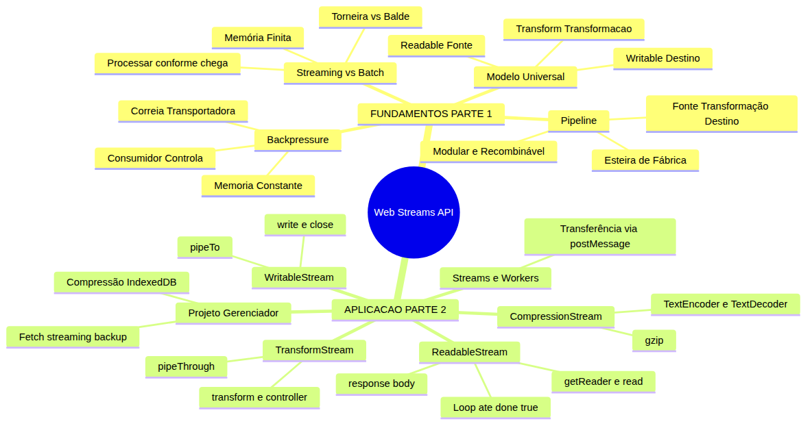
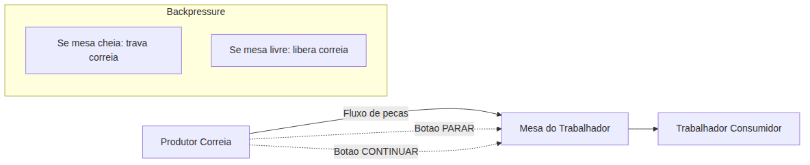
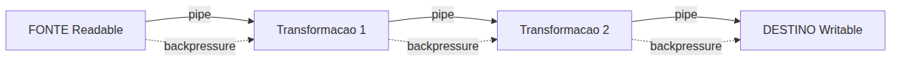

# JavaScript — Do Zero ao Profissional — Aula 29

## Web Streams API — Processando Dados Sob Demanda no Navegador

**Duração total:** 100 minutos (50 de leitura + 50 de prática)
**Nível:** Avançado
**Pré-requisitos:** Aula 06 (Strings), Aula 09 (Arrays), Aula 10 (Funções), Aula 12 (Objetos), Aula 14 (Arrow Functions), Aula 16 (Classes), Aula 18 (Custom Elements, DOM), Aula 23 (IndexedDB), Aula 26 (AbortController, Event Loop), Aula 27 (fetch, Promises, async/await), Aula 28 (Web Workers, Service Workers)

---

## Objetivos de Aprendizagem

Ao final desta aula, você será capaz de:

- [ ] **Explicar** a diferença entre processamento batch (carregar tudo de uma vez) e streaming (processar conforme os dados chegam), com analogias do mundo real
- [ ] **Descrever** o modelo de pipeline — fonte (Readable) → transformação (Transform) → destino (Writable) — e por que cada etapa é independente e recombinável
- [ ] **Definir** backpressure e explicar por que o consumidor controla a velocidade do produtor para evitar colapso de memória
- [ ] **Utilizar** `ReadableStream.getReader()` e `reader.read()` para consumir dados chunk por chunk, interpretando `{ value, done }` e detectando o fim do stream
- [ ] **Conectar** `fetch()` com streaming — acessar `response.body` (um ReadableStream) para processar respostas HTTP progressivamente, sem esperar o download completo
- [ ] **Criar** um WritableStream e conectá-lo a um ReadableStream com `pipeTo()`, entendendo que o pipe automatiza o backpressure
- [ ] **Construir** um TransformStream e inseri-lo em um pipeline com `pipeThrough()`, transformando cada chunk que passa
- [ ] **Aplicar** CompressionStream e DecompressionStream para comprimir e descomprimir dados no navegador, usando TextEncoder e TextDecoder para converter entre strings e Uint8Array
- [ ] **Explicar** como streams podem ser transferidos para Web Workers via `postMessage()` com a opção `transfer`, permitindo processamento em thread separada
- [ ] **Integrar** streaming de fetch e compressão no Gerenciador de Tarefas — carregar arquivos JSON grandes sob demanda e comprimir anotações antes de salvar no IndexedDB

---

## Como Usar Esta Aula

Esta aula está organizada em duas partes. A **primeira parte** (Seções 1 a 4) constrói os fundamentos conceituais de streaming usando APENAS analogias do mundo real — torneira, balde, esteira de fábrica, encanamento, correia transportadora — sem mencionar JavaScript. A **segunda parte** (Seções 5 a 11) aplica esses conceitos na prática com a Web Streams API, fetch, CompressionStream e o Gerenciador de Tarefas.

Ao longo do caminho, você encontrará seções **Mão na Massa** (para fazer, não só ler), **Quick Check** (para verificar se entendeu antes de avançar) e **Diagramas** que ilustram visualmente cada conceito. Ao final, o arquivo separado **Questões de Aprendizagem** traz as tarefas de checkpoint — só avance para a Aula 30 quando conseguir completá-las por conta própria.

| Etapa | Atividade | Tempo |
|---|---|---|
| Parte 1 | Fundamentos — Streaming, Pipeline, Backpressure (analogias) | 15 min |
| Parte 2A | ReadableStream — getReader, read, { value, done } | 10 min |
| Parte 2B | Fetch com Streaming — response.body, TextDecoder | 10 min |
| Parte 2C | WritableStream + pipeTo — destino e backpressure automático | 10 min |
| Parte 2D | TransformStream + pipeThrough — transformações em pipeline | 10 min |
| Parte 2E | CompressionStream — compressão e descompressão | 15 min |
| Parte 2F | Streams + Web Workers — transferência entre threads | 10 min |
| Parte 2G | Integração no Gerenciador de Tarefas | 15 min |
| Final | Quiz, Exercícios, Revisão | 5 min |

---

## Mapa Mental



> *O mapa mental acima mostra a estrutura da aula. Cada ramo representa um conceito que você vai explorar.*

---

## Recapitulação da Aula 28

A Aula 28 foi seu mergulho em processamento paralelo e offline no navegador. Você aprendeu:

| Aula | Conceito | Onde aparece nesta aula |
|---|---|---|
| Aula 28 | **Web Workers** (`new Worker()`, `postMessage()`, `onmessage`) | Seção 10 — transferir streams para Workers via `postMessage` com transfer list |
| Aula 28 | **Service Workers** (ciclo de vida, Cache API, offline-first) | Conexão conceitual: streaming e Cache API podem ser combinados para PWA |
| Aula 28 | **Worker de exportação** | Seção 10 — Worker de exportação agora comprime com CompressionStream |
| Aula 28 | **postMessage com transfer list** (transferência de objetos) | Seção 10 — streams são transferidos, não copiados |
| Aula 27 | **fetch, async/await, response.json()** | Seções 5-6 — agora usamos `response.body.getReader()` em vez de `response.json()` |
| Aula 26 | **AbortController, AbortSignal** | Seções 5-6 — `reader.cancel()` e `fetch(url, { signal })` |
| Aula 23 | **IndexedDB, transações, IDBObjectStore** | Seção 11 — salvar dados comprimidos no IndexedDB |

**Estado do Gerenciador pós-Aula 28:** componentes Custom Elements, persistência com IndexedDB, File API, fetch com async/await, AbortController, Web Worker de exportação, Service Worker + Cache API para funcionamento offline, observadores, geolocalização, notificações, síntese de voz, vibração. O que ele NÃO tem ainda: processamento de dados em streaming.

**O problema que a Aula 28 deixou aberto:** No final dela, você cria um Web Worker que exporta tarefas. Mas a exportação carrega todos os dados na memória de uma vez. E se você tiver 10.000 tarefas com anotações longas? O JSON teria centenas de megabytes. Streaming resolve isso — carregando e processando dados em partes, sem estourar a memória.

---

**FUNDAMENTOS: O Modelo Universal de Fluxo de Dados**

> *Os conceitos desta seção são universais — valem para qualquer sistema que processe dados que chegam ao longo do tempo: vídeo, áudio, rede, arquivos, encanamento, linhas de montagem. Usamos exclusivamente analogias do cotidiano: torneira, esteira de fábrica, correia transportadora. Na segunda parte, você verá como a Web Streams API implementa cada um deles no navegador.*

---

## 1. Streaming vs Batch — Torneira vs Balde

Você está na cozinha. Precisa de água para lavar a louça. Você tem duas opções:

**Opção 1 (Batch — o Balde):** Você posiciona um balde debaixo da torneira, abre a água, espera o balde ENCHER COMPLETAMENTE, fecha a torneira, e só ENTÃO usa a água para lavar a louça.

Se o balde for pequeno (500 ml), a espera é curta, mas você tem pouca água. Se o balde for grande (20 litros), você espera muito. E se a água estiver suja, você só descobre depois de encher o balde inteiro — desperdiçou todo o tempo de espera.

**Opção 2 (Streaming — a Torneira Direta):** Você abre a torneira e usa a água IMEDIATAMENTE, enquanto ela sai. Lava o primeiro prato com os primeiros goles de água, lava o segundo enquanto mais água chega. Se a água vier suja, você detecta no primeiro gole e fecha a torneira.

Streaming é a Opção 2. Você não espera tudo chegar — você processa cada pedaço assim que ele chega.

### O Problema da Memória Finita

Na programação, o "tamanho do balde" é a memória RAM disponível. Se você tem um arquivo de 2 GB para processar, mas o navegador só tem 512 MB de RAM disponível para sua página, a opção batch simplesmente não funciona — o programa trava (Out of Memory).

Streaming resolve isso processando o arquivo em pedaços pequenos — tipicamente 64 KB por vez. Em nenhum momento você ocupa mais que esses 64 KB de memória, independentemente do tamanho total do arquivo.

### Analogia Complementar — Download de Filme

- **Batch**: baixar o filme inteiro (2 GB) para o disco e só então abrir o player para assistir.
- **Streaming**: assistir enquanto baixa (YouTube, Netflix). O player começa a exibir os primeiros segundos enquanto o resto do filme continua baixando.

Você já usa streaming todos os dias sem perceber. Música (Spotify), vídeo (YouTube), chamadas de vídeo (Zoom), jogos online — todos usam streaming. Agora você vai aprender a usar o mesmo princípio nos seus programas JavaScript.

### Quick Check 1

**1. Classifique cada cenário como batch ou streaming: (a) baixar uma foto do WhatsApp e só então abri-la, (b) assistir a uma live no YouTube, (c) ler um livro página por página vs memorizar o livro inteiro antes de entender a primeira frase, (d) uma linha de montagem de carros (cada estação faz uma parte do carro).**
**Resposta:** (a) Batch — baixa tudo, depois abre. (b) Streaming — assiste enquanto os dados chegam. (c) Streaming (página por página) vs Batch (memorizar tudo antes). (d) Streaming — cada peça é processada conforme passa pela esteira.

**2. Por que streaming é obrigatório (não opcional) quando o arquivo é maior que a memória disponível?**
**Resposta:** Porque batch tentaria carregar o arquivo inteiro na memória, o que causaria um erro "Out of Memory" (crash). Streaming processa em pedaços pequenos (ex: 64 KB) e nunca ocupa mais que isso na RAM, independentemente do tamanho do arquivo original.

---

## 2. Pipeline — A Esteira de Fábrica

Você já viu uma linha de montagem industrial? Uma esteira transporta um produto por várias estações. Cada estação faz uma transformação específica e passa o produto para a próxima.

### A Analogia Central: Fábrica de Móveis

Imagine uma fábrica que produz cadeiras:

1. **Estação 1 — Fonte**: as peças brutas (madeira, parafusos) chegam à esteira. A fonte produz os dados iniciais.
2. **Estação 2 — Corte**: cada peça de madeira é cortada no formato correto. Transformação 1.
3. **Estação 3 — Lixamento**: cada peça cortada é lixada para ficar lisa. Transformação 2.
4. **Estação 4 — Pintura**: cada peça lixada recebe tinta e verniz. Transformação 3.
5. **Estação 5 — Montagem**: as peças são montadas em cadeiras completas. Transformação 4.
6. **Estação 6 — Destino**: a cadeira pronta sai da esteira e vai para o estoque.

Características importantes desta linha de montagem:

- **Cada estação faz UMA coisa**: corte não pinta, pintura não monta. Responsabilidade única.
- **As estações são independentes**: você pode trocar a estação de pintura (manual → robótica) sem afetar o corte. Pode remover a estação de lixamento e a cadeira ainda sai (menos lisa). Pode adicionar uma estação de envernizamento extra.
- **O fluxo é contínuo**: não se espera a madeira TOTAL chegar para começar. Cada peça que chega é imediatamente processada e passada adiante.

### Analogia Complementar — Encanamento Residencial

A água que chega à sua torneira passou por um pipeline:

- **Fonte**: a rua (rede de abastecimento)
- **Transformação 1**: filtro (remove impurezas)
- **Transformação 2**: aquecedor (esquenta a água, se necessário)
- **Destino**: sua torneira (ponto de consumo)

Se você remover o filtro, a água ainda chega (suja). Se adicionar um amaciador, a água fica mais macia. Cada componente do encanamento é uma etapa de pipeline independente.

### Propriedades do Pipeline

1. **Modularidade**: cada etapa é isolada. Você pode desenvolver, testar e substituir cada etapa independentemente.
2. **Reusabilidade**: um filtro de água serve para qualquer encanamento. Uma transformação "converter para maiúsculas" serve para qualquer fluxo de texto.
3. **Composability**: você monta o pipeline que precisar — fonte, transformações opcionais, destino. O pipeline é tão flexível quanto os blocos que você conectar.

> *Até aqui, você já entendeu o que é streaming (processar conforme chega) e o que é pipeline (etapas encadeadas independentes). Isso já é MUITO. Respire. Se algo não ficou claro, releia a seção anterior — não tem problema nenhum voltar. Programação se aprende por camadas, não de uma vez.*

### Quick Check 2

**1. Para o cenário "café da manhã", identifique Fonte, Transformação(ões) e Destino: grãos → moer → água quente → coar → xícara.**
**Resposta:** Fonte = grãos de café. Transformação 1 = moer (grãos viram pó). Transformação 2 = água quente (extrai o sabor). Transformação 3 = coar (separa o líquido do pó). Destino = xícara (bebe o café).

**2. Qual a vantagem de ter etapas independentes em um pipeline? Dê um exemplo de trocar uma etapa sem afetar as outras.**
**Resposta:** Permite modificar, substituir ou remover etapas sem quebrar o resto. Exemplo: você pode trocar o filtro de café (filtro de papel → filtro de pano) sem mudar a moagem ou a xícara. Em software, você pode trocar o algoritmo de compressão (gzip → deflate) sem mudar como os dados são lidos ou escritos.

---

## 3. Backpressure — O Gargalo Controlado

Imagine uma correia transportadora que despeja peças na mesa de um trabalhador. O trabalhador inspeciona cada peça, embala e coloca na caixa.

**O problema:** a correia é controlada por um motor que funciona a velocidade constante. Se o motor for mais rápido que o trabalhador, as peças se acumulam na mesa até cair no chão. O chão acumulado é o **colapso de memória** — o programa crasha.

**A solução (backpressure):** o trabalhador tem um botão "PARAR" que pausa a correia quando sua mesa está cheia. Quando ele processa algumas peças e libera espaço, aperta "CONTINUAR". A correia respeita — nunca despeja mais peças do que o trabalhador pode processar.

Backpressure é este mecanismo: **o consumidor controla a velocidade do produtor**.

### A Analogia do Restaurante

- A **cozinha** (produtor) faz pratos.
- O **garçom** (consumidor) entrega os pratos nas mesas.

**Sem backpressure:** a cozinha faz 50 pratos de uma vez. Os pratos se acumulam na bancada da cozinha. A comida esfria. A bancada fica lotada e ninguém consegue trabalhar.

**Com backpressure:** o garçom avisa a cozinha "mande mais 2 pratos". A cozinha só produz quando o garçom pede. A bancada nunca fica cheia. A comida está sempre quente.

### Por Que Backpressure É Essencial

Sem backpressure, o consumo de memória cresce na mesma proporção que os dados de entrada. Se o arquivo tem 2 GB, o programa tenta usar 2 GB de RAM.

Com backpressure, o consumo de memória é **constante e previsível**. Se o buffer do consumidor é de 64 KB, o programa nunca usa mais que 64 KB — independentemente de o arquivo ter 2 KB ou 2 TB.



> *Talvez você esteja pensando: "mas por que o produtor simplesmente não espera?". Boa pergunta. O produtor não sabe que o consumidor está lento — ele só sabe produzir. O backpressure é o SINAL que o consumidor envia: "estou cheio, para". Sem esse sinal, o produtor continua produzindo indefinidamente até a memória acabar.*

### Quick Check 3

**1. Em uma mangueira de jardim enchendo um regador, quem é o produtor, quem é o consumidor, e o que aconteceria sem backpressure?**
**Resposta:** Produtor = mangueira (fonte de água). Consumidor = regador (recipiente). Sem backpressure: a mangueira continuaria jogando água mesmo depois de o regador estar cheio — a água transbordaria (equivalente ao crash de memória). Com backpressure: o consumidor "fecha a torneira" (simula o botão PARAR) quando o regador está cheio.

**2. Por que backpressure mantém o consumo de memória constante e previsível?**
**Resposta:** Porque o consumidor só aceita novos dados quando processou os anteriores. O buffer (espaço de trabalho) nunca ultrapassa um limite fixo — tipicamente o tamanho de um chunk. Se o chunk é de 64 KB, a memória usada é sempre ~64 KB, independentemente de os dados totais serem 1 MB ou 1 TB.

---

## 4. O Modelo Universal — Fonte, Transformação, Destino

Tudo que estudamos até aqui — streaming, pipeline, backpressure — se unifica em um modelo de três papéis. TODO sistema de fluxo de dados pode ser decomposto nestes três componentes:

1. **FONTE (Readable)**: de onde os dados vêm
2. **TRANSFORMAÇÃO (Transform)**: o que acontece com os dados no meio do caminho
3. **DESTINO (Writable)**: para onde os dados vão

### Síntese das Analogias

| Papel | Torneira (Seção 1) | Esteira (Seção 2) | Correia (Seção 3) | Modelo Universal |
|---|---|---|---|---|
| **Fonte** | Torneira (água) | Peças brutas | Correia transportadora | Readable |
| **Transformação** | Filtro de água | Corte, lixa, pintura | (processamento do trabalhador) | Transform |
| **Destino** | Balde | Produto final | Caixa de peças embaladas | Writable |

### O Diagrama Universal



Cada cano (pipe) conecta uma etapa à próxima. O dado flui pelo cano. Se o cano entope (backpressure — o destino está lento), o fluxo para temporariamente até o destino liberar.

### Aplicando o Modelo a um Cenário Novo

**Serviço de streaming de música (Spotify):**

- **Fonte**: o servidor da banda (armazena as músicas)
- **Transformação 1**: compressão de áudio (MP3/AAC — dados brutos ficam menores)
- **Transformação 2**: buffer do aplicativo (acumula alguns segundos para evitar pausas)
- **Transformação 3**: descompressão e reprodução (converte MP3 em som)
- **Destino**: seus ouvidos (alto-falante/fone)
- **Backpressure**: quando a internet está lenta, o buffer fica vazio → o player pausa (buffering) → o produtor (servidor) é informado para reduzir a taxa ou esperar

### Quick Check 4

**1. Decomponha o cenário "publicar um post de blog" em Fonte, Transformação(ões) e Destino: escrever rascunho → revisar ortografia → formatar → publicar no site.**
**Resposta:** Fonte = ideia/rascunho inicial. Transformação 1 = revisão ortográfica. Transformação 2 = formatação (títulos, imagens, links). Destino = site publicado (servidor web).

**2. Onde o backpressure atuaria em um serviço de streaming de vídeo (ex: Netflix)? Quem controla quem?**
**Resposta:** O backpressure atuaria entre o servidor e o player. Quando a internet do usuário está lenta, o buffer do player se esvazia — o player (consumidor) sinaliza para o servidor (produtor) reduzir a qualidade ou pausar o envio. O consumidor controla o produtor.

---

*Até aqui, você construiu a base conceitual completa. Você entende: **o que é** streaming (vs batch), **como funciona** um pipeline (fonte → transformação → destino), **por que** backpressure é necessário (memória finita), e **qual** o modelo universal (Readable → Transform → Writable).*

*Agora vamos implementar cada peça deste modelo com JavaScript. A torneira vira `ReadableStream`, a estação de pintura vira `TransformStream`, o balde vira `WritableStream`, e os canos entre eles são `pipeThrough()` e `pipeTo()`.*

---

**APLICAÇÃO: Web Streams API no Gerenciador de Tarefas**

> *Agora que você entende o modelo universal — fonte → transformação → destino, com backpressure entre as etapas — vamos implementá-lo com JavaScript usando a Web Streams API.*

---

## 5. ReadableStream — Consumindo Dados Sob Demanda

Na nossa analogia, a **fonte** é uma torneira que produz gotas de água. No JavaScript, a fonte é um `ReadableStream`: um objeto que produz dados em chunks (pedaços). Para consumir esses dados, você precisa de um **reader** (leitor).

### Criando um ReadableStream Manual

Você pode criar um stream manualmente com `new ReadableStream({ start(controller) { ... } })`. O `controller.enqueue(chunk)` adiciona um chunk; `controller.close()` finaliza o stream.

```javascript
// Criando um stream que emite 3 chunks
const stream = new ReadableStream({
  start(controller) {
    controller.enqueue('Chunk 1: Ola')
    controller.enqueue('Chunk 2: Mundo')
    controller.enqueue('Chunk 3: Streaming!')
    controller.close()
  }
})
```

Veja um exemplo com intervalo de tempo real:

```javascript
function criarStreamTemporal() {
  return new ReadableStream({
    start(controller) {
      let i = 1
      const interval = setInterval(() => {
        controller.enqueue(`Chunk ${i} — ${new Date().toLocaleTimeString()}`)
        i++
        if (i > 5) {
          clearInterval(interval)
          controller.close()
        }
      }, 500) // 500ms entre cada chunk
    }
  })
}
```

### Obtendo um Reader e Lendo Chunks

Para consumir, você obtém um **reader** com `getReader()` e chama `reader.read()` repetidamente. Cada `read()` retorna uma Promise que resolve para `{ value: chunk, done: boolean }`.

**Importante:** só pode existir UM reader por stream por vez. Enquanto um reader está ativo, o stream está **locked** (trancado).

```javascript
async function consumirStream(stream) {
  const reader = stream.getReader() // Obtém o reader (tranca o stream)

  while (true) {
    const { value, done } = await reader.read()

    if (done) {
      console.log('FIM DO STREAM')
      break
    }

    console.log('Recebido:', value)
  }
}
```

### Entendendo { value, done }

O objeto retornado por `reader.read()` tem sempre dois campos:

- **`value`**: o chunk de dados. Pode ser string, número, `Uint8Array`, ou qualquer tipo — depende do que foi enfileirado.
- **`done`**: `false` enquanto há dados; `true` quando o stream terminou.

Quando `done === true`, `value` é `undefined` — não há mais dados para ler.

```javascript
// Exemplo do que acontece internamente:
// Primeira chamada: { value: "Chunk 1", done: false }
// Segunda chamada: { value: "Chunk 2", done: false }
// ... depois de consumir tudo ...
// Última chamada: { value: undefined, done: true }
```

### Loop de Leitura Completo

Aqui está o padrão completo que você usará em TODOS os streams desta aula:

```javascript
async function lerStream(stream) {
  const reader = stream.getReader()

  try {
    while (true) {
      const { value, done } = await reader.read()

      if (done) {
        console.log('Stream concluído!')
        break
      }

      // Processa o chunk
      console.log('Chunk recebido:', value)
    }
  } catch (erro) {
    console.error('Erro ao ler stream:', erro)
  } finally {
    reader.releaseLock() // Libera o lock (opcional, stream fechado automaticamente)
  }
}
```

### Cancelando um Stream

Você pode cancelar a leitura com `reader.cancel()`. Isso é útil em conjunto com `AbortController` (que você aprendeu na Aula 26):

```javascript
const controller = new AbortController()
const reader = stream.getReader()

// Mais tarde, para cancelar:
reader.cancel() // Fecha o stream abruptamente

// Ou usando AbortSignal:
// (o sinal pode ser conectado ao cancelamento)
```

### Mão na Massa 1 — Criar e Consumir um ReadableStream Manual

**Dificuldade: Fácil | Duração: 5 minutos**

Vamos criar e consumir um ReadableStream manual no Console do navegador.

**Passo 1:** Abra o Console do navegador (F12 > Console) e digite:

```javascript
function criarStreamContagem(maximo) {
  return new ReadableStream({
    start(controller) {
      for (let i = 1; i <= maximo; i++) {
        controller.enqueue(`Item ${i}`)
      }
      controller.close()
    }
  })
}
```

**Passo 2:** Crie uma função para consumir:

```javascript
async function consumir(stream, nomeDoStream) {
  const reader = stream.getReader()
  console.log(`Iniciando consumo de "${nomeDoStream}"...`)

  while (true) {
    const { value, done } = await reader.read()
    if (done) {
      console.log(`"${nomeDoStream}" concluido!`)
      break
    }
    console.log(`[${nomeDoStream}] ${value}`)
  }
}
```

**Passo 3:** Execute:

```javascript
const meuStream = criarStreamContagem(5)
await consumir(meuStream, 'Contagem')
```

**Verificação:** Você verá no console:

```
Iniciando consumo de "Contagem"...
[Contagem] Item 1
[Contagem] Item 2
[Contagem] Item 3
[Contagem] Item 4
[Contagem] Item 5
"Contagem" concluido!
```

**Passo 4 (Desafio):** Modifique `criarStreamContagem` para usar `setInterval` e emitir um chunk a cada 300ms. Verifique que os chunks aparecem no console um por um — não de uma vez.

### Quick Check 5

**1. O que `reader.read()` retorna? Como você interpreta `{ value: "ola", done: false }` vs `{ value: undefined, done: true }`?**
**Resposta:** `reader.read()` retorna uma Promise que resolve para `{ value, done }`. `{ value: "ola", done: false }` significa que há um chunk ("ola") e o stream ainda não terminou. `{ value: undefined, done: true }` significa que o stream terminou — não há mais dados para ler.

**2. O que acontece se você chamar `stream.getReader()` duas vezes sem liberar o primeiro reader?**
**Resposta:** A segunda chamada lança um erro: "ReadableStream is locked". Enquanto um reader está ativo, o stream fica locked (trancado) — só se pode ter um reader por vez. Use `reader.releaseLock()` para liberar.

---

## 6. Fetch com Streaming — response.body é um ReadableStream

A conexão mais prática da Web Streams API é com `fetch`. Quando você faz uma requisição HTTP, a resposta tem a propriedade `response.body`, que é um `ReadableStream` dos bytes que estão chegando da rede.

### O Que Você Aprendeu na Aula 27 (Batch)

```javascript
// Aula 27: BATCH — espera o download COMPLETO e faz parse
async function carregarDadosBatch(url) {
  const response = await fetch(url)
  const dados = await response.json() // Só executa quando TUDO baixou
  return dados
}
```

Isso funciona bem para dados pequenos. Mas se o JSON tem 50 MB, o usuário espera o download inteiro e SÓ ENTÃO vê o resultado. Sem progresso, sem feedback.

### O Que Você Vai Aprender Agora (Streaming)

```javascript
// Aula 29: STREAMING — processa conforme os bytes chegam
async function carregarDadosStreaming(url) {
  const response = await fetch(url)
  const reader = response.body.getReader() // response.body é ReadableStream<Uint8Array>

  // Agora você lê chunk por chunk conforme chegam da rede
  while (true) {
    const { value, done } = await reader.read()
    if (done) break

    // value é um Uint8Array (bytes brutos)
    console.log(`Recebidos ${value.byteLength} bytes`)
  }
}
```

### TextDecoder — Convertendo Bytes em Texto

A diferença crucial: `response.body` entrega `Uint8Array` (bytes brutos), não strings. Você precisa de um `TextDecoder` para converter bytes em texto:

```javascript
async function carregarTextoStreaming(url) {
  const response = await fetch(url)
  const reader = response.body.getReader()
  const decoder = new TextDecoder('utf-8')
  let textoAcumulado = ''

  while (true) {
    const { value, done } = await reader.read()
    if (done) break

    const texto = decoder.decode(value, { stream: true })
    textoAcumulado += texto
    console.log(`${texto.length} caracteres decodificados neste chunk`)
  }

  return textoAcumulado
}
```

### O Parâmetro { stream: true } é CRUCIAL

Caracteres UTF-8 multi-byte — como acentos e emojis — ocupam mais de 1 byte. O "ç" ocupa 2 bytes, o "ã" ocupa 2 bytes, o emoji "🚀" ocupa 4 bytes.

Sem `{ stream: true }`, se um caractere for dividido entre dois chunks, o `TextDecoder` produz o caractere de substituição "�" (U+FFFD) — aquele quadradinho com ponto de interrogação.

Com `{ stream: true }`, o `TextDecoder` guarda os bytes incompletos internamente e completa no próximo chunk. O caractere sai perfeito.

**Exemplo:** a palavra "coração" tem 7 letras, mas em UTF-8 ocupa 9 bytes porque "ç" e "ã" são multi-byte. Se o chunk 1 terminar em "coraç" (5 bytes) e o chunk 2 começar em "ão" (4 bytes):

- **Sem `{ stream: true }`**: chunk 1 decodifica "coraç" (o "ç" incompleto vira "�") → "cora�". Chunk 2 decodifica "ão" → "ão". Resultado: "cora�ão" — corrompido.
- **Com `{ stream: true }`**: chunk 1 decodifica "cora" (guarda o "ç" incompleto). Chunk 2 completa o "ç" e decodifica "ão". Resultado: "coração" — perfeito.

```javascript
// ERRADO (caracteres corrompidos):
const chunk1 = decoder.decode(parte1) // "cora�"
const chunk2 = decoder.decode(parte2) // "ão"
// Resultado: "cora�ão"

// CERTO (stream: true preserva multi-byte):
const chunk1 = decoder.decode(parte1, { stream: true }) // "cora"
const chunk2 = decoder.decode(parte2, { stream: true }) // "ção"
// Resultado final: "coração"

// Sempre chame decoder.decode() sem argumentos no final para "lavar" o buffer:
const restante = decoder.decode() // limpa buffer interno
```

### Exibindo Progresso do Download

Com streaming, você pode mostrar uma barra de progresso REAL:

```javascript
async function carregarComProgresso(url) {
  const response = await fetch(url)
  const totalBytes = Number(response.headers.get('Content-Length')) || 0
  const reader = response.body.getReader()
  let bytesRecebidos = 0

  while (true) {
    const { value, done } = await reader.read()
    if (done) break

    bytesRecebidos += value.byteLength
    const progresso = totalBytes
      ? `${((bytesRecebidos / totalBytes) * 100).toFixed(1)}%`
      : `${bytesRecebidos} bytes`

    console.log(`Progresso: ${progresso} (${bytesRecebidos} de ${totalBytes} bytes)`)
    // Na UI: atualizar barra de progresso
  }

  console.log('Download completo!')
}
```

### Tratamento de Erros

Como `reader.read()` pode rejeitar se a conexão cair, sempre use `try/catch`:

```javascript
async function carregarComSeguranca(url, signal) {
  try {
    const response = await fetch(url, { signal })
    const reader = response.body.getReader()

    while (true) {
      const { value, done } = await reader.read()
      if (done) break
      // processar value
    }
  } catch (erro) {
    if (erro.name === 'AbortError') {
      console.log('Download cancelado pelo usuario')
    } else {
      console.error('Erro de rede:', erro.message)
    }
  }
}
```

### Mão na Massa 2 — Carregar JSON Grande com Fetch + Reader

**Dificuldade: Médio | Duração: 10 minutos**

Você vai precisar de um arquivo JSON grande para testar. Crie um arquivo `tarefas-backup.json` no mesmo diretório do `index.html`. Use este script para gerá-lo:

```javascript
// Execute no Node.js ou no Console do navegador e salve o resultado
function gerarTarefas(quantidade) {
  const tarefas = []
  for (let i = 1; i <= quantidade; i++) {
    tarefas.push({
      id: i,
      texto: `Tarefa ${i} — aprender sobre ${['streams', 'fetch', 'workers', 'promises', 'event loop'][i % 5]}`,
      concluida: i % 3 === 0,
      dataCriacao: new Date(2024, 0, i).toISOString(),
      prioridade: ['baixa', 'media', 'alta'][i % 3]
    })
  }
  return tarefas
}

// Gere 500 tarefas e copie o resultado para tarefas-backup.json
console.log(JSON.stringify(gerarTarefas(500), null, 2))
```

**Passo 1:** Sirva os arquivos com um servidor HTTP local:

```bash
npx serve .
```

**Passo 2:** No seu `index.html`, adicione um botão:

```html
<button id="carregarBackup">📥 Carregar Backup (Streaming)</button>
<p id="progressoBackup"></p>
<pre id="resultadoBackup"></pre>
```

**Passo 3:** Implemente o carregamento com streaming:

```javascript
document.getElementById('carregarBackup').addEventListener('click', async () => {
  const progresso = document.getElementById('progressoBackup')
  const resultado = document.getElementById('resultadoBackup')

  try {
    const response = await fetch('./tarefas-backup.json')
    const totalBytes = Number(response.headers.get('Content-Length'))
    const reader = response.body.getReader()
    const decoder = new TextDecoder('utf-8')
    let texto = ''
    let bytesRecebidos = 0

    while (true) {
      const { value, done } = await reader.read()
      if (done) break

      bytesRecebidos += value.byteLength
      texto += decoder.decode(value, { stream: true })

      const pct = totalBytes
        ? `${((bytesRecebidos / totalBytes) * 100).toFixed(1)}%`
        : `${(bytesRecebidos / 1024).toFixed(1)} KB`
      progresso.textContent = `Carregando... ${pct}`
    }

    // Finaliza o decoder
    texto += decoder.decode()

    const tarefas = JSON.parse(texto)
    resultado.textContent = `${tarefas.length} tarefas carregadas com sucesso!`
    progresso.textContent = `✅ Completo! ${tarefas.length} tarefas.`
  } catch (erro) {
    progresso.textContent = `❌ Erro: ${erro.message}`
  }
})
```

**Verificação:** Abra o DevTools > Network. Você verá o download do `tarefas-backup.json` acontecendo. Na aba Console ou na UI, você verá o progresso atualizando a cada chunk.

### Quick Check 6

**1. Por que usar `{ stream: true }` no `TextDecoder.decode()`? O que acontece com um caractere "ç" (2 bytes em UTF-8) se ele for dividido entre dois chunks?**
**Resposta:** Sem `{ stream: true }`, o byte incompleto do "ç" no primeiro chunk produz o caractere de substituição "�". O segundo chunk produz o restante. Resultado final: caractere corrompido. Com `{ stream: true }`, o decoder guarda os bytes incompletos internamente e os completa no próximo chunk — o "ç" sai perfeito.

**2. Qual a diferença entre `await response.json()` (Aula 27) e `response.body.getReader()` (Aula 29)?**
**Resposta:** `response.json()` é BATCH — espera o download COMPLETO da resposta HTTP para então fazer o parse do JSON. `response.body.getReader()` é STREAMING — permite ler os bytes conforme eles chegam da rede, exibindo progresso e processando incrementalmente.

---

## 7. WritableStream + pipeTo — Produzindo e Entregando Dados

Na nossa analogia, o **destino** é o balde que recebe a água. No JavaScript, o destino é um `WritableStream`: um objeto que recebe chunks e faz algo com eles.

### Criando um WritableStream Manual

```javascript
const writable = new WritableStream({
  write(chunk, controller) {
    // chunk é o dado recebido
    console.log('Escrevendo:', chunk)
  },
  close() {
    console.log('Stream de escrita fechado!')
  },
  abort(err) {
    console.error('Stream abortado:', err)
  }
})
```

### Escrevendo Manualmente com writer

Assim como o `ReadableStream` tem um `reader`, o `WritableStream` tem um `writer`:

```javascript
async function escreverManual() {
  const writable = new WritableStream({
    write(chunk) {
      console.log('Recebi:', chunk)
    }
  })

  const writer = writable.getWriter()
  await writer.write('Primeiro dado')
  await writer.write('Segundo dado')
  await writer.write('Terceiro dado')
  await writer.close() // Finaliza
}
```

Cada `writer.write()` retorna uma Promise que resolve quando o chunk foi processado. Isso é o mecanismo de backpressure: se o consumidor estiver lento, o `await writer.write()` demora mais para resolver.

### pipeTo — Conectando Readable a Writable Automaticamente

Gerenciar manualmente reader, writer, loop de leitura e backpressure é trabalhoso. O método `pipeTo()` faz tudo automaticamente:

```javascript
readableStream.pipeTo(writableStream)
```

O `pipeTo()`:
1. Lê do Readable automaticamente
2. Escreve no Writable automaticamente
3. **Gerencia backpressure**: se o Writable estiver lento, pausa a leitura do Readable
4. Propaga erros: se um lado falha, o outro é notificado
5. Retorna uma Promise que resolve quando o stream termina

```javascript
async function exemploPipe() {
  const readable = new ReadableStream({
    start(controller) {
      for (let i = 1; i <= 10; i++) {
        controller.enqueue(`Dado ${i}`)
      }
      controller.close()
    }
  })

  const writable = new WritableStream({
    write(chunk) {
      console.log('Processado:', chunk.toUpperCase())
    }
  })

  await readable.pipeTo(writable)
  console.log('Pipeline concluido!')
}
```

Com `pipeTo()`, NÃO precisa de `getReader()`, NÃO precisa de `getWriter()`, NÃO precisa de loop `while (true)`. O pipe gerencia tudo.

### Exemplo com Backpressure Real

Para VER o backpressure funcionando, crie um Writable artificialmente lento:

```javascript
async function exemploBackpressure() {
  const readable = new ReadableStream({
    start(controller) {
      for (let i = 1; i <= 5; i++) {
        controller.enqueue(`Chunk ${i}`)
      }
      controller.close()
    }
  })

  const writable = new WritableStream({
    async write(chunk) {
      console.log(`Recebido: ${chunk}`)
      // Simula processamento lento (200ms por chunk)
      await new Promise(r => setTimeout(r, 200))
      console.log(`Processado: ${chunk}`)
    }
  })

  console.time('pipe')
  await readable.pipeTo(writable)
  console.timeEnd('pipe')
}

// Execute no console: exemploBackpressure()
```

Observe que:
- O Readable emite todos os 5 chunks de uma vez (síncrono)
- O Writable processa um por vez (a cada 200ms)
- O pipe gerencia o fluxo: o Readable NÃO é pausado (já emitiu tudo), mas o Writable processa sob demanda

Se o Readable fosse assíncrono (ex: dados chegando da rede), o pipe pausaria a leitura enquanto o Writable estivesse ocupado.

### Opções do pipeTo

```javascript
await readable.pipeTo(writable, {
  preventClose: true,   // Não fecha o writable quando readable terminar
  preventAbort: true,   // Não aborta o writable se readable errar
  preventCancel: true,  // Não cancela o readable se writable errar
  signal: abortSignal   // AbortController para cancelar o pipe
})
```

### pipeTo vs Loop Manual

| Abordagem | Vantagens | Desvantagens |
|---|---|---|
| **Loop manual** (`reader.read()` + `writer.write()`) | Controle total sobre cada chunk | Precisa gerenciar backpressure manualmente; mais código |
| **pipeTo()** | Backpressure automático; menos código; propagação de erros automática | Menos controle granular sobre cada chunk |

Use `pipeTo()` como padrão. Use loop manual quando precisar inspecionar ou modificar cada chunk individualmente antes de escrever.

### Mão na Massa 3 — Pipeline Readable → pipeTo → Writable

**Dificuldade: Fácil | Duração: 5 minutos**

**Passo 1:** No Console do navegador, crie e conecte um pipeline:

```javascript
const readable = new ReadableStream({
  start(controller) {
    const numeros = [10, 20, 30, 40, 50]
    for (const n of numeros) {
      controller.enqueue(n)
    }
    controller.close()
  }
})

const writable = new WritableStream({
  write(chunk) {
    const resultado = chunk * 2
    console.log(`${chunk} x 2 = ${resultado}`)
  }
})

await readable.pipeTo(writable)
```

**Verificação:** Você verá no console:

```
10 x 2 = 20
20 x 2 = 40
30 x 2 = 60
40 x 2 = 80
50 x 2 = 100
```

**Passo 2:** Substitua o Writable por um que acumula em array:

```javascript
const chunks = []

const writableAcumulador = new WritableStream({
  write(chunk) {
    chunks.push(chunk * 2)
  }
})

// Recrie o readable e pipe:
const readable2 = new ReadableStream({
  start(controller) {
    for (let i = 1; i <= 5; i++) controller.enqueue(i)
    controller.close()
  }
})

await readable2.pipeTo(writableAcumulador)
console.log('Array final:', chunks) // [2, 4, 6, 8, 10]
```

### Quick Check 7

**1. O que acontece se o WritableStream.write() for mais lento que o ReadableStream? Como o pipeTo() lida com isso?**
**Resposta:** O pipeTo() gerencia o backpressure automaticamente. Se o Writable estiver ocupado processando um chunk, o pipe pausa a leitura do Readable — não solicita novos chunks até o Writable liberar. O consumo de memória permanece constante.

**2. Qual a diferença entre usar `pipeTo()` e fazer um loop manual com `reader.read()` + `writer.write()`?**
**Resposta:** O pipeTo() gerencia backpressure, propagação de erros e fechamento automaticamente. O loop manual dá controle granular (ex: pode pular chunks, modificar, decidir parar condicionalmente) mas exige código extra para gerenciar o fluxo. Use pipeTo() como padrão; use loop manual quando precisar de controle específico sobre cada chunk.

---

## 8. TransformStream + pipeThrough — Transformando no Pipeline

Na nossa analogia, **transformações** são as estações da esteira de fábrica (corte, lixa, pintura). No JavaScript, uma transformação é um `TransformStream`. Ele fica NO MEIO do pipeline: recebe chunks de um lado, aplica uma transformação, e emite chunks transformados do outro lado.

### Criando um TransformStream

```javascript
const transform = new TransformStream({
  transform(chunk, controller) {
    // chunk: dado recebido para transformar
    // controller.enqueue(): emite o chunk transformado
    const chunkTransformado = chunk.toUpperCase()
    controller.enqueue(chunkTransformado)
  }
})
```

O método `transform(chunk, controller)` é chamado para CADA chunk que passa pelo stream. Use `controller.enqueue()` para emitir o chunk transformado.

### pipeThrough — Inserindo Transformação no Pipeline

O método `pipeThrough(transformStream)` insere um TransformStream no pipeline. Ele retorna o lado Readable do TransformStream (o lado de saída), permitindo encadeamento:

```javascript
readable
  .pipeThrough(transformStream) // Insere transformação
  .pipeTo(writable)             // Conecta ao destino
```

Exemplo completo:

```javascript
const readable = new ReadableStream({
  start(controller) {
    controller.enqueue('javascript')
    controller.enqueue('streams')
    controller.enqueue('api')
    controller.close()
  }
})

const maiusculas = new TransformStream({
  transform(chunk, controller) {
    controller.enqueue(chunk.toUpperCase())
  }
})

const writable = new WritableStream({
  write(chunk) {
    console.log('Saída:', chunk)
  }
})

await readable
  .pipeThrough(maiusculas)
  .pipeTo(writable)
// Saída:
// JAVASCRIPT
// STREAMS
// API
```

### Encadeamento Múltiplo

Você pode encadear QUANTAS transformações quiser:

```javascript
await readable
  .pipeThrough(transform1) // Primeira transformacao
  .pipeThrough(transform2) // Segunda transformacao
  .pipeThrough(transform3) // Terceira transformacao
  .pipeTo(writable)
```

Exemplo real com 3 transformações:

```javascript
const paraMaiusculas = new TransformStream({
  transform(chunk, ctrl) { ctrl.enqueue(chunk.toUpperCase()) }
})

const adicionarTimestamp = new TransformStream({
  transform(chunk, ctrl) {
    ctrl.enqueue(`[${new Date().toLocaleTimeString()}] ${chunk}`)
  }
})

const adicionarIndice = (() => {
  let indice = 0
  return new TransformStream({
    transform(chunk, ctrl) {
      indice++
      ctrl.enqueue(`${indice}: ${chunk}`)
    }
  })
})()

const readable = new ReadableStream({
  start(ctrl) {
    ctrl.enqueue('primeiro')
    ctrl.enqueue('segundo')
    ctrl.enqueue('terceiro')
    ctrl.close()
  }
})

await readable
  .pipeThrough(paraMaiusculas)
  .pipeThrough(adicionarTimestamp)
  .pipeThrough(adicionarIndice)
  .pipeTo(new WritableStream({
    write(chunk) { console.log(chunk) }
  }))
// Saida exemplo:
// 1: [10:30:45] PRIMEIRO
// 2: [10:30:45] SEGUNDO
// 3: [10:30:45] TERCEIRO
```

### Exemplos de Transformações Úteis

**Filtro (selecionar chunks):** Não enfileire chunks indesejados:

```javascript
const filtrarPares = new TransformStream({
  transform(chunk, ctrl) {
    if (chunk % 2 === 0) {
      ctrl.enqueue(chunk) // Só passa números pares
    }
    // Ímpares são "engolidos" — não passam adiante
  }
})
```

**Acumulador (buffer):** Junte chunks até ter um tamanho mínimo:

```javascript
const acumularAteVirgula = (() => {
  let buffer = ''
  return new TransformStream({
    transform(chunk, ctrl) {
      buffer += chunk
      const partes = buffer.split(',')
      buffer = partes.pop() // O que sobrou sem virgula
      for (const parte of partes) {
        ctrl.enqueue(parte.trim()) // Emite cada parte completa
      }
    }
  })
})()
```

**Mapeador:** Adicione metadados a cada chunk:

```javascript
const adicionarTipo = new TransformStream({
  transform(chunk, ctrl) {
    ctrl.enqueue({ tipo: typeof chunk, valor: chunk, timestamp: Date.now() })
  }
})
```

### Quick Check 8

**1. O que o método `pipeThrough(transformStream)` retorna? Por que isso permite encadeamento fluente?**
**Resposta:** `pipeThrough()` retorna o lado Readable do TransformStream (o lado de saída). Como também é um ReadableStream, você pode chamar `.pipeThrough()` ou `.pipeTo()` em cima dele, criando encadeamento fluente: `readable.pipeThrough(t1).pipeThrough(t2).pipeTo(writable)`.

**2. Dado um ReadableStream de strings e um TransformStream que converte para maiúsculas, escreva o encadeamento completo com pipeThrough + pipeTo.**

```javascript
const resultado = readable
  .pipeThrough(new TransformStream({
    transform(chunk, ctrl) { ctrl.enqueue(chunk.toUpperCase()) }
  }))
  .pipeTo(new WritableStream({
    write(chunk) { console.log(chunk) }
  }))
```

---

## 9. CompressionStream + TextEncoder/TextDecoder — Comprimindo no Navegador

Até agora trabalhamos com strings e números. Mas o mundo real lida com bytes — e a Web Streams API é construída sobre bytes. `CompressionStream` e `DecompressionStream` são `TransformStream` built-in do navegador que comprimem e descomprimem dados usando o formato **gzip**.

### TextEncoder — String → Uint8Array

Para comprimir texto, primeiro você precisa convertê-lo em bytes. `TextEncoder` faz isso:

```javascript
const encoder = new TextEncoder()
const bytes = encoder.encode('Olá, mundo!')
console.log(bytes) // Uint8Array(13) — caracteres acentuados viram 2 bytes cada
console.log(bytes.byteLength) // 13 (a string tem 12 caracteres, mas "á" ocupa 2 bytes)
```

A conversão é **síncrona** — retorna o `Uint8Array` imediatamente.

### TextDecoder — Uint8Array → String

Para voltar de bytes a texto:

```javascript
const decoder = new TextDecoder('utf-8')
const texto = decoder.decode(bytes)
console.log(texto) // "Olá, mundo!"
```

Com `{ stream: true }` para decodificação incremental (como vimos na Seção 6).

### CompressionStream — TransformStream Built-in

`CompressionStream('gzip')` é um `TransformStream` que recebe `Uint8Array` na entrada e produz `Uint8Array` comprimido na saída:

```javascript
const textoOriginal = 'A'.repeat(10000) // 10 KB de letras "A"
const encoder = new TextEncoder()
const bytesOriginais = encoder.encode(textoOriginal)

// Criando o pipeline de compressão
const readable = new ReadableStream({
  start(controller) {
    controller.enqueue(bytesOriginais)
    controller.close()
  }
})

const chunksComprimidos = []

await readable
  .pipeThrough(new CompressionStream('gzip'))
  .pipeTo(new WritableStream({
    write(chunk) { chunksComprimidos.push(chunk) }
  }))

// Juntar todos os chunks em um único Uint8Array
const tamanhoTotal = chunksComprimidos.reduce((acc, c) => acc + c.byteLength, 0)
const bytesComprimidos = new Uint8Array(tamanhoTotal)
let offset = 0
for (const c of chunksComprimidos) {
  bytesComprimidos.set(c, offset)
  offset += c.byteLength
}

console.log(`Original: ${bytesOriginais.byteLength} bytes`)
console.log(`Comprimido: ${bytesComprimidos.byteLength} bytes`)
console.log(`Taxa: ${(bytesComprimidos.byteLength / bytesOriginais.byteLength * 100).toFixed(1)}%`)
// Original: 10000 bytes
// Comprimido: ~40 bytes (gzip otimiza repetições)
```

### DecompressionStream — Voltando ao Original

```javascript
const chunksDescomprimidos = []

await new ReadableStream({
  start(controller) {
    controller.enqueue(bytesComprimidos)
    controller.close()
  }
})
  .pipeThrough(new DecompressionStream('gzip'))
  .pipeTo(new WritableStream({
    write(chunk) { chunksDescomprimidos.push(chunk) }
  }))

const tamanhoTotalD = chunksDescomprimidos.reduce((acc, c) => acc + c.byteLength, 0)
const bytesDescomprimidos = new Uint8Array(tamanhoTotalD)
let offsetD = 0
for (const c of chunksDescomprimidos) {
  bytesDescomprimidos.set(c, offsetD)
  offsetD += c.byteLength
}

const decoder = new TextDecoder()
const textoRestaurado = decoder.decode(bytesDescomprimidos)
console.log('Texto original:', textoOriginal)
console.log('Texto restaurado:', textoRestaurado)
console.log('Identico?', textoOriginal === textoRestaurado) // true
```

### Pipeline Completo de Compressão/Descompressão


### Caso de Uso Prático: Anotações no Gerenciador

No Gerenciador de Tarefas da Aula 23, cada tarefa tem um campo `anotacoes`. Se o usuário escreve anotações longas (5 KB de texto), cada tarefa ocupa mais espaço no IndexedDB. Com compressão, 5 KB vira ~1 KB com gzip.

```javascript
async function comprimirAnotacao(texto) {
  const encoder = new TextEncoder()
  const bytes = encoder.encode(texto)
  const chunks = []

  await new ReadableStream({
    start(ctrl) { ctrl.enqueue(bytes); ctrl.close() }
  })
    .pipeThrough(new CompressionStream('gzip'))
    .pipeTo(new WritableStream({
      write(chunk) { chunks.push(chunk) }
    }))

  // Concatena chunks em um ArrayBuffer
  const total = chunks.reduce((s, c) => s + c.byteLength, 0)
  const resultado = new Uint8Array(total)
  let offset = 0
  for (const c of chunks) { resultado.set(c, offset); offset += c.byteLength }
  return resultado.buffer // ArrayBuffer para armazenar no IndexedDB
}

async function descomprimirAnotacao(arrayBuffer) {
  const chunks = []

  await new ReadableStream({
    start(ctrl) { ctrl.enqueue(new Uint8Array(arrayBuffer)); ctrl.close() }
  })
    .pipeThrough(new DecompressionStream('gzip'))
    .pipeTo(new WritableStream({
      write(chunk) { chunks.push(chunk) }
    }))

  const total = chunks.reduce((s, c) => s + c.byteLength, 0)
  const resultado = new Uint8Array(total)
  let offset = 0
  for (const c of chunks) { resultado.set(c, offset); offset += c.byteLength }

  return new TextDecoder('utf-8').decode(resultado)
}
```

### Mão na Massa 4 — Comprimir e Descomprimir Anotações

**Dificuldade: Médio | Duração: 10 minutos**

**Passo 1:** No Console do navegador, crie uma anotação longa:

```javascript
const anotacao = `Notas importantes sobre o projeto:

Hoje aprendi sobre Web Streams API. O conceito de backpressure é fascinante
porque permite que o consumidor controle o produtor. Vou aplicar isso no
Gerenciador de Tarefas para carregar backups remotos sem travar a interface.

Lembrete: sempre usar { stream: true } no TextDecoder quando estiver
processando chunks incrementais! Caracteres acentuados como "coração"
e "linguística" podem ser quebrados entre chunks.

Proximo passo: integrar CompressionStream no Worker de exportacao.
`.repeat(20) // Repete 20x para ter ~5 KB de texto

console.log('Tamanho original:', anotacao.length, 'caracteres')
```

**Passo 2:** Comprima a anotação:

```javascript
async function testarCompressao(texto) {
  const encoder = new TextEncoder()
  const bytesOriginal = encoder.encode(texto)

  // Comprime
  const chunksComp = []
  await new ReadableStream({
    start(c) { c.enqueue(bytesOriginal); c.close() }
  })
    .pipeThrough(new CompressionStream('gzip'))
    .pipeTo(new WritableStream({
      write(c) { chunksComp.push(c) }
    }))

  const totalComp = chunksComp.reduce((s, c) => s + c.byteLength, 0)
  const comprimido = new Uint8Array(totalComp)
  let off = 0
  for (const c of chunksComp) { comprimido.set(c, off); off += c.byteLength }

  // Descomprime
  const chunksDes = []
  await new ReadableStream({
    start(c) { c.enqueue(comprimido); c.close() }
  })
    .pipeThrough(new DecompressionStream('gzip'))
    .pipeTo(new WritableStream({
      write(c) { chunksDes.push(c) }
    }))

  const totalDes = chunksDes.reduce((s, c) => s + c.byteLength, 0)
  const descomprimido = new Uint8Array(totalDes)
  off = 0
  for (const c of chunksDes) { descomprimido.set(c, off); off += c.byteLength }

  const textoRestaurado = new TextDecoder('utf-8').decode(descomprimido)

  console.log('Original:', bytesOriginal.byteLength, 'bytes')
  console.log('Comprimido:', comprimido.byteLength, 'bytes')
  console.log('Taxa:', ((comprimido.byteLength / bytesOriginal.byteLength) * 100).toFixed(1) + '%')
  console.log('Restaurado:', textoRestaurado.length, 'caracteres')
  console.log('Identico?', texto === textoRestaurado)
}

await testarCompressao(anotacao)
```

**Verificação:** Você verá algo como:
```
Original: 6294 bytes
Comprimido: 598 bytes
Taxa: 9.5%
Restaurado: 6294 caracteres
Identico? true
```

A taxa de compressão de ~90% para texto repetitivo mostra o poder do gzip.

### Quick Check 9

**1. Por que o CompressionStream opera sobre Uint8Array e não diretamente sobre strings?**
**Resposta:** Porque compressão opera sobre bytes (nível binário), não sobre caracteres. O TextEncoder converte strings em Uint8Array (bytes) para que o CompressionStream possa comprimir. O TextDecoder faz o caminho inverso na descompressão.

**2. Quais formatos o CompressionStream suporta? Qual é o mais universal?**
**Resposta:** Suporta `'gzip'`, `'deflate'` e `'deflate-raw'`. O mais universal e recomendado é `'gzip'` — compatível com servidores web, ferramentas de linha de comando e praticamente todo software que lida com compressão.

---

## 10. Streams e Web Workers — Transferência entre Threads

Na Aula 28, você aprendeu a criar Web Workers para processar dados em thread separada. Você enviava mensagens com `postMessage(data)` e os dados eram **copiados** para o Worker.

Agora você vai aprender a **transferir** um stream inteiro para o Worker — sem copiar os dados, transferindo a propriedade. O Worker pode consumir o stream, processar (ex: comprimir com CompressionStream) e devolver o resultado.

### Transferindo um ReadableStream via postMessage

Para transferir um stream, passe-o na **transfer list** do `postMessage`:

```javascript
// Thread principal
const stream = new ReadableStream({ /* ... */ })
worker.postMessage({ tipo: 'processar', stream }, [stream])
// O segundo argumento é a "transfer list" — o stream é transferido, não copiado
```

Após a transferência, a thread principal PERDE o acesso ao stream — ele pertence ao Worker agora. Isso é intencional: evita race conditions (dois lados tentando ler o mesmo stream ao mesmo tempo).

### Worker Recebendo um Stream

```javascript
// worker.js
self.onmessage = async function(event) {
  const { tipo, stream } = event.data

  if (tipo === 'processar') {
    const reader = stream.getReader()

    while (true) {
      const { value, done } = await reader.read()
      if (done) break
      // Processa cada chunk...
      self.postMessage({ tipo: 'chunk', dados: value })
    }

    self.postMessage({ tipo: 'concluido' })
  }
}
```

### Worker de Exportação com Compressão

Na Aula 28, você criou um Worker que exportava tarefas. Vamos modificá-lo para comprimir com `CompressionStream` antes de devolver.

**worker-exportacao.js:**

```javascript
self.onmessage = async function(event) {
  const { tipo, dados } = event.data

  if (tipo === 'exportar') {
    // dados é um array de tarefas
    const jsonString = JSON.stringify(dados, null, 2)
    const encoder = new TextEncoder()
    const bytes = encoder.encode(jsonString)

    const chunks = []

    await new ReadableStream({
      start(controller) {
        controller.enqueue(bytes)
        controller.close()
      }
    })
      .pipeThrough(new CompressionStream('gzip'))
      .pipeTo(new WritableStream({
        write(chunk) { chunks.push(chunk) }
      }))

    // Concatena chunks
    const total = chunks.reduce((s, c) => s + c.byteLength, 0)
    const resultado = new Uint8Array(total)
    let offset = 0
    for (const c of chunks) { resultado.set(c, offset); offset += c.byteLength }

    // Envia o ArrayBuffer comprimido de volta
    self.postMessage({
      tipo: 'exportado',
      dados: resultado.buffer,
      nome: `tarefas-comprimidas-${new Date().toISOString().slice(0, 10)}.json.gz`
    }, [resultado.buffer]) // Transfere o buffer!
  }
}
```

**Thread principal:**

```javascript
const worker = new Worker('worker-exportacao.js')

worker.onmessage = function(event) {
  const { tipo, dados, nome } = event.data

  if (tipo === 'exportado') {
    const blob = new Blob([dados], { type: 'application/gzip' })
    const url = URL.createObjectURL(blob)
    const a = document.createElement('a')
    a.href = url
    a.download = nome
    a.click()
    URL.revokeObjectURL(url)
  }
}

// Quando o usuario clicar em "Exportar":
document.getElementById('exportarBtn').addEventListener('click', async () => {
  const tarefas = await carregarTarefasDoDB() // funcao que le do IndexedDB
  worker.postMessage({ tipo: 'exportar', dados: tarefas })
})
```

### Limitações

- Streams transferidos pertencem ao Worker — a thread principal não pode mais usá-los
- Nem todos os tipos de stream são transferíveis em todos os navegadores (verificar compatibilidade)
- A transferência via `postMessage` move a propriedade, não copia — é rápida e econômica

### Mão na Massa 5 — Exportação Comprimida via Worker + Stream

**Dificuldade: Médio | Duração: 10 minutos**

**Passo 1:** Crie o arquivo `worker-exportacao.js` com o conteúdo mostrado acima.

**Passo 2:** No seu `index.html`, modifique o botão de exportação para usar o Worker:

```javascript
const worker = new Worker('worker-exportacao.js')

worker.onmessage = function(event) {
  const { tipo, dados, nome } = event.data

  if (tipo === 'exportado') {
    const blob = new Blob([dados], { type: 'application/gzip' })
    const url = URL.createObjectURL(blob)
    const a = document.createElement('a')
    a.href = url
    a.download = nome || 'tarefas-exportadas.json.gz'
    a.click()
    URL.revokeObjectURL(url)
    document.getElementById('exportStatus').textContent = '✅ Exportado com compressao!'
  }
}

document.getElementById('exportarBtn').addEventListener('click', () => {
  document.getElementById('exportStatus').textContent = '⏳ Comprimindo...'

  // carregarTarefasDoDB() é sua função existente que busca do IndexedDB
  carregarTarefasDoDB().then(tarefas => {
    worker.postMessage({ tipo: 'exportar', dados: tarefas })
  })
})
```

**Passo 3:** Teste — exporte com e sem compressão para comparar os tamanhos:

- **Sem compressão (Aula 28)**: JSON puro → `tarefas.json` (~50 KB para 100 tarefas)
- **Com compressão (Aula 29)**: JSON comprimido → `tarefas-comprimidas.json.gz` (~5 KB para 100 tarefas)

**Verificação:** O arquivo `.gz` baixado deve ser significativamente menor que o JSON puro. No DevTools > Network, você pode ver o tamanho dos arquivos baixados.

---

## 11. Integrando Tudo no Gerenciador de Tarefas

Chegou a hora de unir todos os conceitos em duas features que transformam seu Gerenciador de Tarefas em uma aplicação profissional com processamento de dados sob demanda.

### Feature 1 — Carregar Backup Remoto com Streaming

O Gerenciador carrega um arquivo JSON grande de tarefas de um servidor remoto. Em vez de esperar o download completo, ele processa conforme os chunks chegam e exibe as tarefas na UI progressivamente.

Adicione ao seu `index.html`:

```html
<button id="carregarBackupRemoto">📥 Carregar Backup Remoto</button>
<div id="backupProgresso">
  <div id="barraProgresso" style="width:0%;height:4px;background:#4caf50;"></div>
</div>
<p id="backupStatus"></p>
<div id="tarefasCarregadas"></div>
```

```javascript
document.getElementById('carregarBackupRemoto').addEventListener('click', async () => {
  const status = document.getElementById('backupStatus')
  const barra = document.getElementById('barraProgresso')
  const container = document.getElementById('tarefasCarregadas')

  try {
    const response = await fetch('./tarefas-backup.json')
    const totalBytes = Number(response.headers.get('Content-Length'))
    const reader = response.body.getReader()
    const decoder = new TextDecoder('utf-8')
    let texto = ''
    let bytesRecebidos = 0

    status.textContent = '⏳ Baixando...'

    while (true) {
      const { value, done } = await reader.read()
      if (done) break

      bytesRecebidos += value.byteLength
      texto += decoder.decode(value, { stream: true })

      const pct = totalBytes
        ? ((bytesRecebidos / totalBytes) * 100).toFixed(0)
        : '0'
      barra.style.width = `${pct}%`
      status.textContent = `⏳ Baixando... ${pct}% (${(bytesRecebidos / 1024).toFixed(0)} KB)`
    }

    texto += decoder.decode() // Finaliza

    const tarefas = JSON.parse(texto)
    status.textContent = `✅ ${tarefas.length} tarefas carregadas! Salvando no banco...`

    // Salva uma a uma no IndexedDB e atualiza a UI progressivamente
    for (const tarefa of tarefas) {
      await salvarTarefaNoDB(tarefa)
      adicionarTarefaNaUI(tarefa)
      status.textContent = `✅ ${tarefas.length} tarefas — salvando ${tarefa.id}/${tarefas.length}...`
    }

    status.textContent = `✅ ${tarefas.length} tarefas carregadas e salvas!`
  } catch (erro) {
    status.textContent = `❌ Erro: ${erro.message}`
  }
})
```

### Feature 2 — Compressão de Anotações no IndexedDB

Modifique sua função `salvarTarefaNoDB()` para comprimir anotações longas automaticamente:

```javascript
async function salvarTarefaComCompressao(tarefa) {
  // Clona a tarefa para nao modificar o original
  const tarefaSalvar = { ...tarefa }

  // Comprime anotacoes se forem longas (> 500 caracteres)
  if (tarefaSalvar.anotacoes && tarefaSalvar.anotacoes.length > 500) {
    const encoder = new TextEncoder()
    const bytes = encoder.encode(tarefaSalvar.anotacoes)
    const chunks = []

    await new ReadableStream({
      start(ctrl) { ctrl.enqueue(bytes); ctrl.close() }
    })
      .pipeThrough(new CompressionStream('gzip'))
      .pipeTo(new WritableStream({
        write(chunk) { chunks.push(chunk) }
      }))

    const total = chunks.reduce((s, c) => s + c.byteLength, 0)
    const comprimido = new Uint8Array(total)
    let off = 0
    for (const c of chunks) { comprimido.set(c, off); off += c.byteLength }

    tarefaSalvar.anotacoes = comprimido.buffer // ArrayBuffer
    tarefaSalvar.anotacoesComprimidas = true
  }

  // Salva no IndexedDB (codigo existente da Aula 23)
  return salvarNoIndexedDB(tarefaSalvar)
}
```

E a função de leitura, descomprimindo automaticamente:

```javascript
async function carregarTarefaComDescompressao(id) {
  const tarefa = await carregarDoIndexedDB(id)

  if (tarefa.anotacoesComprimidas && tarefa.anotacoes instanceof ArrayBuffer) {
    const chunks = []
    const bytes = new Uint8Array(tarefa.anotacoes)

    await new ReadableStream({
      start(ctrl) { ctrl.enqueue(bytes); ctrl.close() }
    })
      .pipeThrough(new DecompressionStream('gzip'))
      .pipeTo(new WritableStream({
        write(chunk) { chunks.push(chunk) }
      }))

    const total = chunks.reduce((s, c) => s + c.byteLength, 0)
    const descomprimido = new Uint8Array(total)
    let off = 0
    for (const c of chunks) { descomprimido.set(c, off); off += c.byteLength }

    tarefa.anotacoes = new TextDecoder('utf-8').decode(descomprimido)
    delete tarefa.anotacoesComprimidas
  }

  return tarefa
}
```

### Mão na Massa 6 — Implementar Ambas as Features no Gerenciador

**Dificuldade: Difícil | Duração: 15 minutos**

**Passo 1:** Adicione a barra de progresso e o botão de backup remoto ao `index.html`.

**Passo 2:** Substitua `salvarTarefaNoDB()` por `salvarTarefaComCompressao()` e `carregarTarefaDoDB()` por `carregarTarefaComDescompressao()`.

**Passo 3:** Teste:

1. Crie uma tarefa com anotação longa (ex: copie um texto de 1000+ caracteres)
2. Salve a tarefa
3. Abra DevTools > Application > IndexedDB > TarefasDB > tarefas
4. Verifique: o campo `anotacoes` deve ser um `ArrayBuffer` (comprimido) com tamanho menor que o texto original
5. A tarefa na interface deve mostrar a anotação normalmente (a descompressão é transparente)

**Verificação:**

- [ ] O botão de backup remoto funciona com `tarefas-backup.json`
- [ ] A barra de progresso atualiza durante o download
- [ ] As tarefas aparecem na UI progressivamente (não de uma vez)
- [ ] Anotações longas são armazenadas como ArrayBuffer comprimido no IndexedDB
- [ ] Anotações comprimidas são descomprimidas automaticamente na leitura
- [ ] O Worker de exportação produz arquivos .gz (visivelmente menores que o JSON puro)

---

---

## Autoavaliação: Quiz Rápido

**1. Qual a diferença fundamental entre batch e streaming? (a) Batch é mais rápido, streaming é mais lento. (b) Batch espera todos os dados chegarem para processar; streaming processa cada chunk conforme chega. (c) Batch usa menos memória que streaming.**
**Resposta:** (b) Batch espera o conjunto completo de dados para começar a processar; streaming processa cada pedaço (chunk) assim que ele chega, sem esperar o resto.

**2. O que é backpressure e por que é importante?**
**Resposta:** Backpressure é o mecanismo pelo qual o consumidor controla a velocidade do produtor. É essencial para evitar colapso de memória — sem backpressure, o produtor continuaria enviando dados indefinidamente, e o consumidor não conseguiria processar, acumulando dados na memória até o crash.

**3. O que `pipeTo()` faz que um loop manual com `reader.read()` + `writer.write()` não faz automaticamente?**
**Resposta:** `pipeTo()` gerencia backpressure automaticamente (pausa a leitura se o destino estiver ocupado), propaga erros entre os streams e gerencia o fechamento. Um loop manual exige código extra para tudo isso.

**4. O que o método `pipeThrough()` retorna? Como isso permite encadeamento?**
**Resposta:** `pipeThrough(transformStream)` retorna o lado Readable de saída do TransformStream. Como é um ReadableStream, você pode encadear mais `pipeThrough()` ou `pipeTo()`: `readable.pipeThrough(t1).pipeThrough(t2).pipeTo(writable)`.

**5. `CompressionStream` opera diretamente sobre strings? Explique.**
**Resposta:** Não. CompressionStream opera sobre Uint8Array (bytes). Para comprimir uma string, você precisa primeiro convertê-la para bytes com `TextEncoder`. Para descomprimir de volta a string, usa `TextDecoder`.

**6. O que significa `{ stream: true }` no `TextDecoder.decode()`?**
**Resposta:** Significa que mais chunks de bytes virão no futuro. O decoder guarda bytes incompletos de caracteres multi-byte (ex: "ç", "ã") e os completa quando o próximo chunk chegar. Sem essa opção, caracteres divididos entre chunks são corrompidos.

**7. Como você transfere um ReadableStream para um Web Worker?**
**Resposta:** Passando o stream na transfer list do `postMessage`: `worker.postMessage({ stream }, [stream])`. O stream é transferido (não copiado) para o Worker — a thread principal perde o acesso.

**8. Qual formato de compressão o CompressionStream suporta e qual é o mais recomendado?**
**Resposta:** Suporta `'gzip'`, `'deflate'` e `'deflate-raw'`. O mais universal e recomendado é `'gzip'`.

---

## Mão na Massa N: Exercícios Graduados

**Exercício 1 (Fácil) — Consumir um ReadableStream com reader**

Crie um ReadableStream que emite os números de 1 a 10 (como strings: "1", "2", ... "10"). Depois, consuma o stream com `getReader()` + loop `while` + `await read()`, exibindo cada número no console. Ao final, exiba "FIM!" no console.

**Gabarito:**

```javascript
const stream = new ReadableStream({
  start(controller) {
    for (let i = 1; i <= 10; i++) {
      controller.enqueue(String(i))
    }
    controller.close()
  }
})

async function consumir(stream) {
  const reader = stream.getReader()

  while (true) {
    const { value, done } = await reader.read()

    if (done) {
      console.log('FIM!')
      break
    }

    console.log('Numero:', value)
  }
}

await consumir(stream)
```

Explicação: O `start(controller)` enfileira 10 chunks (strings "1" a "10"). O loop `while(true)` lê cada chunk com `await reader.read()`. Quando `done === true`, o stream terminou e exibimos "FIM!". Note o uso de `await` — cada `read()` retorna uma Promise.

**Exercício 2 (Médio) — Pipeline com TransformStream customizado**

Crie um pipeline completo que:
1. Lê números de 1 a 5 de um ReadableStream
2. Passa por um TransformStream que eleva cada número ao quadrado (multiplica por ele mesmo)
3. Passa por um TransformStream que filtra apenas números pares
4. Escreve o resultado em um WritableStream que acumula em um array
5. Ao final, exibe o array no console

**Gabarito:**

```javascript
const readable = new ReadableStream({
  start(ctrl) {
    for (let i = 1; i <= 5; i++) ctrl.enqueue(i)
    ctrl.close()
  }
})

const aoQuadrado = new TransformStream({
  transform(chunk, ctrl) {
    ctrl.enqueue(chunk * chunk)
  }
})

const apenasPares = new TransformStream({
  transform(chunk, ctrl) {
    if (chunk % 2 === 0) {
      ctrl.enqueue(chunk)
    }
    // Impares sao "engolidos" — nao passam
  }
})

const resultado = []

const writable = new WritableStream({
  write(chunk) { resultado.push(chunk) }
})

await readable
  .pipeThrough(aoQuadrado)
  .pipeThrough(apenasPares)
  .pipeTo(writable)

console.log('Resultado:', resultado) // [4, 16] — 1^2=1 (impar, filtrado), 2^2=4, 3^2=9 (impar), 4^2=16, 5^2=25 (impar)
```

Explicação: O pipeline tem duas transformações — `aoQuadrado` transforma cada número, `apenasPares` filtra os ímpares. O pipeThrough retorna ReadableStream, permitindo encadeamento fluente. O pipeTo finaliza no Writable que acumula.

**Desafio (Difícil) — Mini-sistema de Streaming com Fetch + Compressão + IndexedDB**

Crie uma função `carregarEComprimirDados(url)` que:
1. Faz fetch de um arquivo JSON remoto usando streaming (`response.body.getReader()`)
2. Acumula os chunks com TextDecoder (com `{ stream: true }`)
3. Converte o texto completo para bytes com TextEncoder
4. Comprime os bytes com CompressionStream('gzip')
5. Salva o ArrayBuffer comprimido no IndexedDB em uma object store `dados_comprimidos`
6. Retorna o tamanho original e o tamanho comprimido

Premissas: você já tem uma função `salvarNoIndexedDB(storeName, dados)` que retorna uma Promise.

**Gabarito:**

```javascript
async function carregarEComprimirDados(url) {
  // Passo 1: Fetch com streaming
  const response = await fetch(url)
  const reader = response.body.getReader()
  const decoder = new TextDecoder('utf-8')
  let texto = ''
  let bytesBaixados = 0

  while (true) {
    const { value, done } = await reader.read()
    if (done) break

    bytesBaixados += value.byteLength
    texto += decoder.decode(value, { stream: true })
    console.log(`Baixados ${bytesBaixados} bytes...`)
  }

  texto += decoder.decode() // Finaliza
  console.log(`Download completo: ${texto.length} caracteres`)

  // Passo 2: Comprimir com CompressionStream
  const encoder = new TextEncoder()
  const bytes = encoder.encode(texto)
  const chunksComp = []

  await new ReadableStream({
    start(ctrl) { ctrl.enqueue(bytes); ctrl.close() }
  })
    .pipeThrough(new CompressionStream('gzip'))
    .pipeTo(new WritableStream({
      write(chunk) { chunksComp.push(chunk) }
    }))

  // Passo 3: Concatenar chunks comprimidos
  const totalComp = chunksComp.reduce((s, c) => s + c.byteLength, 0)
  const comprimido = new Uint8Array(totalComp)
  let off = 0
  for (const c of chunksComp) { comprimido.set(c, off); off += c.byteLength }

  // Passo 4: Salvar no IndexedDB
  await salvarNoIndexedDB('dados_comprimidos', {
    id: url,
    dados: comprimido.buffer,
    tamanhoOriginal: texto.length,
    tamanhoComprimido: comprimido.byteLength,
    data: new Date().toISOString()
  })

  console.log(`Salvo no IndexedDB. Original: ${texto.length} bytes, Comprimido: ${comprimido.byteLength} bytes`)
  console.log(`Taxa de compressao: ${((comprimido.byteLength / texto.length) * 100).toFixed(1)}%`)

  return {
    original: texto.length,
    comprimido: comprimido.byteLength,
    taxa: (comprimido.byteLength / texto.length) * 100
  }
}

// Uso:
// await carregarEComprimirDados('./tarefas-backup.json')
```

**Premissas do desafio:**
- A função `salvarNoIndexedDB` já existe (Aula 23) — recebe storeName e objeto, salva com transação
- O IndexedDB tem a object store `dados_comprimidos` criada com `{ keyPath: 'id' }`
- O arquivo JSON remoto é servido localmente (via `npx serve .`)
- A taxa de compressão depende do conteúdo: texto repetitivo comprime muito mais que texto aleatório

---

## Resumo da Aula

### Os 5 Conceitos Fundamentais

1. **Streaming vs Batch**: Batch espera todos os dados para processar; streaming processa cada chunk conforme chega. Streaming é obrigatório quando os dados são maiores que a memória disponível.

2. **Modelo de Pipeline**: Fonte (Readable) → Transformação (Transform) → Destino (Writable). Cada etapa é independente, modular e recombinável. Conexões são feitas com `pipeThrough()` e `pipeTo()`.

3. **Backpressure**: O consumidor controla a velocidade do produtor. Sem backpressure, a memória enche. Com backpressure, o consumo de memória é constante e previsível. `pipeTo()` gerencia backpressure automaticamente.

4. **CompressionStream**: TransformStream built-in que comprime bytes com gzip. Opera sobre `Uint8Array` — use `TextEncoder` antes de comprimir e `TextDecoder` depois de descomprimir. `{ stream: true }` no TextDecoder é crucial para caracteres multi-byte.

5. **Streams + Workers**: Streams podem ser transferidos (não copiados) para Web Workers via transfer list do `postMessage`. O Worker processa em thread separada e devolve o resultado. Ideal para compressão e processamento pesado.

### O Que Você Construiu Hoje

- [x] Criou e consumiu ReadableStream manual com `getReader()` e `reader.read()`
- [x] Usou fetch com streaming — `response.body.getReader()` com TextDecoder incremental
- [x] Conectou Readable → Writable com `pipeTo()` (backpressure automático)
- [x] Inseriu TransformStream no pipeline com `pipeThrough()` (encadeamento fluente)
- [x] Comprimiu e descomprimiu dados com CompressionStream e DecompressionStream
- [x] Transferiu streams para Web Workers e implementou exportação comprimida
- [x] Integrou streaming de fetch e compressão de anotações no Gerenciador de Tarefas

---

## Próxima Aula

**Aula 30: ES Modules + Error Handling + Debugging**

Seu código está crescendo. O `index.html` está ficando enorme. Você tem Custom Elements, Workers, streams, IndexedDB — tudo no mesmo arquivo ou em scripts soltos. Hora de organizar como profissional.

Na Aula 30, você aprenderá a dividir seu código em módulos ES (import/export), tratar erros de forma robusta em todo o sistema, e usar o debugger do Chrome DevTools como um verdadeiro detetive de bugs. É a preparação para o Projeto Final da Aula 31.

---

## Referências

### Documentação Oficial

- [MDN Streams API](https://developer.mozilla.org/pt-BR/docs/Web/API/Streams_API) — Visão geral da Web Streams API
- [MDN ReadableStream](https://developer.mozilla.org/pt-BR/docs/Web/API/ReadableStream) — Fonte de dados em streaming
- [MDN WritableStream](https://developer.mozilla.org/pt-BR/docs/Web/API/WritableStream) — Destino de dados em streaming
- [MDN TransformStream](https://developer.mozilla.org/pt-BR/docs/Web/API/TransformStream) — Transformação em pipeline
- [MDN CompressionStream](https://developer.mozilla.org/pt-BR/docs/Web/API/CompressionStream) — Compressão gzip no navegador
- [MDN TextEncoder](https://developer.mozilla.org/pt-BR/docs/Web/API/TextEncoder) — String para bytes
- [MDN TextDecoder](https://developer.mozilla.org/pt-BR/docs/Web/API/TextDecoder) — Bytes para string
- [MDN Response.body](https://developer.mozilla.org/pt-BR/docs/Web/API/Response/body) — ReadableStream da resposta fetch
- [MDN Transferable — postMessage transfer list](https://developer.mozilla.org/pt-BR/docs/Web/API/Web_Workers_API/Transferable_objects) — Transferência de objetos entre threads

### Ferramentas

- [Can I Use — Streams API](https://caniuse.com/streams) — Compatibilidade de navegadores
- [Can I Use — CompressionStream](https://caniuse.com/mdn-api_compressionstream) — Compatibilidade de CompressionStream
- [Chrome DevTools — Network panel](https://developer.chrome.com/docs/devtools/network) — Monitoramento de requisições

### Artigos para Aprofundamento

- [web.dev — Streams API guide](https://web.dev/articles/streams) — Guia completo da Web Streams API
- [MDN — Using readable byte streams](https://developer.mozilla.org/en-US/docs/Web/API/Streams_API/Using_readable_byte_streams) — Modo BYOB (Bring Your Own Buffer)

---

## FAQ

**P: Posso usar Web Streams API em todos os navegadores?**
R: ReadableStream, WritableStream e TransformStream são suportados em Chrome, Firefox, Safari e Edge modernos. CompressionStream tem suporte amplo (Chrome ≥ 80, Firefox ≥ 113, Safari ≥ 16.4). Verifique [Can I Use](https://caniuse.com/streams) para detalhes.

**P: CompressionStream funciona com quais formatos?**
R: `'gzip'` (o mais universal), `'deflate'` e `'deflate-raw'`. O foco prático desta aula é gzip — compatível com servidores web, ferramentas de linha de comando e a maioria dos sistemas.

**P: Por que meu stream não mostra progresso no fetch?**
R: Verifique se o servidor envia o header `Content-Length`. Sem ele, você não sabe o total de bytes para calcular a porcentagem. Além disso, alguns servidores (ex: Node.js sem compressão explícita) podem enviar a resposta inteira de uma vez — nesse caso, `reader.read()` retorna tudo em um chunk. Use `npx serve .` para servir arquivos locais e testar o streaming chunkado.

**P: `pipeTo()` funciona com qualquer ReadableStream?**
R: Sim. Todo ReadableStream tem o método `pipeTo()`. Isso inclui `response.body`, streams criados manualmente, e o lado de saída de TransformStream.

**P: Quantos TransformStream posso encadear?**
R: Quantos quiser. Cada `pipeThrough()` adiciona uma etapa no pipeline. O limite prático é a memória disponível e a latência acumulada de cada transformação. Para 3-5 transformações, o impacto é desprezível.

**P: O que acontece se um TransformStream nunca chamar `controller.enqueue()`?**
R: O chunk é "engolido" — não passa adiante no pipeline. Isso é útil para filtros: se o chunk não atende um critério, você simplesmente não o enfileira. Os chunks seguintes continuam fluindo normalmente.

**P: `reader.cancel()` e `controller.abort()` são a mesma coisa?**
R: Não exatamente. `reader.cancel()` fecha o stream pelo lado do consumidor (quem lê). `controller.error()` sinaliza um erro pelo lado do produtor (quem escreve). Ambos encerram o stream, mas com semânticas diferentes.

**P: Preciso sempre criar um ReadableStream manual para usar CompressionStream?**
R: Sim, porque CompressionStream é um TransformStream — ele precisa de algo na entrada. Você cria um ReadableStream a partir dos bytes que quer comprimir, passa pelo CompressionStream com `pipeThrough()`, e coleta a saída. Isso é intencional: o pipeline é o modelo.

**P: A transferência de stream para Worker realmente move o stream (não copia)?**
R: Sim. A transfer list do `postMessage` move a propriedade do stream para o Worker. A thread principal perde o acesso. Isso é rápido e evita race conditions (dois lados não podem ler o mesmo stream simultaneamente).

**P: Streaming de fetch funciona com qualquer API HTTP?**
R: Funciona, mas com ressalvas. APIs que usam compressão HTTP (gzip transfer-encoding) podem enviar a resposta descomprimida em chunks. APIs que enviam respostas pequenas (poucos KB) provavelmente enviarão tudo em um chunk — o streaming ainda funciona, mas você não vê progresso incremental. O benefício real aparece em respostas grandes (centenas de KB ou mais).

---

## Glossário

| Termo | Definição |
|---|---|
| **Stream** | Fluxo contínuo de dados que são processados conforme chegam, não de uma vez. (Ver Seções 1, 4) |
| **Chunk** | Pedaço individual de dados dentro de um stream. Cada chamada de `reader.read()` retorna um chunk. (Ver Seção 5) |
| **Batch** | Processamento que espera todos os dados estarem disponíveis antes de começar. Oposto de streaming. (Ver Seção 1) |
| **Pipeline** | Sequência de etapas de processamento onde a saída de uma é a entrada da próxima. (Ver Seção 2) |
| **Backpressure** | Mecanismo pelo qual o consumidor controla a velocidade do produtor para evitar acúmulo de dados. (Ver Seção 3) |
| **ReadableStream** | Fonte de dados em streaming. Fornece chunks para consumo via `getReader()`. (Ver Seção 5) |
| **WritableStream** | Destino de dados em streaming. Recebe chunks via `getWriter()` ou `pipeTo()`. (Ver Seção 7) |
| **TransformStream** | Etapa de transformação no pipeline. Recebe chunks, transforma, emite transformados. (Ver Seção 8) |
| **CompressionStream** | TransformStream built-in que comprime dados com gzip. Opera sobre Uint8Array. (Ver Seção 9) |
| **DecompressionStream** | TransformStream built-in que descomprime dados comprimidos com gzip. (Ver Seção 9) |
| **TextEncoder** | API que converte strings em Uint8Array (bytes). Necessário antes de comprimir. (Ver Seção 9) |
| **TextDecoder** | API que converte Uint8Array em strings. Use `{ stream: true }` para decodificação incremental. (Ver Seções 6, 9) |
| **`getReader()`** | Método que obtém um reader para consumir um ReadableStream. Tranca o stream (locked). (Ver Seção 5) |
| **`reader.read()`** | Método que retorna uma Promise com `{ value, done }`. Usado em loop para consumir chunks. (Ver Seção 5) |
| **`pipeTo(writable)`** | Conecta um ReadableStream a um WritableStream, gerenciando backpressure automaticamente. (Ver Seção 7) |
| **`pipeThrough(transform)`** | Insere um TransformStream no pipeline. Retorna o lado Readable de saída. (Ver Seção 8) |
| **BYOB** | "Bring Your Own Buffer" — modo de leitura onde o consumidor fornece o buffer para os chunks, evitando alocações extras. (Ver Seção 5, "para saber mais") |
