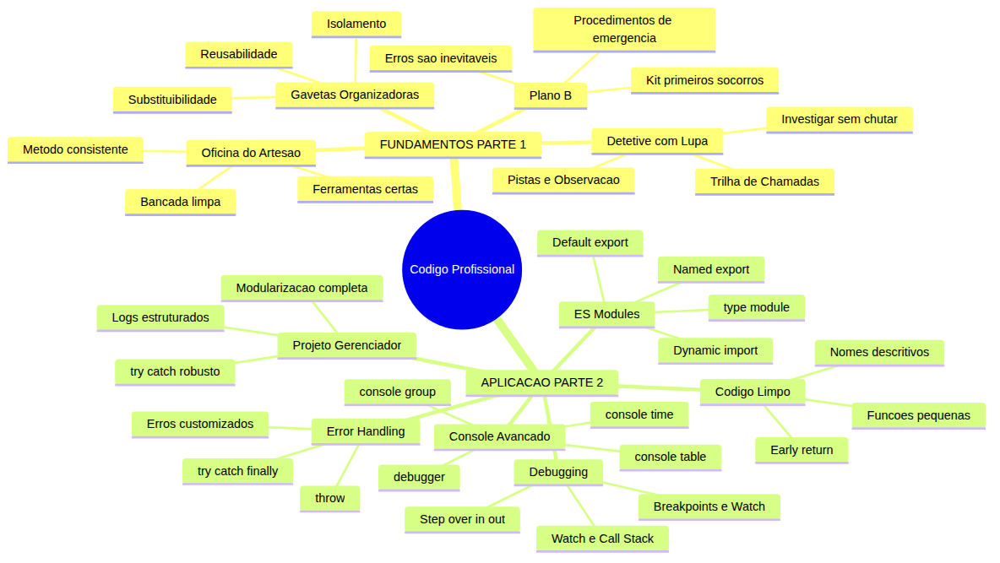
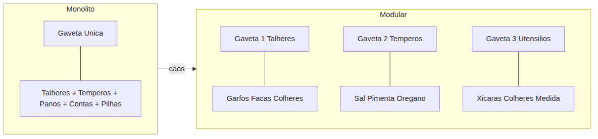
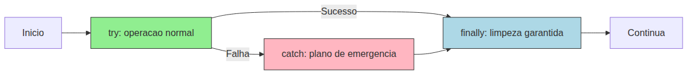
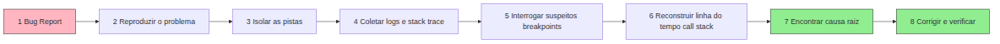
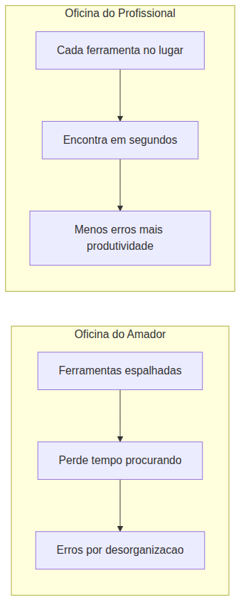
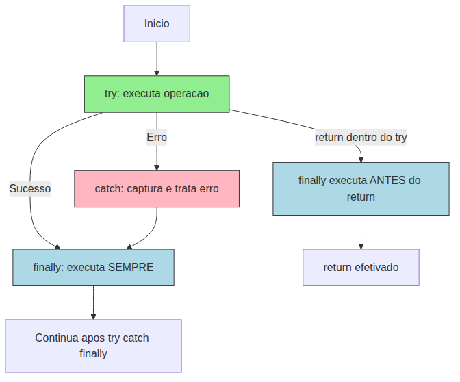
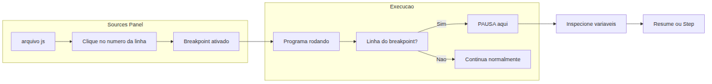
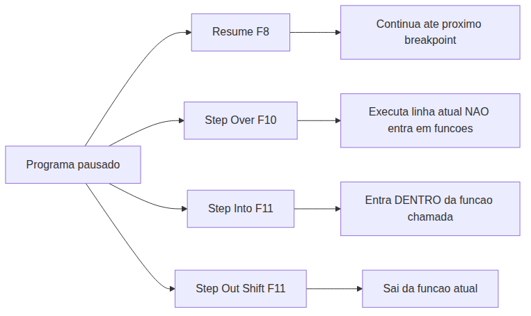
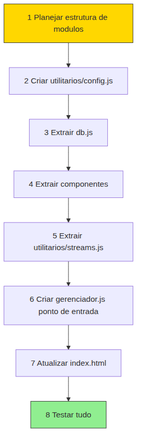

# JavaScript — Do Zero ao Profissional — Aula 30

## ES Modules + Error Handling + Debugging — Código Profissional em JavaScript

**Duração total:** 120 minutos (60 de leitura + 60 de prática)
**Nível:** Avançado → Profissional
**Pré-requisitos:** Aula 10 (Funções), Aula 11 (Escopo), Aula 12 (Objetos), Aula 14 (Arrow Functions, HOFs), Aula 16 (Classes e extends), Aula 18 (Custom Elements, DOM), Aula 19 (Eventos), Aula 23 (IndexedDB), Aula 26 (AbortController), Aula 27 (Promises, fetch, async/await, try/catch), Aula 28 (Web Workers, Service Workers), Aula 29 (Web Streams API, CompressionStream)

---

## Objetivos de Aprendizagem

Ao final desta aula, você será capaz de:

- [ ] **Explicar** por que modularizar código é essencial em projetos profissionais — usando a analogia das gavetas organizadoras — e como módulos ES resolvem o problema de dependências e namespaces
- [ ] **Diferenciar** named exports, default exports e namespace imports — e decidir qual usar em cada situação com base em critérios objetivos
- [ ] **Aplicar** `import`/`export` para organizar código em múltiplos arquivos, usando `type="module"` no HTML, e compreender que módulos ES ativam strict mode automaticamente
- [ ] **Utilizar** `import()` dinâmico para carregar código sob demanda (lazy loading), entendendo que retorna uma Promise e quando isso é útil
- [ ] **Construir** blocos `try/catch/finally` robustos, com `throw` para sinalizar erros, `catch` para capturar e tratar, e `finally` para limpeza garantida
- [ ] **Identificar** os tipos nativos de erro (SyntaxError, ReferenceError, TypeError, RangeError) e criar erros customizados com `class MeuErro extends Error`
- [ ] **Utilizar** as ferramentas de debugging do navegador — breakpoints, step over/in/out, watch expressions, call stack, scope — para inspecionar o estado do programa em execução
- [ ] **Aplicar** os métodos avançados do console — `console.table()` para dados tabulares, `console.group()`/`groupEnd()` para logs hierárquicos, `console.time()`/`timeEnd()` para medir performance, e a palavra-chave `debugger` para pausar a execução programaticamente
- [ ] **Praticar** princípios de código limpo — nomes descritivos, funções pequenas com uma responsabilidade, comentários que explicam o "porquê" (não o "o quê"), e early return
- [ ] **Modularizar** o Gerenciador de Tarefas em ES modules — separando componentes, persistência, workers e utilitários em arquivos independentes — e adicionar tratamento de erros robusto com try/catch em todas as operações assíncronas

---

## Como Usar Esta Aula

Esta aula está organizada em duas partes. A **primeira parte** (Seções 1 a 4) constrói os fundamentos de quatro pilares do código profissional usando APENAS analogias do mundo real — gavetas organizadoras, kit de primeiros socorros, detetive com lupa e oficina de artesão — sem mencionar JavaScript. A **segunda parte** (Seções 5 a 10) aplica esses conceitos na prática com ES Modules, try/catch/finally, DevTools Debugger, console avançado e código limpo.

Ao longo do caminho, você encontrará seções **Mão na Massa** (para fazer, não só ler), **Quick Check** (para verificar se entendeu antes de avançar) e **Diagramas** que ilustram visualmente cada conceito. Ao final, o arquivo separado **Questões de Aprendizagem** traz as tarefas de checkpoint — só avance para a Aula 31 quando conseguir completá-las por conta própria.

| Etapa | Atividade | Tempo |
|---|---|---|
| Parte 1 | Fundamentos — Modularização, Erros, Debugging, Disciplina (analogias) | 20 min |
| Parte 2A | ES Modules — import, export, type="module", dynamic import | 15 min |
| Parte 2B | Error Handling — try/catch/finally, throw, erros customizados | 15 min |
| Parte 2C | Debugging com DevTools — breakpoints, step, watch, call stack | 15 min |
| Parte 2D | Console Avançado — table, group, time, debugger | 10 min |
| Parte 2E | Código Limpo — nomes, funções pequenas, early return | 10 min |
| Parte 2F | Modularizando o Gerenciador de Tarefas — projeto completo | 20 min |
| Final | Quiz, Exercícios, Revisão | 15 min |

---

## Mapa Mental





> *O mapa mental acima mostra a estrutura da aula. Cada ramo representa um conceito que você vai explorar. Note como os 4 pilares da PARTE 1 se conectam diretamente com as implementações da PARTE 2.*

---

## Recapitulação das Aulas Anteriores

Você chega nesta aula depois de uma jornada de 29 aulas. O Gerenciador de Tarefas que você construiu já tem funcionalidades impressionantes. Falta uma coisa: **organização profissional**.

| Aula | Conceito | Onde aparece na Aula 30 | Como se conecta |
|---|---|---|---|
| Aula 27 | Promises, async/await, try/catch | Seção 6 — try/catch/finally com async/await; erros customizados | Você já usa try/catch. Agora vai dominar como um profissional: finally, erros customizados, tipos de erro |
| Aula 28 | Web Workers, Service Workers | Seções 5, 10 — Worker vira módulo ES; import de utilitários | O worker de exportação ganha estrutura modular e tratamento de erros |
| Aula 29 | Web Streams API, CompressionStream | Seções 6, 10 — try/catch com streams; módulo utilitarios/streams.js | Os streams que você construiu ganham tratamento de erro robusto |
| Aula 23 | IndexedDB, transações | Seções 6, 10 — ErroBancoDados; try/catch em cada operação CRUD | Toda transação IndexedDB agora com finally para fechar conexão |
| Aula 18-20 | Custom Elements, Shadow DOM | Seções 5, 10 — Componentes como módulos ES com export default | Cada componente vira um arquivo .js independente |
| Aula 16 | Classes, extends, super | Seção 6 — Erros customizados com `class ErroBanco extends Error` | O extends que você aprendeu cria hierarquias de erro |
| Aula 11 | Escopo, closure | Seção 5 — Escopo de módulo ES (variáveis não vazam) | Módulos resolvem o problema de escopo global que você viu na Aula 11 |

### Estado atual do projeto (pós-Aula 29)

Seu **Gerenciador de Tarefas** está funcional e completo, mas com uma limitação importante: **todo o código está em poucos arquivos, carregados via `<script>` em ordem manual**. Não há sistema de módulos. As variáveis vivem no escopo global. A ordem das tags `<script>` no HTML determina o que está disponível para quem.

Esta aula resolve isso. Você vai transformar seu Gerenciador em um **projeto profissional modularizado**.

---

**FUNDAMENTOS: Os 4 Pilares do Código Profissional**

> *As próximas quatro seções usam APENAS analogias do mundo real — nenhuma linha de código JavaScript. Os conceitos que você vai aprender aqui são universais: valem para programação, engenharia, gestão de projetos e vida organizacional. Na segunda parte da aula, você verá como JavaScript implementa cada um deles.*

---

## 1. Gavetas Organizadoras — O Poder da Modularização

### O que é modularização?

Modularização é o ato de dividir um sistema grande em partes menores, independentes e com responsabilidades bem definidas. É como organizar uma cozinha profissional com gavetas etiquetadas, em vez de uma cozinha de estudante com uma única gaveta onde tudo se mistura.

### A cozinha do estudante (monolito)

Imagine uma gaveta única na cozinha. Dentro dela: talheres, temperos, panos de prato, contas de luz, pilhas usadas e um carregador de celular que você achou que tinha perdido. Para achar a colher de chá, você precisa revirar TUDO. Se o pano de prato estava úmido, os talheres ficam molhados. Se o carregador vazar, contamina os temperos.

Esse é o **monólito**: tudo num lugar só. Funciona? Funciona. É eficiente? Não. É escalável? Absolutamente não. Conforme a cozinha cresce (mais utensílios, mais temperos, mais pessoas usando), o caos aumenta exponencialmente.

### A cozinha profissional (modular)

Agora imagine uma cozinha profissional:

- **Gaveta 1**: talheres — garfos, facas, colheres
- **Gaveta 2**: temperos — sal, pimenta, orégano, cominho
- **Gaveta 3**: utensílios de medição — xícaras, colheres medida
- **Armário 1**: panelas — cada uma empilhada por tamanho
- **Armário 2**: tigelas e travessas

Cada gaveta tem uma **ETIQUETA** — um nome que diz exatamente o que está dentro. Quando você precisa de orégano, vai direto na Gaveta 2. Não revira mais nada. Se a Gaveta 3 está vazia, você sabe exatamente o que repor. Se o pano de prato molhado entrar em contato com a Gaveta 1, só os talheres são afetados — os temperos estão protegidos.





> *A cozinha monolítica tem uma gaveta que acumula tudo. A cozinha modular separa por categoria — cada gaveta tem um propósito claro. A mesma lógica se aplica ao código.*

### Propriedades da modularização

A modularização tem quatro propriedades que a tornam indispensável em projetos profissionais:

**Isolamento:** O que acontece na Gaveta 1 não afeta a Gaveta 2. Se a Gaveta 3 quebrar (a alça soltar), as outras continuam funcionando. No código, isso significa que um bug no módulo de formulários não quebra o módulo de banco de dados.

**Reusabilidade:** A Gaveta de temperos serve para QUALQUER receita. Você não precisa recriar temperos para cada prato que cozinha. No código, funções utilitárias (como formatar data ou validar email) são escritas uma vez e usadas em vários lugares.

**Substituibilidade:** Se a Gaveta 2 (temperos) estragar, você troca APENAS ela — não a cozinha inteira. No código, você pode reescrever o módulo de banco de dados sem tocar no módulo de interface do usuário.

**Clareza:** Olhando as etiquetas das gavetas, você entende a estrutura da cozinha em 10 segundos. "Ah, esta cozinha tem área de preparo, área de cocção e área de limpeza." No código, os nomes dos módulos revelam a arquitetura do sistema.

### A mesa do escritório

Outra analogia: a mesa do escritório. Uma mesa coberta de pilhas de papel (monolito) vs um armário com pastas etiquetadas (modular): "Contratos", "Notas Fiscais", "Currículos", "Projetos em Andamento", "Documentos Pessoais".

Cada pasta tem seu próprio conteúdo e NÃO depende da ordem das outras pastas. Você pode levar a pasta "Projetos em Andamento" para uma reunião sem carregar o armário inteiro. Se alguém pedir "me mostra o contrato do cliente X", você vai direto na pasta "Contratos" — não revira a pilha inteira.

Modularização não é frescura. É a diferença entre um profissional que encontra o que precisa em segundos e um amador que perde horas procurando.

### Quick Check 1

**1. Classifique cada cenário como monolítico ou modular e justifique: (a) um livro de 1000 páginas sem capítulos vs com capítulos e índice remissivo, (b) uma empresa com 1 funcionário que faz tudo vs com departamentos (RH, Financeiro, Vendas), (c) um carro cujo motor, freios e direção são uma peça só vs componentes separados que podem ser trocados independentemente?**

**Resposta:**
(a) Monolítico: livro sem capítulos. Modular: livro com capítulos e índice — cada capítulo é um módulo, você vai direto ao que precisa.
(b) Monolítico: um funcionário faz tudo — gargalo total. Modular: departamentos especializados — cada um cuida do seu, substituível independentemente.
(c) Monolítico: motor+freios+direção numa peça só — se um quebrar, para tudo. Modular: componentes separados — troca só a peça defeituosa.

**2. Você está organizando uma mudança. Quais critérios usaria para agrupar objetos em caixas etiquetadas? Como isso se relaciona com modularização de código?**

**Resposta:** Agrupar por função (cozinha, quarto, banheiro), por frequência de uso (uso diário vs eventual) e por fragilidade (copos em caixa separada com proteção). Na modularização de código, o critério é similar: agrupar por responsabilidade funcional (banco de dados, interface, utilidades), por frequência de mudança (código estável vs volátil) e por risco (operações críticas com isolamento extra).

---

## 2. Plano B — Tratamento de Falhas no Mundo Real

### O erro é inevitável

Em qualquer sistema complexo, falhas são INEVITÁVEIS. O que separa o amador do profissional não é a ausência de falhas, mas a presença de um PLANO para quando elas ocorrem. O profissional não é otimista — ele é PREPARADO.

### O kit de primeiros socorros

Você não sai de casa esperando se machucar. Mas carrega um kit com band-aid, antisséptico e gaze — porque SABE que imprevistos acontecem. O kit é o seu plano B: "se algo der errado, eu sei o que fazer."

No código, o kit de primeiros socorros é o bloco `catch`: o código que executa QUANDO algo falha. Não é pessimismo — é preparação.

O `finally` (que você verá na prática na Seção 6) é o curativo que você troca depois, independentemente de o machucado ter sido grave ou não: a limpeza final que acontece SEMPRE. Machucou feio? Troca o curativo. Não machucou nada? Troca o curativo também (por higiene). A limpeza final não depende do erro.

### O voo de avião

Antes de decolar, a tripulação demonstra os procedimentos de emergência. O avião tem máscaras de oxigênio, coletes salva-vidas, saídas de emergência. A chance de precisar disso é ínfima — mas se precisar, a diferença entre ter e não ter é A VIDA.

No código:
- O `try` é o voo normal — a operação que você quer executar
- O `catch` são os procedimentos de emergência — o que fazer se algo der errado
- O `finally` é "apertem os cintos até o avião parar completamente" — executado SEMPRE, tenha emergência ou não





> *O fluxo do tratamento de falhas: o try executa a operação normal. Se falhar, o catch entra em ação para lidar com o problema. O finally executa SEMPRE, tenha havido erro ou não — é a limpeza garantida.*

### O encanamento residencial

Todo encanamento tem um registro geral (válvula de fechamento). Se um cano estoura, você fecha o registro — a casa não inunda, o problema fica contido, e você pode consertar sem pressa.

O registro geral é o `catch`: isola o problema, evita que ele se propague e destrua tudo. Sem o registro, um cano estourado inundaria a casa inteira — dano total. Com o registro, o dano fica contido.

Diferentes tipos de falha em encanamento podem ocorrer, e cada um requer um tratamento específico:

- **Cano rachado** (vazamento): a água escapa por onde não deveria. É como um **ReferenceError** — algo que deveria existir (o cano íntegro) não existe mais.
- **Conexão errada**: água quente na torneira fria. É como um **TypeError** — o tipo está errado, a incompatibilidade causa mau funcionamento.
- **Pressão excessiva**: a válvula não suporta a pressão. É como um **RangeError** — valor fora do intervalo aceitável.
- **Erro de projeto**: cano que deveria subir desce. É como um **SyntaxError** — a estrutura é inválida desde o início.

Cada tipo de falha tem uma causa, um sintoma e uma solução diferente. Saber DISTINGUIR o tipo de falha é o primeiro passo para tratá-la corretamente.

### Quick Check 2

**1. Para cada cenário, identifique o que seria o try (operação normal), o catch (plano B) e o finally (limpeza garantida): (a) enviar um documento importante pelos Correios, (b) fazer um bolo para uma festa, (c) dar uma palestra com slides?**

**Resposta:**
(a) Try: enviar o documento. Catch: se extraviar, reenviar com registro. Finally: confirmar recebimento com o destinatário.
(b) Try: assar o bolo seguindo a receita. Catch: se queimar, comprar um bolo pronto. Finally: lavar a forma e os utensílios.
(c) Try: apresentar os slides. Catch: se o projetor falhar, continuar sem slides. Finally: agradecer a plateia e recolher o material.

**2. Por que o finally é importante mesmo quando a operação deu certo?**

**Resposta:** Porque some operações precisam de LIMPEZA independentemente do resultado. Exemplos: fechar conexão com banco de dados, esconder um indicador de carregamento, liberar um arquivo bloqueado, devolver um recurso ao sistema. O finally garante que essa limpeza aconteça SEMPRE — com ou sem erro.

---

## 3. Detetive com Lupa — Investigação Sistemática de Problemas

### O método, não o chute

Encontrar a causa de um problema não é questão de sorte, intuição ou "olhar fixamente para o código até descobrir". É um MÉTODO. O detetive não adivinha o culpado — ele segue pistas sistematicamente.

### A cena do crime

Digamos que o Gerenciador de Tarefas tenha um bug: "Quando clico em Salvar, a tarefa não aparece na lista. Mas não aparece nenhum erro no console."

O bug report é a **cena do crime**. Um detetive amador chega e sai cutucando tudo: "Será que é o CSS? Será que é o formato da data? Será que o JavaScript quebrou?" Isso não é investigação — é chute.





> *O processo de investigação: do bug report à correção, cada passo segue o anterior. Pular etapas = chute. Seguir o método = diagnóstico preciso.*

### Passo a passo da investigação

**1. Isolar a cena (reproduzir o bug):** O detetive cerca a área do crime. Você precisa isolar os passos EXATOS que causam o erro. "Acontece só com tarefas que têm deadline? Só no Firefox? Só depois de importar um JSON? Só com a terceira tarefa da lista?" Quanto mais específico, melhor.

**2. Coletar pistas (logs e stack trace):** O detetive coleta digitais, fibras, testemunhas. Você coleta:
- Mensagens de erro (o que o programa disse ao quebrar)
- Stack trace (a trilha de "quem chamou quem" — essencial para entender a sequência)
- Valores de variáveis no momento do erro

**3. Interrogar suspeitos (breakpoints):** O detetive interroga cada pessoa presente na cena do crime. Você PAUSA o programa em pontos estratégicos (breakpoints) e pergunta: "O que você estava fazendo? Que valor você tinha?" Um breakpoint é como congelar o tempo e examinar o estado do programa naquele instante exato.

**4. Reconstruir a linha do tempo (call stack):** O detetive reconstrói a cronologia: "A vítima saiu de casa às 20h, passou na padaria, foi abordada na esquina." Você segue a CALL STACK: a trilha de chamadas de função que levou até o erro. `salvarTarefa()` chamou `abrirBanco()`, que chamou `indexedDB.open()`, que falhou. Cada função na pilha é um evento na cronologia.

**5. Encontrar o culpado (root cause):** O culpado NÃO é o último evento da corrente — é a causa ORIGINAL. "O programa quebrou porque a tarefa tinha deadline vazio e a validação não tratava esse caso" — não "quebrou no click". O click foi só o gatilho. A causa raiz é a validação ausente.

### Ferramentas do detetive

Cada ferramenta de investigação tem uma função específica:

- **Lupa (breakpoints):** Parar o tempo e examinar o estado congelado. O programa pausa, e você pode ver cada variável.
- **Seguir pistas (step over/in/out):** Avançar a execução PASSO A PASSO — linha por linha, vendo cada variável mudar. É como assistir ao crime em câmera lenta.
- **Caderno de anotações (watch expressions):** Manter variáveis específicas sob observação CONTÍNUA. "Estou de olho em você, `tarefa.texto.length`."
- **Mapa da cena (scope):** Ver TODAS as variáveis disponíveis naquele momento — as locais (dentro da função), as do closure (escopo pai), as globais.

O detetive não adivinha. Ele segue o método. Você também não vai adivinhar bugs — vai INVESTIGÁ-LOS.

### Quick Check 3

**1. Dado o bug "o Gerenciador mostra 'Erro ao salvar' quando adiciono uma tarefa com texto muito longo", descreva o processo de investigação: (a) como isolar o problema, (b) que pistas coletar, (c) onde colocar breakpoints, (d) que variáveis observar?**

**Resposta:**
(a) Isolar: testar com textos de tamanhos diferentes (100, 500, 1000, 5000 caracteres) para achar o limite. Verificar se o problema acontece em todos os navegadores ou só em um.
(b) Pistas: a mensagem de erro completa ("Erro ao salvar: ..."), o stack trace (mostra onde o erro foi lançado), o valor exato do texto que causou o erro.
(c) Breakpoints: no início da função `salvarTarefa()`, na validação de tamanho, na chamada do IndexedDB `put()`.
(d) Variáveis: `tarefa.texto.length`, `tarefa.texto`, a configuração de limite do banco (se houver), o objeto de erro capturado.

**2. Qual a diferença entre encontrar a "causa imediata" e a "causa raiz" de um bug? Dê um exemplo.**

**Resposta:** Causa imediata é o evento que disparou o erro. Causa raiz é a condição subjacente que permitiu o erro existir. Exemplo: a causa imediata é "o IndexedDB rejeitou a transação". A causa raiz é "a função de validação não verificava o tamanho do texto antes de salvar". Corrigir a causa imediata (capturar o erro) é tratamento. Corrigir a causa raiz (adicionar validação) é PREVENÇÃO.

---

## 4. A Oficina do Artesão — Organização, Ferramentas e Disciplina

### O sistema do profissional

O artesão profissional não tem apenas habilidade técnica — ele tem um SISTEMA de trabalho: ferramentas organizadas, bancada limpa, métodos consistentes. Isso não é frescura — é produtividade e prevenção de erros.

### A oficina de marcenaria

Imagine a bancada de dois marceneiros:

- O **amador** tem ferramentas espalhadas, formões cegos misturados com lixas, bancada coberta de serragem, e nunca lembra onde guardou o esquadro. Ele passa 30% do tempo procurando ferramentas e 30% desfazendo erros que poderia ter evitado com organização.

- O **profissional** tem um painel de ferramentas onde cada item tem seu lugar. Formões à esquerda (ordenados por tamanho), lixas à direita (por granulação), instrumentos de medição no centro. A bancada é limpa ao final de cada dia. Ele não perde tempo procurando — cada ferramenta está onde deveria estar.





> *A diferença entre o amador e o profissional não está apenas na habilidade técnica — está no sistema de trabalho. A organização não é burocracia, é produtividade.*

As ferramentas do artesão no código:

- O **paquímetro digital** é o seu instrumento de medição — mostra dados organizados em formato tabular, exibindo as medidas com clareza.
- O **painel de ferramentas** agrupa por tipo — cada grupo de itens relacionados fica junto, expansível ou colapsável.
- O **cronômetro** da bancada mede quanto tempo cada operação leva, permitindo identificar gargalos.

### O chef de cozinha e o mise en place

Outra analogia poderosa: o **mise en place** (termo francês que significa "colocar em ordem"). Antes de cozinhar, o chef separa e prepara TODOS os ingredientes. Cebola picada, alho descascado, temperos medidos, panelas prontas.

O mise en place é o código modularizado: cada ingrediente (módulo) está pronto para ser usado quando necessário. O chef não começa a picar cebola enquanto o molho já está no fogo — tudo está preparado ANTES.

O **cronômetro** do chef é o timer de cozinha: "O molho precisa de 12 minutos em fogo baixo." Você mede o tempo de cada operação crítica para saber se está dentro do esperado.

O **cartão de receita** agrupa: cada prato tem sua ficha técnica agrupada — ingredientes, tempo, modo de preparo. No código, todas as mensagens de uma operação (como "salvar tarefa") aparecem agrupadas, não espalhadas aleatoriamente.

### Disciplina, não talento

O que separa o profissional do amador não é talento — é DISCIPLINA. O hábito de organizar, documentar e verificar. A disposição de gastar 5 minutos agora para economizar 50 minutos depois.

Você pode ter a melhor ferramenta do mundo — se ela estiver jogada no meio da bagunça, não adianta nada. Da mesma forma, você pode ter o melhor código do mundo — se estiver tudo num arquivo só, sem nomes claros, sem tratamento de erros, sem logs úteis — ele é inútil para qualquer outro ser humano (incluindo você daqui a 3 meses).

### Quick Check 4

**1. Associe cada ferramenta do artesão e explique POR QUE usar: (a) paquímetro digital para exibir tarefas, (b) painel de ferramentas para logs de uma operação, (c) cronômetro para medir o carregamento de dados?**

**Resposta:**
(a) Paquímetro digital: mostra dados organizados em formato tabular. Por que usar? Um array de tarefas com 50 itens fica ilegível quando cada objeto aparece em uma linha. Em formato tabular, você vê colunas e linhas — localiza qualquer valor em segundos.
(b) Painel de ferramentas: mantém logs relacionados juntos. Por que usar? Uma operação envolve várias etapas (iniciar requisição, receber headers, processar body, tratar resposta). Sem agrupamento, essas mensagens se misturam com outros logs. Agrupando, você expande só o bloco que interessa.
(c) Cronômetro: mede duração exata. Por que usar? "Está lento" não é diagnóstico. O cronômetro revela: "o carregamento levou 2341ms — 90% disso foi na leitura das anotações comprimidas." Agora você sabe ONDE otimizar.

**2. O que é mise en place e como ele se relaciona com código modularizado?**

**Resposta:** Mise en place é preparar e organizar todos os ingredientes e ferramentas ANTES de começar a cozinhar. No código, é o mesmo: módulos utilitários (config.js, db.js, streams.js) prontos antes do ponto de entrada (gerenciador.js) precisar deles. O código não para no meio para "picar cebola" (criar uma função que deveria existir). Tudo está preparado — o código flui como uma receita bem ensaiada.

---

**APLICAÇÃO: ES Modules, Error Handling, Debugging e Código Limpo em JavaScript**

> *Agora que você entende os 4 pilares — modularização (gavetas), tratamento de falhas (plano B), investigação (detetive) e disciplina (oficina do artesão) — vamos implementá-los com JavaScript. As gavetas viram arquivos `.js` com `export`/`import`. O kit de primeiros socorros vira `try/catch/finally`. A lupa do detetive vira o DevTools Debugger. E a bancada organizada vira `console.table`, `console.group`, `console.time` e código limpo.*

---

## 5. ES Modules — Organizando Código com import/export

### O que são ES Modules?

ES Modules são o sistema nativo de módulos do JavaScript no navegador. Cada arquivo `.js` é um módulo com seu próprio escopo — variáveis não vazam para outros módulos a menos que explicitamente exportadas. O `export` é a ETIQUETA na gaveta. O `import` é ABRIR a gaveta certa.

Lembra da cozinha profissional com gavetas etiquetadas? Cada gaveta é um módulo. A etiqueta é o `export`. E quando você precisa de orégano (uma função de formatação de data), você vai na Gaveta 2 (o módulo `utilitarios/data.js`) com `import`.

> **⚠️ Módulos ES exigem servidor HTTP.** Diferente de scripts normais, módulos ES NÃO funcionam com `file://` (abrir o HTML direto no navegador). Você PRECISA de um servidor local: `npx serve .` no terminal, ou a extensão Live Server no seu editor. Sem servidor, o navegador bloqueia os imports por CORS. Teste sempre com HTTP.

### Configurando o HTML: `type="module"`

Para usar módulos ES no navegador, você adiciona `type="module"` na tag `<script>`:

```html
<!-- index.html -->
<script type="module" src="gerenciador.js"></script>
```

**Apenas UMA tag script.** Não precisa mais de várias tags `<script>` em ordem específica. O navegador carrega os módulos automaticamente resolvendo os imports em cascata. É como ter uma única porta de entrada para a cozinha — dentro dela, você acessa cada gaveta conforme necessário.

O que muda com `type="module"`:
- **Escopo isolado**: variáveis declaradas no módulo NÃO vazam para o escopo global. Adeus, variáveis globais acidentais.
- **Strict mode automático**: dentro de módulos, `"use strict"` é implícito. Variáveis não declaradas geram erro. `this` no top-level é `undefined` (não `window`).
- **Defer automático**: o módulo só executa depois que o HTML é completamente parseado — como se tivesse `defer` embutido.
- **Execução única**: cada módulo é executado UMA ÚNICA VEZ, mesmo se importado por vários módulos. O resultado é compartilhado.

### Named exports

Named exports permitem exportar MÚLTIPLOS valores de um módulo. É como uma gaveta com vários itens — cada item tem seu nome.

```javascript
// utilitarios/config.js — named exports
export const NOME_APP = 'Gerenciador de Tarefas';
export const VERSAO = '2.0';
export const LIMITE_TAREFAS = 500;

export function formatarData(data) {
  return data.toLocaleDateString('pt-BR');
}

export function validarEmail(email) {
  return email.includes('@') && email.includes('.');
}
```

Para importar named exports, use CHAVES `{}` com os nomes EXATOS:

```javascript
// gerenciador.js — importando named exports
import { NOME_APP, VERSAO, formatarData } from './utilitarios/config.js';

console.log(`${NOME_APP} v${VERSAO}`);
console.log(formatarData(new Date())); // "30/06/2026"
```

**Regra de ouro:** Se o módulo oferece VÁRIAS funcionalidades relacionadas (várias funções utilitárias, várias constantes, várias operações), use named exports.

### Default export

O default export é usado para "a COISA PRINCIPAL que este módulo oferece". APENAS UM default export por módulo. É como uma gaveta que tem UM item principal — o destaque.

Componentes (Custom Elements) são candidatos perfeitos para default export:

```javascript
// componentes/tarefa.js — default export
export default class TarefaComponent extends HTMLElement {
  constructor() {
    super();
    this.attachShadow({ mode: 'open' });
  }

  connectedCallback() {
    this.render();
  }

  render() {
    this.shadowRoot.innerHTML = `
      <style>
        li { display: flex; align-items: center; gap: 8px; padding: 8px; }
        .concluida { text-decoration: line-through; opacity: 0.6; }
      </style>
      <li class="${this.getAttribute('concluida') === 'true' ? 'concluida' : ''}">
        <input type="checkbox" ${this.getAttribute('concluida') === 'true' ? 'checked' : ''}>
        <span>${this.textContent}</span>
        <button class="remover">✕</button>
      </li>
    `;
  }
}
```

Para importar um default export, NÃO use chaves — e você pode dar QUALQUER nome:

```javascript
// gerenciador.js — importando default export
import TarefaComponent from './componentes/tarefa.js';
// Você poderia chamar de: import ComponenteTarefa from './componentes/tarefa.js'
// ou import MinhaCoisa from './componentes/tarefa.js'
// o nome é livre!

customElements.define('e-tarefa', TarefaComponent);
```

### Import combinado: default + named

Você pode importar o default E named exports no mesmo import:

```javascript
import TarefaComponent, { prioridades, formatarData } from './componentes/tarefa.js';
```

### Namespace import: import *

Quando você quer importar TUDO que um módulo exporta como um único objeto:

```javascript
import * as Config from './utilitarios/config.js';

console.log(Config.NOME_APP);   // "Gerenciador de Tarefas"
console.log(Config.VERSAO);     // "2.0"
Config.formatarData(new Date()); // OK
```

Útil para:
- Agrupar utilitários sob um namespace claro (`Config.formatarData` em vez de `formatarData` solto)
- Importar módulos com muitos exports sem poluir o escopo local
- Módulos de terceiros (bibliotecas)

### Dynamic import()

Até agora, todos os imports foram **estáticos** — resolvidos na carga do módulo. Mas e se você quiser carregar um módulo apenas QUANDO necessário, não antes?

`import()` é uma função especial (parece uma função, mas é uma construção da linguagem) que carrega um módulo sob demanda e retorna uma Promise:

```javascript
// Carregar o módulo de exportação APENAS quando o usuário clicar em "Exportar"
botaoExportar.addEventListener('click', async () => {
  try {
    const moduloExport = await import('./workers/export-worker.js');
    moduloExport.iniciarExportacao();
  } catch (erro) {
    console.error('Falha ao carregar módulo de exportação:', erro);
  }
});
```

**Quando usar dynamic import:**
- Funcionalidades que o usuário raramente acessa (exportar dados, configurações avançadas)
- Módulos pesados (bibliotecas de gráficos, processamento de imagem)
- Código específico de um navegador (polyfills condicionais)

O dynamic import retorna um objeto com TODOS os exports do módulo (como um namespace import). Se o módulo tem um default export, ele estará em `modulo.default`.

### A extensão `.js` é obrigatória

No navegador, ao contrário do Node.js, você DEVE incluir a extensão `.js` nos imports:

```javascript
// ✅ Correto (navegador)
import { formatarData } from './utilitarios/config.js';
import Tarefa from './componentes/tarefa.js';

// ❌ Incorreto (navegador) — erro de carregamento
import { formatarData } from './utilitarios/config';
import Tarefa from './componentes/tarefa';
```

O navegador não faz "resolução de módulos" como o Node.js — ele carrega o arquivo exato que você especificou. Sem a extensão, ele não sabe que tipo de arquivo buscar.

### Strict mode automático em módulos

Dentro de módulos ES, o strict mode é automático. Isso significa:

- Variáveis não declaradas geram `ReferenceError` (não viram globais)
- `this` no escopo global do módulo é `undefined` (não `window`)
- Não é possível deletar propriedades não configuráveis
- Parâmetros duplicados em funções são proibidos

```javascript
// Dentro de um módulo ES, isto NÃO funciona:
naoDeclarada = 42;        // ❌ ReferenceError: naoDeclarada is not defined
delete Array.prototype;    // ❌ TypeError
```

Isso é BOM. O strict mode pega erros silenciosos que seriam fáceis de ignorar e os transforma em erros EXPLÍCITOS. Você descobre o bug na hora, não 3 meses depois.

### Mão na Massa 1 — Criar dois módulos e importá-los

**Dificuldade: Fácil | Duração: 10 minutos**

Vamos criar sua primeira estrutura modular.

**Passo 1:** Crie `config.js` com named exports:

```javascript
// config.js
export const NOME_APP = 'Gerenciador';
export const VERSAO = '2.0';
export const AUTOR = 'Seu Nome';
```

**Passo 2:** Crie `tarefa.js` com default export:

```javascript
// tarefa.js
export default class Tarefa {
  constructor(texto) {
    this.texto = texto;
    this.id = Date.now();
    this.concluida = false;
    this.dataCriacao = new Date().toISOString();
  }

  alternarStatus() {
    this.concluida = !this.concluida;
  }
}
```

**Passo 3:** Crie `app.js` que importa ambos:

```javascript
// app.js
import Tarefa from './tarefa.js';
import { NOME_APP, VERSAO, AUTOR } from './config.js';

console.log(`${NOME_APP} v${VERSAO} — ${AUTOR}`);

const minhaTarefa = new Tarefa('Estudar ES Modules');
console.log('Tarefa criada:', minhaTarefa);

minhaTarefa.alternarStatus();
console.log('Tarefa após alternar:', minhaTarefa);
```

**Passo 4:** Crie `index.html` com uma ÚNICA tag script:

```html
<!DOCTYPE html>
<html lang="pt-BR">
<head>
  <meta charset="UTF-8">
  <title>Módulos ES — Teste</title>
</head>
<body>
  <h1>Módulos ES 🚀</h1>
  <p>Abra o console (F12) para ver o resultado.</p>

  <script type="module" src="app.js"></script>
</body>
</html>
```

**Passo 5:** Inicie o servidor local e teste:

```bash
npx serve .
# ou: npx live-server .
```

Abra o navegador em `http://localhost:3000`. Abra o console (F12). Você deve ver:

```
Gerenciador v2.0 — Seu Nome
Tarefa criada: Tarefa {texto: 'Estudar ES Modules', id: 1234567890, concluida: false, dataCriacao: '...'}
Tarefa após alternar: Tarefa {texto: 'Estudar ES Modules', id: 1234567890, concluida: true, dataCriacao: '...'}
```

**Verificação:** (1) O console mostra as mensagens esperadas? (2) Não há erros no console (nem de CORS, nem de módulo não encontrado)? (3) Se você tentar acessar `Tarefa` ou `NOME_APP` diretamente no console do navegador, elas NÃO estão disponíveis (escopo de módulo)?

### Quick Check 5

**1. Você tem um módulo `componentes/botao.js` que exporta uma classe `Botao` (o principal do módulo) e também uma função auxiliar `criarIcone()`. Como organizar os exports? Qual usar como default, qual como named?**

**Resposta:** `Botao` como default export (é a coisa principal do módulo) e `criarIcone` como named export (é auxiliar). No módulo: `export default class Botao { ... }` e `export function criarIcone() { ... }`. O import seria: `import Botao, { criarIcone } from './componentes/botao.js';`.

**2. Por que módulos ES exigem servidor HTTP e não funcionam com file://?**

**Resposta:** Por segurança do navegador. A política de same-origin (CORS) bloqueia requisições a arquivos locais via `file://`. Módulos ES usam requisições HTTP para carregar arquivos dependentes, e o navegador só permite isso em páginas servidas por HTTP. Com `file://`, o navegador não consegue determinar a "origem" do arquivo para aplicar as regras de segurança. É uma proteção contra scripts maliciosos que tentariam ler arquivos do seu sistema.

---

## 6. Tratamento de Erros — try/catch/finally e Além

### O que é try/catch/finally?

`try/catch/finally` é a estrutura fundamental para capturar e tratar erros em JavaScript. Ela permite que você:

- TENTE executar uma operação que pode falhar (try)
- CAPTURE o erro se ele ocorrer e decida o que fazer (catch)
- EXECUTE limpeza SEMPRE, com ou sem erro (finally)

Lembra do kit de primeiros socorros da Seção 2? O try é você usando a faca. O catch é o band-aid quando você se corta. O finally é lavar a faca depois — aconteça o que acontecer.

### Sintaxe básica

```javascript
try {
  // Código que PODE lançar um erro
  const resultado = operacaoRiscosa();
  console.log('Operação bem-sucedida:', resultado);
} catch (erro) {
  // Código que executa SE um erro for lançado no try
  console.error('Ops, algo deu errado:', erro.message);
} finally {
  // Código que executa SEMPRE — com erro ou sem erro
  console.log('Limpeza garantida!');
}
```

**Fluxo de execução:**

1. O código no `try` executa linha a linha
2. Se NENHUM erro ocorrer: o `catch` é PULADO, o `finally` executa
3. Se UM erro ocorrer: a execução do `try` é INTERROMPIDA imediatamente, o `catch` captura o erro, o `finally` executa
4. Se houver `return` no `try` ou `catch`: o `finally` executa ANTES do return ser efetivado





> *Fluxo completo do try/catch/finally. Note que o finally SEMPRE executa — mesmo com return, mesmo com erro. É a limpeza garantida, incondicional.*

### O poder do finally: execução garantida

O `finally` é o herói silencioso do tratamento de erros. Ele executa MESMO que:

```javascript
function buscarTarefas() {
  mostrarSpinner(); // Exibe indicador de carregamento

  try {
    const tarefas = await carregarDoBanco();
    return tarefas;
  } catch (erro) {
    console.error('Erro ao carregar tarefas:', erro);
    return []; // Retorna lista vazia como fallback
  } finally {
    esconderSpinner(); // ⚠️ EXECUTA mesmo com o return acima!
  }
}
```

Sem `finally`, você teria que chamar `esconderSpinner()` dentro do `try` E dentro do `catch` — duplicação de código e risco de esquecer um dos caminhos.

**Casos de uso clássicos do finally:**
- Fechar conexão de banco de dados
- Esconder spinner/loader da UI
- Liberar um recurso bloqueado (lock, stream, arquivo)
- Fechar um popup/modal de carregamento
- Parar um timer ou intervalo

### throw: lançando erros manualmente

Às vezes você precisa criar um erro — não esperar que ele aconteça. O `throw` permite LANÇAR um erro ativamente:

```javascript
function validarTarefa(tarefa) {
  if (!tarefa.texto || tarefa.texto.trim() === '') {
    throw new Error('O texto da tarefa não pode estar vazio.');
  }
  if (tarefa.texto.length > 500) {
    throw new Error('O texto da tarefa excede o limite de 500 caracteres.');
  }
  return true;
}

// Uso:
try {
  validarTarefa({ texto: '' });
} catch (erro) {
  console.error('Validação falhou:', erro.message);
  // "Validação falhou: O texto da tarefa não pode estar vazio."
}
```

Você pode `throw` qualquer valor — strings, números, objetos:

```javascript
throw 'Erro qualquer';     // Funciona, mas NÃO faça isso
throw 42;                  // Funciona, mas NÃO faça isso
throw new Error('Msg');    // ✅ FAÇA ISSO — sempre use objetos Error
```

**Por que usar `new Error()` em vez de uma string?**

Objetos `Error` têm propriedades IMPORTANTES que strings não têm:
- `.message`: a descrição do erro
- `.name`: o tipo de erro ("Error", "TypeError", etc.)
- `.stack`: o stack trace — a trilha de chamadas que levou ao erro (ESSENCIAL para debugging)

```javascript
// Com string:
throw 'Falhou';
// catch(erro) { console.log(erro.stack) } → undefined

// Com Error:
throw new Error('Falhou');
// catch(erro) { console.log(erro.stack) } → "Error: Falhou\n at funcao (arquivo.js:10:5)..."
```

### Tipos nativos de erro

JavaScript tem vários tipos nativos de erro. Cada um sinaliza um PROBLEMA DIFERENTE:

**SyntaxError:** Erro de SINTAXE — o código é malformado e o parser nem consegue executar. É como um erro de projeto no encanamento: a estrutura é inválida desde o início.

```javascript
// SyntaxError: Unexpected identifier
const nome = 'João  // ⚡ Falta fechar aspas
```

SyntaxError é o ÚNICO que você NÃO CONSEGUE capturar com try/catch porque o código nem chega a executar. É um erro de digitação.

**ReferenceError:** Uma variável que não existe está sendo acessada. É como uma gaveta que você pensou que existia — mas não existe.

```javascript
try {
  console.log(tarefaInexistente); // Essa variável não foi declarada!
} catch (erro) {
  console.log(erro.name);    // "ReferenceError"
  console.log(erro.message); // "tarefaInexistente is not defined"
}
```

**TypeError:** Operação incompatível com o tipo do valor. É como tentar usar água (líquido) para martelar um prego — incompatível.

```javascript
try {
  const texto = null;
  console.log(texto.toUpperCase()); // null não tem método toUpperCase!
} catch (erro) {
  console.log(erro.name);    // "TypeError"
  console.log(erro.message); // "Cannot read properties of null (reading 'toUpperCase')"
}
```

Outro exemplo clássico:

```javascript
try {
  const numero = 42;
  numero.map(x => x * 2); // Números não têm método map!
} catch (erro) {
  console.log(erro.name);    // "TypeError"
  console.log(erro.message); // "numero.map is not a function"
}
```

**RangeError:** Valor NUMÉRICO fora do intervalo aceitável.

```javascript
try {
  const array = new Array(-1);    // Não existe array de tamanho negativo!
} catch (erro) {
  console.log(erro.name);    // "RangeError"
  console.log(erro.message); // "Invalid array length"
}

try {
  (123.456).toFixed(500); // Precisa ser entre 0 e 100
} catch (erro) {
  console.log(erro.name);    // "RangeError"
  console.log(erro.message); // "toFixed() digits argument must be between 0 and 100"
}
```

### Erros customizados: o padrão profissional

O que separa o tratamento de erros amador do profissional? **Erros customizados.**

Em vez de lançar `new Error('Erro no banco de dados')` e ter que adivinhar o tipo do erro pelo texto, você cria CLASSES de erro específicas:

```javascript
class ErroBancoDados extends Error {
  constructor(mensagem) {
    super(mensagem);
    this.name = 'ErroBancoDados';
  }
}

class ErroRede extends Error {
  constructor(mensagem, statusCode) {
    super(mensagem);
    this.name = 'ErroRede';
    this.statusCode = statusCode; // Informação extra específica
  }
}

class ErroValidacao extends Error {
  constructor(mensagem, campo) {
    super(mensagem);
    this.name = 'ErroValidacao';
    this.campo = campo; // Qual campo falhou na validação
  }
}
```

Agora, no `catch`, você pode tomar decisões diferentes para cada tipo de erro:

```javascript
async function salvarTarefa(tarefa) {
  try {
    // 1. Validar
    if (!tarefa.texto) {
      throw new ErroValidacao('Texto da tarefa é obrigatório', 'texto');
    }

    // 2. Abrir banco
    const db = await abrirBanco();

    // 3. Salvar
    const tx = db.transaction('tarefas', 'readwrite');
    const store = tx.objectStore('tarefas');
    await store.put(tarefa);

  } catch (erro) {
    if (erro instanceof ErroValidacao) {
      // Erro do USUÁRIO — mostrar mensagem amigável
      mostrarErroNoFormulario(erro.campo, erro.message);
    } else if (erro instanceof ErroBancoDados) {
      // Erro de INFRAESTRUTURA — log detalhado + fallback
      console.error('🔥 Banco de dados falhou:', erro);
      notificarUsuario('Erro ao salvar. Tente novamente.');
    } else if (erro instanceof ErroRede) {
      // Erro de REDE — tentar novamente
      console.warn('🌐 Rede falhou, tentando novamente em 3s...', erro);
      await aguardar(3000);
      return salvarTarefa(tarefa); // Retry
    } else {
      // Erro DESCONHECIDO — log completo e mensagem genérica
      console.error('🔥 Erro inesperado:', erro);
      notificarUsuario('Ocorreu um erro inesperado. Recarregue a página.');
    }
  } finally {
    esconderSpinner();
    liberarRecursos();
  }
}
```

**Por que isso é profissional?**

1. **Decisão baseada em tipo, não em texto**: `if (erro instanceof ErroValidacao)` em vez de `if (erro.message.includes('validation'))`. O primeiro é robusto, o segundo quebra se a mensagem mudar.
2. **Informação extra**: `ErroRede` carrega `statusCode`, `ErroValidacao` carrega `campo`. O tratamento tem contexto para agir.
3. **Código legível**: olhando os `if/else`, você entende quais erros o sistema trata e como.

### try/catch com async/await

Com funções assíncronas, o `try/catch` captura tanto erros síncronos quanto Promises rejeitadas:

```javascript
async function carregarDados() {
  try {
    const resposta = await fetch('https://api.exemplo.com/tarefas');

    if (!resposta.ok) {
      throw new ErroRede(
        `Servidor respondeu com status ${resposta.status}`,
        resposta.status
      );
    }

    const dados = await resposta.json();
    return dados;

  } catch (erro) {
    if (erro instanceof ErroRede) {
      console.error(`🌐 Erro HTTP ${erro.statusCode}:`, erro.message);
      // Tentar fallback (cache local, dados offline)
      return carregarDoCache();
    } else if (erro instanceof TypeError) {
      // Erro de parsing JSON ou rede
      console.error('📦 Dados inválidos recebidos:', erro);
      return [];
    } else {
      // Erro inesperado
      console.error('🔥 Erro ao carregar dados:', erro);
      throw erro; // Re-lança para quem chamou tratar
    }
  }
}
```

### Boas práticas de tratamento de erros

**1. NUNCA engula erros silenciosamente:**

```javascript
// ❌ PROIBIDO
try {
  operacaoRiscosa();
} catch (erro) {
  // Vazio! O erro sumiu e ninguém sabe.
}

// ✅ MÍNIMO ACEITÁVEL
try {
  operacaoRiscosa();
} catch (erro) {
  console.error('Erro capturado:', erro);
  notificarUsuario('Algo deu errado. Tente novamente.');
}
```

**2. Capture erros específicos, não genéricos:**

```javascript
// ❌ Genérico demais
try {
  await salvarNoBanco();
} catch (erro) {
  console.error('Deu ruim');
}

// ✅ Específico com tratamento adequado
try {
  await salvarNoBanco();
} catch (erro) {
  if (erro instanceof ErroBancoDados) {
    // Tratamento específico para erro de banco
  } else if (erro instanceof TypeError) {
    // Tratamento específico para erro de tipo
  } else {
    // Tratamento genérico para erros desconhecidos
  }
}
```

**3. Mensagens de erro em português claro para o USUÁRIO, log detalhado para o DEV:**

```javascript
catch (erro) {
  // Para o usuário (interface):
  mostrarErro('Não foi possível salvar a tarefa. Verifique sua conexão.');

  // Para o desenvolvedor (console):
  console.error('Erro ao salvar tarefa:', {
    idTarefa: tarefa?.id,
    mensagem: erro.message,
    stack: erro.stack,
    tipo: erro.name
  });
}
```

**4. finally para limpeza, catch para tratamento:**

```javascript
async function exportarTarefas() {
  mostrarProgresso(); // Inicia UI de progresso

  try {
    const dados = await coletarTarefas();
    const comprimido = await comprimirDados(dados);
    await salvarArquivo(comprimido);
  } catch (erro) {
    console.error('Exportação falhou:', erro);
    notificarUsuario('Erro ao exportar tarefas.');
  } finally {
    esconderProgresso(); // ✅ SEMPRE executa
    liberarStreams();     // ✅ SEMPRE executa
  }
}
```

### Mão na Massa 2 — try/catch/finally com IndexedDB e erros customizados

**Dificuldade: Médio | Duração: 15 minutos**

Vamos criar um módulo `db.js` com operações IndexedDB usando erros customizados e try/catch/finally.

**Passo 1:** Crie a classe de erro customizado:

```javascript
// db.js
class ErroBancoDados extends Error {
  constructor(mensagem, operacao) {
    super(mensagem);
    this.name = 'ErroBancoDados';
    this.operacao = operacao; // 'abrir', 'salvar', 'carregar', 'remover'
  }
}
```

**Passo 2:** Crie a função `abrirBanco` com try/catch:

```javascript
const NOME_BANCO = 'gerenciador-tarefas';
const VERSAO_BANCO = 1;

async function abrirBanco() {
  return new Promise((resolve, reject) => {
    const request = indexedDB.open(NOME_BANCO, VERSAO_BANCO);

    request.onupgradeneeded = (evento) => {
      const db = evento.target.result;
      if (!db.objectStoreNames.contains('tarefas')) {
        db.createObjectStore('tarefas', { keyPath: 'id' });
      }
    };

    request.onsuccess = (evento) => {
      resolve(evento.target.result);
    };

    request.onerror = (evento) => {
      reject(new ErroBancoDados(
        `Falha ao abrir banco: ${evento.target.error.message}`,
        'abrir'
      ));
    };
  });
}
```

**Passo 3:** Crie as funções CRUD com try/catch/finally:

```javascript
async function salvarTarefa(tarefa) {
  let db;
  try {
    db = await abrirBanco();
    const tx = db.transaction('tarefas', 'readwrite');
    const store = tx.objectStore('tarefas');
    await store.put(tarefa);

    console.log(`✅ Tarefa ${tarefa.id} salva com sucesso.`);
  } catch (erro) {
    if (erro instanceof ErroBancoDados) {
      console.error(`🔥 Erro de banco ao salvar tarefa ${tarefa.id}:`, erro.message);
    } else {
      console.error(`🔥 Erro inesperado ao salvar tarefa:`, erro);
    }
    throw erro; // Re-lança para quem chamou tratar
  } finally {
    if (db) {
      db.close();
      console.log('🔒 Conexão com banco fechada.');
    }
  }
}

async function carregarTarefas() {
  let db;
  try {
    db = await abrirBanco();
    const tx = db.transaction('tarefas', 'readonly');
    const store = tx.objectStore('tarefas');
    const request = store.getAll();

    return new Promise((resolve, reject) => {
      request.onsuccess = () => resolve(request.result || []);
      request.onerror = () => reject(
        new ErroBancoDados('Falha ao carregar tarefas', 'carregar')
      );
    });
  } catch (erro) {
    console.error('🔥 Erro ao carregar tarefas:', erro);
    return []; // Fallback: lista vazia
  } finally {
    if (db) db.close();
  }
}
```

**Passo 4:** Teste forçando erros:

```javascript
// Teste 1: Tarefa inválida (sem id)
try {
  await salvarTarefa({ texto: 'Tarefa sem ID' });
} catch (erro) {
  console.error('Capturado:', erro.name, erro.message);
}

// Teste 2: Simular erro de banco fechado
try {
  // Abrir e fechar o banco imediatamente
  const db = await abrirBanco();
  db.close();
  // Tentar operação no banco fechado
  await salvarTarefa({ id: 1, texto: 'Teste' });
} catch (erro) {
  console.error('Capturado:', erro.name, erro.message);
}
```

**Verificação:** (1) Erros customizados aparecem com `erro.name` correto? (2) O finally fecha a conexão mesmo quando ocorre erro? (3) A função `carregarTarefas` retorna `[]` como fallback quando o banco falha?

### Quick Check 6

**1. O que acontece se houver um `return` dentro do `try`? O `finally` ainda executa?**

**Resposta:** SIM, o `finally` executa ANTES do `return` ser efetivado. Primeiro o finally roda todo o seu código, DEPOIS o valor é retornado. É uma garantia da linguagem: finally sempre executa, independentemente de return, break, continue ou erro.

**2. Qual a diferença entre `throw new Error('msg')` e `throw 'msg'`?**

**Resposta:** `throw new Error('msg')` lança um objeto Error com propriedades importantes: `.name`, `.message` e `.stack` (stack trace). `throw 'msg'` lança uma string solta — você perde o stack trace e o tipo. Sempre use `new Error()` para ter informações de debugging.

**3. Por que é melhor criar classes de erro customizadas (como `ErroBancoDados`) em vez de usar `new Error('banco falhou')`?**

**Resposta:** Por três razões: (1) você pode usar `instanceof` no `catch` para identificar o tipo exato do erro e decidir o tratamento adequado; (2) você pode adicionar propriedades extras específicas (ex: `campo`, `statusCode`, `operacao`); (3) o código fica mais legível — `catch (erro) { if (erro instanceof ErroBancoDados) { ... } }` expressa claramente a intenção.

---

## 7. Debugging com DevTools — Breakpoints, Watch e Call Stack

### O debugger do navegador

O debugger do navegador é a ferramenta mais poderosa que você tem para entender e corrigir código. É a LUPA do detetive da Seção 3 — mas em vez de ampliar impressões digitais, ela amplia o estado do seu programa em execução.

Para abrir o debugger:

- **Chrome**: F12 → aba **Sources**
- **Firefox**: F12 → aba **Debugger**
- **Edge**: F12 → aba **Sources**

Navegue até o arquivo JavaScript que quer depurar (painel esquerdo) e clique no número da linha para adicionar um breakpoint.

### Breakpoints: parando o tempo

Um **breakpoint** é uma marcação que você coloca em uma linha específica do código. Quando a execução chega naquela linha, o programa PAUSA — como congelar o tempo. Você pode então inspecionar variáveis, executar linha a linha, e entender exatamente o que está acontecendo.

**Breakpoint simples:** Clique no número da linha. Um marcador azul aparece. O programa para SEMPRE que passar por ali.





> *Um breakpoint pausa a execução na linha exata. Você congela o tempo e inspeciona o estado.*

**Breakpoint condicional:** Clique com botão direito no número da linha → "Add conditional breakpoint". Digite uma condição:

```
tarefa.id === 42
```

O programa só PAUSA quando a condição for verdadeira. Útil quando: (a) você tem 500 tarefas mas só uma causa problema, (b) o erro só acontece com valores específicos, (c) você quer parar apenas na 10ª iteração de um loop.

**Breakpoint de XHR/fetch:** Na aba Sources → "XHR/fetch Breakpoints" → clique em "+" e digite um trecho da URL. O programa pausa quando uma requisição com essa URL for feita. Perfeito para debugar chamadas fetch.

### Controles de execução

Depois que o programa pausa em um breakpoint, você controla como a execução avança:





- **Resume (F8)**: "Continua voando." O programa executa normalmente até o PRÓXIMO breakpoint. Se não houver mais breakpoints, termina.
- **Step Over (F10)**: Executa a linha ATUAL e para na PRÓXIMA. Se a linha chamar uma função, ele executa a função INTEIRA (sem entrar nela) e para na linha seguinte. É o "não quero ver os detalhes desta função agora."
- **Step Into (F11)**: Entra DENTRO da função chamada na linha atual. Se a linha for `salvarTarefa(tarefa)`, o F11 leva você para a primeira linha de `salvarTarefa()`. É o "quero ver EXATAMENTE o que acontece dentro desta função."
- **Step Out (Shift+F11)**: Sai da função atual e volta para quem a chamou. Útil quando você entrou numa função por engano (Step Into) e quer voltar.

> *Até aqui, você já entendeu os controles básicos do debugger: como pausar, como avançar e como entrar/sair de funções. Isso já é MUITO. Respire. A prática vai tornar esses comandos automáticos — como dirigir um carro, você não pensa "agora vou pisar na embreagem", simplesmente faz.*

### Watch: observando variáveis

O painel **Watch** permite monitorar variáveis ou expressões específicas continuamente. Cada vez que você avança um passo, os valores são recalculados.

Na aba Sources → painel "Watch" → clique em "+" e digite:

```
tarefa.texto.length
listaDeTarefas.filter(t => t.concluida).length
this.shadowRoot
```

**Quando usar Watch:**
- Você tem MUITAS variáveis no escopo (Scope mostra todas, mas é poluído)
- Você quer monitorar uma expressão específica (ex: `tarefas.filter(t => !t.concluida).length`)
- Você quer ver o VALOR mudar a cada passo

### Call Stack: a trilha de chamadas

O painel **Call Stack** mostra a PILHA de chamadas de funções que levaram até o ponto atual:

```
salvarTarefa          ← função atual (topo da pilha)
abrirBanco            ← quem chamou salvarTarefa
onClickSalvar         ← quem chamou abrirBanco
(anonymous)           ← código inicial
```

**A função ATUAL está no TOPO.** Descendo a pilha, você vê quem chamou quem. Isso é essencial para responder a pergunta: "Como diabos eu cheguei AQUI?"

### Scope: o mapa completo de variáveis

O painel **Scope** mostra TODAS as variáveis disponíveis no momento, organizadas por escopo:

- **Local**: variáveis da função atual (parâmetros, variáveis locais)
- **Closure**: variáveis capturadas por closures (escopo pai)
- **Global**: variáveis do escopo global (window, document, etc.)

Clicar em uma variável mostra seu valor atual. Você pode até MODIFICAR o valor diretamente — útil para testar "e se este valor fosse X?"

### Breakpoints de DOM e Event Listener

**Breakpoint de DOM:** No painel Elements, clique com botão direito em um elemento → "Break on" → escolha:
- "subtree modifications": para quando filhos são adicionados/removidos
- "attribute modifications": para quando atributos mudam
- "node removal": para quando o elemento é removido

**Event Listener Breakpoints:** No painel Sources → "Event Listener Breakpoints" → escolha um evento (click, keydown, submit, etc.). O programa pausa QUANDO QUALQUER listener desse tipo disparar — útil para achar "quem está respondendo a este clique?"

### Mão na Massa 3 — Sessão guiada de debugging no Gerenciador

**Dificuldade: Médio | Duração: 20 minutos**

Vamos simular um bug real e usar o debugger para encontrá-lo.

**Cenário:** No Gerenciador de Tarefas, ao clicar em "Salvar", a tarefa não aparece na lista. Não há erro no console. O formulário simplesmente... não faz nada.

**Passo 1 — Suspeitar da função de salvamento:**

Coloque um breakpoint na PRIMEIRA linha do handler do formulário (função que executa quando o usuário clica em Salvar). Recarregue a página, adicione uma tarefa e clique em Salvar.

**O que observar:** O programa PAUSOU? Se sim, o handler está sendo chamado — o problema está DEPOIS. Se não, o evento não está conectado ao handler.

**Passo 2 — Step Over linha a linha:**

Com o programa pausado, pressione F10 (Step Over) para executar linha a linha. Observe o painel Scope — veja as variáveis mudarem a cada passo.

**O que observar:** O objeto `tarefa` está sendo criado com os campos corretos? O `id` está presente? O `texto` está preenchido?

**Passo 3 — Adicionar Watch para investigar:**

Abra o painel Watch e adicione:

```
tarefa
tarefa.texto.length
```

Avance mais alguns passos. O watch atualiza automaticamente.

**Passo 4 — Breakpoint condicional para suspeitos específicos:**

Se você suspeita que tarefas vazias estão sendo salvas, adicione um breakpoint condicional:

```
tarefa.texto === ''
```

Isso pausa APENAS quando o texto está vazio — você não perde tempo com as tarefas normais.

**Passo 5 — Verificar se a lista é renderizada após salvar:**

Adicione outro breakpoint na função `renderizarLista()`. Continue a execução (F8). A função `renderizarLista()` é chamada? Se SIM, a lista está sendo renderizada — o problema pode estar nos dados. Se NÃO, o salvamento não está chamando a renderização.

**Passo 6 — Inspecionar o Call Stack:**

Quando o programa pausar, olhe o painel Call Stack. Quem chamou `salvarTarefa`? Foi um evento `submit` do formulário? Um `click` no botão? Uma chamada direta?

**A resposta pode estar aqui:** Se a call stack mostra que `salvarTarefa` foi chamada de um lugar inesperado (ex: de um setTimeout, de um callback de outra função), você encontrou a pista.

**Passo 7 — Verificar o `this`:**

No painel Scope, verifique o valor de `this`. Ele está correto? Lembra da Aula 13? O `this` pode mudar dependendo de como a função foi chamada. Se o handler usa `function()` em vez de arrow function, o `this` pode ser o botão, não o componente.

**Verificação:** Você conseguiu responder: a função é chamada? Os dados estão corretos? A renderização é chamada? O `this` está correto?

> *Se você conseguiu seguir os 7 passos acima, você acabou de fazer debugging profissional. Parabéns — você não chutou. Você investigou.*

### Quick Check 7

**1. Qual a diferença entre Step Over (F10) e Step Into (F11)?**

**Resposta:** Step Over executa a linha atual INTEIRA (incluindo qualquer chamada de função interna) e para na próxima linha. Step Into ENTRA dentro da função chamada na linha atual, permitindo ver linha a linha o que aquela função faz. Use Step Over quando a função é confiável e você quer ver o resultado. Use Step Into quando suspeita que o bug está DENTRO da função.

**2. Em que situação você usaria um breakpoint condicional em vez de um breakpoint simples?**

**Resposta:** Quando o bug só ocorre em condições específicas. Exemplos: (a) o erro ocorre só com tarefas que têm deadline, então a condição é `tarefa.deadline !== undefined`; (b) o erro ocorre na 50ª iteração de um loop, condição `i === 50`; (c) o erro ocorre só com um ID específico, condição `tarefa.id === 42`. Breakpoint simples pararia em TODAS as execuções — você perderia tempo.

**3. O painel Call Stack mostra as funções em que ordem? Última chamada primeiro ou último?**

**Resposta:** A ÚLTIMA chamada (a função atual) está no TOPO. A primeira chamada (o código inicial) está na BASE. Você lê a pilha de cima para baixo para entender "como cheguei aqui". A função do topo chamou ninguém — ela está executando agora. A função da base foi quem iniciou tudo.

**4. Como inspecionar uma variável que está em um closure (escopo pai)?**

**Resposta:** No painel Scope, procure pela seção "Closure" — ela lista as variáveis capturadas do escopo pai. Se a função atual é um callback dentro de outra função, o closure contém as variáveis da função externa. Se você não vê "Closure", a função atual não capturou nada. Role o Scope para encontrar a seção.

---

## 8. Console Avançado — table, group, time e debugger

O `console` vai MUITO além de `console.log()`. Ele é um painel de instrumentos completo — como as ferramentas na oficina do artesão. Vamos conhecer as ferramentas que transformam seu console de bagunça em um centro de controle profissional.

### console.table(): dados tabulares

`console.table()` exibe um array ou objeto como uma TABELA formatada. As colunas são as propriedades dos objetos. As linhas são cada item do array.

```javascript
const tarefas = [
  { id: 1, texto: 'Estudar ES Modules', concluida: true },
  { id: 2, texto: 'Criar módulo db.js', concluida: false },
  { id: 3, texto: 'Testar debugger', concluida: false },
  { id: 4, texto: 'Comprar pão', concluida: true },
];

console.table(tarefas);
```

Resultado no console:

```
┌─────────┬────┬──────────────────────┬───────────┐
│ (index) │ id │ texto                │ concluida │
├─────────┼────┼──────────────────────┼───────────┤
│    0    │ 1  │ 'Estudar ES Modules' │   true    │
│    1    │ 2  │ 'Criar módulo db.js'  │   false   │
│    2    │ 3  │ 'Testar debugger'    │   false   │
│    3    │ 4  │ 'Comprar pão'        │   true    │
└─────────┴────┴──────────────────────┴───────────┘
```

**Dica profissional:** Você pode selecionar quais colunas exibir:

```javascript
console.table(tarefas, ['id', 'texto']);
// Mostra apenas as colunas id e texto — oculta concluida
```

**Quando usar:** arrays de objetos, listas de tarefas, dados carregados do banco, resultados de API. Basicamente, sempre que você tem dados TABULARES, use `console.table()` em vez de `console.log()`.

### console.group() / groupEnd(): logs hierárquicos

`console.group()` agrupa logs relacionados em um bloco COLAPSÁVEL. Cada grupo pode ser expandido ou recolhido — como pastas em um explorador de arquivos.

```javascript
console.group('📂 Carregar Tarefas do IndexedDB');

console.time('carregamento');
console.log('Abrindo banco...');
console.log('Iniciando transação...');
console.log('Buscando dados...');

// (operação real aqui)

console.timeEnd('carregamento');
console.groupEnd();

console.log('✅ Aplicação iniciada com sucesso.');
```

No console, você verá:

```
  📂 Carregar Tarefas do IndexedDB ▼
    Abrindo banco...
    Iniciando transação...
    Buscando dados...
    carregamento: 2341.5 ms
  ✅ Aplicação iniciada com sucesso.
```

O grupo pode ser COLAPSADO — clique no triângulo para ocultar/mostrar os detalhes. Isso mantém o console LIMPO quando você não precisa dos detalhes, mas disponível quando você precisa.

**`console.groupCollapsed()`** é igual ao `group()`, mas começa FECHADO. Ideal para logs que você quer disponíveis mas não poluindo a tela:

```javascript
console.groupCollapsed('📦 Detalhes da tarefa');
console.log('ID:', tarefa.id);
console.log('Texto:', tarefa.texto);
console.log('Criada em:', tarefa.dataCriacao);
console.log('Anotações (comprimidas):', tarefa.anotacoesComprimidas?.length, 'bytes');
console.groupEnd();
```

### console.time() / timeEnd(): medição de performance

`console.time()` inicia um cronômetro com um rótulo. `console.timeEnd()` para o cronômetro e exibe o tempo decorrido em milissegundos.

```javascript
console.time('fetch-api');

try {
  const resposta = await fetch('https://api.exemplo.com/frases');
  const dados = await resposta.json();
  console.log(`${dados.length} frases carregadas.`);
} finally {
  console.timeEnd('fetch-api');
  // Saída: "fetch-api: 1234.56 ms"
}
```

**`console.timeLog()`** marca um ponto intermediário — útil para ver quanto tempo CADA ETAPA levou:

```javascript
console.time('processo-completo');

console.timeLog('processo-completo', 'Após etapa 1');
// ... etapa 2 ...
console.timeLog('processo-completo', 'Após etapa 2');
// ... etapa 3 ...
console.timeEnd('processo-completo', 'Finalizado');

// Saída:
// processo-completo: 150 ms - Após etapa 1
// processo-completo: 420 ms - Após etapa 2
// processo-completo: 1050 ms - Finalizado
```

**Quando usar:** carregamento de dados, operações de IndexedDB, fetch, compressão/descompressão, renderização de listas — qualquer operação onde performance importa.

### debugger: breakpoint programático

`debugger` é uma palavra-chave (não um método do console) que age como um BREAKPOINT programático. Onde você escrever `debugger;`, a execução PARA — como se houvesse um breakpoint ali.

```javascript
function processarAnotacoes(tarefa) {
  if (tarefa.anotacoes?.length > 10000) {
    debugger; // ⚠️ Pausa aqui para inspecionar tarefas com anotações enormes
  }

  // processamento...
  const comprimido = comprimirTexto(tarefa.anotacoes);
  return comprimido;
}
```

**Regras do `debugger`:**
- Só funciona com o DevTools ABERTO. Se o DevTools estiver fechado, `debugger;` é ignorado — zero risco para o usuário final.
- É ideal para breakpoints CONDICIONAIS que seriam complicados de configurar na UI do debugger: `if (condicaoComplexa) { debugger; }`
- Pode ser removido em produção (ou mantido — já que com DevTools fechado não faz nada)

> *Você pode estar pensando: "mas deixar debugger no código não é perigoso?" — Não! Com o DevTools fechado, a linha `debugger;` é completamente ignorada. O navegador só pausa se o DevTools estiver aberto. Pode manter sem medo.*

### Mão na Massa 4 — Substituir console.log por logs estruturados

**Dificuldade: Fácil | Duração: 10 minutos**

Vamos refatorar a função `carregarTarefas()` para usar logs profissionais.

**Antes (console.log esparso):**

```javascript
async function carregarTarefas() {
  console.log('carregando tarefas...');

  let db;
  try {
    db = await abrirBanco();
    const tx = db.transaction('tarefas', 'readonly');
    const store = tx.objectStore('tarefas');
    const tarefas = await store.getAll();

    console.log('tarefas carregadas:', tarefas);
    return tarefas;
  } catch (erro) {
    console.log('deu erro:', erro);
    return [];
  } finally {
    if (db) db.close();
    console.log('conexao fechada');
  }
}
```

**Depois (logs estruturados):**

```javascript
async function carregarTarefas() {
  console.group('📂 Carregar Tarefas do IndexedDB');
  console.time('carregamento');

  let db;
  try {
    db = await abrirBanco();
    console.log('✅ Banco aberto com sucesso.');

    const tx = db.transaction('tarefas', 'readonly');
    const store = tx.objectStore('tarefas');
    const tarefas = await store.getAll();

    console.log(`📦 ${tarefas.length} tarefas encontradas.`);
    console.table(tarefas, ['id', 'texto', 'concluida', 'dataCriacao']);

    return tarefas;
  } catch (erro) {
    console.error('🔥 Erro ao carregar tarefas:', erro.message);
    console.error('📋 Stack:', erro.stack);

    // Fallback: retorna lista vazia
    return [];
  } finally {
    if (db) {
      db.close();
      console.log('🔒 Conexão fechada.');
    }
    console.timeEnd('carregamento');
    console.groupEnd();
  }
}
```

**Diferença:** O console agora mostra um bloco expansível "📂 Carregar Tarefas do IndexedDB" com tudo relacionado dentro. Você pode expandir para ver os detalhes ou colapsar para não poluir a tela. O `console.table()` exibe os dados de forma legível. O `console.timeEnd()` mostra a duração. O `console.error()` destaca erros em vermelho.

**Verificação:** (1) O console mostra um grupo expansível com título descritivo? (2) Os dados aparecem como tabela? (3) O tempo de carregamento é exibido? (4) Erros aparecem em vermelho com stack trace?

### Quick Check 8

**1. Quando usar `console.table` vs `console.log` para exibir um array de objetos?**

**Resposta:** Use `console.table` quando o array tiver MÚLTIPLOS objetos com as mesmas propriedades (como uma lista de tarefas) — a visualização tabular permite comparar valores entre linhas rapidamente. Use `console.log` quando for um objeto único, uma depuração rápida, ou quando os objetos não compartilham a mesma estrutura.

**2. Qual a diferença entre `console.group` e `console.groupCollapsed`?**

**Resposta:** Ambos criam grupos colapsáveis. A diferença é o estado INICIAL: `console.group` começa EXPANDIDO (visível), `console.groupCollapsed` começa FECHADO (oculto). Use `groupCollapsed` para logs de baixa prioridade ou muito detalhados — eles estão disponíveis se você precisar, mas não poluem a tela.

**3. A palavra-chave `debugger;` funciona se o DevTools estiver fechado?**

**Resposta:** NÃO. Com o DevTools fechado, `debugger;` é completamente ignorado — o código passa direto como se a linha não existisse. É seguro manter em produção.

**4. Como medir o tempo de uma operação assíncrona com `console.time`?**

**Resposta:** Chame `console.time('rótulo')` ANTES da operação (antes do `await`), e `console.timeEnd('rótulo')` DEPOIS que a operação completar. Se for dentro de um `try`, coloque o `timeEnd` no `finally` para garantir que execute mesmo em caso de erro.

---

## 9. Código Limpo — Escrevendo para Humanos

### Código é lido muito mais vezes do que é escrito

Esta é a frase mais importante sobre código limpo. Seu código será lido por:
- Você mesmo, daqui a 3 meses, quando precisar adicionar uma funcionalidade
- Outros desenvolvedores (se você trabalhar em equipe)
- Seu eu do futuro, tentando entender por que tomou determinada decisão

Código limpo não é sobre estética ou frescura. É sobre REDUZIR o custo de entender, modificar e debugar. É a bancada limpa do artesão.

### Nomes descritivos

O nome de uma variável, função ou classe deve responder "o que isso faz/contém?" sem precisar ler o código.

```javascript
// ❌ Ruim — o que é "d"? O que "temp" guarda?
function proc(d) {
  let x = [];
  for (let i = 0; i < d.length; i++) {
    if (d[i].c) {
      x.push(d[i]);
    }
  }
  return x;
}

// ✅ Bom — nomes revelam intenção
function filtrarConcluidas(tarefas) {
  const tarefasConcluidas = [];
  for (let i = 0; i < tarefas.length; i++) {
    if (tarefas[i].concluida) {
      tarefasConcluidas.push(tarefas[i]);
    }
  }
  return tarefasConcluidas;
}
```

**Regra prática:** se você precisa de um comentário para explicar o que a variável faz, o nome está ruim.

### Funções pequenas com UMA responsabilidade

Uma função deve fazer UMA coisa e fazer bem. Se o nome da função tem "E" — `carregarEFiltrar()` — já são duas responsabilidades.

```javascript
// ❌ Ruim — função faz TUDO
async function processarTarefas() {
  // 1. Carregar dados
  let db;
  try {
    db = await abrirBanco();
    const tx = db.transaction('tarefas', 'readonly');
    const store = tx.objectStore('tarefas');
    const tarefas = await store.getAll();

    // 2. Filtrar
    const pendentes = tarefas.filter(t => !t.concluida);

    // 3. Ordenar por data
    pendentes.sort((a, b) => new Date(b.dataCriacao) - new Date(a.dataCriacao));

    // 4. Renderizar
    const lista = document.querySelector('#lista-tarefas');
    lista.innerHTML = '';
    pendentes.forEach(t => {
      const el = document.createElement('e-tarefa');
      el.textContent = t.texto;
      lista.appendChild(el);
    });
  } catch (erro) {
    console.error('Erro:', erro);
  } finally {
    if (db) db.close();
  }
}

// ✅ Bom — cada função faz UMA coisa
async function carregarTarefasDoBanco() {
  let db;
  try {
    db = await abrirBanco();
    const tx = db.transaction('tarefas', 'readonly');
    const store = tx.objectStore('tarefas');
    return await store.getAll();
  } finally {
    if (db) db.close();
  }
}

function filtrarPendentes(tarefas) {
  return tarefas.filter(t => !t.concluida);
}

function ordenarPorData(tarefas) {
  return [...tarefas].sort((a, b) => new Date(b.dataCriacao) - new Date(a.dataCriacao));
}

function renderizarTarefas(tarefas) {
  const lista = document.querySelector('#lista-tarefas');
  lista.innerHTML = '';
  tarefas.forEach(t => {
    const el = document.createElement('e-tarefa');
    el.textContent = t.texto;
    lista.appendChild(el);
  });
}

// Uso: cada função faz sua parte, e a orquestração fica CLARA
async function processarTarefas() {
  try {
    const tarefas = await carregarTarefasDoBanco();
    const pendentes = filtrarPendentes(tarefas);
    const ordenadas = ordenarPorData(pendentes);
    renderizarTarefas(ordenadas);
  } catch (erro) {
    console.error('Falha ao processar tarefas:', erro);
  }
}
```

**Regra prática:** uma função boa cabe na tela (~20-30 linhas). Se está maior, talvez esteja fazendo mais de uma coisa.

### Comentários que explicam o PORQUÊ, não o QUÊ

O código já diz O QUE está acontecendo. O comentário deve dizer POR QUE está acontecendo daquela forma.

```javascript
// ❌ Ruim — explica o óbvio (o código já diz isso)
// Adiciona 1 ao contador
contador++;

// ❌ Ruim — comentário desnecessário
// Este loop itera sobre as tarefas
for (const tarefa of tarefas) { ... }

// ✅ Bom — explica a DECISÃO
// Usamos cursor em vez de getAll() porque getAll() carrega
// todas as tarefas na memória — com 10.000 tarefas, o navegador trava.
// O cursor carrega uma por vez, mantendo a memória estável.
const cursor = store.openCursor();

// ✅ Bom — documenta EDGE CASE
// O campo anotacoesComprimidas pode ser null para tarefas
// criadas antes da Aula 29 (quando a compressão foi adicionada).
// Se for null, tratamos como string vazia.
const anotacoes = tarefa.anotacoesComprimidas
  ? await descomprimir(tarefa.anotacoesComprimidas)
  : '';
```

**O que merece comentário:** decisões de design, workarounds para bugs conhecidos, explicações de por que NÃO usar uma abordagem mais óbvia, referências a issues ou discussões.

### Evitar números mágicos

Números literais espalhados pelo código são "mágicos" — ninguém sabe o que significam ou por que têm aquele valor.

```javascript
// ❌ Ruim — o que é 500? E 10000?
if (tarefas.length > 500) {
  alert('Muitas tarefas!');
}
if (anotacao.length > 10000) {
  comprimirAnotacao(anotacao);
}

// ✅ Bom — constantes nomeadas revelam intenção
const LIMITE_TAREFAS = 500;
const LIMITE_COMPRESSAO = 10000;

if (tarefas.length > LIMITE_TAREFAS) {
  alert(`Você atingiu o limite de ${LIMITE_TAREFAS} tarefas.`);
}
if (anotacao.length > LIMITE_COMPRESSAO) {
  comprimirAnotacao(anotacao);
}
```

### Early return: código plano em vez de aninhado

Quanto mais aninhamento, mais difícil de ler. Early return resolve:

```javascript
// ❌ Ruim — aninhamento profundo
function salvarSeValido(tarefa) {
  if (tarefa) {
    if (tarefa.texto) {
      if (tarefa.texto.length <= 500) {
        return salvarNoBanco(tarefa);
      } else {
        return { erro: 'Texto muito longo' };
      }
    } else {
      return { erro: 'Texto obrigatório' };
    }
  } else {
    return { erro: 'Tarefa inválida' };
  }
}

// ✅ Bom — early returns, código plano
function salvarSeValido(tarefa) {
  if (!tarefa) return { erro: 'Tarefa inválida' };
  if (!tarefa.texto) return { erro: 'Texto obrigatório' };
  if (tarefa.texto.length > 500) return { erro: 'Texto muito longo' };

  return salvarNoBanco(tarefa);
}
```

**Early return** elimina o `else` — cada validação é uma GUARDA que retorna cedo se a condição não for satisfeita. O fluxo principal (o caminho feliz) fica no final, sem aninhamento.

### Evitar números mágicos e tratar erros, não ignorá-los

```javascript
// ❌ PROIBIDO — catch vazio engole o erro
try {
  await operacaoRiscosa();
} catch (erro) {}
```

No mínimo, logue. Idealmente, informe o usuário e ofereça alternativa.

### Quick Check 9

**1. Refatore mentalmente a função abaixo. Qual o problema com os nomes? O que a função realmente faz? Como reescrevê-la com nomes descritivos e early return?**

```javascript
function proc(d) {
  let x = [];
  for (let i = 0; i < d.length; i++) {
    if (d[i].c) {
      x.push(d[i]);
    }
  }
  return x;
}
```

**Resposta:**
Problemas: `proc` não diz o que a função faz. `d` não revela o que é (um array de quê?). `c` é uma abreviação de que propriedade? `x` é o quê?
A função FILTRA um array, mantendo os itens cuja propriedade `c` é truthy.
**Refatoração:**

```javascript
function filtrarConcluidas(tarefas) {
  const tarefasConcluidas = [];
  for (const tarefa of tarefas) {
    if (!tarefa.concluida) continue; // Early return-like
    tarefasConcluidas.push(tarefa);
  }
  return tarefasConcluidas;
}
```

Ou, ainda mais simples com filter:

```javascript
function filtrarConcluidas(tarefas) {
  return tarefas.filter(tarefa => tarefa.concluida);
}
```

**Comentário útil:** `// A propriedade 'concluida' é booleana. Se for undefined, é tratada como false pelo filter.`

**2. Por que "código limpo é um investimento, não um custo"?**

**Resposta:** Os 10 minutos gastos renomeando variáveis e extraindo funções economizam HORAS de debugging depois. Código claro é mais fácil de testar, modificar e depurar. É como a bancada limpa do artesão: parece "perda de tempo" limpar, mas você encontra a ferramenta em segundos, não em minutos. É ROI (retorno sobre investimento) comprovado.

---

## 10. Modularizando o Gerenciador de Tarefas

### O ápice da aula

Esta seção é o ponto culminante — você vai aplicar TUDO que aprendeu (ES Modules, tratamento de erros, debugging, console avançado, código limpo) para transformar o Gerenciador monolítico em um projeto profissional modularizado.

### O estado atual

Seu Gerenciador de Tarefas está funcional, mas o código está todo em um ou poucos arquivos. As variáveis vivem no escopo global. A ordem das tags `<script>` no HTML determina o que está disponível. Isso funciona, mas é frágil, difícil de dar manutenção e impossível de escalar.

### O plano de migração

Vamos migrar do monolito para módulos em 8 passos. Cada passo é INDEPENDENTE e TESTÁVEL — você faz um, testa, passa para o próximo.





> *A migração é incremental: cada passo produz um módulo testável. Você não precisa reescrever tudo de uma vez.*

**Passo 1: Planejar a estrutura de diretórios**

Antes de escrever qualquer código, desenhe a árvore de dependências:

```
📁 gerenciador-tarefas/
├── index.html                    ← <script type="module" src="gerenciador.js">
├── gerenciador.js                ← Ponto de entrada (importa tudo)
├── db.js                         ← Operações IndexedDB (named exports)
├── sw.js                         ← Service Worker (script clássico — NÃO módulo)
├── componentes/
│   ├── tarefa.js                 ← <e-tarefa> (default export)
│   ├── lista.js                  ← <e-lista> (default export)
│   └── form-tarefa.js            ← <e-form-tarefa> (default export)
├── utilitarios/
│   ├── config.js                 ← Constantes e configurações (named exports)
│   └── streams.js                ← Compressão/descompressão (named exports)
└── workers/
    └── export-worker.js          ← Web Worker (pode importar utilitários)
```

**Passo 2: Criar `utilitarios/config.js`**

Este é o módulo SEM DEPENDÊNCIAS — ele só exporta valores. Comece por ele:

```javascript
// utilitarios/config.js
export const NOME_APP = 'Gerenciador de Tarefas';
export const VERSAO = '2.0';
export const AUTOR = 'Seu Nome';

export const NOME_BANCO = 'gerenciador-tarefas';
export const VERSAO_BANCO = 1;
export const STORE_TAREFAS = 'tarefas';

export const LIMITE_TAREFAS = 500;
export const LIMITE_COMPRESSAO = 10000; // caracteres

export const URL_API_FRASES = 'https://api.exemplo.com/frases';
```

**Passo 3: Extrair `db.js`**

Todas as operações de IndexedDB vão para este módulo. Cada função é um named export COM try/catch/finally e erros customizados:

```javascript
// db.js
import {
  NOME_BANCO,
  VERSAO_BANCO,
  STORE_TAREFAS,
  LIMITE_TAREFAS
} from './utilitarios/config.js';

class ErroValidacao extends Error {
  constructor(mensagem) {
    super(mensagem);
    this.name = 'ErroValidacao';
  }
}

class ErroBancoDados extends Error {
  constructor(mensagem, operacao) {
    super(mensagem);
    this.name = 'ErroBancoDados';
    this.operacao = operacao;
  }
}

export async function abrirBanco() {
  return new Promise((resolve, reject) => {
    const request = indexedDB.open(NOME_BANCO, VERSAO_BANCO);
    request.onupgradeneeded = (evento) => {
      const db = evento.target.result;
      if (!db.objectStoreNames.contains(STORE_TAREFAS)) {
        db.createObjectStore(STORE_TAREFAS, { keyPath: 'id' });
      }
    };
    request.onsuccess = (evento) => resolve(evento.target.result);
    request.onerror = (evento) => reject(
      new ErroBancoDados(evento.target.error.message, 'abrir')
    );
  });
}

export async function salvarTarefa(tarefa) {
  let db;
  try {
    // Validação rápida
    if (!tarefa.id || !tarefa.texto) {
      throw new ErroValidacao('Tarefa deve ter id e texto', 'validacao');
    }

    db = await abrirBanco();
    const tx = db.transaction(STORE_TAREFAS, 'readwrite');
    const store = tx.objectStore(STORE_TAREFAS);

    await new Promise((resolve, reject) => {
      const request = store.put(tarefa);
      request.onsuccess = () => resolve();
      request.onerror = () => reject(
        new ErroBancoDados('Falha ao salvar tarefa', 'salvar')
      );
    });

    console.groupCollapsed(`✅ Tarefa "${tarefa.texto}" salva`);
    console.table({ id: tarefa.id, texto: tarefa.texto, concluida: tarefa.concluida });
    console.groupEnd();

    return true;
  } catch (erro) {
    console.error('🔥 Erro ao salvar tarefa:', erro.message);
    if (erro instanceof ErroValidacao) {
      notificarUsuario(erro.message);
    } else {
      notificarUsuario('Erro ao salvar. Tente novamente.');
    }
    return false;
  } finally {
    if (db) {
      db.close();
      console.log('🔒 Conexão fechada.');
    }
  }
}

export async function carregarTarefas() {
  let db;
  try {
    db = await abrirBanco();
    const tx = db.transaction(STORE_TAREFAS, 'readonly');
    const store = tx.objectStore(STORE_TAREFAS);

    const tarefas = await new Promise((resolve, reject) => {
      const request = store.getAll();
      request.onsuccess = () => resolve(request.result || []);
      request.onerror = () => reject(
        new ErroBancoDados('Falha ao carregar tarefas', 'carregar')
      );
    });

    console.group('📂 Tarefas carregadas');
    console.table(tarefas, ['id', 'texto', 'concluida', 'dataCriacao']);
    console.groupEnd();

    return tarefas;
  } catch (erro) {
    console.error('🔥 Erro ao carregar tarefas:', erro);
    return [];
  } finally {
    if (db) db.close();
  }
}

export async function removerTarefa(id) {
  let db;
  try {
    db = await abrirBanco();
    const tx = db.transaction(STORE_TAREFAS, 'readwrite');
    const store = tx.objectStore(STORE_TAREFAS);

    await new Promise((resolve, reject) => {
      const request = store.delete(id);
      request.onsuccess = () => resolve();
      request.onerror = () => reject(
        new ErroBancoDados(`Falha ao remover tarefa ${id}`, 'remover')
      );
    });

    console.log(`🗑️ Tarefa ${id} removida.`);
    return true;
  } catch (erro) {
    console.error('🔥 Erro ao remover tarefa:', erro);
    return false;
  } finally {
    if (db) db.close();
  }
}
```

**Passo 4: Extrair componentes**

Cada Custom Element vira um arquivo separado, cada um com `export default`:

```javascript
// componentes/tarefa.js
export default class TarefaComponent extends HTMLElement {
  constructor() {
    super();
    this.attachShadow({ mode: 'open' });
  }

  connectedCallback() {
    this.render();
  }

  render() {
    const concluida = this.getAttribute('concluida') === 'true';
    this.shadowRoot.innerHTML = `
      <style>
        :host { display: block; padding: 8px; border-bottom: 1px solid #eee; }
        .concluida { text-decoration: line-through; opacity: 0.5; }
      </style>
      <div class="${concluida ? 'concluida' : ''}">
        <input type="checkbox" ${concluida ? 'checked' : ''}>
        <span>${this.textContent}</span>
        <button class="remover">✕</button>
      </div>
    `;
  }
}
```

**Passo 5: Extrair utilitários de streams**

```javascript
// utilitarios/streams.js
export async function comprimirAnotacao(texto) {
  if (!texto) return null;
  const encoder = new TextEncoder();
  const dados = encoder.encode(texto);
  const cs = new CompressionStream('gzip');
  const writer = cs.writable.getWriter();
  writer.write(dados);
  writer.close();
  const reader = cs.readable.getReader();
  const chunks = [];
  while (true) {
    const { value, done } = await reader.read();
    if (done) break;
    chunks.push(value);
  }
  // Combina chunks em um único Uint8Array
  const totalLength = chunks.reduce((acc, c) => acc + c.length, 0);
  const resultado = new Uint8Array(totalLength);
  let offset = 0;
  for (const chunk of chunks) {
    resultado.set(chunk, offset);
    offset += chunk.length;
  }
  return resultado;
}

export async function descomprimirAnotacao(dados) {
  if (!dados) return '';
  const ds = new DecompressionStream('gzip');
  const writer = ds.writable.getWriter();
  writer.write(dados);
  writer.close();
  const reader = ds.readable.getReader();
  const chunks = [];
  while (true) {
    const { value, done } = await reader.read();
    if (done) break;
    chunks.push(value);
  }
  const totalLength = chunks.reduce((acc, c) => acc + c.length, 0);
  const resultado = new Uint8Array(totalLength);
  let offset = 0;
  for (const chunk of chunks) {
    resultado.set(chunk, offset);
    offset += chunk.length;
  }
  const decoder = new TextDecoder();
  return decoder.decode(resultado);
}
```

**Passo 6: Criar o ponto de entrada `gerenciador.js`**

O módulo principal importa TUDO e inicializa a aplicação:

```javascript
// gerenciador.js
import { NOME_APP, VERSAO } from './utilitarios/config.js';
import { salvarTarefa, carregarTarefas, removerTarefa } from './db.js';
import TarefaComponent from './componentes/tarefa.js';
import ListaComponent from './componentes/lista.js';
import FormTarefaComponent from './componentes/form-tarefa.js';
import { comprimirAnotacao, descomprimirAnotacao } from './utilitarios/streams.js';

// Registrar Custom Elements
customElements.define('e-tarefa', TarefaComponent);
customElements.define('e-lista', ListaComponent);
customElements.define('e-form-tarefa', FormTarefaComponent);

// Inicializar aplicação
document.addEventListener('DOMContentLoaded', async () => {
  console.log(`🚀 ${NOME_APP} v${VERSAO} iniciado.`);
  console.group('📂 Inicialização');

  try {
    const tarefas = await carregarTarefas();
    console.log(`${tarefas.length} tarefas carregadas.`);
  } catch (erro) {
    console.error('Falha na inicialização:', erro);
  } finally {
    console.groupEnd();
  }
});
```

**Passo 7: Atualizar o `index.html`**

Substitua todas as tags `<script>` individuais por UMA tag module:

```html
<!-- ANTES: várias tags script em ordem específica -->
<script src="config.js"></script>
<script src="db.js"></script>
<script src="componentes/tarefa.js"></script>
<script src="componentes/lista.js"></script>
<script src="gerenciador.js"></script>

<!-- DEPOIS: UMA tag module -->
<script type="module" src="gerenciador.js"></script>
```

**Sobre o Service Worker:** O `sw.js` PERMANECE como script clássico (carregado com `navigator.serviceWorker.register('sw.js')`). Service Workers têm suporte limitado a módulos ES — a documentação oficial recomenda manter como script clássico para máxima compatibilidade.

**Passo 8: Testar TUDO**

Após a migração, verifique:

- [ ] O app funciona IDÊNTICO ao original (mesma UI, mesmas funcionalidades)
- [ ] Nenhuma variável global vazou (exceto Custom Elements via `customElements.define`)
- [ ] Cada arquivo tem no máximo 150 linhas
- [ ] Todas as operações assíncronas têm try/catch
- [ ] O console mostra logs estruturados com `group`, `table`, `time`
- [ ] CRUD completo: adicionar, listar, concluir, remover tarefas
- [ ] Exportar/importar tarefas
- [ ] Funcionamento offline (Service Worker)
- [ ] Compressão de anotações

### Mão na Massa 5 — Refatorar o Gerenciador completo

**Dificuldade: Difícil | Duração: 30 minutos**

Siga o plano de migração acima para refatorar SEU Gerenciador de Tarefas.

**Checklist de migração:**

- [ ] `utilitarios/config.js` criado com todas as constantes (nome app, versão, banco, limites)
- [ ] `db.js` criado com named exports + try/catch/finally em cada função + ErroBancoDados
- [ ] `componentes/tarefa.js` criado com `export default class TarefaComponent extends HTMLElement`
- [ ] `componentes/lista.js` criado com `export default class ListaComponent extends HTMLElement`
- [ ] `componentes/form-tarefa.js` criado com `export default class FormTarefaComponent extends HTMLElement`
- [ ] `utilitarios/streams.js` criado com named exports (comprimir/descomprimir)
- [ ] `workers/export-worker.js` adaptado (standalone ou importando utilitários)
- [ ] `gerenciador.js` criado como ponto de entrada — importa, registra componentes, inicializa
- [ ] `index.html` atualizado com `<script type="module" src="gerenciador.js">`
- [ ] Service Worker (`sw.js`) mantido como script clássico
- [ ] Teste completo: CRUD, filtros, export/import, offline, streaming, compressão
- [ ] Console inspecionado: logs estruturados, sem erros silenciosos

**Verificação final:** Abra o DevTools. No console, você deve ver logs estruturados com grupos, tabelas e medições de tempo. Na aba Network, note que o navegador carregou `gerenciador.js`, que por sua vez carregou os módulos dependentes — tudo resolvido AUTOMATICAMENTE pelo sistema de módulos. Sem ordem manual. Sem variáveis globais. Sem bagunça.

### Quick Check 10 (Integração)

**1. Por que o Service Worker (sw.js) NÃO pode ser um módulo ES como os outros arquivos?**

**Resposta:** Service Workers têm suporte limitado a módulos ES no navegador. A API `navigator.serviceWorker.register()` aceita um parâmetro `{ type: 'module' }`, mas nem todos os navegadores suportam. Para máxima compatibilidade, o SW é mantido como script clássico. Além disso, o SW tem seu próprio escopo e lifecycle — ele não precisa das mesmas dependências que o código da página.

**2. O que acontece se você esquecer a extensão `.js` em um `import` no navegador?**

**Resposta:** O navegador lança um erro de carregamento: o arquivo não é encontrado (404). Diferente do Node.js, o navegador não tenta adivinhar extensões — ele carrega EXATAMENTE o caminho que você especificou. `import './db'` tenta carregar um arquivo chamado literalmente `db` (sem extensão). Sempre use `import './db.js'`.

---

## Autoavaliação: Quiz Rápido

**1. Qual a principal diferença entre named export e default export?**
**Resposta:** Named export permite VÁRIOS exports por módulo e deve ser importado com o MESMO nome entre chaves (`import { PI } from './math.js'`). Default export permite APENAS UM por módulo e pode ser importado com QUALQUER nome, sem chaves (`import MinhaClasse from './arquivo.js'`).

**2. O que o `type="module"` faz na tag `<script>`?**
**Resposta:** Diz ao navegador para tratar o script como um módulo ES. Isso ativa strict mode automático, escopo isolado (variáveis não vazam para o global), carregamento defer automático, e permite usar `import`/`export` dentro do arquivo.

**3. O que o `finally` garante em um bloco try/catch/finally?**
**Resposta:** O `finally` executa SEMPRE — independentemente de: (a) o try ter sucesso, (b) o catch capturar um erro, (c) haver um `return` dentro do try ou catch, (d) haver um `break` ou `continue`. É a limpeza garantida.

**4. Qual a diferença entre SyntaxError, ReferenceError, TypeError e RangeError?**
**Resposta:** SyntaxError = erro de sintaxe (código malformado, nem executa). ReferenceError = variável não declarada (não existe). TypeError = operação incompatível com o tipo (null.toUpperCase()). RangeError = valor numérico fora do intervalo (new Array(-1)).

**5. Quando você usaria Step Over (F10) em vez de Step Into (F11) durante o debugging?**
**Resposta:** Step Over quando você confia na função que está sendo chamada e quer ver o resultado, não os detalhes internos. Step Into quando SUSPEITA que o bug está DENTRO da função e quer inspecionar linha a linha.

**6. Qual ferramenta de console é ideal para exibir uma lista de tarefas com 50 itens?**
**Resposta:** `console.table(tarefas)`. Exibe os dados em formato tabular com colunas por propriedade, permitindo localizar valores rapidamente. `console.log` mostraria 50 objetos expansíveis — inavegável.

**7. O que é early return e por que ele melhora o código?**
**Resposta:** Early return é retornar cedo de uma função quando uma condição de guarda falha, em vez de aninhar if/else profundamente. Melhora a legibilidade porque elimina aninhamento, mantém o fluxo principal no final do código plano, e cada validação é independente.

**8. Por que o `import()` dinâmico retorna uma Promise?**
**Resposta:** Porque carregar um módulo do servidor é uma operação ASSÍNCRONA — o navegador precisa fazer uma requisição HTTP para baixar o arquivo, processá-lo e só então disponibilizar os exports. A Promise permite aguardar esse carregamento com `await` ou `.then()`.

---

## Exercícios Graduados

**Exercício 1 (Fácil) — Criar 3 módulos interconectados**

Crie três módulos:
1. `saudacao.js` com uma função `export function saudar(nome)` que retorna `"Olá, ${nome}!"`
2. `data.js` com `export function dataAtual()` que retorna a data de hoje formatada (pt-BR)
3. `app.js` que importa AMBOS e chama as funções, exibindo os resultados no console

**Gabarito:**

```javascript
// saudacao.js
export function saudar(nome) {
  return `Olá, ${nome}!`;
}

// data.js
export function dataAtual() {
  return new Date().toLocaleDateString('pt-BR');
}

// app.js
import { saudar } from './saudacao.js';
import { dataAtual } from './data.js';

console.log(saudar('Maria'));
console.log(`Hoje é ${dataAtual()}`);

// Configurar index.html com <script type="module" src="app.js">
```

**Verificação:** Abra com servidor HTTP. No console: "Olá, Maria!" e "Hoje é 30/06/2026".

---

**Exercício 2 (Médio) — try/catch com erros customizados e finally**

Crie a função `buscarUsuario(id)` que:
1. Tenta buscar em `https://api.exemplo.com/usuarios/${id}` com fetch
2. Se a resposta não for `ok` (status >= 400), lança `ErroRequisicao` com status e mensagem
3. Se o JSON estiver malformado (`resposta.json()` falhar), captura TypeError e usa fallback
4. No finally, loga "Requisição finalizada para usuário ${id}"
5. Cria a classe `ErroRequisicao extends Error` com propriedade `status`

**Gabarito:**

```javascript
class ErroRequisicao extends Error {
  constructor(mensagem, status) {
    super(mensagem);
    this.name = 'ErroRequisicao';
    this.status = status;
  }
}

async function buscarUsuario(id) {
  try {
    const resposta = await fetch(`https://api.exemplo.com/usuarios/${id}`);

    if (!resposta.ok) {
      throw new ErroRequisicao(
        `Falha ao buscar usuário ${id}`,
        resposta.status
      );
    }

    const dados = await resposta.json();
    console.log('✅ Usuário encontrado:', dados);
    return dados;

  } catch (erro) {
    if (erro instanceof ErroRequisicao) {
      console.error(`🌐 Erro HTTP ${erro.status}:`, erro.message);
    } else if (erro instanceof TypeError) {
      console.error('📦 Resposta inválida (JSON malformado):', erro);
      return { id, nome: 'Desconhecido' }; // fallback
    } else {
      console.error('🔥 Erro inesperado:', erro);
    }
    return null;
  } finally {
    console.log(`🏁 Requisição finalizada para usuário ${id}`);
  }
}
```

---

**Desafio (Difícil) — Debugging guiado de um bug complexo**

Dado o código abaixo, que DEVERIA exibir uma lista de tarefas filtradas por "pendentes", mas retorna uma lista VAZIA sempre:

```javascript
const tarefas = [
  { id: 1, texto: 'Estudar', concluida: false },
  { id: 2, texto: 'Comprar pão', concluida: true },
  { id: 3, texto: 'Codar', concluida: false },
];

function filtrarPendentes(lista) {
  return lista.filter(tarefa => tarefa.concluida = false);
}

console.log(filtrarPendentes(tarefas)); // ❌ Retorna []
```

**Perguntas:**
1. Sem executar o código, qual é o bug?
2. Como você usaria o debugger para encontrá-lo?
3. Onde colocaria um breakpoint e o que observaria no Watch?
4. Corrija o código.

**Gabarito:**

1. **O bug:** Na função `filtrarPendentes`, o operador `=` (ATRIBUIÇÃO) está sendo usado em vez de `===` (COMPARAÇÃO). `tarefa.concluida = false` ATRIBUI `false` à propriedade e RETORNA `false`. Como o filter espera um valor truthy para incluir o item, e `false` é falsy, NENHUM item é incluído. O pior: o código também MODIFICA o array original, setando todas as tarefas como não concluídas.

2. **Como usar o debugger:** Coloque um breakpoint DENTRO do callback do filter (`tarefa =>`). Step Over (F10) para executar a expressão e observe no Watch o valor de `tarefa.concluida` ANTES e DEPOIS da linha.

3. **Breakpoint e Watch:** Breakpoint na linha `return lista.filter(tarefa => tarefa.concluida = false)`. No Watch, adicione `tarefa.concluida`. Avance um passo (F10) e veja que o valor mudou de `true`/`false` (dependendo da tarefa) para `false` — mesmo nas tarefas que originalmente eram `true`. Isso revela que a linha está ATRIBUINDO, não comparando.

4. **Correção:**

```javascript
function filtrarPendentes(lista) {
  return lista.filter(tarefa => tarefa.concluida === false);
  // Ou: return lista.filter(tarefa => !tarefa.concluida);
}
```

---

## Resumo da Aula

### Os 10 Conceitos Fundamentais

1. **ES Modules**: Sistema nativo de módulos do JavaScript. Cada arquivo `.js` é um módulo com escopo isolado. `export` etiqueta o que sai, `import` puxa o que precisa.

2. **Named vs Default**: Named exports (múltiplos por módulo, import com chaves) para utilitários. Default export (um por módulo, import sem chaves) para a "coisa principal".

3. **type="module"**: No HTML, `<script type="module">` ativa módulo ES: strict mode, escopo isolado, defer automático, imports em cascata.

4. **Dynamic import()**: `const mod = await import('./mod.js')` carrega sob demanda. Retorna Promise. Ideal para lazy loading.

5. **try/catch/finally**: Tríade do tratamento de erros. `try` tenta, `catch` captura, `finally` limpa SEMPRE. Mesmo com `return`.

6. **Erros customizados**: `class MeuErro extends Error` permite `instanceof` no catch, tratamento específico por tipo, e propriedades extras.

7. **Tipos de erro nativos**: SyntaxError (sintaxe), ReferenceError (não declarada), TypeError (incompatível), RangeError (fora do intervalo).

8. **Debugging profissional**: Breakpoints pausam, Step Over/Into/Out navegam, Watch monitora variáveis, Call Stack revela a trilha de chamadas.

9. **Console avançado**: `console.table` para dados tabulares, `console.group` para logs hierárquicos, `console.time` para medição de performance, `debugger` para breakpoint programático.

10. **Código limpo**: Nomes descritivos, funções pequenas com uma responsabilidade, comentários que explicam o "porquê", early return, evitar números mágicos.

### O Que Você Construiu Hoje

- [x] Criou módulos ES com named e default exports
- [x] Usou `type="module"` no HTML e viu o escopo isolado funcionar
- [x] Construiu blocos try/catch/finally com erros customizados (ErroBancoDados, ErroValidacao)
- [x] Utilizou breakpoints condicionais, Step Over/Into e Watch no debugger
- [x] Substituiu console.log esparso por logs estruturados com table, group e time
- [x] Refatorou funções com nomes descritivos, funções pequenas e early return
- [x] Modularizou o Gerenciador de Tarefas em ES modules com try/catch robusto

---

## Próxima Aula

**Aula 31: Projeto Final — PWA Completa + Portfólio**

Você chegou à última aula do módulo! Na Aula 31, você vai consolidar TUDO que aprendeu em 30 aulas para entregar uma PWA (Progressive Web App) completa:

- **UI**: Custom Elements com Shadow DOM e formulários nativos
- **Dados**: IndexedDB com transações e consultas
- **Offline**: Service Worker com Cache API
- **Threads**: Web Worker para exportação
- **Modularização**: ES modules com a estrutura que você criou nesta aula
- **Erros**: Tratamento robusto com erros customizados em toda operação
- **Deploy**: Publicar no GitHub Pages e montar portfólio

O Gerenciador de Tarefas que começou com `console.log("Olá, mundo!")` na Aula 01 vai se tornar uma aplicação profissional, pronta para portfólio e para o mundo real.

---

## Referências

### Documentação Oficial (MDN)

- [JavaScript Modules](https://developer.mozilla.org/pt-BR/docs/Web/JavaScript/Guide/Modules) — Guia completo de módulos ES
- [import](https://developer.mozilla.org/pt-BR/docs/Web/JavaScript/Reference/Statements/import) — Referência da declaração import
- [export](https://developer.mozilla.org/pt-BR/docs/Web/JavaScript/Reference/Statements/export) — Referência da declaração export
- [import() — Dynamic import](https://developer.mozilla.org/pt-BR/docs/Web/JavaScript/Reference/Operators/import) — Operador de import dinâmico
- [try...catch](https://developer.mozilla.org/pt-BR/docs/Web/JavaScript/Reference/Statements/try...catch) — Referência completa
- [Error](https://developer.mozilla.org/pt-BR/docs/Web/JavaScript/Reference/Global_Objects/Error) — Objeto Error e tipos nativos
- [console.table()](https://developer.mozilla.org/pt-BR/docs/Web/API/console/table_static) — Exibição tabular
- [console.group()](https://developer.mozilla.org/pt-BR/docs/Web/API/console/group_static) — Agrupamento de logs
- [console.time()](https://developer.mozilla.org/pt-BR/docs/Web/API/console/time_static) — Medição de performance
- [debugger](https://developer.mozilla.org/pt-BR/docs/Web/JavaScript/Reference/Statements/debugger) — Breakpoint programático

### Ferramentas

- [Chrome DevTools — Debug JavaScript](https://developer.chrome.com/docs/devtools/javascript/) — Guia oficial de debugging no Chrome
- [Chrome DevTools — Breakpoints](https://developer.chrome.com/docs/devtools/javascript/breakpoints) — Tipos de breakpoints
- [Firefox DevTools — JavaScript Debugger](https://firefox-source-docs.mozilla.org/devtools-user/debugger/) — Debugger no Firefox

### Leitura Recomendada

- [Clean Code JavaScript — Ryan McDermott](https://github.com/ryanmcdermott/clean-code-javascript) — Princípios de código limpo adaptados para JavaScript
- [ES Modules in Browsers — Jake Archibald](https://jakearchibald.com/2017/es-modules-in-browsers/) — Artigo clássico sobre módulos ES no navegador
- [JavaScript Design Patterns: Error Handling](https://www.patterns.dev/posts/error-handling-patterns/) — Padrões de tratamento de erros

---

## FAQ

**P: Por que meu módulo ES não carrega e dá erro de CORS?**
R: Você está abrindo o arquivo com `file://` (duplo clique no HTML). Módulos ES EXIGEM servidor HTTP. Use `npx serve .` ou a extensão Live Server no seu editor.

**P: Posso usar módulos ES em todos os navegadores?**
R: Sim, todos os navegadores modernos suportam ES Modules: Chrome ≥ 61, Firefox ≥ 60, Safari ≥ 11, Edge ≥ 16. Para navegadores antigos (IE11), você precisaria de um bundler (Webpack, Rollup), mas isso foge do escopo do curso.

**P: O Service Worker pode ser um módulo ES?**
R: Sim, desde 2020 os navegadores suportam `navigator.serviceWorker.register('sw.js', { type: 'module' })`. No entanto, o suporte não é universal, e a documentação oficial recomenda manter como script clássico para máxima compatibilidade. No seu projeto, mantenha `sw.js` como está.

**P: `debugger;` em produção trava o site do usuário?**
R: NÃO. `debugger;` só funciona com o DevTools ABERTO. Com o DevTools fechado, o navegador ignora a linha. É seguro manter em produção (embora recomendável remover em código de entrega por limpeza).

**P: `console.table` não mostra nada. Por quê?**
R: Verifique: (1) o array não está vazio? `console.table([])` mostra uma tabela vazia. (2) os objetos têm pelo menos uma propriedade? (3) você chamou `console.table` no momento certo (depois dos dados carregarem)? (4) o console está no nível "Info" (não "Verbose" ou "Warnings")?

**P: Posso usar `import` no meio do arquivo, não só no topo?**
R: `import` estático (com `from`) SÓ funciona no topo do módulo. Mas `import()` dinâmico pode ser usado em QUALQUER lugar — dentro de funções, condicionais, loops, etc.

**P: Por que `import './db'` (sem .js) não funciona no navegador?**
R: O navegador não faz "resolução de módulos" como o Node.js. Ele busca o arquivo EXATO que você especificou. `./db` sem extensão resulta em 404 (arquivo não encontrado). Sempre inclua `.js`.

**P: Como faço para compartilhar uma variável entre módulos?**
R: Crie um módulo que exporta a variável, e importe-a nos módulos que precisam. Como módulos ES são executados UMA ÚNICA VEZ, o mesmo valor é compartilhado. Exemplo: `export const config = { tema: 'escuro' };` importado em vários módulos — todos veem a mesma configuração.

**P: Qual a diferença entre throw new Error() e throw 'string'?**
R: `new Error()` cria um objeto com `.message`, `.name` e `.stack` (stack trace). `throw 'string'` joga uma string solta — sem stack trace, sem tipo, sem informação de debugging. Sempre use `new Error()`.

**P: Early return é sempre melhor que if/else?**
R: Early return é melhor quando você está VALIDANDO condições de guarda no início da função. Para lógica que tem dois caminhos igualmente importantes (ex: processar se ativo, ou processar se inativo), `if/else` ainda é apropriado. A regra não é "nunca use else" — é "use early return para evitar aninhamento desnecessário".

---

## Glossário

| Termo | Definição |
|---|---|
| **ES Module** | Sistema nativo de módulos do JavaScript no navegador. Cada arquivo é um módulo com escopo isolado. (Ver seção 5) |
| **Named export** | Export de um valor com nome específico. Vários por módulo. Importado com chaves: `import { nome } from './mod.js'`. (Ver seção 5) |
| **Default export** | Export principal de um módulo. Apenas um por módulo. Importado sem chaves: `import Nome from './mod.js'`. (Ver seção 5) |
| **Namespace import** | Import de todos os exports de um módulo como um objeto: `import * as Mod from './mod.js'`. (Ver seção 5) |
| **Dynamic import** | `import()` que carrega módulo sob demanda e retorna Promise. Útil para lazy loading. (Ver seção 5) |
| **Strict mode** | Modo restrito do JavaScript ativado automaticamente em módulos ES. Erros silenciosos viram erros explícitos. (Ver seção 5) |
| **try/catch/finally** | Estrutura de tratamento de erros: try tenta, catch captura, finally sempre executa. (Ver seção 6) |
| **throw** | Palavra-chave para lançar um erro manualmente. (Ver seção 6) |
| **SyntaxError** | Erro de sintaxe — código malformado que nem chega a executar. (Ver seção 6) |
| **ReferenceError** | Erro de variável não declarada. (Ver seção 6) |
| **TypeError** | Erro de operação incompatível com o tipo. (Ver seção 6) |
| **RangeError** | Erro de valor numérico fora do intervalo. (Ver seção 6) |
| **Breakpoint** | Ponto de parada programático no debugger. Pausa a execução para inspeção. (Ver seção 7) |
| **Step Over (F10)** | Executar linha atual sem entrar em funções chamadas. (Ver seção 7) |
| **Step Into (F11)** | Entrar dentro da função chamada na linha atual. (Ver seção 7) |
| **Watch expression** | Expressão monitorada continuamente no debugger. (Ver seção 7) |
| **Call stack** | Pilha de chamadas de funções — mostra quem chamou quem até o ponto atual. (Ver seção 7) |
| **debugger** | Palavra-chave que age como breakpoint programático. Só funciona com DevTools aberto. (Ver seção 8) |
| **Código limpo** | Práticas de escrita que priorizam legibilidade e manutenibilidade: nomes descritivos, funções pequenas, comentários úteis. (Ver seção 9) |
| **Early return** | Retornar cedo de uma função quando uma condição de guarda falha, evitando aninhamento profundo. (Ver seção 9) |
| **Número mágico** | Valor numérico literal sem nome ou explicação. Deve ser substituído por constante nomeada. (Ver seção 9) |
| **Mise en place** | Termo francês: "colocar em ordem". Preparar todos os ingredientes/módulos antes de começar. (Ver seção 4) |

