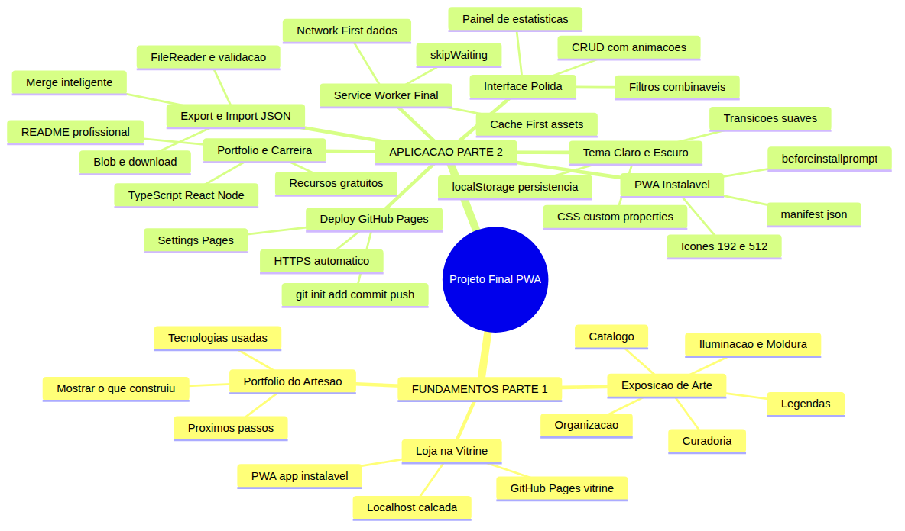
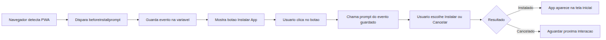
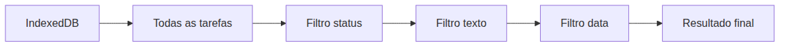
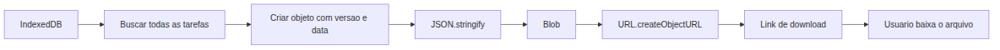
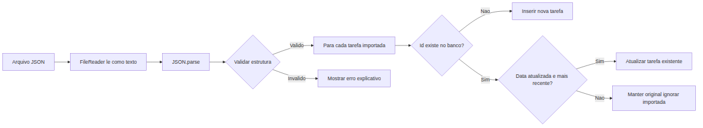
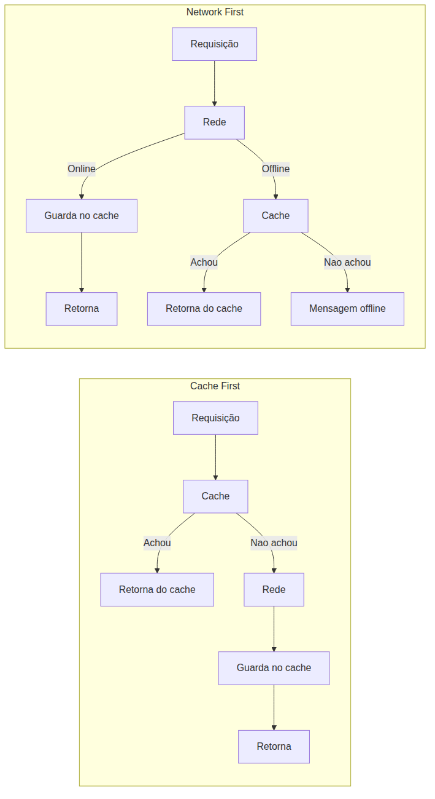
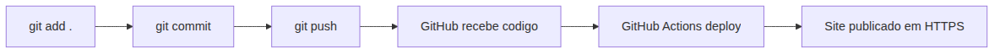

# JavaScript — Do Zero ao Profissional — Aula 31

## Projeto Final — PWA Completa, Deploy e Portfólio

**Duração total:** 120 minutos (45 de leitura + 75 de prática)
**Nível:** Avançado → Profissional
**Pré-requisitos:** Aula 18 (Custom Elements), Aula 19 (Eventos), Aula 20 (Shadow DOM), Aula 21 (Formularios), Aula 22 (File API, Blob), Aula 23 (IndexedDB), Aula 24 (Observers), Aula 25 (Notificacoes), Aula 26 (AbortController), Aula 27 (fetch, async/await), Aula 28 (Service Workers, Cache API), Aula 29 (Streams), Aula 30 (ES Modules, Error Handling, Debugging)

***

## Objetivos de Aprendizagem

Ao final desta aula, voce sera capaz de:

- [ ] **Explicar** os 3 pilares de uma PWA: manifesto (instalavel), Service Worker (offline) e HTTPS (seguro) — consolidando os conceitos das Aulas 28 e 30
- [ ] **Criar** um `manifest.json` completo com name, short_name, icons, start_url, display, theme_color e background_color
- [ ] **Implementar** o evento `beforeinstallprompt` com botao de instalacao amigavel, respeitando o fluxo do navegador
- [ ] **Integrar** todas as funcionalidades do Gerenciador: CRUD com IndexedDB, filtros por status/texto/data, painel de estatisticas, tema claro/escuro com CSS custom properties
- [ ] **Construir** exportacao e importacao de dados em JSON com validacao de estrutura e merge inteligente
- [ ] **Polir** a experiencia com transicoes CSS, feedback visual, indicador online/offline e tratamento de erros amigavel
- [ ] **Realizar** deploy no GitHub Pages — criar repositorio, commit, push, ativar Pages
- [ ] **Construir** o Service Worker final com Cache First para assets, Network First para dados e ciclo de atualizacao (skipWaiting + clients.claim)
- [ ] **Montar** o portfolio profissional com README.md, capturas de tela, descricao de tecnologias e links
- [ ] **Tracar** os proximos passos da carreira — TypeScript, React, Node.js, banco de dados, DevOps — com recursos gratuitos

***

## Como Usar Esta Aula

Esta e a **ultima aula** do modulo JavaScript — Do Zero ao Profissional. Voce ja percorreu 30 aulas, construiu um Gerenciador de Tarefas completo e modularizado, e dominou desde variaveis ate Web Workers, Service Workers e Streams.

Agora voce vai TRANSFORMAR seu Gerenciador em uma **PWA profissional** — instalavel, offline-first, com interface polida e publicada na web. E, mais importante, vai aprender a apresentar esse projeto como parte do seu **portfolio profissional**.

A **primeira parte** (Seccoes 1 a 3) constroi o "por que" com analogias do mundo real — exposicao de arte, loja na vitrine e portfolio do artesao — sem uma linha de JavaScript. A **segunda parte** (Seccoes 4 a 10) coloca a mao na massa: manifesto, install prompt, filtros, export/import, tema, Service Worker final, deploy e portfolio.

Ao longo do caminho, voce encontrara seccoes **Mao na Massa** (para fazer, nao so ler) e **Quick Check** (para verificar se entendeu antes de avancar). Ao final, o arquivo separado **Questoes de Aprendizagem** traz as tarefas de checkpoint.

| Etapa | Atividade | Tempo |
|---|---|---|
| Parte 1 | Fundamentos — Exposicao, Vitrine, Portfolio (analogias) | 15 min |
| Secao 4 | PWA Instalavel — manifest.json + beforeinstallprompt | 15 min |
| Secao 5 | Interface Polida — CRUD, Filtros, Estatisticas | 20 min |
| Secao 6 | Exportar/Importar JSON | 15 min |
| Secao 7 | Tema Claro/Escuro e Polimento Visual | 15 min |
| Secao 8 | Service Worker Final — Offline Completo | 10 min |
| Secao 9 | Deploy no GitHub Pages | 15 min |
| Secao 10 | Portfolio, Carreira e Celebracao | 15 min |

***

## Mapa Mental

Voce comecou esta jornada com um console.log("Ola, mundo!"). Agora o mapa abaixo mostra tudo o que voce vai integrar nesta aula final:





***

## Recapitulacao das Aulas Anteriores

### O Que Voce Ja Construiu Ate Aqui

Nas ultimas 30 aulas, voce construiu camada por camada um Gerenciador de Tarefas completo. Esta tabela mostra cada conceito e onde ele se conecta nesta aula final:

| Aula | Conceito | Onde aparece na Aula 31 | Como se conecta |
|---|---|---|---|
| Aula 18 | Custom Elements | Secao 5 | Componentes da UI polida |
| Aula 19 | Eventos, addEventListener | Secao 4 | Listener do beforeinstallprompt |
| Aula 20 | Shadow DOM, template | Secao 7 | Estilos encapsulados do tema |
| Aula 21 | Formularios, FormData | Secao 5 | Formulario de tarefa |
| Aula 22 | File API, Blob, Drag and Drop | Secao 6 | Exportar/importar JSON |
| Aula 23 | IndexedDB, transacoes, CRUD | Secao 5 | Persistencia; filtros e estatisticas |
| Aula 24 | Observers | Secao 5 | Lazy loading de tarefas antigas |
| Aula 25 | Notifications | Secao 10 | Lembretes como feature |
| Aula 26 | AbortController | Secao 5 | Cancelamento de operacoes |
| Aula 27 | fetch, async/await | Secao 6 | Export/import assincrono |
| Aula 28 | Service Workers, Cache API | Seccoes 4 e 8 | Offline completo e manifesto |
| Aula 29 | Streams, CompressionStream | Secao 6 | Compressao na exportacao |
| Aula 30 | ES Modules, try/catch, debugging | Todas | Arquitetura modular e erros robustos |

### Estado Atual do Projeto (Pos-Aula 30)

Seu Gerenciador de Tarefas ja tem:

- **Arquitetura ES Modules**: arquivos separados para componentes, banco, utilitarios e workers
- **Custom Elements** com Shadow DOM para cada componente da UI
- **IndexedDB** com try/catch/finally em todas as operacoes
- **Service Worker** basico com Cache API (offline inicial)
- **Web Worker** para exportacao com compressao
- **Streaming** de fetch e CompressionStream
- **APIs de dispositivo** com degradacao graciosa
- **Console profissional** (table, group, time)
- **Debuggable** (breakpoints, debugger)

**O que FALTA** (e voce vai construir nesta aula):

1. **PWA instalavel**: manifest.json com icones, beforeinstallprompt
2. **Interface completa**: filtros combinaveis, painel de estatisticas, tema claro/escuro
3. **Export/import JSON** com merge inteligente
4. **Service Worker final**: Cache First + Network First + skipWaiting
5. **Deploy no GitHub Pages**: online, HTTPS, acessivel de qualquer lugar
6. **Portfolio profissional**: README.md, capturas, publicacao

***


**FUNDAMENTOS: Da Oficina para a Vitrine — Apresentando seu Trabalho ao Mundo**

> *As proximas tres secoes usam APENAS analogias do mundo real — exposicao de arte, vitrine de loja e portfolio de artesao. Nenhuma linha de codigo JavaScript. O objetivo e construir o "por que" antes do "como". Na segunda parte, voce vai aplicar cada um desses conceitos no seu Gerenciador.*

***

## 1. A Exposicao de Arte: Curar, Organizar e Apresentar

Imagine um artista que passou meses no atelie produzindo 31 pinturas. Elas estao empilhadas no chao, algumas viradas para a parede, outras com tinta ainda fresca. O artista sabe que cada uma e boa — mas ninguem mais viu.

Agora imagine que chegou o dia da **exposicao**. O artista precisa selecionar quais pinturas vao entrar na mostra, organizar o espaco para criar um fluxo narrativo, iluminar cada quadro com a luz certa, escrever legendas com nome e tecnica, e produzir um catalogo que resume a exposicao.

O atelie (seu codigo) e a exposicao (seu projeto final) sao ambientes completamente diferentes. Um e voltado para dentro, funcional e em construcao. O outro e curado, polido e voltado para fora.

> *Pausa para reflexao: Voce passou 30 aulas no atelie, construindo seu Gerenciador de Tarefas. Agora chegou a hora de montar a exposicao.*

### Curadoria: O Que Entra e o Que Fica de Fora

Curadoria e o ato de escolher. Nem toda funcionalidade que voce construiu precisa estar na versao final. Um curador de museu nao coloca todas as obras na parede — algumas ficam no acervo.

No seu Gerenciador, a curadoria significa separar o essencial (CRUD, filtros, persistencia), o polimento (animacoes, tema claro/escuro) e o extra (notificacoes, geolocalizacao). A curadoria pergunta: *"O que o visitante PRECISA ver para entender o valor do meu trabalho?"*

### Organizacao: O Fluxo da Experiencia

Uma exposicao mal organizada cansa o visitante. Quadros amontoados, sem sequencia logica — em poucos minutos a pessoa sai.

No seu app, a organizacao e a arquitetura da interface. O formulario de criar tarefa vem antes da lista? Sim. Os filtros ficam acima ou abaixo da lista? Acima. As estatisticas ficam visiveis ou num painel separado? Visiveis, dando contexto sem atrapalhar.

A organizacao pergunta: *"Qual a jornada do usuario desde a primeira tela ate a acao desejada?"*

### Iluminacao e Moldura: O Polimento Visual

Uma pintura mediana numa moldura incrivel com iluminacao perfeita pode parecer uma obra-prima. Uma obra-prima numa moldura torta passa despercebida.

No seu app, isso e o polimento visual: transicoes suaves ao adicionar/remover tarefas, tema claro/escuro, feedback visual imediato, espacamento consistente e cores harmonicas.

O polimento pergunta: *"Como fazer o usuario sentir que este app foi feito com cuidado?"*

### Legendas: O Manifesto da Aplicacao

Toda obra de arte tem legenda: nome, tecnica, ano, dimensoes. Sem legenda, o visitante nao entende o contexto.

No seu app, a legenda e o `manifest.json`: nome do app, icone na tela inicial, versao abreviada, modo de exibicao e cor tematica. E o cartao de visitas da aplicacao.

O manifesto pergunta: *"Quando o usuario encontra este app, ele entende rapidamente o que e?"*

### Catalogo: O README do Projeto

No final da exposicao, o visitante leva o catalogo para casa. Ele contem a lista de obras, fotos e a historia do artista.

No seu projeto, o catalogo e o `README.md`: descricao, funcionalidades, tecnologias, link online, instrucoes locais e capturas de tela.

O catalogo pergunta: *"Se alguem encontrar este projeto daqui a 6 meses, vai entender o que e e como usar?"*

> *Ate aqui, voce ja entendeu o paralelo entre uma exposicao de arte e seu projeto final. Curadoria, organizacao, polimento, legenda e catalogo — cada um desses conceitos vai se materializar em codigo na segunda parte. Esta e a ultima aula — voce esta prestes a terminar algo que comecou ha 30 aulas.*

### Quick Check 1

**1. Quais sao os 5 elementos de uma exposicao de arte que se aplicam a um projeto de software?**
**Resposta:** Curadoria (selecionar o essencial), organizacao (fluxo logico), iluminacao/moldura (polimento visual), legendas (manifest.json) e catalogo (README.md).

**2. Por que curadoria e importante em um projeto final?**
**Resposta:** Porque nem toda funcionalidade precisa estar na vitrine. A curadoria garante que o valor do projeto brilhe sem distracoes.

***

## 2. O Vendedor na Calcada vs a Loja na Vitrine

Imagine dois vendedores de bijuterias. Um esta na calcada, com as pecas espalhadas numa manta no chao. Outro tem uma loja na vitrine da avenida principal, com iluminacao, manequins e letreiro.

Os dois vendem bijuterias. Mas quem transmite mais confianca? Quem atrai mais clientes?

O vendedor da calcada e seu app rodando em **localhost**. Funciona perfeitamente no seu computador. Mas ninguem mais pode ver ou usar. Ninguem sabe que existe.

A loja na vitrine e seu app publicado no **GitHub Pages**. Qualquer pessoa com um link pode acessar, de qualquer lugar, em qualquer dispositivo.

Agora imagine uma loja que, alem da vitrine, oferece um **app na tela inicial do celular do cliente** — que abre direto, sem digitar URL, e funciona ate sem internet. Isso e uma **PWA instalavel**.

### Tres Niveis de Presenca

| Nivel | Analogia | Realidade tecnica |
|---|---|---|
| Calcada | Vendedor na manta | localhost — so voce ve |
| Vitrine | Loja na avenida | GitHub Pages — qualquer um acessa |
| App na tela inicial | Cliente favorito | PWA instalavel — sempre a mao |

O salto da calcada para a vitrine e **publicar**. O salto da vitrine para o app instalavel e **virar PWA**.

### Do Curriculo ao Portfolio Online

A mesma logica se aplica a sua carreira:

- **Curriculo em PDF** (calcada): voce entrega na mao do recrutador. Se ele perder, acabou.
- **LinkedIn** (vitrine): esta online, qualquer recrutador encontra, mas voce nao controla o formato.
- **Portfolio online com projetos reais** (app instalavel): o recrutador USA seu projeto, interage com ele, ve o codigo e o deploy. E a diferenca entre "dizer que sabe" e "mostrar que sabe".

> *Voce pode estar pensando: "mas meu app e simples, e so um gerenciador de tarefas". Nao. Voce nao construiu "so um gerenciador de tarefas". Voce construiu uma aplicacao que usa IndexedDB, Service Workers, Web Workers, Streams, ES Modules, Custom Elements, Shadow DOM e APIs de dispositivo. Isso e um **case de portfolio**.*

### Por que GitHub Pages?

GitHub Pages e como ganhar uma loja gratuita na avenida principal. Voce so precisa mostrar que tem um produto (seu codigo num repositorio). O resto e automatizado:

- **Hospedagem gratis**: seu site fica no ar sem custo
- **HTTPS automatico**: seguranca sem configurar certificado
- **Integracao com Git**: cada git push publica automaticamente
- **Dominio personalizado**: pode usar seunome.com (se quiser)

GitHub Pages e o padrao da industria para portfolio de desenvolvedores. Recrutadores CONHECEM. Sabem o que e.

### Quick Check 2

**1. Qual a diferenca entre "funciona no meu computador" e "esta no ar"?**
**Resposta:** "Funciona no meu computador" (localhost) significa que apenas voce pode usar o app. "Esta no ar" (GitHub Pages) significa que qualquer pessoa com o link pode acessar, em qualquer dispositivo, de qualquer lugar.

**2. Cite duas vantagens de ter um app instalavel como PWA versus apenas um site no ar.**
**Resposta:** 1) Funciona offline — o usuario pode usar mesmo sem internet. 2) Fica na tela inicial — aberto com um toque, sem precisar digitar URL, com experiencia de app nativo.

***


## 3. O Portfolio do Artesao: Sua Marca no Mundo

Imagine um marceneiro que quer mostrar seu trabalho para clientes. Ele pode fazer duas coisas:

1. **Listar as ferramentas que sabe usar** — "tenho serra circular, plaina, tupia, lixadeira..."
2. **Mostrar fotos dos moveis que ja construiu** — "esta mesa de jacaranda foi inteira feita a mao..."

Qual dos dois vende mais? Obviamente o segundo. O cliente nao compra ferramentas — compra o RESULTADO do uso das ferramentas.

No mundo do desenvolvimento, e a mesma coisa. Recrutadores nao se importam com quantas linguagens voce "conhece". Eles se importam com o que voce CONSTRUIU.

### O Que Seu Gerenciador Prova

Seu Gerenciador de Tarefas nao e "so mais um projeto de curso". Ele prova que voce sabe:

- **JavaScript moderno (ES6+)**: classes, arrow functions, modules, destructuring, spread
- **Web APIs avancadas**: IndexedDB, Service Workers, Cache API, Web Workers, Streams, File API
- **Arquitetura de software**: ES Modules com separacao de responsabilidades
- **Componentizacao**: Custom Elements com Shadow DOM e encapsulamento
- **UX/UI**: formularios, eventos, tema claro/escuro, animacoes CSS
- **Controle de versao**: Git e GitHub
- **DevOps basico**: deploy em GitHub Pages, PWA, HTTPS
- **Qualidade**: tratamento de erros, debugging, codigo limpo

Isso nao e "basico". Isso e o que empresas esperam de um desenvolvedor junior a pleno.

### O Portfolio Ideal

Um portfolio profissional tem tres elementos:

1. **O projeto funcionando**: link para o app online (GitHub Pages)
2. **O codigo fonte**: repositorio no GitHub com README.md bem escrito
3. **A apresentacao**: capturas de tela, descricao clara, tecnologias listadas

Nao precisa de 10 projetos. Precisa de **um projeto bem feito** que mostre profundidade. Um unico projeto que atravessa 31 aulas, cresce em complexidade, usa APIs modernas e esta publicado — isso vale mais que 10 projetos superficiais.

### Proximos Passos (Visao Geral)

Voce terminou JavaScript puro. Parabens — isso e uma conquista enorme. Mas sua jornada nao termina aqui. Aqui estao os proximos passos naturais:

1. **TypeScript**: JavaScript com tipos — o que a industria usa
2. **React, Vue ou Svelte**: frameworks que organizam a UI de forma declarativa
3. **Node.js**: JavaScript no servidor — crie APIs, servidores, ferramentas CLI
4. **Banco de dados**: SQL (PostgreSQL) e NoSQL (MongoDB) — persista dados no servidor
5. **Full-stack**: junte frontend + backend + banco num projeto completo
6. **DevOps**: Docker, CI/CD, GitHub Actions — automatize tudo

Cada um desses caminhos tem recursos gratuitos de qualidade. A Secao 10 detalha cada um com links especificos.

> *Ate aqui, os fundamentos estao claros: voce tem um projeto incrivel, sabe por que publicar e entende o valor do portfolio. Agora, na segunda parte, voce vai COLOCAR TUDO EM PRACTICA — transformar seu Gerenciador em uma PWA completa e publicar para o mundo.*

### Quick Check 3

**1. Se um recrutador perguntar "o que voce construiu?", qual deve ser sua resposta?**
**Resposta:** "Construi um Gerenciador de Tarefas completo — uma PWA instalavel com IndexedDB, Service Worker offline, Custom Elements, tema claro/escuro, exportacao/importacao de dados e deploy no GitHub Pages." Mostre o resultado, nao a lista de ferramentas.

**2. Cite 3 projetos que voce gostaria de construir nos proximos meses.**
**Resposta:** (Resposta pessoal) Exemplos: um blog com CMS proprio, um dashboard de habitos com graficos, um app de receitas com busca full-text, um sistema de flashcards para estudos, um clon de Trello simplificado.

***


**APLICACAO: Transformando o Gerenciador em uma PWA Completa**

> *Agora que voce entende os fundamentos — por que polir, por que publicar, por que documentar — vamos colocar a mao na massa. Cada conceito da Parte 1 vai se materializar em codigo. A exposicao comeca aqui.*

***

## 4. PWA Instalavel: manifest.json e beforeinstallprompt

### Os 3 Pilares da PWA

Uma **Progressive Web App (PWA)** e uma aplicacao web que se comporta como um app nativo. Tres pilares sustentam uma PWA:

1. **Manifesto Web (`manifest.json`)**: um arquivo JSON que diz ao navegador como seu app deve se comportar quando instalado — nome, icone, modo de tela, cor tematica
2. **Service Worker**: um script que funciona como proxy entre o navegador e a rede, permitindo funcionamento offline e cache inteligente (voce ja construiu um na Aula 28)
3. **HTTPS**: conexao segura — obrigatorio para Service Workers e para o evento de instalacao. GitHub Pages fornece HTTPS automaticamente

> *Voce ja tem o Service Worker (Aula 28). O HTTPS vem gratis com GitHub Pages (Secao 9). Agora voce vai criar o manifesto e o fluxo de instalacao.*

### Criando o manifest.json

O `manifest.json` e um arquivo que fica na raiz do seu projeto (junto do `index.html`). Ele informa ao navegador como seu app deve ser exibido quando instalado.

Crie o arquivo `manifest.json` na raiz do seu Gerenciador:

```json
{
  "name": "Gerenciador de Tarefas",
  "short_name": "Gerenciador",
  "description": "Um gerenciador de tarefas completo com suporte offline",
  "start_url": "/gerenciador-tarefas/index.html",
  "display": "standalone",
  "background_color": "#ffffff",
  "theme_color": "#2196F3",
  "icons": [
    {
      "src": "/gerenciador-tarefas/images/icon-192.png",
      "sizes": "192x192",
      "type": "image/png",
      "purpose": "any maskable"
    },
    {
      "src": "/gerenciador-tarefas/images/icon-512.png",
      "sizes": "512x512",
      "type": "image/png",
      "purpose": "any maskable"
    }
  ]
}
```

**Explicacao campo a campo:**

- **name**: nome completo do app (aparece na tela de boas-vindas)
- **short_name**: versao abreviada (aparece abaixo do icone na tela inicial)
- **description**: descricao breve para mecanismos de busca e lojas
- **start_url**: pagina que abre quando o usuario toca no icone instalado
- **display**: `standalone` faz o app abrir sem a barra de endereco do navegador
- **background_color**: cor de fundo enquanto o CSS carrega
- **theme_color**: cor da barra de titulo e do tema do sistema
- **icons**: arrays de icones em diferentes tamanhos (obrigatorio: 192x192 e 512x512)

> *Nota sobre `start_url` e `icons`: os caminhos sao relativos ao dominio do GitHub Pages. Se seu repositorio se chama `gerenciador-tarefas`, seus arquivos ficam em `https://seu-usuario.github.io/gerenciador-tarefas/`. Ajuste os caminhos nos `src` conforme o nome do seu repositorio.*

### Vinculando o manifest.json no HTML

No `<head>` do seu `index.html`, adicione:

```html
<link rel="manifest" href="manifest.json">
<meta name="theme-color" content="#2196F3">
<meta name="apple-mobile-web-app-capable" content="yes">
<meta name="apple-mobile-web-app-status-bar-style" content="default">
```

O `<link rel="manifest">` e OBRIGATORIO. As meta tags sao recomendadas para melhor experiencia em iOS.

### Gerando Icones

Para os icones, use uma ferramenta gratuita como favicon.io:

1. Faca upload de uma imagem simples (seu logo, uma letra "T" de tarefa, um checkbox)
2. Selecione 192x192 e 512x512
3. Baixe o pacote e copie os arquivos PNG para `images/` no seu projeto

Se quiser criar manualmente, use um `<canvas>` no console para gerar PNGs simples:

```javascript
// Crie um icone simples de 192x192 no console para teste
const canvas = document.createElement("canvas")
canvas.width = 192
canvas.height = 192
const ctx = canvas.getContext("2d")
ctx.fillStyle = "#2196F3"
ctx.fillRect(0, 0, 192, 192)
ctx.fillStyle = "#ffffff"
ctx.font = "bold 120px sans-serif"
ctx.textAlign = "center"
ctx.textBaseline = "middle"
ctx.fillText("T", 96, 100)
canvas.toBlob(blob => {
  const url = URL.createObjectURL(blob)
  const a = document.createElement("a")
  a.href = url
  a.download = "icon-192.png"
  a.click()
})
```

Execute este codigo no console do navegador na pagina do seu projeto. Ele vai baixar um icone azul com a letra "T". Repita com `canvas.width = 512` para o icone 512x512.

### beforeinstallprompt: O Evento de Instalacao

O navegador dispara o evento `beforeinstallprompt` quando detecta que sua aplicacao atende aos criterios para ser instalada como PWA. Voce CAPTURA esse evento, GUARDA a referencia, e SO MOSTRA O BOTAO de instalacao quando o usuario faz um gesto (clique).

**Fluxo completo:**





Codigo para capturar o evento e mostrar o botao:

```javascript
// Variavel global para guardar o evento de instalacao
let deferredPrompt = null
const installButton = document.getElementById("btn-instalar")

// Escuta o evento beforeinstallprompt
window.addEventListener("beforeinstallprompt", (event) => {
  // PREVINE o comportamento padrao (que mostra o banner automatico)
  event.preventDefault()
  // GUARDA o evento para usar depois
  deferredPrompt = event
  // MOSTRA o botao de instalacao
  installButton.style.display = "block"
})

// Quando o usuario clica no botao
installButton.addEventListener("click", async () => {
  if (!deferredPrompt) return

  // MOSTRA o prompt nativo de instalacao
  deferredPrompt.prompt()

  // AGUARDA a escolha do usuario
  const result = await deferredPrompt.userChoice

  if (result.outcome === "accepted") {
    console.log("Usuario instalou o app!")
    installButton.style.display = "none"
  } else {
    console.log("Usuario cancelou a instalacao")
  }

  // LIMPA o evento (so pode ser usado uma vez)
  deferredPrompt = null
})
```

**Por que `event.preventDefault()`?** Porque sem isso, o navegador mostra o banner de instalacao automaticamente — feio, fora de contexto, sem controle. Voce captura o evento e decide QUANDO mostrar o prompt, com um botao bonito e contextualizado na sua interface.

**Por que `deferredPrompt.prompt()` so com clique?** Porque o navegador so permite chamar `prompt()` como resposta a um GESTO DO USUARIO (clique, toque). Nao pode chamar no carregamento da pagina. Isso evita spam de instalacao.

### Verificando se o App Esta Instalado

Depois que o usuario instala o app, `beforeinstallprompt` nunca mais dispara. Para verificar se o app esta rodando em modo standalone (instalado):

```javascript
// Verifica se esta rodando como app instalado
const isStandalone = window.matchMedia("(display-mode: standalone)").matches

if (isStandalone) {
  console.log("App rodando em modo standalone!")
  // Esconde o botao de instalacao — ja esta instalado
  installButton.style.display = "none"
}
```

Isso e util para mostrar uma UI diferente quando o app esta instalado (ex: esconder o botao "Instalar", mostrar "Feito com sucesso!").

### Quando beforeinstallprompt NAO Dispara

O evento `beforeinstallprompt` so dispara se TODOS estes criterios forem atendidos:

1. **manifest.json valido** com os campos obrigatorios
2. **Service Worker registrado** e ativo
3. **HTTPS** (ou localhost para desenvolvimento)
4. **App ja foi visitado** pelo menos 2 vezes com intervalo de 5 minutos (no Chrome)

Isso significa que em desenvolvimento (localhost) funciona, mas em `file://` (abrir HTML direto no navegador) nao funciona. No GitHub Pages (HTTPS) funciona perfeitamente.

### Mao na Massa 1: Criar manifest.json e beforeinstallprompt

**Dificuldade: Facil | Duracao: 15 minutos**

- [ ] Crie o arquivo `manifest.json` na raiz do seu Gerenciador com todos os campos
- [ ] Adicione `<link rel="manifest">` no `<head>` do `index.html`
- [ ] Gere ou baixe icones 192x192 e 512x512 (use favicon.io ou o canvas no console)
- [ ] Coloque os icones em `images/icon-192.png` e `images/icon-512.png`
- [ ] No seu JavaScript principal, implemente o listener `beforeinstallprompt`
- [ ] Adicione um botao "Instalar App" no HTML (escondido por padrao)
- [ ] Mostre o botao quando o evento disparar e esconda quando instalar
- [ ] Teste: abra no Chrome, va em DevTools > Application > Manifest e veja se esta tudo ok
- [ ] Teste: va em DevTools > Application > Service Workers e veja se esta ativo (seu SW da Aula 28)

### Quick Check 4

**1. Quais sao os 3 criterios para o beforeinstallprompt disparar?**
**Resposta:** 1) manifest.json valido com campos obrigatorios. 2) Service Worker registrado e ativo. 3) HTTPS ou localhost.

**2. Por que `prompt()` so pode ser chamado como resposta a um gesto do usuario?**
**Resposta:** Para evitar que sites chamem o prompt de instalacao sem a intencao do usuario, o que seria spam. O navegador so permite como resposta a um clique ou toque.

**3. Qual a diferenca entre `display: standalone` e `display: browser`?**
**Resposta:** `standalone` faz o app abrir sem barra de endereco, com aparencia de app nativo. `browser` abre numa aba normal do navegador. Para PWA instalavel, use `standalone`.

***

## 5. Interface Polida: CRUD, Filtros e Estatisticas

Agora que voce tem um app instalavel (Secao 4), e hora de polir a interface. Voce ja tem o CRUD basico desde a Aula 23. Agora vamos adicionar o que transforma um app funcional em um app PROFISSIONAL: filtros combinaveis, painel de estatisticas e animacoes.

### CRUD Polido

O CRUD basico (criar, ler, atualizar, deletar) ja existe. O polimento adiciona:

- **Animacao ao adicionar**: a nova tarefa aparece com fade-in suave
- **Animacao ao remover**: confirmacao antes de excluir + fade-out
- **Risco ao concluir**: a tarefa concluida aparece com texto riscado e cor mais clara (com transicao CSS)
- **Feedback visual**: ao salvar, um destaque verde rapido na tarefa mostra "salvo!"

```css
/* Transicoes no CSS do seu componente */
.e-tarefa {
  transition: opacity 0.3s ease, transform 0.3s ease;
}

.e-tarefa.adicionando {
  animation: fadeIn 0.3s ease forwards;
}

.e-tarefa.removendo {
  animation: fadeOut 0.3s ease forwards;
}

.e-tarefa.concluida .tarefa-texto {
  text-decoration: line-through;
  opacity: 0.6;
  transition: all 0.3s ease;
}

.e-tarefa.salva {
  animation: highlightSave 0.6s ease;
}

@keyframes fadeIn {
  from { opacity: 0; transform: translateY(-10px); }
  to { opacity: 1; transform: translateY(0); }
}

@keyframes fadeOut {
  from { opacity: 1; transform: scale(1); }
  to { opacity: 0; transform: scale(0.8); }
}

@keyframes highlightSave {
  0%, 100% { background-color: transparent; }
  50% { background-color: rgba(76, 175, 80, 0.15); }
}
```

Para ativar a animacao ao adicionar uma tarefa:

```javascript
function adicionarTarefaNaUI(tarefa) {
  const elemento = criarElementoTarefa(tarefa)
  elemento.classList.add("adicionando")
  lista.appendChild(elemento)
  // Remove a classe depois da animacao terminar
  setTimeout(() => elemento.classList.remove("adicionando"), 300)
}
```

Para remover com confirmacao e animacao:

```javascript
function removerTarefa(id, elemento) {
  if (!confirm("Tem certeza que deseja excluir esta tarefa?")) return

  elemento.classList.add("removendo")
  // Aguarda a animacao terminar antes de remover do DOM e do banco
  setTimeout(async () => {
    await db.excluirTarefa(id)
    elemento.remove()
  }, 300)
}
```

### Filtros Combinaveis

O grande upgrade: em vez de filtrar so por status (Todas/Pendentes/Concluidas), voce vai combinar TRES criterios simultaneamente.

**Pipeline de filtros:**





**Interface de filtros no HTML:**

```html
<div class="filtros">
  <select id="filtro-status">
    <option value="todas">Todas</option>
    <option value="pendentes">Pendentes</option>
    <option value="concluidas">Concluidas</option>
  </select>

  <input type="text" id="filtro-texto"
         placeholder="Buscar tarefa..."
         autocomplete="off">

  <select id="filtro-data">
    <option value="todas">Qualquer data</option>
    <option value="hoje">Para hoje</option>
    <option value="semana">Esta semana</option>
    <option value="atrasadas">Atrasadas</option>
    <option value="sem-data">Sem deadline</option>
  </select>
</div>
```

**Implementacao dos filtros combinaveis em JavaScript:**

```javascript
// No seu modulo de utilitarios ou diretamente no gerenciador
async function aplicarFiltros() {
  try {
    // 1. Busca TODAS as tarefas do IndexedDB
    let tarefas = await db.listarTarefas()

    // 2. Filtro por STATUS (pendente / concluida)
    const status = document.getElementById("filtro-status").value
    if (status !== "todas") {
      tarefas = tarefas.filter(t => {
        return status === "pendentes" ? !t.concluida : t.concluida
      })
    }

    // 3. Filtro por TEXTO (busca no nome da tarefa)
    const texto = document.getElementById("filtro-texto").value.trim().toLowerCase()
    if (texto) {
      tarefas = tarefas.filter(t =>
        t.titulo.toLowerCase().includes(texto)
      )
    }

    // 4. Filtro por DATA (deadline)
    const dataFiltro = document.getElementById("filtro-data").value
    const hoje = new Date()
    hoje.setHours(0, 0, 0, 0)

    if (dataFiltro === "hoje") {
      tarefas = tarefas.filter(t => {
        if (!t.deadline) return false
        const deadline = new Date(t.deadline)
        deadline.setHours(0, 0, 0, 0)
        return deadline.getTime() === hoje.getTime()
      })
    } else if (dataFiltro === "semana") {
      const fimSemana = new Date(hoje)
      fimSemana.setDate(fimSemana.getDate() + 7)
      tarefas = tarefas.filter(t => {
        if (!t.deadline) return false
        const deadline = new Date(t.deadline)
        return deadline >= hoje && deadline <= fimSemana
      })
    } else if (dataFiltro === "atrasadas") {
      tarefas = tarefas.filter(t => {
        if (!t.deadline || t.concluida) return false
        const deadline = new Date(t.deadline)
        deadline.setHours(23, 59, 59, 999)
        return deadline < hoje
      })
    } else if (dataFiltro === "sem-data") {
      tarefas = tarefas.filter(t => !t.deadline)
    }

    // 5. Renderiza o resultado
    renderizarLista(tarefas)
    atualizarEstatisticas(tarefas)

  } catch (erro) {
    console.error("Erro ao aplicar filtros:", erro)
    mostrarErro("Nao foi possivel filtrar as tarefas.")
  }
}

// Listeners para aplicar filtros em tempo real
document.getElementById("filtro-status").addEventListener("change", aplicarFiltros)
document.getElementById("filtro-texto").addEventListener("input", aplicarFiltros)
document.getElementById("filtro-data").addEventListener("change", aplicarFiltros)
```

### Painel de Estatisticas

As estatisticas dao ao usuario uma visao rapida do estado do seu gerenciador. Crie um painel no topo da pagina:

```html
<div class="painel-estatisticas">
  <div class="stat">
    <span class="stat-valor" id="stat-total">0</span>
    <span class="stat-rotulo">Total</span>
  </div>
  <div class="stat">
    <span class="stat-valor" id="stat-concluidas">0</span>
    <span class="stat-rotulo">Concluidas</span>
  </div>
  <div class="stat">
    <span class="stat-valor" id="stat-pendentes">0</span>
    <span class="stat-rotulo">Pendentes</span>
  </div>
  <div class="stat">
    <span class="stat-valor" id="stat-taxa">0%</span>
    <span class="stat-rotulo">Taxa de conclusao</span>
  </div>
  <div class="stat">
    <span class="stat-valor" id="stat-atrasadas">0</span>
    <span class="stat-rotulo">Atrasadas</span>
  </div>
</div>
```

**Funcao para atualizar as estatisticas:**

```javascript
function atualizarEstatisticas(tarefas) {
  const total = tarefas.length
  const concluidas = tarefas.filter(t => t.concluida).length
  const pendentes = total - concluidas
  const taxa = total > 0 ? Math.round((concluidas / total) * 100) : 0

  const hoje = new Date()
  hoje.setHours(0, 0, 0, 0)
  const atrasadas = tarefas.filter(t => {
    if (!t.deadline || t.concluida) return false
    return new Date(t.deadline) < hoje
  }).length

  document.getElementById("stat-total").textContent = total
  document.getElementById("stat-concluidas").textContent = concluidas
  document.getElementById("stat-pendentes").textContent = pendentes
  document.getElementById("stat-taxa").textContent = taxa + "%"
  document.getElementById("stat-atrasadas").textContent = atrasadas
}
```

### Indices no IndexedDB para Performance

Se voce tem muitas tarefas (100+), filtrar no JavaScript depois de buscar todas pode ser lento. A solucao profissional: usar **indices** no IndexedDB.

Na abertura do banco, crie indices para os campos mais consultados:

```javascript
// Na funcao de criar/atualizar o banco
const store = db.createObjectStore("tarefas", { keyPath: "id" })
store.createIndex("byStatus", "concluida", { unique: false })
store.createIndex("byDeadline", "deadline", { unique: false })
store.createIndex("byStatusAndDeadline", ["concluida", "deadline"], { unique: false })
```

Depois voce pode buscar diretamente por status sem filtrar todas:

```javascript
// Busca so as pendentes usando o indice
async function buscarPendentes() {
  const db = await conectarDB()
  const transaction = db.transaction("tarefas", "readonly")
  const store = transaction.objectStore("tarefas")
  const index = store.index("byStatus")
  const tarefas = await index.getAll(false) // false = pendentes
  return tarefas
}
```

Para a maioria dos casos com filtros combinaveis, buscar todas e filtrar em memoria com `.filter()` e suficiente e mais flexivel. Os indices sao para quando a performance se tornar um problema (1000+ tarefas).

### Mao na Massa 2: Implementar Filtros e Estatisticas

**Dificuldade: Medio | Duracao: 20 minutos**

- [ ] Adicione as animacoes CSS (fadeIn, fadeOut, highlightSave) no seu arquivo de estilos
- [ ] Implemente a logica de animacao ao adicionar e remover tarefas
- [ ] Crie a interface de filtros (status + texto + data) no HTML
- [ ] Implemente a funcao `aplicarFiltros()` com os tres filtros combinados
- [ ] Adicione os listeners para filtrar em tempo real (change/input)
- [ ] Crie o painel de estatisticas no HTML
- [ ] Implemente `atualizarEstatisticas()` e chame apos cada operacao
- [ ] Teste: adicione 5 tarefas com deadlines diferentes e verifique se os filtros funcionam combinados

### Quick Check 5

**1. Qual a diferenca entre usar indices do IndexedDB e o metodo .filter() do JavaScript?**
**Resposta:** Indices filtrando no banco sao mais performaticos para grandes volumes e buscas simples por status. .filter() e mais flexivel para filtros combinaveis (status + texto + data). Para projetos pequenos, .filter() e suficiente.

**2. Como combinar tres filtros (status + texto + data) sem conflito entre eles?**
**Resposta:** Aplicando em pipeline sequencial: primeiro busca todas as tarefas, depois aplica um filtro de cada vez, cada um reduzindo o array resultante. A ordem dos filtros nao importa (sao independentes), desde que todos sejam aplicados.

**3. Em que cenario vale a pena usar indices do IndexedDB em vez de filtrar em memoria?**
**Resposta:** Quando o volume de dados ultrapassa 1000 tarefas e a consulta e simples (ex: "todas as pendentes"). Para consultas combinaveis com texto, filtrar em memoria e mais pratico.

***

## 6. Exportar e Importar Dados em JSON

Seu Gerenciador guarda dados no IndexedDB. Mas se o usuario quiser fazer backup, migrar para outro dispositivo ou compartilhar dados com alguem? Para isso servem a exportacao e importacao em JSON.

### Exportar: Dados do IndexedDB para Arquivo JSON

O fluxo de exportacao e:





**Estrutura do arquivo exportado:**

```json
{
  "versao": 1,
  "dataExportacao": "2026-06-30T10:30:00.000Z",
  "totalTarefas": 15,
  "tarefas": [
    {
      "id": "abc123",
      "titulo": "Comprar pao",
      "concluida": false,
      "deadline": "2026-07-01",
      "criadaEm": "2026-06-28T08:00:00.000Z",
      "atualizadaEm": "2026-06-29T14:30:00.000Z"
    }
  ]
}
```

**Implementacao da exportacao:**

```javascript
async function exportarTarefas() {
  try {
    // 1. Busca todas as tarefas do IndexedDB
    const tarefas = await db.listarTarefas()

    // 2. Monta o objeto de exportacao com metadados
    const dados = {
      versao: 1,
      dataExportacao: new Date().toISOString(),
      totalTarefas: tarefas.length,
      aplicacao: "Gerenciador de Tarefas",
      tarefas: tarefas
    }

    // 3. Converte para JSON formatado
    const json = JSON.stringify(dados, null, 2)

    // 4. Cria um Blob com o conteudo JSON
    const blob = new Blob([json], { type: "application/json" })

    // 5. Cria uma URL temporaria para o blob
    const url = URL.createObjectURL(blob)

    // 6. Cria um link de download e clica automaticamente
    const a = document.createElement("a")
    a.href = url
    a.download = `tarefas-${new Date().toISOString().split("T")[0]}.json`
    document.body.appendChild(a)
    a.click()

    // 7. Limpeza: remove o link e libera a URL
    setTimeout(() => {
      document.body.removeChild(a)
      URL.revokeObjectURL(url)
    }, 100)

    console.log(`Exportadas ${tarefas.length} tarefas com sucesso!`)

  } catch (erro) {
    console.error("Erro ao exportar tarefas:", erro)
    mostrarErro("Nao foi possivel exportar os dados.")
  }
}
```

> *Nota: `URL.createObjectURL()` cria uma URL temporaria que referencia o blob em memoria. Ela precisa ser liberada com `revokeObjectURL()` quando nao for mais usada, senao vaza memoria. O `setTimeout` de 100ms da tempo para o download comecar antes de liberar.*

### Importar: Arquivo JSON para IndexedDB com Merge Inteligente

Importar e mais delicado que exportar. O usuario pode importar dados de outro dispositivo, fazer merge com dados existentes ou substituir tudo.

**Fluxo de importacao:**





**Merge inteligente:** nao sobrescrever dados mais recentes com dados mais antigos. Cada tarefa tem um campo `atualizadaEm`. Se a tarefa importada tiver `atualizadaEm` mais antigo que a do banco, a versao do banco prevalece.

**Implementacao da importacao com FileReader:**

```javascript
async function importarTarefas(file) {
  try {
    // 1. Le o arquivo como texto
    const texto = await lerArquivoComoTexto(file)

    // 2. Converte para objeto JavaScript
    const dados = JSON.parse(texto)

    // 3. VALIDA a estrutura do arquivo
    if (!dados.versao || !Array.isArray(dados.tarefas)) {
      throw new Error("Arquivo invalido: estrutura incorreta.")
    }

    if (dados.tarefas.length === 0) {
      mostrarMensagem("O arquivo esta vazio. Nenhuma tarefa para importar.")
      return
    }

    if (dados.tarefas.length > 10000) {
      const confirmou = confirm(
        `Este arquivo contem ${dados.tarefas.length} tarefas. ` +
        "A importacao pode levar alguns segundos. Continuar?"
      )
      if (!confirmou) return
    }

    // 4. Para datasets grandes, usa Web Worker (Aula 28)
    let tarefasImportadas = dados.tarefas
    if (dados.tarefas.length > 1000) {
      tarefasImportadas = await processarEmWorker(tarefasImportadas)
    }

    // 5. Faz o merge inteligente com os dados existentes
    const resultado = await mergeTarefas(tarefasImportadas)

    console.log("Importacao concluida:", resultado)
    mostrarMensagem(
      `Importacao concluida! ` +
      `${resultado.inseridas} novas tarefas, ` +
      `${resultado.atualizadas} atualizadas, ` +
      `${resultado.ignoradas} ignoradas.`
    )

    // 6. Re-renderiza a lista com os dados atualizados
    await aplicarFiltros()

  } catch (erro) {
    console.error("Erro ao importar tarefas:", erro)
    mostrarErro("Nao foi possivel importar o arquivo. Verifique se e um JSON valido.")
  }
}

// Funcao auxiliar para ler arquivo como texto
function lerArquivoComoTexto(file) {
  return new Promise((resolve, reject) => {
    const reader = new FileReader()
    reader.onload = () => resolve(reader.result)
    reader.onerror = () => reject(new Error("Erro ao ler arquivo"))
    reader.readAsText(file)
  })
}

// Funcao de merge inteligente
async function mergeTarefas(tarefasImportadas) {
  const db = await conectarDB()
  let inseridas = 0
  let atualizadas = 0
  let ignoradas = 0

  for (const tarefa of tarefasImportadas) {
    try {
      // Verifica se a tarefa ja existe no banco
      const existente = await db.buscarTarefa(tarefa.id)

      if (!existente) {
        // Nova tarefa: insere direto
        await db.inserirTarefa(tarefa)
        inseridas++
      } else {
        // Tarefa existente: compara data de atualizacao
        const dataImportada = new Date(tarefa.atualizadaEm || 0)
        const dataExistente = new Date(existente.atualizadaEm || 0)

        if (dataImportada > dataExistente) {
          // A versao importada e mais recente: atualiza
          await db.atualizarTarefa(tarefa)
          atualizadas++
        } else {
          // A versao existente e mais recente: mantem original
          ignoradas++
        }
      }
    } catch (erro) {
      console.warn("Erro ao processar tarefa:", tarefa.id, erro)
      ignoradas++
    }
  }

  return { inseridas, atualizadas, ignoradas }
}
```

**Interface de importacao no HTML:**

```html
<div class="import-export">
  <button id="btn-exportar" class="btn btn-secundario">Exportar Dados</button>

  <label for="input-importar" class="btn btn-secundario">
    Importar Dados
  </label>
  <input type="file" id="input-importar" accept=".json"
         style="display:none">

  <!-- Suporte a Drag and Drop -->
  <div id="area-drop" class="area-drop">
    <p>Arraste um arquivo JSON aqui para importar</p>
  </div>
</div>
```

**Listeners:**

```javascript
document.getElementById("btn-exportar").addEventListener("click", exportarTarefas)

document.getElementById("input-importar").addEventListener("change", (event) => {
  const file = event.target.files[0]
  if (file) importarTarefas(file)
  event.target.value = "" // Permite re-importar o mesmo arquivo
})
```

### Mao na Massa 3: Botoes Exportar e Importar JSON

**Dificuldade: Medio | Duracao: 15 minutos**

- [ ] Implemente a funcao `exportarTarefas()` com Blob e download
- [ ] Adicione o botao "Exportar Dados" no HTML
- [ ] Implemente a funcao `importarTarefas()` com FileReader
- [ ] Implemente `mergeTarefas()` com logica de data
- [ ] Adicione o input file e a area de drag and drop
- [ ] Teste: exporte 3 tarefas, feche o navegador, abra novamente e importe o arquivo
- [ ] Teste: modifique uma tarefa no arquivo exportado e re-importe — veja se o merge funciona

### Quick Check 6

**1. Por que usar Blob + URL.createObjectURL em vez de abrir o JSON em uma nova aba?**
**Resposta:** Blob permite controlar o nome do arquivo (.json) e o tipo MIME, alem de nao poluir o historico do navegador. Abrir em nova aba mostra o JSON como texto na tela, nao faz download.

**2. O que e merge inteligente e por que e melhor que simplesmente sobrescrever?**
**Resposta:** Merge inteligente compara a data de atualizacao de cada tarefa e mantem a versao mais recente. Sobrescrever cegamente poderia perder alteracoes que o usuario fez depois da ultima exportacao.

**3. Que validacoes sao essenciais antes de importar dados?**
**Resposta:** Verificar se o JSON e valido (JSON.parse nao lanca erro), se tem a estrutura esperada (campos versao e tarefas), se tarefas e um array, e se o tamanho e viavel para processamento.
***

## 7. Tema Claro/Escuro e Polimento Visual

Um app profissional respeita a preferencia do usuario. Tema claro para ambientes iluminados, tema escuro para ambientes escuros — e a preferencia persiste entre sessoes.

### CSS Custom Properties: A Base do Tema

Em vez de definir cores fixas em cada elemento, use **CSS custom properties** (variaveis CSS). O tema claro define valores no `:root` e o tema escuro sobrescreve no `[data-tema="escuro"]`.

```css
/* Tema CLARO (padrao) */
:root {
  --cor-fundo: #ffffff;
  --cor-texto: #212121;
  --cor-primaria: #2196F3;
  --cor-secundaria: #757575;
  --cor-card: #ffffff;
  --cor-borda: #e0e0e0;
  --cor-sucesso: #4CAF50;
  --cor-perigo: #f44336;
  --cor-sombra: rgba(0, 0, 0, 0.1);
  --espaco-padrao: 16px;
  --raio-borda: 8px;
}

/* Tema ESCURO */
[data-tema="escuro"] {
  --cor-fundo: #121212;
  --cor-texto: #e0e0e0;
  --cor-primaria: #64B5F6;
  --cor-secundaria: #9e9e9e;
  --cor-card: #1e1e1e;
  --cor-borda: #333333;
  --cor-sucesso: #66BB6A;
  --cor-perigo: #ef5350;
  --cor-sombra: rgba(0, 0, 0, 0.3);
  --espaco-padrao: 16px;
  --raio-borda: 8px;
}
```

**Usando as variaveis nos seus componentes:**

```css
/* Em vez de: */
body { background: #ffffff; color: #212121; }

/* Use: */
body {
  background-color: var(--cor-fundo);
  color: var(--cor-texto);
  transition: background-color 0.3s ease, color 0.3s ease;
}

.card, .e-tarefa {
  background: var(--cor-card);
  border: 1px solid var(--cor-borda);
  border-radius: var(--raio-borda);
  box-shadow: 0 2px 4px var(--cor-sombra);
  padding: var(--espaco-padrao);
}

.btn-primario {
  background: var(--cor-primaria);
  color: #ffffff;
  border: none;
  padding: 10px 20px;
  border-radius: var(--raio-borda);
  cursor: pointer;
  transition: opacity 0.2s ease;
}

.btn-primario:hover {
  opacity: 0.9;
}
```

A mágica: quando voce muda o atributo `data-tema` no `<html>`, TODAS as cores mudam automaticamente porque as variaveis CSS sao reavaliadas.

### O Toggle de Tema com JavaScript

```javascript
// Verifica preferencia salva ou do sistema
function getTemaInicial() {
  // 1. Preferencia salva manualmente pelo usuario
  const salvo = localStorage.getItem("tema")
  if (salvo === "escuro" || salvo === "claro") return salvo

  // 2. Preferencia do sistema operacional
  if (window.matchMedia("(prefers-color-scheme: dark)").matches) {
    return "escuro"
  }

  // 3. Padrao: claro
  return "claro"
}

// Aplica o tema no HTML
function aplicarTema(tema) {
  document.documentElement.setAttribute("data-tema", tema)
  localStorage.setItem("tema", tema)

  // Atualiza o icone/rotulo do botao toggle
  const btn = document.getElementById("btn-tema")
  if (btn) {
    btn.textContent = tema === "escuro" ? "☀️ Modo Claro" : "🌙 Modo Escuro"
  }
}

// Inicializacao
aplicarTema(getTemaInicial())

// Listener do botao toggle
document.getElementById("btn-tema").addEventListener("click", () => {
  const temaAtual = document.documentElement.getAttribute("data-tema")
  const novoTema = temaAtual === "escuro" ? "claro" : "escuro"
  aplicarTema(novoTema)
})
```

**Transicao suave:** O `transition: 0.3s ease` no `body` faz com que a mudanca de cores seja suave, nao abrupta. Parece um app nativo.

### Indicador Online/Offline

O usuario pode perder a conexao a qualquer momento. Um indicador visual mostra se o app esta online ou offline:

```html
<div id="status-conexao" class="status-online">
  Online
</div>
```

```css
.status-online {
  background: var(--cor-sucesso);
  color: white;
  padding: 4px 12px;
  border-radius: 12px;
  font-size: 12px;
  position: fixed;
  bottom: 16px;
  right: 16px;
  transition: all 0.3s ease;
}

.status-offline {
  background: var(--cor-perigo);
  color: white;
  box-shadow: 0 0 12px rgba(244, 67, 54, 0.4);
}
```

```javascript
function atualizarStatusConexao() {
  const el = document.getElementById("status-conexao")
  if (navigator.onLine) {
    el.textContent = "Online"
    el.className = "status-online"
  } else {
    el.textContent = "Offline"
    el.className = "status-offline"
  }
}

window.addEventListener("online", atualizarStatusConexao)
window.addEventListener("offline", atualizarStatusConexao)

// Inicializa
atualizarStatusConexao()
```

### Spinner de Carregamento

Operacoes no IndexedDB podem levar alguns milissegundos — o suficiente para o usuario achar que o app travou. Mostre um spinner:

```html
<div id="spinner" class="spinner escondido">
  <div class="spinner-animacao"></div>
  <span>Carregando...</span>
</div>
```

```css
.spinner {
  display: flex;
  align-items: center;
  gap: 12px;
  padding: 20px;
  justify-content: center;
}

.spinner.escondido {
  display: none;
}

.spinner-animacao {
  width: 24px;
  height: 24px;
  border: 3px solid var(--cor-borda);
  border-top-color: var(--cor-primaria);
  border-radius: 50%;
  animation: spin 0.8s linear infinite;
}

@keyframes spin {
  to { transform: rotate(360deg); }
}
```

```javascript
function mostrarSpinner() {
  document.getElementById("spinner").classList.remove("escondido")
}

function esconderSpinner() {
  document.getElementById("spinner").classList.add("escondido")
}

// Use antes e depois de operacoes assincronas
async function carregarTarefas() {
  mostrarSpinner()
  try {
    const tarefas = await db.listarTarefas()
    renderizarLista(tarefas)
  } finally {
    esconderSpinner()
  }
}
```

### Mao na Massa 4: Implementar Tema, Indicador e Spinner

**Dificuldade: Medio | Duracao: 15 minutos**

- [ ] Crie as CSS custom properties para tema claro e escuro no `:root` e `[data-tema="escuro"]`
- [ ] Substitua as cores fixas do seu CSS por var() references
- [ ] Implemente o toggle de tema com JavaScript e localStorage
- [ ] Adicione o botao de alternar tema na interface
- [ ] Crie o indicador online/offline com os eventos do window
- [ ] Implemente o spinner com CSS animation e toggle via JS
- [ ] Teste: alterne entre claro e escuro, feche e abra o navegador — a preferencia deve persistir
- [ ] Teste: desative a internet (DevTools > Network > Offline) e veja o indicador mudar

### Quick Check 7

**1. Qual a vantagem de CSS custom properties em vez de classes CSS fixas para tema?**
**Resposta:** Com CSS custom properties, uma unica mudanca de atributo no HTML altera TODAS as cores de uma vez, sem precisar sobrescrever classe por classe. E mais modular e facil de manter.

**2. Por que usar localStorage para persistir a preferencia de tema?**
**Resposta:** O localStorage sobrevive a fechamentos do navegador. Quando o usuario volta, o tema que ele escolheu ainda esta ativo, sem precisar selecionar novamente.

**3. As operacoes CRUD do IndexedDB funcionam offline?**
**Resposta:** Sim! IndexedDB e um banco local no navegador. Todas as operacoes de leitura e escrita funcionam sem internet. Apenas requisicoes fetch (API externa) precisam de rede.

***


## 8. Service Worker Final: Offline Completo

Na Aula 28 voce construiu seu primeiro Service Worker com Cache API. Agora vamos refina-lo com duas estrategias profissionais: **Cache First** para assets estaticos e **Network First** para dados dinamicos.

### Duas Estrategias, Dois Contextos





**Cache First (assets estaticos):** HTML, CSS, JavaScript, fontes, imagens. Esses arquivos mudam pouco e sao essenciais para o app funcionar. Primeiro tenta no cache, so vai pra rede se nao achar.

**Network First (dados dinamicos):** requisicoes fetch, API externa. Dados mudam com frequencia e o usuario quer a versao mais recente. Primeiro tenta a rede, cai no cache como fallback.

### Service Worker Completo

```javascript
// sw.js — Service Worker final
const CACHE_NAME = "gerenciador-v2"
const ASSETS_PRE_CACHE = [
  "/gerenciador-tarefas/index.html",
  "/gerenciador-tarefas/gerenciador.js",
  "/gerenciador-tarefas/db.js",
  "/gerenciador-tarefas/estilos.css",
  "/gerenciador-tarefas/manifest.json",
  "/gerenciador-tarefas/images/icon-192.png",
  "/gerenciador-tarefas/images/icon-512.png"
]

// --- INSTALL: Pre-cache dos assets estaticos ---
self.addEventListener("install", (event) => {
  console.log("[SW] Instalando e pre-caching...")
  event.waitUntil(
    caches.open(CACHE_NAME).then((cache) => {
      return cache.addAll(ASSETS_PRE_CACHE)
    })
  )
  // Forca ativacao imediata sem esperar abas fecharem
  self.skipWaiting()
})

// --- ACTIVATE: Limpa caches antigos ---
self.addEventListener("activate", (event) => {
  console.log("[SW] Ativado!")
  event.waitUntil(
    caches.keys().then((cacheNames) => {
      return Promise.all(
        cacheNames
          .filter((name) => name !== CACHE_NAME)
          .map((name) => caches.delete(name))
      )
    })
  )
  // Assume controle de todas as abas imediatamente
  clients.claim()
})

// --- FETCH: Roteamento inteligente ---
self.addEventListener("fetch", (event) => {
  const url = new URL(event.request.url)

  // ESTRATEGIA 1: Cache First para assets estaticos
  if (isStaticAsset(event.request.url)) {
    event.respondWith(cacheFirst(event.request))
    return
  }

  // ESTRATEGIA 2: Network First para dados dinamicos
  event.respondWith(networkFirst(event.request))
})

function isStaticAsset(url) {
  return url.match(/\.(html|css|js|json|png|jpg|svg|ico|woff2?)$/)
}

async function cacheFirst(request) {
  const cached = await caches.match(request)
  if (cached) return cached

  try {
    const response = await fetch(request)
    if (response.ok && request.method === "GET") {
      const cache = await caches.open(CACHE_NAME)
      cache.put(request, response.clone())
    }
    return response
  } catch (erro) {
    return new Response("Recurso offline", { status: 503 })
  }
}

async function networkFirst(request) {
  try {
    const response = await fetch(request)
    if (response.ok && request.method === "GET") {
      const cache = await caches.open(CACHE_NAME)
      cache.put(request, response.clone())
    }
    return response
  } catch (erro) {
    const cached = await caches.match(request)
    if (cached) return cached
    return new Response(JSON.stringify({ erro: "Offline" }), {
      status: 503,
      headers: { "Content-Type": "application/json" }
    })
  }
}
```

### Registro do Service Worker (no index.html ou gerenciador.js)

```javascript
if ("serviceWorker" in navigator) {
  window.addEventListener("load", async () => {
    try {
      const registration = await navigator.serviceWorker.register("/gerenciador-tarefas/sw.js")
      console.log("[SW] Registrado com sucesso:", registration.scope)

      // Verifica se ha atualizacao pendente
      registration.addEventListener("updatefound", () => {
        const novoSW = registration.installing
        console.log("[SW] Nova versao detectada!")
        novoSW.addEventListener("statechange", () => {
          if (novoSW.state === "installed" && navigator.serviceWorker.controller) {
            // Nova versao instalada, mas esperando ativacao
            if (confirm("Nova versao disponivel. Atualizar agora?")) {
              novoSW.postMessage({ action: "skipWaiting" })
            }
          }
        })
      })
    } catch (erro) {
      console.error("[SW] Erro ao registrar:", erro)
    }
  })

  // Recarrega a pagina quando o SW for atualizado
  let refreshing = false
  navigator.serviceWorker.addEventListener("controllerchange", () => {
    if (refreshing) return
    refreshing = true
    window.location.reload()
  })
}
```

### Entendendo skipWaiting e clients.claim

- **`self.skipWaiting()` no install**: Forca o Service Worker a se ativar imediatamente, sem esperar que todas as abas do navegador sejam fechadas
- **`clients.claim()` no activate**: Faz o SW ativo assumir controle de todas as abas abertas, mesmo as que foram carregadas com o SW anterior

Sem `skipWaiting()`, o novo SW so entra em vigor quando o usuario fecha e reabre o app. Com `skipWaiting() + clients.claim()`, a atualizacao e imediata — mas voce precisa recarregar a pagina para o novo codigo entrar em vigor (o listener `controllerchange` faz isso).

### Testando o Offline

1. Abra seu app no Chrome
2. Va em DevTools > Application > Service Workers
3. Marque "Offline" ou va em DevTools > Network > Offline
4. Recarregue a pagina — ela deve carregar completamente
5. Adicione uma tarefa — ela deve funcionar (dados vao pro IndexedDB local)
6. Desmarque Offline e veja os dados sincronizados

### Mao na Massa 5 (parte): Service Worker Final

**Dificuldade: Dificil | Duracao: 15 minutos**

- [ ] Atualize seu `sw.js` com o codigo completo acima (Cache First + Network First)
- [ ] Ajuste a lista `ASSETS_PRE_CACHE` para os arquivos do seu projeto
- [ ] Atualize os caminhos para corresponder ao nome do seu repositorio
- [ ] Adicione o registro com deteccao de atualizacao no seu JavaScript principal
- [ ] Teste offline: desconecte a internet e veja o app funcionar
- [ ] Teste atualizacao: modifique algo no CSS, recarregue a pagina e veja se o novo SW e detectado

### Quick Check 8

**1. Qual a diferenca entre Cache First e Network First?**
**Resposta:** Cache First prioriza velocidade — retorna do cache imediatamente e so busca na rede se nao tiver em cache. Ideal para assets estaticos (HTML, CSS, JS). Network First prioriza atualidade — tenta a rede primeiro e usa o cache como fallback. Ideal para dados que mudam com frequencia.

**2. Por que usar Cache First para assets e Network First para dados?**
**Resposta:** Assets (CSS, JS) mudam raramente — o usuario nao precisa da ultima versao a cada acesso. Dados dinamicos podem mudar a cada segundo — o usuario quer a versao mais recente possivel.

**3. O que `self.skipWaiting()` faz e por que e importante?**
**Resposta:** Forca o Service Worker a se ativar imediatamente apos a instalacao, sem esperar que todas as abas do navegador sejam fechadas. Importante para que usuarios recebam atualizacoes sem precisar fechar e reabrir o app.

***

## 9. Deploy no GitHub Pages

Agora o momento que voce esperou durante 31 aulas: publicar seu Gerenciador na internet. Gratuito, seguro (HTTPS), e acessevel de qualquer lugar.

### Passo a Passo Completo

**Passo 1: Crie um repositorio no GitHub**

1. Acesse github.com e faca login
2. Clique no botao "+" (canto superior direito) > "New repository"
3. Nome do repositorio: `gerenciador-tarefas` (ou outro nome)
4. Deixe como "Public"
5. Nao marque "Initialize this repository with a README" (voce ja tem os arquivos)
6. Clique em "Create repository"

**Passo 2: Prepare o projeto local**

Se seu projeto ainda nao esta versionado com Git:

```bash
# Navegue ate a pasta do seu Gerenciador
cd caminho/do/seu/gerenciador

# Inicialize o Git
git init

# Adicione todos os arquivos
git add .

# Primeiro commit
git commit -m "feat: Gerenciador de Tarefas completo como PWA"
```

**Passo 3: Conecte ao repositorio remoto**

O GitHub mostra os comandos exatos depois de criar o repositorio. Serao algo como:

```bash
git remote add origin https://github.com/SEU-USUARIO/gerenciador-tarefas.git
git branch -M main
git push -u origin main
```

Substitua `SEU-USUARIO` pelo seu nome de usuario do GitHub.

**Passo 4: Ative o GitHub Pages**

1. No repositorio do GitHub, va em **Settings** > **Pages**
2. Em "Source", selecione **Deploy from a branch**
3. Em "Branch", selecione **main** e **/(root)**
4. Clique em **Save**
5. Aguarde 1-2 minutos

**Passo 5: Acesse seu app online**

Apos o deploy, seu app estara em:

```
https://SEU-USUARIO.github.io/gerenciador-tarefas/
```

A primeira vez pode levar alguns minutos. Va em **Settings** > **Pages** e veja o badge verde "Your site is published at...".

### Atualizando o App

Toda vez que voce fizer alteracoes, basta:

```bash
git add .
git commit -m "descricao das alteracoes"
git push
```

O GitHub Pages atualiza automaticamente em 1-2 minutos. Zero configuracao adicional.

### Pipeline do Deploy





### Ajuste de Caminhos para Producao

Seu projeto roda em `localhost` sem prefixo, mas no GitHub Pages ele roda em `/gerenciador-tarefas/`. Isso significa que caminhos relativos precisam funcionar nos dois ambientes.

**Regra de ouro:** use caminhos relativos SEMPRE, nunca absolutos com `/`.

```html
<!-- CERTO: relativo -->
<link rel="manifest" href="manifest.json">
<script src="gerenciador.js" type="module"></script>
<link rel="stylesheet" href="estilos.css">

<!-- ERRADO: absoluto fixo -->
<script src="/gerenciador.js" type="module"></script>
```

Caminhos relativos funcionam tanto em localhost quanto no GitHub Pages.

Excecao: caminhos no Service Worker e no manifest.json, que precisam ser relativos ao escopo do SW. Use caminhos com o prefixo do repositorio:

```javascript
// sw.js — caminhos com o nome do repositorio
const ASSETS_PRE_CACHE = [
  "/gerenciador-tarefas/index.html",
  "/gerenciador-tarefas/gerenciador.js",
  "/gerenciador-tarefas/estilos.css",
  "/gerenciador-tarefas/manifest.json"
]
```

Isso funciona porque o Service Worker tem escopo no diretorio onde ele esta. Se o SW esta em `/gerenciador-tarefas/sw.js`, ele controla todas as paginas em `/gerenciador-tarefas/`.

### Verificacao Pos-Deploy

Apos o deploy, faca estas verificacoes:

1. **HTTPS**: a URL comeca com `https://`? (sim, GitHub Pages fornece automaticamente)
2. **App carrega**: a pagina abre sem erros no console?
3. **Manifesto**: DevTools > Application > Manifest — todos os campos aparecem?
4. **Service Worker**: DevTools > Application > Service Workers — esta registrado e ativo?
5. **Funciona offline**: DevTools > Network > Offline — recarregue e veja se funciona
6. **Instalacao**: o botao "Instalar App" aparece? O beforeinstallprompt dispara?
7. **Lighthouse**: DevTools > Lighthouse > Generate report — mire em score > 90

### Lighthouse: Sua Nota de Qualidade

O Lighthouse e uma ferramenta do Chrome que audita Performance, Acessibilidade, Boas Praticas, SEO e PWA.

Para rodar:
1. Abra seu app no Chrome
2. F12 > Aba Lighthouse
3. Selecione "Mobile" e marque todas as categorias
4. Clique em "Analyze page load"
5. Aguarde o relatorio

**Metas profissionais:**
- **Performance > 80**: otimizacao de imagens, minificacao, lazy loading
- **Accessibility > 90**: contraste, labels, ARIA, navegacao por teclado
- **Best Practices > 90**: HTTPS, sem console.log em producao, tamanhos de imagem adequados
- **PWA > 90**: manifest.json, Service Worker, offline, icones, install prompt

Nao se preocupe se nao tirar 100 em tudo. O Lighthouse e um guia, nao um vestibular. Documente sua pontuacao no README do projeto.

### Mao na Massa 6: Deploy Completo

**Dificuldade: Dificil | Duracao: 20 minutos**

- [ ] Crie o repositorio no GitHub
- [ ] Inicialize o Git no projeto local e faca o primeiro commit
- [ ] Conecte ao repositorio remoto e de push
- [ ] Ative o GitHub Pages em Settings > Pages
- [ ] Acesse seu app online e verifique se carrega
- [ ] Verifique o console (F12) — sem erros
- [ ] Rode o Lighthouse e anote os scores
- [ ] Teste o fluxo de instalacao PWA
- [ ] Teste offline (DevTools > Network > Offline)

### Quick Check 9

**1. Por que GitHub Pages funciona para projetos JavaScript puro (sem backend)?**
**Resposta:** GitHub Pages serve arquivos estaticos (HTML, CSS, JS). Como seu Gerenciador e 100% frontend — todo o processamento e no navegador e os dados ficam no IndexedDB local — nao precisa de servidor backend.

**2. Service Worker funciona apos o deploy no GitHub Pages?**
**Resposta:** Sim! GitHub Pages fornece HTTPS automaticamente, que e um requisito para Service Workers. O SW registrado em localhost continua funcionando em producao.

**3. HTTPS e automatico no GitHub Pages ou precisa configurar?**
**Resposta:** E automatico e obrigatorio. GitHub Pages fornece certificado HTTPS para todos os sites hospedados, sem necessidade de configuracao.

***

## 10. Portfolio, Carreira e Celebracao

Esta e a ultima secao da ultima aula. Nao e sobre codigo. E sobre voce, seu futuro e o que voce construiu.

### Template README.md Profissional

O README.md e a porta de entrada do seu projeto. E a primeira coisa que um recrutador ve no GitHub.

Crie um arquivo `README.md` na raiz do seu repositorio:

```markdown
# Gerenciador de Tarefas

Uma Progressive Web App (PWA) completa para gerenciamento de tarefas, construida com JavaScript puro. Funciona offline, pode ser instalada na tela inicial e oferece uma experiencia de usuario polida com tema claro/escuro.

## Funcionalidades

- Criar, listar, concluir e excluir tarefas (CRUD completo)
- Filtros combinaveis por status, texto e data
- Painel de estatisticas com taxa de conclusao
- Tema claro/escuro com persistencia de preferencia
- Exportacao e importacao de dados em JSON com merge inteligente
- Instalavel como PWA (funciona offline)
- Indicador de conexao online/offline
- Interface responsiva com animacoes suaves
- Deploy no GitHub Pages

## Tecnologias Utilizadas

- **JavaScript (ES6+)**: Modulos, Classes, Arrow Functions, Async/Await
- **Web Components**: Custom Elements com Shadow DOM
- **IndexedDB**: Banco de dados local no navegador
- **Service Workers**: Cache API para funcionamento offline
- **Web Workers**: Processamento paralelo para dados grandes
- **CSS Custom Properties**: Tema claro/escuro dinamico
- **GitHub Pages**: Deploy continuo e gratuito

## Como Usar

### Online
Acesse: https://SEU-USUARIO.github.io/gerenciador-tarefas/

### Localmente
```bash
git clone https://github.com/SEU-USUARIO/gerenciador-tarefas.git
cd gerenciador-tarefas
npx serve .
```

Abra http://localhost:3000 no navegador.

## Capturas de Tela


## Lighthouse Score

- Performance: XX
- Acessibilidade: XX
- Boas Praticas: XX
- PWA: XX

## Estrutura do Projeto

```
gerenciador-tarefas/
├── index.html
├── estilos.css
├── manifest.json
├── sw.js              # Service Worker
├── gerenciador.js     # Modulo principal
├── db.js              # Modulo IndexedDB
├── componentes/       # Custom Elements
├── utilitarios/       # Funcoes uteis
├── workers/           # Web Workers
├── images/            # Icones e imagens
└── README.md
```

## Proximos Passos

Este projeto e a base para explorar:
- **TypeScript**: Adicionar tipos estaticos ao codigo
- **React/Vue**: Migrar a UI para um framework moderno
- **Node.js + Express**: Criar uma API backend com autenticacao
- **Banco de Dados**: Substituir IndexedDB por PostgreSQL ou MongoDB
- **Testes**: Adicionar testes unitarios e de integracao
```

### Capturas de Tela

Para criar as capturas de tela:

1. Abra seu app no Chrome
2. F12 > Toggle Device Toolbar (icone de celular, Ctrl+Shift+M)
3. Selecione "Responsive" ou um dispositivo especifico
4. Faca uma captura: clique com direito na pagina > "Capture screenshot"
5. Salve a imagem na pasta `screenshots/` do seu repositorio
6. Repita para desktop, mobile, tema claro e tema escuro

Dica: antes de capturar, feche o DevTools para nao aparecer na imagem. Use `Ctrl+Shift+P` > "Capture full size screenshot" para pagina inteira.

### Publicando no LinkedIn e GitHub

**No LinkedIn:**

1. Va ate a secao "Projetos" ou "Em Destaque" do seu perfil
2. Clique em "Adicionar secao de perfil" > "Recomendado" > "Adicionar projetos"
3. Preencha:
   - Nome do projeto: "Gerenciador de Tarefas - PWA Completa"
   - URL: link do GitHub Pages
   - Descricao: cole a descricao do README
   - Tecnologias: JavaScript, IndexedDB, Service Workers, Web Components

**No GitHub:**

1. Fixe o repositorio no topo do seu perfil: va em "Pinned" > "Customize your pins"
2. Selecione `gerenciador-tarefas`
3. Isso faz com que o projeto apareca na primeira tela para quem visita seu perfil

### Carreira: O Que Vem Depois

Voce terminou 31 aulas de JavaScript puro. Isso e mais do que a maioria dos desenvolvedores faz. Agora, seus proximos passos:

**1. TypeScript (1-2 meses)**
JavaScript com tipos estaticos. Praticamente obrigatorio na industria hoje.
- Recurso gratuito: [TypeScript Handbook](https://www.typescriptlang.org/docs/handbook/intro.html)
- Pratique: migre seu Gerenciador para .ts

**2. Framework Frontend (2-3 meses)**
React e Vue sao os mais populares no Brasil. Escolha um.
- React: [React Docs](https://react.dev/learn) (gratuito, oficial)
- Vue: [Vue.js Guide](https://vuejs.org/guide/introduction.html) (gratuito, oficial)
- Full Stack Open (React + Node): [fullstackopen.com](https://fullstackopen.com/) (gratuito, Universidade de Helsinki)

**3. Node.js (2-3 meses)**
JavaScript no servidor. Crie APIs REST, autenticacao, banco de dados.
- Recurso gratuito: [Node.js Learn](https://nodejs.org/en/learn/)
- freeCodeCamp: [Back End Development and APIs](https://www.freecodecamp.org/learn/back-end-development-and-apis/)

**4. Banco de Dados (1-2 meses)**
- SQL: [SQLBolt](https://sqlbolt.com/) (interativo e gratuito)
- MongoDB: [MongoDB University](https://university.mongodb.com/) (gratuito)

**5. DevOps Basico (1 mes)**
- Docker: [Docker Get Started](https://docs.docker.com/get-started/)
- GitHub Actions: documentacao oficial gratuita

**6. Projeto Full-Stack (3-4 meses)**
Construa um projeto que junte tudo: frontend (React) + backend (Node.js) + banco (PostgreSQL/MongoDB) + deploy (Render/Vercel + Railway). Um clone do Trello, um dashboard financeiro, um sistema de agendamento — escolha algo que VOCE usaria.

### Retrospectiva: Do console.log a PWA Completa

Vamos olhar para tras. Voce comecou esta jornada sem saber o que era uma variavel. Agora:

- **Aula 01**: "Ola, mundo!" no console
- **Aula 02**: Variaveis e arquivo HTML com script
- **Aula 03**: Tipos de dados (numero, string, boolean)
- **Aula 04**: Operadores aritmeticos e logicos
- **Aula 05**: Entrada e saida com prompt e alert
- **Aula 06**: Strings, metodos e manipulacao
- **Aula 07**: if, else, switch — decisoes no codigo
- **Aula 08**: Loops for e while — repeticoes
- **Aula 09**: Arrays — listas ordenadas
- **Aula 10**: Funcoes — reutilizacao de codigo
- **Aula 11**: Escopo, hoisting, closures
- **Aula 12**: Objetos literais — modelando dados
- **Aula 13**: this — contexto de execucao
- **Aula 14**: Arrow functions, HOFs, callbacks
- **Aula 15**: Prototypes e heranca prototipal
- **Aula 16**: Classes — fabrica de objetos
- **Aula 17**: Map, Set, WeakMap, design patterns
- **Aula 18**: DOM e Custom Elements
- **Aula 19**: Eventos e ciclo de vida do componente
- **Aula 20**: Shadow DOM, templates e slots
- **Aula 21**: Formularios e validacao
- **Aula 22**: File API, Clipboard, Drag and Drop
- **Aula 23**: Web Storage e IndexedDB
- **Aula 24**: Intersection, Resize e Mutation Observers
- **Aula 25**: Geolocation, Notifications e Speech
- **Aula 26**: Event Loop, setTimeout, AbortController
- **Aula 27**: Promises, fetch e async/await
- **Aula 28**: Web Workers e Service Workers
- **Aula 29**: Web Streams API
- **Aula 30**: ES Modules, Error Handling e Debugging
- **Aula 31**: PWA completa, deploy e portfolio

31 aulas. Centenas de conceitos. Dezenas de APIs. Milhares de linhas de codigo escrito. Um projeto funcional, publicado, instalavel.

> *Voce fez isso. Nao foi o curso que te ensinou — foi VOCE que sentou, leu, tentou, errou, tentou de novo e acertou. O curso foi so o guia. O trabalho foi seu. E isso e o que faz de voce um desenvolvedor.*

### Quick Check 10

**1. Qual a resposta de 1 minuto para "o que voce construiu neste curso"?**
**Resposta:** "Construi um Gerenciador de Tarefas completo como PWA — com IndexedDB, Service Worker offline, Custom Elements, tema claro/escuro, exportacao/importacao de dados, deploy no GitHub Pages com HTTPS e instalavel na tela inicial do celular."
**2. Qual o proximo passo imediato na sua jornada de aprendizado?**
**Resposta:** (Resposta pessoal) TypeScript para adicionar tipos ao Gerenciador, ou React para migrar a UI para componentes mais declarativos.
***

## Autoavaliacao: Quiz Rapido

**1. O que e o manifesto web (manifest.json) em uma PWA?**
**Resposta:**

Um arquivo JSON que define como o app se comporta quando instalado: nome, icone, cor tematica, modo de exibicao (standalone vs browser), URL inicial. E o "cartao de visitas" do app.

**2. Qual evento e capturado para controlar o fluxo de instalacao de uma PWA?**
**Resposta:**

O evento `beforeinstallprompt`. Ele e disparado pelo navegador quando o app atende aos criterios de instalacao. Deve ser capturado com `event.preventDefault()`, guardado em variavel, e usado com `prompt()` apenas quando o usuario clicar em um botao.

**3. Qual a estrategia de cache ideal para arquivos JavaScript e CSS?**
**Resposta:**

Cache First. Arquivos estaticos (JS, CSS, HTML, fontes) mudam raramente. Primeiro tenta no cache, so busca na rede se nao encontrar. Isso garante carregamento instantaneo mesmo offline.

**4. Para que serve `self.skipWaiting()` no Service Worker?**
**Resposta:**

Para forcar a ativacao imediata do novo Service Worker, sem esperar que todas as abas do navegador sejam fechadas. Permite que atualizacoes entrem em vigor rapidamente.

**5. Qual a vantagem de CSS custom properties (variaveis CSS) para tema claro/escuro?**
**Resposta:**

Uma unica mudanca de atributo (`data-tema="escuro"`) no elemento HTML altera automaticamente todas as cores do app, porque as variaveis CSS sao reavaliadas em cascata. Nao precisa sobrescrever classe por classe.

**6. O que faz o merge inteligente na importacao de dados JSON?**
**Resposta:**

Compara a data de atualizacao (`atualizadaEm`) de cada tarefa importada com a versao existente no banco. Se a importada e mais recente, atualiza. Se e mais antiga, mantem a versao local. Isso evita perda de dados.

**7. O Lighthouse e usado para que em uma PWA?**
**Resposta:**

Para auditar qualidade do app: Performance, Acessibilidade, Boas Praticas, SEO e conformidade PWA. Gera um relatorio com metricas e sugestoes de melhoria. A meta profissional e score > 90 em cada categoria.

**8. Qual a diferenca entre localhost e GitHub Pages em relacao ao beforeinstallprompt?**
**Resposta:**

Os dois funcionam para o beforeinstallprompt, porque ambos atendem aos criterios de HTTPS (localhost e considerado seguro pelo Chrome). O que NAO funciona e `file://` (abrir HTML direto no navegador), que nao tem HTTPS nem suporte a Service Worker.

***

## Mao na Massa 7: Exercicios Graduados

**Exercicio 1 (Facil) — Criar e Validar um manifest.json**

Crie um `manifest.json` completo para um app de lista de compras. Inclua todos os campos obrigatorios: name, short_name, icons (192x192 e 512x512), start_url, display (standalone), background_color e theme_color. O nome do app e "Lista de Compras", a cor tematica e verde (`#4CAF50`), e os icones apontam para `images/`.

**Gabarito:**

```json
{
  "name": "Lista de Compras",
  "short_name": "Lista",
  "description": "App simples para gerenciar lista de compras",
  "start_url": "/lista-compras/index.html",
  "display": "standalone",
  "background_color": "#ffffff",
  "theme_color": "#4CAF50",
  "icons": [
    {
      "src": "/lista-compras/images/icon-192.png",
      "sizes": "192x192",
      "type": "image/png",
      "purpose": "any maskable"
    },
    {
      "src": "/lista-compras/images/icon-512.png",
      "sizes": "512x512",
      "type": "image/png",
      "purpose": "any maskable"
    }
  ]
}
```

Os campos obrigatorios sao: name (ou short_name), icons (pelo menos 192x192 e 512x512), start_url e display. theme_color e background_color sao recomendados para melhor experiencia.

**Exercicio 2 (Medio) — Filtros Combinaveis com IndexedDB**

Partindo de um array de tarefas com `{ id, titulo, concluida, deadline }`, implemente uma funcao `filtrarTarefas(tarefas, filtros)` que aceita um objeto `filtros` com tres propriedades: `status` ("todas"|"pendentes"|"concluidas"), `texto` (string para busca no titulo) e `data` ("todas"|"hoje"|"semana"|"atrasadas"). A funcao deve retornar o array filtrado aplicando os tres filtros em sequencia.

**Gabarito:**

```javascript
function filtrarTarefas(tarefas, filtros) {
  const hoje = new Date()
  hoje.setHours(0, 0, 0, 0)

  return tarefas.filter(tarefa => {
    // Filtro status
    if (filtros.status === "pendentes" && tarefa.concluida) return false
    if (filtros.status === "concluidas" && !tarefa.concluida) return false

    // Filtro texto
    if (filtros.texto) {
      const busca = filtros.texto.toLowerCase()
      if (!tarefa.titulo.toLowerCase().includes(busca)) return false
    }

    // Filtro data
    if (filtros.data === "hoje") {
      if (!tarefa.deadline) return false
      const deadline = new Date(tarefa.deadline)
      deadline.setHours(0, 0, 0, 0)
      if (deadline.getTime() !== hoje.getTime()) return false
    }

    if (filtros.data === "atrasadas") {
      if (!tarefa.deadline || tarefa.concluida) return false
      const deadline = new Date(tarefa.deadline)
      deadline.setHours(23, 59, 59, 999)
      if (deadline >= hoje) return false
    }

    return true
  })
}

// Uso:
const filtros = { status: "pendentes", texto: "comprar", data: "hoje" }
const resultado = filtrarTarefas(todasTarefas, filtros)
```

O segredo e aplicar cada filtro como uma condicao que retorna `false` se a tarefa nao passar. Se todos os filtros passarem, a tarefa e incluida no resultado. Isso permite combinar qualquer numero de filtros sem conflito.

**Desafio (Dificil) — Deploy e Verificacao PWA Completa**

Realize o deploy completo do seu Gerenciador de Tarefas no GitHub Pages e documente o processo. Crie um relatorio (pode ser no proprio README.md) que inclua:

1. URL do app online
2. Screenshots do Lighthouse (4 categorias)
3. Checklist de verificacao PWA completa

Para o checklist, verifique cada item:

- [ ] manifest.json valido (DevTools > Application > Manifest)
- [ ] Service Worker registrado e ativo
- [ ] App carrega em modo offline (DevTools > Network > Offline)
- [ ] beforeinstallprompt dispara (em producao com HTTPS)
- [ ] Tema claro/escuro funciona e persiste
- [ ] Filtros combinaveis funcionam
- [ ] Exportar/importar JSON funciona
- [ ] Anotar scores do Lighthouse (Performance, Accessibility, Best Practices, PWA)

**Gabarito:**

Nao ha um gabarito unico — cada deploy e pessoal. Mas aqui estao os criterios de sucesso:

1. **URL acessive**: `https://SEU-USUARIO.github.io/gerenciador-tarefas/` carrega sem erros
2. **HTTPS ativo**: a URL comeca com `https://` (verde no navegador)
3. **Console limpo**: F12 > Console — sem erros vermelhos
4. **Manifesto valido**: DevTools > Application > Manifest mostra todos os campos preenchidos
5. **SW ativo**: DevTools > Application > Service Workers mostra "activated and is running"
6. **Offline funciona**: desconecte a internet, recarregue — o app carrega completo
7. **Instalacao funcional**: o botao "Instalar App" aparece e o prompt nativo de instalacao funciona
8. **Lighthouse > 80**: Performance, Acessibilidade, Boas Praticas e PWA com score minimo de 80

Se algum item falhar, volte a secao correspondente desta aula e verifique o codigo. Os problemas mais comuns sao caminhos incorretos no Service Worker e no manifest.json.

***

## Resumo da Aula

### Os 6 Pilares do Projeto Final

1. **PWA Instalavel**: manifest.json com icones, beforeinstallprompt com botao de instalacao, display standalone para experiencia de app nativo
2. **Interface Polida**: CRUD com animacoes CSS, filtros combinaveis (status + texto + data), painel de estatisticas com taxa de conclusao
3. **Exportar/Importar JSON**: Blob + URL.createObjectURL para download, FileReader + validacao para upload, merge inteligente com comparacao de data
4. **Tema Claro/Escuro**: CSS custom properties com data-tema, toggle com localStorage, transicoes suaves de 0.3s
5. **Service Worker Final**: Cache First para assets (HTML, CSS, JS), Network First para dados, skipWaiting + clients.claim para atualizacao imediata
6. **Deploy GitHub Pages**: git init/add/commit/push, Settings > Pages > main/root, HTTPS automatico, verificacao com Lighthouse

### O Que Voce Construiu Hoje

- [x] manifest.json completo com icones 192x192 e 512x512
- [x] Fluxo de instalacao PWA com beforeinstallprompt
- [x] Filtros combinaveis (status + texto + data) com IndexedDB
- [x] Painel de estatisticas em tempo real
- [x] Exportacao de dados em JSON com Blob
- [x] Importacao de dados com merge inteligente
- [x] Tema claro/escuro com CSS custom properties e localStorage
- [x] Indicador online/offline
- [x] Spinner de carregamento
- [x] Service Worker final (Cache First + Network First)
- [x] Deploy completo no GitHub Pages
- [x] README.md profissional
- [x] Capturas de tela para portfolio

***

## Proximos Passos: Sua Jornada Continuou

Esta aula foi a ultima do modulo **JavaScript — Do Zero ao Profissional**.

Mas sua jornada como desenvolvedor esta apenas comecando.

### O Que Fazer Agora

1. **Publique seu projeto**: compartilhe o link do GitHub Pages no LinkedIn, Twitter e grupos de tecnologia
2. **Continue praticando**: o Gerenciador pode ser expandido — adicione autenticacao, categorias, etiquetas, sincronizacao com nuvem
3. **Escolha seu proximo foco**: TypeScript, React, Node.js — veja os recursos gratuitos na Secao 10
4. **Construa seu segundo projeto**: agora que voce sabe JavaScript de verdade, seu segundo projeto sera 10x mais rapido que o primeiro
5. **Ajude outros iniciantes**: ensinar e a melhor forma de aprender. Responda duvidas, faca um post, crie um tutorial

### Recursos Gratuitos para Continuar

| Area | Recurso |
|---|---|
| TypeScript | typescriptlang.org/docs/handbook/intro.html |
| React | react.dev/learn |
| Vue | vuejs.org/guide/introduction.html |
| Full Stack | fullstackopen.com (Universidade de Helsinki) |
| Node.js | nodejs.org/en/learn |
| SQL | sqlbolt.com |
| MongoDB | university.mongodb.com |
| Docker | docs.docker.com/get-started |

### Uma Ultima Palavra

> *No inicio, voce nao sabia o que era uma variavel. Agora voce tem uma PWA publicada na internet.*
>
> *Nao foi facil. Teve hora que voce quis desistir. Teve erro que voce levou horas pra resolver. Teve conceito que voce leu tres vezes ate fazer sentido.*
>
> *Mas voce continuou. 31 aulas. Centenas de paginas. Dezenas de exercicios. Um projeto completo.*
>
> *Isso nao e sorte. Nao e talento. E persistencia. E disciplina. E a capacidade de sentar, tentar, errar e tentar de novo.*
>
> *E isso e exatamente o que todo desenvolvedor profissional faz todos os dias.*
>
> **Parabens. Voce merece.**

***

## Referencias

### Documentacao Oficial

- [MDN Progressive Web Apps](https://developer.mozilla.org/pt-BR/docs/Web/Progressive_web_apps) — guia completo de PWA
- [MDN Web App Manifest](https://developer.mozilla.org/pt-BR/docs/Web/Manifest) — documentacao do manifest.json
- [MDN Service Worker API](https://developer.mozilla.org/pt-BR/docs/Web/API/Service_Worker_API) — Service Worker completo
- [MDN Cache API](https://developer.mozilla.org/pt-BR/docs/Web/API/Cache) — API de cache para offline
- [MDN IndexedDB API](https://developer.mozilla.org/pt-BR/docs/Web/API/IndexedDB_API) — banco de dados no navegador
- [MDN Custom Elements](https://developer.mozilla.org/pt-BR/docs/Web/API/Web_components/Using_custom_elements) — Web Components

### Ferramentas

- [Favicon.io](https://favicon.io/) — gerador gratuito de icones PWA
- [GitHub Pages](https://pages.github.com/) — documentacao oficial de deploy
- [Chrome DevTools](https://developer.chrome.com/docs/devtools/) — debugging e auditoria
- [Lighthouse](https://developer.chrome.com/docs/lighthouse/) — auditoria de qualidade PWA
- [web.dev PWA Checklist](https://web.dev/pwa-checklist/) — checklist oficial de PWA
- [PWA Builder](https://www.pwabuilder.com/) — ferramenta para gerar assets PWA

### Cursos Gratuitos para Proximos Passos

- [TypeScript Handbook](https://www.typescriptlang.org/docs/handbook/intro.html) — documentacao oficial
- [React Docs](https://react.dev/learn) — tutorial oficial de React
- [Vue.js Guide](https://vuejs.org/guide/introduction.html) — guia oficial de Vue
- [Full Stack Open](https://fullstackopen.com/) — curso gratuito (React + Node) da Universidade de Helsinki
- [freeCodeCamp](https://www.freecodecamp.org/) — JavaScript, frontend e backend gratuitos
- [Node.js Learn](https://nodejs.org/en/learn/) — documentacao oficial de Node.js
- [SQLBolt](https://sqlbolt.com/) — curso interativo gratuito de SQL
- [MongoDB University](https://university.mongodb.com/) — cursos gratuitos de MongoDB

***

## FAQ

**P: Meu beforeinstallprompt nunca dispara. O que pode ser?**
R: Verifique tres coisas: (1) manifest.json esta valido e linkado no HTML, (2) Service Worker esta registrado e ativo, (3) voce esta acessando via HTTPS (ou localhost). Em `file://` nao funciona. No Chrome, o app precisa ser visitado pelo menos 2 vezes com intervalo de 5 minutos.

**P: O Lighthouse acusa "Does not register a Service Worker". O que fazer?**
R: Verifique se o SW esta registrado corretamente (DevTools > Application > Service Workers). O caminho no `navigator.serviceWorker.register()` deve ser relativo ao escopo. Se seu repositorio e `gerenciador-tarefas`, o caminho deve ser `/gerenciador-tarefas/sw.js`.

**P: Meu app funciona em localhost mas quebra no GitHub Pages. Por que?**
R: Provavelmente caminhos absolutos. Use apenas caminhos relativos no HTML (sem `/` na frente). No Service Worker e manifest.json, use caminhos com o prefixo do repositorio (ex: `/gerenciador-tarefas/icone.png`).

**P: Preciso ter um dominio proprio para PWA?**
R: Nao. GitHub Pages fornece HTTPS gratuito automaticamente em `seuusuario.github.io`. Dominio proprio e opcional e pode ser configurado depois.

**P: Como atualizar meu app depois do deploy?**
R: Basta fazer `git add .`, `git commit -m "mensagem"` e `git push`. O GitHub Pages atualiza automaticamente em 1-2 minutos.

**P: Meu Service Worker antigo continua servindo cache mesmo depois de eu atualizar o codigo. Como resolver?**
R: O `skipWaiting()` no install + `clients.claim()` no activate forcam a atualizacao imediata. O listener `controllerchange` no JavaScript recarrega a pagina automaticamente quando o SW troca.

**P: Posso usar outras plataformas de hospedagem alem do GitHub Pages?**
R: Sim. Vercel, Netlify e Render tambem sao gratuitas e oferecem HTTPS. O processo e similar. GitHub Pages e a mais integrada com Git e a mais conhecida por recrutadores.

**P: Qual a diferenca entre Cache First e Network First na pratica?**
R: Cache First: o usuario sempre ve o conteudo do cache (rapido) e so espera se for a primeira vez. Network First: o usuario sempre ve o dado mais recente (lento se a rede estiver ruim) e so cai no cache se ficar offline. Use Cache First para CSS/JS/HTML, Network First para dados de API.

**P: Vale a pena colocar o Gerenciador no portfolio mesmo sendo um projeto de curso?**
R: Com certeza. Nao e "um projeto de curso" — e uma PWA completa com tecnologias que a maioria dos juniores nao domina. IndexedDB, Service Workers, Web Workers, Streams — isso e material de nivel pleno. Invista na apresentacao (README, capturas, link online) e ele sera um dos projetos mais fortes do seu portfolio.

**P: Nao sei qual framework aprender depois. React ou Vue?**
R: Os dois sao otimos. React tem mais vagas no mercado brasileiro. Vue tem curva de aprendizado mais suave. Se quiser recomendacao pratica: comecar com React (maior ecosistema, mais vagas), experimentar Vue depois. O importante e escolher UM e construir projetos com ele.

***

## Glossario

| Termo | Definicao |
|---|---|
| **PWA (Progressive Web App)** | Aplicacao web que pode ser instalada na tela inicial, funciona offline e oferece experiencia de app nativo. (Secao 4) |
| **manifest.json** | Arquivo JSON que define metadados do app para instalacao: nome, icones, cor, modo de tela. (Secao 4) |
| **beforeinstallprompt** | Evento disparado pelo navegador quando o app atende criterios para ser instalado como PWA. (Secao 4) |
| **Service Worker** | Script que funciona como proxy entre navegador e rede, permitindo cache e offline. (Secao 8) |
| **Cache First** | Estrategia de cache que prioriza o cache local sobre a rede. Ideal para assets estaticos. (Secao 8) |
| **Network First** | Estrategia de cache que tenta a rede primeiro e usa o cache como fallback. Ideal para dados. (Secao 8) |
| **skipWaiting()** | Metodo que forca ativacao imediata de um novo Service Worker. (Secao 8) |
| **clients.claim()** | Metodo que faz o Service Worker assumir controle de todas as abas abertas. (Secao 8) |
| **CSS Custom Properties** | Variaveis CSS definidas com `--nome` e usadas com `var(--nome)`. Permitem tema dinamico. (Secao 7) |
| **Merge Inteligente** | Logica de importacao que compara datas de atualizacao para evitar perda de dados. (Secao 6) |
| **Blob** | Objeto que representa dados brutos imutaveis. Usado para criar arquivos para download. (Secao 6) |
| **URL.createObjectURL()** | Metodo que cria URL temporaria para um Blob, permitindo download sem subir para servidor. (Secao 6) |
| **FileReader** | API para ler conteudo de arquivos do usuario (texto, base64, dados binarios). (Secao 6) |
| **Lighthouse** | Ferramenta do Chrome que audita Performance, Acessibilidade, Boas Praticas, SEO e PWA. (Secao 9) |
| **GitHub Pages** | Servico gratuito de hospedagem de sites estaticos integrado ao GitHub. (Secao 9) |
| **display: standalone** | Modo de exibicao PWA que remove a barra de endereco do navegador. (Secao 4) |
| **IndexedDB** | Banco de dados NoSQL no navegador para persistencia local de dados estruturados. (Secao 5) |
| **Custom Elements** | API de Web Components para criar elementos HTML personalizados com comportamento proprio. (Secao 5) |
| **Shadow DOM** | DOM encapsulado que isola estilos e markup do resto da pagina. (Secao 7) |
| **ES Modules** | Sistema de modulos nativo do JavaScript (import/export) para organizar codigo em arquivos. (Secao 5) |

***

> *Fim da Aula 31 — e do modulo JavaScript — Do Zero ao Profissional.*

