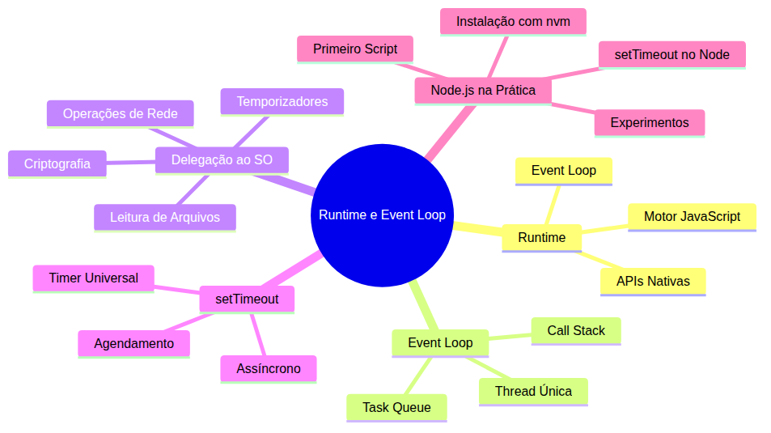
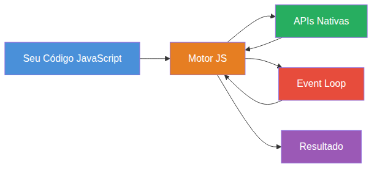
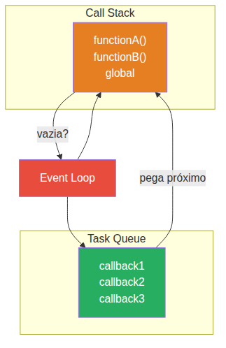
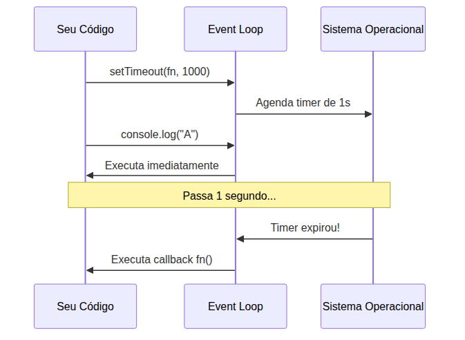
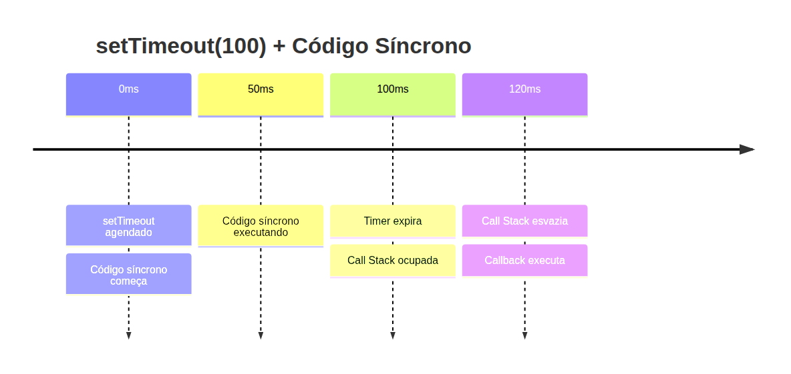
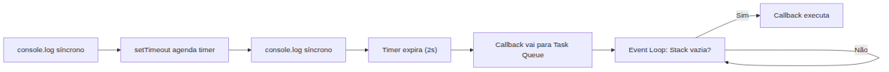

# Node.js — Do Zero ao Servidor Express — Aula 01

## O Que é Node.js? — Runtime, Event Loop e Seu Primeiro Script

**Duração estimada:** 90 minutos (55 de leitura + 35 de prática)
**Nível:** Iniciante
**Pré-requisitos:** JavaScript ES6+ fluente (arrow functions, Promises, async/await, closures), terminal básico, DevTools (F12), HTTP básico (verbos, URLs, status codes)

---

## Objetivos de Aprendizagem

Ao final desta aula, você será capaz de:

- [ ] **Explicar** o que é um runtime JavaScript e seus três componentes fundamentais
- [ ] **Descrever** o papel do event loop no modelo assíncrono de única thread
- [ ] **Distinguir** o que permanece e o que muda quando o JavaScript sai do navegador
- [ ] **Prever** a ordem de execução de código assíncrono com setTimeout
- [ ] **Instalar** o Node.js usando nvm (Linux/macOS) ou nvm-windows
- [ ] **Criar** e executar scripts Node.js no terminal
- [ ] **Demonstrar** o event loop em ação com experimentos práticos
- [ ] **Comparar** setTimeout no navegador e no Node.js
- [ ] **Identificar** operações delegadas ao sistema operacional

---

## Como Usar Esta Aula

Esta aula tem duas partes: a **primeira** constrói fundamentos conceituais; a **segunda** aplica com Node.js. Ao final, as Questões de Aprendizagem trazem tarefas de checkpoint. (55 min leitura + 35 min prática)

---

## Mapa Mental

Este diagrama mostra todos os conceitos que você vai dominar nesta aula:





> *O mapa mental acima mostra a estrutura da aula. Cada ramo representa um conceito que você vai explorar.*
---

**FUNDAMENTOS: Do Navegador ao Runtime**

> *Os conceitos desta seção são universais — valem para qualquer runtime JavaScript, independentemente da ferramenta específica. Na segunda parte, você verá como cada um deles é implementado na prática.*
---

## 1. JavaScript Além do Navegador — A Casa e o Apartamento

Você conhece JavaScript no navegador. Abre o DevTools com F12, escreve `console.log('oi')` no Console, e a mensagem aparece. Usa `fetch()` para buscar dados, `document.querySelector()` para manipular o DOM, `localStorage` para salvar preferências. O navegador é o lar do JavaScript — mas não é o único.

Pense no navegador como uma **casa mobiliada**: você chega e já tem sofá (DOM), cozinha equipada (`fetch`, `localStorage`), garagem (Web Workers), tudo pronto. Agora imagine um **apartamento funcional**: tem o essencial — fogão, geladeira, cama — mas sem os móveis decorativos. É a mesma língua (JavaScript), os mesmos eletrodomésticos básicos, mas sem a mobília do navegador.

O que PERMANECE idêntico quando você sai do navegador? Tudo que é da linguagem JavaScript em si:

| Permanece (a linguagem) | Muda (o ambiente) |
|---|---|
| Sintaxe: `let`, `const`, arrow functions, classes | Sem `window` (não tem janela do navegador) |
| Tipos: string, number, boolean, object, array | Sem `document` (não tem página HTML) |
| Estruturas: `if`, `for`, `while`, `switch` | Sem `localStorage` / `sessionStorage` |
| Funções: closures, callbacks, high-order | Sem `fetch()` nativo (depende de runtime) |
| Promises e async/await | Sem DOM APIs (`querySelector`, `addEventListener`) |
| `console.log()` (existe, mas o destino muda) | Sem `alert()`, `prompt()`, `confirm()` |
| `setTimeout` e `setInterval` | Sem eventos de UI (click, scroll, submit) |
| Objetos globais: `Math`, `Date`, `JSON`, `RegExp` | Sem `history`, `location`, `navigator` |

Perceba o padrão: **tudo que é linguagem JavaScript continua igual**. O que muda são as APIs que o ambiente oferece. O navegador oferece APIs de interação com a página (DOM) e com o usuário. Um runtime standalone oferece APIs de interação com o sistema operacional — arquivos, rede, processos.

Você pode estar pensando: "mas o `console.log` vai pra onde, se não tem DevTools?" Boa pergunta. No navegador, `console.log` exibe no painel Console do DevTools. No terminal, ele exibe na saída padrão (stdout) — o próprio terminal. É o mesmo código, o mesmo comportamento — só muda onde a mensagem aparece.

### Quick Check 1

**1. Você roda JavaScript no navegador e tem acesso a `window` e `document`. Se você rodar o mesmo código em um runtime standalone, o que acontece com `window`?**
**Resposta:** `window` não existe. O runtime standalone não tem o objeto `window` porque não há janela de navegador. Tentar acessá-lo lança um `ReferenceError`.

**2. Cite duas APIs de JavaScript que funcionam IGUAL no navegador e em um runtime standalone.**
**Resposta:** `console.log()` e `setTimeout()`. Ambas fazem parte do núcleo da linguagem e estão disponíveis em qualquer ambiente JavaScript.

---

## 2. O Que é um Runtime? — Motor, APIs e o Ciclo de Vida

Agora que você viu que JavaScript pode viver fora do navegador, a pergunta é: **o que faz esse ambiente funcionar**? A resposta é o **runtime**.

Runtime é o ambiente completo que executa seu código JavaScript. Pense nele como três partes que trabalham juntas:

1. **Motor JavaScript**: o coração — faz o trabalho pesado de ler seu código, traduzi-lo para algo que o computador entende e executá-lo. Ele faz o parsing (entender cada palavra), a compilação JIT (Just-In-Time — traduz para código de máquina na hora) e a execução bytecode a bytecode.
2. **APIs Nativas**: as ferramentas que o ambiente oferece além da linguagem pura — `console`, timers (`setTimeout`, `setInterval`), operações de I/O (entrada e saída), criptografia, compressão.
3. **Event Loop**: o orquestrador — um mecanismo que coordena quando cada parte do seu código executa. É ele que garante que uma operação demorada não "trave" todo o programa.





O fluxo funciona assim: seu código chega ao motor, que o processa. Se o código usa uma API nativa (como `console.log`), o motor conversa com ela. Se o código agenda algo para depois (como `setTimeout`), o event loop entra em ação para gerenciar essa espera. Quando a hora chega, o event loop avisa o motor, que executa o callback.

**Importante**: o runtime não é o motor sozinho, nem as APIs sozinhas — é o SISTEMA completo. É como um carro: o motor é fundamental, mas sem volante (APIs) e sem câmbio (event loop), você não sai do lugar.

### Quick Check 2

**1. Quais são os três componentes de um runtime JavaScript?**
**Resposta:** Motor JavaScript (parsing, compilação JIT, execução), APIs Nativas (console, timers, I/O) e Event Loop (orquestrador assíncrono).

**2. O que acontece com o event loop quando seu código executa uma operação síncrona como `Math.sqrt(144)`?**
**Resposta:** O motor executa diretamente, sem envolver o event loop. O event loop só entra em ação quando há operações assíncronas ou temporizadores.

---

## 3. O Event Loop — O Garçom de Um Fio Só

De todos os três componentes do runtime, o event loop é o mais mal compreendido. E também o mais importante para quem trabalha com JavaScript fora do navegador.

Imagine um restaurante movimentado com **um único garçom**. Esse garçom:
- Anota o pedido da mesa 1 (Call Stack)
- Leva o pedido para a cozinha (delega ao SO)
- Enquanto a cozinha prepara, volta e anota o pedido da mesa 2
- A cozinha terminou o pedido da mesa 1 — ele leva até a mesa (Task Queue → Callback)
- Atende a mesa 3, depois a mesa 4, e assim por diante

O garçom NUNCA fica parado esperando a cozinha. Ele anota, delega, e volta para atender outras mesas. **Isso é o event loop em ação.**

Tecnicamente, o event loop gerencia três estruturas:

1. **Call Stack** (Pilha de Chamadas): onde o motor coloca cada função que está sendo executada. LIFO — Last In, First Out. Quando você chama `functionA()` que chama `functionB()`, a pilha fica: `[global, functionA, functionB]`. Quando `functionB` termina, sai da pilha.

2. **Task Queue** (Fila de Tarefas): onde as operações assíncronas colocam seus callbacks quando terminam. FIFO — First In, First Out. O primeiro callback que chega é o primeiro a ser executado.

3. **Event Loop**: o loop infinito que pergunta sem parar: "A pilha está vazia? Então pegue o primeiro item da fila e execute."





O event loop funciona como um semáforo:
- Call stack não está vazia? Execute o que está no topo.
- Call stack está vazia? Tem algo na task queue? Pegue o primeiro e coloque na stack.
- Nada na stack, nada na fila? Fique em espera — o runtime não morre, só dorme.

**Mão na Massa — Rastreando a Ordem de Execução:**

- [ ] Pegue papel e caneta.
- [ ] Execute mentalmente este código:

```javascript
console.log('A');

setTimeout(() => {
    console.log('B');
}, 0);

console.log('C');
```

- [ ] Escreva a ordem que você espera ver.
- [ ] Agora compare com o gabarito.

**Gabarito:** A ordem de saída é `A`, `C`, `B`. O `console.log('A')` executa imediatamente (síncrono). O `setTimeout(..., 0)` agenda o callback para executar "assim que possível" — ele vai para a Task Queue. O `console.log('C')` executa imediatamente. Só depois, quando a Call Stack estiver vazia, o event loop pega o callback `() => console.log('B')` da fila e executa. Resultado: `A`, `C`, `B`.

Se você acertou, ótimo — você já entende o event loop na prática. Se errou, não se preocupe: a surpresa "A, C, B" é uma das experiências mais marcantes de quem aprende JavaScript assíncrono.

### Quick Check 3

**1. O que a Call Stack faz quando uma função chama outra função?**
**Resposta:** Ela empilha a nova chamada no topo (LIFO). Quando a função filha termina, ela é desempilhada, e a execução volta para a função pai.

**2. O que o event loop verifica para decidir se deve pegar um item da Task Queue?**
**Resposta:** Ele verifica se a Call Stack está vazia. Se estiver, pega o primeiro callback da Task Queue (FIFO) e coloca na Call Stack para execução.

---

## 4. Delegando ao Sistema Operacional — A Cozinha Não É do Garçom

Voltando ao restaurante: o garçom não cozinha. Ele anota o pedido e entrega para a cozinha. Enquanto a cozinha prepara, o garçom continua atendendo outras mesas. **A cozinha é o sistema operacional.**

No runtime, operações demoradas não são executadas pelo motor JavaScript. Elas são **delegadas ao sistema operacional** (SO). O SO faz o trabalho pesado em segundo plano e, quando termina, coloca o callback na Task Queue.

Quais operações são delegadas?

- **Leitura e escrita de arquivos**: ler um arquivo de 1 GB do disco não trava o programa — o SO lê em background.
- **Operações de rede**: fazer uma requisição HTTP, baixar um recurso, conectar a um banco de dados.
- **Temporizadores**: `setTimeout` e `setInterval` — o SO gerencia o relógio e avisa quando o tempo passou.
- **Criptografia**: operações pesadas de hash e criptografia são otimizadas pelo SO.
- **Compressão**: compressão e descompressão de dados.





Perceba a mágica: seu código nunca precisa esperar o SO terminar. Ele agenda a operação, segue em frente, e o callback é chamado quando o SO terminar. Isso é o modelo **non-blocking I/O** (I/O não bloqueante) — a razão pela qual JavaScript consegue lidar com milhares de conexões simultâneas com uma única thread.

**Por que isso é importante?** Porque sem delegação ao SO, seu programa travaria toda vez que lesse um arquivo. O JavaScript é single-thread, mas o SO não é. Cada operação delegada roda em uma thread separada do SO. É como ter mil cozinheiros no restaurante — o garçom é um só, mas a cozinha tem dezenas de profissionais.

### Quick Check 4

**1. Cite três operações que um runtime JavaScript delega ao sistema operacional.**
**Resposta:** Leitura e escrita de arquivos, operações de rede (HTTP, conexões TCP), e temporizadores (setTimeout, setInterval). Ou, alternativamente: criptografia, compressão e DNS lookup.

**2. Por que a delegação ao SO é importante para o modelo de thread única do JavaScript?**
**Resposta:** Porque o JavaScript não precisa esperar a operação terminar — ele delega, segue executando outras coisas, e recebe o resultado depois. Sem isso, uma única leitura de arquivo bloquearia todo o programa.

---

## 5. setTimeout e o Event Loop — O Cronômetro Universal

Você já usou `setTimeout` no navegador. Talvez para atrasar uma animação, simular um loading, ou simplesmente "empurrar" um código para depois do ciclo atual. Agora você vai entender EXATAMENTE o que acontece quando você chama `setTimeout`.

A assinatura é simples:

```javascript
setTimeout(callback, atrasoEmMs)
```

O que muita gente não percebe: **`setTimeout` não executa o callback após exatamente N milissegundos.** Ele diz: "após no mínimo N milissegundos, coloque este callback na Task Queue." A diferença é sutil mas crucial.

O fluxo completo:
1. `setTimeout(fn, 1000)` é chamado
2. O runtime agenda um timer de 1000ms no SO
3. Seu código continua (não bloqueia)
4. Após 1000ms, o SO avisa: "timer expirou"
5. O runtime coloca `fn` na Task Queue
6. O event loop espera a Call Stack esvaziar
7. Quando a stack está vazia, o event loop pega `fn` da fila e executa

O detalhe importante: **o passo 6 pode demorar**. Se a Call Stack nunca esvaziar (loop infinito), o callback nunca executa. Se a Call Stack demorar 3 segundos para esvaziar, o callback que deveria rodar em 1 segundo vai rodar em 4 segundos.





O caso `setTimeout(fn, 0)` é famoso. Ele diz: "execute esse callback assim que possível, mas não agora." O `0` significa "atraso mínimo zero" — o callback vai para o final da fila, depois de tudo que está na Call Stack.

**Mão na Massa — Previsão de Saída:**

- [ ] Sem executar, determine a saída deste código:

```javascript
console.log('Início');

setTimeout(() => {
    console.log('Meio');
}, 0);

console.log('Fim');

setTimeout(() => {
    console.log('Depois');
}, 10);
```

- [ ] Escreva a sequência completa que aparecerá no console.
- [ ] Explique por que `setTimeout(0)` não imprime antes de "Fim".

**Gabarito:** `Início`, `Fim`, `Meio`, `Depois`. `Início` e `Fim` são síncronos — executam imediatamente. O `setTimeout(0)` agenda o callback "Meio" com delay mínimo. O `setTimeout(10)` agenda o callback "Depois" para ~10ms. Ambos vão para a Task Queue. O "Meio" chega primeiro (delay 0 vs 10), então executa primeiro quando a stack esvazia. O `setTimeout(0)` não executa antes de "Fim" porque "Fim" é síncrono e está na Call Stack — o callback só sai da fila quando a stack esvaziar.

### Quick Check 5

**1. O que `setTimeout(fn, 100)` garante sobre quando `fn` será executado?**
**Resposta:** Garante que `fn` será executado APÓS no mínimo 100ms — não exatamente em 100ms. O tempo exato depende de quando a Call Stack esvaziar após o timer expirar.

**2. Se a Call Stack nunca esvaziar (loop infinito), o que acontece com um callback agendado com setTimeout?**
**Resposta:** Ele nunca será executado. O event loop só move itens da Task Queue para a Call Stack quando a pilha está vazia. Com loop infinito, a pilha nunca esvazia.

---

**APLICAÇÃO: Node.js na Prática**

> *Agora que você entende o que é um runtime e como o event loop funciona, vamos materializar esses conceitos: instalar o Node.js, escrever seu primeiro script e ver o event loop em ação no terminal.*
---

## 6. Instalando o Node.js com nvm

> *O Node.js implementa a delegação de I/O através da biblioteca libuv, que abstrai chamadas ao sistema operacional de forma multiplataforma — gerenciando arquivos, rede, timers e criptografia em background.*

Você poderia baixar o instalador do site oficial do Node.js. Mas existe uma ferramenta muito melhor: o **nvm** (Node Version Manager).

Por que usar nvm em vez do instalador?
- **Isola versões**: você pode ter Node.js 18, 20 e 22 instalados e alternar entre eles com um comando.
- **`.nvmrc`**: cada projeto pode declarar qual versão do Node.js precisa.
- **Testar versões**: quer testar se seu código funciona na versão 18 e na 20? `nvm use 18` e `nvm use 20`.
- **Sem sudo**: instala na home do usuário, sem precisar de permissões administrativas.

### Instalação no Linux/macOS

Abra o terminal e execute:

```bash
curl -o- https://raw.githubusercontent.com/nvm-sh/nvm/v0.39.7/install.sh | bash
```

Depois de instalar, feche e reabra o terminal, ou execute:

```bash
source ~/.bashrc
```

Verifique se funcionou:

```bash
nvm --version
```

### Instalação no Windows

No Windows, use o **nvm-windows**. Baixe o instalador em [github.com/coreybutler/nvm-windows/releases](https://github.com/coreybutler/nvm-windows/releases) e execute. Após instalar, abra um novo terminal (PowerShell ou Command Prompt) e verifique:

```bash
nvm --version
```

### Comandos Essenciais do nvm

| Comando | O que faz |
|---|---|
| `nvm install --lts` | Instala a versão LTS mais recente do Node.js |
| `nvm use --lts` | Usa a versão LTS instalada |
| `nvm ls` | Lista todas as versões instaladas |
| `node --version` | Mostra a versão atual do Node.js em uso |

### Quick Check 6

**1. Qual a vantagem de usar nvm em vez do instalador do site oficial?**
**Resposta:** O nvm permite gerenciar múltiplas versões do Node.js (instalar, alternar, testar) sem precisar de permissão sudo. Cada projeto pode usar sua própria versão via `.nvmrc`.

**2. Qual comando instala a versão LTS mais recente do Node.js?**
**Resposta:** `nvm install --lts`

**Mão na Massa 1 — Instalar Node.js com nvm:**

- [ ] Linux/macOS: execute `curl -o- https://raw.githubusercontent.com/nvm-sh/nvm/v0.39.7/install.sh | bash` e depois `source ~/.bashrc`.
- [ ] Windows: baixe o instalador do nvm-windows e execute.
- [ ] Execute `nvm install --lts` para instalar a versão LTS.
- [ ] Execute `nvm use --lts` para ativar a versão LTS.
- [ ] Execute `node --version` e confirme que vê algo como `v20.14.0` (o número exato varia).

**Verificação:** O comando `node --version` retorna uma string no formato `v20.x.x` sem erros. Se aparecer "command not found", o nvm não foi instalado corretamente.

---

## 7. Seu Primeiro Script — `node script.js`

Crie um arquivo chamado `ola-mundo.js` no seu editor favorito e escreva:

```javascript
console.log('Olá, Node.js!');
console.log('Estou rodando JavaScript no terminal!');
console.log('A versão do JavaScript é:', 'ES6+');
console.log(1 + 1);
console.log(['um', 'dois', 'três'].join(' - '));
```

Salve o arquivo e execute no terminal:

```bash
node ola-mundo.js
```

A saída aparece diretamente no terminal:

```
Olá, Node.js!
Estou rodando JavaScript no terminal!
A versão do JavaScript é: ES6+
2
um - dois - três
```

Percebeu a diferença? No navegador, você digita no Console do DevTools. Aqui, o terminal é o seu console. Toda a saída vai para o **stdout** (saída padrão) do terminal.

**Terminal vs DevTools:**

| DevTools Console | Terminal (Node.js) |
|---|---|
| Ambiente interativo com auto-complete | Texto puro — só vê o que foi impresso |
| Objetos são inspecionáveis (expandir propriedades) | Objetos são serializados como string |
| Histórico de comandos por sessão | Histórico do shell |
| Console.clear() limpa o painel | Limpa a tela do terminal |

### Quick Check 7

**1. Qual comando você usa para executar um arquivo JavaScript com Node.js?**
**Resposta:** `node nome-do-arquivo.js`

**2. No Node.js, para onde vai a saída de `console.log`?**
**Resposta:** Para o stdout (saída padrão) do terminal — exatamente o que você vê no terminal após executar o comando.

**Mão na Massa 2 — Seu Primeiro Script:**

- [ ] Crie um arquivo `ola-mundo.js` com 4 a 5 `console.log` variados (pelo menos: uma string, um número, um array e um objeto).
- [ ] Execute com `node ola-mundo.js`.
- [ ] Modifique um `console.log` para incluir a data atual: `console.log('Data:', new Date())`.
- [ ] Execute novamente.

**Verificação:** Cada execução imprime a saída no terminal. Objetos aparecem como `{ chave: valor }` e arrays como `[1, 2, 3]`.

---

## 8. setTimeout no Node.js — O Mesmo Código, Outro Runtime

Agora o momento da verdade: `setTimeout` funciona no Node.js exatamente como no navegador. A mesma sintaxe, a mesma semântica, a mesma interação com o event loop.

Crie `timer-exemplo.js`:

```javascript
console.log('Vou agendar um timer...');

setTimeout(() => {
    console.log('2 segundos se passaram!');
}, 2000);

console.log('Timer agendado. Enquanto isso, este log executa.');
console.log('O programa não travou esperando os 2 segundos.');
```

Execute:

```bash
node timer-exemplo.js
```

Saída:

```
Vou agendar um timer...
Timer agendado. Enquanto isso, este log executa.
O programa não travou esperando os 2 segundos.
2 segundos se passaram!
```

Exatamente como no navegador: os `console.log` síncronos executam imediatamente, e o callback do setTimeout executa depois — quando o timer expira e a Call Stack esvazia.





### Quick Check 8

**1. O comportamento do `setTimeout` no Node.js é igual ou diferente do navegador?**
**Resposta:** Igual. Mesma sintaxe, mesma semântica: agenda o callback para executar após no mínimo N milissegundos, sem bloquear a execução do código seguinte.

**2. O que acontece se você definir `setTimeout(fn, 0)` no Node.js?**
**Resposta:** O callback é agendado para executar "assim que possível", após todo o código síncrono atual terminar. Ele vai para a Task Queue e executa quando a Call Stack esvaziar.

**Mão na Massa 3 — setTimeout no Node.js:**

- [ ] Crie `timer-dupla.js` com dois setTimeout de durações diferentes (ex: 1s e 3s).
- [ ] Adicione `console.log` antes, entre e depois dos setTimeout.
- [ ] Execute e observe a ordem.
- [ ] Troque as durações (o timer de 3s vira 1s e vice-versa) e execute novamente.

**Verificação:** A ordem dos `console.log` síncronos é sempre imediata. Os callbacks dos setTimeout aparecem depois, na ordem em que os timers expiram (menor delay primeiro).

---

## 9. O Event Loop em Ação — Provando que a Teoria Funciona

Você já leu sobre o event loop. Já fez exercícios de papel. Agora é hora de ver com seus próprios olhos.

### Experimento 1: A Ordem Clássica

Crie `event-loop-1.js`:

```javascript
console.log(1);

setTimeout(() => {
    console.log(2);
}, 0);

setTimeout(() => {
    console.log(3);
}, 0);

console.log(4);
```

**Pergunta: qual a saída?** Antes de executar, escreva sua previsão.

Execute:

```bash
node event-loop-1.js
```

Saída:

```
1
4
2
3
```

A explicação passo a passo:
1. `console.log(1)` — síncrono, executa imediatamente. Call Stack: `[global, console.log(1)]`.
2. `setTimeout(() => console.log(2), 0)` — agenda o callback. Call Stack: `[global, setTimeout]`. O callback vai para o SO (timer de 0ms), que coloca na Task Queue.
3. `setTimeout(() => console.log(3), 0)` — agenda o callback. Call Stack: `[global, setTimeout]`. Segue o mesmo fluxo.
4. `console.log(4)` — síncrono, executa imediatamente. Call Stack: `[global, console.log(4)]`.
5. Call Stack esvazia. Event loop verifica a Task Queue: tem dois callbacks. O primeiro a chegar foi o `console.log(2)`. Executa. Depois `console.log(3)`.
6. Resultado: `1, 4, 2, 3`.

A Task Queue é FIFO (First In, First Out). O `console.log(2)` entrou primeiro na fila (foi agendado primeiro), então sai primeiro.

### Experimento 2: setTimeout Aninhado

Crie `event-loop-2.js`:

```javascript
console.log('A');

setTimeout(() => {
    console.log('B');
    setTimeout(() => {
        console.log('C');
    }, 0);
    console.log('D');
}, 0);

console.log('E');
```

Preveja a saída antes de executar. Depois execute com `node event-loop-2.js`.

**Gabarito:** `A`, `E`, `B`, `D`, `C`.
- `A` e `E` são síncronos — executam primeiro.
- O primeiro setTimeout agendado (`B`, `D`, e o setTimeout interno) chega na Task Queue.
- Quando a Call Stack esvazia, o callback externo executa: `B`, `D` (síncronos), e o setTimeout interno vai para a Task Queue.
- Quando o callback externo termina, a Call Stack esvazia, e o setTimeout interno (`C`) executa.

### Experimento 3: setTimeout(0) vs setTimeout(100)

Crie `event-loop-3.js`:

```javascript
console.log('Rápido');

setTimeout(() => console.log('Devagar'), 100);
setTimeout(() => console.log('Rápido também'), 0);

console.log('Sincrono');
```

Preveja e execute. A saída é: `Rápido`, `Sincrono`, `Rápido também`, `Devagar`.

O `setTimeout(0)` sempre vence o `setTimeout(100)` porque o timer de 0ms expira quase instantaneamente, enquanto o de 100ms precisa esperar.

### Quick Check 9

**1. Por que no Experimento 1 a saída é 1, 4, 2, 3 e não 1, 2, 3, 4?**
**Resposta:** Porque `console.log(1)` e `console.log(4)` são síncronos — executam imediatamente. Os `setTimeout(0)` apenas agendam callbacks para a Task Queue, que só são executados quando a Call Stack esvaziar.

**2. Se você colocar um loop de 5 segundos entre os `console.log`, o que acontece com os callbacks do setTimeout?**
**Resposta:** Os timers expiram durante o loop (o SO conta o tempo independentemente), mas os callbacks ficam na Task Queue esperando. O loop bloqueia a Call Stack. Quando o loop termina e a stack esvazia, todos os callbacks acumulados executam em sequência, um após o outro.

**Mão na Massa 4 — Prever e Comparar:**

- [ ] Crie `event-loop-desafio.js` com este código:

```javascript
console.log('X');

setTimeout(() => {
    console.log('Y');
    setTimeout(() => console.log('Z'), 50);
}, 100);

setTimeout(() => console.log('W'), 0);

console.log('V');
```

- [ ] Sem executar, crie uma tabela no papel: coluna A (ordem prevista), coluna B (ordem observada após executar).
- [ ] Execute e compare.
- [ ] Se errou algum, rastreie no papel qual callback foi agendado quando e por que entrou na fila naquela ordem.

**Gabarito:** `X`, `V`, `W`, `Y`, `Z`.
- `X` e `V`: síncronos.
- `W`: setTimeout(0) — vai para a fila quase que imediatamente, mas só depois dos síncronos.
- `Y`: setTimeout(100) — leva 100ms para expirar. Nesse tempo, `W` já está na fila.
- `Z`: setTimeout(50) dentro do callback de `Y` — só é agendado QUANDO `Y` executar, então leva mais 50ms.

---

## Autoavaliação: Quiz Rápido

**1. O que é um runtime JavaScript?**
**Resposta:** É o ambiente completo que executa código JavaScript, composto por três partes: motor JavaScript (parseia, compila, executa), APIs nativas (console, timers, I/O) e event loop (orquestrador assíncrono).

**2. Qual a diferença entre o que JavaScript PERDE e o que MANTÉM ao sair do navegador?**
**Resposta:** Mantém toda a sintaxe e tipos da linguagem (arrow functions, Promises, closures, etc.). Perde APIs do navegador: `window`, `document`, `localStorage`, `fetch`, DOM APIs.

**3. Explique a analogia do garçom para o event loop.**
**Resposta:** O garçom (event loop) é um atendente de thread única que anota pedidos (Call Stack), delega à cozinha (sistema operacional), e enquanto a cozinha prepara, atende outras mesas. Quando o pedido fica pronto (callback na Task Queue), o garçom leva à mesa.

**4. Qual a saída de `setTimeout(() => console.log('A'), 0); console.log('B');`?**
**Resposta:** `B`, `A`. O `console.log('B')` é síncrono e executa imediatamente. O callback do setTimeout(0) vai para a Task Queue e executa depois que a Call Stack esvaziar.

**5. Por que usar nvm em vez do instalador do site oficial do Node.js?**
**Resposta:** O nvm permite gerenciar múltiplas versões do Node.js, alternar entre elas com um comando, ter um `.nvmrc` por projeto, e não precisa de permissão sudo.

**6. O que o Node.js faz com a saída de `console.log`?**
**Resposta:** Envia para o stdout (saída padrão) do terminal, que exibe o texto diretamente no shell.

---

## Mão na Massa 5: Exercícios Graduados

**Exercício 1 (Fácil) — Script de Identidade**

Crie um arquivo `identidade.js` que imprime:
- Seu nome
- Sua linguagem de programação favorita
- O comando que você usou para executar o script (em uma string)
- A data e hora atual (use `new Date()`)

Execute e confirme que tudo aparece no terminal.

**Gabarito:**

```javascript
// identidade.js
console.log('Nome: Maria Silva');
console.log('Linguagem favorita: JavaScript');
console.log('Comando: node identidade.js');
console.log('Data/Hora:', new Date());
```

Execute com `node identidade.js` e veja a saída no terminal.

---

**Exercício 2 (Médio) — Contagem Regressiva com setTimeout**

Crie `contagem.js` que imprime uma contagem regressiva de 5 a 1, com um segundo de intervalo entre cada número, e depois imprime "Fogo!".

Dica: use setTimeout com delays crescentes (1s, 2s, 3s, 4s, 5s). Não use `setInterval` nem loops com setTimeout — cada chamada é manual.

**Gabarito:**

```javascript
// contagem.js
console.log('5');

setTimeout(() => {
    console.log('4');
}, 1000);

setTimeout(() => {
    console.log('3');
}, 2000);

setTimeout(() => {
    console.log('2');
}, 3000);

setTimeout(() => {
    console.log('1');
}, 4000);

setTimeout(() => {
    console.log('Fogo!');
}, 5000);
```

Saída esperada: `5` (imediato), `4` (após 1s), `3` (após 2s), `2` (após 3s), `1` (após 4s), `Fogo!` (após 5s).

---

**Desafio (Difícil) — Detetive do Event Loop**

Sem executar no Node.js, determine a saída EXATA deste código:

```javascript
console.log('Início');

setTimeout(() => {
    console.log('A');
    setTimeout(() => console.log('B'), 20);
}, 30);

setTimeout(() => {
    console.log('C');
    setTimeout(() => console.log('D'), 0);
}, 10);

setTimeout(() => console.log('E'), 0);

for (let i = 0; i < 1000000000; i++) {
    // Loop bloqueante - apenas para consumir tempo
}

console.log('Fim');
```

Depois de prever, crie o arquivo e execute para verificar. Se errou, escreva abaixo a sequência de eventos (quando cada timer expira, quando cada callback entra na fila).

**Gabarito:**

A saída é: `Início`, `Fim`, `E`, `C`, `D`, `A`, `B`.

Explicação detalhada:
1. `Início` e `Fim` são síncronos — executam imediatamente (antes e depois do loop).
2. O loop bloqueante de 1 bilhão de iterações leva cerca de 500ms-2s (depende do hardware). DURANTE esse loop, todos os timers expiram: `E` (0ms), `C` (10ms), `A` (30ms). `B` (20ms após `A` execução) e `D` (0ms após `C`) ainda não foram agendados.
3. Quando o loop termina e a Call Stack esvazia, a Task Queue tem: `E`, `C`, `A` (nesta ordem FIFO).
4. Executa `E` (setTimeout 0ms).
5. Executa `C`: imprime `C` e agenda `D` com setTimeout(0). `D` vai para a Task Queue.
6. Call Stack esvazia. Task Queue tem: `A`, `D`. Executa `A`.
7. Executa `A`: imprime `A` e agenda `B` com setTimeout(20). O timer de 20ms começa agora.
8. Call Stack esvazia. Task Queue tem: `D`, e depois `B` (após 20ms).
9. Executa `D` (já está na fila).
10. Após 20ms, `B` entra na fila e executa.

Resultado final: `Início`, `Fim`, `E`, `C`, `D`, `A`, `B`.

---

## Resumo da Aula

### Os 5 Conceitos Fundamentais

1. **Runtime**: ambiente completo que executa JavaScript — motor (parsing e execução), APIs nativas (ferramentas do ambiente) e event loop (orquestrador assíncrono). Tudo que não é navegador é runtime.

2. **Event Loop**: mecanismo de thread única que gerencia a Call Stack (funções sendo executadas agora) e a Task Queue (callbacks esperando). O loop infinito pergunta: "stack está vazia? então executa o próximo da fila."

3. **setTimeout como ferramenta didática**: `setTimeout(callback, N)` agenda o callback para, no mínimo, N milissegundos. É a ferramenta mais simples para visualizar o event loop em ação.

4. **Delegação ao SO**: JavaScript não faz I/O sozinho — delega ao sistema operacional. O SO gerencia arquivos, rede, timers e criptografia em background, e coloca o resultado na Task Queue quando termina.

5. **Node.js como runtime concreto**: você instalou com nvm, escreveu scripts com `node script.js`, e comprovou que `console.log` e `setTimeout` funcionam exatamente como no navegador — a mesma linguagem, outro ambiente.

### O Que Você Construiu Hoje

- [x] Instalou o Node.js com nvm e verificou a versão
- [x] Criou e executou seu primeiro script Node.js no terminal
- [x] Experimentou setTimeout com diferentes durações
- [x] Previu e verificou a ordem de execução do event loop em 3 experimentos
- [x] Concluiu o desafio do event loop com loop bloqueante

---

## Próxima Aula

**Aula 02: npm e Gerenciamento de Pacotes — Do Zero ao Primeiro Projeto**

Você instalou o Node.js. Agora vai descobrir o ecossistema de pacotes que faz do Node.js uma plataforma tão poderosa. Vai aprender a criar projetos com `npm init`, instalar dependências, entender o `package.json` e dominar os comandos essenciais do npm.

---

## Referências

### Documentação Oficial

- [Node.js Official Docs](https://nodejs.org/en/docs/) — documentação oficial do Node.js
- [nvm-sh/nvm](https://github.com/nvm-sh/nvm) — repositório oficial do nvm

### Ferramentas

- [nvm-windows](https://github.com/coreybutler/nvm-windows) — gerenciador de versões do Node.js para Windows

### Vídeos Recomendados

- [What the heck is the event loop anyway?](https://www.youtube.com/watch?v=8aGhZQkoFbQ) — palma do Jake Archibald sobre event loop no navegador (~28 min)

### Artigos para Aprofundamento

- [Node.js Event Loop](https://nodejs.org/en/docs/guides/event-loop-timers-and-nexttick/) — guia oficial do Node.js sobre o event loop

---

## FAQ

**P: Posso acessar o sistema de arquivos no Node.js como acesso o localStorage no navegador?**
R: Sim, mas de forma diferente. O Node.js tem o módulo `fs` (file system) para ler e escrever arquivos. É mais poderoso que o `localStorage`, que só guarda strings no navegador. Você verá o módulo `fs` na Aula 04.

**P: O Node.js substitui o navegador?**
R: Não. São ambientes diferentes com propósitos diferentes. O navegador é para interfaces com o usuário (DOM, CSS, eventos de UI). O Node.js é para serviços backend, ferramentas de linha de comando e automação.

**P: O event loop do Node.js é igual ao do navegador?**
R: Muito parecido, mas não idêntico. Ambos têm Call Stack, Task Queue e event loop. O Node.js adiciona algumas fases extras (como `setImmediate`, `process.nextTick`, I/O polling) que você verá em aulas futuras. O conceito fundamental é o mesmo.

**P: Por que meu `setTimeout(fn, 0)` às vezes demora mais que zero para executar?**
R: O `0` significa "atraso mínimo zero", não "execução instantânea". O callback sempre espera a Call Stack esvaziar. Se houver código síncrono demorado, o callback espera.

**P: Preciso instalar o nvm ou posso usar o instalador do site?**
R: Pode usar o instalador do site. O nvm é recomendado para gerenciar múltiplas versões, mas o instalador funciona perfeitamente para começar. Se optar pelo instalador, baixe a versão LTS em [nodejs.org](https://nodejs.org/).

**P: O que acontece se eu chamar `window` ou `document` no Node.js?**
R: Gera um `ReferenceError: window is not defined`. Como vimos na Seção 1, esses objetos não existem fora do navegador.

**P: O Node.js entende TypeScript?**
R: Não nativamente. Node.js executa JavaScript, não TypeScript. Para rodar TypeScript, você precisa de um compilador (como `tsc`) ou de uma ferramenta como `ts-node` que faz a transpilação em tempo real. Isso é assunto para um módulo avançado.

**P: Meu código com setTimeout assíncrono parece mais lento que o síncrono. É normal?**
R: Sim. Operações assíncronas têm overhead (agendar, esperar, executar callback). O ganho do assíncrono não é velocidade — é a capacidade de não bloquear. Para uma única operação, síncrono é mais rápido. Para mil operações simultâneas, assíncrono ganha.

---

## Glossário

| Termo | Definição |
|---|---|
| **Runtime** | Ambiente completo que executa JavaScript: motor + APIs nativas + event loop. (Ver seção 2) |
| **Motor JavaScript** | Componente que parseia, compila (JIT) e executa o código JavaScript. (Ver seção 2) |
| **Event Loop** | Mecanismo de thread única que orquestra a execução de código síncrono e assíncrono. (Ver seção 3) |
| **Call Stack** | Pilha LIFO que armazena as funções em execução no momento. (Ver seção 3) |
| **Task Queue** | Fila FIFO que armazena callbacks de operações assíncronas prontos para executar. (Ver seção 3) |
| **Non-blocking I/O** | Modelo onde operações de I/O não bloqueiam a execução — são delegadas ao SO. (Ver seção 4) |
| **Single Thread** | Modelo de execução onde uma única thread processa todo o código JavaScript. (Ver seção 3) |
| **nvm** | Node Version Manager — ferramenta para gerenciar múltiplas versões do Node.js. (Ver seção 6) |
| **LTS** | Long Term Support — versão do Node.js com suporte estendido, recomendada para produção. (Ver seção 6) |
| **stdout** | Saída padrão do terminal — para onde `console.log` envia mensagens no Node.js. (Ver seção 7) |
| **Callback** | Função passada como argumento para ser executada após uma operação assíncrona. (Ver seção 3) |
| **FIFO** | First In, First Out — princípio da Task Queue: o primeiro a entrar é o primeiro a sair. (Ver seção 9) |
