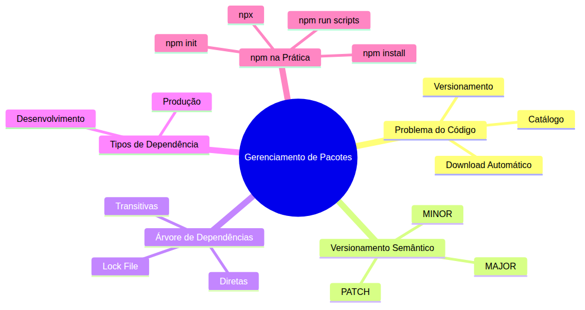
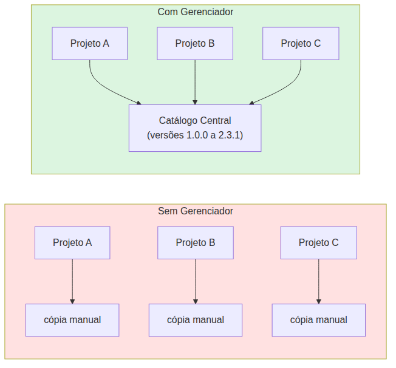
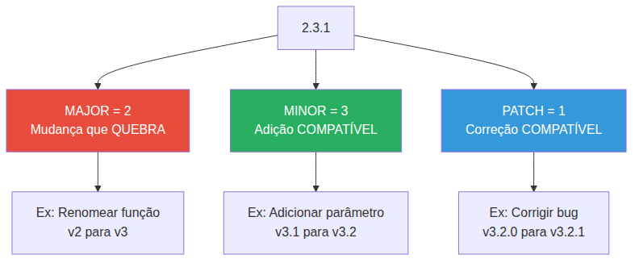
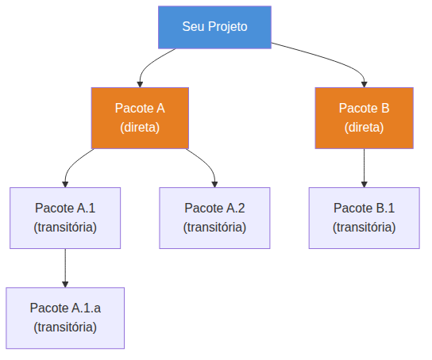
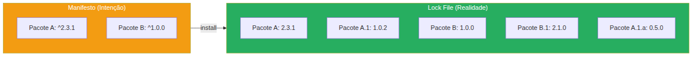
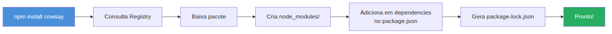
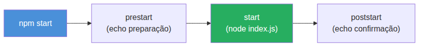

# Node.js — Do Zero ao Servidor Express — Aula 02

## npm e Gerenciamento de Pacotes — Do Zero ao Primeiro Projeto

**Duração estimada:** 90 minutos (55 de leitura + 35 de prática)
**Nível:** Iniciante
**Pré-requisitos:** Aula 01 concluída — Node.js instalado, saber executar `node script.js`, entender event loop e setTimeout

---

## Objetivos de Aprendizagem

Ao final desta aula, você será capaz de:

- [ ] **Explicar** o problema que um gerenciador de pacotes resolve
- [ ] **Interpretar** versões no formato SemVer (MAJOR.MINOR.PATCH)
- [ ] **Distinguir** dependências diretas de transitórias
- [ ] **Diferenciar** dependências de produção de dependências de desenvolvimento
- [ ] **Criar** um projeto Node.js com `npm init`
- [ ] **Instalar** pacotes com `npm install` e entender o que acontece
- [ ] **Configurar** scripts no package.json com `npm run`
- [ ] **Executar** pacotes sem instalá-los com `npx`
- [ ] **Versionar** corretamente (o que incluir e o que ignorar no git)
- [ ] **Construir** o projeto `gerenciador-tarefas/` com package.json, scripts e dependências

---

## Como Usar Esta Aula

Esta aula está organizada em duas partes. A **primeira parte** constrói os fundamentos conceituais — o problema do código compartilhado, versionamento semântico e a árvore de dependências, sem depender de nenhuma ferramenta específica. A **segunda parte** aplica esses conceitos com npm: init, install, scripts e npx. Ao final, o arquivo separado de Questões de Aprendizagem traz as tarefas de checkpoint.

**Tempo estimado:** 55 minutos de leitura + 35 minutos de prática.

---

## Mapa Mental

Este diagrama mostra todos os conceitos que você vai dominar nesta aula:





> *O mapa mental acima mostra a estrutura da aula. Cada ramo representa um conceito que você vai explorar.*

---

## Recapitulação da Aula 01

| Aula | Conceito | Onde aparece nesta aula | Como se conecta |
|---|---|---|---|
| Aula 01 | **Runtime** (Seção 2) | Seções 5-6 | npm faz parte do ecossistema que roda sobre o runtime Node.js |
| Aula 01 | **Event Loop** (Seção 3) | Seção 8 | `npm run` dispara processos que interagem com o event loop |
| Aula 01 | **node script.js** (Seção 7) | Seções 5-9 | Scripts no package.json são atalhos para `node ...` |
| Aula 01 | **nvm** (Seção 6) | Seção 5 | npm já vem instalado com Node.js via nvm |

---

**FUNDAMENTOS: Mecanismos Universais de Gerenciamento de Pacotes**

> *Os conceitos desta seção são universais — valem para qualquer ecossistema de código, independentemente da linguagem ou ferramenta específica. Na segunda parte, você verá como um gerenciador de pacotes implementa cada um deles na prática.*

---

## 1. O Problema do Código Compartilhado

Você já fez isso: escreveu uma função útil — um validador de email, um formatador de data — e quis usá-la em outro projeto. A primeira solução que vem à mente é copiar e colar. Funciona, mas logo aparecem os problemas.

Pense em três projetos seus que usam a mesma função de formatar data. Você copia a função para cada um. Depois descobre um bug no formato: em vez de "31/12/2024", deveria ser "2024-12-31". Agora você precisa lembrar **quais** projetos têm a cópia, **onde** está cada cópia, e corrigir todas. E se um projeto ficou de fora? Bugs silenciosos.

Esse é o cenário **sem** um gerenciador de pacotes. O código útil está solto, espalhado, sem versão, sem rastreabilidade.

**E com um gerenciador?** Você publica a função uma vez em um catálogo central. Cada projeto declara: "preciso da função de formatar data, versão 2.3.1". O gerenciador baixa automaticamente, instala na pasta correta e mantém o registro. Descobriu um bug? Corrige, publica a versão 2.3.2, e cada projeto atualiza com um comando.





O que um gerenciador de pacotes faz, em resumo:

- **Catálogo**: um repositório central onde os pacotes são publicados e descobertos
- **Download**: baixa o pacote e suas dependências automaticamente
- **Versionamento**: cada pacote tem versões numeradas — você escolhe qual usar
- **Resolução**: descobre quais versões de cada dependência são compatíveis entre si
- **Instalação local**: coloca os arquivos em uma pasta separada do seu código

Você pode estar pensando: "mas eu já faço isso com links simbólicos ou copiando pastas". Exato — você já sentiu a *dor* que o gerenciador resolve. A diferença é que ele faz isso de forma padronizada, automática e confiável. Você não precisa gerenciar manualmente as versões de cada dependência.

### Quick Check 1

**1. Quais são os dois problemas principais de copiar código manualmente entre projetos?**
**Resposta:** Inconsistência de versões (cada cópia pode divergir) e retrabalho para corrigir bugs em todas as cópias. Você nunca tem certeza de qual projeto está com a versão mais recente.

**2. Cite três responsabilidades de um gerenciador de pacotes.**
**Resposta:** Catálogo central (descobrir pacotes), download automático (baixar o código), versionamento (gerenciar versões compatíveis).

---

## 2. Versionamento Semântico — MAJOR.MINOR.PATCH

Todo pacote em um gerenciador tem um número de versão. Mas não é qualquer número — existe uma convenção chamada **Versionamento Semântico** (SemVer), que segue o formato `MAJOR.MINOR.PATCH`.





Cada número tem um significado:

- **MAJOR** (major): muda quando você faz alterações **incompatíveis** com versões anteriores. Se seu pacote estava na versão 1.x.x e você remove uma função que existia, vai para 2.0.0. Quem usa seu pacote PRECISA mudar o código.
- **MINOR** (minor): muda quando você **adiciona** funcionalidade sem quebrar nada. De 2.3.1 para 2.4.0. Quem usa seu pacote pode atualizar sem medo.
- **PATCH** (patch): muda quando você **corrige bugs** sem adicionar nem quebrar nada. De 2.3.1 para 2.3.2. Atualização segura.

**Analogia do livro:** Pense em um livro técnico. Uma nova **edição** (MAJOR) reescreve capítulos inteiros — você precisa reler. Um novo **capítulo** (MINOR) adiciona conteúdo sem mexer no resto. Uma **errata** (PATCH) corrige um erro de digitação — só atualiza o que estava errado.

### Como expressar "qual versão eu aceito"

Quando você declara que precisa de um pacote, pode ser flexível sobre a versão exata:

| Notação | Significado | Exemplo |
|---|---|---|
| `2.3.1` | Exatamente esta versão | Só aceita 2.3.1 |
| `^2.3.1` | Compatível com MAJOR | 2.3.1 até 2.x.x (último) |
| `~2.3.1` | Só PATCH | 2.3.1 até 2.3.x (último) |
| `*` | Qualquer versão | Qualquer MAJOR.MINOR.PATCH |

O **circunflexo (\`^\`)** é o mais comum. `^2.3.1` significa: "aceito qualquer versão a partir da 2.3.1, desde que não mude o MAJOR". Ou seja, 2.4.0, 2.5.0, 2.10.0 — tudo ok. 3.0.0 — não ok.

O **til (`~`)** é mais restrito: `~2.3.1` significa "só versões entre 2.3.1 e 2.3.x". 2.3.2 ok, 2.4.0 não.

**Caso especial: versões 0.x.y** — quando o MAJOR é zero, o pacote é considerado **experimental**. Qualquer versão 0.x pode quebrar a qualquer momento, mesmo em MINOR ou PATCH. É o aviso: "isso ainda não está estável".

### Quick Check 2

**1. Se um pacote vai de 2.5.0 para 3.0.0, o que mudou?**
**Resposta:** Houve uma mudança MAJOR — algo foi alterado de forma incompatível com a versão 2.x. Quem usa o pacote precisa verificar se o código continua funcionando.

**2. Qual a diferença entre `^1.2.0` e `~1.2.0`?**
**Resposta:** `^1.2.0` aceita qualquer versão 1.x.x a partir de 1.2.0 (1.3.0, 1.10.0). `~1.2.0` aceita apenas correções dentro do 1.2.x (1.2.1, 1.2.5), sem subir o MINOR.

---

## 3. A Árvore de Dependências — Diretas e Transitórias

Quando seu projeto usa um pacote, ele raramente vem sozinho. Esse pacote pode depender de outros pacotes, que dependem de outros, e assim por diante. Isso é a **árvore de dependências**.

- **Dependência direta**: o pacote que você explicitamente escolheu instalar.
- **Dependência transitória** (ou indireta): um pacote que sua dependência direta precisa para funcionar.

**Analogia da pizza:** Você pede uma pizza (sua dependência direta). A pizzaria usa caixa de papelão, guardanapos e um adesivo de brinde (dependências transitórias). Você não pediu cada item separadamente — eles vieram porque a pizza precisa deles para ser entregue.





Percebeu? Instalar dois pacotes pode baixar dezenas. É a árvore crescendo.

### Manifesto vs Lock File — Intenção vs Realidade

Aqui estão dois conceitos que parecem a mesma coisa, mas não são:

- **Manifesto** (arquivo de intenção): declara **o que** você quer. "Meu projeto precisa do Pacote A na versão `^2.3.1`" — ou seja, qualquer versão 2.x compatível. É a sua *intenção*.
- **Lock file** (arquivo de trava): registra **exatamente o que** foi instalado. "Na última vez que instalei, o Pacote A baixou a versão exata 2.3.1, o Pacote A.1 baixou 1.0.2, etc." É a *realidade* congelada.





O manifesto diz o que você *quer*; o lock file diz o que *tem*. Se outro desenvolvedor executar a instalação no seu projeto, o lock file garante que ele instale EXATAMENTE as mesmas versões que você — evitando o temido "na minha máquina funciona".

### Quick Check 3

**1. Qual a diferença entre uma dependência direta e uma transitória?**
**Resposta:** A dependência direta é o pacote que você escolhe instalar. A transitória é um pacote que sua dependência direta precisa — você não escolheu, mas veio junto.

**2. Por que o lock file é importante?**
**Resposta:** Ele garante que todos os desenvolvedores e ambientes (produção, testes) instalem exatamente as mesmas versões de todas as dependências, evitando inconsistências causadas por versões diferentes.

---

## 4. Tipos de Dependências e Automação

Nem todo pacote que você instala vai para produção. Alguns são ferramentas que só fazem sentido durante o desenvolvimento.

### Produção vs Desenvolvimento

| Característica | Dependência de Produção | Dependência de Desenvolvimento |
|---|---|---|
| Onde é usada | No código em execução | Durante o desenvolvimento |
| Exemplos | Biblioteca de formatação, cliente HTTP | Testes, linter, compilador |
| Impacto em produção | Essencial — sem ela o sistema quebra | Nenhum — não entra no deploy |
| Quando instalar | Sempre | Só em ambiente de dev |

A **dependência de produção** (runtime) é o código que seu programa precisa para funcionar. Um cliente de banco de dados, uma biblioteca de templates, um validador de schemas.

A **dependência de desenvolvimento** (dev) é a ferramenta que ajuda você a construir o software. Um linter que verifica seu estilo de código, um framework de testes, um compilador que transforma TypeScript em JavaScript.

**Âncora no navegador:** Pense nas ferramentas de desenvolvedor do navegador. Você usa para depurar, inspecionar elementos, analisar performance. Mas quando o usuário acessa seu site, essas ferramentas **não estão rodando**. Elas são ferramentas de desenvolvimento — não de produção. A mesma lógica vale para dependências de desenvolvimento: úteis para você, invisíveis para quem usa seu sistema.

### Por que separar?

1. **Velocidade**: menos pacotes para baixar em produção = deploy mais rápido.
2. **Segurança**: menos código em produção = menos superfície de ataque.
3. **Clareza**: fica explícito o que seu sistema PRECISA vs o que SÓ VOCÊ usa.

### Automatização com Scripts

Gerenciadores de pacotes também permitem criar **atalhos nomeados** para comandos. Em vez de digitar `node ferramenta/validar.js --modo=produção`, você cria um script chamado "validar" e executa com um comando curto. Esses scripts são como receitas de bolo: uma sequência de comandos que você não quer digitar toda vez.

### Quick Check 4

**1. Dê um exemplo de dependência de produção e um de desenvolvimento.**
**Resposta:** Produção: biblioteca de formatação de data que o sistema usa em execução. Desenvolvimento: framework de testes que só roda durante o desenvolvimento.

**2. Por que é importante separar dependências de produção das de desenvolvimento?**
**Resposta:** Para não instalar pacotes desnecessários em produção (deploy mais rápido, menos risco de segurança) e para deixar claro o que o sistema realmente precisa para funcionar.

---

**APLICAÇÃO: npm na Prática**

> *Agora que você entende os conceitos universais de gerenciamento de pacotes, vamos conectá-los à prática com o npm — o gerenciador de pacotes do Node.js.*

---

## 5. npm init — O Nascimento de um Projeto

O npm (Node Package Manager) já vem instalado com o Node.js. Se você instalou o Node.js na Aula 01 com nvm, o npm veio junto.

Verifique:

```bash
npm --version
```

Você deve ver algo como `10.x.x`. Se aparecer, o npm está pronto.

### Criando o Projeto

```bash
mkdir meu-projeto
cd meu-projeto
npm init
```

O `npm init` inicia um **diálogo interativo**. Ele pergunta:

- **name**: nome do projeto (slug, sem espaços)
- **version**: versão inicial (default: 1.0.0)
- **description**: descrição curta
- **entry point**: arquivo principal (default: index.js)
- **test command**: comando de teste
- **git repository**: URL do repositório git
- **keywords**: palavras-chave para busca
- **author**: seu nome
- **license**: licença (default: ISC)

Depois de responder, ele gera um arquivo `package.json`. Se quiser pular as perguntas e usar valores padrão:

```bash
npm init -y
```

### Anatomia do package.json

```json
{
  "name": "meu-projeto",
  "version": "1.0.0",
  "description": "Um projeto exemplo",
  "main": "index.js",
  "scripts": {
    "test": "echo \"Error: no test specified\" && exit 1"
  },
  "keywords": [],
  "author": "",
  "license": "ISC"
}
```

O `package.json` é o **manifesto** do seu projeto — a intenção que vimos na Seção 3. Ele declara:

- **name + version**: identificam seu projeto de forma única
- **scripts**: comandos atalho (veremos na Seção 8)
- **dependencies** (aparece depois de instalar algo): o que seu projeto precisa em produção
- **devDependencies** (aparece depois de instalar algo com `-D`): o que só o dev precisa

Conexão com a Seção 3: o `package.json` **É o manifesto**. Ele declara as intenções. O arquivo que congela a realidade (lock file) aparece na próxima seção.

### Quick Check 5

**1. Qual a diferença entre `npm init` e `npm init -y`?**
**Resposta:** `npm init` abre um formulário interativo que pergunta cada campo. `npm init -y` gera o package.json com valores padrão, sem perguntar nada.

**2. O package.json é o manifesto ou o lock file?**
**Resposta:** É o manifesto — declara a intenção e as dependências desejadas (com ranges de versão).

**Mão na Massa 1 — Criar o Projeto Gerenciador de Tarefas:**

- [ ] Crie uma pasta `gerenciador-tarefas/` no seu computador.
- [ ] Entre na pasta: `cd gerenciador-tarefas`.
- [ ] Execute `npm init -y` para gerar o package.json com valores padrão.
- [ ] Abra o `package.json` no editor e examine cada campo.
- [ ] Altere o campo `author` para seu nome.
- [ ] Adicione um campo `description`: `"API REST para gerenciamento de tarefas"`.

**Verificação:** O arquivo `package.json` existe na raiz do projeto. Ao executar `cat package.json` (ou `type package.json` no Windows), você vê o JSON com seus dados.

---

## 6. npm install — Baixando Código da Internet

O npm tem um **registry** — o maior catálogo de código do mundo, com mais de 2 milhões de pacotes. Quando você instala um pacote, o npm consulta esse catálogo, baixa o pacote e o coloca no seu projeto.

```bash
npm install cowsay
```

Esse comando faz três coisas:

1. **Cria** a pasta `node_modules/` e baixa o pacote `cowsay` para dentro dela.
2. **Adiciona** `cowsay` na seção `dependencies` do `package.json`.
3. **Cria/atualiza** o arquivo `package-lock.json` com as versões exatas de todas as dependências.

### O que NÃO versionar

A pasta `node_modules/` é **gerada** pelo npm. Você não deve versioná-la no git. Por quê?

- **Tamanho**: pode ter centenas de megabytes.
- **Regenerável**: `npm install` recria exatamente o que está no lock file.
- **Portabilidade**: outro desenvolvedor executa `npm install` e tem a mesma estrutura.

**O que você VERSIONA:** `package.json` (o manifesto) e `package-lock.json` (a realidade). Com esses dois arquivos, qualquer pessoa recria exatamente seu ambiente.

### Instalar tudo vs instalar algo específico

```bash
# Instala TUDO que está declarado no package.json
npm install

# Instala UM pacote específico e adiciona ao package.json
npm install cowsay
```

O primeiro comando (`npm install` sem argumentos) lê o `package.json`, consulta o lock file e baixa exatamente as versões travadas. É o que você executa quando clona um repositório.

### Verificando a Instalação

Para verificar se o pacote foi instalado corretamente, execute este comando no terminal — ele tenta carregar o pacote e mostra uma mensagem de confirmação:

```bash
node -e "console.log(require('cowsay').say({text: 'Oi, Node.js!'}))"
```

> *Nota: o comando acima usa `require()` apenas como verificação de instalação. Você aprenderá o sistema de módulos completo na Aula 03.*

Se aparecer uma vaquinha falando "Oi, Node.js!", a instalação funcionou. Se der erro, algo deu errado no processo.





### Quick Check 6

**1. Por que a pasta `node_modules/` não deve ser versionada no git?**
**Resposta:** Porque é grande (centenas de MB), regenerável via `npm install`, e portável — qualquer um recria o mesmo ambiente com `package.json` + `package-lock.json`.

**2. O que o comando `npm install` (sem argumentos) faz?**
**Resposta:** Lê o `package.json`, consulta o `package-lock.json` e instala exatamente as versões travadas de todas as dependências declaradas.

**Mão na Massa 2 — Instalar e Explorar um Pacote:**

- [ ] Dentro da pasta `gerenciador-tarefas/`, execute `npm install cowsay`.
- [ ] Abra o `package.json` e veja a seção `dependencies` — `cowsay` está lá.
- [ ] Abra o arquivo `package-lock.json` — repare como ele é mais longo que o `package.json`. É a árvore completa.
- [ ] Explore a pasta `node_modules/` — veja quantas pastas existem (não só `cowsay`, mas suas dependências transitórias).
- [ ] Execute o comando de verificação: `node -e "console.log(require('cowsay').say({text: 'Oi, Node.js!'}))"` e veja a vaquinha.

> *Nota: o comando acima usa `require()` apenas como verificação de instalação. Você aprenderá o sistema de módulos completo na Aula 03.*

- [ ] Delete a pasta `node_modules/` (pode deletar com a interface do sistema ou com `rm -rf node_modules` no terminal, se estiver no Linux/macOS).
- [ ] Execute `npm install` — veja a pasta `node_modules/` ser recriada.

**Verificação:** Após deletar e reinstalar, o comando de verificação com `node -e` funciona novamente. O `package-lock.json` não mudou — as versões são as mesmas.

---

## 7. Dependencies vs devDependencies na Prática

Na Seção 4 você aprendeu o conceito. Agora vamos aplicar.

```bash
npm install -D nodemon
```

A flag `-D` (ou `--save-dev`) diz ao npm: "este pacote é apenas para desenvolvimento". O npm cria (ou atualiza) a seção `devDependencies` no `package.json`, separada de `dependencies`.

### O que é o nodemon?

O `nodemon` é uma ferramenta que monitora seus arquivos e **reinicia automaticamente** o servidor quando você salva uma alteração. Na Aula 01, você executava `node script.js` manualmente toda vez. Com nodemon, isso acontece automático.

```bash
npx nodemon index.js
```

Quando você salvar `index.js`, o nodemon detecta a mudança e reinicia o script. Sem precisar digitar `node index.js` de novo.

### Regra Prática

Pergunte a si mesmo: **"este pacote é necessário para o sistema funcionar em produção?"**

- Sim → `npm install <pacote>` (vai para `dependencies`)
- Não, é só para desenvolvimento → `npm install -D <pacote>` (vai para `devDependencies`)

| Pacote | Uso | Dependency type |
|---|---|---|
| Express (servidor HTTP) | O sistema precisa dele para rodar | `dependencies` |
| Nodemon (reinício automático) | Só o dev precisa durante desenvolvimento | `devDependencies` |
| Jest (testes) | Só roda durante testes, não em produção | `devDependencies` |
| Biblioteca de formatação de data | O sistema usa em execução | `dependencies` |

### Quick Check 7

**1. Qual comando instala um pacote como devDependency?**
**Resposta:** `npm install -D <pacote>` ou `npm install --save-dev <pacote>`.

**2. Por que o nodemon é uma devDependency e não uma dependency comum?**
**Resposta:** Porque o nodemon só é útil durante o desenvolvimento (reinício automático ao salvar). Em produção, o servidor já está rodando continuamente — não precisa de nodemon.

**Mão na Massa 3 — Instalar Nodemon:**

- [ ] Dentro de `gerenciador-tarefas/`, execute `npm install -D nodemon`.
- [ ] Abra o `package.json` e veja a nova seção `devDependencies`.
- [ ] Crie o arquivo `index.js` com este conteúdo:

```javascript
console.log('Servidor rodando...');
setInterval(() => console.log('Ativo'), 3000);
```

- [ ] Execute: `npx nodemon index.js`.
- [ ] Observe que o script inicia e imprime "Servidor rodando..." e "Ativo" a cada 3s.
- [ ] Altere o texto no `index.js` de "Ativo" para "Servidor funcionando" e salve.
- [ ] Veja o nodemon reiniciar automaticamente e mostrar a nova mensagem.

**Verificação:** O terminal mostra mensagens de restart quando você salva o arquivo. O `package.json` tem `nodemon` em `devDependencies`.

---

## 8. npm run — Automatizando Tarefas

Lembra dos scripts que vimos na Seção 4? Eles são comandos shell atalhados com um nome. Você declara no `package.json` e executa com `npm run`.

### Criando Scripts

Edite o `package.json` e adicione na seção `scripts`:

```json
{
  "scripts": {
    "start": "node index.js",
    "dev": "nodemon index.js",
    "test": "echo \"Erro: nenhum teste configurado\" && exit 1"
  }
}
```

Agora, em vez de digitar:

```bash
node index.js
```

Você digita:

```bash
npm start
```

O npm procura no `scripts` do `package.json` um comando chamado `start` e executa o valor associado.

### Atalhos sem `run`

Dois scripts têm atalhos especiais: `start` e `test`. Você pode executá-los sem a palavra `run`:

```bash
npm start      # em vez de npm run start
npm test       # em vez de npm run test
```

Para todos os outros scripts, você precisa do `run`:

```bash
npm run dev    # npm dev não funciona
```

### Ciclo de Vida: pre e post

O npm tem ganchos automáticos: se você criar scripts com `pre` e `post` antes do nome, eles executam automaticamente antes e depois.

```json
{
  "scripts": {
    "prestart": "echo \"Preparando para iniciar...\"",
    "start": "node index.js",
    "poststart": "echo \"Servidor iniciado com sucesso!\"",
    "dev": "nodemon index.js"
  }
}
```

Quando você executa `npm start`, a ordem é:

1. `prestart` (se existir) — executado primeiro
2. `start` — o script principal
3. `poststart` (se existir) — executado depois

### Listando Scripts

Digite apenas `npm run` (sem argumentos) e o npm lista todos os scripts disponíveis no projeto:

```bash
npm run
```

Saída:

```
Lifecycle scripts included in gerenciador-tarefas:
  start
    node index.js
  dev
    nodemon index.js
  test
    echo "Error: no test specified"
```





### Quick Check 8

**1. O que o comando `npm run` (sem argumentos) faz?**
**Resposta:** Lista todos os scripts disponíveis no `package.json` com seus respectivos comandos.

**2. Se você tem um script `start` e um script `prestart`, o que acontece quando executa `npm start`?**
**Resposta:** O npm executa `prestart` automaticamente antes de `start`. Depois de `start` terminar, executa `poststart` se existir.

**Mão na Massa 4 — Configurar Scripts:**

- [ ] Edite o `package.json` do `gerenciador-tarefas/` e adicione os scripts `start` (node index.js) e `dev` (nodemon index.js).
- [ ] Adicione um script `prestart` que imprime "Iniciando servidor..."
- [ ] Execute `npm run` (sem argumentos) e veja a lista.
- [ ] Execute `npm start` e observe a ordem: prestart → start.
- [ ] Execute `npm run dev` e veja o nodemon funcionar.

**Verificação:** `npm start` imprime "Iniciando servidor..." antes de "Servidor rodando...". `npm run dev` inicia o nodemon.

---

## 9. npx — Executando Sem Instalar

Às vezes você quer usar um pacote sem instalá-lo permanentemente. Talvez seja para testar, para executar uma ferramenta uma vez, ou para usar uma versão específica sem poluir seu projeto.

O **npx** resolve isso. Ele executa pacotes **sem instalá-los como dependência**.

```bash
npx cowsay "Teste rápido"
```

Isso baixa o `cowsay` em um cache temporário, executa e descarta — sem modificar seu `package.json`.

### Casos de Uso

| Situação | Com npm | Com npx |
|---|---|---|
| Testar um pacote antes de adotar | Instalar, testar, desinstalar | `npx <pacote>` — testa e pronto |
| Executar um binário uma vez | `npm install -g` (global) | `npx <pacote>` — sem instalar |
| Usar versão específica | Instalar versão exata | `npx <pacote>@1.2.3` |
| Scaffolding de projetos | Ler docs, instalar, configurar | `npx create-react-app meu-app` |

### npx vs npm install -g

Instalação global (`npm install -g`) instala o pacote na máquina toda — ele fica disponível em qualquer terminal. `npx` usa um cache temporário e não altera seu sistema:

| npm install -g | npx |
|---|---|
| Instala permanentemente | Executa uma vez |
| Ocupa espaço no disco | Usa cache, limpa automático |
| Versão fixa até você atualizar | Pega a última versão |
| Útil para ferramentas que você usa todo dia | Útil para testes e ferramentas eventuais |

### Como o npx funciona internamente

1. Verifica se o pacote já está instalado localmente (em `node_modules/`). Se sim, executa direto.
2. Se não, verifica o cache do npx.
3. Se não estiver no cache, baixa do registry, executa e armazena no cache.
4. Para simular "baixou e descartou": `npx --no-install <pacote>` força erro se não estiver no cache.

### Quick Check 9

**1. Qual a diferença entre `npm install -g cowsay` e `npx cowsay`?**
**Resposta:** `npm install -g` instala o pacote globalmente na máquina. `npx` baixa em cache temporário, executa e não modifica o sistema ou o projeto.

**2. Por que o npx é útil?**
**Resposta:** Permite testar pacotes sem poluir o projeto, executar ferramentas eventuais sem instalação global e usar versões específicas sem alterar dependências.

**Mão na Massa 5 — npx na Prática:**

- [ ] Delete o pacote `cowsay` das dependências do seu projeto: remova a linha de `dependencies` no `package.json` e apague a `node_modules/` (ou execute `npm uninstall cowsay`).
- [ ] Execute: `npx cowsay "Sem instalar!"`. Veja que funciona mesmo sem o pacote instalado.
- [ ] Confirme que o `package.json` não lista `cowsay` como dependência.
- [ ] Execute `npx --help` para ver outras opções do npx.

**Verificação:** O comando `npx cowsay "Sem instalar!"` exibe a vaquinha. O `package.json` não tem `cowsay` em `dependencies`.

---

## Autoavaliação: Quiz Rápido

**1. Qual problema fundamental um gerenciador de pacotes resolve?**
**Resposta:** Elimina a cópia manual de código entre projetos, fornecendo catálogo central, download automático, versionamento e resolução de dependências.

**2. O que significa uma mudança de 2.5.0 para 3.0.0 em SemVer?**
**Resposta:** É uma mudança MAJOR — houve alteração incompatível com versões anteriores. Quem usa o pacote precisa verificar o código.

**3. Qual a diferença entre manifesto e lock file?**
**Resposta:** O manifesto (package.json) declara as intenções com ranges de versão (`^2.3.1`). O lock file (package-lock.json) registra as versões exatas instaladas, incluindo dependências transitórias.

**4. O que o comando `npm init -y` faz?**
**Resposta:** Gera um `package.json` com valores padrão, sem fazer perguntas interativas.

**5. Por que a pasta `node_modules/` não deve ser versionada?**
**Resposta:** Porque é grande, regenerável via `npm install` com base no `package-lock.json`, e versionar só os arquivos de configuração é suficiente para recriar o ambiente.

**6. Qual a diferença entre `npm install` e `npm install -D`?**
**Resposta:** `npm install` adiciona o pacote em `dependencies` (produção). `npm install -D` adiciona em `devDependencies` (desenvolvimento).

**7. Para que serve o `npx`?**
**Resposta:** Executa pacotes sem instalá-los como dependência do projeto, usando cache temporário.

---

## Mão na Massa 6: Exercícios Graduados

**Exercício 1 (Fácil) — Criar Projeto meu-util**

Crie um novo projeto chamado `meu-util` que servirá como coletânea de utilitários. Use `npm init -y` para gerar o package.json. Instale o pacote `chalk` (biblioteca para colorir texto no terminal). Crie um arquivo `index.js` que imprime "Utilitário pronto!" em verde usando chalk. Verifique com `npm start`.

Dica: o chalk permite fazer `chalk.green('texto')`.

**Gabarito:**

```bash
mkdir meu-util
cd meu-util
npm init -y
npm install chalk
```

Crie `index.js`:

```javascript
const chalk = require('chalk');
console.log(chalk.green('Utilitário pronto!'));
```

> *Nota: o comando acima usa require() apenas como verificação. Você aprenderá o sistema de módulos completo na Aula 03.*

Adicione no `package.json` o script:

```json
"scripts": {
  "start": "node index.js"
}
```

Execute:

```bash
npm start
```

Saída esperada: a mensagem "Utilitário pronto!" aparece em verde no terminal.

---

**Exercício 2 (Médio) — Scripts com Ciclo de Vida**

No projeto `gerenciador-tarefas/`, configure os seguintes scripts no `package.json`:

- `predev`: imprime "Iniciando modo desenvolvimento..."
- `dev`: executa `nodemon index.js`
- `postdev`: imprime "Modo desenvolvimento encerrado"
- `build`: imprime "Construindo projeto..." (simulação)

Execute `npm run dev` e observe a ordem dos scripts. Depois execute `npm run build`.

**Gabarito:**

Adicione no `package.json`:

```json
"scripts": {
  "predev": "echo Iniciando modo desenvolvimento...",
  "dev": "nodemon index.js",
  "postdev": "echo Modo desenvolvimento encerrado",
  "build": "echo Construindo projeto..."
}
```

Ao executar `npm run dev`:

1. O npm executa `predev` automaticamente: exibe "Iniciando modo desenvolvimento..."
2. Executa `dev`: inicia o nodemon com `index.js`
3. Quando você interromper (Ctrl+C), o npm executa `postdev`: exibe "Modo desenvolvimento encerrado"

O `npm run build` apenas exibe "Construindo projeto..." (não tem hooks pre/post).

---

**Desafio (Difícil) — Detetive de Dependências**

Você recebeu um projeto legado e precisa mapear suas dependências. Use os comandos do npm para investigar:

1. Execute `npm install` no projeto para instalar as dependências (considere que o `package.json` existe).
2. Use `npm ls` para listar a árvore completa de dependências.
3. Identifique: quantas dependências DIRETAS existem? Quantas dependências TRANSITÓRIAS?
4. Abra o `package-lock.json` e encontre a versão EXATA de cada dependência direta.
5. Compare com o range de versão declarado no `package.json` (ex: `^2.3.1` vs `2.3.1` real).
6. Simule uma atualização segura: altere uma dependência para usar `~` (til) em vez de `^` (circunflexo) e execute `npm update`. O que mudou?

Crie um relatório markdown com suas descobertas.

**Gabarito:**

Para o projeto `gerenciador-tarefas/` (com cowsay e nodemon instalados):

```
gerenciador-tarefas@1.0.0
├── cowsay@1.5.0
├── nodemon@3.x.x
```

**Dependências diretas:** 2 (cowsay, nodemon)
**Dependências transitórias:** várias dezenas (dependências do nodemon e do cowsay)

Ao executar `npm ls`:

```bash
npm ls
```

Saída (simplificada):

```
gerenciador-tarefas@1.0.0 C:\...\gerenciador-tarefas
├── cowsay@1.5.0
└── nodemon@3.1.0
  ├── chokidar@3.6.0
  ├── debug@4.3.4
  ├── ignore-by-default@2.1.0
  ├── minimatch@9.0.3
  ├── pstree.remy@1.1.8
  ├── semver@7.5.4
  ├── supports-color@5.5.0
  ├── touch@3.1.0
  └── undefsafe@2.0.5
```

Ao mudar `^` para `~` em uma dependência e executar `npm update`, o npm só atualiza PATCH — a versão não sobe de MINOR ou MAJOR. Por exemplo, se `cowsay` estava como `^1.5.0` e você muda para `~1.5.0`, `npm update` só vai até `1.5.x`, não para `1.6.0`.

Relatório esperado:

```markdown
# Relatório de Dependências — gerenciador-tarefas

## Dependências Diretas
- cowsay: declarado como ^1.5.0, instalado 1.5.0
- nodemon: declarado como ^3.x.x, instalado 3.1.0

## Dependências Transitórias
Total: ~15 pacotes (incluindo chokidar, debug, semver, etc.)

## Análise
- O lock file contém versões exatas, diferentes dos ranges do manifesto.
- Mudar ^ para ~ restringe o update apenas a PATCH.
```

---

## Resumo da Aula

### Os 6 Conceitos Fundamentais

1. **Gerenciador de Pacotes**: ferramenta que resolve o problema do código compartilhado — catálogo, download, versionamento e resolução de dependências automaticamente.

2. **SemVer (MAJOR.MINOR.PATCH)**: convenção de versionamento onde MAJOR indica mudança que quebra, MINOR indica adição compatível e PATCH indica correção compatível.

3. **Árvore de Dependências**: dependências diretas (você escolheu) e transitórias (vieram junto). O manifesto declara a intenção; o lock file congela a realidade.

4. **Dependências de Produção vs Desenvolvimento**: produção é o que o sistema precisa para rodar; desenvolvimento é o que só o dev usa. A separação traz velocidade, segurança e clareza.

5. **npm na Prática**: `npm init` cria o projeto, `npm install` baixa pacotes, `npm run` executa scripts, `npx` executa sem instalar.

6. **Versionamento Correto**: versionar `package.json` + `package-lock.json` no git. Ignorar `node_modules/`.

### O Que Você Construiu Hoje

- [x] Criou o projeto `gerenciador-tarefas/` com `npm init -y`
- [x] Instalou `cowsay` e explorou `node_modules/` e `package-lock.json`
- [x] Instalou `nodemon` como devDependency com `npm install -D`
- [x] Configurou scripts `start`, `dev` e `prestart` no `package.json`
- [x] Testou o `npx` executando pacotes sem instalá-los
- [x] Completou exercícios: `meu-util`, scripts com ciclo de vida, detetive de dependências

---

## Próxima Aula

**Aula 03: Módulos CommonJS — require, module.exports e Escopo**

Você criou projetos, instalou pacotes e configurou scripts. Agora vai entender o mecanismo que conecta seu código aos pacotes: o sistema de módulos CommonJS. Vai aprender a importar código com `require()`, exportar com `module.exports` e entender por que cada arquivo no Node.js é um módulo isolado.

---

## Referências

### Documentação Oficial

- [npm Docs](https://docs.npmjs.com/) — documentação completa do npm
- [SemVer Specification](https://semver.org/) — especificação oficial do versionamento semântico
- [Node.js npm guide](https://nodejs.org/en/learn/getting-started/an-introduction-to-the-npm-package-manager) — guia do Node.js sobre npm

### Ferramentas

- [npm trends](https://www.npmtrends.com/) — compare popularidade de pacotes npm
- [Bundlephobia](https://bundlephobia.com/) — veja o tamanho de cada pacote antes de instalar

### Artigos para Aprofundamento

- [Why lock files exist](https://docs.npmjs.com/cli/v10/configuring-npm/package-lock-json) — documentação do package-lock.json
- [SemVer para iniciantes](https://blog.npmjs.org/post/162134793605/how-to-use-semver-to-your-advantage) — guia prático de SemVer

---

## FAQ

**P: O npm é o único gerenciador de pacotes do Node.js?**
R: Não. Existem outros como Yarn e pnpm. Todos usam o mesmo registry do npm, mas com implementações diferentes (velocidade, segurança, armazenamento). O npm é o oficial e mais usado.

**P: Posso deletar a pasta `node_modules/` sem medo?**
R: Sim. Desde que você tenha o `package.json` e o `package-lock.json`, basta rodar `npm install` para recriar tudo. É uma prática comum para "limpar" o projeto.

**P: O que acontece se dois pacotes exigirem versões diferentes do mesmo pacote?**
R: O npm tenta resolver encontrando uma versão compatível. Se não for possível, ele instala múltiplas versões em pastas aninhadas dentro de `node_modules/`. O lock file registra essa árvore completa.

**P: Preciso decorar o SemVer?**
R: Não precisa decorar, mas precisa entender o conceito. Na prática, você consulta a documentação: `^` aceita MAJOR fixo, `~` só PATCH, versão exata é o número completo.

**P: `npm start` e `npm run start` são a mesma coisa?**
R: Sim. `start` e `test` são os únicos scripts que podem ser executados sem o `run`. Para scripts personalizados como `dev` ou `build`, você precisa de `npm run dev`, `npm run build`.

**P: O npx baixa o pacote toda vez?**
R: Não. O npx mantém um cache. Na primeira execução, baixa e armazena. Nas próximas, usa o cache. O cache expira com o tempo ou pode ser limpo manualmente.

**P: Como vejo a árvore completa de dependências?**
R: Use `npm ls` para ver a árvore hierárquica. Use `npm ls --depth=0` para ver apenas dependências diretas. Use `npm ls --all` para ver tudo.

**P: Qual a diferença entre `npm install` e `npm ci`?**
R: `npm ci` (clean install) é mais rápido e rigoroso: ele usa APENAS o `package-lock.json`, ignora o `package.json` para ranges, e deleta `node_modules/` antes de instalar. É o comando recomendado para ambientes de CI/CD.

---

## Glossário

| Termo | Definição |
|---|---|
| **Gerenciador de Pacotes** | Ferramenta que automatiza o download, instalação e versionamento de código compartilhado. (Ver seção 1) |
| **SemVer** | Versionamento Semântico — formato MAJOR.MINOR.PATCH que comunica o tipo de mudança. (Ver seção 2) |
| **MAJOR** | Número que indica mudança incompatível com versões anteriores. (Ver seção 2) |
| **MINOR** | Número que indica adição de funcionalidade compatível com versões anteriores. (Ver seção 2) |
| **PATCH** | Número que indica correção de bug compatível com versões anteriores. (Ver seção 2) |
| **Dependência Direta** | Pacote que você explicitamente instala e declara no projeto. (Ver seção 3) |
| **Dependência Transitória** | Pacote que suas dependências diretas precisam — vem junto automaticamente. (Ver seção 3) |
| **package.json** | Manifesto do projeto — declara nome, versão, dependências e scripts. (Ver seção 5) |
| **package-lock.json** | Lock file — registra as versões exatas de TODAS as dependências (diretas e transitórias). (Ver seção 6) |
| **node_modules** | Pasta onde os pacotes baixados são armazenados localmente. (Ver seção 6) |
| **devDependency** | Dependência de desenvolvimento — necessária apenas durante o desenvolvimento. (Ver seção 7) |
| **npm run** | Comando que executa scripts definidos no package.json. (Ver seção 8) |
| **npx** | Executor de pacotes — baixa em cache temporário e executa sem instalar. (Ver seção 9) |
| **Registry** | Catálogo central de pacotes do npm. (Ver seção 6) |
