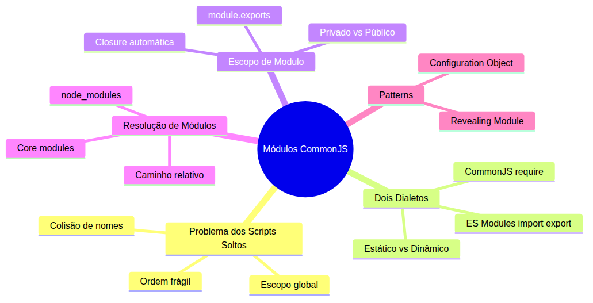
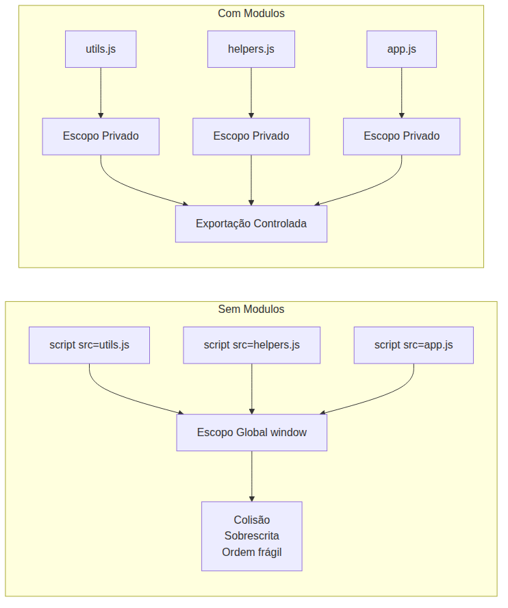
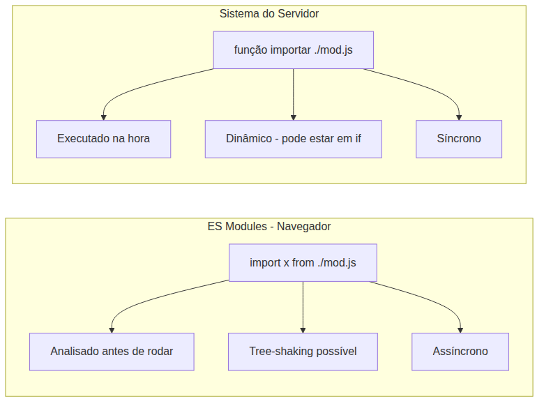
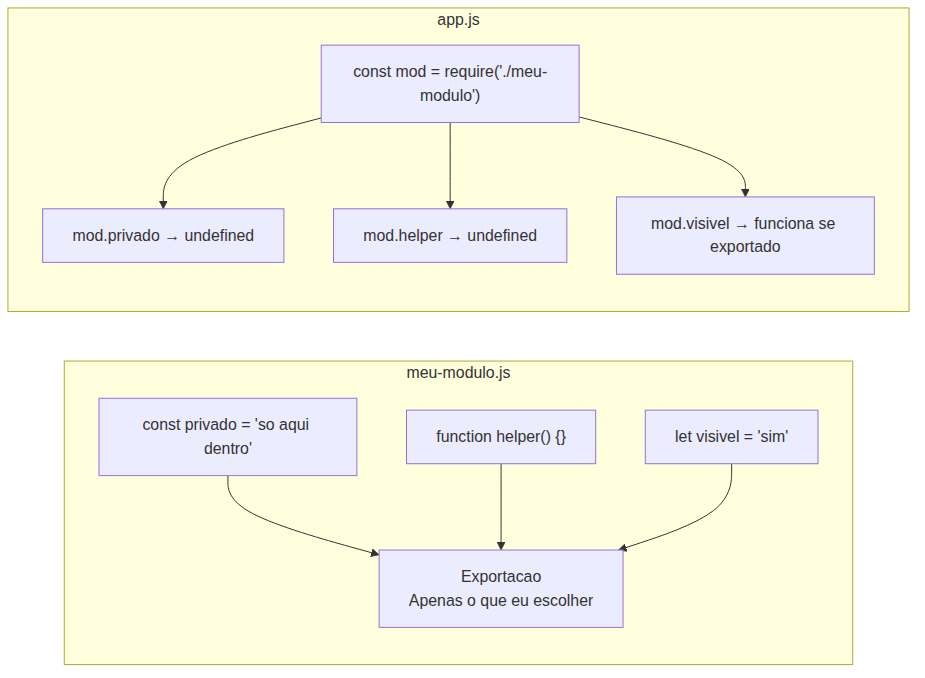
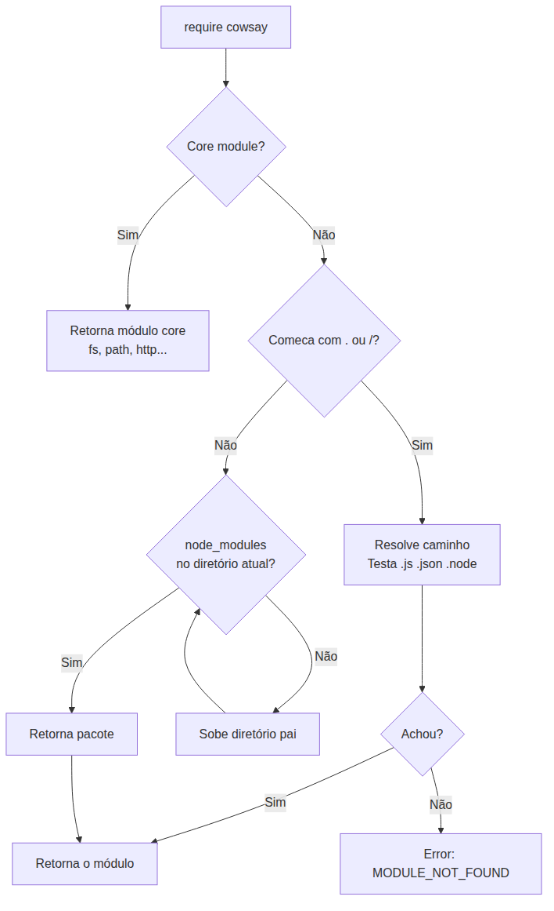
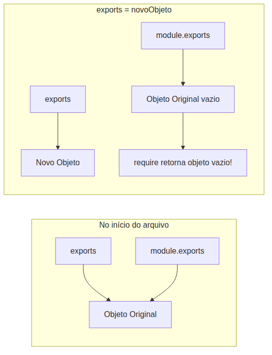

# Node.js — Do Zero ao Servidor Express — Aula 03

## Módulos CommonJS e o Sistema de Encapsulamento

**Duração estimada:** 90 minutos (50 de leitura + 40 de prática)
**Nível:** Iniciante
**Pré-requisitos:** Aula 01 (Runtime e Event Loop), Aula 02 (npm e Gerenciamento de Pacotes)

---

## Objetivos de Aprendizagem

Ao final desta aula, você será capaz de:

- [ ] **Explicar** por que scripts soltos causam colisão de nomes no escopo global
- [ ] **Distinguir** import/export (ES Modules) de require/module.exports (CommonJS)
- [ ] **Descrever** como o escopo de módulo funciona como uma closure automática
- [ ] **Aplicar** require() para importar módulos locais, nativos e pacotes npm
- [ ] **Utilizar** module.exports e exports para expor a API pública de um módulo
- [ ] **Identificar** a pegadinha de reatribuir exports em vez de module.exports
- [ ] **Implementar** o Revealing Module Pattern para esconder implementação interna
- [ ] **Aplicar** o Configuration Object Pattern para parâmetros nomeados
- [ ] **Criar** um módulo CRUD em memória com API pública
- [ ] **Demonstrar** que require() é cacheado e retorna o mesmo objeto em chamadas repetidas

---

## Como Usar Esta Aula

Esta aula está organizada em duas partes. A **primeira parte** constrói a base conceitual de sistemas de módulos — escopo, isolamento e os dois dialetos (import/export e o mecanismo do servidor). A **segunda parte** aplica esses conceitos com require(), module.exports e patterns do Node.js. Ao final, o arquivo separado de Questões de Aprendizagem traz as tarefas de checkpoint.

**Tempo estimado:** 50 minutos de leitura + 40 minutos de prática.

---

## Mapa Mental

Este diagrama mostra todos os conceitos que você vai dominar nesta aula:





> *O mapa mental acima mostra a estrutura da aula. Cada ramo representa um conceito que você vai explorar.*
---

## Recapitulação das Aulas 01 e 02

| Aula | Conceito | Onde aparece nesta aula | Como se conecta |
|---|---|---|---|
| Aula 01 | **Runtime e event loop** (Seção 3) | Seção 4 — require() roda no event loop | require() é síncrono e ocorre na fase de execução |
| Aula 01 | **`node script.js`** no terminal | Seção 4 — executar `node app.js` com módulos | Você agora executa scripts que importam outros arquivos |
| Aula 02 | **`npm install cowsay`** (Seção 2) | Seção 4 — require('cowsay') resolve pacote | require() busca em node_modules/ pacotes instalados |
| Aula 02 | **`package.json`** (Seção 2) | Seção 4 — dependências e scripts | package.json lista o que require() encontra |
| Aula 02 | **`node_modules/`** (Seção 3) | Seção 4 — árvore de resolução | Require sobe diretórios procurando node_modules/ |

---

**FUNDAMENTOS: Encapsulamento e Sistemas de Módulos**

> *Os conceitos desta seção são universais — valem para qualquer sistema de módulos, independentemente da ferramenta ou runtime. Na segunda parte, você verá como cada um deles é implementado na prática.*
---

## 1. O Problema dos Scripts Soltos

Você já trabalhou com vários arquivos JavaScript no navegador. Lá, cada arquivo vira uma tag `<script src="...">` no HTML. O navegador carrega cada um na ordem em que aparece — e despeja TUDO no mesmo balde: o **escopo global** (`window`).

Isso parece inocente até que dois arquivos definem a mesma função. Pense neste cenário: você tem três arquivos — `utils.js`, `helpers.js` e `app.js`. Ambos `utils.js` e `helpers.js` definem uma função chamada `formatar()`. A segunda sobrescreve a primeira. Se `app.js` chamar `formatar()` esperando o comportamento de `utils.js`, vai receber o de `helpers.js`. Silêncio. Sem erro. Sem aviso. Sem bug visível até o usuário reclamar.

Veja um exemplo concreto:

```html
<!-- index.html -->
<script src="utils.js"></script>
<script src="helpers.js"></script>
<script src="app.js"></script>
```

```javascript
// utils.js
function formatar(texto) {
  return texto.toLowerCase();
}
```

```javascript
// helpers.js
function formatar(texto) {
  return texto.toUpperCase();
}
```

```javascript
// app.js
console.log(formatar('Oi')); // 'OI' — não 'oi' como esperado
```

A segunda definição de `formatar` venceu. Sem erro, sem alerta. O programa roda, mas produz o resultado errado.

Outro exemplo: e se `utils.js` depende de uma variável que `app.js` define? A ordem dos `<script>` vira parte do contrato do seu código — qualquer alteração na sequência quebra tudo.

```html
<script src="app.js"></script> <!-- Erro: var CONFIG não existe ainda -->
<script src="utils.js"></script>
```

```javascript
// app.js
var CONFIG = { idioma: 'pt-BR' };

// utils.js
function saudacao() {
  return 'Bem-vindo ao ' + CONFIG.idioma; // CONFIG é undefined — app.js não carregou!
}
```

E agora com um terceiro cenário: você quer usar uma biblioteca que precisa de `$` e outra que também usa `$`. A segunda sobrescreve `window.$`. Funções da primeira lib passam a chamar métodos da segunda. Catástrofe silenciosa.





O que você precisa é de **isolamento**: cada arquivo deveria ter seu próprio espaço privado de variáveis, e só expor aquilo que os outros arquivos precisam ver. O resto fica invisível.

Imagine um prédio de apartamentos. Cada apartamento tem sua própria cozinha (variáveis privadas), seu próprio banheiro (funções internas). O que você faz dentro do seu apartamento ninguém vê. Mas o prédio tem um elevador (a API pública) que todo mundo compartilha. Se o vizinho do 302 reformar a cozinha dele, a sua cozinha continua exatamente como estava. Cada apartamento é isolado — e só o que sai pelo elevador (exportação) fica visível para os outros moradores.

> *Até aqui, você já entendeu o problema que os sistemas de módulos resolvem — scripts no escopo global colidem, se sobrescrevem e dependem de ordem frágil — e que o isolamento é a solução.*

### Quick Check 1

**1. O que acontece quando dois arquivos JavaScript definem uma função com o mesmo nome no navegador?**
**Resposta:** A segunda sobrescreve a primeira silenciosamente. O programa roda, mas a função que venceu pode não ser a que você esperava, causando bugs difíceis de encontrar.

**2. Qual é a solução estrutural para o problema da colisão de nomes?**
**Resposta:** Isolamento de escopo — cada arquivo deve ter seu próprio espaço privado de variáveis e expor apenas o necessário através de uma API pública controlada.

---

## 2. Dois Dialetos, Uma Língua — import/export e o Sistema de Módulos do Servidor

JavaScript tem dois dialetos principais de módulos. Você já conhece um deles: o **ES Modules** (`import`/`export`), que é nativo do navegador moderno. O outro é um sistema criado para ambientes de servidor: um mecanismo baseado em **importação dinâmica e síncrona**.

### ES Modules (o que você já conhece)

Quando você escreve `import { criarTarefa } from './tarefas.js'` no navegador, está usando ES Modules. O navegador sabe que os arquivos são módulos porque você colocou `type="module"` na tag `<script>`:

```html
<script type="module" src="app.js"></script>
```

```javascript
// tarefas.js
export const TIPOS = ['urgente', 'normal'];

export function criarTarefa(titulo) {
  return { titulo, tipo: 'normal', concluida: false };
}
```

```javascript
// app.js
import { criarTarefa, TIPOS } from './tarefas.js';

const tarefa = criarTarefa('Estudar módulos');
console.log(tarefa);
```

ES Modules tem três características importantes: **carregamento estático** (o `import` é analisado antes do código rodar, o que permite otimizações como tree-shaking), **assíncrono** (o navegador baixa os módulos em paralelo) e **sempre no modo estrito** (`"use strict"` implícito).

### O Dialeto do Servidor

O outro sistema de módulos funciona de forma diferente. Em vez de importar antes de executar, ele importa **no momento em que a linha é lida** — carregamento dinâmico e síncrono. A sintaxe usa uma função que busca o módulo e retorna o que ele exportou:

O dialeto do servidor usa uma **função de importação dinâmica** que busca o módulo na hora em que a linha é executada. Ela lê o arquivo, executa o código dele e devolve o que foi exportado. Diferente do `import`, essa função pode ser chamada dentro de um `if`:

```javascript
let modulo;
if (processo === 'producao') {
  modulo = importarModulo('./config-producao.js');
} else {
  modulo = importarModulo('./config-dev.js');
}
```

Isso não é possível com `import` estático — você teria que usar `import()` dinâmico (que retorna Promise).





A analogia mais simples: **ES Modules é português de Portugal; o sistema do servidor é português do Brasil**. Mesma ideia — organizar código em arquivos que importam e exportam coisas. Sintaxe diferente. Algumas regras diferentes. Mas a essência é a mesma.

| Característica | ES Modules (navegador) | Sistema do servidor |
|---|---|---|
| Sintaxe | `import` / `export` | Função de importação / objeto de exportação |
| Momento do carregamento | Estático (antes de executar) | Dinâmico (durante a execução) |
| Síncrono ou assíncrono | Assíncrono (download paralelo) | Síncrono (bloqueia até terminar) |
| Escopo | Strict mode automático | Strict mode automático |
| Onde é nativo | Navegadores modernos | Ambientes de servidor |

Hoje, ES Modules é o padrão moderno da linguagem. Mas o sistema de módulos para servidor nasceu em 2009 — oito anos antes do ES Modules ser padronizado — e ainda é onipresente: milhares de pacotes, tutoriais, código legado e até código novo usam a função de importação dinâmica. Você PRECISA conhecer os dois.

> *Se você está se perguntando "por que aprender um sistema legado se o moderno já funciona?": porque 90% dos pacotes que você vai instalar, os tutoriais que você pesquisar e o código de libs famosas usam esse sistema — é a língua franca do ecossistema.*

### Quick Check 2

**1. Qual é a principal diferença no momento do carregamento entre ES Modules e o sistema do servidor?**
**Resposta:** ES Modules carrega de forma estática (analisado antes da execução), enquanto o sistema do servidor carrega de forma dinâmica (executado no momento em que a linha é lida).

**2. A função de importação do sistema do servidor pode ser chamada dentro de um if? E o import estático?**
**Resposta:** Sim, a função de importação dinâmica pode ser chamada dentro de if por ser uma função comum. O import estático do ES Modules não pode — precisaria ser substituído por import() dinâmico que retorna Promise.

---

## 3. Escopo de Módulo como Closure

Você já sabe o que é uma closure do módulo de JavaScript: uma função que "captura" as variáveis do escopo onde foi criada e as mantém acessíveis mesmo depois que a função exterior terminou. É assim:

```javascript
function contador() {
  let valor = 0;
  return function() {
    valor++;
    return valor;
  };
}

const incrementar = contador();
console.log(incrementar()); // 1
console.log(incrementar()); // 2
// A variável 'valor' não é acessível aqui fora
```

Cada arquivo que você cria com o sistema de módulos funciona exatamente como essa closure — mas automática. O sistema de módulos **envolve seu código em uma função** (imediatamente invocada) que cria um escopo privado. Tudo que você declara no top-level do arquivo fica dentro dessa closure. Nada vaza para fora.

Veja como isso resolve o problema dos scripts soltos:

```javascript
// modulo-a.js
const mensagem = 'Interno'; // Privado — ninguém vê de fora

function helperPrivado() {
  return 'Só uso aqui dentro';
}

// Só o que eu colocar na exportação fica visível
```

```javascript
// modulo-b.js
const mensagem = 'Também interno'; // SEM conflito com modulo-a.js
// Cada arquivo tem seu próprio escopo!

function helperPrivado() {
  return 'Outra implementação';
}
// Nome idêntico? Sem problema — estão em escopos diferentes
```

Diferente do navegador, onde variáveis declaradas com `var` no top-level viram propriedade de `window`, aqui **nada vai para o objeto global**. Cada arquivo é uma ilha privada.





Pense em um **cofre de banco**. Dentro do cofre você guarda o que quiser — dinheiro, joias, documentos. Ninguém vê o que está lá dentro. Para retirar algo, você vai ao guichê (exportação) e o funcionário traz exatamente o que você pediu. O que está no cofre continua invisível. O sistema de módulos é o mesmo: o arquivo é o cofre, a exportação é o guichê, e a função de importação é você pedindo algo pelo guichê.

Isso significa que você pode refatorar o interior de um módulo — trocar implementação, renomear variáveis internas, mudar a lógica — **sem quebrar nenhum código que usa o módulo**, desde que a API pública (o que é exportado) continue a mesma. Essa é a base do encapsulamento, um dos pilares da engenharia de software.

> *Até aqui, você já entendeu que cada arquivo de módulo cria uma closure automática que isola as variáveis — o que fica dentro é privado, o que você exporta é a API pública. Respire. É muita informação nova, mas a ideia central é simples: isolar para não colidir.*

### Quick Check 3

**1. Por que variáveis declaradas no top-level de um módulo não poluem o escopo global?**
**Resposta:** Porque o sistema de módulos envolve cada arquivo em uma closure (IIFE) que cria um escopo próprio. Tudo que está dentro do arquivo fica nessa closure — nada vaza para o objeto global.

**2. O que acontece se o arquivo A e o arquivo B declararem ambos `const versao = 1`?**
**Resposta:** Nada. Cada um vive em seu próprio escopo de módulo. Não há conflito porque não compartilham o mesmo espaço de nomes — são closures independentes.

---

**APLICAÇÃO: CommonJS no Node.js**

> *Agora que você entende o problema dos scripts soltos, a diferença entre os dois dialetos de módulos e o conceito de escopo isolado como closure, vamos aplicar tudo isso no Node.js com CommonJS. Cada conceito da primeira parte tem um correspondente direto aqui: require() é o "import" do servidor, module.exports é o "export", e a closure automática é o escopo de módulo que você já conhece.*
---

## 4. require() — O Algoritmo de Resolução

Na Aula 02 você digitou `npm install cowsay` e depois `require('cowsay')` no código. Na época, foi um "comando mágico" — você sabia que funcionava, mas não exatamente como. Agora você vai descobrir o que acontece nos bastidores.

Quando você chama `require('cowsay')`, o Node.js segue um algoritmo de três passos para encontrar o módulo:

### Passo 1: É um módulo core do Node.js?

O Node.js vem com módulos embutidos: `fs`, `path`, `http`, `os`, `events` e dezenas de outros. Se você chama `require('fs')`, o Node.js reconhece que é um módulo core e retorna imediatamente — sem procurar arquivo nenhum no disco.

```javascript
const fs = require('fs');       // Core module — não precisa instalar
const path = require('path');   // Core module — já vem com Node.js
```

Estes módulos não estão no `node_modules/` nem são arquivos seus. Eles são compilados dentro do binário do Node.js. Você pode chamar `require('fs')` sem nunca ter dado `npm install fs` — porque `fs` não é um pacote npm, é parte do runtime.

### Passo 2: O caminho começa com ./ , ../ ou /?

Se o argumento começa com `./`, `../` ou `/`, o Node.js sabe que é um caminho de arquivo local. Ele tenta resolver o caminho relativo ao arquivo que está chamando `require()`:

```javascript
const modulo = require('./meu-arquivo');   // Mesmo diretório
const modulo = require('../outro/arquivo'); // Um nível acima
const modulo = require('/absoluto/script'); // Caminho absoluto (raro)
```

Para cada caminho, o Node.js testa extensões nesta ordem: `.js`, depois `.json`, depois `.node` (módulos binários C++). Se você escreve `require('./saudacao')`, ele procura `saudacao.js`, depois `saudacao.json`, depois `saudacao.node`. Se nenhum existir, lança erro "MODULE_NOT_FOUND".

```javascript
// Ambos funcionam — .js é opcional:
const mod1 = require('./saudacao.js');
const mod2 = require('./saudacao');  // Node.js adiciona .js automaticamente
```

### Passo 3: É um pacote em node_modules/?

Se não é core nem caminho relativo, o Node.js assume que é um **pacote npm**. Ele procura uma pasta `node_modules/` no diretório do arquivo atual. Se não achar, sobe para o diretório pai e procura de novo. Sobe, sobe, sobe até a raiz do sistema.

```javascript
require('cowsay');    // Procura: ./node_modules/cowsay/
                       // Depois: ../node_modules/cowsay/
                       // Depois: ../../node_modules/cowsay/
                       // ... até a raiz
```

Esse mecanismo de "subir a árvore" é o que permite que um pacote instalado na raiz do projeto seja encontrado por qualquer arquivo em qualquer subdiretório.





### require() é síncrono e cacheado

Duas propriedades cruciais do `require()`:

**Síncrono**: `require()` trava a execução do Node.js até o módulo ser completamente carregado e executado. Isso é proposital — seu código só continua depois que o módulo está pronto. Diferente de I/O de arquivo (que pode ser assíncrono), a importação de módulos é sempre síncrona.

**Cacheado**: Na primeira vez que você chama `require('./modulo')`, o Node.js executa o arquivo e guarda o resultado em `require.cache`. Da segunda vez em diante, ele simplesmente retorna o objeto em cache — sem executar o arquivo de novo. Isso é importante para performance e para evitar efeitos colaterais repetidos.

```javascript
const a = require('./saudacao'); // Executa o arquivo
const b = require('./saudacao'); // Retorna do cache — NÃO executa de novo
console.log(a === b); // true — é o MESMO objeto
```

### Mão na Massa 1 — Criar e Consumir um Módulo Local

**Dificuldade: Fácil | Duração: 5 minutos**

Vamos criar um módulo que exporta uma função de saudação e outro arquivo que a consome.

**Passo 1:** Crie `saudacao.js` no mesmo diretório:

```javascript
// saudacao.js
const PREFIXO = '🎉';

function saudar(nome) {
  return PREFIXO + ' Olá, ' + nome + '!';
}

module.exports = saudar;
```

**Passo 2:** Crie `app.js` no mesmo diretório:

```javascript
// app.js
const saudar = require('./saudacao');

console.log(saudar('Maria'));
console.log(saudar('João'));
```

**Passo 3:** Execute no terminal:

```bash
node app.js
```

**Verificação:** Você deve ver no terminal:
```
🎉 Olá, Maria!
🎉 Olá, João!
```

A variável `PREFIXO` dentro de `saudacao.js` é privada — `app.js` não tem acesso a ela. O único contato é através da função `saudar()`. Isso é o encapsulamento que você aprendeu na PARTE 1 em ação.

### Quick Check 4

**1. O que o Node.js faz quando você chama `require('path')`?**
**Resposta**: Reconhece `path` como módulo core e retorna imediatamente, sem procurar em node_modules/ ou em arquivos locais.

**2. Por que `require()` é cacheado?**
**Resposta**: Para performance e consistência. O módulo é executado apenas na primeira vez; chamadas subsequentes retornam o mesmo objeto do cache, evitando efeitos colaterais repetidos.

---

## 5. module.exports e exports — A Interface Pública

Se `require()` é o "import" do CommonJS, `module.exports` é o "export". Tudo que você atribuir a `module.exports` dentro de um arquivo é o que a função `require()` vai retornar quando outro arquivo importar este módulo.

### Exportar uma função

O caso mais simples: seu módulo exporta **uma única função**:

```javascript
// calculadora.js
function somar(a, b) {
  return a + b;
}

module.exports = somar;
```

```javascript
// app.js
const somar = require('./calculadora');
console.log(somar(2, 3)); // 5
```

Aqui, `module.exports` recebe a função `somar`. Quando `app.js` dá `require('./calculadora')`, ele recebe a função diretamente — não um objeto.

### Exportar um objeto com várias coisas

Mais comum: seu módulo exporta **várias funções ou valores**:

```javascript
// calculadora.js
function somar(a, b) { return a + b; }
function subtrair(a, b) { return a - b; }
const PI = 3.14159;

module.exports = { somar, subtrair, PI };
```

```javascript
// app.js
const calc = require('./calculadora');
console.log(calc.somar(2, 3));    // 5
console.log(calc.subtrair(5, 2)); // 3
console.log(calc.PI);             // 3.14159
```

A sintaxe `{ somar, subtrair, PI }` é açúcar do ES6 para `{ somar: somar, subtrair: subtrair, PI: PI }`. Você também pode usar destructuring na hora de importar:

```javascript
const { somar, PI } = require('./calculadora');
```

### O atalho exports

O Node.js oferece um atalho: a variável `exports` é uma referência para `module.exports`. Você pode fazer:

```javascript
exports.somar = function(a, b) { return a + b; };
exports.subtrair = function(a, b) { return a - b; };
exports.PI = 3.14159;
```

Isso é equivalente a:

```javascript
module.exports.somar = function(a, b) { return a + b; };
module.exports.subtrair = function(a, b) { return a - b; };
module.exports.PI = 3.14159;
```

A variável `exports` é só um apelido (atalho) para `module.exports`. No início de cada arquivo, o Node.js faz algo como: `const exports = module.exports;`. Por isso `exports.atributo` e `module.exports.atributo` são equivalentes.

### A PEGADINHA

Aqui mora o erro mais comum de quem está começando com CommonJS. Isto **NÃO funciona**:

```javascript
// ❌ ERRADO — isso QUEBRA a referência
exports = {
  somar: (a, b) => a + b,
  subtrair: (a, b) => a - b
};
```

Quando você faz `exports = { ... }`, você está dizendo "a variável `exports` agora aponta para um novo objeto". Mas `module.exports` continua apontando para o objeto original (vazio). Como é `module.exports` que o `require()` retorna — não `exports` — o resultado é um módulo vazio.





**Regra de ouro**:
- Use `module.exports = valor` quando quiser exportar **um valor único** (função, classe, objeto novo)
- Use `exports.atributo` quando quiser **adicionar propriedades** ao objeto de exportação
- **NUNCA** use `exports =` diretamente — a referência se perde

### Mão na Massa 2 — Módulo de Matemática

**Dificuldade: Fácil | Duração: 5 minutos**

**Passo 1:** Crie a pasta `lib/` e dentro dela o arquivo `matematica.js`:

```javascript
// lib/matematica.js
function somar(a, b) { return a + b; }
function subtrair(a, b) { return a - b; }
function multiplicar(a, b) { return a * b; }
function dividir(a, b) {
  if (b === 0) return 'Erro: divisão por zero';
  return a / b;
}

const PI = 3.14159;

module.exports = { somar, subtrair, multiplicar, dividir, PI };
```

**Passo 2:** No diretório pai (fora de `lib/`), crie ou atualize `app.js`:

```javascript
// app.js
const matematica = require('./lib/matematica');

console.log('Soma:', matematica.somar(10, 5));
console.log('Subtração:', matematica.subtrair(10, 5));
console.log('Multiplicação:', matematica.multiplicar(10, 5));
console.log('Divisão:', matematica.dividir(10, 5));
console.log('PI:', matematica.PI);
console.log('Divisão por zero:', matematica.dividir(10, 0));
```

**Passo 3:** Execute:

```bash
node app.js
```

**Verificação:** Você deve ver:
```
Soma: 15
Subtração: 5
Multiplicação: 50
Divisão: 2
PI: 3.14159
Divisão por zero: Erro: divisão por zero
```

### Quick Check 5

**1. O que a variável `exports` representa em relação a `module.exports`?**
**Resposta**: `exports` é uma referência para o mesmo objeto de `module.exports`. É um atalho para adicionar propriedades sem digitar `module.exports.` toda vez.

**2. Por que `exports = { fn }` não funciona?**
**Resposta**: Porque isso faz a variável `exports` apontar para um novo objeto, mas `module.exports` continua apontando para o original. Como `require()` retorna `module.exports`, o módulo fica vazio.

---

## 6. Patterns com CommonJS

Agora que você domina `require()` e `module.exports`, vamos ver dois patterns que organizam melhor seus módulos. Patterns não são código novo — são **nomes para boas práticas** que você já está aplicando.

### Revealing Module Pattern

Este pattern tem um nome sofisticado, mas você já viu ele em ação na Seção 3. A ideia é simples: o módulo mantém dados e funções **privadas** (dentro da closure do arquivo) e expõe apenas uma **API pública** através de `module.exports`.

```javascript
// lib/servico.js

// 🔒 Privado — ninguém vê de fora
const SEGREDO = 'chave-super-secreta-123';
let dados = [];

function validarEntrada(valor) {
  return typeof valor === 'string' && valor.length > 0;
}

// 🔓 Público — exposto via module.exports
function adicionar(valor) {
  if (!validarEntrada(valor)) {
    console.error('Entrada inválida');
    return false;
  }
  dados.push(valor + ':' + SEGREDO);
  return true;
}

function listar() {
  return [...dados]; // Retorna cópia para evitar mutação externa
}

function limpar() {
  dados = [];
}

module.exports = { adicionar, listar, limpar };
```

O que acontece aqui:
- `SEGREDO` e `dados` são **inacessíveis** de fora do módulo
- `validarEntrada()` é uma função auxiliar **privada** — ninguém chama ela de fora
- `adicionar`, `listar` e `limpar` são a **API pública**
- O `require()` retorna apenas o objeto com os três métodos

```javascript
const servico = require('./lib/servico');

servico.adicionar('Notebook');
console.log(servico.listar()); // ['Notebook:chave-super-secreta-123']
console.log(servico.SEGREDO);  // undefined — não vaza!
```

Esse pattern é a materialização do que você aprendeu na PARTE 1: **cada módulo é uma closure, e module.exports é o guichê do cofre**.

### Configuration Object Pattern

O segundo pattern resolve um problema específico: funções com **muitos parâmetros**.

Imagine que você quer criar uma função que configura um servidor (não estamos usando Express ainda — só uma simulação conceitual):

```javascript
// ❌ Ruim: Qual era o 3º parâmetro mesmo?
criarServidor(3000, 'localhost', 'utf8', true, 50);
```

Com **Configuration Object Pattern**, você substitui múltiplos parâmetros posicionais por **um único objeto**:

```javascript
// ✅ Bom: ordem não importa, nomes são claros
criarServidor({
  porta: 3000,
  host: 'localhost',
  encoding: 'utf8',
  debug: true,
  timeout: 50
});
```

A implementação usa **destructuring com valores padrão**:

```javascript
function criarServidor(config = {}) {
  const {
    porta = 3000,
    host = 'localhost',
    encoding = 'utf8',
    debug = false,
    timeout = 30
  } = config;

  if (debug) console.log(`Iniciando servidor em ${host}:${porta}`);

  // Lógica real do servidor...
  return { host, porta, encoding, timeout };
}
```

Vantagens:
1. **Ordem não importa** — você pode passar os campos em qualquer sequência
2. **Campos opcionais** — só passa o que precisa mudar do default
3. **Autodocumentado** — o código que chama a função diz exatamente o que está configurando
4. **Extensível** — adicionar um novo parâmetro não quebra chamadas existentes

```javascript
// Só quero mudar porta e debug, o resto usa default
const servidor = criarServidor({ porta: 8080, debug: true });
```

### Mão na Massa 3 — Módulo CRUD em Memória

**Dificuldade: Médio | Duração: 10 minutos**

Este é o **projeto progressivo** do módulo: você vai criar a primeira peça da API de Gerenciador de Tarefas. O módulo `lib/tarefas.js` mantém um array privado em memória e expõe funções CRUD.

**Passo 1:** Crie `lib/tarefas.js` com Revealing Module Pattern:

```javascript
// lib/tarefas.js

// 🔒 Array privado — ninguém modifica diretamente
let _tarefas = [];
let _proximoId = 1;

function _procurarIndice(id) {
  return _tarefas.findIndex(t => t.id === id);
}

function listar() {
  return [..._tarefas]; // Retorna cópia para segurança
}

function adicionar(titulo) {
  if (!titulo || typeof titulo !== 'string') {
    return { erro: 'Título é obrigatório' };
  }
  const tarefa = {
    id: _proximoId++,
    titulo: titulo.trim(),
    concluida: false
  };
  _tarefas.push(tarefa);
  return tarefa;
}

function remover(id) {
  const indice = _procurarIndice(id);
  if (indice === -1) {
    return { erro: 'Tarefa não encontrada' };
  }
  const removida = _tarefas.splice(indice, 1)[0];
  return removida;
}

function alternar(id) {
  const indice = _procurarIndice(id);
  if (indice === -1) {
    return { erro: 'Tarefa não encontrada' };
  }
  _tarefas[indice].concluida = !_tarefas[indice].concluida;
  return _tarefas[indice];
}

module.exports = { listar, adicionar, remover, alternar };
```

**Passo 2:** Crie `app.js` consumindo o módulo com Configuration Object Pattern para configurar o log:

```javascript
// app.js
const tarefas = require('./lib/tarefas');

function executarComLog({ mostrarLog = false, operacao = 'execução' } = {}) {
  if (mostrarLog) console.log(`[LOG] Iniciando ${operacao}...`);

  const r1 = tarefas.adicionar('Estudar módulos CommonJS');
  const r2 = tarefas.adicionar('Praticar os patterns');
  const r3 = tarefas.adicionar('Criar API de tarefas');

  if (mostrarLog) console.log(`[LOG] 3 tarefas adicionadas`);

  tarefas.alternar(1);

  console.log('Tarefas:', tarefas.listar());

  const removida = tarefas.remover(3);
  console.log('Removida:', removida);

  if (mostrarLog) console.log(`[LOG] ${operacao} concluída.`);
}

console.log('=== Sem log ===');
executarComLog();

console.log('\n=== Com log ===');
executarComLog({ mostrarLog: true, operacao: 'teste CRUD' });
```

**Passo 3:** Execute:

```bash
node app.js
```

**Verificação:** Você deve ver a lista de tarefas sem log na primeira execução e com log na segunda. O array `_tarefas` não é acessível de `app.js` — se você tentar `console.log(tarefas._tarefas)`, recebe `undefined`.

> *Isso que você acabou de construir — um módulo com estado interno privado e API pública — é a base do seu Gerenciador de Tarefas.*

Na Aula 04, você vai salvar essas tarefas no disco com o módulo `fs`.

### Quick Check 6

**1. Qual a principal vantagem do Revealing Module Pattern?**
**Resposta**: Manter dados e funções auxiliares privados dentro da closure do módulo, expondo apenas a API pública necessária. Isso evita que código externo dependa de implementação interna.

**2. Por que o Configuration Object Pattern prefere `{ porta: 3000 }` a `(3000, 'localhost')`?**
**Resposta**: Porque objetos com nomes são autodocumentados, a ordem não importa, parâmetros podem ter valores padrão, e adicionar novos parâmetros não quebra chamadas existentes.

---

## Autoavaliação: Quiz Rápido

**1. Por que scripts soltos com `<script src="...">` causam colisão de nomes?**
**Resposta:** Todos compartilham o mesmo escopo global (`window`). Se dois arquivos definem a mesma função, a segunda sobrescreve a primeira silenciosamente.

**2. Qual a diferença fundamental entre import/export e require/module.exports no momento do carregamento?**
**Resposta:** import/export é estático (analisado antes da execução) enquanto require/module.exports é dinâmico (executado no momento da chamada).

**3. O que acontece com variáveis declaradas no top-level de um módulo CommonJS?**
**Resposta:** Ficam isoladas dentro da closure do módulo. Não vazam para o objeto global e não colidem com variáveis de mesmo nome em outros módulos.

**4. Quais são os três passos do algoritmo de resolução do require()?**
**Resposta:** (1) Verifica se é módulo core; (2) Verifica se começa com ./ ../ ou / e resolve caminho local; (3) Procura em node_modules/ subindo a árvore de diretórios.

**5. Por que `exports = { fn }` não funciona, mas `module.exports = { fn }` funciona?**
**Resposta:** `exports` é uma referência para `module.exports`. Reatribuir `exports` quebra a referência sem alterar `module.exports`, que é o que require() retorna.

**6. O que o Revealing Module Pattern revela (e o que esconde)?**
**Resposta:** Revela a API pública através de module.exports. Esconde a implementação interna — variáveis e funções auxiliares ficam inacessíveis de fora do módulo.

**7. Qual a vantagem de usar um objeto de configuração em vez de parâmetros posicionais?**
**Resposta:** Ordem não importa, campos opcionais com valor padrão, autodocumentado, e adicionar novos parâmetros não quebra chamadas existentes.

---

## Mão na Massa 4: Exercícios Graduados

### Exercício 1 (Fácil) — Módulo Calculadora

Crie um módulo `calculadora.js` que exporte 4 funções (`somar`, `subtrair`, `multiplicar`, `dividir`) e um valor `VERSAO = '1.0'`. Crie um `app.js` que importe e teste todas as operações.

**Gabarito:**

```javascript
// calculadora.js
function somar(a, b) { return a + b; }
function subtrair(a, b) { return a - b; }
function multiplicar(a, b) { return a * b; }
function dividir(a, b) {
  if (b === 0) return 'Erro: divisão por zero';
  return a / b;
}
const VERSAO = '1.0';

module.exports = { somar, subtrair, multiplicar, dividir, VERSAO };
```

```javascript
// app.js
const calc = require('./calculadora');

console.log('Versão:', calc.VERSAO);
console.log('2 + 3 =', calc.somar(2, 3));
console.log('10 - 4 =', calc.subtrair(10, 4));
console.log('3 * 7 =', calc.multiplicar(3, 7));
console.log('20 / 4 =', calc.dividir(20, 4));
console.log('10 / 0 =', calc.dividir(10, 0));
```

### Exercício 2 (Médio) — Configuração com Configuration Object

Crie um módulo `lib/config.js` que exporte uma função `criarApp(config)` usando Configuration Object Pattern. A função deve ter defaults para: `porta: 3000`, `ambiente: 'desenvolvimento'`, `debug: false`, `versao: '1.0.0'`. A função retorna um objeto com todos os campos resolvidos. Crie `app.js` que teste com diferentes configurações.

**Gabarito:**

```javascript
// lib/config.js
function criarApp(config = {}) {
  const {
    porta = 3000,
    ambiente = 'desenvolvimento',
    debug = false,
    versao = '1.0.0'
  } = config;

  if (debug) {
    console.log(`[DEBUG] App v${versao} iniciando em ${ambiente}:${porta}`);
  }

  return {
    porta,
    ambiente,
    debug,
    versao,
    iniciar() {
      console.log(`App rodando em http://localhost:${porta} (${ambiente})`);
    }
  };
}

module.exports = { criarApp };
```

```javascript
// app.js
const { criarApp } = require('./lib/config');

const appDev = criarApp({ debug: true, porta: 8080 });
appDev.iniciar();

const appProd = criarApp({ ambiente: 'producao' });
appProd.iniciar();

const appDefault = criarApp();
appDefault.iniciar();
```

### Desafio (Difícil) — Modularizar Script Monolítico

Refatore o script monolítico abaixo em 3 módulos usando Revealing Module Pattern. Mantenha os dados privados em cada módulo.

```javascript
// Script monolítico para refatorar:
const usuarios = [];
const pedidos = [];
let proxIdUsuario = 1;
let proxIdPedido = 1;

function criarUsuario(nome) {
  const user = { id: proxIdUsuario++, nome, ativo: true };
  usuarios.push(user);
  return user;
}

function listarUsuarios() { return [...usuarios]; }

function criarPedido(usuarioId, produto) {
  const pedido = { id: proxIdPedido++, usuarioId, produto, data: new Date() };
  pedidos.push(pedido);
  return pedido;
}

function listarPedidos() { return [...pedidos]; }

function listarPedidosPorUsuario(usuarioId) {
  return pedidos.filter(p => p.usuarioId === usuarioId);
}
```

**Gabarito:**

```javascript
// lib/usuarios.js
let _usuarios = [];
let _proxId = 1;

function criar(nome) {
  const user = { id: _proxId++, nome, ativo: true };
  _usuarios.push(user);
  return user;
}

function listar() { return [..._usuarios]; }

module.exports = { criar, listar };
```

```javascript
// lib/pedidos.js
let _pedidos = [];
let _proxId = 1;

function criar(usuarioId, produto) {
  const pedido = { id: _proxId++, usuarioId, produto, data: new Date() };
  _pedidos.push(pedido);
  return pedido;
}

function listar() { return [..._pedidos]; }

function listarPorUsuario(usuarioId) {
  return _pedidos.filter(p => p.usuarioId === usuarioId);
}

module.exports = { criar, listar, listarPorUsuario };
```

```javascript
// app.js
const usuarios = require('./lib/usuarios');
const pedidos = require('./lib/pedidos');

const u1 = usuarios.criar('Alice');
const u2 = usuarios.criar('Bob');

pedidos.criar(u1.id, 'Notebook');
pedidos.criar(u1.id, 'Mouse');
pedidos.criar(u2.id, 'Teclado');

console.log('Usuários:', usuarios.listar());
console.log('Pedidos da Alice:', pedidos.listarPorUsuario(u1.id));
console.log('Total de pedidos:', pedidos.listar().length);
```

---

## Resumo da Aula

### Os 5 Conceitos Fundamentais

1. **Problema dos scripts soltos**: Múltiplos scripts no navegador compartilham o escopo global (`window`), causando colisão de nomes, sobrescrita silenciosa e dependência frágil de ordem de carregamento.

2. **Dois dialetos de módulos**: ES Modules (`import/export`) é o padrão moderno, estático e assíncrono. CommonJS (`require/module.exports`) é o sistema original do Node.js, dinâmico e síncrono. Você precisa conhecer ambos.

3. **Escopo de módulo como closure**: Cada arquivo CommonJS é envolvido em uma closure (IIFE) automática. Variáveis top-level ficam privadas dentro dela — nada vaza para o escopo global.

4. **require() e module.exports**: `require()` resolve módulos em 3 passos (core → caminho → node_modules), é síncrono e cacheado. `module.exports` define o que o require retorna. `exports` é um atalho, mas reatribuí-lo quebra a referência.

5. **Revealing Module e Configuration Object Patterns**: O primeiro esconde implementação e expõe API pública. O segundo substitui parâmetros posicionais por um objeto nomeado. Ambos são práticas que você já aplica — agora com nome.

### O Que Você Construiu Hoje

- [x] `saudacao.js` — Primeiro módulo com exportação de função
- [x] `lib/matematica.js` — Módulo exportando objeto com várias funções
- [x] `lib/tarefas.js` — Módulo CRUD com Revealing Module Pattern (projeto progressivo)
- [x] `lib/config.js` — Configuration Object Pattern nos exercícios
- [x] `lib/usuarios.js` e `lib/pedidos.js` — Modularização de script monolítico (desafio)

---

## Próxima Aula

**Aula 04: Sistema de Arquivos (fs) — Lendo e Escrevendo no Disco**

Seu módulo `lib/tarefas.js` hoje armazena dados em memória. Toda vez que o processo reinicia, as tarefas somem. Na Aula 04, você vai aprender a usar o módulo `fs` (File System) para salvar dados em arquivos JSON no disco — seus dados vão sobreviver a reinícios do servidor. Você também vai entender a diferença entre operações síncronas e assíncronas, conhecer o Error-first Callback Pattern e usar `fs.promises` com async/await para um código mais limpo.

---

## Referências

### Documentação Oficial

- [Node.js Modules (CommonJS)](https://nodejs.org/api/modules.html) — documentação oficial do sistema de módulos
- [Node.js require()](https://nodejs.org/api/modules.html#requireid) — referência completa da função require
- [CommonJS Spec](http://www.commonjs.org/specs/modules/1.0/) — especificação original CommonJS

### Ferramentas

- [npm Registry](https://www.npmjs.com/) — busca de pacotes npm

### Artigos para Aprofundamento

- [ES Modules vs CommonJS (Node.js Docs)](https://nodejs.org/api/esm.html#esm_modules_ecmascript_modules_vs_commonjs) — comparação oficial do Node.js entre os dois sistemas
- [JavaScript Modules: A Brief History](https://medium.com/sons-of-javascript/javascript-modules-a-brief-history-6df1e7e8b7bc) — história dos sistemas de módulos em JavaScript

---

## FAQ

**P: Posso usar import/export no Node.js em vez de require/module.exports?**
R: Sim. Adicione `"type": "module"` no package.json ou use extensão `.mjs`. Mas muitos pacotes npm ainda usam CommonJS, então você vai encontrar require com frequência.

**P: Por que require() é síncrono se o Node.js é assíncrono?**
R: Por design. Carregar módulos é uma operação que precisa estar completa antes do código rodar. A sincronicidade do require() não bloqueia o event loop porque ocorre na fase de inicialização, não durante o processamento de requisições.

**P: O que acontece se dois arquivos dependem um do outro (dependência circular)?**
R: O Node.js retorna o que está parcialmente pronto no momento. É uma situação arriscada e deve ser evitada. Se precisar, module.exports parcial pode funcionar, mas o ideal é refatorar para eliminar a circularidade.

**P: Qual a diferença entre module.exports e exports além da pegadinha?**
R: Nenhuma — são o mesmo objeto no início. `exports` é uma variável local que aponta para `module.exports`. A diferença só aparece quando você tenta reatribuir `exports`.

**P: Preciso colocar .js no final do require?**
R: É opcional. O Node.js testa .js, .json e .node automaticamente. Por convenção, a maioria dos desenvolvedores omite a extensão para módulos JavaScript e inclui para JSON (`require('./dados.json')`).

**P: O diretório node_modules/ pode ficar em qualquer lugar?**
R: O Node.js sobe a árvore de diretórios procurando. Se seu projeto está em `/home/user/projeto/app.js`, ele procura em `/home/user/projeto/node_modules/`, depois `/home/user/node_modules/`, depois `/home/node_modules/`.

**P: O que é mais usado hoje em dia, ES Modules ou CommonJS?**
R: ES Modules é o padrão oficial e está crescendo. CommonJS ainda é dominante em pacotes npm e código legado. Projetos novos podem escolher qualquer um — o importante é saber ler e escrever ambos.

**P: Como faço para ver o cache do require?**
R: `console.log(require.cache)` mostra todos os módulos cacheados. As chaves são os caminhos absolutos dos arquivos.

---

## Glossário

| Termo | Definição |
|---|---|
| **CommonJS** | Sistema de módulos original do Node.js, baseado em `require()` e `module.exports`. Carregamento dinâmico e síncrono. (Ver seções 2, 4) |
| **ES Modules** | Sistema de módulos padrão do JavaScript (ES6+), baseado em `import`/`export`. Carregamento estático e assíncrono. (Ver seção 2) |
| **require()** | Função do CommonJS que importa módulos. Resolve em 3 passos: core, caminho, node_modules. (Ver seção 4) |
| **module.exports** | Objeto especial que define o que um módulo CommonJS exporta. É o que `require()` retorna. (Ver seção 5) |
| **exports** | Atalho para `module.exports`. Reatribuí-lo quebra a referência. (Ver seção 5) |
| **Escopo de módulo** | Isolamento automático de variáveis dentro de cada arquivo, implementado como uma closure. (Ver seção 3) |
| **Revealing Module Pattern** | Pattern onde o módulo esconde implementação interna (dados e funções privadas) e expõe apenas uma API pública. (Ver seção 6) |
| **Configuration Object Pattern** | Pattern que substitui múltiplos parâmetros posicionais por um único objeto com propriedades nomeadas. (Ver seção 6) |
| **Closure** | Função que captura e mantém acesso a variáveis do escopo onde foi criada, mesmo após a função exterior terminar. (Ver seção 3) |
| **Core module** | Módulo nativo do Node.js que não precisa ser instalado (ex: `fs`, `path`, `http`). (Ver seção 4) |
| **node_modules/** | Diretório onde o npm instala pacotes. O Node.js procura por ele subindo a árvore de diretórios. (Ver seção 4) |
| **Cache de módulo** | Mecanismo que armazena o resultado do primeiro `require()` de cada módulo, evitando reexecução. (Ver seção 4) |
| **Encapsulamento** | Princípio de esconder a implementação interna de um componente e expor apenas uma interface controlada. (Ver seções 1, 6) |
