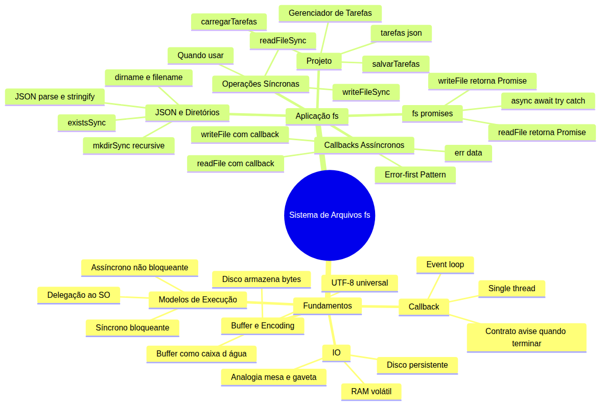
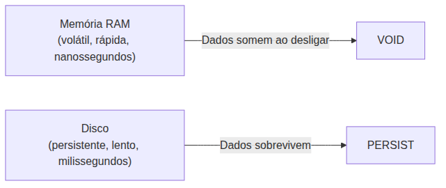
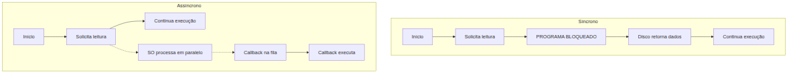
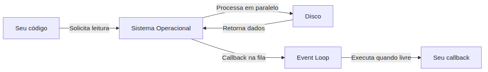
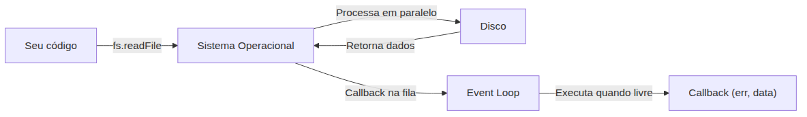
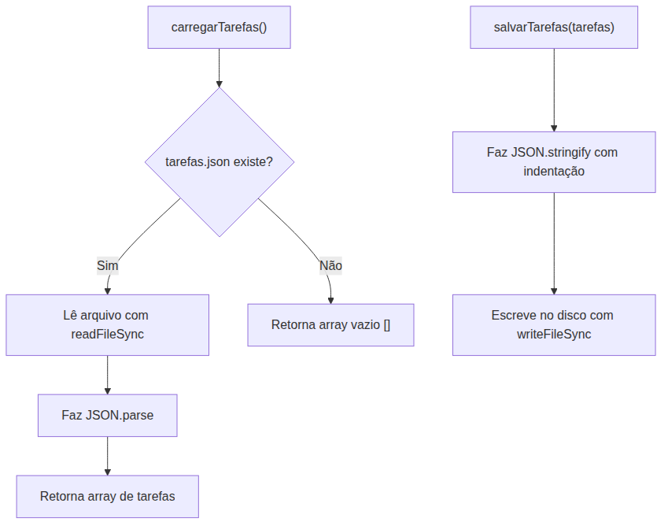

# Node.js — Do Zero ao Servidor Express — Aula 04

## Sistema de Arquivos (fs) — Lendo e Escrevendo no Disco

**Duração estimada:** 110 minutos (60 de leitura + 50 de prática)
**Nível:** Iniciante
**Pré-requisitos:** Aula 01 (Runtime e Event Loop), Aula 02 (npm e Gerenciamento de Pacotes), Aula 03 (Módulos CommonJS)

---

## Objetivos de Aprendizagem

Ao final desta aula, você será capaz de:

- [ ] **Explicar** o conceito de I/O (entrada e saída) e a diferença entre memória volátil e disco persistente
- [ ] **Distinguir** operações síncronas (bloqueantes) de assíncronas (não bloqueantes) e comparar os modelos em cenários práticos
- [ ] **Descrever** o papel do buffer como área de transferência temporária entre o disco e o programa
- [ ] **Explicar** por que o encoding (UTF-8) e o conceito de byte são necessários para representar texto em disco
- [ ] **Identificar** o padrão de callback em operações de I/O e sua relação com o event loop
- [ ] **Reconhecer** o papel do sistema operacional na delegação de operações de I/O
- [ ] **Aplicar** o raciocínio de callbacks para operações futuras sem travar a execução
- [ ] **Ler e escrever** arquivos de texto com `readFileSync` e `writeFileSync`
- [ ] **Aplicar** o padrão Error-first Callback com `readFile` e `writeFile` assíncronos
- [ ] **Utilizar** `fs.promises` com async/await para operações de arquivo
- [ ] **Manipular** dados JSON em arquivos com `JSON.parse` e `JSON.stringify`
- [ ] **Criar e verificar** diretórios com `mkdirSync` e `existsSync`
- [ ] **Diferenciar** caminhos relativos de absolutos usando `__dirname` e `__filename`
- [ ] **Construir** funções de persistência para o Gerenciador de Tarefas usando o módulo `fs`

---

## Como Usar Esta Aula

Esta aula está organizada em duas partes. A **primeira parte** constrói os fundamentos de entrada e saída (I/O), modelos de execução, buffers e encoding — conceitos universais que valem para qualquer linguagem. A **segunda parte** mergulha no módulo `fs` do Node.js: você aprende a ler e escrever arquivos de três formas diferentes (síncrona, callbacks e promises), trabalha com JSON, gerencia diretórios e constrói as funções de persistência do seu Gerenciador de Tarefas.

**Tempo estimado:** 60 minutos de leitura + 50 minutos de prática.

## Mapa Mental

Este diagrama mostra todos os conceitos que você vai dominar nesta aula:





> *O mapa mental acima mostra a estrutura da aula. Cada ramo representa um conceito que você vai explorar.*

## Recapitulação das Aulas Anteriores

| Aula | Conceito | Onde aparece nesta aula | Como se conecta |
|---|---|---|---|
| Aula 01 | **Runtime e Event Loop** | Seções 2, 4 e 6 | O event loop gerencia operações assíncronas de arquivo, delegando ao SO enquanto a thread fica livre |
| Aula 02 | **npm e Gerenciamento de Pacotes** | Seções 5-9 | O projeto do Gerenciador de Tarefas usa a estrutura npm iniciada na Aula 02 |
| Aula 03 | **CommonJS e module.exports** | Seções 5-9 | `require('fs')` importa o módulo nativo; `module.exports` expõe funções do Gerenciador |

---

**FUNDAMENTOS: Entrada e Saída — Da Memória ao Disco**

> *Os conceitos desta seção são universais — valem para qualquer linguagem de programação que precise ler ou escrever dados. Entender como a memória, o disco e o sistema operacional interagem é conhecimento que você leva para qualquer ambiente.*

---

## 1. I/O — A Ponte Entre Dois Mundos

Você já salva dados no navegador com `localStorage`. É prático, mas limitado: no máximo 5 MB, só strings, e os dados desaparecem quando o cache é limpo.

Agora imagine poder armazenar gigabytes — arquivos de qualquer formato, que sobrevivem a reinicializações, reinstalações e até a formatação do computador. Essa é a diferença entre a memória volátil (RAM) e o disco persistente.

Pense na sua mesa de trabalho. Tudo que está sobre a mesa — monitor, teclado, o copo de café — é a memória RAM: acesso rápido, mas se você desligar o computador, tudo some. O arquivo na gaveta do armário é o disco: você precisa se levantar, abrir a gaveta e pegar o arquivo. Demora mais, mas o papel continua lá amanhã.

I/O significa **Input/Output** — entrada e saída. Quando seu programa lê um arquivo, é uma operação de entrada (input). Quando escreve dados no disco, é uma operação de saída (output).

Toda comunicação entre o mundo digital (memória) e o mundo persistente (disco) passa por I/O.

A figura abaixo mostra como os dois mundos se comparam:





> *Enquanto a RAM trabalha em nanossegundos (bilionésimos de segundo), o disco opera em milissegundos (milésimos de segundo). A diferença parece pequena no papel, mas é um abismo na prática — um fator de um milhão de vezes.*

Você pode estar pensando: "mas por que não usar só a RAM, já que é tão mais rápida?" Boa pergunta.

A RAM é volátil — quando a energia acaba, os dados evaporam. O disco mantém tudo. Um programa que só usasse RAM perderia todos os dados ao menor blecaute.

O `localStorage` do navegador tenta imitar o disco, mas dentro das regras restritas do navegador. Cada navegador tem um limite próprio (tipicamente 5 a 10 MB), os dados são só strings e o usuário pode limpar o cache a qualquer momento. É como ter uma mini gaveta dentro do armário — cabe pouca coisa e pode ser esvaziada sem aviso.

### Quick Check 1

**1. Por que o localStorage do navegador não substitui o sistema de arquivos do disco?**
**Resposta:** Porque tem limite de 5 a 10 MB, só armazena strings e os dados somem com a limpeza do cache. O disco oferece gigabytes, qualquer formato de arquivo e persistência real.

**2. Na analogia da mesa de trabalho, o que representa a memória RAM e o que representa o disco?**
**Resposta:** A mesa é a RAM — acesso rápido, mas tudo some ao desligar. O arquivo na gaveta é o disco — demora mais para acessar, mas os dados permanecem.

---

## 2. Dois Modelos de Execução — Síncrono vs Assíncrono

Na Aula 01, você viu o `setTimeout`. Você escreve `setTimeout(() => console.log('passou'), 3000)` e o programa não espera — ele segue adiante, e o callback roda 3 segundos depois. Isso é execução assíncrona.

Agora imagine o contrário: você pede para ler um arquivo e o programa simplesmente para. Nada mais acontece até o arquivo estar completamente carregado na memória.

Esse é o modelo **síncrono** (ou bloqueante). O programa enfileira uma tarefa e fica parado esperando a resposta. É como pedir uma pizza e ficar imóvel na porta esperando o entregador — sem tocar no celular, sem interagir com ninguém, sem fazer absolutamente nada até a pizza chegar.

O modelo **assíncrono** (ou não bloqueante) funciona diferente. O programa solicita a operação e imediatamente continua executando outras tarefas. Quando o resultado fica pronto, ele é processado. É como pedir a pizza, voltar a ver TV e só atender a campainha quando o entregador chegar.

O segredo está na delegação ao sistema operacional. Quando seu código faz uma requisição de leitura, o runtime não executa a operação — ele pede ao sistema operacional para fazer isso. O SO, que gerencia múltiplos processos em paralelo, cuida da leitura em segundo plano.

Enquanto o SO trabalha, o runtime continua executando outras tarefas — tratando eventos, processando dados, atualizando a interface. Quando o SO termina a operação, ele avisa, e o runtime coloca o callback na fila do event loop.

O diagrama abaixo compara os dois modelos visualmente:





> *No modelo síncrono (esquerda), a thread fica presa esperando o disco. No assíncrono (direita), a thread continua livre e o retorno vem por callback. A linha tracejada indica que o processamento acontece fora do runtime, dentro do sistema operacional.*

Talvez você tenha tentado carregar uma página que travou o navegador inteiro enquanto baixava um arquivo. Isso é um exemplo clássico de I/O síncrona mal feita — a interface do usuário inteira congelou porque a thread principal estava bloqueada esperando o disco.

### Quick Check 2

**1. O que significa uma operação de I/O ser bloqueante?**
**Resposta:** Significa que o programa para completamente até a operação terminar. Nenhum outro código executa enquanto o disco não responder.

**2. Como o event loop permite que operações de I/O não bloqueiem a execução?**
**Resposta:** O event loop delega a operação ao sistema operacional e continua executando outros códigos. Quando o SO termina, o callback entra na fila e executa quando possível.

---

## 3. Buffers e Encoding

O disco armazena apenas bytes — sequências de zeros e uns. Um arquivo de texto não guarda letras nem palavras, guarda uma sequência de bytes. Quem interpreta esses bytes como letras é o **encoding** (codificação de caracteres).

Pense em um alfabeto cifrado: cada letra do português corresponde a um número. O encoding é o dicionário que traduz números em letras. Sem ele, o byte `11100001` pode ser a letra `á` em um dicionário e um caractere completamente diferente em outro.

O **UTF-8** é o encoding mais usado no mundo hoje. Ele é universal porque consegue representar qualquer caractere de qualquer idioma — do português ao japonês, passando por árabe e emoji — sem conflito.

Veja como funciona na prática: a palavra `Olá` ocupa 4 bytes em UTF-8. O `O` maiúsculo ocupa 1 byte.

O `l` ocupa 1 byte. O `á` acentuado ocupa 2 bytes — porque caracteres acentuados precisam de mais espaço que os comuns.

Caracteres ASCII comuns (letras sem acento, números, pontuação básica) ocupam sempre 1 byte em UTF-8. Caracteres acentuados, símbolos especiais e emojis ocupam 2, 3 ou até 4 bytes. É por isso que um texto em português pode ter um tamanho diferente em disco do que o número de caracteres sugere.

Agora vamos ao **buffer**.

Imagine que os dados do disco chegam em pedaços, não de uma vez. Você precisa de um recipiente para ir juntando esses pedaços até ter o suficiente para processar. Esse recipiente é o buffer — uma área de memória temporária que acumula dados até o programa decidir o que fazer com eles.

A analogia mais direta é a caixa d'água. A água não sai da tubulação com pressão máxima de uma vez — ela vai enchendo a caixa aos poucos, e você usa quando precisa abrir a torneira. O buffer é a caixa d'água entre o disco e seu código: os dados chegam em fluxo contínuo, e o buffer acumula até que o programa consuma.

Um detalhe importante: o buffer não decide o encoding. O buffer só guarda os bytes crus.

É o programa que diz "esses bytes estão em UTF-8, por favor, interprete como texto". Um mesmo buffer pode conter bytes que, lidos como UTF-8, formam um poema; lidos como ISO-8859-1, formam garranchos.

### Quick Check 3

**1. O que significa dizer que "o disco armazena apenas bytes"?**
**Resposta:** Significa que o disco não guarda letras, números ou imagens — guarda sequências de zeros e uns. Quem interpreta esses bytes como texto ou imagem é o software, através de um encoding.

**2. Qual o papel de um buffer em operações de leitura de disco?**
**Resposta:** O buffer é uma área de memória temporária que acumula os dados conforme eles chegam do disco em pedaços. Ele evita que o programa precise processar byte a byte, aguardando até ter volume suficiente para uma operação significativa.

---

## 4. O Contrato do Callback

Você já usa callbacks no navegador: `botao.addEventListener('click', () => alert('Clicou!'))`. Nessa linha, você está dizendo: "quando o botão for clicado, execute esta função". O programa não fica monitorando o botão — ele registra a intenção e segue a vida.

Agora substitua "clique do mouse" por "arquivo terminou de ler". A ideia é exatamente a mesma: você registra uma função (o callback) para ser executada quando a operação de I/O terminar. Enquanto isso, o programa continua executando outras tarefas.

Esse padrão existe por um motivo fundamental: **JavaScript é single-threaded**. O runtime tem uma única thread para executar todo o código. Se essa thread travar esperando o disco, o programa inteiro congela — nenhum clique, nenhuma animação, nenhuma requisição de rede é processada.

O callback resolve esse problema permitindo que você saia do caminho. Você diz "vai lá, lê o arquivo, e quando terminar, me avise aqui neste callback". O runtime delega a operação para o sistema operacional, que é multi-threaded de verdade, e volta a executar seu código.

Quando o SO termina a operação, ele coloca o callback na fila de eventos. O event loop, que está constantemente verificando essa fila, pega o callback e executa quando a thread estiver livre.

O fluxo completo é este:





> *A solicitação sai do seu código (seta cheia), o SO processa em paralelo com o hardware, e o retorno chega pelo event loop (seta cheia). Durante todo o processamento do SO, sua thread principal está livre para executar outras tarefas.*

Você pode estar pensando: "mas se o JavaScript é single-threaded, como o SO consegue processar em paralelo?"

A resposta é que o SO roda em threads próprias, fora do runtime. Uma camada de sistema gerencia essa comunicação entre seu código e o sistema operacional. O importante é que a execução do seu código nunca fica travada esperando o disco.

Esse contrato — "me avise quando terminar" — é a base de todo código assíncrono em JavaScript. Callbacks, Promises e async/await são três camadas de abstração sobre a mesma ideia: não espere, delegue.

### Quick Check 4

**1. Qual a semelhança entre `addEventListener` do navegador e um callback de I/O?**
**Resposta:** Em ambos, você registra uma função para executar quando um evento ocorrer — um clique ou o término de uma leitura. O código não espera parado; ele segue em frente e o callback executa quando o evento acontece.

**2. Por que callbacks são essenciais em um ambiente single-threaded como o JavaScript?**
**Resposta:** Sem callbacks, cada operação de I/O bloquearia a thread, congelando todo o programa. O callback permite delegar a operação e continuar executando, mantendo a responsividade.

---

**APLICAÇÃO: Módulo fs — Lendo, Escrevendo e Manipulando Arquivos**

> *Agora que você entende os mecanismos universais de I/O — a diferença entre RAM e disco, os modelos síncrono e assíncrono, o papel do buffer e do encoding, e o contrato do callback — é hora de abrir o terminal e manipular arquivos de verdade. O módulo `fs` do Node.js é a ponte que conecta todo esse conhecimento teórico ao disco do seu computador.*

---

## 5. Primeiros Passos com o Módulo fs — O Jeito Síncrono

Você já usa `localStorage.getItem()` e `localStorage.setItem()` no navegador para salvar dados. Agora é a versão sem limites: o sistema de arquivos do seu computador.

Na Aula 03, você aprendeu a importar módulos com `require`. O módulo `fs` (File System) é nativo do Node.js — já vem instalado, sem `npm install`.

```js
const fs = require('fs');
```

### readFileSync — Lendo Arquivos

`fs.readFileSync(caminho, encoding)` lê o arquivo inteiro e retorna como string. O "Sync" no nome significa que a função é **síncrona** — ela bloqueia a execução até o arquivo estar carregado.

```js
const dados = fs.readFileSync('./mensagem.txt', 'utf8');
console.log(dados);
```

Sem o encoding, o retorno é um **Buffer** (bytes crus) — exatamente a caixa d'água da Seção 3. Com `'utf8'`, o Node.js interpreta os bytes como texto.

### writeFileSync — Escrevendo no Disco

`fs.writeFileSync(caminho, conteudo, encoding)` faz o oposto: pega uma string da memória e escreve no disco. Se o arquivo não existe, ele é criado. Se existe, o conteúdo é **sobrescrito**.

```js
fs.writeFileSync('./mensagem.txt', 'Oi, mundo! Este é meu primeiro arquivo no Node.js.', 'utf8');
```

**Atenção:** `writeFileSync` não adiciona ao final — ele substitui o arquivo inteiro.

### O "Sync" é um Alerta

Você pode estar pensando: "por que usar síncrono se ele bloqueia?" Boa pergunta. Em **scripts de inicialização**, o bloqueio é aceitável — não há nada mais para executar enquanto o arquivo carrega.

O problema é usar `readFileSync` no meio de um servidor web: o servidor inteiro congela para todos os usuários enquanto um único arquivo é lido.

> ⚠️ **Alerta:** Operações síncronas BLOQUEIAM o event loop. Use `readFileSync` e `writeFileSync` apenas em scripts de inicialização, configuração ou ferramentas CLI simples. Para servidores e aplicações reais, prefira as versões assíncronas das próximas seções.

Veja o bloqueio em ação:

```js
const fs = require('fs');

console.time('leitura');
const dados = fs.readFileSync('./mensagem.txt', 'utf8');
console.timeEnd('leitura');
console.log('Conteúdo:', dados);
console.log('Esta linha só executa DEPOIS da leitura.');
```

O `console.timeEnd` mostra exatamente quantos milissegundos o programa ficou bloqueado.

**Mão na Massa — Lendo e Escrevendo um Arquivo de Texto:**

- [ ] Crie um arquivo `mensagem.txt` com o conteúdo "Estou aprendendo Node.js!"
- [ ] Crie um script `ler-escrever.js` na mesma pasta
- [ ] Use `fs.writeFileSync` para escrever "Aprendendo sobre o módulo fs!" em `mensagem.txt`
- [ ] Use `fs.readFileSync` para ler o arquivo e exibir no terminal
- [ ] Execute com `node ler-escrever.js`
- [ ] Verifique o conteúdo do arquivo com `cat mensagem.txt`

**Verificação:** O terminal exibe o conteúdo do arquivo, e o `cat` confirma que o texto foi salvo no disco.

### Quick Check 5

**1. O que acontece se você chamar `readFileSync` sem o parâmetro de encoding?**
**Resposta:** A função retorna um Buffer (bytes crus) em vez de string. Você precisa converter manualmente ou chamar `.toString('utf8')`.

**2. Em que situação usar `readFileSync` é aceitável e em qual é problemático?**
**Resposta:** Aceitável em scripts de inicialização e configuração. Problemático em servidores web ou aplicações que precisam responder a múltiplos eventos simultaneamente.

---

## 6. O Jeito Node.js — Callbacks Assíncronos e Error-first

Você já registra callbacks no navegador com `addEventListener('click', callback)`. O evento não é um clique do mouse — é "o arquivo terminou de ler". A ideia é a mesma: registre a função e siga em frente.

### readFile e writeFile com Callbacks

`fs.readFile(caminho, encoding, callback)` não bloqueia. O programa continua executando enquanto o disco trabalha. Quando a leitura termina, o callback é chamado.

```js
const fs = require('fs');

console.log('Antes da leitura');

fs.readFile('./mensagem.txt', 'utf8', (err, data) => {
  if (err) {
    console.error('Erro ao ler:', err.message);
    return;
  }
  console.log('Conteúdo:', data);
});

console.log('Depois da leitura');
```

Execute este código. A ordem no terminal será:

1. `Antes da leitura`
2. `Depois da leitura`
3. `Conteúdo: ...`

O "Depois" aparece antes do callback — prova de que a thread não bloqueou.

`fs.writeFile(caminho, conteudo, encoding, callback)` segue o mesmo padrão:

```js
fs.writeFile('./mensagem.txt', 'Escrito de forma assíncrona!', 'utf8', (err) => {
  if (err) {
    console.error('Erro ao escrever:', err.message);
    return;
  }
  console.log('Arquivo salvo com sucesso!');
});
```

O callback de `writeFile` só recebe `err` — não há dados de retorno.

### O Contrato: Error-first Callback

Note a assinatura `(err, data) => {}`. Este é o **Error-first Callback Pattern**, uma convenção seguida por toda a stdlib do Node.js:

1. O **primeiro** argumento do callback é sempre o erro (ou `null` se tudo deu certo)
2. O **segundo** argumento é o dado de sucesso (se houver)
3. Você **sempre** verifica `err` antes de usar `data`

```js
fs.readFile('./arquivo-inexistente.txt', 'utf8', (err, data) => {
  if (err) {
    console.error('Código do erro:', err.code); // 'ENOENT'
    console.error('Mensagem:', err.message);     // "file not found"
    return;
  }
  console.log(data);
});
```

`err.code === 'ENOENT'` significa "Error NO ENTry" — arquivo ou diretório não encontrado. É o erro mais comum em operações de arquivo.

O fluxo completo do callback assíncrono funciona assim:





> *Seu código chama `readFile`, o SO processa em paralelo, e quando termina, o callback entra na fila do event loop. Enquanto isso, seu código continua executando normalmente.*

### Padrão Defensivo com Callbacks

Sempre que você criar funções que recebem callbacks, siga o mesmo contrato:

```js
function lerArquivoSeguro(caminho, callback) {
  fs.readFile(caminho, 'utf8', (err, data) => {
    if (err) {
      if (err.code === 'ENOENT') {
        callback(null, ''); // arquivo não existe → retorna vazio
      } else {
        callback(err);      // outro erro → repassa
      }
      return;
    }
    callback(null, data);
  });
}
```

**Mão na Massa — Lendo Arquivo com Callback e Tratando Erros:**

- [ ] Crie um script `ler-assincrono.js`
- [ ] Tente ler um arquivo inexistente com `fs.readFile`
- [ ] Adicione tratamento: `if (err.code === 'ENOENT')` com mensagem amigável
- [ ] Crie o arquivo e execute novamente
- [ ] Crie uma função `lerArquivoSeguro(caminho, callback)` que encapsula o tratamento

**Verificação:** Na primeira execução, o terminal mostra o erro tratado. Após criar o arquivo, mostra o conteúdo.

### Quick Check 6

**1. No callback de `readFile`, qual é o valor do parâmetro `err` quando a leitura é bem-sucedida?**
**Resposta:** `err` é `null`. O padrão Error-first usa `null` para indicar sucesso — você verifica `if (err)` para detectar falha.

**2. Por que o Error-first Callback coloca o erro como primeiro argumento, e não como segundo?**
**Resposta:** Para forçar o programador a verificar o erro antes de usar os dados. Se o erro fosse o segundo argumento, seria fácil ignorá-lo acidentalmente.

---

## 7. O Jeito Moderno — fs.promises + async/await

Você já usa `fetch()` no navegador com async/await. A boa notícia: o Node.js oferece exatamente a mesma API para o sistema de arquivos.

### fs.promises

O módulo `fs` tem uma versão baseada em Promises. Você pode importá-la de duas formas:

```js
// Forma 1
const fs = require('fs').promises;

// Forma 2 (Node.js 14+)
const fs = require('fs/promises');
```

Com Promises, você usa `.then()` e `.catch()`:

```js
const fs = require('fs').promises;

fs.readFile('./mensagem.txt', 'utf8')
  .then(data => console.log('Conteúdo:', data))
  .catch(err => console.error('Erro:', err.message));
```

Mas o verdadeiro poder está com **async/await**:

```js
const fs = require('fs').promises;

async function lerArquivo() {
  try {
    const dados = await fs.readFile('./mensagem.txt', 'utf8');
    console.log('Conteúdo:', dados);
  } catch (err) {
    console.error('Erro:', err.message);
  }
}

lerArquivo();
```

O `try/catch` substitui o `if (err)` dos callbacks — muito mais limpo e linear. O código parece síncrono, mas não bloqueia o event loop.

O mesmo padrão para escrever:

```js
async function salvarArquivo() {
  try {
    await fs.writeFile('./mensagem.txt', 'Salvo com async/await!', 'utf8');
    console.log('Arquivo salvo!');
  } catch (err) {
    console.error('Erro ao salvar:', err.message);
  }
}
```

### Três Estilos, Um Propósito

| Operação | Síncrono | Callback | async/await |
|---|---|---|---|
| Ler arquivo | `readFileSync` | `readFile(..., callback)` | `await readFile(...)` |
| Tratar erro | `try/catch` | `if (err)` | `catch(err)` |
| Bloqueia? | Sim | Não | Não |
| Legibilidade | Simples | Aninhado | Linear |
| Uso recomendado | Scripts init | Código legado | Código novo |

Veja a mesma operação nos três estilos:


> *Os três estilos fazem a mesma coisa: ler um arquivo. A diferença é legibilidade e facilidade de composição. async/await é o padrão moderno — use-o sempre que puder.*

**Mão na Massa — Migrando para async/await:**

- [ ] Reescreva o exercício da Seção 6 usando `fs.promises` + async/await
- [ ] Substitua `if (err)` por `try/catch`
- [ ] Teste com arquivo inexistente e verifique o tratamento no `catch`
- [ ] Compare o número de linhas e a legibilidade com a versão com callbacks

**Verificação:** O código faz exatamente o mesmo que o da Seção 6, mas com menos aninhamento e mais legibilidade.

### Quick Check 7

**1. Qual a vantagem de usar `fs.promises` com async/await em vez de callbacks para operações sequenciais (ex: ler arquivo A, depois ler arquivo B)?**
**Resposta:** Com async/await, o código é linear: `const a = await readFile('A'); const b = await readFile('B');`. Com callbacks, você teria um aninhamento crescente (callback hell).

**2. O que acontece se você esquecer o `await` antes de `fs.promises.readFile()`?**
**Resposta:** A função retorna uma Promise pendente em vez do conteúdo do arquivo. Você receberá `Promise { <pending> }` como valor, não o texto do arquivo.

---

## 8. Trabalhando com JSON e Diretórios

No navegador, você usa `JSON.parse(localStorage.getItem('config'))` para carregar configurações. Agora o JSON vive em um arquivo real no disco.

### Lendo e Escrevendo JSON

`JSON.parse(fs.readFileSync(caminho, 'utf8'))` lê um arquivo JSON e o converte em objeto JavaScript:

```js
const fs = require('fs');

const dados = JSON.parse(fs.readFileSync('./config.json', 'utf8'));
console.log(dados.porta); // 3000
```

Para salvar, `JSON.stringify(dados, null, 2)` formata o JSON com indentação:

```js
const config = {
  app: 'MeuApp',
  versão: '1.0.0',
  porta: 3000,
  debug: true
};

fs.writeFileSync('./config.json', JSON.stringify(config, null, 2), 'utf8');
```

O `null` é o replacer (sem transformação). O `2` é a indentação — essencial para o arquivo ser legível.

### Verificando a Existência de Arquivos

`fs.existsSync(caminho)` retorna `true` ou `false` — útil antes de tentar ler:

```js
if (fs.existsSync('./config.json')) {
  const config = JSON.parse(fs.readFileSync('./config.json', 'utf8'));
  console.log('Config carregada:', config);
} else {
  console.log('Arquivo config.json não encontrado');
}
```

### Criando Diretórios com mkdirSync

`fs.mkdirSync(caminho, { recursive: true })` cria um ou mais diretórios:

```js
// Cria dados/ e dados/backups/ se não existirem
fs.mkdirSync('./dados/backups', { recursive: true });
```

O `recursive: true` cria diretórios intermediários automaticamente. Sem ele, a operação falha se o diretório pai não existir.

### __dirname e __filename — Caminhos Absolutos

Caminhos relativos como `./dados.json` são resolvidos a partir do **diretório onde você executou o `node`**, não do diretório do arquivo de script.

```js
// Se você executar: node ~/projeto/script.js
// O ./dados.json procura no diretório ATUAL do terminal, não em ~/projeto/
```

Isso quebra quando o script é executado de outro lugar. A solução é usar `__dirname`, que sempre contém o caminho absoluto do diretório onde o arquivo atual está:

```js
console.log(__dirname);  // /home/usuario/meu-projeto (exemplo)
console.log(__filename); // /home/usuario/meu-projeto/script.js (exemplo)
```

Para construir caminhos seguros, use `path.join` (o módulo `path` é coberto em detalhes na Aula 05):

```js
const path = require('path');
const caminhoSeguro = path.join(__dirname, 'dados', 'config.json');
```

> **Dica:** Sempre use `path.join(__dirname, ...)` para caminhos de arquivos dentro do seu projeto. Isso garante que o script funciona de qualquer lugar.

**Mão na Massa — Mini Banco de Dados JSON:**

- [ ] Crie um script `banco-json.js`
- [ ] Verifique se o diretório `dados/` existe; se não, crie com `mkdirSync`
- [ ] Se `dados/usuarios.json` não existe, crie com array vazio `[]`
- [ ] Adicione uma função `adicionarUsuario(nome, email)` que lê, adiciona e salva
- [ ] Use `__dirname` para garantir que o caminho funciona de qualquer lugar
- [ ] Teste executando o script de diferentes diretórios

**Verificação:** O script cria `dados/usuarios.json` e persiste os dados entre execuções.

### Quick Check 8

**1. Por que `__dirname` é mais seguro que caminhos relativos como `./dados.json`?**
**Resposta:** Caminhos relativos são resolvidos a partir do diretório de execução do `node`, não do diretório do script. `__dirname` sempre aponta para o diretório do arquivo atual, independentemente de onde o script foi executado.

**2. Qual a diferença entre `fs.mkdirSync('./a/b/c')` e `fs.mkdirSync('./a/b/c', { recursive: true })`?**
**Resposta:** Sem `recursive: true`, a operação falha se `a/` ou `a/b/` não existirem. Com `recursive: true`, todos os diretórios intermediários são criados automaticamente.

---

## 9. Projeto Progressivo — Gerenciador de Tarefas com Persistência

No módulo de JavaScript, você construiu um To-Do App que usava `localStorage` para salvar as tarefas. Agora você vai migrar essa persistência para um arquivo JSON real no disco. Esta é a primeira peça de backend do seu Gerenciador de Tarefas.

### O Arquivo tarefas.json

As tarefas serão armazenadas em um array JSON:

```json
[
  { "id": 1, "titulo": "Estudar Node.js", "concluída": false },
  { "id": 2, "titulo": "Fazer exercícios do módulo fs", "concluída": true }
]
```

### Função carregarTarefas — Substitui localStorage.getItem

```js
const fs = require('fs');
const path = require('path');

const CAMINHO_TAREFAS = path.join(__dirname, 'tarefas.json');

function carregarTarefas() {
  if (!fs.existsSync(CAMINHO_TAREFAS)) {
    return []; // primeira execução — arquivo ainda não existe
  }

  try {
    const dados = fs.readFileSync(CAMINHO_TAREFAS, 'utf8');
    return JSON.parse(dados);
  } catch (err) {
    console.error('Erro ao carregar tarefas:', err.message);
    return [];
  }
}
```

Observe o tratamento: se o arquivo não existe (primeira execução), retorna array vazio em vez de lançar erro. Se o JSON estiver corrompido, `try/catch` captura e também retorna vazio.

### Função salvarTarefas — Substitui localStorage.setItem

```js
function salvarTarefas(tarefas) {
  try {
    fs.writeFileSync(CAMINHO_TAREFAS, JSON.stringify(tarefas, null, 2), 'utf8');
  } catch (err) {
    console.error('Erro ao salvar tarefas:', err.message);
  }
}
```

### Versão Assíncrona (conexão com aulas futuras)

O mesmo padrão, agora com `fs.promises`:

```js
async function carregarTarefasAsync() {
  try {
    const dados = await fs.promises.readFile(CAMINHO_TAREFAS, 'utf8');
    return JSON.parse(dados);
  } catch (err) {
    if (err.code === 'ENOENT') return [];
    console.error('Erro ao carregar tarefas:', err.message);
    return [];
  }
}

async function salvarTarefasAsync(tarefas) {
  try {
    await fs.promises.writeFile(CAMINHO_TAREFAS, JSON.stringify(tarefas, null, 2), 'utf8');
  } catch (err) {
    console.error('Erro ao salvar tarefas:', err.message);
  }
}
```

### Exportando como Módulo

Use `module.exports` para expor as funções — reforçando o que você aprendeu na Aula 03:

```js
module.exports = {
  carregarTarefas,
  salvarTarefas,
  carregarTarefasAsync,
  salvarTarefasAsync
};
```

O fluxo completo de carregamento e salvamento:





> *O fluxo é simples: carregar verifica existência e parseia; salvar serializa e escreve. É o mesmo padrão que você usava com localStorage, mas agora os dados são persistidos em um arquivo real.*

**Mão na Massa — Persistindo o Gerenciador de Tarefas:**

- [ ] Crie `gerenciador-tarefas.js` com as funções `carregarTarefas()` e `salvarTarefas()`
- [ ] Exporte as funções via `module.exports`
- [ ] Crie um script de teste que adiciona 3 tarefas, salva, carrega e exibe
- [ ] Teste o cenário de primeira execução (sem `tarefas.json`)
- [ ] Force um erro: crie `tarefas.json` com conteúdo inválido e verifique o tratamento

**Verificação:** O script cria `tarefas.json`, persiste os dados entre execuções, e não quebra se o arquivo não existir ou estiver corrompido.

### Quick Check 9

**1. Por que `carregarTarefas()` retorna um array vazio na primeira execução, em vez de lançar um erro?**
**Resposta:** Porque a primeira execução é um cenário esperado — o usuário ainda não tem tarefas salvas. Retornar `[]` permite que o programa funcione sem tratamento especial externo.

**2. Qual método você usaria para salvar as tarefas de forma assíncrona?**
**Resposta:** `await fs.promises.writeFile(CAMINHO_TAREFAS, JSON.stringify(tarefas, null, 2), 'utf8')`. É a versão moderna, não bloqueante e mais legível.

---

## Autoavaliação: Quiz Rápido

**1. Qual a diferença prática entre `readFileSync` e `readFile`?**
**Resposta:** `readFileSync` bloqueia o event loop até terminar a leitura. `readFile` delega ao SO e executa o callback quando o arquivo estiver pronto, sem bloquear a execução.

**2. O que significa "error-first callback" e como se implementa?**
**Resposta:** É a convenção onde o primeiro argumento do callback é o erro (ou `null` se sucesso). Implementa-se com: `(err, data) => { if (err) { ...; return; } ... }`.

**3. Como você lê um arquivo JSON e acessa a propriedade `nome`?**
**Resposta:** `const dados = JSON.parse(fs.readFileSync('./arquivo.json', 'utf8')); console.log(dados.nome);`

**4. Por que operações síncronas de I/O são problemáticas em um servidor web?**
**Resposta:** Porque bloqueiam a thread principal, congelando todas as requisições enquanto um único arquivo é lido. O servidor inteiro para.

**5. Para que serve `__dirname`?**
**Resposta:** `__dirname` contém o caminho absoluto do diretório onde o arquivo de script está. Usa-se com `path.join(__dirname, 'arquivo.json')` para criar caminhos que funcionam independentemente de onde o `node` foi executado.

**6. O que `err.code === 'ENOENT'` significa e quando ocorre?**
**Resposta:** Significa "Error NO ENTry" (arquivo ou diretório não encontrado). Ocorre ao tentar ler um arquivo que não existe.

**7. Qual a vantagem de `fs.promises` com async/await sobre callbacks para operações sequenciais?**
**Resposta:** O código fica linear (`await a; await b`) em vez de aninhado (callback hell), facilitando leitura e manutenção.

**8. O que acontece se você chamar `JSON.parse` em um arquivo vazio ou com JSON inválido?**
**Resposta:** `JSON.parse` lança uma exceção (SyntaxError). É necessário usar `try/catch` ao redor da chamada para tratar esse erro.

---

## Mão na Massa: Exercícios Graduados

**Exercício 1 (Fácil) — Leitor de Configuração JSON**

**Dificuldade:** Fácil | **Duração:** 10 minutos | **Cobre:** Seções 5 e 8

Crie um script `ler-config.js` que lê um arquivo `config.json` do mesmo diretório e exibe cada chave e valor no terminal. O arquivo `config.json` deve conter:

```json
{
  "app": "MeuApp",
  "versão": "1.0.0",
  "porta": 3000,
  "debug": true
}
```

**Gabarito:**

```js
const fs = require('fs');
const path = require('path');

const caminho = path.join(__dirname, 'config.json');

if (fs.existsSync(caminho)) {
  const dados = JSON.parse(fs.readFileSync(caminho, 'utf8'));
  for (const [chave, valor] of Object.entries(dados)) {
    console.log(`${chave}: ${valor}`);
  }
} else {
  console.log('Arquivo config.json não encontrado.');
}
```

**O que verificar:** O script exibe `app: MeuApp`, `versão: 1.0.0`, `porta: 3000`, `debug: true`. Funciona mesmo executando de outro diretório graças ao `__dirname`.

---

**Exercício 2 (Médio) — Sistema de Log com Timestamp**

**Dificuldade:** Médio | **Duração:** 20 minutos | **Cobre:** Seções 7 e 8

Crie um módulo `logger.js` que exporta uma função `registrarLog(mensagem)`. A função deve:

1. Verificar se o diretório `logs/` existe; se não, criar
2. Adicionar uma linha ao arquivo `logs/app.log` no formato: `[2024-07-14 19:30:00] mensagem`
3. Usar `fs.promises` + async/await
4. Usar `__dirname` para resolver caminhos

> **Dica:** Use `fs.promises.appendFile` — uma variação de `writeFile` que adiciona ao final do arquivo em vez de sobrescrever.

**Gabarito:**

```js
const fs = require('fs').promises;
const path = require('path');

const DIR_LOG = path.join(__dirname, 'logs');
const ARQUIVO_LOG = path.join(DIR_LOG, 'app.log');

async function registrarLog(mensagem) {
  try {
    await fs.mkdir(DIR_LOG, { recursive: true });
    const timestamp = new Date().toISOString().replace('T', ' ').split('.')[0];
    const linha = `[${timestamp}] ${mensagem}\n`;
    await fs.appendFile(ARQUIVO_LOG, linha, 'utf8');
    console.log('Log registrado com sucesso.');
  } catch (err) {
    console.error('Erro ao registrar log:', err.message);
  }
}

module.exports = { registrarLog };
```

> **Nota sobre `appendFile`:** Funciona como `writeFile`, mas em vez de sobrescrever, adiciona o conteúdo ao final do arquivo. Se o arquivo não existe, ele cria. É o equivalente a `>>` no terminal.

**O que verificar:** Cada execução adiciona uma linha nova ao `logs/app.log` com timestamp diferente.

---

**Desafio (Difícil) — Gerenciador de Tarefas com Persistência**

**Dificuldade:** Difícil | **Duração:** 25 minutos | **Cobre:** Seções 5-9

Expanda o Gerenciador de Tarefas da Seção 9 para um módulo completo `tarefas-repo.js` que exporta:

- `listarTarefas(filtro)` — retorna array de tarefas, com filtro opcional `{ concluída: true/false }`
- `adicionarTarefa(titulo)` — adiciona tarefa com `id` autoincremental e `concluída: false`
- `concluirTarefa(id)` — marca tarefa como concluída pelo `id`
- `removerTarefa(id)` — remove tarefa pelo `id`

Use `fs.promises` + async/await. Trate o caso de `tarefas.json` não existir.

> **Dicas:** Use `Math.max(...tarefas.map(t => t.id), 0) + 1` para gerar o próximo `id`. Use `Array.findIndex()` para localizar uma tarefa pelo `id`. Use `Array.filter()` para remover.

**Gabarito:**

```js
const fs = require('fs').promises;
const path = require('path');

const CAMINHO = path.join(__dirname, 'tarefas.json');

async function carregarTarefas() {
  try {
    const dados = await fs.readFile(CAMINHO, 'utf8');
    return JSON.parse(dados);
  } catch (err) {
    if (err.code === 'ENOENT') return [];
    throw err;
  }
}

async function salvarTarefas(tarefas) {
  await fs.writeFile(CAMINHO, JSON.stringify(tarefas, null, 2), 'utf8');
}

async function listarTarefas(filtro) {
  const tarefas = await carregarTarefas();
  if (!filtro) return tarefas;
  return tarefas.filter(t => t.concluída === filtro.concluída);
}

async function adicionarTarefa(titulo) {
  const tarefas = await carregarTarefas();
  const novoId = Math.max(...tarefas.map(t => t.id), 0) + 1;
  tarefas.push({ id: novoId, titulo, concluída: false });
  await salvarTarefas(tarefas);
  return { id: novoId, titulo, concluída: false };
}

async function concluirTarefa(id) {
  const tarefas = await carregarTarefas();
  const idx = tarefas.findIndex(t => t.id === id);
  if (idx === -1) throw new Error(`Tarefa ${id} não encontrada`);
  tarefas[idx].concluída = true;
  await salvarTarefas(tarefas);
  return tarefas[idx];
}

async function removerTarefa(id) {
  let tarefas = await carregarTarefas();
  const idx = tarefas.findIndex(t => t.id === id);
  if (idx === -1) throw new Error(`Tarefa ${id} não encontrada`);
  const removida = tarefas.splice(idx, 1)[0];
  await salvarTarefas(tarefas);
  return removida;
}

module.exports = { listarTarefas, adicionarTarefa, concluirTarefa, removerTarefa };
```

**O que verificar:** Você pode testar com:

```js
const { adicionarTarefa, listarTarefas } = require('./tarefas-repo');
(async () => {
  await adicionarTarefa('Estudar Node.js');
  await adicionarTarefa('Praticar módulo fs');
  console.log(await listarTarefas());
})();
```

---

## Resumo da Aula

### Os 5 Conceitos Fundamentais

1. **I/O e Persistência**: Memória RAM é volátil e rápida; disco é persistente e lento. Toda comunicação entre eles passa por operações de entrada e saída (I/O).
2. **Síncrono vs Assíncrono**: Operações síncronas bloqueiam a thread; assíncronas delegam ao SO e usam callbacks para retornar quando pronto. O event loop gerencia essa orquestração.
3. **Buffer e Encoding**: O disco armazena apenas bytes. O buffer é a área temporária que acumula esses bytes. O encoding (UTF-8) dita como interpretar bytes como texto.
4. **Error-first Callback Pattern**: Toda função assíncrona da stdlib do Node.js segue a convenção `(err, data) => {}` — primeiro o erro, depois os dados.
5. **Três Formas de Operar Arquivos**: Síncrona (bloqueante), Callbacks (assíncrona clássica), `fs.promises` + async/await (assíncrona moderna). async/await é o padrão recomendado.

### O Que Você Construiu Hoje

- [x] Leitura e escrita de arquivos de texto com `readFileSync` e `writeFileSync`
- [x] Leitura e escrita assíncronas com callbacks e tratamento de erro (Error-first Pattern)
- [x] Operações com `fs.promises` + async/await com `try/catch`
- [x] Manipulação de JSON em arquivos (`JSON.parse` + `JSON.stringify`)
- [x] Criação e verificação de diretórios (`mkdirSync` + `existsSync`)
- [x] Caminhos seguros com `__dirname` + `path.join`
- [x] Funções de persistência `carregarTarefas()` e `salvarTarefas()` para o Gerenciador de Tarefas

---

## Próxima Aula

**Aula 05: Path, OS e Módulos Utilitários — Ferramentas do Dia a Dia**

Você aprendeu a ler e escrever arquivos. Agora vai dominar o módulo `path` para manipular caminhos sem se preocupar com o sistema operacional, o módulo `os` para descobrir informações do sistema, o `process.argv` para criar ferramentas de linha de comando e o EventEmitter — o "addEventListener do Node.js".

---

## Referências

### Documentação Oficial

- [Node.js File System (fs)](https://nodejs.org/api/fs.html) — documentação completa do módulo fs
- [Node.js Path](https://nodejs.org/api/path.html) — documentação do módulo path (próxima aula)
- [Node.js Buffers](https://nodejs.org/api/buffer.html) — referência sobre o tipo Buffer
- [UTF-8 Encoding](https://en.wikipedia.org/wiki/UTF-8) — artigo na Wikipedia sobre UTF-8

### Artigos para Aprofundamento

- [O Error-first Callback Pattern no Node.js](https://nodejs.org/en/learn/asynchronous-work/understanding-the-callback-pattern) — guia oficial sobre callbacks assíncronos
- [JavaScript Event Loop](https://nodejs.org/en/learn/asynchronous-work/event-loop-timers-and-nexttick) — como o event loop gerencia operações assíncronas

---

## FAQ

**P: Quando usar `readFileSync` vs `readFile` vs `fs.promises.readFile`?**
R: Use `readFileSync` apenas em scripts de inicialização. Use `readFile` se estiver mantendo código legado. Use `fs.promises.readFile` com async/await para todo código novo — é o padrão moderno, não bloqueante e mais legível.

**P: `fs.promises` vs callbacks — qual é melhor?**
R: `fs.promises` com async/await. É mais legível, evita callback hell, e o `try/catch` é mais natural que o `if (err)`. Callbacks são necessários apenas em código legado ou APIs que ainda não oferecem versão com Promises.

**P: Como ler arquivos grandes sem estourar a memória?**
R: Arquivos grandes exigem **Streams** (`fs.createReadStream`), que leem o arquivo em pedaços. Isso é um tópico avançado — coberto em aulas futuras. Para arquivos de até dezenas de MB, `readFile` funciona bem.

**P: O que acontece se o arquivo não existe?**
R: `readFileSync` e `readFile` lançam/retornam um erro com `code: 'ENOENT'`. Use `if (err.code === 'ENOENT')` para tratar. Ou use `existsSync` antes de ler.

**P: Posso usar `import` em vez de `require` com o módulo fs?**
R: Sim, se seu `package.json` tiver `"type": "module"`. A sintaxe é `import fs from 'fs'` ou `import { readFile } from 'fs/promises'`. Mas o módulo Curso Node.js usa CommonJS (require) como padrão — ES Modules é tópico de aula avançada.

**P: `writeFileSync` substitui o arquivo inteiro? E se eu quiser adicionar ao final?**
R: Sim, `writeFileSync` sobrescreve. Para adicionar ao final sem apagar o conteúdo, use `appendFileSync` ou `fs.promises.appendFile`.

**P: Por que meu script funciona quando executo `node script.js` na pasta certa, mas quebra de outra pasta?**
R: Porque `./dados.json` é relativo ao diretório de execução, não ao do script. Use `path.join(__dirname, 'dados.json')` para resolver — funciona de qualquer lugar.

**P: O que significam os códigos de erro ENOENT e EACCES?**
R: `ENOENT` = arquivo ou diretório não encontrado. `EACCES` = permissão negada (sem direito de leitura/escrita). Sempre verifique `err.code` para dar mensagens específicas.

**P: `JSON.parse` dentro de `try/catch` é obrigatório?**
R: Sim. Se o arquivo JSON estiver vazio, mal formatado ou corrompido, `JSON.parse` lança SyntaxError. Sem `try/catch`, o erro derruba o programa.

**P: Qual a diferença entre `require('fs')` e `require('fs/promises')`?**
R: `require('fs')` retorna o módulo completo com métodos síncronos e com callback. `require('fs/promises')` retorna apenas a versão com Promises. Você também pode usar `require('fs').promises`.

---

## Glossário

| Termo | Definição |
|---|---|
| **I/O (Input/Output)** | Operações de entrada e saída entre o programa e dispositivos como disco, teclado ou rede (Seção 1) |
| **Síncrono** | Modelo de execução onde o programa espera a operação terminar antes de continuar (Seção 2) |
| **Assíncrono** | Modelo de execução onde o programa delega a operação e continua executando outras tarefas (Seção 2) |
| **Bloqueante** | Operação que impede a execução de qualquer outro código até ser concluída (Seção 2) |
| **Não bloqueante** | Operação que permite que o programa continue executando enquanto aguarda o resultado (Seção 2) |
| **Buffer** | Área de memória temporária que acumula dados conforme chegam do disco (Seção 3) |
| **Encoding** | Sistema de codificação que traduz bytes em caracteres textuais (Seção 3) |
| **UTF-8** | Encoding universal que representa qualquer caractere de qualquer idioma (Seção 3) |
| **Byte** | Unidade básica de armazenamento, composta por 8 bits (zeros e uns) (Seção 3) |
| **Callback** | Função registrada para executar quando uma operação assíncrona terminar (Seção 4) |
| **Error-first Callback** | Convenção onde o primeiro argumento do callback é o erro (ou `null`) e o segundo são os dados (Seção 6) |
| **`__dirname`** | Variável global que contém o caminho absoluto do diretório do arquivo atual (Seção 8) |
| **`__filename`** | Variável global que contém o caminho absoluto do arquivo atual, incluindo o nome (Seção 8) |
| **`ENOENT`** | Código de erro "Error NO ENTry" — arquivo ou diretório não encontrado (Seção 6) |
| **`JSON.parse()`** | Método que converte string JSON em objeto JavaScript (Seção 8) |
| **`JSON.stringify()`** | Método que converte objeto JavaScript em string JSON formatada (Seção 8) |
| **`readFileSync`** | Método síncrono para ler arquivos — bloqueia até terminar (Seção 5) |
| **`writeFileSync`** | Método síncrono para escrever arquivos — bloqueia até terminar (Seção 5) |
| **`readFile`** | Método assíncrono com callback para ler arquivos — não bloqueia (Seção 6) |
| **`writeFile`** | Método assíncrono com callback para escrever arquivos — não bloqueia (Seção 6) |
| **`fs.promises`** | Versão do módulo fs baseada em Promises, usada com async/await (Seção 7) |
| **`existsSync`** | Método síncrono que verifica se um arquivo ou diretório existe (Seção 8) |
| **`mkdirSync`** | Método síncrono para criar diretórios (Seção 8) |
