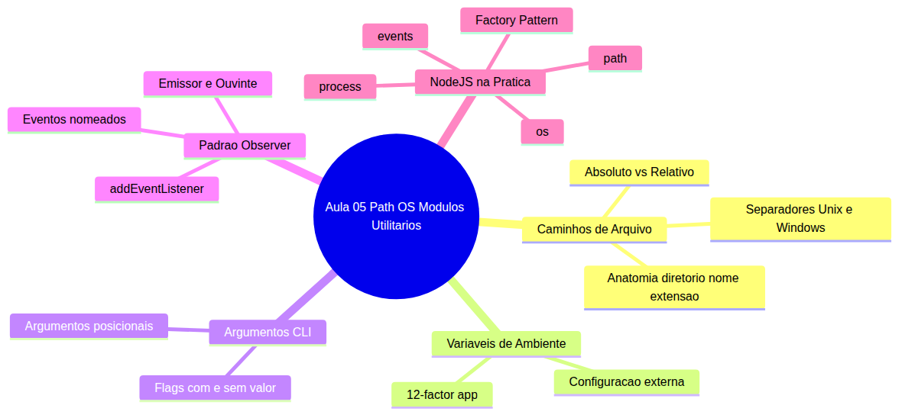
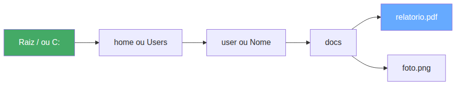
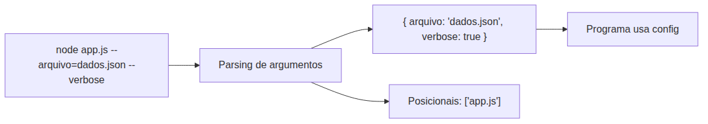
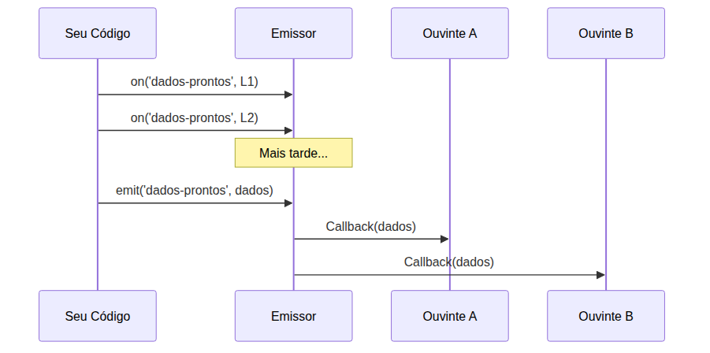
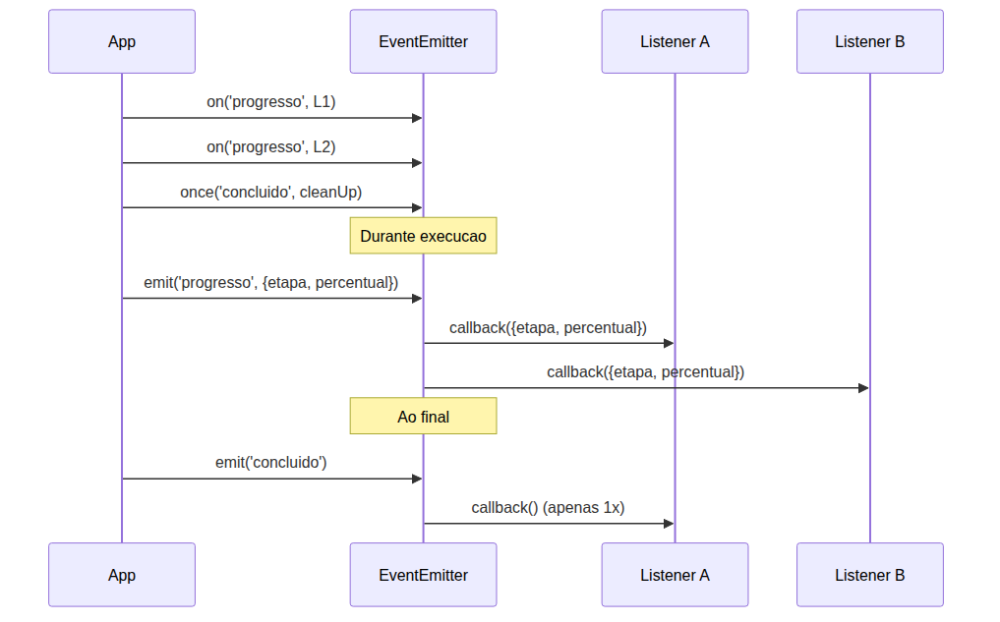
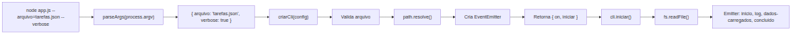

# Node.js — Do Zero ao Servidor Express — Aula 05

## Path, OS e Módulos Utilitários — Ferramentas do Dia a Dia

**Duração estimada:** 100 minutos (55 de leitura + 45 de prática)
**Nível:** Intermediário
**Pré-requisitos:** Aula 01 (Runtime e Event Loop), Aula 02 (npm), Aula 03 (CommonJS), Aula 04 (Sistema de Arquivos)

---

## Objetivos de Aprendizagem

Ao final desta aula, você será capaz de:

- [ ] **Explicar** por que caminhos de arquivo variam entre sistemas operacionais e como isso impacta programas multiplataforma
- [ ] **Distinguir** caminho absoluto de caminho relativo e identificar as partes de um caminho
- [ ] **Definir** o conceito de variável de ambiente como mecanismo de configuração externa
- [ ] **Explicar** o padrão Observer — como emissores notificam ouvintes desacoplados
- [ ] **Construir** caminhos multiplataforma com path.join() e path.resolve(), extraindo partes com path.basename(), path.dirname() e path.extname()
- [ ] **Extrair** informações do sistema operacional com o módulo os
- [ ] **Capturar** argumentos de linha de comando com process.argv e variáveis de ambiente com process.env
- [ ] **Criar** e usar emissores de eventos com EventEmitter — on(), emit() e once()
- [ ] **Aplicar** o Factory Pattern para encapsular criação de objetos configurados
- [ ] **Construir** uma ferramenta CLI funcional que aceita argumentos, usa caminhos multiplataforma e emite eventos de progresso

---

## Como Usar Esta Aula

Esta aula está organizada em duas partes. A **primeira parte** constrói os fundamentos de caminhos, ambiente e eventos. A **segunda parte** aplica esses conceitos com os módulos nativos do Node.js. Ao final, o arquivo separado de Questões de Aprendizagem traz as tarefas de checkpoint.

**Tempo estimado:** 55 minutos de leitura + 45 minutos de prática.

## Mapa Mental

Este diagrama mostra todos os conceitos que você vai dominar nesta aula:





> *O mapa mental acima mostra a estrutura da aula. Cada ramo representa um conceito que você vai explorar.*

## Recapitulação das Aulas Anteriores

| Aula | Conceito | Onde aparece nesta aula | Como se conecta |
|---|---|---|---|
| Aula 01 | **Runtime e Event Loop** | Seções 4 e 7 | O event loop gerencia a fila de callbacks dos eventos; process.exit encerra o processo |
| Aula 02 | **npm e package.json** | Parte 2 | O ecossistema de pacotes que complementa os módulos nativos |
| Aula 03 | **CommonJS e module.exports** | Seções 5-8 | require e module.exports para importar os módulos path, os, events |
| Aula 04 | **fs, __dirname, I/O assíncrono** | Seção 8 | A CLI final lê arquivos JSON com fs.promises.readFile() |

---

**FUNDAMENTOS: Caminhos, Ambiente e Eventos — Os Contratos Universais**

> *Os conceitos desta seção são universais — valem para qualquer linguagem ou ambiente de programação que precise manipular caminhos, configurar programas externamente ou reagir a eventos.*
---

## 1. Caminhos de Arquivo no Mundo Real

Você já navegou por pastas no terminal: `cd /home/user/docs`, `ls C:\Users\Nome\Desktop`, `cd ..`. Cada sistema operacional tem suas regras, mas a estrutura é a mesma: uma hierarquia de diretórios que começa em uma raiz e se ramifica em pastas e arquivos.

O primeiro conceito fundamental é o **separador**. No Linux e macOS, os diretórios são separados por barra `/`. No Windows, a barra invertida `\` é tradicional. Um mesmo programa pode rodar nos dois mundos — e seu código precisa lidar com essa diferença sem quebrar.

Imagine que você escreve `'data/' + nome + '.json'` para montar um caminho. No Linux, funciona: `data/relatorio.json`. No Windows, esse mesmo código gera `data\relatorio.json`... ou não, porque o Windows moderno aceita `/`, mas se você concatenar com algo que veio do usuário, pode gerar `data/\dados.json` com barra duplicada. Esse é o **problema da concatenação manual**: ela é frágil, não sabe as regras do SO e falha silenciosamente.

Agora olhe para a anatomia de um caminho completo. Pegue `/home/user/docs/relatorio.pdf`:

- **Diretório**: `/home/user/docs/` — o caminho até a pasta que contém o arquivo
- **Nome base**: `relatorio.pdf` — o nome completo do arquivo
- **Extensão**: `.pdf` — o sufixo que identifica o tipo (embora o SO não precise disso, os programas usam)
- **Nome puro**: `relatorio` — o nome sem a extensão

Caminhos podem ser **absolutos** ou **relativos**. O caminho absoluto começa da raiz: `/home/user/docs/relatorio.pdf` (Linux) ou `C:\Users\Nome\docs\relatorio.pdf` (Windows). O caminho relativo começa do diretório atual: `./docs/relatorio.pdf` ou `../relatorio.pdf`.

O `.` significa "diretório atual" e `..` significa "diretório pai". Você usa esses dois desde o primeiro comando no terminal — agora entende que são atalhos universais.





> *A hierarquia de diretórios começa na raiz e se aprofunda. O caminho absoluto percorre todos os nós até o arquivo. O relativo parte do nó atual.*

Absoluto vs relativo é uma distinção prática: o absoluto funciona de qualquer lugar — você sabe exatamente onde o arquivo está. O relativo depende de onde o programa foi executado. Um script que usa caminhos relativos pode funcionar hoje e quebrar amanhã só porque você rodou de outra pasta.

### Quick Check 1

**1. Qual a diferença prática entre caminho absoluto e caminho relativo?**
**Resposta:** O absoluto funciona de qualquer diretório pois começa da raiz; o relativo depende do diretório de trabalho atual e pode quebrar se o programa for executado de outra pasta.

**2. Por que concatenar strings para montar caminhos (como 'data/' + nome + '.json') é problemático?**
**Resposta:** Porque não considera as regras do SO — barras duplicadas, separador errado para o Windows e impossibilidade de resolver caminhos absolutos corretamente.

---

## 2. Variáveis de Ambiente

A cada sessão no terminal, seu sistema operacional mantém um conjunto de pares chave-valor chamados **variáveis de ambiente**. Elas contêm informações sobre o sistema e o usuário: `HOME=/home/user`, `PATH=/usr/bin:/bin`, `TEMP=/tmp`.

O propósito fundamental das variáveis de ambiente é **separar a configuração do código**. Um mesmo programa pode rodar em desenvolvimento, testes e produção sem nenhuma alteração no fonte — apenas as variáveis de ambiente mudam.

Esse princípio é formalizado no **12-Factor App**, uma metodologia para construir aplicações modernas. O terceiro fator diz: "Armazene configuração no ambiente". Isso significa: senhas, chaves de API, URLs de banco de dados, portas — tudo isso vai em variáveis de ambiente, nunca no código-fonte.

| Exemplo | O que configura | Por que não colocar no código |
|---|---|---|
| `PORT=3000` | Porta do servidor | Cada ambiente usa uma porta diferente |
| `DB_URL=postgres://...` | Conexão com banco | Contém senha — vazar no repositório expõe dados |
| `API_KEY=abc123` | Chave de serviço externo | Se vazar, qualquer um usa seu serviço |
| `NODE_ENV=production` | Modo de operação | Determina logs, caching, otimizações |

Variáveis de ambiente resolvem um problema clássico: o desenvolvedor precisa testar localmente, depois subir para staging e finalmente para produção. As credenciais e URLs mudam em cada ambiente. Sem variáveis de ambiente, você teria que editar o código a cada deploy — ou usar condicionais `if` manuais que poluem o fonte.

**Nunca coloque segredos no código-fonte.** API keys, senhas de banco e tokens de autenticação pertencem às variáveis de ambiente. Se vazar no repositório, está vazado para sempre — mesmo que você remova depois, o histórico permanece.

### Quick Check 2

**1. Qual o principal benefício de usar variáveis de ambiente em vez de hardcodar configurações no código?**
**Resposta:** O mesmo código roda em desenvolvimento, staging e produção sem alterações — apenas as variáveis de ambiente mudam. Isso segue o princípio 12-Factor App.

**2. Dê dois exemplos de informações que NUNCA devem estar no código-fonte e devem ir para variáveis de ambiente.**
**Resposta:** Senhas de banco de dados e chaves de API (API keys). Se vazarem no repositório, qualquer pessoa pode acessar seus serviços.

---

## 3. Argumentos de Linha de Comando

Você usa argumentos de linha de comando diariamente. `cp origem destino`, `ls -la`, `rm -rf temp`. Cada comando recebe parâmetros que alteram seu comportamento sem modificar o código.

O **contrato** é simples: o usuário digita `programa [flags] [argumentos]` e o programa decide o que fazer com eles. Existem dois tipos principais:

- **Flags com valor**: `--port=3000`, `--arquivo=dados.json`, `-m "mensagem"` — a flag acompanha um valor
- **Flags booleanas**: `--verbose`, `--debug`, `--silent` — a presença da flag equivale a `true`
- **Argumentos posicionais**: `cp origem destino` — a ordem importa; o primeiro é origem, o segundo é destino

A diferença entre flags e variáveis de ambiente é sutil mas importante: flags mudam a cada execução (`node app.js --arquivo=tarefas.json`), enquanto variáveis de ambiente tendem a ser estáveis durante a sessão (`PORT=3000`). Use flags para o que varia a cada chamada; use ambiente para o que é configuração do ambiente.





> *O parser transforma a string crua do terminal em um objeto JavaScript que o programa pode consumir. Cada flag vira uma chave no objeto.*

Imagine que você está escrevendo uma ferramenta de backup. O usuário pode passar `--destino=/backup`, `--compress` e `--verbose`. Sem argumentos de linha de comando, você precisaria criar um arquivo de configuração separado ou editar o código a cada uso. Com flags, o comportamento muda na hora.

### Quick Check 3

**1. Qual a diferença entre uma flag booleana e uma flag com valor?**
**Resposta:** Flag booleana apenas indica presença (--verbose = true) ou ausência. Flag com valor carrega um dado adicional (--port=3000 carrega o número 3000).

**2. Quando usar argumentos de linha de comando versus variáveis de ambiente?**
**Resposta:** Use argumentos para o que varia a cada execução (arquivo de entrada, flags de comportamento). Use variáveis de ambiente para configuração do ambiente (porta, URLs, credenciais) que é estável durante a sessão.

---

## 4. O Padrão Observer (Pub-Sub)

Você já usa o padrão Observer sem saber o nome. Lembra de `botao.addEventListener('click', function() { ... })`? O botão é um **emissor** que dispara o evento `'click'`. A função anônima é um **ouvinte**. O botão não sabe qual função está ouvindo — e não precisa saber.

> *No navegador: `botao.addEventListener('click', callback)` — o botão emite 'click', o callback roda. O botão não conhece o callback. Isso é o padrão Observer.*

O padrão Observer resolve um problema fundamental: **como o componente A notifica o componente B sem conhecer B?** A resposta: A emite um evento nomeado, B se inscreve nesse evento, e o runtime cuida da entrega.

Pense em uma newsletter. Você se inscreve (subscribe), a editora publica (publish), e você recebe o conteúdo no email. A editora não sabe quem são seus assinantes individualmente — ela só tem uma lista de contatos. Quando um novo artigo sai, ela dispara para todos.

Os elementos do padrão são:

1. **Emissor (emitter)**: o objeto que mantém a lista de ouvintes e dispara eventos
2. **Evento (event name)**: um identificador nomeado como `'dados-carregados'` ou `'progresso'`
3. **Ouvinte (listener/callback)**: a função que será chamada quando o evento ocorrer
4. **Disparo (emit)**: o ato de notificar todos os ouvintes de um evento

A mágica do Observer é o **desacoplamento**: o emissor não precisa saber quantos ouvintes existem, quem são ou o que fazem. Cada ouvinte se inscreve independentemente. Você pode adicionar um novo ouvinte sem modificar o emissor.





> *O emissor notifica todos os ouvintes registrados na ordem em que se inscreveram. Cada ouvinte recebe os mesmos dados e decide o que fazer — o emissor não interfere.*

Casos reais de uso do Observer: notificar progresso de uma operação longa, avisar quando um download termina, propagar mudanças de estado em uma interface, logar eventos sem acoplar o logger ao código de negócio.

O padrão Observer é tão fundamental que praticamente todo ecossistema tem uma implementação: eventos do DOM no navegador, EventEmitter em runtimes server-side, signals em algumas linguagens, delegates em C#. O conceito é universal.

### Quick Check 4

**1. Como o padrão Observer desacopla o emissor do ouvinte?**
**Resposta:** O emissor apenas emite eventos nomeados sem saber quem está ouvindo. Os ouvintes se inscrevem independentemente. Nenhum dos dois precisa conhecer o outro.

**2. Na analogia do addEventListener, quem é o emissor, o evento e o ouvinte?**
**Resposta:** O botão é o emissor, 'click' é o evento nomeado, e a função callback é o ouvinte. O botão emite 'click' e a função roda — sem o botão conhecer a função.

---

**APLICAÇÃO: Construindo uma CLI Profissional com Node.js**

> *Agora que você entende caminhos, variáveis de ambiente e o padrão Observer, vamos aplicá-los com os módulos nativos do Node.js. Você construirá uma ferramenta CLI que usa caminhos multiplataforma, lê argumentos e emite eventos de progresso.*
---

## 5. Módulos Utilitários: path e os

Os dois primeiros módulos que você vai conhecer são utilitários de propósito geral: `path` para manipular caminhos de arquivo e `os` para consultar informações do sistema.

### path: Caminhos Multiplataforma

O módulo `path` substitui toda concatenação manual de strings para construção de caminhos. Ele conhece as regras de cada sistema operacional — no Linux usa `/`, no Windows usa `\`.

Para usar: `const path = require('path');`

**path.join()** — o mais usado. Junta segmentos de caminho com o separador correto:

```javascript
const path = require('path');
const caminho = path.join('data', 'tarefas', '2025.json');
console.log(caminho); // Linux: 'data/tarefas/2025.json'
                      // Windows: 'data\\tarefas\\2025.json'
```

Compare com a concatenação manual: `'data/' + 'tarefas/' + '2025.json'`. Se o diretório vier de uma variável e já tiver barra, você ganha `'data//tarefas/2025.json'`. `path.join()` trata isso automaticamente.

**path.resolve()** — resolve uma sequência de caminhos para um caminho absoluto:

```javascript
const path = require('path');
const absoluto = path.resolve('data', 'tarefas.json');
console.log(absoluto); // '/home/user/projeto/data/tarefas.json'
```

`path.resolve()` começa do diretório de trabalho atual e vai subindo ou descendo até chegar ao caminho final. Se o primeiro argumento for absoluto, ele ignora os anteriores.

**path.basename()**, **path.dirname()** e **path.extname()** — extraem partes de um caminho:

```javascript
const path = require('path');
const arquivo = '/home/user/docs/relatorio.pdf';

console.log(path.basename(arquivo));    // 'relatorio.pdf'
console.log(path.dirname(arquivo));     // '/home/user/docs'
console.log(path.extname(arquivo));     // '.pdf'
console.log(path.basename(arquivo, '.pdf')); // 'relatorio'
```

O caso de uso clássico: você recebe um caminho completo e precisa do diretório para criar um arquivo auxiliar no mesmo local, ou precisa da extensão para decidir como processar o arquivo.

**Mão na Massa — Substitua Concatenações por path:**

Crie um arquivo `fix-caminhos.js` e cole o código abaixo. Depois, substitua as concatenações manuais por `path.join()` e `path.resolve()`:

```javascript
// Versão original (com concatenações frágeis)
const dirBase = './data';
const arquivo = 'tarefas.json';

const caminho1 = dirBase + '/' + arquivo;     // frágil — barra fixa
const caminho2 = dirBase + '/' + 'backup' + '/' + arquivo;

console.log('Caminho 1:', caminho1);
console.log('Caminho 2:', caminho2);
```

Modifique o código para usar `path.join()` e `path.resolve()`:

```javascript
const path = require('path');
const dirBase = './data';
const arquivo = 'tarefas.json';

const caminho1 = path.join(dirBase, arquivo);
const caminho2 = path.join(dirBase, 'backup', arquivo);
const caminhoAbsoluto = path.resolve(dirBase, arquivo);

console.log('Caminho 1:', caminho1);
console.log('Caminho 2:', caminho2);
console.log('Absoluto:', caminhoAbsoluto);
```

**Verificação:** Execute `node fix-caminhos.js`. O terminal deve mostrar os caminhos formatados corretamente para o seu SO. No Windows, você verá `\`; no Linux/macOS, `/`. O caminho absoluto termina com o diretório completo do seu projeto.

### Módulo os: Informações do Sistema

O módulo `os` expõe informações do sistema operacional. É uma ferramenta de diagnóstico rápida — útil para logs, relatórios de ambiente e decisões condicionais.

```javascript
const os = require('os');

console.log('Plataforma:', os.platform());   // 'linux', 'darwin', 'win32'
console.log('CPUs:', os.cpus().length);       // Número de núcleos
console.log('Memória livre:', os.freemem());  // Em bytes
console.log('Memória total:', os.totalmem()); // Em bytes
console.log('Home:', os.homedir());           // Diretório home
```

`os.platform()` responde "em qual SO estou rodando?" — útil para código condicional. `os.cpus()` retorna um array de objetos com detalhes de cada núcleo. `os.freemem()` e `os.totalmem()` retornam bytes — divida por 1024³ para ver em gigabytes.

O `os.homedir()` é particularmente útil para construir caminhos como `~/data/tarefas.json`. Você combina `os.homedir()` com `path.join()` para criar caminhos absolutos que funcionam em qualquer máquina:

```javascript
const path = require('path');
const os = require('os');
const configPath = path.join(os.homedir(), '.config', 'meu-app', 'dados.json');
console.log(configPath); // /home/user/.config/meu-app/dados.json
```

### Quick Check 5

**1. Qual a diferença entre path.join() e path.resolve()?**
**Resposta:** path.join() junta segmentos com o separador do SO. path.resolve() faz o mesmo mas retorna um caminho absoluto, resolvendo a partir do diretório de trabalho atual.

**2. Para que serve os.platform() e quando você usaria?**
**Resposta:** os.platform() retorna o nome do SO ('linux', 'darwin', 'win32'). Você usaria para executar comandos diferentes por plataforma ou exibir mensagens específicas do sistema.

---

## 6. Módulo process: Argumentos e Ambiente

O objeto global `process` é a ponte entre seu programa Node.js e o sistema operacional. Por ele passam os argumentos de linha de comando, as variáveis de ambiente e o controle do ciclo de vida do processo.

### process.argv — Argumentos da Linha de Comando

Quando você executa `node app.js --arquivo=dados.json --verbose`, o Node.js transforma tudo que vem depois de `node` em um array. Esse array é o `process.argv`:

```javascript
// app.js
console.log(process.argv);
// Execução: node app.js --arquivo=dados.json --verbose
// Saída: [
//   '/usr/bin/node',
//   '/home/user/app.js',
//   '--arquivo=dados.json',
//   '--verbose'
// ]
```

O primeiro elemento é o caminho do executável Node.js. O segundo é o caminho do script. Do terceiro em diante estão os argumentos que o usuário passou.

Agora vamos construir um **parser de flags** — uma função genérica que transforma esse array em um objeto utilizável:

```javascript
function parseArgs(argv) {
  const args = {};
  // Ignora os dois primeiros elementos (node path e script path)
  const rawArgs = argv.slice(2);
  
  for (const arg of rawArgs) {
    if (arg.startsWith('--')) {
      // Remove '--' prefix
      const semPrefixo = arg.slice(2);
      if (semPrefixo.includes('=')) {
        // Flag com valor: --arquivo=dados.json
        const [chave, valor] = semPrefixo.split('=');
        args[chave] = valor;
      } else {
        // Flag booleana: --verbose
        args[semPrefixo] = true;
      }
    }
  }
  return args;
}

const args = parseArgs(process.argv);
console.log(args);
```

Execute com: `node app.js --arquivo=dados.json --verbose`

Saída: `{ arquivo: 'dados.json', verbose: true }`

Este parser é simples e cobre 80% dos casos. Você pode estendê-lo para aceitar aliases com um hífen (`-v` para `--verbose`) e valores sem `=` (`--arquivo dados.json`), mas para esta aula o formato com `--chave=valor` e `--flag` é suficiente.

### process.env — Variáveis de Ambiente

`process.env` é um objeto que contém todas as variáveis de ambiente do processo atual:

```javascript
console.log(process.env.HOME);        // /home/user (Linux/macOS)
console.log(process.env.USERNAME);    // user (Windows)
console.log(process.env.PATH);        // /usr/bin:/bin:/usr/local/bin
```

A convenção mais famosa no ecossistema é `NODE_ENV`. Ela não é nativa do Node.js — é uma convenção que frameworks e bibliotecas usam para determinar o modo de operação:

```javascript
const ambiente = process.env.NODE_ENV || 'development';
if (ambiente === 'production') {
  console.log('Modo produção — logs reduzidos');
} else {
  console.log('Modo desenvolvimento — logs detalhados');
}
```

### process.cwd() e process.exit()

`process.cwd()` retorna o diretório de trabalho atual — de onde o programa foi executado (diferente de `__dirname`, que é o diretório onde o arquivo fonte está). A diferença é sutil mas crucial: se você rodar `node /home/user/app.js` de dentro de `/tmp`, `process.cwd()` retorna `/tmp` e `__dirname` retorna `/home/user`.

`process.exit(codigo)` encerra o programa imediatamente. Por convenção, `0` significa sucesso e `1` significa erro:

```javascript
if (!args.arquivo) {
  console.error('Erro: arquivo não especificado. Use --arquivo=nome.json');
  process.exit(1);
}
```

**Mão na Massa — Parser de Argumentos:**

Crie um arquivo `parse-flags.js` com o parser genérico acima e adicione:

```javascript
function parseArgs(argv) {
  const args = {};
  const rawArgs = argv.slice(2);
  for (const arg of rawArgs) {
    if (arg.startsWith('--')) {
      const semPrefixo = arg.slice(2);
      if (semPrefixo.includes('=')) {
        const [chave, valor] = semPrefixo.split('=');
        args[chave] = valor;
      } else {
        args[semPrefixo] = true;
      }
    }
  }
  return args;
}

const args = parseArgs(process.argv);
console.log('Argumentos parseados:', args);

if (args.arquivo) {
  console.log('Arquivo alvo:', args.arquivo);
}
if (args.verbose) {
  console.log('Modo verbose ativado');
}
```

Execute com diferentes combinações e observe a saída:

```bash
node parse-flags.js --arquivo=dados.json
node parse-flags.js --arquivo=dados.json --verbose
node parse-flags.js --help
```

**Verificação:** Na primeira execução, a saída deve mostrar `{ arquivo: 'dados.json' }`. Na segunda, deve incluir `verbose: true`. Na terceira, sem flag `--arquivo`, o script executa mas não entra no `if`.

### Quick Check 6

**1. O que contém process.argv e quais elementos são ignorados em um parser de flags?**
**Resposta:** process.argv contém o path do Node.js na posição 0, o path do script na posição 1 e os argumentos do usuário da posição 2 em diante. O parser ignora as duas primeiras posições.

**2. Qual a diferença entre process.cwd() e __dirname?**
**Resposta:** process.cwd() retorna de onde o programa foi executado (pode mudar). __dirname retorna o diretório onde o arquivo fonte está (fixo, determinado pela localização do arquivo).

---

## 7. Módulo events: O EventEmitter do Node.js

O módulo `events` fornece a classe `EventEmitter` — a implementação canônica do padrão Observer no Node.js. Você viu o conceito na Seção 4 com `addEventListener`: aqui está exatamente a mesma ideia, com sintaxe própria do Node.js.

No navegador: `botao.addEventListener('click', fn)`.
No Node.js: `emitter.on('dados-prontos', fn)`.

```javascript
const { EventEmitter } = require('events');
const emitter = new EventEmitter();

// Inscreve um ouvinte
emitter.on('saudacao', (nome) => {
  console.log(`Olá, ${nome}!`);
});

// Dispara o evento
emitter.emit('saudacao', 'Maria');
// Saída: Olá, Maria!
```

Você cria um emissor com `new EventEmitter()`, inscreve ouvintes com `.on(evento, callback)` e dispara com `.emit(evento, dados)`. Os dados passados no `emit` são recebidos como argumento pelo callback.

**Múltiplos ouvintes:** um mesmo evento pode ter vários ouvintes. Todos são chamados na ordem em que foram registrados:

```javascript
emitter.on('dados-carregados', (dados) => {
  console.log('Logger:', dados.length, 'registros');
});
emitter.on('dados-carregados', (dados) => {
  console.log('Contador: processando...');
});

emitter.emit('dados-carregados', [1, 2, 3]);
// Logger: 3 registros
// Contador: processando...
```

**once()** — ouvinte que executa apenas uma vez e depois se remove automaticamente:

```javascript
emitter.once('conectado', () => {
  console.log('Primeira conexão estabelecida!');
});

emitter.emit('conectado'); // Saída: Primeira conexão estabelecida!
emitter.emit('conectado'); // (silêncio — o ouvinte foi removido)
```

`once()` é ideal para eventos únicos: conexão inicial, carregamento completo, notificação de boas-vindas.

**Passando dados estruturados:** eventos podem carregar objetos completos:

```javascript
emitter.on('progresso', (dados) => {
  console.log(`Etapa: ${dados.etapa} — ${dados.percentual}% concluído`);
});

emitter.emit('progresso', { etapa: 'Carregando', percentual: 30 });
emitter.emit('progresso', { etapa: 'Processando', percentual: 70 });
emitter.emit('progresso', { etapa: 'Finalizando', percentual: 100 });
```





> *EventEmitter notifica todos os ouvintes na ordem de registro. once() remove o ouvinte após a primeira execução. O padrão é idêntico ao Observer da Seção 4 — só muda a sintaxe.*

**Mão na Massa — Relógio de Progresso com EventEmitter:**

Crie um arquivo `relogio-progresso.js`:

```javascript
const { EventEmitter } = require('events');

function criarRelogioProgresso() {
  const emissor = new EventEmitter();
  const etapas = ['Preparando', 'Processando', 'Finalizando'];
  let indice = 0;
  
  function avancar() {
    if (indice >= etapas.length) return;
    const etapa = etapas[indice];
    const percentual = Math.round(((indice + 1) / etapas.length) * 100);
    emissor.emit('progresso', { etapa, percentual });
    indice++;
  }
  
  // Expõe o emissor e o controle
  return {
    on: (evento, callback) => emissor.on(evento, callback),
    avancar
  };
}

const relogio = criarRelogioProgresso();

relogio.on('progresso', (dados) => {
  console.log(`[${dados.percentual}%] ${dados.etapa}`);
});

relogio.avancar(); // [33%] Preparando
relogio.avancar(); // [66%] Processando
relogio.avancar(); // [100%] Finalizando
```

**Verificação:** Execute `node relogio-progresso.js` e observe as três mensagens de progresso. O EventEmitter notifica o ouvinte a cada chamada de `avancar()`, passando o estado atual.

### Quick Check 7

**1. Qual a diferença entre on() e once() no EventEmitter?**
**Resposta:** on() mantém o ouvinte registrado para todas as emissões futuras do evento. once() executa o callback apenas na primeira emissão e remove o ouvinte automaticamente.

**2. Como o EventEmitter se relaciona com o padrão Observer visto na Seção 4?**
**Resposta:** EventEmitter é a implementação concreta do padrão Observer no Node.js. emitter.on() equivale a addEventListener e emitter.emit() dispara o evento, exatamente como o emissor conceitual da PARTE 1.

---

## 8. Factory Pattern + CLI: Juntando Tudo

Você já tem todas as peças: `path` para caminhos, `process.argv` para argumentos, `EventEmitter` para eventos. Falta organizar isso em um programa que faça sentido — e é aqui que entra o **Factory Pattern**.

O Factory Pattern é uma função que cria e retorna objetos configurados. Diferente de `new Classe()`, a factory pode conter lógica condicional, validação de parâmetros e valores padrão antes de criar o objeto:

```javascript
function criarRelogio({ formato24h = true, fuso = 'local' } = {}) {
  // Validação
  if (typeof formato24h !== 'boolean') {
    throw new TypeError('formato24h deve ser booleano');
  }
  
  // Lógica condicional
  const prefixo = formato24h ? 'HH:MM' : 'HH:MM AM/PM';
  
  // Retorna o objeto configurado
  return {
    formato: prefixo,
    fuso,
    horario: () => new Date().toLocaleTimeString()
  };
}

const relogio = criarRelogio({ formato24h: false });
console.log(relogio.horario()); // "2:30:00 PM"
```

A factory vale quando a inicialização de um objeto envolve: validação de parâmetros, escolha entre implementações diferentes, configuração de valores padrão, ou criação de dependências internas (como o EventEmitter).

### Quick Check 8

**1. Qual a diferença entre usar uma factory e usar `new Classe()` para criar objetos?**
**Resposta:** A factory pode conter lógica condicional, validação e valores padrão antes de retornar o objeto, enquanto `new` apenas invoca o construtor — sem espaço para decisões pré-criação.

**2. No código da factory `criarCli`, qual é o papel do EventEmitter e por que ele fica interno à factory?**
**Resposta:** O EventEmitter notifica os ouvintes sobre o progresso da CLI (início, log, erro, conclusão) sem que o código externo precise acessar o emissor diretamente — a factory encapsula a criação e expõe apenas `.on()` como API pública.

### A CLI Final: node app.js --arquivo=tarefas.json --verbose

Agora vamos construir a **ferramenta CLI** que integra tudo que você aprendeu. A estrutura tem três arquivos:

**1. `parseArgs.js`** — parser de argumentos (já criado na Seção 6):

```javascript
function parseArgs(argv) {
  const args = {};
  const rawArgs = argv.slice(2);
  for (const arg of rawArgs) {
    if (arg.startsWith('--')) {
      const semPrefixo = arg.slice(2);
      if (semPrefixo.includes('=')) {
        const [chave, valor] = semPrefixo.split('=');
        args[chave] = valor;
      } else {
        args[semPrefixo] = true;
      }
    }
  }
  return args;
}

module.exports = parseArgs;
```

**2. `criarCli.js`** — a factory que cria a CLI:

```javascript
const { EventEmitter } = require('events');
const path = require('path');
const fs = require('fs').promises;
const parseArgs = require('./parseArgs');

function criarCli(config) {
  const emitter = new EventEmitter();
  
  // Validação
  if (!config.arquivo) {
    throw new Error('Argumento --arquivo é obrigatório');
  }
  
  // Resolve o caminho do arquivo
  const caminhoArquivo = path.resolve(config.arquivo);
  
  // Retorna a API pública da CLI
  return {
    on: (evento, callback) => emitter.on(evento, callback),
    
    async iniciar() {
      try {
        emitter.emit('inicio', { arquivo: caminhoArquivo });
        
        if (config.verbose) {
          emitter.emit('log', `Lendo arquivo: ${caminhoArquivo}`);
        }
        
        const dados = await fs.readFile(caminhoArquivo, 'utf-8');
        const tarefas = JSON.parse(dados);
        
        emitter.emit('dados-carregados', {
          quantidade: tarefas.length,
          arquivo: caminhoArquivo
        });
        
        emitter.emit('concluido', { total: tarefas.length });
        
        return tarefas;
      } catch (erro) {
        emitter.emit('erro', { mensagem: erro.message });
        throw erro;
      }
    }
  };
}

module.exports = criarCli;
```

**3. `app.js`** — o ponto de entrada:

```javascript
const criarCli = require('./criarCli');
const parseArgs = require('./parseArgs');

const args = parseArgs(process.argv);

try {
  const cli = criarCli({ arquivo: args.arquivo, verbose: args.verbose });
  
  cli.on('inicio', (dados) => console.log('Iniciando:', dados.arquivo));
  cli.on('log', (msg) => console.log('[LOG]', msg));
  cli.on('dados-carregados', (dados) => {
    console.log(`${dados.quantidade} tarefas carregadas de ${dados.arquivo}`);
  });
  cli.on('concluido', (dados) => console.log(`Concluído — ${dados.total} tarefas`));
  cli.on('erro', (dados) => console.error('ERRO:', dados.mensagem));
  
  cli.iniciar().catch(() => process.exit(1));
} catch (erro) {
  console.error('Erro ao criar CLI:', erro.message);
  process.exit(1);
}
```





> *Fluxo completo da CLI: argumentos entram pela direita, passam pelo parser, a factory valida e configura, o emitter notifica cada etapa, e o fs.readFile (da Aula 04) carrega os dados.*

**Mão na Massa — Construa sua CLI:**

- [ ] Crie a pasta `projeto-cli/` dentro do diretório da aula
- [ ] Crie `parseArgs.js` com o parser de argumentos
- [ ] Crie `criarCli.js` com a factory
- [ ] Crie `app.js` com o ponto de entrada
- [ ] Crie `tarefas.json` com conteúdo de teste:

```json
[
  { "id": 1, "titulo": "Estudar Node.js", "status": "concluída" },
  { "id": 2, "titulo": "Construir CLI", "status": "pendente" },
  { "id": 3, "titulo": "Integrar com servidor", "status": "pendente" }
]
```

- [ ] Execute: `node app.js --arquivo=tarefas.json --verbose`
- [ ] Teste sem `--arquivo` e verifique a mensagem de erro
- [ ] Teste sem `--verbose` e note que as mensagens de log somem

**Verificação:** Com `--verbose`, você deve ver: mensagem de início, LOG do caminho resolvido, contagem de tarefas carregadas e conclusão. Sem `--arquivo`, o programa deve exibir erro e encerrar com código 1.

---

## Autoavaliação: Quiz Rápido

**1. Qual método do módulo path retorna o caminho absoluto a partir de segmentos relativos?**
**Resposta:**

`path.resolve()`. Ele combina os segmentos e retorna um caminho absoluto baseado no diretório de trabalho atual.

**2. O que o módulo os pode informar sobre a máquina que executa o programa?**
**Resposta:**

Plataforma (linux/darwin/win32), número de CPUs, memória livre e total, e diretório home do usuário.

**3. O que contém o array process.argv e por que um parser precisa ignorar os dois primeiros elementos?**
**Resposta:**

Contém o caminho do Node.js, o caminho do script e os argumentos do usuário. Os dois primeiros são internos — os argumentos reais começam no índice 2.

**4. Qual a diferença entre emitter.on() e emitter.once()?**
**Resposta:**

on() mantém o ouvinte para todas as emissões futuras. once() executa apenas na primeira emissão e remove o ouvinte.

**5. O que o Factory Pattern permite fazer que new Classe() não permite?**
**Resposta:**

A factory pode conter lógica condicional, validação de parâmetros, valores padrão e early return — tudo antes de criar o objeto.

**6. Como o padrão Observer (Seção 4) se manifesta no EventEmitter (Seção 7)?**
**Resposta:**

O EventEmitter implementa o Observer: on() = subscribe, emit() = publish. O emissor não conhece os ouvintes — apenas emite eventos nomeados.

**7. Qual a diferença entre process.cwd() e __dirname?**
**Resposta:**

process.cwd() é o diretório onde o programa foi executado. __dirname é o diretório onde o arquivo fonte está. Eles podem ser diferentes.

---

## Mão na Massa: Exercícios Graduados

**Exercício 1 (Fácil) — Script de Diagnóstico do Sistema**

Crie um arquivo `diagnostico.js` que usa os módulos `os` e `path` para exibir: plataforma, número de CPUs, memória livre em MB, memória total em MB e o caminho completo de um arquivo `diagnostico.log` no diretório home do usuário.

Use `os.freemem() / (1024 * 1024)` para converter bytes em megabytes. Use `path.join(os.homedir(), 'diagnostico.log')` para o caminho do log.

**Gabarito:**

```javascript
const os = require('os');
const path = require('path');

const memoriaLivreMB = (os.freemem() / (1024 * 1024)).toFixed(2);
const memoriaTotalMB = (os.totalmem() / (1024 * 1024)).toFixed(2);

console.log('=== Diagnóstico do Sistema ===');
console.log('Plataforma:', os.platform());
console.log('CPUs:', os.cpus().length);
console.log('Memória livre:', memoriaLivreMB, 'MB');
console.log('Memória total:', memoriaTotalMB, 'MB');
console.log('Arquivo de log:', path.join(os.homedir(), 'diagnostico.log'));
```

**Exercício 2 (Médio) — Validador de Argumentos**

Crie um arquivo `validador-args.js` que estende o parser `parseArgs` da Seção 6. Adicione suporte para aliases com um hífen: `-v` para `--verbose`, `-a` para `--arquivo`. O parser deve aceitar tanto `--arquivo=dados.json` quanto `-a dados.json` (com espaço).

O retorno deve ser o mesmo objeto, mas com as chaves expandidas (verbose e arquivo) independentemente de como foram passadas.

**Gabarito:**

```javascript
function parseArgs(argv) {
  const args = {};
  const rawArgs = argv.slice(2);
  const alias = { '-v': 'verbose', '-a': 'arquivo' };
  
  for (let i = 0; i < rawArgs.length; i++) {
    const arg = rawArgs[i];
    
    if (arg.startsWith('--')) {
      const semPrefixo = arg.slice(2);
      if (semPrefixo.includes('=')) {
        const [chave, valor] = semPrefixo.split('=');
        args[chave] = valor;
      } else {
        args[semPrefixo] = true;
      }
    } else if (alias[arg]) {
      const chave = alias[arg];
      // Se o próximo existe e não começa com '-', é o valor
      if (i + 1 < rawArgs.length && !rawArgs[i + 1].startsWith('-')) {
        i++;
        args[chave] = rawArgs[i];
      } else {
        args[chave] = true;
      }
    }
  }
  return args;
}

console.log(parseArgs(['node', 'app.js', '-v']));
console.log(parseArgs(['node', 'app.js', '-a', 'dados.json', '-v']));
```

**Desafio (Difícil) — CLI com Múltiplos Comandos**

Crie um arquivo `cli-multicomandos.js` que estende a CLI da Seção 8 para suportar subcomandos no estilo `git commit -m "msg"`. A CLI deve aceitar:

- `node cli-multicomandos.js listar --arquivo=tarefas.json` → lista todas as tarefas
- `node cli-multicomandos.js adicionar --arquivo=tarefas.json --titulo="Nova tarefa"` → adiciona uma nova tarefa
- `node cli-multicomandos.js --help` → exibe ajuda

Dica: o primeiro argumento não-flag (argv[2]) é o comando. Use `fs.promises.readFile` e `fs.promises.writeFile` para ler e salvar as tarefas.

**Gabarito:**

```javascript
const fs = require('fs').promises;
const path = require('path');

function parseArgs(argv) {
  const args = { _: [] };
  const rawArgs = argv.slice(2);
  for (const arg of rawArgs) {
    if (arg.startsWith('--')) {
      const semPrefixo = arg.slice(2);
      if (semPrefixo.includes('=')) {
        const [chave, valor] = semPrefixo.split('=');
        args[chave] = valor;
      } else {
        args[semPrefixo] = true;
      }
    } else {
      args._.push(arg); // argumentos posicionais
    }
  }
  return args;
}

async function main() {
  const args = parseArgs(process.argv);
  const comando = args._[0];
  
  if (!comando || comando === '--help') {
    console.log('Uso: node cli-multicomandos.js <comando> [opcoes]');
    console.log('Comandos: listar, adicionar');
    console.log('Opcoes: --arquivo, --titulo');
    return;
  }
  
  if (!args.arquivo) {
    console.error('Erro: --arquivo é obrigatório');
    process.exit(1);
  }
  
  const caminho = path.resolve(args.arquivo);
  
  try {
    if (comando === 'listar') {
      const dados = await fs.readFile(caminho, 'utf-8');
      const tarefas = JSON.parse(dados);
      console.log('Tarefas:');
      tarefas.forEach(t => console.log(`  [${t.id}] ${t.titulo} — ${t.status}`));
    } else if (comando === 'adicionar') {
      if (!args.titulo) {
        console.error('Erro: --titulo é obrigatório para adicionar');
        process.exit(1);
      }
      const dados = await fs.readFile(caminho, 'utf-8');
      const tarefas = JSON.parse(dados);
      const novoId = tarefas.length > 0 ? Math.max(...tarefas.map(t => t.id)) + 1 : 1;
      tarefas.push({ id: novoId, titulo: args.titulo, status: 'pendente' });
      await fs.writeFile(caminho, JSON.stringify(tarefas, null, 2));
      console.log(`Tarefa "${args.titulo}" adicionada com ID ${novoId}`);
    } else {
      console.error('Comando desconhecido:', comando);
      process.exit(1);
    }
  } catch (erro) {
    console.error('Erro:', erro.message);
    process.exit(1);
  }
}

main();
```

---

## Resumo da Aula

### Os 10 Conceitos Fundamentais

1. **Separadores de caminho**: `/` no Linux/macOS, `\` no Windows — nunca concatene manualmente
2. **Absoluto vs relativo**: absoluto começa da raiz e funciona de qualquer lugar; relativo depende do CWD
3. **Variáveis de ambiente**: pares chave-valor externos ao código que separam configuração de implementação
4. **Argumentos CLI**: o contrato `programa [flags] [argumentos]` parametriza comportamento sem editar código
5. **Padrão Observer**: emissor emite eventos nomeados; ouvintes se inscrevem sem o emissor conhecê-los
6. **path.join() e path.resolve()**: construção multiplataforma de caminhos sem concatenação
7. **process.argv e process.env**: acesso a argumentos e ambiente — a ponte entre Node.js e o SO
8. **EventEmitter**: a implementação do Observer no Node.js — on(), emit(), once()
9. **Factory Pattern**: função que cria objetos configurados com validação, defaults e lógica condicional
10. **CLI integrada**: a combinação de todas as peças — argumentos → parser → factory → eventos → arquivos

### O Que Você Construiu Hoje

- [x] Script de diagnóstico do sistema (os + path)
- [x] Parser genérico de argumentos CLI (parseArgs)
- [x] Relógio de progresso com EventEmitter
- [x] CLI funcional completa com factory, eventos e leitura de arquivos
- [x] Validador com aliases de argumentos

---

## Próxima Aula

**Aula 06: Criando um Servidor HTTP — Do Zero com o Módulo http**

A CLI que você construiu hoje será a base do servidor HTTP da próxima aula. Você vai aprender a criar um servidor web com o módulo nativo `http`, entender `req` e `res`, fazer roteamento manual e servir JSON. O Gerenciador de Tarefas vai ganhar uma interface HTTP — em vez de `node app.js --arquivo=tarefas.json`, será `curl http://localhost:3000/tarefas`.

---

## Referências

### Documentação Oficial

- [Node.js path docs](https://nodejs.org/api/path.html)
- [Node.js os docs](https://nodejs.org/api/os.html)
- [Node.js process docs](https://nodejs.org/api/process.html)
- [Node.js events docs](https://nodejs.org/api/events.html)

### Padrões e Princípios

- [12-Factor App — Config](https://12factor.net/config)
- [Refactoring Guru — Factory Method](https://refactoring.guru/design-patterns/factory-method)
- [Refactoring Guru — Observer](https://refactoring.guru/design-patterns/observer)

### Artigos para Aprofundamento

- [Understanding process.env in Node.js](https://nodejs.org/en/learn/command-line/how-to-read-environment-variables-from-nodejs)
- [Node.js EventEmitter Explained](https://nodejs.org/en/learn/asynchronous-work/the-nodejs-event-emitter)

---

## FAQ

**P: path.join() e path.resolve() parecem fazer a mesma coisa. Qual usar?**
R: path.join() apenas junta segmentos com o separador correto. path.resolve() também resolve para um caminho absoluto. Use join para montar caminhos relativos, resolve quando precisar do caminho completo.

**P: Por que meu script com caminhos relativos funciona no terminal mas quebra no VS Code?**
R: O diretório de trabalho (CWD) muda conforme onde você executa o comando. Use __dirname em vez de caminhos relativos para arquivos próximos ao script.

**P: Variáveis de ambiente são seguras para senhas?**
R: São mais seguras que hardcodar no código, mas não são criptografadas. Em produção, use serviços como AWS Secrets Manager ou Hashicorp Vault.

**P: O parser de argumentos que construí na Seção 6 cobre todos os casos?**
R: Não. Um parser completo trata flags com e sem valor, aliases, argumentos posicionais, --help automático e validação de tipos. O seu cobre os casos mais comuns para uma CLI simples.

**P: EventEmitter vs callback — quando usar cada um?**
R: Use callback para uma única notificação (leitura de arquivo). Use EventEmitter para múltiplas notificações ao longo do tempo (progresso, múltiplos eventos).

**P: Posso criar um EventEmitter que emite para ouvintes específicos?**
R: Todos os ouvintes de um evento recebem a notificação. Para filtrar, o ouvinte verifica os dados recebidos ou você usa eventos nomeados diferentes ('erro-banco' vs 'erro-rede').

**P: Factory Pattern substitui classes?**
R: Não substitui, são complementares. Use classes para modelar entidades com comportamento e estado. Use factory quando a criação envolve lógica condicional, validação ou injeção de dependências.

**P: O que acontece se eu emitir um evento que ninguém está ouvindo?**
R: Nada. O EventEmitter simplesmente ignora — não gera erro. Isso é proposital: o emissor não precisa saber se há ouvintes.

**P: process.exit(1) realmente encerra tudo imediatamente?**
R: Sim, encerra o processo Node.js na hora, ignorando qualquer código ainda na fila do event loop. Use com cuidado — em produção, prefira deixar o processo encerrar naturalmente.

**P: Como vejo todas as variáveis de ambiente disponíveis no meu sistema?**
R: No terminal: `env` (Linux/macOS) ou `set` (Windows). No Node.js: `console.log(process.env)`.

---

## Glossário

| Termo | Definição |
|---|---|
| **Caminho absoluto** | Caminho que começa da raiz do sistema de arquivos (/ ou C:\). Funciona de qualquer diretório. (Ver seção 1) |
| **Caminho relativo** | Caminho que parte do diretório atual (./ ou ../). Depende de onde o programa foi executado. (Ver seção 1) |
| **CLI** | *Command Line Interface* — programa executado via terminal que aceita argumentos e flags. (Ver seção 8) |
| **CWD** | *Current Working Directory* — diretório de trabalho atual, obtido com process.cwd(). (Ver seção 6) |
| **EventEmitter** | Classe do módulo events que implementa o padrão Observer no Node.js. (Ver seção 7) |
| **Evento nomeado** | Identificador string que nomeia um evento ('progresso', 'erro', 'concluido'). (Ver seção 4) |
| **Factory Pattern** | Função que cria e retorna objetos configurados, encapsulando lógica de inicialização. (Ver seção 8) |
| **Flag** | Argumento de CLI que começa com -- ou - e altera o comportamento do programa. (Ver seção 3) |
| **Observer** | Padrão de design onde um emissor notifica múltiplos ouvintes sobre eventos sem conhecê-los. (Ver seção 4) |
| **Parser de argumentos** | Função que transforma um array de strings em um objeto estruturado com chave/valor. (Ver seção 6) |
| **path.join()** | Método que junta segmentos de caminho com o separador correto do SO. (Ver seção 5) |
| **path.resolve()** | Método que resolve segmentos para um caminho absoluto. (Ver seção 5) |
| **process.argv** | Array com argumentos da linha de comando passados ao programa Node.js. (Ver seção 6) |
| **process.env** | Objeto com todas as variáveis de ambiente do processo atual. (Ver seção 6) |
| **Variável de ambiente** | Par chave-valor definido fora do código que configura o comportamento do programa. (Ver seção 2) |
