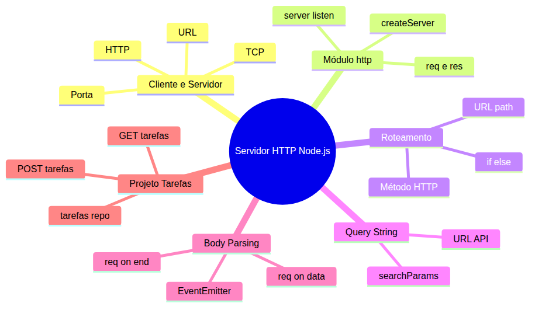
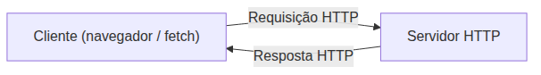
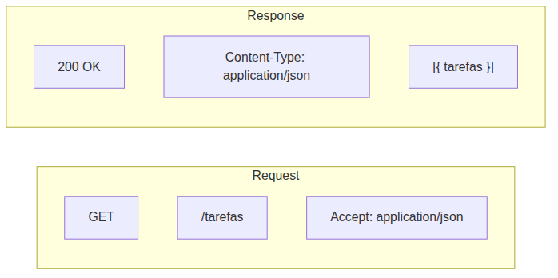
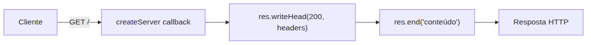
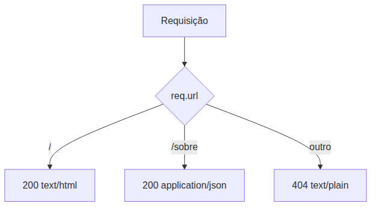
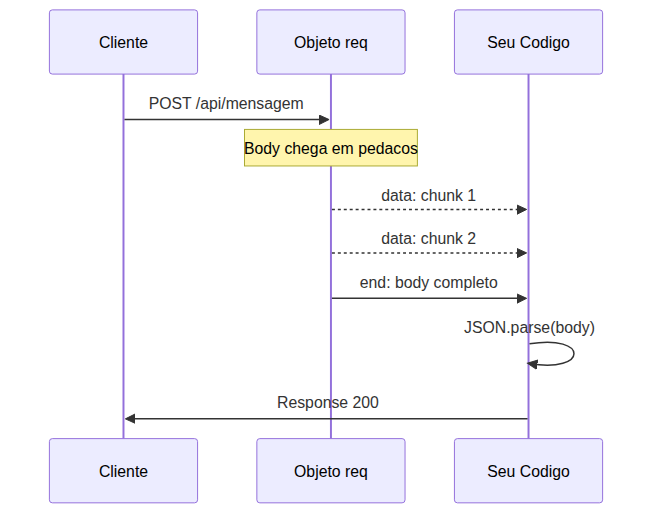
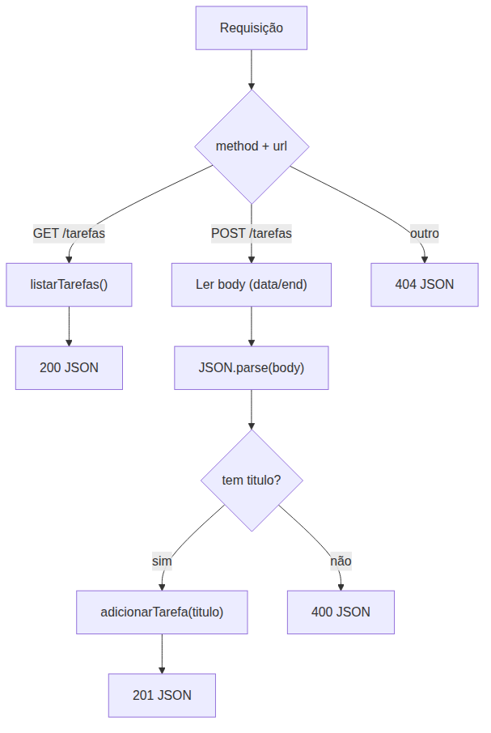

# Node.js — Do Zero ao Servidor Express — Aula 06

## Criando um Servidor HTTP — Do Zero com o Módulo http

**Duração estimada:** 90 minutos (50 de leitura + 40 de prática)
**Nível:** Intermediário
**Pré-requisitos:** Aula 01 (Runtime e Event Loop), Aula 02 (npm), Aula 03 (CommonJS), Aula 04 (Sistema de Arquivos), Aula 05 (EventEmitter, Path, OS)

---

## Objetivos de Aprendizagem

Ao final desta aula, você será capaz de:

- [ ] **Explicar** o modelo cliente-servidor e como ele organiza a comunicação na web
- [ ] **Definir** o papel do HTTP como protocolo de comunicação entre cliente e servidor
- [ ] **Descrever** os componentes de uma requisição e resposta HTTP (method, URL, status code, headers, body)
- [ ] **Distinguir** o papel de portas TCP e URLs no endereçamento de servidores
- [ ] **Construir** um servidor HTTP funcional com o módulo `http` nativo do Node.js
- [ ] **Interpretar** os objetos `req` (method, url, headers) e `res` (writeHead, end)
- [ ] **Servir** conteúdo HTML e JSON com o cabeçalho Content-Type apropriado
- [ ] **Implementar** roteamento manual baseado em método HTTP e URL
- [ ] **Extrair** parâmetros de query string com a API URL do Node.js
- [ ] **Ler** o corpo de requisições POST usando eventos `data` e `end` do EventEmitter

---

## Como Usar Esta Aula

Esta aula está organizada em duas partes. A **primeira parte** constrói os fundamentos de cliente, servidor e o protocolo HTTP. A **segunda parte** aplica esses conceitos com o módulo `http` do Node.js. Ao final, o arquivo separado de Questões de Aprendizagem traz as tarefas de checkpoint.

**Tempo estimado:** 50 minutos de leitura + 40 minutos de prática.

## Mapa Mental

Este diagrama mostra todos os conceitos que você vai dominar nesta aula:





> *O mapa mental acima mostra a estrutura da aula. Cada ramo representa um conceito que você vai explorar.*

## Recapitulação das Aulas Anteriores

| Aula | Conceito | Onde aparece nesta aula | Como se conecta |
|---|---|---|---|
| Aula 01 | **Runtime e Event Loop** | Seções 4-9 | O event loop gerencia as requisições HTTP recebidas sem bloquear |
| Aula 02 | **npm e package.json** | Seções 4, 9 | Estrutura do projeto e gerenciamento de dependências |
| Aula 03 | **CommonJS e module.exports** | Seções 4-9 | `require('http')` importa o módulo nativo; `module.exports` expõe o servidor |
| Aula 04 | **Sistema de Arquivos (fs)** | Seção 9 | `tarefas-repo.js` fornece persistência em JSON para a API de tarefas |
| Aula 05 | **EventEmitter** | Seção 8 | `req.on('data')` usa o mesmo padrão Observer do EventEmitter |

---

**FUNDAMENTOS: Cliente, Servidor e a Comunicação HTTP**

> *Os conceitos desta seção são universais — valem para qualquer linguagem ou plataforma que se comunique via HTTP. Entender como cliente e servidor trocam mensagens é a base de toda aplicação web.*
---

## 1. Cliente e Servidor — A Dança da Web

Você já usou `fetch()` centenas de vezes: `fetch('/api/dados').then(res => res.json())`. Cada chamada dessas é uma requisição HTTP que sai do seu navegador e bate em um servidor rodando em algum lugar. Até agora, você só construiu o lado do cliente. Nesta aula, você vai construir o servidor.

O modelo é simples. O **cliente** é quem faz a pergunta. O **servidor** é quem responde. No navegador, o cliente é o JavaScript que você escreve com `fetch()`. O servidor é um programa que fica ouvindo a rede, processa a requisição e devolve uma resposta.

O cliente inicia a conversa. Sempre. O servidor apenas reage. É como uma loja: o cliente entra (faz a requisição), o atendente processa o pedido (executa a lógica) e entrega o produto (resposta). O atendente não sai da loja perguntando se alguém quer comprar — ele espera o cliente chegar.





> *O cliente envia uma requisição; o servidor processa e responde. A comunicação é sempre iniciada pelo cliente.*

### Quick Check 1

**1. No modelo cliente-servidor, quem inicia a comunicação?**
**Resposta:** O cliente. O servidor apenas espera e responde — ele nunca inicia a conversa.

**2. O que acontece no servidor entre receber a requisição e enviar a resposta?**
**Resposta:** O servidor processa a lógica necessária — consultar dados, validar informações, executar regras de negócio — e monta a resposta com o resultado.

---

## 2. HTTP — A Linguagem da Web

HTTP significa **HyperText Transfer Protocol** — o protocolo que o navegador e o servidor usam para se comunicar. É um conjunto de regras que define como as mensagens são formatadas, enviadas e interpretadas.

Toda comunicação HTTP tem dois lados: a **requisição** (request) que o cliente envia e a **resposta** (response) que o servidor devolve.

### A Requisição (Request)

Uma requisição HTTP contém:

- **Método**: a ação desejada. `GET` (obter dados), `POST` (criar), `PUT` (atualizar), `DELETE` (remover)
- **URL**: o endereço do recurso no servidor: `/tarefas`, `/api/usuarios/5`
- **Headers**: metadados da requisição — formato esperado, autenticação, idioma
- **Body**: dados enviados ao servidor (em POST, PUT). Pode ser JSON, texto, formulário

### A Resposta (Response)

A resposta contém:

- **Status Code**: um número de três dígitos que indica o resultado. `200` (OK), `201` (Criado), `404` (Não encontrado), `500` (Erro interno)
- **Headers**: metadados da resposta — tipo de conteúdo, tamanho, data
- **Body**: o conteúdo da resposta — HTML, JSON, imagem, texto

Pense em uma carta registrada. A requisição é o envelope que você envia: método = "entregar", URL = "Rua das Flores, 100", headers = "frágil", body = o conteúdo. A resposta é o comprovante de volta: código de rastreio, data de entrega e o recibo.





> *Requisição leva método, URL e headers. Resposta traz status code, Content-Type e o body com os dados.*

### Content-Type

O cabeçalho `Content-Type` é especialmente importante. Ele diz ao cliente como interpretar o body da resposta:

- `text/html` — o conteúdo é HTML (páginas web)
- `application/json` — o conteúdo é JSON (APIs REST)
- `text/plain` — texto simples
- `application/octet-stream` — dados binários

Sem o `Content-Type` correto, o navegador não sabe se deve renderizar HTML, parsear JSON ou baixar um arquivo. É como rotular uma caixa: sem etiqueta, ninguém sabe o que tem dentro.

### Quick Check 2

**1. Qual a diferença entre uma requisição GET e uma POST?**
**Resposta:** GET solicita dados sem modificar o servidor; POST envia dados para criar ou modificar algo no servidor. GET não tem body; POST tem body com os dados.

**2. Para que serve o cabeçalho Content-Type em uma resposta HTTP?**
**Resposta:** Indica ao cliente o formato do conteúdo retornado (JSON, HTML, texto) para que ele saiba como interpretar o body da resposta.

---

## 3. Portas, TCP e URLs

HTTP não viaja pelo ar — ele usa um transporte por baixo: o **TCP** (Transmission Control Protocol). O TCP é o carteiro que garante que os pacotes cheguem em ordem, sem perdas. O HTTP é a mensagem que o carteiro carrega.

Quando você digita `http://localhost:3000/tarefas` no navegador, várias coisas acontecem:

1. O navegador resolve o endereço `localhost` para o IP `127.0.0.1` (seu próprio computador)
2. Ele abre uma conexão TCP na **porta** `3000`
3. Pela conexão, envia uma requisição HTTP: `GET /tarefas HTTP/1.1`
4. O servidor escutando na porta 3000 recebe a requisição
5. O servidor processa e devolve a resposta HTTP pela mesma conexão

A **porta** é como um canal numerado no computador. O servidor web tradicional usa a porta 80. O HTTPS usa a 443. Seu servidor vai usar a porta 3000 — uma porta comum para desenvolvimento. É como o ramal de um telefone: o número do telefone é o IP, o ramal é a porta.

Uma **URL** se decompõe em partes:

```
http://localhost:3000/tarefas?status=pendente
|__|  |_______| |__| |______| |___________|
protocolo  host    porta  caminho  query string
```

O **caminho** identifica o recurso (`/tarefas`). A **query string** traz parâmetros adicionais (`?status=pendente`). Juntos, eles formam o roteiro que o servidor usa para decidir o que fazer.

### Quick Check 3

**1. Qual o papel do TCP em relação ao HTTP?**
**Resposta:** TCP é o transporte confiável que garante que os pacotes cheguem em ordem. HTTP é a mensagem que viaja sobre o TCP.

**2. O que significa "escutar na porta 3000"?**
**Resposta:** Significa que o servidor está registrado no sistema operacional para receber conexões TCP destinadas à porta 3000. Toda requisição que chegar nessa porta é entregue ao servidor.

---

**APLICAÇÃO: Construindo um Servidor HTTP com o Módulo http do Node.js**

> *Agora que você entende os fundamentos de cliente, servidor e HTTP, vamos aplicá-los com o módulo nativo `http` do Node.js. Você vai construir um servidor funcional, rotear requisições, parsear query strings e ler corpos de requisição.*
---

## 4. Primeiro Servidor HTTP — Hello World

O módulo `http` é nativo do Node.js — zero instalação. Você importa com `require` e usa `http.createServer()` para criar o servidor.

```javascript
const http = require('http');

const server = http.createServer((req, res) => {
  res.end('Olá, mundo!');
});

server.listen(3000, () => {
  console.log('Servidor rodando em http://localhost:3000');
});
```

Salve como `servidor.js` e execute: `node servidor.js`. O terminal mostra a mensagem. Agora abra o navegador em `http://localhost:3000`.

**O que acabou de acontecer:**

1. `http.createServer()` recebe uma função callback que será chamada a cada requisição
2. O callback recebe dois objetos: `req` (a requisição) e `res` (a resposta)
3. `res.end('Olá, mundo!')` envia a resposta e encerra a conexão
4. `server.listen(3000)` faz o servidor escutar na porta 3000

Teste com `curl` no terminal (seu melhor amigo a partir de agora):

```bash
curl http://localhost:3000
# Saída: Olá, mundo!
```

`curl` é um cliente HTTP de linha de comando. Ele faz exatamente o que o navegador faz — envia uma requisição GET e exibe a resposta. É mais rápido que abrir o navegador e perfeito para testar servidores.

> **Pare o servidor com Ctrl+C** no terminal a cada alteração. Precisa reiniciar para o novo código fazer efeito. Ferramentas como nodemon reiniciam automaticamente em desenvolvimento (tópico de aulas futuras).

**Mão na Massa — Primeiro Servidor:**

- [ ] Crie `servidor.js` com o código acima
- [ ] Execute `node servidor.js`
- [ ] Teste com `curl http://localhost:3000`
- [ ] Altere a mensagem para `'Meu primeiro servidor HTTP!'` e reinicie
- [ ] Teste novamente com `curl`

**Verificação:** O `curl` retorna exatamente o texto que você passou para `res.end()`.

### Quick Check 4

**1. O que acontece se você omitir `res.end()` no callback do `createServer`?**
**Resposta:** O servidor não envia resposta e a conexão fica aberta até o timeout. O cliente (navegador/curl) fica aguardando indefinidamente.

**2. Para que serve `server.listen(3000)`?**
**Resposta:** Faz o servidor escutar conexões TCP na porta 3000. Sem essa chamada, o servidor existe mas não recebe requisições.

---

## 5. req e res — A Anatomia da Comunicação

O callback do `createServer` recebe dois objetos que representam os dois lados do HTTP.

### req — O que o cliente pediu

O objeto `req` contém tudo sobre a requisição:

```javascript
const server = http.createServer((req, res) => {
  console.log('Método:', req.method);       // GET
  console.log('URL:', req.url);             // /tarefas
  console.log('Headers:', req.headers);     // { host: 'localhost:3000', ... }
  res.end('OK');
});
```

`req.method` é uma string como `'GET'`, `'POST'`, `'PUT'`, `'DELETE'`. `req.url` é a URL completa após o host — inclui caminho e query string. `req.headers` é um objeto com todos os cabeçalhos HTTP.

### res — O que o servidor responde

O objeto `res` constrói a resposta. Os dois métodos essenciais:

```javascript
res.writeHead(statusCode, headers);  // Define status e cabeçalhos
res.end(body);                        // Envia o body e encerra
```

`writeHead` recebe o código de status e um objeto com os cabeçalhos. `end` recebe o body da resposta (string ou Buffer). Toda resposta precisa de `end` — sem ele, a conexão nunca fecha.

```javascript
const server = http.createServer((req, res) => {
  res.writeHead(200, { 'Content-Type': 'text/html' });
  res.end('<h1>Bem-vindo ao servidor!</h1>');
});
```

O `Content-Type` diz ao navegador que a resposta é HTML. Sem ele, o navegador trata como texto puro.

### Servindo HTML e JSON

HTML:

```javascript
const server = http.createServer((req, res) => {
  res.writeHead(200, { 'Content-Type': 'text/html' });
  res.end(`
    <!DOCTYPE html>
    <html>
      <head><title>Home</title></head>
      <body><h1>Home Page</h1></body>
    </html>
  `);
});
```

JSON:

```javascript
const server = http.createServer((req, res) => {
  const dados = { mensagem: 'Olá', usuario: 'Maria' };
  res.writeHead(200, { 'Content-Type': 'application/json' });
  res.end(JSON.stringify(dados));
});
```

A diferença crucial: JSON exige `JSON.stringify()` — `res.end()` aceita string ou Buffer, não objetos JavaScript.





> *O callback recebe a requisição, monta os cabeçalhos e envia o corpo. Cada etapa é explícita — sem abstrações, sem mágica.*

**Mão na Massa — Servindo HTML e JSON:**

- [ ] Crie `servidor-html.js` que serve HTML com `text/html`
- [ ] Teste com `curl http://localhost:3000` — veja o HTML cru
- [ ] Teste com navegador — veja o HTML renderizado
- [ ] Crie `servidor-json.js` que serve um objeto JSON
- [ ] Teste com `curl http://localhost:3000` — veja o JSON

**Verificação:** Com HTML, o navegador renderiza a página. Com JSON, o `curl` mostra o JSON puro.

### Quick Check 5

**1. Por que objetos JavaScript precisam de `JSON.stringify()` antes de `res.end()`?**
**Resposta:** Porque `res.end()` aceita apenas string ou Buffer, não objetos. `JSON.stringify()` converte o objeto em string JSON.

**2. O que acontece se você não definir `Content-Type` na resposta?**
**Resposta:** O cliente (navegador/curl) não sabe como interpretar o body. Por padrão, assume `text/plain` e exibe o conteúdo como texto cru.

---

## 6. Roteamento Manual — if/else na URL

O servidor que você construiu até agora responde igual para toda URL — qualquer caminho retorna a mesma coisa. Para construir uma API, você precisa **rotear**: decidir o que fazer baseado no método HTTP e na URL.

O roteamento manual é um `if/else` sobre os valores de `req.method` e `req.url`:

```javascript
const server = http.createServer((req, res) => {
  const { method, url } = req;

  if (url === '/') {
    res.writeHead(200, { 'Content-Type': 'text/html' });
    res.end('<h1>Home</h1>');
  } else if (url === '/sobre') {
    res.writeHead(200, { 'Content-Type': 'application/json' });
    res.end(JSON.stringify({ app: 'MeuApp', versao: '1.0' }));
  } else {
    res.writeHead(404, { 'Content-Type': 'text/plain' });
    res.end('404 — Página não encontrada');
  }
});
```

Teste cada rota:

```bash
curl http://localhost:3000           # Home
curl http://localhost:3000/sobre     # JSON
curl http://localhost:3000/nao-existe # 404
```

Perceba o padrão: **validação → resposta**. Cada rota verifica a condição, monta os cabeçalhos e envia o body. A última rota é o **fallback** — o `else` que captura URLs não mapeadas e retorna 404.





> *O roteador percorre condições até encontrar a correspondente. Se nada bate, o fallback 404 entra em ação.*

> **Por que frameworks existem:** Roteamento manual funciona para 5-10 rotas, mas escala mal. O Express.js (próxima aula) abstrai isso com `app.get()`, `app.post()` e parâmetros de rota dinâmicos como `/tarefas/:id`. Mas você precisa entender o mecanismo bruto antes da abstração.

**Mão na Massa — Servidor com Rotas:**

- [ ] Crie `roteador.js` com três rotas: GET `/`, GET `/sobre`, e fallback 404
- [ ] Teste cada rota com `curl`
- [ ] Adicione uma rota `GET /contato` que retorna JSON com email e telefone
- [ ] Verifique que o fallback 404 funciona para URLs inexistentes

**Verificação:** Cada rota retorna o conteúdo esperado. URLs não mapeadas retornam status 404 e mensagem.

### Quick Check 6

**1. Por que o roteador precisa de um `else` final com status 404?**
**Resposta:** Porque nem toda URL digitada pelo usuário existe. O `else` captura URLs não mapeadas e retorna 404 (Não Encontrado) em vez de deixar a requisição sem resposta ou cair em um `end()` genérico.

**2. O que a variável `url` contém de diferente de `req.url`?**
**Resposta:** Nada — `const { url } = req` é apenas uma desestruturação de `req.url`. São o mesmo valor: a URL da requisição.

---

## 7. Query Strings — Parâmetros na URL

Uma query string aparece depois do `?` na URL: `http://localhost:3000/api/mensagem?nome=Maria&idade=30`. Ela carrega parâmetros adicionais que o servidor pode usar.

O Node.js fornece a API `URL` — a mesma do navegador — para parsear query strings:

```javascript
const server = http.createServer((req, res) => {
  const urlObj = new URL(req.url, 'http://localhost:3000');
  const nome = urlObj.searchParams.get('nome') || 'visitante';

  res.writeHead(200, { 'Content-Type': 'application/json' });
  res.end(JSON.stringify({ mensagem: `Olá, ${nome}!` }));
});
```

`new URL(req.url, 'http://localhost:3000')` cria um objeto URL. O segundo argumento é a base — o `URL` precisa de um endereço completo para resolver caminhos relativos como `/api/mensagem?nome=Maria`.

`urlObj.searchParams` é um `URLSearchParams` com métodos úteis:

```javascript
urlObj.searchParams.get('nome')       // 'Maria' — pega um parâmetro
urlObj.searchParams.has('idade')      // true — verifica se existe
urlObj.searchParams.getAll('cor')     // ['azul', 'verde'] — múltiplos valores
urlObj.searchParams.keys()            // ['nome', 'idade'] — todas as chaves
```

Teste:

```bash
curl "http://localhost:3000/api/mensagem?nome=Maria"
curl "http://localhost:3000/api/mensagem?nome=Joao&idade=25"
curl "http://localhost:3000/api/mensagem"
```

A query string é ideal para: filtros (`?status=pendente`), paginação (`?pagina=2&limite=10`), parâmetros de busca (`?q=nodejs`).

**Mão na Massa — Servidor com Query String:**

- [ ] Crie `query-server.js` com uma rota `GET /api/mensagem`
- [ ] Extraia `nome` da query string com `searchParams.get()`
- [ ] Se `nome` não for fornecido, use `'visitante'` como padrão
- [ ] Teste com e sem `?nome=Maria`

**Verificação:** `curl "http://localhost:3000/api/mensagem?nome=Ana"` retorna `{"mensagem":"Olá, Ana!"}`. Sem o parâmetro, retorna `{"mensagem":"Olá, visitante!"}`.

### Quick Check 7

**1. Por que `new URL()` precisa de uma base (`'http://localhost:3000'`) como segundo argumento?**
**Resposta:** Porque `req.url` contém apenas o caminho relativo (`/api?nome=Maria`), e a API URL precisa de um endereço completo para funcionar. A base fornece o protocolo e o host.

**2. Qual a diferença entre `searchParams.get('cor')` e `searchParams.getAll('cor')`?**
**Resposta:** `get()` retorna apenas o primeiro valor do parâmetro. `getAll()` retorna um array com todos os valores se o mesmo parâmetro aparecer múltiplas vezes (ex: `?cor=azul&cor=verde`).

---

## 8. Lendo o Corpo da Requisição (Body Parsing)

Requisições POST e PUT carregam dados no body — geralmente JSON. O servidor precisa ler esses dados antes de processá-los.

O objeto `req` é uma implementação do EventEmitter da Aula 05. Ele emite eventos conforme os dados chegam:

```javascript
const server = http.createServer((req, res) => {
  if (req.method !== 'POST' || req.url !== '/api/mensagem') {
    res.writeHead(404);
    res.end('Not Found');
    return;
  }

  let body = '';

  req.on('data', (chunk) => {
    body += chunk;
  });

  req.on('end', () => {
    const dados = JSON.parse(body);
    res.writeHead(200, { 'Content-Type': 'application/json' });
    res.end(JSON.stringify({ recebido: dados }));
  });
});
```

O padrão é sempre o mesmo:

1. **Inicialize** um acumulador vazio: `let body = ''`
2. **Acumule** os pedaços no evento `data`: `req.on('data', chunk => body += chunk)`
3. **Processe** no evento `end`: `req.on('end', () => { /* body completo */ })`

O body chega em pedaços (`chunk`) porque o cliente pode enviar dados grandes. O evento `data` é disparado a cada pedaço. O evento `end` avisa que todos os pedaços chegaram.

Isso é exatamente o mesmo padrão do EventEmitter que você viu na Aula 05: `emitter.on('evento', callback)`. Aqui, `req` é o emissor, `'data'` e `'end'` são os eventos, e os callbacks processam cada pedaço.





> *O objeto `req` emite `data` para cada pedaço do body e `end` quando o body está completo. Seu código acumula os pedaços e processa no `end`.*

**Mão na Massa — Servidor com Body Parsing:**

- [ ] Crie `body-parser.js` com POST `/api/mensagem`
- [ ] Leia o body com `req.on('data')` e `req.on('end')`
- [ ] Faça `JSON.parse()` do body e retorne os dados recebidos
- [ ] Teste com `curl`:

```bash
curl -X POST http://localhost:3000/api/mensagem \
  -H "Content-Type: application/json" \
  -d '{"nome":"Maria","idade":30}'
```

**Verificação:** A resposta deve ser algo como `{"recebido":{"nome":"Maria","idade":30}}`. Se enviar JSON inválido, o `JSON.parse` quebra — experimente e veja o erro.

### Quick Check 8

**1. Por que o body não está disponível imediatamente em `req.body`?**
**Resposta:** Porque o body chega em pedaços pela rede, não de uma vez. O módulo `http` não faz parsing automático — você precisa escutar os eventos `data` e `end` para montar o body completo.

**2. Como o EventEmitter da Aula 05 se relaciona com `req.on('data')` e `req.on('end')`?**
**Resposta:** `req` implementa o EventEmitter. `req.on('data', callback)` e `req.on('end', callback)` são exatamente `emitter.on('evento', callback)` — o mesmo padrão Observer da Aula 05.

---

## 9. Projeto Progressivo — API de Tarefas com GET e POST

Você tem todas as peças: servidor HTTP, roteamento, query strings, body parsing. Agora é hora de conectar com o que você construiu na Aula 04: o `tarefas-repo.js`. Em vez de reimplementar a lógica de persistência, você vai importar o módulo existente.

### Estrutura do Projeto

```
aula06/
├── servidor-tarefas.js    # Servidor HTTP (você cria agora)
├── tarefas-repo.js         # Da Aula 04 — copie para esta pasta
└── tarefas.json            # Criado automaticamente pelo repo
```

Copie o `tarefas-repo.js` da Aula 04 para a pasta `aula06/`. Ele exporta quatro funções: `listarTarefas`, `adicionarTarefa`, `concluirTarefa`, `removerTarefa`.

### GET /tarefas — Listar Tarefas

```javascript
const http = require('http');
const { listarTarefas, adicionarTarefa } = require('./tarefas-repo');

const server = http.createServer(async (req, res) => {
  const { method, url } = req;

  if (method === 'GET' && url === '/tarefas') {
    try {
      const tarefas = await listarTarefas();
      res.writeHead(200, { 'Content-Type': 'application/json' });
      res.end(JSON.stringify(tarefas));
    } catch (err) {
      res.writeHead(500, { 'Content-Type': 'application/json' });
      res.end(JSON.stringify({ erro: 'Erro ao listar tarefas' }));
    }
  }
  // ... mais rotas virão
});
```

Note o `async` no callback — necessário porque `listarTarefas()` retorna uma Promise (lembre-se: o `tarefas-repo` da Aula 04 usa `fs.promises`).

### POST /tarefas — Adicionar Tarefa

Adicione mais um `else if` dentro do callback:

```javascript
  else if (method === 'POST' && url === '/tarefas') {
    let body = '';

    req.on('data', (chunk) => { body += chunk; });

    req.on('end', async () => {
      let dados;
      try {
        dados = JSON.parse(body);
      } catch (err) {
        res.writeHead(400, { 'Content-Type': 'application/json' });
        res.end(JSON.stringify({ erro: 'JSON inválido no corpo da requisição' }));
        return;
      }

      const { titulo } = dados;

      if (!titulo) {
        res.writeHead(400, { 'Content-Type': 'application/json' });
        res.end(JSON.stringify({ erro: 'Campo "titulo" é obrigatório' }));
        return;
      }

      try {
        const novaTarefa = await adicionarTarefa(titulo);
        res.writeHead(201, { 'Content-Type': 'application/json' });
        res.end(JSON.stringify(novaTarefa));
      } catch (err) {
        res.writeHead(500, { 'Content-Type': 'application/json' });
        res.end(JSON.stringify({ erro: 'Erro interno ao salvar tarefa' }));
      }
    });
  }
```

Perceba as validações: body ausente retorna 400, campo `titulo` ausente retorna 400 com mensagem clara. O status 201 (Created) é mais preciso que 200 para criação de recursos.

### Servidor Completo com Fallback

```javascript
  else {
    res.writeHead(404, { 'Content-Type': 'application/json' });
    res.end(JSON.stringify({ erro: 'Rota não encontrada' }));
  }
});

server.listen(3000, () => {
  console.log('API de Tarefas rodando em http://localhost:3000');
});
```





> *O servidor decide a ação baseado no método e na URL. GET lista tarefas, POST cria, fallback retorna 404. Tudo em JSON.*

**Mão na Massa — API de Tarefas Completa:**

- [ ] Copie `tarefas-repo.js` da Aula 04 para a pasta `aula06/`
- [ ] Crie `servidor-tarefas.js` com o código completo acima
- [ ] Execute com `node servidor-tarefas.js`
- [ ] Teste com `curl`:

```bash
# Listar tarefas (array vazio na primeira execução)
curl http://localhost:3000/tarefas

# Criar tarefa
curl -X POST http://localhost:3000/tarefas \
  -H "Content-Type: application/json" \
  -d '{"titulo":"Estudar HTTP em Node.js"}'

# Criar outra
curl -X POST http://localhost:3000/tarefas \
  -H "Content-Type: application/json" \
  -d '{"titulo":"Construir API REST"}'

# Listar novamente — agora com tarefas
curl http://localhost:3000/tarefas

# Testar validação
curl -X POST http://localhost:3000/tarefas \
  -H "Content-Type: application/json" \
  -d '{}'

# Testar 404
curl http://localhost:3000/nao-existe
```

**Verificação:** GET `/tarefas` retorna array. POST `/tarefas` retorna a tarefa criada com ID. O segundo GET mostra as tarefas salvas. POST sem `titulo` retorna 400. Rota inexistente retorna 404.

### Quick Check 9

**1. Por que o callback do `createServer` precisa ser `async` quando usamos `listarTarefas()`?**
**Resposta:** Porque `listarTarefas()` é uma função assíncrona (usa `fs.promises` internamente). Sem `async/await`, o resultado seria uma Promise não resolvida, não o array de tarefas.

**2. Qual a diferença entre os status codes 201 e 200 na rota POST /tarefas e por que 201 é mais preciso?**
**Resposta:** 200 significa "OK — requisição bem-sucedida". 201 significa "Created — um novo recurso foi criado". Como o POST está criando uma tarefa nova, 201 comunica ao cliente exatamente o que aconteceu.

---

## Autoavaliação: Quiz Rápido

**1. Qual a diferença entre `res.writeHead()` e `res.end()`?**
**Resposta:**

`writeHead` define o status code e os cabeçalhos da resposta. `end` envia o body e encerra a conexão. Toda resposta precisa de `end`; `writeHead` é opcional (default 200).

**2. O que o objeto `req` contém e como você acessa o método HTTP?**
**Resposta:**

`req` contém `method` (GET, POST), `url` (caminho + query string) e `headers` (objeto com cabeçalhos). Acessa-se o método com `req.method`.

**3. Como o servidor sabe se deve responder HTML, JSON ou texto puro?**
**Resposta:**

Pelo cabeçalho `Content-Type` na resposta: `text/html` para HTML, `application/json` para JSON, `text/plain` para texto. Quem define é o servidor, não o cliente.

**4. Por que o body de uma requisição POST não está disponível imediatamente?**
**Resposta:**

Porque o body chega em pedaços pela rede. O servidor precisa acumular os pedaços escutando o evento `data` e processar no evento `end`.

**5. Como o módulo `http` se conecta com o conceito de porta e TCP da Parte 1?**
**Resposta:**

`server.listen(3000)` registra o servidor no SO para receber conexões TCP na porta 3000. O HTTP viaja sobre o TCP — o `http.createServer` abstrai a conexão TCP e entrega `req`/`res` já parseados.

**6. Para que serve o segundo argumento de `new URL(req.url, 'http://localhost:3000')`?**
**Resposta:**

A base é necessária porque `req.url` contém apenas o caminho relativo. A API URL precisa de um endereço completo para funcionar — a base fornece protocolo e host.

**7. Qual o papel do status code 201 na resposta de um POST?**
**Resposta:**

201 significa "Created" (Criado). É mais preciso que 200 para indicar que um novo recurso foi criado no servidor como resultado da requisição.

---

## Mão na Massa: Exercícios Graduados

**Exercício 1 (Fácil) — Servidor de Saúde**

**Dificuldade:** Fácil | **Duração:** 10 minutos | **Cobre:** Seções 4-5

Crie um servidor HTTP que escuta na porta 3000 e tem duas rotas:

- `GET /` — retorna HTML com `<h1>Servidor OK</h1>` e status 200
- `GET /saude` — retorna JSON com `{ "status": "online", "timestamp": "..." }` e status 200

Use `new Date().toISOString()` para o timestamp. O servidor deve responder com `Content-Type` apropriado em cada rota.

**Gabarito:**

```javascript
const http = require('http');

const server = http.createServer((req, res) => {
  const { method, url } = req;

  if (method === 'GET' && url === '/') {
    res.writeHead(200, { 'Content-Type': 'text/html' });
    res.end('<h1>Servidor OK</h1>');
  } else if (method === 'GET' && url === '/saude') {
    res.writeHead(200, { 'Content-Type': 'application/json' });
    res.end(JSON.stringify({
      status: 'online',
      timestamp: new Date().toISOString()
    }));
  } else {
    res.writeHead(404, { 'Content-Type': 'text/plain' });
    res.end('404 — Não encontrado');
  }
});

server.listen(3000, () => {
  console.log('Servidor rodando em http://localhost:3000');
});
```

**O que verificar:** `curl http://localhost:3000` retorna HTML. `curl http://localhost:3000/saude` retorna JSON com timestamp. `curl http://localhost:3000/xyz` retorna 404.

---

**Exercício 2 (Médio) — Filtro por Query String na API**

**Dificuldade:** Médio | **Duração:** 15 minutos | **Cobre:** Seções 6-7

Crie um servidor que importa `tarefas-repo.js` e expõe `GET /tarefas` com suporte a filtro por query string. O cliente pode passar `?status=concluida` ou `?status=pendente` para filtrar as tarefas.

Importe `listarTarefas` do `tarefas-repo`. Se `status` for fornecido, filtre o array antes de retornar. Use `tarefa.concluída` para o filtro (concluída = true para "concluida", false para "pendente").

> *Nota: query strings não usam acentos — o parâmetro é `?status=concluida` (sem acento). A propriedade do objeto, porém, é `tarefa.concluída` (com acento), definida pelo `tarefas-repo.js`.*

**Gabarito:**

```javascript
const http = require('http');
const { listarTarefas } = require('./tarefas-repo');

const server = http.createServer(async (req, res) => {
  const { method, url } = req;

  if (method === 'GET' && url.startsWith('/tarefas')) {
    try {
      const urlObj = new URL(url, 'http://localhost:3000');
      const status = urlObj.searchParams.get('status');
      let tarefas = await listarTarefas();

      if (status === 'concluida') {
        tarefas = tarefas.filter(t => t.concluída);
      } else if (status === 'pendente') {
        tarefas = tarefas.filter(t => !t.concluída);
      }

      res.writeHead(200, { 'Content-Type': 'application/json' });
      res.end(JSON.stringify(tarefas));
    } catch (err) {
      res.writeHead(500, { 'Content-Type': 'application/json' });
      res.end(JSON.stringify({ erro: 'Erro interno' }));
    }
  } else {
    res.writeHead(404, { 'Content-Type': 'application/json' });
    res.end(JSON.stringify({ erro: 'Rota não encontrada' }));
  }
});

server.listen(3000, () => {
  console.log('API rodando em http://localhost:3000');
});
```

**O que verificar:** `curl http://localhost:3000/tarefas?status=pendente` retorna apenas tarefas pendentes. Sem query string, retorna todas.

---

**Desafio (Difícil) — API com CRUD Completo**

**Dificuldade:** Difícil | **Duração:** 30 minutos | **Cobre:** Seções 4-9

Expanda o servidor da Seção 9 para suportar as quatro operações do `tarefas-repo`:

| Método | Rota | Ação | Status |
|---|---|---|---|
| GET | `/tarefas` | Listar todas | 200 |
| GET | `/tarefas/:id` | Buscar por ID | 200 ou 404 |
| POST | `/tarefas` | Criar tarefa | 201 |
| PUT | `/tarefas/:id` | Concluir tarefa | 200 ou 404 |
| DELETE | `/tarefas/:id` | Remover tarefa | 200 ou 404 |

Para rotas com `:id`, extraia o ID da URL: `url.split('/')[2]` e converta com `Number()`.

Dica: use `url.startsWith('/tarefas')` em vez de `url === '/tarefas'` para capturar rotas com ID. Depois compare o método e extraia o ID.

**Gabarito:**

```javascript
const http = require('http');
const { listarTarefas, adicionarTarefa, concluirTarefa, removerTarefa } = require('./tarefas-repo');

function jsonResponse(res, status, data) {
  res.writeHead(status, { 'Content-Type': 'application/json' });
  res.end(JSON.stringify(data));
}

const server = http.createServer(async (req, res) => {
  const { method, url } = req;

  try {
    // GET /tarefas — listar todas
    if (method === 'GET' && url === '/tarefas') {
      const tarefas = await listarTarefas();
      return jsonResponse(res, 200, tarefas);
    }

    // GET /tarefas/:id — buscar por ID
    if (method === 'GET' && url.startsWith('/tarefas/')) {
      const id = Number(url.split('/')[2]);
      const tarefas = await listarTarefas();
      const tarefa = tarefas.find(t => t.id === id);
      if (!tarefa) return jsonResponse(res, 404, { erro: 'Tarefa não encontrada' });
      return jsonResponse(res, 200, tarefa);
    }

    // POST /tarefas — criar
    if (method === 'POST' && url === '/tarefas') {
      let body = '';
      req.on('data', chunk => body += chunk);
      req.on('end', async () => {
        let dados;
        try {
          dados = JSON.parse(body);
        } catch {
          return jsonResponse(res, 400, { erro: 'JSON inválido' });
        }
        const { titulo } = dados;
        if (!titulo) return jsonResponse(res, 400, { erro: '"titulo" é obrigatório' });
        try {
          const nova = await adicionarTarefa(titulo);
          return jsonResponse(res, 201, nova);
        } catch {
          return jsonResponse(res, 500, { erro: 'Erro interno ao salvar tarefa' });
        }
      });
      return;
    }

    // PUT /tarefas/:id — concluir
    if (method === 'PUT' && url.startsWith('/tarefas/')) {
      const id = Number(url.split('/')[2]);
      const tarefa = await concluirTarefa(id);
      return jsonResponse(res, 200, tarefa);
    }

    // DELETE /tarefas/:id — remover
    if (method === 'DELETE' && url.startsWith('/tarefas/')) {
      const id = Number(url.split('/')[2]);
      await removerTarefa(id);
      return jsonResponse(res, 200, { mensagem: `Tarefa ${id} removida` });
    }

    // Fallback
    jsonResponse(res, 404, { erro: 'Rota não encontrada' });
  } catch (err) {
    if (err.message.includes('não encontrada')) {
      return jsonResponse(res, 404, { erro: err.message });
    }
    jsonResponse(res, 500, { erro: 'Erro interno do servidor' });
  }
});

server.listen(3000, () => {
  console.log('API CRUD rodando em http://localhost:3000');
});
```

**O que verificar:** Teste todas as operações:

```bash
# Criar tarefas
curl -X POST http://localhost:3000/tarefas -H "Content-Type: application/json" -d '{"titulo":"Estudar Node.js"}'
curl -X POST http://localhost:3000/tarefas -H "Content-Type: application/json" -d '{"titulo":"Praticar HTTP"}'

# Listar todas
curl http://localhost:3000/tarefas

# Buscar por ID
curl http://localhost:3000/tarefas/1

# Concluir tarefa
curl -X PUT http://localhost:3000/tarefas/1

# Remover tarefa
curl -X DELETE http://localhost:3000/tarefas/2
```

---

## Resumo da Aula

### Os 8 Conceitos Fundamentais

1. **Cliente e Servidor**: Cliente inicia a comunicação; servidor processa e responde. É o modelo fundamental da web.
2. **HTTP**: Protocolo de requisição e resposta. Métodos (GET, POST), status codes (200, 201, 404, 500) e Content-Type formam a estrutura.
3. **Porta e TCP**: Portas numeram canais de conexão no servidor. TCP é o transporte confiável que carrega o HTTP.
4. **http.createServer**: Função que cria um servidor HTTP. Recebe um callback com `req` (requisição) e `res` (resposta).
5. **req e res**: `req.method`, `req.url`, `req.headers` para ler a requisição. `res.writeHead()` e `res.end()` para montar a resposta.
6. **Roteamento Manual**: Decisão baseada em método + URL com `if/else`. Fallback 404 para rotas não mapeadas.
7. **Query Strings**: Parâmetros após `?` na URL. Parseados com `new URL(req.url, base).searchParams`.
8. **Body Parsing**: Body chega em pedaços via eventos. `req.on('data')` acumula, `req.on('end')` processa. Mesmo padrão EventEmitter.

### O Que Você Construiu Hoje

- [x] Primeiro servidor HTTP com `http.createServer()` + `server.listen()`
- [x] Servidor que serve HTML e JSON com `Content-Type` correto
- [x] Roteador manual com 3 rotas e fallback 404
- [x] Parser de query string com a API URL
- [x] Leitor de body POST com eventos `data` e `end`
- [x] API de Tarefas completa com GET e POST usando `tarefas-repo.js`
- [x] CRUD completo com GET, POST, PUT, DELETE

---

## Próxima Aula

**Aula 07: Express.js — Primeiro Servidor e Rotas**

O roteamento manual com `if/else` funciona, mas fica verboso conforme a API cresce. Na próxima aula, você vai conhecer o Express.js — o framework HTTP mais popular do ecossistema Node.js — que abstrai todo o boilerplate que você escreveu hoje em métodos elegantes como `app.get()`, `app.post()` e `app.listen()`.

---

## Referências

### Documentação Oficial

- [Node.js HTTP module](https://nodejs.org/api/http.html) — documentação completa do módulo http
- [Node.js URL API](https://nodejs.org/api/url.html) — documentação da API URL
- [Node.js EventEmitter](https://nodejs.org/api/events.html) — referência do EventEmitter
- [MDN HTTP Status Codes](https://developer.mozilla.org/en-US/docs/Web/HTTP/Status) — lista completa de códigos HTTP

### Ferramentas

- [curl](https://curl.se/) — cliente HTTP de linha de comando para testar APIs
- [httpbin](https://httpbin.org/) — serviço público para testar requisições HTTP

### Artigos para Aprofundamento

- [An Overview of HTTP](https://developer.mozilla.org/en-US/docs/Web/HTTP/Overview) — guia completo do HTTP pela MDN
- [Anatomy of an HTTP Transaction](https://nodejs.org/en/learn/modules/anatomy-of-an-http-transaction) — guia oficial Node.js sobre transações HTTP

---

## FAQ

**P: Preciso instalar o módulo http com npm?**
R: Não. O módulo `http` é nativo do Node.js — zero instalação. Basta `require('http')`.

**P: Por que preciso reiniciar o servidor a cada alteração?**
R: O Node.js carrega o código na memória quando o script inicia. Para refletir alterações, o processo precisa ser reiniciado. Ferramentas como nodemon (Aula 07) fazem isso automaticamente.

**P: res.end() vs res.write() — qual a diferença?**
R: `res.write()` envia dados parciais sem encerrar a conexão. `res.end()` envia o último dado e encerra. Para respostas curtas, use apenas `res.end()`.

**P: O que acontece se eu chamar res.end() duas vezes?**
R: O Node.js lança um erro: "ERR_STREAM_WRITE_AFTER_END". Cada requisição só pode ter uma resposta. Depois de `end()`, a conexão está fechada.

**P: Curl vs navegador — qual usar para testar?**
R: Use `curl` para testar APIs (velocidade, precisão). Use navegador para testar HTML e páginas web. `curl` é mais rápido e mostra exatamente o que o servidor retorna.

**P: Como lidar com JSON inválido no body de um POST?**
R: Envolva `JSON.parse()` em `try/catch`. Se o parsing falhar, responda com status 400 e mensagem "JSON inválido". Seção 8 mostra o padrão.

**P: Qual a diferença entre status 404 e 500?**
R: 404 = recurso não encontrado (erro do cliente, URL errada). 500 = erro interno do servidor (bug no código, banco fora do ar). Sempre use o código apropriado.

**P: req.url inclui a query string?**
R: Sim. `req.url` retorna a URL completa após o host, incluindo `?` e query string. Ex: `/tarefas?status=pendente`. O objeto URL separa caminho de query.

**P: Posso usar async/await no callback do createServer?**
R: Sim, como na Seção 9: `http.createServer(async (req, res) => { ... })`. O callback retorna uma Promise, e o Node.js a ignora — mas você pode usar `await` dentro.

**P: Como vejo os cabeçalhos que o curl está enviando?**
R: Use `curl -v http://localhost:3000`. O `-v` (verbose) exibe os cabeçalhos da requisição e da resposta completos.

---

## Glossário

| Termo | Definição |
|---|---|
| **Cliente** | Programa que inicia uma requisição HTTP (navegador, curl, fetch()). (Ver seção 1) |
| **Servidor** | Programa que escuta a rede, processa requisições e envia respostas. (Ver seção 1) |
| **HTTP** | *HyperText Transfer Protocol* — protocolo de comunicação entre cliente e servidor. (Ver seção 2) |
| **Requisição (Request)** | Mensagem enviada pelo cliente ao servidor contendo método, URL, headers e (opcionalmente) body. (Ver seção 2) |
| **Resposta (Response)** | Mensagem enviada pelo servidor ao cliente contendo status code, headers e body. (Ver seção 2) |
| **Status Code** | Código numérico de 3 dígitos que indica o resultado da requisição (200, 201, 404, 500). (Ver seção 2) |
| **Content-Type** | Cabeçalho HTTP que indica o formato do conteúdo (application/json, text/html). (Ver seção 2) |
| **Porta** | Canal numerado no sistema operacional para conexões de rede (ex: 3000, 80, 443). (Ver seção 3) |
| **TCP** | *Transmission Control Protocol* — protocolo de transporte confiável que carrega o HTTP. (Ver seção 3) |
| **URL** | *Uniform Resource Locator* — endereço completo de um recurso: protocolo, host, porta, caminho, query string. (Ver seção 3) |
| **Query String** | Parâmetros após `?` na URL, usados para filtros e opções. (Ver seção 7) |
| **EventEmitter** | Padrão Observer implementado pelo Node.js. `req` emite eventos `data` e `end`. (Ver seção 8) |
| **Roteamento** | Lógica que decide qual resposta enviar baseada no método HTTP e na URL. (Ver seção 6) |
| **curl** | Cliente HTTP de linha de comando para testar servidores e APIs. (Ver seção 4) |
