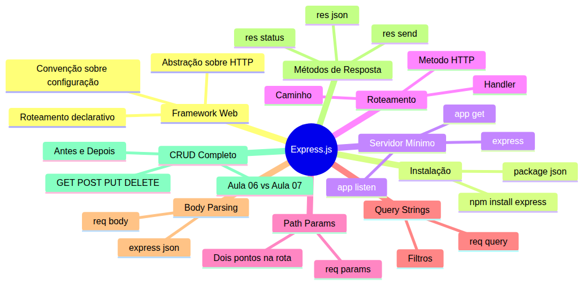
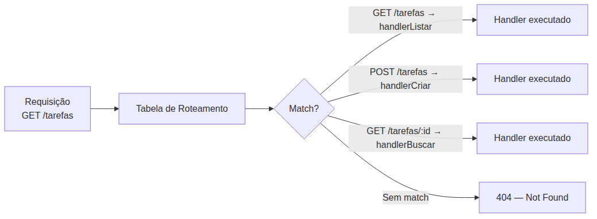
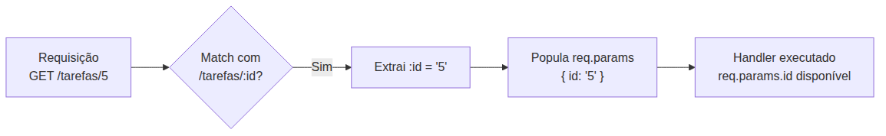
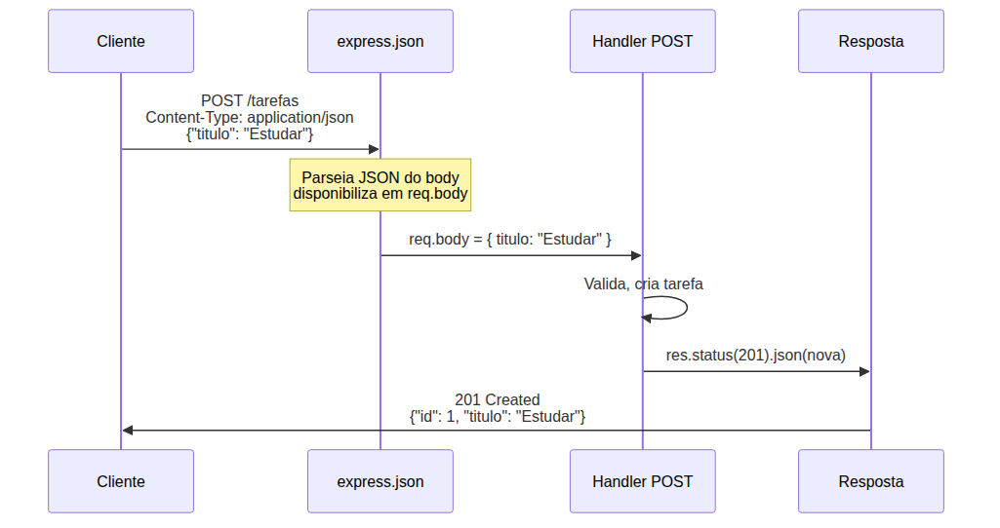

# Node.js — Do Zero ao Servidor Express — Aula 07

## Express.js — Primeiro Servidor e Rotas

**Duração estimada:** 90 minutos (50 de leitura + 40 de prática)
**Nível:** Intermediário
**Pré-requisitos:** Aula 01 (Runtime e Event Loop), Aula 02 (npm), Aula 03 (CommonJS), Aula 04 (Sistema de Arquivos e tarefas-repo.js), Aula 05 (EventEmitter, Path, OS), Aula 06 (Servidor HTTP com módulo http)

---

## Objetivos de Aprendizagem

Ao final desta aula, você será capaz de:

- [ ] **Explicar** o que é um framework web e como ele abstrai o protocolo HTTP sobre o módulo nativo
- [ ] **Comparar** roteamento declarativo (Express) com roteamento manual (http nativo), identificando onde o boilerplate é eliminado
- [ ] **Instalar** o Express.js via npm e configurar um projeto Node.js existente para usá-lo
- [ ] **Construir** um servidor HTTP funcional com `express()`, métodos de rota (`app.get`, `app.post`, `app.put`, `app.delete`) e `app.listen`
- [ ] **Extrair** parâmetros de rota com `req.params` (ex: `/tarefas/:id`)
- [ ] **Acessar** query strings com `req.query` (ex: `/tarefas?status=pendente`)
- [ ] **Utilizar** os métodos de resposta `res.json()`, `res.status()` e `res.send()` para enviar dados formatados
- [ ] **Reescrever** o servidor CRUD da Aula 06 com Express, reduzindo ~70 linhas de código para ~15
- [ ] **Diferenciar** status codes HTTP adequados para cada cenário de resposta (200, 201, 400, 404, 500)
- [ ] **Identificar** que `express.json()` existe como middleware de parsing, adiando seu entendimento completo para a Aula 08

---

## Como Usar Esta Aula

Esta aula está organizada em duas partes. A **primeira parte** constrói os fundamentos de frameworks web, roteamento declarativo e abstração sobre HTTP. A **segunda parte** aplica esses conceitos com Express.js. Ao final, o arquivo separado de Questões de Aprendizagem traz as tarefas de checkpoint.

**Tempo estimado:** 50 minutos de leitura + 40 minutos de prática.

## Mapa Mental

Este diagrama mostra todos os conceitos que você vai dominar nesta aula:





> *O mapa mental acima mostra a estrutura da aula. Cada ramo representa um conceito que você vai explorar.*

## Recapitulação das Aulas Anteriores

| Aula | Conceito | Onde aparece nesta aula | Como se conecta |
|---|---|---|---|
| Aula 04 | **tarefas-repo.js** (fs) | Seções 6-11 | Importamos o mesmo repo para persistência — zero reescrita |
| Aula 05 | **EventEmitter** | Seção 9 | `req.on('data')`/`req.on('end')` é substituído por `express.json()` |
| Aula 06 | **Servidor HTTP nativo** | Seções 1, 11 | O servidor com `http.createServer` + roteamento manual é reescrito em Express |
| Aula 02 | **npm e package.json** (Seções 5-6) | Seção 5 | `npm install express` usa o npm que você domina desde a Aula 02 |

---

## FUNDAMENTOS: Mecanismos Universais de Frameworks Web

> *Os conceitos desta seção são universais — valem para qualquer framework web, independentemente da linguagem ou ferramenta específica. Na segunda parte, você verá como um framework web específico implementa cada um deles.*

---

## 1. O Problema do Roteamento Manual

Na Aula 06 você escreveu aproximadamente 70 linhas de código para implementar 5 rotas. Cada nova rota exigia um novo `if/else`, body parsing manual com eventos `data`/`end`, e extração de parâmetros com `url.split('/')`. Funcionava — mas você sentiu a fricção.

Veja o código que você escreveu na Aula 06 lado a lado com o que você vai escrever nesta aula:

```
// Aula 06 — Roteamento manual (~70 linhas para 5 rotas):

if (method === 'GET' && url === '/tarefas') {
  const tarefas = await listarTarefas();
  res.writeHead(200, { 'Content-Type': 'application/json' });
  res.end(JSON.stringify(tarefas));
} else if (method === 'GET' && url.startsWith('/tarefas/')) {
  const id = Number(url.split('/')[2]);
  // ... precisa ler tarefas, filtrar, responder
} else if (method === 'POST' && url === '/tarefas') {
  let body = '';
  req.on('data', chunk => body += chunk);
  req.on('end', async () => {
    // JSON.parse, validar, criar, responder
  });
} else if (...) { /* PUT */ } else if (...) { /* DELETE */ }
else { /* 404 */ }

// Aula 07 — Roteamento com Framework (~15 linhas para as mesmas 5 rotas):

app.get('/tarefas', handler);
app.get('/tarefas/:id', handler);
app.post('/tarefas', handler);
app.put('/tarefas/:id', handler);
app.delete('/tarefas/:id', handler);
```

Agora imagine um sistema com 50 rotas. Depois, multiplique por 10 desenvolvedores no mesmo código. O que acontece com a legibilidade? Com a manutenção? Com a produtividade?

Existem **4 dores** claras no roteamento manual que você experimentou:

1. **Boilerplate de if/else repetitivo**: cada rota é um bloco condicional que repete o mesmo padrão de validação + resposta
2. **Body parsing manual**: para cada POST/PUT, você precisa escutar eventos `data` e `end`, concatenar chunks e fazer `JSON.parse` — 8 linhas por rota
3. **Extração manual de path params**: `url.split('/')[2]` é frágil — se a estrutura da URL mudar, o índice quebra
4. **Resposta manual**: `res.writeHead()` + `JSON.stringify()` + `res.end()` — toda rota repete a mesma sequência

**Qual padrão se repete em TODA rota?** Receber requisição → decidir o que fazer com base em método + caminho → responder. Esse padrão é tão universal que todo framework web do mercado o automatiza. Você está prestes a descobrir como.

> *Você escreveu 70 linhas. Agora veja as mesmas 3 rotas em 15 linhas. Respire. É para isso que servem frameworks.*

### Quick Check 1

**1. Qual das 4 dores do roteamento manual é resolvida por um framework que entrega o body já parseado?**
**Resposta:** A dor do body parsing manual — em vez de escutar eventos `data`/`end` e fazer `JSON.parse`, o framework entrega `requisicao.corpo` (ou `req.body` no framework) já pronto.

**2. Por que `url.split('/')[2]` é uma forma frágil de extrair um ID da URL?**
**Resposta:** Porque depende da posição fixa do ID na URL. Se a estrutura mudar (ex: `/api/v1/tarefas/5`), o índice `[2]` passa a ser o `v1`, não o ID. O framework permite declarar o parâmetro pelo nome, não pela posição.

---

## 2. O Padrão de Roteamento Declarativo

Em vez de escrever `if/else` para decidir qual handler executar, você **declara** o mapeamento: "para este método HTTP mais este caminho, execute esta função". O framework mantém uma **tabela de roteamento** interna — uma estrutura de dados que associa pares (método, caminho) a handlers.





> *O framework consulta a tabela de roteamento para cada requisição. Se encontra um match, executa o handler correspondente. Se não, responde com 404 automaticamente.*

**Analogia:** roteamento manual é como um segurança de festa que confere cada convidado um por um com uma lista no papel. Roteamento declarativo é como uma catraca com leitor de QR code — você define as regras antes (quem pode entrar) e o sistema aplica automaticamente.

O padrão universal de todo framework web é:

```
router.MÉTODO('/caminho', handler)
```

Veja a comparação visual entre os dois estilos:

```
// Roteamento MANUAL (imperativo) — você diz COMO fazer:
if (method === 'GET' && url === '/tarefas') { ... }
else if (method === 'POST' && url === '/tarefas') { ... }
else if (method === 'GET' && url.startsWith('/tarefas/')) { ... }

// Roteamento DECLARATIVO — você diz O QUE quer:
router.get('/tarefas', handlerListar)
router.post('/tarefas', handlerCriar)
router.get('/tarefas/:id', handlerBuscarPorId)
```

No estilo manual, você gerencia o fluxo de controle (os `if/else`, a ordem, o fallback 404). No estilo declarativo, o framework gerencia o fluxo — você só fornece os pares (rota, handler). O framework faz internamente o mesmo `if/else` que você escrevia, mas de forma otimizada e consistente.

### Quick Check 2

**1. Qual a diferença fundamental entre roteamento imperativo (if/else) e declarativo (router.get)?**
**Resposta:** No imperativo, você escreve o fluxo de decisão manualmente. No declarativo, você declara o mapeamento e o framework gerencia a decisão internamente.

**2. O que é uma "tabela de roteamento"?**
**Resposta:** É a estrutura de dados interna do framework que armazena os pares (método, caminho → handler). Quando chega uma requisição, o framework consulta a tabela para encontrar o handler correspondente.

---

## 3. Convenção sobre Configuração

Frameworks web adotam o princípio de **convenção sobre configuração**: eles têm defaults inteligentes para os problemas mais comuns. Você só configura quando quer fugir do padrão.

Veja o que isso significa na prática para as 4 dores que identificamos na Seção 1:

| O que você fazia na Aula 06 (manual) | O que o framework faz por você (automático) |
|---|---|
| `req.on('data')` + `req.on('end')` + `JSON.parse()` — 8 linhas para ler o body | A requisição já chega com `requisicao.corpo` pronto — zero linhas |
| `url.split('/')[2]` — extração por posição, frágil | Você declara `'/tarefas/:id'` e o parâmetro vem em `requisicao.params.id` |
| `new URL(req.url, base).searchParams.get('status')` — 2 linhas para query string | A query string já está parseada em `requisicao.consulta.status` |
| `JSON.stringify(dados)` + `res.writeHead()` + `res.end()` — 3 linhas para responder | `resposta.json(dados)` — uma linha que serializa, seta headers e envia |

**Body parsing**: em vez de `req.on('data')` + `req.on('end')`, o framework já entrega `requisicao.corpo` pronto. Você não precisa decidir COMO parsear — o framework já tem um padrão sensato para JSON.

**Path params**: em vez de `url.split('/')[2]`, você declara `'/tarefas/:id'` e o framework extrai automaticamente. O parâmetro é identificado pelo nome, não pela posição — muito mais robusto.

**Query strings**: em vez de `new URL(req.url).searchParams.get('status')`, o framework já parseia e entrega num objeto. Um `destructuring` resolve.

**Serialização JSON**: em vez de `JSON.stringify(dados)` + setar `Content-Type` manualmente + `res.end()`, o framework faz tudo com um método de resposta.

O princípio é libertador: você para de escrever código de infraestrutura (parsear body, extrair parâmetros, serializar resposta) e passa a escrever apenas a lógica da sua aplicação.

### Quick Check 3

**1. O que significa "convenção sobre configuração" no contexto de um framework web?**
**Resposta:** Significa que o framework já tem defaults inteligentes para tarefas comuns (body parsing, serialização JSON, extração de parâmetros). Você só precisa configurar quando quer um comportamento diferente do padrão.

**2. Quantas linhas de código um framework economiza para cada rota POST em comparação com o body parsing manual?**
**Resposta:** Aproximadamente 8 linhas por rota — os eventos `data`/`end`, o acumulador de chunks, o `JSON.parse` e o tratamento de erro de parsing. Em 5 rotas POST, são 40 linhas eliminadas.

---

## 4. Abstração sobre HTTP — O Que Ganhamos e o Que Perdemos

Toda abstração esconde complexidade. Isso é bom — produtividade, legibilidade, menos bugs. Mas entender o que está por baixo é o que separa o desenvolvedor que "sabe usar a ferramenta" daquele que entende o que ela faz.

Todo framework web é uma camada sobre o módulo HTTP nativo do runtime. Quando você chama `resposta.json(dados)`, o framework internamente faz exatamente o que você fez na Aula 06: `res.writeHead()`, `JSON.stringify()`, `res.end()`. Não é magia — é código JavaScript que alguém escreveu para você não precisar repetir.

**O que ganhamos:**

- **Produtividade**: o que levava 70 linhas agora leva 15
- **Legibilidade**: `app.get('/tarefas', handler)` é mais claro que um `if/else` aninhado
- **Menos bugs**: o framework já trata casos de borda (headers duplicados, encoding, erros de parsing)
- **Comunidade**: milhares de desenvolvedores usando o mesmo padrão, mesmas convenções
- **Ecossistema**: middlewares prontos (controle de acesso, logging, autenticação) que você pluga com uma linha

**O que "perdemos":**

Visibilidade direta do que acontece com a requisição crua. Quando você chama `res.json()`, o fluxo interno (serializar, setar headers, escrever no socket) fica oculto. É por isso que a Aula 06 veio antes — você sabe o que está por baixo.

> *Você construiu um servidor com o módulo http nativo. Agora você vai APRECIAR o que o framework faz, porque sabe exatamente qual boilerplate ele está eliminando. Quem pula direto para um framework web sem passar pelo http nativo nunca entende completamente o que acontece quando digita `res.json()`.*

### Quick Check 4

**1. Quando você chama `resposta.json(dados)` em um framework web, o que acontece internamente?**
**Resposta:** O framework serializa o objeto com `JSON.stringify()`, seta o header `Content-Type: application/json` e chama `res.end()` com o resultado — exatamente o que você fazia manualmente na Aula 06.

**2. Por que construir um servidor HTTP nativo antes de usar um framework web é importante para o aprendizado?**
**Resposta:** Porque entender o que o framework abstrai permite que você aprecie a produtividade sem perder a noção do que acontece "debaixo dos panos". Sem o http nativo, o framework web seria uma caixa-preta completa.

---

## APLICAÇÃO: Express.js na Prática — Do Zero ao Servidor Funcional

> *Agora que você entende os fundamentos de roteamento declarativo, convenção sobre configuração e abstração sobre HTTP, vamos conectá-los à prática com o Express.js. Cada seção a seguir implementa exatamente os conceitos que você estudou na PARTE 1.*

---

## 5. Instalação e Hello World com Express

**Conexão com PARTE 1:** Nas Seções 3 e 4, você aprendeu que frameworks têm defaults inteligentes e abstraem o HTTP. O `express()` retorna um objeto que já vem configurado com tabela de roteamento interna, listeners e defaults.

Vamos ao projeto que você já tem das aulas anteriores. Ele contém `tarefas-repo.js` (Aula 04) e `servidor.js` (Aula 06). Trabalharemos nele.

No terminal, dentro da pasta do seu projeto:

```bash
npm install express
```

O npm baixa o Express e suas dependências para `node_modules/`. No `package.json`, aparece uma nova linha:

```json
"dependencies": {
  "express": "^4.21.0"
}
```

Pronto. Zero configuração. Framework instalado.

Agora o Hello World mínimo em Express — 4 linhas de código:

```javascript
const express = require('express');
const app = express();
app.get('/', (req, res) => res.send('Hello World!'));
app.listen(3000, () => console.log('Servidor rodando na porta 3000'));
```

Salve como `hello-express.js` e execute: `node hello-express.js`.

Abra `http://localhost:3000` no navegador ou teste com curl:

```bash
curl http://localhost:3000
# Saída: Hello World!
```

**O que cada linha faz:**

1. `require('express')` — carrega o módulo Express que você acabou de instalar
2. `express()` — cria a aplicação. Esse objeto `app` contém a tabela de roteamento interna, métodos para definir rotas e o servidor HTTP encapsulado
3. `app.get('/', handler)` — registra uma rota GET para o caminho `/`. O handler recebe `req` (requisição) e `res` (resposta)
4. `app.listen(3000)` — inicia o servidor HTTP na porta 3000. Por baixo, chama `http.createServer()` e `server.listen()` — exatamente como na Aula 06

Compare com o Hello World da Aula 06:

```
// Aula 06 (http nativo):
const http = require('http');
const server = http.createServer((req, res) => {
  res.writeHead(200, { 'Content-Type': 'text/plain' });
  res.end('Hello World!');
});
server.listen(3000);

// Aula 07 (Express):
const express = require('express');
const app = express();
app.get('/', (req, res) => res.send('Hello World!'));
app.listen(3000);
```

Perceba: o Express eliminou a necessidade de criar manualmente o servidor, setar Content-Type e chamar `res.end()`. `res.send()` faz tudo isso — detecta que é texto, seta o header e envia.

**Mão na Massa — Hello World Express:**

- [ ] No diretório do seu projeto, execute `npm install express`
- [ ] Crie `hello-express.js` com o código acima
- [ ] Execute `node hello-express.js`
- [ ] Teste com `curl http://localhost:3000`

**Verificação:** O curl retorna "Hello World!". O servidor responde em qualquer caminho além de `/` com 404 — o Express gerencia isso automaticamente.

> *Na Aula 06, você precisava do fallback 404 manual. No Express, rotas não registradas retornam 404 automaticamente. Convenção sobre configuração em ação.*

### Quick Check 5

**1. O que `express()` retorna?**
**Resposta:** Retorna o objeto `app`, que encapsula o servidor HTTP, a tabela de roteamento e os métodos para definir rotas e middlewares. É o ponto de entrada de toda aplicação Express.

**2. Por que não precisamos mais de `http.createServer()` quando usamos Express?**
**Resposta:** Porque `app.listen(3000)` internamente chama `http.createServer()` com um callback que gerencia a tabela de roteamento. O Express abstrai a criação do servidor.

---

## 6. Rotas GET — O Coração do Express

**Conexão com PARTE 1:** Na Seção 2, você aprendeu o padrão universal `router.MÉTODO('/caminho', handler)`. O `app.get()` é exatamente isso — a implementação concreta do roteamento declarativo.

A sintaxe é direta:

```javascript
app.get('/caminho', (req, res) => {
  // lógica da rota
});
```

O primeiro argumento é o caminho (path). O segundo é o handler — uma função que recebe `req` (objeto de requisição enriquecido pelo Express) e `res` (objeto de resposta também enriquecido).

Vamos criar múltiplas rotas GET no mesmo servidor:

```javascript
const express = require('express');
const app = express();

app.get('/', (req, res) => {
  res.send('<h1>API de Tarefas v1.0</h1>');
});

app.get('/tarefas', async (req, res) => {
  const tarefas = await listarTarefas();
  res.json(tarefas);
});

app.listen(3000);
```

Teste com curl:

```bash
curl http://localhost:3000
curl http://localhost:3000/tarefas
```

**O que mudou em relação à Aula 06:**

1. **Sem `if/else`**: cada rota é declarada independentemente. Se o Express não encontrar match, responde 404 automaticamente
2. **`res.send()`**: envia texto ou HTML. Detecta automaticamente o tipo e seta o Content-Type
3. **`res.json()`**: serializa o objeto para JSON, seta `Content-Type: application/json` e envia — substitui `JSON.stringify()` + `writeHead()` + `end()`
4. **Handler assíncrono**: funciona com `async/await` — mas em Express 4 você precisa capturar erros com `try/catch` ou `next(err)`. O Express 5 (versão futura) vai gerenciar Promises automaticamente.

> **Nota:** A ordem de declaração das rotas não importa... até você usar path params. Vamos entender isso na próxima seção.

**Mão na Massa — Rotas GET com Express:**

- [ ] No arquivo `hello-express.js`, adicione a rota GET `/tarefas` que importa e usa `listarTarefas()` do `tarefas-repo.js`
- [ ] Teste com `curl http://localhost:3000/tarefas`
- [ ] Adicione a rota GET `/` que retorna HTML com `res.send()`
- [ ] Teste uma URL inexistente — veja o 404 automático

**Verificação:** `curl http://localhost:3000/tarefas` retorna o array de tarefas. `curl http://localhost:3000/xyz` retorna 404 com body HTML padrão do Express — sem precisar de fallback manual.

### Quick Check 6

**1. Qual a diferença entre `res.send()` e `res.json()`?**
**Resposta:** `res.send()` envia texto ou HTML e detecta automaticamente o Content-Type. `res.json()` serializa um objeto JavaScript para JSON, seta `Content-Type: application/json` e envia.

**2. O que acontece se o aluno fizer uma requisição para uma rota que não foi registrada?**
**Resposta:** O Express retorna automaticamente 404 com um body HTML padrão ("Cannot GET /rota-inexistente"). Não precisa de fallback manual como na Aula 06.

---

## 7. Path Params — `/tarefas/:id`

**Conexão com PARTE 1:** Na Seção 3, você viu que frameworks extraem parâmetros da URL automaticamente. Em vez de `url.split('/')[2]`, você declara o parâmetro na rota e o framework entrega o valor.

Sintaxe: use `:` seguido do nome do parâmetro na definição da rota:

```javascript
app.get('/tarefas/:id', async (req, res) => {
  const id = Number(req.params.id);
  const tarefas = await listarTarefas();
  const tarefa = tarefas.find(t => t.id === id);
  if (!tarefa) return res.status(404).json({ erro: 'Tarefa não encontrada' });
  res.json(tarefa);
});
```

Compare com a Aula 06:

```
// Aula 06 (manual):
if (method === 'GET' && url.startsWith('/tarefas/')) {
  const id = Number(url.split('/')[2]); // frágil: e se a URL mudar?
  ...
}

// Aula 07 (Express):
app.get('/tarefas/:id', async (req, res) => {
  const id = Number(req.params.id); // Express extrai automaticamente
  ...
});
```

**O fluxo interno do Express:**





> *O Express compara a URL da requisição com o padrão `/tarefas/:id`. O `:id` casa com qualquer valor no segmento correspondente da URL e o coloca em `req.params.id`.*

**Múltiplos parâmetros:**

```javascript
app.get('/tarefas/:id/comentarios/:comentarioId', (req, res) => {
  // req.params = { id: '5', comentarioId: '12' }
});
```

**`req.params` é sempre string** — mesmo que o valor pareça numérico. A conversão com `Number()` é responsabilidade sua.

**Ordem importa com path params!** Veja o problema:

```javascript
// ERRADO: /tarefas/ativas nunca será chamada
app.get('/tarefas/:id', handlerBuscar);
app.get('/tarefas/ativas', handlerAtivas);

// CORRETO: rotas fixas antes de rotas com parâmetros
app.get('/tarefas/ativas', handlerAtivas);
app.get('/tarefas/:id', handlerBuscar);
```

Se `/tarefas/ativas` vier depois de `/tarefas/:id`, o Express casa "ativas" como `:id` — e o handler de busca por ID é executado em vez do handler de tarefas ativas. **Rotas fixas sempre antes de rotas com parâmetros.** Essa é a ÚNICA situação em que a ordem importa no Express.

**Mão na Massa — Path Params:**

- [ ] Adicione a rota `GET /tarefas/:id` ao seu servidor
- [ ] Teste com `curl http://localhost:3000/tarefas/1`
- [ ] Teste com um ID inexistente: `curl http://localhost:3000/tarefas/999`
- [ ] Verifique que o status code é 404 para ID inexistente

**Verificação:** `curl http://localhost:3000/tarefas/1` retorna a tarefa com ID 1. `curl http://localhost:3000/tarefas/999` retorna `{"erro":"Tarefa não encontrada"}` com status 404.

### Quick Check 7

**1. O que `req.params.id` contém para a requisição `GET /tarefas/42` com a rota `app.get('/tarefas/:id', ...)`?**
**Resposta:** `req.params.id` contém a string `'42'`. O Express converte o segmento da URL em valor do parâmetro nomeado, mas não faz conversão de tipo — a string `'42'` precisa de `Number()` se você quiser um número.

**2. Por que a rota `/tarefas/ativas` deve ser declarada antes de `/tarefas/:id`?**
**Resposta:** Porque o Express casa rotas na ordem de declaração. Se `/tarefas/:id` vem primeiro, "ativas" é interpretado como `:id`. Rotas fixas devem vir antes de rotas com parâmetros.

---

## 8. Query Strings — `req.query`

**Conexão com PARTE 1:** Na Seção 3, você viu que frameworks parseiam query strings automaticamente. Em vez de `new URL(req.url, base).searchParams.get('status')`, o Express entrega tudo em um objeto.

Quando o cliente faz `GET /tarefas?status=pendente&prioridade=alta`, o Express parseia a query string e coloca em `req.query`:

```javascript
// req.query = { status: 'pendente', prioridade: 'alta' }
```

Uso prático — filtrar tarefas por status:

```javascript
app.get('/tarefas', async (req, res) => {
  const tarefas = await listarTarefas();
  const { status } = req.query; // destructuring direto

  if (status) {
    const filtradas = tarefas.filter(t => {
      if (status === 'concluida') return t.concluída;
      if (status === 'pendente') return !t.concluída;
      return true;
    });
    return res.json(filtradas);
  }

  res.json(tarefas);
});
```

Compare com a Aula 06:

```
// Aula 06:
const urlObj = new URL(req.url, 'http://localhost:3000');
const status = urlObj.searchParams.get('status');

// Aula 07:
const { status } = req.query; // 1 linha vs 2, mais legível
```

**Propriedades importantes de `req.query`:**

- É **sempre um objeto** — se não houver query string, é `{}` (nunca `undefined`)
- Valores são **sempre strings** — mesmo `?id=5` resulta em `req.query.id === '5'`, não `5`
- Múltiplos valores com a mesma chave (`?cor=azul&cor=verde`) viram array: `req.query.cor === ['azul', 'verde']`

```bash
# Teste:
curl "http://localhost:3000/tarefas?status=pendente"
curl "http://localhost:3000/tarefas?status=concluida"
curl "http://localhost:3000/tarefas"
```

### Quick Check 8

**1. O que `req.query` contém para a URL `/tarefas?status=pendente&prioridade=alta`?**
**Resposta:** `req.query` é o objeto `{ status: 'pendente', prioridade: 'alta' }`. Cada parâmetro da query string vira uma propriedade do objeto.

**2. `req.query` é `undefined` quando não há query string na URL?**
**Resposta:** Não. `req.query` é sempre um objeto — `{}` quando não há parâmetros. Isso permite acessar propriedades sem verificar `undefined` antes.

---

## 9. Rotas POST e Métodos de Resposta

**Conexão com PARTE 1:** Na Seção 3, você aprendeu sobre convenção — o framework faz body parsing automático. O `express.json()` é a peça que realiza esse parsing.

### express.json() — O Body Parsing Automático

Na Aula 06, você escrevia 8 linhas para ler o body de uma requisição POST: eventos `data`/`end`, acumulador de chunks, `JSON.parse`, tratamento de erro.

O Express tem uma função embutida que faz tudo isso: `express.json()`. Adicione esta linha ao seu servidor:

```javascript
app.use(express.json()); // middleware — entenda a fundo na Aula 08
```

> *`express.json()` é um **middleware** — uma função que o Express executa em cadeia antes do seu handler. Na Aula 08 você vai entender o pipeline completo e criar seus próprios middlewares. Por enquanto, basta saber: adicione esta linha e o Express vai parsear JSON automaticamente, entregando o resultado em `req.body`.*

Depois de adicionar essa linha, o body de qualquer requisição com `Content-Type: application/json` já estará parseado em `req.body`:

```javascript
app.use(express.json()); // ativa o body parsing automático

app.post('/tarefas', async (req, res) => {
  const { titulo } = req.body; // body já parseado!

  if (!titulo) {
    return res.status(400).json({ erro: '"titulo" é obrigatório' });
  }

  const nova = await adicionarTarefa(titulo);
  res.status(201).json(nova);
});
```

Compare com a Aula 06: body parsing manual exigia 8 linhas com eventos `data`/`end`, acumulador, `JSON.parse` e tratamento de erro. Com `express.json()`, uma linha ativa o parsing para TODAS as rotas, e `req.body` entrega o resultado pronto.

### Métodos de Resposta do Express

O Express enriquece o objeto `res` com métodos que simplificam o envio de respostas:

| Método | O que faz | Exemplo |
|---|---|---|
| `res.json(dados)` | Serializa para JSON, seta Content-Type, envia | `res.json({ ok: true })` |
| `res.status(codigo)` | Define o status code, retorna `res` para encadeamento | `res.status(201).json(dados)` |
| `res.send(conteudo)` | Envia texto/HTML, detecta Content-Type automaticamente | `res.send('<h1>OK</h1>')` |

**Encadeamento:** `res.status(201)` retorna o próprio `res`, permitindo chamar `.json()` na sequência: `res.status(201).json(dados)`. Isso é intencional e idiomático no Express.

### Status Codes Típicos para CRUD

| Operação | Status | Quando usar |
|---|---|---|
| GET (listar/buscar) | 200 OK | Recurso encontrado e retornado |
| POST (criar) | 201 Created | Recurso criado com sucesso |
| POST (validação falhou) | 400 Bad Request | Body inválido, campo obrigatório ausente |
| GET (não encontrado) | 404 Not Found | Recurso com ID inexistente |
| PUT/DELETE (sucesso) | 200 OK | Operação concluída |
| Erro interno | 500 Internal Server Error | Exceção não tratada |





> *O middleware `express.json()` intercepta a requisição antes do handler, parseia o JSON do body e coloca o resultado em `req.body`. O handler só vê o body já pronto.*

**Mão na Massa — POST com express.json():**

- [ ] Adicione `app.use(express.json())` ao seu servidor
- [ ] Implemente a rota `POST /tarefas` com validação de `titulo`
- [ ] Teste com curl:

```bash
curl -X POST http://localhost:3000/tarefas \
  -H "Content-Type: application/json" \
  -d '{"titulo":"Estudar Express.js"}'

# Teste sem título — deve retornar 400
curl -X POST http://localhost:3000/tarefas \
  -H "Content-Type: application/json" \
  -d '{}'
```

**Verificação:** POST com `titulo` retorna 201 e a tarefa criada. POST sem `titulo` retorna 400 com mensagem de erro.

### Quick Check 9

**1. Para que serve `app.use(express.json())`?**
**Resposta:** Ativa o body parsing automático para JSON. Toda requisição com `Content-Type: application/json` tem seu body parseado e disponibilizado em `req.body` — substituindo o parsing manual com eventos `data`/`end`.

**2. Por que `res.status(201).json(dados)` funciona como encadeamento?**
**Resposta:** `res.status(201)` retorna o próprio objeto `res`, permitindo chamar `.json()` na mesma linha. Esse é um pattern comum no Express para encadear métodos.

---

## 10. PUT e DELETE — Completando o CRUD

**Conexão com PARTE 1:** O padrão `router.MÉTODO('/caminho', handler)` se aplica a TODOS os métodos HTTP. O que muda é apenas o verbo — GET, POST, PUT, DELETE — a sintaxe é idêntica.

Com GET e POST implementados, faltam PUT (atualizar) e DELETE (remover). O padrão é consistente:

```javascript
// PUT /tarefas/:id — concluir tarefa
app.put('/tarefas/:id', async (req, res) => {
  const id = Number(req.params.id);
  try {
    const tarefa = await concluirTarefa(id);
    res.json(tarefa);
  } catch (err) {
    res.status(404).json({ erro: err.message });
  }
});

// DELETE /tarefas/:id — remover tarefa
app.delete('/tarefas/:id', async (req, res) => {
  const id = Number(req.params.id);
  try {
    await removerTarefa(id);
    res.json({ mensagem: `Tarefa ${id} removida` });
  } catch (err) {
    res.status(404).json({ erro: err.message });
  }
});
```

Perceba o padrão consistente:

- **PUT** usa `app.put(caminho, handler)` — mesma assinatura de `app.get()`
- **DELETE** usa `app.delete(caminho, handler)` — idêntico
- Ambos extraem o ID com `req.params.id` como na Seção 7
- Ambos tratam erro com try/catch, retornando 404 se a tarefa não existe

**O que acontece quando `concluirTarefa` ou `removerTarefa` lança exceção?** Por enquanto, o try/catch no handler captura e retorna 404. Na Aula 09 você vai aprender tratamento centralizado de erros — um middleware que captura qualquer erro não tratado em TODAS as rotas.

### Quick Check 10

**1. Qual a diferença de sintaxe entre `app.get()` e `app.put()`?**
**Resposta:** Nenhuma — a assinatura é idêntica: `app.METODO(caminho, handler)`. O que muda é o método HTTP que a rota atende (PUT vs GET).

**2. O que acontece se `concluirTarefa(id)` lançar um erro porque a tarefa não existe?**
**Resposta:** O catch captura o erro e retorna 404 com a mensagem de erro. Sem o try/catch, o erro quebraria o servidor (a Aula 09 vai ensinar tratamento centralizado).

---

## 11. Reescrevendo o Servidor da Aula 06 — Antes e Depois

**Conexão com TODA a PARTE 1:** Esta seção materializa todos os conceitos — roteamento declarativo (Seção 2), convenção sobre configuração (Seção 3) e abstração sobre HTTP (Seção 4) — em um arquivo funcional.

Vamos juntar todas as peças. O resultado é o `servidor-express.js` — o substituto do `servidor.js` da Aula 06, com as MESMAS 5 rotas, mas em ~20 linhas:

```javascript
const express = require('express');
const {
  listarTarefas,
  adicionarTarefa,
  concluirTarefa,
  removerTarefa
} = require('./tarefas-repo');

const app = express();
app.use(express.json());

app.get('/tarefas', async (req, res) => {
  const { status } = req.query;
  const tarefas = await listarTarefas();
  if (status === 'concluida') return res.json(tarefas.filter(t => t.concluída));
  if (status === 'pendente') return res.json(tarefas.filter(t => !t.concluída));
  res.json(tarefas);
});

app.get('/tarefas/:id', async (req, res) => {
  const tarefas = await listarTarefas();
  const tarefa = tarefas.find(t => t.id === Number(req.params.id));
  if (!tarefa) return res.status(404).json({ erro: 'Tarefa não encontrada' });
  res.json(tarefa);
});

app.post('/tarefas', async (req, res) => {
  const { titulo } = req.body;
  if (!titulo) return res.status(400).json({ erro: '"titulo" é obrigatório' });
  const nova = await adicionarTarefa(titulo);
  res.status(201).json(nova);
});

app.put('/tarefas/:id', async (req, res) => {
  try {
    const tarefa = await concluirTarefa(Number(req.params.id));
    res.json(tarefa);
  } catch (err) {
    res.status(404).json({ erro: err.message });
  }
});

app.delete('/tarefas/:id', async (req, res) => {
  try {
    await removerTarefa(Number(req.params.id));
    res.json({ mensagem: `Tarefa ${req.params.id} removida` });
  } catch (err) {
    res.status(404).json({ erro: err.message });
  }
});

app.listen(3000, () => console.log('Servidor Express rodando na porta 3000'));
```

### Tabela Comparativa: O Que Sumiu?

| O que você fazia na Aula 06 (~70 linhas) | O que o Express faz (~20 linhas) |
|---|---|
| `http.createServer((req, res) => { ... })` | `express()` + `app.listen(3000)` |
| `if (method === 'GET' && url === '/tarefas')` | `app.get('/tarefas', handler)` |
| `url.split('/')[2]` para extrair ID | `req.params.id` |
| `new URL(req.url).searchParams.get('status')` | `req.query.status` |
| `req.on('data')` + `req.on('end')` + `JSON.parse()` | `express.json()` + `req.body` |
| `res.writeHead() + JSON.stringify() + res.end()` | `res.json()` ou `res.status().json()` |
| Fallback 404 manual | 404 automático do Express |

**Reflexão:** Você não perdeu controle — você ganhou produtividade. E sabe exatamente o que o Express está fazendo por baixo porque construiu tudo manualmente na Aula 06. Cada `res.json()` que você escrever daqui em diante terá o gostinho de "isso costumava dar 3 linhas de trabalho manual".

**Mão na Massa — Servidor Express Completo:**

- [ ] Crie `servidor-express.js` com o código completo acima
- [ ] Execute com `node servidor-express.js`
- [ ] Execute OS MESMOS comandos curl do gabarito da Aula 06 para verificar que o comportamento é idêntico:

```bash
# Criar tarefas
curl -X POST http://localhost:3000/tarefas \
  -H "Content-Type: application/json" \
  -d '{"titulo":"Estudar Express.js"}'
curl -X POST http://localhost:3000/tarefas \
  -H "Content-Type: application/json" \
  -d '{"titulo":"Reescrever servidor HTTP"}'

# Listar todas
curl http://localhost:3000/tarefas

# Buscar por ID
curl http://localhost:3000/tarefas/1

# Listar por status (usando query string)
curl "http://localhost:3000/tarefas?status=pendente"

# Concluir tarefa
curl -X PUT http://localhost:3000/tarefas/1

# Remover tarefa
curl -X DELETE http://localhost:3000/tarefas/2

# Testar validação
curl -X POST http://localhost:3000/tarefas \
  -H "Content-Type: application/json" \
  -d '{}'

# Testar 404
curl http://localhost:3000/tarefas/999
```

**Verificação:** Todos os comandos curl funcionam exatamente como na Aula 06, mas o servidor tem ~20 linhas em vez de ~70. O comportamento é IDÊNTICO — a diferença está na quantidade de código que você escreveu.

### Quick Check 11

**1. Quantas linhas de código você economizou ao reescrever o servidor da Aula 06 com Express?**
**Resposta:** A reescrita reduziu de aproximadamente 70 linhas (com roteamento manual, body parsing manual e query string parsing manual) para cerca de 15 linhas — uma economia de quase 80%.

**2. Qual das dores do roteamento manual foi mais impactante eliminar com Express?**
**Resposta:** Resposta pessoal, mas o body parsing é geralmente o maior ganho — `express.json()` substitui 15+ linhas de `req.on('data')`/`req.on('end')` + `Buffer.concat` + `JSON.parse`.

---

## Autoavaliação: Quiz Rápido

**1. Qual a diferença entre `app.get()` no Express e o `if/else` com `req.method` e `req.url` da Aula 06?**
**Resposta:**

No Express, cada rota é declarada independentemente com `app.get(caminho, handler)`. Na Aula 06, você usava `if/else` encadeados para decidir qual handler executar. O Express automatiza a decisão — você só declara o mapeamento.

**2. O que `express.json()` faz e por que ele é necessário para rotas POST?**
**Resposta:**

`express.json()` parseia automaticamente o body JSON de requisições com `Content-Type: application/json` e coloca o resultado em `req.body`. Sem ele, `req.body` seria `undefined` — você teria que fazer o parsing manual como na Aula 06.

**3. Como o Express trata requisições para rotas não registradas?**
**Resposta:**

O Express retorna automaticamente 404 com body HTML padrão. Diferente da Aula 06, onde você precisava de um `else` final para o fallback, o Express gerencia isso internamente.

**4. Em que situação a ordem de declaração das rotas importa no Express?**
**Resposta:**

Quando há rotas com path params (`/tarefas/:id`) e rotas fixas (`/tarefas/ativas`). A rota fixa deve vir antes, senão "ativas" é interpretado como `:id`. Para rotas sem path params, a ordem não importa.

**5. Para que serve `req.params` e como ele se compara com `url.split('/')` da Aula 06?**
**Resposta:**

`req.params` contém os parâmetros nomeados da URL, definidos com `:` na rota (ex: `/:id` → `req.params.id`). É mais robusto que `url.split('/')[2]` porque identifica o parâmetro pelo nome, não pela posição na URL.

**6. Qual a diferença entre `res.send()` e `res.json()`?**
**Resposta:**

`res.send()` envia texto ou HTML, detectando automaticamente o Content-Type. `res.json()` serializa um objeto JavaScript para JSON, seta `Content-Type: application/json` e envia. Use `res.json()` para APIs, `res.send()` para texto/HTML.

---

## Mão na Massa: Exercícios Graduados

**Exercício 1 (Fácil) — Hello World + Rota /ping**

**Dificuldade:** Fácil | **Duração:** 5 minutos | **Cobre:** Seções 5-6

Crie um servidor Express que escuta na porta 4000 e tem duas rotas:

- `GET /` — retorna o texto `"Servidor Express funcionando!"`
- `GET /ping` — retorna JSON com `{ "pong": true, "timestamp": "..." }`

Use `new Date().toISOString()` para o timestamp.

**Gabarito:**

```javascript
const express = require('express');
const app = express();

app.get('/', (req, res) => {
  res.send('Servidor Express funcionando!');
});

app.get('/ping', (req, res) => {
  res.json({ pong: true, timestamp: new Date().toISOString() });
});

app.listen(4000, () => console.log('Servidor na porta 4000'));
```

**O que verificar:** `curl http://localhost:4000` retorna o texto. `curl http://localhost:4000/ping` retorna JSON com pong e timestamp.

---

**Exercício 2 (Médio) — API de Tarefas com GET e POST**

**Dificuldade:** Médio | **Duração:** 10 minutos | **Cobre:** Seções 5-9

Crie um servidor Express que importa `tarefas-repo.js` e implementa:

- `GET /tarefas` — retorna todas as tarefas com `res.json()`
- `POST /tarefas` — recebe JSON com `titulo`, valida (400 se faltar), retorna 201

Use `express.json()` para body parsing. O servidor deve escutar na porta 3000.

**Gabarito:**

```javascript
const express = require('express');
const { listarTarefas, adicionarTarefa } = require('./tarefas-repo');

const app = express();
app.use(express.json());

app.get('/tarefas', async (req, res) => {
  const tarefas = await listarTarefas();
  res.json(tarefas);
});

app.post('/tarefas', async (req, res) => {
  const { titulo } = req.body;
  if (!titulo) return res.status(400).json({ erro: '"titulo" é obrigatório' });
  const nova = await adicionarTarefa(titulo);
  res.status(201).json(nova);
});

app.listen(3000, () => console.log('API rodando na porta 3000'));
```

**O que verificar:** GET retorna lista. POST cria tarefa e retorna 201. POST sem `titulo` retorna 400.

---

**Desafio (Difícil) — CRUD Completo com Filtro por Query String**

**Dificuldade:** Difícil | **Duração:** 15 minutos | **Cobre:** Seções 5-11

Implemente o servidor Express completo com as 5 rotas do `tarefas-repo.js`:

| Método | Rota | Ação | Status |
|---|---|---|---|
| GET | `/tarefas` | Listar todas (com opção `?status=pendente|concluida`) | 200 |
| GET | `/tarefas/:id` | Buscar por ID | 200 ou 404 |
| POST | `/tarefas` | Criar com `{ "titulo": "..." }` | 201 ou 400 |
| PUT | `/tarefas/:id` | Concluir tarefa | 200 ou 404 |
| DELETE | `/tarefas/:id` | Remover tarefa | 200 ou 404 |

O servidor deve usar `express.json()`, `req.params`, `req.query`, `res.json()` e `res.status()`. A rota GET `/tarefas` deve aceitar `?status=concluida` ou `?status=pendente` como filtro.

**Gabarito:**

```javascript
const express = require('express');
const {
  listarTarefas,
  adicionarTarefa,
  concluirTarefa,
  removerTarefa
} = require('./tarefas-repo');

const app = express();
app.use(express.json());

app.get('/tarefas', async (req, res) => {
  const { status } = req.query;
  const tarefas = await listarTarefas();
  if (status === 'concluida') return res.json(tarefas.filter(t => t.concluída));
  if (status === 'pendente') return res.json(tarefas.filter(t => !t.concluída));
  res.json(tarefas);
});

app.get('/tarefas/:id', async (req, res) => {
  const tarefas = await listarTarefas();
  const tarefa = tarefas.find(t => t.id === Number(req.params.id));
  if (!tarefa) return res.status(404).json({ erro: 'Tarefa não encontrada' });
  res.json(tarefa);
});

app.post('/tarefas', async (req, res) => {
  const { titulo } = req.body;
  if (!titulo) return res.status(400).json({ erro: '"titulo" é obrigatório' });
  const nova = await adicionarTarefa(titulo);
  res.status(201).json(nova);
});

app.put('/tarefas/:id', async (req, res) => {
  try {
    const tarefa = await concluirTarefa(Number(req.params.id));
    res.json(tarefa);
  } catch (err) {
    res.status(404).json({ erro: err.message });
  }
});

app.delete('/tarefas/:id', async (req, res) => {
  try {
    await removerTarefa(Number(req.params.id));
    res.json({ mensagem: `Tarefa ${req.params.id} removida` });
  } catch (err) {
    res.status(404).json({ erro: err.message });
  }
});

app.listen(3000, () => console.log('Servidor Express rodando na porta 3000'));
```

**O que verificar:** Execute todos os comandos curl da Seção 11 para confirmar que o CRUD completo funciona. Compare com o gabarito da Aula 06 — o comportamento é idêntico.

---

## Resumo da Aula

### Os 8 Conceitos Fundamentais

1. **Framework Web**: Camada sobre o HTTP nativo que automatiza tarefas repetitivas (roteamento, parsing, serialização). Não é magia — é código que alguém escreveu para você.
2. **Roteamento Declarativo**: Em vez de `if/else` manuais, você declara pares (método + caminho → handler) e o framework gerencia a decisão.
3. **Convenção sobre Configuração**: O framework tem defaults inteligentes para body parsing, extração de parâmetros e serialização JSON. Você só configura o que foge do padrão.
4. **`express()` e `app.listen()`**: Substituem `http.createServer()` + `server.listen()`. O `app` encapsula o servidor e a tabela de roteamento.
5. **Métodos de Rota**: `app.get()`, `app.post()`, `app.put()`, `app.delete()` — todos com a mesma assinatura `(caminho, handler)`.
6. **`req.params` e `req.query`**: Parâmetros de rota (`:id`) e query string parseados automaticamente. Substituem `url.split()` e `new URL().searchParams`.
7. **`express.json()` e `req.body`**: Body parsing automático. Uma linha ativa o parsing JSON para todo o servidor.
8. **`res.json()`, `res.status()`, `res.send()`**: Métodos de resposta que substituem `writeHead` + `JSON.stringify` + `end`.

### O Que Você Construiu Hoje

- [x] Express instalado e configurado via npm
- [x] Hello World em 4 linhas com `express()` + `app.get()` + `app.listen()`
- [x] Rotas GET com `res.send()` e `res.json()`
- [x] Path params com `req.params.id`
- [x] Query strings com `req.query.status`
- [x] Body parsing com `express.json()` e `req.body`
- [x] Rotas POST, PUT e DELETE com status codes corretos
- [x] `servidor-express.js` — CRUD completo em ~20 linhas (vs ~70 na Aula 06)

---

## Próxima Aula

**Aula 08: Middleware — O Pipeline de Requisição**

Você usou `express.json()` sem entender completamente como ele funciona. Na Aula 08, você vai descobrir que `express.json()` é apenas um exemplo do pattern mais poderoso do Express: o pipeline de middlewares. Você vai criar seus próprios middlewares, entender a ordem de execução e dominar o fluxo que toda requisição percorre no servidor.

---

## Referências

### Documentação Oficial

- [Express.js Guide — Routing](https://expressjs.com/en/guide/routing.html) — guia oficial de roteamento
- [Express.js API Reference](https://expressjs.com/en/4x/api.html) — referência completa da API
- [Express.js — express.json()](https://expressjs.com/en/4x/api.html#express.json) — documentação do body parsing

### Ferramentas

- [curl](https://curl.se/) — cliente HTTP de linha de comando para testar APIs
- [npm](https://www.npmjs.com/) — registro de pacotes JavaScript

### Artigos para Aprofundamento

- [Express.js Middleware Guide](https://expressjs.com/en/guide/using-middleware.html) — guia de middlewares (prepare-se para a Aula 08)
- [Node.js HTTP module vs Express](https://www.toptal.com/express-js/nodejs-frameworks-comparison) — comparação entre http nativo e Express

---

## FAQ

**P: Preciso reinstalar o Express para cada novo projeto?**
R: Sim, cada projeto tem suas próprias dependências no `node_modules`. Execute `npm install express` no diretório de cada projeto.

**P: `res.json()` vs `JSON.stringify()` + `res.send()` — qual a diferença prática?**
R: `res.json()` faz tudo que `JSON.stringify()` + `res.send()` faz, mas com um tratamento extra: ele converte `null` e `undefined` corretamente e seta o Content-Type automaticamente. Use sempre `res.json()` para objetos.

**P: O que acontece se eu esquecer de chamar `app.use(express.json())` e tentar ler `req.body`?**
R: `req.body` será `undefined`. O Express não faz body parsing a menos que você ative explicitamente. Se tentar acessar `req.body.titulo`, receberá um erro `Cannot read property 'titulo' of undefined`.

**P: Path params vs query strings — quando usar cada um?**
R: Path params identificam recursos específicos (`/tarefas/5` → tarefa com ID 5). Query strings filtram ou configuram a resposta (`/tarefas?status=pendente`). Path params são parte da identidade do recurso; query strings são parâmetros opcionais.

**P: O Express funciona com outros formatos de body além de JSON?**
R: Sim. `express.urlencoded()` parseia formulários URL-encoded (`application/x-www-form-urlencoded`). `express.text()` parseia texto puro. `express.raw()` parseia dados binários. Você vai explorar middlewares na Aula 08.

**P: Por que o status code 201 em vez de 200 para POST?**
R: 201 (Created) comunica explicitamente que um novo recurso foi criado. 200 (OK) significa apenas "deu certo". A diferença é semântica, mas importante para APIs REST bem comportadas.

**P: Meu servidor Express não reinicia quando altero o código. É normal?**
R: Sim. O Node.js carrega o código na memória apenas na inicialização. Para refletir alterações, reinicie com Ctrl+C e `node servidor-express.js` novamente. Ferramentas como `nodemon` (abordadas em aulas futuras) fazem isso automaticamente.

**P: Como testar requisições que não sejam GET com o navegador?**
R: O navegador só faz GET na barra de endereços. Use `curl` para POST, PUT e DELETE: `curl -X POST http://localhost:3000/tarefas -H "Content-Type: application/json" -d '{"titulo":"teste"}'`.

**P: `req.params` é sempre string mesmo para valores numéricos?**
R: Sim. `req.params.id` para `/tarefas/42` é a string `"42"`, não o número `42`. Converta com `Number(req.params.id)` quando precisar de operações numéricas.

---

## Glossário

| Termo | Definição |
|---|---|
| **Framework Web** | Conjunto de ferramentas e convenções que abstrai o desenvolvimento de servidores HTTP, automatizando tarefas repetitivas como roteamento e parsing. |
| **Roteamento Declarativo** | Padrão onde o desenvolvedor declara pares (método, caminho) → handler, e o framework gerencia a decisão de qual handler executar. (Ver seção 2) |
| **Convenção sobre Configuração** | Princípio onde o framework tem defaults inteligentes e o desenvolvedor só configura exceções. (Ver seção 3) |
| **`express()`** | Função que cria a aplicação Express — objeto com tabela de roteamento, métodos de rota e servidor HTTP encapsulado. (Ver seção 5) |
| **`app.get()` / `app.post()` / `app.put()` / `app.delete()`** | Métodos que registram handlers para cada verbo HTTP. Assinatura: `(caminho, handler)`. (Ver seções 6, 9, 10) |
| **`req.params`** | Objeto com parâmetros de rota extraídos da URL. Ex: `/tarefas/:id` → `req.params.id`. (Ver seção 7) |
| **`req.query`** | Objeto com parâmetros da query string parseados automaticamente. Ex: `?status=pendente` → `req.query.status`. (Ver seção 8) |
| **`req.body`** | Corpo da requisição parseado. Disponível apenas com `express.json()` ativo. (Ver seção 9) |
| **`express.json()`** | Middleware que parseia JSON do body da requisição. (Ver seção 9) |
| **`res.json()`** | Método que serializa objeto em JSON, seta Content-Type e envia a resposta. (Ver seção 6) |
| **`res.status()`** | Método que define o código de status HTTP da resposta. Retorna `res` para encadeamento. (Ver seção 9) |
| **`res.send()`** | Método que envia texto ou HTML, detectando automaticamente o Content-Type. (Ver seção 6) |
| **`app.listen()`** | Método que inicia o servidor HTTP em uma porta. Internamente chama `http.createServer()`. (Ver seção 5) |
