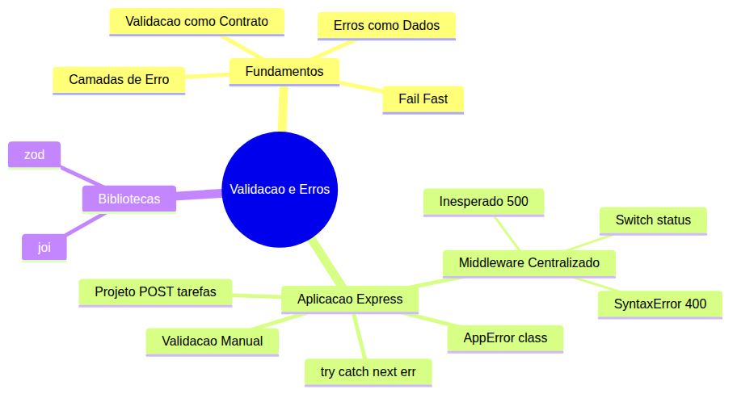
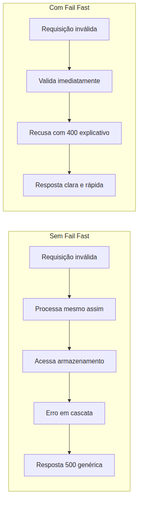
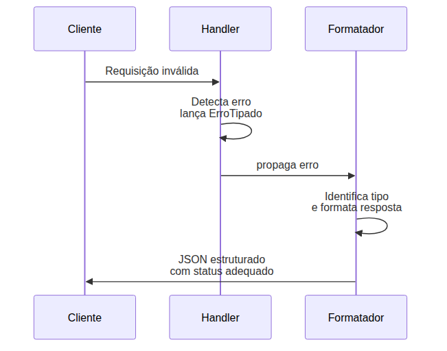
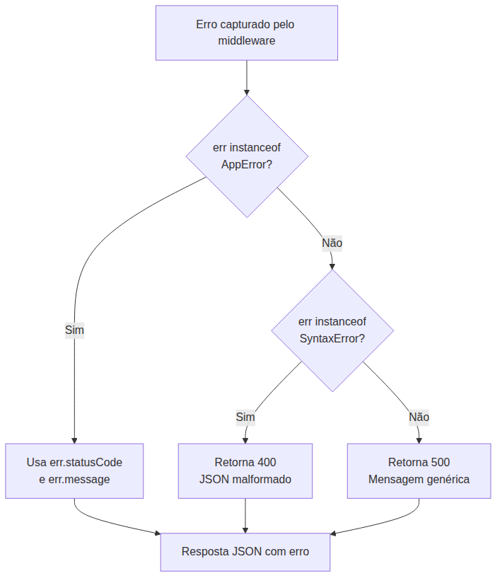
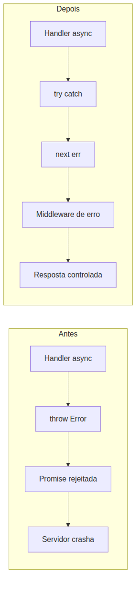

# Node.js — Do Zero ao Servidor Express — Aula 09

## Validação e Tratamento de Erros

**Duração estimada:** 90 minutos (50 de leitura + 40 de prática)
**Nível:** Intermediário
**Pré-requisitos:** Aula 01 a 08 (Express, rotas CRUD, Middleware Pattern, pipeline, error handler 500, next())

---

## Objetivos de Aprendizagem

Ao final desta aula, você será capaz de:

- [ ] **Explicar** por que validação de entrada é a primeira linha de defesa de uma API e como o princípio de fail fast reduz bugs em cascata
- [ ] **Aplicar** o princípio de fail fast em rotas — validar antes de processar, recusar requisições inválidas imediatamente
- [ ] **Construir** validação manual verificando campos obrigatórios, tipos e formatos mínimos
- [ ] **Criar** uma classe `AppError` que encapsula `statusCode` + `message` — erros como dados estruturados
- [ ] **Implementar** um middleware de erro centralizado que responde com status codes diferenciados por tipo de erro
- [ ] **Demonstrar** o uso de `try/catch` em handlers assíncronos conectado ao `next(err)`
- [ ] **Comparar** validação manual com bibliotecas de schema (joi/zod)
- [ ] **Diagnosticar** erros comuns de entrada (body ausente, JSON malformado, campo obrigatório faltando) e responder com 400
- [ ] **Explicar** como erros estruturados melhoram a separação entre lógica de negócio e transporte HTTP
- [ ] **Identificar** os três tipos de erro que o middleware centralizado deve tratar: AppError, SyntaxError e erros inesperados

---

## Como Usar Esta Aula

Esta aula está organizada em duas partes. A **primeira parte** constrói os fundamentos universais de validação e tratamento de erros. A **segunda parte** aplica esses conceitos com Express.js — criando AppError, middleware centralizado e try/catch. Ao final, o arquivo separado de Questões de Aprendizagem traz as tarefas de checkpoint.

## Mapa Mental

Este diagrama mostra todos os conceitos que você vai dominar nesta aula:





> *O mapa mental acima mostra a estrutura da aula. Cada ramo representa um conceito que você vai explorar.*

## Recapitulação das Aulas Anteriores

| Aula | Conceito | Onde aparece nesta aula | Como se conecta |
|---|---|---|---|
| Aula 04 | **tarefas-repo.js** (fs) | Seção 10 | O POST /tarefas que será validado usa o repositório da Aula 04 |
| Aula 05 | **EventEmitter** (broadcast) | Seções 3-4 | Comparação: eventos broadcast vs erros fluindo em camadas |
| Aula 07 | **Rotas CRUD + express.json** | Seções 5, 10 | O POST /tarefas já existe com validação inline — vamos refatorá-lo |
| Aula 08 | **Middleware de erro (500 genérico)** | Seções 7-8, 10 | O error handler que sempre retorna 500 agora será turbinado com switch de status |

---

**FUNDAMENTOS: Validação, Fail Fast e Erros como Dados**

> *Os conceitos desta seção são universais — valem para qualquer API, em qualquer linguagem. Na segunda parte, você verá como aplicá-los com Express.*

---

## 1. Validação como Contrato de Entrada

Imagine que você chega em um cartório para registrar um imóvel. O atendente pede seus documentos. Você entrega uma folha em branco. O que ele faz? Ele aponta o problema na hora — "falta o documento X, falta a assinatura Y" — e não dá andamento até que tudo esteja correto.

Uma API funciona da mesma forma. **Cada endpoint é um contrato**: "você me envia dados neste formato específico, eu processo e devolvo uma resposta. Se os dados estiverem incorretos, eu recuso na hora e explico o motivo."

Sem validação, seu servidor aceita qualquer coisa:

- Body vazio `{}`? O servidor tenta processar e quebra
- Campo com tipo errado `{ "titulo": 42 }`? O servidor tenta chamar `.trim()` em um número e lança uma exceção
- Dados incompletos? O processamento avança até um ponto onde algo falta, gerando um erro confuso e difícil de rastrear

Validar a entrada é criar uma **barreira na porta de entrada**: antes de qualquer processamento, você confere se os dados estão no formato esperado. Se não estiverem, a requisição é recusada imediatamente — com uma mensagem clara sobre o que está errado.

### Quick Check 1

**1. Por que validar a entrada é comparado a uma barreira na porta de entrada?**
**Resposta:** Porque a validação acontece antes de qualquer processamento — assim como uma barreira física, ela só permite a passagem de dados que atendem aos requisitos, recusando imediatamente os inválidos.

**2. O que acontece com um servidor que não valida os dados de entrada?**
**Resposta:** Ele aceita qualquer dado, processa até quebrar ou gerar resultados incorretos, produzindo erros confusos e difíceis de rastrear — bugs em cascata que poderiam ter sido evitados com uma recusa precoce.

---

## 2. Fail Fast — Detectar Cedo, Responder Imediato

Fail fast é um princípio de design que diz: **detecte o erro o mais cedo possível e responda imediatamente**. Não adie a reclamação. Não processe dados inválidos esperando que "talvez funcione".

Observe a diferença entre os dois fluxos:





**Sem fail fast:** a requisição inválida passa pelo handler, tenta acessar o banco, quebra no meio do caminho, o servidor lança um erro genérico e o cliente recebe um 500 sem saber o que aconteceu.

**Com fail fast:** o handler valida os dados nos primeiros milissegundos, detecta que o campo obrigatório está faltando, retorna 400 com `{ "erro": "Campo 'titulo' é obrigatório" }`. O cliente corrige e reenvia. O servidor não desperdiçou processamento.

Os benefícios práticos do fail fast são:

- **Elimina bugs em cascata**: um erro não se propaga para camadas internas onde o diagnóstico é mais difícil
- **Reduz processamento desperdiçado**: dados inválidos são rejeitados antes de qualquer operação custosa
- **Resposta instantânea**: o cliente sabe imediatamente o que está errado, sem timeout ou retry

Você pode estar pensando: "mas validar na entrada não cobre todos os casos". Correto. Fail fast não substitui tratamento de erros — ele complementa. A validação é a primeira camada de defesa, não a única.

### Quick Check 2

**1. Qual a principal diferença entre uma requisição inválida com e sem fail fast?**
**Resposta:** Sem fail fast, a requisição inválida avança no processamento até quebrar em algum ponto interno, gerando um erro genérico (500). Com fail fast, ela é recusada imediatamente na entrada com uma mensagem clara (400).

**2. Por que fail fast reduz bugs em cascata?**
**Resposta:** Porque o erro é detectado antes de se propagar para outras camadas do sistema. Um dado inválido não chega a acessar armazenamento nem a executar lógica de negócio, evitando efeitos colaterais imprevisíveis.

---

## 3. Erros como Dados Estruturados

O erro mais primitivo que um servidor pode retornar é uma string solta: `"Deu ruim"`. O cliente recebe isso e não sabe o que fazer — foi 400? Foi 500? Qual campo está errado?

**Erro como dado estruturado** é quando você transforma a resposta de erro em um objeto com campos significativos:

```json
{
  "status": 400,
  "mensagem": "Campo 'titulo' é obrigatório",
  "detalhes": ["O campo 'titulo' deve ser uma string não-vazia"]
}
```

Compare as duas abordagens:

| Característica | Erro como string | Erro como dado estruturado |
|---|---|---|
| Status HTTP | Sempre 500 | Diferenciado (400, 404, 422, 500) |
| Mensagem | Genérica ("Erro interno") | Específica ("Campo X é obrigatório") |
| Cliente pode tratar | Não — não sabe o que errou | Sim — pode exibir mensagem no frontend |
| Log | Texto solto | Estruturado, buscável por campo |
| Extensibilidade | Nenhuma | Pode adicionar campos (código interno, stack trace em dev) |

Um cliente bem escrito usa esses dados estruturados para exibir a mensagem de erro correta para o usuário. Um campo `status` numérico permite que o frontend decida se redireciona (401), exibe um toast (400) ou mostra uma tela de erro genérica (500).

**A ideia central é**: o erro não é apenas "algo deu errado" — é um diagnóstico com informações que o cliente pode usar programaticamente.

### Quick Check 3

**1. Qual a vantagem de retornar erros como objetos estruturados em vez de strings?**
**Resposta:** O cliente pode tratar programaticamente cada tipo de erro — exibir a mensagem correta, decidir a ação com base no status, e o servidor pode logar de forma estruturada para debugging.

**2. Que campos um objeto de erro bem estruturado deve ter?**
**Resposta:** Status HTTP (código numérico), mensagem descritiva explicando o problema e, opcionalmente, detalhes adicionais como o campo específico que falhou na validação.

---

## 4. Camadas de Erro — Separação entre Detecção e Formatação

Em uma arquitetura bem projetada, o erro não é tratado no mesmo lugar onde é detectado. Ele **flui por camadas**, cada uma com responsabilidade específica:





As camadas são:

1. **Camada de Detecção**: a função que recebe os dados detecta que algo está errado — campo obrigatório faltando, valor inválido, recurso não encontrado. Esta camada sabe **O QUE** deu errado e produz um erro com tipo e mensagem.
2. **Camada de Formatação**: recebe o erro, identifica o tipo, decide **COMO** responder — qual código de status, que mensagem retornar para o cliente, se inclui informações de debug.

Essa separação é o coração do design de erros: quem detecta não precisa saber como formatar a resposta HTTP — só precisa produzir o erro certo com tipo e mensagem. Quem formata não precisa saber de lógica de negócio — só precisa mapear tipos de erro para respostas adequadas.

Sem essa separação, cada função teria que escrever manualmente o código de formatação HTTP repetidamente. Com ela, a função só produz o erro e a camada de formatação faz o resto.

### Quick Check 4

**1. Quais são as duas camadas principais no fluxo de um erro e qual a responsabilidade de cada uma?**
**Resposta:** Camada de detecção (sabe O QUE deu errado — produz um erro com tipo e mensagem) e camada de formatação (sabe COMO responder — mapeia o tipo do erro para um código de status e formato de resposta).

**2. O que acontece se não houver separação entre detecção e formatação do erro?**
**Resposta:** Cada função precisa escrever manualmente o código de formatação HTTP para cada erro, duplicando código e dificultando a manutenção — qualquer mudança no formato das respostas de erro exige alterar todas as funções que lidam com erros.

---

**APLICAÇÃO: Validação e Tratamento de Erros no Express**

> *Agora que você entende validação como contrato, fail fast e erros como dados estruturados, vamos conectá-los à prática com Express — substituindo validação inline por AppError e turbinando o middleware de erro.*

---

## 5. Validação Manual no Express

Você já tem um servidor Express com o POST /tarefas funcional. A validação atual é inline e simples:

```javascript
app.post('/tarefas', (req, res) => {
  const { titulo } = req.body;
  if (!titulo) {
    return res.status(400).json({ erro: 'Título é obrigatório' });
  }
  const tarefa = adicionarTarefa(titulo);
  res.status(201).json(tarefa);
});
```

Isso funciona, mas mistura detecção de erro com formatação de resposta — violando a separação que vimos na Seção 4. Além disso, só valida um campo e de uma forma superficial.

Vamos construir uma validação mais robusta, ainda manual, para o POST /tarefas. A validação deve verificar:

1. **Campo obrigatório**: `req.body.titulo` existe
2. **Tipo**: `titulo` é uma string (`typeof`)
3. **Formato mínimo**: a string não é vazia após remover espaços

```javascript
app.post('/tarefas', (req, res) => {
  const { titulo } = req.body;

  if (!titulo) {
    return res.status(400).json({ erro: 'Campo "titulo" é obrigatório' });
  }
  if (typeof titulo !== 'string') {
    return res.status(400).json({ erro: 'Campo "titulo" deve ser uma string' });
  }
  if (titulo.trim().length === 0) {
    return res.status(400).json({ erro: 'Campo "titulo" não pode ser vazio' });
  }

  const tarefa = adicionarTarefa(titulo.trim());
  res.status(201).json(tarefa);
});
```

Teste com curl:

```bash
# POST válido
curl -X POST http://localhost:3000/tarefas \
  -H "Content-Type: application/json" \
  -d '{"titulo":"Estudar Node.js"}'
# Status 201 — retorna a tarefa criada

# POST sem título
curl -X POST http://localhost:3000/tarefas \
  -H "Content-Type: application/json" \
  -d '{}'
# Status 400 — "Campo 'titulo' é obrigatório"

# POST com título vazio
curl -X POST http://localhost:3000/tarefas \
  -H "Content-Type: application/json" \
  -d '{"titulo":"  "}'
# Status 400 — "Campo 'titulo' não pode ser vazio"

# POST com título numérico
curl -X POST http://localhost:3000/tarefas \
  -H "Content-Type: application/json" \
  -d '{"titulo":42}'
# Status 400 — "Campo 'titulo' deve ser uma string"
```

Perceba o padrão: cada validação retorna 400 com uma mensagem específica. O cliente sabe exatamente qual campo e qual problema. Mas ainda há repetição: todo `return res.status(400).json(...)` é uma resposta HTTP saindo do handler. Na Seção 6 vamos eliminar isso.

**Mão na Massa — Validação Manual no POST:**

- [ ] No seu `servidor-express.js`, localize o handler do POST /tarefas
- [ ] Substitua a validação inline atual (`if (!titulo)`) pelas 3 verificações: campo obrigatório, tipo string, string não-vazia
- [ ] Teste cada cenário com os comandos curl acima
- [ ] Verifique que um POST inválido retorna 400 com mensagem descritiva

### Quick Check 5

**1. Quais são as três verificações que uma validação manual mínima de um campo string deve fazer?**
**Resposta:** Verificar se o campo existe (obrigatório), se o tipo é string (`typeof`), e se a string não é vazia após trim (formato mínimo).

**2. O que cada validação deve retornar em caso de falha?**
**Resposta:** Deve retornar status 400 com uma mensagem JSON descritiva indicando exatamente qual campo e qual problema foi encontrado.

---

## 6. AppError — Uma Classe para Erros HTTP

Agora vamos materializar o conceito de **erros como dados estruturados** (Seção 3) em uma classe JavaScript. Em vez de cada handler escrever `res.status(400).json(...)`, vamos criar uma classe que representa um erro HTTP:

```javascript
class AppError extends Error {
  constructor(message, statusCode = 400) {
    super(message);
    this.statusCode = statusCode;
  }
}
```

**O que esta classe faz?**

- `extends Error`: herda de `Error`, então mantém o stack trace e o comportamento padrão de erros em JavaScript
- `constructor(message, statusCode)`: recebe uma mensagem descritiva (o que o cliente vai ver) e um status HTTP (código numérico)
- `super(message)`: passa a mensagem para a classe `Error`, que a armazena em `this.message`
- `this.statusCode = statusCode`: adiciona uma propriedade própria para o status HTTP

Agora, em vez de responder diretamente, o handler **lança** o erro:

```javascript
// Antes — resposta inline no handler
if (!titulo) {
  return res.status(400).json({ erro: 'Título é obrigatório' });
}

// Depois — erro lançado para o middleware tratar
if (!titulo) {
  throw new AppError('Campo "titulo" é obrigatório', 400);
}
```

A diferença é sutil mas poderosa: o handler agora só **detecta** o erro e o **lança**. Quem **formata** a resposta é o middleware de erro (que vamos construir na Seção 7). O handler não precisa saber de `res.json()` para erros.

**Mão na Massa — Criando o AppError:**

- [ ] No topo do `servidor-express.js`, antes de qualquer middleware, adicione a classe `AppError`
- [ ] Substitua os `return res.status(400).json(...)` do POST /tarefas por `throw new AppError('mensagem', 400)`
- [ ] Teste com curl — você vai receber um erro 500 porque ainda não temos o middleware capturando o `throw`. Isso é esperado — vamos resolver na Seção 7

```javascript
// Adicione no topo do servidor:
class AppError extends Error {
  constructor(message, statusCode = 400) {
    super(message);
    this.statusCode = statusCode;
  }
}
```

### Quick Check 6

**1. Qual a vantagem de usar `throw new AppError(...)` em vez de `return res.status(400).json(...)`?**
**Resposta:** O handler se limita a detectar o erro e lançá-lo, sem se preocupar com a formatação da resposta. O middleware de erro centralizado decide como responder, separando responsabilidades.

**2. O que a classe AppError adiciona ao `Error` padrão do JavaScript?**
**Resposta:** Adiciona a propriedade `statusCode`, que armazena o código HTTP do erro (400, 404, 422, etc.). O `message` é herdado da classe `Error`.

---

## 7. Middleware de Erro Centralizado Robusto

Na Aula 08 você criou um middleware de erro que sempre retorna 500:

```javascript
app.use((err, req, res, next) => {
  console.error(err.stack);
  res.status(500).json({ erro: err.message });
});
```

Agora vamos turbiná-lo para tratar **três tipos de erro** com status codes diferentes:

```javascript
app.use((err, req, res, next) => {
  // 1. AppError — usa o statusCode próprio
  if (err instanceof AppError) {
    return res.status(err.statusCode).json({
      erro: err.message
    });
  }

  // 2. SyntaxError — JSON malformado no body
  if (err instanceof SyntaxError && err.status === 400 && 'body' in err) {
    return res.status(400).json({
      erro: 'JSON malformado no corpo da requisição'
    });
  }

  // 3. Erro inesperado — fallback 500
  console.error('Erro inesperado:', err);
  return res.status(500).json({
    erro: 'Erro interno do servidor'
  });
});
```

Veja como cada tipo é tratado:

| Tipo | Condição | Status | Resposta |
|---|---|---|---|
| **AppError** | `err instanceof AppError` | Usa `err.statusCode` | Mensagem do erro |
| **SyntaxError** | `err instanceof SyntaxError && err.status === 400` | 400 | Erro de JSON malformado |
| **Inesperado** | Qualquer outro erro | 500 | Mensagem genérica |

O `err instanceof SyntaxError` captura o erro que o `express.json()` lança quando o body não é JSON válido. Por exemplo, enviar `{ titulo: }` (JSON quebrado) faz o parser lançar um `SyntaxError` com status 400. Antes, esse erro caía no 500 genérico — agora é tratado adequadamente.





**Mão na Massa — Substituindo o Error Handler:**

- [ ] Localize o middleware de erro no final do `servidor-express.js`
- [ ] Substitua o handler simples pelo switch com 3 casos (AppError, SyntaxError, inesperado)
- [ ] Teste com um POST de JSON malformado: `curl -X POST http://localhost:3000/tarefas -H "Content-Type: application/json" -d '{ titulo: }'`
- [ ] Teste com um AppError (POST sem título) — deve retornar 400 com a mensagem do AppError
- [ ] Teste com GET /erro (se você tiver a rota de teste) — deve retornar 500 genérico

### Quick Check 7

**1. Quais são os três tipos de erro que o middleware centralizado deve tratar?**
**Resposta:** AppError (erros da aplicação, status próprio), SyntaxError (JSON malformado, 400) e erros inesperados (fallback 500).

**2. Por que o middleware captura `SyntaxError` separadamente?**
**Resposta:** Porque quando o cliente envia JSON inválido, o `express.json()` lança um `SyntaxError`. Sem essa captura, o erro cairia no 500 genérico, fazendo o cliente achar que foi um erro do servidor quando na verdade foi um erro de formatação do body.

---

## 8. Try/Catch em Handlers Assíncronos

Na Aula 08, você aprendeu que o Express 4 não captura Promises rejeitadas. Se um handler `async` lançar uma exceção, o servidor quebra:

```javascript
// PROBLEMA: throw em async crasha o servidor
app.post('/tarefas', async (req, res) => {
  const { titulo } = req.body;
  if (!titulo) {
    throw new AppError('Título é obrigatório', 400); // CRASHA!
  }
  const tarefa = await adicionarTarefa(titulo);
  res.status(201).json(tarefa);
});
```

O `throw` dentro de um `async` function se transforma em uma Promise rejeitada. O Express 4 não escuta Promises rejeitadas — o erro cai no catch do runtime e o servidor para.

A solução é **envolver o handler em try/catch e chamar `next(err)`**:

```javascript
// SOLUÇÃO: try/catch + next(err) entrega o erro ao middleware
app.post('/tarefas', async (req, res, next) => {
  try {
    const { titulo } = req.body;

    if (!titulo) {
      throw new AppError('Campo "titulo" é obrigatório', 400);
    }
    if (typeof titulo !== 'string') {
      throw new AppError('Campo "titulo" deve ser uma string', 400);
    }
    if (titulo.trim().length === 0) {
      throw new AppError('Campo "titulo" não pode ser vazio', 400);
    }

    const tarefa = await adicionarTarefa(titulo.trim());
    res.status(201).json(tarefa);
  } catch (err) {
    next(err); // ← entrega o erro ao middleware centralizado
  }
});
```

**Três mudanças importantes:**

1. **Adicionar `next` como terceiro parâmetro**: a assinatura agora é `(req, res, next)`
2. **Envolver tudo em `try { ... } catch (err) { next(err); }`**: qualquer erro dentro do handler é capturado e passado adiante
3. **Remover `return` antes do `throw`**: `throw` já interrompe a execução — não precisa de `return`

O `next(err)` faz o erro fluir para o middleware de erro centralizado, que decide o status e a resposta. O handler nunca mais vai crashar o servidor.





**Mão na Massa — Adicionando Try/Catch:**

- [ ] No handler do POST /tarefas, adicione `next` como terceiro parâmetro
- [ ] Envolva todo o corpo do handler em `try { ... } catch (err) { next(err); }`
- [ ] Teste cada cenário de erro — agora todos devem retornar 400 com a mensagem correta, sem crashar o servidor
- [ ] Teste o JSON malformado — deve retornar 400 do SyntaxError

> **Express 5:** O Express 5 (ainda em beta) captura automaticamente Promises rejeitadas, eliminando a necessidade de try/catch manual. Se você estiver usando Express 4 (que é a versão estável), o try/catch é obrigatório. Existe também o pacote `express-async-errors` que faz essa captura automaticamente.

### Quick Check 8

**1. Por que `throw` em um handler `async` crasha o servidor no Express 4?**
**Resposta:** Porque dentro de uma função `async`, `throw` se transforma em uma Promise rejeitada. O Express 4 não captura Promises rejeitadas — o erro escapa do pipeline e derruba o servidor.

**2. Como o try/catch resolve esse problema?**
**Resposta:** O `catch` captura a exceção e a passa para `next(err)`, que entrega o erro ao middleware de erro centralizado. O erro é tratado de forma controlada em vez de crashar o servidor.

---

## 9. Quando a Validação Manual Encontra Seu Limite

A validação manual que você acabou de aprender é suficiente para muitos casos. Mas conforme sua API cresce, ela se torna verbosa:

| Problema | Exemplo |
|---|---|
| Muitos campos | Validar 10 campos de um formulário exige 30+ linhas de `if` |
| Tipos aninhados | Validar objetos dentro de objetos fica complexo |
| Mensagens de erro consistentes | Cada validação manual pode ter um formato de mensagem diferente |

Bibliotecas de validação de schema resolvem esses problemas. Você **define um schema** — uma descrição declarativa do formato esperado — e a biblioteca valida, gera mensagens de erro e trata tipos aninhados automaticamente.

Duas bibliotecas populares:

| Biblioteca | Abordagem | Destaque |
|---|---|---|
| **joi** | Schema descritivo | Maturidade, ampla adoção, mensagens customizáveis |
| **zod** | TypeScript-first | Inferência de tipos, integração nativa com TypeScript |

A validação manual (que você aprendeu hoje) é o alicerce. As bibliotecas automatizam o processo, mas o conceito é o mesmo: definir um contrato, validar na entrada, fail fast, erros estruturados.

### Quick Check 9

**1. Em que cenário a validação manual se torna difícil de manter?**
**Resposta:** Quando a API cresce e tem muitos campos (10+), tipos aninhados (objetos dentro de objetos) ou quando é necessário garantir mensagens de erro consistentes em toda a API.

**2. Qual a principal diferença entre a abordagem do joi e do zod?**
**Resposta:** O joi usa uma sintaxe descritiva independente de tipos — você descreve o schema com métodos encadeados. O zod é TypeScript-first — o schema infere automaticamente os tipos TypeScript, integrando validação de runtime com type-checking em tempo de compilação.

---

> **Nota:** Esta aula cobre validação manual para que você entenda o mecanismo. Quando sua API tiver mais de 5 campos, considere adotar joi ou zod — ambas têm documentação excelente e são amplamente usadas em produção.

---

## 10. Projeto Progressivo — Protegendo o POST /tarefas

Vamos integrar tudo que você aprendeu. O `servidor-express.js` vai ganhar uma camada de validação profissional com AppError, try/catch e middleware centralizado.

O código completo do servidor após a refatoração:

```javascript
const express = require('express');
const cors = require('cors');
const morgan = require('morgan');
const { adicionarTarefa, listarTarefas } = require('./tarefas-repo');

const app = express();

// 1. Classe AppError
class AppError extends Error {
  constructor(message, statusCode = 400) {
    super(message);
    this.statusCode = statusCode;
  }
}

// 2. Pipeline de middlewares
app.use(cors());
app.use(morgan('dev'));
app.use(express.json());
app.use((req, res, next) => {
  console.log(`[${new Date().toISOString()}] ${req.method} ${req.url}`);
  next();
});

// 3. Rotas
app.get('/tarefas', (req, res) => {
  const tarefas = listarTarefas();
  res.json(tarefas);
});

app.post('/tarefas', (req, res, next) => {
  try {
    const { titulo } = req.body;

    if (!titulo) {
      throw new AppError('Campo "titulo" é obrigatório', 400);
    }
    if (typeof titulo !== 'string') {
      throw new AppError('Campo "titulo" deve ser uma string', 400);
    }
    if (titulo.trim().length === 0) {
      throw new AppError('Campo "titulo" não pode ser vazio', 400);
    }
    if (titulo.trim().length < 3) {
      throw new AppError('Campo "titulo" deve ter no mínimo 3 caracteres', 400);
    }

    const tarefa = adicionarTarefa(titulo.trim());
    res.status(201).json(tarefa);
  } catch (err) {
    next(err);
  }
});

// (demais rotas GET /tarefas/:id, PUT, DELETE)

// 4. Middleware de erro centralizado
app.use((err, req, res, next) => {
  if (err instanceof AppError) {
    return res.status(err.statusCode).json({ erro: err.message });
  }

  if (err instanceof SyntaxError && err.status === 400 && 'body' in err) {
    return res.status(400).json({ erro: 'JSON malformado no corpo da requisição' });
  }

  console.error('Erro inesperado:', err);
  return res.status(500).json({ erro: 'Erro interno do servidor' });
});

app.listen(3000, () => console.log('Servidor na porta 3000'));
```

**Testes com curl:**

```bash
# Cenário 1: POST válido
curl -X POST http://localhost:3000/tarefas \
  -H "Content-Type: application/json" \
  -d '{"titulo":"Estudar Node.js"}'
# → 201 + tarefa criada

# Cenário 2: POST sem título
curl -X POST http://localhost:3000/tarefas \
  -H "Content-Type: application/json" \
  -d '{}'
# → 400 + {"erro":"Campo \"titulo\" é obrigatório"}

# Cenário 3: POST com título vazio
curl -X POST http://localhost:3000/tarefas \
  -H "Content-Type: application/json" \
  -d '{"titulo":"  "}'
# → 400 + {"erro":"Campo \"titulo\" não pode ser vazio"}

# Cenário 4: JSON malformado
curl -X POST http://localhost:3000/tarefas \
  -H "Content-Type: application/json" \
  -d '{ titulo: }'
# → 400 + {"erro":"JSON malformado no corpo da requisição"}
```

**Mão na Massa — Integração Completa:**

- [ ] Adicione a classe `AppError` no topo do servidor (antes dos middlewares)
- [ ] Atualize a validação do POST /tarefas com as 4 verificações (obrigatório, tipo, não-vazio, mínimo 3 caracteres)
- [ ] Adicione `next` no handler e envolva tudo em try/catch
- [ ] Substitua o middleware de erro antigo pelo novo com switch de status
- [ ] Teste cada um dos 4 cenários com os comandos curl acima

**Verificação:** O servidor responde com status codes corretos para cada tipo de erro. Nenhum erro crasheia o servidor. O console.log mostra os erros inesperados, mas não os AppError (são esperados e tratados).

### Quick Check 9

**1. Quais são os 4 cenários de teste do POST /tarefas e qual status cada um deve retornar?**
**Resposta:** POST válido (201), POST sem título (400), POST com título vazio (400), JSON malformado (400). Cada erro tem uma mensagem específica.

**2. Por que o middleware de erro trata AppError e SyntaxError separadamente, em vez de usar um único `res.status(500)`?**
**Resposta:** Porque cada tipo de erro tem uma causa diferente: AppError são erros esperados da aplicação (validação), SyntaxError são erros de formatação do body. Ambos merecem status 400 (erro do cliente), não 500 (erro do servidor). O fallback 500 é para erros realmente inesperados.

---

## Autoavaliação: Quiz Rápido

**1. Por que validação de entrada é chamada de "primeira linha de defesa" de uma API?**
**Resposta:** Porque ela acontece antes de qualquer processamento — dados inválidos são rejeitados na porta de entrada, antes de acessar lógica de negócio, armazenamento ou qualquer recurso interno.

**2. O que significa "fail fast" e qual seu principal benefício?**
**Resposta:** Significa detectar o erro o mais cedo possível e responder imediatamente, sem processar dados inválidos. O principal benefício é eliminar bugs em cascata — um erro não se propaga para camadas internas.

**3. Qual a diferença entre um erro como string e um erro como dado estruturado?**
**Resposta:** Erro como string é uma mensagem genérica sem contexto. Erro como dado estruturado é um objeto com campos como status HTTP, mensagem descritiva e detalhes — permitindo que o cliente trate programaticamente.

**4. Qual a responsabilidade do handler e qual a responsabilidade do middleware de erro no fluxo de tratamento de erros?**
**Resposta:** O handler detecta o erro e sabe O QUE deu errado — ele lança o erro tipado. O middleware de erro sabe COMO responder — ele formata a resposta HTTP baseada no tipo do erro.

**5. O que a classe `AppError` adiciona ao `Error` padrão do JavaScript?**
**Resposta:** Adiciona a propriedade `statusCode`, permitindo que cada erro carregue seu código HTTP (400, 404, 422, etc.). O middleware usa esse código para responder com o status correto.

**6. Por que `throw` em um handler `async` crasha o servidor no Express 4?**
**Resposta:** Em funções `async`, `throw` gera uma Promise rejeitada. O Express 4 não captura Promises rejeitadas — o erro escapa do pipeline e derruba o processo.

**7. Como o middleware centralizado diferencia AppError de erros inesperados?**
**Resposta:** Usa `instanceof` — se o erro for uma instância de `AppError`, usa o statusCode e message próprios. Se for `SyntaxError` com status 400, retorna erro de JSON malformado. Caso contrário, cai no fallback 500.

---

## Mão na Massa: Exercícios Graduados

**Exercício 1 (Fácil) — Validar Título Obrigatório**

**Dificuldade:** Fácil | **Duração:** 5 minutos | **Cobre:** Seções 5-6

Crie um servidor Express com uma única rota POST `/mensagens` que valida o campo `texto` como obrigatório e string não-vazia. Use AppError com status 400 para erros de validação e um middleware de erro que trata AppError retornando o status correto.

**Gabarito:**

```javascript
const express = require('express');
const app = express();

class AppError extends Error {
  constructor(message, statusCode = 400) {
    super(message);
    this.statusCode = statusCode;
  }
}

app.use(express.json());

app.post('/mensagens', (req, res, next) => {
  try {
    const { texto } = req.body;
    if (!texto) throw new AppError('Campo "texto" é obrigatório', 400);
    if (typeof texto !== 'string') throw new AppError('Campo "texto" deve ser string', 400);
    if (texto.trim().length === 0) throw new AppError('Campo "texto" não pode ser vazio', 400);

    res.status(201).json({ mensagem: texto.trim() });
  } catch (err) {
    next(err);
  }
});

app.use((err, req, res, next) => {
  if (err instanceof AppError) {
    return res.status(err.statusCode).json({ erro: err.message });
  }
  console.error(err);
  res.status(500).json({ erro: 'Erro interno' });
});

app.listen(3000);
```

Teste: `curl -X POST http://localhost:3000/mensagens -H "Content-Type: application/json" -d '{}'` → 400.

---

**Exercício 2 (Médio) — Validar Múltiplos Campos com Enum**

**Dificuldade:** Médio | **Duração:** 10 minutos | **Cobre:** Seções 5-7

Crie um servidor com POST `/tarefas` que valida dois campos: `titulo` (string, obrigatório, min 3 caracteres) e `prioridade` (string, obrigatório, deve ser "alta", "média" ou "baixa"). Use AppError com validações separadas por campo. O middleware de erro deve tratar AppError (status próprio), SyntaxError (400) e erros inesperados (500).

**Gabarito:**

```javascript
const express = require('express');
const app = express();

class AppError extends Error {
  constructor(message, statusCode = 400) {
    super(message);
    this.statusCode = statusCode;
  }
}

app.use(express.json());

app.post('/tarefas', (req, res, next) => {
  try {
    const { titulo, prioridade } = req.body;

    if (!titulo) throw new AppError('Campo "titulo" é obrigatório', 400);
    if (typeof titulo !== 'string') throw new AppError('Campo "titulo" deve ser string', 400);
    if (titulo.trim().length < 3) throw new AppError('Campo "titulo" deve ter no mínimo 3 caracteres', 400);

    if (!prioridade) throw new AppError('Campo "prioridade" é obrigatório', 400);
    if (typeof prioridade !== 'string') throw new AppError('Campo "prioridade" deve ser string', 400);
    const prioridadesValidas = ['alta', 'média', 'baixa'];
    if (!prioridadesValidas.includes(prioridade)) {
      throw new AppError('Campo "prioridade" deve ser "alta", "média" ou "baixa"', 400);
    }

    res.status(201).json({ titulo: titulo.trim(), prioridade });
  } catch (err) {
    next(err);
  }
});

app.use((err, req, res, next) => {
  if (err instanceof AppError) {
    return res.status(err.statusCode).json({ erro: err.message });
  }
  if (err instanceof SyntaxError && err.status === 400 && 'body' in err) {
    return res.status(400).json({ erro: 'JSON malformado' });
  }
  console.error(err);
  res.status(500).json({ erro: 'Erro interno' });
});

app.listen(3000);
```

Teste os 3 cenários: prioridade inválida, JSON malformado, título curto.

---

**Desafio (Difícil) — Função de Validação Reutilizável com Múltiplos Erros**

**Dificuldade:** Difícil | **Duração:** 15 minutos | **Cobre:** Seções 5-10

Crie uma função `validarTarefa(body)` que retorna `{ valido: true }` ou `{ valido: false, erros: [...] }`. Cada erro de validação deve ser um AppError com status 400 e mensagem específica por campo. Integre com o POST /tarefas: a função coleta todos os erros de uma vez (em vez de lançar no primeiro), e o handler lança um único erro contendo a lista se houver falhas. O middleware de erro deve responder com a lista de erros.

**Gabarito:**

```javascript
const express = require('express');
const app = express();

class AppError extends Error {
  constructor(message, statusCode = 400) {
    super(message);
    this.statusCode = statusCode;
  }
}

// Função de validação reutilizável
function validarTarefa(body) {
  const erros = [];
  const { titulo, prioridade } = body || {};

  if (!titulo) {
    erros.push(new AppError('Campo "titulo" é obrigatório', 400));
  } else if (typeof titulo !== 'string') {
    erros.push(new AppError('Campo "titulo" deve ser uma string', 400));
  } else {
    if (titulo.trim().length === 0) {
      erros.push(new AppError('Campo "titulo" não pode ser vazio', 400));
    } else if (titulo.trim().length < 3) {
      erros.push(new AppError('Campo "titulo" deve ter no mínimo 3 caracteres', 400));
    }
  }

  if (!prioridade) {
    erros.push(new AppError('Campo "prioridade" é obrigatório', 400));
  } else if (typeof prioridade !== 'string') {
    erros.push(new AppError('Campo "prioridade" deve ser string', 400));
  } else {
    const validas = ['alta', 'média', 'baixa'];
    if (!validas.includes(prioridade)) {
      erros.push(new AppError('Prioridade deve ser "alta", "média" ou "baixa"', 400));
    }
  }

  return erros.length === 0
    ? { valido: true, dados: { titulo: titulo.trim(), prioridade } }
    : { valido: false, erros };
}

app.use(express.json());

app.post('/tarefas', (req, res, next) => {
  try {
    const resultado = validarTarefa(req.body);

    if (!resultado.valido) {
      const mensagens = resultado.erros.map(e => e.message);
      const err = new AppError('Erros de validação', 400);
      err.detalhes = mensagens;
      throw err;
    }

    res.status(201).json(resultado.dados);
  } catch (err) {
    next(err);
  }
});

app.use((err, req, res, next) => {
  if (err instanceof AppError) {
    const resposta = { erro: err.message };
    if (err.detalhes) resposta.detalhes = err.detalhes;
    return res.status(err.statusCode).json(resposta);
  }
  if (err instanceof SyntaxError && err.status === 400 && 'body' in err) {
    return res.status(400).json({ erro: 'JSON malformado' });
  }
  console.error(err);
  res.status(500).json({ erro: 'Erro interno' });
});

app.listen(3000);
```

Teste com múltiplos erros: `curl -X POST http://localhost:3000/tarefas -H "Content-Type: application/json" -d '{"titulo":"ab","prioridade":"urgente"}'` → Deve retornar 400 com lista de 2 erros (título muito curto + prioridade inválida).

---

## Resumo da Aula

### Os 10 Conceitos Fundamentais

1. **Validação como Contrato**: cada endpoint é um contrato — se os dados não atendem, recuse na entrada com uma mensagem clara. (Seção 1)
2. **Fail Fast**: detecte erros o mais cedo possível para evitar bugs em cascata e processamento desperdiçado. (Seção 2)
3. **Erros como Dados Estruturados**: erros são objetos com status, mensagem e detalhes — não strings genéricas. (Seção 3)
4. **Camadas de Erro**: handler detecta e lança (O QUE), middleware formata a resposta (COMO). (Seção 4)
5. **Validação Manual**: verifique campos obrigatórios, tipos com `typeof` e formatos com `.trim()/.length`. (Seção 5)
6. **AppError**: classe que estende `Error` e adiciona `statusCode` — erros HTTP como objetos tipados. (Seção 6)
7. **Middleware de Erro Centralizado**: switch por tipo de erro — AppError (status próprio), SyntaxError (400), inesperado (500). (Seção 7)
8. **Try/Catch + Next**: em Express 4, handlers async precisam de try/catch com `next(err)` para não crashar. (Seção 8)
9. **Avaliações de Schema**: validação manual é o alicerce; bibliotecas como joi e zod automatizam para muitos campos. (Seção 9)
10. **Separação de Responsabilidades**: handler sabe o que deu errado, middleware decide como responder. (Seções 4, 6, 7)

### O Que Você Construiu Hoje

- [x] Classe `AppError` que encapsula statusCode e message
- [x] Validação manual de 4 níveis (obrigatório, tipo, não-vazio, tamanho mínimo)
- [x] Middleware de erro centralizado com switch para 3 tipos de erro
- [x] Try/catch com `next(err)` em handler assíncrono
- [x] POST /tarefas protegido contra dados inválidos e JSON malformado
- [x] Tratamento correto de 400 (erro do cliente) vs 500 (erro do servidor)

---

## Próxima Aula

**Aula 10: Estrutura de Projeto Profissional — Rotas, Controladores, Services e Repositories**

Você aprendeu a validar dados e tratar erros de forma centralizada. O próximo passo é organizar o servidor em camadas: rotas, controladores, serviços e repositórios. O `servidor-express.js` vai se transformar em uma estrutura de pastas profissional, preparando o terreno para bancos de dados, autenticação e testes.

---

## Referências

### Documentação Oficial

- [Express.js — Error Handling](https://expressjs.com/en/guide/error-handling.html)
- [MDN — Error](https://developer.mozilla.org/en-US/docs/Web/JavaScript/Reference/Global_Objects/Error)
- [Express.js — express.json()](https://expressjs.com/en/4x/api.html#express.json)

### Ferramentas

- [joi — Schema Validation](https://joi.dev/api/)
- [zod — TypeScript-first Schema Validation](https://zod.dev/)
- [express-async-errors](https://www.npmjs.com/package/express-async-errors)

### Artigos para Aprofundamento

- [Fail Fast Principle in Software Development](https://www.martinfowler.com/ieeeSoftware/failFast.pdf)
- [Tratamento de Erros em APIs REST](https://blog.restcase.com/rest-api-error-handling/)

---

## FAQ

**P: O AppError substitui todos os `res.status().json()` do servidor?**
R: Não. O AppError substitui a resposta para **erros da aplicação** (validação, recurso não encontrado, etc.). Respostas de sucesso continuam usando `res.json()` diretamente.

**P: Devo criar um arquivo separado para a classe AppError?**
R: Para este módulo, manter a classe no `servidor-express.js` é suficiente. Na próxima aula, quando você estruturar o projeto em pastas, o AppError vai para `src/middleware/AppError.js`.

**P: O middleware de erro captura erros de middlewares registrados antes dele?**
R: Sim. O erro flui para o primeiro middleware de erro registrado depois do ponto onde o erro foi lançado. Como o error handler fica por último, ele captura erros de todos os middlewares e rotas anteriores.

**P: Como faço para incluir o stack trace no ambiente de desenvolvimento?**
R: Adicione uma condição: `if (process.env.NODE_ENV !== 'production') { resposta.stack = err.stack }`. Assim, em desenvolvimento você vê o stack trace, em produção não expõe detalhes internos.

**P: Qual a diferença entre `throw new AppError(...)` e `next(new AppError(...))`?**
R: Em handlers síncronos, `throw` funciona. Em handlers assíncronos, `throw` vira Promise rejeitada e precisa de try/catch. `next(err)` funciona em ambos os casos, mas dentro de um `catch` é a forma correta.

**P: Preciso validar no frontend se já valido no backend?**
R: Sim. Validação no frontend é para experiência do usuário (resposta instantânea). Validação no backend é para segurança e integridade dos dados. As duas são necessárias e não se substituem.

**P: O que acontece se eu esquecer de chamar `next(err)` dentro do catch?**
R: O erro é engolido silenciosamente — o servidor não responde, o cliente fica esperando até o timeout. Sempre chame `next(err)` no catch para garantir que o erro seja tratado.

**P: Como lidar com erros de validação que dependem de mais de um campo?**
R: Você pode coletar todos os erros primeiro (como no Desafio dos Exercícios Graduados) e depois lançar um AppError com uma lista de detalhes. O middleware responde com todos os erros de uma vez.

**P: O `err.status === 400` no middleware de SyntaxError é obrigatório?**
R: Sim. O `SyntaxError` pode ser lançado por outras operações além do JSON.parse. A condição `err.status === 400 && 'body' in err` garante que estamos capturando especificamente o erro de parsing do body.

**P: Posso usar AppError para status diferentes de 400?**
R: Sim. Use `new AppError('Recurso não encontrado', 404)` ou `new AppError('Conflito', 409)`. O middleware usa `err.statusCode` para definir o status da resposta.

---

## Glossário

| Termo | Definição |
|---|---|
| **AppError** | Classe que estende `Error` e adiciona `statusCode` para representar erros HTTP como objetos estruturados. (Seção 6) |
| **Fail Fast** | Princípio de design que preconiza detectar e reportar erros o mais cedo possível, evitando processamento desnecessário. (Seção 2) |
| **Validação** | Processo de verificar se os dados de entrada atendem aos requisitos do contrato da API antes de processá-los. (Seção 1) |
| **Erro Estruturado** | Objeto de erro com campos semânticos (status, mensagem, detalhes) que o cliente pode tratar programaticamente. (Seção 3) |
| **Middleware de Erro** | Função Express com 4 parâmetros `(err, req, res, next)` que centraliza o tratamento de erros. (Seção 7) |
| **Try/Catch** | Estrutura JavaScript que captura exceções em blocos de código, permitindo tratamento controlado. (Seção 8) |
| **SyntaxError** | Erro lançado pelo `express.json()` quando o body contém JSON inválido. (Seção 7) |
| **next(err)** | Função que passa um erro para o middleware de erro centralizado no pipeline Express. (Seção 8) |
| **Contrato de API** | Conjunto de regras que define o formato esperado dos dados de entrada e saída de um endpoint. (Seção 1) |
| **joi** | Biblioteca de validação de schema para JavaScript, com sintaxe descritiva e mensagens customizáveis. (Seção 9) |
| **zod** | Biblioteca de validação de schema TypeScript-first, com inferência automática de tipos. (Seção 9) |
| **Camadas de Erro** | Separação entre detecção (handler) e formatação (middleware) de erros, cada uma com responsabilidade única. (Seção 4) |
