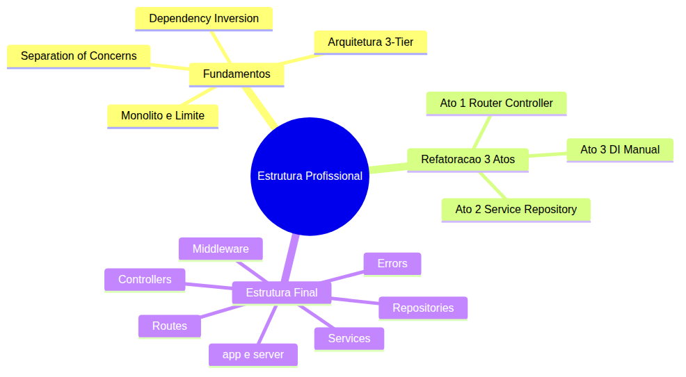
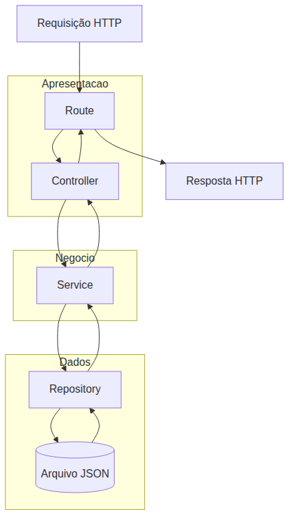

# Node.js — Do Zero ao Servidor Express — Aula 10

## Estrutura de Projeto Profissional — Rotas, Controladores, Services e Repositories

**Duração estimada:** 120 minutos (60 de leitura + 60 de prática)
**Nível:** Intermediário
**Pré-requisitos:** Aula 01 a 09 (Express CRUD, Middleware Pattern, AppError, validação, tarefas-repo.js)

---

## Objetivos de Aprendizagem

Ao final desta aula, você será capaz de:

- [ ] **Explicar** por que um arquivo único de 150 linhas não escala e quais problemas surgem com o crescimento
- [ ] **Aplicar** Separation of Concerns dividindo responsabilidades em camadas com papéis bem definidos
- [ ] **Distinguir** as três camadas da arquitetura 3-Tier: apresentação (HTTP), lógica de negócio (serviço) e dados (repositório)
- [ ] **Implementar** `express.Router()` para separar as definições de rota em arquivos próprios
- [ ] **Construir** um controller que traduz requisições HTTP em chamadas de serviço sem lógica de negócio
- [ ] **Criar** um service em JavaScript puro — sem `req`, `res` ou `next` — totalmente testável isoladamente
- [ ] **Projetar** um repository que encapsula o acesso a dados com interface Promise-based
- [ ] **Aplicar** Dependency Injection manual via factory functions — sem frameworks, apenas funções recebendo objetos
- [ ] **Refatorar** o servidor monolítico em uma estrutura profissional de pastas e arquivos
- [ ] **Diferenciar** `app.js` (configuração) de `server.js` (inicialização)

---

## Como Usar Esta Aula

Esta aula está organizada em duas partes. A **primeira parte** constrói os fundamentos universais de arquitetura de software — por que separar código em camadas e como pensar em termos de responsabilidades. A **segunda parte** aplica esses conceitos refatorando seu servidor em 3 atos, cada um produzindo código funcional. Ao final, o arquivo separado de Questões de Aprendizagem traz as tarefas de checkpoint.

## Mapa Mental

Este diagrama mostra todos os conceitos que você vai dominar nesta aula:





> *O mapa mental acima mostra a estrutura da aula. Cada ramo representa um conceito que você vai explorar.*

## Recapitulação das Aulas Anteriores

| Aula | Conceito | Onde aparece nesta aula | Como se conecta |
|---|---|---|---|
| Aula 04 | **tarefas-repo.js** (fs) | Seções 6, 8 | O repository vai encapsular as funções de persistência da Aula 04 |
| Aula 07 | **Rotas CRUD com Express** | Seções 5, 8 | As rotas do servidor serão extraídas para arquivos separados |
| Aula 08 | **Middleware (logger, erro)** | Seções 7, 8 | Middlewares serão extraídos para pasta dedicada com DI |
| Aula 09 | **AppError, validação** | Seções 7, 8 | AppError vai para `errors/`, validação vira middleware reutilizável |

---

**FUNDAMENTOS: Por que Organizar o Código em Camadas**

> *Os conceitos desta seção são universais — valem para qualquer servidor web, em qualquer linguagem. Na segunda parte, você verá como aplicá-los no seu servidor com rotas, controladores e serviços.*

---

## 1. O Monolito e o Limite do Crescimento

Imagine que você tem uma gaveta de cozinha. No começo, ela guarda três itens: talheres, panos de prato e temperos. Fácil de encontrar tudo.

Agora imagine que sua cozinha cresce. Você tem 50 itens: panelas, utensílios, mantimentos, produtos de limpeza. Tudo na mesma gaveta. Encontrar o salgador exige remover 15 coisas. Colocar algo de volta requer empilhar na ordem certa. Um desastre.

**O monolito de gaveta única funciona enquanto o volume é pequeno.** O mesmo vale para código. Seu `servidor.js` tem cerca de 150 linhas hoje — rotas, validação, middlewares, AppError, error handler, tudo no mesmo arquivo. Você encontra o que precisa porque o arquivo é pequeno.

Mas este servidor vai crescer. Novas rotas (usuários, categorias, relatórios). Novos middlewares (autenticação, rate limiting, cache). Novas validações. Em 500 linhas, encontrar o handler do PUT /tarefas exige scroll, busca mental e paciência.

Os problemas do arquivo único são:

1. **Dificuldade de navegação**: você sabe que a rota está em algum lugar entre a linha 80 e a 300
2. **Conflitos em time**: se duas pessoas editam o mesmo arquivo, o merge vira um pesadelo
3. **Acoplamento disfarçado**: lógica de HTTP, regras de negócio e acesso a dados estão misturadas
4. **Teste impossível**: testar uma regra de negócio exige fazer uma requisição HTTP inteira
5. **Reúso zero**: se outra parte do sistema precisar da lógica de conclusão de tarefa, não tem como importar sem trazer o framework HTTP junto

Você pode estar pensando: "mas 150 linhas ainda é gerenciável". Correto. O ponto é que **o monolito não quebra no primeiro dia**. Ele quebra silenciosamente, quando você menos espera, exatamente quando o projeto começa a crescer de verdade. O objetivo desta aula é reorganizar antes que doa.

### Quick Check 1

**1. Quais são dois problemas de manter todo o código em um único arquivo quando o projeto cresce?**
**Resposta:** Dificuldade de navegação (encontrar uma rota específica exige scroll) e acoplamento disfarçado (lógica HTTP, regras de negócio e acesso a dados misturados no mesmo lugar).

**2. Por que testar a lógica de negócio é mais difícil em um arquivo monolítico?**
**Resposta:** Porque testar qualquer regra exige fazer uma requisição HTTP inteira — não é possível chamar a função de negócio isoladamente sem passar pelo servidor.

---

## 2. Separation of Concerns — O Restaurante

Separation of Concerns (SoC) é o princípio de dividir um sistema em partes com responsabilidades distintas, onde cada parte cuida de um aspecto específico e não interfere nos outros.

A melhor analogia é um **restaurante**:

| Papel | Responsabilidade | Análogo no código |
|---|---|---|
| **Garçom** | Anota o pedido, leva à cozinha, serve o prato, responde ao cliente | Controller/Rota — lida com a requisição HTTP |
| **Chef** | Prepara o prato segundo a receita, decide os ingredientes, cozinha | Service — executa a lógica de negócio |
| **Despensa** | Armazena ingredientes, controla estoque, fornece o que o chef precisa | Repository — acessa e persiste dados |

O garçom não cozinha. O chef não atende mesas. A despensa não decide o cardápio. Cada um faz sua parte e o sistema (o restaurante) funciona como um todo.

**O que acontece se o garçom cozinha?** Ele demora para atender as mesas, a comida sai errada, e ninguém sabe quem faz o quê.

**O que acontece se o chef também gerencia a despensa?** Ele perde tempo procurando ingredientes em vez de cozinhar.

No código, a violação do SoC aparece como: um handler de rota que valida dados, formata resposta, acessa o banco de dados e calcula totais — tudo na mesma função.

Aplicar SoC significa:

- **Rotas e controllers** só sabem de HTTP: `req`, `res`, `next`, status codes, headers
- **Services** só sabem de regras de negócio: validação, cálculos, orquestração
- **Repositories** só sabem de dados: ler, escrever, buscar, atualizar

Cada camada pode ser alterada, testada e evoluída independentemente — desde que mantenha o contrato com a camada vizinha.

Se você mudar a lógica de conclusão de tarefa (service), nenhuma rota precisa ser alterada. Se você migrar de JSON para SQL (repository), o service continua funcionando sem mudar uma linha.

### Quick Check 2

**1. Na analogia do restaurante, qual o equivalente do Service e qual sua responsabilidade?**
**Resposta:** O Chef. Sua responsabilidade é preparar o prato seguindo a receita — executar a lógica de negócio sem interagir com o cliente ou gerenciar o estoque diretamente.

**2. O que acontece quando a separação de responsabilidades é violada em um sistema?**
**Resposta:** As funções ficam sobrecarregadas (misturam HTTP, lógica e dados), fica difícil alterar uma parte sem quebrar outra, e o teste de cada aspecto exige montar o sistema inteiro.

---

## 3. Arquitetura em Camadas — 3-Tier Layering

Agora que você entende o princípio de separar responsabilidades, vamos organizá-las em camadas. A arquitetura 3-Tier (três camadas) é uma das mais usadas em aplicações web:





O fluxo de uma requisição percorre as camadas de cima para baixo e a resposta faz o caminho inverso:

1. **Camada de Apresentação** (Route + Controller): recebe a requisição HTTP, extrai parâmetros, valida o formato, chama o service e formata a resposta. Sabe o que é HTTP — status codes, headers, JSON.
2. **Camada de Negócio** (Service): executa a lógica do domínio — o que significa "criar uma tarefa", "concluir", "listar pendentes". É código puro, sem qualquer noção de HTTP. Poderia ser chamada por uma CLI, um job agendado ou um socket.
3. **Camada de Dados** (Repository): acessa o armazenamento persistente — arquivo JSON, banco de dados, API externa. Esconde os detalhes de implementação do service.

A regra de ouro é: **cada camada só se comunica com a camada imediatamente abaixo**. O controller não acessa o repository diretamente — ele passa pelo service. O service não sabe que existe HTTP — ele só conhece o repository.

Veja por que isso importa com um exemplo concreto. Imagine que sua regra de negócio diz: "ao criar uma tarefa, verifique se o título não duplica com uma tarefa existente". Onde essa verificação fica?

- **Controller**: errado. Ele não deveria saber da regra de negócio.
- **Repository**: errado. Ele só persiste dados.
- **Service**: correto. Essa é uma regra de domínio.

Sem as camadas, essa verificação provavelmente estaria no handler da rota, ao lado do `res.json()`. Com as camadas, ela está no service, isolada e testável.

### Quick Check 3

**1. Qual a regra de comunicação entre as camadas na arquitetura 3-Tier?**
**Resposta:** Cada camada só se comunica com a camada imediatamente abaixo — controller chama service, service chama repository. O controller nunca acessa o repository diretamente.

**2. Em qual camada deve ficar a regra "título da tarefa não pode duplicar" e por quê?**
**Resposta:** No Service, porque é uma regra de negócio do domínio. O controller só traduz HTTP, e o repository só persiste dados — a validação de unicidade é lógica de domínio.

---

## 4. Dependency Inversion e Interfaces Estáveis

O quarto fundamento é o mais sutil e o mais poderoso: **Dependency Inversion Principle** (DIP). Ele diz que módulos de alto nível não devem depender de módulos de baixo nível — ambos devem depender de abstrações.

Traduzindo: seu service (alto nível) não deve importar diretamente o repository concreto (baixo nível). Em vez disso, ambos dependem de um **contrato** — uma interface.

A analogia é a **tomada elétrica**:

| Elemento | Análogo |
|---|---|
| Plugue do seu carregador | Service (quem precisa de energia) |
| Tomada na parede | Interface/Contrato |
| Usina hidrelétrica | Repository concreto (quem gera energia) |

Seu carregador não precisa saber se a energia vem de uma usina hidrelétrica, solar ou nuclear. Ele só precisa que a tomada forneça 127V em um formato específico. A usina (implementação) pode mudar; o carregador (cliente) continua funcionando.

No código, isso significa:

```
// MAL: Service depende diretamente de uma implementação concreta
// repo = importar('repositório/tarefas');
// class Serviço { listar() { return repo.listar(); } }

// BEM: Service recebe a dependência — não importa
// class Serviço {
//   constructor({ repo }) {  // repo segue um contrato
//     this.repo = repo;
//   }
//   listar() { return this.repo.listar(); }
// }
```

**Qual o contrato do repository?** Um conjunto estável de métodos:

- `listar(filtros)` → retorna array de tarefas
- `buscarPorId(id)` → retorna uma tarefa ou null
- `criar(dados)` → retorna a tarefa criada
- `atualizar(id, dados)` → retorna a tarefa atualizada
- `remover(id)` → retorna true/false

Esse contrato não muda se o armazenamento for JSON, SQLite, PostgreSQL ou uma API remota. O service depende do contrato, não da implementação.

Este princípio é a chave para **trocar implementações sem quebrar o sistema**. No próximo módulo (Banco de Dados SQL), você vai trocar o repository JSON por um SQLite. O service não vai mudar uma linha — porque ele depende da interface, não da implementação.

### Quick Check 4

**1. Na analogia da tomada elétrica, o que representa a interface/contrato e o que representa a implementação concreta?**
**Resposta:** A tomada na parede é o contrato (interface estável que o cliente conhece). A usina hidrelétrica é a implementação concreta (pode ser trocada sem afetar quem usa a tomada).

**2. Por que o service não deve importar diretamente a implementação do repository?**
**Resposta:** Porque isso cria acoplamento rígido — trocar a implementação (ex: JSON → SQLite) exigiria alterar o service. Com a dependência injetada, o service só conhece o contrato, e qualquer implementação que cumpra o contrato funciona.

---

**APLICAÇÃO: Refatoração do Servidor em 3 Atos**

> *Agora que você entende por que organizar o código em camadas, vamos aplicar cada conceito na prática. Cada ato produz código funcional — seu servidor nunca fica quebrado entre os passos.*

---

## 5. Ato 1 — Router + Controller

O primeiro passo é extrair as rotas do arquivo principal para um router dedicado. O Express oferece `express.Router()` — um mini-aplicativo de roteamento que você monta no app principal.

### Criando o Router

```javascript
// routes/tarefas.js
const { Router } = require('express');

const router = Router();

router.get('/', (req, res) => {
  // lógica aqui
});

router.get('/:id', (req, res) => {
  // lógica aqui
});

router.post('/', (req, res, next) => {
  // lógica aqui
});

router.put('/:id', (req, res, next) => {
  // lógica aqui
});

router.delete('/:id', (req, res, next) => {
  // lógica aqui
});

module.exports = router;
```

Perceba que o caminho das rotas mudou: em vez de `app.get('/tarefas', ...)`, usamos `router.get('/', ...)`. O prefixo `/tarefas` será definido onde o router for montado:

```javascript
// app.js (antes servidor-express.js)
const tarefasRouter = require('./routes/tarefas');
app.use('/tarefas', tarefasRouter);
```

### Criando o Controller

O controller é a função que traduz a requisição HTTP para o service (que ainda não existe — vamos manter a lógica inline por enquanto). Ele recebe `(req, res, next)` e seu trabalho é extrair parâmetros, chamar o que produz a resposta e formatar o resultado.

```javascript
// controllers/tarefasController.js
const { listarTarefas, adicionarTarefa, concluirTarefa, removerTarefa } = require('../../tarefas-repo');
const AppError = require('../errors/AppError');
const { validarTitulo } = require('../middleware/validators');

async function listar(req, res) {
  const { status } = req.query;
  let tarefas = listarTarefas();
  if (status) {
    tarefas = tarefas.filter(t => t.concluida === (status === 'concluida'));
  }
  res.json(tarefas);
}

async function buscarPorId(req, res, next) {
  try {
    const tarefas = listarTarefas();
    const tarefa = tarefas.find(t => t.id === req.params.id);
    if (!tarefa) {
      throw new AppError('Tarefa não encontrada', 404);
    }
    res.json(tarefa);
  } catch (err) {
    next(err);
  }
}

async function criar(req, res, next) {
  try {
    const { titulo } = req.body;
    validarTitulo(titulo);
    const tarefa = adicionarTarefa(titulo.trim());
    res.status(201).json(tarefa);
  } catch (err) {
    next(err);
  }
}

async function atualizar(req, res, next) {
  try {
    const { titulo, concluida } = req.body;
    const tarefas = listarTarefas();
    const index = tarefas.findIndex(t => t.id === req.params.id);
    if (index === -1) throw new AppError('Tarefa não encontrada', 404);

    if (titulo !== undefined) tarefas[index].titulo = titulo;
    if (concluida !== undefined) tarefas[index].concluida = concluida;
    // (salvar no arquivo omitido para foco)
    res.json(tarefas[index]);
  } catch (err) {
    next(err);
  }
}

async function remover(req, res, next) {
  try {
    const tarefas = listarTarefas();
    const index = tarefas.findIndex(t => t.id === req.params.id);
    if (index === -1) throw new AppError('Tarefa não encontrada', 404);
    tarefas.splice(index, 1);
    // (salvar no arquivo omitido para foco)
    res.status(204).end();
  } catch (err) {
    next(err);
  }
}

module.exports = { listar, buscarPorId, criar, atualizar, remover };
```

E o router fica enxuto:

```javascript
// routes/tarefas.js
const { Router } = require('express');
const controller = require('../controllers/tarefasController');

const router = Router();

router.get('/', controller.listar);
router.get('/:id', controller.buscarPorId);
router.post('/', controller.criar);
router.put('/:id', controller.atualizar);
router.delete('/:id', controller.remover);

module.exports = router;
```

Veja o que aconteceu: cada rota tem exatamente UMA linha. O controller faz o trabalho pesado. O router só mapeia verbo + caminho → função do controller.

**Mão na Massa — Ato 1: Router + Controller:**

- [ ] Crie a pasta `src/routes/` e o arquivo `tarefas.js` com o router
- [ ] Crie a pasta `src/controllers/` e o arquivo `tarefasController.js`
- [ ] Copie cada handler do `servidor-express.js` para o controller, adaptando `app.get('/tarefas', ...)` para `router.get('/', ...)`
- [ ] No `servidor-express.js`, remova as definições de rota e substitua por `app.use('/tarefas', tarefasRouter)`
- [ ] Teste: `GET /tarefas`, `POST /tarefas`, `GET /tarefas/1` — todos devem funcionar como antes

**Verificação:** O servidor responde exatamente como antes. A diferença é que as rotas estão em `routes/tarefas.js` e a lógica HTTP está em `controllers/tarefasController.js`.

### Quick Check 5

**1. Qual a diferença entre `app.get('/tarefas', handler)` e `router.get('/', handler)` com `app.use('/tarefas', router)`?**
**Resposta:** No primeiro, a rota completa é definida diretamente no app. No segundo, o router define apenas o caminho relativo (`/`) e o prefixo é definido onde o router é montado — permitindo mover e reutilizar o router em diferentes contextos.

**2. Qual a responsabilidade exclusiva do controller nessa arquitetura?**
**Resposta:** Traduzir a requisição HTTP em chamadas de lógica — extrair parâmetros de `req`, chamar funções de negócio e formatar a resposta com `res.json()`. Ele não deve conter regras de negócio ou acesso direto a dados.

---

## 6. Ato 2 — Service + Repository

No Ato 1, o controller ainda acessa `tarefas-repo.js` diretamente e contém lógica de negócio (como o filtro por status). Vamos extrair essa lógica para duas novas camadas.

### Repository — Encapsulando o Acesso a Dados

O repository envolve as funções do `tarefas-repo.js` em uma interface de classe com métodos assíncronos. Ele não reescreve a lógica de persistência — ele a encapsula:

```javascript
// repositories/tarefaRepository.js
const { listarTarefas, adicionarTarefa, concluirTarefa, removerTarefa } = require('../../tarefas-repo');

class TarefaRepository {
  async listar() {
    return listarTarefas();
  }

  async buscarPorId(id) {
    const tarefas = await this.listar();
    return tarefas.find(t => t.id === id) || null;
  }

  async criar(titulo) {
    return adicionarTarefa(titulo);
  }

  async atualizar(id, dados) {
    const tarefas = await this.listar();
    const index = tarefas.findIndex(t => t.id === id);
    if (index === -1) return null;
    Object.assign(tarefas[index], dados);
    // salvar no arquivo (fs.writeFileSync)
    const fs = require('fs');
    const path = require('path');
    const DATA_PATH = path.join(__dirname, '..', '..', 'data', 'tarefas.json');
    fs.writeFileSync(DATA_PATH, JSON.stringify(tarefas, null, 2));
    return tarefas[index];
  }

  async remover(id) {
    const tarefas = await this.listar();
    const index = tarefas.findIndex(t => t.id === id);
    if (index === -1) return false;
    tarefas.splice(index, 1);
    const fs = require('fs');
    const path = require('path');
    const DATA_PATH = path.join(__dirname, '..', '..', 'data', 'tarefas.json');
    fs.writeFileSync(DATA_PATH, JSON.stringify(tarefas, null, 2));
    return true;
  }
}

module.exports = TarefaRepository;
```

A interface do repository é consistente: métodos que recebem dados, retornam Promises e usam nomes semânticos (`listar`, `buscarPorId`, `criar`, `atualizar`, `remover`). O service depende dessa interface, não das funções soltas do `tarefas-repo.js`.

### Service — JavaScript Puro, Sem HTTP

O service contém a lógica de negócio. Ele não importa `tarefas-repo.js` diretamente — recebe um repository. Ele não sabe o que é `req` ou `res`.

```javascript
// services/tarefaService.js
const AppError = require('../errors/AppError');

class TarefaService {
  constructor({ repo }) {
    this.repo = repo;
  }

  async listar({ status } = {}) {
    const tarefas = await this.repo.listar();
    if (!status) return tarefas;
    const concluida = status === 'concluida';
    return tarefas.filter(t => t.concluida === concluida);
  }

  async buscarPorId(id) {
    const tarefa = await this.repo.buscarPorId(id);
    if (!tarefa) {
      throw new AppError('Tarefa não encontrada', 404);
    }
    return tarefa;
  }

  async criar(titulo) {
    if (!titulo || typeof titulo !== 'string' || titulo.trim().length === 0) {
      throw new AppError('Título é obrigatório e deve ser uma string não-vazia', 400);
    }
    if (titulo.trim().length < 3) {
      throw new AppError('Título deve ter no mínimo 3 caracteres', 400);
    }
    return this.repo.criar(titulo.trim());
  }

  async atualizar(id, dados) {
    const tarefa = await this.repo.atualizar(id, dados);
    if (!tarefa) {
      throw new AppError('Tarefa não encontrada', 404);
    }
    return tarefa;
  }

  async remover(id) {
    const removido = await this.repo.remover(id);
    if (!removido) {
      throw new AppError('Tarefa não encontrada', 404);
    }
    return true;
  }
}

module.exports = TarefaService;
```

Observe as características do service:

- **Zero referência a HTTP**: não importa `req`, `res` ou `next`
- **Regras de negócio evidentes**: validação de título, filtro por status, verificação de existência
- **AppError para erros de domínio**: o service lança erros com status HTTP apropriado (404 para não encontrado, 400 para validação)
- **Dependência injetada via construtor**: o repository é recebido, não importado

O controller agora fica mais enxuto ainda:

```javascript
// controllers/tarefasController.js
function criarController(tarefaService) {
  return {
    async listar(req, res) {
      const { status } = req.query;
      const tarefas = await tarefaService.listar({ status });
      res.json(tarefas);
    },
    async buscarPorId(req, res, next) {
      try {
        const tarefa = await tarefaService.buscarPorId(req.params.id);
        res.json(tarefa);
      } catch (err) { next(err); }
    },
    async criar(req, res, next) {
      try {
        const tarefa = await tarefaService.criar(req.body.titulo);
        res.status(201).json(tarefa);
      } catch (err) { next(err); }
    },
    async atualizar(req, res, next) {
      try {
        const tarefa = await tarefaService.atualizar(req.params.id, req.body);
        res.json(tarefa);
      } catch (err) { next(err); }
    },
    async remover(req, res, next) {
      try {
        await tarefaService.remover(req.params.id);
        res.status(204).end();
      } catch (err) { next(err); }
    }
  };
}
```

**Mão na Massa — Ato 2: Service + Repository:**

- [ ] Crie `src/repositories/tarefaRepository.js` com a classe `TarefaRepository`
- [ ] Crie `src/services/tarefaService.js` com a classe `TarefaService`
- [ ] Atualize o controller para usar `tarefaService` em vez de importar `tarefas-repo.js`
- [ ] Conecte tudo: `const repo = new TarefaRepository(); const service = new TarefaService({ repo });`
- [ ] Teste todas as rotas — o comportamento deve ser idêntico ao anterior

**Verificação:** A regra de título mínimo de 3 caracteres agora está no service. Remova a validação do controller e teste — o service ainda a rejeita.

### Quick Check 6

**1. Qual a diferença fundamental entre o service e o controller em termos de conhecimento do HTTP?**
**Resposta:** O controller conhece HTTP — recebe `req`/`res`, extrai parâmetros, formata resposta. O service não conhece HTTP — recebe dados puros e retorna dados puros, sem qualquer referência a status code ou headers.

**2. Por que o repository é uma classe com métodos async em vez de funções soltas?**
**Resposta:** Para fornecer uma interface consistente e previsível que o service possa usar. Todos os métodos seguem o mesmo padrão (async, nomes semânticos), e a classe pode ser facilmente substituída por outra implementação que cumpra o mesmo contrato.

---

## 7. Ato 3 — Dependency Injection Manual

No Ato 2, você ainda importa as classes diretamente no controller ou no ponto de montagem. O service é instanciado com `new TarefaService({ repo })` — já usa injeção. Mas o controller importa o service diretamente.

O Ato 3 leva a injeção ao extremo: **nenhuma camada importa a implementação da camada inferior**. Tudo é recebido via construtor ou factory.

### Factory Functions

Em vez de exportar uma classe e deixar quem importa instanciar, usamos funções factory que recebem as dependências:

```javascript
// services/tarefaService.js — sem classe, com factory
function criarTarefaService({ repo }) {
  return {
    async listar({ status } = {}) {
      const tarefas = await repo.listar();
      if (!status) return tarefas;
      return tarefas.filter(t => t.concluida === (status === 'concluida'));
    },
    async criar(titulo) {
      if (!titulo || titulo.trim().length < 3) {
        throw new AppError('Título deve ter no mínimo 3 caracteres', 400);
      }
      return repo.criar(titulo.trim());
    }
    // ... demais métodos
  };
}

module.exports = { criarTarefaService };
```

O mesmo para o repository:

```javascript
// repositories/tarefaRepository.js — factory em vez de classe
function criarTarefaRepository() {
  return {
    async listar() { return listarTarefas(); },
    async buscarPorId(id) { ... },
    async criar(titulo) { return adicionarTarefa(titulo); },
    async atualizar(id, dados) { ... },
    async remover(id) { ... }
  };
}
```

### Ponto de Montagem — app.js

O arquivo `app.js` (que substitui o `servidor-express.js` como central de configuração) é onde tudo se conecta:

```javascript
// app.js — ponto de montagem das dependências
const express = require('express');
const cors = require('cors');
const { criarTarefaRepository } = require('./repositories/tarefaRepository');
const { criarTarefaService } = require('./services/tarefaService');
const { criarTarefaController } = require('./controllers/tarefasController');
const tarefasRouter = require('./routes/tarefas');
const errorHandler = require('./middleware/errorHandler');

function criarApp() {
  const app = express();

  // 1. Dependências
  const repo = criarTarefaRepository();
  const service = criarTarefaService({ repo });
  const controller = criarTarefaController({ service });

  // 2. Middlewares globais
  app.use(cors());
  app.use(express.json());
  app.use(require('./middleware/logger'));

  // 3. Rotas com dependências injetadas
  app.use('/tarefas', tarefasRouter(controller));

  // 4. Middleware de erro (deve ser o último)
  app.use(errorHandler());

  return app;
}

module.exports = { criarApp };
```

E o router recebe o controller por injeção:

```javascript
// routes/tarefas.js — factory que recebe o controller
const { Router } = require('express');

function criarTarefasRouter(controller) {
  const router = Router();

  router.get('/', controller.listar);
  router.get('/:id', controller.buscarPorId);
  router.post('/', controller.criar);
  router.put('/:id', controller.atualizar);
  router.delete('/:id', controller.remover);

  return router;
}

module.exports = { criarTarefasRouter };
```

### server.js — Ponto de Entrada

O `server.js` é o arquivo mais simples: ele importa o app e inicia o servidor.

```javascript
// server.js — apenas inicia o servidor
const { criarApp } = require('./app');

const PORT = process.env.PORT || 3000;
const app = criarApp();

app.listen(PORT, () => {
  console.log(`Servidor rodando na porta ${PORT}`);
});
```

**Por que separar app.js de server.js?** Porque durante os testes, você importa `app.js` sem chamar `listen()`. Isso permite testar as rotas com supertest sem abrir uma porta de rede real.

**Mão na Massa — Ato 3: DI Manual:**

- [ ] Converta `TarefaService` para factory `criarTarefaService({ repo })`
- [ ] Converta `TarefaRepository` para factory `criarTarefaRepository()`
- [ ] Crie `criarTarefaController({ service })` que retorna os handlers
- [ ] Crie `criarTarefasRouter(controller)` que retorna o router montado
- [ ] Crie `app.js` com `criarApp()` que conecta tudo
- [ ] Crie `server.js` que chama `criarApp().listen(PORT)`
- [ ] Teste completo: todas as rotas devem funcionar exatamente como antes

**Verificação:** O `server.js` tem menos de 10 linhas. O `app.js` tem cerca de 20. Nenhum arquivo importa outro que não seja via factory. Trocar o repository de JSON para SQLite no futuro exige alterar apenas a linha `criarTarefaRepository()` em `app.js`.

### Quick Check 7

**1. Qual a vantagem de usar factory functions em vez de classes para criar as camadas?**
**Resposta:** Factory functions permitem receber dependências explicitamente sem usar `new` ou construtor. Elas podem aplicar lógica condicional na criação e retornam apenas a interface pública sem expor métodos internos.

**2. Por que o router também recebe o controller por injeção em vez de importá-lo diretamente?**
**Resposta:** Para manter o princípio da injeção de dependências: o router não sabe qual controller está usando — só conhece o contrato (um objeto com métodos `listar`, `criar`, etc.). Isso permite trocar o controller sem alterar o router.

---

## 8. Projeto Progressivo — Estrutura Final e Refatoração Completa

Os 3 atos construíram a arquitetura em camadas. Agora vamos organizar tudo na estrutura final, extrair os arquivos auxiliares e deixar o projeto pronto para o próximo módulo.

### Estrutura Final

```
projeto-tarefas/
├── server.js                    # Entrada: cria app e inicia listen
├── app.js                       # Montagem: middlewares, rotas, injeção
├── tarefas-repo.js              # Legado da Aula 04 — não mexemos
├── package.json
├── data/
│   └── tarefas.json             # Dados persistidos
└── src/
    ├── routes/
    │   └── tarefas.js           # Router: mapeia verbo+caminho → controller
    ├── controllers/
    │   └── tarefasController.js # Controller: traduz HTTP, delega ao service
    ├── services/
    │   └── tarefaService.js     # Service: regras de negócio, JS puro
    ├── repositories/
    │   └── tarefaRepository.js  # Repository: acesso a dados, encapsula tarefas-repo.js
    ├── middleware/
    │   ├── logger.js            # Log de requisições
    │   ├── errorHandler.js      # Middleware centralizado de erro
    │   └── validators.js        # Funções de validação reutilizáveis
    └── errors/
        └── AppError.js          # Classe de erro HTTP
```

### Extraindo AppError

O AppError, que estava no topo do `servidor-express.js`, vai para seu próprio arquivo:

```javascript
// src/errors/AppError.js
class AppError extends Error {
  constructor(message, statusCode = 400) {
    super(message);
    this.statusCode = statusCode;
  }
}

module.exports = AppError;
```

### Extraindo Middlewares

**Logger:**

```javascript
// src/middleware/logger.js
function criarLogger() {
  return (req, res, next) => {
    console.log(`[${new Date().toISOString()}] ${req.method} ${req.url}`);
    next();
  };
}

module.exports = { criarLogger };
```

**Error Handler:**

```javascript
// src/middleware/errorHandler.js
const AppError = require('../errors/AppError');

function criarErrorHandler() {
  return (err, req, res, next) => {
    if (err instanceof AppError) {
      return res.status(err.statusCode).json({ erro: err.message });
    }
    if (err instanceof SyntaxError && err.status === 400 && 'body' in err) {
      return res.status(400).json({ erro: 'JSON malformado no corpo da requisição' });
    }
    console.error('Erro inesperado:', err);
    res.status(500).json({ erro: 'Erro interno do servidor' });
  };
}

module.exports = { criarErrorHandler };
```

**Validators:**

```javascript
// src/middleware/validators.js
const AppError = require('../errors/AppError');

function validarTitulo(titulo) {
  if (!titulo || typeof titulo !== 'string' || titulo.trim().length === 0) {
    throw new AppError('Título é obrigatório e deve ser uma string não-vazia', 400);
  }
  if (titulo.trim().length < 3) {
    throw new AppError('Título deve ter no mínimo 3 caracteres', 400);
  }
  return titulo.trim();
}

module.exports = { validarTitulo };
```

### app.js Completo

```javascript
// app.js
const express = require('express');
const cors = require('cors');
const { criarTarefaRepository } = require('./src/repositories/tarefaRepository');
const { criarTarefaService } = require('./src/services/tarefaService');
const { criarTarefaController } = require('./src/controllers/tarefasController');
const { criarTarefasRouter } = require('./src/routes/tarefas');
const { criarLogger } = require('./src/middleware/logger');
const { criarErrorHandler } = require('./src/middleware/errorHandler');

function criarApp() {
  const app = express();

  // Dependências
  const repo = criarTarefaRepository();
  const service = criarTarefaService({ repo });
  const controller = criarTarefaController({ service });
  const router = criarTarefasRouter(controller);

  // Middlewares globais
  app.use(cors());
  app.use(express.json());
  app.use(criarLogger());

  // Rotas
  app.use('/tarefas', router);

  // Middleware de erro (último)
  app.use(criarErrorHandler());

  return app;
}

module.exports = { criarApp };
```

### server.js Completo

```javascript
// server.js
const { criarApp } = require('./app');

const PORT = process.env.PORT || 3000;
const app = criarApp();

app.listen(PORT, () => {
  console.log(`Servidor rodando na porta ${PORT}`);
});
```

Veja o contraste com o `servidor-express.js` inicial: um arquivo de 150+ linhas que misturava tudo foi transformado em 10 arquivos organizados, cada um com uma responsabilidade clara.

**Mão na Massa — Estrutura Final:**

- [ ] Crie a pasta `src/errors/` e mova o AppError para `AppError.js`
- [ ] Crie `src/middleware/logger.js`, `src/middleware/errorHandler.js` e `src/middleware/validators.js`
- [ ] Atualize os imports em todos os arquivos para usar os novos caminhos
- [ ] Crie `app.js` e `server.js` com a estrutura de montagem
- [ ] Mantenha `tarefas-repo.js` na raiz (legado) — o repository o encapsula
- [ ] Execute `node server.js` e teste todas as rotas com curl

**Verificação final:**

```bash
# Listar tarefas
curl http://localhost:3000/tarefas

# Criar tarefa
curl -X POST http://localhost:3000/tarefas \
  -H "Content-Type: application/json" \
  -d '{"titulo":"Estudar arquitetura em camadas"}'

# Atualizar tarefa
curl -X PUT http://localhost:3000/tarefas/1 \
  -H "Content-Type: application/json" \
  -d '{"titulo":"Estudar Node.js avançado"}'

# Remover tarefa
curl -X DELETE http://localhost:3000/tarefas/1

# Erro de validação
curl -X POST http://localhost:3000/tarefas \
  -H "Content-Type: application/json" \
  -d '{"titulo":"ab"}'
# → 400: "Título deve ter no mínimo 3 caracteres"
```

---

### Quick Check 8

**1. Qual a diferença de responsabilidade entre `app.js` e `server.js`?**
**Resposta:** `app.js` configura middlewares, rotas e injeção de dependências; `server.js` apenas importa o app e chama `listen()`. A separação permite testar o app sem abrir porta de rede.

**2. Se você trocar o armazenamento de JSON para SQLite, quais arquivos precisam ser alterados?**
**Resposta:** Apenas o repository (`tarefaRepository.js`) e a linha de montagem em `app.js`. O service e o controller não mudam porque dependem do contrato, não da implementação.

## Autoavaliação: Quiz Rápido

**1. Quantas camadas principais existem na arquitetura 3-Tier e quais são elas?**
**Resposta:** Três. Apresentação (routes + controllers), Negócio (services) e Dados (repositories).

**2. Qual a diferença entre o controller e o service em termos de conhecimento?**
**Resposta:** O controller conhece HTTP (req, res, next, status codes). O service é JavaScript puro — não sabe que existe HTTP, pode ser chamado por CLI, socket ou teste unitário.

**3. Por que o repository deve encapsular o acesso a dados em vez de o service acessá-los diretamente?**
**Resposta:** Para aplicar o princípio da separação de responsabilidades e permitir trocar a implementação de armazenamento (JSON → SQL → API) sem alterar a lógica de negócio.

**4. O que é Dependency Injection manual e qual sua vantagem sobre importar diretamente?**
**Resposta:** É quando as dependências são recebidas via parâmetros (construtor ou factory) em vez de importadas diretamente. A vantagem é o desacoplamento — o service não depende de uma implementação concreta, apenas de um contrato.

**5. Qual a diferença entre `app.js` e `server.js`?**
**Resposta:** `app.js` configura o Express (middlewares, rotas, injeção) e exporta o app. `server.js` importa o app e chama `listen()`. A separação permite testar o app sem abrir porta de rede.

**6. O que o `express.Router()` permite fazer que o `app.get/post` direto não permite?**
**Resposta:** Agrupar rotas relacionadas em um módulo separado com caminhos relativos, que pode ser montado em um prefixo no app principal. Permite organizar rotas por domínio e reutilizá-las.

**7. Se você precisar trocar o armazenamento de JSON para SQLite, quantos arquivos precisam ser alterados?**
**Resposta:** Apenas o repository (`tarefaRepository.js`) e a linha de montagem em `app.js`. O service e o controller não mudam porque dependem do contrato, não da implementação.

**8. Por que usar factory functions em vez de classes para o service?**
**Resposta:** Factory functions permitem receber dependências explicitamente, aplicar lógica condicional na criação e retornar apenas a interface pública — sem expor métodos internos.

---

## Mão na Massa: Exercícios Graduados

**Exercício 1 (Fácil) — Extrair Rota de Health Check**

**Dificuldade:** Fácil | **Duração:** 5 minutos | **Cobre:** Seção 5

Crie uma nova rota `GET /api/health` que retorna `{ "status": "ok", "timestamp": "<data atual>" }`. Use um router separado (`routes/health.js`) e um controller (`controllers/healthController.js`). Monte em `app.js` com `app.use('/api', healthRouter)`.

**Gabarito:**

```javascript
// src/routes/health.js
const { Router } = require('express');
const { criarHealthController } = require('../controllers/healthController');

function criarHealthRouter() {
  const router = Router();
  const controller = criarHealthController();
  router.get('/health', controller.verificar);
  return router;
}

module.exports = { criarHealthRouter };

// src/controllers/healthController.js
function criarHealthController() {
  return {
    verificar(req, res) {
      res.json({ status: 'ok', timestamp: new Date().toISOString() });
    }
  };
}

module.exports = { criarHealthController };

// Em app.js: app.use('/api', criarHealthRouter());
// Teste: curl http://localhost:3000/api/health → {"status":"ok","timestamp":"..."}
```

---

**Exercício 2 (Médio) — Adicionar Busca por Título no Service**

**Dificuldade:** Médio | **Duração:** 10 minutos | **Cobre:** Seções 6-7

Adicione um método `buscarPorTitulo(termo)` no service e no repository. O método deve retornar tarefas cujo título contenha o termo (case-insensitive). No controller, crie a rota `GET /tarefas/busca?q=termo` que usa o novo método.

**Gabarito:**

```javascript
// No repository — adicione:
async buscarPorTitulo(termo) {
  const tarefas = await this.listar();
  const termoLower = termo.toLowerCase();
  return tarefas.filter(t => t.titulo.toLowerCase().includes(termoLower));
}

// No service — adicione:
async buscarPorTitulo(termo) {
  if (!termo || termo.trim().length === 0) {
    throw new AppError('Termo de busca é obrigatório', 400);
  }
  return this.repo.buscarPorTitulo(termo.trim());
}

// No controller — adicione a rota no router:
router.get('/busca', controller.buscarPorTitulo);

// No controller:
async buscarPorTitulo(req, res, next) {
  try {
    const tarefas = await tarefaService.buscarPorTitulo(req.query.q);
    res.json(tarefas);
  } catch (err) { next(err); }
}

// Teste: curl "http://localhost:3000/tarefas/busca?q=estudar"
```

---

**Desafio (Difícil) — Migrar Repository para fs.promises**

**Dificuldade:** Difícil | **Duração:** 20 minutos | **Cobre:** Seções 6-8

O `tarefas-repo.js` original da Aula 04 usa `readFileSync`/`writeFileSync` (ou `fs.readFileSync`). Refatore o `TarefaRepository` para usar `fs.promises` (assíncrono), eliminando a dependência do `tarefas-repo.js` e fazendo o repository gerenciar o arquivo JSON diretamente com `async/await`. Mantenha a interface idêntica para que nenhum outro arquivo precise ser alterado.

**Gabarito:**

```javascript
// src/repositories/tarefaRepository.js — versão assíncrona
const fs = require('fs').promises;
const path = require('path');

const DATA_PATH = path.join(__dirname, '..', '..', 'data', 'tarefas.json');

async function lerArquivo() {
  try {
    const data = await fs.readFile(DATA_PATH, 'utf-8');
    return JSON.parse(data);
  } catch {
    return [];
  }
}

async function escreverArquivo(tarefas) {
  await fs.writeFile(DATA_PATH, JSON.stringify(tarefas, null, 2));
}

function criarTarefaRepository() {
  return {
    async listar() { return lerArquivo(); },

    async buscarPorId(id) {
      const tarefas = await lerArquivo();
      return tarefas.find(t => t.id === id) || null;
    },

    async criar(titulo) {
      const tarefas = await lerArquivo();
      const nova = { id: String(tarefas.length + 1), titulo, concluida: false };
      tarefas.push(nova);
      await escreverArquivo(tarefas);
      return nova;
    },

    async atualizar(id, dados) {
      const tarefas = await lerArquivo();
      const index = tarefas.findIndex(t => t.id === id);
      if (index === -1) return null;
      Object.assign(tarefas[index], dados);
      await escreverArquivo(tarefas);
      return tarefas[index];
    },

    async remover(id) {
      const tarefas = await lerArquivo();
      const index = tarefas.findIndex(t => t.id === id);
      if (index === -1) return false;
      tarefas.splice(index, 1);
      await escreverArquivo(tarefas);
      return true;
    }
  };
}

module.exports = { criarTarefaRepository };
```

Teste: o servidor deve funcionar exatamente como antes. A diferença é que agora o repository gerencia o arquivo diretamente (sem o `tarefas-repo.js` legado), usando operações assíncronas.

---

## Resumo da Aula

### Os 8 Conceitos Fundamentais

1. **Monolito vs Camadas**: um arquivo único funciona no início, mas não escala — a organização em camadas separa responsabilidades e facilita o crescimento. (Seção 1)
2. **Separation of Concerns**: cada parte do sistema tem uma responsabilidade única — como garçom, chef e despensa em um restaurante. (Seção 2)
3. **Arquitetura 3-Tier**: três camadas — Apresentação (HTTP), Negócio (lógica), Dados (persistência). O fluxo vai de cima para baixo e a resposta sobe. (Seção 3)
4. **Dependency Inversion**: módulos de alto nível não dependem de implementações concretas — ambos dependem de contratos/abstrações. (Seção 4)
5. **Router + Controller**: `express.Router()` agrupa rotas relacionadas; o controller traduz HTTP para dados puros. (Seção 5)
6. **Service + Repository**: o service contém lógica de negócio pura (sem HTTP); o repository encapsula o acesso a dados com interface consistente. (Seção 6)
7. **DI Manual**: dependências são injetadas via factory functions — sem frameworks, apenas funções recebendo objetos. (Seção 7)
8. **app.js + server.js**: separação entre configuração do Express e inicialização do servidor. (Seção 8)

### O Que Você Construiu Hoje

- [x] `src/routes/tarefas.js` — router com rotas relativas
- [x] `src/controllers/tarefasController.js` — tradução HTTP → service
- [x] `src/services/tarefaService.js` — lógica de negócio pura (sem req/res)
- [x] `src/repositories/tarefaRepository.js` — encapsulamento do acesso a dados
- [x] `src/middleware/logger.js` — log de requisições extraído
- [x] `src/middleware/errorHandler.js` — tratamento centralizado de erros extraído
- [x] `src/errors/AppError.js` — classe de erro HTTP extraída
- [x] `app.js` — montagem com injeção manual de dependências
- [x] `server.js` — ponto de entrada com listen()

---

## Próxima Aula

**Este módulo está completo!**

Você começou com "Hello World" no terminal e construiu uma API REST completa em Node.js com Express, organizada em camadas profissionais com rotas, controladores, serviços, repositórios e injeção manual de dependências.

O próximo passo natural é o **módulo Banco de Dados SQL**, onde você vai aprender SQLite, PostgreSQL, Knex e substituir o repositório JSON por bancos de dados reais — mantendo a mesma interface que você acabou de construir. A arquitetura em camadas que você implementou nesta aula foi projetada exatamente para essa transição: o service não muda, o repository é trocado.

Parabéns por completar as 10 aulas do módulo Node.js — Do Zero ao Servidor Express!

---

## Referências

### Documentação Oficial

- [Express.js — express.Router()](https://expressjs.com/en/guide/routing.html#express-router)
- [Node.js — fs.promises](https://nodejs.org/api/fs.html#promises-api)
- [Express.js — Error Handling](https://expressjs.com/en/guide/error-handling.html)

### Padrões de Arquitetura

- [Martin Fowler — Separation of Concerns](https://martinfowler.com/bliki/SeparationOfConcerns.html)
- [Refactoring Guru — Dependency Injection](https://refactoring.guru/design-patterns/dependency-injection)
- [Repository Pattern](https://martinfowler.com/eaaCatalog/repository.html)

### Artigos para Aprofundamento

- [3-Tier Architecture: What It Is and How to Build It](https://www.ibm.com/cloud/learn/three-tier-architecture)
- [SOLID: The Dependency Inversion Principle](https://web.archive.org/web/20210607025718/http://www.objectmentor.com/resources/articles/dip.pdf)
- [Node.js Project Structure Best Practices](https://developer.ibm.com/languages/node-js/articles/)

---

## FAQ

**P: Preciso realmente de todas essas camadas para uma API pequena?**
R: Não. Para uma API de 3 rotas, um único arquivo é mais produtivo. O custo da separação em camadas se paga quando a API cresce além de ~10 rotas ou quando mais de uma pessoa trabalha no código. Esta aula ensina o padrão para que você tenha a estrutura pronta quando precisar.

**P: E se eu quiser usar classes em vez de factory functions?**
R: As duas abordagens funcionam. Factory functions são mais simples (sem `new`, sem `this`) e permitem fechar sobre dependências privadas. Use classes se seu time prefere ou se o framework exige (ex: TypeScript com decorators). O importante é a injeção de dependências, não a sintaxe.

**P: O service pode chamar outro service?**
R: Sim, desde que a dependência seja injetada. Ex: `criarTarefaService({ repo, notificacaoService })`. Evite chamadas circulares e mantenha a hierarquia clara.

**P: O controller precisa de try/catch em cada método?**
R: Sim, no Express 4. Toda função async que usa `throw` precisa de try/catch com `next(err)`. No Express 5 (beta), as Promises rejeitadas são capturadas automaticamente. Alternativa: use um wrapper como `asyncHandler = fn => (req, res, next) => fn(req, res, next).catch(next)`.

**P: Como testar o service isoladamente?**
R: Crie um mock do repository: `const mockRepo = { listar: async () => [{ id: '1', titulo: 'Teste' }] }; const service = criarTarefaService({ repo: mockRepo });`. O service não sabe que o repo é falso — ele só chama os métodos da interface.

**P: Preciso manter o `tarefas-repo.js` original?**
R: Sim, por enquanto. O repository o encapsula. No Desafio dos Exercícios, você pode substituí-lo por uma implementação direta com `fs.promises`. A vantagem de manter o original é ter uma referência funcional do código das aulas anteriores.

**P: O que é o padrão Revealing Module e como se relaciona com factory functions?**
R: Revealing Module (Aula 03) expõe apenas a API pública escondendo a implementação. Factory functions aplicam o mesmo princípio: retornam um objeto com métodos públicos enquanto mantêm variáveis internas no closure.

**P: O `express.Router()` tem limitação de desempenho?**
R: Não. O Router do Express é otimizado para performance. A diferença é apenas organizacional — o Express trata o router montado como middleware, sem overhead extra perceptível.

**P: Como lidar com autenticação e autorização nesta arquitetura?**
R: Autenticação (quem é você) fica em middleware. Autorização (o que você pode fazer) pode ficar no service ou em um middleware específico. Ambas são injetadas no pipeline do Express, não misturadas com a lógica de negócio.

---

## Glossário

| Termo | Definição |
|---|---|
| **3-Tier** | Arquitetura em três camadas: Apresentação, Negócio e Dados. (Seção 3) |
| **Controller** | Camada que traduz requisições HTTP em chamadas de serviço e formata respostas. (Seção 5) |
| **Dependency Injection** | Padrão onde as dependências de um módulo são fornecidas externamente em vez de criadas internamente. (Seção 4) |
| **Factory Function** | Função que cria e retorna um objeto configurado, recebendo dependências como parâmetros. (Seção 7) |
| **Monolito** | Arquitetura onde todas as responsabilidades estão em um único componente ou arquivo. (Seção 1) |
| **Repository** | Camada que encapsula o acesso a dados, fornecendo uma interface consistente (listar, criar, atualizar, remover). (Seção 6) |
| **Router** | Módulo do Express que agrupa rotas relacionadas em um mini-aplicativo montável. (Seção 5) |
| **Separation of Concerns** | Princípio de dividir um sistema em partes com responsabilidades distintas e não sobrepostas. (Seção 2) |
| **Service** | Camada que contém a lógica de negócio do domínio, sem qualquer dependência de HTTP. (Seção 6) |
| **express.Router()** | Função do Express que cria um roteador isolado para agrupar rotas relacionadas. (Seção 5) |
