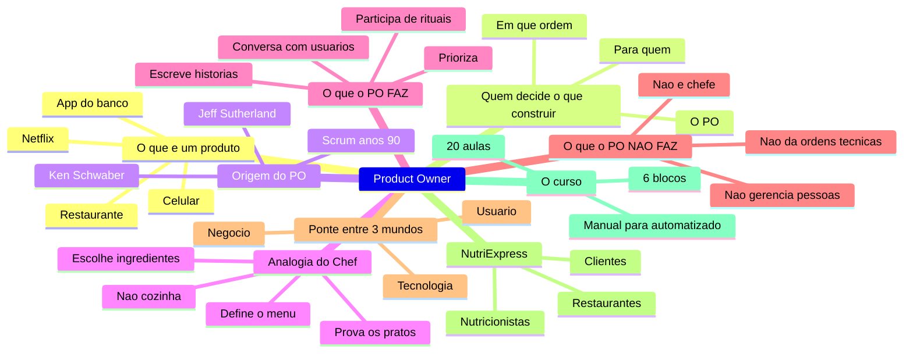
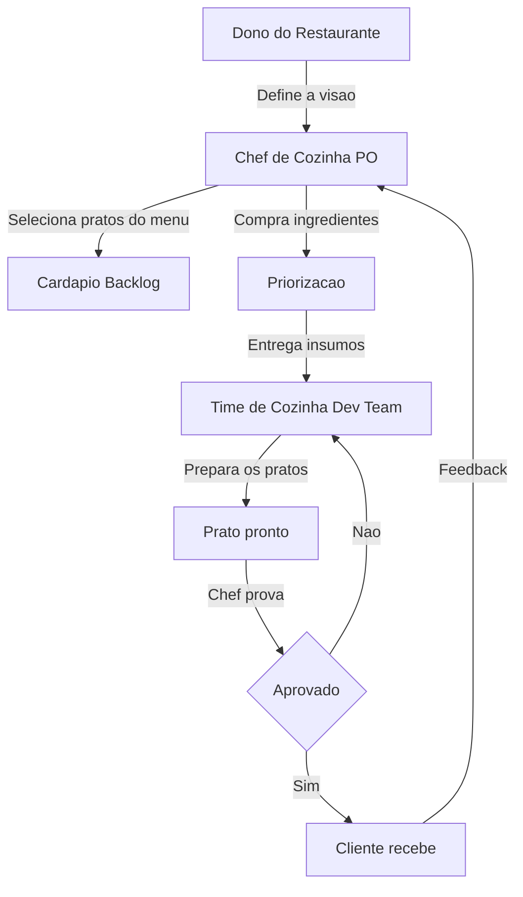
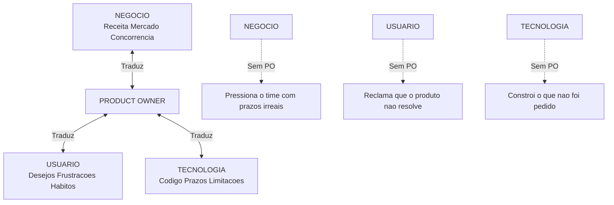
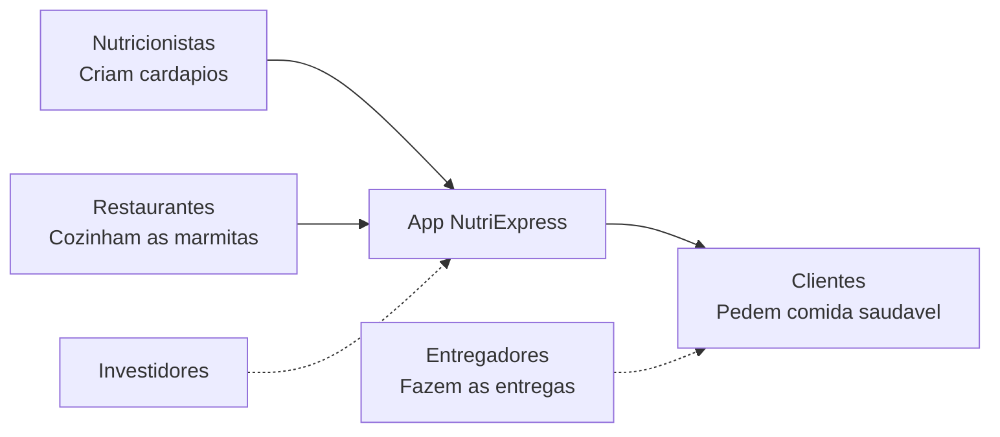
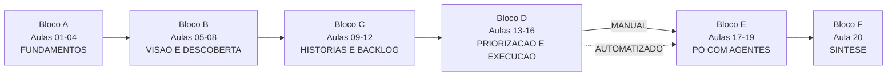

# Product Owner — Do Zero ao PO com Agentes — Aula 01

## Afinal, o que é um Product Owner?

**Duração estimada:** 45 minutos (30 de leitura + 15 de reflexão)
**Nível:** Iniciante
**Pré-requisitos:** Nenhum — esta é a primeira aula do curso

---

## Objetivos de Aprendizagem

Ao final desta aula, você será capaz de:

- [ ] **Definir** o que é um produto digital usando exemplos do cotidiano e descrever o problema ou necessidade que cada um resolve
- [ ] **Explicar** por que times de tecnologia precisam de uma pessoa dedicada a decidir o que será construído, para quem e em que ordem
- [ ] **Descrever** a origem do papel de Product Owner no framework Scrum (Ken Schwaber e Jeff Sutherland, anos 90) e a lacuna que ele veio preencher
- [ ] **Explicar** a analogia do PO como chef de cozinha e como ela traduz as responsabilidades do papel para um contexto familiar
- [ ] **Listar** as principais atividades diárias de um Product Owner e reconhecer com quais pessoas ele interage
- [ ] **Distinguir** o que um Product Owner faz do que NÃO é sua responsabilidade (gerenciar pessoas, dar ordens técnicas, definir arquitetura, chefiar o time)
- [ ] **Identificar** o PO como a ponte que conecta três mundos — negócio, usuário e tecnologia — e o que acontece quando essa ponte não existe
- [ ] **Descrever** o problema de negócio que o NutriExpress resolve, quem são seus principais stakeholders e por que cada um se importa com o produto
- [ ] **Reconhecer** a estrutura do curso em 6 blocos (20 aulas), a filosofia "primeiro manual, depois automatizado" e onde esta aula se encaixa na jornada

---

## Como Usar Esta Aula

Esta aula está organizada em duas partes. A **primeira parte** constrói os fundamentos conceituais sobre o papel do Product Owner — o que é um produto, de onde veio o PO, o que ele faz e não faz, e como ele conecta três mundos. A **segunda parte** aplica esses conceitos na prática com o NutriExpress, o produto que você vai construir ao longo do curso, e com o mapa da sua jornada de 20 aulas.

Ao longo do caminho, você encontrará seções **"Quick Check"** (para verificar se entendeu antes de avançar), exercícios de reflexão e perguntas para pensar. Ao final, o arquivo separado **Questões de Aprendizagem** traz as tarefas de checkpoint — só avance para a próxima aula quando conseguir completá-las por conta própria.

**Tempo estimado:** 30 minutos de leitura + 15 minutos de prática e reflexão.

## Mapa Mental

Este diagrama mostra todos os conceitos que você vai dominar nesta aula:

> *O mapa mental acima mostra a estrutura da aula. Cada ramo representa um conceito que você vai explorar. Repare como tudo converge para o Product Owner — o papel central que conecta pessoas, decisões e o produto.*
---

**FUNDAMENTOS: O Papel do Product Owner**

> *Os conceitos desta seção são universais — valem para qualquer Product Owner, em qualquer empresa, com qualquer produto. Não mencionamos ferramentas, marcas ou tecnologias específicas aqui. Na segunda parte, você vai aplicar esses conceitos ao NutriExpress, o produto que você construirá ao longo do curso.*
---

## 1. O que é um "produto" e quem decide o que construir?

Vamos começar do absoluto zero. Você não precisa saber nada sobre tecnologia, Scrum ou Product Owner para entender esta seção. Respire fundo — você já sabe tudo que precisa para começar.

### O que é um produto?

Pegue o celular no seu bolso. Agora pense na última série que você assistiu na Netflix. Depois, imagine o app do seu banco. E o café da manhã que você pediu no restaurante na semana passada. E a cadeira onde você está sentado agora.

O que todas essas coisas têm em comum?

**Cada uma delas resolve um problema ou atende uma necessidade de alguém.**

- O **celular** resolve o problema de se comunicar com pessoas que estão longe
- A **Netflix** atende a necessidade de entretenimento quando e onde você quiser
- O **app do banco** resolve o problema de ter que ir até a agência para fazer transações
- O **café da manhã no restaurante** atende a necessidade de comer algo gostoso sem precisar cozinhar
- A **cadeira** resolve o problema de onde sentar (e, se for boa, de onde sentar confortavelmente)

Esses são todos **produtos**. Um produto não precisa ser tecnológico. Não precisa ser digital. Não precisa ser caro. Um produto é simplesmente **qualquer coisa que resolve um problema de alguém**.

> *Pausa para refletir: pense em três coisas que você usou hoje. Um copo d'água, o chinelo, o transporte público. Todas são produtos. Todas resolvem um problema.*

### Produtos digitais — o caso da tecnologia

Quando falamos de produtos digitais (aplicativos, sites, sistemas), a mesma lógica se aplica. O Instagram resolve o problema de compartilhar momentos com amigos. O iFood resolve o problema de conseguir comida sem sair de casa. O Google resolve o problema de encontrar informações na internet.

A diferença é que produtos digitais são **complexos de construir**. Um time de tecnologia — programadores, designers, testadores — trabalha durante semanas ou meses para criar cada funcionalidade. E eles precisam saber **o que** construir.

### Quem decide o que construir?

Aqui está o ponto central desta aula.

Imagine que você é o dono de um app de entregas de comida (tipo iFood). Seu time de tecnologia tem 10 pessoas. E todo dia chegam pedidos:

- "Os clientes querem agendar pedidos para amanhã"
- "Os restaurantes querem um painel para ver os pedidos em tempo real"
- "Os entregadores querem um mapa com a rota otimizada"
- "O financeiro quer um relatório de vendas por região"
- "Os clientes querem pagar com Pix"
- "Os restaurantes querem fotos dos pratos no cardápio"

São dezenas de ideias. Centenas de sugestões. E o time de tecnologia consegue construir, em média, **umas 5 funcionalidades por mês**.

Alguém precisa decidir: **O QUE** construir primeiro? **PARA QUEM** cada funcionalidade serve? **EM QUE ORDEM** as coisas devem sair?

Esse alguém é o **Product Owner**.

### Por que não construir tudo?

Você pode estar pensando: "por que não construir tudo que pedem?"

Boa pergunta. Imagine que seu time tenta fazer tudo ao mesmo tempo. Cada programador constrói uma funcionalidade diferente. O resultado? O app vira uma **colcha de retalhos** — o pagamento funciona, mas o mapa do entregador quebra; o agendamento sai, mas o relatório financeiro fica incompleto.

Além disso, o tempo é finito. Se o time gasta 3 meses construindo um chat interno que ninguém pediu, deixaram de construir 3 funcionalidades que os clientes realmente querem.

O **Product Owner existe para fazer escolhas**. E escolher significa, muitas vezes, dizer NÃO para ideias boas. Não porque a ideia é ruim, mas porque existe uma ideia MELHOR ou MAIS URGENTE para fazer primeiro.

### Quick Check 1

**1. O que faz algo ser considerado um "produto"?**
**Resposta:** Um produto é qualquer coisa que resolve um problema ou atende uma necessidade de alguém — desde um celular até um café da manhã. Não precisa ser tecnológico nem digital.

**2. Por que um time de tecnologia não pode simplesmente construir "tudo que pedem"?**
**Resposta:** Porque os pedidos são infinitos, contraditórios e o tempo do time é finito. Se tentam construir tudo ao mesmo tempo, o produto vira uma colcha de retalhos. Alguém precisa decidir o que construir primeiro — esse alguém é o Product Owner.

## 2. A origem do PO e a analogia do chef de cozinha

Agora que você sabe o que é um produto e por que alguém precisa decidir o que construir, vamos entender de onde veio esse papel.

### Uma breve história

No final dos anos 90, dois senhores chamados **Ken Schwaber** e **Jeff Sutherland** estavam frustrados. Eles perceberam que os métodos tradicionais de gerenciamento de projetos (aqueles cheios de planilhas, relatórios e reuniões intermináveis) não funcionavam bem para produtos de tecnologia.

Eles criaram um método diferente, chamado **Scrum** (você vai aprender todos os detalhes na Aula 02). Scrum é um conjunto de regras e rituais que ajuda times a construir produtos complexos de forma organizada.

Antes do Scrum, não existia um papel formal de "alguém que decide o que o produto deve fazer". Cada time resolvia isso de um jeito — geralmente o chefe decidia, ou o cliente mandava, ou o programador mais experiente escolhia. E quase sempre dava errado.

O Scrum criou um papel específico para preencher esse vazio: o **Product Owner**. A função do PO é ser a **voz do cliente dentro do time**. É ele quem diz: "isso aqui é o que o cliente precisa, e esta é a ordem certa de construir."

### A analogia do restaurante 🍽️

A melhor forma de entender o papel do PO é comparar com algo que todo mundo conhece: um **restaurante**.

Imagine um restaurante italiano sofisticado. Vários personagens fazem parte dessa história:

- O **dono do restaurante** decide a visão: "vamos ser o melhor restaurante italiano da cidade" (no produto, isso é a **visão do produto**)

- O **chef de cozinha** (o PO) decide quais pratos entram no cardápio de hoje com base no que os clientes querem comer e nos ingredientes disponíveis (no Scrum, isso é o **Product Backlog**)

- O **chef escolhe quais ingredientes comprar primeiro** — decide prioridades, porque não compra tudo de uma vez (no Scrum, isso é **priorização do backlog**)

- O **time de cozinha** (os cozinheiros) prepara os pratos — eles que cortam, cozinham, temperam e empratam. O chef NÃO cozinha, mas garante que cada prato saia exatamente como o cliente pediu (no Scrum, isso é o **Time de Desenvolvimento**)

- O **chef prova cada prato** antes de servir. Se não está bom, volta para a cozinha (no Scrum, isso é a **Sprint Review**)

- O **cliente come e dá feedback**. Se o cliente diz "estava salgado", o chef ajusta o prato no próximo pedido (no Scrum, isso é **feedback loop**)

### Traduzindo a analogia

| Personagem do restaurante | No mundo do produto |
|---|---|
| Dono do restaurante | Stakeholders (investidores, diretores, mercado) |
| Chef de cozinha | **Product Owner** |
| Time de cozinha | Time de Desenvolvimento (programadores, designers, testadores) |
| Cardápio | Product Backlog (lista de tudo que o produto pode ter) |
| Cliente do restaurante | Usuário do produto |
| Prato servido | Funcionalidade entregue |

> *⚠️ Importante: essa é uma METÁFORA, não uma tradução exata. No mundo real, o PO não "prova código" como o chef prova comida — ele verifica se a funcionalidade atende ao que foi pedido. A analogia existe para ajudar você a VISUALIZAR o papel, não para descrever cada detalhe técnico.*

Se você entendeu a analogia do restaurante, você já entendeu 80% do que é ser um Product Owner.

### Quick Check 2

**1. Na analogia do restaurante, quem representa o Product Owner e o Time de Desenvolvimento?**
**Resposta:** O chef de cozinha representa o Product Owner (decide o cardápio, os ingredientes e prova os pratos). O time de cozinha representa o Time de Desenvolvimento (prepara os pratos — executa o trabalho).

**2. O que o cardápio representa na analogia?**
**Resposta:** O cardápio representa o Product Backlog — a lista de tudo que o produto poderia ter. O chef (PO) decide quais itens do cardápio entram hoje e quais ingredientes comprar primeiro.

## 3. O que um PO faz (e NÃO faz) no dia a dia

Agora que você já tem uma ideia do que é um Product Owner, vamos entrar nos detalhes do dia a dia. E tão importante quanto saber o que o PO FAZ é saber o que ele NÃO FAZ — porque muita gente confunde o papel.

### O que um PO faz

O dia a dia do Product Owner é uma combinação de conversas, decisões e comunicação. Veja as principais atividades:

1. **Conversa com usuários** para entender o que eles realmente precisam — não o que eles dizem que querem, mas os problemas reais que enfrentam
2. **Escreve e refina user stories** — user stories são descrições curtas e simples do que o produto deve fazer, escritas do ponto de vista do usuário. Exemplo: "Como cliente, quero pagar com Pix para não precisar digitar dados do cartão toda vez"
3. **Prioriza o backlog** — backlog é a lista de tudo que o produto poderia ter. O PO decide quais itens do backlog entram primeiro (o que é mais urgente, mais importante, mais estratégico)
4. **Participa de cerimônias do time** — no Scrum, existem reuniões chamadas "cerimônias". As principais são:
   - **Planejamento (Sprint Planning)**: o time decide o que vai construir nas próximas semanas
   - **Revisão (Sprint Review)**: o time mostra o que ficou pronto e o PO verifica se está de acordo
5. **Toma decisões difíceis** sobre o que ENTRA e o que FICA DE FORA do produto
6. **Comunica o plano e o progresso** para os **stakeholders** — stakeholders são todas as pessoas que têm interesse no produto: investidores, diretores, clientes importantes, parceiros

### O que um PO NÃO faz

Aqui vai a parte que muitos profissionais confundem:

| ❌ **NÃO faz** | ✅ **Faz** |
|---|---|
| NÃO gerencia pessoas — não faz avaliação de desempenho, não contrata, não demite | Gerencia o backlog (a lista do produto) |
| NÃO dá ordens técnicas — o PO diz O QUE precisa ser feito; o time decide COMO fazer | Diz qual funcionalidade construir |
| NÃO define arquitetura — a estrutura técnica do sistema é responsabilidade do time | Define o que o produto deve fazer para resolver o problema do usuário |
| NÃO é o chefe do time — o PO e o time de desenvolvimento são **pares**, cada um com sua responsabilidade | É o "dono" do backlog, não das pessoas |

### Por que essa distinção importa?

Muita gente confunde PO com **gerente de projetos** ou **chefe dos programadores**. Essa confusão gera atritos, decisões erradas e produtos ruins.

Pense no chef de cozinha de novo. O chef não dá ordens para cada cozinheiro sobre como cortar a cebola (isso é técnico — cada cozinheiro tem seu jeito). O chef diz: "precisamos de um risoto de limão para hoje" (o QUE fazer). Os cozinheiros decidem como preparar (COMO fazer).

O Product Owner manda no **QUE**, não no **COMO**, e não nas **PESSOAS**.

Se você está acostumado com hierarquias tradicionais de empresa, essa ideia pode parecer estranha. Mas o Scrum funciona assim: o PO tem autoridade sobre as decisões do produto, não sobre as pessoas. É uma diferença fundamental.

### Quick Check 3

**1. Dado o cenário: "O PO disse para o programador usar a linguagem Python em vez de JavaScript." Isso é papel do PO?**
**Resposta:** Não. Decidir a linguagem de programação é uma decisão técnica (COMO fazer). O PO decide O QUE construir, não detalhes técnicos de implementação.

**2. Dado o cenário: "O PO passou o dia entrevistando clientes para entender por que ninguém usa a funcionalidade de agendamento." Isso é papel do PO?**
**Resposta:** Sim. Entender as necessidades e frustrações dos usuários para tomar melhores decisões sobre o produto é uma das principais atividades do PO.

## 4. O PO como ponte entre três mundos

Se você pudesse resumir o papel do Product Owner em uma imagem, seria esta: **o PO é a ponte entre três mundos que falam línguas diferentes**.

### Mundo 1: Negócio 🏢

O mundo do negócio fala a língua de **receita, mercado, concorrência e retorno sobre investimento**. Quem está aqui quer saber:

- "O produto está dando lucro?"
- "Estamos ganhando mercado?"
- "O concorrente lançou uma funcionalidade nova — precisamos responder"

O PO precisa entender essa língua. Porque se o produto não gera valor para o negócio, ele simplesmente não sobrevive.

### Mundo 2: Usuário 👤

O mundo do usuário fala a língua de **desejos, frustrações, hábitos e necessidades não ditas**. Quem está aqui quer saber:

- "Por que esse app é tão complicado?"
- "Eu só quero pedir comida sem ter que criar uma conta"
- "Toda vez que vou pagar, o app trava"

O PO precisa entender essa língua também. Porque se o produto não resolve o problema do usuário de forma simples, ninguém usa.

### Mundo 3: Tecnologia 💻

O mundo da tecnologia fala a língua de **código, servidores, prazos e limitações técnicas**. Quem está aqui quer saber:

- "Isso é viável tecnicamente?"
- "Essa funcionalidade vai exigir 3 meses de trabalho"
- "O sistema atual não suporta esse volume de dados"

O PO precisa entender essa língua o suficiente para saber o que é possível — sem precisar programar.

### O que o PO faz como ponte

O Product Owner não apenas conhece os três mundos — ele **traduz entre eles**. Veja um exemplo concreto:

**Cenário:** O diretor financeiro (mundo do negócio) chega e diz: "Precisamos aumentar a receita em 30% neste trimestre."

- O PO **traduz para o mundo do usuário**: "Vou descobrir por que os clientes estão abandonando o produto"
- O PO descobre que **70% dos clientes desistem na tela de pagamento** (mundo do usuário)
- O PO **traduz para o mundo da tecnologia**: "Vamos simplificar o fluxo de checkout para reduzir o abandono"
- O time de tecnologia estima: "2 semanas de trabalho" (mundo da tecnologia)
- O PO **traduz de volta para o negócio**: "Podemos aumentar a receita simplificando o pagamento — fica pronto em 2 semanas"

O PO foi a ponte. Sem ele, cada área falaria sozinha sem se entender.

### O que acontece SEM o PO

Quando não existe um Product Owner — ou quando o papel não é exercido — os três mundos colapsam:

- **Negócio pressiona** o time de tecnologia com prazos irreais, sem entender a complexidade
- **Tecnologia constrói** funcionalidades que ninguém pediu — porque um programador achou "legal" ou "tecnicamente interessante"
- **Usuário reclama** que o produto não resolve o problema dele — porque ninguém perguntou o que ele precisava

Cada área culpa a outra. O produto não avança. E ninguém se entende.

É por isso que o PO é um papel TÃO importante. Sem ele, o barco não tem leme.

### Quick Check 4

**1. O diretor de produto diz: "Precisamos cortar custos." O time de tecnologia diz: "O sistema está lento porque o banco de dados está mal configurado." Como o PO atua nesse cenário?**
**Resposta:** O PO traduz: investiga com os usuários qual o real impacto da lentidão, depois negocia com tecnologia uma solução (pode ser uma melhoria parcial em vez de uma reestruturação completa) e apresenta ao negócio o custo-benefício. Ele não apenas repassa a demanda — ele TRADUZ entre os mundos.

**2. O que acontece com um produto quando não há um PO atuando como ponte?**
**Resposta:** Cada área age isoladamente: o negócio pressiona com prazos irreais, a tecnologia constrói o que acha interessante (não o que o usuário precisa) e o usuário fica insatisfeito porque o produto não resolve seus problemas. O resultado é um produto que ninguém quer e um time frustrado.

---

**APLICAÇÃO: O NutriExpress e Sua Jornada no Curso**

> *Agora que você entende o que é um Product Owner, o que ele faz e por que ele é essencial, vamos conhecer o produto que VOCÊ vai construir ao longo deste curso. E também o mapa da jornada que você vai percorrer nas próximas 19 aulas.*
---

## 5. Apresentação do NutriExpress — Seu Primeiro Produto 🥗

A melhor forma de aprender a ser Product Owner é... sendo Product Owner. E é exatamente isso que você vai fazer neste curso.

Apresentamos o **NutriExpress**: um aplicativo de delivery de marmitas saudáveis. E você será o Product Owner deste produto do começo ao fim do curso.

### O problema

Milhares de pessoas querem comer saudável. Mas:

- Não têm tempo para cozinhar toda refeição
- Não têm habilidade culinária para preparar pratos balanceados
- Comprar marmita "saudável" em qualquer lugar é uma roleta — você nunca sabe se é realmente balanceada ou se é só marketing

Esse é um problema real. Se você já tentou "comer saudável" pedindo delivery, sabe do que estamos falando.

### A solução — três peças conectadas

O NutriExpress resolve esse problema conectando três grupos de pessoas:

1. **Nutricionistas parceiros** montam cardápios balanceados (café da manhã, almoço, jantar, lanches). Cada refeição tem a validação de um profissional de saúde
2. **Restaurantes parceiros** cozinham seguindo exatamente os cardápios dos nutricionistas. A qualidade é padronizada — não importa qual restaurante, a marmita segue a mesma receita aprovada
3. **Clientes** abrem o app, escolhem seu plano de refeições (emagrecimento, ganho de massa, low carb, dieta flexível) e recebem as marmitas em casa

### Os stakeholders do NutriExpress

Stakeholders são todas as pessoas que têm interesse no produto. No NutriExpress, eles são vários:

| Stakeholder | O que quer | Por que se importa com o produto |
|---|---|---|
| **Cliente final** | Comida gostosa, saudável, entrega rápida, preço justo | Quer resolver o problema de comer bem sem cozinhar |
| **Nutricionistas** | Alcançar mais pacientes, ter cardápios valorizados | Querem ampliar seu impacto e sua renda |
| **Restaurantes** | Mais pedidos, logística simples, margem de lucro | Querem um novo canal de vendas |
| **Entregadores** | Rotas otimizadas, ganho justo por entrega | Querem trabalhar com eficiência |
| **Investidores** | Crescimento, métricas, retorno financeiro | Querem que o negócio dê lucro |
| **Time de desenvolvimento** | Requisitos claros, prioridades estáveis | Querem construir algo que faça sentido |

### Por que o NutriExpress?

Este produto foi escolhido por três razões:

1. **Qualquer pessoa entende o problema** — comer bem sem cozinhar é uma necessidade universal
2. **Tem stakeholders diversos e reais** — você vai praticar negociação, priorização e comunicação com todos eles
3. **Permite praticar TODOS os conceitos do curso** — visão, personas, histórias, backlog, priorização, métricas. Cada aula adiciona uma peça

> *Você pode estar pensando: "mas eu não vou PROGRAMAR esse app, certo?" Certíssimo. Você não precisa programar nada. Seu papel como PO é decidir o que o app deve fazer, para quem e em que ordem. Quem programa é o time de desenvolvimento (que existe no nosso cenário).*

### Mão na Massa — Imagine-se como PO do NutriExpress

Antes de continuar, pare alguns minutos para refletir:

1. Se você fosse o PO do NutriExpress, **qual seria a PRIMEIRA funcionalidade que você construiria?** Por quê?
2. **Qual stakeholder você conversaria primeiro** para entender as necessidades? O que você perguntaria?
3. **O que poderia dar errado** se não houvesse um PO neste produto?

Não precisa escrever uma redação — apenas pense. Mas pense de verdade, como se o dinheiro para construir o produto fosse seu. Essa reflexão é o primeiro passo para pensar como um Product Owner.

### Quick Check 5

**1. Quais são os três grupos principais que o NutriExpress conecta?**
**Resposta:** Nutricionistas (criam os cardápios balanceados), restaurantes (cozinham as marmitas seguindo os cardápios) e clientes (pedem as refeições pelo app).

**2. Por que um entregador (motoboy) se importa com o NutriExpress?**
**Resposta:** Porque ele é um stakeholder — quer rotas otimizadas e ganho justo por entrega. O produto impacta diretamente o trabalho dele.

## 6. Como Este Curso Está Organizado — Sua Jornada em 20 Aulas

Você sabe o que é um PO, sabe o que ele faz, conhece o produto que vai construir. Agora falta uma peça: **como você vai aprender tudo isso?**

### A filosofia do curso: primeiro manual, depois automatizado

Este curso tem uma filosofia clara: você vai aprender PRIMEIRO os fundamentos MANUAIS de ser Product Owner — fazendo exercícios no papel, em reflexões, com planilhas e quadros visuais. Só DEPOIS, nos últimos blocos do curso, você vai descobrir como **agentes de inteligência artificial** podem turbinar e automatizar seu trabalho.

Por quê? Porque você precisa ENTENDER o fundamento antes de delegar para uma máquina. Um PO que só sabe apertar botões não é um bom PO. Um PO que entende o conceito e usa ferramentas para escalar é imbatível.

### Os 6 blocos do curso

| Bloco | Aulas | O que você vai aprender |
|---|---|---|
| **A — Fundamentos** | 01 a 04 | O papel do PO, Scrum, responsabilidades, diferenças entre papéis |
| **B — Visão e Descoberta** | 05 a 08 | Visão do produto, personas, Jobs to be Done, pesquisa com usuários |
| **C — Histórias e Backlog** | 09 a 12 | User stories, critérios de qualidade (INVEST), backlog estruturado |
| **D — Priorização e Execução** | 13 a 16 | Técnicas MoSCoW, WSJF, Kano, story points, sprints |
| **E — PO com Agentes** | 17 a 19 | Agentes de IA para automatizar escrita, priorização e planejamento |
| **F — Síntese** | 20 | Portfólio profissional, certificações, carreira |

### O que você vai construir

Cada bloco (e várias aulas) entrega uma **peça do backlog do NutriExpress**. Ao final do curso, você terá um backlog completo, profissional, do zero — pronto para mostrar em uma entrevista de emprego.

Você não vai apenas estudar teoria. Você vai **construir** o produto com suas próprias decisões.

### O que esperar de cada aula

Toda aula segue o mesmo padrão:

- **Primeira metade**: conceitos fundamentais (o que é, por que importa, exemplos)
- **Segunda metade**: aplicação prática no NutriExpress
- **Ao final**: questões de aprendizagem para verificar se você realmente entendeu

Esta aula que você está lendo agora é a primeira do Bloco A. Você acabou de dar o primeiro passo de 20. Parabéns! 🎉

> *Até aqui, você já entendeu o que é um produto, o que é um PO, de onde ele veio, o que ele faz e não faz, e como ele conecta três mundos. Isso já é MUITO. Respire. Se algo não ficou claro, releia a seção anterior — não tem problema nenhum voltar. Programação (e Product Ownership) se aprende por camadas, não de uma vez.*

### Quick Check 6

**1. Por que o curso ensina primeiro os fundamentos manuais antes de mostrar ferramentas automatizadas?**
**Resposta:** Para que o aluno ENTENDA o conceito antes de delegar para uma máquina. Um PO que entende o fundamento e usa ferramentas para escalar é mais completo do que um que só sabe apertar botões.

**2. Em qual bloco do curso você está agora?**
**Resposta:** Bloco A — Fundamentos (Aulas 01 a 04). Esta é a Aula 01.

---

## Autoavaliação: Quiz Rápido

Teste seu conhecimento com estas 5 perguntas. Tente responder antes de consultar o gabarito.

**1. Qual das alternativas abaixo melhor define um "produto"?**
a) Algo que custa caro e é vendido em lojas
b) Qualquer coisa que resolve um problema ou atende uma necessidade de alguém
c) Um aplicativo ou software
d) Algo que só existe no mundo digital
**Resposta:** Alternativa B. Um produto pode ser qualquer coisa — digital ou física — que resolve um problema ou atende uma necessidade. Celular, Netflix, cadeira e café da manhã são todos produtos.

**2. Na analogia do restaurante, o Product Owner corresponde a qual personagem?**
a) Dono do restaurante
b) Cliente
c) Chef de cozinha
d) Garçom
**Resposta:** Alternativa C. O chef de cozinha representa o PO: decide o cardápio, escolhe os ingredientes e prova os pratos, mas NÃO cozinha.

**3. Qual das atividades abaixo NÃO é papel de um Product Owner?**
a) Conversar com usuários para entender necessidades
b) Decidir a ordem do que será construído
c) Definir qual linguagem de programação o time deve usar
d) Comunicar o plano para os stakeholders
**Resposta:** Alternativa C. Definir a linguagem de programação é uma decisão técnica (COMO fazer), de responsabilidade do time de desenvolvimento. O PO decide O QUE construir.

**4. O que acontece quando não há um Product Owner atuando como ponte entre os três mundos?**
a) O time de tecnologia constrói exatamente o que o usuário precisa
b) O negócio, a tecnologia e o usuário entram em conflito — cada área culpa a outra
c) O produto se constrói sozinho
d) Os stakeholders desaparecem
**Resposta:** Alternativa B. Sem o PO como ponte, o negócio pressiona o time, a tecnologia constrói o que ninguém pediu e o usuário fica insatisfeito.

**5. Quais são os três grupos principais conectados pelo NutriExpress?**
a) Clientes, investidores e entregadores
b) Programadores, designers e testadores
c) Nutricionistas, restaurantes e clientes
d) Restaurantes, entregadores e investidores
**Resposta:** Alternativa C. O NutriExpress conecta nutricionistas (criam cardápios), restaurantes (cozinham) e clientes (pedem). Entregadores e investidores também são stakeholders importantes, mas o núcleo do produto são os três grupos principais.

---

## Mão na Massa 1: Exercícios Graduados

**Exercício 1 (Fácil) — Identificando o Product Owner**

Pense em um produto que você usa todos os dias: WhatsApp, Instagram, Netflix, Uber, ou o app do seu banco.

Responda:

a) Quem você imagina que seja o Product Owner desse produto? (não precisa saber o nome da pessoa — apenas descreva o perfil)
b) Que tipo de decisão essa pessoa toma no dia a dia?
c) Com quais stakeholders ela precisa conversar?

**Gabarito:**

Não existe uma resposta única, mas sua resposta deve conter:

a) O perfil de um PO de um app como o WhatsApp seria alguém que entende tanto de negócio quanto de comportamento do usuário. Toma decisões como: "qual funcionalidade de privacidade implementar primeiro" ou "como simplificar a tela de configurações"

b) Decisões do PO: o que construir, para quem, em que ordem. Exemplo: "vamos priorizar a criptografia de ponta a ponta antes de adicionar novos stickers"

c) Stakeholders de um app como o WhatsApp: usuários (bilhões deles), diretores da empresa (Meta/WhatsApp), times de engenharia, times de design, governo e reguladores (privacidade de dados)

**Exercício 2 (Médio) — Classificando Atividades**

Abaixo estão 8 atividades do cotidiano de um time de produto. Classifique cada uma como:

- **PO** — papel do Product Owner
- **TIME** — papel do Time de Desenvolvimento
- **OUTRO** — papel de outra pessoa (stakeholder, gerente, etc.)

a) Entrevistar clientes para entender por que eles cancelaram o plano
b) Decidir que o app será construído em React Native
c) Definir a arquitetura do banco de dados
d) Dizer "não, essa funcionalidade não entra nesta sprint" depois de analisar o impacto
e) Corrigir um bug no sistema de pagamento
f) Aprovar o orçamento do próximo trimestre
g) Escrever uma descrição de 3 linhas sobre como o usuário deve conseguir agendar uma entrega
h) Organizar a reunião diária do time

**Gabarito:**

a) **PO** — entender o motivo do cancelamento ajuda o PO a decidir o que melhorar no produto
b) **TIME** — decisão técnica de tecnologia/plataforma
c) **TIME** — arquitetura é responsabilidade técnica do time de desenvolvimento
d) **PO** — a decisão final sobre o que entra ou não na sprint é do PO
e) **TIME** — corrigir bugs é trabalho do time de desenvolvimento
f) **OUTRO** — aprovar orçamento é papel de diretores/investidores (stakeholders)
g) **PO** — escrever descrições de funcionalidades (user stories) é papel do PO
h) **OUTRO** — organizar reuniões diárias geralmente é papel do Scrum Master (outro papel do Scrum que você conhecerá em breve)

**Desafio (Difícil) — O PO Invisível**

Leia o cenário abaixo e responda:

*Uma startup de tecnologia passou 3 meses construindo um chat interno para o seu aplicativo de banco digital. O time de tecnologia achou que seria "legal" ter um chat para os clientes conversarem com o suporte. Quando a funcionalidade ficou pronta, ninguém usou. Os clientes continuavam ligando para o telefone de suporte. O chat interno consumiu 3 meses de trabalho, milhares de reais e atrasou todas as outras entregas.*

Perguntas:

a) O que deu errado neste cenário?
b) Qual decisão faltou ser tomada (e por quem)?
c) Como um Product Owner teria evitado esse problema?

**Gabarito:**

a) O time de tecnologia construiu algo baseado no que ACHOU que era legal, sem validar com usuários se era realmente necessário. Três meses de trabalho desperdiçados.

b) Faltou a decisão de "isso é realmente prioritário?" e "os usuários pediram isso?". Essa decisão deveria ter sido tomada pelo Product Owner, que é a pessoa responsável por decidir o que entra e o que fica de fora.

c) Um PO teria seguido este processo:
   - Perguntado aos clientes: "vocês usariam um chat? O que vocês usam hoje para falar com o suporte?"
   - Descoberto que os clientes preferem telefone (ou WhatsApp, ou e-mail)
   - Priorizado o chat apenas se houvesse dados concretos de que os clientes realmente queriam
   - Dito NÃO ao time de tecnologia, explicando que existem funcionalidades mais importantes
   - Se o chat fosse importante, negociado uma versão mínima (2 semanas, não 3 meses) para testar antes

---

## Resumo da Aula

### Os Conceitos Fundamentais

1. **Produto**: qualquer coisa que resolve um problema de alguém — do celular ao café da manhã
2. **Product Owner**: a pessoa que decide O QUE construir, PARA QUEM e EM QUE ORDEM
3. **Origem**: o papel foi criado no Scrum (Ken Schwaber e Jeff Sutherland, anos 90) para preencher a lacuna de "quem decide o que o produto faz"
4. **Analogia do chef**: o PO é como um chef de cozinha — decide o cardápio, os ingredientes e prova os pratos, mas NÃO cozinha
5. **O que PO FAZ**: conversa com usuários, escreve histórias, prioriza, participa de rituais, decide o que entra e sai, comunica
6. **O que PO NÃO FAZ**: não gerencia pessoas, não dá ordens técnicas, não define arquitetura, não é chefe
7. **PO como ponte**: conecta os mundos do negócio, do usuário e da tecnologia — traduzindo entre eles
8. **NutriExpress**: app de delivery de marmitas saudáveis criado por nutricionistas, cozinhado por restaurantes e pedido por clientes
9. **O curso**: 20 aulas em 6 blocos, do manual ao automatizado, construindo o backlog do NutriExpress

### O Que Você Construiu Hoje

- [x] Modelo mental do que é um produto e quem decide o que construir
- [x] Compreensão da origem do Product Owner e sua analogia com o chef de cozinha
- [x] Distinção clara entre o que o PO faz e não faz
- [x] Entendimento do PO como ponte entre três mundos
- [x] Conhecimento do NutriExpress, seus stakeholders e seu problema de negócio
- [x] Visão geral da jornada de 20 aulas do curso

---

## Próxima Aula

**Aula 02: Scrum em 15 Minutos**

Você aprendeu o que é um Product Owner. Mas o PO não trabalha sozinho — ele trabalha dentro do **Scrum**, um framework de trabalho em equipe. Na próxima aula, você vai entender o Scrum de forma simples e direta: os papéis, os eventos, os artefatos. E, claro, tudo aplicado ao NutriExpress.

Prepare-se para descobrir como o chef de cozinha (PO) se organiza com o time de cozinha (desenvolvimento) para entregar pratos incríveis a cada sprint. 🍽️

---

## Referências

### Documentação Oficial

- **Scrum Guide 2020** — o guia oficial do Scrum, criado por Ken Schwaber e Jeff Sutherland. Leia a seção sobre o papel do Product Owner. Disponível em: [https://scrumguides.org](https://scrumguides.org)

### Cursos Recomendados

- **Scrum.org — Product Owner Learning Path** — trilha completa de aprendizado para POs, com artigos, vídeos e avaliações. Disponível em: [https://www.scrum.org/pathway/product-owner-learning-path](https://www.scrum.org/pathway/product-owner-learning-path)

### Leitura Complementar

- **INSPIRED: How to Create Tech Products Customers Love**, de Marty Cagan — o livro mais recomendado para Product Owners e Product Managers. O capítulo 2 ("The Role of the Product Manager/Product Owner") expande muitos conceitos que você viu aqui.

### Artigos para Aprofundamento

- **"What is a Product Owner?"** — Scrum.org: [https://www.scrum.org/resources/what-is-a-product-owner](https://www.scrum.org/resources/what-is-a-product-owner)

---

## FAQ

**P: Product Owner é a mesma coisa que Gerente de Projetos?**
R: Não. O Gerente de Projetos foca em prazos, recursos e cronograma. O PO foca no VALOR do produto — o que construir para gerar mais resultado. O PO não gerencia pessoas nem orçamento; ele gerencia o backlog (a lista do produto).

**P: O PO precisa saber programar?**
R: Não. O PO precisa entender o suficiente de tecnologia para saber o que é viável, mas não precisa escrever código. A decisão técnica (COMO fazer) é do time de desenvolvimento.

**P: O PO é o chefe do time?**
R: Não. O PO tem autoridade sobre as decisões do produto (o QUE fazer), mas não sobre as pessoas. O time de desenvolvimento e o PO são pares, cada um com sua responsabilidade.

**P: Um produto pode ter mais de um PO?**
R: Em geral, não. O Scrum recomenda UM Product Owner por produto para evitar conflitos de prioridade. Em produtos muito grandes, pode haver um PO principal e alguns PO de área — mas sempre com uma única pessoa tendo a palavra final.

**P: O PO trabalha em tempo integral no produto?**
R: Idealmente, sim. O PO precisa estar disponível para o time, para os stakeholders e para os usuários. Um PO que divide seu tempo entre vários produtos raramente consegue fazer bem o trabalho.

**P: Product Owner e Product Manager são a mesma coisa?**
R: Depende da empresa. Em muitas organizações, os termos são usados como sinônimos. Em outras, o Product Manager tem um foco mais estratégico (mercado, visão de longo prazo) e o PO um foco mais tático (backlog, execução com o time). Neste curso, usamos Product Owner como o papel definido pelo Scrum.

**P: O que acontece se o PO tomar uma decisão errada?**
R: O time descobre rápido. No Scrum, as sprints são curtas (1 a 4 semanas). Se a decisão foi errada, o feedback aparece na Review e o PO ajusta o rumo na sprint seguinte. Errar faz parte — o importante é corrigir rápido.

**P: Preciso de certificação para ser PO?**
R: Não. Certificações (como PSPO da Scrum.org) ajudam no currículo, mas não substituem experiência prática. Muitos POs começam sem certificação e tiram depois que já atuam na área.

**P: O PO lida com clientes insatisfeitos?**
R: Sim, indiretamente. O PO conversa com usuários para entender frustrações, mas não é necessariamente a pessoa que atende reclamações (isso é papel do suporte). O PO usa o feedback dos clientes para melhorar o produto.

**P: Quanto ganha um Product Owner?**
R: Varia muito conforme o país, a empresa e a experiência. No Brasil, um PO júnior ganha entre R\$ 5.000 e R\$ 8.000; um pleno entre R\$ 8.000 e R\$ 15.000; um sênior entre R\$ 15.000 e R\$ 25.000+ (valores de 2024/2025). Em empresas internacionais, os valores são significativamente maiores.

---

## Glossário

| Termo | Definição |
|---|---|
| **Backlog** | Lista de tudo que o produto poderia ter — funcionalidades, melhorias, correções. O PO decide a ordem dos itens. (Ver Seção 3) |
| **Cerimônias** | Reuniões do Scrum: Planejamento, Revisão, Retrospectiva e Daily. O PO participa de algumas delas. (Ver Seção 3) |
| **Product Backlog** | O mesmo que backlog. É o "cardápio" do produto. (Ver Seção 2) |
| **Product Owner** | Pessoa responsável por decidir o que o produto deve fazer, para quem e em que ordem. A "voz do cliente dentro do time". |
| **Scrum** | Framework de trabalho em equipe para construir produtos complexos. Criado por Ken Schwaber e Jeff Sutherland nos anos 90. (Ver Seção 2) |
| **Sprint** | Ciclo de trabalho com duração fixa (geralmente 1 a 4 semanas). Ao final de cada sprint, o time entrega uma versão funcional do produto. (Ver Seção 3) |
| **Sprint Planning** | Reunião onde o time decide o que vai construir na próxima sprint. (Ver Seção 3) |
| **Sprint Review** | Reunião onde o time mostra o que ficou pronto e o PO verifica se está de acordo. (Ver Seção 2) |
| **Stakeholder** | Qualquer pessoa que tem interesse no produto: investidores, diretores, clientes, parceiros, usuários. (Ver Seção 3) |
| **Time de Desenvolvimento** | Profissionais que constroem o produto: programadores, designers, testadores. Eles decidem COMO fazer; o PO decide O QUE fazer. (Ver Seção 2) |
| **User Story** | Descrição curta e simples de uma funcionalidade do ponto de vista do usuário. Exemplo: "Como cliente, quero pagar com Pix para não digitar dados do cartão." (Ver Seção 3) |
| **Visão do Produto** | A "estrela guia" do produto — uma frase que descreve o que o produto será e para quem ele existe. Exemplo: "ser o melhor restaurante italiano da cidade." (Ver Seção 2) |
