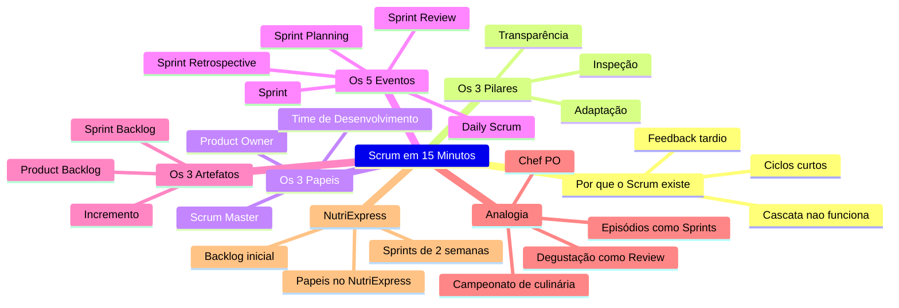
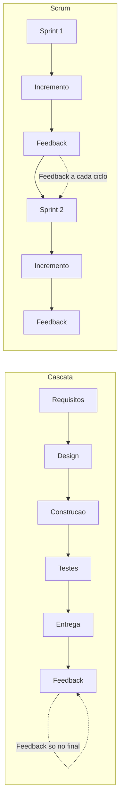
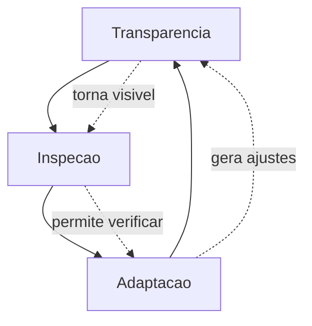
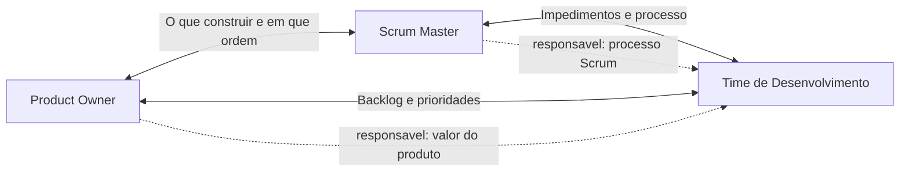
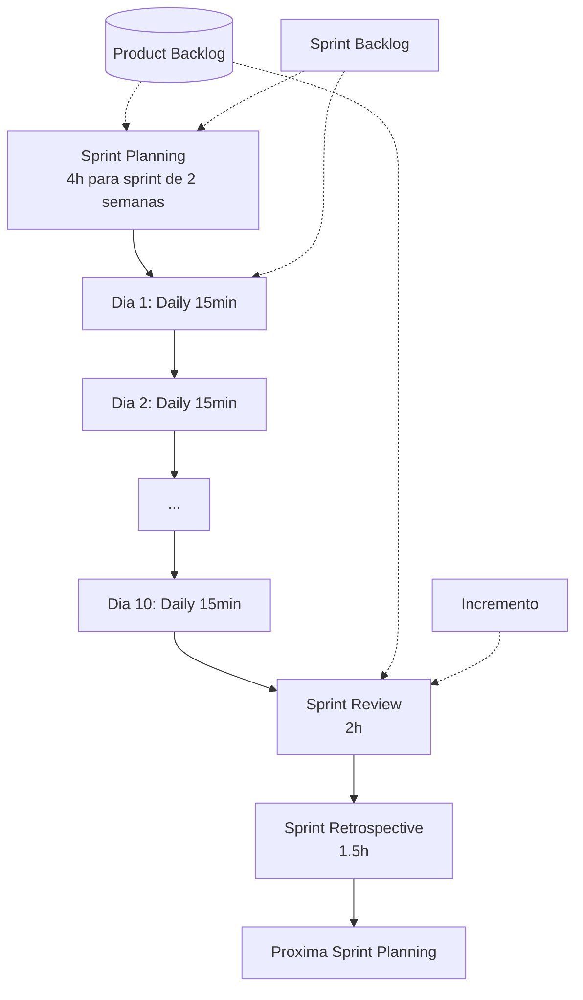
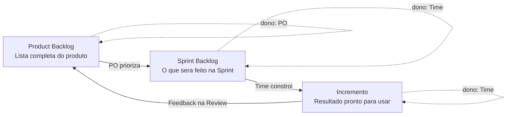

# Product Owner — Do Zero ao PO com Agentes — Aula 02

## Scrum em 15 Minutos

**Duração estimada:** 50 minutos (35 de leitura + 15 de prática)
**Nível:** Iniciante
**Pré-requisitos:** Aula 01 — "Afinal, o que é um Product Owner?"

---

## Objetivos de Aprendizagem

Ao final desta aula, você será capaz de:

- [ ] **Explicar** por que métodos tradicionais (cascata) falham para produtos complexos e como o Scrum surgiu como alternativa baseada em ciclos curtos de feedback
- [ ] **Definir** os 3 pilares do empirismo no Scrum — transparência, inspeção e adaptação — com um exemplo concreto de cada um
- [ ] **Descrever** os 3 papéis do Scrum (Product Owner, Scrum Master, Time de Desenvolvimento) e a responsabilidade central que distingue cada um
- [ ] **Comparar** o papel do PO com o do Scrum Master, identificando com clareza onde um termina e o outro começa
- [ ] **Explicar** o que é uma Sprint — o coração do Scrum — e como ela contém todos os demais eventos dentro de um ciclo de tempo fixo
- [ ] **Listar** os 5 eventos do Scrum (Sprint, Sprint Planning, Daily Scrum, Sprint Review, Sprint Retrospective) com o propósito e os participantes de cada um
- [ ] **Identificar** em quais eventos o PO é protagonista, em quais é participante e em quais é opcional
- [ ] **Descrever** os 3 artefatos do Scrum (Product Backlog, Sprint Backlog, Incremento), quem é o responsável principal por cada um e qual sua função
- [ ] **Mapear** a analogia do campeonato de culinária para o framework Scrum, associando cada elemento do framework a um elemento da metáfora
- [ ] **Aplicar** o framework Scrum ao NutriExpress, identificando quem seria cada papel, como seriam os eventos e esboçando um Product Backlog inicial de 3-5 itens

---

## Como Usar Esta Aula

Esta aula está organizada em duas partes. A **primeira parte** (seções 1 a 6) constrói os fundamentos do framework Scrum — por que ele existe, seus pilares, papéis, eventos e artefatos. A **segunda parte** (seção 7) aplica todos esses conceitos ao NutriExpress, o produto que vai acompanhar você durante todo o curso.

Ao longo do caminho, você encontrará **Quick Checks** ao final de cada seção — duas perguntas rápidas para verificar se entendeu antes de avançar. Ao final, o arquivo separado **Questões de Aprendizagem** traz as tarefas de checkpoint — só avance para a Aula 03 quando conseguir completá-las por conta própria.

**Tempo estimado:** 35 minutos de leitura + 15 minutos de prática e exercícios.

## Mapa Mental

Este diagrama mostra todos os conceitos que você vai dominar nesta aula:

> *O mapa mental acima mostra a estrutura da aula. Cada ramo representa um conceito que você vai explorar do zero.*

---

## Recapitulação da Aula 01

| Aula | Conceito | Seção | Conexão com esta aula |
|---|---|---|---|
| Aula 01 | **O que é um produto** digital | Seção 1 | Produtos complexos (como apps) precisam de ciclos de feedback — é isso que o Scrum resolve |
| Aula 01 | **O papel do Product Owner** | Seção 2-3 | O PO que você conheceu é um papel DENTRO do Scrum — agora você vai entender como ele se encaixa |
| Aula 01 | **Analogia do restaurante** (PO = chef, time = cozinha) | Seção 4 | Aula 02 expande: do restaurante (estático) para o campeonato de culinária (dinâmico, com múltiplas rodadas) |
| Aula 01 | **NutriExpress e stakeholders** | Seção 5 | Seção 7 aplica o Scrum ao NutriExpress — você saberá quem é quem e como organizar o trabalho |

---

**FUNDAMENTOS: O Framework Scrum**

> *Os conceitos desta seção são universais — valem para qualquer time que usa Scrum, independentemente do produto, da empresa ou da ferramenta. Na segunda parte, você vai aplicar cada um deles ao NutriExpress.*

---

## 1. Por que o Scrum Existe?

### O problema da receita fechada

Imagine que você decide cozinhar um prato novo — algo que nunca fez antes. Você segue a receita à risca, coloca tudo no forno e espera 40 minutos. Só quando abre o forno descobre que ficou salgado, seco, sem gosto. Se você tivesse provado o molho durante o preparo, teria ajustado o sal, adicionado mais caldo, corrigido o tempero.

**Métodos tradicionais de desenvolvimento** (chamados de cascata ou *waterfall*) funcionam como essa receita fechada. Você planeja TUDO antes de começar: faz a lista completa de requisitos, desenha a arquitetura, escreve o código, testa, e só no final mostra para o usuário. Se algo estiver errado? Você descobre lá na frente, quando é caro e difícil de corrigir.

**Cascata funciona para obras previsíveis** — construir uma ponte, por exemplo. Você precisa da planta antes, não pode ir "experimentando" a ponte. Mas para **produtos de tecnologia**, o cenário é outro: você não sabe exatamente o que funciona até ver o usuário usando. O valor está em descobrir, ajustar, iterar.

### Como o Scrum resolve isso

No início dos anos 90, **Ken Schwaber e Jeff Sutherland** perceberam que times de tecnologia precisavam de um modelo diferente. Eles criaram o **Scrum** — um framework onde o trabalho é dividido em ciclos curtos (1 a 4 semanas) chamados **Sprints**. Ao final de cada ciclo, você tem algo FUNCIONAL que pode mostrar ao usuário, receber feedback e ajustar a rota.

A grande sacada do Scrum é simples: **entregar valor rápido, receber feedback rápido, ajustar rápido.** Em vez de planejar tudo no início e torcer para dar certo, você planeja um pedaço de cada vez, baseado no que já aprendeu.

> *"Scrum não é sobre fazer mais rápido. É sobre aprender mais rápido."*

### Quick Check 1

**1. Por que métodos tradicionais (cascata) funcionam mal para produtos de tecnologia?**
**Resposta:** Porque o feedback só chega no final do processo. Se algo estiver errado, você descobre tarde demais, quando corrigir é caro e demorado. Produtos de tecnologia são complexos — você descobre o que funciona enquanto constrói.

**2. O que o Scrum propõe de diferente em relação ao modelo cascata?**
**Resposta:** O Scrum divide o trabalho em ciclos curtos (Sprints) de 1 a 4 semanas. Ao final de cada ciclo, entrega algo funcional, recebe feedback e ajusta o plano. Feedback rápido = correção rápida.

---

## 2. Os 3 Pilares do Scrum (Empirismo)

Scrum é baseado em **empirismo** — uma palavra bonita para uma ideia simples: decisões são tomadas com base no que você OBSERVA, não no que você planejou no papel meses atrás.

Três pilares sustentam essa abordagem:

### Transparência

Tudo deve estar **visível para todos**. O Product Backlog (a lista do que precisa ser feito) é público. O progresso da Sprint é visível. Os impedimentos (problemas que travam o time) são declarados abertamente.

**Analogia:** uma cozinha aberta em um restaurante. O cliente vê o que está sendo preparado. O chef vê se um prato está demorando. O garçom vê se a cozinha está sobrecarregada. Nada está escondido.

No Scrum, transparência significa que qualquer pessoa (time, PO, stakeholders) pode olhar para o que está acontecendo e entender o estado real do produto — sem precisar de relatórios ou explicações.

### Inspeção

Verifique **frequentemente** se o que está sendo construído está no caminho certo.

**Analogia:** provar o molho enquanto cozinha. Você não espera o prato ficar pronto para descobrir se está bom — você prova, ajusta, prova de novo.

No Scrum, os eventos são pontos de inspeção. A cada Daily Scrum (reunião diária de 15 minutos), o time inspeciona o progresso. A cada Sprint Review (ao final da Sprint), os stakeholders inspecionam o incremento entregue.

### Adaptação

Quando a inspeção revela algo fora do esperado, **ajuste o curso imediatamente**. Não espere o próximo planejamento.

**Analogia:** o molho está salgado. Você não espera o próximo jantar para corrigir — você adiciona mais caldo AGORA. No Scrum, se a Sprint Review mostra que a funcionalidade não atende às necessidades do usuário, o Product Backlog é ajustado NA HORA.

### Os 3 pilares na vida real

Imagine que você está reformando sua casa. Em vez de contratar um arquiteto que entrega tudo pronto 6 meses depois (cascata), você decide reformar um cômodo por vez (Scrum):

- **Transparência:** o pedreiro mostra o andamento da obra num quadro na parede. Você vê o que foi feito, o que falta, o que travou
- **Inspeção:** toda sexta-feira você visita a obra, vê o resultado da semana e avalia
- **Adaptação:** na visita, você percebe que a cor do azulejo não combinou. Na segunda-feira, o pedreiro já está com o azulejo novo. Você não espera a obra inteira ficar pronta para reclamar

**Os 3 pilares trabalham juntos.** Sem transparência, você não consegue inspecionar (não vê o que está acontecendo). Sem inspeção, você não tem dados para adaptar (não sabe o que ajustar). Sem adaptação, de nada adianta ter transparência e inspeção — você só observa sem agir.

### Quick Check 2

**1. Defina cada um dos 3 pilares do empirismo em suas próprias palavras.**
**Resposta:** Transparência = tornar tudo visível para todos. Inspeção = verificar frequentemente se o que está sendo feito está correto. Adaptação = ajustar o curso com base no que foi observado na inspeção.

**2. Dê um exemplo do seu cotidiano onde você usou os 3 pilares sem saber.**
**Resposta:** (exemplo pessoal) Ao cozinhar: provar o molho (inspeção), perceber que está salgado e adicionar água (adaptação), manter os ingredientes na bancada visíveis (transparência). Ou ao estudar: fazer uma prova simulada (inspeção), identificar lacunas e reestudar (adaptação), manter o cronograma de estudos visível (transparência).

---

## 3. Os 3 Papéis do Scrum

O Scrum define exatamente **três papéis**. Nem mais, nem menos. Cada um tem responsabilidades claras e não sobrepostas. Nenhum é chefe do outro.

### Product Owner (PO)

Você já conhece este papel da Aula 01. O PO decide **O QUE** construir e **EM QUE ORDEM**. Ele é o dono do Product Backlog — a lista de tudo que o produto pode ter. Sua responsabilidade é **maximizar o valor** que o time entrega.

**O que o PO faz no Scrum:**
- Mantém e prioriza o Product Backlog
- Garante que o backlog seja claro e visível para todos
- Participa do Sprint Planning (explica as prioridades)
- Conduz a Sprint Review (mostra o incremento e coleta feedback)
- Decide o que entra e o que não entra na Sprint

**O que o PO NÃO faz:**
- Não gerencia pessoas
- Não define COMO o time vai construir
- Não dá ordens técnicas (não diz "use essa biblioteca")
- Não é o chefe do time

> *Você aprendeu na Aula 01 que o PO não é chefe. Agora você entende POR QUÊ: no Scrum, ninguém é chefe de ninguém. Cada papel tem autoridade sobre seu domínio.*

### Scrum Master (SM)

O Scrum Master é o **guardião do processo**. Ele garante que o Scrum seja entendido e seguido por todos. Remove impedimentos — se o time precisa de um servidor e a TI não libera, o SM resolve. Se o PO não está priorizando o backlog, o SM conversa com o PO.

**Analogia:** o técnico de futebol. Ele não joga, não faz gol. Mas garante que o time tenha condições de jogar bem — treinos, estratégia, substituições. O SM é parecido: não constrói o produto, mas garante que o time tenha tudo para construir.

**Cuidado:** Scrum Master NÃO é chefe. NÃO é gerente de projetos. NÃO dá ordens técnicas. É um facilitador.

### Time de Desenvolvimento (Dev Team)

São as pessoas que **constroem o produto** — programadores, designers, testadores, analistas. O time é:

- **Auto-organizado:** decide COMO fazer o trabalho. O PO diz o quê, o time decide como
- **Multifuncional:** tem todas as habilidades necessárias para entregar o incremento
- **Sem sub-times:** todos são "Desenvolvedores" no Scrum — não importa o cargo formal

O time de desenvolvimento não recebe ordens de como fazer. Eles são profissionais responsáveis por encontrar a melhor maneira de construir o que o PO pediu.

### Tabela comparativa dos 3 papéis

| Papel | Responsabilidade principal | O que NÃO faz | Interage mais com |
|---|---|---|---|
| **Product Owner** | Maximizar valor do produto, gerenciar backlog | Gerenciar pessoas, dar ordens técnicas | Stakeholders, cliente |
| **Scrum Master** | Garantir o processo Scrum, remover impedimentos | Ser chefe, dar ordens técnicas | Time, PO, organização |
| **Time de Desenvolvimento** | Construir o incremento | Receber ordens de como fazer | PO, SM |

### Quick Check 3

**1. Se o time está com um impedimento técnico (ex: o servidor de desenvolvimento caiu), quem deve resolver prioritariamente?**
**Resposta:** O Scrum Master. Ele é responsável por remover impedimentos que travam o time. O SM aciona a infraestrutura, gerencia o prazo de resolução e garante que o time possa voltar a trabalhar.

**2. Um programador quer definir a ordem das funcionalidades do produto — isso é papel dele?**
**Resposta:** Não. A ordem (prioridade) é responsabilidade do Product Owner. O time de desenvolvimento decide COMO construir, não O QUE construir em que ordem. O PO define as prioridades; o time estima e executa.

---

## 4. Os 5 Eventos do Scrum

Tudo no Scrum acontece dentro de ciclos de **tempo fixo** chamados Sprints. Uma Sprint é como uma "mini-maratona" com data de início e fim — não se estica, não se adia.

### Sprint — o coração do Scrum

Uma **Sprint** é um ciclo de 1 a 4 semanas (a maioria dos times usa 2 semanas). Dentro da Sprint, o time constrói algo **funcional**. Ao final, entrega um **Incremento** — um pedaço do produto pronto para uso.

**Regra de ouro:** a duração da Sprint é FIXA. Se a Sprint é de 2 semanas, toda sexta-feira da segunda semana tem entrega. Não importa se o time terminou cedo ou se está atrasado — a data não muda.

Isso cria **previsibilidade**. Os stakeholders sabem: "a cada 2 semanas, na sexta, tem novidade."

Dentro de cada Sprint, acontecem 4 eventos adicionais:

### Sprint Planning (Planejamento da Sprint)

**Quando:** primeiro dia da Sprint
**Duração máxima:** 2 horas por semana de Sprint (Sprint de 2 semanas = 4 horas)
**Participantes:** PO + Time de Desenvolvimento + Scrum Master
**Papel do PO:** **Protagonista** — apresenta o "porquê" e o "o quê"

O Sprint Planning responde **duas perguntas:**
1. **O QUÊ** será construído nesta Sprint? (PO apresenta as prioridades do backlog)
2. **COMO** será construído? (time discute e seleciona os itens que cabem na Sprint)

O resultado é o **Sprint Backlog** — a lista do que será feito naquela Sprint.

### Daily Scrum (Reunião Diária)

**Quando:** todos os dias, mesmo horário, mesmo local
**Duração:** 15 minutos (cronometrados — não passa disso)
**Participantes:** Time de Desenvolvimento (Scrum Master garante que aconteça)
**Papel do PO:** **Opcional** — pode assistir, mas não deve atrapalhar

O time responde **3 perguntas:**
1. O que eu fiz ontem para ajudar o time?
2. O que vou fazer hoje para ajudar o time?
3. Estou enfrentando algum impedimento?

**Atenção:** Daily Scrum NÃO é reunião de status para o chefe. É o time se alinhando. Se o PO for, ele escuta, não interrompe.

### Sprint Review (Revisão da Sprint)

**Quando:** último dia da Sprint
**Duração máxima:** 1 hora por semana de Sprint (Sprint de 2 semanas = 2 horas)
**Participantes:** PO + Time + Stakeholders
**Papel do PO:** **Conduz** a reunião

O time **demonstra o que foi construído** — incremento funcionando, NÃO slides, NÃO PowerPoint. Os stakeholders dão feedback. O PO coleta as observações e ajusta o Product Backlog.

**É uma festa de entrega, não uma auditoria.** O objetivo é celebrar o que foi feito e aprender com o feedback, não julgar o time.

### Sprint Retrospective (Retrospectiva da Sprint)

**Quando:** após a Sprint Review, antes do próximo Sprint Planning
**Duração máxima:** 45 minutos por semana de Sprint (Sprint de 2 semanas = 1,5 hora)
**Participantes:** Time + PO + SM
**Papel do PO:** **Participante** — membro do time por uma hora

O time discute o **PROCESSO** (não o produto). Três perguntas guiam:
1. O que funcionou bem nesta Sprint?
2. O que podemos melhorar?
3. O que vamos testar de diferente na próxima Sprint?

### Tabela-resumo dos 5 eventos

| Evento | Quando ocorre | Duração máx (Sprint 2 sem) | Participantes obrigatórios | PO é... | Propósito |
|---|---|---|---|---|---|
| **Sprint** | Ciclo inteiro | 2 semanas | Time | Participante | Construir incremento |
| **Sprint Planning** | 1º dia | 4h | PO + Time + SM | Protagonista | Planejar o que fazer |
| **Daily Scrum** | Todos os dias | 15min | Time | Opcional | Alinhar o time |
| **Sprint Review** | Último dia | 2h | PO + Time + Stakeholders | Conduz | Inspecionar incremento |
| **Sprint Retro** | Após Review | 1,5h | Time + SM + PO | Participante | Melhorar o processo |

### Quick Check 4

**1. Qual evento o PO CONDUZ e qual o PO é OPCIONAL?**
**Resposta:** PO conduz a Sprint Review (ele apresenta o incremento e coleta feedback dos stakeholders). PO é opcional no Daily Scrum — pode assistir, mas não deve interromper. No Sprint Planning, o PO é protagonista (apresenta as prioridades).

**2. Uma Sprint de 2 semanas está no 8º dia. O time descobre que não vai conseguir entregar tudo. O que NÃO se deve fazer?**
**Resposta:** NÃO se deve esticar a Sprint (a duração é fixa). NÃO se deve mudar o escopo no meio da Sprint sem urgência real. O time entrega o que conseguiu e leva o aprendizado para o Sprint Planning seguinte. O PO reavalia as prioridades para a próxima Sprint.

---

## 5. Os 3 Artefatos do Scrum

Artefatos são os "objetos" que o Scrum produz e gerencia. Eles **materializam a transparência** — qualquer pessoa pode inspecioná-los e entender o estado do produto.

### Product Backlog

O **Product Backlog** é a lista viva de TUDO que o produto pode ter. É como o cardápio completo de um restaurante — tem todos os pratos possíveis, mas você não vai cozinhar todos de uma vez.

**Responsabilidade ÚNICA do PO.** O PO decide o que entra, o que sai e em que ordem. O topo da lista são os itens mais importantes (maior valor para o negócio). A base da lista são itens menos urgentes, que talvez nunca sejam feitos.

O backlog nunca está "pronto" — ele evolui com o produto, com o feedback dos usuários e com as mudanças de mercado. Na Aula 01, você viu o backlog como o cardápio do restaurante. Agora você entende que o Product Backlog é um **artefato formal do Scrum** — não é uma lista de desejos, é a ferramenta que guia todo o trabalho.

### Sprint Backlog

O **Sprint Backlog** é o subconjunto do Product Backlog que o time se comprometeu a entregar **NAQUELA Sprint**. É como o pedido da mesa 4 — o garçom anotou, a cozinha vai preparar AGORA.

O time define o Sprint Backlog durante o Sprint Planning. O PO orienta sobre as prioridades, mas o time decide quantos itens consegue entregar. O Sprint Backlog inclui:

- Os itens selecionados do Product Backlog
- O plano de como entregar (tarefas técnicas, divisão de trabalho)
- É visível para todos (quadro físico ou digital)

### Incremento

O **Incremento** é a soma de TUDO que foi concluído na Sprint, que atende à **Definition of Done** e está em condição de USO.

**Não é "quase pronto" — é PRONTO.** Cada Sprint produz UM incremento que se soma aos anteriores. É como cada prato finalizado que sai da cozinha — não adianta estar "quase pronto", o cliente não come "quase".

### Definition of Done (DoD)

A **Definition of Done** é um checklist de critérios que define "pronto" para aquele time. Exemplos:

- Código escrito e revisado
- Testado (testes automatizados ou manuais)
- Documentado
- Aprovado pelo PO
- Integrado ao sistema principal

A DoD evita o "99% pronto" eterno. Ela pertence ao time (não ao PO sozinho) e pode evoluir com o tempo.

### Tabela dos 3 artefatos

| Artefato | Responsável | Quem inspeciona | Quando muda | Analogia |
|---|---|---|---|---|
| **Product Backlog** | Product Owner | PO, stakeholders | Continuamente (priorizado no Planning, ajustado na Review) | Cardápio completo do restaurante |
| **Sprint Backlog** | Time de Desenvolvimento | Time, PO | Durante a Sprint (time gerencia) | Pedido da mesa que está sendo preparado |
| **Incremento** | Time de Desenvolvimento | PO, stakeholders | Ao final de cada Sprint | Prato pronto que sai da cozinha |

### Quick Check 5

**1. Quem é o dono (responsável principal) do Product Backlog?**
**Resposta:** O Product Owner. É responsabilidade ÚNICA e EXCLUSIVA do PO gerenciar o Product Backlog — decidir o que entra, o que sai e em que ordem.

**2. Qual a diferença entre Product Backlog e Sprint Backlog?**
**Resposta:** O Product Backlog é a lista COMPLETA de tudo que o produto pode ter (todos os itens futuros). O Sprint Backlog é o SUBCONJUNTO que o time escolheu para entregar NAQUELA Sprint específica. Um é o cardápio inteiro, o outro é o pedido que está sendo cozinhado agora.

---

## 6. A Analogia do Campeonato de Culinária

Você já assistiu a um programa de culinária como MasterChef? Se sim, você já entendeu Scrum. Se não, vamos montar o cenário:

**O cenário:** um campeonato de culinária televisionado. Cada episódio tem um tempo fixo. Os cozinheiros recebem um briefing, preparam o prato, e os jurados avaliam. A cada episódio, alguém é eliminado — ou todos aprendem e avançam.

Agora, veja como cada elemento do programa se encaixa no Scrum:

| Elemento do campeonato | Elemento do Scrum |
|---|---|
| **Chef que define o cardápio da temporada** | Product Owner (decide o que construir) |
| **Cada episódio (tempo fixo)** | Sprint (ciclo de tempo fixo) |
| **Briefing antes de cozinhar** | Sprint Planning (o chef PO explica, os cozinheiros planejam) |
| **Cozinheiros se alinhando durante o episódio** | Daily Scrum (check-in rápido, sem atrapalhar) |
| **Jurados provam o prato e dão nota** | Sprint Review (stakeholders + PO avaliam o incremento) |
| **Conversa da equipe após a avaliação** | Sprint Retrospective ("o que melhorar para o próximo episódio") |
| **Lista de pratos possíveis da temporada** | Product Backlog (tudo que pode ser feito) |
| **Prato escolhido para o episódio de hoje** | Sprint Backlog (o que será feito agora) |
| **Prato finalizado servido aos jurados** | Incremento (pronto, na mesa, funcionando) |

### Por que essa analogia funciona?

Porque qualquer pessoa já viu algo parecido: uma competição com tempo fixo, avaliação ao final, aprendizado entre rodadas. É EXATAMENTE como o Scrum funciona.

**A diferença entre a analogia da Aula 01 e esta:**
- Na Aula 01, você conheceu o PO como **chef de restaurante** — uma operação contínua, dia após dia, sem rodadas
- Aqui, o PO é **chef de um campeonato** — múltiplas rodadas (Sprints), cada uma com início, meio e fim, com avaliação e adaptação entre elas

O restaurante é o time. O campeonato é o Scrum.

### Quick Check 6

**1. Na analogia do campeonato, o chef PO percebe após a degustação dos jurados que o prato do próximo episódio precisa mudar. Qual artefato do Scrum ele está atualizando?**
**Resposta:** O Product Backlog. Após a Sprint Review (degustação), o PO ajusta o backlog com base no feedback recebido. No campeonato, ele muda o cardápio do próximo episódio.

**2. Um cozinheiro queimou o molho e pede mais 10 minutos para os jurados esperarem. Isso é compatível com o Scrum?**
**Resposta:** Não. No Scrum (e no campeonato), o tempo é FIXO. A Sprint não se estica. Se o molho queimou, o time entrega o que conseguiu (mesmo que incompleto) e leva o aprendizado — "precisamos nos organizar melhor no tempo" — para a Retrospective.

---

**APLICAÇÃO: Scrum no NutriExpress**

> *Agora que você entende o Scrum como framework — pilares, papéis, eventos e artefatos — vamos aplicá-lo ao NutriExpress, o produto que você vai construir ao longo deste curso. Na Aula 01 você conheceu o problema que o NutriExpress resolve e quem são seus stakeholders. Agora você vai montar o motor Scrum que fará o NutriExpress sair do papel.*

---

## 7. Como Seria o Scrum no NutriExpress?

### Quem é quem no NutriExpress

| Papel Scrum | Quem ocupa | Responsabilidade no NutriExpress |
|---|---|---|
| **Product Owner** | **VOCÊ (o aluno)** | Decidir o que o NutriExpress terá, em que ordem, baseado no valor para os stakeholders |
| **Time de Desenvolvimento** | Programadores, designers, testadores | Construir as funcionalidades do app — cardápio, busca, pedidos, pagamento |
| **Scrum Master** | Um facilitador dedicado | Garantir que o Scrum funcione e remover impedimentos (obs: você aprenderá a atuar sem SM dedicado, comum em times pequenos) |

**Stakeholders:** nutricionistas parceiros, restaurantes, clientes, entregadores, investidores (revise a tabela de stakeholders da Aula 01).

### Sprints do NutriExpress

Imagine que o NutriExpress será construído em **Sprints de 2 semanas**. Cada Sprint entrega ALGO FUNCIONAL — nunca "a tela de login" sozinha, mas uma fatia de valor real. Exemplo de sequência:

| Sprint | O que será entregue |
|---|---|
| **Sprint 1** | Cadastro de restaurantes com cardápio (foto, descrição, preço) |
| **Sprint 2** | Busca e filtro de marmitas por tipo de comida |
| **Sprint 3** | Carrinho de compras e finalização de pedido |
| **Sprint 4** | Acompanhamento de entrega em tempo real |

### Exemplo de Sprint Planning do NutriExpress

**Cenário:** é a primeira segunda-feira do mês. Sprint Planning começa às 9h.

1. **PO (você):** "Pessoal, nossa primeira Sprint vai focar no cadastro de restaurantes. Precisamos que um dono de restaurante consiga se cadastrar, adicionar seus pratos com foto, descrição e preço. Isso é a base de TUDO no app — sem restaurante cadastrado, não temos produto."

2. **Time:** "Entendido. Dá para fazer em 2 semanas? Precisamos da tela de cadastro, banco de dados, upload de fotos e uma página de cardápio funcional."

3. **Discussão:** time estima, quebra em tarefas, monta o Sprint Backlog.

4. **Resultado:** Sprint Backlog com 6-8 itens técnicos que, juntos, entregam o cadastro funcionando.

### Exemplo de Sprint Review do NutriExpress

**Cenário:** Sprint 1 terminou. Sexta-feira, 14h. Você (PO) conduz a Review.

1. Você abre o app (funcional, não protótipo) e mostra: "Olhem, já é possível cadastrar um restaurante e adicionar pratos ao cardápio. Vou demonstrar: aqui o dono do restaurante cria conta, adiciona a foto, o nome, e começa a inserir os pratos."

2. **Um dono de restaurante (stakeholder):** "Legal, mas eu queria poder marcar quais pratos são vegetarianos ou sem glúten."

3. **Você anota.** Esse feedback vai para o Product Backlog — talvez entre na Sprint 2 como prioridade.

4. **Uma nutricionista parceira:** "E se eu pudesse sugerir combinações de marmitas saudáveis?"

5. **Você anota.** Mais um item para o backlog.

6. Ao final, você atualiza o Product Backlog com os novos itens, reordena prioridades e se prepara para o próximo Sprint Planning.

### Como os 3 pilares aparecem no NutriExpress

- **Transparência:** o backlog do NutriExpress está visível para todos os stakeholders. Qualquer um pode ver "o que está sendo feito", "o que vem depois" e "o que não será feito agora"
- **Inspeção:** a cada 2 semanas, a Sprint Review mostra o incremento REAL — não PowerPoint, não promessa. Os stakeholders veem o app funcionando
- **Adaptação:** se o feedback da Review indicar que "acompanhamento de entrega" é mais urgente que "sugestões de nutricionista", o backlog é reordenado na hora

**Mão na Massa — Sua Primeira Sprint Review:**

Imagine que você é o PO do NutriExpress. Sua primeira Sprint acaba de terminar. O time conseguiu entregar o cadastro de nutricionistas (eles podem se registrar, informar suas especialidades e criar perfis públicos).

**Anote suas respostas em um arquivo — você vai retomar este exercício nas Questões de Aprendizagem (Q7).**
- Quem você convidaria para a Sprint Review?
- O que você mostraria funcionando?
- Que feedback você espera receber de cada stakeholder?
- Como você atualizaria o Product Backlog depois da Review?

**Você está no caminho certo se:**
- [ ] Convidou pelo menos 2 tipos diferentes de stakeholder
- [ ] Descreveu o que mostraria FUNCIONANDO (não slides)
- [ ] Antecipou pelo menos 1 feedback de cada stakeholder

### Quick Check 7

**1. Quem seria o PO do NutriExpress e qual seria sua primeira decisão na Sprint 1?**
**Resposta:** O PO do NutriExpress é VOCÊ (o aluno). Sua primeira decisão seria definir qual é a funcionalidade de maior valor para começar — no exemplo, o cadastro de restaurantes, pois sem restaurantes cadastrados não há produto. Você apresenta essa prioridade no Sprint Planning.

**2. Um investidor pede um "chat interno entre nutricionistas" no meio da Sprint 1. O que o PO deve fazer?**
**Resposta:** O PO deve anotar o pedido e adicioná-lo ao Product Backlog para avaliação futura, mas NÃO deve mudar o escopo da Sprint em andamento. A Sprint 1 já está em execução com um compromisso definido. O chat será priorizado e planejado para uma Sprint futura, se for mais importante que os outros itens do backlog.

---

## Autoavaliação: Quiz Rápido

**1. O que é uma Sprint?**
**Resposta:**

Uma Sprint é um ciclo de tempo fixo (1 a 4 semanas) dentro do qual o time constrói um Incremento funcional do produto. A duração nunca muda — se a Sprint é de 2 semanas, ela termina em 2 semanas, independentemente do progresso.

**2. Qual pilar do Scrum está sendo aplicado quando o PO mostra o backlog para todos os stakeholders?**
**Resposta:**

Transparência. O backlog está visível para todos — qualquer pessoa pode ver o que está planejado, priorizado e descartado. Nada fica escondido.

**3. Quem é responsável por remover impedimentos do time?**
**Resposta:**

O Scrum Master. Ele não é chefe, mas garante que o time tenha tudo o que precisa para trabalhar — desde recursos técnicos até alinhamento organizacional.

**4. Qual a diferença entre Sprint Review e Sprint Retrospective?**
**Resposta:**

A Sprint Review foca no PRODUTO: o PO mostra o que foi construído e stakeholders dão feedback. A Sprint Retrospective foca no PROCESSO: o time discute o que funcionou bem e o que pode melhorar na forma de trabalhar.

**5. O Product Owner pode dizer ao programador qual tecnologia usar para implementar uma funcionalidade?**
**Resposta:**

Não. O PO define O QUE construir (prioridades e requisitos). O time de desenvolvimento decide COMO construir (tecnologia, arquitetura, ferramentas). Essa separação é uma regra fundamental do Scrum.

**6. O que é o Incremento no Scrum?**
**Resposta:**

É o resultado CONCLUÍDO da Sprint — algo que atende à Definition of Done e está em condição de uso. Não é "quase pronto", é pronto. Cada Sprint produz um Incremento que se soma aos anteriores.

**7. Na analogia do campeonato de culinária, o que representa a Sprint Retrospective?**
**Resposta:**

A conversa da equipe após a avaliação dos jurados. O time discute "o que deu errado no molho", "como melhorar o tempo", "o que testar diferente no próximo episódio". É sobre o PROCESSO da cozinha, não sobre o prato.

---

## Mão na Massa: Exercícios Graduados

### Exercício 1 (Fácil) — Complete a Tabela do Scrum

Complete as lacunas na tabela abaixo. Cada linha está faltando uma informação (papel, evento ou artefato).

| Categoria | Item | Propósito (1 frase) |
|---|---|---|
| Papel | Product Owner | Decidir o que construir e maximizar o valor do produto |
| Papel | Scrum Master | ? |
| Papel | ? | Construir o incremento, auto-organizado e multifuncional |
| Evento | ? | Planejar o que será feito na Sprint (PO + Time) |
| Evento | Daily Scrum | ? |
| Evento | Sprint Review | ? |
| Evento | Sprint Retrospective | Melhorar o processo do time |
| Artefato | ? | Lista completa de tudo que o produto pode ter (dono: PO) |
| Artefato | Sprint Backlog | ? |
| Artefato | Incremento | Resultado pronto e funcional ao final da Sprint |

**Gabarito:**

| Categoria | Item | Propósito |
|---|---|---|
| Papel | Scrum Master | Garantir que o Scrum seja seguido e remover impedimentos |
| Papel | Time de Desenvolvimento | Construir o incremento, auto-organizado e multifuncional |
| Evento | Sprint Planning | Planejar o que será feito na Sprint (PO + Time) |
| Evento | Daily Scrum | Time se alinha diariamente por 15 minutos |
| Evento | Sprint Review | Inspecionar o incremento com stakeholders e coletar feedback |
| Artefato | Product Backlog | Lista completa de tudo que o produto pode ter (dono: PO) |
| Artefato | Sprint Backlog | Itens selecionados para a Sprint + plano de execução |

---

### Exercício 2 (Médio) — Monte o Ciclo Scrum do NutriExpress

Você recebeu uma lista de eventos do Scrum fora de ordem. Reorganize-os na sequência correta dentro de uma Sprint de 2 semanas. Para cada evento, identifique:

1. Quem participa
2. Qual artefato é criado ou atualizado
3. Qual pilar do empirismo está em ação

**Eventos (fora de ordem):**
- Sprint Retrospective
- Sprint Review
- Daily Scrum (x10)
- Sprint Planning
- Sprint (execução)

**Gabarito:**

**Ordem correta:**

1. **Sprint Planning (dia 1, 4h)**
   - Participantes: PO + Time + SM
   - Artefato criado: Sprint Backlog
   - Pilar: Transparência (todos sabem o que será feito)

2. **Sprint — Execução (dias 1 a 10)**
   - Participantes: Time de Desenvolvimento
   - Artefato atualizado: Sprint Backlog (time gerencia o trabalho)
   - Pilar: Inspeção (time verifica o progresso continuamente)

3. **Daily Scrum (dias 1 a 10, 15min cada)**
   - Participantes: Time (PO é opcional)
   - Artefato: nenhum (mas o Sprint Backlog reflete ajustes)
   - Pilar: Inspeção e Adaptação (time se alinha e ajusta o plano diário)

4. **Sprint Review (dia 10, 2h)**
   - Participantes: PO conduz + Time + Stakeholders
   - Artefato: Product Backlog é atualizado com feedback
   - Pilar: Inspeção (stakeholders veem o incremento) + Adaptação (PO ajusta o backlog)

5. **Sprint Retrospective (dia 10, 1,5h)**
   - Participantes: Time + PO + SM
   - Artefato: nenhum (mas ações de melhoria contínua são registradas)
   - Pilar: Adaptação (time ajusta o processo para a próxima Sprint)

**Sequência visual:** Sprint Planning → (Daily x10 + Sprint execução) → Sprint Review → Sprint Retrospective → (próximo Sprint Planning)

---

### Desafio (Difícil) — Diagnóstico de Disfunções

Para cada cenário abaixo, identifique: (1) qual regra do Scrum foi violada, (2) qual papel deveria ter agido diferente, (3) o que fazer para corrigir.

**Cenário A:** O Product Owner muda o escopo da Sprint no meio do caminho. Na segunda-feira, a equipe estava construindo o cadastro de restaurantes. Na quarta-feira, o PO chega e diz: "Esquece o cadastro, agora precisamos do sistema de busca urgente — um investidor pediu."

**Cenário B:** O Scrum Master está definindo a ordem das funcionalidades no Product Backlog. Ele disse: "Coloquei o chat como prioridade máxima porque acho que é o mais importante."

**Cenário C:** A Daily Scrum está durando 45 minutos. O PO usa o tempo para cobrar o time sobre o que foi feito, perguntar prazos e reatribuir tarefas. Vários desenvolvedores já chegam atrasados porque "não aguentam mais essa reunião".

**Gabarito:**

**Cenário A:**
1. **Regra violada:** o escopo da Sprint não deve ser alterado depois de iniciado (a não ser em emergências extremas). O Sprint Backlog é um compromisso entre PO e time
2. **Papel que falhou:** o Product Owner. Ele deveria ter respeitado o compromisso da Sprint e levado a nova prioridade para o próximo Sprint Planning
3. **Correção:** PO pede desculpas ao time, restaura o Sprint Backlog original, adiciona "sistema de busca" ao Product Backlog como prioridade para a PRÓXIMA Sprint. Se for realmente urgente (raro), cancela a Sprint atual e inicia uma nova com novo Planning

**Cenário B:**
1. **Regra violada:** o Scrum Master não deve definir prioridades do backlog. A ordem das funcionalidades é responsabilidade EXCLUSIVA do Product Owner
2. **Papel que falhou:** o Scrum Master. Ele invadiu o território do PO. O SM deveria facilitar, não decidir
3. **Correção:** SM devolve o backlog ao PO, explica que priorizar é função do PO, e pergunta: "Como posso ajudar você a manter o backlog priorizado?" SM volta a atuar como facilitador

**Cenário C:**
1. **Regras violadas:** (a) Daily Scrum tem no máximo 15 minutos, (b) o PO não deve usar a Daily para cobrança ou reatribuição, (c) o PO é opcional na Daily
2. **Papel que falhou:** o PO (invadiu a Daily com comportamento de chefe) e o SM (permitiu que a Daily se alongasse e virasse reunião de status)
3. **Correção:** SM reinstitui o limite de 15 minutos, lembra que Daily é do time (não do PO), e sugere que o PO participe apenas 1x por semana como ouvinte. Se o PO precisa de status, que crie um canal assíncrono (quadro, relatório breve)

---

## Resumo da Aula

### Os 6 Conceitos Fundamentais

1. **Por que Scrum existe:** métodos cascata falham para produtos complexos porque o feedback chega tarde. Scrum substitui por ciclos curtos (Sprints) com feedback rápido
2. **Os 3 Pilares:** Transparência (tudo visível), Inspeção (verificar frequentemente), Adaptação (ajustar imediatamente)
3. **Os 3 Papéis:** PO (o quê/quando), SM (como o processo funciona), Time de Desenvolvimento (como construir)
4. **Os 5 Eventos:** Sprint (ciclo), Sprint Planning (planejar), Daily (alinhar), Sprint Review (inspecionar produto), Sprint Retrospective (melhorar processo)
5. **Os 3 Artefatos:** Product Backlog (tudo que pode ser feito), Sprint Backlog (o que será feito agora), Incremento (o que foi feito)
6. **Aplicação no NutriExpress:** você é o PO, Sprints de 2 semanas, backlog inicial de 3-5 itens

### O Que Você Aprendeu Hoje

- [x] Entendeu por que Scrum surgiu e qual problema ele resolve
- [x] Conhece os 3 pilares do empirismo (transparência, inspeção, adaptação)
- [x] Sabe distinguir os 3 papéis do Scrum e suas responsabilidades
- [x] Conhece os 5 eventos e o papel do PO em cada um
- [x] Sabe o que são os 3 artefatos e quem é dono de cada um
- [x] Consegue explicar Scrum usando a analogia do campeonato de culinária
- [x] Consegue aplicar o Scrum ao NutriExpress
- [x] Sabe diagnosticar disfunções comuns e identificar quem deve agir

---

## Próxima Aula

**Aula 03: As 3 Responsabilidades do PO**

Agora que você sabe ONDE o PO opera (dentro do framework Scrum), vai descobrir exatamente O QUE ele faz no dia a dia. A Aula 03 revela as 3 responsabilidades que definem o trabalho do Product Owner — desde maximizar valor até tomar decisões difíceis e dizer "não".

Prepare-se: depois do Scrum, você vai mergulhar fundo no papel que você vai exercer.

---

## Referências

### Documentação Oficial

- [Scrum Guide 2020](https://scrumguides.org/scrum-guide.html) — o guia original (e único) do Scrum, por Ken Schwaber e Jeff Sutherland. Leitura obrigatória para quem quer ser PO. (~20 min de leitura)

### Vídeos Recomendados

- [Scrum em 10 Minutos](https://www.youtube.com/watch?v=XU0llRltyFM) — versão rápida e visual do Scrum Guide (~10 min)
- [Product Owner vs Scrum Master](https://www.youtube.com/watch?v=T_OIfPcc-oY) — entenda bem as diferenças entre os dois papéis (~8 min)

### Artigos para Aprofundamento

- [O que é um Product Owner?](https://www.scrum.org/resources/what-is-a-product-owner) — artigo oficial do Scrum.org
- [The 3 Pillars of Empiricism](https://www.scrum.org/resources/3-pillards-empiricism-scrum) — aprofundamento nos pilares do Scrum
- [Nexus Guide](https://www.scrum.org/resources/nexus-guide) — para quando você precisar escalar Scrum para múltiplos times (leitura futura)

---

## FAQ

**P: Scrum só funciona para tecnologia?**
R: Não. Embora tenha sido criado para produtos de software, Scrum já foi aplicado em marketing, RH, educação e até construção civil. Qualquer trabalho complexo onde o resultado não é totalmente previsível pode se beneficiar de ciclos curtos de feedback.

**P: Quanto tempo dura uma Sprint ideal?**
R: Não existe "ideal" universal. 2 semanas é o mais comum por equilibrar previsibilidade e agilidade. 1 semana dá feedback muito rápido mas gera mais custo de planejamento. 3-4 semanas funcionam para produtos mais estáveis. A regra é: escolha uma duração e mantenha.

**P: O PO pode ser também Scrum Master em times pequenos?**
R: O Scrum Guide diz que é possível, mas NÃO é recomendado. São papéis com responsabilidades conflitantes: o PO foca em valor e backlog (o quê), o SM foca em processo e impedimentos (como). Uma pessoa raramente consegue fazer bem os dois. Para times muito pequenos (2-3 pessoas), pode ser necessário, mas é um risco.

**P: O que acontece se o time não entregar tudo na Sprint?**
R: Normal. O time entrega o que conseguiu. O restante volta para o Product Backlog e é replanejado na próxima Sprint. A duração da Sprint NÃO se estica. O aprendizado vai para a Retrospective: "por que não conseguimos entregar tudo? O que precisamos ajustar?"

**P: Daily Scrum pode ser por WhatsApp/texto assíncrono?**
R: O Scrum Guide recomenda presencial (ou vídeo) pelos 15 minutos para permitir alinhamento rápido. Times remotos podem adaptar, mas perder a conversa síncrona reduz o valor da inspeção e adaptação diárias. Se for usar chat, que seja com um encontro síncrono semanal.

**P: O que é a Definition of Done e quem define?**
R: É um checklist que define "pronto" para o time (ex: código testado, revisado, aprovado pelo PO, documentado). O time define (não o PO sozinho), porque é o time que precisa cumpri-la. A DoD evolui com o amadurecimento do time.

**P: Preciso de certificação para ser PO?**
R: Não. Certificações (como PSPO I do Scrum.org ou CSPO da Scrum Alliance) ajudam no currículo, mas não substituem experiência prática. Muitos POs começam sem certificação e tiram depois de algum tempo de atuação.

**P: O que significa "timebox" no Scrum?**
R: Timebox significa "caixa de tempo" — uma duração máxima fixa para um evento. Ex: Sprint tem timebox de 1 mês, Daily tem timebox de 15 minutos, Sprint Planning tem timebox de 2h por semana de Sprint. O timebox cria disciplina e previsibilidade.

**P: Qual a diferença entre Sprint e Release?**
R: Sprint é o ciclo de desenvolvimento (1-4 semanas, SEMPRE entrega algo funcional). Release é a decisão de NEGÓCIO de disponibilizar o incremento para os usuários finais. Você pode ter 3 Sprints e só 1 Release — o produto acumula incrementos e é liberado quando há valor suficiente.

**P: O PO participa da Sprint Retrospective?**
R: Sim. O PO participa como MEMBRO DO TIME — ele também precisa melhorar sua forma de trabalhar (ex: como prioriza, como se comunica com o time). Mas o foco da Retro é o processo do time, não o produto.

---

## Glossário

| Termo | Definição |
|---|---|
| **Scrum** | Framework ágil para desenvolvimento de produtos complexos, baseado em ciclos curtos (Sprints) e empirismo (transparência, inspeção, adaptação) |
| **Sprint** | Ciclo de tempo fixo (1-4 semanas) dentro do qual o time constrói um Incremento funcional do produto |
| **Product Backlog** | Lista viva e priorizada de tudo que o produto pode ter. Responsabilidade exclusiva do PO |
| **Sprint Backlog** | Subconjunto do Product Backlog selecionado para a Sprint atual, incluindo o plano de execução |
| **Incremento** | Resultado concluído da Sprint, que atende à Definition of Done e está em condição de uso |
| **Sprint Planning** | Evento no início da Sprint onde PO e time planejam o que será construído |
| **Daily Scrum** | Reunião diária de 15 minutos para o time se alinhar sobre o progresso e impedimentos |
| **Sprint Review** | Evento ao final da Sprint onde o PO demonstra o incremento aos stakeholders e coleta feedback |
| **Sprint Retrospective** | Evento após a Review onde o time discute melhorias no processo |
| **Time de Desenvolvimento (Dev Team)** | Profissionais que constroem o incremento — auto-organizados e multifuncionais |
| **Scrum Master** | Guardião do processo Scrum, remove impedimentos e facilita a colaboração |
| **Product Owner** | Responsável por maximizar o valor do produto, gerenciar o Product Backlog e definir prioridades |
| **Transparência** | Pilar do empirismo: tudo deve estar visível e compreensível para todos |
| **Inspeção** | Pilar do empirismo: verificar frequentemente se o produto e o processo estão no caminho certo |
| **Adaptação** | Pilar do empirismo: ajustar o curso imediatamente quando a inspeção revelar desvios |
| **Definition of Done (DoD)** | Checklist do time que define oficialmente quando um item está "pronto" |
| **Timebox** | Duração máxima fixa para um evento ou Sprint |
| **Empirismo** | Filosofia de que decisões devem ser baseadas em observação e experiência, não em previsão teórica |
