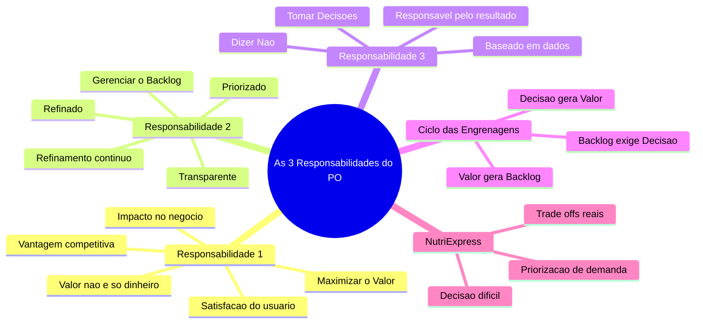
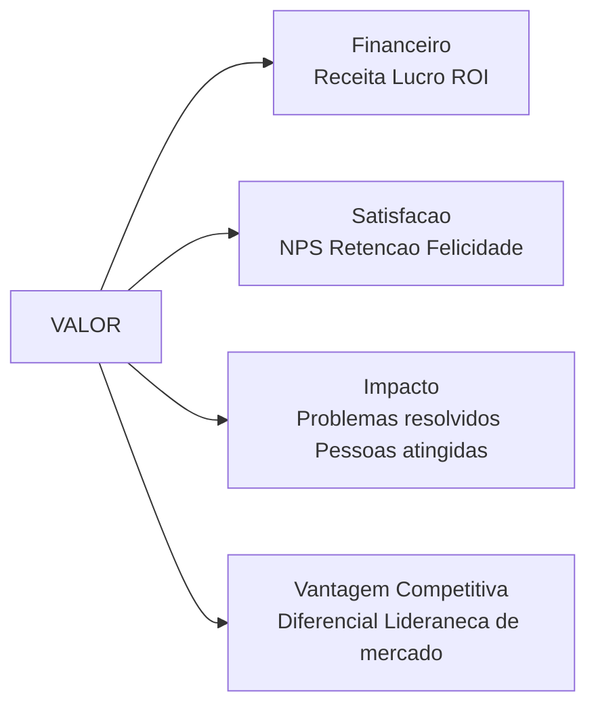
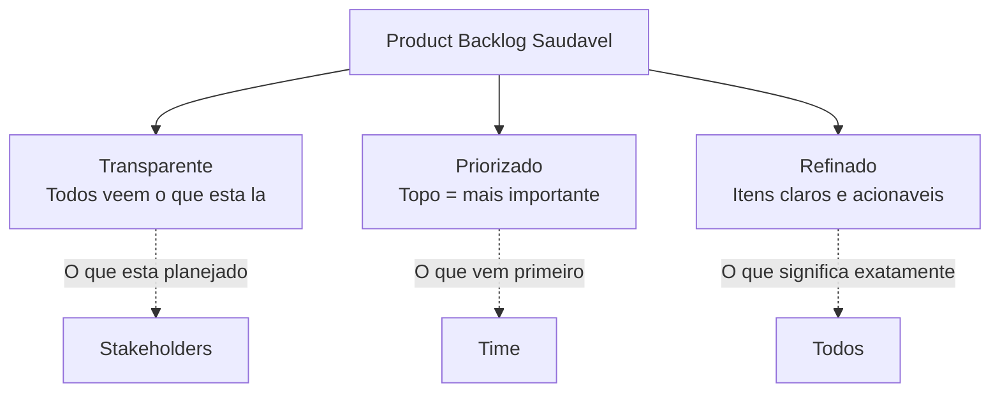
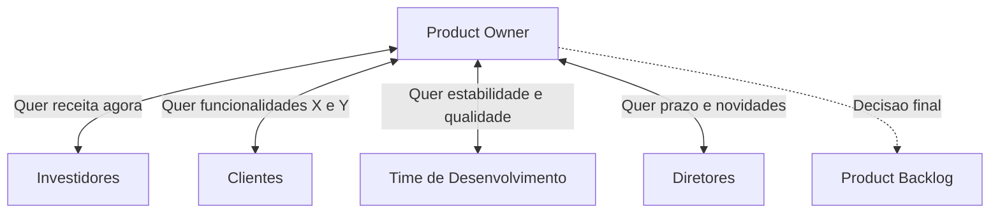
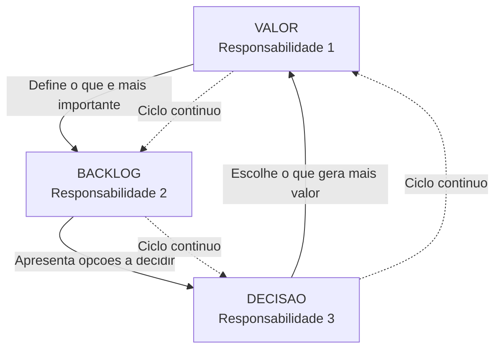

# Product Owner — Do Zero ao PO com Agentes — Aula 03

## As 3 Responsabilidades do Product Owner

**Duração estimada:** 50 minutos (35 de leitura + 15 de prática)
**Nível:** Iniciante
**Pré-requisitos:** Aula 01 — "Afinal, o que é um Product Owner?" e Aula 02 — "Scrum em 15 Minutos"

---

## Objetivos de Aprendizagem

Ao final desta aula, você será capaz de:

- [ ] **Explicar** por que o PO não é um "escriturário do backlog" e sim o responsável pelo valor do produto
- [ ] **Definir** valor de produto em 4 dimensões (financeiro, satisfação, impacto, vantagem competitiva) e dar exemplos de cada uma
- [ ] **Descrever** as 3 qualidades essenciais de um Product Backlog saudável (transparente, priorizado, refinado)
- [ ] **Explicar** o ciclo de refinamento contínuo do backlog (adicionar, remover, detalhar, reordenar)
- [ ] **Distinguir** entre decisões de O QUE entra e O QUE fica de fora do produto, e como o PO decide baseado em dados
- [ ] **Analisar** cenários de trade-off onde o PO precisa escolher entre duas funcionalidades concorrentes com base em valor
- [ ] **Aplicar** as 3 responsabilidades em situações reais do NutriExpress, priorizando demandas conflitantes
- [ ] **Diagnosticar** qual das 3 responsabilidades um PO negligenciou em um cenário de falha de produto
- [ ] **Descrever** o ciclo das 3 engrenagens (Valor → Backlog → Decisão → Valor) e o que acontece quando uma engrenagem para

---

## Como Usar Esta Aula

Esta aula está organizada em duas partes. A **primeira parte** constrói os fundamentos das 3 responsabilidades centrais do Product Owner — maximizar valor, gerenciar o backlog e tomar decisões. A **segunda parte** aplica essas responsabilidades na prática com o NutriExpress, mostrando como elas funcionam como um sistema integrado.

Ao longo do caminho, você encontrará **Quick Checks** ao final de cada seção. Ao final, o arquivo separado **Questões de Aprendizagem** traz as tarefas de checkpoint — só avance para a Aula 04 quando conseguir completá-las por conta própria.

**Tempo estimado:** 35 minutos de leitura + 15 minutos de prática e exercícios.

## Mapa Mental

Este diagrama mostra todos os conceitos que você vai dominar nesta aula:



> *O mapa mental acima mostra a estrutura da aula. Cada ramo representa uma responsabilidade que você vai explorar do zero. Repare como as 3 responsabilidades se conectam no ciclo das engrenagens.*

---

## Recapitulação das Aulas 01 e 02

| Aula | Conceito | Onde aparece nesta aula |
|---|---|---|
| Aula 01 | **O papel do Product Owner** (o que faz e não faz) | As 3 responsabilidades detalham EXATAMENTE o que o PO faz no dia a dia |
| Aula 01 | **Analogia do chef de cozinha** | O chef decide o cardápio (valor), gerencia os ingredientes (backlog) e diz não a pratos fora do tema (decisão) |
| Aula 02 | **Os 3 artefatos do Scrum** (Product Backlog) | A Responsabilidade 2 é sobre gerenciar o Product Backlog — o principal artefato do PO |
| Aula 02 | **Sprint Review** (PO conduz e coleta feedback) | O feedback da Review realimenta todas as 3 responsabilidades — você vai ver isso no ciclo das engrenagens |

---

**FUNDAMENTOS: As 3 Responsabilidades Centrais do Product Owner**

> *Os conceitos desta seção são universais — valem para qualquer Product Owner, em qualquer empresa, com qualquer produto. Não mencionamos ferramentas, marcas ou tecnologias específicas aqui. Na segunda parte, você vai aplicar esses conceitos ao NutriExpress.*

---

## 1. Responsabilidade 1: Maximizar o Valor do Produto

Vamos direto ao ponto: o Product Owner não é um "escriturário do backlog". Ele não está ali para apenas escrever histórias, organizar listas e repassar demandas. A responsabilidade número 1 do PO é **maximizar o valor que o produto entrega**.

O Scrum Guide é claro: "O Product Owner é responsável por maximizar o valor do produto resultante do trabalho do Time de Desenvolvimento."

Isso significa que, no final do dia, a pergunta mais importante que o PO deve responder é: **"O que estamos construindo está gerando mais valor do que custa para construir?"**

### Mas o que é "valor" afinal?

Você pode estar pensando: "valor é dinheiro, certo?" Sim, parcialmente. Mas valor é muito mais do que receita.



Valor tem **quatro dimensões principais**:

**1. Valor Financeiro** — o mais óbvio. Quanto dinheiro o produto gera? Quanto custa para operar? Qual o retorno sobre o investimento (ROI)?

**2. Satisfação do Usuário** — um produto que gera receita mas deixa usuários infelizes não é sustentável. Satisfação se mede com NPS (Net Promoter Score — o quanto os clientes recomendariam o produto), taxas de retenção e feedback qualitativo.

**3. Impacto** — quantas pessoas o produto ajuda? Que problemas reais ele resolve? Um produto gratuito que melhora a vida de 1 milhão de pessoas tem alto valor de impacto, mesmo sem gerar receita direta.

**4. Vantagem Competitiva** — o produto torna a empresa mais forte no mercado? Cria barreiras para concorrentes? Abre novos mercados?

### Como o PO descobre valor?

O PO não descobre valor sentado em uma sala olhando planilhas. Ele descobre:

- **Conversando com usuários** — perguntando quais são as dores reais, o que funciona, o que não funciona
- **Observando o comportamento** — dados de uso mostram o que as pessoas REALMENTE fazem (nem sempre é o que elas DIZEM que fazem)
- **Entendendo o negócio** — quais métricas importam para a empresa? O que o conselho/diretoria está cobrando?
- **Pesquisando concorrência** — o que os concorrentes estão fazendo? Onde estão as lacunas?

### O trade-off: o coração do trabalho do PO

Aqui está a parte mais desafiadora: o PO raramente tem recursos para fazer TUDO. Ele precisa escolher.

Imagine que você é o PO de um aplicativo de delivery. Duas funcionalidades estão concorrendo:

- **Funcionalidade A:** "Pagamento com Pix" — estimativa: 2 semanas de trabalho. Aumento de receita estimado: 15%. Reduz abandono de carrinho.
- **Funcionalidade B:** "Perfil com histórico de compras" — estimativa: 3 semanas de trabalho. Aumento de retenção estimado: 10%. Melhora experiência.

Ambas são boas. Ambas geram valor. Mas o time só consegue fazer uma nas próximas 2 semanas.

**O PO decide.** E decide baseado em valor comparado. "Qual das duas gera MAIS valor para o negócio AGORA?"

Se a taxa de abandono de carrinho está altíssima, Pagamento com Pix vence. Se a retenção está caindo e os clientes estão indo para concorrentes, Perfil com Histórico vence.

> *"PO não é quem diz SIM para as melhores ideias. PO é quem diz NÃO para as boas ideias para que as MELHORES ideias sejam feitas primeiro."*

### O PO diz NÃO mais do que SIM

Isso pode soar estranho, mas um bom Product Owner recusa mais ideias do que aceita. Não porque ele é mal-humorado ou contra inovação. Porque ele sabe que cada SIM para uma funcionalidade é um NÃO para outra.

**Lembre-se:** o time de desenvolvimento tem capacidade limitada. Se eles constroem X, deixam de construir Y. O PO precisa ter clareza para defender suas escolhas.

Dizer NÃO é uma virtude, não um defeito.

### Exemplo concreto: Netflix vs. Academia

Vamos comparar dois produtos completamente diferentes para entender como o "valor" muda conforme o contexto:

**Netflix (streaming):**
- Valor financeiro: assinatura mensal, crescimento de base de assinantes
- Satisfação: catálogo variado, recomendações precisas, sem travamentos
- Vantagem competitiva: conteúdo original exclusivo, interface simples
- Decisão típica do PO: "Investimos em produzir mais séries originais OU em melhorar o algoritmo de recomendação?"

**Academia de ginástica (fisicamente):**
- Valor financeiro: mensalidades, planos anuais, taxa de matrícula
- Satisfação: equipamentos funcionando, horários flexíveis, instrutores presentes
- Impacto: saúde dos alunos, redução de sedentarismo
- Decisão típica do PO (dono da academia): "Compramos mais esteiras OU reformamos o vestiário?"

Repare: os dois vendem "bem-estar", mas os critérios de valor são completamente diferentes. A Netflix precisa de conteúdo e tecnologia. A academia precisa de equipamentos e infraestrutura. O PO de cada um desses produtos toma decisões de valor completamente diferentes.

Isso mostra que **não existe uma fórmula única de valor**. O PO precisa entender o contexto do SEU produto para decidir.

### O que NÃO é valor?

Cuidado com armadilhas comuns:

- "O CEO pediu" não é valor — é hierarquia. O PO precisa entender POR QUE o CEO pediu e se aquilo realmente gera valor
- "O concorrente tem" não é valor — é imitação. Copiar sem entender o valor por trás é desperdício
- "É legal tecnicamente" não é valor — é ego. Uma funcionalidade tecnicamente interessante que ninguém usa é prejuízo

### Quick Check 1

**1. Quais são as 4 dimensões de valor que um PO deve considerar ao priorizar uma funcionalidade?**
**Resposta:** Valor financeiro (receita, lucro), satisfação do usuário (retenção, NPS), impacto (problemas resolvidos, pessoas atingidas) e vantagem competitiva (diferencial de mercado, liderança).

**2. Por que "dizer NÃO" é uma virtude do PO e não um defeito?**
**Resposta:** Porque o time tem capacidade limitada. Cada SIM para uma funcionalidade é um NÃO para outra. O PO precisa filtrar as boas ideias para que as MELHORES sejam feitas primeiro — e isso exige recusar muitas pelo caminho.

## 2. Responsabilidade 2: Gerenciar e Refinar o Product Backlog

Você aprendeu na Aula 02 que o Product Backlog é um dos 3 artefatos do Scrum — a lista viva de tudo que o produto pode ter. Agora vamos mergulhar fundo no que significa GERENCIAR esse backlog.

A segunda responsabilidade do PO é **manter o Product Backlog saudável**. E saudável significa três coisas:



### Qualidade 1: Transparente

O backlog não é um documento secreto do PO. Ele é **visível para todos** — time de desenvolvimento, Scrum Master, stakeholders, investidores.

Transparência significa que qualquer pessoa pode:
- Ver o que está planejado para as próximas semanas
- Entender por que um item está no topo (mais valor) e outro na base (menos valor)
- Saber o que foi descartado e por quê

**Analogia:** o backlog transparente é como o cardápio de um restaurante afixado na porta. Qualquer pessoa que passa na rua pode ver o que o restaurante serve, quais são os pratos do dia e quanto custa. Nada está escondido.

Quando o backlog NÃO é transparente, o time não confia nas prioridades, os stakeholders ficam ansiosos e o PO passa metade do tempo explicando o que está acontecendo.

### Qualidade 2: Priorizado

O backlog tem uma **ordem** — e essa ordem reflete o que é mais importante primeiro. O topo do backlog é o que o time vai construir nas próximas sprints. A base são ideias que talvez nunca saiam do papel.

A priorização não é estática. Ela muda conforme o PO descobre novas informações, recebe feedback e observa o mercado.

**Regra de ouro:** todo item no backlog tem uma posição. Não existe "dois itens empatados em primeiro lugar". Alguém precisa decidir — e esse alguém é o PO.

### Qualidade 3: Refinado

Refinamento é o processo de **detalhar os itens do backlog** para que sejam claros e acionáveis. Um item refinado:

- Tem uma descrição que qualquer pessoa entende
- Tem critérios de aceitação ("o que é preciso para considerar pronto")
- É pequeno o suficiente para caber em uma Sprint (se for grande, precisa ser quebrado em partes menores)
- Tem estimativa de esforço (pelo menos uma noção de "é pequeno, médio ou grande")

### Refinamento contínuo

O backlog NUNCA está pronto. Ele é um artefato vivo — como uma planta que precisa ser regada todos os dias.

O refinamento acontece em ciclos:

```
Adicionar novos itens (ideias, feedback, descobertas)
      ↓
Remover itens obsoletos (o que perdeu valor)
      ↓
Detalhar itens do topo (deixar prontos para próximas sprints)
      ↓
Reordenar prioridades (com base em novas informações)
      ↓
            (volta ao início — adicionar novos itens)
```

**O PO não refina o backlog sozinho.** O time de desenvolvimento ajuda — especialmente nas estimativas de esforço e na quebra de itens grandes em menores. O Scrum Master ajuda garantindo que o tempo de refinamento seja respeitado.

### Analogia: a lista de compras da semana

Pense no backlog como a lista de compras da semana que você faz no sábado de manhã.

Você começa com itens básicos: arroz, feijão, leite, ovos. (Itens essenciais, sempre no topo.)

Depois você lembra que vai receber visitas no domingo: adiciona carne, vinho, sobremesa. (Novos itens entram conforme a necessidade.)

No mercado, você descobre que o leite está em promoção mas o feijão está caro. Você compra mais leite e adia o feijão. (Reordenar com base em novas informações.)

Na fila do caixa, você percebe que esqueceu de tirar da lista o item "farinha" que era para uma receita que você desistiu de fazer. (Remover itens obsoletos.)

O backlog funciona exatamente assim. Você começa com o essencial, ajusta conforme descobre o que precisa e nunca está "pronto" — porque a semana que vem é outro ciclo.

### Quick Check 2

**1. Quais são as 3 qualidades de um Product Backlog saudável?**
**Resposta:** Transparente (visível para todos), priorizado (topo = mais importante, base = menos urgente) e refinado (itens claros, acionáveis, com critérios de aceitação).

**2. O PO refina o backlog sozinho?**
**Resposta:** Não. O time de desenvolvimento ajuda com estimativas e na quebra de itens grandes. O Scrum Master ajuda garantindo tempo para refinamento. O PO é o RESPONSÁVEL pelo backlog, mas não faz tudo sozinho.

## 3. Responsabilidade 3: Tomar Decisões e Dizer "Não"

A terceira responsabilidade do PO é, de longe, a mais difícil: **tomar decisões e dizer não.**

Você já viu nas responsabilidades 1 e 2 que o PO define valor e gerencia o backlog. Mas entre saber o que é valioso e manter um backlog priorizado, existe um abismo: as **decisões difíceis**.

### O PO decide sozinho — e com responsabilidade

O Scrum Guide é claro: "Ninguém pode dizer ao Time de Desenvolvimento para trabalhar em um conjunto diferente de requisitos" além do Product Owner. Isso significa que a **palavra final sobre o que entra e o que fica de fora é do PO**.

Isso não significa que o PO é um ditador. Ele escuta:
- **Usuários** — "essa funcionalidade resolve meu problema?"
- **Time de desenvolvimento** — "isso é tecnicamente viável? Quanto esforço?"
- **Stakeholders** — "isso atende aos objetivos do negócio?"
- **Scrum Master** — "essa decisão é consistente com o processo?"

Mas no final, QUEM DECIDE é o PO.

### Decisões baseadas em dados, não em hierarquia

A maior armadilha de um PO iniciante é tomar decisões baseado em **quem pediu** em vez de **qual o valor**.

"O CEO pediu, então é prioridade" é uma armadilha clássica. O CEO pode até ter boas intenções, mas ele não está no dia a dia do produto como o PO está. O trabalho do PO é:

1. **Entender o PORQUÊ** do pedido do CEO (qual problema ele quer resolver?)
2. **Validar** se aquele pedido realmente gera valor para o produto
3. **Apresentar dados** que sustentam a decisão (ou uma alternativa melhor)

Veja um exemplo:

**Cenário:** O CEO pede: "Quero um chat interno no app para os clientes falarem com nutricionistas."

O PO poderia simplesmente dizer "sim, senhor" e colocar na Sprint. Em vez disso, ele faz:

1. Pergunta ao CEO: "Que problema você quer resolver com isso?"
2. CEO responde: "Os clientes estão cancelando porque não têm suporte nutricional rápido"
3. PO investiga: descobre que 60% dos cancelamentos acontecem na primeira semana — clientes não sabem montar o cardápio
4. PO propõe alternativa: "E se em vez de um chat (que leva 4 semanas), criarmos uma seção de 'Dicas rápidas' na tela inicial (1 semana) e um FAQ com perguntas frequentes?"
5. CEO concorda. Problema resolvido em 1/4 do tempo.

O PO usou **dados** (60% dos cancelamentos), não **hierarquia** (o CEO mandou), para tomar uma decisão melhor.

### Responsabilidade pelo resultado

Aqui vai uma verdade dura: se o produto falhar, a responsabilidade é do PO.

- O time construiu errado? O PO não especificou direito ou não inspecionou o incremento.
- A funcionalidade não gerou valor? O PO priorizou errado.
- Ninguém usou o que foi construído? O PO não validou com usuários antes.

Claro que existem fatores externos, mas o Scrum coloca o PO como o **principal responsável pelo sucesso ou fracasso do produto**. É um peso grande, e é por isso que o papel exige maturidade para tomar decisões.

### Como lidar com pressão de múltiplos stakeholders

Na vida real, o PO recebe pressão de todos os lados:



Cada stakeholder puxa para um lado. O investidor quer receita. O cliente quer funcionalidades. O time quer qualidade técnica. O diretor quer prazo.

O PO é a pessoa que **equilibra todas essas forças** e toma a decisão que gera o maior valor possível com os recursos disponíveis.

### Analogia: o PO como juiz de futebol

Pense em um juiz de futebol durante uma partida decisiva.

- A torcida do time A grita que foi pênalti
- A torcida do time B grita que foi simulação
- O técnico do time A reclama na beira do campo
- O técnico do time B reclama também
- Os jogadores de ambos os times cercam o juiz

O juiz olha para a jogada, aplica as regras e apita. Pró-n, a favor do time A, contra o time B — não importa. A decisão é DELE. Ele pode estar errado? Sim. Mas a autoridade é dele. E se ele não apitar, o jogo não anda.

O PO é exatamente assim. Os stakeholders torcem, pressionam, reclamam. Mas a decisão final sobre o que entra no produto é do PO. Se ele não decide, o backlog trava, o time não sabe o que fazer e o produto não anda.

> *Ser PO é aceitar que você vai desagradar pessoas. Não porque você quer, mas porque seu papel exige que você tome decisões que nem todo mundo vai gostar.*

### Quick Check 3

**1. O CEO pede uma funcionalidade urgente. O PO deve implementar imediatamente?**
**Resposta:** Não necessariamente. O PO deve entender o PORQUÊ do pedido, investigar se aquilo realmente gera valor e, se for o caso, propor alternativas melhores. Decisões devem ser baseadas em dados, não em hierarquia.

**2. Na analogia do juiz de futebol, o que acontece quando o PO se recusa a decidir?**
**Resposta:** O backlog trava, o time não sabe o que priorizar, o produto não anda e os stakeholders entram em conflito. Assim como o juiz precisa apitar para o jogo andar, o PO precisa decidir para o produto avançar.

---

**APLICAÇÃO: As 3 Responsabilidades no NutriExpress**

> *Agora que você entende as 3 responsabilidades do PO em teoria — maximizar valor, gerenciar backlog e tomar decisões — vamos aplicá-las ao NutriExpress. Você vai ver como cada responsabilidade se materializa em situações reais do produto.*
> *Na Aula 01 você conheceu o NutriExpress e seus stakeholders. Na Aula 02 você montou o framework Scrum. Agora você vai agir como PO de verdade.*

---

## 4. Aplicando no NutriExpress — Você é o PO

Bem-vindo ao seu primeiro dia como Product Owner do NutriExpress. Nas seções anteriores, você aprendeu as 3 responsabilidades em teoria. Agora é hora de **colocar a mão na massa**.

### Responsabilidade 1 em ação: Qual funcionalidade gera MAIS valor?

O NutriExpress está começando. O time de desenvolvimento está pronto para trabalhar. Você precisa decidir qual funcionalidade construir primeiro.

Três candidatas estão concorrendo:

| Funcionalidade | Esforço (semanas) | Stakeholders beneficiados | Impacto estimado |
|---|---|---|---|
| **Cadastro de nutricionistas** | 2 | Nutricionistas, clientes | Sem nutricionistas, não há cardápios. Base do produto. |
| **Sistema de entregas** | 4 | Clientes, entregadores | Essencial para operação, mas mais complexo |
| **Recomendações por IA** | 6 | Clientes | Legal, mas ninguém pediu — você ACHA que seria bom |

**Sua decisão como PO:**

Se você colocar Recomendações por IA primeiro, vai gastar 6 semanas construindo algo que ninguém pediu — enquanto nutricionistas e clientes esperam. Isso é a armadilha do "legal tecnicamente".

Se você colocar Sistema de Entregas primeiro, vai ter rotas otimizadas, mas nenhum restaurante ou nutricionista cadastrado para entregar alguma coisa.

A escolha com MAIOR valor é o **Cadastro de nutricionistas**. É a base. Sem nutricionistas, não há cardápios. Sem cardápios, não há marmitas. Sem marmitas, não há entregas.

> *Pausa para refletir: você pode ter pensado "mas sistema de entregas é essencial!" E é. Mas a pergunta não é "isso é essencial?" — é "o que gera MAIS valor AGORA?" O sistema de entregas vem depois. Não é sobre escolher entre certo e errado, é sobre escolher a ordem que maximiza o valor total.*

### Responsabilidade 2 em ação: Refinando o backlog com o time

Cenário: o backlog do NutriExpress tem 15 itens.

Você (PO) convoca uma sessão de refinamento com o time de desenvolvimento. A pauta é detalhar os itens do topo.

**Como funciona na prática:**

PO: "Pessoal, os itens do topo do backlog são: cadastro de nutricionistas, perfil do restaurante e busca de marmitas. Precisamos detalhar cada um para as próximas sprints."

Time: "O cadastro de nutricionista parece grande demais. O que exatamente o nutricionista precisa fazer?"

PO: "Boa pergunta. Vamos quebrar em partes: (a) criar conta, (b) preencher perfil profissional, (c) criar cardápios semanais, (d) definir restrições alimentares."

Time: "Ótimo. 'Criar conta' é pequeno — 2 dias. 'Criar cardápios semanais' é mais complexo — umas 2 semanas. Vamos separar."

Resultado: um item grande virou 4 itens menores, cada um com estimativa clara e critérios de aceitação.

**O PO não faz isso sozinho.** O time ajuda a quebrar, estimar e identificar riscos. O PO garante que o valor de cada item está claro.

### Responsabilidade 3 em ação: A decisão difícil

Agora o cenário mais realista e mais difícil.

O NutriExpress já está funcionando com o cadastro básico. Chegou a hora de decidir o próximo grande investimento. Duas opções:

**Opção A: Investir em IA de recomendações**
- O que faz: sugere marmitas baseadas no histórico e preferências do cliente
- Esforço: 6 semanas de desenvolvimento
- Impacto estimado: aumento de 20% no ticket médio
- Risco: complexidade técnica alta, pode atrasar

**Opção B: Investir em logística própria**
- O que faz: frota própria de entregadores, rastreamento em tempo real
- Esforço: 4 semanas de desenvolvimento + investimento operacional
- Impacto estimado: redução de 30% no prazo de entrega
- Risco: custo operacional alto, mas controle total da experiência

Os **investidores** querem a IA (maior margem, mais receita por cliente). Os **clientes** reclamam de demora na entrega (suporte logística). O **time** acha a IA mais desafiadora tecnicamente (mais divertido de construir).

**Qual você escolhe como PO?**

Não existe resposta certa absoluta — depende dos dados que o PO tem. Mas o processo de decisão é:

1. **Dados de uso:** quantos clientes reclamam de entrega? Qual a taxa de abandono por prazo?
2. **Dados financeiros:** qual o custo de cada opção vs. retorno estimado?
3. **Viabilidade técnica:** o time realmente consegue entregar a IA em 6 semanas?
4. **Alinhamento com visão:** o que é mais estratégico para o NutriExpress AGORA?

Se 70% dos cancelamentos são por entrega lenta, a resposta é logística. Se as entregas estão boas mas o ticket médio é baixo, a resposta é IA.

**O PO decide com base nos dados que ELE buscou.**

### Mão na Massa — Você Decide

Você é o PO do NutriExpress. Hoje de manhã, você recebeu:

- **3 pedidos do investidor:** "Quero o sistema de recomendações por IA funcionando no próximo mês"
- **2 reclamações de usuários:** "A entrega demora demais, já estou pensando em cancelar"
- **1 sugestão do time:** "E se a gente criar um programa de fidelidade? Pontos que viram descontos"

Seu time consegue entregar 2 semanas de trabalho por Sprint.

**O que você faz primeiro? Priorize e justifique.**

**Sua resposta deve considerar:**

1. Qual stakeholder está com a maior dor?
2. Qual funcionalidade gera mais valor URGENTE?
3. O que você diz NÃO para poder dizer SIM ao que é mais importante?

Pense. Decida. Anote suas respostas. Você vai usar este exercício nas Questões de Aprendizagem.

**Gabarito (referência — não existe única resposta certa):**

O mais provável é priorizar as reclamações dos usuários sobre entrega. Por quê?
- Clientes insatisfeitos = churn (cancelamentos) = perda de receita
- O investidor quer IA, mas sem clientes não há receita para investir em IA
- O programa de fidelidade pode entrar depois, como forma de reter os clientes que estão quase cancelando

Ordem sugerida:
1. **Diagnosticar o problema de entrega** (1-2 dias de pesquisa com usuários + dados)
2. **Melhoria na logística** (prioridade na Sprint atual)
3. **Explicar ao investidor** com dados: "estamos perdendo clientes por entrega lenta. Vamos resolver isso primeiro para ter base saudável para a IA"
4. **Programa de fidelidade** entra como item de backlog para Sprint futura

### Quick Check 4

**1. No cenário do NutriExpress, por que o Cadastro de Nutricionistas tem mais valor inicial que o Sistema de Entregas?**
**Resposta:** Porque sem nutricionistas cadastrados, não há cardápios, não há marmitas, não há o que entregar. O cadastro de nutricionistas é a base que viabiliza TUDO o resto. É o item de maior valor porque desbloqueia os demais.

**2. O investidor pediu IA de recomendações em 1 mês. O PO descobre que 70% dos cancelamentos são por entrega lenta. O que o PO deve fazer?**
**Resposta:** O PO deve priorizar a logística (a maior dor dos usuários), explicar ao investidor com dados que a entrega lenta está matando o negócio e negociar um prazo realista para a IA. Decisão baseada em dados, não em hierarquia.

## 5. O Ciclo das 3 Engrenagens

Você aprendeu as 3 responsabilidades separadamente. Mas aqui está o segredo que muitos POs iniciantes demoram para entender: **elas não são independentes. Elas formam um sistema.**



### Como as engrenagens se conectam

**Engrenagem 1 — Valor → Backlog:** O PO descobre o que é mais valioso para o produto e coloca esses itens no topo do backlog.

**Engrenagem 2 — Backlog → Decisão:** Com o backlog priorizado, o PO enfrenta decisões: "temos 3 itens no topo, mas o time só consegue entregar 1 nesta Sprint. Qual escolhemos?"

**Engrenagem 3 — Decisão → Valor:** A decisão gera um novo incremento de valor. O feedback desse incremento realimenta a Engrenagem 1 — "o que os usuários acharam? O que aprendemos?"

### O que acontece se uma engrenagem quebra?

Como em qualquer sistema, se uma engrenagem para, o sistema inteiro trava.

| Engrenagem quebrada | Sintomas | Resultado |
|---|---|---|
| **Valor (Resp. 1)** | PO prioriza baseado em "quem pediu" ou "achismo". Itens sem valor claro entram no backlog | Produto vira colcha de retalhos. Ninguém sabe por que as coisas estão sendo construídas |
| **Backlog (Resp. 2)** | Backlog desorganizado, itens gigantes e vagos. Time não sabe o que fazer | Time fica ocioso ou constrói a coisa errada. Stakeholders perdem a confiança |
| **Decisão (Resp. 3)** | PO não decide. "Tudo é prioridade". Stakeholders pressionam, time trava | Produto não avança. Time desmotivado. Stakeholders brigam entre si |

### Exemplo do NutriExpress com engrenagem quebrada

Imagine que o PO do NutriExpress negligencia a Responsabilidade 2 (backlog):

1. O backlog fica desatualizado — ninguém sabe o que está planejado
2. O time de desenvolvimento perde tempo perguntando "o que eu faço agora?"
3. Os stakeholders descobrem que itens importantes sumiram do backlog
4. O PO é forçado a tomar decisões de última hora (Responsabilidade 3 falha)
5. As decisões de última hora geram pouco valor (Responsabilidade 1 falha)
6. Produto estagnado. Stakeholders insatisfeitos. Time frustrado.

Tudo porque UMA engrenagem parou.

### A dança das 3 responsabilidades

O trabalho do PO é um ciclo contínuo:

**SEGUNDA-FEIRA:** Você descobre com usuários que o filtro por preço é a maior dor deles. (Valor)
**TERÇA-FEIRA:** Você adiciona "filtro por preço" no topo do backlog e detalha com o time. (Backlog)
**QUARTA-FEIRA:** No Sprint Planning, o time pode fazer filtro por preço OU correção de bugs. Você decide: filtro por preço porque os dados mostram que 40% dos usuários desistem por falta dele. (Decisão)
**QUINTA-FEIRA:** A Sprint começa. O time constrói.
**SEXTA-FEIRA (2 semanas depois):** Na Sprint Review, os usuários veem o filtro e amam. Mas pedem: "e se pudesse filtrar por nota também?" (Novo Valor → novo ciclo)

Percebeu? As 3 responsabilidades se alternam o tempo todo. O PO não "faz a número 1 por um mês e depois a número 2". Ele faz as três simultaneamente, em ciclos que podem durar horas ou dias.

> *Ser PO é como pilotar um helicóptero: você precisa ajustar altitude, direção e velocidade AO MESMO TEMPO. Se você focar só em uma coisa, o helicóptero cai.*

### Quick Check 5

**1. O ciclo completo das 3 engrenagens é: Valor → Backlog → Decisão → Valor. Explique com suas palavras.**
**Resposta:** O PO descobre o que tem mais valor (1) e coloca no backlog priorizado (2). Depois decide qual item será construído (3). A construção gera um incremento que, quando avaliado, produz novo aprendizado sobre valor — realimentando o ciclo. É um loop contínuo.

**2. O que acontece se o PO negligencia a Responsabilidade 2 (gerenciar backlog)?**
**Resposta:** O backlog fica desorganizado, o time não sabe o que fazer, as decisões são tomadas às pressas e o valor entregue cai. Uma engrenagem quebrada quebra o sistema inteiro — as outras responsabilidades também sofrem.

---

## Autoavaliação: Quiz Rápido

Teste seu conhecimento com estas 7 perguntas. Tente responder antes de consultar o gabarito.

**1. Qual das alternativas abaixo NÃO é uma dimensão de valor que o PO deve considerar?**
a) Valor financeiro (receita, lucro, ROI)
b) Satisfação do usuário (NPS, retenção)
c) Complexidade técnica da implementação
d) Vantagem competitiva (diferencial de mercado)
**Resposta:**

Alternativa C. Complexidade técnica é um fator de ESFORÇO, não de valor. O PO considera esforço junto com valor, mas complexidade técnica sozinha não é uma dimensão de valor.

**2. O que significa um Product Backlog "transparente"?**
**Resposta:**

Significa que qualquer pessoa (time, stakeholders, investidores) pode ver o que está no backlog, em que ordem e por quê. Não é um documento secreto do PO.

**3. O PO está refinando o backlog com o time. O time diz: "esse item é muito grande, não cabe em uma Sprint." O que o PO faz?**
**Resposta:**

O PO quebra o item grande em partes menores, com a ajuda do time. Cada parte vira um novo item do backlog, com estimativa e critérios de aceitação próprios.

**4. Um stakeholder importante pressiona o PO para colocar uma funcionalidade no topo do backlog. O PO analisa e descobre que a funcionalidade não gera valor significativo. O que o PO deve fazer?**
**Resposta:**

O PO deve explicar com dados por que a funcionalidade não é prioritária e, se possível, propor alternativas que gerem mais valor. A decisão final é do PO, baseada em dados, não em hierarquia.

**5. Qual das situações abaixo é exemplo da Responsabilidade 3 (tomar decisões e dizer não)?**
a) Adicionar 5 novos itens ao backlog
b) Explicar ao investidor por que a IA de recomendações não é prioridade agora
c) Detalhar os critérios de aceitação do cadastro de nutricionistas
d) Convidar stakeholders para a Sprint Review
**Resposta:**

Alternativa B. Dizer "não" (ou "não agora") para um stakeholder, baseado em dados e valor, é a essência da Responsabilidade 3.

**6. O ciclo das engrenagens Valor → Backlog → Decisão → Valor é...**
a) Uma sequência que o PO faz uma vez por mês
b) Um ciclo contínuo que o PO opera diariamente
c) Uma metáfora sem aplicação prática
d) Um processo que só funciona em empresas grandes
**Resposta:**

Alternativa B. As 3 responsabilidades formam um ciclo contínuo que o PO opera todos os dias — descobrindo valor, atualizando o backlog e tomando decisões em loop.

**7. No cenário do NutriExpress, o investidor quer IA, os clientes querem entrega rápida e o time quer fidelidade. O PO decide pela logística. O que ele está usando para tomar essa decisão?**
a) Hierarquia (quem tem mais poder)
b) Dados (o que as métricas mostram)
c) Achismo (o que ele acha legal)
d) Sorteio (quem pediu primeiro)
**Resposta:**

Alternativa B. O PO usa dados — taxas de cancelamento, reclamações de usuários, impacto financeiro — para decidir qual funcionalidade gera mais valor no momento.

---

## Mão na Massa: Exercícios Graduados

### Exercício 1 (Fácil) — Classificando Responsabilidades

Abaixo estão 6 situações do dia a dia de um Product Owner. Classifique cada uma como:

- **R1** (Responsabilidade 1 — maximizar valor)
- **R2** (Responsabilidade 2 — gerenciar backlog)
- **R3** (Responsabilidade 3 — tomar decisões e dizer não)

a) O PO passa a manhã entrevistando 3 clientes que cancelaram o plano para entender o motivo
b) O PO adiciona uma sugestão do time ao backlog e estima com eles o esforço
c) O PO diz ao investidor: "entendo seu pedido, mas os dados mostram que a prioridade agora é reduzir o churn"
d) O PO remove 2 itens obsoletos do backlog que perderam relevância
e) O PO analisa dados de uso e descobre que 80% dos usuários só usam 2 das 10 funcionalidades do app
f) No Sprint Planning, o time pode fazer a funcionalidade A, B ou C (mas não todas). O PO escolhe a A.

**Gabarito:**

a) **R1** — o PO está investigando valor: por que os clientes cancelam? O que falta no produto que geraria mais retenção?
b) **R2** — adicionar itens ao backlog e estimar com o time é refinamento de backlog
c) **R3** — dizer "não" (ou "não agora") a um stakeholder com base em dados é a essência da tomada de decisão
d) **R2** — remover itens obsoletos é parte do refinamento contínuo do backlog
e) **R1** — analisar dados de uso para entender onde está (e onde não está) o valor do produto
f) **R3** — escolher entre opções conflitantes com recursos limitados é decisão do PO

---

### Exercício 2 (Médio) — Cenário de Trade-off

Você é o PO de um aplicativo de receitas culinárias (tipo Tasty ou Panelinha). O produto tem 50 mil usuários ativos e cresce 10% ao mês.

Você recebeu duas demandas urgentes:

**Demanda A (do time de marketing):** "Precisamos de um perfil de usuário com foto, bio e seguidores — estilo rede social. Isso vai aumentar o engajamento em 40%."

**Demanda B (do suporte ao cliente):** "Os usuários estão reclamando que não conseguem salvar receitas favoritas sem criar uma conta. 30% dos novos usuários desistem no cadastro. Precisamos de um modo 'visitante' que permita salvar receitas localmente."

O time de desenvolvimento consegue entregar APENAS UMA demanda nos próximos 15 dias (próxima Sprint).

**Responda:**

1. Qual demanda você escolheria e por quê?
2. Que dados você buscaria antes de decidir?
3. Como você comunicaria sua decisão para o outro stakeholder (o que ficou de fora)?
4. Qual(is) responsabilidade(s) você está exercendo ao tomar essa decisão?

**Gabarito:**

**1. Qual demanda escolher:**
Não existe resposta única, mas vamos analisar:

- **Demanda A (rede social):** Aumento de engajamento de 40% é tentador, mas é uma ESTIMATIVA de marketing — não um dado real. Além disso, perfil com seguidores é complexo (várias semanas).
- **Demanda B (modo visitante):** 30% dos novos usuários desistem no cadastro. Isso é um DADO CONCRETO. Reduzir atrito no cadastro é resolver a causa raiz da perda de usuários.

A escolha mais alinhada com dados é a **Demanda B**. Primeiro resolva o problema real (perda de usuários), depois pense em engajamento.

**2. Dados a buscar antes de decidir:**
- Qual a taxa de conversão atual (visitante → cadastro)?
- Quanto tempo leva o cadastro atual?
- Quantos usuários que desistiram voltaram depois?
- Qual o custo de adquirir um novo usuário vs. reter um existente?

**3. Como comunicar para marketing:**
"Entendo o pedido de perfil social e sei que pode aumentar engajamento. No entanto, estamos perdendo 30% dos novos usuários no cadastro — primeiro precisamos resolver isso. Depois que o modo visitante estiver no ar e estável, vamos planejar o perfil social para uma Sprint futura. Aqui estão os dados que mostram por que essa ordem faz sentido."

**4. Responsabilidades exercidas:**
- **R1 (valor):** Você analisou qual demanda gera mais valor com base em dados reais (30% de desistência)
- **R3 (decisão):** Você escolheu UMA demanda em detrimento da outra e comunicou a decisão

---

### Desafio (Difícil) — Diagnóstico: Qual Responsabilidade o PO Negligenciou?

Leia o cenário abaixo e responda:

*O produto é um app de gestão financeira pessoal. O PO está há 3 meses no cargo.*

*Mês 1: O PO conversou com 20 usuários e descobriu que a funcionalidade mais desejada é "categorização automática de gastos por IA". Ele coloca no topo do backlog.*

*Mês 2: O backlog tem 45 itens. Nenhum item foi removido desde o início. Os 10 itens do topo estão detalhados, mas os 35 de baixo são apenas títulos vagos como "melhorar performance" e "deixar mais bonito". O time reclama que não sabe o que fazer quando termina os itens da Sprint — porque os próximos itens no backlog são vagos demais.*

*Mês 3: O CEO pede uma reunião urgente. A receita caiu 20%. O PO descobre que um concorrente lançou uma funcionalidade de "investimentos automáticos" que está roubando clientes. O concorrente tinha essa funcionalidade no backlog do app financeiro desde o mês 1 — estava lá, enterrado na posição 32, como "futuro: investimentos".*

**Perguntas:**

a) Qual(is) responsabilidade(s) o PO negligenciou? Identifique com R1, R2 ou R3 e justifique.
b) O que o PO deveria ter feito diferente em cada mês?
c) Qual engrenagem do ciclo quebrou primeiro? Qual foi o efeito dominó?

**Gabarito:**

**a) Responsabilidades negligenciadas:**

**R2 (gerenciar backlog) — a principal falha.** O backlog tinha 45 itens, mas os 35 de baixo eram vagos e nunca revisados. O item "futuro: investimentos" estava enterrado na posição 32 — ninguém sabia que ele estava lá. Um backlog saudável é transparente, priorizado E refinado. Esse backlog não era nem transparente (item enterrado) nem refinado (abaixo do topo, só títulos vagos).

**R3 (tomar decisões) — falha secundária.** O PO deveria ter periodicamente reavaliado o backlog inteiro, não apenas o topo. Decidir o que REMOVER ou REORDENAR também é decisão. O PO não decidiu — deixou o backlog acumular.

**R1 (valor) — não foi negligenciada no mês 1, mas o efeito dominó chegou nela no mês 3.** No início, o PO descobriu valor (categorização automática). Mas ao negligenciar o backlog, ele perdeu a visão do valor geral do produto.

**b) O que deveria ter feito diferente:**

**Mês 1:** Além de colocar "categorização automática" no topo, deveria ter revisado TODO o backlog e identificado itens importantes que estavam soterrados.

**Mês 2:** Sessão de refinamento com o time para detalhar TODOS os itens principais, não apenas os do topo. Remover itens obsoletos. Reordenar com base em novas informações de mercado.

**Mês 3 (antes da crise):** O PO deveria estar monitorando a concorrência (R1) e atualizando o backlog com base nisso. Se o concorrente estava desenvolvendo investimentos automáticos, o PO deveria ter movido esse item para o topo antes da crise.

**c) Engrenagem quebrada e efeito dominó:**

**A engrenagem quebrou na R2 (backlog).** O backlog parou de ser atualizado — itens novos entravam, mas os antigos não eram revisados, detalhados ou removidos. Com o backlog desorganizado, a R3 (decisão) ficou cega — o PO não tinha visibilidade para tomar boas decisões. Com decisões cegas, a R1 (valor) foi comprometida — o produto perdeu mercado para o concorrente.

**Sequência do colapso:** R2 falha → R3 falha → R1 falha → produto em crise.

---

## Resumo da Aula

### Os Conceitos Fundamentais

1. **Responsabilidade 1 — Maximizar Valor:** O PO é responsável por garantir que o time construa o que gera MAIS valor. Valor tem 4 dimensões: financeiro, satisfação, impacto e vantagem competitiva. O PO descobre valor conversando, observando e analisando dados.

2. **Responsabilidade 2 — Gerenciar Backlog:** O Product Backlog é a principal ferramenta do PO. Três qualidades essenciais: transparente, priorizado e refinado. O backlog nunca está pronto — é refinado continuamente com ajuda do time.

3. **Responsabilidade 3 — Tomar Decisões e Dizer "Não":** O PO tem a palavra final sobre o que entra e o que fica de fora. Decisões baseadas em dados, não em hierarquia. O PO é responsável pelo resultado — se falha, a responsabilidade é dele.

4. **O PO diz NÃO mais do que SIM:** Dizer não para boas ideias é necessário para que as MELHORES ideias sejam executadas.

5. **Ciclo das Engrenagens:** Valor → Backlog → Decisão → Valor. As 3 responsabilidades formam um sistema. Se uma engrenagem para, o sistema inteiro quebra.

6. **O PO não faz nada sozinho:** O time ajuda no refinamento. Os stakeholders fornecem dados. Mas a decisão final é sempre do PO.

### O Que Você Aprendeu Hoje

- [x] Entendeu que o PO não é um "escriturário" — ele é responsável pelo valor do produto
- [x] Sabe que valor tem 4 dimensões e como descobrir cada uma
- [x] Conhece as 3 qualidades de um Product Backlog saudável
- [x] Entende o refinamento contínuo como ciclo: adicionar, remover, detalhar, reordenar
- [x] Sabe que a decisão final é do PO, baseada em dados
- [x] Consegue analisar trade-offs e escolher a opção de maior valor
- [x] Entende o ciclo das 3 engrenagens e o que acontece quando uma falha
- [x] Sabe aplicar as 3 responsabilidades ao NutriExpress

---

## Próxima Aula

**Aula 04: PO não é PM, não é Chefe**

Agora que você domina as 3 responsabilidades do PO, está na hora de entender o que o PO NÃO É. Muita gente confunde Product Owner com Product Manager, com Scrum Master, com Gerente de Projetos — e essa confusão gera atritos, decisões erradas e produtos fracos. A Aula 04 vai blindar você contra esses equívocos.

Prepare-se para descobrir onde termina o papel do PO e onde começam os outros papéis.

---

## Referências

### Documentação Oficial

- [Scrum Guide 2020](https://scrumguides.org/scrum-guide.html) — leia a seção do Product Owner. O guia oficial descreve as responsabilidades do PO em apenas algumas linhas — mas cada linha pesa uma tonelada.

### Leitura Complementar

- **INSPIRED: How to Create Tech Products Customers Love**, de Marty Cagan — o capítulo sobre "Product Owner vs. Product Manager" expande as responsabilidades do PO no contexto de produto.
- **Escaping the Build Trap**, de Melissa Perri — livro essencial sobre como POs caem na armadilha de construir funcionalidades sem valor. Leitura obrigatória sobre a Responsabilidade 1.

### Artigos para Aprofundamento

- [What is a Product Owner?](https://www.scrum.org/resources/what-is-a-product-owner) — artigo oficial do Scrum.org
- [Product Backlog Refinement](https://www.scrum.org/resources/what-is-product-backlog-refinement) — entenda o refinamento em detalhes
- [The Art of Saying No as a Product Owner](https://www.scrum.org/resources/blog/art-saying-no-product-owner) — sobre a Responsabilidade 3

---

## FAQ

**P: O PO pode delegar a decisão para o time?**
R: Pode ESCUTAR o time (e deve), mas a decisão FINAL é do PO. O Scrum é claro: a responsabilidade pelo backlog e pelo valor do produto é exclusiva do PO. Delegar a decisão sem supervisão é abdicar da responsabilidade.

**P: E se o backlog tiver 500 itens?**
R: Backlogs gigantes são sintoma de falta de refinamento. Itens na base do backlog (prioridade baixa) devem ser mantidos como "hold" ou descartados. Um backlog saudável tem itens detalhados no topo e apenas títulos/ideias na base. Se tem 500 itens, 450 provavelmente nunca serão feitos — vale uma limpeza.

**P: O que é mais importante: valor ou backlog?**
R: É uma pergunta enganosa porque as duas são interdependentes. Sem valor, o backlog é uma lista sem sentido. Sem backlog, o valor não se materializa em trabalho. É como perguntar "o que é mais importante no carro: o motor ou as rodas?" — os dois precisam funcionar juntos.

**P: Como lidar com um CEO que insiste em uma funcionalidade de baixo valor?**
R: Use dados. Mostre o impacto da funcionalidade vs. outras opções. Pergunte: "qual problema o senhor quer resolver?" e proponha alternativas. Se ainda assim o CEO insistir, documente a decisão e suas consequências previstas — sua responsabilidade é alertar, mas a palavra final pode ser dele se ele for seu chefe direto.

**P: O refinamento do backlog tem reunião fixa?**
R: No Scrum, o refinamento é contínuo, não um evento formal. Na prática, a maioria dos times reserva 1-2 horas por semana para refinamento. Não é uma cerimônia obrigatória do Scrum (como Planning ou Review), mas é essencial para manter o backlog saudável.

**P: O que fazer quando dois stakeholders importantes pedem funcionalidades opostas?**
R: Analise os dados de ambos os lados, avalie o valor de cada funcionalidade e decida com base no que é melhor para o PRODUTO (não para o stakeholder mais barulhento). Comunique a decisão com transparência e dados.

**P: O PO precisa saber programar para gerenciar o backlog?**
R: Não precisa programar, mas precisa entender o suficiente de tecnologia para saber se um item é viável ou não. A estimativa de esforço é feita PELO TIME, não pelo PO. O PO foca no VALOR, não no esforço técnico.

**P: Posso ser PO de mais de um produto ao mesmo tempo?**
R: O Scrum recomenda UM PO por produto. Na prática, POs de produtos menores podem gerenciar mais de um, mas a qualidade do trabalho cai. Cada produto demanda descoberta de valor, refinamento de backlog e decisões constantes — fazer isso para múltiplos produtos é desgastante.

**P: O que é mais importante: entregar rápido ou entregar o item certo?**
R: Entregar o item CERTO. Entregar rápido algo que ninguém quer é desperdício. Mas o ideal é entregar rápido o item certo — por isso Sprints curtas existem: você entrega valor em ciclos pequenos e ajusta o rumo com feedback rápido.

**P: Como saber se estou priorizando bem?**
R: Um bom teste: olhe para as últimas 3 Sprints. As funcionalidades entregues geraram valor real (métricas melhoraram, usuários estão satisfeitos)? Se não, sua priorização precisa de ajuste. Outro teste: você consegue explicar, em 30 segundos, por que o item do topo do backlog está lá?

**P: O backlog é do PO, mas o time pode sugerir itens?**
R: Pode e DEVE. Sugestões do time são bem-vindas porque eles estão na linha de frente da construção. Mas a decisão de incluir ou não no backlog é do PO, com base no valor que o item agrega.

---

## Glossário

| Termo | Definição |
|---|---|
| **Valor do Produto** | Benefício que o produto gera para o negócio e para os usuários — financeiro, satisfação, impacto ou vantagem competitiva. (Ver Seção 1) |
| **Trade-off** | Situação de escolha onde ganhar em um aspecto significa perder em outro — o PO vive de trade-offs. (Ver Seção 1) |
| **Product Backlog** | Lista viva e priorizada de tudo que o produto pode ter. Responsabilidade exclusiva do PO. (Ver Seção 2) |
| **Refinamento** | Processo contínuo de detalhar, estimar, reordenar e limpar itens do backlog. (Ver Seção 2) |
| **Backlog Transparente** | Backlog visível e compreensível para todos os stakeholders. (Ver Seção 2) |
| **Backlog Priorizado** | Backlog onde itens no topo são os mais importantes e itens na base os menos urgentes. (Ver Seção 2) |
| **Backlog Refinado** | Backlog com itens claros, acionáveis e com critérios de aceitação — especialmente no topo. (Ver Seção 2) |
| **Decisão Baseada em Dados** | Decisão tomada com base em evidências concretas (métricas, pesquisas, observações), não em opiniões ou hierarquia. (Ver Seção 3) |
| **Stakeholder** | Pessoa ou grupo com interesse no produto — investidores, usuários, time, diretoria. (Ver Seção 3) |
| **Ciclo das Engrenagens** | Modelo que mostra como as 3 responsabilidades do PO (Valor → Backlog → Decisão → Valor) formam um sistema interdependente. (Ver Seção 5) |
| **Churn** | Taxa de cancelamento ou abandono do produto por parte dos clientes. Alta prioridade para resolver. (Ver Seção 4) |
| **Responsabilidade do PO** | Compromisso exclusivo do Product Owner com o valor do produto, a saúde do backlog e as decisões de escopo. (Ver Seções 1-3) |
