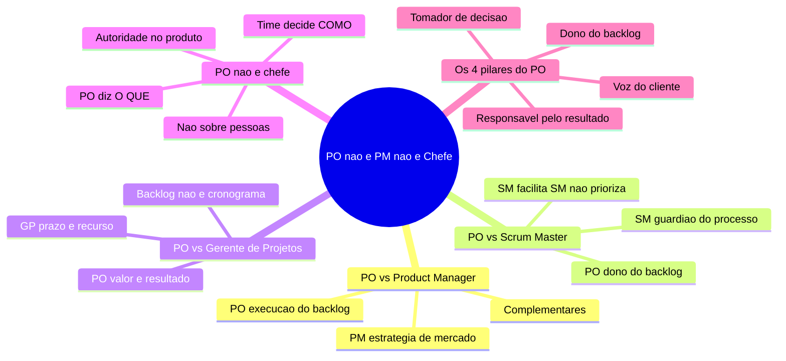
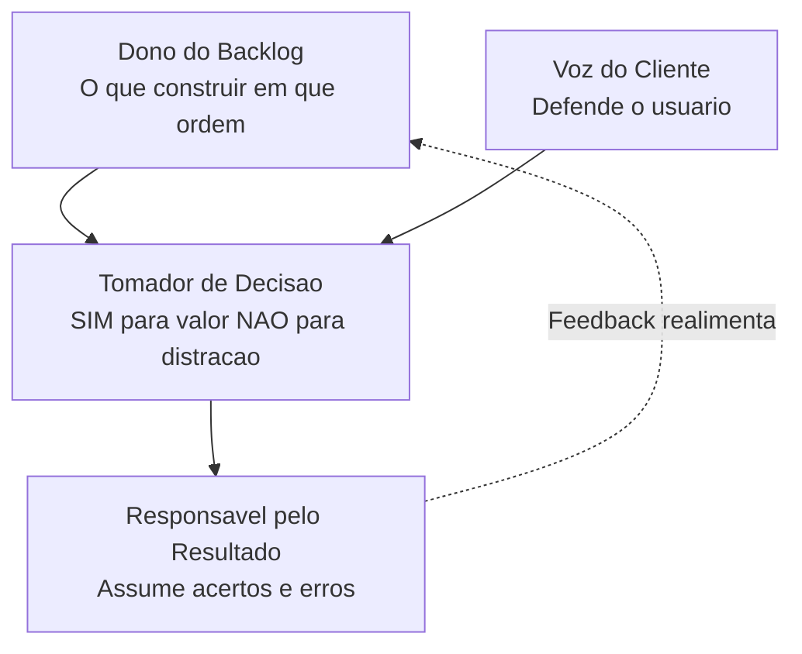

# Product Owner — Do Zero ao PO com Agentes — Aula 04

## PO não é PM, não é Chefe

**Duração estimada:** 45 minutos (30 de leitura + 15 de prática)
**Nível:** Iniciante
**Pré-requisitos:** Aula 01 — "Afinal, o que é um Product Owner?", Aula 02 — "Scrum em 15 Minutos", Aula 03 — "As 3 Responsabilidades do PO"

---

## Objetivos de Aprendizagem

Ao final desta aula, você será capaz de:

- [ ] **Distinguir** os papéis de Product Owner, Product Manager, Scrum Master e Gerente de Projetos em 4 dimensões (foco, escopo temporal, métricas, relação com time)
- [ ] **Explicar** por que PO e PM são papéis complementares (não concorrentes) e quando uma mesma pessoa acumula os dois
- [ ] **Descrever** as responsabilidades exclusivas do Scrum Master e por que o PO não deve assumi-las
- [ ] **Comparar** a mentalidade de "valor" (PO) com a mentalidade de "prazo e recurso" (GP) e o perigo de PO agir como GP
- [ ] **Explicar** por que o PO não chefia o time de desenvolvimento — autoridade sobre o produto vs. autoridade sobre pessoas
- [ ] **Definir** os 4 pilares que constituem o que o PO É de fato: dono do backlog, voz do cliente, tomador de decisão, responsável pelo resultado
- [ ] **Diagnosticar** invasões de papel em cenários reais do NutriExpress (quem está fazendo o que não deveria)
- [ ] **Responder** como PO em 4 cenários de confusão: SM priorizando backlog, PM ditando histórias, time esperando ordens, investidor perguntando data

---

## Como Usar Esta Aula

Esta aula está organizada em duas partes. A **primeira parte** constrói os limites do papel do Product Owner — o que ele NÃO é, comparando com Product Manager, Scrum Master, Gerente de Projetos e chefe. A **segunda parte** aplica esses limites na prática com o NutriExpress, mostrando 4 cenários reais de confusão de papéis e como o PO deve responder em cada um.

Ao longo do caminho, você encontrará **Quick Checks** ao final de cada seção para verificar seu entendimento. Ao final, o arquivo separado **Questões de Aprendizagem** traz as tarefas de checkpoint — só avance para a Aula 05 quando conseguir completá-las por conta própria.

**Tempo estimado:** 30 minutos de leitura + 15 minutos de prática e exercícios.

## Mapa Mental

Este diagrama mostra todos os conceitos que você vai dominar nesta aula:

> *O mapa mental acima mostra a estrutura da aula. Cada ramo representa uma fronteira que você vai explorar. Ao final, você tera uma definição cristalina do que o PO é — justamente por entender tudo que ele NÃO é.*

---

## Recapitulação das Aulas 01, 02 e 03

| Aula | Conceito | Conexão com esta aula |
|---|---|---|
| Aula 01 | **O papel do Product Owner** (o que faz e não faz) | Vamos delimitar com precisão onde termina o PO e onde começam outros papéis |
| Aula 02 | **Scrum: 3 papéis** (PO, SM, Dev Team) | Vamos aprofundar a diferença entre PO e SM — os dois papéis que mais se confundem |
| Aula 03 | **As 3 responsabilidades do PO** (valor, backlog, decisão) | As responsabilidades operam DENTRO dos limites que vamos desenhar nesta aula |

---

**FUNDAMENTOS: O Que o Product Owner NÃO É**

> *Os conceitos desta seção são universais — valem para qualquer Product Owner, em qualquer empresa, com qualquer produto. Não mencionamos ferramentas, marcas ou tecnologias específicas aqui. Vamos usar a analogia do restaurante (introduzida na Aula 01) para deixar cada diferença cristalina. Na segunda parte, você vai aplicar esses limites ao NutriExpress.*

---

## 1. PO vs Product Manager (PM)

Se existe uma confusão que persegue Product Owners desde o início dos tempos, é a diferença entre Product Owner e Product Manager. Em algumas empresas, os termos são usados como sinônimos. Em outras, são papéis separados. E em muitas startups, a mesma pessoa faz os dois.

Vamos desembolar isso de uma vez por todas.

### O que é um Product Manager?

O **Product Manager** é o profissional responsável pela **estratégia de mercado do produto**. Ele responde perguntas como:

- "Qual mercado estamos atacando?"
- "Quem são nossos concorrentes e qual nosso diferencial?"
- "Onde o produto precisa estar daqui a 1 ano?"
- "Qual o posicionamento de marca, preço e distribuição?"

O PM olha para **fora** da empresa — para o mercado, os concorrentes, as tendências do setor. Ele define o "norte" do produto.

### O que é um Product Owner?

O **Product Owner**, como você já aprendeu nas aulas anteriores, é o profissional responsável pela **execução do backlog**. Ele responde perguntas como:

- "O que o time constrói nesta Sprint?"
- "Este item do backlog está detalhado o suficiente?"
- "Os critérios de aceitação estão claros?"
- "O que geramos de valor na última entrega?"

O PO olha para **dentro** — para o time, o backlog, a Sprint, a entrega de valor no curto prazo.

### As 4 dimensões da diferença

| Dimensão | Product Manager (PM) | Product Owner (PO) |
|---|---|---|
| **Foco** | Mercado, concorrência, posicionamento | Backlog, time, entrega de valor |
| **Escopo temporal** | Longo prazo (6 meses a 2 anos) | Curto prazo (Sprint a Sprint, 1 a 4 semanas) |
| **Métricas** | Market share, receita, penetração de mercado | Velocity, valor entregue por Sprint, qualidade do backlog |
| **Relação com time** | Indireta — conversa com PO sobre direção | Direta — trabalha lado a lado com o time todos os dias |

A forma mais simples de entender: **o PM descobre o que construir no próximo ano; o PO decide o que construir nesta Sprint.**

### A analogia do restaurante expandida

Lembra da analogia do restaurante da Aula 01?

- O **chef de cozinha** é o PO — decide o cardápio de hoje (backlog), escolhe os ingredientes (prioriza), prova os pratos (valida a entrega)

Agora expandimos: o **consultor gastronômico** é o Product Manager.

O consultor gastronômico não trabalha na cozinha. Ele estuda o mercado: "a tendência agora é comida vegana", "o restaurante da esquina está bombando com hambúrgueres artesanais", "os clientes da região estão preferindo pratos leves ao meio-dia".

Ele traz essas **informações de mercado** para o chef. O chef (PO) usa essas informações para decidir o cardápio de hoje. Um sem o outro não funciona — o consultor sabe o que o mercado quer, o chef sabe como executar.

### Eles são complementares, não concorrentes

A grande sacada desta seção é: **PM e PO não disputam o mesmo espaço.** Eles são papéis complementares, como dois instrumentos na mesma orquestra.

- **PM:** define a melodia (estratégia, visão, mercado)
- **PO:** rege a execução (backlog, priorização, entrega)

Em empresas pequenas e startups, uma mesma pessoa faz os dois papéis — e está tudo bem. O importante é que a pessoa SAIBA quando está atuando como PM (pensando no mercado) e quando está como PO (executando com o time).

Em empresas grandes, os papéis são separados porque o volume de trabalho exige especialização. O PM passa o "norte" para o PO, e o PO executa com o time.

> *Você pode estar pensando: "mas se a mesma pessoa faz os dois, como ela separa?" Boa pergunta. A diferença está no CHAPÉU que você veste a cada momento. Quando você está analisando concorrência e tendências de mercado, está com o chapéu de PM. Quando está no Sprint Planning definindo o que entra na Sprint, está com o chapéu de PO. Saber trocar de chapéu é a habilidade.*

### Quick Check 1

**1. Qual a principal diferença entre PM e PO em termos de escopo temporal?**
**Resposta:** O PM pensa em longo prazo (6 meses a 2 anos) — mercado, estratégia, posicionamento. O PO pensa em curto prazo (Sprint a Sprint) — execução do backlog, entrega de valor, priorização imediata.

**2. Em uma startup pequena, a mesma pessoa faz o papel de PM e PO. O que pode dar errado se ela não separar os dois papéis mentalmente?**
**Resposta:** Ela pode passar o dia todo pensando em estratégia de mercado e esquecer de refinar o backlog com o time — ou o oposto, ficar presa no operacional e perder as tendências do mercado. Saber qual "chapéu" vestir em cada momento é essencial.

---

## 2. PO vs Scrum Master (SM)

Dos três papéis do Scrum (PO, SM, Dev Team), o PO e o Scrum Master são os que mais se confundem na prática. Ambos trabalham juntos, ambos participam das mesmas cerimônias, ambos conversam com stakeholders. Mas as responsabilidades são completamente diferentes.

Vamos deixar claro de uma vez por todas.

### O que é um Scrum Master?

O **Scrum Master** é o guardião do processo Scrum. Ele não manda no time, não decide o que construir, não prioriza nada. Ele garante que o Scrum seja entendido e aplicado corretamente.

As responsabilidades do SM incluem:

- **Facilitar as cerimônias:** Daily Scrum, Sprint Planning, Sprint Review, Retrospectiva
- **Remover impedimentos:** se o time trava por falta de acesso a um sistema, o SM resolve
- **Coaching do time:** ensina o time a ser auto-organizado
- **Proteger o time:** blindar o time contra interferências externas durante a Sprint
- **Facilitar acordos:** Definition of Done, normas do time

O SM é como um **maître** no restaurante — ele organiza o serviço, garante que o salão funciona, resolve problemas de mesa, acalma clientes impacientes. Ele não decide o cardápio.

### O que o PO NÃO faz que o SM faz

Aqui vão as linhas que NÃO devem ser cruzadas:

| Atividade | Responsável | Por quê? |
|---|---|---|
| Facilitar a Daily Scrum | **SM** | O PO participa como ouvinte, não conduz. A Daily é do time para o time |
| Remover impedimentos técnicos | **SM** | Bloqueio técnico (servidor caiu, acesso negado) é papel do SM resolver |
| Conduzir a Retrospectiva | **SM** | O PO participa, mas não facilita — a Retro é um espaço seguro para o time |
| Garantir que o Scrum é seguido | **SM** | É o guardião do processo |
| Priorizar o backlog | **PO** | Exclusivo do PO — nem SM, nem stakeholders, nem time |
| Decidir o que entra na Sprint | **PO** | PO apresenta prioridades; time decide quanto consegue fazer |
| Responder pelo valor do produto | **PO** | O PO responde pelo resultado de negócio |

A linha mestra é: **o SM responde pela SAÚDE DO PROCESSO e do time; o PO responde pelo VALOR DO PRODUTO.**

### Analogia: maître vs chef

Voltando ao restaurante:

- O **maître** (SM) organiza o salão, recebe os clientes, resolve reclamações, garante que o serviço flui sem problemas. Ele não decide o que está no cardápio.
- O **chef** (PO) decide o cardápio, escolhe os ingredientes, prova os pratos. Ele não organiza o serviço de mesa.

Os dois trabalham juntos — um garante que o ambiente funciona, o outro garante que a comida é excelente. Mas um não invade o espaço do outro.

### O erro mais comum: SM priorizando backlog

Em muitos times iniciantes, o Scrum Master — por ser uma pessoa organizada e próxima do time — acaba sendo convidado (ou se oferecendo) para ajudar a priorizar o backlog. Isso é um **erro grave**.

O backlog é do PO. Ponto. O SM pode ajudar o PO a entender melhor as técnicas de priorização, mas a decisão final é sempre do PO. Quando o SM prioriza, ele está roubando a responsabilidade do PO — e o PO está abdicando do seu papel.

> *Pausa para refletir: se o SM prioriza o backlog, quem responde quando o produto entrega pouco valor? O SM, que não tem os dados de mercado e usuário? Ou o PO, que abdicou da responsabilidade? A resposta é clara: a responsabilidade continua sendo do PO, mesmo que ele tenha delegado a decisão.*

### Quick Check 2

**1. Quem facilita a Daily Scrum: o PO ou o SM?**
**Resposta:** O SM. O PO participa como ouvinte, mas a Daily é uma reunião do time de desenvolvimento para sincronização. Facilitar cerimônias é papel do SM.

**2. Um SM diz ao PO: "Você está priorizando errado, coloca essa história aqui em cima." O que há de errado nessa situação?**
**Resposta:** O SM está invadindo a responsabilidade do PO. O SM pode QUESTIONAR e SUGERIR, mas a decisão final de priorização é EXCLUSIVA do PO. Se há um problema de priorização, o SM deve ajudar o PO a refletir, não ditar a ordem.

---

## 3. PO vs Gerente de Projetos (GP)

Antes do Scrum se popularizar, o **Gerente de Projetos** era a pessoa que planejava, organizava e controlava os recursos de um projeto. O GP foi, por muito tempo, a figura central de qualquer iniciativa de tecnologia.

Muitas empresas, ao migrarem para o Scrum, tentaram transformar seus Gerentes de Projetos em Product Owners. O resultado? Frustração dos dois lados. Porque PO e GP são papéis fundamentalmente diferentes.

### O que é um Gerente de Projetos?

O **Gerente de Projetos** opera no **triângulo de ferro**: prazo, orçamento e recursos. Ele responde perguntas como:

- "O projeto está dentro do prazo?"
- "Estamos gastando mais do que o orçamento?"
- "Quantas pessoas precisamos alocar para essa entrega?"
- "Qual o cronograma atualizado?"

O GP vive de **planos, marcos e relatórios de status**. O sucesso para um GP é: entregar no prazo, dentro do orçamento, com o escopo prometido.

### Mas o PO não vive assim

O Product Owner não opera no triângulo de ferro. Ele opera no **triângulo de valor**: o que gera mais resultado, o que o usuário precisa, o que o negócio demanda.

| Dimensão | Gerente de Projetos (GP) | Product Owner (PO) |
|---|---|---|
| **Pergunta central** | "Estamos no prazo?" | "Estamos entregando valor?" |
| **Foco** | Cronograma, recursos, orçamento | Backlog, priorização, resultado |
| **Sucesso** | Entregou no prazo e no orçamento | Entregou valor que gerou impacto |
| **Ferramenta principal** | Software de cronograma, planilha de Gantt | Product Backlog |
| **Relação com mudanças** | Evita mudanças (atrasam o plano) | Abraça mudanças (aprendizado) |
| **Escopo** | Fixo (definido no início) | Flexível (ajustado continuamente) |

### A armadilha: quando o PO age como GP

Aqui vai um perigo real: **um PO que age como Gerente de Projetos transforma o backlog em um cronograma disfarçado.**

Sinais de que o PO está agindo como GP:

1. **Cobra prazos do time** em vez de perguntar sobre valor
2. **Tenta "controlar" o time** — quer saber o que cada pessoa está fazendo a cada hora
3. **Resiste a mudanças** no backlog porque "o plano já foi aprovado"
4. **Cria cronogramas detalhados** com datas fixas para cada entrega
5. **Mede sucesso por "entregou no prazo"** e não por "gerou valor"

Quando o PO age como GP, o time de desenvolvimento perde autonomia, o backlog vira uma lista de tarefas e o produto perde a capacidade de se adaptar ao que o mercado pede.

### Analogia do restaurante: gerente administrativo vs chef

No restaurante, o **gerente administrativo** (GP) cuida de horários dos funcionários, folha de pagamento, contas a pagar, estoque de ingredientes e manutenção do equipamento. Ele não decide o cardápio.

O **chef** (PO) decide o cardápio, mas não controla o ponto eletrônico dos cozinheiros.

Se o chef começa a fazer planilha de horários (agir como GP), ele para de pensar no cardápio. Se o gerente administrativo começa a decidir os pratos (agir como PO), o restaurante serve comida que ninguém pediu.

### Complementar, não substituível

PO e GP não são intercambiáveis. Em alguns contextos (obras, construção civil, eventos), o GP é indispensável — porque o triângulo de ferro (prazo, orçamento, escopo fixo) é a realidade.

Em produtos digitais, onde o escopo é fluido e o aprendizado é contínuo, o PO é indispensável. O GP pode existir em paralelo para cuidar da parte administrativa, mas nunca para decidir o que o produto deve fazer.

> *"GP pergunta 'estamos no prazo?' PO pergunta 'estamos construindo a coisa certa?' As duas perguntas são importantes — mas são feitas por pessoas diferentes."*

### Quick Check 3

**1. Um PO está criando um cronograma detalhado com datas fixas para cada entrega das próximas 8 semanas. O que há de errado?**
**Resposta:** O PO está agindo como Gerente de Projetos, não como PO. Backlog não é cronograma — é uma lista viva e priorizada que muda conforme o aprendizado. Cronogramas fixos matam a flexibilidade que o produto precisa.

**2. Qual a pergunta central do GP e qual a pergunta central do PO?**
**Resposta:** GP: "Estamos no prazo e dentro do orçamento?" PO: "Estamos entregando valor que gera resultado para o negócio e para o usuário?"

---

## 4. PO NÃO é Chefe do Time

Esta é a confusão mais perigosa de todas. Talvez porque seja natural pensar: "o PO decide o que fazer, então ele é o chefe, certo?"

**Errado. Completamente errado.**

O Product Owner NÃO é chefe do time de desenvolvimento. Ele não avalia desempenho, não decide salário, não aprova férias, não contata nem demite ninguém.

### Autoridade sobre o produto vs. autoridade sobre pessoas

Existem dois tipos de autoridade em um time Scrum:

| Tipo de autoridade | Quem tem | O que significa |
|---|---|---|
| **Autoridade sobre o produto** | PO | Decide O QUE construir, em que ordem, com que critérios de aceitação |
| **Autoridade sobre as pessoas** | Ninguém (time auto-organizado) | O time decide COMO construir, quem faz o quê, como se organiza |

O Scrum não tem "chefe". O time de desenvolvimento é **auto-organizado** — ele decide internamente quem faz cada tarefa, como dividir o trabalho, qual abordagem técnica usar.

O PO diz **O QUE** fazer. O time decide **COMO** fazer.

### O que o PO NÃO faz (nunca)

- ❌ Não decide quem trabalha em qual tarefa — isso é auto-organização do time
- ❌ Não avalia o desempenho individual de programadores
- ❌ Não decide promoção, salário ou bônus
- ❌ Não aprova férias ou folgas
- ❌ Não dá ordens técnicas ("usa essa biblioteca", "faz desse jeito")
- ❌ Não é "chefe", "líder" ou "supervisor" do time

### O que o PO FAZ com o time

- ✅ Explica o valor de cada item do backlog
- ✅ Responde dúvidas sobre critérios de aceitação
- ✅ Participa do refinamento para detalhar histórias
- ✅ Valida se a entrega atende ao que foi pedido (na Sprint Review)
- ✅ Dá feedback sobre o RESULTADO, não sobre a PESSOA

### A analogia: chef não é chefe de RH dos cozinheiros

Voltando ao restaurante:

O chef decide o cardápio, os ingredientes e como cada prato deve ser apresentado. Mas ele **não é chefe dos cozinheiros** no sentido de RH — ele não contrata, não demite, não decide salário.

Cada cozinheiro tem sua especialidade. Um é melhor em molhos, outro em grelhados, outro em sobremesas. O chef não diz "João, você faz o molho, Maria, você grelha" — o time se organiza. O chef confia que os cozinheiros sabem fazer o trabalho deles.

Se o chef começa a dar ordens técnicas ("corta a cebola assim", "mexe mais rápido"), ele está invadindo o espaço dos cozinheiros. O resultado? Cozinheiros desmotivados, criatividade morta, turn-over alto.

### O que acontece quando o PO age como chefe

Aqui vão os sintomas de um PO que age como chefe — fique atento para não cometer estes erros:

1. **Microgestão:** "Fulano, por que você ainda não terminou essa tarefa?" → O PO não gerencia tarefas individuais
2. **Ordens técnicas:** "Usem a tecnologia X, não a Y." → Decisão técnica é do time
3. **Avaliação de pessoas:** "Ciclano é mais produtivo que Beltrano." → Não é papel do PO avaliar
4. **Decisões de RH:** "Vou pedir a demissão do João." → Não é papel do PO

**O resultado da chefia disfarçada:** o time perde autonomia, a inovação morre, as pessoas fazem apenas o mínimo que foi mandado. Um time que não tem liberdade para decidir COMO fazer entrega menos criatividade, menos engajamento e, no final, menos valor.

> *"PO e time são PARES. O PO tem autoridade sobre o produto; o time tem autoridade sobre a execução. Um não manda no outro — eles dançam juntos."*

### E se algo der errado?

"Mas se o PO não é chefe, como ele resolve problemas de comportamento ou baixa performance?"

O PO não resolve sozinho. Ele aciona:
- O **Scrum Master**, que pode facilitar conversas difíceis com o time
- O **RH** ou **gestor de pessoas**, que cuida de avaliações e questões comportamentais
- O **próprio time**, que sendo auto-organizado, tem mecanismos internos de feedback

O PO não vira "chefe" para resolver problema. Ele usa os canais certos.

### Quick Check 4

**1. O PO diz para o programador: "Você deveria estar trabalhando na história X, não na Y. Termina isso até amanhã." Qual o problema?**
**Resposta:** O PO está invadindo a auto-organização do time. Quem decide como dividir o trabalho entre as pessoas é o time, não o PO. Além disso, cobrar prazo individual é microgestão, não papel do PO.

**2. Complete a frase: O PO tem autoridade sobre _____, não sobre _____.**
**Resposta:** O PO tem autoridade sobre o PRODUTO (o que construir, em que ordem), não sobre as PESSOAS (não avalia, não contrata, não chefia).

---

## 5. O que o PO É de Fato — Os 4 Pilares

Depois de quatro seções dizendo o que o PO NÃO é, você deve estar se perguntando: "mas afinal, o que SOBRA para o PO fazer?"

Sobra TUDO que é essencial. O PO não é PM, não é SM, não é GP, não é chefe — mas o que ele É, de fato, é o papel mais central e estratégico de um produto digital.

Vamos sintetizar em **4 pilares**.

### Pilar 1: Dono do Product Backlog

O Product Backlog é a lista de tudo que o produto pode ter. E o PO é o **DONO** dessa lista — não no sentido de propriedade, mas de responsabilidade.

**O que significa ser dono do backlog:**
- Você decide o que entra e o que sai
- Você mantém a ordem de prioridade
- Você garante que os itens do topo estão refinados (detalhados, com critérios de aceitação)
- Você remove itens obsoletos

**Exemplo concreto:** Chega uma sugestão do suporte: "clientes querem filtro por preço." O PO avalia o valor, verifica se é viável, decide a posição no backlog. Se for prioridade, vai para o topo. Se não, vai para a base ou é recusado. Ninguém mais decide isso.

### Pilar 2: Voz do Cliente

O PO é a **voz do cliente dentro do time de desenvolvimento**. Ele não está na cozinha programando — ele está na rua conversando com quem usa o produto.

**O que significa ser a voz do cliente:**
- Você defende o usuário em todas as decisões
- Você traduz desejos e reclamações em itens de backlog
- Você leva dados de uso e feedback para o time
- Você garante que o que está sendo construído resolve problemas reais

**Exemplo concreto:** O time quer construir uma funcionalidade porque "é legal tecnicamente". O PO diz: "isso resolve algum problema dos nossos usuários? Se não, não entra. Vamos focar no que eles realmente precisam."

### Pilar 3: Tomador de Decisão sobre o que Construir

O PO tem a **palavra final** sobre o que o produto faz. Não é o CEO, não é o investidor, não é o cliente mais barulhento, não é o programador mais experiente — é o PO.

**O que significa ser o tomador de decisão:**
- Você escuta todos, mas a decisão final é sua
- Você diz "sim" para o que gera mais valor
- Você diz "não" para o que não é prioritário (mesmo que seja uma boa ideia)
- Você assume a responsabilidade pelo resultado

**Exemplo concreto:** O CEO pede: "quero um chat no app." O PO investiga e descobre que 60% dos cancelamentos são por falta de busca. O PO decide: "vamos fazer busca primeiro. Chat fica para depois." — e explica ao CEO com dados.

### Pilar 4: Responsável pelo Resultado

Se o produto falha, a responsabilidade é do PO. Se o produto gera valor, o mérito é do time — mas a **responsabilidade pelo resultado** é do PO.

**O que significa ser responsável pelo resultado:**
- Você não pode culpar o time se a funcionalidade não gerou valor — a decisão de construir foi sua
- Você não pode culpar o mercado — você deveria ter estudado o mercado antes
- Você aceita o feedback e ajusta o rumo
- Você comemora os acertos e aprende com os erros

**Exemplo concreto:** O time entrega uma funcionalidade perfeitamente — sem bugs, no prazo, bem testada. Mas ninguém usa. A culpa não é do time. A culpa é do PO, que decidiu construir algo que os usuários não queriam. O PO chama a responsabilidade e ajusta o backlog.

### Os 4 pilares em ação no dia a dia

O ciclo é contínuo: o PO ouve o cliente (Pilar 2), mantém o backlog (Pilar 1), decide o que construir (Pilar 3), assume o resultado (Pilar 4), e o feedback desse resultado realimenta o backlog.

### A definição cristalina

Depois de tanto dizer o que o PO NÃO é, aqui está o que ele É:

> **Product Owner é o profissional responsável por maximizar o valor do produto, dono do backlog e voz do cliente, que decide o que construir com base em dados e assume a responsabilidade pelo resultado — sem chefiar pessoas, sem gerenciar cronogramas e sem cuidar do processo Scrum.**

É uma definição longa, mas cada palavra importa. Você consegue explicar isso em 30 segundos? Tente agora, em voz alta. Se conseguir, você entendeu o papel.

### Quick Check 5

**1. Quais são os 4 pilares do que o PO É?**
**Resposta:** (1) Dono do Product Backlog, (2) Voz do cliente dentro do time, (3) Tomador de decisão sobre o que construir, (4) Responsável pelo resultado do produto.

**2. O time entrega uma funcionalidade sem bugs, no prazo, mas ninguém usa. De quem é a responsabilidade?**
**Resposta:** Do PO. O time executou perfeitamente, mas a decisão de construir aquela funcionalidade foi do PO. Se ninguém usa, o PO priorizou errado ou não validou com usuários antes. Responsabilidade pelo resultado é Pilar 4.

---

**APLICAÇÃO: Confusões de Papéis no NutriExpress**

> *Agora que você entende com clareza os limites do papel do PO — o que ele não é (PM, SM, GP, chefe) e o que ele é (4 pilares) — vamos aplicar esses conceitos ao NutriExpress. Você vai encontrar 4 cenários reais de confusão de papéis e decidir, como PO, como responder em cada um.*

---

## 6. 4 Cenários de Confusão — Você é o PO do NutriExpress

Você é o Product Owner do NutriExpress. O produto está funcionando, o time está entregando, mas... ninguém leu esta aula ainda. Os papéis estão se confundindo, e é você quem precisa colocar ordem no barco.

Para cada cenário, vamos seguir três passos:

1. **Problema:** o que está acontecendo
2. **Diagnóstico:** qual papel está invadindo qual
3. **Resposta do PO:** o que você fala e faz

### Cenário A — O SM que prioriza o backlog

**Problema:**
O Scrum Master do NutriExpress, muito dedicado e organizado, resolveu "ajudar". Durante a semana, ele reordenou o backlog inteiro — colocou "relatório de vendas para investidores" no topo e empurrou "busca por ingredientes" para baixo. Ele fez isso porque o investidor ligou reclamando de falta de dados.

**Diagnóstico:**
O SM invadiu o papel do PO. Priorizar o backlog é responsabilidade EXCLUSIVA do PO (Pilar 1). O SM pode SUGERIR prioridades, mas não pode REORDENAR sozinho.

**Resposta do PO:**

O PO deve:
1. **Agradecer a intenção** (o SM queria ajudar — reconheça isso)
2. **Deixar claro o limite:** "Priorizar o backlog é minha responsabilidade. Da próxima vez, me avise sobre a demanda do investidor e eu decido a posição."
3. **Reverter a alteração:** colocar o backlog de volta na ordem correta
4. **Resolver a causa raiz:** conversar com o investidor para entender por que ele está pressionando o SM em vez do PO

> *"O SM e eu somos um time, mas cada um tem seu papel. Ele cuida do processo; eu cuido do backlog. Quando ele prioriza, ele está me ajudando a abdicar da minha responsabilidade."*

### Cenário B — O PM que dita histórias da Sprint

**Problema:**
A empresa contratou um Product Manager para definir a estratégia do NutriExpress. Ótimo — o PO precisava de direção de mercado. Mas o PM começou a aparecer nas Sprints e ditar quais histórias o time deveria construir. "Esta Sprint, o time faz integração com Instagram e não pode desviar."

**Diagnóstico:**
O PM invadiu o papel do PO. O PM define a ESTRATÉGIA (visão de longo prazo, mercado, posicionamento). O PO traduz a estratégia em EXECUÇÃO (backlog, priorização Sprint a Sprint). O PM não pode ditar histórias da Sprint.

**Resposta do PO:**

O PO deve:
1. **Alinhar com o PM em particular:** "Sua visão de mercado é essencial para eu priorizar certo. Mas a decisão do que entra em cada Sprint é minha — é assim que o Scrum funciona."
2. **Propor um ritual de alinhamento:** "Vamos ter uma reunião quinzenal onde você me passa as diretrizes de mercado, e eu traduzo em backlog. Combinado?"
3. **Manter a fronteira:** na Sprint Planning, quem apresenta as prioridades é o PO — não o PM

> *"O PM me dá o norte. Eu decido o caminho de cada Sprint. Se ele ditar as histórias, vira dois POs — e dois POs significa que nenhum é dono do backlog."*

### Cenário C — O time que espera ordens técnicas

**Problema:**
O time de desenvolvimento do NutriExpress está travado. Eles terminaram todas as tarefas da Sprint e agora estão parados, esperando o PO dizer exatamente o que fazer, como fazer e em qual ordem técnica. "PO, qual tecnologia a gente usa para o filtro de busca? Você quer que a gente comece pelo front-end ou pelo back-end?"

**Diagnóstico:**
O time está tratando o PO como chefe (invasão inversa — o time está colocando o PO no lugar de chefe). O PO decide O QUE construir. O time decide COMO construir, quem faz o quê, e em que ordem técnica.

**Resposta do PO:**

O PO deve:
1. **Devolver a autonomia:** "A decisão técnica é de vocês. Eu preciso de um filtro de busca que funcione bem. Como vocês decidirem implementar é com o time."
2. **Reforçar o papel:** "Eu respondo sobre O QUE e POR QUE. Vocês respondem sobre COMO e COM QUEM."
3. **Se o time insistir:** conversar com o Scrum Master para que ele trabalhe a auto-organização do time

> *"O time esperar ordens minhas é o oposto do Scrum. Time auto-organizado decide como fazer. Se eu viro 'chefe técnico', viro gerente de projetos — e já vimos que isso é uma armadilha."*

### Cenário D — O investidor que pergunta data

**Problema:**
O investidor do NutriExpress pergunta: "PO, quando fica pronto o sistema de recomendações por IA? Preciso de uma data para apresentar ao conselho."

**Diagnóstico:**
O investidor está tratando o PO como Gerente de Projetos — pedindo data firme para uma entrega futura. O PO não opera com cronogramas fixos; ele opera com priorização baseada em valor.

**Resposta do PO:**

O PO deve:
1. **Não dar uma data falsa** — prometer data que não pode cumprir é o pior erro
2. **Explicar o processo:** "Hoje, o sistema de recomendações está na posição X do backlog. Antes dele, temos itens de maior valor. Posso te mostrar o roadmap e a justificativa de cada prioridade."
3. **Oferecer alternativas:** "Se o conselho precisa de uma previsão, posso preparar um cenário: 'se entrarmos em 3 meses, com X semanas de esforço, a previsão é Y.' Mas não uma data fixa."
4. **Mostrar valor:** "Em vez de data, posso mostrar o que estamos entregando de valor nas últimas Sprints e como isso se conecta com os objetivos de negócio."

> *"Investidor quer data porque está acostumado com GP. Meu trabalho como PO é educar: o que importa não é quando fica pronto, mas se o que estamos construindo gera o maior valor possível AGORA."*

### Mão na Massa — Decida para Cada Cenário

Agora é sua vez. Para cada um dos 4 cenários abaixo, decida:

1. **É sua responsabilidade como PO?** (Sim ou Não)
2. **Como você responde?** (O que você diz e faz)

| Cenário | Descrição | Sua decisão |
|---|---|---|
| A | O SM reordenou o backlog sozinho | ? |
| B | O PM está ditando histórias da Sprint | ? |
| C | O time espera ordens técnicas suas | ? |
| D | O investidor quer data para a IA | ? |

Pense. Decida. Anote. Depois compare com as respostas acima (Cenários A, B, C, D).

> *Você pode ter pensado: "no cenário C, eu daria a ordem técnica só para desenrolar." Resistir a essa tentação é o que separa um PO de um chefe disfarçado. Devolver a autonomia ao time é mais difícil no curto prazo, mas é o que constrói um time maduro no longo prazo.*

### Quick Check 6

**1. Em qual cenário o PO deve conversar com o Scrum Master sobre auto-organização do time?**
**Resposta:** Cenário C (time espera ordens técnicas). O time perdeu a auto-organização e está tratando o PO como chefe. O SM pode ajudar a resgatar a autonomia do time com coaching.

**2. O que o PO deve fazer quando o investidor pede uma data firme?**
**Resposta:** Não dar uma data falsa. Explicar o processo de priorização, oferecer um roadmap com cenários (não datas fixas) e mostrar o valor que está sendo entregue em vez de prazos.

---

## Autoavaliação: Quiz Rápido

Teste seu conhecimento com estas 7 perguntas. Tente responder antes de consultar o gabarito.

**1. Qual frase melhor descreve a diferença entre PM e PO?**
a) PM pensa no mercado; PO pensa no backlog
b) PM é chefe do PO
c) PO é mais importante que PM
d) PM e PO nunca trabalham juntos
**Resposta:**

Alternativa A. O PM foca em estratégia de mercado (longo prazo). O PO foca na execução do backlog (curto prazo). São complementares, não concorrentes.

**2. Quem prioriza o Product Backlog?**
a) O Scrum Master
b) O time de desenvolvimento
c) O Product Owner
d) O stakeholder mais importante
**Resposta:**

Alternativa C. Priorizar o backlog é responsabilidade EXCLUSIVA do PO. Nem SM, nem time, nem stakeholders podem reordenar o backlog sem o PO.

**3. PO e Gerente de Projetos são:**
a) A mesma coisa com nomes diferentes
b) Papéis complementares com focos diferentes (valor vs. prazo)
c) O GP é subordinado ao PO
d) O PO substitui o GP em qualquer contexto
**Resposta:**

Alternativa B. PO foca em valor e resultado; GP foca em prazo e orçamento. Ambos podem coexistir, mas não são a mesma coisa.

**4. Um time de desenvolvimento pergunta ao PO: "qual tecnologia devemos usar no filtro de busca?" A melhor resposta do PO é:**
a) "Usem React, é mais moderno."
b) "Essa decisão é técnica — é com vocês, time. Eu confio na escolha de vocês."
c) "Vou pesquisar e volto com a resposta."
d) "Usem o que for mais rápido para entregar até sexta."
**Resposta:**

Alternativa B. O PO não decide tecnologia (COMO). O time é auto-organizado e decide a abordagem técnica.

**5. O Scrum Master está facilitando a Daily. O PO interrompe e começa a dar instruções técnicas. O que está errado?**
a) O PO não deveria estar na Daily
b) O PO está invadindo o papel do time (decisões técnicas) e atrapalhando a facilitação do SM
c) O SM deveria pedir a opinião do PO
d) Está tudo certo — o PO é o chefe
**Resposta:**

Alternativa B. A Daily é do time (facilitada pelo SM). O PO participa como ouvinte. Dar instruções técnicas invade a auto-organização do time.

**6. Qual dos 4 pilares do PO descreve: "o PO assume o resultado, bom ou ruim"?**
a) Dono do backlog
b) Voz do cliente
c) Tomador de decisão
d) Responsável pelo resultado
**Resposta:**

Alternativa D. Pilar 4 — Responsável pelo resultado. O PO não pode culpar o time ou o mercado; a responsabilidade pelo que foi construído é dele.

**7. No cenário do NutriExpress, o investidor pergunta "quando fica pronto?". A melhor abordagem do PO é:**
a) Dar uma data para não frustrar o investidor
b) Explicar o processo de priorização e oferecer um roadmap baseado em valor, não em datas fixas
c) Dizer que não sabe e pedir para o time estimar
d) Ignorar a pergunta
**Resposta:**

Alternativa B. O PO não deve dar datas falsas. Deve educar o stakeholder sobre como a priorização funciona e mostrar o valor entregue em vez de prazos.

---

## Mão na Massa: Exercícios Graduados

### Exercício 1 (Fácil) — Associar o Papel à Descrição

Relacione cada papel (PO, PM, SM, GP) à descrição correta:

| Descrição | Papel |
|---|---|
| 1. Garante que o Scrum é seguido e remove impedimentos do time | ? |
| 2. Define estratégia de mercado, posicionamento e concorrência | ? |
| 3. Decide o que entra no backlog, prioriza e responde pelo valor | ? |
| 4. Gerencia prazo, orçamento e recursos do projeto | ? |
| 5. Facilita a Daily, a Retro e protege o time de interferências | ? |
| 6. Traduz a visão de mercado em histórias priorizadas Sprint a Sprint | ? |

**Gabarito:**

1. **SM** (Scrum Master)
2. **PM** (Product Manager)
3. **PO** (Product Owner)
4. **GP** (Gerente de Projetos)
5. **SM** (Scrum Master)
6. **PO** (Product Owner)

---

### Exercício 2 (Médio) — Analisar Invasão de Papel

Para cada cenário abaixo, identifique: (a) qual papel está invadindo qual, (b) por que é um problema e (c) como o PO deve responder.

**Cenário 1:** O Gerente de Projetos do NutriExpress, acostumado a controlar cronogramas, começa a criar um plano detalhado para os próximos 3 meses, com datas fixas para cada entrega. Ele pede que o time "não mude o escopo" depois de aprovado.

**Cenário 2:** Durante a Sprint Review, o Product Manager diz ao time de desenvolvimento: "Essa funcionalidade está errada. Eu queria que o botão fosse azul, não verde. Refaz."

**Cenário 3:** O Scrum Master, percebendo que o PO está sobrecarregado, começa a escrever user stories e a definir critérios de aceitação para ajudar.

**Gabarito:**

**Cenário 1 — GP invadindo PO:**
a) O GP está agindo como se fosse o PO (e gerente de projetos ao mesmo tempo), tentando fixar escopo e criar cronograma — o oposto do que um backlog vivo deveria ser
b) Backlog não é cronograma. Escopo fixo impede adaptação. O time perde flexibilidade
c) PO deve conversar com o GP: "Agradeço a organização, mas o backlog é vivo — muda conforme aprendemos. Cronogramas fixos não funcionam para produto digital. Se precisar de previsões, posso te dar um roadmap com cenários, não datas."

**Cenário 2 — PM invadindo PO e time:**
a) O PM está invadindo o PO (deveria passar a diretriz para o PO, não para o time) e invadindo o time (decidindo cor de botão é microgestão de design)
b) Cria dupla de comando: o time não sabe se obedece o PO ou o PM. O PO perde autoridade sobre o backlog
c) PO deve conversar com o PM em particular: "Na Review, quem valida a entrega sou eu. Sua opinião sobre cor de botão é bem-vinda como sugestão, mas a decisão de design passa pelo backlog. Vamos alinhar antes da próxima Review?"

**Cenário 3 — SM invadindo PO:**
a) O SM está escrevendo histórias e critérios de aceitação — que são responsabilidades do PO (Pilar 1)
b) Tira a responsabilidade do PO sobre o backlog. O PO deixa de refinar as histórias e perde o contato com os detalhes
c) PO deve agradecer a ajuda e redirecionar: "Entendo que você quer ajudar, e agradeço. Mas escrever histórias é meu papel para garantir que o valor está claro. Você pode me ajudar de outra forma: revisando se as histórias estão claras para o time e sugerindo melhorias no processo de refinamento."

---

### Desafio (Difícil) — Criar a Matriz de Responsabilidades do NutriExpress

Você é o PO do NutriExpress. O time está crescendo: agora vocês têm PO (você), PM, SM e GP. O problema é que ninguém sabe exatamente onde termina o papel de um e começa o do outro.

Sua missão: criar uma **Matriz de Responsabilidades** do NutriExpress, especificando para cada atividade QUEM é o responsável principal.

Complete a matriz abaixo. Cada atividade deve ter APENAS UM responsável (pode ter colaboradores, mas a decisão final é de um papel só).

| Atividade | Responsável | Colaboradores |
|---|---|---|
| Definir visão de longo prazo do produto | ? | ? |
| Priorizar o Product Backlog | ? | ? |
| Facilitar a Daily Scrum | ? | ? |
| Remover impedimento técnico (servidor caiu) | ? | ? |
| Definir o que entra na Sprint | ? | ? |
| Gerenciar orçamento do projeto | ? | ? |
| Definir posicionamento de mercado | ? | ? |
| Escrever critérios de aceitação de user stories | ? | ? |
| Avaliar desempenho do time de desenvolvimento | ? | ? |
| Conduzir a Retrospectiva da Sprint | ? | ? |
| Responder pelo valor entregue na Sprint | ? | ? |
| Decidir data de lançamento de uma funcionalidade | ? | ? |

**Perguntas de reflexão:**
1. Alguma atividade ficou sem responsável claro? Qual?
2. Alguma atividade teve mais de um responsável (conflito)? Qual?
3. Se você pudesse resumir em UMA frase a divisão de trabalho entre PO, PM, SM e GP, qual seria?

**Gabarito:**

| Atividade | Responsável | Colaboradores |
|---|---|---|
| Definir visão de longo prazo do produto | **PM** | PO, stakeholders |
| Priorizar o Product Backlog | **PO** | SM (sugere técnicas), time (estima) |
| Facilitar a Daily Scrum | **SM** | Time (participa) |
| Remover impedimento técnico (servidor caiu) | **SM** | Time de infra, PO (se for decisão de produto) |
| Definir o que entra na Sprint | **PO** | Time (estima capacidade) |
| Gerenciar orçamento do projeto | **GP** | PM, stakeholders |
| Definir posicionamento de mercado | **PM** | PO, stakeholders |
| Escrever critérios de aceitação de user stories | **PO** | Time (sugere cenários), SM (revisa clareza) |
| Avaliar desempenho do time de desenvolvimento | **Ninguém** (time auto-organizado) | RH (se houver questões comportamentais) |
| Conduzir a Retrospectiva da Sprint | **SM** | Time inteiro (participa) |
| Responder pelo valor entregue na Sprint | **PO** | Time (executa), SM (processo) |
| Decidir data de lançamento de uma funcionalidade | **PO** | PM (estratégia de mercado), GP (recursos) |

**Respostas para as perguntas de reflexão:**

1. **Avaliar desempenho** — não tem responsável porque, no Scrum, o time é auto-organizado. Avaliação de desempenho individual não é papel de PO, SM, PM ou GP. Se necessário, RH ou gestor de pessoas cuida disso.

2. **Decidir data de lançamento** — pode gerar conflito entre PO (quer lançar quando estiver gerando valor) e GP (quer data fixa). A decisão deve ser do PO, com input do GP sobre recursos disponíveis.

3. **Frase-resumo:** "PM define a direção, PO decide o caminho Sprint a Sprint, SM cuida da saúde do time, GP gerencia recursos — e nenhum deles é chefe do outro."

---

## Resumo da Aula

### Os Conceitos Fundamentais

1. **PO vs PM**: PM foca em estratégia de mercado (longo prazo); PO foca em execução do backlog (curto prazo). São complementares. O PM é como consultor gastronômico; o PO é o chef.

2. **PO vs SM**: SM é guardião do processo — facilita cerimônias, remove impedimentos, coach do time. PO decide o que construir. SM não prioriza backlog; PO não facilita Daily. O SM é maître; o PO é chef.

3. **PO vs GP**: GP opera no triângulo de ferro (prazo, recurso, orçamento). PO opera no triângulo de valor. GP pergunta "estamos no prazo?"; PO pergunta "estamos gerando valor?".

4. **PO não é chefe**: PO tem autoridade sobre o PRODUTO, não sobre as PESSOAS. Time é auto-organizado — decide COMO fazer. Quando PO age como chefe, time perde autonomia e inovação morre.

5. **Os 4 Pilares do PO**: (1) Dono do backlog, (2) Voz do cliente, (3) Tomador de decisão, (4) Responsável pelo resultado.

### O Que Você Aprendeu Hoje

- [x] **Distingue** PO de PM, SM, GP e chefe em 4 dimensões
- [x] **Explica** por que PM e PO são complementares e quando uma pessoa acumula os dois
- [x] **Descreve** as responsabilidades do SM e as linhas que o PO não cruza
- [x] **Compara** a mentalidade de valor (PO) com mentalidade de prazo (GP)
- [x] **Entende** por que PO não chefia o time — autoridade sobre produto vs. pessoas
- [x] **Define** os 4 pilares do que o PO É de fato
- [x] **Diagnostica** invasões de papel em cenários reais
- [x] **Sabe responder** como PO em 4 cenários de confusão no NutriExpress

---

## Próxima Aula

**Aula 05: Product Vision — Definindo o Norte**

Você aprendeu o que o PO É e o que ele NÃO É. Agora está na hora de dar o próximo passo: definir **para onde o produto vai**. A Aula 05 apresenta a Product Vision — a bússola que orienta todas as decisões do PO. Você vai aprender o Elevator Pitch, o Vision Board e, pela primeira vez, vai criar um artefato visual do NutriExpress no Miro.

Prepare-se para pintar o quadro grande. 🎨

---

## Referências

### Documentação Oficial

- [Scrum Guide 2020](https://scrumguides.org/scrum-guide.html) — leia as seções sobre Product Owner e Scrum Master. O Guia é a fonte definitiva sobre os 3 papéis e seus limites.

### Leitura Complementar

- **INSPIRED: How to Create Tech Products Customers Love**, de Marty Cagan — o capítulo "Product Manager vs. Product Owner" explica a diferença (e a confusão) entre os papéis no mercado de tecnologia.
- **Escaping the Build Trap**, de Melissa Perri — capítulos sobre responsabilidades de produto vs. gestão de projetos.
- **Drive**, de Daniel Pink — livro sobre autonomia, motivação e por que times auto-organizados superam times controlados.

### Artigos para Aprofundamento

- [Product Owner vs Product Manager: What's the Difference?](https://www.scrum.org/resources/blog/product-owner-vs-product-manager-whats-difference) — artigo do Scrum.org
- [The Product Owner Role is NOT a Project Manager](https://www.scrum.org/resources/blog/product-owner-role-not-project-manager) — sobre PO vs GP
- [Self-Organizing Teams and the Role of the PO](https://www.scrum.org/resources/blog/self-organizing-teams-and-product-owner) — sobre PO e autonomia do time

---

## FAQ

**P: PO pode ser SM ao mesmo tempo?**
R: O Scrum Guide desencoraja — são papéis com responsabilidades concorrentes. PO foca em valor e backlog; SM foca em processo e saúde do time. Acumular os dois é como ser juiz e jogador ao mesmo tempo. Em times muito pequenos (2-3 pessoas), às vezes é inevitável, mas não é o ideal.

**P: Qual a diferença prática entre PM e PO no dia a dia?**
R: O PM passa o dia analisando concorrência, tendências de mercado e definindo posicionamento. O PO passa o dia refinando backlog, participando de cerimônias e tomando decisões de priorização com o time. PM pensa em "o quê" (estratégia); PO pensa em "quando" (execução).

**P: Como lidar com um diretor que quer ditar o backlog?**
R: Use a mesma abordagem do cenário com investidor: agradeça o input, peça para entender o problema por trás do pedido, explique que a priorização é sua responsabilidade (com base em dados) e proponha um alinhamento periódico. Se o diretor insistir, documente a decisão e as consequências previstas.

**P: O PO pode dar feedback técnico para o time?**
R: Pode dar feedback sobre o RESULTADO ("esse filtro não está encontrando os resultados que o usuário espera"), mas não sobre a ABORDAGEM TÉCNICA ("você deveria ter usado esse algoritmo"). Feedback sobre o resultado é papel do PO; feedback sobre como construir é do time entre si.

**P: E se o time pedir para o PO decidir questões técnicas?**
R: O PO deve educar o time: "Essa decisão é de vocês. Vocês são os especialistas técnicos. Eu confio na capacidade de vocês." Se o time continua dependente, acione o SM para trabalhar a auto-organização.

**P: Em empresas pequenas, quem faz o papel de GP se não tem GP?**
R: Geralmente o PO acaba fazendo parte do papel de GP (controlar gastos, prazos contratuais, etc.). O importante é o PO SABER que está fazendo isso e separar mentalmente: "agora estou agindo como GP para resolver essa questão administrativa; depois volto ao meu papel de PO."

**P: O que fazer quando o PM e o PO discordam sobre a prioridade?**
R: Sentem e conversem com dados. O PM tem dados de mercado; o PO tem dados de usuários e time. Se ainda assim discordarem, o PO tem a palavra final sobre o backlog — mas o ideal é chegar a um consenso. Se o conflito for recorrente, pode ser que os papéis não estejam claros na organização.

**P: PO pode ser removido pelo SM?**
R: Não. O SM não tem autoridade sobre o PO. Cada papel responde a instâncias diferentes: o PO responde pelo valor do produto (geralmente para um diretor de produto ou CEO); o SM responde pela saúde do processo (para um agile coach ou liderança de engenharia).

**P: Como saber se estou agindo como chefe sem perceber?**
R: Um teste simples: na última semana, você disse ao time "faça X" (decisão técnica) ou perguntou "fulano, por que você ainda não terminou?" (microgestão)? Se sim, você está invadindo a auto-organização. Outro teste: pergunte ao time se eles se sentem à vontade para discordar de você.

**P: O Scrum Master pode ajudar o PO a refinar o backlog?**
R: Pode AJUDAR — sugerindo técnicas, facilitando a reunião de refinamento, garantindo que o time esteja presente. Mas não pode ESCREVER as histórias nem DEFINIR critérios de aceitação. Isso é papel do PO.

**P: Se o PO não é chefe, quem avalia o time?**
R: Idealmente, ninguém — no Scrum, o time é auto-organizado e se auto-avalia na Retrospectiva. Se a empresa tem avaliação de desempenho formal, geralmente quem avalia é o gestor de pessoas (RH) ou o líder de engenharia, não o PO.

---

## Glossário

| Termo | Definição |
|---|---|
| **Product Manager (PM)** | Profissional responsável pela estratégia de mercado, posicionamento e visão de longo prazo do produto. Complementar ao PO. (Ver Seção 1) |
| **Scrum Master (SM)** | Guardião do processo Scrum, facilitador das cerimônias, removedor de impedimentos e coach do time. (Ver Seção 2) |
| **Gerente de Projetos (GP)** | Profissional que opera no triângulo de ferro (prazo, orçamento, recursos), focado em cronograma e controle de escopo. (Ver Seção 3) |
| **Triângulo de Ferro** | Modelo clássico de gestão de projetos: prazo, orçamento e escopo formam um triângulo onde alterar um afeta os outros. (Ver Seção 3) |
| **Time Auto-organizado** | Time que decide internamente quem faz o quê, como dividir o trabalho e qual abordagem técnica usar, sem um chefe externo. (Ver Seção 4) |
| **Microgestão** | Prática de controlar excessivamente cada detalhe do trabalho alheio — o oposto do que um PO deve fazer. (Ver Seção 4) |
| **4 Pilares do PO** | (1) Dono do backlog, (2) Voz do cliente, (3) Tomador de decisão, (4) Responsável pelo resultado. (Ver Seção 5) |
| **Product Backlog** | Lista viva e priorizada de tudo que o produto pode ter — propriedade exclusiva do PO. (Ver Seção 5) |
| **Auto-organização** | Capacidade do time de se organizar sem supervisão hierárquica. O PO respeita e confia na auto-organização. (Ver Seção 4) |
| **Invasão de Papel** | Situação onde um profissional assume responsabilidades de outro papel do Scrum, gerando conflito e confusão. (Ver Seção 6) |
