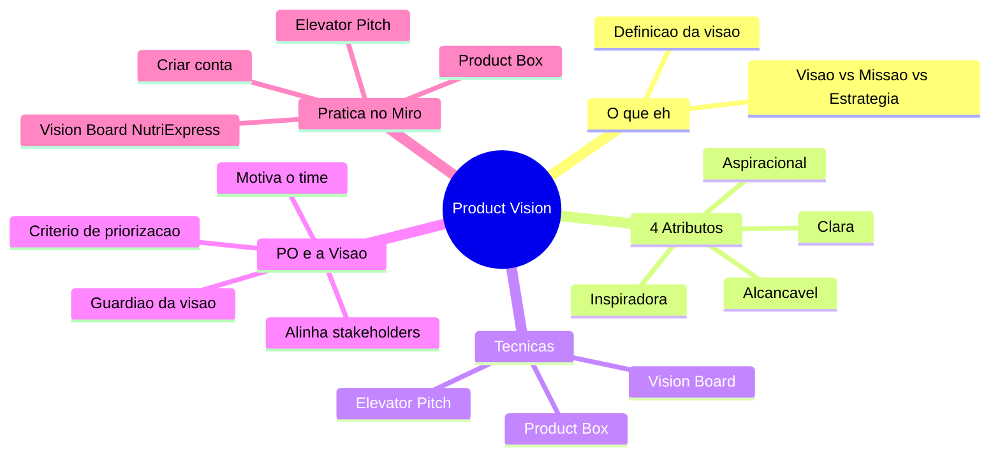

# Product Owner — Do Zero ao PO com Agentes — Aula 05

## Product Vision — Definindo o Norte

**Duração estimada:** 60 minutos (35 de leitura + 25 de prática)
**Nível:** Iniciante
**Pré-requisitos:** Aula 01 — "Afinal, o que é um Product Owner?", Aula 02 — "Scrum em 15 Minutos", Aula 03 — "As 3 Responsabilidades do PO", Aula 04 — "PO não é PM, não é Chefe"

---

## Objetivos de Aprendizagem

Ao final desta aula, você será capaz de:

- [ ] **Definir** Product Vision com suas próprias palavras e dar 2 exemplos reais
- [ ] **Distinguir** Visão, Missão e Estratégia em 3 dimensões (tempo, propósito, pergunta)
- [ ] **Identificar** os 4 atributos de uma boa visão e avaliar exemplos concretos
- [ ] **Explicar** por que o PO é o guardião da visão do produto
- [ ] **Aplicar** o template de Elevator Pitch para comunicar a visão em 30 segundos
- [ ] **Criar** um Vision Board com 4 quadrantes no Miro
- [ ] **Projetar** um Product Box com 3 frases na embalagem
- [ ] **Montar** a visão completa do NutriExpress (Elevator Pitch + Vision Board + Product Box)
- [ ] **Diagnosticar** problemas em visões usando os 4 atributos de qualidade

---

## Como Usar Esta Aula

Esta aula está organizada em duas partes. A **primeira parte** constrói os fundamentos da Product Vision — o que é, por que importa, quais técnicas existem para criá-la e como o PO se conecta com ela. A **segunda parte** aplica esses conceitos na prática: você vai criar sua conta no Miro e construir os 3 artefatos de visão do NutriExpress.

Ao longo do caminho, você encontrará **Quick Checks** ao final de cada seção e **Mão na Massa** com instruções passo a passo. Ao final, o arquivo separado **Questões de Aprendizagem** traz as tarefas de checkpoint — só avance para a Aula 06 quando conseguir completá-las por conta própria.

**Tempo estimado:** 35 minutos de leitura + 25 minutos de prática no Miro.

## Mapa Mental

Este diagrama mostra todos os conceitos que você vai dominar nesta aula:



> *O mapa mental acima mostra a estrutura da aula. Cada ramo representa um conceito que você vai explorar. Ao final, você terá criado a visão completa do NutriExpress em 3 formatos diferentes.*

---

## Recapitulação das Aulas 01, 02, 03 e 04

| Aula | Conceito | Conexão com esta aula |
|---|---|---|
| Aula 01 | **O papel do Product Owner** | A visão é o instrumento que guia o PO — ele é o guardião dela |
| Aula 02 | **Framework Scrum** | A visão orienta o backlog que o PO gerencia; sem visão, o backlog vira lista sem critério |
| Aula 03 | **As 3 responsabilidades do PO** | A visão dá critério para maximizar valor (Resp. 1), refinar backlog (Resp. 2) e decidir (Resp. 3) |
| Aula 04 | **Limites do PO** | A visão é responsabilidade do PO — ninguém define o norte por ele |

---

**FUNDAMENTOS: O que é Product Vision e Como Ela Guia o PO**

> *Os conceitos desta seção são universais — valem para qualquer produto, em qualquer empresa, com qualquer metodologia. Não mencionamos ferramentas, marcas ou tecnologias específicas aqui. Vamos usar exemplos de produtos que você conhece para tornar tudo concreto. Na segunda parte, você vai aplicar esses conceitos ao NutriExpress usando uma ferramenta visual.*

---

## 1. Product Vision — A Estrela do Norte

Imagine que você é o CEO de uma empresa e precisa tomar uma decisão difícil. Um investidor quer que você cobre R$ 50 por mês. Seus clientes querem que seja gratuito. Seu time de tecnologia quer construir uma funcionalidade nova. Seu chefe quer cortar custos.

Para quem você dá ouvidos?

A resposta é: depende. E o que define "depende" é a **Product Vision** — a visão do produto.

### O que é Product Vision?

**Product Vision** é a resposta para a pergunta mais importante que um produto pode responder: "onde queremos chegar?". É a descrição do futuro aspiracional que o produto vai criar. Ela responde: o que o mundo será diferente quando nosso produto existir?

Pense nela como a **Estrela do Norte** do produto. Navegadores antigos usavam a Estrela do Norte para saber para onde ir, independentemente de onde estivessem. Se desviassem da rota, olhavam para cima e se reorientavam.

A visão faz o mesmo pelo produto: quando você estiver perdido entre mil decisões, olha para a visão e sabe para onde voltar.

> *"Visão sem execução é alucinação. Execução sem visão é caos." — Provérbio adaptado do empreendedorismo*

### Mas não é qualquer frase bonita

Uma Product Vision não é um slogan de marketing. Não é "ser o melhor app de comida do Brasil". Isso é vago e não ajuda ninguém a decidir.

Uma boa Product Vision é específica o suficiente para guiar decisões, mas ampla o suficiente para durar anos.

### Visão vs Missão vs Estratégia

A confusão número 1 quando se fala de visão é misturar com **missão** e **estratégia**. Vamos acabar com isso agora.

| Conceito | Pergunta que responde | Tempo | Exemplo |
|---|---|---|---|
| **Visão** | "Onde queremos chegar?" | Futuro (5-10 anos) | "Democratizar a aviação no Brasil" |
| **Missão** | "O que fazemos hoje?" | Presente (agora) | "Oferecer voos seguros e acessíveis com qualidade" |
| **Estratégia** | "Como vamos chegar lá?" | Médio prazo (1-3 anos) | "Expandir rotas regionais, otimizar frota, fidelizar clientes" |

A visão PERGUNTA: onde queremos chegar?
A missão RESPONDE: o que fazemos hoje para chegar lá?
A estratégia DEFINE: qual o caminho específico que vamos seguir?

**Exemplo completo com a Azul Linhas Aéreas:**

- **Visão:** "Democratizar a aviação no Brasil" — um futuro onde qualquer pessoa pode voar, não só quem tem dinheiro
- **Missão:** "Oferecer o melhor voo do céu ao pouso, com segurança, pontualidade e um sorriso" — o que eles fazem todos os dias
- **Estratégia:** "Conectar cidades médias sem escala, operar com frota eficiente (Embraer), manter custos baixos" — como eles estão fazendo para democratizar a aviação

Percebe como são diferentes? A visão é o sonho grande. A missão é o trabalho de cada dia. A estratégia é o plano.

### Os 4 Atributos de uma Boa Visão

Como saber se uma visão é boa ou é só uma frase bonita? Use o teste dos **4 atributos**. Uma boa visão é:

**1. Clara** — qualquer pessoa no time consegue entender e repetir
- ✅ "Democratizar a aviação no Brasil" — uma frase, todo mundo entende
- ❌ "Alavancar sinergias disruptivas no ecossistema de mobilidade aérea para maximizar valor aos stakeholders" — ninguém entende, ninguém repete

**2. Inspiradora** — faz as pessoas quererem fazer parte
- ✅ "Organizar o conhecimento do mundo e torná-lo universalmente acessível" (Wikipedia) — quem não quer fazer parte disso?
- ❌ "Aumentar o número de artigos publicados em 15% ao ano" — parece meta, não visão

**3. Aspiracional** — descreve um futuro desejável, não o estado atual
- ✅ "Um banco digital justo e transparente que devolve o controle financeiro para as pessoas" (Nubank) — descreve um FUTURO diferente do presente
- ❌ "Ser um banco digital que oferece conta corrente e cartão de crédito" — isso já existe, não é futuro

**4. Alcançável** — não é impossível, mesmo sendo ambiciosa
- ✅ "Democratizar a aviação" — ambicioso, mas possível (a Azul voa para 150+ cidades)
- ❌ "Levar cada pessoa da Terra para Marte em 5 anos" — aspiracional, mas irrealista para os recursos disponíveis

> *Pausa para refletir: pegue uma visão de produto que você conhece (Netflix, Spotify, Nubank) e avalie nos 4 atributos. Ela passa no teste?*

### Exemplos Reais de Visão

**Wikipedia:** "Organizar o conhecimento do mundo e torná-lo universalmente acessível."

É clara? Sim. Inspiradora? Muito. Aspiracional? Completamente (o conhecimento do mundo todo? Isso é enorme). Alcançável? Está acontecendo — milhões de artigos em centenas de idiomas.

**Nubank:** "Um banco digital justo e transparente que devolve o controle financeiro para as pessoas."

É clara? Sim. Inspiradora? Quem não quer controle financeiro? Aspiracional? Bancos tradicionais não são transparentes — este é um futuro desejável. Alcançável? Estão fazendo isso.

**Tesla:** "Acelerar a transição do mundo para a energia sustentável."

É clara? Sim. Inspiradora? Muito. Aspiracional? Mudar a matriz energética do planeta? Ambicioso. Alcançável? Estão vendendo milhões de carros elétricos e crescendo.

### O PO é o Guardião da Visão

Agora a parte que mais importa para você: **o Product Owner é o guardião da visão dentro do time.**

Isso não significa que o PO inventa a visão sozinho — muitas vezes ela vem do CEO, do fundador, do Product Manager. Mas o PO garante que a visão NÃO SE PERCA no dia a dia.

O que significa ser guardião da visão:

- **No Sprint Planning:** quando o time pergunta "por que estamos construindo isso?", o PO responde apontando a visão
- **No refinamento do backlog:** cada história nova é testada contra a visão — "isso serve à visão?"
- **Na priorização:** a visão dá o critério de "mais importante" — o que aproxima o produto da visão vem primeiro
- **Com stakeholders:** quando alguém pede uma funcionalidade, o PO avalia se ela está alinhada com a visão

> *"O PO não precisa ter inventado a visão. Mas precisa ser a pessoa que mais acredita nela dentro do time."*

### Veja como funciona na prática

Imagine que você é PO do NutriExpress. A visão é: "Tornar a alimentação saudável acessível para qualquer pessoa, em qualquer lugar, sem complicação."

Chega uma demanda do investidor: "Quero um plano premium de R$ 199/mês com consultoria nutricional por vídeo."

Você testa contra a visão:
- A visão diz "acessível para qualquer pessoa" → R$ 199/mês não é acessível
- A visão diz "sem complicação" → consultoria por vídeo adiciona complexidade
- A visão diz "alimentação saudável" → consultoria não é alimentação

Decisão: não entra. A funcionalidade não serve à visão.

Sem a visão, você aceitaria a demanda do investidor porque "ele manda". Com a visão, você tem critério para decidir. Ela te protege.

### Quick Check 1

**1. Qual a diferença entre Visão e Missão em termos de tempo?**
**Resposta:** A Visão olha para o futuro (5-10 anos) — "onde queremos chegar". A Missão olha para o presente — "o que fazemos hoje para chegar lá".

**2. Uma visão não é boa se for apenas inspiradora mas impossível de alcançar. Qual atributo ela está violando?**
**Resposta:** O atributo **Alcançável**. Uma boa visão precisa ser aspiracional (ambiciosa) e alcançável ao mesmo tempo — "impossível de alcançar" significa que não passa no 4º atributo.

---

## 2. Técnicas para Criar Visão

Saber o que é visão é um passo. Conseguir CRIAR uma visão é outro. Felizmente, existem técnicas consagradas que ajudam qualquer PO a transformar uma ideia vaga em uma visão concreta e comunicável.

Vamos conhecer três: o Elevator Pitch, o Vision Board e o Product Box.

### Elevator Pitch — Sua Visão em 30 Segundos

Imagine que você entra em um elevador com o maior investidor do Brasil. Você tem 30 segundos (o tempo do elevador entre o térreo e o 10º andar) para explicar seu produto e convencê-lo a ouvir mais.

O que você diz?

O **Elevator Pitch** é isso: um discurso curto que comunica a essência da sua visão em 30 segundos. Ele segue um template testado:

> **"Para [público-alvo] que [problema], o [produto] é uma [solução] que [benefício principal]. Diferente de [alternativas], nós [diferencial único]."**

Vamos destrinchar cada campo:

| Campo | O que preencher | Exemplo (app de marmitas) |
|---|---|---|
| **Público-alvo** | Quem são as pessoas que mais se beneficiam do produto? | "Pessoas que querem comer saudável mas não têm tempo de cozinhar" |
| **Problema** | Qual dor específica elas sentem? | "Não encontram opções práticas, saudáveis e com acompanhamento profissional" |
| **Produto** | Nome do seu produto | "NutriExpress" |
| **Solução** | Que tipo de produto é? | "App de marmitas que conecta nutricionistas e restaurantes" |
| **Benefício principal** | Qual o resultado mais importante que o produto entrega? | "Receber refeições balanceadas feitas por chefs, com validação de um nutricionista" |
| **Alternativas** | O que as pessoas usam hoje para resolver esse problema? | "Ifood, marmitas de supermercado, food prep caseiro" |
| **Diferencial único** | O que só SEU produto faz que ninguém mais faz? | "Cada refeição tem validação de um profissional de nutrição" |

**Exemplo completo preenchido:**

> "Para **pessoas que querem comer saudável mas não têm tempo de cozinhar**, que **não encontram opções práticas e com acompanhamento profissional**, o **NutriExpress** é um **app de marmitas que conecta nutricionistas e restaurantes** que **entrega refeições balanceadas com validação de um profissional**. Diferente de **Ifood**, onde você escolhe qualquer coisa, **cada refeição do NutriExpress passa por um nutricionista**."

Perceba: em 3 frases, você comunicou o público, o problema, a solução, o benefício e o diferencial. Isso é um Elevator Pitch.

> *Você pode estar pensando: "mas 30 segundos passa voando!" É verdade. Por isso o Elevator Pitch precisa ser ensaiado. Leia em voz alta. Cronometre. Se passar de 30 segundos, corte. Se terminar em 15, adicione mais detalhe no benefício.*

### Vision Board — Visualizando a Visão em 1 Página

Se o Elevator Pitch é o resumo falado, o **Vision Board** é o resumo visual. É um quadro de uma página só que organiza a visão em 4 quadrantes:

| Quadrante 1: Público-alvo | Quadrante 2: Problema / Oportunidade |
|---|---|
| Quem são as pessoas que o produto atende? | Que dor ou necessidade motiva o produto? |
| Se for B2B: que tipo de empresa? | Qual a oportunidade de mercado? |

| Quadrante 3: Solução / Benefícios | Quadrante 4: Diferenciais e Métricas |
|---|---|
| Como o produto resolve o problema? | O que torna o produto único? |
| Quais os principais benefícios? | Como medimos se deu certo? |

**No centro do board: o Elevator Pitch** — porque tudo converge para a mensagem principal.

O Vision Board é poderoso porque:
1. **Força o time a responder as 4 perguntas essenciais** — não dá para pular nenhuma
2. **Cria alinhamento visual** — todo mundo olha para o mesmo quadro
3. **É rápido de criar** — com post-its ou ferramenta digital, você faz em 30 minutos
4. **Vive na parede** — diferente de um documento de 20 páginas, o board fica visível

> *"Um Vision Board vale mais que um documento de 50 páginas que ninguém leu."*

### Product Box — Se o Produto Fosse uma Caixa

Esta técnica é a mais divertida e talvez a mais reveladora.

Imagine que seu produto é vendido em uma caixa, igual um produto de supermercado. As pessoas vão passar na prateleira e olhar para a caixa. O que está escrito? Quais frases chamam a atenção? Como a caixa convence alguém a comprar?

O **Product Box** é o exercício de DESCREVER a caixa do seu produto. Nele, você define:

- **O nome do produto** (óbvio, mas importante — ele comunica a proposta?)
- **Uma frase principal** na embalagem (tipo slogan, mas mais específico)
- **3 frases de benefícios** (bullet points na lateral ou verso)
- **O público** (na frente: "para quem come saudável")
- **O diferencial** (em destaque: "validado por nutricionistas")

**Exemplo de Product Box do NutriExpress:**

```
╔══════════════════════════════════════╗
║         NUTRIEXPRESS                 ║
║   "Comida saudável sem complicação"  ║
║                                      ║
║   ✓ Validado por nutricionistas      ║
║   ✓ Pronto em 5 minutos no micro     ║
║   ✓ Plano a partir de R$ 49/mês      ║
║                                      ║
║   Para quem quer comer bem           ║
║   mas não tem tempo de cozinhar      ║
╚══════════════════════════════════════╝
```

A técnica da Product Box força você a responder: **em uma frase, por que alguém compraria isso?** Se você não consegue responder, sua visão ainda não está clara.

### Por que essas 3 técnicas juntas?

Cada técnica responde a uma pergunta diferente:

| Técnica | Pergunta | Formato |
|---|---|---|
| Elevator Pitch | "O que você diria para convencer alguém?" | Texto de 30 segundos |
| Vision Board | "Como você organiza visualmente a visão?" | Quadro de 1 página |
| Product Box | "Se fosse um produto de prateleira, o que estaria na embalagem?" | Desenho de caixa |

Juntas, elas formam uma visão completa: você sabe o que falar, o que mostrar e o que "vender" para quem perguntar sobre o produto.

### Quick Check 2

**1. Complete: "Para [público-alvo] que [problema], o [produto] é uma [solução] que [benefício principal]. Diferente de [alternativas], nós [diferencial único]." Este é o template de qual técnica?**
**Resposta:** Elevator Pitch. A técnica de comunicar a visão em 30 segundos com 7 campos essenciais.

**2. Quantos quadrantes tem um Vision Board e quais são?**
**Resposta:** 4 quadrantes: (1) Público-alvo, (2) Problema/Oportunidade, (3) Solução/Benefícios, (4) Diferenciais e Métricas de Sucesso. O Elevator Pitch fica no centro do board.

---

## 3. Por que Visão Importa para o PO

Você já sabe o que é visão e como criá-la. Mas talvez esteja pensando: "Isso tudo é bonito, mas no dia a dia corrido do PO, a visão realmente faz diferença?"

A resposta curta: **sim, e mais do que você imagina.**

Vamos ver 4 razões concretas pelas quais a visão é a ferramenta mais importante que um PO pode ter.

### 1. Sem visão, o backlog vira lista sem critério

O maior perigo de um backlog sem visão é que ELE ACEITA TUDO. O investidor pede uma funcionalidade? Entra no backlog. O CEO tem uma ideia? Entra no backlog. O cliente reclamou? Entra no backlog. O time achou legal tecnicamente? Entra no backlog.

Resultado: um backlog gigante, cheio de itens sem conexão entre si, onde é impossível priorizar porque não existe critério para decidir o que é mais importante.

Com a visão, você tem um **filtro natural**: "esse item serve à visão? Se sim, avaliamos a prioridade. Se não, não entra."

> *Pense no backlog sem visão como um navio sem leme — vai para onde o vento levar. Com visão, você escolhe a direção.*

### 2. Visão dá critério de priorização (Conexão com Aula 03)

Na Aula 03, você aprendeu que a primeira responsabilidade do PO é **maximizar o valor do produto**. Mas como você define "valor" sem uma visão?

Valor é tudo que aproxima o produto da visão. Se a visão é "tornar a alimentação saudável acessível", então:
- Uma funcionalidade que reduz o preço das marmitas tem ALTO valor (aproxima da visão)
- Uma funcionalidade que adiciona um chat com nutricionista tem MÉDIO valor (serve à visão, mas não é o core)
- Uma funcionalidade de gamificação com emojis tem BAIXO valor (não aproxima da visão)

Percebe como a visão transforma "priorizar" de chute em análise objetiva?

### 3. Visão alinha stakeholders

Stakeholders são todas as pessoas que têm interesse no produto: investidores, CEO, clientes, time, parceiros. Cada um puxa para um lado diferente.

O investidor quer receita. O time quer tecnologia nova. O cliente quer preço baixo. O parceiro quer visibilidade.

Como alinhar todo mundo? Com a visão. Quando todos concordam com "para onde o produto vai", fica mais fácil negociar o "como chegar lá".

Veja como funciona na prática:

**Sem visão:** O investidor diz "quero integração com Instagram". O time diz "quero refatorar o backend". Você fica no meio sem saber o que decidir.

**Com visão:** Você responde "ótimo, vamos testar cada ideia contra nossa visão: 'tornar a alimentação saudável acessível'. Integração com Instagram gera mais acessibilidade? Talvez. Refatorar backend gera mais acessibilidade? Não diretamente. Então vamos priorizar a integração com estudos." — todo mundo entende o critério.

### 4. Visão motiva o time

Este é o benefício mais humano e menos técnico, mas talvez o mais importante.

As pessoas não acordam de manhã pensando "quero escrever código de alta performance". Elas acordam pensando "quero fazer a diferença, quero construir algo que importa". A visão dá esse PROPÓSITO.

Quando o time sabe que está construindo um produto que "torna a alimentação saudável acessível para qualquer pessoa", cada história do backlog ganha significado. Não é só "mais uma tela para implementar" — é "mais uma pessoa que vai conseguir comer saudável".

> *"People don't buy what you do; they buy why you do it." — Simon Sinek*

### Conexão com a Aula 03 — As 3 Responsabilidades do PO

Lembra das 3 responsabilidades do PO? A visão é o fio que conecta todas elas:

| Responsabilidade (Aula 03) | Como a visão ajuda |
|---|---|
| 1. **Maximizar valor do produto** | Valor = o que aproxima da visão. Sem visão, "valor" é subjetivo |
| 2. **Gerenciar e refinar o backlog** | O backlog é a lista de "coisas que aproximam o produto da visão". A visão filtra o que entra |
| 3. **Tomar decisões e dizer não** | "Não" fica mais fácil quando a visão é o critério: "essa funcionalidade não serve à nossa visão" |

A visão é a ferramenta que OPERACIONALIZA as 3 responsabilidades. Sem ela, o PO está navegando no escuro.

### Quick Check 3

**1. Sem visão, qual o maior risco para o backlog do produto?**
**Resposta:** O backlog vira uma lista sem critério que aceita tudo — pedido de investidor, ideia do CEO, reclamação de cliente. Sem a visão como filtro, não é possível decidir o que realmente importa.

**2. Como a visão ajuda o PO a dizer "não" para stakeholders?**
**Resposta:** A visão dá um critério objetivo para recusar demandas. O PO não precisa dizer "não porque não quero" — ele diz "essa funcionalidade não serve à nossa visão de [X], então não é prioridade agora". O critério é a visão, não a opinião pessoal do PO.

---

**APLICAÇÃO: Visão do NutriExpress no Miro**

> *Agora que você entende os fundamentos da Product Vision — o que é, por que importa e como criá-la com Elevator Pitch, Vision Board e Product Box — vamos conectar esses conceitos à prática. Você vai criar sua conta no Miro e construir os 3 artefatos de visão do NutriExpress.*

---

## 4. Conhecendo o Miro

Esta seção é especial: é a primeira vez que você vai usar uma ferramenta neste curso. Até agora, tudo foi conceitual e no papel. Agora vamos colocar a mão na massa com uma ferramenta gratuita e poderosa.

### O que é o Miro?

O **Miro** é um quadro branco colaborativo online. Pense nele como uma parede infinita onde você pode colocar post-its, desenhar formas, escrever textos, criar diagramas e convidar outras pessoas para editar junto.

Empresas de produto usam o Miro para:
- Criar Vision Boards, mapas de empatia, jornadas do usuário
- Fazer retrospectivas e brainstorms
- Planejar sprints e roadmaps
- Colaborar com times remotos

Você vai usar o Miro para criar o Vision Board do NutriExpress.

### Criando sua Conta no Miro

Siga estes passos. São simples, mas cada passo está detalhado porque é a primeira vez que você faz.

**Passo 1:** Abra seu navegador (Chrome, Firefox, Edge, qualquer um) e acesse: **miro.com**

**Passo 2:** Clique no botão **"Sign up free"** (Cadastre-se grátis). Ele fica no canto superior direito da tela.

**Passo 3:** Você pode se cadastrar com:
- Google (recomendado — é mais rápido)
- Email (crie uma senha)
- Apple (se tiver)

Escolha a opção que preferir.

**Passo 4:** Após criar a conta, o Miro vai perguntar sobre seu uso. Você pode responder:
- "I'm using Miro for" → "Product management"
- "My role is" → "Product manager" (ou "Other" — não faz diferença)
- "Team size" → "Just me" (você começa sozinho)

**Passo 5:** Pronto! Você está na tela principal do Miro. Ela mostra seus **boards** (quadros). Como você acabou de criar a conta, a lista está vazia.

> *⚠️ Atenção: O plano gratuito do Miro permite criar até 3 boards editáveis. Isso é perfeito para o curso — você vai usar 1 board para o Vision Board do NutriExpress. As aulas 06, 07 e 08 também usam Miro, então você tem boards suficientes para todo o Bloco B.*

### Visão Geral da Interface

Depois de criar a conta, familiarize-se com a interface:

1. **Botão "New board"** (azul, no canto superior direito) — clica aqui para criar um novo quadro
2. **Barra de ferramentas à esquerda** — mostra as ferramentas de desenho: seta (selecionar), sticky note (post-it), shape (formas), text (texto), draw (desenho livre)
3. **Menu superior** — opções de editar, compartilhar, exportar
4. **Zoom** — canto inferior direito (ou scroll do mouse para aproximar/afastar)

### Template de Vision Board no Miro

O Miro já tem um template pronto de Vision Board. Para encontrá-lo:

1. Clique em "New board" para criar um quadro
2. Na janela que abrir, clique em "Templates" (ou "Modelos") na barra superior
3. Digite "Vision Board" na busca
4. Escolha o template "Vision Board — Product" e clique em "Use"

Mas se você preferir criar do zero (para praticar mais), também funciona — vamos fazer passo a passo na próxima seção.

### Quick Check 4

**1. Qual é o limite de boards editáveis no plano gratuito do Miro?**
**Resposta:** 3 boards editáveis. Suficiente para as aulas 05, 06, 07 e 08 do Bloco B — você só precisa de 1 board por aula.

**2. Como encontrar um template de Vision Board no Miro?**
**Resposta:** Crie um novo board, clique em "Templates" na barra superior, busque "Vision Board" e escolha o template desejado.

---

## 5. Mão na Massa — Visão do NutriExpress

Chegou a hora de criar. Você vai construir os 3 artefatos de visão do NutriExpress: Elevator Pitch, Vision Board e Product Box.

### Mão na Massa 1: Elevator Pitch do NutriExpress

**Duração:** 10 minutos | **Dificuldade:** Fácil

Vamos começar pelo mais simples: preencher o template do Elevator Pitch.

**Passo 1:** Copie o template abaixo para um arquivo de texto (ou para um sticky note no Miro):

> "Para **[público-alvo]** que **[problema]**, o **[produto]** é uma **[solução]** que **[benefício principal]**. Diferente de **[alternativas]**, nós **[diferencial único]**."

**Passo 2:** Preencha cada campo. Use estas referências se travar:

| Campo | O que colocar |
|---|---|
| **Público-alvo** | Pessoas que querem comer saudável mas nao tem tempo de cozinhar |
| **Problema** | Nao encontram opcoes praticas saudaveis e com acompanhamento profissional |
| **Produto** | NutriExpress |
| **Solução** | App de marmitas que conecta nutricionistas e restaurantes |
| **Benefício** | Refeicoes balanceadas validadas por nutricionistas entregues na porta |
| **Alternativas** | Ifood, marmitas congeladas de supermercado, food prep caseiro |
| **Diferencial** | Cada refeicao eh validada por um nutricionista parceiro |

**Passo 3:** Escreva a versão final em voz alta. Leia pausadamente. Deve levar entre 25 e 30 segundos.

**Exemplo preenchido (referência):**

> "Para **pessoas que querem comer saudável mas não têm tempo de cozinhar**, que **não encontram opções práticas e com acompanhamento profissional**, o **NutriExpress** é um **app de marmitas que conecta nutricionistas e restaurantes** que **entrega refeições balanceadas com validação de um profissional**. Diferente de **Ifood**, onde qualquer prato pode ser escolhido, **cada refeição do NutriExpress passa por um nutricionista parceiro**."

### Mão na Massa 2: Vision Board no Miro

**Duração:** 15 minutos | **Dificuldade:** Médio

Agora vamos criar o Vision Board visual no Miro.

**Passo 1:** Abra o Miro e clique em **"New board"**. Dê um nome: "NutriExpress — Vision Board".

**Passo 2:** Divida o quadro em 4 quadrantes. Você pode fazer isso com:
- 4 retângulos grandes (use a ferramenta Shape → Rectangle)
- Ou linhas dividindo o espaço
- Ou simplesmente colocar os post-its em 4 áreas visivelmente separadas

**Passo 3:** Preencha o **Quadrante 1: Público-alvo**
- Crie sticky notes (post-its) para cada tipo de usuário:
  - Clientes finais: pessoas que querem comer saudavel mas nao tem tempo
  - Nutricionistas: profissionais que querem validar cardapios e ganhar visibilidade
  - Restaurantes: cozinhas que querem vender marmitas com curadoria nutricional
  - Entregadores: motoristas que fazem as entregas

**Passo 4:** Preencha o **Quadrante 2: Problema / Oportunidade**
- Sticky notes para os problemas:
  - Comida saudavel é cara e demorada para preparar
  - Ifood nao tem curadoria nutricional
  - Pessoas com restricao alimentar tem dificuldade de achar opcoes
  - Nutricionistas querem alcancar mais pacientes

**Passo 5:** Preencha o **Quadrante 3: Solução / Benefícios**
- Sticky notes para a solução:
  - Marmitas balanceadas com validacao de nutricionista
  - Entrega rapida na porta
  - Planos acessiveis a partir de R$ 49/mes
  - Filtro por restricao alimentar

**Passo 6:** Preencha o **Quadrante 4: Diferenciais e Métricas de Sucesso**
- Diferenciais:
  - Cada refeicao validada por nutricionista
  - Conecta nutricionistas, restaurantes e clientes em um so ecossistema
  - Cardapio personalizavel por restricao
- Métricas:
  - NPS maior que 80
  - 10.000 refeicoes entregues por mes
  - 50 nutricionistas parceiros
  - 30% dos clientes renovam plano apos 3 meses

**Passo 7:** Adicione o **Elevator Pitch** no centro do board
- Use um sticky note GRANDE (ou text box) no centro dos 4 quadrantes
- Cole a versão final do Elevator Pitch que você criou no Mão na Massa 1

**Verificação:** Seu Vision Board deve estar visualmente organizado assim:

```
+-----------------------------+-----------------------------+
|     QUADRANTE 1             |     QUADRANTE 2             |
|     Publico-alvo            |     Problema / Oportunidade |
|                             |                             |
|  [sticky: Clientes]         |  [sticky: Comida cara]      |
|  [sticky: Nutricionistas]   |  [sticky: Sem curadoria]   |
|  [sticky: Restaurantes]     |  [sticky: Restricao]        |
+-----------------------------+-----------------------------+
|         ELEVATOR PITCH (centro, grande)                     |
|                                                             |
+-----------------------------+-----------------------------+
|     QUADRANTE 3             |     QUADRANTE 4             |
|     Solucao / Beneficios    |     Diferenciais / Metricas |
|                             |                             |
|  [sticky: Marmitas validas] |  [sticky: Validacao nutri]  |
|  [sticky: Entrega rapida]   |  [sticky: Ecossistema]     |
|  [sticky: Planos acessiveis] |  [sticky: NPS > 80]        |
+-----------------------------+-----------------------------+
```

### Mão na Massa 3: Product Box do NutriExpress

**Duração:** 10 minutos | **Dificuldade:** Médio

Agora vamos ao exercício mais criativo: a caixa do produto.

**Passo 1:** Crie um novo quadro no Miro (ou uma seção separada no mesmo board). Nome: "Product Box — NutriExpress".

**Passo 2:** Desenhe um retângulo grande (use a ferramenta Shape → Rectangle) para representar a caixa.

**Passo 3:** Dentro do retângulo, adicione com textos e formas:
- **Nome do produto** em destaque (fonte grande, centralizado): "NUTRIEXPRESS"
- **Slogan / frase principal** abaixo do nome: "Comida saudável sem complicação"
- **3 frases de benefícios** (bullet points): 
  - ✅ Validado por nutricionistas
  - ✅ Pronto em 5 minutos
  - ✅ A partir de R$ 49/mês

**Passo 4:** Na lateral ou no verso (você decide), adicione o **público:**
- "Para quem quer comer bem mas não tem tempo de cozinhar"

**Passo 5:** Em destaque, o **diferencial:**
- "Cada refeição validada por um nutricionista parceiro"

**Passo 6:** Compartilhe (opcional): convide um colega para ver sua Product Box clicando em "Share" no Miro.

**Verificação:** Sua Product Box no Miro deve ser visualmente parecida com uma embalagem real de produto — com nome grande, benefícios claros e diferencial destacado.

### Quick Check 5

**1. No Elevator Pitch do NutriExpress, qual é o diferencial único em relação ao Ifood?**
**Resposta:** Cada refeição é validada por um nutricionista parceiro. No Ifood, qualquer prato pode ser escolhido sem curadoria nutricional.

**2. Quantos quadrantes o Vision Board tem, e o que fica no centro?**
**Resposta:** 4 quadrantes (Público-alvo, Problema/Oportunidade, Solução/Benefícios, Diferenciais/Métricas). O Elevator Pitch fica no centro do board.

---

## Autoavaliação: Quiz Rápido

Teste seu conhecimento com estas 6 perguntas. Tente responder antes de consultar o gabarito.

**1. O que é Product Vision?**
a) Um documento de requisitos do produto
b) A descrição do futuro aspiracional que o produto vai criar
c) O roteiro de funcionalidades dos próximos 6 meses
d) O nome do produto e seu slogan de marketing
**Resposta:**

Alternativa B. Product Vision é onde queremos chegar — o futuro que o produto vai construir. Não é documento de requisitos, nem roadmap, nem slogan.

**2. Qual a diferença entre Visão e Estratégia?**
a) São a mesma coisa com nomes diferentes
b) Visão é onde queremos chegar; Estratégia é o plano para chegar lá
c) Visão é curto prazo; Estratégia é longo prazo
d) Estratégia é mais importante que Visão
**Resposta:**

Alternativa B. Visão responde "onde queremos chegar" (futuro). Estratégia responde "como vamos chegar lá" (plano de médio prazo).

**3. Uma boa Product Vision deve ser:**
a) Clara, Inspiradora, Aspiracional e Alcançável
b) Curta, Direta, Mensurável e Específica
c) Ampla, Detalhada, Técnica e Financeira
d) Clara, Curta, Barata e Rápida
**Resposta:**

Alternativa A. Os 4 atributos de uma boa visão são: Clara (todo mundo entende), Inspiradora (faz querer participar), Aspiracional (futuro desejável), Alcançável (possível de atingir).

**4. O template do Elevator Pitch começa com qual palavra?**
a) "Se..."
b) "Para..."
c) "Como..."
d) "Quando..."
**Resposta:**

Alternativa B. O template começa com "Para [público-alvo] que [problema]...". A primeira informação é para QUEM é o produto.

**5. Quantos quadrantes tem um Vision Board?**
a) 2
b) 3
c) 4
d) 6
**Resposta:**

Alternativa C. 4 quadrantes: Público-alvo, Problema/Oportunidade, Solução/Benefícios, Diferenciais/Métricas de Sucesso.

**6. Por que a visão é importante para o PO priorizar o backlog?**
a) Porque o investidor pede
b) Porque a visão define o que é "valor" — o que aproxima o produto da visão tem mais prioridade
c) Porque o Scrum Master exige
d) Porque o backlog fica mais bonito com histórias alinhadas
**Resposta:**

Alternativa B. A visão transforma "priorizar" de chute em análise objetiva: valor = o que aproxima o produto da visão.

---

## Mão na Massa: Exercícios Graduados

### Exercício 1 (Fácil) — Identificar: Visão, Missão ou Estratégia?

Classifique cada frase abaixo como **Visão (V)**, **Missão (M)** ou **Estratégia (E)**:

| Frase | Classificação |
|---|---|
| 1. Conectar profissionais de saúde e clientes em um só ecossistema digital | ? |
| 2. Oferecer consultas online com nutricionistas todos os dias da semana | ? |
| 3. Expandir para 15 cidades até 2027, priorizando capitais com alto índice de obesidade | ? |
| 4. Ser a plataforma mais acessível de alimentação saudável da América Latina | ? |
| 5. Realizar parcerias com 200 restaurantes até o final do ano | ? |
| 6. Garantir que cada refeição entregue segue o plano nutricional do cliente | ? |

**Gabarito:**

1. **V** (Visão — descreve um futuro onde profissionais e clientes estão conectados)
2. **M** (Missão — o que o produto faz hoje)
3. **E** (Estratégia — plano específico com prazo e métrica)
4. **V** (Visão — futuro aspiracional de ser a plataforma mais acessível)
5. **E** (Estratégia — meta específica com prazo)
6. **M** (Missão — o que o produto faz hoje no dia a dia)

---

### Exercício 2 (Médio) — Avaliar Visões pelos 4 Atributos

Avalie cada visão abaixo usando os 4 atributos (Clara, Inspiradora, Aspiracional, Alcançável). Para cada atributo, marque ✅ (passa) ou ❌ (falha). Depois, diagnostique o problema principal.

**Visão A:** "Revolucionar o mercado de marmitas via disrupção tecnológica com sinergia omnichannel para entrega de valor exponencial aos stakeholders."

| Atributo | ✅ / ❌ |
|---|---|
| Clara | ? |
| Inspiradora | ? |
| Aspiracional | ? |
| Alcançável | ? |

**Visão B:** "Garantir que 100% da população mundial tenha acesso a refeições saudáveis gratuitas em 2 anos."

| Atributo | ✅ / ❌ |
|---|---|
| Clara | ? |
| Inspiradora | ? |
| Aspiracional | ? |
| Alcançável | ? |

**Visão C:** "Tornar a alimentação saudável acessível para qualquer pessoa, em qualquer lugar, sem complicação."

| Atributo | ✅ / ❌ |
|---|---|
| Clara | ? |
| Inspiradora | ? |
| Aspiracional | ? |
| Alcançável | ? |

**Gabarito:**

**Visão A — "Revolucionar o mercado de marmitas via disrupção..."**
| Atributo | ✅ / ❌ |
|---|---|
| Clara | ❌ (jargão: "disrupção", "sinergia omnichannel" — ninguém entende) |
| Inspiradora | ❌ (jargão empresarial não inspira ninguém) |
| Aspiracional | ❌ (não descreve um futuro claro) |
| Alcançável | ❌ (não dá para saber se é alcançável porque não está claro) |
**Diagnóstico:** A visão é recheada de jargões ("disrupção", "sinergia omnichannel", "entrega de valor exponencial") que não comunicam nada. FALHA no atributo Clara. Se não é clara, os outros atributos também ficam comprometidos.

**Visão B — "100% da população mundial com refeições saudáveis gratuitas em 2 anos"**
| Atributo | ✅ / ❌ |
|---|---|
| Clara | ✅ (todo mundo entende) |
| Inspiradora | ✅ (quem não quer acabar com a fome?) |
| Aspiracional | ✅ (é um futuro radicalmente diferente) |
| Alcançável | ❌ (alimentar 8 bilhões de pessoas de graça em 2 anos é irrealista) |
**Diagnóstico:** É clara, inspiradora e aspiracional, mas NÃO é alcançável. É um sonho, não uma visão de produto. FALHA no atributo Alcançável.

**Visão C — "Tornar a alimentação saudável acessível para qualquer pessoa, em qualquer lugar, sem complicação."**
| Atributo | ✅ / ❌ |
|---|---|
| Clara | ✅ (todo mundo entende) |
| Inspiradora | ✅ (quem não quer comer saudável sem complicação?) |
| Aspiracional | ✅ (hoje isso não é realidade para a maioria das pessoas) |
| Alcançável | ✅ (é ambiciosa, mas possível — outros produtos já fazem partes disso) |
**Diagnóstico:** PASSOU nos 4 atributos! Esta é a visão do NutriExpress — clara, inspiradora, aspiracional e alcançável.

---

### Desafio (Difícil) — Criar Elevator Pitch de Outro Produto

Você é o PO de um novo produto. O produto é:

**"PetMatch — um aplicativo que conecta ONGs de adoção de animais com pessoas que querem adotar um pet. O app usa um questionário de estilo de vida para recomendar o animal ideal para cada pessoa, evitando adoções por impulso que terminam em abandono."**

Crie o Elevator Pitch completo usando o template:

> "Para **[público-alvo]** que **[problema]**, o **[produto]** é uma **[solução]** que **[benefício principal]**. Diferente de **[alternativas]**, nós **[diferencial único]**."

**Gabarito:**

> "Para **pessoas que querem adotar um animal de estimação mas têm medo de escolher errado**, que **não sabem qual pet combina com seu estilo de vida e acabam abandonando o animal por incompatibilidade**, o **PetMatch** é um **app de adoção responsável** que **usa um questionário de estilo de vida para recomendar o animal ideal para cada pessoa**. Diferente de **ONGs tradicionais e sites de adoção**, onde a escolha é emocional e impulsiva, **nós usamos dados para garantir que a adoção seja um match perfeito e duradouro**."

---

## Resumo da Aula

### Os Conceitos Fundamentais

1. **Product Vision**: A Estrela do Norte do produto — descreve onde queremos chegar, o futuro aspiracional que o produto vai criar. Diferente de Missão (o que fazemos hoje) e Estratégia (como vamos chegar lá).

2. **4 Atributos de uma boa visão**: Clara (todo mundo entende), Inspiradora (faz querer participar), Aspiracional (futuro desejável), Alcançável (possível de atingir).

3. **Elevator Pitch**: Sua visão em 30 segundos — template de 7 campos que comunica público, problema, solução, benefício e diferencial.

4. **Vision Board**: Quadro visual de 1 página com 4 quadrantes (Público-alvo, Problema, Solução, Diferenciais/Métricas) + Elevator Pitch no centro.

5. **Product Box**: Exercício de descrever a "caixa" do produto — o que estaria na embalagem se fosse vendido em prateleira.

6. **PO como guardião da visão**: O PO garante que a visão não se perca no dia a dia — ela guia o backlog, a priorização, as decisões e o alinhamento com stakeholders.

### O Que Você Construiu Hoje

- [x] **Definiu** Product Vision com suas próprias palavras e exemplos
- [x] **Distinguiu** Visão, Missão e Estratégia
- [x] **Identificou** os 4 atributos de uma boa visão
- [x] **Aplicou** o template de Elevator Pitch para o NutriExpress
- [x] **Criou** um Vision Board no Miro com 4 quadrantes
- [x] **Projetou** a Product Box do NutriExpress
- [x] **Criou** sua conta no Miro e aprendeu a interface básica
- [x] **Entendeu** por que o PO é o guardião da visão

---

## Próxima Aula

**Aula 06: Personas e Empatia**

Agora que você definiu o norte do NutriExpress com a visão, o próximo passo é entender QUEM são as pessoas que vão usar o produto. Na Aula 06, você vai criar as personas do NutriExpress — perfis detalhados de cada tipo de usuário. E vai usar o Miro de novo, desta vez com o mapa de empatia.

Prepare-se para conhecer seus usuários de verdade. 👥

---

## Referências

### Documentação Oficial

- [Scrum Guide 2020](https://scrumguides.org/scrum-guide.html) — leia a seção sobre Product Owner e como o backlog se conecta com a visão do produto

### Ferramentas

- [Miro](https://miro.com) — quadro colaborativo gratuito usado nesta aula
- [Template de Vision Board no Miro](https://miro.com/pt/templates/vision-board/) — template oficial

### Leitura Complementar

- **INSPIRED: How to Create Tech Products Customers Love**, de Marty Cagan — leia o capítulo sobre Product Vision e como ela se diferencia de roadmap
- **Escaping the Build Trap**, de Melissa Perri — capítulo sobre visão vs. estratégia
- **Start with Why**, de Simon Sinek — livro sobre o poder do propósito e da visão

### Artigos para Aprofundamento

- [Product Vision: The Complete Guide](https://www.productplan.com/learn/product-vision/) — Product Plan
- [How to Write an Elevator Pitch](https://www.scrum.org/resources/blog/how-write-elevator-pitch-your-product) — Scrum.org
- [Vision Board Template for Product Teams](https://miro.com/templates/vision-board/) — Miro

---

## FAQ

**P: Product Vision pode mudar com o tempo?**
R: Sim. A visão não é imutável. Conforme o mercado muda, a tecnologia avança e o produto aprende, a visão pode ser ajustada. Mas ela não muda toda Sprint — visão muda em escala de anos, não de meses.

**P: Quem cria a Product Vision?**
R: Depende da empresa. Em startups, o fundador ou CEO cria. Em empresas maiores, o Product Manager ou um diretor de produto define. Mas o PO, mesmo que não tenha criado, é o guardião — ele garante que a visão viva no dia a dia.

**P: E se a empresa não tem uma visão definida?**
R: Isso é mais comum do que deveria. Neste caso, o PO pode (e deve) iniciar a conversa: propor um workshop de visão com stakeholders, usar as técnicas desta aula (Elevator Pitch, Vision Board, Product Box) e chegar a um consenso. Alguém precisa começar — pode ser você.

**P: Miro é obrigatório para esta aula?**
R: Sim, é a ferramenta do Bloco B. O plano gratuito é suficiente para todo o curso. Se você realmente não puder usar o Miro, pode fazer o Vision Board em papel, PowerPoint, Google Slides ou até em uma planilha. Mas o Miro foi escolhido porque é a ferramenta padrão da indústria para este tipo de trabalho.

**P: O que é mais importante: Elevator Pitch, Vision Board ou Product Box?**
R: Os três, por razões diferentes. O Elevator Pitch é o que você fala. O Vision Board é o que você mostra. A Product Box é o que materializa a visão. Se tivesse que escolher um só, ficaria com o Elevator Pitch — se você consegue resumir a visão em 30 segundos, você entendeu o produto.

**P: Precisa mostrar o Vision Board para alguém?**
R: O ideal é sim. Compartilhe com colegas, stakeholders, mentores. Peça: "isso faz sentido para você?" O Vision Board é uma ferramenta de alinhamento — se as pessoas olham para ele e entendem o produto, ele cumpriu seu papel.

**P: Quantas vezes devo revisitar a visão?**
R: Periodicamente. Uma boa prática é revisitar a visão a cada 6-12 meses, ou sempre que o produto passar por uma mudança significativa de direção. Nas Sprints, a visão deve estar presente nas decisões do dia a dia, mesmo que você não a revise formalmente.

**P: Posso ter mais de uma visão para o mesmo produto?**
R: Não. Um produto tem UMA visão. Se você tem duas visões diferentes, você tem dois produtos diferentes (ou precisa decidir qual é a verdadeira). A visão é o norte — você não pode ter dois nortes.

**P: E se o time não concordar com a visão?**
R: Isso precisa ser resolvido antes de avançar. Se o time não acredita na visão, as entregas serão sem propósito. Promova uma conversa aberta: "o que vocês acham que deveria ser a visão?" Talvez o time tenha insights valiosos. No final, alguém precisa decidir — e se a decisão não for consenso, o PO ou líder de produto tem a palavra final.

**P: A visão deve ser pública (clientes podem ver)?**
R: Depende. Algumas empresas tornam a visão pública para atrair talentos e clientes que acreditam na causa (Tesla: "acelerar a transição para energia sustentável"). Outras mantêm interna porque revela estratégia competitiva. Use seu bom senso.

**P: O que fazer quando a visão do produto conflita com a visão da empresa?**
R: Este é um problema sério. Se o produto vai para um lado e a empresa para outro, o produto está fadado ao fracasso. Neste caso, o PO deve escalar o problema: "nossa visão de produto é X, mas a empresa está indo para Y. Precisamos alinhar ou o produto vai perder relevância."

---

## Glossário

| Termo | Definição |
|---|---|
| **Product Vision** | Descrição do futuro aspiracional que o produto vai criar. Responde "onde queremos chegar". (Ver Seção 1) |
| **Missão** | O que o produto e a empresa fazem hoje para realizar a visão. Propósito atual. (Ver Seção 1) |
| **Estratégia** | Plano de médio prazo que define o caminho para atingir a visão. (Ver Seção 1) |
| **Elevator Pitch** | Discurso curto (30 segundos) que comunica a essência da visão com 7 campos: público, problema, produto, solução, benefício, alternativas, diferencial. (Ver Seção 2) |
| **Vision Board** | Quadro visual de 1 página com 4 quadrantes que organiza a visão do produto. (Ver Seção 2) |
| **Product Box** | Exercício de descrever a "caixa" do produto como se fosse vendido em prateleira, com nome, frases de benefícios e diferencial. (Ver Seção 2) |
| **Guardião da Visão** | Papel do PO de garantir que a visão não se perca no dia a dia, guiando backlog, priorização e decisões. (Ver Seção 3) |
| **Stakeholder** | Pessoa ou grupo com interesse no produto: investidores, clientes, time, parceiros. (Ver Seção 3) |
| **Miro** | Ferramenta de quadro branco colaborativo online, usada para criar Vision Boards e outros artefatos visuais. (Ver Seção 4) |
| **Quadrante** | Cada uma das 4 áreas do Vision Board: Público-alvo, Problema/Oportunidade, Solução/Benefícios, Diferenciais/Métricas. (Ver Seção 5) |
| **Template** | Modelo pré-definido que serve como ponto de partida para criar algo. O Elevator Pitch tem um template de 7 campos. (Ver Seção 2) |
| **Atributos da Visão** | Os 4 critérios de qualidade de uma visão: Clara, Inspiradora, Aspiracional, Alcançável. (Ver Seção 1) |
